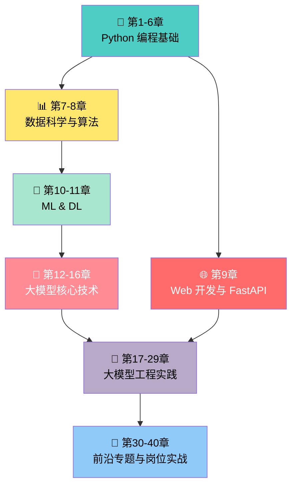
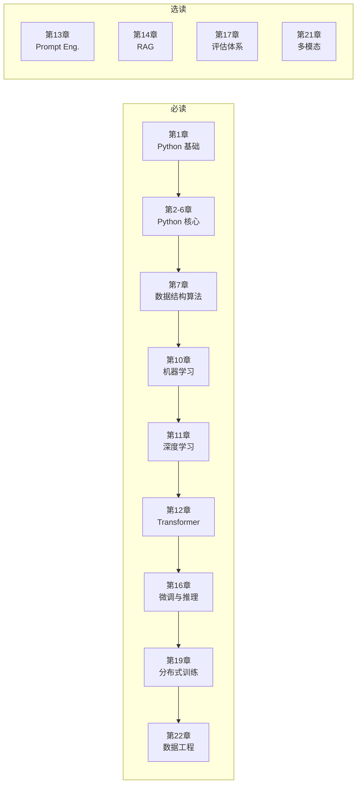
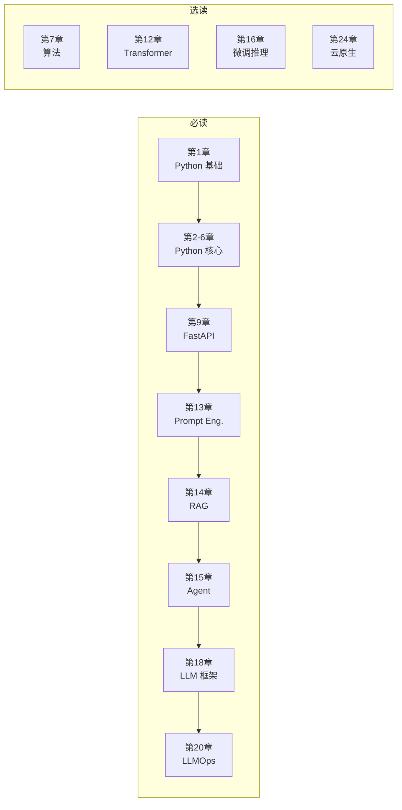
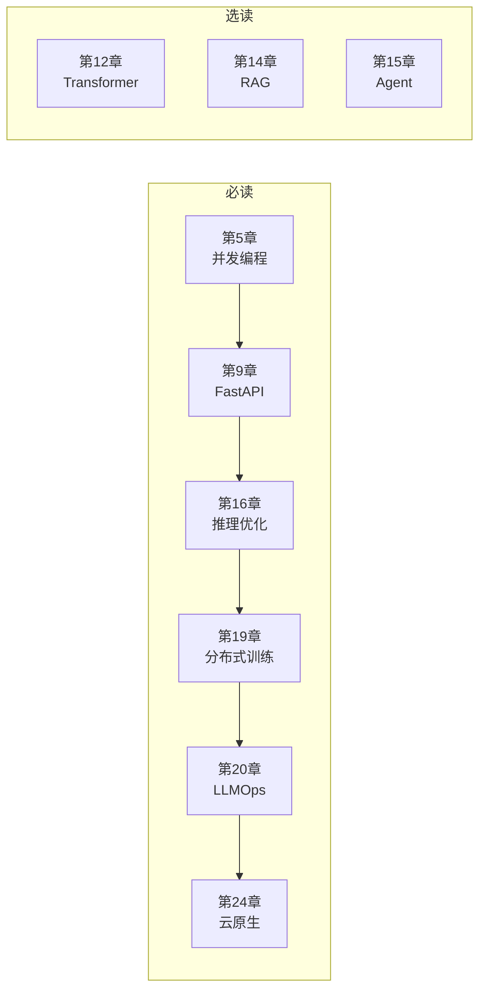
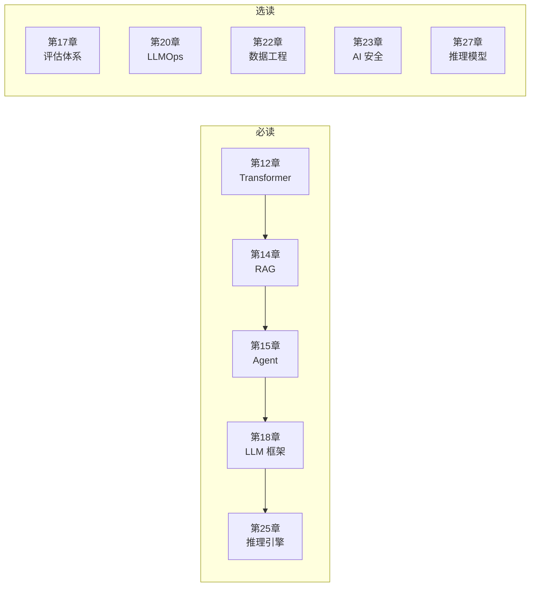
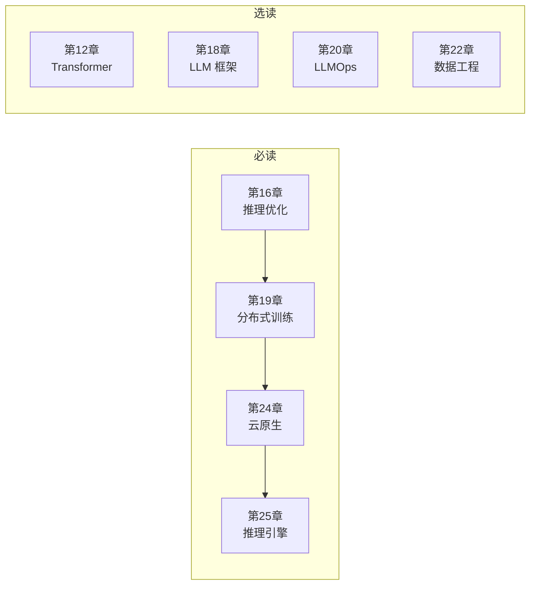
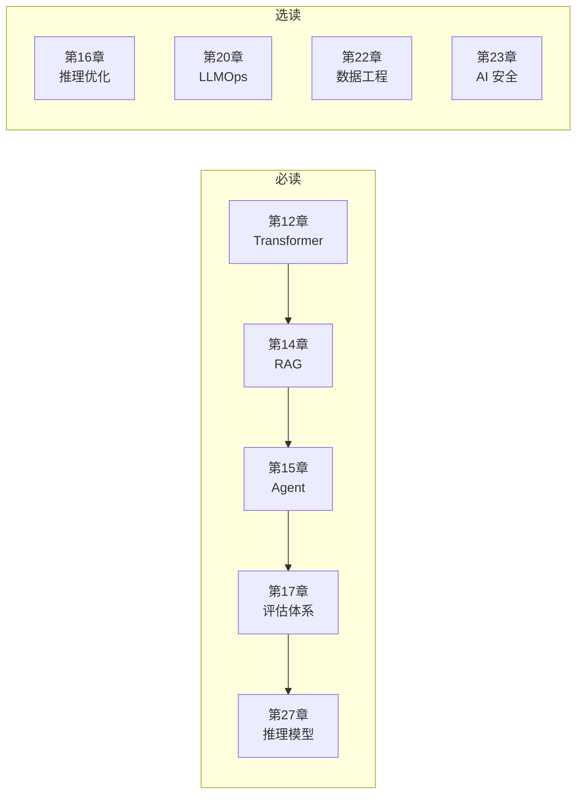
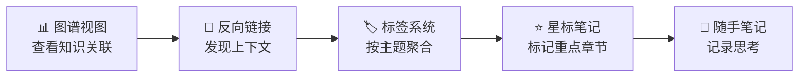

# 📚 00_目录索引 —— Python 到大模型应用面试教程

> **一句话定位**：这是一份面向 **2026 年大模型算法/工程面试** 的 Python 全栈知识库，
> 覆盖从 Python 基础、模型训练到 Agent、推理部署和岗位实战的 40 章体系。

---

## 🏛️ 一、库概览

| 维度 | 说明 |
|:---|:---|
| **库名称** | Python 到大模型应用 —— 面试教程 2026 版 |
| **总章节数** | 40 章 |
| **知识领域** | 7 大板块 |
| **难度跨度** | ⭐ 入门 → ⭐⭐⭐⭐⭐ 专家 |
| **覆盖岗位** | 大模型算法 / 应用开发 / 推理部署 / Evals / Agent |
| **时效基线** | 2026-07-31；动态事实以权威来源索引为准 |

### 推荐学习路线

```
入门阶段（1-2 周）       进阶阶段（3-6 周）        专家阶段（7-12 周）
    ┌──────┐              ┌──────┐                ┌──────┐
    │ 第1章 │──────────▶  │ 第7章 │────────────▶   │ 第12章│
    │ Python │            │数据结 │                │Transf.│
    │ 基础  │            │构算法 │                │大模型 │
    └──┬───┘              └──┬───┘                └──┬───┘
       │                     │                       │
       ▼                     ▼                       ▼
    第2-6章              第8-11章                第13-40章
  Python 核心             数据科学                 大模型工程
  面试专题               ML/DL 基础               与岗位实战
```

---

## 🧭 二、知识体系架构图

```
Python 到大模型面试教程 2026
├── 🐍 Python 编程基础
│   ├── 第1章 Python 编程基础
│   ├── 第2章 可变性与拷贝
│   ├── 第3章 面向对象编程
│   ├── 第4章 高级特性与函数式
│   ├── 第5章 并发编程
│   └── 第6章 内存管理与GC
├── 📊 数据科学与算法
│   ├── 第7章 数据结构与算法
│   └── 第8章 数据科学核心库
├── 🌐 Web 开发与工程
│   └── 第9章 Web 开发与 FastAPI
├── 🧠 机器学习与深度学习
│   ├── 第10章 机器学习基础
│   └── 第11章 深度学习与 PyTorch
├── 🤖 大模型核心技术
│   ├── 第12章 Transformer 与大模型原理
│   ├── 第13章 Prompt Engineering
│   ├── 第14章 RAG 检索增强生成
│   ├── 第15章 Agent 智能体开发
│   └── 第16章 模型微调与推理优化
└── 🔧 大模型工程实践
    ├── 第17章 大模型评估体系
    ├── 第18章 LLM 工程框架实战
    ├── 第19章 分布式训练系统
    ├── 第20章 LLMOps 与可观测性
    ├── 第21章 多模态大模型
    ├── 第22章 大模型数据工程
    ├── 第23章 AI 安全与伦理
    ├── 第24章 云原生部署与工程化
    ├── 🆕 第25章 推理引擎与高性能服务
    ├── 🆕 第26章 世界模型与具身AI
    ├── 🆕 第27章 推理模型与 Test-Time Compute
    ├── 🆕 第28章 端侧与边缘 LLM
    ├── 🆕 第29章 Context Engineering
    ├── 🆕 第30章 高效序列架构 SSM 与 Mamba
    ├── 🆕 第31章 知识编辑与模型记忆
    ├── 🆕 第32章 DeepSeek 风格 MoE 与 MLA
    ├── 🆕 第33章 训练稳定性与诊断
    ├── 🆕 第34章 Tokenizer 设计与词表工程
    ├── 🆕 第35章 生产级 Agent 记忆框架
    ├── 🆕 第36章 JAX 与 TPU 大规模预训练
    ├── 🆕 第37章 PD 分离推理架构与 KV 池化
    ├── 🆕 第38章 模型合并 MergeKit
    ├── 🆕 第39章 Computer Use 与 GUI Agent 训练
    └── 🎯 第40章 国内大模型岗位面试实战
```

### 板块架构流程图



## 🖥️ 硬件 × 章节矩阵

> 下表是进入条件，不是“拥有某档显存就保证跑通”。还要核对模型权重、许可证、驱动/CUDA、
> 引擎版本、上下文长度与并发；默认仓库验收不会访问真实 API 或下载/加载外部模型。

| 硬件 | 可跑章节 | 必装命令 |
|:---|:---|:---|
| **任意笔记本** | core + LLM 离线 mock + 标为 `mock_safe` 的本地算法 | `pip install -r requirements-llm.txt` |
| **+ 供应商 API Key** | 显式 `LLM_MOCK=0` 后运行对应真实 API 子集 | `make llm-doctor-setup`；先核对价格/地区/配额 |
| **Apple M-series** | Ch28 的 MLX/Ollama 兼容子集 | 按官方文档安装，并选择适合统一内存的模型 |
| **NVIDIA GPU** | Ch16/19/21/25/26 的兼容子集 | `make install-gpu`；显存预算包含权重、KV、激活和工作区 |
| **多 GPU / 高速互联** | DDP/FSDP、TP/EP、PD 分离等分布式子集 | 另行核对 NCCL/NIXL、拓扑与启动方式 |

## 🚀 快速开始

```bash
# 1. 克隆 + 装依赖
git clone <repo>
cd Python到大模型应用_面试教程_2026版_分章节/code
make install-llm        # 5 分钟

# 2. 可选：配置 API Key；价格、地区和配额以供应商当前页面为准
export DEEPSEEK_API_KEY=sk-xxx

# 3. 下载模型权重
make download-models-default  # 运行前查看清单、大小、许可证与剩余磁盘

# 4. 验证
export LLM_MOCK=1 && make test-llm   # mock 跑通
LLM_MOCK=0 python ch15_agent/llm/02_react_agent_from_scratch.py  # 显式真实 API
```

## 📑 三、章节详细索引

### 🐍 板块一：Python 编程基础

| # | 章节 | 难度 | 面试频率 | 核心关键词 |
|:---:|:---|:---:|:---:|:---|
| 1 | [[01_Python编程基础]] | ⭐⭐ | ⭐⭐⭐⭐⭐ | 数据结构、函数参数、LEGB、PEP 8、Python 3.13/3.14 |
| 2 | [[02_Python核心面试专题_可变性与拷贝]] | ⭐⭐⭐ | ⭐⭐⭐⭐⭐ | 可变/不可变、深拷贝/浅拷贝、循环引用、`is` vs `==` |
| 3 | [[03_Python面向对象编程]] | ⭐⭐⭐ | ⭐⭐⭐⭐⭐ | 封装继承多态、C3 线性化、`__new__` vs `__init__`、单例模式、描述符 |
| 4 | [[04_Python高级特性与函数式编程]] | ⭐⭐⭐ | ⭐⭐⭐⭐⭐ | 闭包、装饰器、生成器/迭代器、上下文管理器、itertools/functools |
| 5 | [[05_Python并发编程]] | ⭐⭐⭐⭐ | ⭐⭐⭐⭐⭐ | GIL、线程/进程/协程、asyncio、nogil、biased RC |
| 6 | [[06_Python内存管理与垃圾回收]] | ⭐⭐⭐ | ⭐⭐⭐⭐ | 引用计数、标记清除、分代回收、内存泄漏、weakref |

### 📊 板块二：数据科学与算法

| # | 章节 | 难度 | 面试频率 | 核心关键词 |
|:---:|:---|:---:|:---:|:---|
| 7 | [[07_Python数据结构与算法]] | ⭐⭐⭐⭐ | ⭐⭐⭐⭐⭐ | 链表/栈/队列/哈希表、树与图、排序、二分/双指针/滑动窗口、DP |
| 8 | [[08_Python数据科学核心库]] | ⭐⭐⭐ | ⭐⭐⭐⭐ | NumPy 广播、Pandas loc/iloc、groupby/apply、缺失值、内存优化 |

### 🌐 板块三：Web 开发与工程基础

| # | 章节 | 难度 | 面试频率 | 核心关键词 |
|:---:|:---|:---:|:---:|:---|
| 9 | [[09_Web开发与FastAPI]] | ⭐⭐⭐ | ⭐⭐⭐⭐ | FastAPI、Pydantic v2、依赖注入、流式响应 SSE、SQLAlchemy 异步 |

### 🧠 板块四：机器学习与深度学习

| # | 章节 | 难度 | 面试频率 | 核心关键词 |
|:---:|:---|:---:|:---:|:---|
| 10 | [[10_机器学习基础]] | ⭐⭐⭐ | ⭐⭐⭐⭐ | 偏差方差、XGBoost/LightGBM、SVM 核函数、ROC-AUC、交叉验证 |
| 11 | [[11_深度学习与PyTorch]] | ⭐⭐⭐⭐ | ⭐⭐⭐⭐⭐ | 反向传播、ReLU/BatchNorm、CNN/RNN/LSTM、混合精度、AdamW |

### 🤖 板块五：大模型核心技术

| # | 章节 | 难度 | 面试频率 | 核心关键词 |
|:---:|:---|:---:|:---:|:---|
| 12 | [[12_Transformer与大模型原理]] | ⭐⭐⭐⭐⭐ | ⭐⭐⭐⭐⭐ | Self-Attention、Q/K/V、MHA、Pre-LN/Post-LN、GPT/BERT、SFT/RLHF/DPO/GRPO、MoE、涌现能力 |
| 13 | [[13_Prompt_Engineering]] | ⭐⭐⭐ | ⭐⭐⭐⭐ | Few-shot、CoT、ReAct、Self-Consistency、ToT、Temperature/Top-p、Prompt 注入防御 |
| 14 | [[14_RAG检索增强生成]] | ⭐⭐⭐⭐⭐ | ⭐⭐⭐⭐⭐ | 分块策略、Embedding、HNSW/IVF、混合搜索、Re-ranking、Graph RAG、Agentic RAG、多模态 RAG |
| 15 | [[15_Agent智能体开发]] | ⭐⭐⭐⭐⭐ | ⭐⭐⭐⭐⭐ | ReAct、Function Calling、MCP 协议、A2A、记忆管理、多 Agent、Skills、Agent Teams |
| 16 | [[16_模型微调与推理优化]] | ⭐⭐⭐⭐ | ⭐⭐⭐⭐⭐ | LoRA/QLoRA、KV Cache、Flash Attention、Paged Attention、Continuous Batching、Speculative Decoding、端云协同、Test-Time Compute |

### 🔧 板块六：大模型工程实践

| # | 章节 | 难度 | 面试频率 | 核心关键词 |
|:---:|:---|:---:|:---:|:---|
| 17 | [[17_大模型评估体系]] | ⭐⭐⭐ | ⭐⭐⭐⭐ | BLEU/ROUGE/BERTScore、LLM-as-Judge、RAGAS/TruLens、Agent 评估、红队测试 |
| 18 | [[18_LLM工程框架实战]] | ⭐⭐⭐⭐ | ⭐⭐⭐⭐⭐ | LangChain/LangGraph、LlamaIndex、LLaMA-Factory、Dify、AutoGen/CrewAI |
| 19 | [[19_分布式训练系统]] | ⭐⭐⭐⭐⭐ | ⭐⭐⭐⭐⭐ | DDP/FSDP、张量并行/流水线并行、ZeRO-1/2/3、DeepSpeed、Megatron-LM、NCCL |
| 20 | [[20_LLMOps与模型可观测性]] | ⭐⭐⭐ | ⭐⭐⭐⭐ | MLflow/W&B、LangSmith/LangFuse、Prompt 版本管理、A/B 测试、CI/CD |
| 21 | [[21_多模态大模型]] | ⭐⭐⭐⭐ | ⭐⭐⭐⭐ | CLIP/ViT、LLaVA、扩散模型/DDPM/DiT、多模态 LoRA、多模态 RAG |
| 22 | [[22_大模型数据工程]] | ⭐⭐⭐ | ⭐⭐⭐⭐ | 数据去重、Self-Instruct/Evol-Instruct、SFT 数据构建、LIMA 现象、数据配比 |
| 23 | [[23_AI安全与伦理]] | ⭐⭐⭐ | ⭐⭐⭐ | Prompt Injection、越狱攻防、OWASP LLM Top 10、EU AI Act、红队测试 |
| 24 | [[24_云原生部署与工程化]] | ⭐⭐ | ⭐⭐⭐ | Docker、Kubernetes、gRPC vs REST、模型网关、GPU 调度、GitOps |
| 25 | [[25_推理引擎与高性能服务]] | ⭐⭐⭐⭐⭐ | ⭐⭐⭐⭐⭐ | vLLM/SGLang/TensorRT-LLM、PagedAttention、PD-Disaggregation、FP4/MXFP4、Speculative Decoding、MoE推理 |
| 26 | [[26_世界模型与具身AI]] | ⭐⭐⭐⭐ | ⭐⭐⭐⭐ | 世界模型 (Genie 3/Veo 3/Cosmos)、VLA (Pi0/GR00T)、LeRobot、Diffusion Policy、HIL-SERL |
| 27 | [[27_推理模型与Test-Time_Compute]] | ⭐⭐⭐⭐⭐ | ⭐⭐⭐⭐⭐ | o3/R1、Reasoning Effort、GRPO深挖、PRM/s1、RLVR、Test-Time Compute Scaling |
| 28 | [[28_端侧与边缘LLM]] | ⭐⭐⭐ | ⭐⭐⭐ | Apple MLX、GGUF、Ollama、WebGPU/WebLLM、Snapdragon Hexagon、Secure Minions |
| 29 | [[29_Context_Engineering]] | ⭐⭐⭐⭐ | ⭐⭐⭐⭐ | Haystack 2.x、Context Rot、Sub-Agent、Compaction、Prompt Caching、Memory Layers |

### 🚀 板块七：2026前沿补齐（新增）

| # | 章节 | 难度 | 面试频率 | 核心关键词 |
|:---:|:---|:---:|:---:|:---|
| 30 | [[30_高效序列架构SSM与Mamba]] | ⭐⭐⭐⭐ | ⭐⭐⭐⭐⭐ | SSM/Selective SSM、Mamba/Mamba-2、Linear Attention、RWKV、RetNet、并行扫描算法、Jamba混合架构 |
| 31 | [[31_知识编辑与模型记忆]] | ⭐⭐⭐⭐ | ⭐⭐⭐⭐ | ROME、MEMIT、知识注入、机器遗忘（Unlearning）、灾难性遗忘、Knowledge Neurons、KnowEdit/CounterFact基准 |
| 32 | [[32_DeepSeek风格MoE与MLA深度解析]] | ⭐⭐⭐⭐⭐ | ⭐⭐⭐⭐⭐ | MLA多头潜注意力、无辅助损失负载均衡、Shared Experts、Multi-Token Prediction (MTP)、FP8混合精度训练、DeepSeek-V3成本拆解 |
| 33 | [[33_训练稳定性与诊断]] | ⭐⭐⭐⭐ | ⭐⭐⭐⭐⭐ | Loss Spike根因分析、Attention Sink现象、梯度Norm监控与自适应裁剪、Checkpoint恢复流程、Muon优化器诊断、训练稳定性Checklist |
| 34 | [[34_Tokenizer设计与词表工程]] | ⭐⭐⭐⭐ | ⭐⭐⭐ | BPE/BBPE算法、SentencePiece、Unigram LM、词表大小权衡、压缩率vs下游性能、多语言适配、Tokenizer漂移 |
| 35 | [[35_生产级Agent记忆框架]] | ⭐⭐⭐⭐⭐ | ⭐⭐⭐⭐ | Mem0/Zep/Letta、四层记忆架构（Session/User Profile/Episodic/Semantic）、三因子检索（相关性+重要性+时间衰减）、记忆写入冲突与一致性 |
| 36 | [[36_JAX与TPU大规模预训练]] | ⭐⭐⭐⭐ | ⭐⭐⭐ | JAX函数式编程、grad/jit/vmap/pmap四大变换、XLA编译优化、Pathways分布式编排、Pallas自定义Kernel、MaxText参考实现、PyTorch-JAX权重转换 |
| 37 | [[37_PD分离推理架构与KV池化]] | ⭐⭐⭐⭐ | ⭐⭐⭐⭐ | Prefill-Decode分离、DistServe、Mooncake KV池化、RDMA跨节点KV传输、SGLang PD模式、与Chunked Prefill协同 |
| 38 | [[38_模型合并MergeKit]] | ⭐⭐⭐ | ⭐⭐ | Linear Merge/SLERP、Task Arithmetic、TIES、DARE、DARE-TIES、MoE合并、MergeKit工具链 |
| 39 | [[39_ComputerUse与GUIAgent训练]] | ⭐⭐⭐⭐ | ⭐⭐ | OSWorld/WebArena、ComputerRL、AutoGLM-OS、无头桌面环境、沙箱隔离、GUI Agent安全 |
| 40 | [[40_国内大模型岗位面试实战_2026]] | ⭐⭐⭐⭐⭐ | ⭐⭐⭐⭐⭐ | 国内近期JD对齐、项目六张卡、RAG漏斗评测、Agent故障语义、Post-training追问、系统设计与模拟评分 |

---

## 🎯 四、按面试岗位的学习路径

### 1. 大模型算法工程师



| 优先级 | 章节目录 | 理由 |
|:---:|:---|:---|
| **必读** | 第1-6章 | Python 基本功，基础与后端岗位常见 |
| **必读** | [[07_Python数据结构与算法]] | 手撕代码，LeetCode 是硬门槛 |
| **必读** | [[10_机器学习基础]] | ML 理论，算法岗基础 |
| **必读** | [[11_深度学习与PyTorch]] | DL 基础，重点掌握反向传播与优化器 |
| **必读** | [[12_Transformer与大模型原理]] | Attention 机制、训练流程，算法岗核心 |
| **必读** | [[16_模型微调与推理优化]] | LoRA/QLoRA、KV Cache、推理优化，高频考点 |
| **必读** | [[19_分布式训练系统]] | ZeRO、DeepSpeed、3D 并行，训练基础设施岗位常见 |
| **必读** | [[22_大模型数据工程]] | 数据质量、合成数据，2026 年热点 |
| **必读** | [[40_国内大模型岗位面试实战_2026]] | 用近期 JD/面经题型串联项目、实验与系统设计 |
| 选读 | [[13_Prompt_Engineering]] | 了解推理范式即可 |
| 选读 | [[14_RAG检索增强生成]] | 偏工程，了解架构 |
| 选读 | [[17_大模型评估体系]] | 算法岗也需关注 |
| 选读 | [[21_多模态大模型]] | 加分项，根据目标团队决定 |

### 2. 大模型应用开发工程师



| 优先级 | 章节目录 | 理由 |
|:---:|:---|:---|
| **必读** | 第1-6章 | Python 基础，写代码的基石 |
| **必读** | [[09_Web开发与FastAPI]] | API 开发，LLM 服务的基础 |
| **必读** | [[13_Prompt_Engineering]] | Prompt 设计，应用层核心技能 |
| **必读** | [[14_RAG检索增强生成]] | RAG 是 90% LLM 应用的架构 |
| **必读** | [[15_Agent智能体开发]] | Agent 是 2026 年最热方向 |
| **必读** | [[18_LLM工程框架实战]] | LangChain/LangGraph/LlamaIndex 日活工具 |
| **必读** | [[20_LLMOps与模型可观测性]] | 上线必备，实验追踪/监控/CI/CD |
| **必读** | [[40_国内大模型岗位面试实战_2026]] | 项目深挖、RAG/Agent指标与故障兜底 |
| 选读 | [[07_Python数据结构与算法]] | 视公司面试风格而定 |
| 选读 | [[12_Transformer与大模型原理]] | 了解原理有助于调试 |
| 选读 | [[16_模型微调与推理优化]] | 了解 LoRA/KV Cache 概念 |
| 选读 | [[24_云原生部署与工程化]] | Docker/K8s 工程化技能 |

### 3. 大模型推理部署工程师



| 优先级 | 章节目录 | 理由 |
|:---:|:---|:---|
| **必读** | [[05_Python并发编程]] | 异步编程、高并发推理核心 |
| **必读** | [[09_Web开发与FastAPI]] | 模型服务 API 化 |
| **必读** | [[16_模型微调与推理优化]] | KV Cache、Flash Attention、Continuous Batching、量化、端云协同 |
| **必读** | [[19_分布式训练系统]] | DeepSpeed、ZeRO、NCCL 通信 |
| **必读** | [[20_LLMOps与模型可观测性]] | 监控、告警、成本控制 |
| **必读** | [[24_云原生部署与工程化]] | Docker/K8s、gRPC、GPU 调度 |
| **必读** | [[40_国内大模型岗位面试实战_2026]] | 推理性能定位、系统设计与面试表达 |
| 选读 | [[12_Transformer与大模型原理]] | 了解模型内部结构 |
| 选读 | [[14_RAG检索增强生成]] | RAG 系统的部署需求 |
| 选读 | [[15_Agent智能体开发]] | Agent 的部署架构 |

---

## 🆕 五、2026年新岗位学习路径

> 2026 年新涌现的三大岗位方向，结合 25/26/27 三章新内容，对应 [Anthropic 2026 Hiring Trends](https://anthropic.com) 总结的工程前沿。

### 1. 大模型 Agent 工程师

聚焦「让 LLM 自主完成任务」—— MCP/A2A 协议工程化、Skills 设计、Agent 团队协同。



| 优先级 | 章节目录 | 理由 |
|:---:|:---|:---|
| **必读** | [[12_Transformer与大模型原理]] | 理解 Attention、CoT、Tool Use 的底层原理 |
| **必读** | [[14_RAG检索增强生成]] | Agent 知识获取的核心链路 |
| **必读** | [[15_Agent智能体开发]] | ReAct/MCP/A2A/Skills/Agent Teams 是岗位核心 |
| **必读** | [[18_LLM工程框架实战]] | LangGraph/CrewAI 是生产级 Agent 的事实标准 |
| **必读** | [[25_推理引擎与高性能服务]] | Agent 高并发低延迟调用的工程保障 |
| **必读** | [[40_国内大模型岗位面试实战_2026]] | 国内 Agent 岗项目追问、状态机与可靠性 |
| 选读 | [[17_大模型评估体系]] | Agent 评估 (Trajectory Eval) 是难点 |
| 选读 | [[20_LLMOps与模型可观测性]] | Agent 调试与可观测性 |
| 选读 | [[22_大模型数据工程]] | Agent 训练数据的合成 |
| 选读 | [[23_AI安全与伦理]] | Agent 越权与工具滥用防护 |
| 选读 | [[27_推理模型与Test-Time_Compute]] | Reasoning Agent 是 2026 前沿 |

### 2. 推理平台工程师 (ML Platform / SRE)

负责 GPU 集群上 LLM 的高吞吐、低延迟、成本可控服务化 —— 2026 年最稀缺岗位之一。



| 优先级 | 章节目录 | 理由 |
|:---:|:---|:---|
| **必读** | [[16_模型微调与推理优化]] | KV Cache、量化、Speculative Decoding 是基础 |
| **必读** | [[19_分布式训练系统]] | NCCL 通信、TP/PP/EP 并行原理 |
| **必读** | [[24_云原生部署与工程化]] | K8s、GPU 调度、模型网关 |
| **必读** | [[25_推理引擎与高性能服务]] | vLLM/SGLang/TensorRT-LLM、PD-Disaggregation、MoE 推理是核心 |
| 选读 | [[12_Transformer与大模型原理]] | 理解模型结构辅助调优 |
| 选读 | [[18_LLM工程框架实战]] | 框架层调度与算子融合 |
| 选读 | [[20_LLMOps与模型可观测性]] | 推理 QPS/P99/成本监控 |
| 选读 | [[22_大模型数据工程]] | Online RL/数据回流 |

### 3. 大模型评估工程师 (Evals / Reliability)

负责建立 LLM/RAG/Agent 的评估体系 —— 2026 年 AI Quality 是大厂核心 KPI。



| 优先级 | 章节目录 | 理由 |
|:---:|:---|:---|
| **必读** | [[12_Transformer与大模型原理]] | 理解模型能力边界与失败模式 |
| **必读** | [[14_RAG检索增强生成]] | RAGAS/检索评估的核心场景 |
| **必读** | [[15_Agent智能体开发]] | Agent Trajectory/Tool-use 评估是难点 |
| **必读** | [[17_大模型评估体系]] | LLM-as-Judge、Human Eval、红队测试方法论 |
| **必读** | [[27_推理模型与Test-Time_Compute]] | Reasoning 模型的 Pass@k/Consistency 评估 |
| **必读** | [[40_国内大模型岗位面试实战_2026]] | 评测口径、坏例归因与模拟面试评分 |
| 选读 | [[16_模型微调与推理优化]] | 理解推理质量与速度的权衡 |
| 选读 | [[20_LLMOps与模型可观测性]] | Eval Pipeline 与 CI 集成 |
| 选读 | [[22_大模型数据工程]] | 评估集构建 (含 contamination 检测) |
| 选读 | [[23_AI安全与伦理]] | Harm/Safety 评估 |

---

## 📈 六、按难度分级的阅读顺序

### 🟢 入门级（⭐ - ⭐⭐）

适合 Python 初学者或转行入门。

| 顺序 | 章节 | 难度 | 学习目标 |
|:---:|:---|:---:|:---|
| 1 | [[01_Python编程基础]] | ⭐⭐ | 掌握 Python 基础语法和核心数据结构 |
| 2 | [[24_云原生部署与工程化]] | ⭐⭐ | 了解 Docker/K8s 基本概念 |

### 🟡 进阶级（⭐⭐⭐）

适合有 1-2 年经验的 Python 开发者。

| 顺序 | 章节 | 难度 | 学习目标 |
|:---:|:---|:---:|:---|
| 1 | [[02_Python核心面试专题_可变性与拷贝]] | ⭐⭐⭐ | 深入理解 Python 对象模型 |
| 2 | [[03_Python面向对象编程]] | ⭐⭐⭐ | 掌握 OOP 及高级模式 |
| 3 | [[04_Python高级特性与函数式编程]] | ⭐⭐⭐ | 装饰器/生成器等高级特性 |
| 4 | [[06_Python内存管理与垃圾回收]] | ⭐⭐⭐ | 理解 Python 内存机制 |
| 5 | [[08_Python数据科学核心库]] | ⭐⭐⭐ | NumPy/Pandas 实战能力 |
| 6 | [[09_Web开发与FastAPI]] | ⭐⭐⭐ | LLM 服务 API 开发 |
| 7 | [[10_机器学习基础]] | ⭐⭐⭐ | ML 经典算法和评估 |
| 8 | [[13_Prompt_Engineering]] | ⭐⭐⭐ | Prompt 设计技巧 |
| 9 | [[17_大模型评估体系]] | ⭐⭐⭐ | LLM/RAG/Agent 评估方法 |
| 10 | [[20_LLMOps与模型可观测性]] | ⭐⭐⭐ | 上线监控和 CI/CD |
| 11 | [[22_大模型数据工程]] | ⭐⭐⭐ | 数据工程 pipeline |
| 12 | [[23_AI安全与伦理]] | ⭐⭐⭐ | LLM 安全攻防 |

### 🔴 高级（⭐⭐⭐⭐ - ⭐⭐⭐⭐⭐）

适合有 3 年以上经验或准备大厂面试。

| 顺序 | 章节 | 难度 | 学习目标 |
|:---:|:---|:---:|:---|
| 1 | [[05_Python并发编程]] | ⭐⭐⭐⭐ | 并发模型、asyncio、nogil |
| 2 | [[07_Python数据结构与算法]] | ⭐⭐⭐⭐ | LeetCode 系统刷题 |
| 3 | [[11_深度学习与PyTorch]] | ⭐⭐⭐⭐ | DL 核心原理和 PyTorch 实战 |
| 4 | [[16_模型微调与推理优化]] | ⭐⭐⭐⭐ | LoRA、KV Cache、量化部署 |
| 5 | [[18_LLM工程框架实战]] | ⭐⭐⭐⭐ | LangChain/LangGraph/LlamaIndex |
| 6 | [[21_多模态大模型]] | ⭐⭐⭐⭐ | CLIP/ViT/LLaVA/扩散模型 |
| 7 | [[12_Transformer与大模型原理]] | ⭐⭐⭐⭐⭐ | Attention 机制、训练全流程 |
| 8 | [[14_RAG检索增强生成]] | ⭐⭐⭐⭐⭐ | 检索全链路、高级 RAG 技术 |
| 9 | [[15_Agent智能体开发]] | ⭐⭐⭐⭐⭐ | MCP/A2A、多 Agent 协作 |
| 10 | [[19_分布式训练系统]] | ⭐⭐⭐⭐⭐ | ZeRO/DeepSpeed/3D 并行 |
| 11 | [[40_国内大模型岗位面试实战_2026]] | ⭐⭐⭐⭐⭐ | 把知识组织成项目证据、系统设计和压力追问答案 |

---

## 🔍 七、速查索引 —— 按面试高频考点

### A - C

| 考点 | 所在章节 | 面试频率 |
|:---|:---|:---:|
| `*args` / `**kwargs` | [[04_Python高级特性与函数式编程]] | ⭐⭐⭐⭐ |
| `__new__` vs `__init__` | [[03_Python面向对象编程]] | ⭐⭐⭐⭐⭐ |
| A2A 协议 | [[15_Agent智能体开发]] | ⭐⭐⭐⭐ |
| AdamW vs Adam | [[11_深度学习与PyTorch]] | ⭐⭐⭐⭐ |
| Agent 记忆管理 | [[15_Agent智能体开发]] | ⭐⭐⭐⭐ |
| Agent Teams | [[15_Agent智能体开发]] | ⭐⭐⭐⭐ |
| Agentic RAG | [[14_RAG检索增强生成]] | ⭐⭐⭐⭐⭐ |
| asyncio / await | [[05_Python并发编程]] | ⭐⭐⭐⭐⭐ |
| Attention 机制 | [[12_Transformer与大模型原理]] | ⭐⭐⭐⭐⭐ |
| BatchNorm vs LayerNorm | [[11_深度学习与PyTorch]] / [[12_Transformer与大模型原理]] | ⭐⭐⭐⭐⭐ |
| BERT vs GPT | [[12_Transformer与大模型原理]] | ⭐⭐⭐⭐⭐ |
| C3 线性化 | [[03_Python面向对象编程]] | ⭐⭐⭐⭐⭐ |
| Causal Mask | [[12_Transformer与大模型原理]] | ⭐⭐⭐⭐⭐ |
| CI/CD (LLM) | [[20_LLMOps与模型可观测性]] | ⭐⭐⭐⭐ |
| CLIP | [[21_多模态大模型]] | ⭐⭐⭐⭐ |
| Continuous Batching | [[16_模型微调与推理优化]] | ⭐⭐⭐⭐⭐ |
| CoT (Chain-of-Thought) | [[13_Prompt_Engineering]] | ⭐⭐⭐⭐⭐ |

### D - G

| 考点 | 所在章节 | 面试频率 |
|:---|:---|:---:|
| DDP vs DP | [[19_分布式训练系统]] | ⭐⭐⭐⭐ |
| Decoder-only 架构 | [[12_Transformer与大模型原理]] | ⭐⭐⭐⭐⭐ |
| DeepSpeed | [[19_分布式训练系统]] | ⭐⭐⭐⭐⭐ |
| DPO (Direct Preference Optimization) | [[12_Transformer与大模型原理]] / [[16_模型微调与推理优化]] | ⭐⭐⭐⭐⭐ |
| Embedding 选型 | [[14_RAG检索增强生成]] | ⭐⭐⭐⭐ |
| Flash Attention | [[16_模型微调与推理优化]] | ⭐⭐⭐⭐⭐ |
| FSDP | [[19_分布式训练系统]] | ⭐⭐⭐⭐ |
| Function Calling | [[15_Agent智能体开发]] | ⭐⭐⭐⭐⭐ |
| GIL 全局解释器锁 | [[05_Python并发编程]] | ⭐⭐⭐⭐⭐ |
| GPT 架构 | [[12_Transformer与大模型原理]] | ⭐⭐⭐⭐⭐ |
| GRPO | [[12_Transformer与大模型原理]] / [[16_模型微调与推理优化]] | ⭐⭐⭐⭐⭐ |
| gRPC vs REST | [[24_云原生部署与工程化]] | ⭐⭐⭐ |

### H - M

| 考点 | 所在章节 | 面试频率 |
|:---|:---|:---:|
| HNSW 索引 | [[14_RAG检索增强生成]] | ⭐⭐⭐⭐⭐ |
| KV Cache | [[16_模型微调与推理优化]] | ⭐⭐⭐⭐⭐ |
| LangChain vs LangGraph | [[18_LLM工程框架实战]] | ⭐⭐⭐⭐⭐ |
| LangSmith / LangFuse | [[20_LLMOps与模型可观测性]] | ⭐⭐⭐⭐⭐ |
| LEGB 规则 | [[01_Python编程基础]] / [[04_Python高级特性与函数式编程]] | ⭐⭐⭐⭐ |
| LIMA 现象 | [[22_大模型数据工程]] | ⭐⭐⭐⭐ |
| LLM-as-Judge | [[17_大模型评估体系]] | ⭐⭐⭐⭐⭐ |
| LlamaIndex | [[18_LLM工程框架实战]] | ⭐⭐⭐⭐⭐ |
| LoRA / QLoRA | [[16_模型微调与推理优化]] | ⭐⭐⭐⭐⭐ |
| LSTM / GRU | [[11_深度学习与PyTorch]] | ⭐⭐⭐⭐ |
| MCP 协议 | [[15_Agent智能体开发]] | ⭐⭐⭐⭐⭐ |
| MLOps vs LLMOps | [[20_LLMOps与模型可观测性]] | ⭐⭐⭐⭐ |
| MoE 架构 | [[12_Transformer与大模型原理]] | ⭐⭐⭐⭐ |
| Multi-Head Attention | [[12_Transformer与大模型原理]] | ⭐⭐⭐⭐⭐ |

### N - S

| 考点 | 所在章节 | 面试频率 |
|:---|:---|:---:|
| nogil (Python 3.13) | [[05_Python并发编程]] | ⭐⭐⭐⭐ |
| NumPy 广播机制 | [[08_Python数据科学核心库]] | ⭐⭐⭐⭐⭐ |
| Paged Attention | [[16_模型微调与推理优化]] | ⭐⭐⭐⭐⭐ |
| Pandas loc vs iloc | [[08_Python数据科学核心库]] | ⭐⭐⭐⭐⭐ |
| Positional Encoding | [[12_Transformer与大模型原理]] | ⭐⭐⭐⭐⭐ |
| Pre-LN vs Post-LN | [[12_Transformer与大模型原理]] | ⭐⭐⭐⭐⭐ |
| Prompt Injection 防御 | [[13_Prompt_Engineering]] / [[23_AI安全与伦理]] | ⭐⭐⭐⭐ |
| Pydantic v2 | [[09_Web开发与FastAPI]] | ⭐⭐⭐ |
| Q/K/V 机制 | [[12_Transformer与大模型原理]] | ⭐⭐⭐⭐⭐ |
| RAG 分块策略 | [[14_RAG检索增强生成]] | ⭐⭐⭐⭐⭐ |
| RAG 评估 (RAGAS) | [[17_大模型评估体系]] | ⭐⭐⭐⭐⭐ |
| ReAct 框架 | [[13_Prompt_Engineering]] / [[15_Agent智能体开发]] | ⭐⭐⭐⭐⭐ |
| Re-ranking | [[14_RAG检索增强生成]] | ⭐⭐⭐⭐⭐ |
| RLHF | [[12_Transformer与大模型原理]] / [[16_模型微调与推理优化]] | ⭐⭐⭐⭐⭐ |
| Self-Attention 公式 | [[12_Transformer与大模型原理]] | ⭐⭐⭐⭐⭐ |
| SFT (监督微调) | [[12_Transformer与大模型原理]] | ⭐⭐⭐⭐⭐ |
| Speculative Decoding | [[16_模型微调与推理优化]] | ⭐⭐⭐⭐ |
| SSE 流式响应 | [[09_Web开发与FastAPI]] | ⭐⭐⭐⭐ |
| `super()` 多继承 | [[03_Python面向对象编程]] | ⭐⭐⭐⭐⭐ |

### T - Z

| 考点 | 所在章节 | 面试频率 |
|:---|:---|:---:|
| Temperature / Top-p | [[13_Prompt_Engineering]] | ⭐⭐⭐⭐ |
| Test-Time Compute | [[12_Transformer与大模型原理]] / [[16_模型微调与推理优化]] | ⭐⭐⭐⭐⭐ |
| Transformer 完整架构 | [[12_Transformer与大模型原理]] | ⭐⭐⭐⭐⭐ |
| vLLM 部署 | [[16_模型微调与推理优化]] | ⭐⭐⭐⭐⭐ |
| weakref 弱引用 | [[06_Python内存管理与垃圾回收]] | ⭐⭐⭐ |
| XGBoost / LightGBM | [[10_机器学习基础]] | ⭐⭐⭐⭐ |
| ZeRO-1/2/3 | [[19_分布式训练系统]] | ⭐⭐⭐⭐⭐ |
| 分代回收 (GC) | [[06_Python内存管理与垃圾回收]] | ⭐⭐⭐⭐ |
| 可变/不可变类型 | [[02_Python核心面试专题_可变性与拷贝]] | ⭐⭐⭐⭐⭐ |
| 多 Agent 协作 | [[15_Agent智能体开发]] | ⭐⭐⭐⭐ |
| 多模态 RAG | [[14_RAG检索增强生成]] / [[21_多模态大模型]] | ⭐⭐⭐⭐ |
| 引用计数 | [[06_Python内存管理与垃圾回收]] | ⭐⭐⭐⭐ |
| 异步编程 asyncio | [[05_Python并发编程]] | ⭐⭐⭐⭐⭐ |
| 深拷贝 / 浅拷贝 | [[02_Python核心面试专题_可变性与拷贝]] | ⭐⭐⭐⭐⭐ |
| 混合搜索 (Hybrid Search) | [[14_RAG检索增强生成]] | ⭐⭐⭐⭐⭐ |
| 混合精度训练 (AMP) | [[11_深度学习与PyTorch]] / [[19_分布式训练系统]] | ⭐⭐⭐⭐ |
| 涌现能力 | [[12_Transformer与大模型原理]] | ⭐⭐⭐⭐ |
| 生成器 yield | [[04_Python高级特性与函数式编程]] | ⭐⭐⭐⭐⭐ |
| 端云协同部署 | [[16_模型微调与推理优化]] | ⭐⭐⭐⭐⭐ |
| 装饰器 | [[04_Python高级特性与函数式编程]] | ⭐⭐⭐⭐⭐ |
| 量子化 (GPTQ/AWQ/GGUF) | [[16_模型微调与推理优化]] | ⭐⭐⭐ |
| 闭包 | [[04_Python高级特性与函数式编程]] | ⭐⭐⭐⭐ |

---

## 💡 八、使用建议

### 1. 如何高效使用本库

| 场景 | 建议 |
|:---|:---|
| **系统学习** | 按「六、难度分级」逐步阅读；每章先看导航卡，再完成小结、自测和配套代码验收 |
| **面试突击** | 直接从「七、速查索引」定位薄弱考点，跳到对应章节精读面试题部分 |
| **项目参考** | 利用第 9/14/15/18 章的完整实战代码作为模板 |
| **查漏补缺** | 面试前对照「四、岗位路径」检查必读章节是否都已覆盖 |

### 2. Obsidian 高级用法



- **图谱视图**：打开 Obsidian 的「图谱视图」(Graph View)，可以看到各章节之间的引用关系，帮助建立知识体系
- **反向链接**：每章末尾的「🔗 相关章节」列出了交叉引用，点击反向链接面板可查看所有引用了当前章节的笔记
- **标签系统**：每章 YAML frontmatter 中的 `tags` 字段支持按主题筛选，例如搜索 `tag:Agent` 可找到所有 Agent 相关章节
- **搜索技巧**：使用 `path:14` 搜索第 14 章相关内容；使用 `tag:面试` 搜索所有面试题
- **MOC (Map of Content)**：将本页设为 Obsidian 主页或置顶，作为日常导航中枢

### 3. 学习节奏建议

| 周期 | 任务 | 产出 |
|:---:|:---|:---|
| 第 1 周 | 第 1-4 章 Python 基础 | 掌握 Python 核心面试题 |
| 第 2 周 | 第 5-6 章 并发与内存 | 能解释 GIL/GC 原理 |
| 第 3 周 | 第 7 章算法练习 | 能说明复杂度、边界条件并通过本地测试 |
| 第 4 周 | 第 8-9 章 数据科学 + Web | 能写 FastAPI 推理服务 |
| 第 5-6 周 | 第 10-11 章 ML + DL | 能推导反向传播、解释 Transformer 优势 |
| 第 7-8 周 | 第 12 章 Transformer 原理 | 能手写 Self-Attention |
| 第 9-10 周 | 第 13-16 章 大模型技术栈 | 能从 0 搭建 RAG/Agent/LoRA 微调 |
| 第 11-12 周 | 第 17-29 章工程实践 + 第 40 章项目演练 | 能设计并讲清生产级 LLM 系统 |

---

> **最后更新**：2026-08-04 | **维护者**：请随章节更新同步维护本索引

---

## 📌 快速导航

- 🧭 **主线核心章节**：[[12_Transformer与大模型原理]] | [[14_RAG检索增强生成]] | [[15_Agent智能体开发]] | [[16_模型微调与推理优化]]
- 🆕 **2026 年重点**：Python 3.14 | 自由线程 | Test-Time Compute | MCP 工程化 | A2A v1.0 | 推理优化
- 🆕 **2026 年新增章节**：[[25_推理引擎与高性能服务]] | [[26_世界模型与具身AI]] | [[27_推理模型与Test-Time_Compute]] | [[28_端侧与边缘LLM]] | [[29_Context_Engineering]]
- 🚀 **2026 前沿补齐章节**：[[30_高效序列架构SSM与Mamba]] | [[31_知识编辑与模型记忆]] | [[32_DeepSeek风格MoE与MLA深度解析]] | [[33_训练稳定性与诊断]] | [[34_Tokenizer设计与词表工程]] | [[35_生产级Agent记忆框架]] | [[36_JAX与TPU大规模预训练]] | [[37_PD分离推理架构与KV池化]] | [[38_模型合并MergeKit]] | [[39_ComputerUse与GUIAgent训练]]
- 🎯 **国内面试实战**：[[40_国内大模型岗位面试实战_2026]]（JD 对齐、项目深挖、系统设计、模拟评分）
- 📚 **权威来源**：[`docs/AUTHORITATIVE_SOURCES.md`](docs/AUTHORITATIVE_SOURCES.md)（40/40 章，核验日期 2026-07-31）
- ⚡ **核心考点**：Self-Attention / QKV | LoRA / QLoRA | RAG 完整架构 | KV Cache | ZeRO 优化 | PagedAttention | GRPO

## 🎯 配套代码与验收问答

> 当前配套代码共 433 个 `.py` 文件。离线、真实 API 和 GPU 是不同验收层，
> 不以历史提交数或远端徽章替代当前命令结果。

**Q1: 配套代码用 mock 还是真实 API?**
A: `run_all_examples.py --tier llm` 默认设置 `LLM_MOCK=1` 做确定性离线验收；
真实 API 必须显式设置 `LLM_MOCK=0` 和相应密钥，并单独执行 `llm-doctor --real-api`。

**Q2: 我只有 Mac (Apple Silicon), 能跑哪些章节真实例子?**
A: Ch28 端侧 (MLX/Ollama) 是首选, `brew install ollama && ollama pull llama3.2:3b` 即可真跑端侧推理. 其余 Ch13-18 章节通过 DeepSeek API 跑 (Mac 不需要本地 GPU). 详见上方「硬件 × 章节矩阵」.

**Q3: 跑 RAG 评估需要哪些前置?**
A: 三件套: ① `pip install ragas sentence-transformers` ② `export DEEPSEEK_API_KEY=sk-xxx` (LLM judge) ③ `make download-models-default` 拿 bge-small-zh 跑本地 embedding. 然后 `python ch17_evaluation/llm/06_ragas_evaluation.py` 真跑. 详见 [[17_大模型评估体系]].

**Q4: 配套代码 433 个 .py 怎么管理依赖?**
A: 三层依赖策略: `requirements-core.txt` (30s 装) + `requirements-llm.txt` (+5min) + `requirements-gpu.txt` (+30min). 对应 `make install-{core,llm,gpu}` 命令. 80% 章节例子在 core/llm 层级可跑, Ch25-28 GPU 例子需独立安装. 详见 `code/README.md`.

**Q5: 测试如何组织? 有没有 CI?**
A: `code/tests/` 运行单元与冒烟测试；`verify.yml` 分别执行 10 项仓库检查、
158 个 core 示例和 199 个 LLM mock 示例。多 GPU 与真实 API 使用独立、显式触发的工作流。

---

*本索引是活的导航文档。当你深入学习某个主题时，欢迎回到这里，通过「图谱视图」发现知识之间的隐藏联系。*
