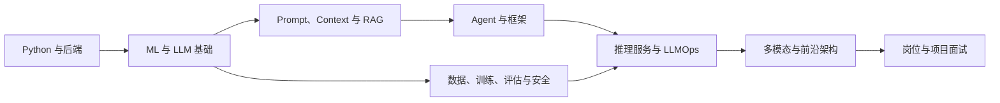

# Python 到大模型应用：54 章目录索引

> [!abstract] 教程定位
> 这是一套面向 2026 年 Python、LLM 应用、训练与 AI Infra 岗位的中文教程。54 章按依赖关系组织，正文事实基线为 2026-07-31，分章结构复核于 2026-08-05。

| 指标 | 当前值 |
|---|---:|
| 教程章节 | 54 章 |
| 知识分部 | 8 大部分 |
| 代码伴侣目录 | 29 个 |
| 可运行示例 | 433 个 |
| 具备代码覆盖的规范章节 | 45/54 |

图中的箭头表示主要先修关系，不表示只能线性阅读。应用工程读者可在完成 Ch01–Ch18 后进入 RAG/Agent 主线；训练与 Infra 读者应先完成 Ch11–Ch16。

## 第一部分 Python 与后端工程基础

> 学习产出：建立能运行、能调试、能服务化的 Python 基座。

| 章 | 主题 | 章内推进 | 代码 |
|---:|---|---|---:|
| 01 | [[01_Python运行时与工程环境]] | Python 语言概览与安装环境 → 异常处理与编程规范 | 11 个 |
| 02 | [[02_Python对象模型与可变性]] | 基础语法速通 → 核心数据结构 → 可变类型与不可变类型 | 25 个 |
| 03 | [[03_Python函数作用域与装饰器]] | 函数与模块 → 闭包 Closure → 装饰器 Decorator | 14 个 |
| 04 | [[04_Python迭代协议与函数式编程]] | 生成器与迭代器 → 上下文管理器 → 迭代工具与函数式编程 | 7 个 |
| 05 | [[05_Python面向对象与数据模型]] | 类与对象基础 → 面向对象三大特性 → 多继承与 C3 线性化算法 | 15 个 |
| 06 | [[06_Python内存管理与性能诊断]] | 内存管理机制 → 垃圾回收机制 → 内存泄漏与调试 | 9 个 |
| 07 | [[07_Python并发编程]] | GIL 全局解释器锁 → 进程、线程、协程核心区别 → 多线程编程 threading | 17 个 |
| 08 | [[08_Python数据结构与算法]] | 基础数据结构 → 树与图 → 排序算法 | 11 个 |
| 09 | [[09_NumPy与Pandas数据处理]] | NumPy → Pandas → 数据可视化 | 13 个 |
| 10 | [[10_FastAPI与后端服务]] | Python Web 框架对比 → FastAPI 核心特性 → 实战：构建 API 服务 | 6 个 |

## 第二部分 机器学习与大模型基础

> 学习产出：从传统机器学习推进到 Tokenizer、Attention 与 Transformer。

| 章 | 主题 | 章内推进 | 代码 |
|---:|---|---|---:|
| 11 | [[11_机器学习基础]] | 机器学习概述 → 经典监督学习算法 → 集成学习 | 13 个 |
| 12 | [[12_深度学习与PyTorch]] | 神经网络基础 → PyTorch 核心 → CNN 卷积神经网络 | 11 个 |
| 13 | [[13_Tokenizer与词表工程]] | BPE/BBPE 算法原理 → SentencePiece 与 Unigram LM → 词表大小权衡：压缩率 vs 下游性能 | 设计题/跨章示例 |
| 14 | [[14_Attention数学与张量形状]] | 从 RNN 到 Attention → Self-Attention 自注意力机制 → Multi-Head Attention | 2 个 |
| 15 | [[15_Transformer架构与实现]] | Transformer 完整架构 → 三种 Transformer 变体 → 完整 Transformer PyTorch 实现 | 3 个 |
| 16 | [[16_大模型预训练解码与模型选型]] | 大模型训练流程 → 大模型核心概念 → 截至 2026-07-31 的官方模型信息与选型 | 设计题/跨章示例 |

## 第三部分 Prompt、Context 与 RAG

> 学习产出：构建外部知识增强和可评估的检索生成闭环。

| 章 | 主题 | 章内推进 | 代码 |
|---:|---|---|---:|
| 17 | [[17_Prompt_Engineering]] | Prompt 设计基础 → 高级 Prompt 技巧 → 采样参数与生成控制 | 13 个 |
| 18 | [[18_Context_Engineering]] | 上下文缓存与成本控制 → 从 Prompt 到 Context → Context 的四大组成 | 12 个 |
| 19 | [[19_RAG数据解析分块与索引]] | RAG 概述与价值 → RAG 完整架构 → 文档处理与分块策略 | 10 个 |
| 20 | [[20_RAG检索重排与高级方法]] | 检索与重排序 → 高级 RAG 技术 | 5 个 |
| 21 | [[21_生产级RAG系统]] | RAG 与 Agent 的融合（2026年趋势） → 多模态 RAG → 2026年新RAG模式 | 10 个 |

## 第四部分 Agent 与工程框架

> 学习产出：把模型、工具、状态和人类审批组织成可恢复系统。

| 章 | 主题 | 章内推进 | 代码 |
|---:|---|---|---:|
| 22 | [[22_Agent基础与工具调用]] | Agent 基础概念 → ReAct 框架 → Function Calling | 6 个 |
| 23 | [[23_MCP_A2A与Skills协议生态]] | MCP 协议 → 协议与 Skills 关系 → A2A 与 Skills 生态 | 4 个 |
| 24 | [[24_Agent工作流编排与多智能体]] | 多 Agent 协作系统 → AutoGen / CrewAI 多 Agent 框架 → Human-in-the-Loop 工作流 | 7 个 |
| 25 | [[25_可恢复Agent运行时]] | Agent 开发实战 → 失败语义、幂等与人工确认 → Durable Execution | 2 个 |
| 26 | [[26_Agent记忆与个性化]] | Agent 记忆管理 → 生产级记忆框架 → 记忆系统设计 | 12 个 |
| 27 | [[27_LLM框架与平台选型]] | LangChain 核心 → LangGraph 状态图工作流 → LlamaIndex 数据索引与检索 | 25 个 |
| 28 | [[28_ComputerUse与GUIAgent]] | Computer Use 提示设计 → Computer-Use 任务定义与基准 → OSWorld 基准详解 | 2 个 |

## 第五部分 数据、训练、对齐、评估与安全

> 学习产出：建立从数据到上线门禁的模型能力改造闭环。

| 章 | 主题 | 章内推进 | 代码 |
|---:|---|---|---:|
| 29 | [[29_大模型数据工程]] | 数据工程全景 → 语料采集与清洗 → 数据增强与合成数据 | 13 个 |
| 30 | [[30_SFT_LoRA与QLoRA]] | 微调概述 → LoRA 与 QLoRA → LLaMA-Factory 全栈微调 | 4 个 |
| 31 | [[31_偏好对齐与强化学习]] | 对齐技术 → RL Post-Training 专题 | 5 个 |
| 32 | [[32_推理模型与Test_Time_Compute]] | Extended Thinking 与推理提示 → 推理时计算（Test-Time Compute） → 推理模型数据工程 | 16 个 |
| 33 | [[33_大模型分布式训练]] | 分布式训练概述 → 数据并行 → 模型并行 | 11 个 |
| 34 | [[34_JAX_XLA与TPU预训练]] | JAX 编程模型：函数式、纯函数、变换 → XLA：加速线性代数编译器 → Pallas：自定义加速器 Kernel | 设计题/跨章示例 |
| 35 | [[35_训练稳定性与诊断]] | Loss Spike 根因分析 → Attention Sink 现象 → Gradient Norm 监控与裁剪 | 设计题/跨章示例 |
| 36 | [[36_大模型评估基础]] | 评估概述：为什么LLM评估与传统ML不同 → 自动评估指标 → LLM-as-Judge 评估范式 | 6 个 |
| 37 | [[37_RAG_Agent与安全评估]] | RAG 评估与优化 → RAG 评估体系 → Agent 评估 | 9 个 |
| 38 | [[38_大模型与Agent安全]] | Prompt 安全与防御 → Agent 工程安全防线 → Agent 沙箱执行 | 16 个 |
| 39 | [[39_AI隐私伦理与治理]] | 偏置检测与公平性 → 数据隐私 → AI治理与法规 | 5 个 |

## 第六部分 推理服务与 LLMOps

> 学习产出：优化数据面并建设可交付、可观测的生产系统。

| 章 | 主题 | 章内推进 | 代码 |
|---:|---|---|---:|
| 40 | [[40_推理内存量化与批处理]] | 推理优化技术 → 模型量化与压缩 → 推理核心原理 | 8 个 |
| 41 | [[41_高性能推理引擎与服务]] | 模型部署 → 推理引擎的集群化集成 → 主流推理引擎对比 | 8 个 |
| 42 | [[42_PD分离推理与KV池化]] | PD 分离集群部署 → PD 分离动机：Prefill vs Decode 差异 → DistServe：早期代表性 PD 分离系统（OSDI 2024）⭐⭐⭐⭐ | 1 个 |
| 43 | [[43_云原生部署与模型网关]] | 云原生概述 → Docker 容器化模型服务 → Kubernetes 编排与弹性扩缩 | 5 个 |
| 44 | [[44_LLMOps生命周期与持续交付]] | LLMOps 全景概述 → 实验追踪 → Prompt 版本管理与A/B测试 | 10 个 |
| 45 | [[45_大模型可观测性与SRE]] | LLM可观测性 → 模型监控与告警 → OpenTelemetry GenAI 语义约定（截至 2026-07-31）⭐⭐⭐⭐⭐ | 16 个 |
| 46 | [[46_端侧浏览器与边缘LLM]] | 端云协同部署架构（2026年面试热点） → 异构硬件与端云运行时 → 硬件可移植性 | 15 个 |

## 第七部分 多模态与前沿架构

> 学习产出：理解多模态、具身和非标准架构的证据边界。

| 章 | 主题 | 章内推进 | 代码 |
|---:|---|---|---:|
| 47 | [[47_多模态表征与多模态大模型]] | 多模态概述 → CLIP与对比学习 → 视觉Transformer（ViT） | 6 个 |
| 48 | [[48_扩散模型与生成式视觉]] | 扩散模型基础 | 1 个 |
| 49 | [[49_世界模型VLA与具身智能]] | 世界模型与Diffusion LLM → 具身智能全景 → VLA 模型（Vision-Language-Action） | 13 个 |
| 50 | [[50_SSM_Mamba与非Transformer架构]] | SSM 理论基础 → Selective SSM 与 Mamba → Mamba-2 与状态空间对偶性 | 设计题/跨章示例 |
| 51 | [[51_MoE_MLA_MTP与DeepSeek架构]] | DeepSeek 风格架构深化 → MLA：Multi-head Latent Attention → Auxiliary-loss-free 负载均衡 | 设计题/跨章示例 |
| 52 | [[52_知识编辑持续学习与机器遗忘]] | 问题定义 → ROME / MEMIT 算法 → 知识注入与持续学习 | 设计题/跨章示例 |
| 53 | [[53_模型合并与权重空间]] | 模型合并动机：权重空间组合 → 基础算法：Linear Merge 与 SLERP → 高级算法：Task Arithmetic、TIES、DARE | 设计题/跨章示例 |

## 第八部分 岗位与项目面试实战

> 学习产出：把知识转成可验证项目证据和系统设计表达。

| 章 | 主题 | 章内推进 | 代码 |
|---:|---|---|---:|
| 54 | [[54_国内大模型岗位与项目面试实战_2026]] | 近期岗位信号：从“会调 API”转向“可稳定交付” → 项目深挖：用“六张卡”组织回答 → RAG 高频深挖：从总分转向漏斗归因 | 设计题/跨章示例 |

## 按目标选择学习路线

| 目标 | 建议顺序 | 验收产出 |
|---|---|---|
| LLM 应用 / RAG | Ch01–Ch18 → Ch19–Ch21 → Ch36–Ch37 → Ch43–Ch45 → Ch54 | 可回归 RAG、Golden Dataset、指标漏斗和上线门禁 |
| Agent 工程 | Ch17–Ch18 → Ch22–Ch28 → Ch37–Ch39 → Ch44–Ch45 → Ch54 | 可恢复状态机、幂等工具、副作用治理和轨迹评测 |
| Post-training | Ch11–Ch16 → Ch29–Ch35 → Ch36–Ch39 → Ch51–Ch53 | 数据配比、SFT/偏好优化、分布式训练和稳定性诊断 |
| 推理 / AI Infra | Ch14–Ch16 → Ch33–Ch35 → Ch40–Ch46 → Ch51 | TTFT/TPOT、KV Cache、引擎压测、K8s 与可观测性 |
| 多模态 / 具身 | Ch11–Ch16 → Ch21 → Ch47–Ch49 → Ch36–Ch39 | 多模态表征、生成、VLA 数据与安全评估 |

## 16 周建议节奏

| 周期 | 范围 | 通过条件 |
|---|---|---|
| 第 1–3 周 | Ch01–Ch10 | 能独立编写、测试并服务化 Python 程序 |
| 第 4–5 周 | Ch11–Ch16 | 能跟踪张量形状并解释训练与解码数据流 |
| 第 6–7 周 | Ch17–Ch21 | 完成一个可评估、可追踪来源的 RAG 最小系统 |
| 第 8–9 周 | Ch22–Ch28 | 完成一个可恢复、有权限边界的 Agent 工作流 |
| 第 10–12 周 | Ch29–Ch39 | 能设计数据、训练、评估和安全门禁 |
| 第 13–14 周 | Ch40–Ch46 | 能定位推理性能和线上可靠性问题 |
| 第 15 周 | Ch47–Ch53 | 能区分论文机制、产品能力与工程成熟度 |
| 第 16 周 | Ch54 | 完成项目陈述、系统设计和模拟面试 |

## 维护入口

- [[docs/RECHAPTERING_MAP|54 章重构迁移表]]
- [[docs/CHAPTER_STYLE_GUIDE|章节叙事与格式规范]]
- [[docs/AUTHORITATIVE_SOURCES|章节权威来源索引]]
- [`code/TOPIC_MANIFEST.json`](code/TOPIC_MANIFEST.json)：稳定主题 ID 与代码归属
- [[99_库健康检查报告|库健康检查报告]]
