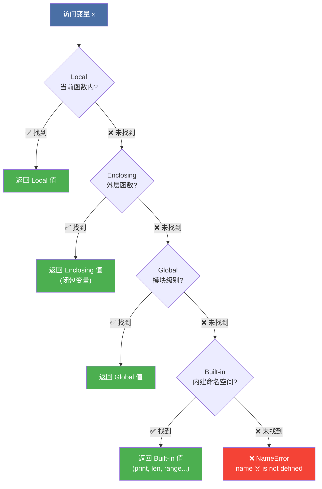

# 第 1 章 Python 编程基础

> **面试频率**: ⭐⭐⭐ | **内容深度**: 基础 + 面试陷阱
>
> 本章覆盖 Python 最核心的基础语法与数据结构，是所有后续章节的根基。基础语法本身面试深度有限，但面试官常通过**数据结构陷阱题**和**参数传递辨析**来考察候选人对 Python 底层语义的理解。

---

## 1.1 Python 语言概览与安装环境 ⭐

### 1.1.1 Python 的诞生与设计哲学

Python 由 Guido van Rossum 于 1991 年发布，其设计哲学强调代码的可读性和简洁性。Python 之禅（The Zen of Python）通过 `import this` 可以查看，核心原则包括：

> "Explicit is better than implicit."（显式优于隐式）
> "Simple is better than complex."（简洁优于复杂）

Python 的主要应用领域：

| 领域 | 代表库/框架 | 典型应用 |
|------|-----------|---------|
| Web 后端 | FastAPI、Django、Flask | RESTful API、微服务 |
| 数据科学 | NumPy、Pandas、Matplotlib | 数据分析、可视化 |
| 机器学习 | Scikit-learn、PyTorch、TensorFlow | 模型训练、深度学习 |
| 大模型应用 | LangChain、LlamaIndex、Transformers | RAG、Agent 开发 |
| 自动化运维 | Ansible、Fabric、Celery | 脚本、定时任务 |

### 1.1.2 Python 3.13 新特性（面试加分项）⭐⭐

Python 3.13（2024 年 10 月发布）带来了多项重要更新，是 2025-2026 年面试中的新兴考点：

```python
"""
Python 3.13 核心新特性速览
（以下代码需在 Python 3.13+ 环境中运行）
"""

# 1. 实验性 no-GIL 模式（自由线程）— PEP 703
#    2026年状态：已可通过官方实验性构建体验，生产环境尚不建议
#    编译时启用：--disable-gil
#    运行时检测：
import sys
if hasattr(sys, '_is_gil_enabled'):
    print(f"GIL 状态: {sys._is_gil_enabled()}")  # True/False

# 2. 改进的交互式解释器（彩色高亮、多行编辑）

# 3. 实验性 JIT 编译器（性能提升 2-9%，基于复制解释的即时编译）

# 4. 新的类型标注语法（PEP 702 警告废弃）
from warnings import deprecated

@deprecated("请使用 new_func() 替代")
def old_func():
    return "deprecated"

# 5. iOS 和 Android 官方支持（移动端 Python）

# 6. os.register_at_fork() 的清理机制改进
```

**面试关键考点**：no-GIL 模式允许 Python 真正利用多核 CPU，多线程不再受 GIL 限制。这使得 Python 3.13+ 在 CPU 密集型任务中**有望**不再需要多进程方案。但截至 2026 年，nogil 仍为实验性功能，需专门编译启用，主流发行版尚未默认支持。

> 🆕 **2026年更新**：Python 3.13 的 nogil 模式已从"前瞻概念"进入"实验可用"阶段。PEP 703 已被接受，社区正在推进 C 扩展的线程安全适配。面试中需能解释 nogil 的底层实现原理（biased reference counting + 线程本地内存分配器）。

---

### 🆕 1.1.3 Python 3.14 新特性前瞻（2026年面试新考点）⭐⭐

Python 3.14 预计于 **2026 年 10 月**发布，是 Python 社区近年来的又一个里程碑版本。以下是已确认的核心新特性：

#### 1. REPL 革命性改进（无需配置，开箱即用）

Python 3.14 的交互式解释器获得重大升级：

```python
"""
🆕 Python 3.14 REPL 新特性（无需任何第三方库）
"""

# 1. 默认语法高亮 — 关键字、字符串、注释等自动着色
#    >>> def hello(name: str) -> str:
#    ...     return f"Hello, {name}!"
#    ...                    # ↑ 字符串高亮显示

# 2. 多行编辑 — 支持在历史和当前输入中跨行编辑
#    使用 Alt+Enter 或 Esc+Enter 插入新行，不再强制立即执行

# 3. 历史搜索增强 — 支持 Ctrl+R 反向搜索命令历史
#    (类似 bash/zsh 的 reverse-i-search)

# 4. 智能粘贴模式 — 粘贴多行代码时自动识别，避免逐行执行
#    （bracketed paste 支持）

# 5. 帮助文档直接显示 — help() 输出支持分页和语法高亮
```

| 特性 | Python 3.13 及之前 | Python 3.14 |
|------|-------------------|-------------|
| 语法高亮 | 不支持（需 IPython/bpython） | ✅ 原生支持 |
| 多行编辑 | ❌ 不支持 | ✅ Alt+Enter 插入新行 |
| 历史搜索 | ↑↓ 逐条浏览 | ✅ Ctrl+R 模糊搜索 |
| 粘贴模式 | 可能逐行执行出错 | ✅ 智能识别 |
| 帮助显示 | 纯文本 | ✅ 高亮+分页 |

#### 2. 解释器性能优化

```python
"""
🆕 Python 3.14 性能层面的改进
"""

# 1. f-string 解析优化：PEP 701 引入的语法在 3.14 中进一步提速
#    f"Hello {name}!" 的解析效率在嵌套场景下提升明显

# 2. __attribute__((noinline)) 等编译器提示优化 CPython 性能

# 3. 字典和列表的内部实现微优化，减少内存碎片

# 4. comptime（编译期求值）— 实验性功能
#    允许在编译时计算常量表达式，减少运行时开销
#    from __future__ import comptime  # 可能的使用方式（待定）
```

#### 3. 类型系统增强

```python
"""
🆕 Python 3.14 类型注解改进
"""

# 1. 泛型类型别名语法 — 使用 type 语句（PEP 695 的延伸）
from typing import TypeVar

T = TypeVar('T')

# Python 3.12+ 方式
# Point = tuple[float, float]

# 3.14 支持的更清晰语法
# type Point[T] = tuple[T, T]  # 泛型类型别名

# 2. 更完善的 TypedDict 和 dataclass 互操作

# 3. 类型收窄（Type Narrowing）行为改进
#    isinstance()  narrowing 在更多场景下生效

# 4. 更好的错误信息 — 类型相关报错信息更精确
```

#### 4. 开发者体验改进

```python
"""
🆕 Python 3.14 开发者体验（DX）改进
"""

# 1. 更精确的错误位置提示
#    异常追踪现在能指向更精确的表达式位置

# 2. 弃用警告改进 — @warnings.deprecated 的装饰器增强

# 3. 模块级 __getattr__ 的类型推断改进

# 4. 新的 warnings 过滤选项
#    python -W error::DeprecationWarning script.py
```

**面试要点**：Python 3.14 的核心主题是**开发者体验**。REPL 的改进使得 IPython 不再是必需；性能优化延续了"每版本提速"的趋势；类型系统继续追赶 TypeScript 的表达能力。面试中提及这些新特性能展示你对 Python 生态的持续关注。

### 1.1.4 虚拟环境管理 ⭐⭐

虚拟环境是项目隔离的标准实践，面试中常考察工具选择和使用场景：

```python
"""
虚拟环境管理：venv vs conda 对比
"""

# ┌─────────────────────────────────────────────────────────────┐
# │                    虚拟环境工具选择                           │
# ├─────────────────────────────────────────────────────────────┤
# │                                                             │
# │   纯 Python 项目 ──────→ python -m venv .venv              │
# │   (Web后端/脚本)           标准库内置，轻量                   │
# │                                                             │
# │   数据科学/AI 项目 ────→ conda create -n myenv python=3.12 │
# │   (NumPy/PyTorch)        管理非 Python 依赖（CUDA等）        │
# │                                                             │
# │   生产部署 ────────────→ poetry / pipenv                   │
# │                            精确锁定依赖版本                   │
# │                                                             │
# └─────────────────────────────────────────────────────────────┘

# venv 标准用法
import subprocess

def setup_venv(project_dir: str) -> None:
    """创建并激活虚拟环境的标准流程"""
    commands = [
        f"cd {project_dir}",
        "python -m venv .venv",                    # 创建环境
        "source .venv/bin/activate",               # Linux/Mac 激活
        # ".venv\\Scripts\\activate",              # Windows 激活
        "pip install --upgrade pip",
        "pip install -r requirements.txt",
    ]
    print("执行命令序列：")
    for cmd in commands:
        print(f"  $ {cmd}")

# conda 环境管理（数据科学项目推荐）
def setup_conda(env_name: str, python_version: str = "3.12") -> None:
    """创建 conda 环境的标准流程"""
    commands = [
        f"conda create -n {env_name} python={python_version} -y",
        f"conda activate {env_name}",
        "conda install numpy pandas pytorch -c pytorch",  # 安装带 CUDA 的 PyTorch
    ]
    print("执行命令序列：")
    for cmd in commands:
        print(f"  $ {cmd}")
```

---

## 1.2 基础语法速通 ⭐⭐

### 1.2.1 变量与数据类型

Python 是**动态类型**语言，变量类型在运行时确定。理解每个类型的底层实现对面试至关重要。

```python
"""
Python 基础数据类型与内存行为
"""

# ─────────────────────────────────────────────────────────────
# 不可变类型（Immutable）— 创建后不可修改，修改会创建新对象
# ─────────────────────────────────────────────────────────────

# int — 任意精度整数（无溢出限制）
a = 10           # 小整数被缓存（-5 ~ 256）
b = 10
print(a is b)    # True — 缓存复用

c = 1000
d = 1000
print(c is d)    # False — 大整数不缓存

# float — 双精度浮点数（IEEE 754，64位）
pi = 3.14159
print(f"float 精度: {pi:.15f}")  # 约 15-17 位有效数字

# 浮点数精度问题（面试常考陷阱）
print(0.1 + 0.2 == 0.3)         # False！
print(f"0.1 + 0.2 = {0.1 + 0.2:.17f}")  # 0.30000000000000004
# 正确做法：使用 decimal 模块或允许误差
import math
print(math.isclose(0.1 + 0.2, 0.3))  # True

# str — Unicode 字符串，不可变
s = "hello"
# s[0] = "H"  # TypeError: 'str' object does not support item assignment
s = "H" + s[1:]  # 合法：创建新字符串

# bool — True/False，是 int 的子类
print(True + True)   # 2
print(isinstance(True, int))  # True

# None — 空值，单例对象
print(type(None))    # <class 'NoneType'>

# ─────────────────────────────────────────────────────────────
# 可变类型（Mutable）— 创建后可原地修改
# ─────────────────────────────────────────────────────────────

# list — 动态数组（底层是过度分配的数组）
lst = [1, 2, 3]
lst.append(4)        # 原地修改，id(lst) 不变

# dict — 哈希表（Python 3.7+ 保持插入顺序）
d = {"a": 1, "b": 2}
d["c"] = 3           # 原地修改

# set — 哈希集合，无序不重复
se = {1, 2, 3}
se.add(4)            # 原地修改
```

### 1.2.2 运算符与表达式

```python
"""
运算符优先级与特殊运算符
"""

# ─────────────────────────────────────────────────────────────
# 身份运算符 is / is not（面试高频考点）
# ─────────────────────────────────────────────────────────────

# is 比较内存地址，== 比较值
a = [1, 2, 3]
b = [1, 2, 3]
print(a == b)   # True — 值相等
print(a is b)   # False — 内存地址不同

# None 比较必须用 is
def check_none(x):
    """判断 None 的正确方式"""
    if x is None:      # ✅ 正确
        return "是 None"
    # if x == None:    # ❌ 不规范
    return "不是 None"

# ─────────────────────────────────────────────────────────────
# 短路求值（and / or）
# ─────────────────────────────────────────────────────────────

def get_fallback(value, default):
    """利用 or 短路求值提供默认值"""
    return value or default  # value 为 falsy 时返回 default

# falsy 值：0, 0.0, "", [], {}, set(), None, False
print(get_fallback("", "default"))    # "default"
print(get_fallback("hello", "def"))    # "hello"
print(get_fallback(0, 42))            # 42

# 安全获取嵌套字典值（Python 3.8+ 海象运算符 :=）
def get_nested(data: dict, key1: str, key2: str):
    """使用海象运算符简化嵌套获取"""
    if (inner := data.get(key1)) is not None:
        return inner.get(key2)
    return None

# 海象运算符在 while 循环中的应用
numbers = [3, 1, 4, 1, 5, 9]
it = iter(numbers)
# 传统写法需要两次 next() 调用
# while True:
#     n = next(it, None)
#     if n is None: break
#     print(n)
# 海象运算符版本更简洁
# while (n := next(it, None)) is not None:
#     print(n)
```

### 1.2.3 流程控制

```python
"""
流程控制：条件与循环
"""

# ─────────────────────────────────────────────────────────────
# 条件语句 — 面试陷阱：三目运算符
# ─────────────────────────────────────────────────────────────

# Python 三目运算符（条件表达式）
# 语法：value_if_true if condition else value_if_false
age = 20
status = "成年" if age >= 18 else "未成年"  # ✅ 简洁写法

# 链式比较（Python 特色）
x = 5
print(1 < x < 10)    # True — 等价于 1 < x and x < 10
print(1 < x > 3)     # True — 可读性差，不推荐

# ─────────────────────────────────────────────────────────────
# for 循环 — 遍历序列
# ─────────────────────────────────────────────────────────────

# enumerate() — 同时获取索引和值
fruits = ["apple", "banana", "cherry"]
for idx, fruit in enumerate(fruits, start=1):  # start 参数指定起始编号
    print(f"{idx}. {fruit}")

# zip() — 并行遍历多个序列
names = ["Alice", "Bob", "Charlie"]
scores = [85, 92, 78]
for name, score in zip(names, scores):
    print(f"{name}: {score}")

# zip 长度不一致时的处理
from itertools import zip_longest
a = [1, 2, 3]
b = ["a", "b"]
for x, y in zip_longest(a, b, fillvalue="N/A"):
    print(x, y)  # 1 a / 2 b / 3 N/A

# ─────────────────────────────────────────────────────────────
# break / continue / else（for-else 是面试常考点）
# ─────────────────────────────────────────────────────────────

def find_prime(n: int) -> bool:
    """
    for-else 结构：循环正常结束（未 break）时执行 else
    用于判断循环是否因 break 而中断
    """
    if n < 2:
        return False
    for i in range(2, int(n ** 0.5) + 1):
        if n % i == 0:
            print(f"{n} = {i} × {n // i}")
            break
    else:
        # 循环未 break 执行到这里 → n 是质数
        print(f"{n} 是质数")
        return True
    return False

find_prime(17)   # 17 是质数
find_prime(15)   # 15 = 3 × 5
```

### 1.2.4 文件操作与上下文管理

```python
"""
文件操作最佳实践
"""

# ─────────────────────────────────────────────────────────────
# with 语句 — 自动关闭文件（面试必考）
# ─────────────────────────────────────────────────────────────

# ✅ 正确写法：with 语句确保资源释放
def read_file_safe(filepath: str) -> str:
    """安全读取文件内容"""
    try:
        with open(filepath, "r", encoding="utf-8") as f:
            return f.read()
    except FileNotFoundError:
        return ""
    except UnicodeDecodeError:
        # 尝试其他编码
        with open(filepath, "r", encoding="gbk") as f:
            return f.read()

# 大文件读取：逐行读取（避免内存溢出）
def read_large_file(filepath: str):
    """逐行读取大文件，内存友好"""
    with open(filepath, "r", encoding="utf-8") as f:
        for line in f:           # 每次只读一行到内存
            yield line.strip()   # yield 使函数成为生成器

# ─────────────────────────────────────────────────────────────
# 文件模式速查表
# ─────────────────────────────────────────────────────────────
# 模式    说明
# ─────────────────
# "r"     只读（默认）
# "w"     只写，文件存在则清空
# "a"     追加写入
# "x"     独占创建，文件存在则报错
# "b"     二进制模式（如 "rb"）
# "+"     读写模式（如 "r+"）
```

---

## 1.3 核心数据结构 ⭐⭐⭐⭐

数据结构是 Python 面试的核心战场。列表、字典、集合的底层实现和时间复杂度是高频考点。

### 1.3.1 列表 List — 动态数组

```python
"""
列表：面试高频操作与复杂度分析
底层实现：过度分配的动态数组（PyListObject）
"""

# ─────────────────────────────────────────────────────────────
# 时间复杂度速查
# ─────────────────────────────────────────────────────────────
# 操作                  复杂度        说明
# ──────────────────────────────────────────────
# lst[i]                O(1)         随机访问
# lst.append(x)         均摊 O(1)    可能触发扩容
# lst.pop()             O(1)         尾部弹出
# lst.pop(0)            O(n)         头部弹出（元素全移动）
# lst.insert(i, x)      O(n)         中间插入
# lst[i:j] = [...]      O(n)         切片赋值
# x in lst              O(n)         线性查找
# lst.sort()            O(n log n)   Timsort 算法

# ─────────────────────────────────────────────────────────────
# 列表推导式（Pythonic 写法，面试常考）
# ─────────────────────────────────────────────────────────────

# 基础推导式
squares = [x**2 for x in range(10)]

# 带条件过滤
even_squares = [x**2 for x in range(10) if x % 2 == 0]

# 嵌套推导式（矩阵转置）
matrix = [[1, 2, 3], [4, 5, 6], [7, 8, 9]]
transposed = [[row[i] for row in matrix] for i in range(3)]
# [[1, 4, 7], [2, 5, 8], [3, 6, 9]]

# 面试陷阱：列表推导式的变量泄漏（Python 2 问题，Python 3 已修复）
# Python 3 中推导式有自己的局部作用域
x = 10
[y for x in range(5)]
print(x)  # Python 3: 10（x 不变）；Python 2: 4（x 被修改）

# ─────────────────────────────────────────────────────────────
# 切片操作（slice）— 面试高频
# ─────────────────────────────────────────────────────────────

lst = [0, 1, 2, 3, 4, 5, 6, 7, 8, 9]

# 切片语法：lst[start:stop:step]
print(lst[2:7])       # [2, 3, 4, 5, 6]      从索引2到6
print(lst[:4])        # [0, 1, 2, 3]          从头到3
print(lst[::2])       # [0, 2, 4, 6, 8]       步长2
print(lst[::-1])      # [9, 8, 7, ..., 0]     反转列表

# 🎯 面试陷阱：切片越界不报错
print(lst[5:100])     # [5, 6, 7, 8, 9] — 不抛异常！
# print(lst[100])     # IndexError！— 索引越界才报错

# 删除偶数索引元素（正确 vs 错误写法）
def remove_even_indices_wrong(lst):
    """❌ 错误：遍历中修改列表导致跳过元素"""
    for i, val in enumerate(lst):
        if i % 2 == 0:
            del lst[i]  # 删除后索引偏移！
    return lst

def remove_even_indices_right(lst):
    """✅ 正确：切片删除"""
    del lst[::2]        # 一次性删除所有偶数索引
    return lst

# 或者用列表推导式重建
def remove_even_indices(lst):
    return [val for i, val in enumerate(lst) if i % 2 == 1]

# ─────────────────────────────────────────────────────────────
# 列表去重的 N 种方法（按效率排序，面试常考）
# ─────────────────────────────────────────────────────────────

def deduplicate_methods(data):
    """列表去重方法对比"""
    methods = {}

    # 方法1：set 去重（最快，但不保持顺序）
    methods["set"] = list(set(data))

    # 方法2：dict.fromkeys 去重（保持顺序，Python 3.7+）
    methods["dict_fromkeys"] = list(dict.fromkeys(data))

    # 方法3：循环判断（最慢，但最直观）
    seen = set()
    result = []
    for x in data:
        if x not in seen:
            seen.add(x)
            result.append(x)
    methods["loop"] = result

    return methods

data = [3, 1, 4, 1, 5, 9, 2, 6, 5, 3]
results = deduplicate_methods(data)
for name, result in results.items():
    print(f"{name:15s}: {result}")
```

### 1.3.2 字典 Dict — 哈希表实现 ⭐⭐⭐⭐⭐

```python
"""
字典：Python 最核心的数据结构
底层实现：开放寻址法 + 伪删除标记（Python 3.6+ 使用紧凑字典，保持插入顺序）

查找时间复杂度：平均 O(1)，最坏 O(n)（哈希冲突严重时）
"""

# ─────────────────────────────────────────────────────────────
# 字典创建与常用操作
# ─────────────────────────────────────────────────────────────

# 多种创建方式
d1 = {"a": 1, "b": 2}                          # 字面量
d2 = dict(a=1, b=2)                             # 关键字参数
d3 = dict([("a", 1), ("b", 2)])                 # 键值对序列
d4 = {k: v for k, v in [("a", 1), ("b", 2)]}    # 字典推导式

# ─────────────────────────────────────────────────────────────
# get / setdefault / defaultdict（面试常考对比）
# ─────────────────────────────────────────────────────────────

def count_words(words: list) -> dict:
    """
    三种 word count 写法对比
    """
    # 写法1：传统方式
    count1 = {}
    for word in words:
        if word in count1:
            count1[word] += 1
        else:
            count1[word] = 1

    # 写法2：get 方法
    count2 = {}
    for word in words:
        count2[word] = count2.get(word, 0) + 1

    # 写法3：setdefault（不常用，面试可能问）
    count3 = {}
    for word in words:
        count3.setdefault(word, 0)
        count3[word] += 1

    # 写法4：collections.Counter（最 Pythonic）
    from collections import Counter
    count4 = Counter(words)

    # 写法5：defaultdict（面试推荐写法）
    from collections import defaultdict
    count5 = defaultdict(int)
    for word in words:
        count5[word] += 1

    return dict(count5)

# ─────────────────────────────────────────────────────────────
# 字典合并（Python 3.9+ 语法）
# ─────────────────────────────────────────────────────────────

def merge_dicts(d1: dict, d2: dict) -> dict:
    """字典合并的多种方式"""

    # Python 3.9+：合并运算符
    merged = d1 | d2        # 创建新字典，d2 的键覆盖 d1
    d1 |= d2                # 原地更新 d1

    # Python 3.5+：解包合并
    merged = {**d1, **d2}

    # 传统方式
    merged = d1.copy()
    merged.update(d2)

    return merged

# ─────────────────────────────────────────────────────────────
# 字典哈希表原理（面试核心考点）
# ─────────────────────────────────────────────────────────────

"""
字典查找 O(1) 的原理：

┌─────────────────────────────────────────────┐
│              哈希表查找流程                    │
│                                             │
│  键 key                                     │
│   │                                         │
│   ▼                                         │
│  hash(key) ──→ 哈希值                       │
│   │                                         │
│   ▼                                         │
│  哈希值 % 表大小 ──→ 索引位置                 │
│   │                                         │
│   ▼                                         │
│  检查该位置：                                │
│    - 为空 → KeyError                        │
│    - 键匹配 → 返回值                         │
│    - 键不匹配（冲突）→ 探测下一个位置           │
│                                             │
└─────────────────────────────────────────────┘

Python 3.6+ 紧凑字典结构：
- entries 数组：按插入顺序存储 [hash, key, value]
- indices 数组：哈希表，存储 entries 的索引
- 这使得字典既有 O(1) 查找，又天然保持插入顺序
"""

# 字典键的要求：必须是不可变且可哈希的
# 可变类型（list, dict, set）不能作为字典键
# tuple 只有在元素全部不可变时才能作为键

valid_key = (1, "a", (2, 3))   # ✅ 嵌套 tuple 元素都是不可变的
# invalid_key = (1, [2, 3])    # ❌ 包含 list，不可哈希

# 自定义类作为键：需要实现 __hash__ 和 __eq__
class HashablePoint:
    """可作为字典键的二维点"""
    __slots__ = ["x", "y"]   # 节省内存（面试加分项）

    def __init__(self, x, y):
        self.x = x
        self.y = y

    def __hash__(self):
        return hash((self.x, self.y))   # 基于不可变元组

    def __eq__(self, other):
        if not isinstance(other, HashablePoint):
            return NotImplemented
        return self.x == other.x and self.y == other.y

    def __repr__(self):
        return f"HashablePoint({self.x}, {self.y})"

points = {
    HashablePoint(0, 0): "原点",
    HashablePoint(1, 1): "(1,1)点",
}
print(points[HashablePoint(0, 0)])  # "原点"
```

### 1.3.3 集合 Set — 哈希集合

```python
"""
集合：无序不重复元素集
底层实现：与字典相同的哈希表，只存键不存值
"""

# ─────────────────────────────────────────────────────────────
# 集合操作与复杂度
# ─────────────────────────────────────────────────────────────
# 操作              复杂度     说明
# ──────────────────────────────────
# add(x)            O(1)      添加元素
# remove(x)         O(1)      删除，不存在则 KeyError
# discard(x)        O(1)      删除，不存在不报错
# x in s            O(1)      成员判断（比 list 的 O(n) 快）
# s | t             O(len(s)+len(t))  并集
# s & t             O(min(len(s), len(t)))  交集
# s - t             O(len(s)) 差集

# ─────────────────────────────────────────────────────────────
# 集合的典型应用场景
# ─────────────────────────────────────────────────────────────

def find_duplicates(data: list) -> set:
    """利用集合快速查找重复元素"""
    seen = set()
    duplicates = set()
    for item in data:
        if item in seen:
            duplicates.add(item)
        else:
            seen.add(item)
    return duplicates

def find_common(list1: list, list2: list) -> set:
    """查找两个列表的共同元素"""
    # 方式1：集合交集（O(n + m)）
    return set(list1) & set(list2)

# ─────────────────────────────────────────────────────────────
# frozenset — 不可变集合（可作为字典键）
# ─────────────────────────────────────────────────────────────

fs = frozenset([1, 2, 3])
# fs.add(4)  # AttributeError: 'frozenset' object has no attribute 'add'

# frozenset 可作为字典键
cache = {
    frozenset(["a", "b"]): "组合ab",
    frozenset(["b", "c"]): "组合bc",
}
```

### 1.3.4 元组 Tuple — 不可变序列 ⭐⭐⭐⭐

```python
"""
元组：不可变序列 — 面试陷阱最多的数据结构

核心考点：元组的"不可变"指的是元组对象本身不可变，
          但如果元组中包含可变对象，可变对象的内容可以修改！
"""

# ─────────────────────────────────────────────────────────────
# 🎯 面试陷阱：t = (1, [2, 3]) 的可变性辨析
# ─────────────────────────────────────────────────────────────

t = (1, [2, 3], {"a": 4})

# t[0] = 10        # TypeError — 不能修改元组元素
# t[1] = [5, 6]    # TypeError — 不能替换整个列表

t[1].append(4)     # ✅ 合法！修改的是列表内部，不是元组本身
print(t)           # (1, [2, 3, 4], {'a': 4})

t[2]["b"] = 5      # ✅ 合法！修改的是字典内部
print(t)           # (1, [2, 3, 4], {'a': 4, 'b': 5})

"""
内存模型解析：

┌──────────────────────────────────────────┐
│  元组对象 (tuple)                         │
│  ┌─────────┬─────────┬─────────┐        │
│  │  ref 0  │  ref 1  │  ref 2  │        │
│  │  ────▶  │  ────▶  │  ────▶  │        │
│  │   1     │  [2,3]  │  {a:4}  │        │
│  └─────────┴─────────┴─────────┘        │
│       │          │           │           │
│       ▼          ▼           ▼           │
│     int 1    list对象      dict对象       │
│              (可变)         (可变)        │
│                                          │
│  元组的引用不可变，但引用的对象内容可变！     │
└──────────────────────────────────────────┘

结论：tuple 的不可变性是浅层的（shallow immutability）
"""

# ─────────────────────────────────────────────────────────────
# 元组的性能优势
# ─────────────────────────────────────────────────────────────

# 1. 元组比列表更省内存（因为不可变，无需过度分配）
import sys
lst = [1, 2, 3, 4, 5]
t = (1, 2, 3, 4, 5)
print(f"列表内存: {sys.getsizeof(lst)} bytes")   # 列表内存更大
print(f"元组内存: {sys.getsizeof(t)} bytes")     # 元组内存更小

# 2. 元组可作为字典键（列表不行）
coord_dict = {
    (0, 0): "原点",
    (1, 0): "x轴",
    (0, 1): "y轴",
}

# 3. 元组拆包
point = (3, 4)
x, y = point           # 元组拆包
first, *rest = (1, 2, 3, 4, 5)  # 扩展拆包
print(f"x={x}, y={y}, first={first}, rest={rest}")

# 单元素元组的陷阱
t_single = (42,)       # ✅ 必须加逗号！
not_tuple = (42)       # ❌ 这是 int，不是 tuple
print(type(t_single))   # <class 'tuple'>
print(type(not_tuple))  # <class 'int'>
```

**🎯 面试真题：请解释以下代码的输出**

```python
a = (1, 2, [3, 4])
a[2] += [5, 6]   # 会报错吗？a 的值会变吗？
```

**答案解析**：这行代码会抛出 `TypeError: 'tuple' object does not support item assignment`。但是！由于 `+=` 操作会先执行 `__iadd__`（原地修改列表成功），然后再尝试赋值给元组（失败），所以 **列表实际上已经被修改了**：

```python
a = (1, 2, [3, 4])
try:
    a[2] += [5, 6]
except TypeError:
    pass
print(a)  # (1, 2, [3, 4, 5, 6]) — 列表已被修改！
```

> 💡 **面试技巧**：回答时不仅要说"会报错"，还要解释 `+=` 的内部机制（先 `__iadd__` 再赋值），以及最终 a 的状态——这体现了对 Python 底层语义的深入理解。

---

## 1.4 函数与模块 ⭐⭐⭐⭐

### 1.4.1 参数传递机制（面试高频考点）

```python
"""
Python 参数传递：传对象引用（Pass by Object Reference）

核心原则：
- 不可变对象（int, str, tuple）：函数内修改相当于重新赋值，不影响外部
- 可变对象（list, dict, set）：函数内修改会影响外部
"""

# ─────────────────────────────────────────────────────────────
# 不可变对象的参数传递
# ─────────────────────────────────────────────────────────────

def increment(x):
    """试图修改不可变整数 — 不会影外部"""
    x += 1           # 创建新的 int 对象，局部变量 x 指向新对象
    print(f"函数内 x = {x}")   # 11

a = 10
increment(a)
print(f"函数外 a = {a}")       # 10 — 不变！

# ─────────────────────────────────────────────────────────────
# 可变对象的参数传递
# ─────────────────────────────────────────────────────────────

def append_item(lst, item):
    """修改可变列表 — 会影响外部！"""
    lst.append(item)  # 原地修改列表

my_list = [1, 2, 3]
append_item(my_list, 4)
print(my_list)       # [1, 2, 3, 4] — 被修改了！

# ─────────────────────────────────────────────────────────────
# 陷阱：默认参数的延迟绑定 ⭐⭐⭐⭐⭐
# ─────────────────────────────────────────────────────────────

def add_item_bad(item, items=[]):
    """❌ 危险！默认参数在函数定义时求值，只创建一次"""
    items.append(item)
    return items

print(add_item_bad(1))   # [1]
print(add_item_bad(2))   # [1, 2] — 列表保留了上次的结果！

def add_item_good(item, items=None):
    """✅ 正确！用 None 作为哨兵值，在函数体内创建新列表"""
    if items is None:
        items = []       # 每次调用都创建新列表
    items.append(item)
    return items

print(add_item_good(1))  # [1]
print(add_item_good(2))  # [2] — 正确！

"""
默认参数陷阱的底层原理：

函数对象在定义时创建，默认参数作为函数对象的属性存储：

┌─────────────────────────────────────────┐
│  函数对象 add_item_bad                   │
│  ─────────────────────────────          │
│  __defaults__ = ([],)                   │
│           │                             │
│           ▼                             │
│        同一个列表对象（函数定义时创建）      │
│        所有调用共享这个列表！               │
└─────────────────────────────────────────┘
"""
```

### 1.4.2 *args 和 **kwargs ⭐⭐⭐⭐

```python
"""
*args 和 **kwargs — 函数参数打包与解包
"""

# ─────────────────────────────────────────────────────────────
# 参数定义顺序（面试必考）
# ─────────────────────────────────────────────────────────────

# 正确的参数顺序：
# def func(位置参数, 默认参数, *args, 关键字-only参数, **kwargs):
#     pass

def func_demo(a, b=2, *args, c=10, **kwargs):
    """
    a:     位置参数（必填）
    b:     默认参数
    *args: 多余的位置参数 → 元组
    c:     关键字-only参数（必须用关键字传入）
    **kwargs: 多余的关键字参数 → 字典
    """
    print(f"a = {a}")
    print(f"b = {b}")
    print(f"args = {args}")
    print(f"c = {c}")
    print(f"kwargs = {kwargs}")

func_demo(1, 3, 4, 5, c=20, d=6, e=7)
# a = 1
# b = 3
# args = (4, 5)
# c = 20
# kwargs = {'d': 6, 'e': 7}

# ─────────────────────────────────────────────────────────────
# * 和 ** 的解包用法
# ─────────────────────────────────────────────────────────────

# * 解包可迭代对象
def sum_three(a, b, c):
    return a + b + c

nums = [1, 2, 3]
print(sum_three(*nums))  # 6 — 等价于 sum_three(1, 2, 3)

# ** 解包字典为关键字参数
def greet(name, age):
    return f"{name} is {age} years old"

person = {"name": "Alice", "age": 25}
print(greet(**person))   # "Alice is 25 years old"

# 组合使用
data = [1, 2]
config = {"c": 3}
# print(sum_three(*data, **config))  # 6

# ─────────────────────────────────────────────────────────────
# 仅限关键字参数（Keyword-Only Arguments）
# ─────────────────────────────────────────────────────────────

def safe_divide(a, b, *, strict=False):
    """
    * 后的所有参数必须用关键字传入
    这种设计用于避免参数顺序错误
    """
    if strict and b == 0:
        raise ValueError("除数不能为零")
    return a / b if b != 0 else float('inf')

print(safe_divide(10, 2))           # 5.0
print(safe_divide(10, 0, strict=True))  # 必须用关键字传入 strict
```

### 1.4.3 Lambda 表达式与高阶函数

```python
"""
Lambda 与高阶函数 — 函数式编程基础
"""

from functools import reduce

# ─────────────────────────────────────────────────────────────
# Lambda 表达式
# ─────────────────────────────────────────────────────────────

# Lambda 是匿名函数，语法限制：只能有一个表达式，不能包含语句
square = lambda x: x ** 2
print(square(5))   # 25

# Lambda 的典型应用场景：作为回调函数
pairs = [(1, 'one'), (2, 'two'), (3, 'three'), (4, 'four')]
pairs.sort(key=lambda pair: pair[1])  # 按字符串排序
print(pairs)   # [(4, 'four'), (1, 'one'), (3, 'three'), (2, 'two')]

# ─────────────────────────────────────────────────────────────
# 三大高阶函数：map / filter / reduce
# ─────────────────────────────────────────────────────────────

numbers = [1, 2, 3, 4, 5]

# map — 映射：对每个元素应用函数
squares = list(map(lambda x: x**2, numbers))
# 等价于 [x**2 for x in numbers]（列表推导式通常更推荐）

# filter — 过滤：保留满足条件的元素
evens = list(filter(lambda x: x % 2 == 0, numbers))
# 等价于 [x for x in numbers if x % 2 == 0]

# reduce — 累积：两两合并
product = reduce(lambda x, y: x * y, numbers)  # 1*2*3*4*5 = 120

# ─────────────────────────────────────────────────────────────
# sorted 与自定义排序（面试高频）
# ─────────────────────────────────────────────────────────────

students = [
    {"name": "Alice", "score": 85},
    {"name": "Bob", "score": 92},
    {"name": "Charlie", "score": 78},
    {"name": "David", "score": 92},
]

# 按分数降序，分数相同按姓名升序
sorted_students = sorted(
    students,
    key=lambda s: (-s["score"], s["name"])
)
print(sorted_students)
# [{'name': 'Bob', 'score': 92}, {'name': 'David', 'score': 92},
#  {'name': 'Alice', 'score': 85}, {'name': 'Charlie', 'score': 78}]

# ─────────────────────────────────────────────────────────────
# functools 工具函数
# ─────────────────────────────────────────────────────────────

from functools import partial, lru_cache

# partial — 函数柯里化（固定部分参数）
base_2_log = partial(lambda base, x: __import__('math').log(x, base), 2)
print(base_2_log(8))  # 3.0 (log2(8))

# lru_cache — 函数结果缓存（面试常考，用于记忆化递归）
@lru_cache(maxsize=128)
def fibonacci(n):
    """带缓存的斐波那契，时间复杂度从 O(2^n) 降到 O(n)"""
    if n < 2:
        return n
    return fibonacci(n - 1) + fibonacci(n - 2)

print(fibonacci(100))  # 354224848179261915075（瞬间完成）
print(f"缓存信息: {fibonacci.cache_info()}")
```

### 1.4.4 LEGB 规则 ⭐⭐⭐⭐

```python
"""
LEGB 规则：变量查找的优先级顺序

L — Local（局部作用域）：当前函数内部
E — Enclosing（嵌套作用域）：外层嵌套函数
G — Global（全局作用域）：模块级别
B — Built-in（内置作用域）：builtins 模块
"""

# ─────────────────────────────────────────────────────────────
# LEGB 规则演示
# ─────────────────────────────────────────────────────────────

x = "global"       # G — 全局

def outer():
    x = "enclosing"  # E — 外层函数的局部变量

    def inner():
        x = "local"  # L — 本函数的局部变量
        print(x)     # "local" — 按 LEGB 找到 Local

    inner()

outer()

# ─────────────────────────────────────────────────────────────
# global 和 nonlocal 关键字
# ─────────────────────────────────────────────────────────────

counter = 0

def increment_global():
    """使用 global 修改全局变量"""
    global counter
    counter += 1

increment_global()
print(counter)   # 1

def outer_counter():
    """使用 nonlocal 修改外层变量"""
    count = 0

    def inner():
        nonlocal count   # 声明使用外层（非全局）变量
        count += 1
        return count

    return inner

increment = outer_counter()
print(increment())   # 1
print(increment())   # 2
print(increment())   # 3

# ─────────────────────────────────────────────────────────────
# 🎯 面试陷阱：LEGB 与默认值捕获
# ─────────────────────────────────────────────────────────────

# 陷阱：lambda 在循环中延迟绑定
funcs = []
for i in range(3):
    funcs.append(lambda: i)   # i 是自由变量，不是默认值

print([f() for f in funcs])   # [2, 2, 2] — 不是 [0, 1, 2]！

# 正确做法：用默认参数捕获当前值
funcs_correct = []
for i in range(3):
    funcs_correct.append(lambda x=i: x)   # x=i 在定义时求值

print([f() for f in funcs_correct])  # [0, 1, 2] ✅
```

---

## 1.5 异常处理与编程规范 ⭐⭐⭐

### 1.5.1 异常处理机制

```python
"""
异常处理最佳实践
"""

# ─────────────────────────────────────────────────────────────
# 异常层级结构（面试常问：捕获顺序要从子类到父类）
# ─────────────────────────────────────────────────────────────

"""
BaseException
 ├── SystemExit           # sys.exit() 触发
 ├── KeyboardInterrupt    # Ctrl+C 触发
 └── Exception            # 所有普通异常的基类
      ├── ArithmeticError
      │    └── ZeroDivisionError
      ├── LookupError
      │    ├── IndexError      # 列表索引越界
      │    └── KeyError        # 字典键不存在
      ├── TypeError            # 类型错误
      ├── ValueError           # 值错误
      ├── AttributeError       # 属性不存在
      └── IOError
           └── FileNotFoundError
"""

# ─────────────────────────────────────────────────────────────
# try-except-else-finally 完整结构
# ─────────────────────────────────────────────────────────────

def safe_read_file(filepath: str) -> str:
    """
    完整的异常处理示例
    """
    content = ""
    try:
        f = open(filepath, "r", encoding="utf-8")
        content = f.read()
    except FileNotFoundError:
        print(f"文件不存在: {filepath}")
        return ""
    except PermissionError:
        print(f"无权限读取: {filepath}")
        return ""
    except Exception as e:           # 捕获其他所有异常
        print(f"未知错误: {e}")
        return ""
    else:
        # try 成功执行（无异常）时执行
        print("文件读取成功")
    finally:
        # 无论是否异常都会执行
        if 'f' in locals() and not f.closed:
            f.close()
            print("文件已关闭")

    return content

# ─────────────────────────────────────────────────────────────
# 自定义异常
# ─────────────────────────────────────────────────────────────

class ValidationError(Exception):
    """参数校验异常基类"""
    pass

class AgeError(ValidationError):
    """年龄校验异常"""
    def __init__(self, age, message=None):
        self.age = age
        self.message = message or f"无效年龄: {age}"
        super().__init__(self.message)

def validate_age(age: int) -> None:
    if not isinstance(age, int):
        raise TypeError(f"年龄必须是整数，收到 {type(age).__name__}")
    if age < 0 or age > 150:
        raise AgeError(age)

# ─────────────────────────────────────────────────────────────
# 上下文管理器简化文件操作
# ─────────────────────────────────────────────────────────────

class FileReader:
    """自定义上下文管理器"""

    def __init__(self, filepath, mode="r"):
        self.filepath = filepath
        self.mode = mode
        self.file = None

    def __enter__(self):
        self.file = open(self.filepath, self.mode)
        return self.file

    def __exit__(self, exc_type, exc_val, exc_tb):
        """
        exc_type: 异常类型
        exc_val:  异常值
        exc_tb:   异常追踪信息
        返回 True 表示异常已被处理，不再向外传播
        """
        if self.file:
            self.file.close()
        if exc_type is not None:
            print(f"捕获异常: {exc_type.__name__}: {exc_val}")
        return False   # 不抑制异常

# 使用自定义上下文管理器
# with FileReader("test.txt") as f:
#     content = f.read()
```

### 1.5.2 Python 编程规范（PEP 8）

```python
"""
PEP 8 — Python 代码风格指南（面试可能问到）

核心规则：
1. 缩进：4 个空格（不用 Tab）
2. 行宽：最大 79 字符（文档字符串 72 字符）
3. 命名：
   - 模块/包：小写 + 下划线（my_module）
   - 类：驼峰命名（MyClass）
   - 函数/变量：小写 + 下划线（my_function）
   - 常量：全大写（MAX_SIZE）
   - 私有：前导下划线（_private_var）
4. 空行：函数间 2 行，类内方法间 1 行
5. import：标准库 → 第三方 → 本地，每组空一行
"""

# 文档字符串规范
def calculate_area(length: float, width: float) -> float:
    """计算矩形面积。

    Args:
        length: 矩形的长度，必须为正数。
        width: 矩形的宽度，必须为正数。

    Returns:
        矩形的面积。

    Raises:
        ValueError: 如果 length 或 width 为负数。

    Examples:
        >>> calculate_area(3.0, 4.0)
        12.0
    """
    if length < 0 or width < 0:
        raise ValueError("长度和宽度必须为正数")
    return length * width

# 类型注解（Python 3.5+，大型项目推荐）
from typing import List, Dict, Optional, Union

def process_data(
    items: List[int],
    config: Optional[Dict[str, Union[str, int]]] = None
) -> List[str]:
    """带类型注解的函数"""
    if config is None:
        config = {}
    return [str(item) for item in items]
```

---

## 🎯 第 1 章面试真题汇总

### Q1：Python 中 `is` 和 `==` 的区别？

**A**：`is` 比较两个对象的**内存地址**（identity），`==` 比较两个对象的**值**（equality）。判断 `None` 时必须用 `is None`。小整数（-5 ~ 256）和短字符串会被缓存复用，所以 `a is b` 可能为 `True`。

### Q2：`type()` 和 `isinstance()` 的区别？

**A**：`type(a)` 返回对象的精确类型，不考虑继承关系。`isinstance(a, A)` 会考虑继承链，如果 `a` 是 `A` 的子类实例也返回 `True`。推荐用 `isinstance()` 做类型检查，因为它更灵活且符合面向对象的里氏替换原则。

### Q3：Python 的函数参数传递是值传递还是引用传递？

**A**：Python 采用 **"传对象引用"（pass by object reference）** 的机制。对于不可变对象（int、str、tuple），函数内修改会创建新对象，不影响外部；对于可变对象（list、dict），函数内的原地修改会影响外部。

### Q4：为什么不要使用可变对象作为函数默认参数？

**A**：Python 的默认参数在**函数定义时**求值，只执行一次。如果使用可变对象（如 `[]`），所有调用会共享同一个对象。正确做法是用 `None` 作为哨兵值，在函数体内创建新对象。

### Q5：列表的 `append()` 和 `+` 操作有什么区别？

**A**：`append()` 是**原地修改**，时间复杂度 O(1)，返回 `None`。`+` 会创建**新列表**，时间复杂度 O(n)，需要额外内存。对于大量数据追加，`extend()` 或 `append()` 比 `+` 更高效。

### Q6：字典查找为什么平均是 O(1)？

**A**：字典底层是**哈希表**。通过 `hash(key)` 计算哈希值，再用哈希值对表大小取模定位到索引位置。理想情况下每个键的哈希值均匀分布，直接定位到目标位置。最坏情况下所有键哈希冲突，退化为 O(n) 的链表查找。Python 3.6+ 采用紧凑字典结构，entries 按插入顺序存储，indices 数组作为哈希表映射。

### Q7：`(1, 2, [3, 4])` 这个元组可以修改吗？

**A**：元组本身是**不可变**的，不能替换或删除元素。但如果元组中包含**可变对象**（如 list），可以修改可变对象的**内容**。所以 `t[2].append(5)` 是合法的，但 `t[2] = [3, 4, 5]` 会抛出 `TypeError`。

### 🎯🆕 Q8：Python 3.13 的 nogil 模式是什么？它是如何工作的？

**A**：nogil（no Global Interpreter Lock）是 Python 3.13 引入的**实验性**自由线程模式，通过 PEP 703 实现。

**核心原理**：
1. **biased reference counting** — 每个对象有一个"属主"线程，该线程修改引用计数无需原子操作；其他线程需要原子操作
2. **线程本地内存分配器** — 每个线程有独立的内存分配池，消除 pymalloc 的 GIL 依赖
3. **延迟引用计数** — 部分对象的引用计数延迟处理，减少线程间同步

**启用方式**：`./configure --disable-gil` 后编译，运行时 `sys._is_gil_enabled()` 返回 `False`。

**现状（2026年）**：仍为实验性功能，需要专门编译。主流第三方库（NumPy、PyTorch 等）正在适配线程安全的 C 扩展。生产环境建议使用标准 GIL 版本。

**对并发编程的影响**：
- CPU 密集型多线程**不再受 GIL 限制**，可以真正利用多核
- 理论上可以替代 `multiprocessing` 的部分 CPU 密集场景
- 但实际性能取决于 C 扩展的适配程度

### 🎯🆕 Q9：Python 3.14 有哪些值得关注的新特性？

**A**：Python 3.14（预计 2026 年 10 月发布）的核心主题是**开发者体验**：

1. **REPL 革命性改进**：原生语法高亮、多行编辑（Alt+Enter）、Ctrl+R 历史搜索、智能粘贴模式 —— 使得 IPython 不再是必需
2. **解释器性能优化**：f-string 解析进一步优化、编译器提示优化（`noinline`）、字典/列表内存碎片减少
3. **类型系统增强**：泛型类型别名语法 `type Point[T] = tuple[T, T]`、TypedDict 与 dataclass 互操作改进、类型收窄行为更完善
4. **开发者体验**：更精确的异常位置追踪、`@warnings.deprecated` 增强

面试中提及这些新特性能展示候选人对 Python 生态的持续关注和前瞻性视野。

---

## 本章思维导图

```
Python 编程基础
├── 语言概览
│   ├── Python 3.13 no-GIL 实验性
│   ├── Python 3.14 REPL高亮/类型增强
│   └── venv / conda 虚拟环境
├── 基础语法
│   ├── 变量与数据类型
│   ├── 运算符与表达式
│   ├── 流程控制
│   └── 文件操作与上下文管理
├── 核心数据结构
│   ├── 列表 List — 切片/推导式/去重
│   ├── 字典 Dict — 哈希表 O(1)/get/合并
│   ├── 集合 Set — 交并差/frozenset
│   └── 元组 Tuple — 不可变陷阱/拆包
├── 函数与模块
│   ├── 参数传递机制（引用传递）
│   ├── *args 与 **kwargs
│   ├── Lambda 与高阶函数
│   └── LEGB 作用域规则
└── 异常处理与规范
    ├── try-except-else-finally
    ├── 自定义异常类
    └── PEP 8 编码规范
```

> **章节小结**：本章从 Python 语言概览出发，覆盖了基础语法、四大核心数据结构、函数机制和异常处理。其中**字典哈希表原理**、**元组不可变性陷阱**、**默认参数延迟绑定**、**LEGB 规则**是面试中出现频率最高的考点，务必深入理解其底层机制。Python 3.13 的 **nogil 实验性模式** 和 Python 3.14 的 **REPL 改进** 是 2026 年面试中的新兴加分项，建议持续关注。

## 📋 本章速查表

| 概念 | 关键点 |
|------|--------|
| 变量与类型 | 动态类型；可变（list/dict/set） vs 不可变（int/str/tuple/bool）；小整数 -5~256 缓存复用 |
| 运算符 | `is` 比地址（None 必须用 `is`），`==` 比值；`and/or` 短路求值；falsy 值集合 |
| 流程控制 | 链式比较 `1<x<10`；`for-else` 循环未 break 才执行 else；`enumerate/zip/zip_longest` 并行遍历 |
| 列表 List | 动态数组：append 均摊 O(1)，pop(0) O(n)；切片越界不报错；推导式独立作用域 |
| 字典 Dict | 哈希表 O(1) 查找；3.6+ 紧凑字典保插入顺序；键必须可哈希；`get/setdefault/defaultdict/Counter` |
| 集合 Set | 哈希表实现，O(1) 成员判断；支持交并差；`frozenset` 不可变可作键 |
| 元组 Tuple | 浅层不可变 — 元素是可变对象时内容可改；元组拆包；单元素须加逗号 `(x,)` |
| 函数参数 | 传对象引用；不可变不外溢、可变会外溢；默认参数定义时求值（用 `None` 哨兵避免陷阱） |
| *args/**kwargs | 参数顺序：位置 → 默认 → *args → keyword-only → **kwargs；`*` 解包序列、`**` 解包字典 |
| LEGB 规则 | Local → Enclosing → Global → Built-in；`global` 改全局、`nonlocal` 改外层；lambda 循环延迟绑定用默认参数捕获 |
| 异常处理 | BaseException → Exception → 子类；`try-except-else-finally` 四段式；捕获顺序子类→父类；自定义异常继承 Exception |
| 文件与上下文 | `with` 自动释放资源；`__enter__/__exit__` 自定义上下文管理器；编码 `utf-8` 显式指定 |

## 📚 相关章节

- [[02_Python核心面试专题_可变性与拷贝]] — 深入理解 Python 对象的可变性与拷贝机制
- [[05_Python并发编程]] — GIL 与并发模型，建立在本章基础语法之上
- [[06_Python内存管理与垃圾回收]] — 内存分配与 GC 机制，与本章数据类型紧密关联
- [[07_Python数据结构与算法]] — 本章数据结构的延伸：链表、树、排序与算法

---

## 📊 数据结构内存布局图解

```mermaid
graph TB
    subgraph "Python 核心数据结构底层实现"
        direction TB

        subgraph List["列表 List — 动态数组"]
            L1["PyListObject"]
            L1 --> L2["ob_item: 指针数组"]
            L2 --> L3["[ptr0] [ptr1] [ptr2] ... [ptr_n]"]
            L3 --> L4["⬇ ⬇ ⬇ ⬇"]
            L4 --> L5["obj0 obj1 obj2 ... obj_n"]
            L1 --> L6["ob_size: 已用长度"]
            L1 --> L7["allocated: 预分配容量"]
            L7 --> L8["💡 过度分配策略:<br/>new_alloc = (size>>3)+(size<9?3:6)+size"]
        end

        subgraph Dict["字典 Dict — 紧凑哈希表"]
            D1["PyDictObject (3.6+)"]
            D1 --> D2["indices: 哈希索引数组<br/>(稀疏, 1字节/条目)"]
            D1 --> D3["entries: 数据数组<br/>(稠密, 按插入顺序)"]
            D2 --> D4["[idx0] [idx1] ... [idx_n]"]
            D3 --> D5["[hash,key,val] [hash,key,val] ..."]
            D5 --> D6["💡 紧凑字典:<br/>1. 插入顺序天然保留<br/>2. 内存节省 30-50%<br/>3. 迭代快于旧版"]
        end

        subgraph Set["集合 Set — 哈希集合"]
            S1["PySetObject"]
            S1 --> S2["table: 哈希表<br/>(只存键, 无值)"]
            S2 --> S3["[hash,key] [hash,key] ..."]
            S3 --> S4["💡 与字典同源:<br/>仅省略 value 字段"]
        end

        subgraph Tuple["元组 Tuple — 不可变数组"]
            T1["PyTupleObject"]
            T1 --> T2["ob_item: 固定指针数组"]
            T2 --> T3["[ptr0] [ptr1] ... [ptr_n]"]
            T3 --> T4["💡 无预分配:<br/>内存精确, 创建即固定"]
        end
    end

    style List fill:#e3f2fd,stroke:#1976d2
    style Dict fill:#e8f5e9,stroke:#388e3c
    style Set fill:#fff3e0,stroke:#ff9800
    style Tuple fill:#f3e5f5,stroke:#7b1fa2
```



---

## 📊 LEGB 作用域查找流程图



> 💡 **记忆口诀**：**L**ocal → **E**nclosing → **G**lobal → **B**uilt-in = **"LEGB 女士包"**
