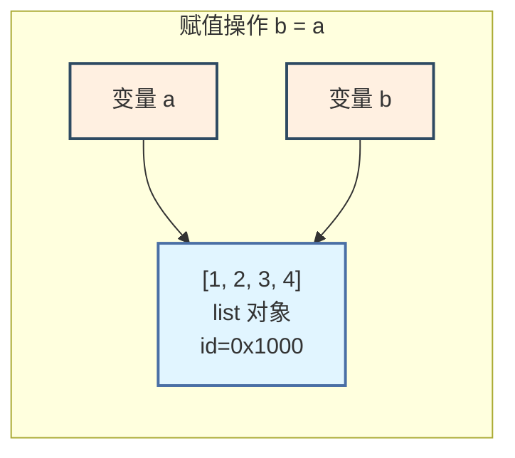
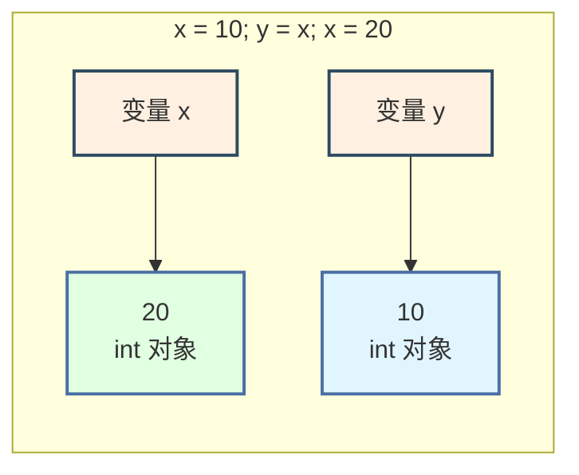
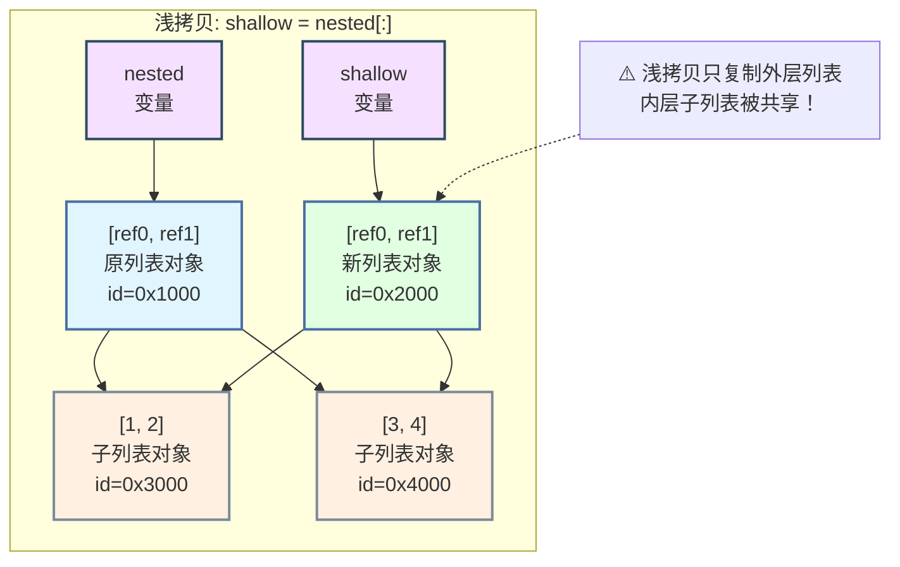
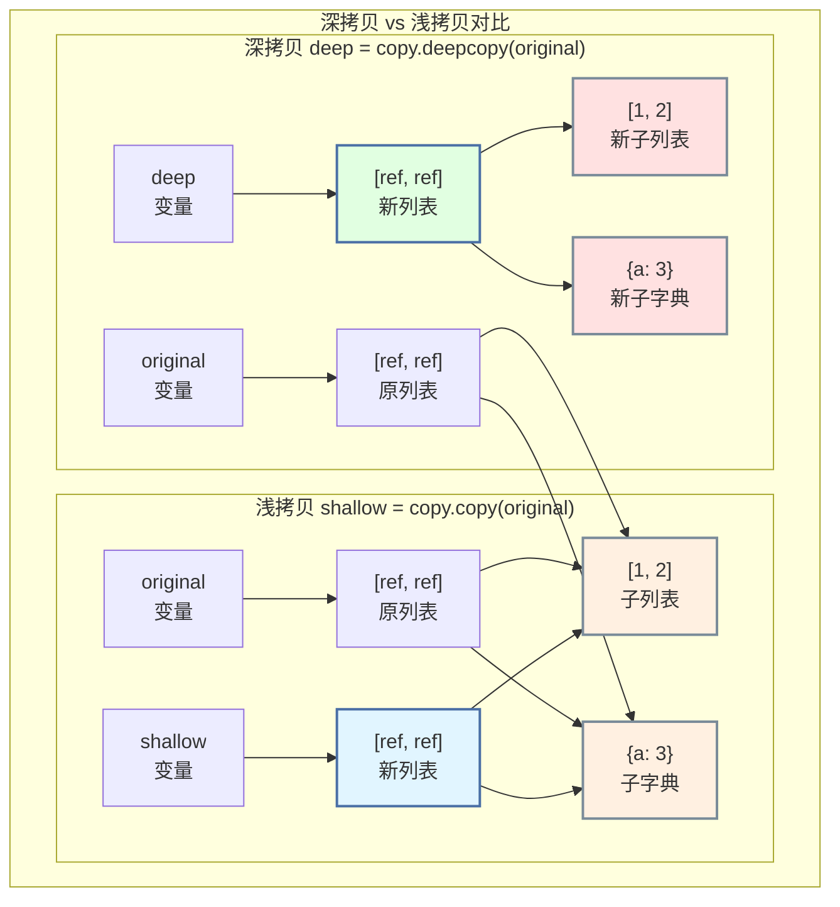
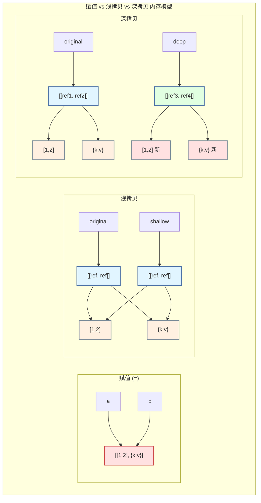

# 第 2 章 Python 对象模型与可变性 ⭐⭐⭐⭐
> [!abstract] 本章导航
> **定位**：第一部分 Python 与后端工程基础中的第 2 章；围绕“Python 对象模型与可变性”建立单一、可追踪的知识主线。
>
> **先修**：[[01_Python运行时与工程环境|第 1 章 Python 运行时与工程环境]]。
>
> **学习目标**：
> - 解释 基础语法速通 ⭐⭐ 的核心问题、机制与适用边界。
> - 实现或评估 核心数据结构 ⭐⭐⭐⭐ 的最小闭环。
> - 使用可复现证据诊断 可变类型与不可变类型 ⭐⭐⭐⭐⭐ 的工程取舍与失败模式。
>
> **建议路径**：基础语法速通 ⭐⭐ → 核心数据结构 ⭐⭐⭐⭐ → 可变类型与不可变类型 ⭐⭐⭐⭐⭐ → 深拷贝与浅拷贝 ⭐⭐⭐⭐⭐。
>
> **配套代码**：`code/ch02_object_model/`。

本章先回答“基础语法速通 ⭐⭐”为什么成立，再沿着机制、实现、评估和边界逐步展开。阅读时先建立因果链，再运行或推演示例，最后用章末自测检查能否脱离原文复述。
## 2.1 基础语法速通 ⭐⭐

### 2.1.1 变量与数据类型

Python 是**动态类型**语言，变量类型在运行时确定。理解每个类型的底层实现对面试至关重要。

```python
"""
Python 基础数据类型与内存行为
"""

# ─────────────────────────────────────────────────────────────
# 不可变类型（Immutable）— 创建后不可修改，修改会创建新对象
# ─────────────────────────────────────────────────────────────

# int — 任意精度整数（无溢出限制）
a = 10           # 小整数被缓存（-5 ~ 256）
b = 10
print(a is b)    # True — 缓存复用

c = 1000
d = 1000
print(c is d)    # False — 大整数不缓存

# float — 双精度浮点数（IEEE 754，64位）
pi = 3.14159
print(f"float 精度: {pi:.15f}")  # 约 15-17 位有效数字

# 浮点数精度问题（面试常考陷阱）
print(0.1 + 0.2 == 0.3)         # False！
print(f"0.1 + 0.2 = {0.1 + 0.2:.17f}")  # 0.30000000000000004
# 正确做法：使用 decimal 模块或允许误差
import math
print(math.isclose(0.1 + 0.2, 0.3))  # True

# str — Unicode 字符串，不可变
s = "hello"
# s[0] = "H"  # TypeError: 'str' object does not support item assignment
s = "H" + s[1:]  # 合法：创建新字符串

# bool — True/False，是 int 的子类
print(True + True)   # 2
print(isinstance(True, int))  # True

# None — 空值，单例对象
print(type(None))    # <class 'NoneType'>

# ─────────────────────────────────────────────────────────────
# 可变类型（Mutable）— 创建后可原地修改
# ─────────────────────────────────────────────────────────────

# list — 动态数组（底层是过度分配的数组）
lst = [1, 2, 3]
lst.append(4)        # 原地修改，id(lst) 不变

# dict — 哈希表（Python 3.7+ 保持插入顺序）
d = {"a": 1, "b": 2}
d["c"] = 3           # 原地修改

# set — 哈希集合，无序不重复
se = {1, 2, 3}
se.add(4)            # 原地修改
```

### 2.1.2 运算符与表达式

```python
"""
运算符优先级与特殊运算符
"""

# ─────────────────────────────────────────────────────────────
# 身份运算符 is / is not（面试高频考点）
# ─────────────────────────────────────────────────────────────

# is 比较内存地址，== 比较值
a = [1, 2, 3]
b = [1, 2, 3]
print(a == b)   # True — 值相等
print(a is b)   # False — 内存地址不同

# None 比较必须用 is
def check_none(x):
    """判断 None 的正确方式"""
    if x is None:      # ✅ 正确
        return "是 None"
    # if x == None:    # ❌ 不规范
    return "不是 None"

# ─────────────────────────────────────────────────────────────
# 短路求值（and / or）
# ─────────────────────────────────────────────────────────────

def get_fallback(value, default):
    """利用 or 短路求值提供默认值"""
    return value or default  # value 为 falsy 时返回 default

# falsy 值：0, 0.0, "", [], {}, set(), None, False
print(get_fallback("", "default"))    # "default"
print(get_fallback("hello", "def"))    # "hello"
print(get_fallback(0, 42))            # 42

# 安全获取嵌套字典值（Python 3.8+ 海象运算符 :=）
def get_nested(data: dict, key1: str, key2: str):
    """使用海象运算符简化嵌套获取"""
    if (inner := data.get(key1)) is not None:
        return inner.get(key2)
    return None

# 海象运算符在 while 循环中的应用
numbers = [3, 1, 4, 1, 5, 9]
it = iter(numbers)
# 传统写法需要两次 next() 调用
# while True:
#     n = next(it, None)
#     if n is None: break
#     print(n)
# 海象运算符版本更简洁
# while (n := next(it, None)) is not None:
#     print(n)
```

### 2.1.3 流程控制

```python
"""
流程控制：条件与循环
"""

# ─────────────────────────────────────────────────────────────
# 条件语句 — 面试陷阱：三目运算符
# ─────────────────────────────────────────────────────────────

# Python 三目运算符（条件表达式）
# 语法：value_if_true if condition else value_if_false
age = 20
status = "成年" if age >= 18 else "未成年"  # ✅ 简洁写法

# 链式比较（Python 特色）
x = 5
print(1 < x < 10)    # True — 等价于 1 < x and x < 10
print(1 < x > 3)     # True — 可读性差，不推荐

# ─────────────────────────────────────────────────────────────
# for 循环 — 遍历序列
# ─────────────────────────────────────────────────────────────

# enumerate() — 同时获取索引和值
fruits = ["apple", "banana", "cherry"]
for idx, fruit in enumerate(fruits, start=1):  # start 参数指定起始编号
    print(f"{idx}. {fruit}")

# zip() — 并行遍历多个序列
names = ["Alice", "Bob", "Charlie"]
scores = [85, 92, 78]
for name, score in zip(names, scores):
    print(f"{name}: {score}")

# zip 长度不一致时的处理
from itertools import zip_longest
a = [1, 2, 3]
b = ["a", "b"]
for x, y in zip_longest(a, b, fillvalue="N/A"):
    print(x, y)  # 1 a / 2 b / 3 N/A

# ─────────────────────────────────────────────────────────────
# break / continue / else（for-else 是面试常考点）
# ─────────────────────────────────────────────────────────────

def find_prime(n: int) -> bool:
    """
    for-else 结构：循环正常结束（未 break）时执行 else
    用于判断循环是否因 break 而中断
    """
    if n < 2:
        return False
    for i in range(2, int(n ** 0.5) + 1):
        if n % i == 0:
            print(f"{n} = {i} × {n // i}")
            break
    else:
        # 循环未 break 执行到这里 → n 是质数
        print(f"{n} 是质数")
        return True
    return False

find_prime(17)   # 17 是质数
find_prime(15)   # 15 = 3 × 5
```

### 2.1.4 文件操作与上下文管理

```python
"""
文件操作最佳实践
"""

# ─────────────────────────────────────────────────────────────
# with 语句 — 自动关闭文件（面试重点）
# ─────────────────────────────────────────────────────────────

# ✅ 正确写法：with 语句确保资源释放
def read_file_safe(filepath: str) -> str:
    """安全读取文件内容"""
    try:
        with open(filepath, "r", encoding="utf-8") as f:
            return f.read()
    except FileNotFoundError:
        return ""
    except UnicodeDecodeError:
        # 尝试其他编码
        with open(filepath, "r", encoding="gbk") as f:
            return f.read()

# 大文件读取：逐行读取（避免内存溢出）
def read_large_file(filepath: str):
    """逐行读取大文件，内存友好"""
    with open(filepath, "r", encoding="utf-8") as f:
        for line in f:           # 每次只读一行到内存
            yield line.strip()   # yield 使函数成为生成器

# ─────────────────────────────────────────────────────────────
# 文件模式速查表
# ─────────────────────────────────────────────────────────────
# 模式    说明
# ─────────────────
# "r"     只读（默认）
# "w"     只写，文件存在则清空
# "a"     追加写入
# "x"     独占创建，文件存在则报错
# "b"     二进制模式（如 "rb"）
# "+"     读写模式（如 "r+"）
```

## 2.2 核心数据结构 ⭐⭐⭐⭐

数据结构是 Python 面试的核心战场。列表、字典、集合的底层实现和时间复杂度是高频考点。

### 2.2.1 列表 List — 动态数组

```python
"""
列表：面试高频操作与复杂度分析
底层实现：过度分配的动态数组（PyListObject）
"""

# ─────────────────────────────────────────────────────────────
# 时间复杂度速查
# ─────────────────────────────────────────────────────────────
# 操作                  复杂度        说明
# ──────────────────────────────────────────────
# lst[i]                O(1)         随机访问
# lst.append(x)         均摊 O(1)    可能触发扩容
# lst.pop()             O(1)         尾部弹出
# lst.pop(0)            O(n)         头部弹出（元素全移动）
# lst.insert(i, x)      O(n)         中间插入
# lst[i:j] = [...]      O(n)         切片赋值
# x in lst              O(n)         线性查找
# lst.sort()            O(n log n)   Timsort 算法

# ─────────────────────────────────────────────────────────────
# 列表推导式（Pythonic 写法，面试常考）
# ─────────────────────────────────────────────────────────────

# 基础推导式
squares = [x**2 for x in range(10)]

# 带条件过滤
even_squares = [x**2 for x in range(10) if x % 2 == 0]

# 嵌套推导式（矩阵转置）
matrix = [[1, 2, 3], [4, 5, 6], [7, 8, 9]]
transposed = [[row[i] for row in matrix] for i in range(3)]
# [[1, 4, 7], [2, 5, 8], [3, 6, 9]]

# 面试陷阱：列表推导式的变量泄漏（Python 2 问题，Python 3 已修复）
# Python 3 中推导式有自己的局部作用域
x = 10
[y for x in range(5)]
print(x)  # Python 3: 10（x 不变）；Python 2: 4（x 被修改）

# ─────────────────────────────────────────────────────────────
# 切片操作（slice）— 面试高频
# ─────────────────────────────────────────────────────────────

lst = [0, 1, 2, 3, 4, 5, 6, 7, 8, 9]

# 切片语法：lst[start:stop:step]
print(lst[2:7])       # [2, 3, 4, 5, 6]      从索引2到6
print(lst[:4])        # [0, 1, 2, 3]          从头到3
print(lst[::2])       # [0, 2, 4, 6, 8]       步长2
print(lst[::-1])      # [9, 8, 7, ..., 0]     反转列表

# 🎯 面试陷阱：切片越界不报错
print(lst[5:100])     # [5, 6, 7, 8, 9] — 不抛异常！
# print(lst[100])     # IndexError！— 索引越界才报错

# 删除偶数索引元素（正确 vs 错误写法）
def remove_even_indices_wrong(lst):
    """❌ 错误：遍历中修改列表导致跳过元素"""
    for i, val in enumerate(lst):
        if i % 2 == 0:
            del lst[i]  # 删除后索引偏移！
    return lst

def remove_even_indices_right(lst):
    """✅ 正确：切片删除"""
    del lst[::2]        # 一次性删除所有偶数索引
    return lst

# 或者用列表推导式重建
def remove_even_indices(lst):
    return [val for i, val in enumerate(lst) if i % 2 == 1]

# ─────────────────────────────────────────────────────────────
# 列表去重的 N 种方法（按效率排序，面试常考）
# ─────────────────────────────────────────────────────────────

def deduplicate_methods(data):
    """列表去重方法对比"""
    methods = {}

    # 方法1：set 去重（最快，但不保持顺序）
    methods["set"] = list(set(data))

    # 方法2：dict.fromkeys 去重（保持顺序，Python 3.7+）
    methods["dict_fromkeys"] = list(dict.fromkeys(data))

    # 方法3：循环判断（最慢，但最直观）
    seen = set()
    result = []
    for x in data:
        if x not in seen:
            seen.add(x)
            result.append(x)
    methods["loop"] = result

    return methods

data = [3, 1, 4, 1, 5, 9, 2, 6, 5, 3]
results = deduplicate_methods(data)
for name, result in results.items():
    print(f"{name:15s}: {result}")
```

### 2.2.2 字典 Dict — 哈希表实现 ⭐⭐⭐⭐⭐

```python
"""
字典：Python 的基础映射数据结构
底层实现：开放寻址法 + 伪删除标记（Python 3.6+ 使用紧凑字典，保持插入顺序）

查找时间复杂度：平均 O(1)，最坏 O(n)（哈希冲突严重时）
"""

# ─────────────────────────────────────────────────────────────
# 字典创建与常用操作
# ─────────────────────────────────────────────────────────────

# 多种创建方式
d1 = {"a": 1, "b": 2}                          # 字面量
d2 = dict(a=1, b=2)                             # 关键字参数
d3 = dict([("a", 1), ("b", 2)])                 # 键值对序列
d4 = {k: v for k, v in [("a", 1), ("b", 2)]}    # 字典推导式

# ─────────────────────────────────────────────────────────────
# get / setdefault / defaultdict（面试常考对比）
# ─────────────────────────────────────────────────────────────

def count_words(words: list) -> dict:
    """
    三种 word count 写法对比
    """
    # 写法1：传统方式
    count1 = {}
    for word in words:
        if word in count1:
            count1[word] += 1
        else:
            count1[word] = 1

    # 写法2：get 方法
    count2 = {}
    for word in words:
        count2[word] = count2.get(word, 0) + 1

    # 写法3：setdefault（不常用，面试可能问）
    count3 = {}
    for word in words:
        count3.setdefault(word, 0)
        count3[word] += 1

    # 写法4：collections.Counter（最 Pythonic）
    from collections import Counter
    count4 = Counter(words)

    # 写法5：defaultdict（面试推荐写法）
    from collections import defaultdict
    count5 = defaultdict(int)
    for word in words:
        count5[word] += 1

    return dict(count5)

# ─────────────────────────────────────────────────────────────
# 字典合并（Python 3.9+ 语法）
# ─────────────────────────────────────────────────────────────

def merge_dicts(d1: dict, d2: dict) -> dict:
    """字典合并的多种方式"""

    # Python 3.9+：合并运算符
    merged = d1 | d2        # 创建新字典，d2 的键覆盖 d1
    d1 |= d2                # 原地更新 d1

    # Python 3.5+：解包合并
    merged = {**d1, **d2}

    # 传统方式
    merged = d1.copy()
    merged.update(d2)

    return merged

# ─────────────────────────────────────────────────────────────
# 字典哈希表原理（面试核心考点）
# ─────────────────────────────────────────────────────────────

"""
字典查找 O(1) 的原理：

┌─────────────────────────────────────────────┐
│              哈希表查找流程                    │
│                                             │
│  键 key                                     │
│   │                                         │
│   ▼                                         │
│  hash(key) ──→ 哈希值                       │
│   │                                         │
│   ▼                                         │
│  哈希值 % 表大小 ──→ 索引位置                 │
│   │                                         │
│   ▼                                         │
│  检查该位置：                                │
│    - 为空 → KeyError                        │
│    - 键匹配 → 返回值                         │
│    - 键不匹配（冲突）→ 探测下一个位置           │
│                                             │
└─────────────────────────────────────────────┘

Python 3.6+ 紧凑字典结构：
- entries 数组：按插入顺序存储 [hash, key, value]
- indices 数组：哈希表，存储 entries 的索引
- 这使得字典既有 O(1) 查找，又天然保持插入顺序
"""

# 字典键的要求：必须是不可变且可哈希的
# 可变类型（list, dict, set）不能作为字典键
# tuple 只有在元素全部不可变时才能作为键

valid_key = (1, "a", (2, 3))   # ✅ 嵌套 tuple 元素都是不可变的
# invalid_key = (1, [2, 3])    # ❌ 包含 list，不可哈希

# 自定义类作为键：需要实现 __hash__ 和 __eq__
class HashablePoint:
    """可作为字典键的二维点"""
    __slots__ = ["x", "y"]   # 节省内存（面试加分项）

    def __init__(self, x, y):
        self.x = x
        self.y = y

    def __hash__(self):
        return hash((self.x, self.y))   # 基于不可变元组

    def __eq__(self, other):
        if not isinstance(other, HashablePoint):
            return NotImplemented
        return self.x == other.x and self.y == other.y

    def __repr__(self):
        return f"HashablePoint({self.x}, {self.y})"

points = {
    HashablePoint(0, 0): "原点",
    HashablePoint(1, 1): "(1,1)点",
}
print(points[HashablePoint(0, 0)])  # "原点"
```

### 2.2.3 集合 Set — 哈希集合

```python
"""
集合：无序不重复元素集
底层实现：与字典相同的哈希表，只存键不存值
"""

# ─────────────────────────────────────────────────────────────
# 集合操作与复杂度
# ─────────────────────────────────────────────────────────────
# 操作              复杂度     说明
# ──────────────────────────────────
# add(x)            O(1)      添加元素
# remove(x)         O(1)      删除，不存在则 KeyError
# discard(x)        O(1)      删除，不存在不报错
# x in s            O(1)      成员判断（比 list 的 O(n) 快）
# s | t             O(len(s)+len(t))  并集
# s & t             O(min(len(s), len(t)))  交集
# s - t             O(len(s)) 差集

# ─────────────────────────────────────────────────────────────
# 集合的典型应用场景
# ─────────────────────────────────────────────────────────────

def find_duplicates(data: list) -> set:
    """利用集合快速查找重复元素"""
    seen = set()
    duplicates = set()
    for item in data:
        if item in seen:
            duplicates.add(item)
        else:
            seen.add(item)
    return duplicates

def find_common(list1: list, list2: list) -> set:
    """查找两个列表的共同元素"""
    # 方式1：集合交集（O(n + m)）
    return set(list1) & set(list2)

# ─────────────────────────────────────────────────────────────
# frozenset — 不可变集合（可作为字典键）
# ─────────────────────────────────────────────────────────────

fs = frozenset([1, 2, 3])
# fs.add(4)  # AttributeError: 'frozenset' object has no attribute 'add'

# frozenset 可作为字典键
cache = {
    frozenset(["a", "b"]): "组合ab",
    frozenset(["b", "c"]): "组合bc",
}
```

### 2.2.4 元组 Tuple — 不可变序列 ⭐⭐⭐⭐

```python
"""
元组：不可变序列 — 面试陷阱最多的数据结构

核心考点：元组的"不可变"指的是元组对象本身不可变，
          但如果元组中包含可变对象，可变对象的内容可以修改！
"""

# ─────────────────────────────────────────────────────────────
# 🎯 面试陷阱：t = (1, [2, 3]) 的可变性辨析
# ─────────────────────────────────────────────────────────────

t = (1, [2, 3], {"a": 4})

# t[0] = 10        # TypeError — 不能修改元组元素
# t[1] = [5, 6]    # TypeError — 不能替换整个列表

t[1].append(4)     # ✅ 合法！修改的是列表内部，不是元组本身
print(t)           # (1, [2, 3, 4], {'a': 4})

t[2]["b"] = 5      # ✅ 合法！修改的是字典内部
print(t)           # (1, [2, 3, 4], {'a': 4, 'b': 5})

"""
内存模型解析：

┌──────────────────────────────────────────┐
│  元组对象 (tuple)                         │
│  ┌─────────┬─────────┬─────────┐        │
│  │  ref 0  │  ref 1  │  ref 2  │        │
│  │  ────▶  │  ────▶  │  ────▶  │        │
│  │   1     │  [2,3]  │  {a:4}  │        │
│  └─────────┴─────────┴─────────┘        │
│       │          │           │           │
│       ▼          ▼           ▼           │
│     int 1    list对象      dict对象       │
│              (可变)         (可变)        │
│                                          │
│  元组的引用不可变，但引用的对象内容可变！     │
└──────────────────────────────────────────┘

结论：tuple 的不可变性是浅层的（shallow immutability）
"""

# ─────────────────────────────────────────────────────────────
# 元组的性能优势
# ─────────────────────────────────────────────────────────────

# 1. 元组比列表更省内存（因为不可变，无需过度分配）
import sys
lst = [1, 2, 3, 4, 5]
t = (1, 2, 3, 4, 5)
print(f"列表内存: {sys.getsizeof(lst)} bytes")   # 列表内存更大
print(f"元组内存: {sys.getsizeof(t)} bytes")     # 元组内存更小

# 2. 元组可作为字典键（列表不行）
coord_dict = {
    (0, 0): "原点",
    (1, 0): "x轴",
    (0, 1): "y轴",
}

# 3. 元组拆包
point = (3, 4)
x, y = point           # 元组拆包
first, *rest = (1, 2, 3, 4, 5)  # 扩展拆包
print(f"x={x}, y={y}, first={first}, rest={rest}")

# 单元素元组的陷阱
t_single = (42,)       # ✅ 必须加逗号！
not_tuple = (42)       # ❌ 这是 int，不是 tuple
print(type(t_single))   # <class 'tuple'>
print(type(not_tuple))  # <class 'int'>
```

**🎯 面试真题：请解释以下代码的输出**

```python
a = (1, 2, [3, 4])
a[2] += [5, 6]   # 会报错吗？a 的值会变吗？
```

**答案解析**：这行代码会抛出 `TypeError: 'tuple' object does not support item assignment`。但是！由于 `+=` 操作会先执行 `__iadd__`（原地修改列表成功），然后再尝试赋值给元组（失败），所以 **列表实际上已经被修改了**：

```python
a = (1, 2, [3, 4])
try:
    a[2] += [5, 6]
except TypeError:
    pass
print(a)  # (1, 2, [3, 4, 5, 6]) — 列表已被修改！
```

> 💡 **面试技巧**：回答时不仅要说"会报错"，还要解释 `+=` 的内部机制（先 `__iadd__` 再赋值），以及最终 a 的状态——这体现了对 Python 底层语义的深入理解。

## 2.3 可变类型与不可变类型 ⭐⭐⭐⭐⭐

### 2.3.1 核心概念辨析

Python 中的一切都是**对象**，每个对象都有三个基本属性：

| 属性 | 说明 | 获取方式 |
|------|------|---------|
| 身份（Identity） | 对象的内存地址，唯一且不变 | `id(obj)` |
| 类型（Type） | 对象的数据类型，不可变 | `type(obj)` |
| 值（Value） | 对象存储的数据 | `obj` 本身 |

```python
"""
对象的身份、类型、值 —— Python 对象模型基础
"""

a = [1, 2, 3]
print(f"身份 (id) : {id(a)}       # 内存地址")   # 如 140234567890
print(f"类型      : {type(a)}     # <class 'list'>")
print(f"值        : {a}           # [1, 2, 3]")

# 可变 vs 不可变的本质区别
"""
┌─────────────────────────────────────────────────────────────┐
│                    可变性与不可变性的本质                      │
│                                                             │
│   不可变对象 (Immutable)          可变对象 (Mutable)          │
│   ─────────────────────           ─────────────────         │
│   • 创建后内容不可修改              • 创建后内容可以修改        │
│   • 修改操作 = 创建新对象           • 修改操作 = 原地修改       │
│   • 可作为字典键                   • 不可作为字典键            │
│   • 线程安全（无竞态条件）           • 需要同步机制保证线程安全   │
│                                                             │
│   示例: int, float, str,           示例: list, dict, set,     │
│         bool, tuple, frozenset           bytearray           │
│                                                             │
└─────────────────────────────────────────────────────────────┘
"""
```

### 2.3.2 完整类型分类表

```python
"""
Python 数据类型的可变与不可变完整分类
"""

# ─────────────────────────────────────────────────────────────
# 不可变类型（Immutable）
# ─────────────────────────────────────────────────────────────

# 1. 数值类型
n = 42           # int
f = 3.14         # float
c = 3 + 4j       # complex

# 2. 字符串
s = "hello"      # str

# 3. 元组
t = (1, 2, 3)    # tuple

# 4. 冻结集合
fs = frozenset([1, 2, 3])

# 5. 字节串
b = b"bytes"     # bytes

# ─────────────────────────────────────────────────────────────
# 可变类型（Mutable）
# ─────────────────────────────────────────────────────────────

# 1. 列表
lst = [1, 2, 3]  # list

# 2. 字典
d = {"a": 1}     # dict

# 3. 集合
se = {1, 2, 3}   # set

# 4. 字节数组
ba = bytearray(b"hello")

# ─────────────────────────────────────────────────────────────
# 修改行为对比（面试核心考点）
# ─────────────────────────────────────────────────────────────

def demo_mutable_vs_immutable():
    """演示可变与不可变的修改行为差异"""

    # ── 不可变对象：修改 = 创建新对象 ──
    x = 10
    old_id = id(x)
    x += 1           # x 现在绑定到新对象 11
    new_id = id(x)
    print(f"int 修改: id 从 {old_id} 变为 {new_id} — {'不同对象!' if old_id != new_id else '同一对象'}")

    s = "hello"
    old_id = id(s)
    s += " world"    # 创建新字符串
    new_id = id(s)
    print(f"str 修改: id 从 {old_id} 变为 {new_id} — {'不同对象!' if old_id != new_id else '同一对象'}")

    # ── 可变对象：修改 = 原地修改 ──
    lst = [1, 2, 3]
    old_id = id(lst)
    lst.append(4)    # 原地修改，id 不变
    new_id = id(lst)
    print(f"list 修改: id 从 {old_id} 变为 {new_id} — {'同一对象' if old_id == new_id else '不同对象!'}")
    print(f"  修改后: {lst}")

demo_mutable_vs_immutable()
```

### 2.3.3 `is` 与 `==` 的本质区别 ⭐⭐⭐⭐⭐

```python
"""
is 与 == 的区别 —— 面试超高频考点

==  调用 __eq__() 方法，比较值是否相等
is  比较 id()，即两个引用是否指向同一内存地址
"""

# ─────────────────────────────────────────────────────────────
# 基础对比
# ─────────────────────────────────────────────────────────────

a = [1, 2, 3]
b = [1, 2, 3]
print(a == b)     # True  — 值相等
print(a is b)     # False — 不同对象

# ─────────────────────────────────────────────────────────────
# 小整数缓存（-5 ~ 256）
# ─────────────────────────────────────────────────────────────

a = 100
b = 100
print(a is b)     # True — 小整数被缓存复用

c = 1000
d = 1000
print(c is d)     # False — 大整数不缓存（交互模式下可能缓存）

# ─────────────────────────────────────────────────────────────
# 字符串驻留（Interning）
# ─────────────────────────────────────────────────────────────

s1 = "hello"
s2 = "hello"
print(s1 is s2)   # True — 编译期常量字符串被驻留

s3 = "hello world! python"
s4 = "hello world! python"
print(s3 is s4)   # 可能 False — 长字符串不保证驻留

# 强制驻留
from sys import intern
s5 = intern("a very long string" * 100)
s6 = intern("a very long string" * 100)
print(s5 is s6)   # True — 强制驻留

# ─────────────────────────────────────────────────────────────
# 🎯 面试陷阱：空值比较
# ─────────────────────────────────────────────────────────────

# None 比较
print(None is None)       # True — None 是单例
# print(None == None)     # 也返回 True，但不规范

# 空容器比较
print([] == [])           # True
print([] is [])           # False — 两个不同的空列表
print({} == {})           # True
print({} is {})           # False

# ─────────────────────────────────────────────────────────────
# 🎯 面试真题：以下代码的输出是什么？
# ─────────────────────────────────────────────────────────────

def interview_trap():
    """
    判断输出，考察对 is 和 == 的理解
    """
    a = "hello"
    b = "hello"
    print(a is b)          # True — 字符串驻留

    c = "".join(["he", "llo"])
    print(a is c)          # False — 运行时拼接，不驻留
    print(a == c)          # True — 值相等

    d = 256
    e = 256
    print(d is e)          # True — -5~256 缓存

    f = 257
    g = 257
    print(f is g)          # False（通常）— 超出缓存范围

interview_trap()
```

**`is` vs `==` 使用场景速查**：

| 场景 | 推荐用法 | 原因 |
|------|---------|------|
| 判断 `None` | `x is None` | None 是单例，`is` 更快更准确 |
| 判断 True/False | `x is True` | 布尔是单例 |
| 判断对象身份 | `a is b` | 是否同一对象 |
| 判断值相等 | `a == b` | 调用 `__eq__()` |
| 判断空序列 | `if not lst:` | Pythonic，等价 `len(lst) == 0` |

### 2.3.4 `type()` vs `isinstance()` ⭐⭐⭐⭐

```python
"""
type() vs isinstance() —— 面试高频考点

核心区别：isinstance() 考虑继承关系（鸭子类型），type() 不考虑
"""

class Animal:
    pass

class Dog(Animal):
    pass

dog = Dog()

# type() — 返回精确类型
print(type(dog))           # <class '__main__.Dog'>
print(type(dog) == Dog)    # True
print(type(dog) == Animal) # False — Animal 不是 Dog 的精确类型

# isinstance() — 考虑继承链
print(isinstance(dog, Dog))     # True
print(isinstance(dog, Animal))  # True — Dog 继承自 Animal

# ─────────────────────────────────────────────────────────────
# 🎯 面试陷阱：type() 判断子类
# ─────────────────────────────────────────────────────────────

class MyList(list):
    """自定义列表类"""
    pass

my_list = MyList([1, 2, 3])

# 错误写法
def process_list_bad(data):
    if type(data) == list:    # ❌ 不会匹配 MyList 实例
        print("是 list")
    else:
        print("不是 list")

# 正确写法
def process_list_good(data):
    if isinstance(data, list):   # ✅ 匹配 list 及其所有子类
        print("是 list 或其子类")
    else:
        print("不是 list")

process_list_bad(my_list)   # "不是 list" — 错误！
process_list_good(my_list)  # "是 list 或其子类" — 正确！

# ─────────────────────────────────────────────────────────────
# 多类型判断
# ─────────────────────────────────────────────────────────────

def flexible_add(a, b):
    """支持数字或字符串相加"""
    if isinstance(a, (int, float)) and isinstance(b, (int, float)):
        return a + b
    elif isinstance(a, str) and isinstance(b, str):
        return a + b
    else:
        raise TypeError("只支持数字或字符串")

print(flexible_add(3, 4))          # 7
print(flexible_add("a", "b"))      # "ab"
# flexible_add(3, "b")            # TypeError

# ─────────────────────────────────────────────────────────────
# type() 的应用场景：精确类型判断
# ─────────────────────────────────────────────────────────────

def strict_type_check(obj):
    """需要精确类型匹配的场景（如反序列化）"""
    if type(obj) is dict:       # 必须是 dict，不能是子类
        print("原生 dict")
    elif type(obj) is list:
        print("原生 list")
    else:
        print(f"其他类型: {type(obj).__name__}")

strict_type_check({})                    # "原生 dict"
strict_type_check(MyList())              # "原生 list" — 等等...
# 实际上 MyList() 是 list 子类，type(MyList()) 是 MyList，不是 list
# 所以这里会输出 "其他类型: MyList"

# 正确的精确判断
def exact_type_check(obj, expected_type):
    """精确判断 obj 的类型就是 expected_type（非子类）"""
    return type(obj) is expected_type

print(exact_type_check({}, dict))        # True
print(exact_type_check(MyList(), list))  # False — MyList 不是 list
```

### 2.3.5 内存中的对象引用关系图解

```python
"""
Python 内存模型 —— 对象引用关系

关键概念：变量不是盒子，是标签！
"""

# ─────────────────────────────────────────────────────────────
# 赋值 = 引用绑定（不是复制！）
# ─────────────────────────────────────────────────────────────

a = [1, 2, 3]    # 创建列表对象，a 绑定到它
b = a            # b 绑定到同一个对象！不是复制！
b.append(4)
print(a)         # [1, 2, 3, 4] — a 也被修改了！
print(a is b)    # True
```



```python
# ─────────────────────────────────────────────────────────────
# 不可变对象的重新赋值
# ─────────────────────────────────────────────────────────────

x = 10           # x 绑定到 int 对象 10
y = x            # y 绑定到同一个对象
x = 20           # x 绑定到新对象 20，y 不变
print(y)         # 10 — y 不受影响
```



```python
# ─────────────────────────────────────────────────────────────
# 嵌套可变对象的引用关系（深拷贝/浅拷贝的前置知识）
# ─────────────────────────────────────────────────────────────

nested = [[1, 2], [3, 4]]
shallow = nested[:]     # 浅拷贝
```



## 2.4 深拷贝与浅拷贝 ⭐⭐⭐⭐⭐

### 2.4.1 浅拷贝的三种实现方式

```python
"""
浅拷贝（Shallow Copy）— 创建新容器对象，但只复制最外层，
                        内部元素共享引用

三种实现方式：
1. 切片操作 [:]
2. 工厂方法 list(), dict(), set()
3. copy 模块的 copy.copy()
"""

import copy

# ─────────────────────────────────────────────────────────────
# 方式1：切片操作
# ─────────────────────────────────────────────────────────────
original = [[1, 2], [3, 4]]
shallow1 = original[:]

print(original is shallow1)           # False — 不同列表对象
print(original[0] is shallow1[0])     # True  — 子列表共享！

# 修改浅拷贝的外层（互不影响）
shallow1.append([5, 6])
print(f"original: {original}")   # [[1, 2], [3, 4]] — 不受影响
print(f"shallow1: {shallow1}")   # [[1, 2], [3, 4], [5, 6]]

# 修改浅拷贝的内层（影响原对象！）
shallow1[0].append(999)
print(f"original: {original}")   # [[1, 2, 999], [3, 4]] — 被修改了！

# ─────────────────────────────────────────────────────────────
# 方式2：工厂方法
# ─────────────────────────────────────────────────────────────
shallow2 = list(original)

# ─────────────────────────────────────────────────────────────
# 方式3：copy 模块
# ─────────────────────────────────────────────────────────────
shallow3 = copy.copy(original)

# ─────────────────────────────────────────────────────────────
# 三种方式对比
# ─────────────────────────────────────────────────────────────

def compare_shallow_methods():
    """三种浅拷贝方式的效果对比"""
    original = [[1, 2], {"a": 3}]

    methods = {
        "切片 [:]": original[:],
        "list()": list(original),
        "copy.copy()": copy.copy(original),
    }

    for name, copied in methods.items():
        print(f"\n{name}:")
        print(f"  外层对象相同? {original is copied}")
        print(f"  内层列表相同? {original[0] is copied[0]}")
        print(f"  内层字典相同? {original[1] is copied[1]}")

compare_shallow_methods()
```

### 2.4.2 浅拷贝对嵌套对象的行为 ⭐⭐⭐⭐⭐

```python
"""
浅拷贝行为分析 —— 面试超高频考点

核心规则：浅拷贝只拷贝最外层容器，内部所有元素共享引用
"""

# ─────────────────────────────────────────────────────────────
# 嵌套结构浅拷贝演示
# ─────────────────────────────────────────────────────────────

def demo_shallow_copy_behavior():
    """
    ┌─────────────────────────────────────────────────────────┐
    │  原对象结构：                                             │
    │                                                         │
    │  data = [                                               │
    │      [1, 2, 3],          ← 子列表1                      │
    │      {"a": [4, 5]},      ← 子字典（内含列表）            │
    │      (6, 7)              ← 子元组（不可变）              │
    │  ]                                                      │
    │                                                         │
    │  shallow = copy.copy(data)                              │
    │                                                         │
    │  结果：data[0] is shallow[0] → True（子列表共享）        │
    │       data[1] is shallow[1] → True（子字典共享）        │
    │       data[2] is shallow[2] → True（元组共享，但不可变） │
    │                                                         │
    └─────────────────────────────────────────────────────────┘
    """
    data = [
        [1, 2, 3],
        {"a": [4, 5]},
        (6, 7)
    ]
    shallow = copy.copy(data)

    print("=== 浅拷贝后的状态 ===")
    print(f"外层相同? {data is shallow}")           # False
    print(f"子列表相同? {data[0] is shallow[0]}")    # True
    print(f"子字典相同? {data[1] is shallow[1]}")    # True
    print(f"子元组相同? {data[2] is shallow[2]}")    # True

    # 修改浅拷贝的外层 — 不影响原对象
    shallow.append("new")
    print(f"\n添加外层元素后:")
    print(f"  data: {data}")
    print(f"  shallow: {shallow}")

    # 修改浅拷贝的子列表 — 影响原对象！
    shallow[0].append(999)
    print(f"\n修改子列表后:")
    print(f"  data: {data}")           # [[1, 2, 3, 999], ...] — 变了！
    print(f"  shallow: {shallow}")

    # 替换浅拷贝的子列表 — 不影响原对象
    shallow[0] = ["new list"]
    print(f"\n替换子列表后:")
    print(f"  data: {data}")           # 不变
    print(f"  shallow: {shallow}")

demo_shallow_copy_behavior()

# ─────────────────────────────────────────────────────────────
# 🎯 面试陷阱：多维列表的复制
# ─────────────────────────────────────────────────────────────

"""
🎯 面试题：如何创建一个 3x3 的二维列表，且每个元素是独立的？
"""

# ❌ 错误写法 — 所有行共享同一个内层列表
wrong = [[0] * 3] * 3
wrong[0][0] = 1
print(wrong)   # [[1, 0, 0], [1, 0, 0], [1, 0, 0]] — 三行都变了！

# ❌ 另一个错误写法 — 用 copy
import copy
matrix = [[0, 0, 0], [0, 0, 0], [0, 0, 0]]
wrong2 = copy.copy(matrix)   # 浅拷贝！子列表仍然共享

# ✅ 正确写法1 — 列表推导式（每行是独立创建的）
right1 = [[0] * 3 for _ in range(3)]
right1[0][0] = 1
print(right1)  # [[1, 0, 0], [0, 0, 0], [0, 0, 0]] — 只有第一行变了

# ✅ 正确写法2 — 深拷贝
right2 = copy.deepcopy(matrix)

# ✅ 正确写法3 — NumPy（如果允许使用）
# import numpy as np
# right3 = np.zeros((3, 3), dtype=int)
```

### 2.4.3 深拷贝的原理与实现 ⭐⭐⭐⭐⭐

```python
"""
深拷贝（Deep Copy）— 递归拷贝所有层级，完全独立的对象

实现：copy.deepcopy()
原理：递归遍历对象图，创建每个对象的新副本
"""

import copy

# ─────────────────────────────────────────────────────────────
# 深拷贝基础演示
# ─────────────────────────────────────────────────────────────

def demo_deep_copy():
    original = [
        [1, 2, 3],
        {"a": [4, 5]},
        (6, 7)
    ]
    deep = copy.deepcopy(original)

    print("=== 深拷贝后的状态 ===")
    print(f"外层相同? {original is deep}")           # False
    print(f"子列表相同? {original[0] is deep[0]}")    # False — 深拷贝创建了新的！
    print(f"子字典相同? {original[1] is deep[1]}")    # False
    print(f"子元组相同? {original[2] is deep[2]}")    # True — 元组不可变，不需要拷贝
    print(f"字典内列表相同? {original[1]['a'] is deep[1]['a']}")  # False

    # 任意修改深拷贝，都不影响原对象
    deep[0].append(999)
    deep[1]["a"].append(888)
    deep[1]["b"] = "new"

    print(f"\n修改后:")
    print(f"  original: {original}")   # 完全不变
    print(f"  deep: {deep}")

demo_deep_copy()
```



### 2.4.4 循环引用的处理机制 ⭐⭐⭐⭐

```python
"""
深拷贝的循环引用处理 —— 面试进阶考点

问题：如果对象 A 引用 B，B 又引用 A，深拷贝会无限递归吗？
答案：不会。deepcopy 使用 memo 字典记录已拷贝的对象
"""

import copy

# ─────────────────────────────────────────────────────────────
# 循环引用演示
# ─────────────────────────────────────────────────────────────

def demo_circular_reference():
    """
    创建循环引用的数据结构：

    ┌──────────┐      ┌──────────┐
    │   a      │─────▶│   b      │
    │ {"x": 1} │      │ {"y": 2} │
    │          │◀─────│          │
    └──────────┘      └──────────┘
         │                 │
         └─────────────────┘
              互相引用
    """
    a = {"name": "A", "ref": None}
    b = {"name": "B", "ref": a}
    a["ref"] = b    # 建立循环引用

    print("=== 循环引用对象 ===")
    print(f"a['ref'] is b? {a['ref'] is b}")        # True
    print(f"b['ref'] is a? {b['ref'] is a}")        # True

    # 深拷贝处理循环引用
    a_copy = copy.deepcopy(a)

    print(f"\n深拷贝后:")
    print(f"a_copy['ref'] is b? {a_copy['ref'] is b}")              # False
    print(f"a_copy['ref']['ref'] is a_copy? {a_copy['ref']['ref'] is a_copy}")  # True
    print(f"a_copy['ref']['name']: {a_copy['ref']['name']}")        # "B"

    # 验证独立性
    a_copy["name"] = "A_copy"
    a_copy["ref"]["name"] = "B_copy"
    print(f"\n修改后:")
    print(f"原始 a['name']: {a['name']}")            # "A" — 不变
    print(f"原始 b['name']: {b['name']}")            # "B" — 不变

demo_circular_reference()

# ─────────────────────────────────────────────────────────────
# deepcopy 的 memo 机制源码级理解
# ─────────────────────────────────────────────────────────────

def deepcopy_with_memo(obj, memo=None):
    """
    模拟 deepcopy 的核心逻辑（简化版）

    memo 是一个字典：{id(原对象): 拷贝对象}
    用于：
    1. 防止循环引用导致无限递归
    2. 确保同一对象多次引用时指向同一个拷贝
    """
    if memo is None:
        memo = {}

    obj_id = id(obj)
    if obj_id in memo:
        return memo[obj_id]   # 已拷贝过，直接返回引用

    # 创建新对象（简化版，只处理列表）
    if isinstance(obj, list):
        new_obj = []
        memo[obj_id] = new_obj   # 先放入 memo，防止循环
        for item in obj:
            new_obj.append(deepcopy_with_memo(item, memo))
        return new_obj

    # 不可变对象直接返回（无需拷贝）
    return obj

# 验证
a = [1, 2]
a.append(a)   # 自引用 [1, 2, [...]]
copied = deepcopy_with_memo(a)
print(f"\n自引用深拷贝:")
print(f"copied: {copied}")
print(f"copied[2] is copied? {copied[2] is copied}")  # True — 循环引用保持
```

### 2.4.5 深拷贝的限制与自定义

```python
"""
deepcopy 的限制与自定义 —— 面试加分项
"""

import copy

# ─────────────────────────────────────────────────────────────
# 深拷贝的限制
# ─────────────────────────────────────────────────────────────

# 1. 不能拷贝文件对象、锁、数据库连接等资源
try:
    f = open("test.txt", "w")
    # copy.deepcopy(f)   # TypeError: cannot pickle '_io.TextIOWrapper' object
except:
    pass

# 2. 不能拷贝函数、模块、类型本身
# copy.deepcopy(lambda x: x)   # 通常可以但结果可能是同一个对象

# 3. 自定义对象默认只拷贝 __dict__

# ─────────────────────────────────────────────────────────────
# 自定义深拷贝行为：__deepcopy__
# ─────────────────────────────────────────────────────────────

class Node:
    """链表节点 — 自定义深拷贝行为"""

    def __init__(self, value, next_node=None):
        self.value = value
        self.next = next_node
        # 共享数据（不需要深拷贝）
        self.shared_cache = {"metadata": "共享元数据"}

    def __deepcopy__(self, memo):
        """自定义深拷贝逻辑"""
        # 创建新节点，但只拷贝 value，共享 cache
        new_node = Node(self.value)
        memo[id(self)] = new_node

        if self.next:
            new_node.next = copy.deepcopy(self.next, memo)

        # 共享 cache（不创建新的）
        new_node.shared_cache = self.shared_cache

        return new_node

    def __repr__(self):
        return f"Node({self.value})"

# 构建链表 1 -> 2 -> 3
node3 = Node(3)
node2 = Node(2, node3)
node1 = Node(1, node2)

node1_copy = copy.deepcopy(node1)

print(f"值独立? {node1_copy.value == node1.value and node1_copy is not node1}")  # True
print(f"next独立? {node1_copy.next is not node1.next}")    # True
print(f"cache共享? {node1_copy.shared_cache is node1.shared_cache}")  # True — 故意共享
```

### 2.4.6 完整对比：赋值 vs 浅拷贝 vs 深拷贝

```python
"""
赋值 vs 浅拷贝 vs 深拷贝 —— 终极对比
"""

import copy

def full_comparison():
    """
    ┌─────────────────────────────────────────────────────────────────────┐
    │                    三种操作的本质区别                                │
    ├─────────────┬───────────────┬─────────────────┬───────────────────┤
    │    操作      │   创建新对象?   │   拷贝嵌套对象?  │   适用场景         │
    ├─────────────┼───────────────┼─────────────────┼───────────────────┤
    │ 赋值 (=)    │     否         │      否          │ 共享引用          │
    │ 浅拷贝      │     是         │      否          │ 单层结构          │
    │ 深拷贝      │     是         │      是          │ 多层嵌套结构       │
    └─────────────┴───────────────┴─────────────────┴───────────────────┘
    """

    original = [
        [1, 2, 3],
        {"key": [4, 5]},
    ]

    assigned = original              # 赋值
    shallow = copy.copy(original)    # 浅拷贝
    deep = copy.deepcopy(original)   # 深拷贝

    print("=" * 60)
    print(f"{'检查项':30s} {'=':>6s} {'shallow':>8s} {'deep':>8s}")
    print("=" * 60)

    checks = [
        ("外层对象相同", original is assigned, original is shallow, original is deep),
        ("子列表相同", original[0] is assigned[0], original[0] is shallow[0], original[0] is deep[0]),
        ("子字典相同", original[1] is assigned[1], original[1] is shallow[1], original[1] is deep[1]),
        ("字典内列表相同", original[1]["key"] is assigned[1]["key"],
                          original[1]["key"] is shallow[1]["key"],
                          original[1]["key"] is deep[1]["key"]),
    ]

    for name, assigned_same, shallow_same, deep_same in checks:
        print(f"{name:30s} {'✓' if assigned_same else '✗':>6s} {'✓' if shallow_same else '✗':>8s} {'✓' if deep_same else '✗':>8s}")

    # 修改验证独立性
    print("\n--- 修改 deep[0].append(999) 后 ---")
    deep[0].append(999)
    print(f"original[0]: {original[0]}")
    print(f"shallow[0]:  {shallow[0]}")
    print(f"deep[0]:     {deep[0]}")

full_comparison()
```


## 🧭 本章小结

- 基础语法速通 ⭐⭐：能够说清问题、机制、证据与边界。
- 核心数据结构 ⭐⭐⭐⭐：能够说清问题、机制、证据与边界。
- 可变类型与不可变类型 ⭐⭐⭐⭐⭐：能够说清问题、机制、证据与边界。

## ✅ 自测与练习

1. 不看正文，解释“基础语法速通 ⭐⭐”解决什么问题，并给出一个不适用场景。
2. 为“核心数据结构 ⭐⭐⭐⭐”设计一个最小可复现实验，明确输入、指标和通过条件。
3. 比较“可变类型与不可变类型 ⭐⭐⭐⭐⭐”的至少两种方案，说明质量、成本、延迟或风险取舍。

## 🧪 配套代码与验收

- `code/ch02_object_model/`

```powershell
python code/scripts/run_all_examples.py --chapter ch02 --tier core
```

默认验收不下载模型、不调用付费 API；真实 API 或 GPU 示例必须按 metadata 显式启用。成功标准是相关脚本输出 `OK`，条件不足时输出可解释的 `[SKIP]`。

## 🎯 面试题精讲

回答本章问题时使用四步结构：先给结论，再解释机制，然后给项目证据，最后主动说明适用边界。涉及性能或效果时，补充模型、硬件、数据、并发、版本和统计口径；条件不完整时明确说“需要实测”。

## 📋 本章速查表

| 主题 | 回答主线 |
|---|---|
| 基础语法速通 ⭐⭐ | 问题 → 机制 → 示例 → 指标 → 边界 |
| 核心数据结构 ⭐⭐⭐⭐ | 问题 → 机制 → 示例 → 指标 → 边界 |
| 可变类型与不可变类型 ⭐⭐⭐⭐⭐ | 问题 → 机制 → 示例 → 指标 → 边界 |
| 深拷贝与浅拷贝 ⭐⭐⭐⭐⭐ | 问题 → 机制 → 示例 → 指标 → 边界 |

## 🔗 相关章节

- [[01_Python运行时与工程环境|第 1 章 Python 运行时与工程环境]]
- [[03_Python函数作用域与装饰器|第 3 章 Python 函数、作用域与装饰器]]

## 📖 一手参考资料

> 核验基线：2026-07-31；结构复核：2026-08-05。产品、API、法规、价格与 benchmark 会变化，使用前应再次核验。

- [[docs/AUTHORITATIVE_SOURCES|章节权威来源索引]]：按主题维护官方文档、标准、原论文和官方仓库。
