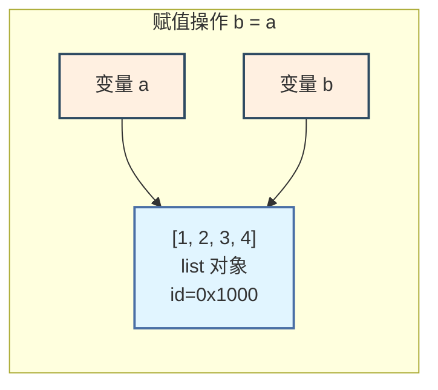
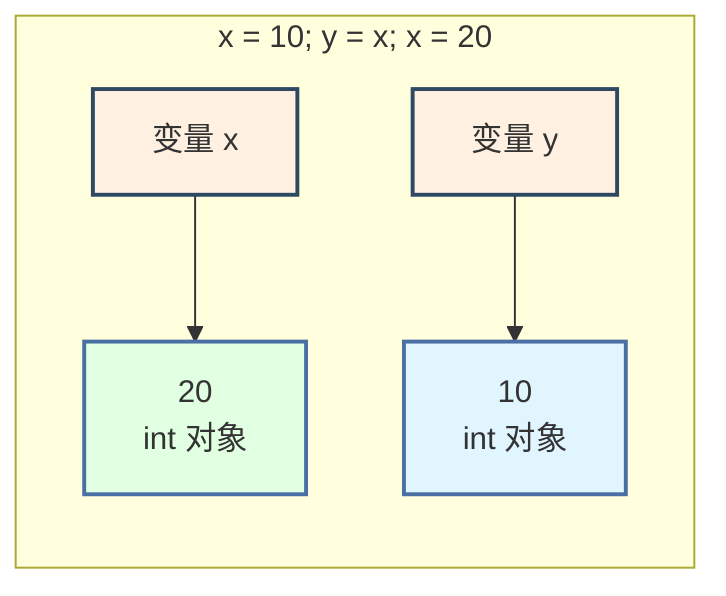
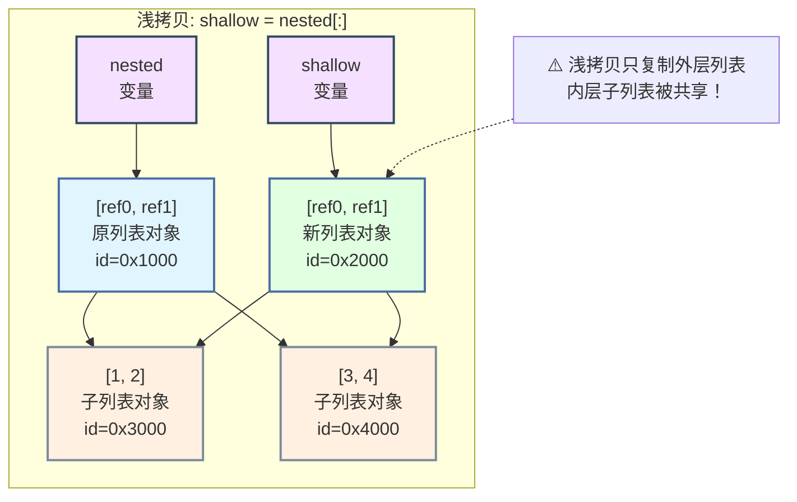
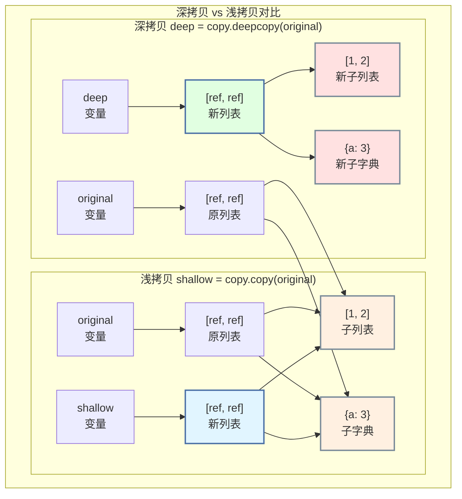
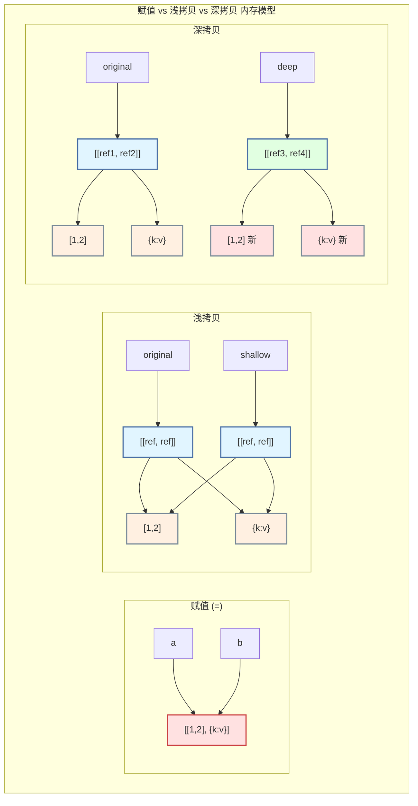

# 第 2 章 Python 核心面试专题 —— 可变性与拷贝

> **面试频率**: ⭐⭐⭐⭐⭐ | **出现概率**: ~90% 面试必问
>
> 可变性与拷贝是 Python 面试中**最高频**的专题之一。表面上看只是 `copy()` 和 `deepcopy()` 的区别，但实际上涉及 Python 的**对象模型**、**内存管理**和**引用语义**。面试官常通过一系列层层递进的追问来考察候选人对 Python 底层的理解深度。

---

## 2.1 可变类型与不可变类型 ⭐⭐⭐⭐⭐

### 2.1.1 核心概念辨析

Python 中的一切都是**对象**，每个对象都有三个基本属性：

| 属性 | 说明 | 获取方式 |
|------|------|---------|
| 身份（Identity） | 对象的内存地址，唯一且不变 | `id(obj)` |
| 类型（Type） | 对象的数据类型，不可变 | `type(obj)` |
| 值（Value） | 对象存储的数据 | `obj` 本身 |

```python
"""
对象的身份、类型、值 —— Python 对象模型基础
"""

a = [1, 2, 3]
print(f"身份 (id) : {id(a)}       # 内存地址")   # 如 140234567890
print(f"类型      : {type(a)}     # <class 'list'>")
print(f"值        : {a}           # [1, 2, 3]")

# 可变 vs 不可变的本质区别
"""
┌─────────────────────────────────────────────────────────────┐
│                    可变性与不可变性的本质                      │
│                                                             │
│   不可变对象 (Immutable)          可变对象 (Mutable)          │
│   ─────────────────────           ─────────────────         │
│   • 创建后内容不可修改              • 创建后内容可以修改        │
│   • 修改操作 = 创建新对象           • 修改操作 = 原地修改       │
│   • 可作为字典键                   • 不可作为字典键            │
│   • 线程安全（无竞态条件）           • 需要同步机制保证线程安全   │
│                                                             │
│   示例: int, float, str,           示例: list, dict, set,     │
│         bool, tuple, frozenset           bytearray           │
│                                                             │
└─────────────────────────────────────────────────────────────┘
"""
```

### 2.1.2 完整类型分类表

```python
"""
Python 数据类型的可变与不可变完整分类
"""

# ─────────────────────────────────────────────────────────────
# 不可变类型（Immutable）
# ─────────────────────────────────────────────────────────────

# 1. 数值类型
n = 42           # int
f = 3.14         # float
c = 3 + 4j       # complex

# 2. 字符串
s = "hello"      # str

# 3. 元组
t = (1, 2, 3)    # tuple

# 4. 冻结集合
fs = frozenset([1, 2, 3])

# 5. 字节串
b = b"bytes"     # bytes

# ─────────────────────────────────────────────────────────────
# 可变类型（Mutable）
# ─────────────────────────────────────────────────────────────

# 1. 列表
lst = [1, 2, 3]  # list

# 2. 字典
d = {"a": 1}     # dict

# 3. 集合
se = {1, 2, 3}   # set

# 4. 字节数组
ba = bytearray(b"hello")

# ─────────────────────────────────────────────────────────────
# 修改行为对比（面试核心考点）
# ─────────────────────────────────────────────────────────────

def demo_mutable_vs_immutable():
    """演示可变与不可变的修改行为差异"""

    # ── 不可变对象：修改 = 创建新对象 ──
    x = 10
    old_id = id(x)
    x += 1           # x 现在绑定到新对象 11
    new_id = id(x)
    print(f"int 修改: id 从 {old_id} 变为 {new_id} — {'不同对象!' if old_id != new_id else '同一对象'}")

    s = "hello"
    old_id = id(s)
    s += " world"    # 创建新字符串
    new_id = id(s)
    print(f"str 修改: id 从 {old_id} 变为 {new_id} — {'不同对象!' if old_id != new_id else '同一对象'}")

    # ── 可变对象：修改 = 原地修改 ──
    lst = [1, 2, 3]
    old_id = id(lst)
    lst.append(4)    # 原地修改，id 不变
    new_id = id(lst)
    print(f"list 修改: id 从 {old_id} 变为 {new_id} — {'同一对象' if old_id == new_id else '不同对象!'}")
    print(f"  修改后: {lst}")

demo_mutable_vs_immutable()
```

### 2.1.3 `is` 与 `==` 的本质区别 ⭐⭐⭐⭐⭐

```python
"""
is 与 == 的区别 —— 面试超高频考点

==  调用 __eq__() 方法，比较值是否相等
is  比较 id()，即两个引用是否指向同一内存地址
"""

# ─────────────────────────────────────────────────────────────
# 基础对比
# ─────────────────────────────────────────────────────────────

a = [1, 2, 3]
b = [1, 2, 3]
print(a == b)     # True  — 值相等
print(a is b)     # False — 不同对象

# ─────────────────────────────────────────────────────────────
# 小整数缓存（-5 ~ 256）
# ─────────────────────────────────────────────────────────────

a = 100
b = 100
print(a is b)     # True — 小整数被缓存复用

c = 1000
d = 1000
print(c is d)     # False — 大整数不缓存（交互模式下可能缓存）

# ─────────────────────────────────────────────────────────────
# 字符串驻留（Interning）
# ─────────────────────────────────────────────────────────────

s1 = "hello"
s2 = "hello"
print(s1 is s2)   # True — 编译期常量字符串被驻留

s3 = "hello world! python"
s4 = "hello world! python"
print(s3 is s4)   # 可能 False — 长字符串不保证驻留

# 强制驻留
from sys import intern
s5 = intern("a very long string" * 100)
s6 = intern("a very long string" * 100)
print(s5 is s6)   # True — 强制驻留

# ─────────────────────────────────────────────────────────────
# 🎯 面试陷阱：空值比较
# ─────────────────────────────────────────────────────────────

# None 比较
print(None is None)       # True — None 是单例
# print(None == None)     # 也返回 True，但不规范

# 空容器比较
print([] == [])           # True
print([] is [])           # False — 两个不同的空列表
print({} == {})           # True
print({} is {})           # False

# ─────────────────────────────────────────────────────────────
# 🎯 面试真题：以下代码的输出是什么？
# ─────────────────────────────────────────────────────────────

def interview_trap():
    """
    判断输出，考察对 is 和 == 的理解
    """
    a = "hello"
    b = "hello"
    print(a is b)          # True — 字符串驻留

    c = "".join(["he", "llo"])
    print(a is c)          # False — 运行时拼接，不驻留
    print(a == c)          # True — 值相等

    d = 256
    e = 256
    print(d is e)          # True — -5~256 缓存

    f = 257
    g = 257
    print(f is g)          # False（通常）— 超出缓存范围

interview_trap()
```

**`is` vs `==` 使用场景速查**：

| 场景 | 推荐用法 | 原因 |
|------|---------|------|
| 判断 `None` | `x is None` | None 是单例，`is` 更快更准确 |
| 判断 True/False | `x is True` | 布尔是单例 |
| 判断对象身份 | `a is b` | 是否同一对象 |
| 判断值相等 | `a == b` | 调用 `__eq__()` |
| 判断空序列 | `if not lst:` | Pythonic，等价 `len(lst) == 0` |

### 2.1.4 `type()` vs `isinstance()` ⭐⭐⭐⭐

```python
"""
type() vs isinstance() —— 面试高频考点

核心区别：isinstance() 考虑继承关系（鸭子类型），type() 不考虑
"""

class Animal:
    pass

class Dog(Animal):
    pass

dog = Dog()

# type() — 返回精确类型
print(type(dog))           # <class '__main__.Dog'>
print(type(dog) == Dog)    # True
print(type(dog) == Animal) # False — Animal 不是 Dog 的精确类型

# isinstance() — 考虑继承链
print(isinstance(dog, Dog))     # True
print(isinstance(dog, Animal))  # True — Dog 继承自 Animal

# ─────────────────────────────────────────────────────────────
# 🎯 面试陷阱：type() 判断子类
# ─────────────────────────────────────────────────────────────

class MyList(list):
    """自定义列表类"""
    pass

my_list = MyList([1, 2, 3])

# 错误写法
def process_list_bad(data):
    if type(data) == list:    # ❌ 不会匹配 MyList 实例
        print("是 list")
    else:
        print("不是 list")

# 正确写法
def process_list_good(data):
    if isinstance(data, list):   # ✅ 匹配 list 及其所有子类
        print("是 list 或其子类")
    else:
        print("不是 list")

process_list_bad(my_list)   # "不是 list" — 错误！
process_list_good(my_list)  # "是 list 或其子类" — 正确！

# ─────────────────────────────────────────────────────────────
# 多类型判断
# ─────────────────────────────────────────────────────────────

def flexible_add(a, b):
    """支持数字或字符串相加"""
    if isinstance(a, (int, float)) and isinstance(b, (int, float)):
        return a + b
    elif isinstance(a, str) and isinstance(b, str):
        return a + b
    else:
        raise TypeError("只支持数字或字符串")

print(flexible_add(3, 4))          # 7
print(flexible_add("a", "b"))      # "ab"
# flexible_add(3, "b")            # TypeError

# ─────────────────────────────────────────────────────────────
# type() 的应用场景：精确类型判断
# ─────────────────────────────────────────────────────────────

def strict_type_check(obj):
    """需要精确类型匹配的场景（如反序列化）"""
    if type(obj) is dict:       # 必须是 dict，不能是子类
        print("原生 dict")
    elif type(obj) is list:
        print("原生 list")
    else:
        print(f"其他类型: {type(obj).__name__}")

strict_type_check({})                    # "原生 dict"
strict_type_check(MyList())              # "原生 list" — 等等...
# 实际上 MyList() 是 list 子类，type(MyList()) 是 MyList，不是 list
# 所以这里会输出 "其他类型: MyList"

# 正确的精确判断
def exact_type_check(obj, expected_type):
    """精确判断 obj 的类型就是 expected_type（非子类）"""
    return type(obj) is expected_type

print(exact_type_check({}, dict))        # True
print(exact_type_check(MyList(), list))  # False — MyList 不是 list
```

### 2.1.5 内存中的对象引用关系图解

```python
"""
Python 内存模型 —— 对象引用关系

关键概念：变量不是盒子，是标签！
"""

# ─────────────────────────────────────────────────────────────
# 赋值 = 引用绑定（不是复制！）
# ─────────────────────────────────────────────────────────────

a = [1, 2, 3]    # 创建列表对象，a 绑定到它
b = a            # b 绑定到同一个对象！不是复制！
b.append(4)
print(a)         # [1, 2, 3, 4] — a 也被修改了！
print(a is b)    # True
```



```python
# ─────────────────────────────────────────────────────────────
# 不可变对象的重新赋值
# ─────────────────────────────────────────────────────────────

x = 10           # x 绑定到 int 对象 10
y = x            # y 绑定到同一个对象
x = 20           # x 绑定到新对象 20，y 不变
print(y)         # 10 — y 不受影响
```



```python
# ─────────────────────────────────────────────────────────────
# 嵌套可变对象的引用关系（深拷贝/浅拷贝的前置知识）
# ─────────────────────────────────────────────────────────────

nested = [[1, 2], [3, 4]]
shallow = nested[:]     # 浅拷贝
```



---

## 2.2 深拷贝与浅拷贝 ⭐⭐⭐⭐⭐

### 2.2.1 浅拷贝的三种实现方式

```python
"""
浅拷贝（Shallow Copy）— 创建新容器对象，但只复制最外层，
                        内部元素共享引用

三种实现方式：
1. 切片操作 [:]
2. 工厂方法 list(), dict(), set()
3. copy 模块的 copy.copy()
"""

import copy

# ─────────────────────────────────────────────────────────────
# 方式1：切片操作
# ─────────────────────────────────────────────────────────────
original = [[1, 2], [3, 4]]
shallow1 = original[:]

print(original is shallow1)           # False — 不同列表对象
print(original[0] is shallow1[0])     # True  — 子列表共享！

# 修改浅拷贝的外层（互不影响）
shallow1.append([5, 6])
print(f"original: {original}")   # [[1, 2], [3, 4]] — 不受影响
print(f"shallow1: {shallow1}")   # [[1, 2], [3, 4], [5, 6]]

# 修改浅拷贝的内层（影响原对象！）
shallow1[0].append(999)
print(f"original: {original}")   # [[1, 2, 999], [3, 4]] — 被修改了！

# ─────────────────────────────────────────────────────────────
# 方式2：工厂方法
# ─────────────────────────────────────────────────────────────
shallow2 = list(original)

# ─────────────────────────────────────────────────────────────
# 方式3：copy 模块
# ─────────────────────────────────────────────────────────────
shallow3 = copy.copy(original)

# ─────────────────────────────────────────────────────────────
# 三种方式对比
# ─────────────────────────────────────────────────────────────

def compare_shallow_methods():
    """三种浅拷贝方式的效果对比"""
    original = [[1, 2], {"a": 3}]

    methods = {
        "切片 [:]": original[:],
        "list()": list(original),
        "copy.copy()": copy.copy(original),
    }

    for name, copied in methods.items():
        print(f"\n{name}:")
        print(f"  外层对象相同? {original is copied}")
        print(f"  内层列表相同? {original[0] is copied[0]}")
        print(f"  内层字典相同? {original[1] is copied[1]}")

compare_shallow_methods()
```

### 2.2.2 浅拷贝对嵌套对象的行为 ⭐⭐⭐⭐⭐

```python
"""
浅拷贝行为分析 —— 面试超高频考点

核心规则：浅拷贝只拷贝最外层容器，内部所有元素共享引用
"""

# ─────────────────────────────────────────────────────────────
# 嵌套结构浅拷贝演示
# ─────────────────────────────────────────────────────────────

def demo_shallow_copy_behavior():
    """
    ┌─────────────────────────────────────────────────────────┐
    │  原对象结构：                                             │
    │                                                         │
    │  data = [                                               │
    │      [1, 2, 3],          ← 子列表1                      │
    │      {"a": [4, 5]},      ← 子字典（内含列表）            │
    │      (6, 7)              ← 子元组（不可变）              │
    │  ]                                                      │
    │                                                         │
    │  shallow = copy.copy(data)                              │
    │                                                         │
    │  结果：data[0] is shallow[0] → True（子列表共享）        │
    │       data[1] is shallow[1] → True（子字典共享）        │
    │       data[2] is shallow[2] → True（元组共享，但不可变） │
    │                                                         │
    └─────────────────────────────────────────────────────────┘
    """
    data = [
        [1, 2, 3],
        {"a": [4, 5]},
        (6, 7)
    ]
    shallow = copy.copy(data)

    print("=== 浅拷贝后的状态 ===")
    print(f"外层相同? {data is shallow}")           # False
    print(f"子列表相同? {data[0] is shallow[0]}")    # True
    print(f"子字典相同? {data[1] is shallow[1]}")    # True
    print(f"子元组相同? {data[2] is shallow[2]}")    # True

    # 修改浅拷贝的外层 — 不影响原对象
    shallow.append("new")
    print(f"\n添加外层元素后:")
    print(f"  data: {data}")
    print(f"  shallow: {shallow}")

    # 修改浅拷贝的子列表 — 影响原对象！
    shallow[0].append(999)
    print(f"\n修改子列表后:")
    print(f"  data: {data}")           # [[1, 2, 3, 999], ...] — 变了！
    print(f"  shallow: {shallow}")

    # 替换浅拷贝的子列表 — 不影响原对象
    shallow[0] = ["new list"]
    print(f"\n替换子列表后:")
    print(f"  data: {data}")           # 不变
    print(f"  shallow: {shallow}")

demo_shallow_copy_behavior()

# ─────────────────────────────────────────────────────────────
# 🎯 面试陷阱：多维列表的复制
# ─────────────────────────────────────────────────────────────

"""
🎯 面试题：如何创建一个 3x3 的二维列表，且每个元素是独立的？
"""

# ❌ 错误写法 — 所有行共享同一个内层列表
wrong = [[0] * 3] * 3
wrong[0][0] = 1
print(wrong)   # [[1, 0, 0], [1, 0, 0], [1, 0, 0]] — 三行都变了！

# ❌ 另一个错误写法 — 用 copy
import copy
matrix = [[0, 0, 0], [0, 0, 0], [0, 0, 0]]
wrong2 = copy.copy(matrix)   # 浅拷贝！子列表仍然共享

# ✅ 正确写法1 — 列表推导式（每行是独立创建的）
right1 = [[0] * 3 for _ in range(3)]
right1[0][0] = 1
print(right1)  # [[1, 0, 0], [0, 0, 0], [0, 0, 0]] — 只有第一行变了

# ✅ 正确写法2 — 深拷贝
right2 = copy.deepcopy(matrix)

# ✅ 正确写法3 — NumPy（如果允许使用）
# import numpy as np
# right3 = np.zeros((3, 3), dtype=int)
```

### 2.2.3 深拷贝的原理与实现 ⭐⭐⭐⭐⭐

```python
"""
深拷贝（Deep Copy）— 递归拷贝所有层级，完全独立的对象

实现：copy.deepcopy()
原理：递归遍历对象图，创建每个对象的新副本
"""

import copy

# ─────────────────────────────────────────────────────────────
# 深拷贝基础演示
# ─────────────────────────────────────────────────────────────

def demo_deep_copy():
    original = [
        [1, 2, 3],
        {"a": [4, 5]},
        (6, 7)
    ]
    deep = copy.deepcopy(original)

    print("=== 深拷贝后的状态 ===")
    print(f"外层相同? {original is deep}")           # False
    print(f"子列表相同? {original[0] is deep[0]}")    # False — 深拷贝创建了新的！
    print(f"子字典相同? {original[1] is deep[1]}")    # False
    print(f"子元组相同? {original[2] is deep[2]}")    # True — 元组不可变，不需要拷贝
    print(f"字典内列表相同? {original[1]['a'] is deep[1]['a']}")  # False

    # 任意修改深拷贝，都不影响原对象
    deep[0].append(999)
    deep[1]["a"].append(888)
    deep[1]["b"] = "new"

    print(f"\n修改后:")
    print(f"  original: {original}")   # 完全不变
    print(f"  deep: {deep}")

demo_deep_copy()
```



### 2.2.4 循环引用的处理机制 ⭐⭐⭐⭐

```python
"""
深拷贝的循环引用处理 —— 面试进阶考点

问题：如果对象 A 引用 B，B 又引用 A，深拷贝会无限递归吗？
答案：不会。deepcopy 使用 memo 字典记录已拷贝的对象
"""

import copy

# ─────────────────────────────────────────────────────────────
# 循环引用演示
# ─────────────────────────────────────────────────────────────

def demo_circular_reference():
    """
    创建循环引用的数据结构：

    ┌──────────┐      ┌──────────┐
    │   a      │─────▶│   b      │
    │ {"x": 1} │      │ {"y": 2} │
    │          │◀─────│          │
    └──────────┘      └──────────┘
         │                 │
         └─────────────────┘
              互相引用
    """
    a = {"name": "A", "ref": None}
    b = {"name": "B", "ref": a}
    a["ref"] = b    # 建立循环引用

    print("=== 循环引用对象 ===")
    print(f"a['ref'] is b? {a['ref'] is b}")        # True
    print(f"b['ref'] is a? {b['ref'] is a}")        # True

    # 深拷贝处理循环引用
    a_copy = copy.deepcopy(a)

    print(f"\n深拷贝后:")
    print(f"a_copy['ref'] is b? {a_copy['ref'] is b}")              # False
    print(f"a_copy['ref']['ref'] is a_copy? {a_copy['ref']['ref'] is a_copy}")  # True
    print(f"a_copy['ref']['name']: {a_copy['ref']['name']}")        # "B"

    # 验证独立性
    a_copy["name"] = "A_copy"
    a_copy["ref"]["name"] = "B_copy"
    print(f"\n修改后:")
    print(f"原始 a['name']: {a['name']}")            # "A" — 不变
    print(f"原始 b['name']: {b['name']}")            # "B" — 不变

demo_circular_reference()

# ─────────────────────────────────────────────────────────────
# deepcopy 的 memo 机制源码级理解
# ─────────────────────────────────────────────────────────────

def deepcopy_with_memo(obj, memo=None):
    """
    模拟 deepcopy 的核心逻辑（简化版）

    memo 是一个字典：{id(原对象): 拷贝对象}
    用于：
    1. 防止循环引用导致无限递归
    2. 确保同一对象多次引用时指向同一个拷贝
    """
    if memo is None:
        memo = {}

    obj_id = id(obj)
    if obj_id in memo:
        return memo[obj_id]   # 已拷贝过，直接返回引用

    # 创建新对象（简化版，只处理列表）
    if isinstance(obj, list):
        new_obj = []
        memo[obj_id] = new_obj   # 先放入 memo，防止循环
        for item in obj:
            new_obj.append(deepcopy_with_memo(item, memo))
        return new_obj

    # 不可变对象直接返回（无需拷贝）
    return obj

# 验证
a = [1, 2]
a.append(a)   # 自引用 [1, 2, [...]]
copied = deepcopy_with_memo(a)
print(f"\n自引用深拷贝:")
print(f"copied: {copied}")
print(f"copied[2] is copied? {copied[2] is copied}")  # True — 循环引用保持
```

### 2.2.5 深拷贝的限制与自定义

```python
"""
deepcopy 的限制与自定义 —— 面试加分项
"""

import copy

# ─────────────────────────────────────────────────────────────
# 深拷贝的限制
# ─────────────────────────────────────────────────────────────

# 1. 不能拷贝文件对象、锁、数据库连接等资源
try:
    f = open("test.txt", "w")
    # copy.deepcopy(f)   # TypeError: cannot pickle '_io.TextIOWrapper' object
except:
    pass

# 2. 不能拷贝函数、模块、类型本身
# copy.deepcopy(lambda x: x)   # 通常可以但结果可能是同一个对象

# 3. 自定义对象默认只拷贝 __dict__

# ─────────────────────────────────────────────────────────────
# 自定义深拷贝行为：__deepcopy__
# ─────────────────────────────────────────────────────────────

class Node:
    """链表节点 — 自定义深拷贝行为"""

    def __init__(self, value, next_node=None):
        self.value = value
        self.next = next_node
        # 共享数据（不需要深拷贝）
        self.shared_cache = {"metadata": "共享元数据"}

    def __deepcopy__(self, memo):
        """自定义深拷贝逻辑"""
        # 创建新节点，但只拷贝 value，共享 cache
        new_node = Node(self.value)
        memo[id(self)] = new_node

        if self.next:
            new_node.next = copy.deepcopy(self.next, memo)

        # 共享 cache（不创建新的）
        new_node.shared_cache = self.shared_cache

        return new_node

    def __repr__(self):
        return f"Node({self.value})"

# 构建链表 1 -> 2 -> 3
node3 = Node(3)
node2 = Node(2, node3)
node1 = Node(1, node2)

node1_copy = copy.deepcopy(node1)

print(f"值独立? {node1_copy.value == node1.value and node1_copy is not node1}")  # True
print(f"next独立? {node1_copy.next is not node1.next}")    # True
print(f"cache共享? {node1_copy.shared_cache is node1.shared_cache}")  # True — 故意共享
```

### 2.2.6 完整对比：赋值 vs 浅拷贝 vs 深拷贝

```python
"""
赋值 vs 浅拷贝 vs 深拷贝 —— 终极对比
"""

import copy

def full_comparison():
    """
    ┌─────────────────────────────────────────────────────────────────────┐
    │                    三种操作的本质区别                                │
    ├─────────────┬───────────────┬─────────────────┬───────────────────┤
    │    操作      │   创建新对象?   │   拷贝嵌套对象?  │   适用场景         │
    ├─────────────┼───────────────┼─────────────────┼───────────────────┤
    │ 赋值 (=)    │     否         │      否          │ 共享引用          │
    │ 浅拷贝      │     是         │      否          │ 单层结构          │
    │ 深拷贝      │     是         │      是          │ 多层嵌套结构       │
    └─────────────┴───────────────┴─────────────────┴───────────────────┘
    """

    original = [
        [1, 2, 3],
        {"key": [4, 5]},
    ]

    assigned = original              # 赋值
    shallow = copy.copy(original)    # 浅拷贝
    deep = copy.deepcopy(original)   # 深拷贝

    print("=" * 60)
    print(f"{'检查项':30s} {'=':>6s} {'shallow':>8s} {'deep':>8s}")
    print("=" * 60)

    checks = [
        ("外层对象相同", original is assigned, original is shallow, original is deep),
        ("子列表相同", original[0] is assigned[0], original[0] is shallow[0], original[0] is deep[0]),
        ("子字典相同", original[1] is assigned[1], original[1] is shallow[1], original[1] is deep[1]),
        ("字典内列表相同", original[1]["key"] is assigned[1]["key"],
                          original[1]["key"] is shallow[1]["key"],
                          original[1]["key"] is deep[1]["key"]),
    ]

    for name, assigned_same, shallow_same, deep_same in checks:
        print(f"{name:30s} {'✓' if assigned_same else '✗':>6s} {'✓' if shallow_same else '✗':>8s} {'✓' if deep_same else '✗':>8s}")

    # 修改验证独立性
    print("\n--- 修改 deep[0].append(999) 后 ---")
    deep[0].append(999)
    print(f"original[0]: {original[0]}")
    print(f"shallow[0]:  {shallow[0]}")
    print(f"deep[0]:     {deep[0]}")

full_comparison()
```



---

## 🎯 第 2 章面试真题汇总

### Q1：以下代码的输出是什么？为什么？

```python
a = [1, 2, 3]
b = a
a = [4, 5, 6]
print(b)
```

**A**：输出 `[1, 2, 3]`。`b = a` 使 b 引用同一列表。随后 `a = [4, 5, 6]` 让 a 指向**新列表**，b 仍指向原列表。注意这与 `a[:] = [4, 5, 6]` 不同，后者会原地修改列表，b 也会随之改变。

### Q2：`copy.copy()` 和 `[:]` 有什么区别？

**A**：对于列表来说效果完全相同。`[:]` 是切片操作，利用 Python 的切片协议创建新列表。`copy.copy()` 是通用接口，可以处理任意可拷贝对象（列表、字典、自定义对象）。推荐根据上下文选择：`[:]` 更简洁直观，适合列表；`copy.copy()` 更通用，适合不确定类型的场景。

### Q3：深拷贝时，不可变对象（如 tuple）也会被拷贝吗？

**A**：这取决于不可变对象内部是否包含可变对象。如果元组只包含不可变元素（如 `(1, 2, "hello")`），deepcopy 不会创建新对象（因为它不可能被意外修改）。但如果元组包含可变对象（如 `(1, [2, 3])`），deepcopy **会**递归拷贝内部的可变元素，因为修改内部列表可能导致意外的副作用。

### Q4：为什么 `[[0] * 3] * 3` 会产生意外的结果？

**A**：`[0] * 3` 创建 `[0, 0, 0]`。然后 `[[0, 0, 0]] * 3` 复制了**同一个内层列表的引用**三次。所以 `matrix[0]`、`matrix[1]`、`matrix[2]` 指向同一个列表对象。修改任一行的元素会影响所有行。正确做法是使用列表推导式 `[[0] * 3 for _ in range(3)]`，这样每行都是独立创建的列表。

### Q5：`copy.copy()` 对字典做了什么？对集合呢？

**A**：`copy.copy()` 对字典创建新字典对象，但复制的是键值对的**引用**，所以值对象（如果是可变类型）被共享。对集合同理，创建新集合但元素对象共享。对于只有不可变元素的字典/集合，浅拷贝的效果等同于深拷贝。

### Q6：以下代码会输出什么？

```python
import copy
a = [1, [2, 3]]
b = copy.copy(a)
c = copy.deepcopy(a)
a[1].append(4)
print(b)
print(c)
```

**A**：`b` 输出 `[1, [2, 3, 4]]`，因为浅拷贝共享内层列表；`c` 输出 `[1, [2, 3]]`，因为深拷贝创建了完全独立的副本。

### Q7：Python 中如何实现只读字典？

**A**：几种方式：
1. `types.MappingProxyType(dict)` — 创建字典的只读视图（最推荐，不复制数据）
2. 自定义类封装 dict，不提供修改接口
3. 冻结后用深拷贝分发（性能较差）

```python
from types import MappingProxyType

data = {"a": 1, "b": [2, 3]}
read_only = MappingProxyType(data)
print(read_only["a"])   # 1
# read_only["a"] = 2    # TypeError: 'mappingproxy' object does not support item assignment
# 注意：data["b"].append(4) 仍然会影响 read_only，因为只是视图
```

### Q8：自定义类的拷贝行为 — 如何实现一个类让 copy.copy() 和 copy.deepcopy() 返回不同的结果？

**A**：分别实现 `__copy__()` 和 `__deepcopy__(memo)` 方法：

```python
import copy

class CustomCopy:
    def __init__(self, data):
        self.data = data
        self.id = id(self)

    def __copy__(self):
        """浅拷贝：共享 data"""
        new_obj = CustomCopy(self.data)  # 共享 data 引用
        return new_obj

    def __deepcopy__(self, memo):
        """深拷贝：复制 data"""
        new_data = copy.deepcopy(self.data, memo)
        new_obj = CustomCopy(new_data)
        memo[id(self)] = new_obj
        return new_obj
```

---

## 本章思维导图
```text
可变性与拷贝
├── 可变 vs 不可变
│   ├── 不可变：int float str bool tuple None frozenset bytes
│   ├── 可变：list dict set bytearray
│   └── 核心区别：修改行为 / 能否做字典键
├── is vs ==
│   ├── is — 比较内存地址（身份）
│   ├── == — 比较值相等
│   ├── 小整数缓存 (-5 ~ 256)
│   └── 字符串驻留 interning
├── type vs isinstance
│   ├── type — 精确类型检查（不含继承）
│   └── isinstance — 含继承链检查
├── 浅拷贝
│   ├── 三种方式：[ : ] 切片 / list() dict() set() / copy.copy()
│   ├── 只拷贝外层容器
│   └── 嵌套对象共享（浅层）
├── 深拷贝
│   ├── copy.deepcopy() 递归拷贝所有层级
│   ├── memo 字典处理循环引用
│   └── 自定义 __deepcopy__ 方法
└── 面试陷阱
    ├── [[0]*3]*3 共享同一行引用
    ├── 默认参数 [ ] 延迟绑定
    ├── += vs = 的原地修改差异
    └── a=[1,2]; b=a; a=[3,4] 重新赋值不修改原对象
```

> **章节小结**：可变性与拷贝是 Python 面试中最容易踩坑的领域。核心考点：可变类型（list/dict/set）vs 不可变类型（int/str/tuple）、`is` vs `==` 的底层区别、浅拷贝只复制外层而深拷贝递归复制、以及经典陷阱题（`[[0]*3]*3`、默认参数 `[ ]`、`+=` 副作用）。掌握本章内容需要理解 Python 对象引用模型，建议配合内存布局图加深理解。

## 速查表：赋值 vs 浅拷贝 vs 深拷贝

| 操作 | 新容器 | 新元素 | 循环引用安全 | 速度 |
|------|--------|--------|------------|------|
| `=` 赋值 | ❌ 否 | ❌ 否 | ✅ | 最快 |
| `[:]` / `.copy()` | ✅ 是 | ❌ 否 | ✅ | 快 |
| `copy.copy()` | ✅ 是 | ❌ 否 | ✅ | 快 |
| `copy.deepcopy()` | ✅ 是 | ✅ 是 | ✅ | 慢 |

> **章节小结**：可变性与拷贝是 Python 面试的必考专题。核心要点：
> 1. 理解可变与不可变的**本质区别**（对象内容是否可原地修改）
> 2. 掌握 `is` vs `==`、`type` vs `isinstance` 的使用场景
> 3. 浅拷贝只复制容器外壳，深拷贝递归复制一切
> 4. 深拷贝通过 `memo` 字典安全处理循环引用
> 5. 警惕面试陷阱：`[[0]*3]*3`、默认参数 `[]`、`+=` 的副作用

---

## 📚 相关章节

- [[01_Python编程基础]] — 基础数据类型与引用语义的前置知识
- [[06_Python内存管理与垃圾回收]] — 深拷贝/浅拷贝的底层内存机制与循环引用处理
