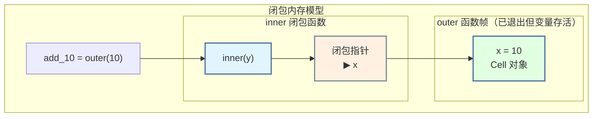
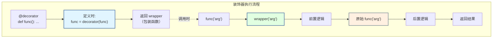
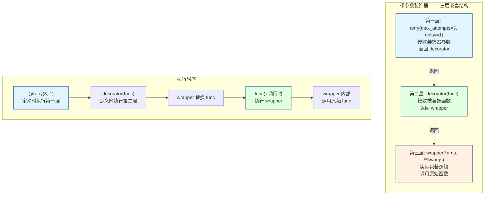

# 第 3 章 Python 函数、作用域与装饰器 ⭐⭐⭐⭐
> [!abstract] 本章导航
> **定位**：第一部分 Python 与后端工程基础中的第 3 章；围绕“Python 函数、作用域与装饰器”建立单一、可追踪的知识主线。
>
> **先修**：[[02_Python对象模型与可变性|第 2 章 Python 对象模型与可变性]]。
>
> **学习目标**：
> - 解释 函数与模块 ⭐⭐⭐⭐ 的核心问题、机制与适用边界。
> - 实现或评估 闭包 Closure ⭐⭐⭐⭐ 的最小闭环。
> - 使用可复现证据诊断 装饰器 Decorator ⭐⭐⭐⭐⭐ 的工程取舍与失败模式。
>
> **建议路径**：函数与模块 ⭐⭐⭐⭐ → 闭包 Closure ⭐⭐⭐⭐ → 装饰器 Decorator ⭐⭐⭐⭐⭐。
>
> **配套代码**：`code/ch01_python_runtime/`、`code/ch04_iteration_functional/`。

本章先回答“函数与模块 ⭐⭐⭐⭐”为什么成立，再沿着机制、实现、评估和边界逐步展开。阅读时先建立因果链，再运行或推演示例，最后用章末自测检查能否脱离原文复述。
## 3.1 函数与模块 ⭐⭐⭐⭐

### 3.1.1 参数传递机制（面试高频考点）

```python
"""
Python 参数传递：传对象引用（Pass by Object Reference）

核心原则：
- 不可变对象（int, str, tuple）：函数内修改相当于重新赋值，不影响外部
- 可变对象（list, dict, set）：函数内修改会影响外部
"""

# ─────────────────────────────────────────────────────────────
# 不可变对象的参数传递
# ─────────────────────────────────────────────────────────────

def increment(x):
    """试图修改不可变整数 — 不会影外部"""
    x += 1           # 创建新的 int 对象，局部变量 x 指向新对象
    print(f"函数内 x = {x}")   # 11

a = 10
increment(a)
print(f"函数外 a = {a}")       # 10 — 不变！

# ─────────────────────────────────────────────────────────────
# 可变对象的参数传递
# ─────────────────────────────────────────────────────────────

def append_item(lst, item):
    """修改可变列表 — 会影响外部！"""
    lst.append(item)  # 原地修改列表

my_list = [1, 2, 3]
append_item(my_list, 4)
print(my_list)       # [1, 2, 3, 4] — 被修改了！

# ─────────────────────────────────────────────────────────────
# 陷阱：默认参数的延迟绑定 ⭐⭐⭐⭐⭐
# ─────────────────────────────────────────────────────────────

def add_item_bad(item, items=[]):
    """❌ 危险！默认参数在函数定义时求值，只创建一次"""
    items.append(item)
    return items

print(add_item_bad(1))   # [1]
print(add_item_bad(2))   # [1, 2] — 列表保留了上次的结果！

def add_item_good(item, items=None):
    """✅ 正确！用 None 作为哨兵值，在函数体内创建新列表"""
    if items is None:
        items = []       # 每次调用都创建新列表
    items.append(item)
    return items

print(add_item_good(1))  # [1]
print(add_item_good(2))  # [2] — 正确！

"""
默认参数陷阱的底层原理：

函数对象在定义时创建，默认参数作为函数对象的属性存储：

┌─────────────────────────────────────────┐
│  函数对象 add_item_bad                   │
│  ─────────────────────────────          │
│  __defaults__ = ([],)                   │
│           │                             │
│           ▼                             │
│        同一个列表对象（函数定义时创建）      │
│        所有调用共享这个列表！               │
└─────────────────────────────────────────┘
"""
```

### 3.1.2 *args 和 **kwargs ⭐⭐⭐⭐

```python
"""
*args 和 **kwargs — 函数参数打包与解包
"""

# ─────────────────────────────────────────────────────────────
# 参数定义顺序（面试重点）
# ─────────────────────────────────────────────────────────────

# 正确的参数顺序：
# def func(位置参数, 默认参数, *args, 关键字-only参数, **kwargs):
#     pass

def func_demo(a, b=2, *args, c=10, **kwargs):
    """
    a:     位置参数（必填）
    b:     默认参数
    *args: 多余的位置参数 → 元组
    c:     关键字-only参数（必须用关键字传入）
    **kwargs: 多余的关键字参数 → 字典
    """
    print(f"a = {a}")
    print(f"b = {b}")
    print(f"args = {args}")
    print(f"c = {c}")
    print(f"kwargs = {kwargs}")

func_demo(1, 3, 4, 5, c=20, d=6, e=7)
# a = 1
# b = 3
# args = (4, 5)
# c = 20
# kwargs = {'d': 6, 'e': 7}

# ─────────────────────────────────────────────────────────────
# * 和 ** 的解包用法
# ─────────────────────────────────────────────────────────────

# * 解包可迭代对象
def sum_three(a, b, c):
    return a + b + c

nums = [1, 2, 3]
print(sum_three(*nums))  # 6 — 等价于 sum_three(1, 2, 3)

# ** 解包字典为关键字参数
def greet(name, age):
    return f"{name} is {age} years old"

person = {"name": "Alice", "age": 25}
print(greet(**person))   # "Alice is 25 years old"

# 组合使用
data = [1, 2]
config = {"c": 3}
# print(sum_three(*data, **config))  # 6

# ─────────────────────────────────────────────────────────────
# 仅限关键字参数（Keyword-Only Arguments）
# ─────────────────────────────────────────────────────────────

def safe_divide(a, b, *, strict=False):
    """
    * 后的所有参数必须用关键字传入
    这种设计用于避免参数顺序错误
    """
    if strict and b == 0:
        raise ValueError("除数不能为零")
    return a / b if b != 0 else float('inf')

print(safe_divide(10, 2))           # 5.0
print(safe_divide(10, 0, strict=True))  # 必须用关键字传入 strict
```

### 3.1.3 Lambda 表达式与高阶函数

```python
"""
Lambda 与高阶函数 — 函数式编程基础
"""

from functools import reduce

# ─────────────────────────────────────────────────────────────
# Lambda 表达式
# ─────────────────────────────────────────────────────────────

# Lambda 是匿名函数，语法限制：只能有一个表达式，不能包含语句
square = lambda x: x ** 2
print(square(5))   # 25

# Lambda 的典型应用场景：作为回调函数
pairs = [(1, 'one'), (2, 'two'), (3, 'three'), (4, 'four')]
pairs.sort(key=lambda pair: pair[1])  # 按字符串排序
print(pairs)   # [(4, 'four'), (1, 'one'), (3, 'three'), (2, 'two')]

# ─────────────────────────────────────────────────────────────
# 三大高阶函数：map / filter / reduce
# ─────────────────────────────────────────────────────────────

numbers = [1, 2, 3, 4, 5]

# map — 映射：对每个元素应用函数
squares = list(map(lambda x: x**2, numbers))
# 等价于 [x**2 for x in numbers]（列表推导式通常更推荐）

# filter — 过滤：保留满足条件的元素
evens = list(filter(lambda x: x % 2 == 0, numbers))
# 等价于 [x for x in numbers if x % 2 == 0]

# reduce — 累积：两两合并
product = reduce(lambda x, y: x * y, numbers)  # 1*2*3*4*5 = 120

# ─────────────────────────────────────────────────────────────
# sorted 与自定义排序（面试高频）
# ─────────────────────────────────────────────────────────────

students = [
    {"name": "Alice", "score": 85},
    {"name": "Bob", "score": 92},
    {"name": "Charlie", "score": 78},
    {"name": "David", "score": 92},
]

# 按分数降序，分数相同按姓名升序
sorted_students = sorted(
    students,
    key=lambda s: (-s["score"], s["name"])
)
print(sorted_students)
# [{'name': 'Bob', 'score': 92}, {'name': 'David', 'score': 92},
#  {'name': 'Alice', 'score': 85}, {'name': 'Charlie', 'score': 78}]

# ─────────────────────────────────────────────────────────────
# functools 工具函数
# ─────────────────────────────────────────────────────────────

from functools import partial, lru_cache

# partial — 函数柯里化（固定部分参数）
base_2_log = partial(lambda base, x: __import__('math').log(x, base), 2)
print(base_2_log(8))  # 3.0 (log2(8))

# lru_cache — 函数结果缓存（面试常考，用于记忆化递归）
@lru_cache(maxsize=128)
def fibonacci(n):
    """带缓存的斐波那契，时间复杂度从 O(2^n) 降到 O(n)"""
    if n < 2:
        return n
    return fibonacci(n - 1) + fibonacci(n - 2)

print(fibonacci(100))  # 354224848179261915075（瞬间完成）
print(f"缓存信息: {fibonacci.cache_info()}")
```

### 3.1.4 LEGB 规则 ⭐⭐⭐⭐

```python
"""
LEGB 规则：变量查找的优先级顺序

L — Local（局部作用域）：当前函数内部
E — Enclosing（嵌套作用域）：外层嵌套函数
G — Global（全局作用域）：模块级别
B — Built-in（内置作用域）：builtins 模块
"""

# ─────────────────────────────────────────────────────────────
# LEGB 规则演示
# ─────────────────────────────────────────────────────────────

x = "global"       # G — 全局

def outer():
    x = "enclosing"  # E — 外层函数的局部变量

    def inner():
        x = "local"  # L — 本函数的局部变量
        print(x)     # "local" — 按 LEGB 找到 Local

    inner()

outer()

# ─────────────────────────────────────────────────────────────
# global 和 nonlocal 关键字
# ─────────────────────────────────────────────────────────────

counter = 0

def increment_global():
    """使用 global 修改全局变量"""
    global counter
    counter += 1

increment_global()
print(counter)   # 1

def outer_counter():
    """使用 nonlocal 修改外层变量"""
    count = 0

    def inner():
        nonlocal count   # 声明使用外层（非全局）变量
        count += 1
        return count

    return inner

increment = outer_counter()
print(increment())   # 1
print(increment())   # 2
print(increment())   # 3

# ─────────────────────────────────────────────────────────────
# 🎯 面试陷阱：LEGB 与默认值捕获
# ─────────────────────────────────────────────────────────────

# 陷阱：lambda 在循环中延迟绑定
funcs = []
for i in range(3):
    funcs.append(lambda: i)   # i 是自由变量，不是默认值

print([f() for f in funcs])   # [2, 2, 2] — 不是 [0, 1, 2]！

# 正确做法：用默认参数捕获当前值
funcs_correct = []
for i in range(3):
    funcs_correct.append(lambda x=i: x)   # x=i 在定义时求值

print([f() for f in funcs_correct])  # [0, 1, 2] ✅
```

## 3.2 闭包 Closure ⭐⭐⭐⭐

### 3.2.1 闭包的三要素

```python
"""
闭包（Closure）— 面试高频考点

定义：闭包 = 嵌套函数 + 引用外部变量 + 返回嵌套函数

闭包的三要素：
1. 必须有一个嵌套函数
2. 嵌套函数必须引用外部函数中的变量
3. 外部函数必须返回嵌套函数

闭包的本质：函数记住并访问它被创建时的词法环境
"""

# ─────────────────────────────────────────────────────────────
# 闭包基础示例
# ─────────────────────────────────────────────────────────────

def outer(x):           # 外部函数
    def inner(y):       # 嵌套函数 —— 闭包
        return x + y    # inner 引用了外部变量 x
    return inner        # 返回嵌套函数（不是调用！）

# 创建两个不同的闭包
add_10 = outer(10)      # add_10 是一个闭包，记住了 x=10
add_20 = outer(20)      # add_20 是一个闭包，记住了 x=20

print(add_10(5))        # 15 — 10 + 5
print(add_20(5))        # 25 — 20 + 5

# 验证闭包记住了外部变量
print(add_10.__closure__[0].cell_contents)   # 10
print(add_20.__closure__[0].cell_contents)   # 20

"""
闭包的内存模型：

┌─────────────────────────────────────────────────────────┐
│  调用 outer(10) 时                                       │
│                                                         │
│  outer 的局部变量: x = 10                               │
│       │                                                 │
│       ▼                                                 │
│  ┌──────────┐      ┌─────────────────────┐             │
│  │  inner   │─────▶│ 函数对象 + 闭包变量  │             │
│  │  函数    │      │ x = 10 (cell)        │             │
│  └──────────┘      └─────────────────────┘             │
│       │                          ▲                      │
│       └────────── 返回 ──────────┘                      │
│                                                         │
│  outer 执行完毕，但 x 没有被销毁（被闭包引用）             │
│  add_10 = inner（带闭包的函数对象）                       │
└─────────────────────────────────────────────────────────┘
"""
```



### 3.2.2 LEGB 规则在闭包中的体现

```python
"""
LEGB 规则在闭包中的应用

L — Local:        当前函数 inner 的局部变量
E — Enclosing:    外层函数 outer 的局部变量
G — Global:       模块级别的全局变量
B — Built-in:     Python 内置变量
"""

x = "global"        # G

def outer():
    x = "enclosing"  # E

    def inner():
        x = "local"  # L
        print(x)     # "local" — 按 LEGB 找到 Local

    inner()

outer()

# ─────────────────────────────────────────────────────────────
# nonlocal —— 修改外层变量（闭包关键）
# ─────────────────────────────────────────────────────────────

def counter_factory():
    """
    闭包实现计数器 —— nonlocal 修改外层变量
    """
    count = 0           # 外层变量

    def counter():
        nonlocal count  # 声明：我要修改外层变量，不是创建局部变量
        count += 1
        return count

    def reset():
        nonlocal count
        count = 0

    # 返回多个闭包函数
    return counter, reset

cnt, reset = counter_factory()
print(cnt())    # 1
print(cnt())    # 2
print(cnt())    # 3
reset()
print(cnt())    # 1

# ─────────────────────────────────────────────────────────────
# 🎯 面试陷阱：循环中创建闭包
# ─────────────────────────────────────────────────────────────

# 陷阱：所有闭包共享同一个循环变量
def create_functions_trap():
    """❌ 错误：所有函数都返回 4"""
    functions = []
    for i in range(4):
        functions.append(lambda: i)   # i 是自由变量，不是默认值
    return functions

funcs = create_functions_trap()
print([f() for f in funcs])   # [3, 3, 3, 3] — 不是 [0, 1, 2, 3]！

# 修复：用默认参数在定义时捕获值
def create_functions_fixed():
    """✅ 正确：每个闭包捕获当前的 i 值"""
    functions = []
    for i in range(4):
        functions.append(lambda x=i: x)   # x=i 在定义时求值
    return functions

funcs = create_functions_fixed()
print([f() for f in funcs])   # [0, 1, 2, 3] ✅

# 另一种修复：用工厂函数创建闭包
def make_closure(x):
    def closure():
        return x
    return closure

def create_functions_factory():
    return [make_closure(i) for i in range(4)]

funcs = create_functions_factory()
print([f() for f in funcs])   # [0, 1, 2, 3] ✅
```

### 3.2.3 闭包的应用场景

```python
"""
闭包的实际应用 —— 理解闭包的实用价值
"""

# 1. 函数工厂 —— 根据配置创建不同的函数
def power_factory(n):
    """创建 x^n 的函数"""
    def power(x):
        return x ** n
    return power

square = power_factory(2)
cube = power_factory(3)
print(square(4))   # 16
print(cube(3))     # 27

# 2. 私有化 —— 数据隐藏
class Counter:
    """类实现"""
    def __init__(self):
        self.count = 0
    def __call__(self):
        self.count += 1
        return self.count

def make_counter():
    """闭包实现 —— count 真正私有"""
    count = 0
    def counter():
        nonlocal count
        count += 1
        return count
    return counter

# 闭包版本：count 无法从外部访问（没有 self.count）
c = make_counter()
print(c())   # 1
print(c())   # 2
# 无法访问 count 变量！真正的私有
```

## 3.3 装饰器 Decorator ⭐⭐⭐⭐⭐

### 3.3.1 装饰器原理

```python
"""
装饰器（Decorator）— 面试超高频考点

本质：装饰器是一个接收函数作为参数并返回函数的高阶函数
语法糖：@decorator 等价于 func = decorator(func)

┌─────────────────────────────────────────────────────────────┐
│                    装饰器执行流程                            │
│                                                             │
│   @decorator                                                │
│   def func():                                               │
│       pass                                                  │
│                                                             │
│   等价于：                                                   │
│   def func():                                               │
│       pass                                                  │
│   func = decorator(func)   ← 定义时执行！                    │
│                                                             │
│   注意：装饰器在函数定义时执行，不是在调用时执行              │
└─────────────────────────────────────────────────────────────┘
"""

from functools import wraps

# ─────────────────────────────────────────────────────────────
# 最简单的装饰器
# ─────────────────────────────────────────────────────────────

def my_decorator(func):
    """装饰器函数 —— 接收一个函数，返回一个新函数"""

    @wraps(func)   # 保留原函数的元信息（__name__, __doc__ 等）
    def wrapper(*args, **kwargs):
        """包装函数 —— 在目标函数前后添加逻辑"""
        print(f"=== 调用 {func.__name__} 之前 ===")
        result = func(*args, **kwargs)   # 调用被装饰的函数
        print(f"=== 调用 {func.__name__} 之后 ===")
        return result

    return wrapper   # 返回包装函数

@my_decorator
def say_hello(name):
    """打招呼"""
    return f"Hello, {name}!"

# 等价于：say_hello = my_decorator(say_hello)

print(say_hello("Alice"))
# === 调用 say_hello 之前 ===
# === 调用 say_hello 之后 ===
# Hello, Alice!

# ─────────────────────────────────────────────────────────────
# 为什么需要 @wraps？
# ─────────────────────────────────────────────────────────────

def bad_decorator(func):
    """❌ 没有 wraps —— 丢失原函数元信息"""
    def wrapper(*args, **kwargs):
        return func(*args, **kwargs)
    return wrapper

def good_decorator(func):
    """✅ 使用 wraps —— 保留原函数元信息"""
    @wraps(func)
    def wrapper(*args, **kwargs):
        return func(*args, **kwargs)
    return wrapper

@bad_decorator
def target():
    """目标函数"""
    pass

print(target.__name__)   # "wrapper" — 原函数名丢失！
print(target.__doc__)    # None

@good_decorator
def target2():
    """目标函数"""
    pass

print(target2.__name__)  # "target2" — 正确！
print(target2.__doc__)   # "目标函数"
```



### 3.3.2 无参数装饰器 —— 计时器

```python
"""
手写计时装饰器 —— 面试高频手撕代码题
"""

import time
from functools import wraps

def timer(func):
    """
    计时装饰器 —— 测量函数执行时间

    用法：
        @timer
        def slow_func():
            ...
    """
    @wraps(func)
    def wrapper(*args, **kwargs):
        start = time.perf_counter()   # 高精度计时
        result = func(*args, **kwargs)
        elapsed = time.perf_counter() - start
        print(f"⏱ {func.__name__} 执行时间: {elapsed:.4f}s")
        return result
    return wrapper

@timer
def slow_sum(n):
    """计算 1+2+...+n"""
    total = 0
    for i in range(1, n + 1):
        total += i
        time.sleep(0.001)   # 模拟耗时操作
    return total

result = slow_sum(100)
print(f"结果: {result}")

# ─────────────────────────────────────────────────────────────
# 带统计功能的计时装饰器
# ─────────────────────────────────────────────────────────────

def timer_with_stats(func):
    """
    增强版计时装饰器 —— 记录调用次数和累计时间
    """
    @wraps(func)
    def wrapper(*args, **kwargs):
        wrapper.call_count += 1
        start = time.perf_counter()
        result = func(*args, **kwargs)
        elapsed = time.perf_counter() - start
        wrapper.total_time += elapsed
        print(f"⏱ {func.__name__} #{wrapper.call_count}: {elapsed:.4f}s "
              f"(累计: {wrapper.total_time:.4f}s)")
        return result

    # 在 wrapper 上附加统计属性
    wrapper.call_count = 0
    wrapper.total_time = 0.0
    wrapper.get_stats = lambda: {
        "calls": wrapper.call_count,
        "total_time": wrapper.total_time,
        "avg_time": wrapper.total_time / wrapper.call_count if wrapper.call_count else 0,
    }

    return wrapper

@timer_with_stats
def compute(x):
    time.sleep(0.01)
    return x * x

compute(1)
compute(2)
compute(3)
print(f"统计: {compute.get_stats()}")
```

### 3.3.3 带参数装饰器 —— 三层嵌套 ⭐⭐⭐⭐⭐

```python
"""
带参数的装饰器 —— 面试高频考点

需要三层嵌套：
    第一层：接收装饰器参数
    第二层：接收被装饰函数
    第三层：包装函数（实际调用）

def decorator_with_args(arg1, arg2):    ← 第一层：接收装饰器参数
    def decorator(func):                 ← 第二层：接收被装饰函数
        @wraps(func)
        def wrapper(*args, **kwargs):    ← 第三层：包装函数
            # 可以使用 arg1, arg2
            return func(*args, **kwargs)
        return wrapper
    return decorator

@decorator_with_args("param1", "param2")
def my_func():
    pass
"""

from functools import wraps
import time

# ─────────────────────────────────────────────────────────────
# 🎯 面试真题：手写重试装饰器
# ─────────────────────────────────────────────────────────────

def retry(max_attempts=3, delay=1, exceptions=(Exception,)):
    """
    重试装饰器 —— 函数失败时自动重试

    Args:
        max_attempts: 最大重试次数（含首次调用）
        delay: 每次重试间隔（秒）
        exceptions: 需要捕获的异常类型

    用法：
        @retry(max_attempts=3, delay=0.5)
        def fetch_data():
            ...
    """
    def decorator(func):
        @wraps(func)
        def wrapper(*args, **kwargs):
            for attempt in range(1, max_attempts + 1):
                try:
                    return func(*args, **kwargs)
                except exceptions as e:
                    if attempt == max_attempts:
                        print(f"❌ {func.__name__} 在 {max_attempts} 次尝试后失败: {e}")
                        raise
                    print(f"⚠️ {func.__name__} 第 {attempt} 次失败: {e}，"
                          f"{delay}秒后重试...")
                    time.sleep(delay)
            return None   # 不会执行到这里
        return wrapper
    return decorator

# 使用重试装饰器
@retry(max_attempts=3, delay=0.1, exceptions=(ConnectionError,))
def unstable_api(call_count=[0]):
    """模拟不稳定的 API"""
    call_count[0] += 1
    if call_count[0] < 3:
        raise ConnectionError("连接超时")
    return f"成功！（第 {call_count[0]} 次）"

print(unstable_api())
# ⚠️ unstable_api 第 1 次失败: 连接超时，0.1秒后重试...
# ⚠️ unstable_api 第 2 次失败: 连接超时，0.1秒后重试...
# 成功！（第 3 次）
```



### 3.3.4 多重装饰器

```python
"""
多重装饰器 —— 执行顺序是重点

@decorator_a
@decorator_b
def func():
    pass

等价于：func = decorator_a(decorator_b(func))
执行顺序：从内到外（先 decorator_b，再 decorator_a）
"""

from functools import wraps

def decorator_a(func):
    @wraps(func)
    def wrapper(*args, **kwargs):
        print("A - 前")
        result = func(*args, **kwargs)
        print("A - 后")
        return result
    return wrapper

def decorator_b(func):
    @wraps(func)
    def wrapper(*args, **kwargs):
        print("  B - 前")
        result = func(*args, **kwargs)
        print("  B - 后")
        return result
    return wrapper

@decorator_a
@decorator_b
def target():
    print("    目标函数")

target()
# A - 前
#   B - 前
#     目标函数
#   B - 后
# A - 后

"""
执行流程：

┌─────────────┐
│ decorator_a │
│   A - 前     │
└──────┬──────┘
       │
┌──────▼──────┐
│ decorator_b │
│   B - 前     │
└──────┬──────┘
       │
┌──────▼──────┐
│   target    │
│   目标函数   │
└─────────────┘
       │
┌──────┴──────┐
│   B - 后     │
└──────┬──────┘
       │
┌──────▼──────┐
│   A - 后     │
└─────────────┘
"""
```

### 3.3.5 类装饰器

```python
"""
类装饰器 —— 用类来实现装饰器

两种方式：
1. 类作为装饰器（实现 __call__）
2. 装饰器返回类
"""

from functools import wraps

# ─────────────────────────────────────────────────────────────
# 类作为装饰器（通过 __call__）
# ─────────────────────────────────────────────────────────────

class CountCalls:
    """类装饰器 —— 统计函数被调用次数"""

    def __init__(self, func):
        wraps(func)(self)   # 等价于 @wraps(func)，但 self 是类实例
        self.count = 0

    def __call__(self, *args, **kwargs):
        self.count += 1
        print(f"{self.__wrapped__.__name__} 被调用第 {self.count} 次")
        return self.__wrapped__(*args, **kwargs)

    def __get__(self, instance, owner):
        """支持实例方法绑定 —— 将实例绑定到第一个参数"""
        from functools import partial
        return partial(self.__call__, instance)

@CountCalls
def greet(name):
    return f"Hello {name}"

greet("Alice")   # 被调用第 1 次
greet("Bob")     # 被调用第 2 次
print(f"总调用次数: {greet.count}")

# ─────────────────────────────────────────────────────────────
# 类装饰器 —— 给类添加功能
# ─────────────────────────────────────────────────────────────

def singleton_class(cls):
    """类装饰器 —— 将任意类变为单例"""
    instances = {}
    @wraps(cls)
    def wrapper(*args, **kwargs):
        if cls not in instances:
            instances[cls] = cls(*args, **kwargs)
        return instances[cls]
    return wrapper

@singleton_class
class Database:
    def __init__(self, url):
        self.url = url
        print(f"初始化数据库: {url}")

db1 = Database("mysql://localhost")
db2 = Database("postgresql://remote")
print(f"同一实例? {db1 is db2}")    # True
print(f"URL: {db2.url}")             # mysql://localhost
```
## 🧭 本章小结

- 函数与模块 ⭐⭐⭐⭐：能够说清问题、机制、证据与边界。
- 闭包 Closure ⭐⭐⭐⭐：能够说清问题、机制、证据与边界。
- 装饰器 Decorator ⭐⭐⭐⭐⭐：能够说清问题、机制、证据与边界。

## ✅ 自测与练习

1. 不看正文，解释“函数与模块 ⭐⭐⭐⭐”解决什么问题，并给出一个不适用场景。
2. 为“闭包 Closure ⭐⭐⭐⭐”设计一个最小可复现实验，明确输入、指标和通过条件。
3. 比较“装饰器 Decorator ⭐⭐⭐⭐⭐”的至少两种方案，说明质量、成本、延迟或风险取舍。

## 🧪 配套代码与验收

- `code/ch01_python_runtime/`
- `code/ch04_iteration_functional/`

```powershell
python code/scripts/run_all_examples.py --chapter ch01 --tier core
python code/scripts/run_all_examples.py --chapter ch04 --tier core
```

默认验收不下载模型、不调用付费 API；真实 API 或 GPU 示例必须按 metadata 显式启用。成功标准是相关脚本输出 `OK`，条件不足时输出可解释的 `[SKIP]`。

## 🎯 面试题精讲

回答本章问题时使用四步结构：先给结论，再解释机制，然后给项目证据，最后主动说明适用边界。涉及性能或效果时，补充模型、硬件、数据、并发、版本和统计口径；条件不完整时明确说“需要实测”。

## 📋 本章速查表

| 主题 | 回答主线 |
|---|---|
| 函数与模块 ⭐⭐⭐⭐ | 问题 → 机制 → 示例 → 指标 → 边界 |
| 闭包 Closure ⭐⭐⭐⭐ | 问题 → 机制 → 示例 → 指标 → 边界 |
| 装饰器 Decorator ⭐⭐⭐⭐⭐ | 问题 → 机制 → 示例 → 指标 → 边界 |

## 🔗 相关章节

- [[02_Python对象模型与可变性|第 2 章 Python 对象模型与可变性]]
- [[04_Python迭代协议与函数式编程|第 4 章 Python 迭代协议与函数式编程]]

## 📖 一手参考资料

> 核验基线：2026-07-31；结构复核：2026-08-05。产品、API、法规、价格与 benchmark 会变化，使用前应再次核验。

- [[docs/AUTHORITATIVE_SOURCES|章节权威来源索引]]：按主题维护官方文档、标准、原论文和官方仓库。
