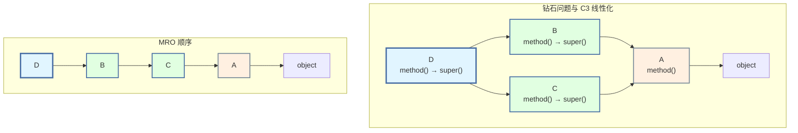
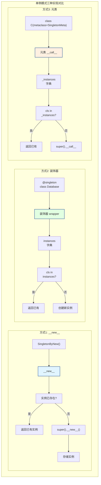

```mermaid
graph TD
    subgraph "super() 的 MRO 驱动机制"
        direction LR
        C["MyClass<br/>super()"]
        A["FeatureA<br/>super()"]
        B["FeatureB<br/>super()"]
        Base["Base<br/>super()"]

        C -->|"MRO 下一个"| A
        A -->|"MRO 下一个"| B
        B -->|"MRO 下一个"| Base
        Base -->|"MRO 下一个"| OBJ["object"]

        style C fill:#e1f5ff,stroke:#4A6FA5,stroke-width:3px
        style A fill:#e1ffe1,stroke:#4A6FA5,stroke-width:2px
        style B fill:#e1ffe1,stroke:#4A6FA5,stroke-width:2px
        style Base fill:#fff0e1,stroke:#7A8B99,stroke-width:2px
    end

    subgraph "执行顺序"
        direction LR
        S1["1️⃣ MyClass<br/>print & super()"] --> S2["2️⃣ FeatureA<br/>print & super()"]
        S2 --> S3["3️⃣ FeatureB<br/>print & super()"]
        S3 --> S4["4️⃣ Base<br/>print & super()"]

        style S1 fill:#e1f5ff,stroke:#4A6FA5,stroke-width:3px
        style S2 fill:#e1ffe1,stroke:#4A6FA5,stroke-width:2px
        style S3 fill:#e1ffe1,stroke:#4A6FA5,stroke-width:2px
        style S4 fill:#fff0e1,stroke:#7A8B99,stroke-width:2px
    end
```

# 第 3 章 Python 面向对象编程

> **面试频率**: ⭐⭐⭐⭐⭐ | **出现概率**: 极高
>
> 面向对象编程（OOP）是 Python 面试的核心战场，尤其是**多继承的 C3 线性化算法**、**`__new__` 与 `__init__` 的区别**、**单例模式的实现**是超高频手撕代码题。本章从基础到进阶，深入 Python OOP 的每一个细节。

---

## 3.1 类与对象基础 ⭐⭐⭐⭐

### 3.1.1 类的定义与实例化

```python
"""
类与对象 —— Python OOP 基础

Python 中一切都是对象，包括类本身（类是 type 的实例）
"""

# ─────────────────────────────────────────────────────────────
# 类定义与实例化
# ─────────────────────────────────────────────────────────────

class Dog:
    """类的文档字符串（docstring）"""

    # 类属性 —— 所有实例共享
    species = "Canis familiaris"
    count = 0

    def __init__(self, name: str, age: int):
        """
        构造方法 —— 实例化时自动调用
        self 指向新创建的实例对象
        """
        # 实例属性 —— 每个实例独立
        self.name = name
        self.age = age
        Dog.count += 1   # 修改类属性

    def bark(self):
        """实例方法 —— 第一个参数必须是 self"""
        return f"{self.name} says: Woof!"

    @classmethod
    def create_puppy(cls, name: str):
        """类方法 —— 第一个参数是 cls，可访问类属性"""
        return cls(name, age=0)   # 创建 0 岁的小狗

    @staticmethod
    def is_valid_age(age: int) -> bool:
        """静态方法 —— 无 self 或 cls，像普通函数"""
        return 0 <= age <= 30

# 实例化
dog1 = Dog("Buddy", 3)
dog2 = Dog.create_puppy("Max")

print(dog1.bark())              # "Buddy says: Woof!"
print(Dog.is_valid_age(5))      # True
print(f"共创建了 {Dog.count} 只狗")

# ─────────────────────────────────────────────────────────────
# 🎯 面试陷阱：类属性 vs 实例属性
# ─────────────────────────────────────────────────────────────

class Trap:
    # 类属性 —— 可变类型的陷阱！
    items = []   # ❌ 所有实例共享同一个列表

t1 = Trap()
t2 = Trap()
t1.items.append(1)
print(t2.items)   # [1] — t2 也被修改了！

class Safe:
    def __init__(self):
        self.items = []   # ✅ 每个实例有自己的列表

s1 = Safe()
s2 = Safe()
s1.items.append(1)
print(s2.items)   # [] — 独立
```

### 3.1.2 类属性、实例属性、私有属性

```python
"""
属性访问机制 —— 面试考点
"""

class BankAccount:
    """银行账户类 —— 演示属性封装"""

    bank_name = "Python Bank"   # 类属性

    def __init__(self, owner: str, balance: float):
        self.owner = owner              # 公有属性
        self._balance = balance          # 约定：单下划线表示"内部使用"
        self.__password = "123456"       # 私有属性 —— 名称改写

    # ── property 装饰器 —— 属性访问控制 ──
    @property
    def balance(self):
        """getter —— 读取 balance 时调用"""
        return self._balance

    @balance.setter
    def balance(self, value):
        """setter —— 设置 balance 时调用"""
        if value < 0:
            raise ValueError("余额不能为负数")
        self._balance = value

    @balance.deleter
    def balance(self):
        """deleter —— 删除 balance 时调用"""
        raise AttributeError("不能删除余额属性")

# 使用
account = BankAccount("Alice", 1000)
print(account.balance)       # 1000 — 调用 getter
account.balance = 2000       # 调用 setter
# account.balance = -100    # ValueError: 余额不能为负数
# del account.balance       # AttributeError

# 私有属性的名称改写（Name Mangling）
# __password → _BankAccount__password
print(dir(account))          # 可看到 _BankAccount__password
print(account._BankAccount__password)   # "123456" — 强行访问（不推荐）

"""
名称改写机制：

class 中的 __xxx 属性会被改写为 _ClassName__xxx
目的是防止子类意外覆盖父类的私有属性

┌─────────────────────────────────────────────┐
│  类 BankAccount                              │
│  ─────────────────                           │
│  owner          → 公有，可直接访问             │
│  _balance       → 约定私有，仍可直接访问        │
│  __password     → _BankAccount__password      │
│                   名称改写，难以意外访问        │
└─────────────────────────────────────────────┘
"""
```

---

## 3.2 面向对象三大特性 ⭐⭐⭐⭐⭐

### 3.2.1 封装（Encapsulation）

```python
"""
封装 —— 隐藏内部实现，暴露清晰接口
Python 通过命名约定实现封装（非强制）
"""

class Temperature:
    """
    温度类 —— 封装 Celsius 和 Fahrenheit 的转换逻辑
    """

    def __init__(self, celsius: float = 0):
        self._celsius = celsius   # 内部使用下划线前缀

    @property
    def celsius(self) -> float:
        """摄氏度 —— 只读属性"""
        return self._celsius

    @celsius.setter
    def celsius(self, value: float):
        """设置摄氏度，自动校验"""
        if value < -273.15:
            raise ValueError("温度不能低于绝对零度")
        self._celsius = value

    @property
    def fahrenheit(self) -> float:
        """华氏度 —— 自动转换（计算属性）"""
        return self._celsius * 9 / 5 + 32

    @fahrenheit.setter
    def fahrenheit(self, value: float):
        """通过华氏度设置，反向转换"""
        self._celsius = (value - 32) * 5 / 9

    @property
    def kelvin(self) -> float:
        """开尔文"""
        return self._celsius + 273.15

# 使用 —— 封装隐藏了转换公式
t = Temperature(25)
print(f"{t.celsius}°C = {t.fahrenheit}°F = {t.kelvin}K")
t.fahrenheit = 98.6
print(f"{t.celsius}°C = {t.fahrenheit}°F")
```

### 3.2.2 继承（Inheritance）

```python
"""
继承 —— 复用父类的属性和方法

Python 支持多继承，方法解析顺序（MRO）通过 C3 线性化算法确定
"""

# ─────────────────────────────────────────────────────────────
# 单继承
# ─────────────────────────────────────────────────────────────

class Animal:
    """动物基类"""

    def __init__(self, name: str):
        self.name = name

    def speak(self):
        raise NotImplementedError("子类必须实现此方法")

    def introduce(self):
        return f"我是 {self.name}"

class Dog(Animal):
    """狗 —— 继承 Animal"""

    def __init__(self, name: str, breed: str):
        super().__init__(name)   # 调用父类构造方法
        self.breed = breed        # 子类特有属性

    def speak(self):
        return f"{self.name}: Woof!"

    def fetch(self):
        """子类特有方法"""
        return f"{self.name} 去捡球了"

# ─────────────────────────────────────────────────────────────
# super() 的深入理解
# ─────────────────────────────────────────────────────────────

"""
super() 不是调用父类，而是按照 MRO 顺序调用下一个类！

在单继承中：super() ≈ 调用父类
在多继承中：super() 调用 MRO 列表中的下一个类

这是理解多继承的关键！
"""

class A:
    def __init__(self):
        print("A.__init__")
        super().__init__()   # 按 MRO 继续调用

class B(A):
    def __init__(self):
        print("B.__init__")
        super().__init__()   # 不是直接调用 A！是按 MRO 调用下一个

class C(B):
    def __init__(self):
        print("C.__init__")
        super().__init__()

# MRO: C -> B -> A -> object
C()
# 输出:
# C.__init__
# B.__init__
# A.__init__
```

### 3.2.3 多态（Polymorphism）— 鸭子类型

```python
"""
多态 —— Python 采用鸭子类型（Duck Typing）

"如果它走起来像鸭子，叫起来像鸭子，那它就是鸭子"

不需要显式继承接口，只要实现了需要的方法即可
"""

# ─────────────────────────────────────────────────────────────
# 鸭子类型演示
# ─────────────────────────────────────────────────────────────

class Dog:
    def speak(self):
        return "Woof!"

class Cat:
    def speak(self):
        return "Meow!"

class Duck:
    def speak(self):
        return "Quack!"

# 多态函数 —— 不检查类型，只检查行为
def animal_sound(animal):
    """任何有 speak() 方法的对象都可以传入"""
    return animal.speak()

# 不同类型的对象可以统一处理
for animal in [Dog(), Cat(), Duck()]:
    print(animal_sound(animal))
# Woof!
# Meow!
# Quack!

# ─────────────────────────────────────────────────────────────
# 抽象基类（ABC）— 强制接口实现
# ─────────────────────────────────────────────────────────────

from abc import ABC, abstractmethod

class Shape(ABC):
    """形状抽象基类 —— 子类必须实现 area() 和 perimeter()"""

    @abstractmethod
    def area(self) -> float:
        """计算面积"""
        pass

    @abstractmethod
    def perimeter(self) -> float:
        """计算周长"""
        pass

    def describe(self):
        """具体方法 —— 子类可直接使用"""
        return f"面积: {self.area():.2f}, 周长: {self.perimeter():.2f}"

class Rectangle(Shape):
    def __init__(self, width: float, height: float):
        self.width = width
        self.height = height

    def area(self) -> float:
        return self.width * self.height

    def perimeter(self) -> float:
        return 2 * (self.width + self.height)

# shape = Shape()     # TypeError: 不能实例化抽象类
rect = Rectangle(3, 4)
print(rect.describe())   # "面积: 12.00, 周长: 14.00"

# ─────────────────────────────────────────────────────────────
# 注册虚拟子类 —— 不继承但被认为是子类
# ─────────────────────────────────────────────────────────────

class Circle:
    """普通类 —— 没有显式继承 Shape"""
    def __init__(self, radius: float):
        self.radius = radius

    def area(self) -> float:
        import math
        return math.pi * self.radius ** 2

    def perimeter(self) -> float:
        import math
        return 2 * math.pi * self.radius

# 注册为 Shape 的虚拟子类
Shape.register(Circle)
print(issubclass(Circle, Shape))   # True
print(isinstance(Circle(1), Shape)) # True
```

---

## 3.3 多继承与 C3 线性化算法 ⭐⭐⭐⭐⭐

### 3.3.1 钻石问题（Diamond Problem）

```python
"""
多继承的钻石问题 —— 为什么需要 C3 线性化

    A
   / \
  B   C
   \ /
    D

D 继承 B 和 C，B 和 C 都继承 A。
当 D 调用 super() 时，A 的方法会被调用几次？
Python 的 C3 线性化确保 A 只被调用一次！
"""

class A:
    def method(self):
        print("A.method")

class B(A):
    def method(self):
        print("B.method")
        super().method()   # 调用 MRO 中的下一个

class C(A):
    def method(self):
        print("C.method")
        super().method()

class D(B, C):
    def method(self):
        print("D.method")
        super().method()

# MRO: D -> B -> C -> A -> object
print("MRO:", [c.__name__ for c in D.__mro__])
# ['D', 'B', 'C', 'A', 'object']

D().method()
# D.method
# B.method
# C.method
# A.method
# A 只被调用一次！✅
```



### 3.3.2 C3 线性化算法原理

```python
"""
C3 线性化算法 —— 方法解析顺序（MRO）的计算

C3 算法的三条原则：
1. 子类优先于父类
2. 多个父类按声明顺序
3. 单调性：如果在某个类的 MRO 中 A 在 B 前面，
   则该类的所有子类的 MRO 中 A 也在 B 前面

算法公式：
L(C) = C + merge(L(B1), L(B2), ..., [B1, B2, ...])
"""

# ─────────────────────────────────────────────────────────────
# MRO 计算示例
# ─────────────────────────────────────────────────────────────

class Base:
    pass

class X(Base):
    pass

class Y(Base):
    pass

class Z(X, Y):
    pass

print(f"Z 的 MRO: {[c.__name__ for c in Z.__mro__]}")
# ['Z', 'X', 'Y', 'Base', 'object']

"""
MRO 计算过程：

L(Z) = Z + merge(L(X), L(Y), [X, Y])
     = Z + merge([X, Base, object], [Y, Base, object], [X, Y])

merge 过程：
1. 取第一个列表的头 X，检查 X 不在其他列表的尾部
   → X 不在 [Base, object], [Base, object], [Y] 中
   → 可以取出！
   
   结果: [X] + merge([Base, object], [Y, Base, object], [Y])

2. 取第一个列表的头 Base，检查 Base 不在其他列表尾部
   → Base 在 [Base, object] 的尾部！不能取
   
3. 取第二个列表的头 Y，检查 Y 不在其他列表尾部
   → Y 不在 [object], [Base, object] 中
   → 可以取出！
   
   结果: [X, Y] + merge([Base, object], [Base, object])

4. 取第一个列表的头 Base
   → Base 不在 [object] 中
   → 可以取出！

最终结果: [Z, X, Y, Base, object]
"""

# ─────────────────────────────────────────────────────────────
# MRO 冲突（无法创建的情况）
# ─────────────────────────────────────────────────────────────

"""
以下继承关系会导致 MRO 冲突，Python 会抛出 TypeError：

class A: pass
class B(A): pass
class C(A): pass
class D(B, C): pass  # ✅ MRO: D -> B -> C -> A -> object

class E(C, B): pass  # ✅ MRO: E -> C -> B -> A -> object

# 但如果尝试同时继承 D 和 E：
# class F(D, E): pass  # ❌ TypeError: MRO 冲突！

原因：D 的 MRO 中 B 在 C 前面，但 E 的 MRO 中 C 在 B 前面，
      F 无法同时满足这两个顺序。
"""

# 验证
class A: pass
class B(A): pass
class C(A): pass
class D(B, C): pass
class E(C, B): pass

try:
    class F(D, E):
        pass
except TypeError as e:
    print(f"MRO 冲突: {e}")
```

### 3.3.3 super() 在多继承中的行为

```python
"""
super() 在多继承中的协同调用（Cooperative Multiple Inheritance）

核心设计模式：所有类都调用 super()，确保 MRO 链完整执行
"""

class Base:
    def __init__(self):
        print("Base.__init__")
        super().__init__()   # 关键：即使是基类也要调用 super()

class FeatureA(Base):
    def __init__(self):
        print("FeatureA.__init__")
        super().__init__()

class FeatureB(Base):
    def __init__(self):
        print("FeatureB.__init__")
        super().__init__()

class MyClass(FeatureA, FeatureB):
    def __init__(self):
        print("MyClass.__init__")
        super().__init__()

# MRO: MyClass -> FeatureA -> FeatureB -> Base -> object
obj = MyClass()
# MyClass.__init__
# FeatureA.__init__
# FeatureB.__init__
# Base.__init__

# ─────────────────────────────────────────────────────────────
# 🎯 面试陷阱：忘记调用 super()
# ─────────────────────────────────────────────────────────────

class BadA:
    def __init__(self):
        print("BadA.__init__")
        # ❌ 没有调用 super()

class BadB:
    def __init__(self):
        print("BadB.__init__")
        super().__init__()

class BadChild(BadA, BadB):
    def __init__(self):
        print("BadChild.__init__")
        super().__init__()

# MRO: BadChild -> BadA -> BadB -> object
BadChild()
# BadChild.__init__
# BadA.__init__
# BadB.__init__ 不会被执行！❌
```



---

## 3.4 `__new__` vs `__init__` ⭐⭐⭐⭐⭐

### 3.4.1 核心区别

```python
"""
__new__ vs __init__ —— 面试超高频考点

        实例化流程
    ┌─────────────────────────────────────────┐
    │                                         │
    │   1. 调用 __new__(cls, *args, **kwargs)  │
    │      ↓ 创建并返回实例对象（分配内存）      │
    │   2. 调用 __init__(self, *args, **kwargs) │
    │      ↓ 初始化实例属性                     │
    │   3. 返回初始化后的实例                    │
    │                                         │
    └─────────────────────────────────────────┘

┌─────────────┬─────────────────────────┬─────────────────────────┐
│    特性      │        __new__          │        __init__         │
├─────────────┼─────────────────────────┼─────────────────────────┤
│ 调用时机     │ 创建实例之前             │ 实例创建之后             │
│ 第一个参数   │ cls（类本身）            │ self（实例本身）         │
│ 返回值      │ 必须返回实例对象          │ 不能返回任何值（None）    │
│ 静态/实例   │ 静态方法（特殊处理）       │ 实例方法                │
│ 典型用途    │ 控制实例创建（单例等）     │ 初始化属性              │
│ 触发方式    │ 实例化时自动调用          │ __new__ 返回实例后自动调用 │
└─────────────┴─────────────────────────┴─────────────────────────┘
"""

class Demo:
    def __new__(cls, *args, **kwargs):
        print(f"1. __new__ 被调用: cls={cls.__name__}")
        instance = super().__new__(cls)   # 必须调用父类的 __new__ 创建实例
        print(f"   实例已创建: id={id(instance)}")
        return instance                   # 必须返回实例

    def __init__(self, name):
        print(f"2. __init__ 被调用: self={id(self)}")
        self.name = name
        print(f"   属性已初始化: name={name}")

obj = Demo("test")
# 1. __new__ 被调用: cls=Demo
#    实例已创建: id=...
# 2. __init__ 被调用: self=...
#    属性已初始化: name=test
```

### 3.4.2 单例模式的三种实现 ⭐⭐⭐⭐⭐

```python
"""
单例模式 —— 面试手撕代码超高频题

确保一个类只有一个实例，并提供一个全局访问点
"""

import threading

# ─────────────────────────────────────────────────────────────
# 方式1：__new__ 方法（最经典）
# ─────────────────────────────────────────────────────────────

class SingletonByNew:
    """
    通过 __new__ 实现单例

    原理：重写 __new__，在创建实例前检查是否已存在
    """
    _instance = None
    _lock = threading.Lock()

    def __new__(cls, *args, **kwargs):
        if cls._instance is None:           # 双重检查锁定
            with cls._lock:
                if cls._instance is None:   # 再次检查（防止并发创建）
                    cls._instance = super().__new__(cls)
        return cls._instance

    def __init__(self, name=""):
        # ⚠️ 注意：__init__ 每次获取实例都会调用！
        if not hasattr(self, '_initialized'):
            self.name = name
            self._initialized = True

# 验证
s1 = SingletonByNew("first")
s2 = SingletonByNew("second")
print(f"同一实例? {s1 is s2}")      # True
print(f"name: {s1.name}")           # "first" — 第二次的初始化被忽略

# ─────────────────────────────────────────────────────────────
# 方式2：装饰器实现
# ─────────────────────────────────────────────────────────────

from functools import wraps

def singleton(cls):
    """
    单例装饰器 —— 最 Pythonic 的实现

    原理：装饰器返回一个包装函数，内部维护单一实例
    """
    instances = {}
    lock = threading.Lock()

    @wraps(cls)
    def wrapper(*args, **kwargs):
        if cls not in instances:
            with lock:
                if cls not in instances:
                    instances[cls] = cls(*args, **kwargs)
        return instances[cls]

    return wrapper

@singleton
class Database:
    """数据库连接类 —— 单例"""
    def __init__(self, connection_string):
        self.connection_string = connection_string
        print(f"初始化数据库连接: {connection_string}")

db1 = Database("mysql://localhost")
db2 = Database("postgresql://remote")
print(f"同一实例? {db1 is db2}")           # True
print(f"连接字符串: {db2.connection_string}") # "mysql://localhost"

# ─────────────────────────────────────────────────────────────
# 方式3：元类实现
# ─────────────────────────────────────────────────────────────

class SingletonMeta(type):
    """
    单例元类 —— 最底层的实现

    原理：控制类的创建过程，拦截 __call__ 方法
    """
    _instances = {}
    _locks = {}

    def __call__(cls, *args, **kwargs):
        if cls not in self._instances:
            if cls not in self._locks:
                self._locks[cls] = threading.Lock()
            with self._locks[cls]:
                if cls not in self._instances:
                    self._instances[cls] = super().__call__(*args, **kwargs)
        return self._instances[cls]

class Config(metaclass=SingletonMeta):
    """配置类 —— 单例"""
    def __init__(self):
        self.debug = False
        self.database_url = "sqlite:///default.db"

cfg1 = Config()
cfg2 = Config()
cfg1.debug = True
print(f"同一实例? {cfg1 is cfg2}")    # True
print(f"cfg2.debug = {cfg2.debug}")    # True — 共享状态
```



**三种单例实现对比**：

| 实现方式 | 优点 | 缺点 | 线程安全 |
|---------|------|------|---------|
| `__new__` | 最直观，与实例化语义贴近 | `__init__ 可能重复执行` | ✅ 需手动加锁 |
| 装饰器 | 最 Pythonic，可复用 | 无法继承（类型变化） | ✅ 内置锁 |
| 元类 | 最灵活，可扩展 | 理解成本高 | ✅ 内置锁 |

---

## 3.5 魔术方法大全 ⭐⭐⭐⭐

```python
"""
魔术方法（Magic/Dunder Methods）— 以双下划线开头和结尾的特殊方法

分类：
1. 生命周期方法
2. 字符串表示方法
3. 比较方法
4. 算术运算方法
5. 容器类型方法
6. 可调用对象
7. 上下文管理器
8. 属性访问
"""

from functools import total_ordering

# ─────────────────────────────────────────────────────────────
# 完整魔术方法示例类
# ─────────────────────────────────────────────────────────────

@total_ordering   # 自动生成剩余比较方法
class Vector2D:
    """
    二维向量 —— 演示各类魔术方法
    """

    def __init__(self, x: float, y: float):
        self.x = x
        self.y = y

    # ── 1. 字符串表示 ──
    def __repr__(self):
        """面向开发者的表示 —— eval(repr(obj)) 应能重建对象"""
        return f"Vector2D({self.x!r}, {self.y!r})"

    def __str__(self):
        """面向用户的表示 —— print() 调用"""
        return f"({self.x}, {self.y})"

    def __format__(self, format_spec):
        """格式化 —— format(obj, spec) 调用"""
        if format_spec == "polar":
            import math
            r = math.hypot(self.x, self.y)
            theta = math.degrees(math.atan2(self.y, self.x))
            return f"(r={r:.2f}, θ={theta:.1f}°)"
        return str(self)

    # ── 2. 比较运算 ──
    def __eq__(self, other):
        if isinstance(other, Vector2D):
            return self.x == other.x and self.y == other.y
        return NotImplemented   # 返回 NotImplemented 让 Python 尝试反向操作

    def __lt__(self, other):
        """按模长比较"""
        if isinstance(other, Vector2D):
            return (self.x**2 + self.y**2) < (other.x**2 + other.y**2)
        return NotImplemented

    def __hash__(self):
        """需要 hash 时必须与 __eq__ 一致：相等对象哈希值相同"""
        return hash((self.x, self.y))

    # ── 3. 算术运算 ──
    def __add__(self, other):
        if isinstance(other, Vector2D):
            return Vector2D(self.x + other.x, self.y + other.y)
        return NotImplemented

    def __sub__(self, other):
        if isinstance(other, Vector2D):
            return Vector2D(self.x - other.x, self.y - other.y)
        return NotImplemented

    def __mul__(self, scalar):
        """数乘：v * 3"""
        if isinstance(scalar, (int, float)):
            return Vector2D(self.x * scalar, self.y * scalar)
        return NotImplemented

    def __rmul__(self, scalar):
        """反向数乘：3 * v"""
        return self.__mul__(scalar)

    def __neg__(self):
        """取反：-v"""
        return Vector2D(-self.x, -self.y)

    def __abs__(self):
        """模长：abs(v)"""
        import math
        return math.hypot(self.x, self.y)

    # ── 4. 容器协议 ──
    def __len__(self):
        """维度数"""
        return 2

    def __getitem__(self, index):
        """索引访问：v[0], v[1]"""
        if index == 0:
            return self.x
        elif index == 1:
            return self.y
        raise IndexError("Vector2D 只有 2 个分量")

    def __iter__(self):
        """迭代：for x in v"""
        yield self.x
        yield self.y

    # ── 5. 可调用对象 ──
    def __call__(self, other):
        """点积：v1(v2)"""
        if isinstance(other, Vector2D):
            return self.x * other.x + self.y * other.y
        raise TypeError("参数必须是 Vector2D")

    # ── 6. 上下文管理器 ──
    def __enter__(self):
        print(f"进入上下文: {self}")
        return self

    def __exit__(self, exc_type, exc_val, exc_tb):
        print(f"退出上下文: {self}")
        if exc_type:
            print(f"  捕获异常: {exc_type.__name__}")
        return False   # 不抑制异常

# ── 使用演示 ──
v1 = Vector2D(3, 4)
v2 = Vector2D(1, 2)

print(repr(v1))           # "Vector2D(3, 4)"
print(str(v1))            # "(3, 4)"
print(format(v1, "polar")) # "(r=5.00, θ=53.1°)"

print(v1 + v2)            # (4, 6)
print(v1 * 3)             # (9, 12)
print(3 * v1)             # (9, 12) — __rmul__
print(abs(v1))            # 5.0
print(v1(v2))             # 11 — 点积 (3*1 + 4*2)
print(v1 == Vector2D(3, 4))  # True
print(v1 > v2)            # True (25 > 5)

# 作为字典键（需要 __hash__）
vectors = {v1: "vector1", v2: "vector2"}
print(vectors[Vector2D(3, 4)])   # "vector1"

# 上下文管理器
with Vector2D(1, 1) as v:
    print(f"使用中: {v}")
```

### 3.5.1 魔术方法速查表

| 类别 | 方法 | 触发方式 | 说明 |
|------|------|---------|------|
| **生命周期** | `__new__` | `Cls()` | 创建实例 |
| | `__init__` | `Cls()` 后 | 初始化 |
| | `__del__` | `del obj` / GC | 析构（少用） |
| **字符串** | `__repr__` | `repr()` / 交互式 | 开发者表示 |
| | `__str__` | `str()` / `print()` | 用户表示 |
| | `__format__` | `format()` / f-string | 格式化 |
| | `__bytes__` | `bytes()` | 字节表示 |
| **比较** | `__eq__` | `==` | 等于 |
| | `__ne__` | `!=` | 不等于 |
| | `__lt__` | `<` | 小于 |
| | `__le__` | `<=` | 小于等于 |
| | `__gt__` | `>` | 大于 |
| | `__ge__` | `>=` | 大于等于 |
| | `__hash__` | `hash()` / `set` | 哈希值 |
| **算术** | `__add__` | `+` | 加法 |
| | `__sub__` | `-` | 减法 |
| | `__mul__` | `*` | 乘法 |
| | `__truediv__` | `/` | 真除法 |
| | `__floordiv__` | `//` | 整除 |
| | `__mod__` | `%` | 取模 |
| | `__pow__` | `**` | 幂运算 |
| | `__radd__` | 右侧 `+` | 反向加法 |
| | `__iadd__` | `+=` | 原地加法 |
| **容器** | `__len__` | `len()` | 长度 |
| | `__getitem__` | `obj[key]` | 获取项 |
| | `__setitem__` | `obj[key]=v` | 设置项 |
| | `__delitem__` | `del obj[key]` | 删除项 |
| | `__contains__` | `in` | 成员判断 |
| | `__iter__` | `for` / `iter()` | 迭代器 |
| **可调用** | `__call__` | `obj()` | 调用对象 |
| **上下文** | `__enter__` | `with` 进入 | 上下文管理 |
| | `__exit__` | `with` 退出 | 上下文管理 |
| **属性** | `__getattr__` | 属性不存在 | 动态属性 |
| | `__getattribute__` | 任何属性访问 | 拦截所有访问 |
| | `__setattr__` | 属性赋值 | 拦截赋值 |
| | `__delattr__` | 属性删除 | 拦截删除 |
| | `__dir__` | `dir()` | 属性列表 |

### 3.5.2 `__getattr__` vs `__getattribute__` ⭐⭐⭐⭐

```python
"""
属性访问拦截 —— 面试高频考点

__getattr__:     仅在属性不存在时调用
__getattribute__: 任何属性访问都调用（包括存在的属性）
"""

class AttributeDemo:
    def __init__(self):
        self.existing = "我存在"

    def __getattr__(self, name):
        """属性不存在时调用 —— 可用于懒加载、动态属性"""
        print(f"__getattr__ 被调用: '{name}' 不存在")
        if name == "dynamic":
            value = f"动态创建的 {name}"
            setattr(self, name, value)   # 缓存
            return value
        raise AttributeError(f"'{type(self).__name__}' 没有 '{name}' 属性")

    def __getattribute__(self, name):
        """任何属性访问都经过这里 —— 慎用，容易无限递归"""
        print(f"__getattribute__ 被调用: '{name}'")
        # 必须用 object.__getattribute__ 获取，否则无限递归！
        return object.__getattribute__(self, name)

    def __setattr__(self, name, value):
        """拦截属性赋值"""
        print(f"__setattr__: {name} = {value!r}")
        super().__setattr__(name, value)

obj = AttributeDemo()
print(obj.existing)    # 先 __getattribute__，返回值
print(obj.dynamic)     # 先 __getattribute__（找不到），再 __getattr__
print(obj.dynamic)     # 第二次直接从 __getattribute__ 找到（已缓存）
# obj.nonexistent      # __getattribute__ → __getattr__ → AttributeError

"""
⚠️ __getattribute__ 使用警告：

如果在 __getattribute__ 中用 self.xxx 访问属性，
会再次触发 __getattribute__，导致无限递归！

必须用 object.__getattribute__(self, name) 来获取属性值。
"""
```

---

## 3.6 描述符协议 ⭐⭐⭐

```python
"""
描述符（Descriptor）— Python 属性访问的底层机制

描述符：实现了 __get__、__set__ 或 __delete__ 中至少一个的类

应用：@property、classmethod、staticmethod、ORM 字段

┌─────────────────────────────────────────────────────────────┐
│                     描述符分类                               │
│                                                             │
│   数据描述符（Data Descriptor）                              │
│   ├── 同时定义 __get__ + __set__                             │
│   └── 优先级高于实例字典                                     │
│                                                             │
│   非数据描述符（Non-data Descriptor）                         │
│   ├── 只定义 __get__                                         │
│   └── 优先级低于实例字典                                     │
│                                                             │
└─────────────────────────────────────────────────────────────┘
"""

# ─────────────────────────────────────────────────────────────
# 手写 @property —— 理解描述符本质
# ─────────────────────────────────────────────────────────────

class MyProperty:
    """
    模拟 property 的实现 —— 数据描述符
    """
    def __init__(self, fget=None, fset=None, fdel=None):
        self.fget = fget
        self.fset = fset
        self.fdel = fdel

    def __get__(self, instance, owner):
        """instance: 实例对象; owner: 类"""
        if instance is None:   # 类属性访问：Celsius.fahrenheit
            return self
        if self.fget is None:
            raise AttributeError("不可读")
        return self.fget(instance)

    def __set__(self, instance, value):
        if self.fset is None:
            raise AttributeError("不可写")
        self.fset(instance, value)

    def __delete__(self, instance):
        if self.fdel is None:
            raise AttributeError("不可删除")
        self.fdel(instance)

    # 支持装饰器语法
    def getter(self, fget):
        self.fget = fget
        return self

    def setter(self, fset):
        self.fset = fset
        return self

# 使用手写的 property
class Celsius:
    def __init__(self, celsius=0):
        self._celsius = celsius

    @MyProperty               # 等价于 fahrenheit = MyProperty(fget)
    def fahrenheit(self):
        return self._celsius * 9 / 5 + 32

    @fahrenheit.setter
    def fahrenheit(self, value):
        self._celsius = (value - 32) * 5 / 9

c = Celsius(25)
print(c.fahrenheit)     # 77.0

# ─────────────────────────────────────────────────────────────
# 类型检查描述符 —— 实用示例
# ─────────────────────────────────────────────────────────────

class Typed:
    """类型检查描述符 —— ORM 风格的字段定义"""

    def __init__(self, name, expected_type):
        self.name = name
        self.expected_type = expected_type

    def __get__(self, instance, owner):
        if instance is None:
            return self
        return instance.__dict__[self.name]

    def __set__(self, instance, value):
        if not isinstance(value, self.expected_type):
            raise TypeError(
                f"'{self.name}' 期望 {self.expected_type.__name__}，"
                f"收到 {type(value).__name__}"
            )
        instance.__dict__[self.name] = value

    def __delete__(self, instance):
        del instance.__dict__[self.name]

class Person:
    """使用描述符实现类型检查"""
    name = Typed("name", str)
    age = Typed("age", int)
    height = Typed("height", float)

    def __init__(self, name, age, height):
        self.name = name
        self.age = age
        self.height = height

p = Person("Alice", 25, 1.65)
# p.age = "25"  # TypeError: 'age' 期望 int，收到 str
```

---

## 3.7 元类 Metaclass ⭐⭐

```python
"""
元类（Metaclass）— 类的类

 everything in Python is an object, including classes.
 Classes are instances of type (or its subclass).

 type(name, bases, namespace) → 创建新类

┌─────────────────────────────────────────────────────────────┐
│                     元类层级                                 │
│                                                             │
│   type ──是──► type 的元类                                  │
│   │                                                         │
│   │ 是 MyClass 的元类                                       │
│   ▼                                                         │
│   MyClass ──是──► MyClass() 的类                            │
│   │                                                         │
│   │ 是 obj 的类                                             │
│   ▼                                                         │
│   obj = MyClass()                                           │
│                                                             │
│   isinstance(obj, MyClass)    → True                        │
│   isinstance(MyClass, type)   → True                        │
│   isinstance(type, type)      → True（type 是自己的实例）     │
└─────────────────────────────────────────────────────────────┘
"""

# ─────────────────────────────────────────────────────────────
# 用 type 动态创建类
# ─────────────────────────────────────────────────────────────

def say_hello(self):
    return f"Hello, I'm {self.name}"

# type(name, bases, namespace)
DynamicClass = type(
    "DynamicClass",           # 类名
    (object,),                # 基类元组
    {                         # 属性字典
        "__init__": lambda self, name: setattr(self, "name", name),
        "say_hello": say_hello,
    }
)

obj = DynamicClass("Dynamic")
print(obj.say_hello())   # "Hello, I'm Dynamic"

# ─────────────────────────────────────────────────────────────
# 自定义元类
# ─────────────────────────────────────────────────────────────

class ValidateMeta(type):
    """
    元类 —— 在类创建时自动验证属性
    """

    def __new__(mcs, name, bases, namespace):
        """创建类对象之前 —— 可修改 namespace"""
        print(f"创建类: {name}")

        # 自动添加 __slots__（节省内存）
        if "__slots__" not in namespace and bases == ():
            attrs = [k for k in namespace if not k.startswith("__")]
            if attrs:
                namespace["__slots__"] = attrs

        # 强制方法命名规范
        for attr_name in namespace:
            if callable(namespace[attr_name]) and attr_name.startswith("Get"):
                raise TypeError(f"方法名 {attr_name} 不符合规范，应使用小写+下划线")

        cls = super().__new__(mcs, name, bases, namespace)
        return cls

    def __init__(cls, name, bases, namespace):
        """类对象创建后 —— 可添加类属性、注册类等"""
        super().__init__(name, bases, namespace)
        cls.class_timestamp = "2025-01-01"

class Product(metaclass=ValidateMeta):
    """使用自定义元类的类"""
    name = ""
    price = 0.0

    def __init__(self, name, price):
        self.name = name
        self.price = price

# Product 的创建过程中 ValidateMeta.__new__ 和 __init__ 被调用
print(f"Product.class_timestamp: {Product.class_timestamp}")

# ─────────────────────────────────────────────────────────────
# 元类实现单例（回顾）
# ─────────────────────────────────────────────────────────────

class SingletonMeta(type):
    """单例元类 —— 控制实例创建"""
    _instances = {}

    def __call__(cls, *args, **kwargs):
        if cls not in cls._instances:
            cls._instances[cls] = super().__call__(*args, **kwargs)
        return cls._instances[cls]

class AppConfig(metaclass=SingletonMeta):
    def __init__(self):
        self.debug = False

c1 = AppConfig()
c2 = AppConfig()
print(f"元类单例: {c1 is c2}")   # True

# ─────────────────────────────────────────────────────────────
# 元类的应用场景（面试常问）
# ─────────────────────────────────────────────────────────────

"""
元类的主要应用场景：

1. ORM 框架（Django ORM、SQLAlchemy）
   - 自动将类属性映射为数据库字段
   - 自动生成查询方法

2. API 框架（FastAPI、DRF）
   - 自动从类定义生成 API 路由
   - 自动序列化/反序列化

3. 注册模式
   - 类创建时自动注册到某个注册表

4. 代码生成/转换
   - 自动添加方法、修改属性
   - 接口校验

5. 单例模式（如上所示）
"""
```

---

## 🎯 第 3 章面试真题汇总

### Q1：`__new__` 和 `__init__` 的区别？

**A**：`__new__` 是静态方法，在实例创建之前调用，负责**创建并返回实例对象**（分配内存），必须返回一个实例。`__init__` 是实例方法，在实例创建之后调用，负责**初始化实例属性**，不能有返回值（返回 None）。`__new__` 很少需要重写，主要用于元类、不可变子类化和单例模式。

### Q2：Python 如何实现单例模式？（手写代码）

**A**：三种主流方式：
1. **`__new__` 方法**：重写 `__new__`，使用类属性存储实例，双重检查锁定保证线程安全
2. **装饰器**：用闭包维护 `instances` 字典，最 Pythonic
3. **元类**：重写元类的 `__call__` 方法，最灵活

### Q3：什么是 C3 线性化算法？解决什么问题？

**A**：C3 线性化算法用于计算多继承下的**方法解析顺序（MRO）**，确保：
1. 子类优先于父类
2. 多个父类按声明顺序
3. 单调性（子类的 MRO 是父类 MRO 的扩展）

通过 `Class.__mro__` 或 `Class.mro()` 查看 MRO 列表。`super()` 按照 MRO 列表调用**下一个类**的方法，而非简单父类。

### Q4：Python 的多态和 Java/C++ 的多态有什么区别？

**A**：Python 采用**鸭子类型（Duck Typing）**，不强制要求继承自某个接口或父类，只要对象实现了需要的方法即可。Java/C++ 采用**名义类型系统（Nominal Typing）**，必须显式声明实现某个接口或继承某个类。Python 3 引入了 `abc.ABC` 和 `@abstractmethod` 来支持抽象基类，但仍是可选的。

### Q5：@property 的底层实现是什么？

**A**：`@property` 是一个**数据描述符**（实现了 `__get__` 和 `__set__`）。当通过实例访问被装饰的属性时，Python 的描述符协议会拦截访问，调用 getter/setter 方法。数据描述符的优先级**高于实例字典**，所以即使实例有同名属性，也会调用描述符的方法。

### Q6：`__getattr__` 和 `__getattribute__` 的区别？

**A**：`__getattribute__` **拦截所有属性访问**（包括已存在的属性），如果内部再用 `self.xxx` 会导致无限递归，必须用 `object.__getattribute__(self, name)`。`__getattr__` 只在**属性不存在时**被调用，常用于懒加载和动态属性生成。

### Q7：`__slots__` 有什么用？

**A**：`__slots__` 显式声明实例可以拥有的属性名列表，有以下效果：
1. **节省内存**：不使用 `__dict__` 存储属性（每个实例省一个 dict 的开销）
2. **加快属性访问**：直接通过偏移量访问，无需哈希查找
3. **限制动态属性**：不能添加 `__slots__` 之外的属性

适合大量实例的场景（如 ORM 模型、数据类）。

### Q8：描述符协议中，数据描述符和非数据描述符的优先级？

**A**：属性查找顺序（优先级从高到低）：
1. 数据描述符（`__get__` + `__set__`）
2. 实例字典（`obj.__dict__`）
3. 非数据描述符（仅 `__get__`）
4. 类字典
5. 父类 MRO

这就是为什么 `@property`（数据描述符）能拦截同名实例属性的访问，而 `classmethod`（非数据描述符）不能。

---

## 本章思维导图

```
Python 面向对象编程
├── 类与对象
│   ├── __new__ vs __init__
│   ├── 类属性 vs 实例属性
│   ├── 私有属性 Name Mangling
│   └── 类方法 / 静态方法
├── 三大特性
│   ├── 封装 — @property getter/setter
│   ├── 继承 — super方法 MRO驱动 多继承协同
│   └── 多态 — 鸭子类型 ABC抽象基类
├── C3 线性化
│   ├── MRO 计算方法
│   ├── 钻石问题解决
│   └── 确保单调性
├── 单例模式（三种实现）
│   ├── __new__ 方式
│   ├── 装饰器方式
│   └── 元类方式
├── 魔术方法
│   ├── __repr__ / __str__
│   ├── 比较运算 / 算术运算
│   ├── 容器协议
│   └── __getattr__ / __getattribute__
├── 描述符协议
│   ├── __get__ / __set__ / __delete__
│   ├── 数据描述符 vs 非数据描述符
│   └── @property 底层实现
└── 元类 Metaclass
    ├── type 动态创建类
    ├── metaclass 参数
    └── ORM / API 框架应用
```

> **章节小结**：面向对象是 Python 面试的核心战场。__new__ 与 __init__ 的区别、单例模式三种实现、C3 线性化算法、super() 的 MRO 驱动机制是最高频的手撕代码题。描述符协议是理解 @property 和 ORM 框架的底层基础，元类则是框架开发的进阶考点。

---

## 📋 本章速查表

| 概念 | 关键点 |
|------|--------|
| **`__new__` vs `__init__`** | `__new__(cls, ...)` 在实例创建前调用，负责分配内存并返回实例；`__init__(self, ...)` 在实例创建后初始化属性，不能有返回值。`__new__` 常用于单例与不可变子类化。 |
| **类属性 vs 实例属性** | 类属性定义在类中、被所有实例共享；实例属性通过 `self.x` 在 `__init__` 中绑定。可变类属性是常见陷阱（共享同一对象），应在 `__init__` 中用 `self.x = []` 隔离。 |
| **单例模式（三种实现）** | ① `__new__` + 类属性存储 + 双重检查锁；② 装饰器维护 `instances` 字典（最 Pythonic）；③ 元类重写 `__call__`（最灵活）。三者在并发下都需配合 `threading.Lock` 保证线程安全。 |
| **C3 线性化与 MRO** | 计算多继承方法解析顺序，遵循三原则：子类优先、声明顺序、单调性。查看方式：`Class.__mro__` / `Class.mro()`。`super()` 按 MRO 调用下一个类，而非"父类"。 |
| **`super()` 协同调用** | 多继承中所有 `__init__` 都应调用 `super().__init__()`，否则 MRO 链断裂，后续类不被执行。即便是基类 `Base` 也要写 `super()`，确保 `object.__init__` 触发。 |
| **魔术方法（Magic/Dunder）** | 双下划线方法分八大类：生命周期、字符串、比较、算术、容器、可调用、上下文、属性访问。比较运算可用 `@functools.total_ordering` 装饰器自动补全剩余方法。 |
| **`__getattr__` vs `__getattribute__`** | `__getattribute__` 拦截**所有**属性访问（存在/不存在均触发），内部必须用 `object.__getattribute__` 避免无限递归；`__getattr__` 仅在属性**不存在**时调用，适合懒加载。 |
| **描述符协议** | 实现 `__get__` / `__set__` / `__delete__` 至少一个的类。**数据描述符**（`__get__`+`__set__`）优先级高于实例 `__dict__`；**非数据描述符**（仅 `__get__`）优先级低于实例字典。`@property`、`classmethod` 都是描述符。 |
| **属性查找优先级** | 数据描述符 → 实例字典 → 非数据描述符 → 类字典 → 父类 MRO。`@property`（数据描述符）能拦截同名实例属性；`classmethod`（非数据描述符）会被实例属性覆盖。 |
| **元类 Metaclass** | 类的类是 `type`。自定义元类继承 `type`，重写 `__new__` / `__init__` 干预类创建过程。典型应用：ORM 字段映射、API 框架自动注册、单例模式底层实现。 |

---

## 📚 相关章节

- [[01_Python编程基础]] — 类与对象的基础语法前置
- [[04_Python高级特性与函数式编程]] — 装饰器、闭包与上下文管理器，与 OOP 设计模式互补
