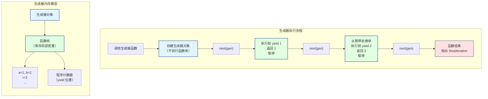

# 第 4 章 Python 迭代协议与函数式编程 ⭐⭐⭐⭐
> [!abstract] 本章导航
> **定位**：第一部分 Python 与后端工程基础中的第 4 章；围绕“Python 迭代协议与函数式编程”建立单一、可追踪的知识主线。
>
> **先修**：[[03_Python函数作用域与装饰器|第 3 章 Python 函数、作用域与装饰器]]。
>
> **学习目标**：
> - 解释 生成器与迭代器 ⭐⭐⭐⭐⭐ 的核心问题、机制与适用边界。
> - 实现或评估 上下文管理器 ⭐⭐⭐ 的最小闭环。
> - 使用可复现证据诊断 迭代工具与函数式编程 ⭐⭐⭐ 的工程取舍与失败模式。
>
> **建议路径**：生成器与迭代器 ⭐⭐⭐⭐⭐ → 上下文管理器 ⭐⭐⭐ → 迭代工具与函数式编程 ⭐⭐⭐。
>
> **配套代码**：`code/ch04_iteration_functional/`。

本章先回答“生成器与迭代器 ⭐⭐⭐⭐⭐”为什么成立，再沿着机制、实现、评估和边界逐步展开。阅读时先建立因果链，再运行或推演示例，最后用章末自测检查能否脱离原文复述。
## 4.1 生成器与迭代器 ⭐⭐⭐⭐⭐

### 4.1.1 迭代器协议

```python
"""
迭代器（Iterator）协议 —— Python 的遍历基础

迭代器必须实现：
  __iter__()    → 返回迭代器自身
  __next__()    → 返回下一个元素，没有时抛出 StopIteration

可迭代对象（Iterable）：实现 __iter__()，返回一个迭代器
"""

# ─────────────────────────────────────────────────────────────
# 手写迭代器 —— 理解底层机制
# ─────────────────────────────────────────────────────────────

class CountDown:
    """倒计时迭代器 —— 从 n 数到 1"""

    def __init__(self, start):
        self.start = start

    def __iter__(self):
        """返回迭代器对象（自身）"""
        self.current = self.start   # 重置计数器
        return self

    def __next__(self):
        """返回下一个值"""
        if self.current <= 0:
            raise StopIteration     # 迭代结束的信号
        num = self.current
        self.current -= 1
        return num

# 使用
countdown = CountDown(5)
for n in countdown:
    print(n, end=" ")   # 5 4 3 2 1
print()

# 等价于：
countdown = CountDown(3)
iterator = iter(countdown)   # 调用 __iter__()
print(next(iterator))        # 5 — 调用 __next__()
print(next(iterator))        # 4
print(next(iterator))        # 3
print(next(iterator))        # 2
print(next(iterator))        # 1
# next(iterator)             # StopIteration

# ─────────────────────────────────────────────────────────────
# 迭代器 vs 可迭代对象
# ─────────────────────────────────────────────────────────────

"""
关键区别：

可迭代对象（Iterable）          迭代器（Iterator）
─────────────────────          ─────────────────
• 实现 __iter__()               • 实现 __iter__() 和 __next__()
• 可多次遍历                    • 只能遍历一次（__next__ 消费数据）
• 每次 iter() 返回新迭代器       • iter() 返回自身
• list, dict, str 都是          • map, filter, zip, 文件对象 是
"""

# 可迭代对象可多次遍历
lst = [1, 2, 3]
for x in lst: print(x, end=" ")   # 1 2 3
for x in lst: print(x, end=" ")   # 1 2 3 — 再次遍历

# 迭代器只能遍历一次
it = iter([1, 2, 3])
for x in it: print(x, end=" ")    # 1 2 3
for x in it: print(x, end=" ")    # 无输出 — 迭代器已耗尽！
```

### 4.1.2 生成器函数 —— yield

```python
"""
生成器（Generator）— 面试超高频考点

生成器是一种特殊的迭代器，使用 yield 关键字实现。
每次 yield 会暂停执行并返回值，下次从暂停处继续。

生成器的优势：
1. 惰性求值 —— 按需生成数据，节省内存
2. 代码简洁 —— 比手写迭代器类简单得多
3. 状态自动保存 —— yield 自动保存局部变量状态
"""

# ─────────────────────────────────────────────────────────────
# 基础生成器
# ─────────────────────────────────────────────────────────────

def count_up(n):
    """生成 1 到 n 的整数"""
    i = 1
    while i <= n:
        yield i          # 暂停，返回 i
        i += 1           # 下次从这里继续

# 使用生成器
gen = count_up(3)
print(type(gen))          # <class 'generator'>
print(next(gen))          # 1
print(next(gen))          # 2
print(next(gen))          # 3
# next(gen)               # StopIteration

# 用 for 循环遍历（自动处理 StopIteration）
for num in count_up(5):
    print(num, end=" ")   # 1 2 3 4 5
print()

# ─────────────────────────────────────────────────────────────
# 生成器的状态保存
# ─────────────────────────────────────────────────────────────

def fibonacci():
    """
    无限斐波那契数列生成器

    状态自动保存在生成器对象中：
    - a 和 b 的值在每次 yield 后自动保存
    - 下次从 yield 处继续执行
    """
    a, b = 0, 1
    while True:
        yield a
        a, b = b, a + b

fib = fibonacci()
for _ in range(10):
    print(next(fib), end=" ")   # 0 1 1 2 3 5 8 13 21 34
print()

# ─────────────────────────────────────────────────────────────
# 🎯 面试真题：用生成器实现大文件读取
# ─────────────────────────────────────────────────────────────

def read_large_file(filepath, chunk_size=1024):
    """
    用生成器逐块读取大文件 —— 避免内存溢出

    普通方式 f.read() 会将整个文件读入内存，
    生成器方式每次只读 chunk_size 字节到内存。
    """
    with open(filepath, "rb") as f:
        while True:
            chunk = f.read(chunk_size)
            if not chunk:
                break
            yield chunk

# 逐行读取（更常用）
def read_lines(filepath):
    """逐行读取文件 —— yield 自动处理缓冲区"""
    with open(filepath, "r", encoding="utf-8") as f:
        for line in f:        # 文件对象本身就是迭代器！
            yield line.strip()

# 处理大文件日志的实用生成器
def parse_log_file(filepath):
    """
    解析日志文件 —— 过滤 + 解析的生成器管道
    """
    with open(filepath, "r", encoding="utf-8") as f:
        for line in f:
            line = line.strip()
            if not line or line.startswith("#"):
                continue      # 跳过空行和注释
            # 解析日志行
            parts = line.split(" | ")
            if len(parts) >= 3:
                yield {
                    "timestamp": parts[0],
                    "level": parts[1],
                    "message": parts[2],
                }

# ─────────────────────────────────────────────────────────────
# 生成器表达式 —— 内存友好的推导式
# ─────────────────────────────────────────────────────────────

# 列表推导式 —— 立即生成所有数据，占用大量内存
squares_list = [x**2 for x in range(1000000)]   # 内存占用大

# 生成器表达式 —— 惰性求值，每次只生成一个
squares_gen = (x**2 for x in range(1000000))    # 几乎不占内存

# 可以直接用在需要迭代器的场景
total = sum(x**2 for x in range(1000000))       # 高效！
max_val = max(len(line) for line in open("file.txt"))

# ─────────────────────────────────────────────────────────────
# yield from —— 委托子生成器
# ─────────────────────────────────────────────────────────────

def sub_generator():
    """子生成器"""
    yield 1
    yield 2

def main_generator():
    """主生成器 —— 委托给子生成器"""
    yield "开始"
    yield from sub_generator()   # 等价于 for x in sub_generator(): yield x
    yield "结束"

print(list(main_generator()))    # ['开始', 1, 2, '结束']

# yield from 的核心用途：展平嵌套结构
def flatten(nested):
    """展平任意嵌套的列表"""
    for item in nested:
        if isinstance(item, (list, tuple)):
            yield from flatten(item)   # 递归委托
        else:
            yield item

nested = [1, [2, [3, 4], 5], 6, [7, 8]]
print(list(flatten(nested)))     # [1, 2, 3, 4, 5, 6, 7, 8]
```



### 4.1.3 生成器实现大文件处理（面试重点）

```python
"""
生成器实现大文件处理 —— 面试常考场景

核心思路：用生成器构建数据处理管道（Pipeline），
         数据像流水一样经过多个处理阶段，
         每个阶段只处理当前数据块，不加载全部数据。
"""

import os

# ─────────────────────────────────────────────────────────────
# 数据处理管道模式
# ─────────────────────────────────────────────────────────────

def read_chunks(filepath, chunk_size=8192):
    """阶段1：读取文件块"""
    with open(filepath, "rb") as f:
        while True:
            chunk = f.read(chunk_size)
            if not chunk:
                break
            yield chunk

def decode_lines(chunks):
    """阶段2：将字节块解码为文本行"""
    buffer = b""
    for chunk in chunks:
        buffer += chunk
        while b"\n" in buffer:
            line, buffer = buffer.split(b"\n", 1)
            yield line.decode("utf-8")
    if buffer:
        yield buffer.decode("utf-8")

def filter_lines(lines, keyword):
    """阶段3：过滤包含关键词的行"""
    for line in lines:
        if keyword in line:
            yield line

def parse_records(lines):
    """阶段4：解析为结构化数据"""
    for line in lines:
        parts = line.split(",")
        if len(parts) >= 3:
            yield {
                "id": parts[0].strip(),
                "name": parts[1].strip(),
                "value": float(parts[2].strip()),
            }

# 组合管道（惰性执行，不占用大量内存）
def process_file_pipeline(filepath, keyword):
    """完整的数据处理管道"""
    chunks = read_chunks(filepath)
    lines = decode_lines(chunks)
    filtered = filter_lines(lines, keyword)
    records = parse_records(filtered)
    return records   # 返回生成器，尚未执行任何处理！

"""
内存对比：

传统方式（加载全部数据）：
┌─────────────────────────────────────────────────────┐
│  读取全部文件 → 内存中（500MB）                       │
│  全部解码为行 → 内存中（1GB）                         │
│  全部过滤 → 内存中（100MB）                           │
│  全部解析 → 内存中（200MB）                           │
│  峰值内存: ~1.8GB                                     │
└─────────────────────────────────────────────────────┘

生成器管道（惰性处理）：
┌─────────────────────────────────────────────────────┐
│  read_chunks ──→ 8KB 块                             │
│       │                                             │
│       ▼                                             │
│  decode_lines ──→ 一行文本                           │
│       │                                             │
│       ▼                                             │
│  filter_lines ──→ 匹配的行（或无）                    │
│       │                                             │
│       ▼                                             │
│  parse_records ──→ 一个 record                       │
│                                                     │
│  峰值内存: ~8KB + 几行文本                            │
└─────────────────────────────────────────────────────┘
"""

# ─────────────────────────────────────────────────────────────
# 实际应用：逐行读取 + 统计
# ─────────────────────────────────────────────────────────────

def line_count(filepath):
    """统计行数 —— 不加载整个文件"""
    with open(filepath, "r", encoding="utf-8") as f:
        return sum(1 for _ in f)   # 生成器表达式 + sum

def grep_generator(pattern, filepath):
    """实现 grep 功能 —— 返回匹配行的生成器"""
    with open(filepath, "r", encoding="utf-8") as f:
        for i, line in enumerate(f, 1):
            if pattern in line:
                yield i, line.strip()

# 统计每个 IP 的访问次数（类似 awk）
def count_ip_frequency(logfile):
    """统计日志中每个 IP 的出现次数 —— 流式处理"""
    from collections import Counter

    def extract_ips(filepath):
        with open(filepath, "r") as f:
            for line in f:
                # 假设日志格式: "IP - - [timestamp] ..."
                parts = line.split()
                if parts:
                    yield parts[0]   # 第一个字段是 IP

    return Counter(extract_ips(logfile))
```

## 4.2 上下文管理器 ⭐⭐⭐

### 4.2.1 上下文管理器协议

```python
"""
上下文管理器（Context Manager）— with 语句的底层机制

协议：实现 __enter__() 和 __exit__() 两个方法

┌─────────────────────────────────────────────────────────────┐
│   with EXPR as VAR:                                         │
│       BLOCK                                                 │
│                                                             │
│   等价于：                                                   │
│                                                             │
│   manager = (EXPR)                                          │
│   enter = type(manager).__enter__                           │
│   exit = type(manager).__exit__                             │
│   VAR = enter(manager)           ← __enter__ 的返回值        │
│   try:                                                      │
│       BLOCK                                                 │
│   except:                                                   │
│       if not exit(manager, *sys.exc_info()):                │
│           raise              ← __exit__ 返回 False 则传播异常 │
│   else:                                                     │
│       exit(manager, None, None, None)   ← 正常结束时        │
└─────────────────────────────────────────────────────────────┘
"""

# ─────────────────────────────────────────────────────────────
# 类实现上下文管理器
# ─────────────────────────────────────────────────────────────

class DatabaseConnection:
    """
    数据库连接上下文管理器
    """

    def __init__(self, connection_string):
        self.connection_string = connection_string
        self.connection = None

    def __enter__(self):
        """进入 with 块时调用 —— 获取资源"""
        print(f"🔗 连接数据库: {self.connection_string}")
        self.connection = f"<连接: {self.connection_string}>"
        return self   # 返回的资源会被 as 变量接收

    def __exit__(self, exc_type, exc_val, exc_tb):
        """退出 with 块时调用 —— 释放资源"""
        print("🔒 关闭数据库连接")
        self.connection = None

        if exc_type:
            print(f"  异常类型: {exc_type.__name__}")
            print(f"  异常信息: {exc_val}")
            # 返回 True 表示异常已被处理，不向外传播
            # 返回 False 表示异常继续传播
            return False

    def query(self, sql):
        print(f"执行 SQL: {sql}")
        return f"[{sql}] 的结果"

# 使用
with DatabaseConnection("mysql://localhost/mydb") as db:
    result = db.query("SELECT * FROM users")
    print(result)
# 🔗 连接数据库: mysql://localhost/mydb
# 执行 SQL: SELECT * FROM users
# [SELECT * FROM users] 的结果
# 🔒 关闭数据库连接

# ─────────────────────────────────────────────────────────────
# 🎯 面试推荐：@contextmanager 装饰器（更简洁）
# ─────────────────────────────────────────────────────────────

from contextlib import contextmanager

@contextmanager
def db_connection(connection_string):
    """
    用生成器实现上下文管理器 —— 更 Pythonic

    yield 之前的代码 = __enter__
    yield 返回值     = __enter__ 的返回值
    yield 之后的代码 = __exit__（无论是否异常都会执行）
    """
    # ── __enter__ 部分 ──
    print(f"🔗 连接数据库: {connection_string}")
    connection = f"<连接: {connection_string}>"

    try:
        yield connection   # ← 这行相当于 return，控制权交给 with 块
    finally:
        # ── __exit__ 部分（finally 保证一定执行）──
        print("🔒 关闭数据库连接")

# 使用
with db_connection("postgresql://localhost/prod") as conn:
    print(f"使用连接: {conn}")

# ─────────────────────────────────────────────────────────────
# 多个上下文管理器
# ─────────────────────────────────────────────────────────────

@contextmanager
def file_reader(filepath):
    f = open(filepath, "r")
    try:
        yield f
    finally:
        f.close()

@contextmanager
def timer_ctx(name):
    import time
    start = time.perf_counter()
    try:
        yield
    finally:
        elapsed = time.perf_counter() - start
        print(f"⏱ {name}: {elapsed:.4f}s")

# Python 3.10+ 支持括号语法
# with (
#     file_reader("input.txt") as fin,
#     file_reader("output.txt") as fout,
#     timer_ctx("文件拷贝"):
# ):
#     fout.write(fin.read())

# Python 3.9 及以下
# with file_reader("input.txt") as fin, \
#      file_reader("output.txt") as fout, \
#      timer_ctx("文件拷贝"):
#     fout.write(fin.read())
```

## 4.3 迭代工具与函数式编程 ⭐⭐⭐

### 4.3.1 itertools —— 迭代工具集

```python
"""
itertools —— Python 的迭代工具箱
面试常考：islice, chain, groupby, cycle
"""

import itertools

# ─────────────────────────────────────────────────────────────
# 无限迭代器
# ─────────────────────────────────────────────────────────────

# count(start, step) —— 无限计数
counter = itertools.count(10, 2)   # 10, 12, 14, 16, ...
print([next(counter) for _ in range(5)])   # [10, 12, 14, 16, 18]

# cycle(iterable) —— 无限循环
c = itertools.cycle("AB")
print([next(c) for _ in range(5)])   # ['A', 'B', 'A', 'B', 'A']

# repeat(elem, [n]) —— 重复元素
print(list(itertools.repeat("x", 3)))   # ['x', 'x', 'x']

# ─────────────────────────────────────────────────────────────
# 有限迭代器（面试高频）
# ─────────────────────────────────────────────────────────────

# islice —— 切片迭代器（不需要序列支持索引）
data = iter(range(100))
slice_10_20 = itertools.islice(data, 10, 20)   # 取第 10-19 个
print(list(slice_10_20))   # [10, 11, 12, 13, 14, 15, 16, 17, 18, 19]

# chain —— 连接多个迭代器
list1 = [1, 2, 3]
list2 = ["a", "b", "c"]
merged = itertools.chain(list1, list2)
print(list(merged))   # [1, 2, 3, 'a', 'b', 'c']

# 展平嵌套列表
nested = [[1, 2], [3, 4], [5, 6]]
flat = itertools.chain.from_iterable(nested)
print(list(flat))     # [1, 2, 3, 4, 5, 6]

# groupby —— 按连续相同值分组（面试常考）
data = ["A", "A", "B", "B", "B", "A", "C", "C"]
for key, group in itertools.groupby(data):
    print(f"{key}: {list(group)}")
# A: ['A', 'A']
# B: ['B', 'B', 'B']
# A: ['A']
# C: ['C', 'C']

# 注意：groupby 只对连续相同值分组！需要先排序
# 按首字母分组（需要先排序）
words = ["apple", "apricot", "banana", "blueberry", "cherry"]
words.sort()
for letter, group in itertools.groupby(words, key=lambda x: x[0]):
    print(f"{letter}: {list(group)}")
# a: ['apple', 'apricot']
# b: ['banana', 'blueberry']
# c: ['cherry']

# ─────────────────────────────────────────────────────────────
# 组合迭代器
# ─────────────────────────────────────────────────────────────

# product —— 笛卡尔积
print(list(itertools.product("AB", "12")))
# [('A', '1'), ('A', '2'), ('B', '1'), ('B', '2')]

# permutations —— 排列（有序，不重复）
print(list(itertools.permutations("ABC", 2)))
# [('A', 'B'), ('A', 'C'), ('B', 'A'), ('B', 'C'), ('C', 'A'), ('C', 'B')]

# combinations —— 组合（无序，不重复）
print(list(itertools.combinations("ABC", 2)))
# [('A', 'B'), ('A', 'C'), ('B', 'C')]

# combinations_with_replacement —— 组合（允许重复）
print(list(itertools.combinations_with_replacement("ABC", 2)))
# [('A', 'A'), ('A', 'B'), ('A', 'C'), ('B', 'B'), ('B', 'C'), ('C', 'C')]
```

### 4.3.2 functools —— 函数式工具

```python
"""
functools —— 函数式编程工具
"""

from functools import lru_cache, partial, reduce, wraps

# ─────────────────────────────────────────────────────────────
# lru_cache —— 函数结果缓存（面试高频）
# ─────────────────────────────────────────────────────────────

@lru_cache(maxsize=128)
def fibonacci(n):
    """带缓存的斐波那契 —— 时间复杂度 O(n)，原为 O(2^n)"""
    if n < 2:
        return n
    return fibonacci(n - 1) + fibonacci(n - 2)

print(fibonacci(100))   # 354224848179261915075（瞬间完成）
print(fibonacci.cache_info())   # CacheInfo(hits=98, misses=101, maxsize=128, currsize=101)

# 缓存失效
fibonacci.cache_clear()

# ─────────────────────────────────────────────────────────────
# reduce —— 累积操作
# ─────────────────────────────────────────────────────────────

from operator import add, mul

numbers = [1, 2, 3, 4, 5]

# 累加
print(reduce(add, numbers))           # 15 — 等价于 sum()
# 累乘
print(reduce(mul, numbers))           # 120 — 1*2*3*4*5
# 带初始值
print(reduce(add, numbers, 100))      # 115 — 100+1+2+3+4+5

# 找最大值（自定义）
print(reduce(lambda x, y: x if x > y else y, numbers))   # 5

# ─────────────────────────────────────────────────────────────
# partial —— 函数部分应用
# ─────────────────────────────────────────────────────────────

from operator import mul

triple = partial(mul, 3)   # triple(x) == mul(3, x) == 3 * x
print(triple(5))           # 15

# 固定排序键
from dataclasses import dataclass

@dataclass
class Person:
    name: str
    age: int

people = [Person("Alice", 30), Person("Bob", 25), Person("Charlie", 35)]
sort_by_age = partial(sorted, key=lambda p: p.age)
print(sort_by_age(people))

# ─────────────────────────────────────────────────────────────
# @wraps —— 保留原函数元信息（装饰器必备）
# ─────────────────────────────────────────────────────────────

def bare_decorator(func):
    """❌ 不使用 wraps"""
    def wrapper(*args, **kwargs):
        return func(*args, **kwargs)
    return wrapper

def good_decorator(func):
    """✅ 使用 wraps"""
    @wraps(func)
    def wrapper(*args, **kwargs):
        return func(*args, **kwargs)
    return wrapper

@bare_decorator
def example1():
    """文档字符串"""
    pass

@good_decorator
def example2():
    """文档字符串"""
    pass

print(example1.__name__)   # "wrapper"
print(example1.__doc__)    # None
print(example2.__name__)   # "example2"
print(example2.__doc__)    # "文档字符串"
```

### 4.3.3 函数式编程风格对比

```python
"""
命令式 vs 函数式风格对比
"""

# ─────────────────────────────────────────────────────────────
# 场景：计算列表中偶数的平方和
# ─────────────────────────────────────────────────────────────

numbers = [1, 2, 3, 4, 5, 6, 7, 8, 9, 10]

# 命令式风格（显式循环）
def imperative_sum(numbers):
    total = 0
    for n in numbers:
        if n % 2 == 0:
            total += n ** 2
    return total

# 函数式风格（map/filter/reduce）
def functional_sum(numbers):
    from functools import reduce
    from operator import add
    evens = filter(lambda n: n % 2 == 0, numbers)
    squares = map(lambda n: n ** 2, evens)
    return reduce(add, squares, 0)

# Pythonic 风格（生成器表达式 —— 推荐）
def pythonic_sum(numbers):
    return sum(n ** 2 for n in numbers if n % 2 == 0)

print(imperative_sum(numbers))    # 220
print(functional_sum(numbers))    # 220
print(pythonic_sum(numbers))      # 220

"""
风格对比：

┌─────────────────────────────────────────────────────────────┐
│              三种编程风格对比                                │
├─────────────────────────────────────────────────────────────┤
│                                                             │
│  命令式（Imperative）                                        │
│  ├── 显式状态管理（total 变量）                                │
│  ├── 容易理解，控制流清晰                                     │
│  └── 适合复杂逻辑、需要提前返回的场景                          │
│                                                             │
│  函数式（Functional）                                        │
│  ├── 无状态，通过函数组合处理数据                              │
│  ├── 代码紧凑，数学感强                                       │
│  └── Python 中可读性较差（不如其他 FP 语言）                    │
│                                                             │
│  Pythonic（生成器表达式）                                     │
│  ├── 惰性求值，内存友好                                       │
│  ├── 简洁可读，Python 推荐                                    │
│  └── ★ 面试和工程中的首选                                     │
│                                                             │
└─────────────────────────────────────────────────────────────┘
"""
```
## 🧭 本章小结

- 生成器与迭代器 ⭐⭐⭐⭐⭐：能够说清问题、机制、证据与边界。
- 上下文管理器 ⭐⭐⭐：能够说清问题、机制、证据与边界。
- 迭代工具与函数式编程 ⭐⭐⭐：能够说清问题、机制、证据与边界。

## ✅ 自测与练习

1. 不看正文，解释“生成器与迭代器 ⭐⭐⭐⭐⭐”解决什么问题，并给出一个不适用场景。
2. 为“上下文管理器 ⭐⭐⭐”设计一个最小可复现实验，明确输入、指标和通过条件。
3. 比较“迭代工具与函数式编程 ⭐⭐⭐”的至少两种方案，说明质量、成本、延迟或风险取舍。

## 🧪 配套代码与验收

- `code/ch04_iteration_functional/`

```powershell
python code/scripts/run_all_examples.py --chapter ch04 --tier core
```

默认验收不下载模型、不调用付费 API；真实 API 或 GPU 示例必须按 metadata 显式启用。成功标准是相关脚本输出 `OK`，条件不足时输出可解释的 `[SKIP]`。

## 🎯 面试题精讲

回答本章问题时使用四步结构：先给结论，再解释机制，然后给项目证据，最后主动说明适用边界。涉及性能或效果时，补充模型、硬件、数据、并发、版本和统计口径；条件不完整时明确说“需要实测”。

## 📋 本章速查表

| 主题 | 回答主线 |
|---|---|
| 生成器与迭代器 ⭐⭐⭐⭐⭐ | 问题 → 机制 → 示例 → 指标 → 边界 |
| 上下文管理器 ⭐⭐⭐ | 问题 → 机制 → 示例 → 指标 → 边界 |
| 迭代工具与函数式编程 ⭐⭐⭐ | 问题 → 机制 → 示例 → 指标 → 边界 |

## 🔗 相关章节

- [[03_Python函数作用域与装饰器|第 3 章 Python 函数、作用域与装饰器]]
- [[05_Python面向对象与数据模型|第 5 章 Python 面向对象与数据模型]]

## 📖 一手参考资料

> 核验基线：2026-07-31；结构复核：2026-08-05。产品、API、法规、价格与 benchmark 会变化，使用前应再次核验。

- [[docs/AUTHORITATIVE_SOURCES|章节权威来源索引]]：按主题维护官方文档、标准、原论文和官方仓库。
