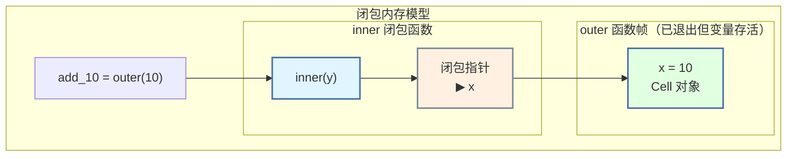
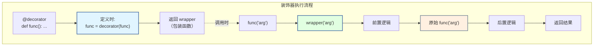
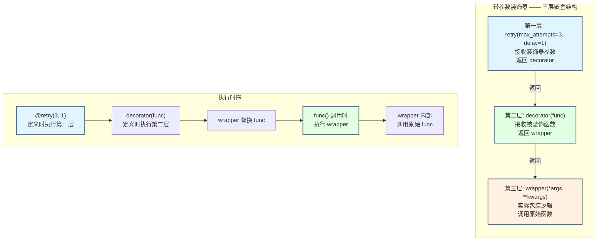
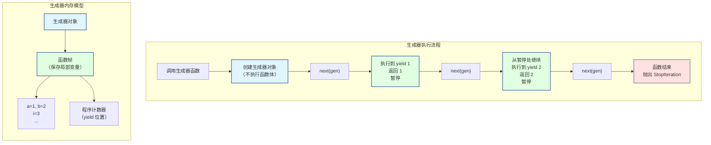

# 第 4 章 Python 高级特性与函数式编程

> [!abstract] 本章导航
> **定位**：连接 Python 语言机制与工程抽象，支撑装饰器、中间件和资源管理。
>
> **先修**：[[01_Python编程基础]]、[[03_Python面向对象编程]]。
>
> **学习目标**：
> - 解释闭包、装饰器、生成器和上下文管理协议。
> - 实现可组合的函数增强与惰性数据处理。
> - 根据状态、资源和可读性约束选择抽象方式。
>
> **建议路径**：闭包 Closure → 装饰器 Decorator → 生成器与迭代器 → … → 迭代工具与函数式编程。先完成主线，再按需要阅读进阶内容。
>
> **配套代码**：`code/ch04_advanced_features/`。

> [!info] 阅读提示
> 本章围绕闭包、装饰器、生成器和上下文管理器展开。学习重点是理解协议、状态与资源生命周期，并能用最小代码解释装饰器调用和生成器的惰性执行。

## 4.1 闭包 Closure ⭐⭐⭐⭐

### 4.1.1 闭包的三要素

```python
"""
闭包（Closure）— 面试高频考点

定义：闭包 = 嵌套函数 + 引用外部变量 + 返回嵌套函数

闭包的三要素：
1. 必须有一个嵌套函数
2. 嵌套函数必须引用外部函数中的变量
3. 外部函数必须返回嵌套函数

闭包的本质：函数记住并访问它被创建时的词法环境
"""

# ─────────────────────────────────────────────────────────────
# 闭包基础示例
# ─────────────────────────────────────────────────────────────

def outer(x):           # 外部函数
    def inner(y):       # 嵌套函数 —— 闭包
        return x + y    # inner 引用了外部变量 x
    return inner        # 返回嵌套函数（不是调用！）

# 创建两个不同的闭包
add_10 = outer(10)      # add_10 是一个闭包，记住了 x=10
add_20 = outer(20)      # add_20 是一个闭包，记住了 x=20

print(add_10(5))        # 15 — 10 + 5
print(add_20(5))        # 25 — 20 + 5

# 验证闭包记住了外部变量
print(add_10.__closure__[0].cell_contents)   # 10
print(add_20.__closure__[0].cell_contents)   # 20

"""
闭包的内存模型：

┌─────────────────────────────────────────────────────────┐
│  调用 outer(10) 时                                       │
│                                                         │
│  outer 的局部变量: x = 10                               │
│       │                                                 │
│       ▼                                                 │
│  ┌──────────┐      ┌─────────────────────┐             │
│  │  inner   │─────▶│ 函数对象 + 闭包变量  │             │
│  │  函数    │      │ x = 10 (cell)        │             │
│  └──────────┘      └─────────────────────┘             │
│       │                          ▲                      │
│       └────────── 返回 ──────────┘                      │
│                                                         │
│  outer 执行完毕，但 x 没有被销毁（被闭包引用）             │
│  add_10 = inner（带闭包的函数对象）                       │
└─────────────────────────────────────────────────────────┘
"""
```



### 4.1.2 LEGB 规则在闭包中的体现

```python
"""
LEGB 规则在闭包中的应用

L — Local:        当前函数 inner 的局部变量
E — Enclosing:    外层函数 outer 的局部变量
G — Global:       模块级别的全局变量
B — Built-in:     Python 内置变量
"""

x = "global"        # G

def outer():
    x = "enclosing"  # E

    def inner():
        x = "local"  # L
        print(x)     # "local" — 按 LEGB 找到 Local

    inner()

outer()

# ─────────────────────────────────────────────────────────────
# nonlocal —— 修改外层变量（闭包关键）
# ─────────────────────────────────────────────────────────────

def counter_factory():
    """
    闭包实现计数器 —— nonlocal 修改外层变量
    """
    count = 0           # 外层变量

    def counter():
        nonlocal count  # 声明：我要修改外层变量，不是创建局部变量
        count += 1
        return count

    def reset():
        nonlocal count
        count = 0

    # 返回多个闭包函数
    return counter, reset

cnt, reset = counter_factory()
print(cnt())    # 1
print(cnt())    # 2
print(cnt())    # 3
reset()
print(cnt())    # 1

# ─────────────────────────────────────────────────────────────
# 🎯 面试陷阱：循环中创建闭包
# ─────────────────────────────────────────────────────────────

# 陷阱：所有闭包共享同一个循环变量
def create_functions_trap():
    """❌ 错误：所有函数都返回 4"""
    functions = []
    for i in range(4):
        functions.append(lambda: i)   # i 是自由变量，不是默认值
    return functions

funcs = create_functions_trap()
print([f() for f in funcs])   # [3, 3, 3, 3] — 不是 [0, 1, 2, 3]！

# 修复：用默认参数在定义时捕获值
def create_functions_fixed():
    """✅ 正确：每个闭包捕获当前的 i 值"""
    functions = []
    for i in range(4):
        functions.append(lambda x=i: x)   # x=i 在定义时求值
    return functions

funcs = create_functions_fixed()
print([f() for f in funcs])   # [0, 1, 2, 3] ✅

# 另一种修复：用工厂函数创建闭包
def make_closure(x):
    def closure():
        return x
    return closure

def create_functions_factory():
    return [make_closure(i) for i in range(4)]

funcs = create_functions_factory()
print([f() for f in funcs])   # [0, 1, 2, 3] ✅
```

### 4.1.3 闭包的应用场景

```python
"""
闭包的实际应用 —— 理解闭包的实用价值
"""

# 1. 函数工厂 —— 根据配置创建不同的函数
def power_factory(n):
    """创建 x^n 的函数"""
    def power(x):
        return x ** n
    return power

square = power_factory(2)
cube = power_factory(3)
print(square(4))   # 16
print(cube(3))     # 27

# 2. 私有化 —— 数据隐藏
class Counter:
    """类实现"""
    def __init__(self):
        self.count = 0
    def __call__(self):
        self.count += 1
        return self.count

def make_counter():
    """闭包实现 —— count 真正私有"""
    count = 0
    def counter():
        nonlocal count
        count += 1
        return count
    return counter

# 闭包版本：count 无法从外部访问（没有 self.count）
c = make_counter()
print(c())   # 1
print(c())   # 2
# 无法访问 count 变量！真正的私有
```

## 4.2 装饰器 Decorator ⭐⭐⭐⭐⭐

### 4.2.1 装饰器原理

```python
"""
装饰器（Decorator）— 面试超高频考点

本质：装饰器是一个接收函数作为参数并返回函数的高阶函数
语法糖：@decorator 等价于 func = decorator(func)

┌─────────────────────────────────────────────────────────────┐
│                    装饰器执行流程                            │
│                                                             │
│   @decorator                                                │
│   def func():                                               │
│       pass                                                  │
│                                                             │
│   等价于：                                                   │
│   def func():                                               │
│       pass                                                  │
│   func = decorator(func)   ← 定义时执行！                    │
│                                                             │
│   注意：装饰器在函数定义时执行，不是在调用时执行              │
└─────────────────────────────────────────────────────────────┘
"""

from functools import wraps

# ─────────────────────────────────────────────────────────────
# 最简单的装饰器
# ─────────────────────────────────────────────────────────────

def my_decorator(func):
    """装饰器函数 —— 接收一个函数，返回一个新函数"""

    @wraps(func)   # 保留原函数的元信息（__name__, __doc__ 等）
    def wrapper(*args, **kwargs):
        """包装函数 —— 在目标函数前后添加逻辑"""
        print(f"=== 调用 {func.__name__} 之前 ===")
        result = func(*args, **kwargs)   # 调用被装饰的函数
        print(f"=== 调用 {func.__name__} 之后 ===")
        return result

    return wrapper   # 返回包装函数

@my_decorator
def say_hello(name):
    """打招呼"""
    return f"Hello, {name}!"

# 等价于：say_hello = my_decorator(say_hello)

print(say_hello("Alice"))
# === 调用 say_hello 之前 ===
# === 调用 say_hello 之后 ===
# Hello, Alice!

# ─────────────────────────────────────────────────────────────
# 为什么需要 @wraps？
# ─────────────────────────────────────────────────────────────

def bad_decorator(func):
    """❌ 没有 wraps —— 丢失原函数元信息"""
    def wrapper(*args, **kwargs):
        return func(*args, **kwargs)
    return wrapper

def good_decorator(func):
    """✅ 使用 wraps —— 保留原函数元信息"""
    @wraps(func)
    def wrapper(*args, **kwargs):
        return func(*args, **kwargs)
    return wrapper

@bad_decorator
def target():
    """目标函数"""
    pass

print(target.__name__)   # "wrapper" — 原函数名丢失！
print(target.__doc__)    # None

@good_decorator
def target2():
    """目标函数"""
    pass

print(target2.__name__)  # "target2" — 正确！
print(target2.__doc__)   # "目标函数"
```



### 4.2.2 无参数装饰器 —— 计时器

```python
"""
手写计时装饰器 —— 面试高频手撕代码题
"""

import time
from functools import wraps

def timer(func):
    """
    计时装饰器 —— 测量函数执行时间

    用法：
        @timer
        def slow_func():
            ...
    """
    @wraps(func)
    def wrapper(*args, **kwargs):
        start = time.perf_counter()   # 高精度计时
        result = func(*args, **kwargs)
        elapsed = time.perf_counter() - start
        print(f"⏱ {func.__name__} 执行时间: {elapsed:.4f}s")
        return result
    return wrapper

@timer
def slow_sum(n):
    """计算 1+2+...+n"""
    total = 0
    for i in range(1, n + 1):
        total += i
        time.sleep(0.001)   # 模拟耗时操作
    return total

result = slow_sum(100)
print(f"结果: {result}")

# ─────────────────────────────────────────────────────────────
# 带统计功能的计时装饰器
# ─────────────────────────────────────────────────────────────

def timer_with_stats(func):
    """
    增强版计时装饰器 —— 记录调用次数和累计时间
    """
    @wraps(func)
    def wrapper(*args, **kwargs):
        wrapper.call_count += 1
        start = time.perf_counter()
        result = func(*args, **kwargs)
        elapsed = time.perf_counter() - start
        wrapper.total_time += elapsed
        print(f"⏱ {func.__name__} #{wrapper.call_count}: {elapsed:.4f}s "
              f"(累计: {wrapper.total_time:.4f}s)")
        return result

    # 在 wrapper 上附加统计属性
    wrapper.call_count = 0
    wrapper.total_time = 0.0
    wrapper.get_stats = lambda: {
        "calls": wrapper.call_count,
        "total_time": wrapper.total_time,
        "avg_time": wrapper.total_time / wrapper.call_count if wrapper.call_count else 0,
    }

    return wrapper

@timer_with_stats
def compute(x):
    time.sleep(0.01)
    return x * x

compute(1)
compute(2)
compute(3)
print(f"统计: {compute.get_stats()}")
```

### 4.2.3 带参数装饰器 —— 三层嵌套 ⭐⭐⭐⭐⭐

```python
"""
带参数的装饰器 —— 面试高频考点

需要三层嵌套：
    第一层：接收装饰器参数
    第二层：接收被装饰函数
    第三层：包装函数（实际调用）

def decorator_with_args(arg1, arg2):    ← 第一层：接收装饰器参数
    def decorator(func):                 ← 第二层：接收被装饰函数
        @wraps(func)
        def wrapper(*args, **kwargs):    ← 第三层：包装函数
            # 可以使用 arg1, arg2
            return func(*args, **kwargs)
        return wrapper
    return decorator

@decorator_with_args("param1", "param2")
def my_func():
    pass
"""

from functools import wraps
import time

# ─────────────────────────────────────────────────────────────
# 🎯 面试真题：手写重试装饰器
# ─────────────────────────────────────────────────────────────

def retry(max_attempts=3, delay=1, exceptions=(Exception,)):
    """
    重试装饰器 —— 函数失败时自动重试

    Args:
        max_attempts: 最大重试次数（含首次调用）
        delay: 每次重试间隔（秒）
        exceptions: 需要捕获的异常类型

    用法：
        @retry(max_attempts=3, delay=0.5)
        def fetch_data():
            ...
    """
    def decorator(func):
        @wraps(func)
        def wrapper(*args, **kwargs):
            for attempt in range(1, max_attempts + 1):
                try:
                    return func(*args, **kwargs)
                except exceptions as e:
                    if attempt == max_attempts:
                        print(f"❌ {func.__name__} 在 {max_attempts} 次尝试后失败: {e}")
                        raise
                    print(f"⚠️ {func.__name__} 第 {attempt} 次失败: {e}，"
                          f"{delay}秒后重试...")
                    time.sleep(delay)
            return None   # 不会执行到这里
        return wrapper
    return decorator

# 使用重试装饰器
@retry(max_attempts=3, delay=0.1, exceptions=(ConnectionError,))
def unstable_api(call_count=[0]):
    """模拟不稳定的 API"""
    call_count[0] += 1
    if call_count[0] < 3:
        raise ConnectionError("连接超时")
    return f"成功！（第 {call_count[0]} 次）"

print(unstable_api())
# ⚠️ unstable_api 第 1 次失败: 连接超时，0.1秒后重试...
# ⚠️ unstable_api 第 2 次失败: 连接超时，0.1秒后重试...
# 成功！（第 3 次）
```



### 4.2.4 多重装饰器

```python
"""
多重装饰器 —— 执行顺序是重点

@decorator_a
@decorator_b
def func():
    pass

等价于：func = decorator_a(decorator_b(func))
执行顺序：从内到外（先 decorator_b，再 decorator_a）
"""

from functools import wraps

def decorator_a(func):
    @wraps(func)
    def wrapper(*args, **kwargs):
        print("A - 前")
        result = func(*args, **kwargs)
        print("A - 后")
        return result
    return wrapper

def decorator_b(func):
    @wraps(func)
    def wrapper(*args, **kwargs):
        print("  B - 前")
        result = func(*args, **kwargs)
        print("  B - 后")
        return result
    return wrapper

@decorator_a
@decorator_b
def target():
    print("    目标函数")

target()
# A - 前
#   B - 前
#     目标函数
#   B - 后
# A - 后

"""
执行流程：

┌─────────────┐
│ decorator_a │
│   A - 前     │
└──────┬──────┘
       │
┌──────▼──────┐
│ decorator_b │
│   B - 前     │
└──────┬──────┘
       │
┌──────▼──────┐
│   target    │
│   目标函数   │
└─────────────┘
       │
┌──────┴──────┐
│   B - 后     │
└──────┬──────┘
       │
┌──────▼──────┐
│   A - 后     │
└─────────────┘
"""
```

### 4.2.5 类装饰器

```python
"""
类装饰器 —— 用类来实现装饰器

两种方式：
1. 类作为装饰器（实现 __call__）
2. 装饰器返回类
"""

from functools import wraps

# ─────────────────────────────────────────────────────────────
# 类作为装饰器（通过 __call__）
# ─────────────────────────────────────────────────────────────

class CountCalls:
    """类装饰器 —— 统计函数被调用次数"""

    def __init__(self, func):
        wraps(func)(self)   # 等价于 @wraps(func)，但 self 是类实例
        self.count = 0

    def __call__(self, *args, **kwargs):
        self.count += 1
        print(f"{self.__wrapped__.__name__} 被调用第 {self.count} 次")
        return self.__wrapped__(*args, **kwargs)

    def __get__(self, instance, owner):
        """支持实例方法绑定 —— 将实例绑定到第一个参数"""
        from functools import partial
        return partial(self.__call__, instance)

@CountCalls
def greet(name):
    return f"Hello {name}"

greet("Alice")   # 被调用第 1 次
greet("Bob")     # 被调用第 2 次
print(f"总调用次数: {greet.count}")

# ─────────────────────────────────────────────────────────────
# 类装饰器 —— 给类添加功能
# ─────────────────────────────────────────────────────────────

def singleton_class(cls):
    """类装饰器 —— 将任意类变为单例"""
    instances = {}
    @wraps(cls)
    def wrapper(*args, **kwargs):
        if cls not in instances:
            instances[cls] = cls(*args, **kwargs)
        return instances[cls]
    return wrapper

@singleton_class
class Database:
    def __init__(self, url):
        self.url = url
        print(f"初始化数据库: {url}")

db1 = Database("mysql://localhost")
db2 = Database("postgresql://remote")
print(f"同一实例? {db1 is db2}")    # True
print(f"URL: {db2.url}")             # mysql://localhost
```

## 4.3 生成器与迭代器 ⭐⭐⭐⭐⭐

### 4.3.1 迭代器协议

```python
"""
迭代器（Iterator）协议 —— Python 的遍历基础

迭代器必须实现：
  __iter__()    → 返回迭代器自身
  __next__()    → 返回下一个元素，没有时抛出 StopIteration

可迭代对象（Iterable）：实现 __iter__()，返回一个迭代器
"""

# ─────────────────────────────────────────────────────────────
# 手写迭代器 —— 理解底层机制
# ─────────────────────────────────────────────────────────────

class CountDown:
    """倒计时迭代器 —— 从 n 数到 1"""

    def __init__(self, start):
        self.start = start

    def __iter__(self):
        """返回迭代器对象（自身）"""
        self.current = self.start   # 重置计数器
        return self

    def __next__(self):
        """返回下一个值"""
        if self.current <= 0:
            raise StopIteration     # 迭代结束的信号
        num = self.current
        self.current -= 1
        return num

# 使用
countdown = CountDown(5)
for n in countdown:
    print(n, end=" ")   # 5 4 3 2 1
print()

# 等价于：
countdown = CountDown(3)
iterator = iter(countdown)   # 调用 __iter__()
print(next(iterator))        # 5 — 调用 __next__()
print(next(iterator))        # 4
print(next(iterator))        # 3
print(next(iterator))        # 2
print(next(iterator))        # 1
# next(iterator)             # StopIteration

# ─────────────────────────────────────────────────────────────
# 迭代器 vs 可迭代对象
# ─────────────────────────────────────────────────────────────

"""
关键区别：

可迭代对象（Iterable）          迭代器（Iterator）
─────────────────────          ─────────────────
• 实现 __iter__()               • 实现 __iter__() 和 __next__()
• 可多次遍历                    • 只能遍历一次（__next__ 消费数据）
• 每次 iter() 返回新迭代器       • iter() 返回自身
• list, dict, str 都是          • map, filter, zip, 文件对象 是
"""

# 可迭代对象可多次遍历
lst = [1, 2, 3]
for x in lst: print(x, end=" ")   # 1 2 3
for x in lst: print(x, end=" ")   # 1 2 3 — 再次遍历

# 迭代器只能遍历一次
it = iter([1, 2, 3])
for x in it: print(x, end=" ")    # 1 2 3
for x in it: print(x, end=" ")    # 无输出 — 迭代器已耗尽！
```

### 4.3.2 生成器函数 —— yield

```python
"""
生成器（Generator）— 面试超高频考点

生成器是一种特殊的迭代器，使用 yield 关键字实现。
每次 yield 会暂停执行并返回值，下次从暂停处继续。

生成器的优势：
1. 惰性求值 —— 按需生成数据，节省内存
2. 代码简洁 —— 比手写迭代器类简单得多
3. 状态自动保存 —— yield 自动保存局部变量状态
"""

# ─────────────────────────────────────────────────────────────
# 基础生成器
# ─────────────────────────────────────────────────────────────

def count_up(n):
    """生成 1 到 n 的整数"""
    i = 1
    while i <= n:
        yield i          # 暂停，返回 i
        i += 1           # 下次从这里继续

# 使用生成器
gen = count_up(3)
print(type(gen))          # <class 'generator'>
print(next(gen))          # 1
print(next(gen))          # 2
print(next(gen))          # 3
# next(gen)               # StopIteration

# 用 for 循环遍历（自动处理 StopIteration）
for num in count_up(5):
    print(num, end=" ")   # 1 2 3 4 5
print()

# ─────────────────────────────────────────────────────────────
# 生成器的状态保存
# ─────────────────────────────────────────────────────────────

def fibonacci():
    """
    无限斐波那契数列生成器

    状态自动保存在生成器对象中：
    - a 和 b 的值在每次 yield 后自动保存
    - 下次从 yield 处继续执行
    """
    a, b = 0, 1
    while True:
        yield a
        a, b = b, a + b

fib = fibonacci()
for _ in range(10):
    print(next(fib), end=" ")   # 0 1 1 2 3 5 8 13 21 34
print()

# ─────────────────────────────────────────────────────────────
# 🎯 面试真题：用生成器实现大文件读取
# ─────────────────────────────────────────────────────────────

def read_large_file(filepath, chunk_size=1024):
    """
    用生成器逐块读取大文件 —— 避免内存溢出

    普通方式 f.read() 会将整个文件读入内存，
    生成器方式每次只读 chunk_size 字节到内存。
    """
    with open(filepath, "rb") as f:
        while True:
            chunk = f.read(chunk_size)
            if not chunk:
                break
            yield chunk

# 逐行读取（更常用）
def read_lines(filepath):
    """逐行读取文件 —— yield 自动处理缓冲区"""
    with open(filepath, "r", encoding="utf-8") as f:
        for line in f:        # 文件对象本身就是迭代器！
            yield line.strip()

# 处理大文件日志的实用生成器
def parse_log_file(filepath):
    """
    解析日志文件 —— 过滤 + 解析的生成器管道
    """
    with open(filepath, "r", encoding="utf-8") as f:
        for line in f:
            line = line.strip()
            if not line or line.startswith("#"):
                continue      # 跳过空行和注释
            # 解析日志行
            parts = line.split(" | ")
            if len(parts) >= 3:
                yield {
                    "timestamp": parts[0],
                    "level": parts[1],
                    "message": parts[2],
                }

# ─────────────────────────────────────────────────────────────
# 生成器表达式 —— 内存友好的推导式
# ─────────────────────────────────────────────────────────────

# 列表推导式 —— 立即生成所有数据，占用大量内存
squares_list = [x**2 for x in range(1000000)]   # 内存占用大

# 生成器表达式 —— 惰性求值，每次只生成一个
squares_gen = (x**2 for x in range(1000000))    # 几乎不占内存

# 可以直接用在需要迭代器的场景
total = sum(x**2 for x in range(1000000))       # 高效！
max_val = max(len(line) for line in open("file.txt"))

# ─────────────────────────────────────────────────────────────
# yield from —— 委托子生成器
# ─────────────────────────────────────────────────────────────

def sub_generator():
    """子生成器"""
    yield 1
    yield 2

def main_generator():
    """主生成器 —— 委托给子生成器"""
    yield "开始"
    yield from sub_generator()   # 等价于 for x in sub_generator(): yield x
    yield "结束"

print(list(main_generator()))    # ['开始', 1, 2, '结束']

# yield from 的核心用途：展平嵌套结构
def flatten(nested):
    """展平任意嵌套的列表"""
    for item in nested:
        if isinstance(item, (list, tuple)):
            yield from flatten(item)   # 递归委托
        else:
            yield item

nested = [1, [2, [3, 4], 5], 6, [7, 8]]
print(list(flatten(nested)))     # [1, 2, 3, 4, 5, 6, 7, 8]
```



### 4.3.3 生成器实现大文件处理（面试重点）

```python
"""
生成器实现大文件处理 —— 面试常考场景

核心思路：用生成器构建数据处理管道（Pipeline），
         数据像流水一样经过多个处理阶段，
         每个阶段只处理当前数据块，不加载全部数据。
"""

import os

# ─────────────────────────────────────────────────────────────
# 数据处理管道模式
# ─────────────────────────────────────────────────────────────

def read_chunks(filepath, chunk_size=8192):
    """阶段1：读取文件块"""
    with open(filepath, "rb") as f:
        while True:
            chunk = f.read(chunk_size)
            if not chunk:
                break
            yield chunk

def decode_lines(chunks):
    """阶段2：将字节块解码为文本行"""
    buffer = b""
    for chunk in chunks:
        buffer += chunk
        while b"\n" in buffer:
            line, buffer = buffer.split(b"\n", 1)
            yield line.decode("utf-8")
    if buffer:
        yield buffer.decode("utf-8")

def filter_lines(lines, keyword):
    """阶段3：过滤包含关键词的行"""
    for line in lines:
        if keyword in line:
            yield line

def parse_records(lines):
    """阶段4：解析为结构化数据"""
    for line in lines:
        parts = line.split(",")
        if len(parts) >= 3:
            yield {
                "id": parts[0].strip(),
                "name": parts[1].strip(),
                "value": float(parts[2].strip()),
            }

# 组合管道（惰性执行，不占用大量内存）
def process_file_pipeline(filepath, keyword):
    """完整的数据处理管道"""
    chunks = read_chunks(filepath)
    lines = decode_lines(chunks)
    filtered = filter_lines(lines, keyword)
    records = parse_records(filtered)
    return records   # 返回生成器，尚未执行任何处理！

"""
内存对比：

传统方式（加载全部数据）：
┌─────────────────────────────────────────────────────┐
│  读取全部文件 → 内存中（500MB）                       │
│  全部解码为行 → 内存中（1GB）                         │
│  全部过滤 → 内存中（100MB）                           │
│  全部解析 → 内存中（200MB）                           │
│  峰值内存: ~1.8GB                                     │
└─────────────────────────────────────────────────────┘

生成器管道（惰性处理）：
┌─────────────────────────────────────────────────────┐
│  read_chunks ──→ 8KB 块                             │
│       │                                             │
│       ▼                                             │
│  decode_lines ──→ 一行文本                           │
│       │                                             │
│       ▼                                             │
│  filter_lines ──→ 匹配的行（或无）                    │
│       │                                             │
│       ▼                                             │
│  parse_records ──→ 一个 record                       │
│                                                     │
│  峰值内存: ~8KB + 几行文本                            │
└─────────────────────────────────────────────────────┘
"""

# ─────────────────────────────────────────────────────────────
# 实际应用：逐行读取 + 统计
# ─────────────────────────────────────────────────────────────

def line_count(filepath):
    """统计行数 —— 不加载整个文件"""
    with open(filepath, "r", encoding="utf-8") as f:
        return sum(1 for _ in f)   # 生成器表达式 + sum

def grep_generator(pattern, filepath):
    """实现 grep 功能 —— 返回匹配行的生成器"""
    with open(filepath, "r", encoding="utf-8") as f:
        for i, line in enumerate(f, 1):
            if pattern in line:
                yield i, line.strip()

# 统计每个 IP 的访问次数（类似 awk）
def count_ip_frequency(logfile):
    """统计日志中每个 IP 的出现次数 —— 流式处理"""
    from collections import Counter

    def extract_ips(filepath):
        with open(filepath, "r") as f:
            for line in f:
                # 假设日志格式: "IP - - [timestamp] ..."
                parts = line.split()
                if parts:
                    yield parts[0]   # 第一个字段是 IP

    return Counter(extract_ips(logfile))
```

## 4.4 上下文管理器 ⭐⭐⭐

### 4.4.1 上下文管理器协议

```python
"""
上下文管理器（Context Manager）— with 语句的底层机制

协议：实现 __enter__() 和 __exit__() 两个方法

┌─────────────────────────────────────────────────────────────┐
│   with EXPR as VAR:                                         │
│       BLOCK                                                 │
│                                                             │
│   等价于：                                                   │
│                                                             │
│   manager = (EXPR)                                          │
│   enter = type(manager).__enter__                           │
│   exit = type(manager).__exit__                             │
│   VAR = enter(manager)           ← __enter__ 的返回值        │
│   try:                                                      │
│       BLOCK                                                 │
│   except:                                                   │
│       if not exit(manager, *sys.exc_info()):                │
│           raise              ← __exit__ 返回 False 则传播异常 │
│   else:                                                     │
│       exit(manager, None, None, None)   ← 正常结束时        │
└─────────────────────────────────────────────────────────────┘
"""

# ─────────────────────────────────────────────────────────────
# 类实现上下文管理器
# ─────────────────────────────────────────────────────────────

class DatabaseConnection:
    """
    数据库连接上下文管理器
    """

    def __init__(self, connection_string):
        self.connection_string = connection_string
        self.connection = None

    def __enter__(self):
        """进入 with 块时调用 —— 获取资源"""
        print(f"🔗 连接数据库: {self.connection_string}")
        self.connection = f"<连接: {self.connection_string}>"
        return self   # 返回的资源会被 as 变量接收

    def __exit__(self, exc_type, exc_val, exc_tb):
        """退出 with 块时调用 —— 释放资源"""
        print("🔒 关闭数据库连接")
        self.connection = None

        if exc_type:
            print(f"  异常类型: {exc_type.__name__}")
            print(f"  异常信息: {exc_val}")
            # 返回 True 表示异常已被处理，不向外传播
            # 返回 False 表示异常继续传播
            return False

    def query(self, sql):
        print(f"执行 SQL: {sql}")
        return f"[{sql}] 的结果"

# 使用
with DatabaseConnection("mysql://localhost/mydb") as db:
    result = db.query("SELECT * FROM users")
    print(result)
# 🔗 连接数据库: mysql://localhost/mydb
# 执行 SQL: SELECT * FROM users
# [SELECT * FROM users] 的结果
# 🔒 关闭数据库连接

# ─────────────────────────────────────────────────────────────
# 🎯 面试推荐：@contextmanager 装饰器（更简洁）
# ─────────────────────────────────────────────────────────────

from contextlib import contextmanager

@contextmanager
def db_connection(connection_string):
    """
    用生成器实现上下文管理器 —— 更 Pythonic

    yield 之前的代码 = __enter__
    yield 返回值     = __enter__ 的返回值
    yield 之后的代码 = __exit__（无论是否异常都会执行）
    """
    # ── __enter__ 部分 ──
    print(f"🔗 连接数据库: {connection_string}")
    connection = f"<连接: {connection_string}>"

    try:
        yield connection   # ← 这行相当于 return，控制权交给 with 块
    finally:
        # ── __exit__ 部分（finally 保证一定执行）──
        print("🔒 关闭数据库连接")

# 使用
with db_connection("postgresql://localhost/prod") as conn:
    print(f"使用连接: {conn}")

# ─────────────────────────────────────────────────────────────
# 多个上下文管理器
# ─────────────────────────────────────────────────────────────

@contextmanager
def file_reader(filepath):
    f = open(filepath, "r")
    try:
        yield f
    finally:
        f.close()

@contextmanager
def timer_ctx(name):
    import time
    start = time.perf_counter()
    try:
        yield
    finally:
        elapsed = time.perf_counter() - start
        print(f"⏱ {name}: {elapsed:.4f}s")

# Python 3.10+ 支持括号语法
# with (
#     file_reader("input.txt") as fin,
#     file_reader("output.txt") as fout,
#     timer_ctx("文件拷贝"):
# ):
#     fout.write(fin.read())

# Python 3.9 及以下
# with file_reader("input.txt") as fin, \
#      file_reader("output.txt") as fout, \
#      timer_ctx("文件拷贝"):
#     fout.write(fin.read())
```

## 4.5 迭代工具与函数式编程 ⭐⭐⭐

### 4.5.1 itertools —— 迭代工具集

```python
"""
itertools —— Python 的迭代工具箱
面试常考：islice, chain, groupby, cycle
"""

import itertools

# ─────────────────────────────────────────────────────────────
# 无限迭代器
# ─────────────────────────────────────────────────────────────

# count(start, step) —— 无限计数
counter = itertools.count(10, 2)   # 10, 12, 14, 16, ...
print([next(counter) for _ in range(5)])   # [10, 12, 14, 16, 18]

# cycle(iterable) —— 无限循环
c = itertools.cycle("AB")
print([next(c) for _ in range(5)])   # ['A', 'B', 'A', 'B', 'A']

# repeat(elem, [n]) —— 重复元素
print(list(itertools.repeat("x", 3)))   # ['x', 'x', 'x']

# ─────────────────────────────────────────────────────────────
# 有限迭代器（面试高频）
# ─────────────────────────────────────────────────────────────

# islice —— 切片迭代器（不需要序列支持索引）
data = iter(range(100))
slice_10_20 = itertools.islice(data, 10, 20)   # 取第 10-19 个
print(list(slice_10_20))   # [10, 11, 12, 13, 14, 15, 16, 17, 18, 19]

# chain —— 连接多个迭代器
list1 = [1, 2, 3]
list2 = ["a", "b", "c"]
merged = itertools.chain(list1, list2)
print(list(merged))   # [1, 2, 3, 'a', 'b', 'c']

# 展平嵌套列表
nested = [[1, 2], [3, 4], [5, 6]]
flat = itertools.chain.from_iterable(nested)
print(list(flat))     # [1, 2, 3, 4, 5, 6]

# groupby —— 按连续相同值分组（面试常考）
data = ["A", "A", "B", "B", "B", "A", "C", "C"]
for key, group in itertools.groupby(data):
    print(f"{key}: {list(group)}")
# A: ['A', 'A']
# B: ['B', 'B', 'B']
# A: ['A']
# C: ['C', 'C']

# 注意：groupby 只对连续相同值分组！需要先排序
# 按首字母分组（需要先排序）
words = ["apple", "apricot", "banana", "blueberry", "cherry"]
words.sort()
for letter, group in itertools.groupby(words, key=lambda x: x[0]):
    print(f"{letter}: {list(group)}")
# a: ['apple', 'apricot']
# b: ['banana', 'blueberry']
# c: ['cherry']

# ─────────────────────────────────────────────────────────────
# 组合迭代器
# ─────────────────────────────────────────────────────────────

# product —— 笛卡尔积
print(list(itertools.product("AB", "12")))
# [('A', '1'), ('A', '2'), ('B', '1'), ('B', '2')]

# permutations —— 排列（有序，不重复）
print(list(itertools.permutations("ABC", 2)))
# [('A', 'B'), ('A', 'C'), ('B', 'A'), ('B', 'C'), ('C', 'A'), ('C', 'B')]

# combinations —— 组合（无序，不重复）
print(list(itertools.combinations("ABC", 2)))
# [('A', 'B'), ('A', 'C'), ('B', 'C')]

# combinations_with_replacement —— 组合（允许重复）
print(list(itertools.combinations_with_replacement("ABC", 2)))
# [('A', 'A'), ('A', 'B'), ('A', 'C'), ('B', 'B'), ('B', 'C'), ('C', 'C')]
```

### 4.5.2 functools —— 函数式工具

```python
"""
functools —— 函数式编程工具
"""

from functools import lru_cache, partial, reduce, wraps

# ─────────────────────────────────────────────────────────────
# lru_cache —— 函数结果缓存（面试高频）
# ─────────────────────────────────────────────────────────────

@lru_cache(maxsize=128)
def fibonacci(n):
    """带缓存的斐波那契 —— 时间复杂度 O(n)，原为 O(2^n)"""
    if n < 2:
        return n
    return fibonacci(n - 1) + fibonacci(n - 2)

print(fibonacci(100))   # 354224848179261915075（瞬间完成）
print(fibonacci.cache_info())   # CacheInfo(hits=98, misses=101, maxsize=128, currsize=101)

# 缓存失效
fibonacci.cache_clear()

# ─────────────────────────────────────────────────────────────
# reduce —— 累积操作
# ─────────────────────────────────────────────────────────────

from operator import add, mul

numbers = [1, 2, 3, 4, 5]

# 累加
print(reduce(add, numbers))           # 15 — 等价于 sum()
# 累乘
print(reduce(mul, numbers))           # 120 — 1*2*3*4*5
# 带初始值
print(reduce(add, numbers, 100))      # 115 — 100+1+2+3+4+5

# 找最大值（自定义）
print(reduce(lambda x, y: x if x > y else y, numbers))   # 5

# ─────────────────────────────────────────────────────────────
# partial —— 函数部分应用
# ─────────────────────────────────────────────────────────────

from operator import mul

triple = partial(mul, 3)   # triple(x) == mul(3, x) == 3 * x
print(triple(5))           # 15

# 固定排序键
from dataclasses import dataclass

@dataclass
class Person:
    name: str
    age: int

people = [Person("Alice", 30), Person("Bob", 25), Person("Charlie", 35)]
sort_by_age = partial(sorted, key=lambda p: p.age)
print(sort_by_age(people))

# ─────────────────────────────────────────────────────────────
# @wraps —— 保留原函数元信息（装饰器必备）
# ─────────────────────────────────────────────────────────────

def bare_decorator(func):
    """❌ 不使用 wraps"""
    def wrapper(*args, **kwargs):
        return func(*args, **kwargs)
    return wrapper

def good_decorator(func):
    """✅ 使用 wraps"""
    @wraps(func)
    def wrapper(*args, **kwargs):
        return func(*args, **kwargs)
    return wrapper

@bare_decorator
def example1():
    """文档字符串"""
    pass

@good_decorator
def example2():
    """文档字符串"""
    pass

print(example1.__name__)   # "wrapper"
print(example1.__doc__)    # None
print(example2.__name__)   # "example2"
print(example2.__doc__)    # "文档字符串"
```

### 4.5.3 函数式编程风格对比

```python
"""
命令式 vs 函数式风格对比
"""

# ─────────────────────────────────────────────────────────────
# 场景：计算列表中偶数的平方和
# ─────────────────────────────────────────────────────────────

numbers = [1, 2, 3, 4, 5, 6, 7, 8, 9, 10]

# 命令式风格（显式循环）
def imperative_sum(numbers):
    total = 0
    for n in numbers:
        if n % 2 == 0:
            total += n ** 2
    return total

# 函数式风格（map/filter/reduce）
def functional_sum(numbers):
    from functools import reduce
    from operator import add
    evens = filter(lambda n: n % 2 == 0, numbers)
    squares = map(lambda n: n ** 2, evens)
    return reduce(add, squares, 0)

# Pythonic 风格（生成器表达式 —— 推荐）
def pythonic_sum(numbers):
    return sum(n ** 2 for n in numbers if n % 2 == 0)

print(imperative_sum(numbers))    # 220
print(functional_sum(numbers))    # 220
print(pythonic_sum(numbers))      # 220

"""
风格对比：

┌─────────────────────────────────────────────────────────────┐
│              三种编程风格对比                                │
├─────────────────────────────────────────────────────────────┤
│                                                             │
│  命令式（Imperative）                                        │
│  ├── 显式状态管理（total 变量）                                │
│  ├── 容易理解，控制流清晰                                     │
│  └── 适合复杂逻辑、需要提前返回的场景                          │
│                                                             │
│  函数式（Functional）                                        │
│  ├── 无状态，通过函数组合处理数据                              │
│  ├── 代码紧凑，数学感强                                       │
│  └── Python 中可读性较差（不如其他 FP 语言）                    │
│                                                             │
│  Pythonic（生成器表达式）                                     │
│  ├── 惰性求值，内存友好                                       │
│  ├── 简洁可读，Python 推荐                                    │
│  └── ★ 面试和工程中的首选                                     │
│                                                             │
└─────────────────────────────────────────────────────────────┘
"""
```

## 🧭 本章小结

本章应形成以下可复述结论：

- 解释闭包、装饰器、生成器和上下文管理协议。
- 实现可组合的函数增强与惰性数据处理。
- 根据状态、资源和可读性约束选择抽象方式。

## ✅ 自测与练习

先合上正文，再回答以下问题；无法说明证据或边界时，回到对应小节复习。

1. 你能否解释闭包、装饰器、生成器和上下文管理协议？
2. 你能否实现可组合的函数增强与惰性数据处理？
3. 你能否根据状态、资源和可读性约束选择抽象方式？

## 🧪 配套代码与验收

配套目录：`code/ch04_advanced_features/`。从 `code/` 目录运行：

```powershell
python scripts/run_all_examples.py --tier core --chapter ch04 --parallel 1 --timeout 60
```

成功标准：命令退出码为 0，示例输出 `OK`；缺少可选依赖时必须给出明确 `[SKIP]`，而不是 traceback。
真实 API、GPU、模型下载和付费调用不属于默认离线验收，必须按示例 metadata 与章节说明单独确认。

## 🎯 面试题精讲

### Q1：什么是装饰器？它的原理是什么？

**A**：装饰器本质是**接收函数作为参数并返回函数的高阶函数**。`@decorator` 语法糖等价于 `func = decorator(func)`。装饰器在**函数定义时**执行（不是调用时），返回的包装函数在调用时代替原函数执行。使用 `@functools.wraps` 保留原函数的 `__name__` 和 `__doc__` 等元信息。

### Q2：手写一个带参数的装饰器（如重试装饰器）。

**A**：带参数装饰器需要**三层嵌套**：第一层接收装饰器参数，第二层接收被装饰函数，第三层是包装函数。关键点：最内层可以访问外层参数形成闭包。

```python
def retry(max_attempts=3, delay=1):
    def decorator(func):
        @wraps(func)
        def wrapper(*args, **kwargs):
            for attempt in range(1, max_attempts + 1):
                try:
                    return func(*args, **kwargs)
                except Exception as e:
                    if attempt == max_attempts:
                        raise
                    time.sleep(delay)
        return wrapper
    return decorator
```

### Q3：生成器和迭代器的区别？

**A**：迭代器是**协议**——任何实现 `__iter__()` 和 `__next__()` 的对象。生成器是迭代器的**子集**，使用 `yield` 关键字实现，更简洁。生成器自动保存局部变量状态，每次 `yield` 暂停执行，下次从暂停处继续。生成器表达式 `(x for x in iter)` 比列表推导式更省内存（惰性求值）。

### Q4：`yield` 和 `yield from` 的区别？

**A**：`yield` 暂停函数并返回一个值。`yield from` 将迭代**委托**给子生成器，等价于 `for item in sub_generator: yield item`，但更简洁高效。`yield from` 还可以用于接收外部发送的数据并转发给子生成器。

### Q5：用生成器实现大文件读取，为什么比 `readlines()` 更好？

**A**：`readlines()` 将整个文件读入内存生成列表，对于大文件（GB 级）会耗尽内存。生成器方式逐行/逐块读取，每次只保留一小块数据在内存中，内存占用 $O(1)$ 而非 $O(N)$。而且可以构建**数据处理管道**，多个处理阶段通过生成器连接，数据像流水一样处理，无需中间存储。

### Q6：上下文管理器的 `__exit__` 方法什么时候返回 True，什么时候返回 False？

**A**：`__exit__(self, exc_type, exc_val, exc_tb)` 接收异常信息（无异常时都是 None）。返回 `True` 表示异常已被处理，**不向外传播**；返回 `False`（或 None）表示异常继续传播。通常用于资源清理时返回 False 让调用者知道发生了异常，或某些特定场景（如忽略某些已知异常）返回 True。

### Q7：`functools.lru_cache` 的原理是什么？

**A**：LRU（Least Recently Used）缓存用一个有序字典存储最近使用的函数调用结果。键是冻结后的参数元组，值是函数返回值。当缓存满时，淘汰最久未使用的条目。底层通过双向链表 + 字典实现 O(1) 的插入和查询。`maxsize=None` 表示无限制缓存。

### Q8：闭包和装饰器的关系？

**A**：装饰器是闭包的**典型应用**。装饰器返回的包装函数引用了外部函数中的被装饰函数，形成了闭包。带参数的装饰器更是多层闭包的嵌套——外层参数、被装饰函数、调用参数都被闭包保存。理解闭包是理解装饰器的基础。

### Q9：以下代码的输出是什么？

```python
def make_multipliers():
    return [lambda x: i * x for i in range(5)]

for m in make_multipliers():
    print(m(2), end=" ")
```

**A**：输出 `8 8 8 8 8`（不是 `0 2 4 6 8`）。列表推导式中的 lambda 形成了闭包，引用了自由变量 `i`。当 lambda 被调用时，循环已经结束，`i` 的最终值是 4。所有 lambda 都引用同一个 `i`，所以都返回 `4 * 2 = 8`。修复方法：`lambda x, i=i: i * x`。

## 📋 本章速查表

### 闭包 Closure

| 要点 | 说明 |
|------|------|
| **三要素** | 嵌套函数 + 引用外部变量 + 返回内部函数 |
| **LEGB 规则** | Local → Enclosing → Global → Built-in |
| **nonlocal** | 修改外层（非全局）变量的声明 |
| **循环闭包陷阱** | 循环中创建的闭包捕获的是变量名，不是值；解决：默认参数 `lambda x=x: ...` |

### 装饰器 Decorator

| 要点 | 说明 |
|------|------|
| **本质** | `decorator(func)` — 接受函数，返回增强后的新函数 |
| **无参数装饰器** | 两层嵌套：外层接收 func，内层 wrapper 增强 |
| **带参数装饰器** | 三层嵌套：最外层接收参数，中间层接收 func，内层 wrapper |
| **@wraps(func)** | 保留原函数的 `__name__`、`__doc__` 等元信息 |
| **多重装饰器** | 从最靠近函数定义处开始执行（自下而上） |
| **类装饰器** | `__init__` 接收 func，`__call__` 实现 wrapper |

### 生成器 Generator

| 要点 | 说明 |
|------|------|
| **yield** | 暂停函数执行，返回值给调用者；下次 `next()` 从暂停处继续 |
| **yield from** | 委托给子生成器，自动传递 `send()`、`throw()`、`close()` |
| **生成器表达式** | `(x for x in ...)` — 惰性求值，不立即占内存 |
| **大文件处理** | `for line in open('big.csv')` — 逐行读取，内存常量 O(1) |

### 上下文管理器

| 要点 | 说明 |
|------|------|
| **协议** | `__enter__()` 进入 + `__exit__(exc_type, exc_val, exc_tb)` 退出 |
| **@contextmanager** | 用生成器简化，`yield` 前=enter，`yield` 后=exit |
| **__exit__返回True** | 吞掉异常不向外传播；False 则继续抛出 |

### itertools 常用

| 函数 | 作用 |
|------|------|
| `islice` / `chain` / `groupby` | 切片 / 串联 / 分组 |
| `product` / `combinations` | 笛卡尔积 / 组合 |
| `cycle` / `zip_longest` | 无限循环 / 最长匹配 |

### functools 核心

| 函数 | 作用 | 面试频率 |
|------|------|---------|
| `lru_cache` | LRU缓存调用结果 | ⭐⭐⭐⭐⭐ |
| `reduce` | 累积计算 | ⭐⭐⭐ |
| `partial` | 部分应用参数 | ⭐⭐⭐⭐ |
| `wraps` | 保留装饰元信息 | ⭐⭐⭐⭐⭐ |

> 💡 **面试技巧**：展示"命令式 + 推导式 + 函数式"三种风格的能力，体现 Python 功底的深度。

## 🗺️ 知识地图

```
Python 高级特性
├── 闭包 Closure
│   ├── 三要素：嵌套函数 + 引用外部变量 + 返回内部函数
│   ├── LEGB 规则在闭包中的体现
│   ├── nonlocal 声明
│   └── 循环闭包陷阱（lambda i=i）
├── 装饰器 Decorator
│   ├── 无参数装饰器 — 两层嵌套
│   ├── 带参数装饰器 — 三层嵌套
│   ├── @wraps(func) 保留元信息
│   ├── 多重装饰器（自下而上执行）
│   └── 类装饰器
├── 生成器与迭代器
│   ├── yield 暂停/继续/状态保存
│   ├── yield from 委托子生成器
│   ├── 生成器表达式 — 惰性求值
│   └── 大文件逐行读取 O(1) 内存
├── 上下文管理器
│   ├── __enter__ / __exit__ 协议
│   ├── @contextmanager 简化
│   └── 应用：文件/锁/数据库/计时器
└── 函数式编程
    ├── itertools：islice/chain/groupby/product
    ├── functools：lru_cache/reduce/partial/wraps
    └── 三种风格：命令式 vs 推导式 vs 函数式
```

> **章节小结**：本章深入讲解了 Python 的四大高级特性。闭包是理解装饰器的基础，装饰器是函数增强的核心工具，生成器是内存友好的数据处理利器，上下文管理器是资源管理的标准模式。面试中**手写装饰器**和**生成器处理大文件**是最常考的手撕代码题，建议反复练习直到能熟练默写。

## 🔗 相关章节

- [[01_Python编程基础]] — 函数定义、LEGB 规则等前置知识
- [[03_Python面向对象编程]] — 类装饰器、描述符等 OOP 与函数式编程的交叉应用

## 📖 一手参考资料

> 核验日期：2026-08-04。版本、价格、法规、模型能力和 benchmark 以链接页面当前状态为准。

- [[docs/AUTHORITATIVE_SOURCES|章节权威来源索引]]：按章节维护的官方文档、标准、原论文和官方仓库。
