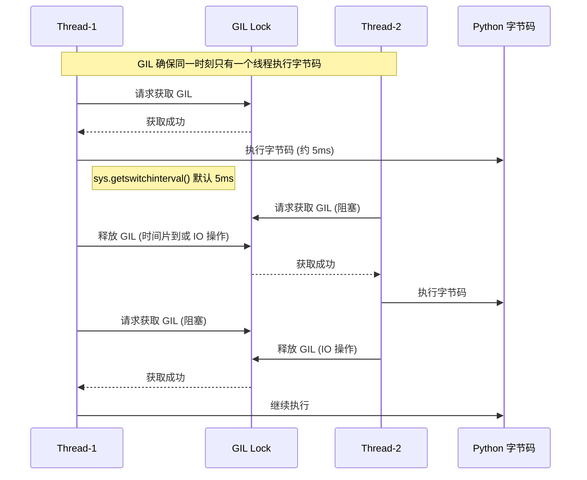
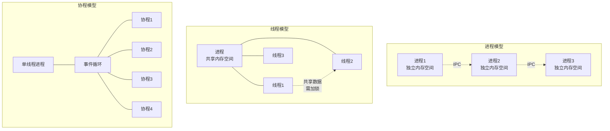
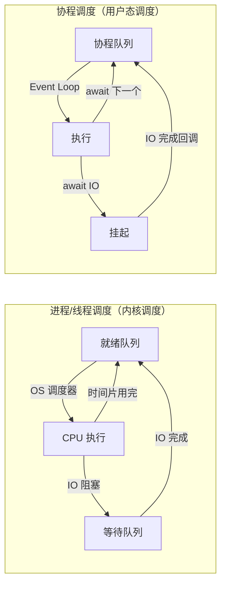
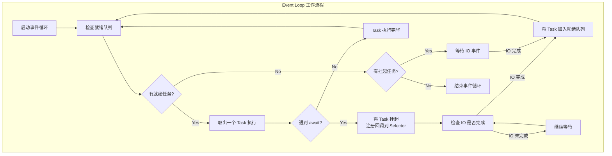
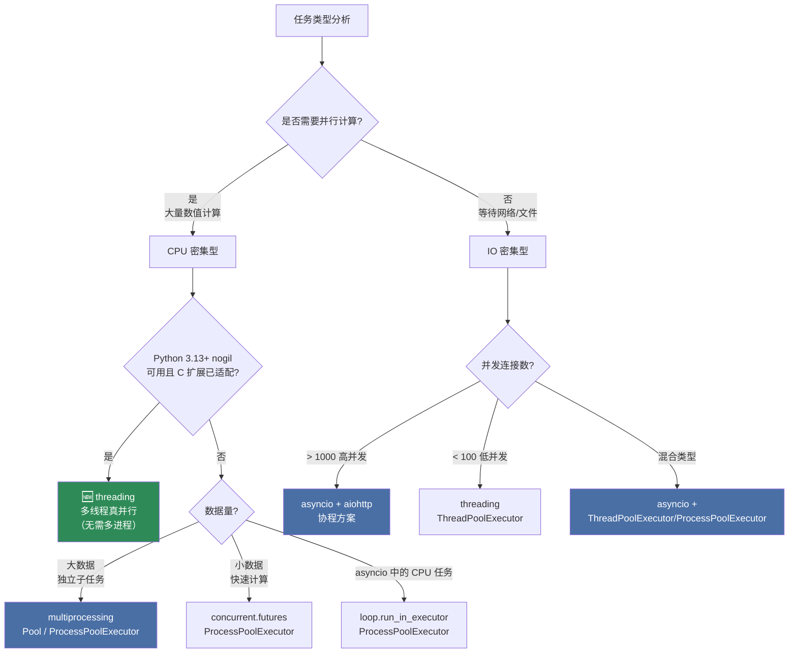

# 第5章 Python 并发编程 ⭐⭐⭐⭐⭐

> **面试频率**：极高 | **难度**：中高 | **建议学习时长**：8-10 小时

并发编程是 Python 后端/高并发岗位面试的绝对核心，约 **95%** 的中高级岗位会深入考察。本章从 GIL 原理出发，系统讲解线程、进程、协程三种并发模型，并通过大量可运行代码和面试真题帮你建立完整的并发编程知识体系。

---

## 5.1 GIL 全局解释器锁 ⭐⭐⭐⭐⭐

### 5.1.1 GIL 是什么

**GIL（Global Interpreter Lock，全局解释器锁）** 是 CPython 解释器中的一个全局互斥锁，它确保同一时刻**只有一个线程**在执行 Python 字节码。

> 重要：GIL 是 **CPython 实现** 的特性，并非 Python 语言本身的限制。Jython、IronPython 等实现没有 GIL。

```
┌─────────────────────────────────────────┐
│           Python 应用程序                │
│  ┌─────────┐  ┌─────────┐  ┌─────────┐ │
│  │ Thread 1│  │ Thread 2│  │ Thread 3│ │
│  └────┬────┘  └────┬────┘  └────┬────┘ │
│       └─────────────┼─────────────┘      │
│                     ▼                    │
│              ┌─────────┐                 │
│              │   GIL   │ ◄── 互斥锁      │
│              └────┬────┘                 │
│                   ▼                      │
│         ┌─────────────────┐              │
│         │ CPython 解释器   │              │
│         │ (字节码执行)     │              │
│         └─────────────────┘              │
└─────────────────────────────────────────┘
```

### 5.1.2 为什么存在 GIL

| 原因 | 说明 |
|------|------|
| **内存管理安全** | Python 的内存管理（引用计数）不是线程安全的，GIL 避免了复杂的锁机制 |
| **简化 C 扩展开发** | 大量 C 扩展库依赖 GIL 保证线程安全，无需额外加锁 |
| **历史遗留** | CPython 诞生于 1991 年，单核 CPU 时代，多线程非首要考虑 |
| **单线程性能** | 无锁竞争开销，单线程程序执行更快 |

GIL 本质上是**用单线程的便利性换取多线程的安全性**，是 CPython 设计中的经典权衡（Trade-off）。

### 5.1.3 GIL 下的线程执行模型



**GIL 释放时机**：
1. **时间片到期**：默认每 5ms（`sys.getswitchinterval()`）强制切换
2. **IO 操作**：线程执行 IO（如网络请求、文件读写）时主动释放 GIL
3. **阻塞调用**：如 `time.sleep()`、`select.wait()`

```python
import sys

# 查看 GIL 切换间隔（默认 5ms）
print(f"GIL switch interval: {sys.getswitchinterval()}s")
# 可以调整切换间隔
sys.setswitchinterval(0.01)  # 改为 10ms
```

### 5.1.4 CPU 密集型 vs IO 密集型任务的并发选型 ⭐⭐⭐⭐⭐

| 任务类型 | 特征 | 推荐方案 | 原理 |
|---------|------|---------|------|
| **CPU 密集型** | 大量计算、数据运算 | `multiprocessing`（GIL 版本） | 多进程绕过 GIL，利用多核 CPU |
| **CPU 密集型（🆕 nogil）** | 大量计算、纯 Python 代码 | `threading`（nogil 模式下） | 无 GIL 限制，多线程真并行 |
| **IO 密集型（网络）** | HTTP 请求、API 调用 | `asyncio` + `aiohttp` | 单线程事件循环，协程切换开销极小 |
| **IO 密集型（文件/少量网络）** | 文件读写、数据库操作 | `threading` 或 `asyncio` | IO 时释放 GIL，线程可切换 |
| **混合类型** | 既有计算又有 IO | `asyncio` + `ProcessPoolExecutor` | 协程处理 IO，进程池处理计算 |

**核心结论**：

```python
"""
并发选型决策树：

任务类型判断
    │
    ├── CPU 密集型? ──Yes──► Python 3.13+ nogil 可用?
    │                         │
    │                         ├── Yes ──► threading (多线程真并行)
    │                         │           （C扩展需线程安全适配）
    │                         │
    │                         └── No  ──► multiprocessing (多进程)
    │                                       或 asyncio + ProcessPoolExecutor
    │
    └── IO 密集型? ──Yes──► 并发量高(>1000)?
                              │
                              ├── Yes ──► asyncio (协程)
                              │
                              └── No  ──► threading (多线程)
"""

# 🆕 2026年补充：nogil 模式下的并发选型变化
"""
nogil 模式对并发选型的影响（2026年现状）：

┌─────────────────────────────────────────────────────────────┐
│                    nogil 模式适用性评估                        │
├─────────────────────────────────────────────────────────────┤
│  ✅ 纯 Python CPU 计算 — 多线程可直接替代多进程               │
│  ⚠️  使用 C 扩展的代码 — 需确认扩展已适配线程安全              │
│  ❌  依赖 GIL 保证线程安全的旧 C 扩展 — 暂不可用               │
│  ✅  高并发 Web 服务 — 结合 asyncio + 线程池更灵活             │
└─────────────────────────────────────────────────────────────┘
"""
```

### 5.1.5 Python 3.13 nogil 模式详解 🆕（2026年更新）

Python 3.13 引入了实验性的 **自由线程（free-threaded / nogil）模式**，PEP 703 已被正式接受。截至 2026 年，nogil 已从"前瞻概念"进入"实验可用"阶段。

```python
"""
🆕 Python 3.13+ nogil 模式使用与检测（2026年更新）
"""
import sys
import threading

# 运行时检测 nogil 状态
if hasattr(sys, '_is_gil_enabled'):
    gil_enabled = sys._is_gil_enabled()
    print(f"GIL 状态: {'启用' if gil_enabled else '禁用（nogil 模式）'}")
else:
    print("当前 Python 版本不支持 nogil 检测（需 3.13+）")

# 检测自由线程支持
if hasattr(sys, 'flags') and hasattr(sys.flags, 'gil'):
    print(f"编译标志: {sys.flags}")

# nogil 模式下的线程安全编程示例
counter = 0
counter_lock = threading.Lock()  # nogil 下仍需锁保护共享状态

def increment_counter(n):
    """nogil 模式下多线程可以真正并行执行此函数"""
    global counter
    for _ in range(n):
        with counter_lock:
            counter += 1

# 在 nogil 模式下，以下代码可以利用多核 CPU
# threads = [threading.Thread(target=increment_counter, args=(100000,))
#            for _ in range(4)]
# for t in threads: t.start()
# for t in threads: t.join()
# print(f"最终计数: {counter}")
```

| 特性 | CPython 3.12 (GIL) | CPython 3.13 (nogil 实验性) |
|------|-------------------|---------------------|
| 线程并行 | 伪并行（字节码级别互斥） | 真并行（多核同时执行） |
| CPU 密集型多线程 | 无效甚至更慢 | 有效，接近多进程性能 |
| 引用计数 | 简单，线程不安全（依赖 GIL） | 原子操作 + biased reference counting |
| 内存分配 | pymalloc（需 GIL 保护） | 线程本地分配器（pymalloc 的线程安全版本） |
| 第三方库兼容性 | 所有库兼容 | 部分 C 扩展需适配（NumPy、PyTorch 等正在适配） |
| 生产可用性 | 成熟稳定 | 实验性，不建议生产使用 |

**🆕 nogil 底层实现原理（面试深度要求）**：

```
┌─────────────────────────────────────────────────────────────┐
│              nogil 模式的内存管理架构                         │
│                                                             │
│   传统 GIL 模式                    nogil 模式                 │
│   ─────────────                   ───────────                │
│                                                             │
│   ┌─────┐                        ┌─────────────┐            │
│   │ GIL │ ◄── 全局锁              │  Biased Ref │            │
│   │     │     保护所有操作         │  Counting   │            │
│   └─────┘                        │             │            │
│      │                           │ • 属主线程:  │            │
│      ▼                           │   非原子操作 │            │
│   引用计数                        │ • 其他线程:  │            │
│   原子操作（慢）                    │   原子操作   │            │
│                                  └─────────────┘            │
│                                         │                   │
│                                         ▼                   │
│                                  ┌─────────────┐            │
│                                  │ 线程本地分配器 │            │
│                                  │ (tmalloc)   │            │
│                                  │             │            │
│                                  │ 每个线程独立  │            │
│                                  │ 的内存池    │            │
│                                  └─────────────┘            │
│                                                             │
│   关键创新：biased reference counting                       │
│   - 每个对象标记"属主"线程                                  │
│   - 属主线程修改引用计数无需原子操作（ fast path ）            │
│   - 非属主线程需要原子操作（ slow path ）                      │
│   - 合并操作减少同步开销                                     │
└─────────────────────────────────────────────────────────────┘
```

> **面试要点**：nogil 模式使用 **biased reference counting** 和 **线程本地内存分配器** 替代 GIL。biased reference counting 的核心创新是为每个对象标记"属主"线程，属主线程修改引用计数走 fast path（非原子操作），大幅减少了线程间同步开销。这是 2025-2026 年面试的高频新考点，考察级别从"了解"升级为"理解原理"。

> 🆕 **2026年最新进展**：官方提供了 nogil 的实验性构建版本，核心开发者正在推进更多 C 扩展的线程安全适配。预计 Python 3.14 将进一步完善 nogil 的稳定性和性能。

---

## 5.2 进程、线程、协程核心区别 ⭐⭐⭐⭐⭐

### 5.2.1 三种并发模型的全维度对比

| 维度 | 进程 (Process) | 线程 (Thread) | 协程 (Coroutine) |
|------|---------------|---------------|-----------------|
| **定义** | 独立运行的程序实例 | 进程内的执行单元 | 用户态的轻量级线程 |
| **内存空间** | 独立（隔离） | 共享进程内存 | 共享进程内存 |
| **切换开销** | 大（需切换页表） | 中（需切换栈和寄存器） | 极小（用户态切换） |
| **切换者** | 操作系统内核 | 操作系统内核 | 用户/事件循环 |
| **通信方式** | IPC（管道、队列、共享内存） | 共享内存（需锁） | 直接共享（单线程无竞争） |
| **并行能力** | 真并行（利用多核） | 伪并行（GIL 限制） | 伪并行（单线程） |
| **适用场景** | CPU 密集型 | IO 密集型（少量并发） | IO 密集型（高并发） |
| **并发量** | 数十个 | 数百个 | 数万+ |
| **Python 模块** | `multiprocessing` | `threading` | `asyncio` |
| **代码复杂度** | 中（需处理 IPC） | 中（需处理锁） | 中高（需理解异步语义） |

### 5.2.2 内存模型对比



### 5.2.3 调度方式对比



**核心区别**：协程的调度不经过操作系统内核，完全在**用户空间**完成，因此切换开销比线程小 1-2 个数量级。

---

## 5.3 多线程编程 threading ⭐⭐⭐⭐

### 5.3.1 基础用法

```python
import threading
import time


def worker(name, duration):
    """线程执行的任务"""
    print(f"[Thread-{name}] 开始执行")
    time.sleep(duration)  # 模拟 IO 操作
    print(f"[Thread-{name}] 执行完成，耗时 {duration}s")


# 创建并启动线程
threads = []
for i in range(3):
    t = threading.Thread(target=worker, args=(i, 2))
    threads.append(t)
    t.start()

# 等待所有线程完成
for t in threads:
    t.join()

print("所有线程执行完毕")
```

### 5.3.2 线程同步机制

```python
import threading
import time

# ========== Lock（互斥锁）==========
lock = threading.Lock()
counter = 0

def increment_with_lock(n):
    """使用 Lock 保证线程安全"""
    global counter
    for _ in range(n):
        with lock:  # 等价于 lock.acquire() + lock.release()
            # 临界区：读取-修改-写入操作
            current = counter
            time.sleep(0.000001)  # 模拟操作延迟
            counter = current + 1

# ========== RLock（可重入锁）==========
rlock = threading.RLock()

def outer():
    with rlock:
        print("外层获取锁")
        inner()  # 同一线程可以再次获取 RLock

def inner():
    with rlock:
        print("内层获取锁（重入）")

# RLock 允许同一线程多次获取，Lock 会死锁

# ========== Semaphore（信号量）==========
# 控制同时访问某资源的线程数量
semaphore = threading.Semaphore(3)  # 最多3个线程同时执行

def limited_worker(name):
    with semaphore:
        print(f"{name} 获取信号量，开始执行")
        time.sleep(2)
        print(f"{name} 释放信号量")

# ========== Condition（条件变量）==========
condition = threading.Condition()
message = None

def consumer():
    with condition:
        while message is None:
            condition.wait()  # 等待通知
        print(f"消费者收到: {message}")

def producer():
    global message
    time.sleep(1)
    with condition:
        message = "Hello"
        condition.notify_all()  # 通知所有等待的线程
```

### 5.3.3 线程池 ThreadPoolExecutor

```python
from concurrent.futures import ThreadPoolExecutor, as_completed
import time
import requests


def fetch_url(url):
    """模拟网络请求"""
    time.sleep(1)  # 模拟网络延迟
    return f"Response from {url}"


urls = [f"https://api.example.com/data/{i}" for i in range(10)]

# ========== 方式1：map（按顺序返回结果）==========
with ThreadPoolExecutor(max_workers=5) as executor:
    results = executor.map(fetch_url, urls)
    for url, result in zip(urls, results):
        print(f"{url}: {result}")

# ========== 方式2：submit（按完成顺序返回，更灵活）==========
with ThreadPoolExecutor(max_workers=5) as executor:
    # 提交所有任务，得到 Future 对象
    future_to_url = {executor.submit(fetch_url, url): url for url in urls}
    
    # as_completed 在任务完成时 yield
    for future in as_completed(future_to_url):
        url = future_to_url[future]
        try:
            result = future.result()
            print(f"✓ {url}: {result}")
        except Exception as e:
            print(f"✗ {url}: {e}")
```

🎯 **面试题**：`ThreadPoolExecutor` 中 `map()` 和 `submit()` 的区别？

> **答案**：`map()` 按输入顺序返回结果，会阻塞等待；`submit()` 返回 `Future` 对象，配合 `as_completed()` 可按完成顺序获取结果，更灵活高效。

### 5.3.4 线程本地存储

```python
import threading

# 线程本地存储：每个线程拥有独立的数据副本
thread_local = threading.local()

def process_request(request_id):
    # 每个线程的 thread_local.user 互不干扰
    thread_local.user = f"User-{request_id}"
    thread_local.request_id = request_id
    
    # 模拟处理
    import time
    time.sleep(0.1)
    
    print(f"线程 {threading.current_thread().name}: "
          f"user={thread_local.user}, request={thread_local.request_id}")

# 多线程场景下（如 Web 服务器），每个请求独立存储上下文
threads = []
for i in range(5):
    t = threading.Thread(target=process_request, args=(i,))
    threads.append(t)
    t.start()

for t in threads:
    t.join()
```

---

## 5.4 多进程编程 multiprocessing ⭐⭐⭐⭐

### 5.4.1 基础用法

```python
import multiprocessing as mp
import os
import time


def cpu_intensive_task(n):
    """CPU 密集型任务：计算斐波那契数列"""
    print(f"进程 {os.getpid()} 处理 n={n}")
    
    def fib(n):
        if n <= 1:
            return n
        return fib(n - 1) + fib(n - 2)
    
    result = fib(n)
    return result


if __name__ == "__main__":
    # Windows 必须使用 if __name__ == "__main__" 保护
    
    numbers = [30, 32, 33, 31, 30]
    
    # ========== 方式1：Pool（进程池）==========
    with mp.Pool(processes=mp.cpu_count()) as pool:
        # map 会自动分配任务到多个进程
        results = pool.map(cpu_intensive_task, numbers)
        print(f"结果: {results}")
    
    # ========== 方式2：Process（手动创建）==========
    processes = []
    for n in numbers[:3]:
        p = mp.Process(target=cpu_intensive_task, args=(n,))
        processes.append(p)
        p.start()
    
    for p in processes:
        p.join()
```

> **注意**：Windows 上使用 `multiprocessing` 必须用 `if __name__ == "__main__":` 保护，否则会递归创建子进程。

### 5.4.2 进程间通信（IPC）

```python
import multiprocessing as mp
import time


def producer(queue, items):
    """生产者：通过 Queue 发送数据"""
    for item in items:
        queue.put(item)
        print(f"[生产者] 发送: {item}")
        time.sleep(0.1)
    queue.put(None)  # 发送结束信号

def consumer(queue):
    """消费者：从 Queue 接收数据"""
    while True:
        item = queue.get()
        if item is None:
            break
        print(f"[消费者] 处理: {item}")

if __name__ == "__main__":
    queue = mp.Queue(maxsize=10)
    
    items = list(range(10))
    
    p1 = mp.Process(target=producer, args=(queue, items))
    p2 = mp.Process(target=consumer, args=(queue,))
    
    p1.start()
    p2.start()
    
    p1.join()
    p2.join()

# ========== 使用 Pipe（双向通信）==========
def send_data(conn, data):
    conn.send(data)
    conn.close()

def recv_data(conn):
    print(f"收到: {conn.recv()}")
    conn.close()

if __name__ == "__main__":
    parent_conn, child_conn = mp.Pipe()
    p = mp.Process(target=send_data, args=(child_conn, "Hello"))
    p.start()
    print(parent_conn.recv())  # 输出: Hello
    p.join()

# ========== 使用共享内存（Value / Array）==========
def increment(shared_counter, lock, n):
    """使用共享内存 + 锁实现进程安全计数"""
    for _ in range(n):
        with lock:
            shared_counter.value += 1

if __name__ == "__main__":
    shared_counter = mp.Value('i', 0)  # 'i' = signed int
    lock = mp.Lock()
    
    processes = [
        mp.Process(target=increment, args=(shared_counter, lock, 10000))
        for _ in range(4)
    ]
    
    for p in processes:
        p.start()
    for p in processes:
        p.join()
    
    print(f"最终计数: {shared_counter.value}")  # 40000
```

### 5.4.3 ProcessPoolExecutor

```python
from concurrent.futures import ProcessPoolExecutor
import math


def is_prime(n):
    """判断素数（CPU 密集型）"""
    if n < 2:
        return False
    for i in range(2, int(math.sqrt(n)) + 1):
        if n % i == 0:
            return False
    return True


def main():
    numbers = list(range(100000, 101000))
    
    # 使用进程池并行计算
    with ProcessPoolExecutor(max_workers=4) as executor:
        results = list(executor.map(is_prime, numbers))
    
    primes = [n for n, is_p in zip(numbers, results) if is_p]
    print(f"找到 {len(primes)} 个素数")
    print(f"前10个: {primes[:10]}")


if __name__ == "__main__":
    main()
```

---

## 5.5 异步编程 asyncio ⭐⭐⭐⭐⭐

### 5.5.1 async/await 基础

```python
import asyncio


async def say_hello(name, delay):
    """async def 定义协程函数"""
    print(f"Hello {name}, 等待 {delay}s...")
    await asyncio.sleep(delay)  # await 挂起当前协程，让出执行权
    print(f"Goodbye {name}")
    return f"{name} 完成"


async def main():
    """入口协程"""
    # await 直接等待一个协程完成
    result = await say_hello("Alice", 1)
    print(f"结果: {result}\n")
    
    # ========== 并行执行多个协程 ==========
    # 方式1：create_task 创建后台任务
    task1 = asyncio.create_task(say_hello("Bob", 2))
    task2 = asyncio.create_task(say_hello("Carol", 1))
    
    # 此时两个任务已经在后台运行
    result1 = await task1
    result2 = await task2
    print(f"Task1: {result1}, Task2: {result2}\n")
    
    # 方式2：gather 等待所有协程完成（更简洁）
    results = await asyncio.gather(
        say_hello("Dave", 1),
        say_hello("Eve", 2),
        say_hello("Frank", 1),
    )
    print(f"Gather 结果: {results}")


# 启动事件循环
asyncio.run(main())
```

### 5.5.2 事件循环原理



```python
import asyncio

# 查看和获取事件循环
loop = asyncio.get_event_loop()
print(f"当前事件循环: {loop}")

# asyncio.run() 的底层等价实现
def run_coroutine(coroutine):
    """等价于 asyncio.run()"""
    loop = asyncio.new_event_loop()
    try:
        asyncio.set_event_loop(loop)
        return loop.run_until_complete(coroutine)
    finally:
        loop.close()
        asyncio.set_event_loop(None)
```

### 5.5.3 create_task vs gather vs TaskGroup

```python
import asyncio


async def task(name, delay, fail=False):
    await asyncio.sleep(delay)
    if fail:
        raise ValueError(f"{name} 失败!")
    return f"{name} 完成"


async def main():
    # ========== create_task：创建后台任务 ==========
    # 适用于：需要立即启动但稍后 await 的场景
    task1 = asyncio.create_task(task("A", 1))
    task2 = asyncio.create_task(task("B", 2))
    
    # 此时 A 和 B 已经并行运行了
    print("任务已启动，可以做其他事...")
    
    result1 = await task1  # 等待 A 完成
    result2 = await task2  # 等待 B 完成
    print(f"{result1}, {result2}\n")
    
    # ========== gather：批量等待（Python 3.7+）==========
    # 适用于：同时启动多个任务，等待全部完成
    results = await asyncio.gather(
        task("C", 1),
        task("D", 2),
        task("E", 1),
        return_exceptions=True  # 捕获异常而不是抛出
    )
    print(f"Gather 结果: {results}\n")
    
    # ========== TaskGroup（Python 3.11+）==========
    # 适用于：结构化并发，一个失败全部取消
    try:
        async with asyncio.TaskGroup() as tg:
            tg.create_task(task("F", 1))
            tg.create_task(task("G", 2))
            tg.create_task(task("H", 1, fail=True))  # 会触发失败
    except* Exception as eg:
        print(f"TaskGroup 异常: {eg.exceptions}")


asyncio.run(main())
```

| 函数/类 | 适用场景 | 异常处理 | 取消行为 |
|---------|---------|---------|---------|
| `create_task` | 单独创建后台任务 | 在 await 时抛出 | 需手动取消 |
| `gather` | 批量启动和等待 | `return_exceptions=True` 时捕获 | 不自动取消 |
| `TaskGroup` | 结构化并发 | 第一个异常取消其余 | 一个失败全部取消 |

### 5.5.4 🎯 面试高频题：同步阻塞代码如何放入异步

这是 asyncio 面试的**最高频问题**。核心方案：`loop.run_in_executor()`

```python
import asyncio
from concurrent.futures import ThreadPoolExecutor
import time


def blocking_io(filename):
    """
    同步阻塞函数（如文件读写、数据库查询、CPU 计算）
    不能直接 await！
    """
    time.sleep(2)  # 模拟阻塞操作
    return f"{filename} 读取完成"


def cpu_bound_task(n):
    """CPU 密集型任务"""
    count = 0
    for i in range(n):
        count += i * i
    return count


async def main():
    # ========== 错误示范：在协程中直接调用阻塞函数 ==========
    # result = blocking_io("data.txt")  # ❌ 会阻塞整个事件循环！
    
    # ========== 正确方案1：run_in_executor（线程池）==========
    loop = asyncio.get_event_loop()
    
    # IO 密集型阻塞操作 → 线程池
    result = await loop.run_in_executor(
        None,           # None 使用默认线程池
        blocking_io,    # 同步函数
        "data.txt"      # 函数参数
    )
    print(f"方案1 结果: {result}")
    
    # ========== 正确方案2：asyncio.to_thread（Python 3.9+）==========
    result2 = await asyncio.to_thread(blocking_io, "data.txt")
    print(f"方案2 结果: {result2}")
    
    # ========== 正确方案3：ProcessPoolExecutor（CPU 密集型）==========
    with ThreadPoolExecutor() as pool:  # IO 用线程池
        result3 = await loop.run_in_executor(pool, blocking_io, "data.txt")
        print(f"方案3 结果: {result3}")
    
    # ========== CPU 密集型 → 进程池 ==========
    from concurrent.futures import ProcessPoolExecutor
    with ProcessPoolExecutor() as pool:
        result4 = await loop.run_in_executor(pool, cpu_bound_task, 1000000)
        print(f"CPU 任务结果: {result4}")


asyncio.run(main())
```

🎯 **面试题**：为什么在协程中直接调用 `time.sleep()` 会阻塞整个事件循环？

> **答案**：`time.sleep()` 会阻塞当前**线程**，而 asyncio 的事件循环运行在主线程中。协程遇到 `time.sleep()` 时不会主动让出控制权，事件循环无法调度其他协程，导致所有协程"假死"。必须使用 `await asyncio.sleep()` 让事件循环有机会切换到其他任务。

### 5.5.5 实战：用 asyncio 编写高并发 HTTP 客户端

```python
import asyncio
import aiohttp
import time


async def fetch(session: aiohttp.ClientSession, url: str) -> dict:
    """异步 HTTP GET 请求"""
    try:
        async with session.get(url, timeout=aiohttp.ClientTimeout(total=10)) as response:
            data = await response.json()
            return {"url": url, "status": response.status, "data": data}
    except Exception as e:
        return {"url": url, "error": str(e)}


async def fetch_all(urls: list[str], max_concurrent: int = 100) -> list[dict]:
    """
    高并发批量请求
    
    Args:
        urls: URL 列表
        max_concurrent: 最大并发数（防止目标服务器过载）
    """
    # 使用信号量限制并发数
    semaphore = asyncio.Semaphore(max_concurrent)
    
    # 共享 session（复用 TCP 连接，性能更好）
    async with aiohttp.ClientSession() as session:
        async def bounded_fetch(url):
            async with semaphore:
                return await fetch(session, url)
        
        # 使用 gather 并发执行所有请求
        tasks = [bounded_fetch(url) for url in urls]
        results = await asyncio.gather(*tasks, return_exceptions=True)
        
        # 处理异常结果
        return [
            r if not isinstance(r, Exception) else {"error": str(r)}
            for r in results
        ]


async def main():
    # 测试：并发请求多个 API
    urls = [
        f"https://jsonplaceholder.typicode.com/posts/{i}"
        for i in range(1, 101)  # 100 个请求
    ]
    
    start = time.time()
    results = await fetch_all(urls, max_concurrent=20)
    elapsed = time.time() - start
    
    print(f"请求 {len(urls)} 个 URL，耗时 {elapsed:.2f}s")
    print(f"前3个结果: {results[:3]}")
    
    # 统计成功率
    success = sum(1 for r in results if "error" not in r)
    print(f"成功率: {success}/{len(urls)}")


if __name__ == "__main__":
    asyncio.run(main())
```

**性能对比**（100 个 HTTP 请求）：

| 方案 | 耗时 | 原理 |
|------|------|------|
| 同步顺序请求 | ~100s | 每个请求串行等待 |
| 多线程 (50 workers) | ~5s | 线程切换开销 |
| **asyncio + aiohttp** | **~2s** | **事件循环 + 协程切换** |

### 5.5.6 异步上下文管理器和异步迭代器

```python
import asyncio
import aiosqlite  # 异步 SQLite 库


# ========== 异步上下文管理器 ==========
class AsyncDatabase:
    """异步数据库连接上下文管理器"""
    
    async def __aenter__(self):
        self.conn = await aiosqlite.connect("test.db")
        return self.conn
    
    async def __aexit__(self, exc_type, exc_val, exc_tb):
        await self.conn.close()


async def use_async_context():
    async with AsyncDatabase() as conn:
        await conn.execute("CREATE TABLE IF NOT EXISTS users (id INTEGER, name TEXT)")
        await conn.commit()


# ========== 异步迭代器 ==========
class AsyncRange:
    """异步范围迭代器"""
    
    def __init__(self, start, end, delay=0.1):
        self.current = start
        self.end = end
        self.delay = delay
    
    def __aiter__(self):
        return self
    
    async def __anext__(self):
        if self.current >= self.end:
            raise StopAsyncIteration
        await asyncio.sleep(self.delay)
        value = self.current
        self.current += 1
        return value


async def use_async_iter():
    async for i in AsyncRange(0, 5):
        print(f"异步迭代: {i}")


asyncio.run(use_async_iter())
```

---

## 5.6 并发编程选型指南 ⭐⭐⭐⭐⭐

### 5.6.1 决策流程图



> 🆕 **2026年并发选型更新**：随着 Python 3.13 nogil 模式的实验性可用，CPU 密集型任务的选型新增了"nogil + threading"选项。但需注意：此方案仅在 **(a)** 使用 Python 3.13+ 且专门编译启用 nogil，**(b)** 所有 C 扩展已适配线程安全 这两个条件同时满足时才适用。当前生产环境仍推荐 `multiprocessing`。

### 5.6.2 各方案性能基准对比

| 场景 | 方案 | 100 任务耗时 | 1000 任务耗时 | 内存占用 | 2026年适用性 |
|------|------|------------|-------------|---------|------------|
| CPU 计算 | 单线程 | 10s | 100s | 低 | 基准 |
| CPU 计算 | multiprocessing (8核) | 1.5s | 15s | 高 | 生产推荐 |
| CPU 计算 | 🆕 threading nogil (8核) | ~1.8s | ~18s | 中 | 实验性，看适配 |
| HTTP 请求 | 单线程同步 | 50s | 500s | 低 | 不推荐 |
| HTTP 请求 | threading (50 workers) | 3s | 30s | 中 | 低并发可用 |
| HTTP 请求 | **asyncio + aiohttp** | **1s** | **5s** | **低** | **高并发推荐** |

### 5.6.3 混合并发模式实战

```python
import asyncio
from concurrent.futures import ProcessPoolExecutor, ThreadPoolExecutor
import aiohttp
import time


def cpu_intensive(data: dict) -> dict:
    """CPU 密集型：数据处理"""
    # 模拟复杂计算
    result = {k: v ** 2 for k, v in data.items() if isinstance(v, (int, float))}
    time.sleep(0.01)  # 模拟计算时间
    return result


async def fetch_data(session: aiohttp.ClientSession, url: str) -> dict:
    """IO 密集型：网络请求"""
    async with session.get(url) as resp:
        return await resp.json()


async def process_urls(urls: list[str]) -> list[dict]:
    """
    混合并发模式：
    - IO 部分用 asyncio（协程处理 HTTP 请求）
    - CPU 部分用 ProcessPoolExecutor（多进程处理数据）
    """
    # Step 1: 协程并发获取数据（IO 密集型）
    async with aiohttp.ClientSession() as session:
        fetch_tasks = [fetch_data(session, url) for url in urls]
        raw_data_list = await asyncio.gather(*fetch_tasks)
    
    # Step 2: 进程池并行处理数据（CPU 密集型）
    loop = asyncio.get_event_loop()
    with ProcessPoolExecutor(max_workers=4) as pool:
        process_tasks = [
            loop.run_in_executor(pool, cpu_intensive, data)
            for data in raw_data_list
        ]
        processed_data = await asyncio.gather(*process_tasks)
    
    return processed_data


# ========== 生产级并发模式：后台任务队列 ==========
import asyncio
from dataclasses import dataclass
from enum import Enum


class TaskStatus(Enum):
    PENDING = "pending"
    RUNNING = "running"
    COMPLETED = "completed"
    FAILED = "failed"


@dataclass
class Task:
    id: str
    coro: asyncio.coroutines  # 协程对象
    status: TaskStatus = TaskStatus.PENDING
    result: any = None


class TaskQueue:
    """生产级异步任务队列"""
    
    def __init__(self, max_workers: int = 10):
        self.max_workers = max_workers
        self.queue = asyncio.Queue()
        self.tasks = {}
        self.semaphore = asyncio.Semaphore(max_workers)
    
    async def submit(self, task_id: str, coro) -> Task:
        """提交任务到队列"""
        task = Task(id=task_id, coro=coro)
        self.tasks[task_id] = task
        await self.queue.put(task)
        return task
    
    async def _worker(self):
        """工作协程：从队列取任务执行"""
        while True:
            task = await self.queue.get()
            async with self.semaphore:
                task.status = TaskStatus.RUNNING
                try:
                    task.result = await task.coro
                    task.status = TaskStatus.COMPLETED
                except Exception as e:
                    task.result = e
                    task.status = TaskStatus.FAILED
                finally:
                    self.queue.task_done()
    
    async def start(self):
        """启动工作协程"""
        workers = [
            asyncio.create_task(self._worker())
            for _ in range(self.max_workers)
        ]
        return workers
    
    async def wait_all(self):
        """等待所有任务完成"""
        await self.queue.join()


# 使用示例
async def demo_task_queue():
    async def my_task(name, delay):
        await asyncio.sleep(delay)
        return f"{name} done"
    
    queue = TaskQueue(max_workers=5)
    workers = await queue.start()
    
    # 提交 20 个任务
    for i in range(20):
        await queue.submit(f"task-{i}", my_task(f"Task-{i}", 1))
    
    await queue.wait_all()
    
    completed = sum(1 for t in queue.tasks.values() 
                    if t.status == TaskStatus.COMPLETED)
    print(f"完成 {completed}/{len(queue.tasks)} 个任务")
    
    # 清理工作协程
    for w in workers:
        w.cancel()


asyncio.run(demo_task_queue())
```

---

## 🎯 面试真题精讲

### 题目 1：GIL 的存在是否意味着 Python 多线程完全没用？

> **答案**：不是。GIL 只限制**字节码执行**的并行，当线程执行 IO 操作时会释放 GIL，其他线程可以获得执行权。因此多线程对 **IO 密集型任务**（网络请求、文件读写）仍然有效。但对于 **CPU 密集型任务**，多线程确实无法利用多核优势，应使用多进程。

### 题目 2：进程、线程、协程的区别？各自适用场景？

> **答案**：
> - **进程**：独立内存空间，调度开销大，利用多核实现真并行，适合 CPU 密集型任务
> - **线程**：共享内存，调度开销中等，GIL 限制只能单核执行字节码，适合 IO 密集型（少量并发）
> - **协程**：用户态轻量线程，调度开销极小（协程切换约 1μs，线程切换约 100μs），单线程事件循环，适合高并发 IO 场景（如 Web 服务器、爬虫）

### 题目 3：asyncio 中 `await` 的作用是什么？

> **答案**：`await` 有双重作用：
> 1. **挂起当前协程**：将控制权交还给事件循环，让其他协程有机会执行
> 2. **等待结果**：当被 await 的协程/任务完成后，恢复当前协程的执行并返回结果
> 
> `await` 后面只能接 **Awaitable** 对象（Coroutine、Task、Future 或有 `__await__` 方法的对象）。

### 题目 4：如何将同步阻塞代码（如数据库查询）集成到 asyncio 程序中？

> **答案**：使用 `loop.run_in_executor()` 或 `asyncio.to_thread()` 将阻塞操作放入线程池/进程池执行：
> ```python
> # 方案1：线程池（IO 密集型阻塞操作）
> result = await loop.run_in_executor(None, blocking_func, arg1, arg2)
> 
> # 方案2：Python 3.9+ 语法糖
> result = await asyncio.to_thread(blocking_func, arg1, arg2)
> 
> # 方案3：进程池（CPU 密集型）
> with ProcessPoolExecutor() as pool:
>     result = await loop.run_in_executor(pool, cpu_func, data)
> ```

### 题目 5：`asyncio.create_task()` 和 `await` 一个协程的区别？

> **答案**：
> - `await coroutine()`：立即执行并等待完成，串行执行
> - `asyncio.create_task(coroutine())`：将协程包装为 Task 并**立即调度**到事件循环中执行，但不等待完成。可以继续做其他事，稍后通过 `await task` 获取结果。`create_task` 是实现并发的关键。

### 🎯🆕 题目 6：Python 3.13 的 nogil 模式对并发编程选型有什么影响？

> **答案（2026年更新）**：
>
> **核心影响**：nogil 模式使 Python 多线程**不再受 GIL 限制**，CPU 密集型任务中多线程可以真正利用多核 CPU。
>
> **选型变化**：
> - **纯 Python CPU 计算**：`threading` 可以替代 `multiprocessing`，避免了进程创建和 IPC 开销
> - **混合 C 扩展的场景**：需谨慎评估扩展的线程安全性，NumPy 等主流库正在适配
> - **IO 密集型**：影响较小，asyncio 仍是高并发首选
>
> **当前限制（2026年）**：
> - 需要专门编译 Python（`--disable-gil`），主流发行版尚未默认支持
> - 部分 C 扩展尚未适配线程安全
> - 生产环境仍建议使用 GIL 版本 + multiprocessing
>
> **面试加分**：能解释 nogil 的底层实现（biased reference counting + 线程本地内存分配器），并分析其对现有并发模型的影响。

### 🎯🆕 题目 7：biased reference counting 是什么？为什么它比全局引用计数更高效？

> **答案（2026年深度考点）**：
>
> **biased reference counting** 是 nogil 模式替代 GIL 的核心技术之一。
>
> **原理**：每个 Python 对象有一个"属主"线程（创建该对象的线程）。引用计数的修改分为两种情况：
> 1. **Fast path**：属主线程修改引用计数 → 无需原子操作，直接非原子递增/递减
> 2. **Slow path**：非属主线程修改引用计数 → 需要原子操作，且可能触发 biased state 的撤销
>
> **为什么更高效**：
> - 在大多数 Python 程序中，对象的引用操作集中在创建它的线程（局部变量为主）
> - 消除了 GIL 的"一把大锁"问题，只在真正需要跨线程同步时才使用原子操作
> - 相比全局引用计数的全原子操作，biased reference counting 大幅减少了同步开销
>
> **与 GIL 的对比**：
> - GIL：简单粗暴，一把锁保护所有字节码执行和引用计数，单线程性能好但多线程无法并行
> - biased RC：精细化设计，利用"数据局部性"减少同步，支持真并行但实现复杂

---

## 本章小结

```
Python 并发编程
├── GIL 全局解释器锁
│   ├── CPython 字节码级别互斥
│   ├── IO 操作自动释放 GIL
│   ├── nogil 模式实验性可用
│   └── biased reference counting
├── 进程 (multiprocessing)
│   ├── 独立内存空间、利用多核
│   ├── CPU 密集型首选
│   └── IPC 通信（Queue/Pipe）
├── 线程 (threading)
│   ├── 共享内存、受 GIL 限制
│   ├── IO 密集型低并发场景
│   └── 需锁同步（Lock/RLock/Semaphore）
├── 协程 (asyncio)
│   ├── 事件循环调度、用户态切换
│   ├── 高并发 IO 首选
│   ├── async/await 语法
│   └── run_in_executor 集成同步代码
└── 选型原则
    ├── CPU 密集 → 多进程
    ├── IO 高并发 → asyncio
    ├── IO 低并发 → 多线程
    └── 混合 → asyncio + executor
```

| 知识点 | 面试频率 | 掌握要求 |
|--------|---------|---------|
| GIL 原理与影响 | ⭐⭐⭐⭐⭐ | 深入理解，能画图解释 |
| CPU/IO 密集型选型 | ⭐⭐⭐⭐⭐ | 能根据场景选择方案 |
| 进程/线程/协程区别 | ⭐⭐⭐⭐⭐ | 全维度对比，内存模型 |
| asyncio 事件循环 | ⭐⭐⭐⭐⭐ | 能解释原理和代码执行流程 |
| run_in_executor | ⭐⭐⭐⭐⭐ | 能处理同步代码的异步集成 |
| 锁机制（Lock/RLock/Semaphore） | ⭐⭐⭐⭐ | 了解用途和使用场景 |
| 🆕 nogil 模式（含 biased RC） | ⭐⭐⭐⭐⭐ | **理解原理，能分析对并发选型的影响** |
| 🆕 并发选型（含 nogil 场景） | ⭐⭐⭐⭐ | 能根据 Python 版本和库适配情况选择 |

---

## 📚 相关章节

- [[01_Python编程基础]] — 函数、变量作用域等前置知识
- [[06_Python内存管理与垃圾回收]] — 多线程下的引用计数与 GIL 对内存管理的影响
