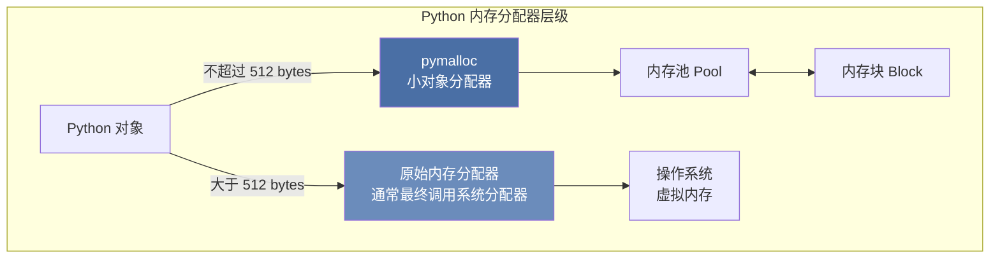
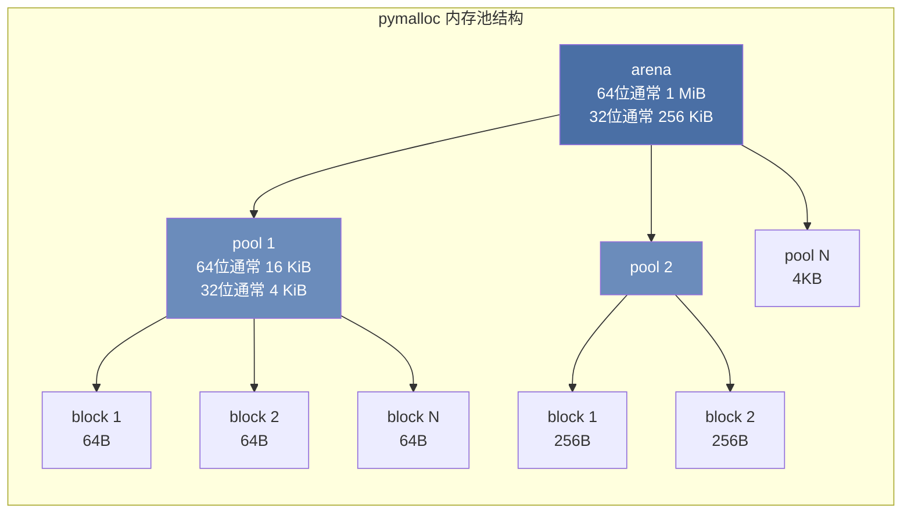
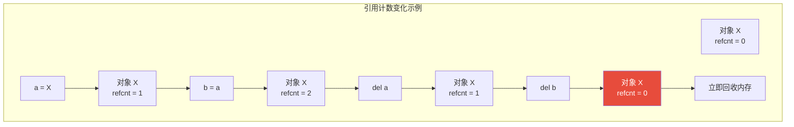
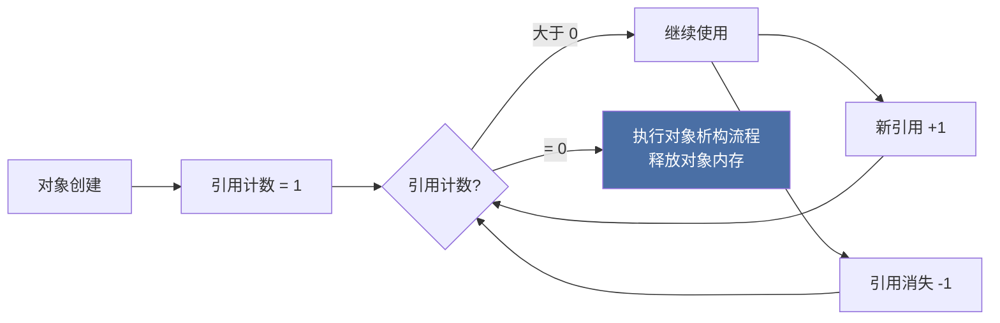
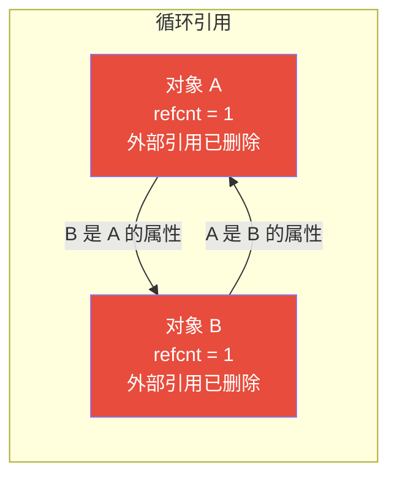
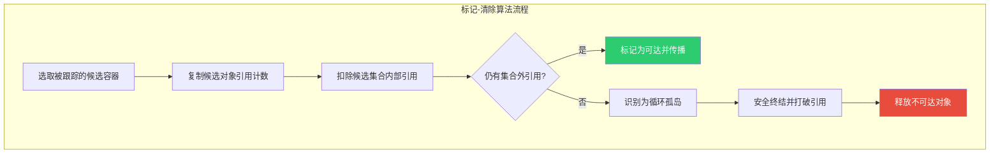
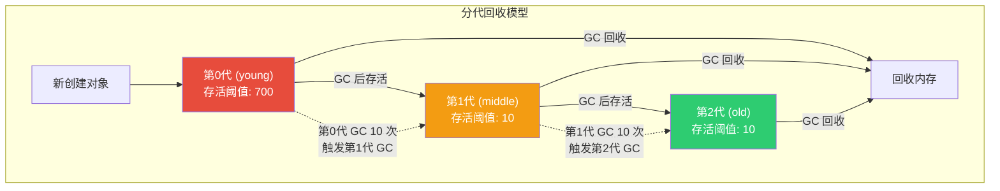
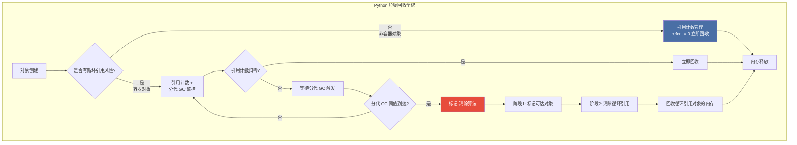

# 第 6 章 Python 内存管理与性能诊断 ⭐⭐⭐⭐
> [!abstract] 本章导航
> **定位**：第一部分 Python 与后端工程基础中的第 6 章；围绕“Python 内存管理与性能诊断”建立单一、可追踪的知识主线。
>
> **先修**：[[05_Python面向对象与数据模型|第 5 章 Python 面向对象与数据模型]]。
>
> **学习目标**：
> - 解释 内存管理机制 的核心问题、机制与适用边界。
> - 实现或评估 垃圾回收机制 ⭐⭐⭐⭐ 的最小闭环。
> - 使用可复现证据诊断 内存泄漏与调试 的工程取舍与失败模式。
>
> **建议路径**：内存管理机制 → 垃圾回收机制 ⭐⭐⭐⭐ → 内存泄漏与调试。
>
> **配套代码**：`code/ch06_memory_profiling/`。

本章先回答“内存管理机制”为什么成立，再沿着机制、实现、评估和边界逐步展开。阅读时先建立因果链，再运行或推演示例，最后用章末自测检查能否脱离原文复述。
## 6.1 内存管理机制

### 6.1.1 Python 内存分配器架构

Python 的内存管理采用**分层架构**，根据对象大小使用不同的分配策略：



**三层分配器详解**：

| 层级 | 名称 | 管理对象 | 功能 |
|------|------|---------|------|
| **Layer 3** | 对象分配器 (pymalloc) | `<= 512 bytes` 的小对象 | 高效的内存池，减少 malloc 调用 |
| **Layer 2** | C 标准分配器 | `> 512 bytes` 的大对象 | 直接调用 `malloc`/`free` |
| **Layer 1** | 操作系统 | 虚拟内存页 | 页级别的内存管理 |

**pymalloc 工作原理**：



- **Arena**：CPython 64 位构建通常为 `1 MiB`，32 位构建通常为 `256 KiB`
- **Pool**：64 位构建通常为 `16 KiB`，32 位构建通常为 `4 KiB`；同一 Pool 服务同一 size class
- **Block**：实际分配给对象的单元，按 size class 管理，最大为 `512` 字节

以上是 **CPython 实现细节**，不是 Python 语言规范。默认带 GIL 的 CPython 使用 pymalloc 管理小对象；自由线程构建使用 mimalloc，因此不能把 pymalloc 图套用到所有 Python 实现和构建。

```python
import sys

# 查看对象内存大小
print(sys.getsizeof(42))           # 28 bytes (int)
print(sys.getsizeof("hello"))      # 54 bytes (str)
print(sys.getsizeof([1, 2, 3]))    # 88 bytes (list)
print(sys.getsizeof({"a": 1}))     # 232 bytes (dict)

# sys 没有公开的 `_pymem_in_use()` API。
# 排查 Python 分配可使用 tracemalloc；CPython 调试构建还可使用
# sys._debugmallocstats()，但它是实现细节且直接写到 stderr。
import tracemalloc

tracemalloc.start()
snapshot = tracemalloc.take_snapshot()
print(f"tracemalloc 已跟踪块数: {len(snapshot.traces)}")
```

**参考资料（核对日期：2026-07-31）**：

- [Python/C API：Memory Management](https://docs.python.org/3/c-api/memory.html)
- [Python 标准库：`tracemalloc`](https://docs.python.org/3/library/tracemalloc.html)

### 6.1.2 对象的内存布局（PyObject 头部）

Python 中**所有对象**在内存中都有统一的头部结构：

```
┌─────────────────────────────────────────┐
│              PyObject 头部               │
├──────────────────┬──────────────────────┤
│  ob_refcnt       │      ob_type          │
│  (引用计数)       │    (类型指针)          │
│   8 bytes        │      8 bytes          │
├──────────────────┴──────────────────────┤
│              对象特定数据                 │
│    (如 int 的 ob_digit, list 的 ob_item) │
└─────────────────────────────────────────┘
```

```c
// CPython 源码：Include/object.h
typedef struct _object {
    _PyObject_HEAD_EXTRA  // 双向链表指针（调试时使用）
    Py_ssize_t ob_refcnt;  // 引用计数
    PyTypeObject *ob_type; // 指向类型对象的指针
} PyObject;
```

**示例：整数对象的内存布局**

```python
import sys

# int 对象在内存中的结构
# PyObject_HEAD + ob_digit 数组
# 小整数（-5 ~ 256）被缓存，不重复创建

a = 42
b = 42
c = 257
d = 257

print(a is b)      # True （小整数缓存）
print(c is d)      # False （大整数不缓存，CPython 实现细节）

# 列表存储的是指针数组
lst = [1, 2, 3]
# 内存布局：PyObject_HEAD + ob_size + allocated + ob_item[]
# ob_item 存储的是指向各个元素对象的指针

# 验证列表存储的是引用
inner = [10, 20]
lst2 = [inner, inner]  # 两个元素指向同一对象
lst2[0][0] = 99
print(lst2)  # [[99, 20], [99, 20]] — 同一对象的引用
```

### 6.1.3 引用计数的核心机制

引用计数是 Python 内存管理的**基石**，每个对象维护一个引用计数器：



**引用计数增加的场景**：

| 操作 | 示例 | 引用计数变化 |
|------|------|------------|
| 赋值给变量 | `a = obj` | +1 |
| 添加至列表 | `lst.append(obj)` | +1 |
| 添加至字典 | `dct['key'] = obj` | +1 |
| 作为参数传递 | `func(obj)` | +1（函数内） |
| 作为元组元素 | `tup = (obj,)` | +1 |

**引用计数减少的场景**：

| 操作 | 示例 | 引用计数变化 |
|------|------|------------|
| 变量离开作用域 | 函数返回 | -1 |
| 变量被重新赋值 | `a = other` | -1 |
| 从容器中移除 | `lst.remove(obj)` | -1 |
| 容器被销毁 | `del lst` | 内部所有元素 -1 |
| 对象被 del | `del a` | -1 |

```python
import sys

# 查看对象的引用计数
a = [1, 2, 3]
print(f"初始引用计数: {sys.getrefcount(a) - 1}")  # 减1因为 getrefcount 本身会+1

b = a  # 引用计数 +1
print(f"赋值后: {sys.getrefcount(a) - 1}")

c = [a, a]  # 引用计数 +2
print(f"加入列表后: {sys.getrefcount(a) - 1}")

del b  # 引用计数 -1
print(f"del b 后: {sys.getrefcount(a) - 1}")
```

## 6.2 垃圾回收机制 ⭐⭐⭐⭐

Python 采用**引用计数为主、标记-清除为辅、分代回收为优化**的三层垃圾回收策略。

### 6.2.1 引用计数：即时回收



**优点**：
- **即时回收**：引用计数归零时立即释放内存
- **简单高效**：无需暂停整个程序（理论上）
- **局部性好**：回收操作分散在正常运行中

**缺点**：
- **无法处理循环引用**：两个对象相互引用时，引用计数永远不会归零
- **并发开销取决于构建**：传统 GIL 构建中的普通引用计数更新受 GIL 保护；自由线程构建使用 biased/deferred reference counting，并只在必要路径使用原子操作
- **空间开销**：每个对象需要存储引用计数字段

### 6.2.2 循环引用问题与标记-清除

```python
# 循环引用示例
class Node:
    def __init__(self, name):
        self.name = name
        self.next = None

    def __del__(self):
        print(f"Node {self.name} 被销毁")

# 创建循环引用
a = Node("A")
b = Node("B")
a.next = b  # A -> B
b.next = a  # B -> A （循环引用！）

del a  # Node("A") 的引用计数 = 1（b.next 指向它）
del b  # Node("B") 的引用计数 = 1（a.next 指向它）

# 单靠引用计数无法回收这两个对象；
# CPython 的循环垃圾回收器仍可发现并回收该循环。
```

自 Python 3.4 的 PEP 442 起，包含 Python `__del__` 方法的循环通常也能被安全终结和回收。真正需要警惕的是对象复活、仍有外部引用、C 扩展的非标准遍历/终结逻辑，以及调试时启用 `gc.DEBUG_SAVEALL` 主动保留不可达对象。

**循环引用内存布局**：



### 6.2.3 CPython 循环垃圾回收（常被概括为“标记-清除”）

CPython 只跟踪可能参与引用环的容器对象。其实现不是“从语言级根对象做一次普通 DFS”的经典 tracing GC：收集器会为候选对象建立临时引用计数，扣除候选集合内部的引用，以识别没有集合外引用的循环孤岛，再按安全终结、打破引用和释放等阶段处理。



**算法步骤详解**：

1. **候选与试减**：对某一代的被跟踪容器建立临时引用计数，并扣除候选集合内部引用
2. **可达传播**：仍有集合外引用的对象及其可达对象保留
3. **终结与清理**：对循环孤岛按 PEP 442 安全终结，随后打破引用并释放；对象若在终结阶段复活则本轮保留

```python
import gc

# 手动触发标记-清除
class Node:
    def __init__(self, name):
        self.name = name
        self.next = None
    def __del__(self):
        print(f"  Node {self.name} 被销毁")

# 创建循环引用并删除外部引用
a = Node("A")
b = Node("B")
a.next = b
b.next = a

del a, b

print("删除外部引用后，循环引用对象仍存在")
print(f"不可达对象数量: {len(gc.garbage)}")

# 手动触发垃圾回收
print("手动触发 gc.collect()...")
collected = gc.collect()  # 返回回收的对象数量
print(f"回收了 {collected} 个对象")
```

### 6.2.4 分代回收（Generational GC）

分代回收基于**弱代假说（Weak Generational Hypothesis）**：

> 大多数对象的生命周期很短，而存活时间越长的对象，继续存活的可能性越大。



**分代回收参数**：

| 代数 | 名称 | 对象特征 | 默认阈值 | 检查频率 |
|------|------|---------|---------|---------|
| 第 0 代 | 新生代 | 新创建的对象 | 700 次分配 | 最频繁 |
| 第 1 代 | 中年代 | 经历过 1 次 GC | 10 次 GC | 中等 |
| 第 2 代 | 老年代 | 经历过 2+ 次 GC | 10 次 GC | 最少 |

```python
import gc

# 查看分代回收的阈值
print("GC 阈值:", gc.get_threshold())  # (700, 10, 10)
# 含义：
# 700: 第0代分配 700 次新对象触发一次 GC
# 10: 第0代 GC 10 次触发一次第1代 GC
# 10: 第1代 GC 10 次触发一次第2代 GC

# 查看各代当前对象数量
print("各代对象数量:", gc.get_count())  # (count0, count1, count2)

# 设置阈值（不建议随意修改）
# gc.set_threshold(500, 5, 5)  # 更频繁地 GC

# 单独清理某一代
gc.collect(0)  # 只清理第0代
gc.collect(1)  # 清理第0、1代
gc.collect(2)  # 清理所有代（最彻底）
```

### 6.2.5 三种 GC 机制的工作流程汇总



### 6.2.6 gc 模块的手动控制

```python
import gc

# ========== 基本控制 ==========

# 禁用自动垃圾回收（性能关键场景）
gc.disable()
print(f"GC 是否启用: {gc.isenabled()}")  # False

# 手动触发全量 GC
gc.collect()  # 返回回收的不可达对象数量

# 重新启用
gc.enable()

# ========== 调试功能 ==========

# 设置调试标志
gc.set_debug(gc.DEBUG_STATS)  # 打印 GC 统计信息
# gc.set_debug(gc.DEBUG_LEAK)   # 打印循环引用泄漏信息
# gc.set_debug(gc.DEBUG_SAVEALL) # 将被回收对象保存到 gc.garbage

# ========== 获取对象信息 ==========

class MyClass:
    pass

obj = MyClass()

# 获取引用该对象的所有对象
referrers = gc.get_referrers(obj)
print(f"引用 obj 的对象数: {len(referrers)}")

# 获取对象引用的所有对象
referents = gc.get_referents(obj)
print(f"obj 引用的对象: {referents}")  # MyClass 的属性字典等

# 公共 API 可判断对象是否被循环 GC 跟踪；
# Python 没有 `gc.get_generation(obj)`。
print(f"obj 是否被循环 GC 跟踪: {gc.is_tracked(obj)}")

# ========== 弱引用（打破循环引用的设计模式）==========
import weakref

class Parent:
    def __init__(self, name):
        self.name = name
        self.children = []

    def add_child(self, child):
        self.children.append(child)
        # 使用弱引用，不增加引用计数
        child.parent = weakref.ref(self)

class Child:
    def __init__(self, name):
        self.name = name
        self.parent = None

    def get_parent(self):
        # 弱引用需要 () 来访问
        parent = self.parent() if self.parent else None
        return parent.name if parent else "已销毁"

parent = Parent("P1")
child = Child("C1")
parent.add_child(child)

print(f"child 的 parent: {child.get_parent()}")  # P1

# 即使存在父子关系，也可以正常回收
del parent
print(f"parent 销毁后: {child.get_parent()}")  # 已销毁
```

## 6.3 内存泄漏与调试

### 6.3.1 常见内存泄漏场景

| 场景 | 原因 | 解决方案 |
|------|------|---------|
| **终结器复活对象或保留全局引用** | `__del__` 把对象重新挂到可达容器，或清理逻辑留下强引用 | 避免对象复活；资源释放优先使用上下文管理器或 `weakref.finalize` |
| **全局缓存无上限** | 字典/列表无限增长 | 使用 LRUCache、定期清理 |
| **事件监听器未注销** | 观察者模式中对象被持续引用 | 注销监听器或使用弱引用 |
| **ORM 会话未关闭** | 数据库查询缓存累积 | 使用上下文管理器确保关闭 |
| **大对象引用残留** | 变量未释放，仍被引用 | 及时 `del`，缩小作用域 |
| **模块级变量累积** | 全局变量持续累积数据 | 定期清理或使用局部变量 |

### 6.3.2 内存泄漏检测工具

```python
import tracemalloc
import gc

# ========== tracemalloc：跟踪内存分配 ==========

def trace_memory():
    """使用 tracemalloc 追踪内存分配"""
    # 启动内存跟踪
    tracemalloc.start()

    # 记录初始状态
    snapshot1 = tracemalloc.take_snapshot()

    # 执行可能泄漏的代码
    leak_list = []
    for i in range(10000):
        leak_list.append("x" * 1000)  # 分配大量内存

    # 记录之后的状态
    snapshot2 = tracemalloc.take_snapshot()

    # 对比差异
    top_stats = snapshot2.compare_to(snapshot1, 'lineno')

    print("[内存分配 TOP 10]")
    for stat in top_stats[:10]:
        print(f"  {stat}")

    # 当前内存使用
    current, peak = tracemalloc.get_traced_memory()
    print(f"\n当前内存: {current / 1024 / 1024:.2f} MB")
    print(f"峰值内存: {peak / 1024 / 1024:.2f} MB")

    tracemalloc.stop()

# ========== objgraph：可视化对象引用图 ==========

def find_growth():
    """查找持续增长的对象类型"""
    gc.collect()  # 先清理一次

    # 记录当前各类对象数量
    before = {}
    for obj in gc.get_objects():
        obj_type = type(obj).__name__
        before[obj_type] = before.get(obj_type, 0) + 1

    # 执行一些操作...
    # operation()

    gc.collect()

    # 再次记录
    after = {}
    for obj in gc.get_objects():
        obj_type = type(obj).__name__
        after[obj_type] = after.get(obj_type, 0) + 1

    # 找出增长最多的类型
    growth = {
        t: after.get(t, 0) - before.get(t, 0)
        for t in set(list(before.keys()) + list(after.keys()))
    }

    print("[对象增长 TOP 10]")
    for obj_type, count in sorted(growth.items(), key=lambda x: -x[1])[:10]:
        if count > 0:
            print(f"  {obj_type}: +{count}")


# ========== 手动排查循环引用 ==========

def find_cycle_refs():
    """查找循环引用的对象"""
    # 获取所有不可达但有循环引用的对象
    gc.set_debug(gc.DEBUG_SAVEALL)
    gc.garbage.clear()

    gc.collect()

    if gc.garbage:
        print(f"发现 {len(gc.garbage)} 个循环引用对象:")
        for obj in gc.garbage:
            print(f"  {type(obj).__name__}: {repr(obj)[:100]}")
    else:
        print("未发现循环引用")

    gc.set_debug(0)


# ========== 使用上下文管理器确保资源释放 ==========

from contextlib import contextmanager

@contextmanager
def managed_resource(name):
    """确保资源被正确释放"""
    resource = {"name": name, "data": []}
    try:
        yield resource
    finally:
        # 清理操作
        resource["data"].clear()
        print(f"资源 {name} 已清理")


def safe_operation():
    with managed_resource("db_connection") as res:
        res["data"].extend([1, 2, 3])
        # 即使发生异常，finally 块也会执行
        return res["data"]
```

### 6.3.3 内存优化最佳实践

```python
# ========== 1. 使用 __slots__ 减少内存占用 ==========

class RegularClass:
    """普通类：每个实例都有 __dict__"""
    def __init__(self, a, b, c):
        self.a = a
        self.b = b
        self.c = c

class SlotsClass:
    """使用 __slots__：固定属性，无 __dict__"""
    __slots__ = ['a', 'b', 'c']

    def __init__(self, a, b, c):
        self.a = a
        self.b = b
        self.c = c

import sys

r = RegularClass(1, 2, 3)
s = SlotsClass(1, 2, 3)

print(f"RegularClass 大小: {sys.getsizeof(r)} bytes")
print(f"SlotsClass 大小: {sys.getsizeof(s)} bytes")
# SlotsClass 节省约 50%+ 内存

# 大规模创建时的差异更明显
regular_objs = [RegularClass(i, i, i) for i in range(100000)]
slots_objs = [SlotsClass(i, i, i) for i in range(100000)]

import tracemalloc
tracemalloc.start()
# 对比内存使用...

# ========== 2. 使用生成器代替列表 ==========

# 内存占用大：一次性生成所有数据
def get_all_data_bad(n):
    return [i ** 2 for i in range(n)]  # 列表推导式

# 内存友好：惰性生成
def get_all_data_good(n):
    for i in range(n):
        yield i ** 2  # 生成器

# ========== 3. 使用弱引用避免循环引用 ==========

import weakref

cache = weakref.WeakValueDictionary()  # 值不会阻止垃圾回收

class Data:
    pass

data = Data()
cache["key"] = data

print("key" in cache)  # True
del data  # 唯一强引用被删除
gc.collect()
print("key" in cache)  # False（自动从缓存中移除）

# ========== 4. 及时释放大对象引用 ==========

def process_large_data():
    # 大数据处理
    large_data = list(range(10000000))
    result = sum(large_data)

    # 处理完成后立即释放
    del large_data  # 主动释放引用
    gc.collect()    # 提示 GC（可选）

    return result

# ========== 5. 使用 lru_cache 限制缓存大小 ==========

from functools import lru_cache

@lru_cache(maxsize=128)  # 最多缓存 128 个结果
def fibonacci(n):
    if n < 2:
        return n
    return fibonacci(n - 1) + fibonacci(n - 2)

print(fibonacci(100))
print(f"缓存信息: {fibonacci.cache_info()}")  # CacheInfo(hits=98, misses=102, maxsize=128, currsize=102)
fibonacci.cache_clear()  # 手动清空缓存
```
## 🧭 本章小结

- 内存管理机制：能够说清问题、机制、证据与边界。
- 垃圾回收机制 ⭐⭐⭐⭐：能够说清问题、机制、证据与边界。
- 内存泄漏与调试：能够说清问题、机制、证据与边界。

## ✅ 自测与练习

1. 不看正文，解释“内存管理机制”解决什么问题，并给出一个不适用场景。
2. 为“垃圾回收机制 ⭐⭐⭐⭐”设计一个最小可复现实验，明确输入、指标和通过条件。
3. 比较“内存泄漏与调试”的至少两种方案，说明质量、成本、延迟或风险取舍。

## 🧪 配套代码与验收

- `code/ch06_memory_profiling/`

```powershell
python code/scripts/run_all_examples.py --chapter ch06 --tier core
```

默认验收不下载模型、不调用付费 API；真实 API 或 GPU 示例必须按 metadata 显式启用。成功标准是相关脚本输出 `OK`，条件不足时输出可解释的 `[SKIP]`。

## 🎯 面试题精讲

回答本章问题时使用四步结构：先给结论，再解释机制，然后给项目证据，最后主动说明适用边界。涉及性能或效果时，补充模型、硬件、数据、并发、版本和统计口径；条件不完整时明确说“需要实测”。

## 📋 本章速查表

| 主题 | 回答主线 |
|---|---|
| 内存管理机制 | 问题 → 机制 → 示例 → 指标 → 边界 |
| 垃圾回收机制 ⭐⭐⭐⭐ | 问题 → 机制 → 示例 → 指标 → 边界 |
| 内存泄漏与调试 | 问题 → 机制 → 示例 → 指标 → 边界 |

## 🔗 相关章节

- [[05_Python面向对象与数据模型|第 5 章 Python 面向对象与数据模型]]
- [[07_Python并发编程|第 7 章 Python 并发编程]]

## 📖 一手参考资料

> 核验基线：2026-07-31；结构复核：2026-08-05。产品、API、法规、价格与 benchmark 会变化，使用前应再次核验。

- [[docs/AUTHORITATIVE_SOURCES|章节权威来源索引]]：按主题维护官方文档、标准、原论文和官方仓库。
