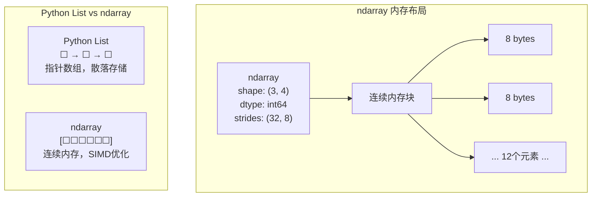
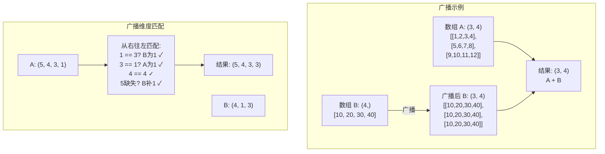
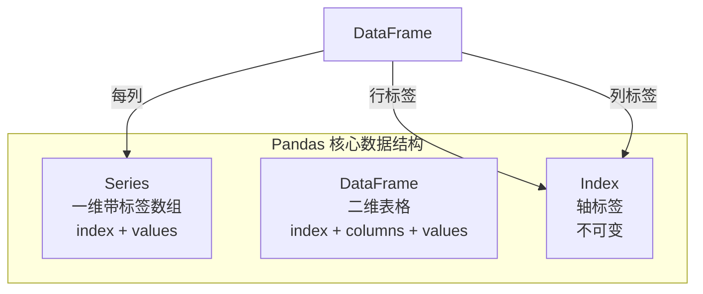

# 第 8 章 Python 数据科学核心库 ⭐⭐⭐⭐⭐

> [!abstract] 本章导航
> **定位**：把 Python 基础扩展到可复现的数据处理与特征分析流程。
>
> **先修**：[[01_Python编程基础]]、[[07_Python数据结构与算法]]。
>
> **学习目标**：
> - 使用 NumPy、Pandas 和可视化工具处理结构化数据。
> - 构建从读取、清洗到分析输出的可复现流程。
> - 诊断副本、缺失值、泄漏和统计口径问题。
>
> **建议路径**：NumPy → Pandas → 数据可视化 → 综合实战：数据分析完整流程。先完成主线，再按需要阅读进阶内容。
>
> **配套代码**：`code/ch08_data_science/`。

NumPy 和 Pandas 是 Python 数据科学生态的基石，也是数据处理和 AI 开发面试的高频考点。本章深入讲解两大核心库的原理和面试重点，配合完整代码示例和性能优化技巧。

## 8.1 NumPy ⭐⭐⭐⭐

### 8.1.1 ndarray 核心概念

NumPy 的核心是 `ndarray`（N-dimensional array），它是一个**同质**的多维数组，所有元素类型相同。



| 特性 | Python List | NumPy ndarray |
|------|-------------|---------------|
| **元素类型** | 任意对象（异构） | 同质（固定 dtype） |
| **内存布局** | 指针数组，散落存储 | 连续内存块 |
| **运算速度** | 慢（Python 循环） | 快（C 优化 + SIMD） |
| **内存占用** | 大（指针 + 对象头） | 小（紧凑存储） |
| **向量化运算** | ❌ 需手写循环 | ✅ 原生支持 |
| **广播机制** | ❌ 不支持 | ✅ 自动扩展 |

```python
import numpy as np

# ========== 创建 ndarray ==========
# 从列表创建
arr1 = np.array([1, 2, 3, 4, 5])

# 指定 dtype
arr2 = np.array([1, 2, 3], dtype=np.float32)

# 常用创建函数
zeros = np.zeros((3, 4))           # 3x4 零矩阵
ones = np.ones((2, 3))             # 2x3 全1矩阵
eye = np.eye(3)                    # 3x3 单位矩阵
arange = np.arange(0, 10, 2)       # [0, 2, 4, 6, 8]
linspace = np.linspace(0, 1, 5)    # [0, 0.25, 0.5, 0.75, 1.0]

# 随机数组
np.random.seed(42)
random_arr = np.random.randn(3, 3)  # 标准正态分布
uniform = np.random.rand(3, 3)      # [0, 1) 均匀分布
randint = np.random.randint(0, 10, (3, 3))  # 随机整数

# ========== 关键属性 ==========
arr = np.array([[1, 2, 3], [4, 5, 6]])
print(f"ndim: {arr.ndim}")      # 2（维度数）
print(f"shape: {arr.shape}")    # (2, 3)（各维度大小）
print(f"size: {arr.size}")      # 6（元素总数）
print(f"dtype: {arr.dtype}")    # int64（元素类型）
print(f"itemsize: {arr.itemsize}")  # 8（每个元素字节数）
print(f"nbytes: {arr.nbytes}")  # 48（总字节数）
print(f"strides: {arr.strides}")  # (24, 8)（每维步长）
```

### 8.1.2 广播机制详解 ⭐⭐⭐⭐⭐

广播（Broadcasting）是 NumPy 的**核心特性**，它允许不同形状的数组之间进行运算。

**广播规则**：两个数组从最后一个维度开始比较，满足以下任一条件即可广播：
1. 维度大小相等
2. 其中一个维度大小为 1
3. 其中一个数组缺少该维度



```python
import numpy as np

# ========== 广播规则演示 ==========

# 示例1: 标量 + 数组
arr = np.array([1, 2, 3])
print(arr + 10)  # [11, 12, 13] — 标量广播到 (3,)

# 示例2: (3, 4) + (4,) → (3, 4)
a = np.ones((3, 4))
b = np.arange(4)  # (4,)
print((a + b).shape)  # (3, 4)

# 示例3: (3, 1) + (1, 3) → (3, 3)
a = np.array([[1], [2], [3]])  # (3, 1)
b = np.array([[10, 20, 30]])   # (1, 3)
print(a + b)
# [[11, 21, 31],
#  [12, 22, 32],
#  [13, 23, 33]]

# 示例4: 失败的情况
a = np.ones((3, 4))
b = np.ones(5)
# a + b  # ValueError: operands could not be broadcast together (3,4) (5,)

# ========== 实际应用：数据标准化 ==========
data = np.random.randn(100, 5)  # 100 个样本，5 个特征

# 按特征标准化（列方向）
mean = data.mean(axis=0)    # (5,) — 每个特征的均值
std = data.std(axis=0)      # (5,) — 每个特征的标准差

# 广播: (100, 5) - (5,) → (100, 5)
#       (100, 5) / (5,) → (100, 5)
normalized = (data - mean) / std
print(f"标准化后均值: {normalized.mean(axis=0)}")  # ≈ 0
print(f"标准化后标准差: {normalized.std(axis=0)}")  # ≈ 1

# ========== 实际应用：图像处理 ==========
# 给灰度图增加颜色通道权重
image = np.random.rand(256, 256, 3)  # RGB 图像
weights = np.array([0.299, 0.587, 0.114])  # (3,) — RGB 转灰度权重

# 广播: (256, 256, 3) * (3,) → (256, 256, 3) → sum(axis=2) → (256, 256)
grayscale = (image * weights).sum(axis=2)
print(grayscale.shape)  # (256, 256)
```

🎯 **面试题**：两个数组 `shape 为 (5, 4, 3, 2)` 和 `(3, 2)` 能否广播？结果 shape 是什么？

> **答案**：可以广播。从最后一个维度开始比较：
> - 维度4: 2 == 2 ✓
> - 维度3: 3 == 3 ✓
> - 维度2: 4 vs 缺失 → 补 1 ✓
> - 维度1: 5 vs 缺失 → 补 1 ✓
> - 结果 shape: **(5, 4, 3, 2)**

### 8.1.3 矩阵运算与线性代数

```python
import numpy as np

A = np.array([[1, 2], [3, 4]])
B = np.array([[5, 6], [7, 8]])

# ========== 基本运算 ==========
print(A + B)           # 逐元素加法
print(A * B)           # 逐元素乘法（Hadamard 积）
print(A @ B)           # 矩阵乘法
print(A.dot(B))        # 等价于 A @ B

# ========== 矩阵属性 ==========
print(f"转置: \n{A.T}")
print(f"逆矩阵: \n{np.linalg.inv(A)}")
print(f"行列式: {np.linalg.det(A)}")
print(f"迹: {np.trace(A)}")
print(f"秩: {np.linalg.matrix_rank(A)}")
print(f"特征值: {np.linalg.eigvals(A)}")

# ========== 常用矩阵操作 ==========
# 解线性方程组 Ax = b
A = np.array([[3, 1], [1, 2]])
b = np.array([9, 8])
x = np.linalg.solve(A, b)  # x = [2, 3]
print(f"解: {x}")

# SVD 分解（降维、推荐系统核心）
A = np.random.randn(5, 4)
U, S, Vt = np.linalg.svd(A, full_matrices=False)
print(f"U: {U.shape}, S: {S.shape}, Vt: {Vt.shape}")
# 低秩近似
k = 2
A_approx = U[:, :k] @ np.diag(S[:k]) @ Vt[:k, :]

# 广播在矩阵运算中的应用：批量矩阵乘法
batch_A = np.random.randn(10, 3, 3)  # 10 个 3x3 矩阵
batch_x = np.random.randn(10, 3, 1)  # 10 个向量
# 广播后逐元素矩阵乘法
batch_result = batch_A @ batch_x  # (10, 3, 1)
```

## 8.2 Pandas ⭐⭐⭐⭐⭐

### 8.2.1 核心数据结构



```python
import pandas as pd
import numpy as np

# ========== Series ==========
s = pd.Series([1, 2, 3, 4], index=['a', 'b', 'c', 'd'], name='numbers')
print(s['a'])        # 1
print(s.values)      # [1, 2, 3, 4]
print(s.index)       # Index(['a', 'b', 'c', 'd'], dtype='object')

# ========== DataFrame 创建 ==========
df = pd.DataFrame({
    'name': ['Alice', 'Bob', 'Carol', 'David'],
    'age': [25, 30, 28, 35],
    'city': ['BJ', 'SH', 'GZ', 'SZ'],
    'salary': [15000.0, 20000.0, 18000.0, 25000.0]
})

# 从 NumPy 数组创建
df2 = pd.DataFrame(
    np.random.randn(5, 3),
    columns=['A', 'B', 'C'],
    index=pd.date_range('2024-01-01', periods=5)
)
```

### 8.2.2 loc vs iloc 的区别 ⭐⭐⭐⭐⭐

| 操作符 | 索引方式 | 示例 | 说明 |
|--------|---------|------|------|
| `loc` | **标签**索引 | `df.loc[0:2]` | 包含结束标签 `[start, end]` |
| `iloc` | **整数位置**索引 | `df.iloc[0:2]` | 不包含结束位置 `[start, end)` |
| `at` | 标签索引（标量） | `df.at[0, 'col']` | 比 loc 快，只取单个值 |
| `iat` | 整数位置（标量） | `df.iat[0, 0]` | 比 iloc 快，只取单个值 |

```python
import pandas as pd

df = pd.DataFrame({
    'A': [1, 2, 3, 4],
    'B': ['a', 'b', 'c', 'd']
}, index=[10, 20, 30, 40])  # 自定义索引

# ========== loc: 基于标签 ==========
print(df.loc[10])          # 取索引为10的行
print(df.loc[10:30])       # 取索引 10 到 30 的行（包含30）
print(df.loc[10, 'A'])     # 标量访问 → 1
print(df.loc[:, 'A'])      # 取列 'A'
print(df.loc[10:20, ['A', 'B']])  # 多行多列

# 布尔索引
print(df.loc[df['A'] > 2])  # 条件筛选

# ========== iloc: 基于整数位置 ==========
print(df.iloc[0])          # 取第0行（即索引为10的行）
print(df.iloc[0:2])        # 取第0、1行（不包含第2行）
print(df.iloc[0, 0])       # 标量访问 → 1
print(df.iloc[:, 0])       # 取第0列
print(df.iloc[0:2, 0:2])   # 切片

# ========== 常见陷阱 ==========
# df.loc[0]  # KeyError! 索引中没有 0
# df.iloc[10]  # IndexError! 只有4行，没有第10行

# ========== 混合使用 ==========
# 先 iloc 选行，再 loc 选列
subset = df.iloc[0:2]           # 先按位置选行
result = subset.loc[:, ['A']]   # 再按标签选列

# 使用 ix（已废弃，了解即可）
# df.ix[0]  # 根据上下文判断是标签还是位置 — 不推荐使用
```

🎯 **面试题**：`df.loc[0:2]` 和 `df.iloc[0:2]` 的区别？

> **答案**：
> - `df.loc[0:2]`：基于**标签**，选取索引标签从 0 到 2 的行（包含 2），结果是 3 行
> - `df.iloc[0:2]`：基于**整数位置**，选取第 0 和第 1 行（不包含第 2 行），结果是 2 行
> - 当索引是默认整数 0, 1, 2, ... 时，`loc[0:2]` 取 3 行，`iloc[0:2]` 取 2 行

### 8.2.3 groupby、apply、map、applymap 区别 ⭐⭐⭐⭐⭐

```python
import pandas as pd
import numpy as np

df = pd.DataFrame({
    'department': ['Tech', 'Tech', 'HR', 'HR', 'Sales', 'Sales'],
    'employee': ['Alice', 'Bob', 'Carol', 'David', 'Eve', 'Frank'],
    'salary': [15000, 20000, 12000, 14000, 18000, 22000],
    'bonus': [3000, 5000, 2000, 2500, 4000, 6000]
})

# ========== groupby：分组聚合 ==========
# 按部门分组，计算平均工资
dept_avg = df.groupby('department')['salary'].mean()
print(dept_avg)

# 多列聚合
dept_stats = df.groupby('department').agg({
    'salary': ['mean', 'sum', 'count'],
    'bonus': ['mean', 'max']
})
print(dept_stats)

# transform：保持原 DataFrame 形状
df['dept_avg_salary'] = df.groupby('department')['salary'].transform('mean')

# filter：筛选满足条件的组
depts = df.groupby('department').filter(lambda x: x['salary'].sum() > 30000)

# ========== map：Series 的逐元素映射 ==========
# 对 Series 的每个元素应用映射
df['dept_code'] = df['department'].map({
    'Tech': 'T',
    'HR': 'H',
    'Sales': 'S'
})

# 使用函数映射
df['salary_level'] = df['salary'].map(lambda x: 'High' if x > 18000 else 'Low')

# ========== apply：DataFrame/Series 的灵活应用 ==========
# Series.apply: 对每行应用函数
print(df['salary'].apply(lambda x: x * 1.1))  # 加薪 10%

# DataFrame.apply: axis=0 对每列，axis=1 对每行
print(df[['salary', 'bonus']].apply(np.sum, axis=0))    # 列求和
print(df[['salary', 'bonus']].apply(np.sum, axis=1))    # 行求和

# 返回 Series 的 apply（更复杂操作）
def total_compensation(row):
    return row['salary'] + row['bonus'] + row.get('extra', 0)

df['total'] = df.apply(total_compensation, axis=1)

# ========== applymap：DataFrame 逐元素操作（已弃用，用 map） ==========
df[['salary', 'bonus']] = df[['salary', 'bonus']].map(lambda x: f"${x:,.0f}")
```

| 方法 | 作用对象 | 功能 | 性能 |
|------|---------|------|------|
| `groupby` | DataFrame | 按组聚合/变换/过滤 | 高效（C 优化） |
| `map` | Series | 逐元素映射（值→值） | 快 |
| `apply` | Series/DataFrame | 灵活的函数应用 | 较慢（Python 循环） |
| `map` (DataFrame) | DataFrame | 逐元素操作 | 较慢 |

🎯 **面试题**：`map`、`apply`、`applymap` 的区别？什么时候用哪个？

> **答案**：
> - `map`：作用在 **Series** 上，逐元素映射（值到值的转换），可用 dict 或函数
> - `apply`：作用在 **Series 或 DataFrame** 上，更灵活，可对整行/整列应用函数
> - `applymap`（已弃用，用 `DataFrame.map`）：作用在 **DataFrame** 上，对每个元素独立操作
> - **性能**：优先用 `map` 和向量化运算，避免 `apply`（Python 级循环慢）

### 8.2.4 缺失值处理 ⭐⭐⭐⭐⭐

```python
import pandas as pd
import numpy as np

df = pd.DataFrame({
    'A': [1, 2, np.nan, 4, 5],
    'B': ['a', None, 'c', 'd', 'e'],
    'C': [10, 20, 30, np.nan, 50],
    'D': [1.0, 2.0, 3.0, 4.0, 5.0]
})

# ========== 检测缺失值 ==========
print(df.isnull())        # 逐元素判断是否为缺失值
print(df.isnull().sum())  # 每列缺失值数量
print(df.isnull().mean()) # 每列缺失值比例

# ========== 删除缺失值 ==========
df.dropna()                    # 删除包含 NaN 的行
df.dropna(subset=['A', 'C'])   # 只删除 A 或 C 为 NaN 的行
df.dropna(how='all')           # 只删除全为 NaN 的行
df.dropna(axis=1)              # 删除包含 NaN 的列
df.dropna(thresh=3)            # 保留至少 3 个非 NaN 值的行

# ========== 填充缺失值 ==========
df['A'].fillna(0)              # 用 0 填充
df['A'].fillna(df['A'].mean()) # 用均值填充
df['A'].ffill()                 # 前向填充（用前一个有效值）
df['A'].bfill()                 # 后向填充（用后一个有效值）
df['A'].interpolate()          # 线性插值

# ========== 不同列用不同策略 ==========
df.fillna({
    'A': df['A'].mean(),       # 数值列用均值
    'B': 'unknown',            # 类别列用默认值
    'C': df['C'].median()      # 用中位数
})
```

🎯 **面试高频题：数据清洗完整流程** ⭐⭐⭐⭐⭐

```python
import numpy as np
import pandas as pd
from sklearn.compose import ColumnTransformer
from sklearn.impute import SimpleImputer
from sklearn.model_selection import train_test_split
from sklearn.pipeline import Pipeline
from sklearn.preprocessing import OneHotEncoder, StandardScaler


def build_preprocessor(
    numeric_features: list[str],
    categorical_features: list[str],
) -> ColumnTransformer:
    """所有会学习统计量的步骤都封装进 Pipeline。"""
    numeric = Pipeline([
        ("imputer", SimpleImputer(strategy="median")),
        ("scaler", StandardScaler()),
    ])
    categorical = Pipeline([
        ("imputer", SimpleImputer(strategy="most_frequent")),
        ("onehot", OneHotEncoder(handle_unknown="ignore")),
    ])
    return ColumnTransformer([
        ("numeric", numeric, numeric_features),
        ("categorical", categorical, categorical_features),
    ])


# 示例：先划分，再只在训练集 fit
X = pd.DataFrame({
    "age": [25, np.nan, 35, 40, 29, 31],
    "salary": [5000, 6000, 7000, 8000, np.nan, 6500],
    "department": ["Tech", "HR", "Tech", None, "Sales", "HR"],
})
X = X.drop_duplicates().copy()
X_train, X_test = train_test_split(X, test_size=0.33, random_state=42)

preprocessor = build_preprocessor(
    numeric_features=["age", "salary"],
    categorical_features=["department"],
)
X_train_ready = preprocessor.fit_transform(X_train)
X_test_ready = preprocessor.transform(X_test)  # 禁止再次 fit


# ========== 面试常考点：数据清洗中的决策 ==========
"""
Q: 缺失值很多（>50%）的列怎么处理？
A: 通常删除该列，除非该列非常重要。可用缺失值本身作为特征（is_missing 标志）。

Q: 异常值怎么处理？
A: 先检查是否为数据录入错误。如果不是：
   - 删除（损失数据）
   - 截断（clip 到边界值）
   - 对数变换（减小极端值影响）
   - 使用对异常值鲁棒的模型（如树模型）
   - 若 IQR/分位数边界由数据学习，必须只在训练集拟合，并排除 ID、布尔标志等不适合截断的列

Q: 类别特征怎么做编码？
A: 
   - One-Hot：名义类别；`handle_unknown="ignore"` 处理测试集新类别
   - OrdinalEncoder：仅用于有明确业务顺序的类别，并显式提供顺序
   - Target/统计编码：须在交叉验证折内拟合，防止目标泄漏
   - LabelEncoder 通常用于目标标签 y，不应用来给名义输入特征制造伪顺序
"""
```

> **为什么不能先清洗全量数据再切分？** 中位数、众数、IQR 边界、类别词表和标准化参数都属于从数据学到的状态。先在全量数据上计算会把验证/测试信息泄漏给训练过程。pandas 3.0 的 Copy-on-Write 还意味着 `df[col].fillna(..., inplace=True)` 不会更新原 DataFrame；需要赋值回列，或使用上面的 sklearn Pipeline。

**参考资料（核对日期：2026-07-31）**：

- [pandas Copy-on-Write](https://pandas.pydata.org/docs/user_guide/copy_on_write.html)
- [scikit-learn：Common pitfalls and recommended practices](https://scikit-learn.org/stable/common_pitfalls.html)
- [scikit-learn：Pipeline](https://scikit-learn.org/stable/modules/generated/sklearn.pipeline.Pipeline.html)

### 8.2.5 大数据集内存优化 ⭐⭐⭐⭐

```python
import pandas as pd
import numpy as np


def optimize_memory(df: pd.DataFrame) -> pd.DataFrame:
    """
    大数据集内存优化技巧
    
    面试常考：如何处理内存不足的 Pandas 操作？
    """
    start_mem = df.memory_usage(deep=True).sum() / 1024**2
    print(f"优化前内存: {start_mem:.2f} MB")
    
    # 1. 数值类型下转换
    for col in df.select_dtypes(include=['int']).columns:
        col_min, col_max = df[col].min(), df[col].max()
        
        if col_min >= 0:  # 无符号整数
            if col_max < 255:
                df[col] = df[col].astype(np.uint8)
            elif col_max < 65535:
                df[col] = df[col].astype(np.uint16)
            elif col_max < 4294967295:
                df[col] = df[col].astype(np.uint32)
        else:  # 有符号整数
            if col_min > np.iinfo(np.int8).min and col_max < np.iinfo(np.int8).max:
                df[col] = df[col].astype(np.int8)
            elif col_min > np.iinfo(np.int16).min and col_max < np.iinfo(np.int16).max:
                df[col] = df[col].astype(np.int16)
            elif col_min > np.iinfo(np.int32).min and col_max < np.iinfo(np.int32).max:
                df[col] = df[col].astype(np.int32)
    
    # 2. 浮点类型下转换
    for col in df.select_dtypes(include=['float']).columns:
        df[col] = df[col].astype(np.float32)
    
    # 3. 类别型数据用 category
    for col in df.select_dtypes(include=['object']).columns:
        num_unique = df[col].nunique()
        num_total = len(df)
        # 当唯一值比例 < 50% 时使用 category
        if num_unique / num_total < 0.5:
            df[col] = df[col].astype('category')
    
    end_mem = df.memory_usage(deep=True).sum() / 1024**2
    print(f"优化后内存: {end_mem:.2f} MB")
    print(f"减少: {(1 - end_mem/start_mem)*100:.1f}%")
    
    return df


# ========== 分块读取大文件 ==========
def process_large_csv(filepath: str, chunksize: int = 100000):
    """
    分块处理大 CSV 文件（内存不足时的解决方案）
    
    面试常考：10GB 的 CSV 怎么读取和处理？
    """
    chunk_results = []
    
    for chunk in pd.read_csv(filepath, chunksize=chunksize):
        # 对每个 chunk 进行处理
        processed = chunk.groupby('category')['value'].sum()
        chunk_results.append(processed)
    
    # 合并所有 chunk 的结果
    final_result = pd.concat(chunk_results).groupby(level=0).sum()
    return final_result


# ========== 使用更高效的数据类型 ==========
# 时间序列数据用 datetime
df['date'] = pd.to_datetime(df['date'])

# 布尔值
df['flag'] = df['flag'].astype(bool)

# 稀疏矩阵（大量零值）
from scipy.sparse import csr_matrix
sparse_data = csr_matrix(df.values)  # 内存大幅减少
```

🎯 **面试题**：Pandas 处理大数据集内存不足怎么办？

> **答案**：
> 1. **类型优化**：`int64` → `int32`/`int16`，`float64` → `float32`，`object` → `category`
> 2. **分块读取**：`pd.read_csv(chunksize=...)` 逐块处理
> 3. **只读需要的列**：`usecols=[...]` 减少读取数据量
> 4. **迭代器模式**：用 `iterator=True` 配合 `get_chunk()`
> 5. **换工具**：Dask（分布式 Pandas）、Polars（Rust 实现，更快更省内存）

## 8.3 数据可视化

### 8.3.1 Matplotlib 基础

```python
import matplotlib.pyplot as plt
import numpy as np

# 设置中文字体
plt.rcParams['font.size'] = 12

# ========== 基本绘图 ==========
x = np.linspace(0, 10, 100)
y1 = np.sin(x)
y2 = np.cos(x)

fig, axes = plt.subplots(2, 2, figsize=(12, 8))

# 线图
axes[0, 0].plot(x, y1, label='sin(x)', color='#4A6FA5', linewidth=2)
axes[0, 0].plot(x, y2, label='cos(x)', color='#e74c3c', linewidth=2, linestyle='--')
axes[0, 0].set_title('Line Plot')
axes[0, 0].legend()
axes[0, 0].grid(True, alpha=0.3)

# 散点图
np.random.seed(42)
axes[0, 1].scatter(np.random.randn(50), np.random.randn(50), 
                     c='#2ecc71', alpha=0.6, s=100)
axes[0, 1].set_title('Scatter Plot')

# 柱状图
categories = ['A', 'B', 'C', 'D', 'E']
values = [23, 45, 56, 78, 32]
axes[1, 0].bar(categories, values, color=['#4A6FA5', '#6B8CBB', '#8BA3C7', '#2E4A62', '#7A8B99'])
axes[1, 0].set_title('Bar Chart')

# 直方图
data = np.random.normal(0, 1, 1000)
axes[1, 1].hist(data, bins=30, color='#4A6FA5', edgecolor='white', alpha=0.7)
axes[1, 1].set_title('Histogram')
axes[1, 1].axvline(data.mean(), color='red', linestyle='--', label=f'Mean={data.mean():.2f}')
axes[1, 1].legend()

plt.tight_layout()
plt.savefig('/mnt/agents/output/visualization_demo.png', dpi=150, bbox_inches='tight')
plt.show()
```

### 8.3.2 Seaborn 统计可视化

```python
import seaborn as sns
import matplotlib.pyplot as plt
import pandas as pd
import numpy as np

# 生成示例数据
df = pd.DataFrame({
    'x': np.random.randn(200),
    'y': np.random.randn(200),
    'category': np.random.choice(['A', 'B', 'C'], 200),
    'value': np.random.exponential(2, 200)
})

fig, axes = plt.subplots(2, 2, figsize=(12, 10))

# 1. 箱线图（Box Plot）— 面试常考：箱线图的含义
df_melted = pd.melt(df, id_vars=['category'], value_vars=['value'])
sns.boxplot(data=df, x='category', y='value', ax=axes[0, 0], palette='Blues')
axes[0, 0].set_title('Box Plot: 中位数、四分位数、异常值')

# 2. 热力图（Correlation Heatmap）
corr_df = pd.DataFrame(np.random.randn(100, 4), columns=['A', 'B', 'C', 'D'])
sns.heatmap(corr_df.corr(), annot=True, cmap='coolwarm', center=0, ax=axes[0, 1])
axes[0, 1].set_title('Correlation Heatmap')

# 3. 分布图（Distribution Plot）
sns.histplot(df['x'], kde=True, ax=axes[1, 0], color='#4A6FA5')
axes[1, 0].set_title('Distribution with KDE')

# 4. 散点图 + 回归线
sns.scatterplot(data=df, x='x', y='y', hue='category', ax=axes[1, 1])
axes[1, 1].set_title('Scatter Plot by Category')

plt.tight_layout()
plt.savefig('/mnt/agents/output/seaborn_demo.png', dpi=150, bbox_inches='tight')
plt.show()
```

🎯 **面试题**：箱线图（Box Plot）的五个统计量分别是什么？

> **答案**：
> - **最小值**（Min，下须末端）
> - **下四分位数**（Q1，25% 分位数）
> - **中位数**（Median/Q2，50% 分位数）
> - **上四分位数**（Q3，75% 分位数）
> - **最大值**（Max，上须末端）
> - 箱外点为**异常值**（Outliers），通常定义为超出 `Q1 - 1.5×IQR` 或 `Q3 + 1.5×IQR` 的值

### 8.3.3 Pandas 内置绘图

```python
import pandas as pd
import numpy as np

# 生成时间序列数据
dates = pd.date_range('2024-01-01', periods=100)
ts = pd.DataFrame({
    'sales': np.cumsum(np.random.randn(100)) + 100,
    'profit': np.cumsum(np.random.randn(100) * 0.5) + 20
}, index=dates)

# 快速绘图
ts.plot(figsize=(10, 5), title='Sales & Profit Trend')

# 面积图
ts.plot.area(figsize=(10, 5), alpha=0.5, title='Area Chart')

# 柱状图
ts.head(10).plot.bar(figsize=(10, 5), title='Bar Chart')

# 饼图
ts.iloc[-1].plot.pie(figsize=(6, 6), autopct='%1.1f%%', title='Composition')
```

## 8.4 综合实战：数据分析完整流程

```python
import pandas as pd
import numpy as np
import matplotlib.pyplot as plt
import seaborn as sns

# ========== 步骤 1: 加载数据 ==========
# 生成模拟电商数据
np.random.seed(42)
n = 10000

df = pd.DataFrame({
    'user_id': range(1, n + 1),
    'age': np.random.randint(18, 65, n),
    'gender': np.random.choice(['M', 'F', 'Unknown'], n, p=[0.48, 0.48, 0.04]),
    'city': np.random.choice(['BJ', 'SH', 'GZ', 'SZ', 'HZ', 'CD'], n),
    'purchase_amount': np.random.exponential(500, n),
    'category': np.random.choice(['Electronics', 'Clothing', 'Food', 'Books'], n),
    'is_member': np.random.choice([0, 1], n, p=[0.6, 0.4]),
    'order_date': pd.date_range('2024-01-01', periods=n, freq='min')
})

# 添加一些缺失值和异常值
df.loc[np.random.choice(n, 100, replace=False), 'age'] = np.nan
df.loc[np.random.choice(n, 50, replace=False), 'purchase_amount'] *= 10

print(f"数据集大小: {df.shape}")
print(df.head())

# ========== 步骤 2: 数据探索 ==========
print("\n=== 数据类型 ===")
print(df.dtypes)

print("\n=== 描述统计 ===")
print(df.describe())

print("\n=== 缺失值 ===")
print(df.isnull().sum())

# ========== 步骤 3: 数据清洗 ==========
# 处理缺失值
df['age'] = df['age'].fillna(df['age'].median())

# 处理异常值（截断到 99% 分位数）
amount_99 = df['purchase_amount'].quantile(0.99)
df['purchase_amount'] = df['purchase_amount'].clip(upper=amount_99)

# ========== 步骤 4: 特征工程 ==========
# 年龄分段
df['age_group'] = pd.cut(df['age'], bins=[0, 25, 35, 45, 100], 
                          labels=['青年', '壮年', '中年', '老年'])

# 消费等级
df['spending_level'] = pd.qcut(df['purchase_amount'], q=4, 
                                labels=['低', '中', '高', '很高'])

# ========== 步骤 5: 分析 & 可视化 ==========
fig, axes = plt.subplots(2, 2, figsize=(14, 10))

# 1. 各城市消费金额
city_sales = df.groupby('city')['purchase_amount'].sum().sort_values(ascending=False)
city_sales.plot(kind='bar', ax=axes[0, 0], color='#4A6FA5')
axes[0, 0].set_title('各城市总消费金额')
axes[0, 0].tick_params(axis='x', rotation=45)

# 2. 年龄组分布
df['age_group'].value_counts().plot(kind='pie', ax=axes[0, 1], autopct='%1.1f%%')
axes[0, 1].set_title('年龄组分布')

# 3. 会员 vs 非会员消费
df.boxplot(column='purchase_amount', by='is_member', ax=axes[1, 0])
axes[1, 0].set_title('会员 vs 非会员消费金额')

# 4. 各类别消费趋势
category_daily = df.groupby([df['order_date'].dt.date, 'category'])['purchase_amount'].sum().unstack()
category_daily.plot(ax=axes[1, 1])
axes[1, 1].set_title('各类别消费趋势')
axes[1, 1].legend(loc='upper left', fontsize=8)

plt.tight_layout()
plt.savefig('/mnt/agents/output/data_analysis_pipeline.png', dpi=150, bbox_inches='tight')
plt.show()

# ========== 步骤 6: 输出洞察 ==========
print("\n=== 数据洞察 ===")
print(f"总用户数: {df['user_id'].nunique()}")
print(f"总消费金额: ¥{df['purchase_amount'].sum():,.0f}")
print(f"人均消费: ¥{df['purchase_amount'].mean():.0f}")
print(f"会员比例: {df['is_member'].mean()*100:.1f}%")
print(f"最热门品类: {df['category'].mode()[0]}")
```

## 🧭 本章小结

```text
数据科学核心库
├── NumPy
│   ├── ndarray — 连续内存/向量化运算
│   ├── 广播机制 — 维度匹配规则
│   ├── 花式索引与布尔掩码
│   └── 矩阵运算与线性代数
├── Pandas
│   ├── Series / DataFrame 核心结构
│   ├── loc vs iloc — 标签索引 vs 位置索引
│   ├── groupby / apply / map / applymap
│   ├── 缺失值处理 — dropna/fillna/interpolate
│   └── 大数据集优化 — 类型优化/分块读取/Dask
├── 数据可视化
│   ├── Matplotlib — 基础图表绘制
│   ├── Seaborn — 统计可视化
│   └── Pandas 内置绘图
└── 综合实战
    ├── 数据分析完整流程
    ├── 数据清洗 → 探索 → 可视化
    └── 性能优化 checklist
```

| 知识点 | 面试频率 | 掌握要求 |
|--------|---------|---------|
| ndarray vs Python List | ⭐⭐⭐⭐ | 理解内存布局和性能差异 |
| 广播机制 | ⭐⭐⭐⭐⭐ | 能判断两个数组是否可广播 |
| loc vs iloc | ⭐⭐⭐⭐⭐ | 区分标签和位置索引 |
| groupby 聚合 | ⭐⭐⭐⭐⭐ | 掌握 agg/transform/filter |
| apply/map/applymap 区别 | ⭐⭐⭐⭐⭐ | 区分使用场景 |
| 缺失值处理 | ⭐⭐⭐⭐⭐ | 完整清洗流程 |
| 内存优化技巧 | ⭐⭐⭐⭐ | 类型优化、分块读取 |
| 数据可视化 | ⭐⭐⭐ | 基础图表 + 箱线图含义 |

## ✅ 自测与练习

先合上正文，再回答以下问题；无法说明证据或边界时，回到对应小节复习。

1. 你能否使用 NumPy、Pandas 和可视化工具处理结构化数据？
2. 你能否构建从读取、清洗到分析输出的可复现流程？
3. 你能否诊断副本、缺失值、泄漏和统计口径问题？

## 🧪 配套代码与验收

配套目录：`code/ch08_data_science/`。从 `code/` 目录运行：

```powershell
python scripts/run_all_examples.py --tier core --chapter ch08 --parallel 1 --timeout 60
```

成功标准：命令退出码为 0，示例输出 `OK`；缺少可选依赖时必须给出明确 `[SKIP]`，而不是 traceback。
真实 API、GPU、模型下载和付费调用不属于默认离线验收，必须按示例 metadata 与章节说明单独确认。

## 🎯 面试题精讲

### 题目 1：NumPy 数组和 Python 列表的区别？

> **答案**：
> 1. **类型**：ndarray 同质（所有元素同类型），List 异质
> 2. **内存**：ndarray 连续内存，List 指针数组
> 3. **性能**：ndarray 向量化运算（C 优化），比 List 快 10-100 倍
> 4. **功能**：ndarray 支持广播、矩阵运算、切片是视图而非拷贝

### 题目 2：`loc` 和 `iloc` 的区别？

> **答案**：
> - `loc`：基于**标签**索引，切片包含结束标签 `[start, end]`
> - `iloc`：基于**整数位置**索引，切片不包含结束位置 `[start, end)`
> - 当 DataFrame 使用默认整数索引时，`loc[0:2]` 取 3 行，`iloc[0:2]` 取 2 行

### 题目 3：`apply`、`map`、`applymap` 的区别和使用场景？

> **答案**：
> - `map`：作用在 **Series** 上，逐元素映射，可用 dict 或函数
> - `apply`：作用在 **Series/DataFrame**，对整行/整列应用函数，更灵活
> - `applymap`（已弃用→`DataFrame.map`）：作用在 **DataFrame**，逐元素操作
> - **性能建议**：优先用向量化运算（如 `df['col'] * 2`），避免 `apply`，因为 `apply` 是 Python 级循环

### 题目 4：Pandas 中 `merge` 和 `join` 的区别？

> **答案**：
> - `merge()`：功能最全面，支持按列/索引合并，支持多种连接方式（inner/outer/left/right/cross）
> - `join()`：基于**索引**合并的便捷方法，默认 left join
> - `concat()`：沿轴拼接，不基于键合并
>
> `join` 本质上是 `merge` 的简化版：`df1.join(df2)` 等价于 `df1.merge(df2, left_index=True, right_index=True, how='left')`

### 题目 5：如何处理 Pandas 中的大数据集内存不足问题？

> **答案**：
> 1. **类型优化**：`int64` → `int32`/`int16`，object → `category`，可减少 50-90% 内存
> 2. **分块读取**：`pd.read_csv(filepath, chunksize=100000)`
> 3. **只读需要的列**：`usecols=['col1', 'col2']`
> 4. **惰性计算**：使用 Dask 或 Polars 替代 Pandas
> 5. **迭代器**：`iterator=True` + `get_chunk()`

## 📋 本章速查表

| 概念 | 关键点 |
|------|--------|
| **ndarray** | NumPy 核心数据结构；连续内存、同质 dtype、支持 SIMD 向量化；属性包括 `ndim`/`shape`/`dtype`/`strides` |
| **广播机制** | 从右往左匹配维度；维度相等、为 1 或缺失才可广播；常见应用：数据标准化 `(X - mean) / std`、图像灰度化 |
| **loc vs iloc** | `loc` 基于**标签**，切片**包含**结束位 `[start, end]`；`iloc` 基于**整数位置**，切片**不包含**结束位 `[start, end)`；单值用 `at`/`iat` 更快 |
| **groupby 三剑客** | `agg` 聚合返回汇总；`transform` 返回与原表同形；`filter` 过滤整组；结合 `agg({col: [func1, func2]})` 可多列多函数 |
| **apply vs map vs applymap** | `map` 用于 Series 逐元素映射（dict/函数）；`apply` 灵活支持 Series/DataFrame 按行/列；`applymap`（已弃用→`DataFrame.map`）逐元素；优先向量化避免 apply |
| **缺失值处理** | 检测 `isnull().sum()`；删除 `dropna(subset=, thresh=)`；填充 `fillna(value/mean/ffill/bfill)`；插值 `interpolate()` |
| **大数据集内存优化** | 下转 `int64→int32/int16`；`float64→float32`；低基数 `object→category`；分块 `read_csv(chunksize=)`；备选 Dask/Polars |
| **数据清洗流程** | 先按任务划分训练/验证/测试；所有会学习统计量的缺失值、异常值边界、编码和标准化步骤放进 Pipeline，仅在训练数据 `fit` |
| **Matplotlib 绘图骨架** | `fig, axes = plt.subplots(nrows, ncols)`；常用 `plot/scatter/bar/hist`；`tight_layout` 调整；`savefig(dpi, bbox_inches='tight')` |
| **Seaborn 统计图** | `boxplot` 展示 5 数概括（Min/Q1/Median/Q3/Max + 1.5×IQR 异常值）；`heatmap` 看相关系数矩阵；`histplot(kde=True)` 分布+密度 |

## 🔗 相关章节

- [[01_Python编程基础]] — 列表推导式、生成器等 NumPy/Pandas 操作的前置基础
- [[07_Python数据结构与算法]] — 哈希表、排序等算法在数据科学库中的底层应用
- [[10_机器学习基础]] — NumPy/Pandas 是机器学习的核心数据处理工具

## 📖 一手参考资料

> 核验日期：2026-08-04。版本、价格、法规、模型能力和 benchmark 以链接页面当前状态为准。

- [[docs/AUTHORITATIVE_SOURCES|章节权威来源索引]]：按章节维护的官方文档、标准、原论文和官方仓库。
