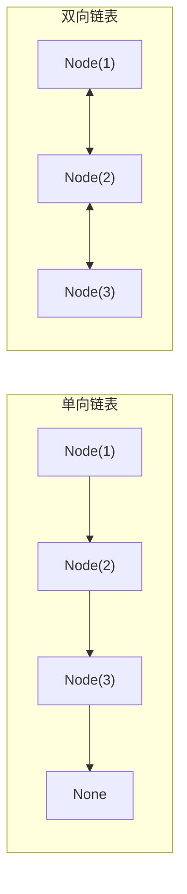
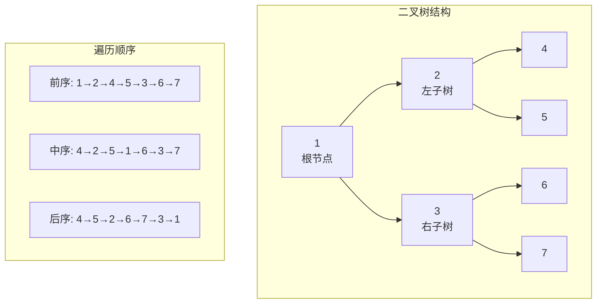
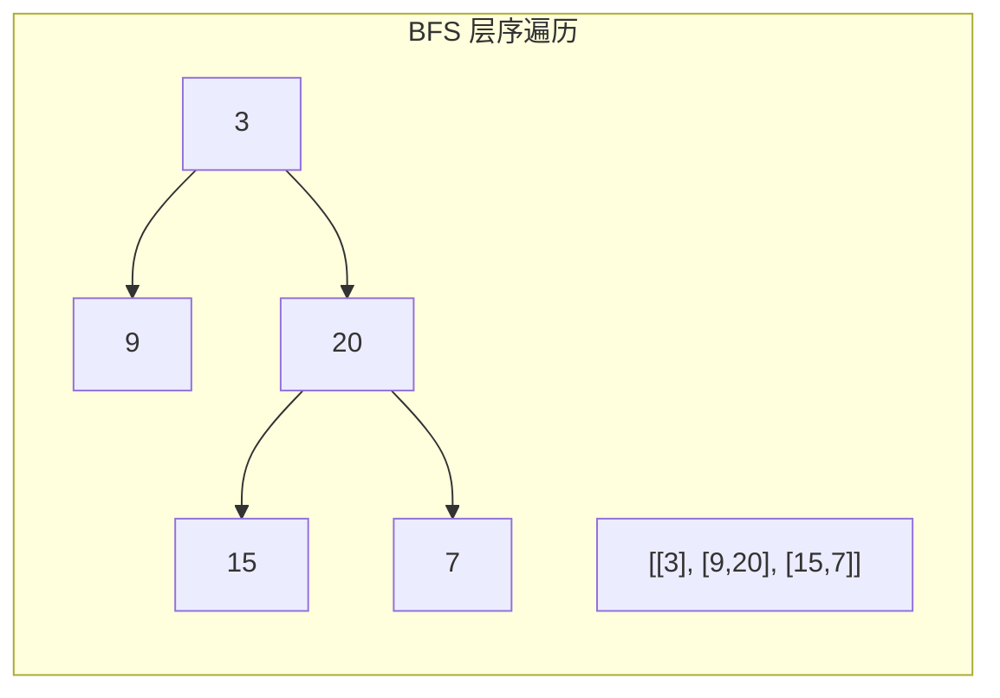
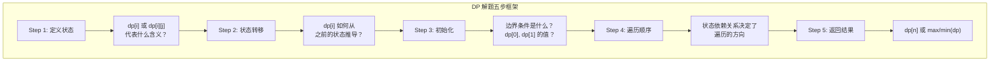
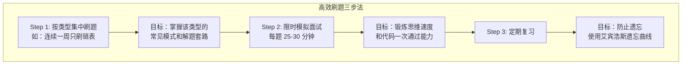

# 第 8 章 Python 数据结构与算法 ⭐⭐⭐⭐
> [!abstract] 本章导航
> **定位**：第一部分 Python 与后端工程基础中的第 8 章；围绕“Python 数据结构与算法”建立单一、可追踪的知识主线。
>
> **先修**：[[07_Python并发编程|第 7 章 Python 并发编程]]。
>
> **学习目标**：
> - 解释 基础数据结构 ⭐⭐⭐⭐⭐ 的核心问题、机制与适用边界。
> - 实现或评估 树与图 ⭐⭐⭐⭐⭐ 的最小闭环。
> - 使用可复现证据诊断 排序算法 ⭐⭐⭐⭐ 的工程取舍与失败模式。
>
> **建议路径**：基础数据结构 ⭐⭐⭐⭐⭐ → 树与图 ⭐⭐⭐⭐⭐ → 排序算法 ⭐⭐⭐⭐ → 字符串与数组算法 ⭐⭐⭐⭐ → 动态规划 ⭐⭐⭐⭐ → LeetCode 面试刷题指南。
>
> **配套代码**：`code/ch08_data_structures/`。

本章先回答“基础数据结构 ⭐⭐⭐⭐⭐”为什么成立，再沿着机制、实现、评估和边界逐步展开。阅读时先建立因果链，再运行或推演示例，最后用章末自测检查能否脱离原文复述。
## 8.1 基础数据结构 ⭐⭐⭐⭐⭐

### 8.1.1 链表

链表是面试中考察**指针操作能力**的经典数据结构。



```python
class ListNode:
    """单向链表节点"""
    def __init__(self, val=0, next=None):
        self.val = val
        self.next = next

    def __repr__(self):
        return f"ListNode({self.val})"


class LinkedList:
    """链表操作工具类"""

    @staticmethod
    def create(arr: list) -> ListNode:
        """从数组创建链表"""
        dummy = ListNode(0)
        curr = dummy
        for val in arr:
            curr.next = ListNode(val)
            curr = curr.next
        return dummy.next

    @staticmethod
    def to_list(head: ListNode) -> list:
        """链表转数组"""
        result = []
        while head:
            result.append(head.val)
            head = head.next
        return result


# ========== 面试高频题1：反转链表 ==========
def reverse_list(head: ListNode) -> ListNode:
    """
    迭代法反转链表
    时间复杂度: O(n)  空间复杂度: O(1)
    """
    prev, curr = None, head
    while curr:
        next_temp = curr.next  # 暂存下一个节点
        curr.next = prev       # 反转当前指针
        prev = curr            # prev 前移
        curr = next_temp       # curr 前移
    return prev  # 新的头节点


# ========== 面试高频题2：判断环形链表 ==========
def has_cycle(head: ListNode) -> bool:
    """
    快慢指针判断环形链表
    时间复杂度: O(n)  空间复杂度: O(1)
    """
    if not head or not head.next:
        return False

    slow = head  # 慢指针：每次走1步
    fast = head.next  # 快指针：每次走2步

    while fast and fast.next:
        if slow == fast:  # 相遇则有环
            return True
        slow = slow.next
        fast = fast.next.next

    return False  # 快指针到达末尾，无环


def detect_cycle_entry(head: ListNode) -> ListNode:
    """
    找到环的入口节点
    时间复杂度: O(n)  空间复杂度: O(1)

    原理：相遇后，一个指针回到头，两个指针同步走，再次相遇即入口
    """
    if not head or not head.next:
        return None

    # 阶段1：判断是否有环，找到相遇点
    slow = fast = head
    has_cycle = False
    while fast and fast.next:
        slow = slow.next
        fast = fast.next.next
        if slow == fast:
            has_cycle = True
            break

    if not has_cycle:
        return None

    # 阶段2：找入口
    slow = head
    while slow != fast:
        slow = slow.next
        fast = fast.next

    return slow  # 环的入口


# ========== 面试高频题3：合并两个有序链表 ==========
def merge_two_lists(l1: ListNode, l2: ListNode) -> ListNode:
    """
    合并两个有序链表
    时间复杂度: O(m+n)  空间复杂度: O(1)
    """
    dummy = ListNode(0)
    curr = dummy

    while l1 and l2:
        if l1.val <= l2.val:
            curr.next = l1
            l1 = l1.next
        else:
            curr.next = l2
            l2 = l2.next
        curr = curr.next

    # 连接剩余部分
    curr.next = l1 if l1 else l2
    return dummy.next


# ========== 面试高频题4：LRU 缓存 ==========
class DLinkedNode:
    """双向链表节点，用于 LRU Cache"""
    def __init__(self, key=0, val=0):
        self.key = key
        self.val = val
        self.prev = None
        self.next = None


class LRUCache:
    """
    LRU 缓存实现（哈希表 + 双向链表）

    时间复杂度：
      - get: O(1)
      - put: O(1)
    空间复杂度：O(capacity)
    """

    def __init__(self, capacity: int):
        self.capacity = capacity
        self.cache = {}  # key -> DLinkedNode
        self.size = 0

        # 伪头部和伪尾部节点，简化边界处理
        self.head = DLinkedNode()
        self.tail = DLinkedNode()
        self.head.next = self.tail
        self.tail.prev = self.head

    def get(self, key: int) -> int:
        if key not in self.cache:
            return -1
        node = self.cache[key]
        self._move_to_head(node)  # 标记为最近使用
        return node.val

    def put(self, key: int, value: int) -> None:
        if key in self.cache:
            node = self.cache[key]
            node.val = value
            self._move_to_head(node)
        else:
            node = DLinkedNode(key, value)
            self.cache[key] = node
            self._add_to_head(node)
            self.size += 1

            if self.size > self.capacity:
                removed = self._remove_tail()
                del self.cache[removed.key]
                self.size -= 1

    # --- 双向链表辅助方法 ---
    def _add_to_head(self, node: DLinkedNode):
        """在头部添加节点"""
        node.prev = self.head
        node.next = self.head.next
        self.head.next.prev = node
        self.head.next = node

    def _remove_node(self, node: DLinkedNode):
        """移除节点"""
        node.prev.next = node.next
        node.next.prev = node.prev

    def _move_to_head(self, node: DLinkedNode):
        """将节点移到头部"""
        self._remove_node(node)
        self._add_to_head(node)

    def _remove_tail(self) -> DLinkedNode:
        """移除尾部节点（最久未使用）"""
        node = self.tail.prev
        self._remove_node(node)
        return node
```

🎯 **面试题**：LRU Cache 为什么要用双向链表 + 哈希表？

> **答案**：哈希表提供 O(1) 的查找能力；双向链表提供 O(1) 的插入、删除和移动到头部操作。普通链表查找需要 O(n)，而哈希表查找无法维护访问顺序。两者结合，实现了 O(1) 的 get 和 put。

### 8.1.2 栈与队列

```python
from collections import deque

# ========== 栈（LIFO） ==========
# 使用 list 即可
stack = []
stack.append(1)    # 入栈: O(1)
stack.append(2)
top = stack[-1]    # 查看栈顶: O(1)
stack.pop()        # 出栈: O(1)

# ========== 队列（FIFO） ==========
# 使用 deque，list.pop(0) 是 O(n) 不推荐使用
queue = deque()
queue.append(1)     # 入队: O(1)
queue.append(2)
front = queue[0]    # 查看队首: O(1)
queue.popleft()     # 出队: O(1)

# ========== 面试高频题：用栈实现队列 ==========
class MyQueue:
    """
    用两个栈实现队列

    push: O(1)    pop: 均摊 O(1)    peek: 均摊 O(1)
    """
    def __init__(self):
        self.stack_in = []   # 入队栈
        self.stack_out = []  # 出队栈

    def push(self, x: int) -> None:
        self.stack_in.append(x)

    def pop(self) -> int:
        self.peek()  # 确保 out 栈有元素
        return self.stack_out.pop()

    def peek(self) -> int:
        if not self.stack_out:
            # 将 in 栈所有元素倒入 out 栈
            while self.stack_in:
                self.stack_out.append(self.stack_in.pop())
        return self.stack_out[-1]

    def empty(self) -> bool:
        return not self.stack_in and not self.stack_out


# ========== 面试高频题：最小栈 ==========
class MinStack:
    """
    支持 O(1) 获取最小值的栈

    使用辅助栈存储每个状态下的最小值
    """
    def __init__(self):
        self.stack = []
        self.min_stack = []  # 辅助栈，存储当前最小值

    def push(self, val: int) -> None:
        self.stack.append(val)
        # 辅助栈存入当前最小值
        if not self.min_stack:
            self.min_stack.append(val)
        else:
            self.min_stack.append(min(val, self.min_stack[-1]))

    def pop(self) -> None:
        self.stack.pop()
        self.min_stack.pop()

    def top(self) -> int:
        return self.stack[-1]

    def getMin(self) -> int:
        return self.min_stack[-1]


# ========== 单调栈：下一个更大元素 ==========
def next_greater_elements(nums: list[int]) -> list[int]:
    """
    找到每个元素右边第一个比它大的元素

    单调递减栈
    时间复杂度: O(n)  空间复杂度: O(n)
    """
    n = len(nums)
    result = [-1] * n  # 默认 -1 表示没有更大元素
    stack = []  # 存储索引，保持递减

    for i in range(n):
        # 当前元素比栈顶大，说明找到了"下一个更大元素"
        while stack and nums[i] > nums[stack[-1]]:
            idx = stack.pop()
            result[idx] = nums[i]
        stack.append(i)

    return result


# 测试
print(next_greater_elements([2, 1, 2, 4, 3]))  # [4, 2, 4, -1, -1]
```

### 8.1.3 哈希表

```python
# Python dict 基于哈希表实现
# 平均时间复杂度: O(1) 查找/插入/删除
# 最坏情况: O(n)（哈希冲突严重时）

# ========== 面试高频题：两数之和 ==========
def two_sum(nums: list[int], target: int) -> list[int]:
    """
    哈希表解法
    时间复杂度: O(n)  空间复杂度: O(n)
    """
    seen = {}  # 值 -> 索引
    for i, num in enumerate(nums):
        complement = target - num
        if complement in seen:
            return [seen[complement], i]
        seen[num] = i
    return []


# ========== 面试高频题：判断字母异位词 ==========
def is_anagram(s: str, t: str) -> bool:
    """
    哈希表统计字符频率
    时间复杂度: O(n)  空间复杂度: O(1)（字符集大小固定26）
    """
    if len(s) != len(t):
        return False

    from collections import Counter
    return Counter(s) == Counter(t)


# ========== 面试高频题：设计哈希集合（拉链法） ==========
class MyHashSet:
    """
    拉链法处理哈希冲突

    时间复杂度: 平均 O(1)，最坏 O(n)（所有键冲突）
    """

    def __init__(self):
        self.base = 769  # 质数取模减少冲突
        self.data = [[] for _ in range(self.base)]

    def _hash(self, key: int) -> int:
        return key % self.base

    def add(self, key: int) -> None:
        h = self._hash(key)
        if key not in self.data[h]:
            self.data[h].append(key)

    def remove(self, key: int) -> None:
        h = self._hash(key)
        if key in self.data[h]:
            self.data[h].remove(key)

    def contains(self, key: int) -> bool:
        h = self._hash(key)
        return key in self.data[h]
```

## 8.2 树与图 ⭐⭐⭐⭐⭐

### 8.2.1 二叉树基础



```python
class TreeNode:
    """二叉树节点"""
    def __init__(self, val=0, left=None, right=None):
        self.val = val
        self.left = left
        self.right = right


# ========== 前序遍历（递归 + 迭代） ==========
def preorder_recursive(root: TreeNode) -> list[int]:
    """递归前序：根 -> 左 -> 右"""
    result = []
    def dfs(node):
        if not node:
            return
        result.append(node.val)  # 访问根
        dfs(node.left)           # 遍历左
        dfs(node.right)          # 遍历右
    dfs(root)
    return result


def preorder_iterative(root: TreeNode) -> list[int]:
    """迭代前序：使用栈模拟递归"""
    if not root:
        return []

    result, stack = [], [root]
    while stack:
        node = stack.pop()
        result.append(node.val)
        # 先压右再压左，保证左先出
        if node.right:
            stack.append(node.right)
        if node.left:
            stack.append(node.left)
    return result


# ========== 中序遍历（递归 + 迭代） ==========
def inorder_iterative(root: TreeNode) -> list[int]:
    """迭代中序：左 -> 根 -> 右"""
    result, stack = [], []
    curr = root

    while curr or stack:
        # 走到最左边
        while curr:
            stack.append(curr)
            curr = curr.left
        # 弹出访问，然后转向右
        curr = stack.pop()
        result.append(curr.val)
        curr = curr.right

    return result


# ========== 后序遍历（迭代） ==========
def postorder_iterative(root: TreeNode) -> list[int]:
    """迭代后序：左 -> 右 -> 根

    技巧：前序(根左右)的变体(根右左)再反转
    """
    if not root:
        return []

    result, stack = [], [root]
    while stack:
        node = stack.pop()
        result.append(node.val)
        if node.left:
            stack.append(node.left)
        if node.right:
            stack.append(node.right)

    return result[::-1]  # 反转得到后序
```

### 8.2.2 BFS 与 DFS



```python
from collections import deque


# ========== 面试高频题：二叉树层序遍历 ==========
def level_order(root: TreeNode) -> list[list[int]]:
    """
    BFS 层序遍历

    时间复杂度: O(n)  空间复杂度: O(w)，w 为最大宽度
    """
    if not root:
        return []

    result = []
    queue = deque([root])

    while queue:
        level_size = len(queue)
        level = []

        for _ in range(level_size):
            node = queue.popleft()
            level.append(node.val)
            if node.left:
                queue.append(node.left)
            if node.right:
                queue.append(node.right)

        result.append(level)

    return result


# ========== 二叉树最大深度 ==========
def max_depth(root: TreeNode) -> int:
    """BFS 解法"""
    if not root:
        return 0

    depth = 0
    queue = deque([root])

    while queue:
        depth += 1
        for _ in range(len(queue)):
            node = queue.popleft()
            if node.left:
                queue.append(node.left)
            if node.right:
                queue.append(node.right)

    return depth


def max_depth_dfs(root: TreeNode) -> int:
    """DFS 解法"""
    if not root:
        return 0
    return 1 + max(max_depth_dfs(root.left), max_depth_dfs(root.right))


# ========== 判断平衡二叉树 ==========
def is_balanced(root: TreeNode) -> bool:
    """
    自底向上的递归，避免重复计算
    时间复杂度: O(n)  空间复杂度: O(h)
    """
    def check(node):
        if not node:
            return 0  # 空节点高度为0

        left = check(node.left)
        if left == -1:
            return -1  # 左子树不平衡

        right = check(node.right)
        if right == -1:
            return -1  # 右子树不平衡

        if abs(left - right) > 1:
            return -1  # 当前节点不平衡

        return max(left, right) + 1

    return check(root) != -1


# ========== 二叉搜索树验证 ==========
def is_valid_bst(root: TreeNode) -> bool:
    """
    利用 BST 中序遍历有序的性质
    时间复杂度: O(n)  空间复杂度: O(h)
    """
    def inorder(node):
        if not node:
            return True

        if not inorder(node.left):
            return False

        # 检查当前值是否大于前一个值
        if node.val <= inorder.prev:
            return False
        inorder.prev = node.val

        return inorder(node.right)

    inorder.prev = float('-inf')
    return inorder(root)


# ========== 图的 BFS/DFS ==========
from collections import defaultdict

class Graph:
    """邻接表表示的有向图"""

    def __init__(self):
        self.adj = defaultdict(list)

    def add_edge(self, u: int, v: int):
        self.adj[u].append(v)

    def bfs(self, start: int) -> list[int]:
        """图的 BFS"""
        visited = set([start])
        queue = deque([start])
        result = []

        while queue:
            node = queue.popleft()
            result.append(node)
            for neighbor in self.adj[node]:
                if neighbor not in visited:
                    visited.add(neighbor)
                    queue.append(neighbor)
        return result

    def dfs(self, start: int) -> list[int]:
        """图的 DFS（迭代）"""
        visited = set()
        stack = [start]
        result = []

        while stack:
            node = stack.pop()
            if node not in visited:
                visited.add(node)
                result.append(node)
                for neighbor in reversed(self.adj[node]):
                    if neighbor not in visited:
                        stack.append(neighbor)
        return result

    def has_path(self, start: int, end: int) -> bool:
        """判断是否存在从 start 到 end 的路径"""
        if start == end:
            return True

        visited = set()
        queue = deque([start])

        while queue:
            node = queue.popleft()
            for neighbor in self.adj[node]:
                if neighbor == end:
                    return True
                if neighbor not in visited:
                    visited.add(neighbor)
                    queue.append(neighbor)
        return False
```

## 8.3 排序算法 ⭐⭐⭐⭐

### 8.3.1 快速排序

```python
import random


def quicksort(nums: list[int]) -> list[int]:
    """
    快速排序

    时间复杂度: 平均 O(nlogn)，最坏 O(n²)
    空间复杂度: O(logn) 递归栈
    稳定性: 不稳定

    分治策略：选基准 -> 分区 -> 递归排序
    """
    if len(nums) <= 1:
        return nums

    # 随机选择基准避免最坏情况
    pivot_idx = random.randint(0, len(nums) - 1)
    pivot = nums[pivot_idx]

    # 三路分区：小于 | 等于 | 大于
    less = [x for x in nums if x < pivot]
    equal = [x for x in nums if x == pivot]
    greater = [x for x in nums if x > pivot]

    return quicksort(less) + equal + quicksort(greater)


def quicksort_inplace(nums: list[int], left: int = 0, right: int = None):
    """原地快排（面试推荐写法）"""
    if right is None:
        right = len(nums) - 1

    if left >= right:
        return

    # 随机基准
    pivot_idx = random.randint(left, right)
    nums[pivot_idx], nums[right] = nums[right], nums[pivot_idx]

    # 分区
    pivot = nums[right]
    store_idx = left

    for i in range(left, right):
        if nums[i] < pivot:
            nums[i], nums[store_idx] = nums[store_idx], nums[i]
            store_idx += 1

    nums[store_idx], nums[right] = nums[right], nums[store_idx]

    # 递归
    quicksort_inplace(nums, left, store_idx - 1)
    quicksort_inplace(nums, store_idx + 1, right)


# 测试
arr = [3, 6, 8, 10, 1, 2, 1]
quicksort_inplace(arr)
print(arr)  # [1, 1, 2, 3, 6, 8, 10]
```

### 8.3.2 归并排序

```python
def merge_sort(nums: list[int]) -> list[int]:
    """
    归并排序

    时间复杂度: 稳定 O(nlogn) — 最坏、最好、平均都是 O(nlogn)
    空间复杂度: O(n) — 需要额外数组
    稳定性: 稳定 — 相等元素保持原顺序
    """
    if len(nums) <= 1:
        return nums

    mid = len(nums) // 2
    left = merge_sort(nums[:mid])
    right = merge_sort(nums[mid:])

    return merge(left, right)


def merge(left: list[int], right: list[int]) -> list[int]:
    """合并两个有序数组"""
    result = []
    i = j = 0

    while i < len(left) and j < len(right):
        if left[i] <= right[j]:  # 等号保证稳定性
            result.append(left[i])
            i += 1
        else:
            result.append(right[j])
            j += 1

    result.extend(left[i:])
    result.extend(right[j:])
    return result
```

### 8.3.3 十大排序算法对比表

| 算法 | 平均时间 | 最坏时间 | 最好时间 | 空间 | 稳定性 | 适用场景 |
|------|---------|---------|---------|------|-------|---------|
| **快速排序** | $O(n\log n)$ | $O(n^2)$ | $O(n\log n)$ | $O(\log n)$ | ❌ | 通用首选，随机化后效率极高 |
| **归并排序** | $O(n\log n)$ | $O(n\log n)$ | $O(n\log n)$ | $O(n)$ | ✅ | 需要稳定排序、链表排序 |
| **堆排序** | $O(n\log n)$ | $O(n\log n)$ | $O(n\log n)$ | $O(1)$ | ❌ | 内存受限场景 |
| **插入排序** | $O(n^2)$ | $O(n^2)$ | $O(n)$ | $O(1)$ | ✅ | 小规模数据（n < 50） |
| **希尔排序** | $O(n^{1.3})$ | $O(n^2)$ | $O(n)$ | $O(1)$ | ❌ | 中等规模数据 |
| **选择排序** | $O(n^2)$ | $O(n^2)$ | $O(n^2)$ | $O(1)$ | ❌ | 教学用途，实际很少用 |
| **冒泡排序** | $O(n^2)$ | $O(n^2)$ | $O(n)$ | $O(1)$ | ✅ | 教学用途 |
| **计数排序** | $O(n+k)$ | $O(n+k)$ | $O(n+k)$ | $O(k)$ | ✅ | 整数范围小的场景 |
| **桶排序** | $O(n)$ | $O(n^2)$ | $O(n)$ | $O(n)$ | ✅ | 数据均匀分布 |
| **基数排序** | $O(nk)$ | $O(nk)$ | $O(nk)$ | $O(n+k)$ | ✅ | 固定位数整数 |

## 8.4 字符串与数组算法 ⭐⭐⭐⭐

### 8.4.1 二分查找

```python
def binary_search(nums: list[int], target: int) -> int:
    """
    二分查找（标准模板）

    时间复杂度: O(logn)  空间复杂度: O(1)
    前提：数组有序

    返回 target 的索引，不存在返回 -1
    """
    left, right = 0, len(nums) - 1

    while left <= right:
        mid = left + (right - left) // 2  # 避免溢出

        if nums[mid] == target:
            return mid
        elif nums[mid] < target:
            left = mid + 1
        else:
            right = mid - 1

    return -1


# ========== 变体：查找第一个/最后一个等于 target 的位置 ==========
def find_first(nums: list[int], target: int) -> int:
    """查找第一个等于 target 的索引"""
    left, right = 0, len(nums) - 1
    result = -1

    while left <= right:
        mid = left + (right - left) // 2
        if nums[mid] == target:
            result = mid
            right = mid - 1  # 继续在左边找
        elif nums[mid] < target:
            left = mid + 1
        else:
            right = mid - 1

    return result


def find_last(nums: list[int], target: int) -> int:
    """查找最后一个等于 target 的索引"""
    left, right = 0, len(nums) - 1
    result = -1

    while left <= right:
        mid = left + (right - left) // 2
        if nums[mid] == target:
            result = mid
            left = mid + 1  # 继续在右边找
        elif nums[mid] < target:
            left = mid + 1
        else:
            right = mid - 1

    return result


# ========== 变体：查找旋转排序数组的最小值 ==========
def find_min_rotated(nums: list[int]) -> int:
    """
    旋转排序数组找最小值

    时间复杂度: O(logn)  空间复杂度: O(1)
    """
    left, right = 0, len(nums) - 1

    while left < right:
        mid = left + (right - left) // 2

        if nums[mid] > nums[right]:
            # 最小值在右半部分
            left = mid + 1
        elif nums[mid] < nums[right]:
            # 最小值在左半部分（含 mid）
            right = mid
        else:
            # nums[mid] == nums[right]，无法判断，缩小范围
            right -= 1

    return nums[left]
```

### 8.4.2 双指针

```python
# ========== 面试高频题：盛最多水的容器 ==========
def max_area(heights: list[int]) -> int:
    """
    双指针从两端向中间移动

    时间复杂度: O(n)  空间复杂度: O(1)

    策略：每次移动较短的那根线，因为面积受限于短线
    """
    left, right = 0, len(heights) - 1
    max_water = 0

    while left < right:
        width = right - left
        height = min(heights[left], heights[right])
        max_water = max(max_water, width * height)

        # 移动较短的那边
        if heights[left] < heights[right]:
            left += 1
        else:
            right -= 1

    return max_water


# ========== 面试高频题：三数之和 ==========
def three_sum(nums: list[int]) -> list[list[int]]:
    """
    排序 + 双指针

    时间复杂度: O(n²)  空间复杂度: O(1)（不含结果）
    """
    nums.sort()
    result = []
    n = len(nums)

    for i in range(n - 2):
        # 去重：跳过重复的第一个数
        if i > 0 and nums[i] == nums[i - 1]:
            continue

        # 剪枝
        if nums[i] > 0:
            break

        left, right = i + 1, n - 1
        while left < right:
            total = nums[i] + nums[left] + nums[right]

            if total == 0:
                result.append([nums[i], nums[left], nums[right]])
                # 去重
                while left < right and nums[left] == nums[left + 1]:
                    left += 1
                while left < right and nums[right] == nums[right - 1]:
                    right -= 1
                left += 1
                right -= 1
            elif total < 0:
                left += 1
            else:
                right -= 1

    return result
```

### 8.4.3 滑动窗口

```python
# ========== 面试高频题：无重复字符的最长子串 ==========
def length_of_longest_substring(s: str) -> int:
    """
    滑动窗口 + 哈希集合

    时间复杂度: O(n)  空间复杂度: O(min(m, n))
    m 为字符集大小
    """
    char_set = set()
    left = max_len = 0

    for right in range(len(s)):
        # 右指针扩展窗口
        while s[right] in char_set:
            # 左指针收缩窗口直到无重复
            char_set.remove(s[left])
            left += 1

        char_set.add(s[right])
        max_len = max(max_len, right - left + 1)

    return max_len


# ========== 面试高频题：最小覆盖子串 ==========
def min_window(s: str, t: str) -> str:
    """
    滑动窗口：找到 s 中包含 t 所有字符的最小子串

    时间复杂度: O(|s| + |t|)  空间复杂度: O(|t|)
    """
    from collections import Counter

    need = Counter(t)  # t 中每个字符需要的次数
    missing = len(t)   # 还缺少的字符总数

    left = start = end = 0

    for right, char in enumerate(s, 1):
        # 扩展右边界
        if need[char] > 0:
            missing -= 1
        need[char] -= 1

        # 窗口已覆盖 t，尝试收缩左边界
        while missing == 0:
            if end == 0 or right - left < end - start:
                start, end = left, right

            need[s[left]] += 1
            if need[s[left]] > 0:
                missing += 1
            left += 1

    return s[start:end]


# ========== 面试高频题：找到字符串中所有字母异位词 ==========
def find_anagrams(s: str, p: str) -> list[int]:
    """
    固定窗口大小的滑动窗口

    时间复杂度: O(n)  空间复杂度: O(1)（字符集大小固定26）
    """
    from collections import Counter

    if len(p) > len(s):
        return []

    p_count = Counter(p)
    window_count = Counter(s[:len(p) - 1])
    result = []

    for i in range(len(p) - 1, len(s)):
        window_count[s[i]] += 1  # 右边加入

        if window_count == p_count:
            result.append(i - len(p) + 1)

        # 左边移除
        left_char = s[i - len(p) + 1]
        window_count[left_char] -= 1
        if window_count[left_char] == 0:
            del window_count[left_char]

    return result
```

## 8.5 动态规划 ⭐⭐⭐⭐

### 8.5.1 DP 解题框架

动态规划（Dynamic Programming）是解决**最优子结构**和**重叠子问题**类问题的利器。



### 8.5.2 经典 DP 题目

```python
# ========== 爬楼梯 ==========
def climb_stairs(n: int) -> int:
    """
    每次可以爬 1 或 2 阶

    状态: dp[i] = 到达第 i 阶的方法数
    转移: dp[i] = dp[i-1] + dp[i-2]

    时间复杂度: O(n)  空间复杂度: O(1)（滚动数组优化）
    """
    if n <= 2:
        return n

    prev2, prev1 = 1, 2  # dp[i-2], dp[i-1]

    for i in range(3, n + 1):
        curr = prev1 + prev2
        prev2 = prev1
        prev1 = curr

    return prev1


# ========== 零钱兑换 ==========
def coin_change(coins: list[int], amount: int) -> int:
    """
    凑成 amount 的最少硬币数

    状态: dp[i] = 凑成金额 i 的最少硬币数
    转移: dp[i] = min(dp[i - coin] + 1) for coin in coins

    时间复杂度: O(n * amount)  空间复杂度: O(amount)
    """
    dp = [float('inf')] * (amount + 1)
    dp[0] = 0  # 凑成 0 需要 0 个硬币

    for i in range(1, amount + 1):
        for coin in coins:
            if coin <= i:
                dp[i] = min(dp[i], dp[i - coin] + 1)

    return dp[amount] if dp[amount] != float('inf') else -1


# ========== 最长递增子序列 (LIS) ==========
def length_of_lis(nums: list[int]) -> int:
    """
    时间复杂度: O(n²) — 基础 DP 版本
    空间复杂度: O(n)
    """
    if not nums:
        return 0

    n = len(nums)
    dp = [1] * n  # dp[i] = 以 nums[i] 结尾的最长递增子序列长度

    for i in range(1, n):
        for j in range(i):
            if nums[i] > nums[j]:
                dp[i] = max(dp[i], dp[j] + 1)

    return max(dp)


def length_of_lis_binary(nums: list[int]) -> int:
    """
    二分优化版本

    时间复杂度: O(nlogn)  空间复杂度: O(n)

    tails[i] = 长度为 i+1 的递增子序列的最小尾部元素
    """
    import bisect

    tails = []
    for num in nums:
        idx = bisect.bisect_left(tails, num)
        if idx == len(tails):
            tails.append(num)
        else:
            tails[idx] = num

    return len(tails)


# ========== 最长公共子序列 (LCS) ==========
def longest_common_subsequence(text1: str, text2: str) -> int:
    """
    时间复杂度: O(m*n)  空间复杂度: O(m*n)，可优化至 O(min(m,n))

    状态: dp[i][j] = text1[0:i] 和 text2[0:j] 的 LCS 长度
    转移:
      - 如果 text1[i-1] == text2[j-1]: dp[i][j] = dp[i-1][j-1] + 1
      - 否则: dp[i][j] = max(dp[i-1][j], dp[i][j-1])
    """
    m, n = len(text1), len(text2)
    dp = [[0] * (n + 1) for _ in range(m + 1)]

    for i in range(1, m + 1):
        for j in range(1, n + 1):
            if text1[i - 1] == text2[j - 1]:
                dp[i][j] = dp[i - 1][j - 1] + 1
            else:
                dp[i][j] = max(dp[i - 1][j], dp[i][j - 1])

    return dp[m][n]


# ========== 0/1 背包问题 ==========
def knapsack(weights: list[int], values: list[int], capacity: int) -> int:
    """
    0/1 背包：每件物品只能选一次

    状态: dp[i][w] = 前 i 件物品，容量 w 时的最大价值
    转移:
      - 不选第 i 件: dp[i][w] = dp[i-1][w]
      - 选第 i 件: dp[i][w] = dp[i-1][w-weights[i]] + values[i]

    空间优化：一维数组倒序遍历
    """
    n = len(weights)
    dp = [0] * (capacity + 1)

    for i in range(n):
        # 倒序遍历！避免重复选择
        for w in range(capacity, weights[i] - 1, -1):
            dp[w] = max(dp[w], dp[w - weights[i]] + values[i])

    return dp[capacity]


# ========== 编辑距离 ==========
def min_distance(word1: str, word2: str) -> int:
    """
    将 word1 转换成 word2 的最少操作数（插入、删除、替换）

    状态: dp[i][j] = word1[0:i] -> word2[0:j] 的最小操作数
    时间复杂度: O(m*n)  空间复杂度: O(m*n)
    """
    m, n = len(word1), len(word2)
    dp = [[0] * (n + 1) for _ in range(m + 1)]

    # 初始化边界
    for i in range(m + 1):
        dp[i][0] = i  # word1 -> 空字符串，删除 i 次
    for j in range(n + 1):
        dp[0][j] = j  # 空字符串 -> word2，插入 j 次

    for i in range(1, m + 1):
        for j in range(1, n + 1):
            if word1[i - 1] == word2[j - 1]:
                dp[i][j] = dp[i - 1][j - 1]  # 字符相同，无需操作
            else:
                dp[i][j] = min(
                    dp[i - 1][j] + 1,      # 删除 word1[i-1]
                    dp[i][j - 1] + 1,      # 插入 word2[j-1]
                    dp[i - 1][j - 1] + 1   # 替换
                )

    return dp[m][n]
```

## 8.6 LeetCode 面试刷题指南

### 8.6.1 刷题方法论



### 8.6.2 必刷 50 题清单

#### 8.6.2.1 链表（5 题）

| 题号 | 题目 | 难度 | 考点 | 频率 |
|------|------|------|------|------|
| 206 | 反转链表 | 简单 | 指针操作 | ⭐⭐⭐⭐⭐ |
| 141 | 环形链表 | 简单 | 快慢指针 | ⭐⭐⭐⭐⭐ |
| 142 | 环形链表 II | 中等 | 找环入口 | ⭐⭐⭐⭐⭐ |
| 21 | 合并两个有序链表 | 简单 | 双指针 | ⭐⭐⭐⭐⭐ |
| 146 | LRU 缓存 | 中等 | 哈希+双向链表 | ⭐⭐⭐⭐⭐ |

#### 8.6.2.2 栈与队列（3 题）

| 题号 | 题目 | 难度 | 考点 | 频率 |
|------|------|------|------|------|
| 20 | 有效的括号 | 简单 | 栈匹配 | ⭐⭐⭐⭐⭐ |
| 155 | 最小栈 | 中等 | 辅助栈 | ⭐⭐⭐⭐ |
| 239 | 滑动窗口最大值 | 困难 | 单调队列 | ⭐⭐⭐⭐ |

#### 8.6.2.3 二叉树（8 题）

| 题号 | 题目 | 难度 | 考点 | 频率 |
|------|------|------|------|------|
| 144 | 二叉树前序遍历 | 简单 | DFS | ⭐⭐⭐⭐ |
| 94 | 二叉树中序遍历 | 简单 | DFS | ⭐⭐⭐⭐ |
| 145 | 二叉树后序遍历 | 简单 | DFS | ⭐⭐⭐⭐ |
| 102 | 二叉树层序遍历 | 中等 | BFS ⭐重点 | ⭐⭐⭐⭐⭐ |
| 104 | 二叉树最大深度 | 简单 | DFS/BFS | ⭐⭐⭐⭐⭐ |
| 110 | 平衡二叉树 | 简单 | 自底向上 | ⭐⭐⭐⭐ |
| 98 | 验证二叉搜索树 | 中等 | BST 性质 | ⭐⭐⭐⭐⭐ |
| 236 | 二叉树的最近公共祖先 | 中等 | DFS 后序 | ⭐⭐⭐⭐⭐ |

#### 8.6.2.4 排序与二分查找（5 题）

| 题号 | 题目 | 难度 | 考点 | 频率 |
|------|------|------|------|------|
| 912 | 排序数组 | 中等 | 快排/归并 | ⭐⭐⭐⭐ |
| 704 | 二分查找 | 简单 | 基础二分 | ⭐⭐⭐⭐⭐ |
| 33 | 搜索旋转排序数组 | 中等 | 变体二分 | ⭐⭐⭐⭐⭐ |
| 34 | 在排序数组中查找元素的第一个和最后一个位置 | 中等 | 二分边界 | ⭐⭐⭐⭐⭐ |
| 4 | 寻找两个正序数组的中位数 | 困难 | 二分 | ⭐⭐⭐⭐ |

#### 8.6.2.5 双指针与滑动窗口（6 题）

| 题号 | 题目 | 难度 | 考点 | 频率 |
|------|------|------|------|------|
| 11 | 盛最多水的容器 | 中等 | 双指针 | ⭐⭐⭐⭐⭐ |
| 15 | 三数之和 | 中等 | 排序+双指针 | ⭐⭐⭐⭐⭐ |
| 3 | 无重复字符的最长子串 | 中等 | 滑动窗口 | ⭐⭐⭐⭐⭐ |
| 76 | 最小覆盖子串 | 困难 | 滑动窗口 | ⭐⭐⭐⭐⭐ |
| 438 | 找到字符串中所有字母异位词 | 中等 | 固定窗口 | ⭐⭐⭐⭐ |
| 42 | 接雨水 | 困难 | 双指针/单调栈 | ⭐⭐⭐⭐⭐ |

#### 8.6.2.6 动态规划（8 题）

| 题号 | 题目 | 难度 | 考点 | 频率 |
|------|------|------|------|------|
| 70 | 爬楼梯 | 简单 | 基础 DP | ⭐⭐⭐⭐⭐ |
| 322 | 零钱兑换 | 中等 | 完全背包 | ⭐⭐⭐⭐⭐ |
| 300 | 最长递增子序列 | 中等 | LIS / 二分优化 | ⭐⭐⭐⭐⭐ |
| 1143 | 最长公共子序列 | 中等 | LCS | ⭐⭐⭐⭐ |
| 72 | 编辑距离 | 困难 | 二维 DP | ⭐⭐⭐⭐⭐ |
| 53 | 最大子数组和 | 中等 | Kadane 算法 | ⭐⭐⭐⭐⭐ |
| 152 | 乘积最大子数组 | 中等 | 维护最大/最小值 | ⭐⭐⭐⭐ |
| 121 | 买卖股票的最佳时机 | 简单 | 一次遍历 | ⭐⭐⭐⭐⭐ |

#### 8.6.2.7 字符串（5 题）

| 题号 | 题目 | 难度 | 考点 | 频率 |
|------|------|------|------|------|
| 5 | 最长回文子串 | 中等 | 中心扩展/Manacher | ⭐⭐⭐⭐⭐ |
| 49 | 字母异位词分组 | 中等 | 哈希表 | ⭐⭐⭐⭐ |
| 647 | 回文子串 | 中等 | 中心扩展 | ⭐⭐⭐⭐ |
| 139 | 单词拆分 | 中等 | DP | ⭐⭐⭐⭐ |
| 208 | 实现 Trie (前缀树) | 中等 | Trie 树 | ⭐⭐⭐⭐ |

#### 8.6.2.8 哈希表（5 题）

| 题号 | 题目 | 难度 | 考点 | 频率 |
|------|------|------|------|------|
| 1 | 两数之和 | 简单 | 哈希表 | ⭐⭐⭐⭐⭐ |
| 128 | 最长连续序列 | 中等 | 哈希集合 | ⭐⭐⭐⭐⭐ |
| 560 | 和为 K 的子数组 | 中等 | 前缀和+哈希 | ⭐⭐⭐⭐ |
| 41 | 缺失的第一个正数 | 困难 | 原地哈希 | ⭐⭐⭐⭐ |
| 217 | 存在重复元素 | 简单 | 哈希集合 | ⭐⭐⭐⭐ |

#### 8.6.2.9 图与搜索（5 题）

| 题号 | 题目 | 难度 | 考点 | 频率 |
|------|------|------|------|------|
| 200 | 岛屿数量 | 中等 | DFS/BFS | ⭐⭐⭐⭐⭐ |
| 207 | 课程表 | 中等 | 拓扑排序 | ⭐⭐⭐⭐⭐ |
| 46 | 全排列 | 中等 | 回溯 | ⭐⭐⭐⭐ |
| 78 | 子集 | 中等 | 回溯/位运算 | ⭐⭐⭐⭐ |
| 53 | 最大子数组和 | 中等 | 贪心/DP | ⭐⭐⭐⭐⭐ |

### 8.6.3 按周刷题计划

| 周次 | 主题 | 题量 | 目标 |
|------|------|------|------|
| **第 1 周** | 数组 + 链表 | 10 题 | 掌握基础数据结构和指针操作 |
| **第 2 周** | 二叉树 + 递归 | 10 题 | 熟练三种遍历和递归思维 |
| **第 3 周** | 二分查找 + 双指针 | 10 题 | 掌握两种核心技巧 |
| **第 4 周** | 滑动窗口 + 哈希 | 10 题 | 掌握字符串和数组技巧 |
| **第 5 周** | 动态规划 | 10 题 | 建立 DP 解题框架 |
| **第 6 周** | 综合复习 + 模拟面试 | 重刷错题 | 限时 25 分钟/题 |
## 🧭 本章小结

- 基础数据结构 ⭐⭐⭐⭐⭐：能够说清问题、机制、证据与边界。
- 树与图 ⭐⭐⭐⭐⭐：能够说清问题、机制、证据与边界。
- 排序算法 ⭐⭐⭐⭐：能够说清问题、机制、证据与边界。

## ✅ 自测与练习

1. 不看正文，解释“基础数据结构 ⭐⭐⭐⭐⭐”解决什么问题，并给出一个不适用场景。
2. 为“树与图 ⭐⭐⭐⭐⭐”设计一个最小可复现实验，明确输入、指标和通过条件。
3. 比较“排序算法 ⭐⭐⭐⭐”的至少两种方案，说明质量、成本、延迟或风险取舍。

## 🧪 配套代码与验收

- `code/ch08_data_structures/`

```powershell
python code/scripts/run_all_examples.py --chapter ch08 --tier core
```

默认验收不下载模型、不调用付费 API；真实 API 或 GPU 示例必须按 metadata 显式启用。成功标准是相关脚本输出 `OK`，条件不足时输出可解释的 `[SKIP]`。

## 🎯 面试题精讲

回答本章问题时使用四步结构：先给结论，再解释机制，然后给项目证据，最后主动说明适用边界。涉及性能或效果时，补充模型、硬件、数据、并发、版本和统计口径；条件不完整时明确说“需要实测”。

## 📋 本章速查表

| 主题 | 回答主线 |
|---|---|
| 基础数据结构 ⭐⭐⭐⭐⭐ | 问题 → 机制 → 示例 → 指标 → 边界 |
| 树与图 ⭐⭐⭐⭐⭐ | 问题 → 机制 → 示例 → 指标 → 边界 |
| 排序算法 ⭐⭐⭐⭐ | 问题 → 机制 → 示例 → 指标 → 边界 |
| 字符串与数组算法 ⭐⭐⭐⭐ | 问题 → 机制 → 示例 → 指标 → 边界 |
| 动态规划 ⭐⭐⭐⭐ | 问题 → 机制 → 示例 → 指标 → 边界 |

## 🔗 相关章节

- [[07_Python并发编程|第 7 章 Python 并发编程]]
- [[09_NumPy与Pandas数据处理|第 9 章 NumPy 与 Pandas 数据处理]]

## 📖 一手参考资料

> 核验基线：2026-07-31；结构复核：2026-08-05。产品、API、法规、价格与 benchmark 会变化，使用前应再次核验。

- [[docs/AUTHORITATIVE_SOURCES|章节权威来源索引]]：按主题维护官方文档、标准、原论文和官方仓库。
