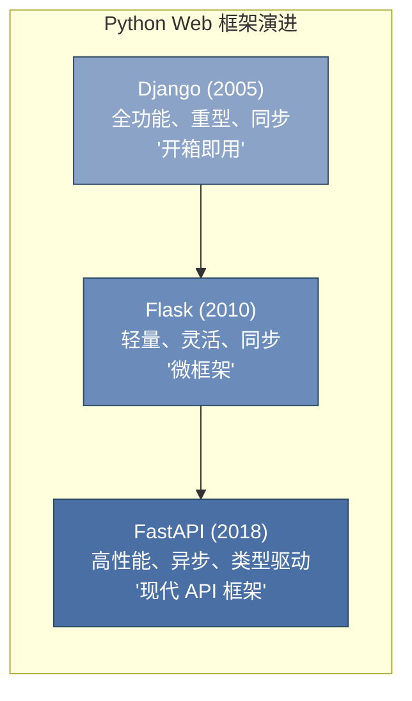
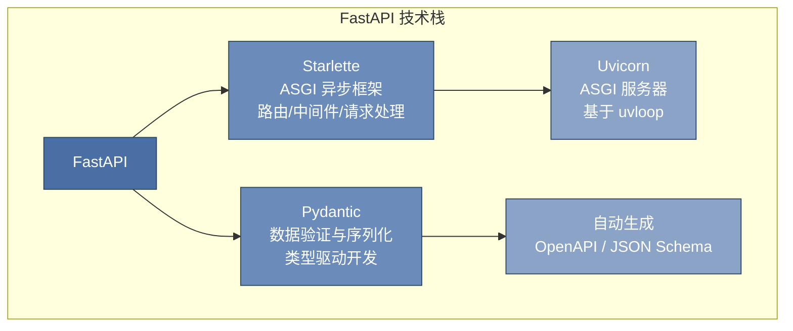
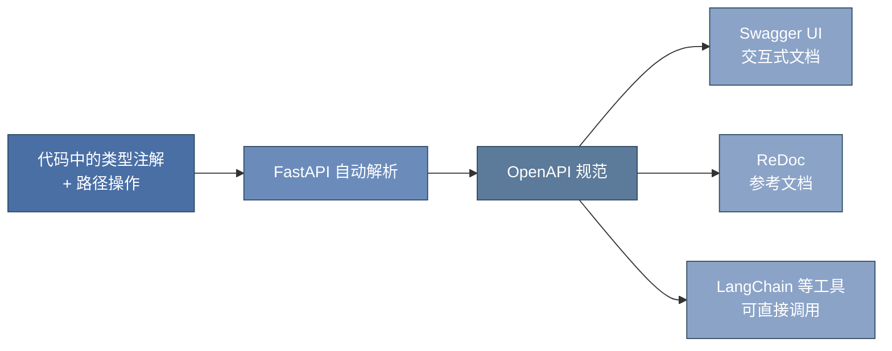

# 第 9 章 Web 开发与 FastAPI ⭐⭐⭐⭐

> **面试频率**：高 | **难度**：⭐⭐⭐ | **实战权重**：高

大模型应用开发的最后一公里是将模型能力封装为可调用的 API 服务。无论是构建 RAG 系统、Agent 服务还是模型部署，Web 框架都是不可或缺的工程基础。本章聚焦 **FastAPI** —— 2025 年大模型应用开发的首选 Web 框架。

---

## 9.1 Python Web 框架对比

### 9.1.1 FastAPI vs Django vs Flask



| 维度 | Django | Flask | FastAPI |
|------|--------|-------|---------|
| **设计哲学** | 全栈框架，"电池全包" | 微框架，自由组合 | 现代 API 优先 |
| **性能** | 同步，中等吞吐 | 同步，中等吞吐 | **异步，高吞吐（接近 Node.js）** |
| **数据验证** | Form/ModelForm | 需集成 WTForms/Marshmallow | **内置 Pydantic，类型自动校验** |
| **自动文档** | 需集成 drf-yasg | 需集成 Flasgger | **自动 Swagger/ReDoc** |
| **异步支持** | Django 4+ 有限支持 | 需外部扩展 | **原生 async/await** |
| **学习曲线** | 陡峭 | 平缓 | **中等（需类型注解基础）** |
| **大模型生态** | 需额外适配 | 需额外适配 | **OpenAPI 原生，LLM 工具链首选** |
| **适用场景** | 传统 Web 应用、后台管理 | 小型服务、原型 | **API 服务、微服务、LLM 应用** |

### 9.1.2 2025 年趋势：FastAPI 逐步成为主流

FastAPI 在大模型时代的崛起并非偶然：

1. **OpenAPI 原生兼容**：大模型工具链（LangChain、LlamaIndex、OpenAI API）均以 OpenAPI 规范为基础，FastAPI 自动生成 OpenAPI 文档，无缝对接
2. **异步架构适配 I/O 密集型场景**：模型推理存在大量 I/O 等待（网络传输、模型加载），FastAPI 的异步模型可并发处理更多请求
3. **Pydantic 数据验证**：LLM 的输入输出需要严格的结构定义（JSON Schema），Pydantic 提供了类型安全的序列化/反序列化
4. **依赖注入系统**：清晰管理数据库连接、模型实例、认证等依赖，特别适合 LLM 服务中的资源管理

---

## 9.2 FastAPI 核心特性 ⭐⭐⭐⭐

### 9.2.1 技术栈：Starlette + Pydantic



- **Starlette**：底层的 ASGI（Asynchronous Server Gateway Interface）框架，提供路由、中间件、请求/响应处理、WebSocket 支持等核心能力
- **Pydantic v2**：基于 Rust 重写的高性能数据验证库，通过 Python 类型注解自动完成数据校验、序列化和文档生成

### 9.2.2 依赖注入系统

FastAPI 的依赖注入（Dependency Injection）是其最优雅的设计之一：

```python
from fastapi import FastAPI, Depends
from typing import Annotated

app = FastAPI()

# 定义依赖函数
def get_db_connection():
    """模拟数据库连接"""
    conn = {"status": "connected", "pool_size": 10}
    try:
        yield conn
    finally:
        conn["status"] = "closed"

def get_current_user(token: str = ""):
    """模拟认证依赖"""
    return {"user_id": 1, "name": "admin"}

# 路由中注入依赖 - 自动解析并按需调用
@app.get("/users/me")
async def read_me(
    db: Annotated[dict, Depends(get_db_connection)],
    user: Annotated[dict, Depends(get_current_user)]
):
    """
    依赖注入的优势：
    1. 自动管理生命周期（yield 支持清理逻辑）
    2. 依赖可嵌套（db 依赖可被其他依赖复用）
    3. 自动缓存同请求内的依赖实例
    4. 与路径操作参数一致的处理方式
    """
    return {"user": user, "db_status": db["status"]}
```

### 9.2.3 自动 API 文档

启动服务后自动生成：
- **Swagger UI**：`http://localhost:8000/docs`
- **ReDoc**：`http://localhost:8000/redoc`
- **OpenAPI JSON**：`http://localhost:8000/openapi.json`



---

## 9.3 实战：构建 API 服务

### 9.3.1 路由与请求处理

```python
from fastapi import FastAPI, HTTPException, Query, Path
from pydantic import BaseModel, Field
from enum import Enum
from typing import Optional

app = FastAPI(title="LLM Service API", version="1.0.0")

# ========== 数据模型定义 ==========
class ChatRequest(BaseModel):
    """聊天请求模型 - Pydantic 自动验证"""
    message: str = Field(min_length=1, max_length=2000, description="用户消息")
    temperature: float = Field(default=0.7, ge=0.0, le=2.0, description="采样温度")
    max_tokens: int = Field(default=512, ge=1, le=4096, description="最大生成长度")

    model_config = {
        "json_schema_extra": {
            "examples": [
                {"message": "你好，请介绍FastAPI", "temperature": 0.7, "max_tokens": 512}
            ]
        }
    }

class ChatResponse(BaseModel):
    """聊天响应模型"""
    reply: str
    tokens_used: int
    model: str

# ========== 路由定义 ==========
@app.get("/health", summary="健康检查")
async def health_check():
    """最简单的端点，用于服务探活"""
    return {"status": "ok", "service": "llm-api"}

@app.post("/chat", response_model=ChatResponse, summary="对话接口")
async def chat(request: ChatRequest):
    """
    对话接口 - 完整展示请求体验证和响应模型
    - 请求体自动按 ChatRequest 模型校验
    - 响应自动按 ChatResponse 模型序列化
    """
    # 模拟 LLM 推理
    reply = f"收到消息：{request.message[:50]}..."
    return ChatResponse(reply=reply, tokens_used=42, model="gpt-4o")

@app.get("/models/{model_id}", summary="获取模型信息")
async def get_model(
    model_id: str = Path(description="模型ID", pattern=r"^[a-zA-Z0-9-_]+$")
):
    """路径参数 + 正则校验"""
    models_db = {"gpt-4o": "OpenAI", "qwen-72b": "阿里", "llama-3": "Meta"}
    if model_id not in models_db:
        raise HTTPException(status_code=404, detail=f"模型 {model_id} 不存在")
    return {"model_id": model_id, "provider": models_db[model_id]}

@app.get("/search", summary="搜索接口")
async def search(
    q: str = Query(min_length=2, description="搜索关键词"),
    limit: int = Query(default=10, ge=1, le=100),
    offset: int = Query(default=0, ge=0)
):
    """查询参数 + 分页验证"""
    return {"query": q, "limit": limit, "offset": offset, "results": []}
```

### 9.3.2 Pydantic 模型验证

Pydantic v2 是 FastAPI 的数据验证引擎，理解其核心机制至关重要：

```python
from pydantic import BaseModel, Field, field_validator, model_validator
from typing import Literal
from datetime import datetime

class EmbeddingRequest(BaseModel):
    """Embedding 请求模型 - 展示高级验证"""
    texts: list[str] = Field(min_length=1, max_length=100, description="待编码文本列表")
    model: Literal["text-embedding-3-small", "text-embedding-3-large", "bge-m3"] = \
        Field(default="bge-m3", description="Embedding 模型")
    normalize: bool = Field(default=True, description="是否归一化")

    @field_validator("texts")
    @classmethod
    def validate_texts_not_empty(cls, texts: list[str]) -> list[str]:
        """字段级验证器：确保每个文本非空"""
        for i, text in enumerate(texts):
            if not text.strip():
                raise ValueError(f"第 {i} 个文本不能为空字符串")
        return texts

    @model_validator(mode="after")
    def check_model_compatibility(self):
        """模型级验证器：检查跨字段一致性"""
        if self.model == "text-embedding-3-small" and len(self.texts) > 50:
            raise ValueError("small 模型单次最多处理 50 条文本")
        return self

# 使用示例
valid_req = EmbeddingRequest(
    texts=["FastAPI 教程", "机器学习基础"],
    model="bge-m3",
    normalize=True
)
print(valid_req.model_dump())  # 序列化为字典
print(valid_req.model_dump_json())  # 序列化为 JSON 字符串
```

### 9.3.3 数据库集成（SQLAlchemy 异步版）

```python
from sqlalchemy.ext.asyncio import create_async_engine, AsyncSession, async_sessionmaker
from sqlalchemy.orm import declarative_base, Mapped, mapped_column
from sqlalchemy import String, DateTime, func, select
from contextlib import asynccontextmanager
import datetime

# 异步数据库引擎
engine = create_async_engine("sqlite+aiosqlite:///./llm_service.db", echo=True)
async_session = async_sessionmaker(engine, class_=AsyncSession, expire_on_commit=False)
Base = declarative_base()

class Conversation(Base):
    """对话记录表"""
    __tablename__ = "conversations"

    id: Mapped[int] = mapped_column(primary_key=True)
    user_message: Mapped[str] = mapped_column(String(2000))
    assistant_reply: Mapped[str] = mapped_column(String(4000))
    model: Mapped[str] = mapped_column(String(50))
    created_at: Mapped[datetime.datetime] = mapped_column(DateTime, server_default=func.now())

# 依赖：获取数据库会话
async def get_db() -> AsyncSession:
    async with async_session() as session:
        try:
            yield session
            await session.commit()
        except Exception:
            await session.rollback()
            raise

# 使用
@app.post("/chat/persistent", summary="持久化对话")
async def chat_persistent(
    request: ChatRequest,
    db: AsyncSession = Depends(get_db)
):
    """将对话结果持久化到数据库"""
    reply = f"回复：{request.message[:50]}"
    conv = Conversation(
        user_message=request.message,
        assistant_reply=reply,
        model="gpt-4o"
    )
    db.add(conv)
    await db.flush()  # 获取自增 ID
    return {"reply": reply, "conversation_id": conv.id}

@app.get("/conversations", summary="查询历史对话")
async def list_conversations(
    limit: int = Query(default=20, ge=1, le=100),
    db: AsyncSession = Depends(get_db)
):
    """异步查询数据库"""
    result = await db.execute(
        select(Conversation).order_by(Conversation.created_at.desc()).limit(limit)
    )
    conversations = result.scalars().all()
    return [{"id": c.id, "message": c.user_message, "reply": c.assistant_reply}
            for c in conversations]
```

### 9.3.4 中间件与跨域处理

```python
from fastapi.middleware.cors import CORSMiddleware
from fastapi.middleware.gzip import GZipMiddleware
from fastapi import Request
import time
import logging

logger = logging.getLogger(__name__)

# CORS 配置 - 大模型 API 通常需要跨域
app.add_middleware(
    CORSMiddleware,
    allow_origins=["http://localhost:3000", "https://your-app.com"],
    allow_credentials=True,
    allow_methods=["GET", "POST", "PUT", "DELETE"],
    allow_headers=["*"],
)

# GZip 压缩 - 大模型响应通常较大
app.add_middleware(GZipMiddleware, minimum_size=1000)

# 自定义中间件：请求日志与耗时统计
@app.middleware("http")
async def log_requests(request: Request, call_next):
    start = time.time()
    response = await call_next(request)
    duration = time.time() - start
    logger.info(
        f"{request.method} {request.url.path} "
        f"- {response.status_code} - {duration:.3f}s"
    )
    response.headers["X-Response-Time"] = f"{duration:.3f}s"
    return response
```

### 9.3.5 流式响应（SSE）— LLM 场景核心

大模型生成是逐 token 进行的，流式响应（Server-Sent Events）是必备能力：

```python
from fastapi.responses import StreamingResponse
import asyncio
import json

async def generate_tokens_stream(prompt: str):
    """模拟 LLM 流式生成"""
    tokens = ["Fast", "API", "是", "一个", "现代", "、", "高性能", "的",
              "Python", "Web", "框架", "，", "特别适合", "构建", "LLM", "服务", "。"]
    full_response = ""
    for token in tokens:
        await asyncio.sleep(0.1)  # 模拟推理延迟
        full_response += token
        chunk = {
            "token": token,
            "choices": [{"delta": {"content": token}}]
        }
        yield f"data: {json.dumps(chunk, ensure_ascii=False)}\n\n"
    # 发送结束标记
    yield f"data: {json.dumps({'done': True, 'full_text': full_response})}\n\n"

@app.get("/chat/stream", summary="流式对话（SSE）")
async def chat_stream(message: str = Query(min_length=1)):
    """
    SSE 流式响应 - 大模型 API 的标准输出方式
    与 WebSocket 的区别：SSE 是单向（服务端→客户端），基于 HTTP
    """
    return StreamingResponse(
        generate_tokens_stream(message),
        media_type="text/event-stream",
        headers={"Cache-Control": "no-cache", "Connection": "keep-alive"}
    )
```

### 9.3.6 完整项目结构

```
llm_api_service/
├── app/
│   ├── __init__.py
│   ├── main.py              # FastAPI 应用入口
│   ├── routers/
│   │   ├── __init__.py
│   │   ├── chat.py          # 对话路由
│   │   ├── embeddings.py    # Embedding 路由
│   │   └── models.py        # 模型管理路由
│   ├── models/
│   │   ├── __init__.py
│   │   ├── schemas.py       # Pydantic 模型
│   │   └── database.py      # SQLAlchemy 模型
│   ├── services/
│   │   ├── __init__.py
│   │   ├── llm_client.py    # LLM 调用封装
│   │   └── embedding_service.py
│   ├── dependencies.py      # 共享依赖
│   ├── middleware.py        # 中间件配置
│   └── config.py            # 配置管理
├── tests/
│   └── test_api.py
├── requirements.txt
└── Dockerfile
```

---

## 9.4 本章面试题精讲 🎯

### 🎯 面试题 1：FastAPI 为什么比 Flask/Django 更适合大模型 API 开发？

**答题要点**：
1. **异步架构**：基于 ASGI + Starlette，原生支持 `async/await`，可并发处理大量 I/O 密集型请求（模型推理等待）
2. **Pydantic 集成**：大模型的输入输出需要严格的 JSON Schema 定义，Pydantic 提供类型安全的自动校验和序列化
3. **OpenAPI 原生**：自动生成 OpenAPI 文档，LangChain 等工具可直接消费，降低集成成本
4. **性能**：Pydantic v2（Rust 重写）+ Uvicorn（uvloop）带来接近 Node.js 的吞吐量

### 🎯 面试题 2：FastAPI 的依赖注入系统有什么优势？

**答题要点**：
1. **声明式依赖**：通过 `Depends()` 在参数中声明，与路径参数统一处理
2. **生命周期管理**：使用 `yield` 支持资源的创建和清理（如数据库连接）
3. **依赖嵌套**：依赖可以依赖其他依赖，形成清晰的依赖图
4. **请求级缓存**：同请求内同一依赖只计算一次，自动缓存结果
5. **可测试性**：依赖可以轻松 mock，便于单元测试

### 🎯 面试题 3：Pydantic v1 和 v2 的主要区别？

**答题要点**：
1. **性能**：v2 核心用 Rust 重写，校验速度提升 5-50 倍
2. **API 变化**：`dict()` → `model_dump()`，`json()` → `model_dump_json()`，`schema()` → `model_json_schema()`
3. **验证器装饰器**：v1 `@validator` → v2 `@field_validator`（字段级）/`@model_validator`（模型级）
4. **类型注解**：v2 更严格地遵循 Python 类型系统，`Optional` 需显式标注

### 🎯 面试题 4：如何实现 LLM API 的流式输出？

**答题要点**：
1. 使用 `StreamingResponse` 返回异步生成器
2. 协议使用 SSE（Server-Sent Events），格式为 `data: {...}\n\n`
3. 前端通过 `EventSource` API 接收
4. 与 WebSocket 的区别：SSE 是单向推送，基于 HTTP；WebSocket 是全双工，需要协议升级
5. 流式输出的意义：降低首 token 延迟，提升用户体验

### 🎯 面试题 5：FastAPI 中如何优雅处理异步数据库操作？

**答题要点**：
1. 使用 SQLAlchemy 的异步扩展：`create_async_engine` + `AsyncSession`
2. 数据库驱动选择：`aiosqlite`（SQLite）、`asyncpg`（PostgreSQL）、`aiomysql`（MySQL）
3. 通过 `Depends` 注入会话，利用 `yield` 管理事务提交和回滚
4. 查询使用 `await db.execute(select(...))`，配合 `scalars().all()` 获取结果

---

## 9.5 本章速查表

| 特性 | 代码 / 配置 |
|------|-----------|
| 定义数据模型 | `class Model(BaseModel): field: str` |
| 路径参数 | `@app.get("/items/{item_id}")` |
| 查询参数 | `def func(q: str = Query(min_length=2))` |
| 请求体 | `def func(body: RequestModel)` |
| 响应模型 | `@app.post("/", response_model=ResponseModel)` |
| 依赖注入 | `def func(db: Session = Depends(get_db))` |
| 流式响应 | `StreamingResponse(generator, media_type="text/event-stream")` |
| 运行服务 | `uvicorn main:app --host 0.0.0.0 --port 8000 --reload` |
| CORS 配置 | `app.add_middleware(CORSMiddleware, allow_origins=["*"])` |
| 健康检查 | `@app.get("/health")` |

---

> **下一章**：第 10 章 机器学习基础 ⭐⭐⭐⭐⭐ — 从经典算法到模型评估的完整知识体系。

---

## 📚 相关章节

- [[14_RAG检索增强生成]] — RAG 系统的 API 服务层通常使用 FastAPI 构建
- [[15_Agent智能体开发]] — Agent 服务的 API 接口设计与 MCP 协议集成
- [[16_模型微调与推理优化]] — 模型部署服务的工程实现，vLLM API 封装
