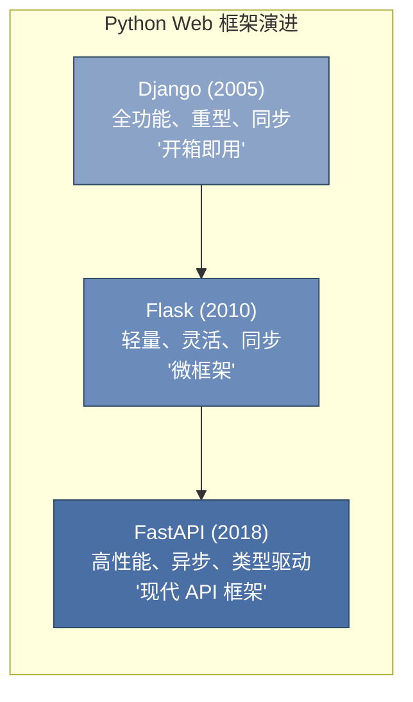
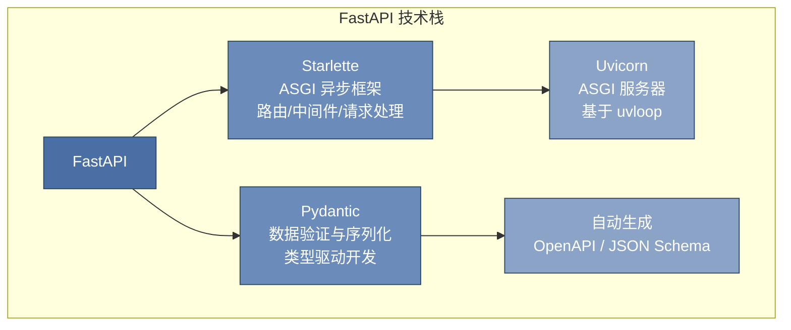
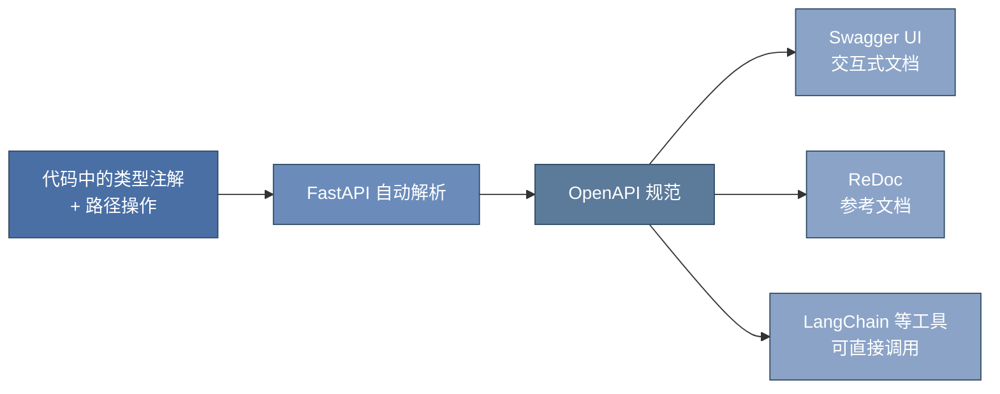

# 第 10 章 FastAPI 与后端服务 ⭐⭐⭐⭐
> [!abstract] 本章导航
> **定位**：第一部分 Python 与后端工程基础中的第 10 章；围绕“FastAPI 与后端服务”建立单一、可追踪的知识主线。
>
> **先修**：[[09_NumPy与Pandas数据处理|第 9 章 NumPy 与 Pandas 数据处理]]。
>
> **学习目标**：
> - 解释 Python Web 框架对比 的核心问题、机制与适用边界。
> - 实现或评估 FastAPI 核心特性 ⭐⭐⭐⭐ 的最小闭环。
> - 使用可复现证据诊断 实战：构建 API 服务 的工程取舍与失败模式。
>
> **建议路径**：Python Web 框架对比 → FastAPI 核心特性 ⭐⭐⭐⭐ → 实战：构建 API 服务。
>
> **配套代码**：`code/ch10_fastapi/`。

本章先回答“Python Web 框架对比”为什么成立，再沿着机制、实现、评估和边界逐步展开。阅读时先建立因果链，再运行或推演示例，最后用章末自测检查能否脱离原文复述。
## 10.1 Python Web 框架对比

### 10.1.1 FastAPI vs Django vs Flask



| 维度 | Django | Flask | FastAPI |
|------|--------|-------|---------|
| **设计哲学** | 全栈框架，"电池全包" | 微框架，自由组合 | 现代 API 优先 |
| **性能** | 同步，中等吞吐 | 同步，中等吞吐 | **异步，高吞吐（接近 Node.js）** |
| **数据验证** | Form/ModelForm | 需集成 WTForms/Marshmallow | **内置 Pydantic，类型自动校验** |
| **自动文档** | 需集成 drf-yasg | 需集成 Flasgger | **自动 Swagger/ReDoc** |
| **异步支持** | Django 4+ 有限支持 | 需外部扩展 | **原生 async/await** |
| **学习曲线** | 陡峭 | 平缓 | **中等（需类型注解基础）** |
| **大模型生态** | 需额外适配 | 需额外适配 | **OpenAPI 原生，LLM 工具链首选** |
| **适用场景** | 传统 Web 应用、后台管理 | 小型服务、原型 | **API 服务、微服务、LLM 应用** |

### 10.1.2 2025 年趋势：FastAPI 逐步成为主流

FastAPI 在大模型时代的崛起并非偶然：

1. **OpenAPI 原生兼容**：大模型工具链（LangChain、LlamaIndex、OpenAI API）均以 OpenAPI 规范为基础，FastAPI 自动生成 OpenAPI 文档，无缝对接
2. **异步架构适配 I/O 密集型场景**：模型推理存在大量 I/O 等待（网络传输、模型加载），FastAPI 的异步模型可并发处理更多请求
3. **Pydantic 数据验证**：LLM 的输入输出需要严格的结构定义（JSON Schema），Pydantic 提供了类型安全的序列化/反序列化
4. **依赖注入系统**：清晰管理数据库连接、模型实例、认证等依赖，特别适合 LLM 服务中的资源管理

## 10.2 FastAPI 核心特性 ⭐⭐⭐⭐

### 10.2.1 技术栈：Starlette + Pydantic



- **Starlette**：底层的 ASGI（Asynchronous Server Gateway Interface）框架，提供路由、中间件、请求/响应处理、WebSocket 支持等核心能力
- **Pydantic v2**：基于 Rust 重写的高性能数据验证库，通过 Python 类型注解自动完成数据校验、序列化和文档生成

### 10.2.2 依赖注入系统

FastAPI 的依赖注入（Dependency Injection）是其最优雅的设计之一：

```python
import os
import secrets
from typing import Annotated

from fastapi import Depends, FastAPI, HTTPException, status
from fastapi.security import HTTPAuthorizationCredentials, HTTPBearer

app = FastAPI()
bearer = HTTPBearer(auto_error=False)

# 定义依赖函数
def get_db_connection():
    """模拟数据库连接"""
    conn = {"status": "connected", "pool_size": 10}
    try:
        yield conn
    finally:
        conn["status"] = "closed"

def get_current_user(
    credentials: Annotated[
        HTTPAuthorizationCredentials | None,
        Depends(bearer),
    ],
):
    """教学用 Bearer 校验；生产环境应验证 JWT 签名、过期时间与 scope。"""
    expected = os.getenv("DEMO_API_TOKEN")
    if not expected:
        raise HTTPException(
            status_code=status.HTTP_503_SERVICE_UNAVAILABLE,
            detail="服务端尚未配置 DEMO_API_TOKEN",
        )
    if credentials is None or not secrets.compare_digest(
        credentials.credentials,
        expected,
    ):
        raise HTTPException(
            status_code=status.HTTP_401_UNAUTHORIZED,
            detail="无效或缺失的 Bearer token",
            headers={"WWW-Authenticate": "Bearer"},
        )
    return {"user_id": 1, "name": "demo-user"}

# 路由中注入依赖 - 自动解析并按需调用
@app.get("/users/me")
async def read_me(
    db: Annotated[dict, Depends(get_db_connection)],
    user: Annotated[dict, Depends(get_current_user)]
):
    """
    依赖注入的优势：
    1. 自动管理生命周期（yield 支持清理逻辑）
    2. 依赖可嵌套（db 依赖可被其他依赖复用）
    3. 自动缓存同请求内的依赖实例
    4. 与路径操作参数一致的处理方式
    """
    return {"user": user, "db_status": db["status"]}
```

> 不要把访问令牌放在查询参数中：URL 可能进入浏览器历史、反向代理访问日志和监控系统。上述代码只是可运行的依赖注入演示；生产认证还需验证签名、`exp`、`iss`、`aud`、权限范围和密钥轮换。

### 10.2.3 自动 API 文档

启动服务后自动生成：
- **Swagger UI**：`http://localhost:8000/docs`
- **ReDoc**：`http://localhost:8000/redoc`
- **OpenAPI JSON**：`http://localhost:8000/openapi.json`



## 10.3 实战：构建 API 服务

### 10.3.1 路由与请求处理

```python
from fastapi import FastAPI, HTTPException, Query, Path
from pydantic import BaseModel, Field
from enum import Enum
from typing import Optional

app = FastAPI(title="LLM Service API", version="1.0.0")

# ========== 数据模型定义 ==========
class ChatRequest(BaseModel):
    """聊天请求模型 - Pydantic 自动验证"""
    message: str = Field(min_length=1, max_length=2000, description="用户消息")
    temperature: float = Field(default=0.7, ge=0.0, le=2.0, description="采样温度")
    max_tokens: int = Field(default=512, ge=1, le=4096, description="最大生成长度")

    model_config = {
        "json_schema_extra": {
            "examples": [
                {"message": "你好，请介绍FastAPI", "temperature": 0.7, "max_tokens": 512}
            ]
        }
    }

class ChatResponse(BaseModel):
    """聊天响应模型"""
    reply: str
    tokens_used: int
    model: str

# ========== 路由定义 ==========
@app.get("/health", summary="健康检查")
async def health_check():
    """最简单的端点，用于服务探活"""
    return {"status": "ok", "service": "llm-api"}

@app.post("/chat", response_model=ChatResponse, summary="对话接口")
async def chat(request: ChatRequest):
    """
    对话接口 - 完整展示请求体验证和响应模型
    - 请求体自动按 ChatRequest 模型校验
    - 响应自动按 ChatResponse 模型序列化
    """
    # 模拟 LLM 推理
    reply = f"收到消息：{request.message[:50]}..."
    return ChatResponse(reply=reply, tokens_used=42, model="demo-chat-v1")

@app.get("/models/{model_id}", summary="获取模型信息")
async def get_model(
    model_id: str = Path(description="模型ID", pattern=r"^[a-zA-Z0-9-_]+$")
):
    """路径参数 + 正则校验"""
    models_db = {"demo-chat-v1": "Demo", "local-chat": "Self-hosted"}
    if model_id not in models_db:
        raise HTTPException(status_code=404, detail=f"模型 {model_id} 不存在")
    return {"model_id": model_id, "provider": models_db[model_id]}

@app.get("/search", summary="搜索接口")
async def search(
    q: str = Query(min_length=2, description="搜索关键词"),
    limit: int = Query(default=10, ge=1, le=100),
    offset: int = Query(default=0, ge=0)
):
    """查询参数 + 分页验证"""
    return {"query": q, "limit": limit, "offset": offset, "results": []}
```

### 10.3.2 Pydantic 模型验证

Pydantic v2 是 FastAPI 的数据验证引擎，理解其核心机制至关重要：

```python
from pydantic import BaseModel, Field, field_validator, model_validator
from typing import Literal
from datetime import datetime

class EmbeddingRequest(BaseModel):
    """Embedding 请求模型 - 展示高级验证"""
    texts: list[str] = Field(min_length=1, max_length=100, description="待编码文本列表")
    model: Literal["text-embedding-3-small", "text-embedding-3-large", "bge-m3"] = \
        Field(default="bge-m3", description="Embedding 模型")
    normalize: bool = Field(default=True, description="是否归一化")

    @field_validator("texts")
    @classmethod
    def validate_texts_not_empty(cls, texts: list[str]) -> list[str]:
        """字段级验证器：确保每个文本非空"""
        for i, text in enumerate(texts):
            if not text.strip():
                raise ValueError(f"第 {i} 个文本不能为空字符串")
        return texts

    @model_validator(mode="after")
    def check_model_compatibility(self):
        """模型级验证器：检查跨字段一致性"""
        if self.model == "text-embedding-3-small" and len(self.texts) > 50:
            raise ValueError("small 模型单次最多处理 50 条文本")
        return self

# 使用示例
valid_req = EmbeddingRequest(
    texts=["FastAPI 教程", "机器学习基础"],
    model="bge-m3",
    normalize=True
)
print(valid_req.model_dump())  # 序列化为字典
print(valid_req.model_dump_json())  # 序列化为 JSON 字符串
```

### 10.3.3 数据库集成（SQLAlchemy 异步版）

```python
from sqlalchemy.ext.asyncio import create_async_engine, AsyncSession, async_sessionmaker
from sqlalchemy.orm import declarative_base, Mapped, mapped_column
from sqlalchemy import String, DateTime, func, select
from contextlib import asynccontextmanager
import datetime

# 异步数据库引擎
engine = create_async_engine("sqlite+aiosqlite:///./llm_service.db", echo=True)
async_session = async_sessionmaker(engine, class_=AsyncSession, expire_on_commit=False)
Base = declarative_base()

class Conversation(Base):
    """对话记录表"""
    __tablename__ = "conversations"

    id: Mapped[int] = mapped_column(primary_key=True)
    user_message: Mapped[str] = mapped_column(String(2000))
    assistant_reply: Mapped[str] = mapped_column(String(4000))
    model: Mapped[str] = mapped_column(String(50))
    created_at: Mapped[datetime.datetime] = mapped_column(DateTime, server_default=func.now())

# 依赖：获取数据库会话
async def get_db() -> AsyncSession:
    async with async_session() as session:
        try:
            yield session
            await session.commit()
        except Exception:
            await session.rollback()
            raise

# 使用
@app.post("/chat/persistent", summary="持久化对话")
async def chat_persistent(
    request: ChatRequest,
    db: AsyncSession = Depends(get_db)
):
    """将对话结果持久化到数据库"""
    reply = f"回复：{request.message[:50]}"
    conv = Conversation(
        user_message=request.message,
        assistant_reply=reply,
        model="demo-chat-v1"
    )
    db.add(conv)
    await db.flush()  # 获取自增 ID
    return {"reply": reply, "conversation_id": conv.id}

@app.get("/conversations", summary="查询历史对话")
async def list_conversations(
    limit: int = Query(default=20, ge=1, le=100),
    db: AsyncSession = Depends(get_db)
):
    """异步查询数据库"""
    result = await db.execute(
        select(Conversation).order_by(Conversation.created_at.desc()).limit(limit)
    )
    conversations = result.scalars().all()
    return [{"id": c.id, "message": c.user_message, "reply": c.assistant_reply}
            for c in conversations]
```

### 10.3.4 中间件与跨域处理

```python
from fastapi.middleware.cors import CORSMiddleware
from fastapi.middleware.gzip import GZipMiddleware
from fastapi import Request
import time
import logging

logger = logging.getLogger(__name__)

# CORS 配置 - 大模型 API 通常需要跨域
app.add_middleware(
    CORSMiddleware,
    allow_origins=["http://localhost:3000", "https://your-app.com"],
    allow_credentials=True,
    allow_methods=["GET", "POST", "PUT", "DELETE"],
    allow_headers=["*"],
)

# GZip 压缩 - 大模型响应通常较大
app.add_middleware(GZipMiddleware, minimum_size=1000)

# 自定义中间件：请求日志与耗时统计
@app.middleware("http")
async def log_requests(request: Request, call_next):
    start = time.time()
    response = await call_next(request)
    duration = time.time() - start
    logger.info(
        f"{request.method} {request.url.path} "
        f"- {response.status_code} - {duration:.3f}s"
    )
    response.headers["X-Response-Time"] = f"{duration:.3f}s"
    return response
```

### 10.3.5 流式响应（SSE）— LLM 场景核心

大模型生成是逐 token 进行的，流式响应（Server-Sent Events）是必备能力：

```python
import asyncio
import json
from collections.abc import Awaitable, Callable

from fastapi import Request
from fastapi.responses import StreamingResponse
from pydantic import BaseModel, Field


class ChatRequest(BaseModel):
    message: str = Field(min_length=1, max_length=8_000)


async def generate_tokens_stream(
    prompt: str,
    is_disconnected: Callable[[], Awaitable[bool]] | None = None,
):
    """模拟 LLM 流式生成"""
    tokens = ["Fast", "API", "是", "一个", "现代", "、", "高性能", "的",
              "Python", "Web", "框架", "，", "特别适合", "构建", "LLM", "服务", "。"]
    full_response = ""
    for token in tokens:
        if is_disconnected is not None and await is_disconnected():
            return
        await asyncio.sleep(0.1)  # 模拟推理延迟
        full_response += token
        chunk = {
            "token": token,
            "choices": [{"delta": {"content": token}}]
        }
        yield f"data: {json.dumps(chunk, ensure_ascii=False)}\n\n"
    # 发送结束标记
    yield f"data: {json.dumps({'done': True, 'full_text': full_response})}\n\n"

@app.post("/chat/stream", summary="流式对话（SSE over fetch）")
async def chat_stream(payload: ChatRequest, request: Request):
    """
    prompt 放在 POST body，避免出现在 URL 和常规访问日志中。
    浏览器用 fetch 读取响应流；原生 EventSource 仅支持 GET。
    """
    return StreamingResponse(
        generate_tokens_stream(payload.message, request.is_disconnected),
        media_type="text/event-stream",
        headers={
            "Cache-Control": "no-cache",
            "X-Accel-Buffering": "no",
        },
    )
```

生产流式接口还应设置上游模型超时、并发/速率限制和最大请求体，客户端断开时取消上游生成，并避免在 token 日志中记录敏感 prompt。若必须使用原生 `EventSource`，可先通过认证 POST 创建短期、单次 stream ID，再用不含原始 prompt 的 GET 建立流。

**参考资料（核对日期：2026-07-31）**：

- [FastAPI Security：HTTP Bearer/OAuth2](https://fastapi.tiangolo.com/tutorial/security/first-steps/)
- [FastAPI Server-Sent Events](https://fastapi.tiangolo.com/tutorial/server-sent-events/)
- [ASGI HTTP and WebSocket specification](https://asgi.readthedocs.io/en/latest/specs/www.html)

### 10.3.6 完整项目结构

```
llm_api_service/
├── app/
│   ├── __init__.py
│   ├── main.py              # FastAPI 应用入口
│   ├── routers/
│   │   ├── __init__.py
│   │   ├── chat.py          # 对话路由
│   │   ├── embeddings.py    # Embedding 路由
│   │   └── models.py        # 模型管理路由
│   ├── models/
│   │   ├── __init__.py
│   │   ├── schemas.py       # Pydantic 模型
│   │   └── database.py      # SQLAlchemy 模型
│   ├── services/
│   │   ├── __init__.py
│   │   ├── llm_client.py    # LLM 调用封装
│   │   └── embedding_service.py
│   ├── dependencies.py      # 共享依赖
│   ├── middleware.py        # 中间件配置
│   └── config.py            # 配置管理
├── tests/
│   └── test_api.py
├── requirements.txt
└── Dockerfile
```
## 🧭 本章小结

- Python Web 框架对比：能够说清问题、机制、证据与边界。
- FastAPI 核心特性 ⭐⭐⭐⭐：能够说清问题、机制、证据与边界。
- 实战：构建 API 服务：能够说清问题、机制、证据与边界。

## ✅ 自测与练习

1. 不看正文，解释“Python Web 框架对比”解决什么问题，并给出一个不适用场景。
2. 为“FastAPI 核心特性 ⭐⭐⭐⭐”设计一个最小可复现实验，明确输入、指标和通过条件。
3. 比较“实战：构建 API 服务”的至少两种方案，说明质量、成本、延迟或风险取舍。

## 🧪 配套代码与验收

- `code/ch10_fastapi/`

```powershell
python code/scripts/run_all_examples.py --chapter ch10 --tier core
```

默认验收不下载模型、不调用付费 API；真实 API 或 GPU 示例必须按 metadata 显式启用。成功标准是相关脚本输出 `OK`，条件不足时输出可解释的 `[SKIP]`。

## 🎯 面试题精讲

回答本章问题时使用四步结构：先给结论，再解释机制，然后给项目证据，最后主动说明适用边界。涉及性能或效果时，补充模型、硬件、数据、并发、版本和统计口径；条件不完整时明确说“需要实测”。

## 📋 本章速查表

| 主题 | 回答主线 |
|---|---|
| Python Web 框架对比 | 问题 → 机制 → 示例 → 指标 → 边界 |
| FastAPI 核心特性 ⭐⭐⭐⭐ | 问题 → 机制 → 示例 → 指标 → 边界 |
| 实战：构建 API 服务 | 问题 → 机制 → 示例 → 指标 → 边界 |

## 🔗 相关章节

- [[09_NumPy与Pandas数据处理|第 9 章 NumPy 与 Pandas 数据处理]]
- [[11_机器学习基础|第 11 章 机器学习基础]]

## 📖 一手参考资料

> 核验基线：2026-07-31；结构复核：2026-08-05。产品、API、法规、价格与 benchmark 会变化，使用前应再次核验。

- [[docs/AUTHORITATIVE_SOURCES|章节权威来源索引]]：按主题维护官方文档、标准、原论文和官方仓库。
