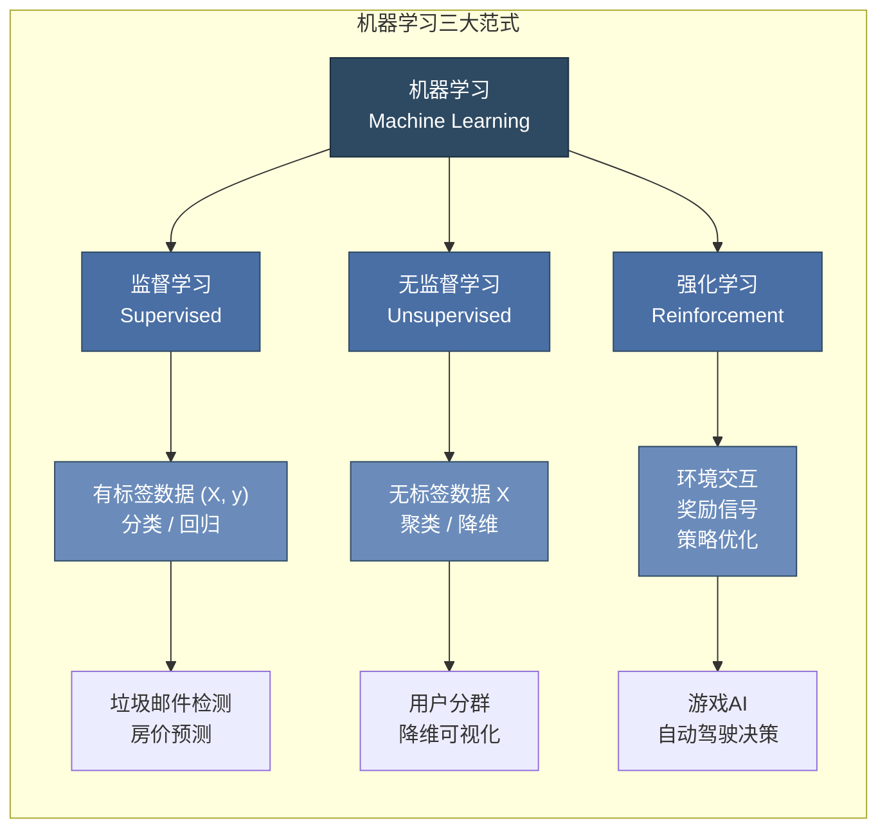
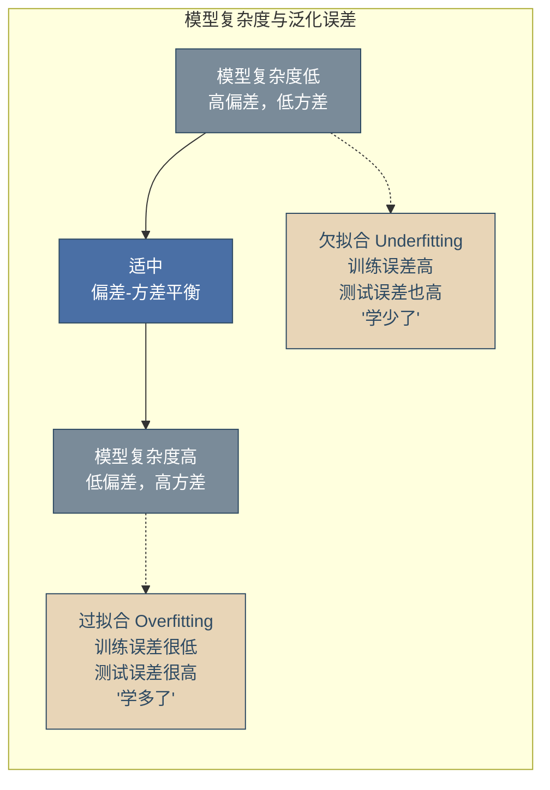
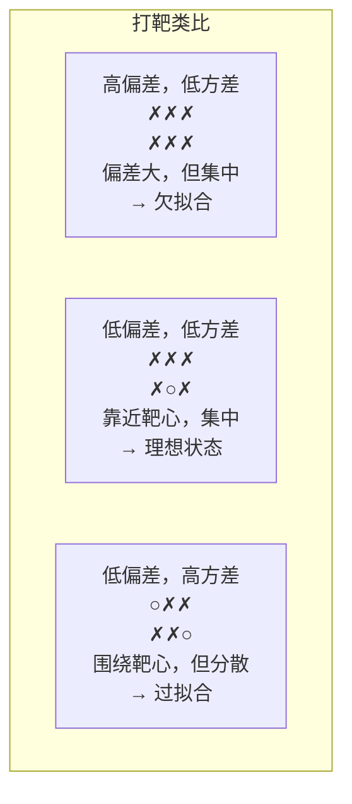
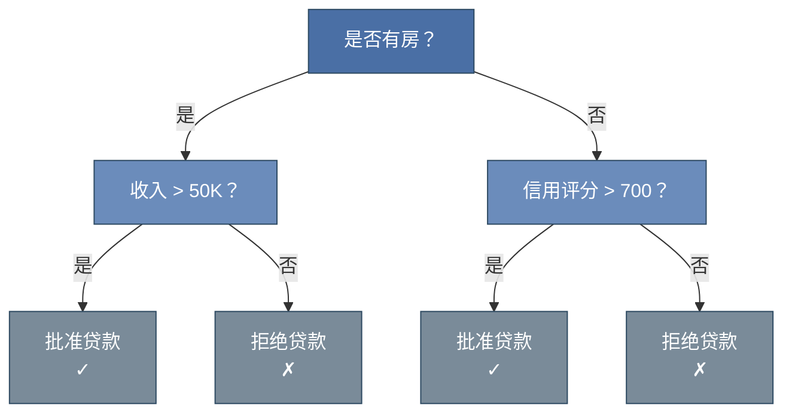
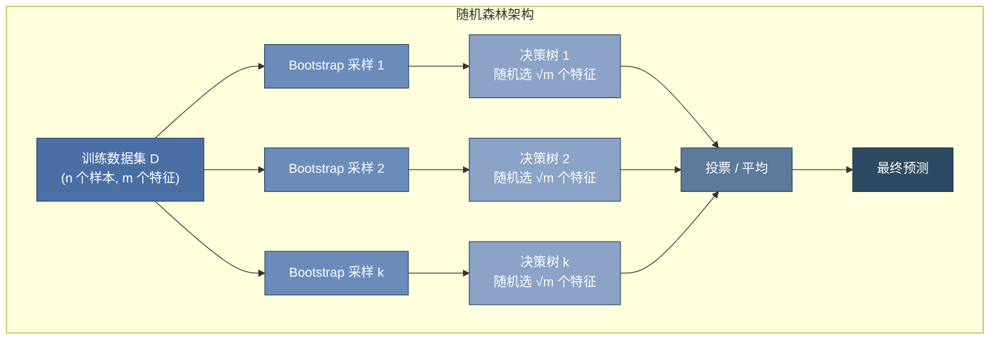
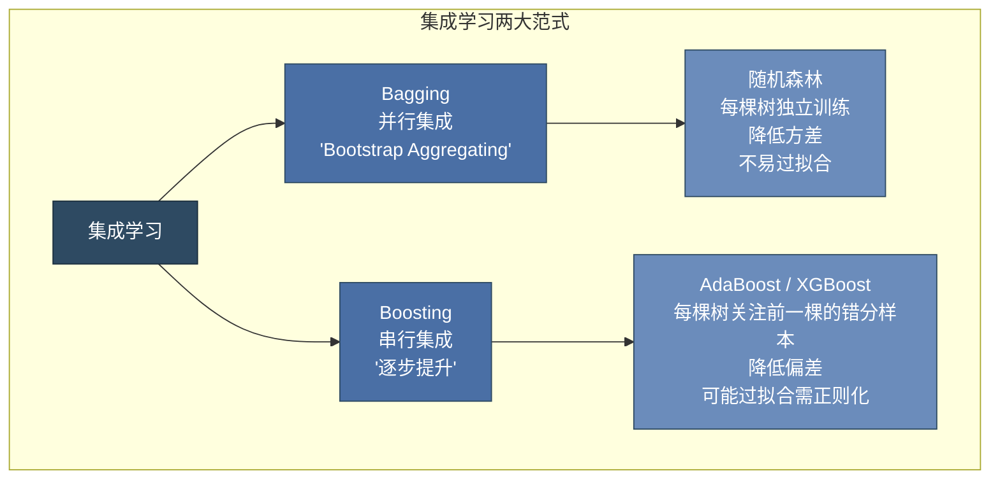
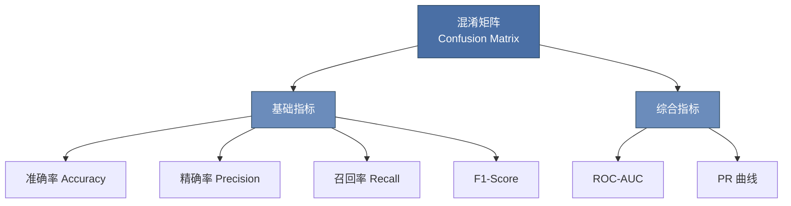
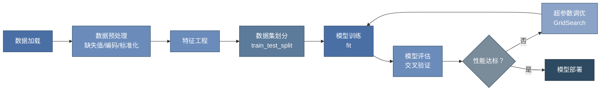

# 第 10 章 机器学习基础 ⭐⭐⭐⭐⭐

> **面试频率**：极高 | **难度**：⭐⭐⭐⭐ | **理论权重**：高

机器学习是大模型技术的理论根基。面试中，经典算法原理、模型评估指标、偏差-方差权衡等知识点的考察频率与大模型原理不相上下。本章系统梳理面试高频考点，兼顾原理深度与实践代码。

---

## 10.1 机器学习概述

### 10.1.1 三种学习范式



| 范式 | 输入 | 目标 | 代表算法 | 面试频率 |
|------|------|------|---------|---------|
| **监督学习** | 标注数据 $(X, y)$ | 学习 $X \to y$ 的映射 | 线性回归、逻辑回归、SVM、决策树 | ⭐⭐⭐⭐⭐ |
| **无监督学习** | 无标注数据 $X$ | 发现数据内在结构 | K-Means、PCA、DBSCAN | ⭐⭐⭐⭐ |
| **强化学习** | 环境状态 $S$，奖励 $R$ | 最大化累积奖励 | Q-Learning、PPO（大模型对齐） | ⭐⭐⭐⭐ |

### 10.1.2 过拟合与欠拟合 ⭐⭐⭐⭐⭐



**偏差-方差分解**（Bias-Variance Decomposition）是理解过拟合与欠拟合的核心数学工具。

对于给定的测试点 $x$，模型的期望泛化误差可分解为：

$$E[(y - \hat{f}(x))^2] = \underbrace{(f(x) - E[\hat{f}(x)])^2}_{\text{Bias}^2} + \underbrace{E[(\hat{f}(x) - E[\hat{f}(x)])^2]}_{\text{Variance}} + \underbrace{\sigma^2_\epsilon}_{\text{不可约误差}}$$

| 概念 | 含义 | 成因 | 解决策略 |
|------|------|------|---------|
| **偏差 (Bias)** | 模型预测均值与真实值的差距 | 模型假设过于简单，欠拟合 | 增加模型复杂度、添加特征、减少正则化 |
| **方差 (Variance)** | 模型对训练数据波动的敏感度 | 模型过于复杂，过拟合 | 正则化、交叉验证、集成方法、增加数据 |
| **不可约误差** | 数据本身的噪声 | 数据采集的随机性 | 无法消除，只能通过数据清洗降低 |

**偏差-方差权衡的可视化理解**：



**缓解过拟合的常用技术**：

| 技术 | 原理 | 适用场景 |
|------|------|---------|
| **L1/L2 正则化** | 在损失函数中添加参数范数惩罚，限制模型复杂度 | 线性模型、神经网络 |
| **Dropout** | 训练时随机丢弃神经元，减少共适应 | 神经网络 |
| **早停 (Early Stopping)** | 验证集性能不再提升时停止训练 | 迭代训练模型 |
| **数据增强** | 通过对训练数据进行变换扩充样本 | 图像、文本 |
| **交叉验证** | 更稳健的模型评估，避免数据划分偏差 | 所有场景 |
| **集成方法** | 多个模型的平均降低方差 | 决策树、神经网络 |

---

## 10.2 经典监督学习算法 ⭐⭐⭐⭐⭐

### 10.2.1 线性回归 (Linear Regression)

**模型假设**：$y = w^T x + b$

**损失函数（MSE）**：
$$J(w) = \frac{1}{n} \sum_{i=1}^n (y_i - w^T x_i)^2$$

**解析解**：
$$w^* = (X^T X)^{-1} X^T y$$

**梯度下降更新**：
$$w := w - \alpha \cdot \frac{2}{n} X^T (Xw - y)$$

```python
import numpy as np
from sklearn.linear_model import LinearRegression, Ridge, Lasso
from sklearn.model_selection import train_test_split
from sklearn.metrics import mean_squared_error, r2_score

# 生成模拟数据
np.random.seed(42)
n_samples, n_features = 1000, 5
X = np.random.randn(n_samples, n_features)
true_w = np.array([2.0, -1.5, 0.5, 3.0, -2.0])
y = X @ true_w + np.random.randn(n_samples) * 0.5  # 添加噪声

X_train, X_test, y_train, y_test = train_test_split(X, y, test_size=0.2)

# 普通线性回归
lr = LinearRegression()
lr.fit(X_train, y_train)
y_pred = lr.predict(X_test)

print(f"R² Score: {r2_score(y_test, y_pred):.4f}")
print(f"MSE: {mean_squared_error(y_test, y_pred):.4f}")
print(f"学习到的参数: {lr.coef_}")

# L2 正则化（Ridge）— 防止过拟合
ridge = Ridge(alpha=1.0)
ridge.fit(X_train, y_train)

# L1 正则化（Lasso）— 自动特征选择
lasso = Lasso(alpha=0.1)
lasso.fit(X_train, y_train)
print(f"Lasso 稀疏参数: {lasso.coef_}")  # 部分参数被压缩至0
```

### 10.2.2 逻辑回归 (Logistic Regression) ⭐⭐⭐⭐⭐

逻辑回归虽然名为"回归"，实为**分类算法**。核心思想是通过 Sigmoid 函数将线性输出映射到 $(0,1)$ 概率区间。

**Sigmoid 函数**：
$$\sigma(z) = \frac{1}{1 + e^{-z}}$$

**模型输出**：
$$P(y=1|x) = \sigma(w^T x + b) = \frac{1}{1 + e^{-(w^T x + b)}}$$

**损失函数（交叉熵/对数损失）**：
$$J(w) = -\frac{1}{n} \sum_{i=1}^n \left[ y_i \log(\hat{y}_i) + (1-y_i) \log(1-\hat{y}_i) \right]$$

**梯度推导**：
$$\frac{\partial J}{\partial w} = \frac{1}{n} X^T (\hat{y} - y)$$

```python
from sklearn.linear_model import LogisticRegression
from sklearn.datasets import make_classification

# 生成分类数据
X, y = make_classification(n_samples=1000, n_features=10, n_classes=2,
                           n_informative=5, random_state=42)
X_train, X_test, y_train, y_test = train_test_split(X, y, test_size=0.2)

# 逻辑回归
clf = LogisticRegression(max_iter=1000, C=1.0)  # C=1/λ，越小正则化越强
clf.fit(X_train, y_train)

# 预测概率
proba = clf.predict_proba(X_test)
print(f"类别 1 的概率范围: [{proba[:,1].min():.3f}, {proba[:,1].max():.3f}]")
print(f"准确率: {clf.score(X_test, y_test):.4f}")
```

**Sigmoid 函数为何保证概率输出**：
- 输出范围 $(0, 1)$，天然适合概率解释
- 单调递增，决策边界为 $w^T x = 0$（线性超平面）
- 可导性好，便于梯度下降优化

### 10.2.3 决策树 (Decision Tree) ⭐⭐⭐⭐

决策树通过递归地选择最优划分特征，将样本空间分割成若干区域。

**核心问题**：如何选择划分特征？

**信息熵**：
$$H(S) = -\sum_{i=1}^c p_i \log_2(p_i)$$

**信息增益（ID3）**：
$$IG(S, A) = H(S) - \sum_{v \in Values(A)} \frac{|S_v|}{|S|} H(S_v)$$

**基尼系数（CART）**：
$$Gini(S) = 1 - \sum_{i=1}^c p_i^2$$

**信息增益 vs 基尼系数**：

| 指标 | 算法 | 计算复杂度 | 偏好 | 面试注意点 |
|------|------|-----------|------|-----------|
| 信息增益 | ID3 | 需要计算对数 | 偏向多值特征 | 可能过拟合 |
| 信息增益率 | C4.5 | 有额外归一化 | 解决多值偏向 | 更稳健 |
| 基尼系数 | CART | 无需对数 | 偏向大分支 | 计算更快 |



```python
from sklearn.tree import DecisionTreeClassifier, export_text
from sklearn.datasets import load_iris

iris = load_iris()
X_train, X_test, y_train, y_test = train_test_split(
    iris.data, iris.target, test_size=0.2, random_state=42
)

# 决策树
# max_depth: 限制树深度，防止过拟合
# min_samples_split: 节点分裂所需最小样本数
dt = DecisionTreeClassifier(max_depth=3, min_samples_split=5, random_state=42)
dt.fit(X_train, y_train)

print(f"决策树准确率: {dt.score(X_test, y_test):.4f}")
print(f"特征重要性: {dict(zip(iris.feature_names, dt.feature_importances_))}")

# 导出决策规则
tree_rules = export_text(dt, feature_names=iris.feature_names)
print(tree_rules[:500])
```

### 10.2.4 随机森林 (Random Forest) ⭐⭐⭐⭐⭐

随机森林是 Bagging（Bootstrap Aggregating）策略的典型应用。

**核心思想**：通过"数据随机 + 特征随机"构建多棵决策树，以投票/平均的方式集成预测。



```python
from sklearn.ensemble import RandomForestClassifier
from sklearn.metrics import classification_report

rf = RandomForestClassifier(
    n_estimators=100,   # 树的数量
    max_depth=5,        # 限制单棵树深度
    max_features='sqrt', # 每次分裂随机选 √m 个特征
    random_state=42
)
rf.fit(X_train, y_train)

y_pred = rf.predict(X_test)
print(classification_report(y_test, y_pred, target_names=iris.target_names))
```

### 10.2.5 支持向量机 (SVM) ⭐⭐⭐⭐

SVM 的核心思想是找到一个**最优超平面**，使得两类样本之间的**间隔 (Margin)** 最大化。

**硬间隔 SVM（线性可分）**：

$$\min_{w,b} \frac{1}{2} ||w||^2 \quad \text{s.t.} \quad y_i(w^T x_i + b) \geq 1, \forall i$$

**软间隔 SVM（线性不可分）**：

$$\min_{w,b,\xi} \frac{1}{2} ||w||^2 + C \sum_{i=1}^n \xi_i \quad \text{s.t.} \quad y_i(w^T x_i + b) \geq 1 - \xi_i$$

**核函数技巧**：通过核函数 $K(x_i, x_j) = \phi(x_i)^T \phi(x_j)$ 将数据映射到高维空间，避免显式计算高维特征。

| 核函数 | 表达式 | 适用场景 |
|---|---|---|
| 线性核 | $K(x,y) = x^T y$ | 特征多、样本少（文本分类） |
| 多项式核 | $K(x,y) = (x^T y + c)^d$ | 特征交互已知 |
| **RBF 核** | $K(x,y) = \exp\!\left(-\gamma \lVert x-y \rVert^2\right)$ | 通用选择，非线性问题 |
| Sigmoid 核 | $K(x,y) = \tanh(\alpha x^T y + c)$ | 类似神经网络 |

```python
from sklearn.svm import SVC

# 线性核 SVM
svm_linear = SVC(kernel='linear', C=1.0)
svm_linear.fit(X_train, y_train)

# RBF 核 SVM — 适合非线性问题
svm_rbf = SVC(kernel='rbf', C=1.0, gamma='scale')
svm_rbf.fit(X_train, y_train)

print(f"线性核 SVM: {svm_linear.score(X_test, y_test):.4f}")
print(f"RBF 核 SVM: {svm_rbf.score(X_test, y_test):.4f}")
```

### 10.2.6 朴素贝叶斯 (Naive Bayes) ⭐⭐⭐

基于**贝叶斯定理**和**特征条件独立假设**的分类器。

**贝叶斯定理**：
$$P(y|x) = \frac{P(x|y) P(y)}{P(x)}$$

**朴素假设（条件独立）**：
$$P(x_1, x_2, ..., x_m | y) = \prod_{i=1}^m P(x_i | y)$$

**预测规则**：
$$\hat{y} = \arg\max_y P(y) \prod_{i=1}^m P(x_i | y)$$

**三种变体**：

| 变体 | 适用场景 | 假设条件 |
|------|---------|---------|
| 高斯朴素贝叶斯 | 连续特征 | 特征服从高斯分布 |
| 多项式朴素贝叶斯 | 离散计数特征 | 特征服从多项式分布 |
| 伯努利朴素贝叶斯 | 二元特征 | 特征服从伯努利分布 |

```python
from sklearn.naive_bayes import GaussianNB, MultinomialNB

nb = GaussianNB()
nb.fit(X_train, y_train)
print(f"朴素贝叶斯准确率: {nb.score(X_test, y_test):.4f}")
```

### 10.2.7 算法决策边界对比


---

## 10.3 集成学习 ⭐⭐⭐⭐

### 10.3.1 Bagging vs Boosting



| 维度 | Bagging | Boosting |
|------|---------|----------|
| **训练方式** | 并行，各基学习器独立 | 串行，依赖前一轮结果 |
| **样本处理** | Bootstrap 随机采样 | 调整样本权重 |
| **基学习器** | 通常是强学习器（深树） | 通常是弱学习器（浅树） |
| **目标** | 降低方差 | 降低偏差 |
| **代表算法** | Random Forest | AdaBoost, XGBoost, LightGBM |
| **过拟合风险** | 较低 | 较高（需正则化） |

### 10.3.2 XGBoost 与 LightGBM ⭐⭐⭐⭐⭐

XGBoost 和 LightGBM 是梯度提升决策树（GBDT）的工业级实现，面试频率极高。

**梯度提升核心思想**：
$$F_m(x) = F_{m-1}(x) + \eta \cdot h_m(x)$$
其中 $h_m(x)$ 是第 $m$ 轮拟合**伪残差**的弱学习器，$\eta$ 是学习率。

```python
import xgboost as xgb
from lightgbm import LGBMClassifier
from sklearn.datasets import make_classification

X, y = make_classification(n_samples=5000, n_features=20, n_informative=10,
                           n_classes=2, random_state=42)
X_train, X_test, y_train, y_test = train_test_split(X, y, test_size=0.2)

# XGBoost
xgb_model = xgb.XGBClassifier(
    n_estimators=100,
    max_depth=5,
    learning_rate=0.1,
    subsample=0.8,       # 行采样比例
    colsample_bytree=0.8, # 列采样比例
    reg_alpha=0.1,       # L1 正则化
    reg_lambda=1.0,      # L2 正则化
    random_state=42
)
xgb_model.fit(X_train, y_train)
print(f"XGBoost: {xgb_model.score(X_test, y_test):.4f}")

# LightGBM
lgb_model = LGBMClassifier(
    n_estimators=100,
    max_depth=5,
    learning_rate=0.1,
    num_leaves=31,       # LightGBM 特有参数
    subsample=0.8,
    colsample_bytree=0.8,
    random_state=42
)
lgb_model.fit(X_train, y_train)
print(f"LightGBM: {lgb_model.score(X_test, y_test):.4f}")
```

**🎯 面试高频题：XGBoost 与 LightGBM 的区别**

| 对比维度 | XGBoost | LightGBM |
|---------|---------|----------|
| **分裂算法** | Level-wise（按层生长） | **Leaf-wise（按叶子生长）** |
| **分裂点查找** | 预排序算法 | **直方图算法**（更快、内存更省） |
| **类别特征** | 需手动编码 | **原生支持类别特征** |
| **并行方式** | 特征并行 | 特征并行 + 数据并行 + Voting 并行 |
| **内存占用** | 较大（保存预排序结果） | **较小**（直方图离散化） |
| **训练速度** | 快 | **更快**（通常快 2-10 倍） |
| **过拟合风险** | 较低（Level-wise 较均衡） | 较高（Leaf-wise 可能过拟合深树） |
| **大规模数据** | 良好 | **更优**（GOSS + EFB 优化） |

**关键理解点**：
- **Level-wise vs Leaf-wise**：XGBoost 按层级逐层分裂所有叶子，保证树的结构均衡；LightGBM 每次只选择分裂增益最大的叶子进行分裂，更容易生成深度不均的树，拟合能力更强但需控制 `num_leaves`
- **直方图算法**：LightGBM 将连续特征离散化为 k 个桶（默认 255），基于直方图计算分裂增益，$O(\#data \times \#bin)$ vs XGBoost 预排序的 $O(\#data \times \#feature)$
- **GOSS（Gradient-based One-Side Sampling）**：保留梯度大的样本，随机采样梯度小的样本，加速训练
- **EFB（Exclusive Feature Bundling）**：将互斥特征打包，减少特征维度

### 10.3.3 GBDT 与 XGBoost 的核心改进

XGBoost 在 GBDT 基础上的关键改进：

1. **正则化项**：$\Omega(f) = \gamma T + \frac{1}{2} \lambda \sum_{j=1}^T w_j^2$（控制树的复杂度和叶子权重）
2. **二阶泰勒展开**：使用一阶和二阶梯度（GBDT 只用一阶），收敛更快
3. **缺失值处理**：自动学习缺失值的分裂方向
4. **列采样**：类似随机森林的特征子采样，防止过拟合
5. **Shrinkage**：学习率衰减，每棵树的贡献被缩放

---

## 10.4 无监督学习

### 10.4.1 K-Means 聚类 ⭐⭐⭐⭐

K-Means 是最常用的聚类算法，目标是最小化簇内平方和（WCSS）：

$$J = \sum_{i=1}^k \sum_{x \in C_i} ||x - \mu_i||^2$$

**算法步骤**：
1. 随机选择 $k$ 个初始质心
2. 将每个样本分配到最近的质心，形成 $k$ 个簇
3. 重新计算每个簇的质心
4. 重复步骤 2-3 直到质心不再变化

**K-Means 的缺陷与改进**：

| 缺陷 | 解决方案 |
|------|---------|
| 需预先指定 K 值 | 肘部法则、轮廓系数 |
| 对初始质心敏感 | K-Means++（改进初始化） |
| 假设簇为球形 | DBSCAN（密度聚类） |
| 对异常值敏感 | K-Medoids（用中位数替代均值） |

```python
from sklearn.cluster import KMeans
from sklearn.metrics import silhouette_score
import numpy as np

# 生成聚类数据
np.random.seed(42)
X_cluster = np.vstack([
    np.random.randn(100, 2) + [0, 0],
    np.random.randn(100, 2) + [5, 5],
    np.random.randn(100, 2) + [0, 5]
])

# 肘部法则选择 K
inertias = []
silhouettes = []
K_range = range(2, 10)
for k in K_range:
    km = KMeans(n_clusters=k, random_state=42, n_init=10)
    km.fit(X_cluster)
    inertias.append(km.inertia_)
    silhouettes.append(silhouette_score(X_cluster, km.labels_))

best_k = list(K_range)[np.argmax(silhouettes)]
print(f"最优 K 值（轮廓系数）: {best_k}")

# 最终聚类
kmeans = KMeans(n_clusters=best_k, random_state=42, n_init=10)
labels = kmeans.fit_predict(X_cluster)
```

### 10.4.2 PCA 主成分分析 ⭐⭐⭐⭐

PCA 通过线性变换将数据投影到低维空间，同时保留最大方差。

**核心步骤**：
1. 数据标准化
2. 计算协方差矩阵
3. 特征值分解：$\Sigma = V \Lambda V^T$
4. 选择前 $k$ 个最大特征值对应的特征向量
5. 投影：$Z = X V_k$

```python
from sklearn.decomposition import PCA
from sklearn.preprocessing import StandardScaler

# 标准化 + PCA
scaler = StandardScaler()
X_scaled = scaler.fit_transform(X)

pca = PCA(n_components=0.95)  # 保留 95% 方差
X_pca = pca.fit_transform(X_scaled)

print(f"原始维度: {X.shape[1]}")
print(f"降维后维度: {X_pca.shape[1]}")
print(f"各主成分方差贡献: {pca.explained_variance_ratio_[:5]}")
print(f"累计方差贡献: {pca.explained_variance_ratio_.cumsum()[-1]:.4f}")
```

---

## 10.5 模型评估与优化 ⭐⭐⭐⭐⭐

### 10.5.1 分类评估指标



**混淆矩阵**：

|  | 预测正例 | 预测反例 |
|--|---------|---------|
| **实际正例** | TP (真正例) | FN (假反例) |
| **实际反例** | FP (假正例) | TN (真反例) |

**核心指标公式**：

$$\text{Accuracy} = \frac{TP + TN}{TP + TN + FP + FN}$$

$$\text{Precision} = \frac{TP}{TP + FP}$$

$$\text{Recall (Sensitivity)} = \frac{TP}{TP + FN}$$

$$\text{F1-Score} = 2 \cdot \frac{\text{Precision} \cdot \text{Recall}}{\text{Precision} + \text{Recall}}$$

**何时选择哪个指标**：

| 场景 | 首选指标 | 原因 |
|------|---------|------|
| 类别均衡 | Accuracy | 简单直观 |
| 类别不均衡 | F1 / AUC-PR | Accuracy 失效 |
| 医疗诊断（宁可错杀） | Recall | 漏诊代价高 |
| 垃圾邮件过滤（宁可放过） | Precision | 误判代价高 |
| 综合评估 | F1 / ROC-AUC | 平衡考量 |

### 10.5.2 ROC 曲线与 AUC ⭐⭐⭐⭐⭐

**ROC 曲线**：以假正例率 (FPR) 为横轴，真正例率 (TPR) 为纵轴，绘制不同阈值下的分类性能。

$$\text{TPR} = \frac{TP}{TP + FN}, \quad \text{FPR} = \frac{FP}{FP + TN}$$

**AUC（Area Under Curve）**：
- AUC = 0.5：随机猜测
- AUC = 1.0：完美分类
- **AUC 的统计意义**：随机抽取一个正样本和负样本，正样本得分高于负样本的概率

```python
from sklearn.metrics import (classification_report, confusion_matrix,
                             roc_auc_score, roc_curve, f1_score)
import matplotlib.pyplot as plt

# 逻辑回归 + 评估
clf = LogisticRegression(max_iter=1000)
clf.fit(X_train, y_train)
y_prob = clf.predict_proba(X_test)[:, 1]
y_pred = clf.predict(X_test)

# 混淆矩阵
cm = confusion_matrix(y_test, y_pred)
print("混淆矩阵:\n", cm)

# 分类报告
print("\n分类报告:")
print(classification_report(y_test, y_pred))

# ROC-AUC
auc = roc_auc_score(y_test, y_prob)
print(f"\nROC-AUC: {auc:.4f}")

# 绘制 ROC 曲线
fpr, tpr, thresholds = roc_curve(y_test, y_prob)
plt.figure(figsize=(6, 6), facecolor='white')
plt.plot(fpr, tpr, color='#4A6FA5', lw=2, label=f'ROC (AUC = {auc:.3f})')
plt.plot([0, 1], [0, 1], color='#7A8B99', lw=1, linestyle='--', label='Random')
plt.fill_between(fpr, tpr, alpha=0.15, color='#4A6FA5')
plt.xlabel('False Positive Rate', fontsize=12)
plt.ylabel('True Positive Rate', fontsize=12)
plt.title('ROC Curve', fontsize=14, color='#333333')
plt.legend(loc='lower right')
plt.tight_layout()
plt.savefig('/mnt/agents/output/roc_curve.png', dpi=150, bbox_inches='tight')
plt.close()
print("ROC 曲线已保存")
```

### 10.5.3 交叉验证 ⭐⭐⭐⭐⭐

交叉验证是评估模型泛化能力最可靠的方法，核心思想是**重复利用数据**进行多轮训练和验证。

**K-Fold 交叉验证**：
1. 将数据集均匀划分为 $K$ 个子集
2. 每次使用 $K-1$ 个子集训练，剩余 1 个子集验证
3. 重复 $K$ 次，确保每个子集都作为验证集
4. 取 $K$ 次验证结果的平均作为最终评估

$$\text{CV Score} = \frac{1}{K} \sum_{i=1}^K \text{Score}_i$$

```python
from sklearn.model_selection import cross_val_score, StratifiedKFold

# 5-Fold 分层交叉验证
skf = StratifiedKFold(n_splits=5, shuffle=True, random_state=42)
cv_scores = cross_val_score(LogisticRegression(max_iter=1000), X, y,
                            cv=skf, scoring='roc_auc')

print(f"5-Fold AUC: {cv_scores}")
print(f"均值: {cv_scores.mean():.4f} ± {cv_scores.std():.4f}")
```

**StratifiedKFold vs KFold**：
- **KFold**：随机划分，可能某折中类别分布不均
- **StratifiedKFold**：保持每折中各类别比例与整体一致，**分类任务首选**

### 10.5.4 超参数调优

| 方法 | 原理 | 适用场景 |
|------|------|---------|
| **Grid Search** | 遍历参数网格的所有组合 | 参数空间小 |
| **Random Search** | 随机采样参数组合 | 参数空间大，预算有限 |
| **Bayesian Optimization** | 构建代理模型，智能选择下一个采样点 | 计算资源有限，追求最优 |

```python
from sklearn.model_selection import GridSearchCV

# 网格搜索
param_grid = {
    'C': [0.001, 0.01, 0.1, 1, 10, 100],
    'penalty': ['l1', 'l2'],
    'solver': ['liblinear']  # liblinear 支持 l1 和 l2
}

grid = GridSearchCV(
    LogisticRegression(max_iter=1000),
    param_grid,
    cv=5,
    scoring='roc_auc',
    n_jobs=-1
)
grid.fit(X_train, y_train)

print(f"最优参数: {grid.best_params_}")
print(f"最优 AUC: {grid.best_score_:.4f}")
```

---

## 10.6 Scikit-learn 实战：完整建模流程



```python
from sklearn.pipeline import Pipeline
from sklearn.preprocessing import StandardScaler
from sklearn.ensemble import RandomForestClassifier
from sklearn.model_selection import GridSearchCV, cross_val_score
from sklearn.metrics import classification_report, roc_auc_score
from sklearn.datasets import make_classification

# 1. 数据
X, y = make_classification(n_samples=2000, n_features=10, n_informative=5,
                           n_redundant=2, n_classes=2, weights=[0.7, 0.3],
                           random_state=42)
X_train, X_test, y_train, y_test = train_test_split(X, y, test_size=0.2,
                                                    stratify=y, random_state=42)

# 2. 构建 Pipeline — 防止数据泄漏
pipeline = Pipeline([
    ('scaler', StandardScaler()),
    ('classifier', RandomForestClassifier(random_state=42))
])

# 3. 超参数搜索
param_grid = {
    'classifier__n_estimators': [50, 100, 200],
    'classifier__max_depth': [3, 5, 7, None],
    'classifier__max_features': ['sqrt', 'log2']
}

grid = GridSearchCV(pipeline, param_grid, cv=5, scoring='roc_auc', n_jobs=-1)
grid.fit(X_train, y_train)

# 4. 评估
best_model = grid.best_estimator_
y_prob = best_model.predict_proba(X_test)[:, 1]
y_pred = best_model.predict(X_test)

print(f"最优参数: {grid.best_params_}")
print(f"验证集最优 AUC: {grid.best_score_:.4f}")
print(f"测试集 AUC: {roc_auc_score(y_test, y_prob):.4f}")
print(f"\n分类报告:\n{classification_report(y_test, y_pred)}")

# 5. 特征重要性
rf = best_model.named_steps['classifier']
importances = pd.Series(rf.feature_importances_)
print(f"\n特征重要性:\n{importances.sort_values(ascending=False)}")
```

---

## 10.7 本章面试题精讲 🎯

### 🎯 面试题 1：偏差与方差的区别？与过拟合/欠拟合的关系？

**答案**：
- **偏差**是模型预测值与真实值的系统误差，反映模型的拟合能力。高偏差意味着模型假设过于简单（如用线性模型拟合非线性数据），对应**欠拟合**
- **方差**是模型对训练数据扰动的敏感度，反映模型的稳定性。高方差意味着模型过度学习训练数据的噪声，对应**过拟合**
- **权衡关系**：增加模型复杂度降低偏差但增加方差；降低复杂度减少方差但增加偏差。目标是在两者之间找到最优平衡点

### 🎯 面试题 2：为什么准确率（Accuracy）在不均衡数据集会失效？

**答案**：假设 1000 个样本中 990 个为负例、10 个为正例。一个总是预测负例的模型准确率可达
99%，但完全无法识别正例。此时应结合业务代价报告混淆矩阵、少数类 precision/recall、F1 和
PR-AUC，并按使用场景选择阈值。ROC-AUC 可以作为排序指标补充，但在高度不均衡数据上可能显得
乐观；这些指标也并非“不受类别分布影响”。

### 🎯 面试题 3：逻辑回归为什么用交叉熵损失而不是 MSE？

**答案**：
1. **概率解释**：交叉熵 $-[y\log\hat{y} + (1-y)\log(1-\hat{y})]$ 来源于最大似然估计，输出可直接解释为概率
2. **非凸问题**：若用 MSE，Sigmoid + MSE 的组合在远离最优解时梯度极小，收敛极慢（梯度消失）
3. **梯度性质**：交叉熵的梯度为 $\hat{y} - y$，与误差成正比，优化效率高

### 🎯 面试题 4：XGBoost 相比 GBDT 的核心改进有哪些？

**答案**：
1. **二阶泰勒展开**：同时使用一阶梯度 $g_i$ 和二阶梯度 $h_i$，近似更精确，收敛更快
2. **正则化项**：$\Omega(f) = \gamma T + \frac{1}{2}\lambda\sum w_j^2$，控制树复杂度和叶子权重
3. **列采样**：特征层面的子采样，降低过拟合
4. **缺失值处理**：自动学习最优缺失值分裂方向
5. **Shrinkage**：每棵树的输出乘以学习率 $\eta$，防止过拟合
6. **并行计算**：特征级别的并行，基于预排序分块

### 🎯 面试题 5：SVM 的核函数是什么？为什么需要核函数？

**答案**：
- **核函数** $K(x_i, x_j)$ 隐式地将数据从低维空间映射到高维空间，使得在高维中线性不可分的问题变得线性可分
- **核技巧**：不需要显式计算映射函数 $\phi(x)$，直接计算高维空间的内积 $K(x_i, x_j) = \phi(x_i)^T \phi(x_j)$，大大降低了计算复杂度
- 常用核函数：线性核、多项式核、RBF 核（最通用，对应无限维映射）、Sigmoid 核

### 🎯 面试题 6：随机森林为什么比单棵决策树效果好？

**答案**：
1. **降低方差**：决策树是高方差模型（对训练数据敏感），通过 Bagging 聚合多棵树，平均效应降低方差
2. **随机性引入**：通过 Bootstrap 采样和特征随机选择，增加树之间的多样性，进一步降低方差
3. **不易过拟合**：增加树的数量不会导致过拟合（极限情况下方差趋于 0）
4. **特征重要性**：天然提供特征重要性评估

### 🎯 面试题 7：ROC-AUC 与 F1-Score 的区别？

**答案**：
- **ROC-AUC** 评估模型在所有阈值下的综合性能，不依赖具体的分类阈值，反映模型的排序能力（正样本得分高于负样本的概率）
- **F1-Score** 是在某个特定阈值（默认 0.5）下的精确率和召回率的调和平均，反映模型在该阈值下的平衡表现
- **选择建议**：
  - 需要比较不同模型的整体性能 → AUC
  - 需要确定具体阈值用于业务决策 → F1 或 PR 曲线
  - 类别极度不均衡 → PR-AUC 优于 ROC-AUC

---

## 10.8 本章速查表

| 算法 | 类型 | 核心原理 | 面试重点 |
|------|------|---------|---------|
| 线性回归 | 回归 | 最小二乘法 | 正则化 L1/L2 |
| 逻辑回归 | 分类 | Sigmoid + 交叉熵 | 与线性回归区别 |
| 决策树 | 分类/回归 | 信息增益/基尼系数 | 剪枝策略 |
| 随机森林 | 集成 | Bagging + 随机特征 | 降低方差 |
| XGBoost | 集成 | 梯度提升 + 二阶展开 | 核心改进点 |
| LightGBM | 集成 | Leaf-wise + 直方图 | 与 XGBoost 区别 |
| SVM | 分类 | 最大间隔 + 核函数 | 核技巧原理 |
| 朴素贝叶斯 | 分类 | 贝叶斯 + 条件独立 | 适用场景 |
| K-Means | 聚类 | 最小化簇内距离 | K 值选择 |
| PCA | 降维 | 保留最大方差 | 协方差矩阵分解 |

---

## 📚 相关章节

- [[08_Python数据科学核心库]] — NumPy/Pandas 是机器学习数据处理的基石
- [[11_深度学习与PyTorch]] — 从经典 ML 到深度学习的演进，PyTorch 框架入门
- [[12_Transformer与大模型原理]] — ML 基础理论在大模型中的延伸应用
