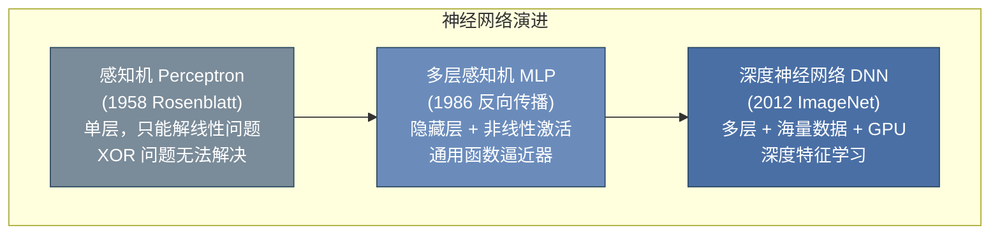
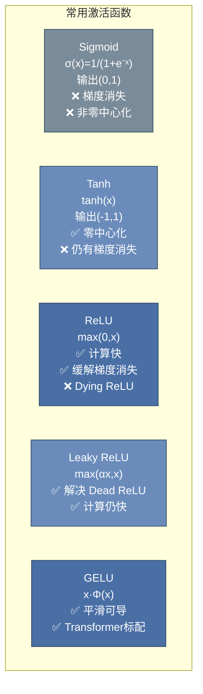
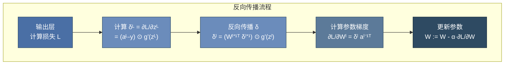
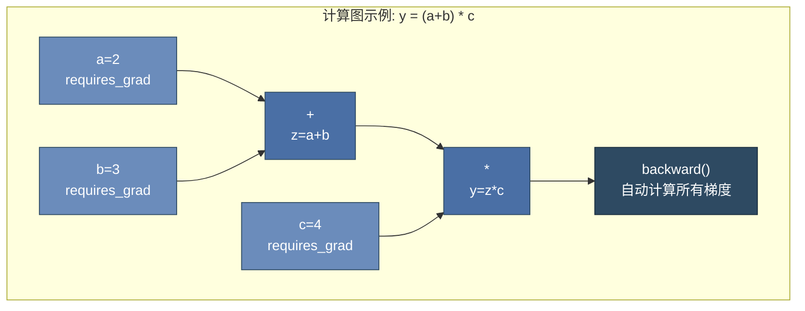
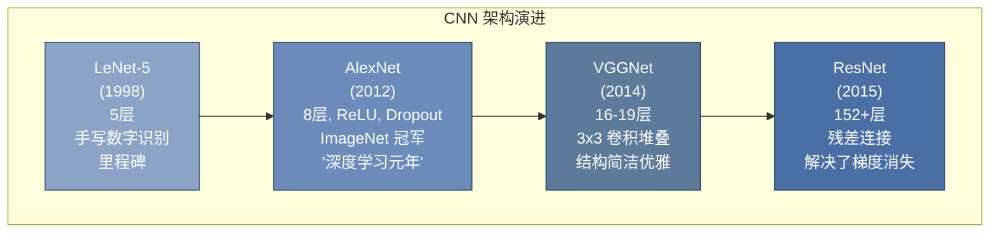
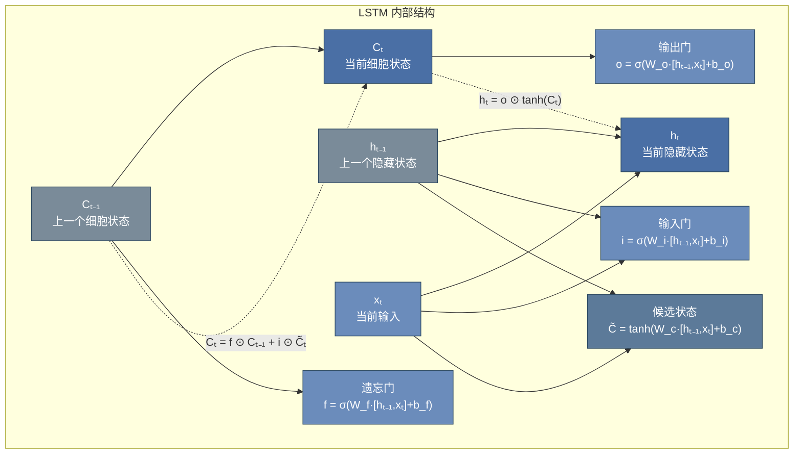

# 第 11 章 深度学习与 PyTorch ⭐⭐⭐⭐⭐

> **面试频率**：极高 | **难度**：⭐⭐⭐⭐ | **实战权重**：极高

深度学习是大模型的技术基石。面试中，PyTorch 核心操作、反向传播原理、CNN/RNN 架构细节、训练优化技巧等知识点的考察贯穿始终。本章从神经网络基础出发，逐步深入到 PyTorch 工程实践。

---

## 11.1 神经网络基础

### 11.1.1 从感知机到多层感知机 (MLP)



**感知机模型**：
$$\hat{y} = \sigma(w^T x + b)$$

**感知机的局限**：单个感知机只能解决线性可分问题。Minsky & Papert (1969) 证明了感知机无法解决 XOR 问题，这促使了多层网络的研究。

**多层感知机（MLP）**：通过在输入和输出之间增加一个或多个隐藏层（Hidden Layer），配合非线性激活函数，可以逼近任意连续函数（Universal Approximation Theorem）。

### 11.1.2 激活函数 ⭐⭐⭐⭐⭐

激活函数引入非线性，是神经网络表达能力的关键。



| 激活函数 | 公式 | 输出范围 | 优点 | 缺点 | 现代使用场景 |
|---------|------|---------|------|------|-------------|
| **Sigmoid** | $\sigma(x) = \frac{1}{1+e^{-x}}$ | $(0, 1)$ | 概率输出 | 梯度消失、非零中心化 | 二分类输出层 |
| **Tanh** | $\tanh(x) = \frac{e^x - e^{-x}}{e^x + e^{-x}}$ | $(-1, 1)$ | 零中心化 | 仍有梯度消失 | RNN 隐藏层 |
| **ReLU** | $\max(0, x)$ | $[0, +\infty)$ | 计算快、缓解梯度消失 | Dying ReLU | CNN 隐藏层 |
| **Leaky ReLU** | $\max(\alpha x, x)$ | $(-\infty, +\infty)$ | 无 Dead ReLU | 需调 $\alpha$ | 通用替代 |
| **GELU** | $x \cdot \Phi(x)$ | $(-\infty, +\infty)$ | 平滑、性能优 | 计算稍复杂 | **Transformer 标配** |
| **Swish** | $x \cdot \sigma(x)$ | $(-\infty, +\infty)$ | 自门控机制 | 计算量较大 | 部分现代架构 |

**GELU 为何成为 Transformer 标配**：
$$\text{GELU}(x) = x \cdot P(X \leq x) = x \cdot \Phi(x) = x \cdot \frac{1}{2}\left[1 + \text{erf}\left(\frac{x}{\sqrt{2}}\right)\right]$$

- 相比 ReLU，GELU 在负数区域有平滑的梯度流，避免了完全截断
- 概率解释：以输入 $x$ 的大小为概率保留该神经元（类似 Dropout 的思想）
- 现代大模型（GPT、BERT、LLaMA）均采用 GELU 或 SiLU (Swish)

### 11.1.3 前向传播与反向传播算法 ⭐⭐⭐⭐⭐

**前向传播（Forward Propagation）**：从输入层逐层计算到输出层，得到预测值。

$$z^{[l]} = W^{[l]} a^{[l-1]} + b^{[l]}$$
$$a^{[l]} = g(z^{[l]})$$

**反向传播（Backpropagation）**：利用链式法则从输出层逐层计算梯度，更新参数。



**链式法则的数学推导**：

对于损失函数 $L$ 关于第 $l$ 层参数 $W^{[l]}$ 的梯度：

$$\frac{\partial L}{\partial W^{[l]}} = \frac{\partial L}{\partial a^{[L]}} \cdot \frac{\partial a^{[L]}}{\partial z^{[L]}} \cdot \frac{\partial z^{[L]}}{\partial a^{[L-1]}} \cdots \frac{\partial a^{[l]}}{\partial z^{[l]}} \cdot \frac{\partial z^{[l]}}{\partial W^{[l]}}$$

简写为：

$$\frac{\partial L}{\partial W^{[l]}} = \delta^{[l]} \cdot (a^{[l-1]})^T$$

其中 $\delta^{[l]} = \frac{\partial L}{\partial z^{[l]}}$ 称为**误差项**。

---

## 11.2 PyTorch 核心 ⭐⭐⭐⭐⭐

### 11.2.1 Tensor 张量运算

```python
import torch
import numpy as np

# ========== Tensor 创建 ==========
# 从列表创建
x = torch.tensor([[1.0, 2.0], [3.0, 4.0]], dtype=torch.float32)

# 特殊 Tensor
zeros = torch.zeros(3, 4)          # 全零
ones = torch.ones(2, 3)            # 全一
rand = torch.rand(3, 3)            # 均匀分布 [0,1)
randn = torch.randn(2, 3)          # 标准正态分布 N(0,1)
arange = torch.arange(0, 10, 2)    # [0, 2, 4, 6, 8]
linspace = torch.linspace(0, 1, 5) # [0, 0.25, 0.5, 0.75, 1]

# GPU 张量（如果可用）
device = torch.device("cuda" if torch.cuda.is_available() else "cpu")
x_gpu = torch.randn(3, 3).to(device)

# ========== 核心运算 ==========
a = torch.randn(2, 3)
b = torch.randn(3, 4)

# 矩阵乘法
c = torch.matmul(a, b)      # 或 a @ b
c = torch.mm(a, b)          # 2D 专用（更快）

# 广播机制
v = torch.randn(3)
a + v                       # (2,3) + (3,) → 广播为 (2,3) + (2,3)

# 维度操作
x = torch.randn(4, 5)
x.sum(dim=1)                # 沿列求和，结果 shape (4,)
x.mean(dim=0, keepdim=True) # 沿行求平均，keepdim=True 保持维度
x.view(2, 10)               # 重塑形状（共享内存）
x.reshape(2, 10)            # 重塑形状（可能拷贝）
x.unsqueeze(0)              # 在 dim=0 增加维度，(4,5) → (1,4,5)
x.squeeze()                 # 移除所有 size=1 的维度

# ========== 与 NumPy 互转 ==========
arr = np.array([1, 2, 3])
t = torch.from_numpy(arr)   # 共享内存
arr2 = t.numpy()            # 共享内存（CPU Tensor）
```

### 11.2.2 Autograd 自动求导 ⭐⭐⭐⭐⭐

PyTorch 的自动求导引擎是深度学习的核心。理解 `requires_grad`、`backward()` 和计算图是面试必考点。

```python
import torch

# ========== 基础求导 ==========
x = torch.tensor(2.0, requires_grad=True)
y = x ** 3 + 2 * x

# 反向传播
y.backward()
print(f"x = {x.item()}, y = {y.item()}")
print(f"dy/dx = {x.grad.item()}")  # 3*x^2 + 2 = 3*4 + 2 = 14

# ========== 多元函数梯度 ==========
x = torch.tensor([1.0, 2.0, 3.0], requires_grad=True)
y = x.sum() * 2  # y = 2*(x1+x2+x3)
y.backward()
print(f"梯度: {x.grad}")  # 每个分量都是 2

# ========== 矩阵梯度 ==========
X = torch.randn(3, 4, requires_grad=True)
W = torch.randn(4, 2, requires_grad=True)
b = torch.randn(2, requires_grad=True)

# 前向: Y = XW + b
Y = torch.matmul(X, W) + b
loss = Y.sum()
loss.backward()

print(f"∂L/∂X shape: {X.grad.shape}")  # (3, 4)
print(f"∂L/∂W shape: {W.grad.shape}")  # (4, 2)
print(f"∂L/∂b shape: {b.grad.shape}")  # (2,)

# ========== 关闭梯度追踪 ==========
# 推理时不需要计算梯度，节省内存和计算
with torch.no_grad():
    pred = torch.matmul(X, W) + b
    # pred.backward()  # 报错！在 no_grad 上下文中无法求导

# 或使用 torch.inference_mode()（PyTorch 1.9+ 推荐）
with torch.inference_mode():
    pred = torch.matmul(X, W) + b
```

**计算图机制**：



### 11.2.3 nn.Module 与模型定义

```python
import torch
import torch.nn as nn
import torch.nn.functional as F

# ========== 自定义模型 ==========
class MLPClassifier(nn.Module):
    """多层感知机分类器 — 展示标准写法"""

    def __init__(self, input_dim, hidden_dim, num_classes, dropout=0.3):
        super(MLPClassifier, self).__init__()
        # 网络层定义
        self.fc1 = nn.Linear(input_dim, hidden_dim)
        self.bn1 = nn.BatchNorm1d(hidden_dim)
        self.dropout1 = nn.Dropout(dropout)

        self.fc2 = nn.Linear(hidden_dim, hidden_dim // 2)
        self.bn2 = nn.BatchNorm1d(hidden_dim // 2)
        self.dropout2 = nn.Dropout(dropout)

        self.fc3 = nn.Linear(hidden_dim // 2, num_classes)

        # 权重初始化
        self._init_weights()

    def _init_weights(self):
        """He 初始化 — ReLU 激活的标准做法"""
        for m in self.modules():
            if isinstance(m, nn.Linear):
                nn.init.kaiming_normal_(m.weight, mode='fan_in', nonlinearity='relu')
                if m.bias is not None:
                    nn.init.zeros_(m.bias)

    def forward(self, x):
        # 第一层
        x = self.fc1(x)
        x = self.bn1(x)
        x = F.relu(x)
        x = self.dropout1(x)

        # 第二层
        x = self.fc2(x)
        x = self.bn2(x)
        x = F.relu(x)
        x = self.dropout2(x)

        # 输出层（无激活，CrossEntropyLoss 内部含 Softmax）
        x = self.fc3(x)
        return x

# 实例化模型
model = MLPClassifier(input_dim=784, hidden_dim=256, num_classes=10)
print(f"参数量: {sum(p.numel() for p in model.parameters()):,}")
print(f"可训练参数量: {sum(p.numel() for p in model.parameters() if p.requires_grad):,}")

# ========== 使用 nn.Sequential 简化 ==========
simple_model = nn.Sequential(
    nn.Linear(784, 256),
    nn.ReLU(),
    nn.Dropout(0.3),
    nn.Linear(256, 128),
    nn.ReLU(),
    nn.Dropout(0.3),
    nn.Linear(128, 10)
)
```

### 11.2.4 DataLoader 与训练流程

```python
import torch
from torch.utils.data import Dataset, DataLoader

# ========== 自定义数据集 ==========
class MyDataset(Dataset):
    def __init__(self, X, y):
        self.X = torch.FloatTensor(X)
        self.y = torch.LongTensor(y)

    def __len__(self):
        return len(self.X)

    def __getitem__(self, idx):
        return self.X[idx], self.y[idx]

# ========== 标准训练循环模板 ==========
def train_epoch(model, dataloader, criterion, optimizer, device):
    model.train()
    total_loss = 0.0
    correct = 0
    total = 0

    for batch_X, batch_y in dataloader:
        batch_X, batch_y = batch_X.to(device), batch_y.to(device)

        # 1. 清零梯度
        optimizer.zero_grad()

        # 2. 前向传播
        outputs = model(batch_X)
        loss = criterion(outputs, batch_y)

        # 3. 反向传播
        loss.backward()

        # 4. 参数更新
        optimizer.step()

        # 统计
        total_loss += loss.item() * batch_X.size(0)
        _, predicted = outputs.max(1)
        correct += predicted.eq(batch_y).sum().item()
        total += batch_y.size(0)

    return total_loss / total, correct / total

@torch.no_grad()
def evaluate(model, dataloader, criterion, device):
    model.eval()
    total_loss = 0.0
    correct = 0
    total = 0

    for batch_X, batch_y in dataloader:
        batch_X, batch_y = batch_X.to(device), batch_y.to(device)
        outputs = model(batch_X)
        loss = criterion(outputs, batch_y)

        total_loss += loss.item() * batch_X.size(0)
        _, predicted = outputs.max(1)
        correct += predicted.eq(batch_y).sum().item()
        total += batch_y.size(0)

    return total_loss / total, correct / total

# ========== 完整训练流程 ==========
from sklearn.datasets import make_classification
from sklearn.model_selection import train_test_split

# 数据
X, y = make_classification(n_samples=5000, n_features=20, n_classes=3,
                           n_informative=15, random_state=42)
X_train, X_test, y_train, y_test = train_test_split(X, y, test_size=0.2)

train_dataset = MyDataset(X_train, y_train)
test_dataset = MyDataset(X_test, y_test)

train_loader = DataLoader(train_dataset, batch_size=64, shuffle=True)
test_loader = DataLoader(test_dataset, batch_size=128, shuffle=False)

# 模型、损失函数、优化器
device = torch.device("cuda" if torch.cuda.is_available() else "cpu")
model = MLPClassifier(input_dim=20, hidden_dim=128, num_classes=3).to(device)
criterion = nn.CrossEntropyLoss()  # 内含 Softmax
optimizer = torch.optim.Adam(model.parameters(), lr=1e-3)

# 训练
for epoch in range(10):
    train_loss, train_acc = train_epoch(model, train_loader, criterion, optimizer, device)
    test_loss, test_acc = evaluate(model, test_loader, criterion, device)
    print(f"Epoch {epoch+1:02d}: Train Loss={train_loss:.4f}, "
          f"Train Acc={train_acc:.4f}, Test Loss={test_loss:.4f}, "
          f"Test Acc={test_acc:.4f}")
```

---

## 11.3 CNN 卷积神经网络 ⭐⭐⭐⭐

### 11.3.1 卷积操作原理

卷积是 CNN 的核心操作，通过可学习的滤波器（卷积核）提取局部特征。

$$\text{Output}[i,j] = \sum_{m} \sum_{n} \text{Input}[i+m, j+n] \cdot \text{Kernel}[m,n]$$

**关键超参数**：

| 超参数 | 含义 | 常见设置 | 对输出的影响 |
|--------|------|---------|-------------|
| **Kernel Size** | 卷积核尺寸 | 3x3, 5x5, 7x7 | 感受野大小 |
| **Stride** | 步长 | 1, 2 | 输出尺寸 = (输入 - 核) / 步长 + 1 |
| **Padding** | 边缘填充 | 0, 1, 'same' | 控制输出尺寸 |
| **Channels** | 通道数 | 32, 64, 128, 256 | 特征图数量 |
| **Dilation** | 空洞率 | 1, 2, 4 | 扩大感受野不增加参数 |

**输出尺寸公式**：
$$H_{out} = \left\lfloor \frac{H_{in} + 2 \times \text{padding} - \text{kernel}}{\text{stride}} \right\rfloor + 1$$

```python
import torch.nn as nn

# 卷积层示例
conv = nn.Conv2d(
    in_channels=3,      # 输入通道（RGB 图像）
    out_channels=64,    # 输出通道（64 个特征图）
    kernel_size=3,      # 3x3 卷积核
    stride=1,           # 步长 1
    padding=1,          # 填充 1，保持尺寸不变
    bias=False          # 配合 BatchNorm 时通常设 False
)

# 输入: (batch_size, 3, 224, 224)
x = torch.randn(8, 3, 224, 224)
out = conv(x)
print(f"输出 shape: {out.shape}")  # (8, 64, 224, 224)

# 计算参数量: out_channels * (in_channels * kernel_h * kernel_w + bias)
params = 64 * (3 * 3 * 3)  # = 1728
print(f"参数量: {params:,}")
```

### 11.3.2 经典架构演进



| 架构 | 年份 | 深度 | 核心创新 | 参数量 |
|------|------|------|---------|--------|
| LeNet-5 | 1998 | 5层 | 卷积 + 池化 + 全连接 | 60K |
| AlexNet | 2012 | 8层 | ReLU、Dropout、GPU 并行 | 60M |
| VGG-16 | 2014 | 16层 | 3x3 小卷积堆叠替代大卷积 | 138M |
| ResNet-50 | 2015 | 50层 | **残差连接 (Skip Connection)** | 25.6M |
| ResNet-152 | 2015 | 152层 | 更深的残差网络 | 60.2M |

**残差连接（Residual Connection）**是深度学习最重要的架构创新之一：

$$y = F(x, \{W_i\}) + x$$

通过引入恒等映射（Identity Mapping），使得梯度可以直接通过跳跃连接回传，有效缓解了深层网络的梯度消失问题。这一思想被后续的 Transformer 架构直接继承。

```python
import torch.nn as nn

class BasicBlock(nn.Module):
    """ResNet 基础残差块"""
    expansion = 1

    def __init__(self, in_channels, out_channels, stride=1):
        super().__init__()
        self.conv1 = nn.Conv2d(in_channels, out_channels, 3, stride, 1, bias=False)
        self.bn1 = nn.BatchNorm2d(out_channels)
        self.conv2 = nn.Conv2d(out_channels, out_channels, 3, 1, 1, bias=False)
        self.bn2 = nn.BatchNorm2d(out_channels)
        self.relu = nn.ReLU(inplace=True)

        # 下采样层（当维度不匹配时）
        self.shortcut = nn.Sequential()
        if stride != 1 or in_channels != out_channels:
            self.shortcut = nn.Sequential(
                nn.Conv2d(in_channels, out_channels, 1, stride, bias=False),
                nn.BatchNorm2d(out_channels)
            )

    def forward(self, x):
        out = self.relu(self.bn1(self.conv1(x)))
        out = self.bn2(self.conv2(out))
        out += self.shortcut(x)  # 残差连接
        out = self.relu(out)
        return out
```

---

## 11.4 RNN 循环神经网络 ⭐⭐⭐⭐

### 11.4.1 RNN 基础与梯度问题

RNN 通过隐藏状态传递序列信息：

$$h_t = \tanh(W_{hh} h_{t-1} + W_{xh} x_t + b_h)$$
$$\hat{y}_t = W_{hy} h_t + b_y$$

**RNN 的根本缺陷——梯度消失/爆炸**：

在反向传播时，隐藏状态的梯度连乘：

$$\frac{\partial h_T}{\partial h_1} = \prod_{t=2}^T \frac{\partial h_t}{\partial h_{t-1}} = \prod_{t=2}^T W_{hh}^T \cdot \text{diag}(\tanh'(\cdot))$$

当 $T$ 很大时，若 $||W_{hh}|| < 1$，梯度指数级衰减（消失）；若 $||W_{hh}|| > 1$，梯度指数级增长（爆炸）。这导致 RNN 难以建模长距离依赖关系。

### 11.4.2 LSTM 长短期记忆网络 ⭐⭐⭐⭐⭐

LSTM 通过引入**门控机制**（Gating Mechanism）和**细胞状态**（Cell State）解决梯度消失问题。



**LSTM 核心公式**：

$$f_t = \sigma(W_f \cdot [h_{t-1}, x_t] + b_f) \quad \text{(遗忘门)}$$
$$i_t = \sigma(W_i \cdot [h_{t-1}, x_t] + b_i) \quad \text{(输入门)}$$
$$\tilde{C}_t = \tanh(W_C \cdot [h_{t-1}, x_t] + b_C) \quad \text{(候选状态)}$$
$$C_t = f_t \odot C_{t-1} + i_t \odot \tilde{C}_t \quad \text{(细胞状态更新)}$$
$$o_t = \sigma(W_o \cdot [h_{t-1}, x_t] + b_o) \quad \text{(输出门)}$$
$$h_t = o_t \odot \tanh(C_t) \quad \text{(隐藏状态输出)}$$

**LSTM 解决梯度消失的原理**：
- 细胞状态 $C_t$ 的更新是**加性**的（$f_t \odot C_{t-1} + i_t \odot \tilde{C}_t$），而非 RNN 的乘性累积
- 遗忘门 $f_t \approx 1$ 时，梯度可以几乎无损地沿细胞状态反向传播，形成**梯度高速公路**

### 11.4.3 GRU ⭐⭐⭐⭐

GRU（Gated Recurrent Unit）是 LSTM 的简化版本，合并了细胞状态和隐藏状态，减少了参数量。

$$z_t = \sigma(W_z \cdot [h_{t-1}, x_t]) \quad \text{(更新门)}$$
$$r_t = \sigma(W_r \cdot [h_{t-1}, x_t]) \quad \text{(重置门)}$$
$$\tilde{h}_t = \tanh(W \cdot [r_t \odot h_{t-1}, x_t]) \quad \text{(候选状态)}$$
$$h_t = (1 - z_t) \odot h_{t-1} + z_t \odot \tilde{h}_t \quad \text{(状态更新)}$$

**LSTM vs GRU 对比**：

| 特性 | LSTM | GRU |
|------|------|-----|
| 门控数量 | 3 个（遗忘/输入/输出） | 2 个（更新/重置） |
| 状态 | 细胞状态 $C_t$ + 隐藏状态 $h_t$ | 只有隐藏状态 $h_t$ |
| 参数量 | 更多 | 更少（约 25% 减少） |
| 训练速度 | 较慢 | 较快 |
| 性能 | 数据充足时略优 | 数据较少时可能更优 |
| 适用场景 | 长序列、高精度需求 | 资源受限、快速实验 |

### 11.4.4 Attention 机制的引入 ⭐⭐⭐⭐⭐

RNN/LSTM 的**根本局限**：序列计算必须按顺序进行，无法并行；长距离依赖仍受限。

**Attention 的核心思想**：对于每个输出位置，动态地"关注"输入序列中不同位置的信息，权重由模型自动学习。

$$\text{Attention}(Q, K, V) = \text{softmax}\left(\frac{QK^T}{\sqrt{d_k}}\right)V$$

这一机制将在第 12 章中深入展开，它是 Transformer 架构的灵魂。

```python
import torch.nn as nn

# PyTorch 内置 LSTM
lstm = nn.LSTM(
    input_size=128,   # 输入特征维度
    hidden_size=256,  # 隐藏状态维度
    num_layers=2,     # LSTM 层数
    batch_first=True, # 输入格式 (batch, seq, feature)
    dropout=0.3,      # 层间 dropout
    bidirectional=True # 双向 LSTM
)

# 输入: (batch_size, seq_len, input_size)
x = torch.randn(32, 50, 128)
output, (hidden, cell) = lstm(x)

# output: (32, 50, 512) — 双向，hidden_size*2
# hidden: (4, 32, 256) — num_layers*2, batch, hidden_size
print(f"输出 shape: {output.shape}")
```

---

## 11.5 深度学习训练技巧 ⭐⭐⭐⭐

### 11.5.1 权重初始化

不恰当的初始化会导致训练失败（梯度消失或爆炸）。

| 初始化方法 | 公式 | 适用激活函数 | 原理 |
|-----------|------|-------------|------|
| **Xavier/Glorot** | $W \sim U[-\sqrt{\frac{6}{n_{in}+n_{out}}}, \sqrt{\frac{6}{n_{in}+n_{out}}}]$ | Tanh, Sigmoid | 保持前向/反向传播方差一致 |
| **He/Kaiming** | $W \sim N(0, \sqrt{\frac{2}{n_{in}}})$ | **ReLU** | 考虑 ReLU 截断负值的影响 |
| **Orthogonal** | 正交初始化 | RNN | 保持梯度范数稳定 |

```python
# PyTorch 自动初始化
# nn.Linear 默认使用 Kaiming Uniform (for ReLU)
# nn.Conv2d 默认使用 Kaiming Uniform

# 手动初始化
def init_weights(m):
    if isinstance(m, nn.Linear):
        nn.init.kaiming_normal_(m.weight, nonlinearity='relu')
        if m.bias is not None:
            nn.init.zeros_(m.bias)
    elif isinstance(m, nn.Conv2d):
        nn.init.kaiming_normal_(m.weight, mode='fan_out', nonlinearity='relu')

model.apply(init_weights)
```

### 11.5.2 学习率调度 ⭐⭐⭐⭐⭐

| 调度策略 | 原理 | 适用场景 |
|---------|------|---------|
| **Step Decay** | 固定间隔衰减（如每 30 epoch ×0.1） | 通用 |
| **Cosine Annealing** | 余弦曲线衰减 | 需要精细收敛 |
| **ReduceLROnPlateau** | 验证集性能停滞时衰减 | 自适应调整 |
| **Warmup + Cosine** | 先线性增大再余弦衰减 | **Transformer 训练标配** |
| **OneCycleLR** | 先升后降的单周期 | 快速收敛 |

```python
from torch.optim.lr_scheduler import (StepLR, CosineAnnealingLR,
                                       ReduceLROnPlateau, OneCycleLR)

optimizer = torch.optim.Adam(model.parameters(), lr=1e-3)

# 方式1: Step Decay
scheduler = StepLR(optimizer, step_size=30, gamma=0.1)

# 方式2: Reduce on Plateau（推荐通用场景）
scheduler = ReduceLROnPlateau(optimizer, mode='min', patience=5, factor=0.5)

# 方式3: Cosine Annealing with Warmup（Transformer 训练）
scheduler = torch.optim.lr_scheduler.CosineAnnealingWarmRestarts(
    optimizer, T_0=10, T_mult=2
)

# 训练循环中使用
for epoch in range(epochs):
    train_loss, _ = train_epoch(...)
    val_loss, _ = evaluate(...)
    scheduler.step(val_loss)  # ReduceLROnPlateau 需要传入 metrics
```

### 11.5.3 正则化技术

| 技术 | 实现 | 原理 | 注意点 |
|------|------|------|--------|
| **L2 正则化 (Weight Decay)** | `optimizer = Adam(..., weight_decay=1e-4)` | 惩罚大权重 | AdamW 将 decay 与梯度更新解耦 |
| **Dropout** | `nn.Dropout(p=0.5)` | 随机丢弃神经元 | 推理时自动关闭，`eval()` 模式 |
| **Batch Normalization** | `nn.BatchNorm1d/2d` | 规范化层间分布 | 允许更大学习率，有正则化效果 |
| **Layer Normalization** | `nn.LayerNorm` | 样本内归一化 | **Transformer 标配**，适合变长序列 |
| **Label Smoothing** | `CrossEntropyLoss(label_smoothing=0.1)` | 软化硬标签 | 防止过度自信，提升泛化 |
| **Early Stopping** | 手动实现 | 验证集不改善则停止 | 配合 checkpoint 保存最优模型 |

**BatchNorm vs LayerNorm**（面试高频对比）：

| 维度 | BatchNorm | LayerNorm |
|------|-----------|-----------|
| 归一化维度 | 跨 batch（N维度），同 channel | 跨 feature 维度，同 sample |
| 计算均值/方差 | 依赖 batch 统计 | 独立计算，不依赖 batch |
| 适合场景 | CNN（固定尺寸输入） | RNN/Transformer（变长序列） |
| 训练和推理 | 训练用 batch 统计，推理用 running stats | 无区别 |
| Transformer 中 | ❌ | ✅（Pre-LN 架构） |

### 11.5.4 混合精度训练 (FP16/BF16) ⭐⭐⭐⭐

混合精度训练通过在前向/反向传播中使用半精度浮点数（FP16/BF16），大幅减少显存占用并加速计算。

| 数据类型 | 存储 | 指数位 | 尾数位 | 范围 | 精度 | 适用 |
|---------|------|--------|--------|------|------|------|
| FP32 | 32 bit | 8 | 23 | 大 | 高 | 参数更新 |
| FP16 | 16 bit | 5 | 10 | 小 | 低 | 前向/反向 |
| **BF16** | 16 bit | **8** | 7 | 大 | 较低 | **现代 GPU 推荐** |

BF16 与 FP16 的关键区别：BF16 保留了 8 位指数（与 FP32 相同），因此动态范围与 FP32 相当，不易溢出；FP16 指数位只有 5 位，容易上溢/下溢，需要**Loss Scaling**技巧。

```python
from torch.cuda.amp import autocast, GradScaler

# 混合精度训练（PyTorch）
scaler = GradScaler()  # 梯度缩放，防止 FP16 下溢

for epoch in range(epochs):
    for batch_X, batch_y in train_loader:
        batch_X, batch_y = batch_X.to(device), batch_y.to(device)

        optimizer.zero_grad()

        # autocast 自动选择合适的精度
        with autocast():
            outputs = model(batch_X)
            loss = criterion(outputs, batch_y)

        # 缩放梯度后反向传播
        scaler.scale(loss).backward()
        scaler.step(optimizer)
        scaler.update()
```

### 11.5.5 优化器选择指南

| 优化器 | 自适应学习率 | 内存开销 | 特点 | 推荐场景 |
|--------|------------|---------|------|---------|
| **SGD + Momentum** | ❌ | 低 | 收敛稳定，需调学习率 | 大规模数据、最终精调 |
| **Adam** | ✅ | 中（存储一/二阶矩） | 默认选择，收敛快 | 通用场景、实验阶段 |
| **AdamW** | ✅ | 中 | **权重衰减与梯度更新解耦** | **Transformer 训练标配** |
| **LARS/LAMB** | ✅ | 高 | 分层自适应学习率 | 大批量训练 |

**Adam vs AdamW**：
- **Adam** 的权重衰减 $L_2$ 正则与梯度更新耦合，自适应学习率会削弱正则化效果
- **AdamW** 将权重衰减直接应用于参数更新步骤（$w = w - \lambda w - \alpha \cdot \text{adam\_grad}$），正则化效果更纯粹
- 现代大模型训练（BERT、GPT 系列）**统一使用 AdamW**

```python
# AdamW — Transformer 训练的标准配置
optimizer = torch.optim.AdamW(
    model.parameters(),
    lr=1e-4,           # 学习率（BERT-base 通常 2e-5 ~ 5e-5）
    betas=(0.9, 0.999),
    eps=1e-8,
    weight_decay=0.01  # 权重衰减系数
)
```

---

## 11.6 本章面试题精讲 🎯

### 🎯 面试题 1：反向传播算法的核心是什么？

**答案**：反向传播的核心是**链式法则**。从输出层开始，将损失函数对各层参数的梯度逐层向前传递。每一层的梯度由两部分组成：从后一层传来的上游梯度 × 本层激活函数的导数 × 本层输入。这使得梯度计算可以模块化，每个节点只需知道自身的局部导数即可参与全局梯度计算。

### 🎯 面试题 2：ReLU 为什么比 Sigmoid/Tanh 好？又有什么问题？

**答案**：
- **优势**：
  1. 计算简单，无指数运算，速度快
  2. 在正区间梯度恒为 1，有效缓解梯度消失
  3. 具有稀疏激活特性，部分神经元输出为 0
- **问题（Dying ReLU）**：当输入持续为负时，梯度恒为 0，神经元不再更新。解决方案：Leaky ReLU、PReLU、ELU 等变体。

### 🎯 面试题 3：BatchNorm 的作用是什么？训练和测试时的行为有何不同？

**答案**：
- **作用**：(1) 缓解内部协变量偏移，稳定训练；(2) 允许使用更大学习率；(3) 有轻微正则化效果
- **训练时**：使用当前 batch 的均值和方差进行归一化
- **测试时**：使用训练过程中累积的 running mean 和 running variance（通过滑动平均更新），不再依赖 batch 统计

### 🎯 面试题 4：LSTM 如何解决 RNN 的梯度消失问题？

**答案**：LSTM 引入**细胞状态 $C_t$** 作为信息传输的主干道，其更新是**加性的**（$C_t = f_t \odot C_{t-1} + i_t \odot \tilde{C}_t$），而非 RNN 隐藏状态的乘性累积。当遗忘门 $f_t \approx 1$ 时，梯度可以通过细胞状态几乎无损地反向传播，形成"梯度高速公路"。输出门 $o_t$ 控制 $C_t$ 到 $h_t$ 的信息流，允许模型选择性地输出信息。

### 🎯 面试题 5：为什么 Transformer 逐渐取代了 RNN/LSTM？

**答案**：
1. **并行计算**：RNN 必须按时间步串行计算，Transformer 可对所有位置并行计算 Attention
2. **长距离依赖**：Self-Attention 直接计算任意两个位置的关系，路径长度为 $O(1)$；RNN 为 $O(T)$
3. **可扩展性**：Transformer 架构更适合大规模数据和参数扩展（Scaling Law）
4. **硬件友好**：矩阵运算可高效利用 GPU/TPU 的并行计算能力

### 🎯 面试题 6：混合精度训练中，FP16 和 BF16 的区别？

**答案**：
- **FP16**：5 位指数 + 10 位尾数，动态范围小（~$10^{-8}$ 到 $10^5$），精度高但容易梯度溢出/下溢，需要 Loss Scaling
- **BF16**：8 位指数 + 7 位尾数，动态范围与 FP32 相当（~$10^{-38}$ 到 $10^{38}$），不易溢出，无需 Loss Scaling，但精度较低
- **选择建议**：现代 GPU（A100+）支持 BF16，优先使用；旧设备用 FP16 + GradScaler

### 🎯 面试题 7：AdamW 与 Adam 的区别？为什么大模型用 AdamW？

**答案**：Adam 将 L2 正则（weight decay）包含在梯度计算中，自适应学习率会缩放梯度，导致正则化效果被削弱。AdamW 将 weight decay 与梯度更新解耦，直接在参数更新步骤中减去衰减项（$w = w - \lambda w - \alpha \cdot \text{adam\_grad}$），使得正则化效果不受自适应学习率影响，更纯粹有效。

---

## 11.7 本章速查表

| 概念 | 关键点 |
|------|--------|
| **反向传播** | 链式法则 + 计算图自动求导 |
| **激活函数选择** | ReLU（CNN）、GELU（Transformer）、Sigmoid（二分类输出） |
| **权重初始化** | Kaiming He（ReLU）、Xavier（Tanh/Sigmoid） |
| **学习率调度** | Warmup + Cosine（Transformer）、ReduceLROnPlateau（通用） |
| **正则化** | Dropout + Weight Decay + LayerNorm（Transformer） |
| **归一化** | BatchNorm（CNN）、LayerNorm（Transformer/序列） |
| **混合精度** | autocast + GradScaler（FP16）、直接 BF16（A100+） |
| **优化器** | AdamW（Transformer 标配）、SGD（大规模精调） |
| **CNN 输出尺寸** | $H_{out} = \lfloor(H + 2P - K)/S\rfloor + 1$ |
| **残差连接** | $y = F(x) + x$，解决梯度消失 |
| **LSTM 门控** | 遗忘门 + 输入门 + 输出门 + 细胞状态 |

---

## 📚 相关章节

- [[10_机器学习基础]] — 过拟合/欠拟合、正则化、模型评估等理论基础
- [[12_Transformer与大模型原理]] — Attention 机制、Transformer 架构，深度学习的前沿方向
