# 第 12 章 Transformer 与大模型原理 ⭐⭐⭐⭐⭐

> **面试频率**：极高（几乎 100% 必考）| **难度**：⭐⭐⭐⭐⭐ | **理论权重**：最高
>
> **🆕 2026年更新**：本章已全面更新，新增 12.8 节"2026年大模型格局演进"，涵盖 GPT-5.5、Claude 4.7、DeepSeek-R1、Gemini 3.0 最新架构，以及 6 道 🎯🆕 标记的 2026 年面试高频题。

Transformer 是大语言模型的核心技术基石。从 2017 年 "Attention Is All You Need" 论文发表至今，Transformer 架构统治了 NLP、计算机视觉、多模态等几乎所有深度学习领域。本章是全教程最重要的一章，每个知识点都可能直接决定面试成败。

---

## 12.1 从 RNN 到 Attention ⭐⭐⭐⭐

### 12.1.1 RNN 的序列瓶颈

RNN 及其变体（LSTM、GRU）在处理序列时面临一个根本性的结构缺陷：**顺序计算依赖**。第 $t$ 步的计算必须等待第 $t-1$ 步完成，形成了无法打破的串行链条。

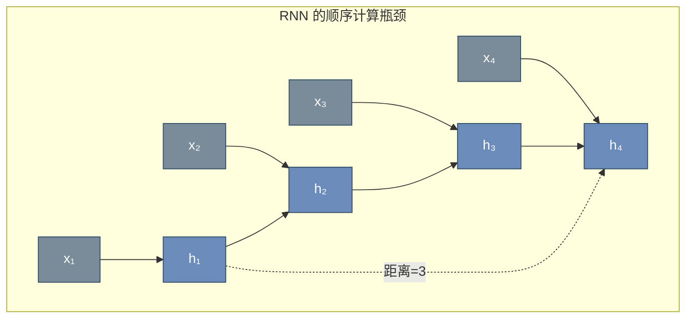

**RNN 的核心问题**：

| 问题 | 表现 | 根本原因 |
|------|------|---------|
| **无法并行** | $h_t$ 依赖 $h_{t-1}$，无法 GPU 并行加速 | 链式计算结构 |
| **长距离依赖困难** | 相距较远 token 的信息难以有效传递 | 梯度需经过多层传递 |
| **信息瓶颈** | 整个序列信息被压缩到固定维度 $h_T$ | 编码器-解码器架构的瓶颈 |

### 12.1.2 Attention 的革命性思想

Attention 机制源于 2014 年 Bahdanau 等人提出的**序列到序列注意力**，其核心突破是：

> 让解码器在生成每个输出时，动态地"关注"输入序列的不同部分，而不是依赖单一的上下文向量。

Transformer 将这一思想推向极致：**完全抛弃 RNN，仅用 Attention 机制建模序列依赖**。

---

## 12.2 Self-Attention 自注意力机制 ⭐⭐⭐⭐⭐

Self-Attention（自注意力）是 Transformer 的灵魂。它允许序列中的每个位置都能"关注"序列中所有其他位置，并自动学习关注的权重。

### 12.2.1 核心直觉

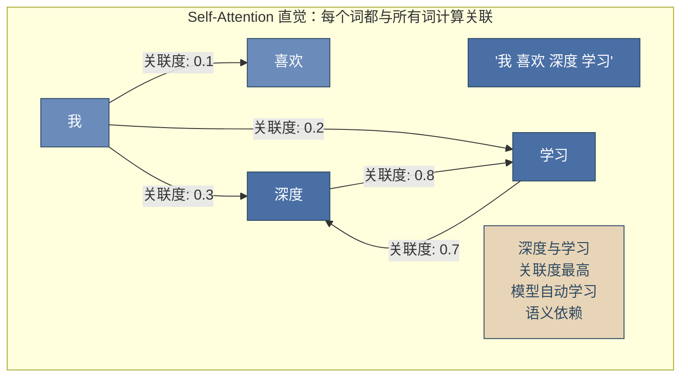

### 12.2.2 Q/K/V 机制详解 ⭐⭐⭐⭐⭐

Self-Attention 通过三个可学习的投影矩阵 $W^Q, W^K, W^V$ 将输入映射为 **Query**、**Key**、**Value** 三个向量。

**类比理解**：
- **Query (Q)** = "我有什么问题/需求" — 当前位置发起的查询
- **Key (K)** = "我有什么信息/特征" — 每个位置的内容标识
- **Value (V)** = "我的具体内容是什么" — 每个位置的实际信息

**计算过程**：

$$Q = X W^Q, \quad K = X W^K, \quad V = X W^V$$

其中 $X \in \mathbb{R}^{n \times d_{model}}$ 是输入序列的嵌入矩阵，$n$ 是序列长度，$d_{model}$ 是模型维度。

### 12.2.3 Scaled Dot-Product Attention 公式推导 ⭐⭐⭐⭐⭐

**完整的 Attention 计算公式**：

$$\text{Attention}(Q, K, V) = \text{softmax}\left(\frac{QK^T}{\sqrt{d_k}}\right)V$$

**分步拆解**：

**Step 1 — 计算注意力得分矩阵（相似度）**

$$S = QK^T \in \mathbb{R}^{n \times n}$$

$S_{ij}$ 表示第 $i$ 个 Query 与第 $j$ 个 Key 的点积相似度。这是整个计算中**最核心的步骤**。

**Step 2 — 缩放（Scaling）**

$$S_{scaled} = \frac{S}{\sqrt{d_k}}$$

**🎯 为什么必须除以 $\sqrt{d_k}$？**

当 $d_k$ 较大时，两个随机向量的点积方差随 $d_k$ 线性增长：

$$\text{Var}(q \cdot k) = \text{Var}\left(\sum_{i=1}^{d_k} q_i k_i\right) = \sum_{i=1}^{d_k} \text{Var}(q_i k_i) = d_k \cdot \sigma^2$$

因此点积的数值量级约为 $O(\sqrt{d_k})$。如果不缩放，Softmax 输入会进入**梯度极小的饱和区**（极值接近 0 或 1），导致梯度消失。

**Step 3 — Softmax 归一化**

$$A = \text{softmax}(S_{scaled})$$

$A \in \mathbb{R}^{n \times n}$ 是**注意力权重矩阵**，每行之和为 1，表示每个位置对其他位置的关注程度。

**Step 4 — 加权求和**

$$\text{Output} = AV \in \mathbb{R}^{n \times d_v}$$

### 12.2.4 矩阵运算完整图解 ⭐⭐⭐⭐⭐

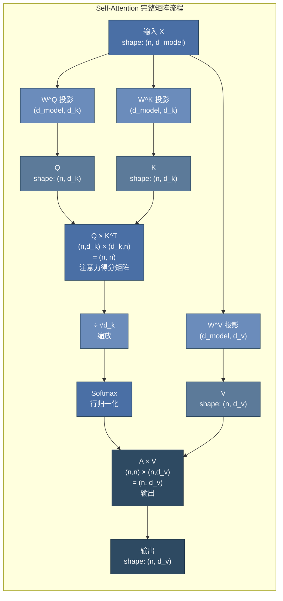

**时间复杂度分析**：

| 操作 | 计算量 | 复杂度 |
|------|--------|--------|
| $Q, K, V$ 投影 | $3 \times n \times d_{model} \times d_k$ | $O(n \cdot d^2)$ |
| $QK^T$ | $n \times n \times d_k$ | $O(n^2 \cdot d)$ |
| Softmax | $n \times n$ | $O(n^2)$ |
| $AV$ | $n \times n \times d_v$ | $O(n^2 \cdot d)$ |
| **总计** | — | **$O(n^2 \cdot d)$** |

Self-Attention 的复杂度瓶颈在于序列长度 $n$ 的**平方关系** — 这也是长上下文优化的核心挑战。

### 12.2.5 PyTorch 实现

```python
import torch
import torch.nn as nn
import math

class ScaledDotProductAttention(nn.Module):
    """Scaled Dot-Product Attention 的完整实现"""

    def __init__(self, dropout=0.1):
        super().__init__()
        self.dropout = nn.Dropout(dropout)
        self.scale = None  # 将在 forward 中设置

    def forward(self, Q, K, V, mask=None):
        """
        Args:
            Q: (batch, n, d_k) - Query
            K: (batch, n, d_k) - Key
            V: (batch, n, d_v) - Value
            mask: (batch, n, n) - 可选的掩码矩阵
        Returns:
            output: (batch, n, d_v)
            attn_weights: (batch, n, n) - 用于可视化
        """
        d_k = Q.size(-1)

        # Step 1: Q × K^T
        scores = torch.matmul(Q, K.transpose(-2, -1))  # (batch, n, n)

        # Step 2: Scale
        scores = scores / math.sqrt(d_k)

        # Step 3: Mask（可选 — Decoder 中必须）
        if mask is not None:
            scores = scores.masked_fill(mask == 0, float('-inf'))

        # Step 4: Softmax
        attn_weights = torch.softmax(scores, dim=-1)  # (batch, n, n)
        attn_weights = self.dropout(attn_weights)

        # Step 5: 加权 V
        output = torch.matmul(attn_weights, V)  # (batch, n, d_v)

        return output, attn_weights


# ========== 验证计算 ==========
batch_size, seq_len, d_k, d_v = 2, 4, 8, 8
Q = torch.randn(batch_size, seq_len, d_k)
K = torch.randn(batch_size, seq_len, d_k)
V = torch.randn(batch_size, seq_len, d_v)

attn = ScaledDotProductAttention()
output, weights = attn(Q, K, V)

print(f"Q shape: {Q.shape}")
print(f"K shape: {K.shape}")
print(f"V shape: {V.shape}")
print(f"注意力权重 shape: {weights.shape}")
print(f"输出 shape: {output.shape}")
print(f"权重行和: {weights[0].sum(dim=-1)}")  # 应全为 1.0
```

---

## 12.3 Multi-Head Attention ⭐⭐⭐⭐⭐

### 12.3.1 核心思想

Multi-Head Attention 的核心洞察：

> 单次 Attention 只捕捉一种关联模式。使用多组独立的 Q/K/V 投影，让模型同时在不同"子空间"中关注不同类型的信息。

类比 CNN 的多通道卷积：每个注意力头学习不同的特征模式（语法关系、语义关联、指代关系等）。

### 12.3.2 计算流程

$$\text{MultiHead}(Q, K, V) = \text{Concat}(\text{head}_1, ..., \text{head}_h) W^O$$

$$\text{where } \text{head}_i = \text{Attention}(QW_i^Q, KW_i^K, VW_i^V)$$

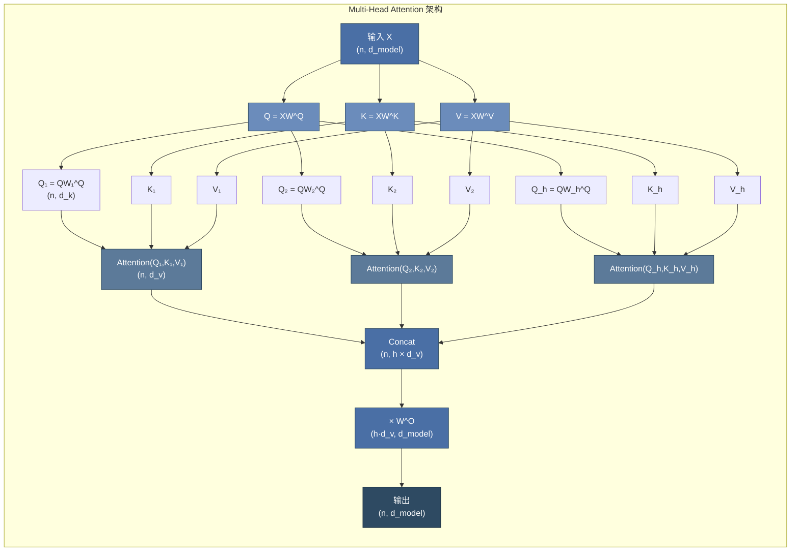

**🎯 为什么需要 Multi-Head？**

1. **多子空间并行**：每个头在不同投影空间中学习，可捕捉不同粒度和类型的依赖关系
2. **增加表达能力**：单头的 $d_k = d_{model}$，多头后每个头的 $d_k = d_{model}/h$，在相同参数量下增加多样性
3. **便于并行计算**：所有头的 Attention 计算可以并行执行

**标准超参数设置**：

| 模型 | $d_{model}$ | heads (h) | $d_k = d_v$ | 每层参数量 |
|------|------------|-----------|-------------|-----------|
| BERT-Base | 768 | 12 | 64 | $4 \times 768^2 = 2.36M$ |
| BERT-Large | 1024 | 16 | 64 | $4 \times 1024^2 = 4.19M$ |
| GPT-3 175B | 12288 | 96 | 128 | $4 \times 12288^2 = 603M$ |

### 12.3.3 PyTorch 实现

```python
class MultiHeadAttention(nn.Module):
    """Multi-Head Attention 完整实现"""

    def __init__(self, d_model, num_heads, dropout=0.1):
        super().__init__()
        assert d_model % num_heads == 0, "d_model 必须被 num_heads 整除"

        self.d_model = d_model
        self.num_heads = num_heads
        self.d_k = d_model // num_heads  # 每个头的维度

        # 线性投影层: W^Q, W^K, W^V
        self.W_Q = nn.Linear(d_model, d_model)
        self.W_K = nn.Linear(d_model, d_model)
        self.W_V = nn.Linear(d_model, d_model)

        # 输出投影: W^O
        self.W_O = nn.Linear(d_model, d_model)

        self.attention = ScaledDotProductAttention(dropout)
        self.dropout = nn.Dropout(dropout)
        self.layer_norm = nn.LayerNorm(d_model)

    def split_heads(self, x, batch_size):
        """
        将 (batch, n, d_model) 拆分为 (batch, h, n, d_k)
        便于并行计算多个头的 Attention
        """
        x = x.view(batch_size, -1, self.num_heads, self.d_k)
        return x.transpose(1, 2)  # (batch, h, n, d_k)

    def forward(self, Q, K, V, mask=None):
        batch_size = Q.size(0)

        # 1. 线性投影
        Q = self.W_Q(Q)  # (batch, n, d_model)
        K = self.W_K(K)
        V = self.W_V(V)

        # 2. 拆分为多头
        Q = self.split_heads(Q, batch_size)  # (batch, h, n, d_k)
        K = self.split_heads(K, batch_size)
        V = self.split_heads(V, batch_size)

        # 3. 缩放点积注意力
        attn_output, attn_weights = self.attention(Q, K, V, mask)
        # attn_output: (batch, h, n, d_k)

        # 4. 合并多头
        attn_output = attn_output.transpose(1, 2).contiguous()
        attn_output = attn_output.view(batch_size, -1, self.d_model)

        # 5. 输出投影
        output = self.W_O(attn_output)
        output = self.dropout(output)

        return output, attn_weights


# ========== 验证 ==========
d_model, num_heads = 512, 8
mha = MultiHeadAttention(d_model, num_heads)

batch_size, seq_len = 2, 10
x = torch.randn(batch_size, seq_len, d_model)

output, weights = mha(x, x, x)
print(f"输入 shape: {x.shape}")
print(f"输出 shape: {output.shape}")  # (2, 10, 512)
print(f"参数量: {sum(p.numel() for p in mha.parameters()):,}")
```

---

## 12.4 Transformer 完整架构 ⭐⭐⭐⭐⭐

### 12.4.1 Encoder-Decoder 整体架构

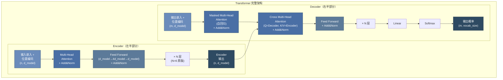

### 12.4.2 编码器 (Encoder)

每个 Encoder Layer 包含两个子层：

1. **Multi-Head Self-Attention**：编码器对自身输入序列计算注意力
2. **Position-wise FFN**：对每个位置独立应用相同的全连接网络

$$\text{FFN}(x) = \max(0, xW_1 + b_1)W_2 + b_2$$

FFN 中间层维度为 $4 \times d_{model}$，即先升维再降维，增加非线性表达能力。

### 12.4.3 解码器 (Decoder)

每个 Decoder Layer 包含三个子层：

1. **Masked Multi-Head Self-Attention**：自回归掩码，防止看到未来位置
2. **Cross Attention**：$Q$ 来自 Decoder，$K$ 和 $V$ 来自 Encoder 输出
3. **Position-wise FFN**：同 Encoder

### 12.4.4 位置编码 (Positional Encoding) ⭐⭐⭐⭐⭐

由于 Self-Attention 是**置换等变的**（permutation invariant），即调换输入顺序不影响输出，模型无法感知序列位置信息。位置编码为每个位置注入唯一标识。

**原版正弦位置编码**：

$$PE_{(pos, 2i)} = \sin\left(\frac{pos}{10000^{2i/d_{model}}}\right)$$

$$PE_{(pos, 2i+1)} = \cos\left(\frac{pos}{10000^{2i/d_{model}}}\right)$$

**特性分析**：
- 每个位置有唯一的编码值
- 位置 $pos+k$ 的编码可由位置 $pos$ 的编码线性表示（利用三角恒等式）
- 可外推到训练时未见过的更长序列（但效果有限）

**现代替代方案 — RoPE (Rotary Position Embedding)** ⭐⭐⭐⭐⭐：

RoPE 是当前大模型（LLaMA、Qwen、Baichuan 等）的标配位置编码。

核心思想：将位置信息编码为 Query 和 Key 向量的**旋转矩阵乘法**，而非直接加到嵌入上。

$$f(q, m) = q \cdot e^{i m \theta} = R_{\Theta,m} \cdot q$$

其中 $R_{\Theta,m}$ 是旋转矩阵，将二维子空间旋转 $m \cdot \theta$ 角度。

**RoPE 的优势**：
1. **相对位置感知**：注意力得分 $q_m^T k_n$ 仅依赖于相对距离 $m-n$，符合自然语言的平移不变性
2. **长序列外推**：可通过调整旋转基实现更长上下文（YaRN、NTK-aware 等技巧）
3. **与 Attention 机制深度融合**：位置信息直接参与 Q/K 计算，而非作为加法偏置

```python
import torch
import math

class SinusoidalPositionalEncoding(nn.Module):
    """原版正弦位置编码"""

    def __init__(self, d_model, max_len=5000, dropout=0.1):
        super().__init__()
        self.dropout = nn.Dropout(dropout)

        pe = torch.zeros(max_len, d_model)
        position = torch.arange(0, max_len, dtype=torch.float).unsqueeze(1)

        div_term = torch.exp(
            torch.arange(0, d_model, 2).float() *
            (-math.log(10000.0) / d_model)
        )

        pe[:, 0::2] = torch.sin(position * div_term)
        pe[:, 1::2] = torch.cos(position * div_term)

        self.register_buffer('pe', pe.unsqueeze(0))  # (1, max_len, d_model)

    def forward(self, x):
        x = x + self.pe[:, :x.size(1), :]
        return self.dropout(x)
```

### 12.4.5 残差连接与层归一化 (Pre-LN vs Post-LN) ⭐⭐⭐⭐⭐

**残差连接（Residual Connection）**：

$$\text{Output} = \text{LayerNorm}(x + \text{Sublayer}(x))$$

作用：缓解梯度消失，使深层网络可训练（继承自 ResNet 的思想）。

**Pre-LN vs Post-LN 之争**：

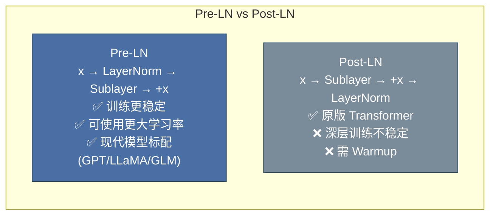

| 特性 | Post-LN（原版） | Pre-LN（现代） |
|------|----------------|---------------|
| 归一化位置 | 子层输出之后 | 子层输入之前 |
| 训练稳定性 | 较差，深层易崩溃 | 好 |
| 学习率 | 需较小学习率 + Warmup | 可使用较大学习率 |
| Warmup 依赖 | 强依赖 | 减少依赖 |
| 代表模型 | 原版 Transformer, BERT | GPT-3/4, LLaMA, T5 |

### 12.4.6 掩码机制：Padding Mask 与 Causal Mask ⭐⭐⭐⭐⭐

掩码是 Transformer 中控制注意力范围的关键机制。

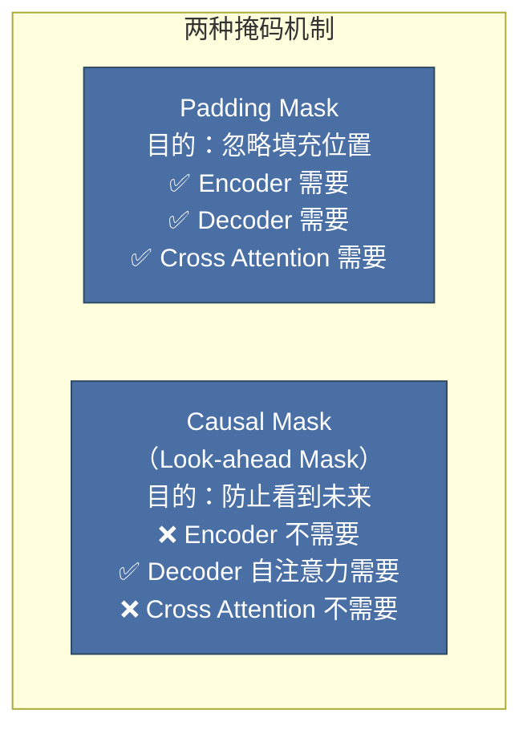

**Padding Mask**：处理变长序列，将填充位置（pad token）的注意力权重设为 $-\infty$，使其在 Softmax 后贡献为 0。

**Causal Mask（因果/下三角掩码）**：用于 Decoder 的自注意力，确保在预测第 $t$ 个位置时只能看到 $\leq t$ 的位置。

```python
def create_causal_mask(seq_len):
    """创建下三角掩码 — Decoder 自注意力使用"""
    # mask[i,j] = True 表示位置 i 可以关注位置 j
    mask = torch.tril(torch.ones(seq_len, seq_len))  # 下三角矩阵
    return mask  # (seq_len, seq_len)

def create_padding_mask(seq, pad_idx=0):
    """创建填充掩码 — 忽略 pad token"""
    # (batch, 1, 1, seq_len)，广播到 (batch, 1, seq_len, seq_len)
    mask = (seq != pad_idx).unsqueeze(1).unsqueeze(2)
    return mask  # (batch, 1, 1, seq_len)

# 因果掩码可视化
causal = create_causal_mask(5)
print("Causal Mask (下三角):")
print(causal.int())
# 输出:
# tensor([[1, 0, 0, 0, 0],
#         [1, 1, 0, 0, 0],
#         [1, 1, 1, 0, 0],
#         [1, 1, 1, 1, 0],
#         [1, 1, 1, 1, 1]])
```

---

## 12.5 三种 Transformer 变体 ⭐⭐⭐⭐⭐

### 12.5.1 架构对比全景图

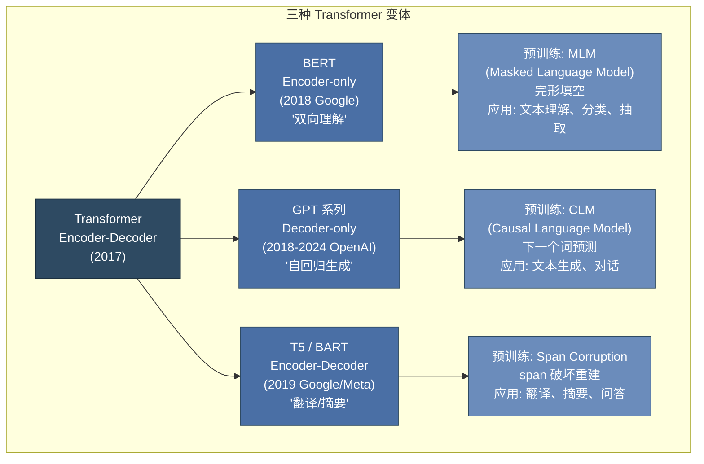

### 12.5.2 Encoder-only：BERT

BERT（Bidirectional Encoder Representations from Transformers）使用 Transformer 的编码器堆栈。

**预训练任务**：
1. **MLM（Masked Language Model）**：随机遮盖 15% 的 token，模型预测被遮盖的词
2. **NSP（Next Sentence Prediction）**：预测两个句子是否相邻（后续被证明作用有限）

**MLM 的细节处理**：被选中的 15% token 中，80% 替换为 `[MASK]`，10% 替换为随机词，10% 保持不变。这种策略缓解预训练-微调的差异。

**应用场景**：文本分类、命名实体识别、问答、语义相似度等**理解类任务**。

### 12.5.3 Decoder-only：GPT 系列 ⭐⭐⭐⭐⭐

GPT（Generative Pre-trained Transformer）仅使用 Transformer 的解码器部分，配合因果掩码进行自回归语言建模。

**预训练任务**：**CLM（Causal Language Modeling）**，即给定前缀 $w_1, ..., w_{t-1}$，预测下一个词 $w_t$。

$$L = -\sum_{t=1}^{T} \log P(w_t | w_1, ..., w_{t-1}; \Theta)$$

### 12.5.4 🎯 面试高频题：GPT 为什么采用 Decoder-only？⭐⭐⭐⭐⭐

**核心原因**：

1. **参数效率**：
   - 在相同参数量下，Decoder-only 模型比 Encoder-Decoder 更"深"（所有参数用于生成）
   - Encoder-Decoder 需要两套 Attention 机制，参数分散

2. **自回归天然匹配生成**：
   - 语言生成本质上是自回归的（从左到右逐个生成 token）
   - Decoder-only 的因果掩码完美匹配这一特性

3. **Scaling Law 的发现**：
   - OpenAI 的研究发现，Decoder-only 架构在参数量扩大时表现更优
   - GPT-3（175B）验证了超大规模 Decoder-only 模型的惊人能力

4. **训练效率**：
   - 不需要复杂的 Mask 策略（BERT 的 MLM 只有 15% 位置参与预测）
   - 每个位置都参与损失计算，数据利用率 100%

5. **Attention 计算的简洁性**：
   - Decoder-only 的 Self-Attention 是**下三角矩阵**，天然适合缓存（KV Cache）
   - Encoder-Decoder 的 Cross Attention 增加了复杂度

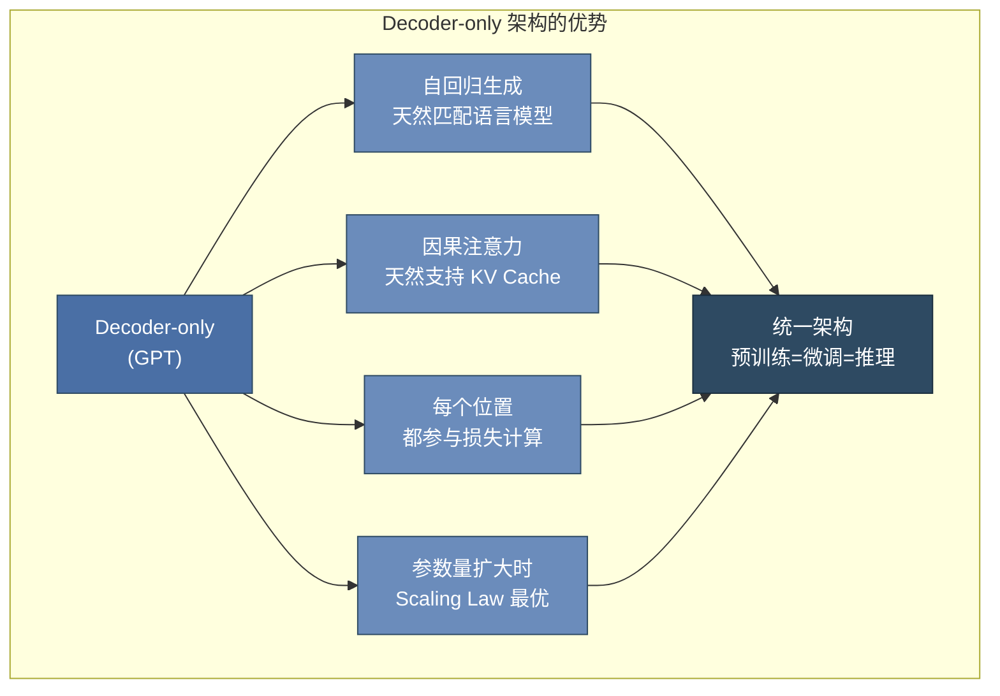

---

## 12.6 大模型训练流程 ⭐⭐⭐⭐⭐

### 12.6.1 完整训练流程图

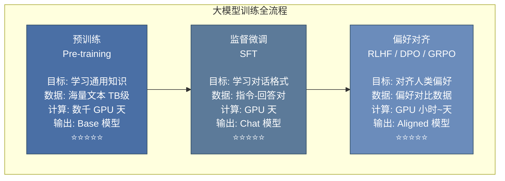

### 12.6.2 预训练（Pre-training）

**目标**：在大规模无标注文本上学习通用的语言表示和世界知识。

**数据**：网页文本（Common Crawl）、书籍、代码、百科、论文等，总量可达数 TB。

**关键超参数**：

| 模型 | 参数量 | 训练数据量 | Batch Size | 学习率 | 训练时长 |
|------|--------|-----------|------------|--------|---------|
| GPT-3 | 175B | 300B tokens | 3.2M | 0.6×10⁻⁴ | ~3000 V100 GPU 天 |
| LLaMA-2 | 70B | 2T tokens | 4M | 1.5×10⁻⁴ | ~1.7M GPU 小时 |
| Qwen-72B | 72B | 3T+ tokens | — | — | — |

**预训练的核心挑战**：
1. **计算成本**：需要大规模 GPU/TPU 集群，成本数百万美元
2. **数据质量**：海量数据中的噪声、重复、有毒内容需清洗
3. **训练稳定性**：深层大模型易出现 loss spike（损失突增），需要精细调参

### 12.6.3 监督微调（SFT）⭐⭐⭐⭐⭐

**目标**：将预训练模型适配到对话/指令遵循格式。

**数据格式**（指令微调数据）：

```json
{
    "messages": [
        {"role": "system", "content": "你是一个有帮助的AI助手。"},
        {"role": "user", "content": "请解释什么是Transformer？"},
        {"role": "assistant", "content": "Transformer是一种深度学习架构..."}
    ]
}
```

**SFT 的技术要点**：
- 通常只计算 assistant 回复部分的 loss（user 部分 loss 设为 0，不反向传播）
- 学习率比预训练小 10-100 倍（通常 1e-5 ~ 2e-5）
- 训练 1-3 个 epoch 即可（过多会导致过拟合）

### 12.6.4 RLHF（基于人类反馈的强化学习）⭐⭐⭐⭐⭐

RLHF 是 ChatGPT 成功的关键技术之一，包含三个步骤：

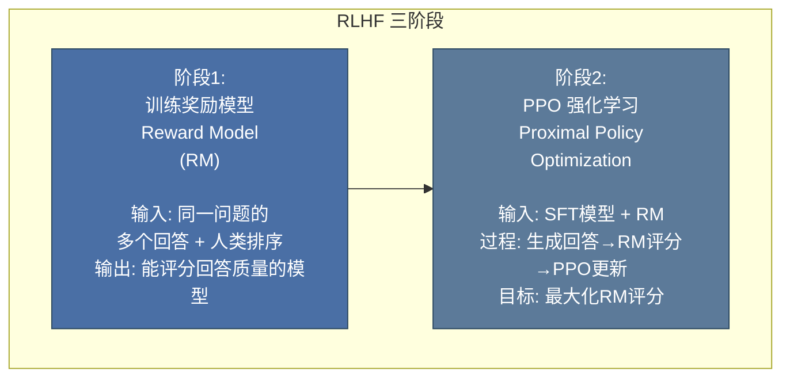

**PPO 的核心原理**：

PPO（Proximal Policy Optimization）是一种策略梯度算法，通过**限制策略更新幅度**来保持训练稳定性。

$$L^{PPO}(\theta) = \hat{\mathbb{E}}_t \left[ \min(r_t(\theta) \hat{A}_t, \text{clip}(r_t(\theta), 1-\epsilon, 1+\epsilon) \hat{A}_t) \right]$$

其中 $r_t(\theta) = \frac{\pi_\theta(a_t|s_t)}{\pi_{\theta_{old}}(a_t|s_t)}$ 是新旧策略比率，$\hat{A}_t$ 是优势函数估计。

**PPO 的组件**：
1. **Actor（策略网络）**：SFT 模型，负责生成回答
2. **Critic（价值网络）**：估计状态价值函数 $V(s)$
3. **Reward Model**：给生成回答打分
4. **Reference Model**：冻结的 SFT 模型，防止策略偏离太远（KL 散度约束）

### 12.6.5 DPO（直接偏好优化）⭐⭐⭐⭐⭐

DPO 是 RLHF 的简化替代，**绕过奖励模型和强化学习**，直接用偏好数据进行优化。

**核心思想**：将 RL 目标转化为分类问题，直接优化策略模型。

$$L_{DPO}(\theta) = -\mathbb{E}_{(x, y_w, y_l)} \left[ \log \sigma \left( \beta \log \frac{\pi_\theta(y_w|x)}{\pi_{ref}(y_w|x)} - \beta \log \frac{\pi_\theta(y_l|x)}{\pi_{ref}(y_l|x)} \right) \right]$$

其中 $y_w$ 是偏好的回答（win），$y_l$ 是不偏好的回答（lose），$\beta$ 控制偏离参考模型的程度。

**DPO vs PPO**：

| 维度 | PPO | DPO |
|------|-----|-----|
| 是否需要 RM | ✅ 需要单独训练 | ❌ 不需要 |
| 是否需要 RL | ✅ PPO 算法 | ❌ 转化为分类损失 |
| 训练稳定性 | 较低（超参数敏感） | **较高** |
| 训练速度 | 慢（采样 + 多轮更新） | **快** |
| 效果上限 | 通常更高（精细优化） | 接近 PPO |
| 实现复杂度 | 高 | **低** |

### 12.6.6 GRPO（群体相对策略优化）⭐⭐⭐⭐⭐

GRPO 是 DeepSeek 团队提出的强化学习算法，用于训练 DeepSeek-R1 等推理模型。

**核心创新 — 去 Critic 化**：

传统 PPO 需要维护 Critic 网络来估计优势函数，GRPO 通过**组内相对比较**替代 Critic：

1. 对每个问题，采样一组回答（Group）
2. 使用奖励模型或规则（如答案正确性）给每个回答打分
3. 优势函数 = 个体得分 - 组内平均分
4. 基于此相对优势更新策略

$$\hat{A}_{i} = \frac{r_i - \text{mean}(\{r_j\}_{j=1}^{G})}{\text{std}(\{r_j\}_{j=1}^{G})}$$

**GRPO 的优势**：
- **无需 Critic 模型**：减少一半参数量和显存占用
- **适合推理任务**：组内比较天然适配有明确答案的数学/编程问题
- **高效扩展**：适合大规模并行训练

```python
# GRPO 伪代码
for batch in dataloader:
    # 1. 对同一问题采样 G 个回答
    responses = [generate(model, question) for _ in range(G)]

    # 2. 奖励评分（可基于规则或奖励模型）
    rewards = [reward_fn(q, r) for r in responses]

    # 3. 计算组内相对优势
    mean_reward = sum(rewards) / G
    advantages = [r - mean_reward for r in rewards]

    # 4. 策略梯度更新
    loss = -sum(advantage * log_prob for advantage, log_prob in zip(advantages, log_probs))
    loss.backward()
```

---

## 12.7 大模型核心概念 ⭐⭐⭐⭐

### 12.7.1 涌现能力（Emergent Abilities）⭐⭐⭐⭐

涌现能力是指模型在参数量/训练量达到某个阈值后**突然展现**的能力，在较小规模模型上完全不存在。

典型涌现能力：
- **In-Context Learning（上下文学习）**：通过 prompt 中的示例学习新任务
- **Chain-of-Thought 推理**：逐步推理复杂问题
- **指令遵循**：理解和执行自然语言指令
- **代码生成**：编写和解释程序代码

**涌现的争议**：有研究认为涌现可能是评估指标的离散性造成的假象，而非真正的相变。但经验上，大模型确实在特定规模后表现出质的飞跃。

**🆕 2026 年更新 — 从"规模涌现"到"推理时涌现"**：

2025-2026年，业界发现了一个更深层的规律：**Test-Time Compute（推理时计算）**可以让中等规模的模型通过"花更多时间思考"达到超大模型的效果。

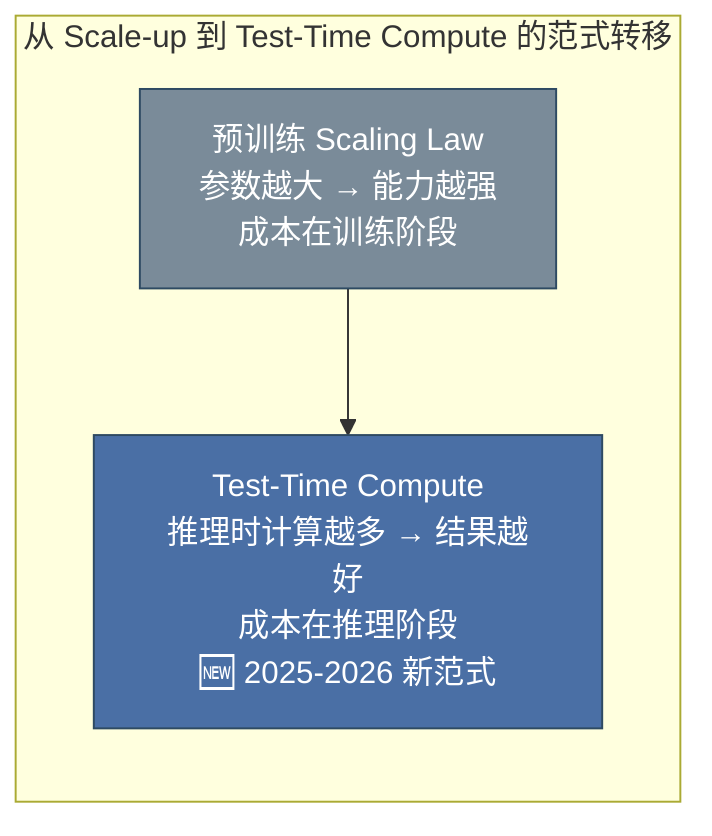

这一范式的代表：
- **GPT-5.2（深度思维链）**：OpenAI 的 Test-Time Compute 专用版本
- **DeepSeek-R1**：通过强化学习让模型自主学会"停下来思考"
- **Claude 4.6（四档推理）**：`thinking_level: low/medium/high/max` 让用户控制推理深度

这意味着：**模型能力 = f(参数规模, 推理时计算)**，两个维度都可以独立优化。

### 12.7.2 上下文学习（In-Context Learning）⭐⭐⭐⭐⭐

**定义**：大模型在不更新参数的情况下，仅通过在输入上下文中提供几个示例（few-shot）就能学习新任务的能力。

**三种形式**：

| 形式 | 示例数量 | 说明 |
|------|---------|------|
| Zero-shot | 0 个 | 直接给指令，模型理解执行 |
| One-shot | 1 个 | 提供 1 个输入-输出示例 |
| Few-shot | 2-5 个 | 提供多个示例，引导模型模式 |

**上下文学习的原理假说**：
1. **隐式梯度下降**：Attention 机制在前向传播中执行了类似梯度更新的操作
2. **任务检索**：预训练时见过类似任务，示例帮助定位相关知识
3. **元学习**：模型在预训练过程中学会了"如何学习"

### 12.7.3 MoE 架构（Mixture of Experts）⭐⭐⭐⭐

MoE 是当前大模型扩展的重要方向，核心思想：**用条件计算替代全部计算**。

**核心结构**：

$$y = \sum_{i=1}^{N} G(x)_i \cdot E_i(x)$$

其中 $G$ 是门控网络（Gating Network），$E_i$ 是第 $i$ 个专家网络。门控网络决定每个输入 token 激活哪些专家。

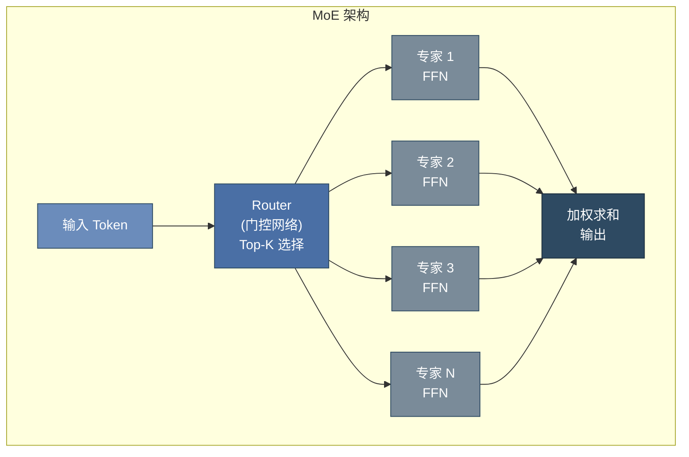

**MoE 的关键设计**：

| 设计 | 说明 | 目的 |
|------|------|------|
| **Top-K 路由** | 只激活 K 个专家（通常 K=1~2） | 减少计算量 |
| **负载均衡损失** | 惩罚路由不均衡 | 防止所有 token 涌向少数专家 |
| **专家容量** | 限制每个专家处理的最大 token 数 | 防止过载 |

**代表模型**：
- Mixtral 8×7B / 8×22B：Mistral AI 的 MoE 模型
- **GPT-4（MoE 架构，1.8T 总量，每次激活约 280B）**：2024年发布时证实了 MoE 路线
- **GPT-5 系列（2025-2026）**：万亿参数级 MoE + 神经符号混合架构，20万张 H200 GPU 训练 🆕
- **DeepSeek-V2/V3**：创新的 MLA + MoE 架构，训练成本仅为同类模型的 1/10 🆕
- **Claude 4 系列（2025-2026）**：Anthropic 的神经符号系统突破，Agent Teams 架构 🆕

**🆕 MoE 在 2026 年的演进 — 从纯 MoE 到 MoE + 神经符号混合**：

2026年，顶级大模型已超越纯 MoE 架构，采用**混合架构**：

| 架构层次 | 功能 | 代表实现 |
|---------|------|---------|
| **MoE 基底** | 通用语言理解与生成的参数底座 | GPT-5 万亿参数 MoE 底座 |
| **推理专用层** | 数学/代码/逻辑的深度思考链 | DeepSeek-R1 推理层、GPT-5.2 Test-Time Compute |
| **神经符号模块** | 精确计算、公式推导、符号推理 | Claude 4 神经符号系统 |
| **Agent 协作层** | 多实例并行协作、任务分解 | Claude 4.7 Agent Teams |

这种分层架构使得大模型同时具备**直觉性语言理解**（神经网络）和**精确逻辑推理**（符号系统）能力。

**MoE 的优势**：
- **参数量大，激活参数量小**：总参数量可达千亿级，但每个 token 只激活部分参数
- **专家特化**：不同专家可学习不同领域知识（语法、数学、代码等）

**MoE 的挑战**：
- 通信开销（多专家分布在不同设备）
- 负载均衡（某些专家可能被过度使用）
- 微调复杂度增加

**🆕 2026 年新趋势 — 推理时计算（Test-Time Compute）成为标配**：

2026年的顶级大模型不再仅依赖预训练参数，而是在推理阶段动态分配计算资源：

| 技术 | 原理 | 效果 | 代表模型 |
|------|------|------|---------|
| **思维链（CoT）** | 生成中间推理步骤 | 数学/逻辑能力提升 3-5 倍 | 所有 2026 年大模型 |
| **多数投票** | 采样多条路径，选最多答案 | 简单有效，计算换准确率 | Self-Consistency |
| **树状搜索** | 在推理空间中进行 Beam Search | 编程竞赛级能力提升 | GPT-5.2, Claude 4.6 max |
| **验证器引导** | 训练验证模型评估中间步骤 | 错误回溯、自我修正 | DeepSeek-R1 |

> **💡 面试要点**：理解 Test-Time Compute 的范式转移 —— 它意味着模型能力可以在不增加参数的情况下通过"思考更久"来提升，这是 2026 年大模型工程的核心优化方向。

---

## 12.8 2026年大模型格局演进 🆕

> **2026年更新**：大模型格局已从 GPT-4 时代进入 GPT-5 / Claude 4 / DeepSeek-R1 / Gemini 3 多强争霸时代。了解各模型的架构特点和选型差异，是面试和工程实践中的核心知识。

### 12.8.1 GPT-5 系列架构演进（OpenAI）

GPT-5 系列是 OpenAI 在 2025-2026 年推出的旗舰模型家族，代表了当前大模型的最高水平。

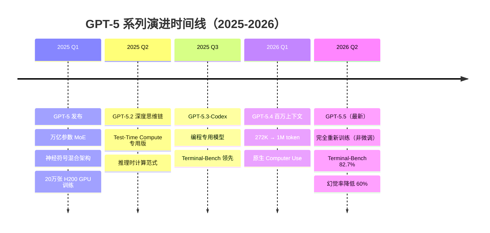

**GPT-5.5（2026年5月）— 当前最强版本**：

| 特性 | 详情 |
|------|------|
| **训练方式** | 完全重新训练（非基于前版本的微调） |
| **参数规模** | 万亿级 MoE，每次激活约 300B |
| **上下文窗口** | 1M token（约 150 万汉字） |
| **Terminal-Bench** | 82.7%（代码终端任务基准） |
| **幻觉率** | 相比 GPT-4 降低 60% |
| **核心架构** | MoE + 推理专用层 + 多模态原生统一 |

### 12.8.2 Claude 4 系列 — 神经符号系统突破（Anthropic）

Claude 4 系列是 Anthropic 在 2025-2026 年的旗舰产品，以**神经符号混合架构**和**Agent Teams**为核心创新。

**Claude 4 架构演进**：

| 版本 | 发布时间 | 核心突破 |
|------|---------|---------|
| **Claude 4** | 2025年 | 神经符号系统突破，数学能力达 IMO 金牌水平 |
| **Claude 4.6** | 2026年初 | 四档推理（`thinking_level: low/medium/high/max`），Agent Teams 引入 |
| **Claude 4.7** | 2026年5月 | 100万 token 上下文，Agent Teams 成熟 |

**🆕 Agent Teams — 持久性独立 Claude 实例并行协作**：

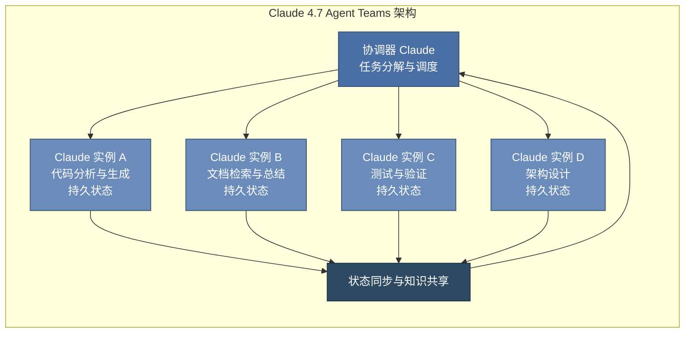

**Agent Teams 的核心特点**：
1. **持久性**：每个 Agent 实例有独立的长期记忆和状态
2. **并行协作**：多个 Agent 同时处理不同子任务
3. **自主协调**：不需要人类干预，Agent 之间自主分配工作
4. **四档推理**：用户可根据任务复杂度选择思考深度

### 12.8.3 DeepSeek-R1 — 推理效率的革命

DeepSeek-R1 是中国 DeepSeek 团队发布的推理专用模型，以**极低的训练成本**和**极高的推理性能**震惊业界。

**核心架构创新**：

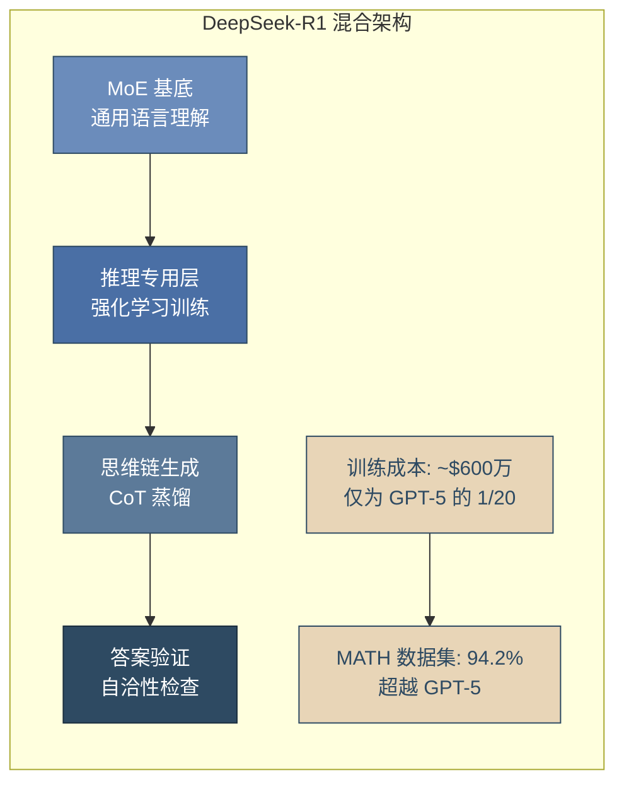

**DeepSeek-R1 的技术突破**：

| 维度 | DeepSeek-R1 | 业界对比 |
|------|------------|---------|
| **训练成本** | ~600万美元 | GPT-5 估计 1-2 亿美元 |
| **MATH 数据集** | 94.2% | 超越 GPT-5 的 ~92% |
| **架构** | MoE + 推理专用层 + GRPO 强化学习 | 独特的推理层设计 |
| **蒸馏能力** | 可将推理能力蒸馏到小模型 | 7B 模型达到 GPT-4 水平 |
| **开源程度** | 模型权重开源 | 最顶级的开源推理模型 |

**DeepSeek-R1 的核心方法 — 强化学习 + 思维链蒸馏**：

1. **GRPO 强化学习**：通过组内相对比较训练模型学会"停下来思考"
2. **冷启动数据**：少量高质量 CoT 数据启动训练
3. **自蒸馏**：大模型的推理能力蒸馏给更小更高效的模型
4. **拒绝采样**：过滤低质量推理路径，保留高质量 CoT

### 12.8.4 Gemini 3.0 — 端云协同新范式（Google）

2026年5月 Google I/O 发布的 Gemini 3.0 代表了另一条技术路线：**端云协同架构**。

| 特性 | 详情 |
|------|------|
| **端云协同** | 小模型在端侧处理简单任务，大模型在云端处理复杂任务，无缝切换 |
| **Spark 智能体平台** | Google 的原生 Agent 平台，与 Android 深度集成 |
| **多模态原生** | 文本、图像、音频、视频统一处理，非拼接架构 |
| **上下文窗口** | 2M+ token，支持整本书/整代码库一次性处理 |

### 12.8.5 2026年大模型选型对比表

| 维度 | GPT-5.5 | Claude 4.7 | DeepSeek-R1 | Gemini 3.0 |
|------|---------|-----------|-------------|-----------|
| **发布方** | OpenAI | Anthropic | DeepSeek | Google |
| **发布时间** | 2026.05 | 2026.05 | 2025.01 | 2026.05 |
| **参数规模** | 万亿 MoE | 未公开（估计万亿级） | 671B MoE | 未公开 |
| **上下文长度** | 1M tokens | 1M tokens | 128K → 256K | 2M+ tokens |
| **核心优势** | 综合能力最强、代码能力 | Agent Teams、长文本 | 推理性价比、开源 | 端云协同、多模态 |
| **神经符号** | 部分支持 | 深度集成 | 有限 | 部分支持 |
| **Agent 能力** | Computer Use 原生 | Agent Teams（最强） | 基础 | Spark 平台 |
| **推理档位** | 自动调节 | 4 档可调 | 单档（全力推理） | 自动调节 |
| **开源** | ❌ 闭源 | ❌ 闭源 | ✅ 开源 | ❌ 闭源 |
| **API 成本** | 高 | 中高 | 极低（开源可自托管） | 中 |
| **适用场景** | 通用任务、代码生成 | 复杂多步骤任务、研究 | 数学推理、低成本部署 | 端侧应用、多模态 |

### 12.8.6 架构演进趋势分析

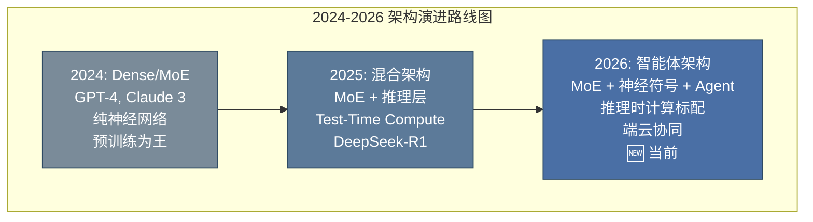

**五大架构趋势（2026年）**：

1. **从纯 Dense 到 MoE + 神经符号混合**
   - 纯神经网络 → 神经网络处理直觉 + 符号系统处理精确逻辑
   - Claude 4 的神经符号系统是最深度的集成

2. **推理时计算（Test-Time Compute）成为标配**
   - 2024年只有简单 CoT → 2026年所有顶级模型都有可调的推理深度
   - 关键洞察：推理时间也是一种可优化的资源

3. **多模态原生统一架构**
   - 2024年：文本模型 + 视觉适配器（拼接式）
   - 2026年：文本/图像/音频/视频在底层统一表示（Gemini 3.0 代表）

4. **端云协同部署**
   - 简单任务本地处理（隐私 + 低延迟）
   - 复杂任务云端处理（高性能）
   - 模型自动判断任务复杂度并选择执行位置

5. **Agent 架构从工具调用到自主协作**
   - 2024年：Function Calling（被动调用工具）
   - 2025年：AutoGPT / LangChain（编排式 Agent）
   - 2026年：Agent Teams（自主多实例并行协作）

---

## 12.9 完整 Transformer PyTorch 实现

```python
import torch
import torch.nn as nn
import math

class TransformerEncoderLayer(nn.Module):
    """Transformer Encoder Layer — 包含 Self-Attention + FFN"""

    def __init__(self, d_model, num_heads, d_ff, dropout=0.1):
        super().__init__()
        self.self_attn = MultiHeadAttention(d_model, num_heads, dropout)
        self.ffn = nn.Sequential(
            nn.Linear(d_model, d_ff),
            nn.GELU(),
            nn.Dropout(dropout),
            nn.Linear(d_ff, d_model),
            nn.Dropout(dropout)
        )
        self.norm1 = nn.LayerNorm(d_model)
        self.norm2 = nn.LayerNorm(d_model)

    def forward(self, x, mask=None):
        # Pre-LN 结构: Norm → Sublayer → Residual
        attn_out, _ = self.self_attn(self.norm1(x), self.norm1(x), self.norm1(x), mask)
        x = x + attn_out

        ffn_out = self.ffn(self.norm2(x))
        x = x + ffn_out

        return x


class TransformerDecoderLayer(nn.Module):
    """Transformer Decoder Layer — 包含 Masked Self-Attn + Cross Attn + FFN"""

    def __init__(self, d_model, num_heads, d_ff, dropout=0.1):
        super().__init__()
        self.self_attn = MultiHeadAttention(d_model, num_heads, dropout)
        self.cross_attn = MultiHeadAttention(d_model, num_heads, dropout)
        self.ffn = nn.Sequential(
            nn.Linear(d_model, d_ff),
            nn.GELU(),
            nn.Dropout(dropout),
            nn.Linear(d_ff, d_model),
            nn.Dropout(dropout)
        )
        self.norm1 = nn.LayerNorm(d_model)
        self.norm2 = nn.LayerNorm(d_model)
        self.norm3 = nn.LayerNorm(d_model)

    def forward(self, x, encoder_output, src_mask=None, tgt_mask=None):
        # Masked Self-Attention
        self_attn_out, _ = self.self_attn(
            self.norm1(x), self.norm1(x), self.norm1(x), tgt_mask
        )
        x = x + self_attn_out

        # Cross Attention (Q from decoder, K/V from encoder)
        cross_attn_out, _ = self.cross_attn(
            self.norm2(x), encoder_output, encoder_output, src_mask
        )
        x = x + cross_attn_out

        # FFN
        ffn_out = self.ffn(self.norm3(x))
        x = x + ffn_out

        return x


class Transformer(nn.Module):
    """完整 Transformer 模型"""

    def __init__(self, src_vocab_size, tgt_vocab_size, d_model=512,
                 num_heads=8, num_layers=6, d_ff=2048, max_len=5000,
                 dropout=0.1):
        super().__init__()

        self.d_model = d_model

        # 嵌入层
        self.src_embedding = nn.Embedding(src_vocab_size, d_model)
        self.tgt_embedding = nn.Embedding(tgt_vocab_size, d_model)

        # 位置编码
        self.pos_encoding = SinusoidalPositionalEncoding(d_model, max_len, dropout)

        # 编码器
        self.encoder_layers = nn.ModuleList([
            TransformerEncoderLayer(d_model, num_heads, d_ff, dropout)
            for _ in range(num_layers)
        ])

        # 解码器
        self.decoder_layers = nn.ModuleList([
            TransformerDecoderLayer(d_model, num_heads, d_ff, dropout)
            for _ in range(num_layers)
        ])

        # 输出层
        self.output_layer = nn.Linear(d_model, tgt_vocab_size)

        self._init_parameters()

    def _init_parameters(self):
        for p in self.parameters():
            if p.dim() > 1:
                nn.init.xavier_uniform_(p)

    def encode(self, src, src_mask=None):
        x = self.src_embedding(src) * math.sqrt(self.d_model)
        x = self.pos_encoding(x)
        for layer in self.encoder_layers:
            x = layer(x, src_mask)
        return x

    def decode(self, tgt, encoder_output, src_mask=None, tgt_mask=None):
        x = self.tgt_embedding(tgt) * math.sqrt(self.d_model)
        x = self.pos_encoding(x)
        for layer in self.decoder_layers:
            x = layer(x, encoder_output, src_mask, tgt_mask)
        return x

    def forward(self, src, tgt, src_mask=None, tgt_mask=None):
        encoder_output = self.encode(src, src_mask)
        decoder_output = self.decode(tgt, encoder_output, src_mask, tgt_mask)
        return self.output_layer(decoder_output)
```

---

## 12.10 本章面试题精讲 🎯

### 🎯 面试题 1：Self-Attention 的计算复杂度？为什么长文本是瓶颈？

**答案**：Self-Attention 的时间复杂度为 $O(n^2 \cdot d)$，其中 $n$ 是序列长度。$QK^T$ 产生 $n \times n$ 的注意力矩阵，与序列长度的**平方**成正比。当 $n=4096$ 时，注意力矩阵有 1600 万元素；当 $n=128K$ 时，有 160 亿元素。这导致显存和计算量急剧增长。优化方案：Flash Attention（分块计算）、稀疏 Attention、线性 Attention、Ring Attention 等。

### 🎯 面试题 2：为什么要除以 $\sqrt{d_k}$？

**答案**：当 $d_k$ 较大时，两个随机向量的点积方差与 $d_k$ 成正比。如果不缩放，点积的数值会很大，导致 Softmax 函数进入梯度极小的饱和区（梯度接近 0），产生梯度消失。除以 $\sqrt{d_k}$ 将方差归一化到标准尺度，保持梯度流动。

### 🎯 面试题 3：Transformer 为什么用 LayerNorm 而不是 BatchNorm？

**答案**：(1) BatchNorm 依赖 batch 统计，序列长度变化时统计不稳定；(2) NLP 中 batch 内样本长度差异大，padding 位置会影响 batch 统计；(3) LayerNorm 对每个样本独立归一化，不受 batch 大小影响，更适合序列数据；(4) LayerNorm 与 Transformer 的自回归特性兼容更好（Pre-LN 结构）。

### 🎯 面试题 4：Padding Mask 和 Causal Mask 的区别？

**答案**：Padding Mask 用于忽略填充位置（pad token），在 Encoder 和 Decoder 中都需要，防止注意力关注无意义的填充位置。Causal Mask（Look-ahead Mask）是下三角矩阵，只在 Decoder 的自注意力中使用，确保模型在预测第 $t$ 个位置时只能看到 $\leq t$ 的位置信息，维持自回归特性。

### 🎯 面试题 5：BERT 和 GPT 的主要区别？

**答案**：BERT 是 Encoder-only，使用 MLM（掩码语言模型）预训练，双向注意力，适合理解类任务（分类、NER、问答）。GPT 是 Decoder-only，使用 CLM（因果语言模型）预训练，单向注意力（因果掩码），适合生成类任务（对话、写作、代码生成）。GPT 的自回归特性天然匹配语言生成，且 Decoder-only 架构在 Scaling Law 下表现更优。

### 🎯 面试题 6：RLHF 中 PPO 的核心思想是什么？

**答案**：PPO 通过限制策略更新的幅度（clip 机制）来保持训练稳定性。核心公式中的 $\min$ 和 $\text{clip}$ 确保策略不会一次性变化太大。PPO 包含四个组件：Actor（策略网络，生成回答）、Critic（价值网络，估计状态价值）、Reward Model（给回答打分）、Reference Model（冻结的 SFT 模型，通过 KL 散度约束防止策略偏离太远）。

### 🎯 面试题 7：DPO 相比 PPO 的优势和劣势？

**答案**：DPO 将 RL 问题转化为分类问题，直接用偏好数据优化策略，**无需奖励模型和 Critic 网络**，实现简单、训练稳定。劣势是与 PPO 相比，DPO 少了在线采样的探索过程，在需要精细优化的场景下效果可能略逊于精心调优的 PPO。但从工程实践角度，DPO 的简洁性使其成为许多团队的首选。

### 🎯 面试题 8：什么是涌现能力？有哪些典型表现？

**答案**：涌现能力是指大模型在参数量/训练量跨越某个阈值后突然展现的能力，较小模型完全不具备。典型表现：In-Context Learning（上下文学习，通过 prompt 示例学习新任务而不更新参数）、Chain-of-Thought 推理（逐步推理解决复杂问题）、指令遵循（理解和执行自然语言指令）。涌现的原因尚无定论，可能与模型容量足够学习到更高级抽象表示有关。

### 🎯 面试题 9：MoE 架构的核心思想是什么？

**答案**：MoE（Mixture of Experts）通过条件计算实现参数高效扩展。每个输入 token 只激活部分专家网络（Top-K 路由），总参数量可达千亿级别但计算量不随参数量线性增长。优势是参数量大、激活参数量小、专家可特化到不同知识领域。挑战是负载均衡（需辅助损失防止路由倾斜）、通信开销和多设备协调。

### 🎯 面试题 10：GRPO 相比 PPO 的创新点？

**答案**：GRPO（Group Relative Policy Optimization）的核心创新是**去 Critic 化**。传统 PPO 需要维护 Critic 网络估计优势函数，GRPO 通过对同一问题采样一组回答，用组内得分的相对偏差（个体得分 - 组平均分）替代优势函数估计。这减少了约一半的参数量和显存占用，特别适合推理任务（数学、编程等有明确答案的任务）。

### 🎯🆕 面试题 11：Test-Time Compute 是什么？为什么它是2026年的关键技术范式？

**答案**：Test-Time Compute（推理时计算）是指在**推理阶段**动态分配更多计算资源来提升输出质量的技术范式。传统范式认为模型能力完全取决于预训练参数规模，但 2025-2026 年发现：让模型在推理时"思考更久"（生成更多中间推理步骤）可以显著提升复杂任务表现。

核心方法包括：
1. **思维链（Chain-of-Thought）**：生成中间推理步骤
2. **多数投票（Self-Consistency）**：采样多条推理路径，选择最一致的答案
3. **树状搜索**：在推理空间中进行系统性搜索
4. **验证器引导**：训练验证模型评估和筛选中间步骤

代表实现：GPT-5.2 深度思维链、Claude 4.6 四档推理（`thinking_level: low/medium/high/max`）、DeepSeek-R1 的强化学习推理。

**为什么重要**：它意味着模型能力 = f(参数规模, 推理时计算)，两个维度可以独立优化。中小模型通过增加推理时计算可以达到大模型效果，大幅降低部署成本。

### 🎯🆕 面试题 12：GPT-5.5 和 Claude 4.7 的核心差异是什么？如何选择？

**答案**：

| 维度 | GPT-5.5 | Claude 4.7 |
|------|---------|-----------|
| **架构** | 万亿 MoE + 推理层 + 多模态原生 | 神经符号系统 + Agent Teams |
| **上下文** | 1M tokens | 1M tokens |
| **最强能力** | 综合性能、代码生成 | 多步骤复杂任务、Agent 协作 |
| **推理控制** | 自动调节 | 4 档可调（low/medium/high/max） |
| **Agent** | Computer Use 原生 | Agent Teams（多实例并行协作） |
| **开源** | 闭源 | 闭源 |

**选型建议**：
- 通用对话、代码生成 → GPT-5.5
- 复杂研究任务、需要多 Agent 协作 → Claude 4.7
- 成本敏感、需要自托管 → DeepSeek-R1（开源）
- 端侧应用、多模态 → Gemini 3.0

### 🎯🆕 面试题 13：DeepSeek-R1 的训练成本为什么能做到 GPT-5 的 1/20？

**答案**：DeepSeek-R1 通过以下技术创新实现极低训练成本：

1. **MoE 架构效率**：每次只激活部分专家（约 37B/671B），计算量远小于同等总参数量的 Dense 模型
2. **MLA（Multi-head Latent Attention）**：将 KV Cache 压缩到极低维度，减少显存占用和计算量
3. **GRPO 替代 PPO**：去 Critic 化，减少约 50% 训练参数量
4. **强化学习为主，SFT 为辅**：用 RL 让模型自主学会推理，而非依赖大量昂贵的标注数据
5. **高效的工程实现**：优化的并行训练策略、数据加载和通信优化
6. **蒸馏而非从头训练**：大模型的推理能力通过蒸馏传递给小模型，避免重复训练

核心洞察：**架构创新 + 训练方法创新 + 工程优化**三管齐下，而非单纯堆算力。

### 🎯🆕 面试题 14：什么是神经符号系统（Neuro-Symbolic）？Claude 4 为什么采用这种架构？

**答案**：神经符号系统是将**神经网络**（擅长直觉、模式识别、模糊处理）与**符号推理**（擅长精确计算、逻辑推导、可验证结论）相结合的混合架构。

**传统纯神经网络的问题**：
- 数学计算容易出错（如大数乘法）
- 逻辑推理链条长时容易"走神"
- 结论不可验证（黑盒）

**Claude 4 的神经符号实现**：
- 底层：神经网络处理自然语言理解和直觉判断
- 中层：符号系统接管精确计算和逻辑推导
- 顶层：混合验证层确保输出正确性

**效果**：Claude 4 的数学能力达到 IMO（国际数学奥林匹克）金牌水平，逻辑推理错误率大幅降低。这种架构让模型同时具备"像人一样理解问题"和"像计算机一样精确计算"的能力。

### 🎯🆕 面试题 15：Agent Teams 和传统 Function Calling 的区别？

**答案**：

| 维度 | Function Calling（2024） | Agent Teams（2026） |
|------|------------------------|-------------------|
| **触发方式** | 模型判断需要时被动调用 | Agent 主动自主协调 |
| **执行模式** | 单线程顺序执行 | 多实例并行协作 |
| **状态管理** | 无状态，每次独立调用 | 持久状态，长期记忆 |
| **任务分解** | 人类预设流程 | Agent 自主分解和分配 |
| **协作能力** | 单个模型 + 工具 | 多个 Claude 实例互相协作 |
| **代表实现** | GPT-4 Function Calling | Claude 4.7 Agent Teams |

**Agent Teams 的核心架构**：
1. **协调器（Coordinator）**：负责任务分解和调度
2. **工作节点（Workers）**：多个独立的 Claude 实例，各有专精领域
3. **状态同步**：节点间共享知识和中间结果
4. **自主决策**：不需要人类干预，Agent 之间自主协调

这意味着 AI 从**被动工具**（等待人类指令调用函数）进化为**自主协作者**（主动分解任务、并行执行、自主决策）。

### 🎯🆕 面试题 16：从 MoE 架构角度，为什么大模型可以实现"参数量大但推理成本低"？

**答案**：MoE（Mixture of Experts）通过**条件计算**实现参数效率：

1. **稀疏激活**：总参数量可达万亿级，但每个 token 只激活 Top-K 个专家（通常 K=1~2），实际计算量仅占总参数的一小部分（如 GPT-5 激活约 300B/总 1T+）

2. **专家特化**：不同专家学习不同领域的知识（如语法专家、数学专家、代码专家），路由网络将输入分配给最相关的专家，提升单 token 计算效率

3. **负载均衡**：通过辅助损失函数确保 token 均匀分布在各专家上，避免计算热点

4. **通信优化**：2026年的工程实现通过专家并行（Expert Parallelism）和高效的 All-to-All 通信，将多设备间的通信开销降至最低

**类比**：MoE 就像一个大型医院 —— 有 1000 个医生（总参数），但每个病人只需要看 2-3 个专科医生（激活参数），不需要所有医生同时会诊。

---

## 12.11 本章速查表

| 概念 | 公式 / 关键点 |
|------|-------------|
| **Scaled Dot-Product Attention** | $\text{softmax}(\frac{QK^T}{\sqrt{d_k}})V$ |
| **Multi-Head Attention** | $\text{Concat}(\text{head}_1, ..., \text{head}_h)W^O$ |
| **复杂度** | Self-Attention: $O(n^2 \cdot d)$ |
| **除以 $\sqrt{d_k}$ 原因** | 控制点积方差，防止 Softmax 饱和 |
| **位置编码** | 原版正弦 / RoPE（现代大模型标配） |
| **Pre-LN vs Post-LN** | Pre-LN 更稳定，是现代模型标配 |
| **Padding Mask** | 忽略 pad token，Encoder/Decoder 都需要 |
| **Causal Mask** | 下三角矩阵，仅 Decoder 自注意力使用 |
| **Encoder-only** | BERT — MLM 预训练，理解任务 |
| **Decoder-only** | GPT — CLM 预训练，生成任务，Scaling Law 最优 |
| **RLHF 三步骤** | SFT → RM → PPO |
| **DPO** | 绕过 RM 和 RL，直接偏好优化 |
| **GRPO** | 去 Critic 化，组内相对比较 |
| **MoE** | 条件计算，Top-K 路由，负载均衡 |
| **涌现能力** | 规模跨越阈值后突然展现的能力 |
| **KV Cache** | 缓存已计算 K/V，加速自回归解码 |
| **GPT-5.5（2026）** | 万亿 MoE，1M 上下文，Terminal-Bench 82.7% 🆕 |
| **Claude 4.7（2026）** | 神经符号系统，Agent Teams，四档推理 🆕 |
| **DeepSeek-R1（2026）** | 671B MoE + 推理层，MATH 94.2%，开源 🆕 |
| **Gemini 3.0（2026）** | 端云协同，2M+ 上下文，Spark 智能体 🆕 |
| **Test-Time Compute** | 推理时计算越多，结果越好 🆕 |
| **Agent Teams** | 多 Claude 实例并行自主协作 🆕 |
| **神经符号系统** | 神经网络 + 符号推理混合架构 🆕 |

---

## 📚 相关章节

- [[11_深度学习与PyTorch]] — 神经网络基础、反向传播、CNN/RNN 等前置知识
- [[13_Prompt_Engineering]] — 理解大模型原理后，学习如何驾驭大模型能力
- [[14_RAG检索增强生成]] — 大模型落地的核心架构，解决知识过时与幻觉问题
- [[16_模型微调与推理优化]] — LoRA 微调、RLHF/DPO/GRPO 对齐技术与推理加速
