# 第 12 章 Transformer 与大模型原理 ⭐⭐⭐⭐⭐

> [!abstract] 本章导航
> **定位**：建立大模型共同原理，连接注意力、Transformer 架构和自回归生成。
>
> **先修**：[[10_机器学习基础]]、[[11_深度学习与PyTorch]]。
>
> **学习目标**：
> - 推导注意力并跟踪 Transformer 中的张量形状。
> - 解释训练、解码和 KV Cache 的数据流。
> - 比较编码器、解码器及现代架构变体的适用边界。
>
> **建议路径**：从 RNN 到 Attention → Self-Attention 自注意力机制 → Multi-Head Attention → … → DeepSeek 风格架构深化。先完成主线，再按需要阅读进阶内容。
>
> **配套代码**：`code/ch12_transformer_architecture/`。

> [!info] 阅读提示
> **时效说明（截至 2026-07-31）**：12.8 节按厂商官方发布页/API 文档维护模型能力与发布日期。闭源模型未公开的参数量、MoE 结构、训练 GPU 数和内部“神经符号”模块均标为“未披露”，不采用媒体传闻反推架构。

Transformer 是大语言模型的核心技术基石。从 2017 年 "Attention Is All You Need" 论文发表至今，Transformer 架构已广泛应用于 NLP、计算机视觉和多模态等深度学习任务。本章是后续 Prompt、RAG、Agent、训练与推理章节的共同基础，学习时应同时关注公式、张量形状和工程边界。

## 12.1 从 RNN 到 Attention ⭐⭐⭐⭐

### 12.1.1 RNN 的序列瓶颈

RNN 及其变体（LSTM、GRU）在处理序列时面临一个根本性的结构缺陷：**顺序计算依赖**。第 $t$ 步的计算必须等待第 $t-1$ 步完成，形成了无法打破的串行链条。

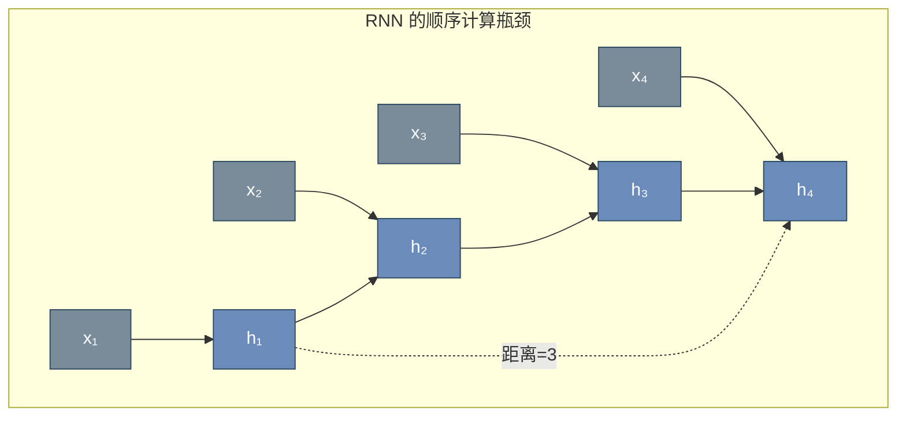

**RNN 的核心问题**：

| 问题 | 表现 | 根本原因 |
|------|------|---------|
| **无法并行** | $h_t$ 依赖 $h_{t-1}$，无法 GPU 并行加速 | 链式计算结构 |
| **长距离依赖困难** | 相距较远 token 的信息难以有效传递 | 梯度需经过多层传递 |
| **信息瓶颈** | 整个序列信息被压缩到固定维度 $h_T$ | 编码器-解码器架构的瓶颈 |

### 12.1.2 Attention 的关键思想

Attention 机制源于 2014 年 Bahdanau 等人提出的**序列到序列注意力**，其核心突破是：

> 让解码器在生成每个输出时，动态地"关注"输入序列的不同部分，而不是依赖单一的上下文向量。

Transformer 将这一思想推向极致：**完全抛弃 RNN，仅用 Attention 机制建模序列依赖**。

## 12.2 Self-Attention 自注意力机制 ⭐⭐⭐⭐⭐

Self-Attention（自注意力）是 Transformer 的灵魂。它允许序列中的每个位置都能"关注"序列中所有其他位置，并自动学习关注的权重。

### 12.2.1 核心直觉

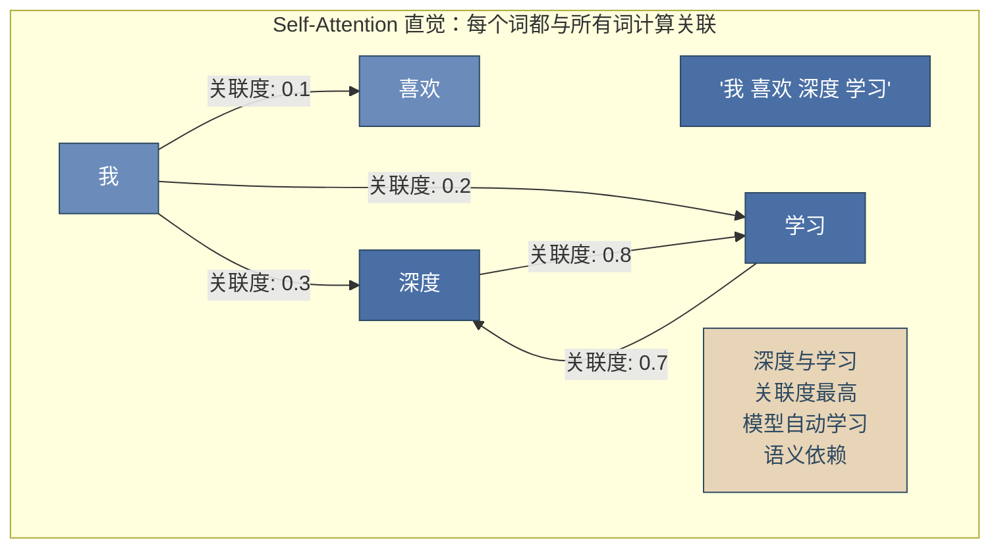

### 12.2.2 Q/K/V 机制详解 ⭐⭐⭐⭐⭐

Self-Attention 通过三个可学习的投影矩阵 $W^Q, W^K, W^V$ 将输入映射为 **Query**、**Key**、**Value** 三个向量。

**类比理解**：
- **Query (Q)** = "我有什么问题/需求" — 当前位置发起的查询
- **Key (K)** = "我有什么信息/特征" — 每个位置的内容标识
- **Value (V)** = "我的具体内容是什么" — 每个位置的实际信息

**计算过程**：

$$Q = X W^Q, \quad K = X W^K, \quad V = X W^V$$

其中 $X \in \mathbb{R}^{n \times d_{model}}$ 是输入序列的嵌入矩阵，$n$ 是序列长度，$d_{model}$ 是模型维度。

### 12.2.3 Scaled Dot-Product Attention 公式推导 ⭐⭐⭐⭐⭐

**完整的 Attention 计算公式**：

$$\text{Attention}(Q, K, V) = \text{softmax}\left(\frac{QK^T}{\sqrt{d_k}}\right)V$$

**分步拆解**：

**Step 1 — 计算注意力得分矩阵（相似度）**

$$S = QK^T \in \mathbb{R}^{n \times n}$$

$S_{ij}$ 表示第 $i$ 个 Query 与第 $j$ 个 Key 的点积相似度，这是注意力权重计算的关键步骤。

**Step 2 — 缩放（Scaling）**

$$S_{scaled} = \frac{S}{\sqrt{d_k}}$$

**🎯 为什么必须除以 $\sqrt{d_k}$？**

当 $d_k$ 较大时，两个随机向量的点积方差随 $d_k$ 线性增长：

$$\text{Var}(q \cdot k) = \text{Var}\left(\sum_{i=1}^{d_k} q_i k_i\right) = \sum_{i=1}^{d_k} \text{Var}(q_i k_i) = d_k \cdot \sigma^2$$

因此点积的数值量级约为 $O(\sqrt{d_k})$。如果不缩放，Softmax 输入会进入**梯度极小的饱和区**（极值接近 0 或 1），导致梯度消失。

**Step 3 — Softmax 归一化**

$$A = \text{softmax}(S_{scaled})$$

$A \in \mathbb{R}^{n \times n}$ 是**注意力权重矩阵**，每行之和为 1，表示每个位置对其他位置的关注程度。

**Step 4 — 加权求和**

$$\text{Output} = AV \in \mathbb{R}^{n \times d_v}$$

### 12.2.4 矩阵运算完整图解 ⭐⭐⭐⭐⭐

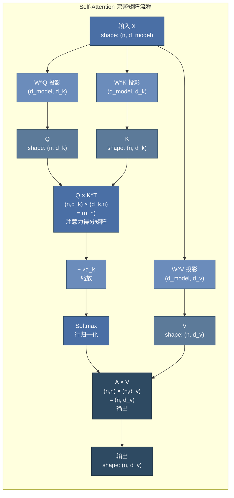

**时间复杂度分析**：

| 操作 | 计算量 | 复杂度 |
|------|--------|--------|
| $Q, K, V$ 投影 | $3 \times n \times d_{model} \times d_k$ | $O(n \cdot d^2)$ |
| $QK^T$ | $n \times n \times d_k$ | $O(n^2 \cdot d)$ |
| Softmax | $n \times n$ | $O(n^2)$ |
| $AV$ | $n \times n \times d_v$ | $O(n^2 \cdot d)$ |
| **总计** | — | **$O(n^2 \cdot d)$** |

Self-Attention 的复杂度瓶颈在于序列长度 $n$ 的**平方关系** — 这也是长上下文优化的核心挑战。

### 12.2.5 PyTorch 实现

```python
import torch
import torch.nn as nn
import math

class ScaledDotProductAttention(nn.Module):
    """Scaled Dot-Product Attention 的完整实现"""

    def __init__(self, dropout=0.1):
        super().__init__()
        self.dropout = nn.Dropout(dropout)
        self.scale = None  # 将在 forward 中设置

    def forward(self, Q, K, V, mask=None):
        """
        Args:
            Q: (batch, n, d_k) - Query
            K: (batch, n, d_k) - Key
            V: (batch, n, d_v) - Value
            mask: (batch, n, n) - 可选的掩码矩阵
        Returns:
            output: (batch, n, d_v)
            attn_weights: (batch, n, n) - 用于可视化
        """
        d_k = Q.size(-1)

        # Step 1: Q × K^T
        scores = torch.matmul(Q, K.transpose(-2, -1))  # (batch, n, n)

        # Step 2: Scale
        scores = scores / math.sqrt(d_k)

        # Step 3: Mask（可选 — Decoder 中必须）
        if mask is not None:
            scores = scores.masked_fill(mask == 0, float('-inf'))

        # Step 4: Softmax
        attn_weights = torch.softmax(scores, dim=-1)  # (batch, n, n)
        attn_weights = self.dropout(attn_weights)

        # Step 5: 加权 V
        output = torch.matmul(attn_weights, V)  # (batch, n, d_v)

        return output, attn_weights


# ========== 验证计算 ==========
batch_size, seq_len, d_k, d_v = 2, 4, 8, 8
Q = torch.randn(batch_size, seq_len, d_k)
K = torch.randn(batch_size, seq_len, d_k)
V = torch.randn(batch_size, seq_len, d_v)

attn = ScaledDotProductAttention()
output, weights = attn(Q, K, V)

print(f"Q shape: {Q.shape}")
print(f"K shape: {K.shape}")
print(f"V shape: {V.shape}")
print(f"注意力权重 shape: {weights.shape}")
print(f"输出 shape: {output.shape}")
print(f"权重行和: {weights[0].sum(dim=-1)}")  # 应全为 1.0
```

## 12.3 Multi-Head Attention ⭐⭐⭐⭐⭐

### 12.3.1 核心思想

Multi-Head Attention 的核心洞察：

> 单次 Attention 只捕捉一种关联模式。使用多组独立的 Q/K/V 投影，让模型同时在不同"子空间"中关注不同类型的信息。

类比 CNN 的多通道卷积：每个注意力头学习不同的特征模式（语法关系、语义关联、指代关系等）。

### 12.3.2 计算流程

$$\text{MultiHead}(Q, K, V) = \text{Concat}(\text{head}_1, ..., \text{head}_h) W^O$$

$$\text{where } \text{head}_i = \text{Attention}(QW_i^Q, KW_i^K, VW_i^V)$$

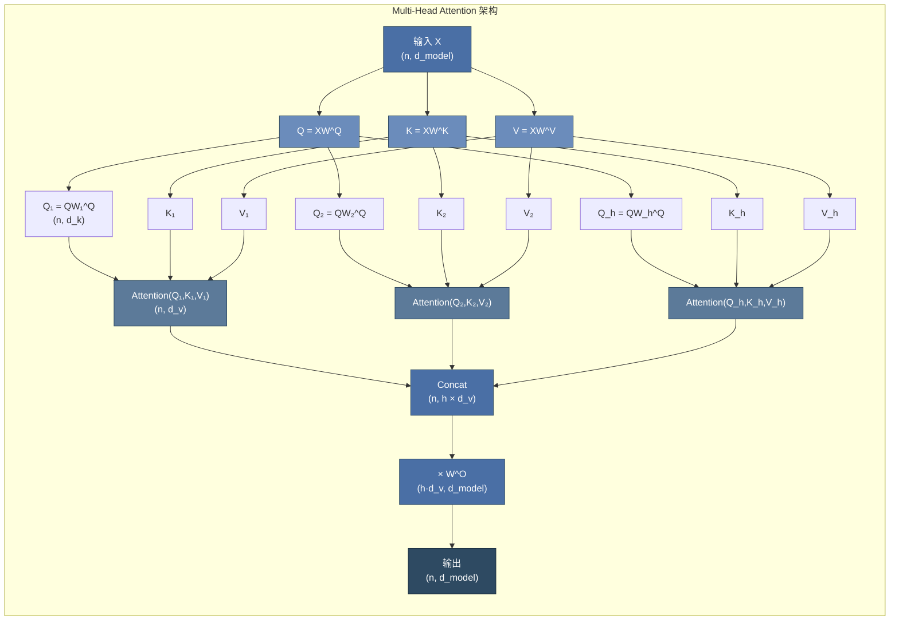

**🎯 为什么需要 Multi-Head？**

1. **多子空间并行**：每个头在不同投影空间中学习，可捕捉不同粒度和类型的依赖关系
2. **增加表达能力**：单头的 $d_k = d_{model}$，多头后每个头的 $d_k = d_{model}/h$，在相同参数量下增加多样性
3. **便于并行计算**：所有头的 Attention 计算可以并行执行

**标准超参数设置**：

| 模型 | $d_{model}$ | heads (h) | $d_k = d_v$ | 每层参数量 |
|------|------------|-----------|-------------|-----------|
| BERT-Base | 768 | 12 | 64 | $4 \times 768^2 = 2.36M$ |
| BERT-Large | 1024 | 16 | 64 | $4 \times 1024^2 = 4.19M$ |
| GPT-3 175B | 12288 | 96 | 128 | $4 \times 12288^2 = 603M$ |

### 12.3.3 PyTorch 实现

```python
class MultiHeadAttention(nn.Module):
    """Multi-Head Attention 完整实现"""

    def __init__(self, d_model, num_heads, dropout=0.1):
        super().__init__()
        assert d_model % num_heads == 0, "d_model 必须被 num_heads 整除"

        self.d_model = d_model
        self.num_heads = num_heads
        self.d_k = d_model // num_heads  # 每个头的维度

        # 线性投影层: W^Q, W^K, W^V
        self.W_Q = nn.Linear(d_model, d_model)
        self.W_K = nn.Linear(d_model, d_model)
        self.W_V = nn.Linear(d_model, d_model)

        # 输出投影: W^O
        self.W_O = nn.Linear(d_model, d_model)

        self.attention = ScaledDotProductAttention(dropout)
        self.dropout = nn.Dropout(dropout)
        self.layer_norm = nn.LayerNorm(d_model)

    def split_heads(self, x, batch_size):
        """
        将 (batch, n, d_model) 拆分为 (batch, h, n, d_k)
        便于并行计算多个头的 Attention
        """
        x = x.view(batch_size, -1, self.num_heads, self.d_k)
        return x.transpose(1, 2)  # (batch, h, n, d_k)

    def forward(self, Q, K, V, mask=None):
        batch_size = Q.size(0)

        # 1. 线性投影
        Q = self.W_Q(Q)  # (batch, n, d_model)
        K = self.W_K(K)
        V = self.W_V(V)

        # 2. 拆分为多头
        Q = self.split_heads(Q, batch_size)  # (batch, h, n, d_k)
        K = self.split_heads(K, batch_size)
        V = self.split_heads(V, batch_size)

        # 3. 缩放点积注意力
        attn_output, attn_weights = self.attention(Q, K, V, mask)
        # attn_output: (batch, h, n, d_k)

        # 4. 合并多头
        attn_output = attn_output.transpose(1, 2).contiguous()
        attn_output = attn_output.view(batch_size, -1, self.d_model)

        # 5. 输出投影
        output = self.W_O(attn_output)
        output = self.dropout(output)

        return output, attn_weights


# ========== 验证 ==========
d_model, num_heads = 512, 8
mha = MultiHeadAttention(d_model, num_heads)

batch_size, seq_len = 2, 10
x = torch.randn(batch_size, seq_len, d_model)

output, weights = mha(x, x, x)
print(f"输入 shape: {x.shape}")
print(f"输出 shape: {output.shape}")  # (2, 10, 512)
print(f"参数量: {sum(p.numel() for p in mha.parameters()):,}")
```

## 12.4 Transformer 完整架构 ⭐⭐⭐⭐⭐

### 12.4.1 Encoder-Decoder 整体架构

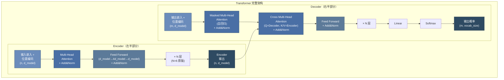

### 12.4.2 编码器 (Encoder)

每个 Encoder Layer 包含两个子层：

1. **Multi-Head Self-Attention**：编码器对自身输入序列计算注意力
2. **Position-wise FFN**：对每个位置独立应用相同的全连接网络

$$\text{FFN}(x) = \max(0, xW_1 + b_1)W_2 + b_2$$

FFN 中间层维度为 $4 \times d_{model}$，即先升维再降维，增加非线性表达能力。

### 12.4.3 解码器 (Decoder)

每个 Decoder Layer 包含三个子层：

1. **Masked Multi-Head Self-Attention**：自回归掩码，防止看到未来位置
2. **Cross Attention**：$Q$ 来自 Decoder，$K$ 和 $V$ 来自 Encoder 输出
3. **Position-wise FFN**：同 Encoder

### 12.4.4 位置编码 (Positional Encoding) ⭐⭐⭐⭐⭐

由于 Self-Attention 是**置换等变的**（permutation invariant），即调换输入顺序不影响输出，模型无法感知序列位置信息。位置编码为每个位置注入唯一标识。

**原版正弦位置编码**：

$$PE_{(pos, 2i)} = \sin\left(\frac{pos}{10000^{2i/d_{model}}}\right)$$

$$PE_{(pos, 2i+1)} = \cos\left(\frac{pos}{10000^{2i/d_{model}}}\right)$$

**特性分析**：
- 每个位置有唯一的编码值
- 位置 $pos+k$ 的编码可由位置 $pos$ 的编码线性表示（利用三角恒等式）
- 可外推到训练时未见过的更长序列（但效果有限）

**现代替代方案 — RoPE (Rotary Position Embedding)** ⭐⭐⭐⭐⭐：

RoPE 是当前大模型（LLaMA、Qwen、Baichuan 等）的标配位置编码。

核心思想：将位置信息编码为 Query 和 Key 向量的**旋转矩阵乘法**，而非直接加到嵌入上。

$$f(q, m) = q \cdot e^{i m \theta} = R_{\Theta,m} \cdot q$$

其中 $R_{\Theta,m}$ 是旋转矩阵，将二维子空间旋转 $m \cdot \theta$ 角度。

**RoPE 的优势**：
1. **相对位置感知**：注意力得分 $q_m^T k_n$ 仅依赖于相对距离 $m-n$，符合自然语言的平移不变性
2. **长序列外推**：可通过调整旋转基实现更长上下文（YaRN、NTK-aware 等技巧）
3. **与 Attention 机制深度融合**：位置信息直接参与 Q/K 计算，而非作为加法偏置

```python
import torch
import math

class SinusoidalPositionalEncoding(nn.Module):
    """原版正弦位置编码"""

    def __init__(self, d_model, max_len=5000, dropout=0.1):
        super().__init__()
        self.dropout = nn.Dropout(dropout)

        pe = torch.zeros(max_len, d_model)
        position = torch.arange(0, max_len, dtype=torch.float).unsqueeze(1)

        div_term = torch.exp(
            torch.arange(0, d_model, 2).float() *
            (-math.log(10000.0) / d_model)
        )

        pe[:, 0::2] = torch.sin(position * div_term)
        pe[:, 1::2] = torch.cos(position * div_term)

        self.register_buffer('pe', pe.unsqueeze(0))  # (1, max_len, d_model)

    def forward(self, x):
        x = x + self.pe[:, :x.size(1), :]
        return self.dropout(x)
```

### 12.4.5 残差连接与层归一化 (Pre-LN vs Post-LN) ⭐⭐⭐⭐⭐

**残差连接（Residual Connection）**：

$$\text{Output} = \text{LayerNorm}(x + \text{Sublayer}(x))$$

作用：缓解梯度消失，使深层网络可训练（继承自 ResNet 的思想）。

**Pre-LN vs Post-LN 之争**：

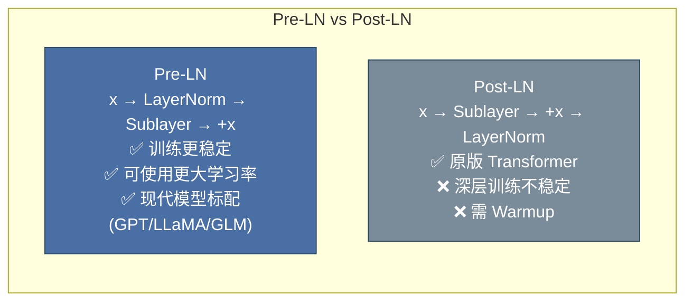

| 特性 | Post-LN（原版） | Pre-LN（现代） |
|------|----------------|---------------|
| 归一化位置 | 子层输出之后 | 子层输入之前 |
| 训练稳定性 | 较差，深层易崩溃 | 好 |
| 学习率 | 需较小学习率 + Warmup | 可使用较大学习率 |
| Warmup 依赖 | 强依赖 | 减少依赖 |
| 代表模型 | 原版 Transformer, BERT | GPT-3/4, LLaMA, T5 |

### 12.4.6 掩码机制：Padding Mask 与 Causal Mask ⭐⭐⭐⭐⭐

掩码是 Transformer 中控制注意力范围的关键机制。

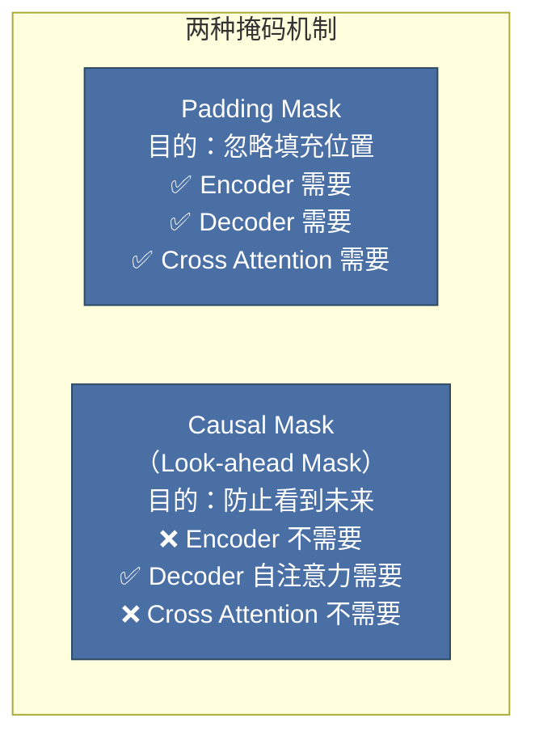

**Padding Mask**：处理变长序列，将填充位置（pad token）的注意力权重设为 $-\infty$，使其在 Softmax 后贡献为 0。

**Causal Mask（因果/下三角掩码）**：用于 Decoder 的自注意力，确保在预测第 $t$ 个位置时只能看到 $\leq t$ 的位置。

```python
def create_causal_mask(seq_len):
    """创建下三角掩码 — Decoder 自注意力使用"""
    # mask[i,j] = True 表示位置 i 可以关注位置 j
    mask = torch.tril(torch.ones(seq_len, seq_len))  # 下三角矩阵
    return mask  # (seq_len, seq_len)

def create_padding_mask(seq, pad_idx=0):
    """创建填充掩码 — 忽略 pad token"""
    # (batch, 1, 1, seq_len)，广播到 (batch, 1, seq_len, seq_len)
    mask = (seq != pad_idx).unsqueeze(1).unsqueeze(2)
    return mask  # (batch, 1, 1, seq_len)

# 因果掩码可视化
causal = create_causal_mask(5)
print("Causal Mask (下三角):")
print(causal.int())
# 输出:
# tensor([[1, 0, 0, 0, 0],
#         [1, 1, 0, 0, 0],
#         [1, 1, 1, 0, 0],
#         [1, 1, 1, 1, 0],
#         [1, 1, 1, 1, 1]])
```

## 12.5 三种 Transformer 变体 ⭐⭐⭐⭐⭐

### 12.5.1 架构对比全景图

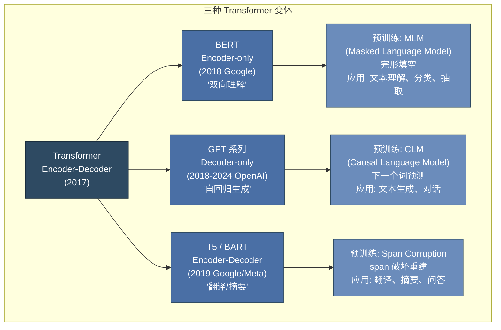

### 12.5.2 Encoder-only：BERT

BERT（Bidirectional Encoder Representations from Transformers）使用 Transformer 的编码器堆栈。

**预训练任务**：
1. **MLM（Masked Language Model）**：随机遮盖 15% 的 token，模型预测被遮盖的词
2. **NSP（Next Sentence Prediction）**：预测两个句子是否相邻（后续被证明作用有限）

**MLM 的细节处理**：被选中的 15% token 中，80% 替换为 `[MASK]`，10% 替换为随机词，10% 保持不变。这种策略缓解预训练-微调的差异。

**应用场景**：文本分类、命名实体识别、问答、语义相似度等**理解类任务**。

### 12.5.3 Decoder-only：GPT 系列 ⭐⭐⭐⭐⭐

GPT（Generative Pre-trained Transformer）仅使用 Transformer 的解码器部分，配合因果掩码进行自回归语言建模。

**预训练任务**：**CLM（Causal Language Modeling）**，即给定前缀 $w_1, ..., w_{t-1}$，预测下一个词 $w_t$。

$$L = -\sum_{t=1}^{T} \log P(w_t | w_1, ..., w_{t-1}; \Theta)$$

### 12.5.4 面试高频题：GPT 为什么采用 Decoder-only？⭐⭐⭐⭐⭐

**核心原因**：

1. **参数效率**：
   - 在相同参数量下，Decoder-only 模型比 Encoder-Decoder 更"深"（所有参数用于生成）
   - Encoder-Decoder 需要两套 Attention 机制，参数分散

2. **自回归天然匹配生成**：
   - 语言生成本质上是自回归的（从左到右逐个生成 token）
   - Decoder-only 的因果掩码完美匹配这一特性

3. **Scaling Law 的发现**：
   - OpenAI 的研究发现，Decoder-only 架构在参数量扩大时表现更优
   - GPT-3（175B）验证了超大规模 Decoder-only 模型的惊人能力

4. **训练效率**：
   - 不需要复杂的 Mask 策略（BERT 的 MLM 只有 15% 位置参与预测）
   - 除 padding、边界和显式忽略的位置外，每个有效 token 都可作为下一 token 预测目标；
     “参与目标的位置更多”不等于端到端数据利用率固定为 100%

5. **Attention 计算的简洁性**：
   - Decoder-only 的 Self-Attention 是**下三角矩阵**，天然适合缓存（KV Cache）
   - Encoder-Decoder 的 Cross Attention 增加了复杂度

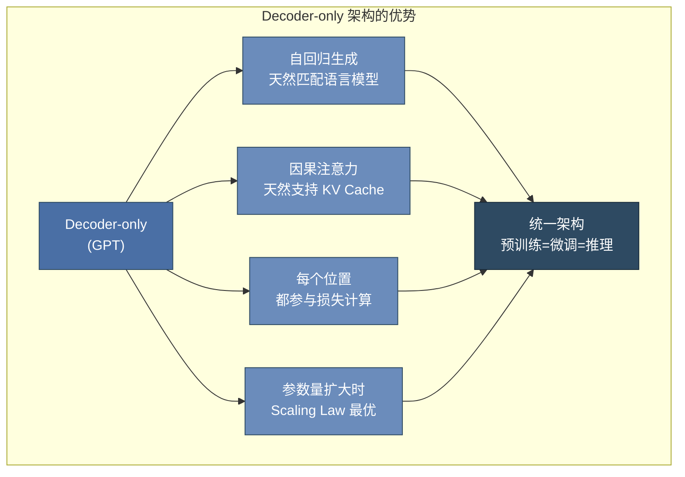

## 12.6 大模型训练流程 ⭐⭐⭐⭐⭐

### 12.6.1 完整训练流程图

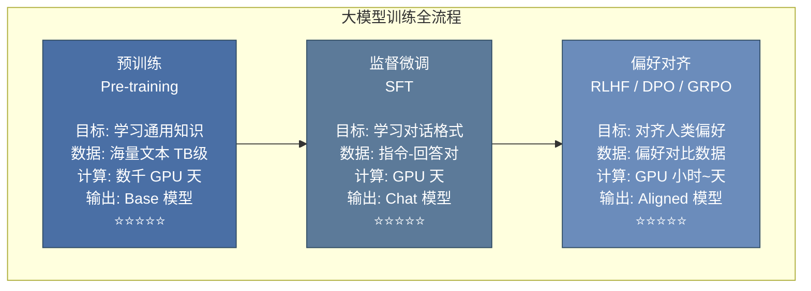

### 12.6.2 预训练（Pre-training）

**目标**：在大规模无标注文本上学习通用的语言表示和世界知识。

**数据**：网页文本（Common Crawl）、书籍、代码、百科、论文等，总量可达数 TB。

**关键超参数**：

| 模型 | 参数量 | 训练数据量 | Batch Size | 学习率 | 训练时长 |
|------|--------|-----------|------------|--------|---------|
| GPT-3 | 175B | 300B tokens | 3.2M | 0.6×10⁻⁴ | ~3000 V100 GPU 天 |
| LLaMA-2 | 70B | 2T tokens | 4M | 1.5×10⁻⁴ | ~1.7M GPU 小时 |
| Qwen-72B | 72B | 3T+ tokens | — | — | — |

**预训练的核心挑战**：
1. **计算成本**：需要大规模 GPU/TPU 集群，成本数百万美元
2. **数据质量**：海量数据中的噪声、重复、有毒内容需清洗
3. **训练稳定性**：深层大模型易出现 loss spike（损失突增），需要精细调参

### 12.6.3 监督微调（SFT）⭐⭐⭐⭐⭐

**目标**：将预训练模型适配到对话/指令遵循格式。

**数据格式**（指令微调数据）：

```json
{
    "messages": [
        {"role": "system", "content": "你是一个有帮助的AI助手。"},
        {"role": "user", "content": "请解释什么是Transformer？"},
        {"role": "assistant", "content": "Transformer是一种深度学习架构..."}
    ]
}
```

**SFT 的技术要点**：
- 通常只计算 assistant 回复部分的 loss（user 部分 loss 设为 0，不反向传播）
- 学习率比预训练小 10-100 倍（通常 1e-5 ~ 2e-5）
- 训练 1-3 个 epoch 即可（过多会导致过拟合）

### 12.6.4 RLHF（基于人类反馈的强化学习）⭐⭐⭐⭐⭐

RLHF 是 ChatGPT 成功的关键技术之一，包含三个步骤：

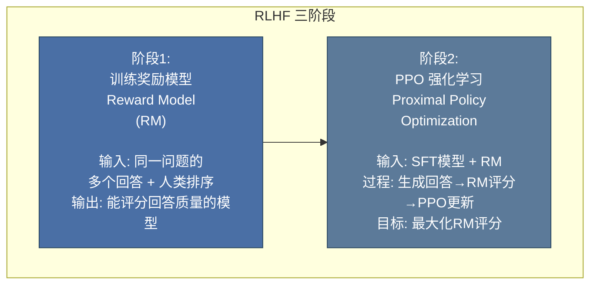

**PPO 的核心原理**：

PPO（Proximal Policy Optimization）是一种策略梯度算法，通过**限制策略更新幅度**来保持训练稳定性。

$$L^{PPO}(\theta) = \hat{\mathbb{E}}_t \left[ \min(r_t(\theta) \hat{A}_t, \text{clip}(r_t(\theta), 1-\epsilon, 1+\epsilon) \hat{A}_t) \right]$$

其中 $r_t(\theta) = \frac{\pi_\theta(a_t|s_t)}{\pi_{\theta_{old}}(a_t|s_t)}$ 是新旧策略比率，$\hat{A}_t$ 是优势函数估计。

**PPO 的组件**：
1. **Actor（策略网络）**：SFT 模型，负责生成回答
2. **Critic（价值网络）**：估计状态价值函数 $V(s)$
3. **Reward Model**：给生成回答打分
4. **Reference Model**：冻结的 SFT 模型，防止策略偏离太远（KL 散度约束）

### 12.6.5 DPO（直接偏好优化）⭐⭐⭐⭐⭐

DPO 是 RLHF 的简化替代，**绕过奖励模型和强化学习**，直接用偏好数据进行优化。

**核心思想**：将 RL 目标转化为分类问题，直接优化策略模型。

$$L_{DPO}(\theta) = -\mathbb{E}_{(x, y_w, y_l)} \left[ \log \sigma \left( \beta \log \frac{\pi_\theta(y_w|x)}{\pi_{ref}(y_w|x)} - \beta \log \frac{\pi_\theta(y_l|x)}{\pi_{ref}(y_l|x)} \right) \right]$$

其中 $y_w$ 是偏好的回答（win），$y_l$ 是不偏好的回答（lose），$\beta$ 控制偏离参考模型的程度。

**DPO vs PPO**：

| 维度 | PPO | DPO |
|------|-----|-----|
| 是否需要 RM | ✅ 需要单独训练 | ❌ 不需要 |
| 是否需要 RL | ✅ PPO 算法 | ❌ 转化为分类损失 |
| 训练稳定性 | 较低（超参数敏感） | **较高** |
| 训练速度 | 慢（采样 + 多轮更新） | **快** |
| 效果上限 | 通常更高（精细优化） | 接近 PPO |
| 实现复杂度 | 高 | **低** |

### 12.6.6 GRPO（群体相对策略优化）⭐⭐⭐⭐⭐

GRPO 是 DeepSeek 团队提出的强化学习算法，用于训练 DeepSeek-R1 等推理模型。

**核心创新 — 去 Critic 化**：

传统 PPO 需要维护 Critic 网络来估计优势函数，GRPO 通过**组内相对比较**替代 Critic：

1. 对每个问题，采样一组回答（Group）
2. 使用奖励模型或规则（如答案正确性）给每个回答打分
3. 优势函数 = 个体得分 - 组内平均分
4. 基于此相对优势更新策略

$$\hat{A}_{i} = \frac{r_i - \text{mean}(\{r_j\}_{j=1}^{G})}{\text{std}(\{r_j\}_{j=1}^{G})}$$

**GRPO 的优势**：
- **无需 Critic 模型**：减少一半参数量和显存占用
- **适合推理任务**：组内比较天然适配有明确答案的数学/编程问题
- **高效扩展**：适合大规模并行训练

```python
# GRPO 伪代码
for batch in dataloader:
    # 1. 对同一问题采样 G 个回答
    responses = [generate(model, question) for _ in range(G)]

    # 2. 奖励评分（可基于规则或奖励模型）
    rewards = [reward_fn(q, r) for r in responses]

    # 3. 计算组内相对优势
    mean_reward = sum(rewards) / G
    advantages = [r - mean_reward for r in rewards]

    # 4. 策略梯度更新
    loss = -sum(advantage * log_prob for advantage, log_prob in zip(advantages, log_probs))
    loss.backward()
```

## 12.7 大模型核心概念 ⭐⭐⭐⭐

### 12.7.1 涌现能力（Emergent Abilities）⭐⭐⭐⭐

“涌现能力”通常指某项能力随模型规模或训练计算增加而出现明显、非线性的测量提升。是否真有相变取决于任务和指标：离散评分可能把平滑改进显示成“突然出现”，因此不应断言小模型上能力完全不存在。

典型涌现能力：
- **In-Context Learning（上下文学习）**：通过 prompt 中的示例学习新任务
- **Chain-of-Thought 推理**：逐步推理复杂问题
- **指令遵循**：理解和执行自然语言指令
- **代码生成**：编写和解释程序代码

**涌现的争议**：有研究认为涌现可能是评估指标的离散性造成的假象，而非真正的相变。但经验上，大模型确实在特定规模后表现出质的飞跃。

**🆕 2026 年更新 — 从"规模涌现"到"推理时涌现"**：

2025-2026年，业界发现了一个更深层的规律：**Test-Time Compute（推理时计算）**可以让中等规模的模型通过"花更多时间思考"达到超大模型的效果。

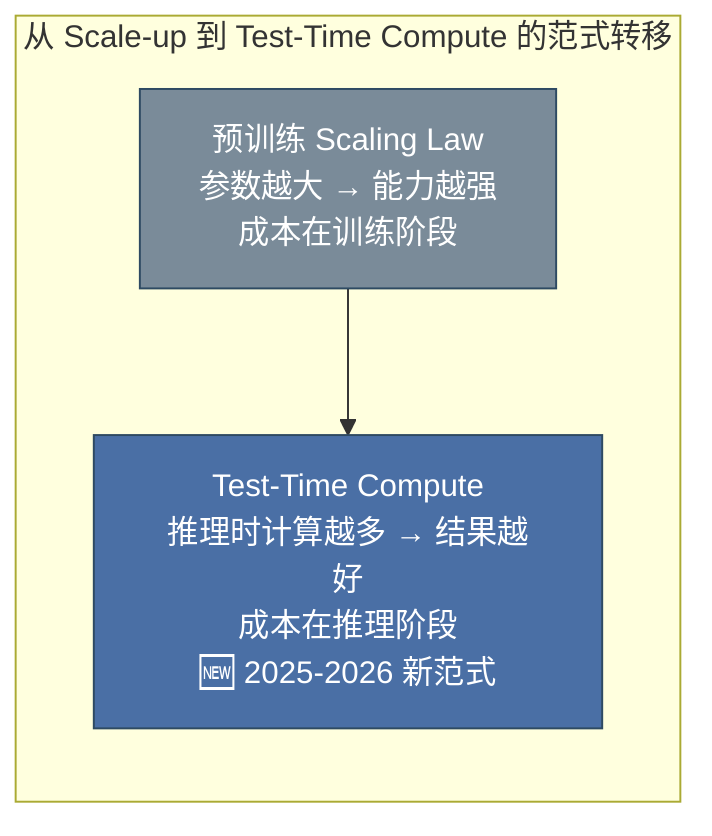

这一范式可见于支持 reasoning/thinking/effort 控制的闭源 API，也可见于 DeepSeek-R1 等公开报告。不同厂商、不同 model ID 的参数名和允许值并不通用，应按对应版本文档调用。

这意味着：**模型能力 = f(参数规模, 推理时计算)**，两个维度都可以独立优化。

### 12.7.2 上下文学习（In-Context Learning）⭐⭐⭐⭐⭐

**定义**：大模型在不更新参数的情况下，仅通过在输入上下文中提供几个示例（few-shot）就能学习新任务的能力。

**三种形式**：

| 形式 | 示例数量 | 说明 |
|------|---------|------|
| Zero-shot | 0 个 | 直接给指令，模型理解执行 |
| One-shot | 1 个 | 提供 1 个输入-输出示例 |
| Few-shot | 2-5 个 | 提供多个示例，引导模型模式 |

**上下文学习的原理假说**：
1. **隐式梯度下降**：Attention 机制在前向传播中执行了类似梯度更新的操作
2. **任务检索**：预训练时见过类似任务，示例帮助定位相关知识
3. **元学习**：模型在预训练过程中学会了"如何学习"

### 12.7.3 MoE 架构（Mixture of Experts）⭐⭐⭐⭐

MoE 是当前大模型扩展的重要方向，核心思想：**用条件计算替代全部计算**。

**核心结构**：

$$y = \sum_{i=1}^{N} G(x)_i \cdot E_i(x)$$

其中 $G$ 是门控网络（Gating Network），$E_i$ 是第 $i$ 个专家网络。门控网络决定每个输入 token 激活哪些专家。

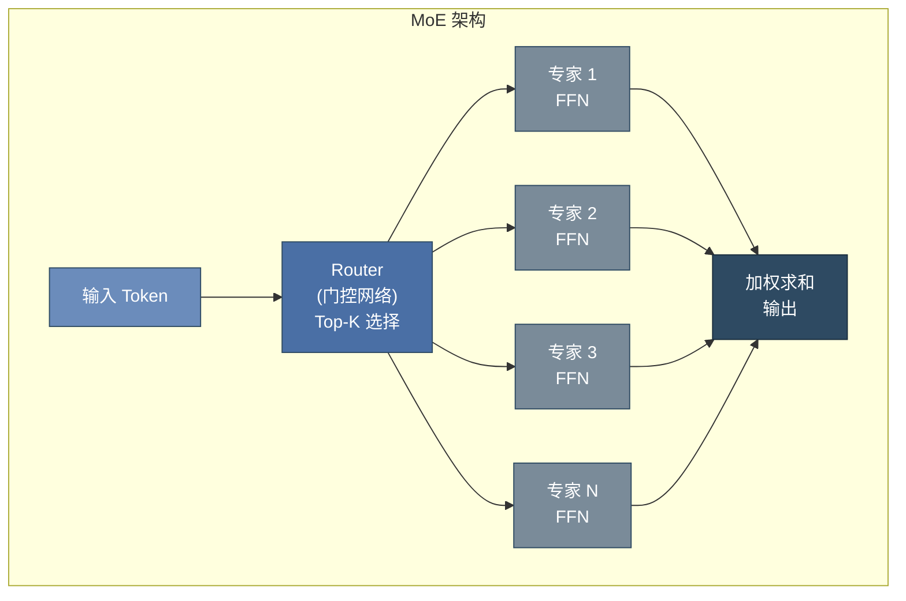

**MoE 的关键设计**：

| 设计 | 说明 | 目的 |
|------|------|------|
| **Top-K 路由** | 只激活 K 个专家（通常 K=1~2） | 减少计算量 |
| **负载均衡损失** | 惩罚路由不均衡 | 防止所有 token 涌向少数专家 |
| **专家容量** | 限制每个专家处理的最大 token 数 | 防止过载 |

**代表模型**：
- Mixtral 8×7B / 8×22B：Mistral AI 的 MoE 模型
- **DeepSeek-V2/V3**：论文公开了 MLA 与 DeepSeekMoE，可据原始报告讨论
- 闭源 GPT、Claude、Gemini 系列的底层参数量和专家结构未公开；不能把行业传闻写成已证实的 MoE 案例

> **证据边界**：API 的“推理模式”“工具调用”或“多智能体产品能力”不等于厂商公开了底层神经网络结构。面试时应明确区分模型架构、训练方法、推理策略和应用层编排。

**MoE 的优势**：
- **参数量大，激活参数量小**：总参数量可达千亿级，但每个 token 只激活部分参数
- **专家特化**：不同专家可学习不同领域知识（语法、数学、代码等）

**MoE 的挑战**：
- 通信开销（多专家分布在不同设备）
- 负载均衡（某些专家可能被过度使用）
- 微调复杂度增加

**🆕 2026 年新趋势 — 推理时计算（Test-Time Compute）成为标配**：

2026年的顶级大模型不再仅依赖预训练参数，而是在推理阶段动态分配计算资源：

| 技术 | 原理 | 效果 | 代表模型 |
|------|------|------|---------|
| **增加推理预算** | 允许模型使用更多内部推理 token/步骤 | 质量、延迟和成本一起变化，收益需按任务评测 | 支持 reasoning/thinking 控制的 API |
| **多样本聚合** | 采样多条独立路径，再按答案或验证器聚合 | 用额外调用换取稳健性；不是所有任务都受益 | Self-Consistency |
| **搜索与回溯** | 在候选计划/解空间中扩展并剪枝 | 适合有可验证状态的任务，成本可能快速增长 | Agent/规划系统 |
| **验证器引导** | 用规则、测试或学习到的验证器筛选结果 | 可减少部分错误，但验证器自身也需评估 | 代码测试、数学验证 |

> **💡 面试要点**：理解 Test-Time Compute 的范式转移 —— 它意味着模型能力可以在不增加参数的情况下通过"思考更久"来提升，这是 2026 年大模型工程的核心优化方向。

## 12.8 截至 2026-07-31 的官方模型信息与选型

模型版本变化快，本节采用两个规则：

1. **只写厂商发布页、API 文档或模型论文明确披露的事实**；闭源架构未知就写“未披露”。
2. **把产品名、API 模型 ID 和快照版本分开**；上线前在供应商模型目录重新确认上下文、价格、地区可用性与弃用日期。

### 12.8.1 官方发布快照

| 厂商 | 截至日期可确认的公开产品线 | 官方可确认信息 | 不应推断 |
|------|----------------------------|----------------|----------|
| **OpenAI** | GPT-5 于 2025-08-07 发布；GPT-5.5 于 2026-04-23 发布；GPT-5.6 于 2026-07-09 发布 | 官方发布页与模型目录说明其 API 能力、工具和版本 | 参数量、是否 MoE、激活参数、训练 GPU 数均未披露 |
| **Anthropic** | Claude Opus 4.7、Opus 4.8；当前型号以官方 Models Overview 为准 | 以 Models Overview、Extended Thinking 和 Effort 文档为准 | 不把“Agent Teams”产品功能等同于已公开的神经符号底层架构，也不把虚构评测场景中的名称当作已发布产品 |
| **Google** | Gemini 3 于 2025-11-18 发布；I/O 2026 又公布 Gemini 3.5 / Gemini Omni 等进展 | 具体可调用型号、模态、上下文和 thinking 参数以 Gemini API 模型页为准 | 不从产品多模态/端侧能力反推未披露参数量与内部模块 |
| **DeepSeek** | DeepSeek-V2、V3 与 R1 有论文或开放权重 | 可引用论文中的参数规模、MLA/MoE、训练阶段和公开 benchmark | 不能把 V3 预训练成本直接写成 R1 全流程成本 |

这张表不是永久排名。工程选型必须用自己的代表性任务集评测质量、延迟、吞吐、工具成功率、结构化输出合规率与总成本。

### 12.8.2 闭源模型如何做专业比较

不要制作“架构竞猜表”。闭源模型更适合比较可验证的接口合同：

- **模型与快照**：记录精确 API model ID、发布日期、弃用策略和区域可用性
- **输入输出能力**：文本/图像/音频、结构化输出、工具调用、上下文限制
- **推理控制**：厂商支持的 reasoning/thinking/effort 参数及其版本约束
- **工程指标**：首 token 延迟、完成延迟、并发吞吐、超时率、工具任务成功率
- **风险指标**：拒答、幻觉、提示注入、数据保留、内容合规与可观测性

模型名称相近不代表请求参数兼容。例如 Anthropic 新型号可能要求 adaptive thinking 与 effort，而旧型号仍使用手动 token budget；必须按选定 model ID 查对应文档。

### 12.8.3 DeepSeek-R1：只引用报告明确给出的口径

DeepSeek-R1 基于 DeepSeek-V3-Base 进行多阶段后训练，并公开了 R1 与蒸馏模型权重。可确认的口径包括：

| 维度 | 可引用事实 | 注意事项 |
|------|------------|----------|
| **基础模型规模** | DeepSeek-V3 / R1 为 671B 总参数、每 token 约 37B 激活参数 | DeepSeek-V2 是 236B 总参数、约 21B 激活参数，不能混写 |
| **公开评测** | R1 仓库报告 MATH-500 pass@1 为 97.3，另列 AIME、Codeforces 等结果 | 必须写 benchmark 名称、版本、采样/评测设置与对比对象 |
| **训练成本** | V3 技术报告给出其预训练约 2.788M H800 GPU-hours，按报告口径折算约 5.576M 美元 | 这不是 R1 的完整数据、预训练、SFT、RL、蒸馏和试验总成本 |
| **后训练方法** | R1 报告描述 cold-start、GRPO、rejection sampling、SFT/RL 阶段 | 不应虚构一个额外的“推理专用层” |
| **开放程度** | 权重可获取，仓库列出许可与派生模型 | “开放权重”不自动等于训练数据、训练代码全部开源 |

**DeepSeek-R1 的核心方法 — 强化学习 + 思维链蒸馏**：

1. **GRPO 强化学习**：通过同一问题的组内相对奖励估计优势，避免单独训练价值模型
2. **冷启动数据**：少量高质量 CoT 数据启动训练
3. **蒸馏**：用 R1 生成的数据微调更小的 Qwen/Llama 基座模型
4. **拒绝采样**：过滤低质量推理路径，保留高质量 CoT

### 12.8.4 可复现的模型选型表

与其写“综合最强/Agent 最强”，不如维护下面的实测表。每一行都应绑定模型快照和评测日期：

| 指标 | 定义示例 | 为什么重要 |
|------|----------|------------|
| **任务质量** | Golden Set 准确率、人工盲评、代码测试通过率 | 公开榜单不一定代表自己的流量 |
| **工具可靠性** | 正确选工具率、参数 schema 合规率、端到端任务成功率 | Agent 失败通常发生在模型外部状态与工具边界 |
| **延迟/吞吐** | TTFT、P50/P95 完成延迟、tokens/s、并发下成功率 | 长上下文与高推理预算会改变尾延迟 |
| **成本** | 输入、缓存输入、输出、工具/搜索与失败重试的单任务总成本 | 只比较标价会漏掉输出长度和重试 |
| **安全合规** | 注入攻击成功率、越权工具调用率、数据驻留/保留策略 | 决定是否能进入生产环境 |
| **可运维性** | 快照固定、限流、批处理、可观测字段、弃用窗口 | “当前最新”会快速变化 |

**参考资料（核对日期：2026-07-31）**：

- [OpenAI：Introducing GPT-5](https://openai.com/index/introducing-gpt-5/)
- [OpenAI：Introducing GPT-5.5](https://openai.com/index/introducing-gpt-5-5/)
- [OpenAI：GPT-5.6](https://openai.com/index/gpt-5-6/)
- [OpenAI API Models](https://developers.openai.com/api/docs/models/all)
- [Anthropic：Claude Opus 4.8](https://www.anthropic.com/news/claude-opus-4-8)
- [Anthropic Models Overview](https://platform.claude.com/docs/en/about-claude/models/overview)
- [Google：Gemini 3](https://blog.google/products-and-platforms/products/gemini/gemini-3/)
- [Google I/O 2026 AI updates](https://blog.google/innovation-and-ai/technology/developers-tools/google-io-2026-collection/)
- [DeepSeek-R1](https://github.com/deepseek-ai/DeepSeek-R1)
- [DeepSeek-V3 Technical Report](https://arxiv.org/abs/2412.19437)
- [DeepSeek-V2](https://github.com/deepseek-ai/DeepSeek-V2)

## 12.9 完整 Transformer PyTorch 实现

```python
import torch
import torch.nn as nn
import math

class TransformerEncoderLayer(nn.Module):
    """Transformer Encoder Layer — 包含 Self-Attention + FFN"""

    def __init__(self, d_model, num_heads, d_ff, dropout=0.1):
        super().__init__()
        self.self_attn = MultiHeadAttention(d_model, num_heads, dropout)
        self.ffn = nn.Sequential(
            nn.Linear(d_model, d_ff),
            nn.GELU(),
            nn.Dropout(dropout),
            nn.Linear(d_ff, d_model),
            nn.Dropout(dropout)
        )
        self.norm1 = nn.LayerNorm(d_model)
        self.norm2 = nn.LayerNorm(d_model)

    def forward(self, x, mask=None):
        # Pre-LN 结构: Norm → Sublayer → Residual
        attn_out, _ = self.self_attn(self.norm1(x), self.norm1(x), self.norm1(x), mask)
        x = x + attn_out

        ffn_out = self.ffn(self.norm2(x))
        x = x + ffn_out

        return x


class TransformerDecoderLayer(nn.Module):
    """Transformer Decoder Layer — 包含 Masked Self-Attn + Cross Attn + FFN"""

    def __init__(self, d_model, num_heads, d_ff, dropout=0.1):
        super().__init__()
        self.self_attn = MultiHeadAttention(d_model, num_heads, dropout)
        self.cross_attn = MultiHeadAttention(d_model, num_heads, dropout)
        self.ffn = nn.Sequential(
            nn.Linear(d_model, d_ff),
            nn.GELU(),
            nn.Dropout(dropout),
            nn.Linear(d_ff, d_model),
            nn.Dropout(dropout)
        )
        self.norm1 = nn.LayerNorm(d_model)
        self.norm2 = nn.LayerNorm(d_model)
        self.norm3 = nn.LayerNorm(d_model)

    def forward(self, x, encoder_output, src_mask=None, tgt_mask=None):
        # Masked Self-Attention
        self_attn_out, _ = self.self_attn(
            self.norm1(x), self.norm1(x), self.norm1(x), tgt_mask
        )
        x = x + self_attn_out

        # Cross Attention (Q from decoder, K/V from encoder)
        cross_attn_out, _ = self.cross_attn(
            self.norm2(x), encoder_output, encoder_output, src_mask
        )
        x = x + cross_attn_out

        # FFN
        ffn_out = self.ffn(self.norm3(x))
        x = x + ffn_out

        return x


class Transformer(nn.Module):
    """完整 Transformer 模型"""

    def __init__(self, src_vocab_size, tgt_vocab_size, d_model=512,
                 num_heads=8, num_layers=6, d_ff=2048, max_len=5000,
                 dropout=0.1):
        super().__init__()

        self.d_model = d_model

        # 嵌入层
        self.src_embedding = nn.Embedding(src_vocab_size, d_model)
        self.tgt_embedding = nn.Embedding(tgt_vocab_size, d_model)

        # 位置编码
        self.pos_encoding = SinusoidalPositionalEncoding(d_model, max_len, dropout)

        # 编码器
        self.encoder_layers = nn.ModuleList([
            TransformerEncoderLayer(d_model, num_heads, d_ff, dropout)
            for _ in range(num_layers)
        ])

        # 解码器
        self.decoder_layers = nn.ModuleList([
            TransformerDecoderLayer(d_model, num_heads, d_ff, dropout)
            for _ in range(num_layers)
        ])

        # 输出层
        self.output_layer = nn.Linear(d_model, tgt_vocab_size)

        self._init_parameters()

    def _init_parameters(self):
        for p in self.parameters():
            if p.dim() > 1:
                nn.init.xavier_uniform_(p)

    def encode(self, src, src_mask=None):
        x = self.src_embedding(src) * math.sqrt(self.d_model)
        x = self.pos_encoding(x)
        for layer in self.encoder_layers:
            x = layer(x, src_mask)
        return x

    def decode(self, tgt, encoder_output, src_mask=None, tgt_mask=None):
        x = self.tgt_embedding(tgt) * math.sqrt(self.d_model)
        x = self.pos_encoding(x)
        for layer in self.decoder_layers:
            x = layer(x, encoder_output, src_mask, tgt_mask)
        return x

    def forward(self, src, tgt, src_mask=None, tgt_mask=None):
        encoder_output = self.encode(src, src_mask)
        decoder_output = self.decode(tgt, encoder_output, src_mask, tgt_mask)
        return self.output_layer(decoder_output)
```

## 12.10 DeepSeek 风格架构深化 ⭐⭐⭐⭐⭐

> 本节依据 DeepSeek-V2/V3 与 R1 的论文、技术报告和公开配置，介绍 **MLA 多头潜注意力**、**auxiliary-loss-free 负载均衡**、**shared experts + fine-grained segmentation**、**Multi-Token Prediction (MTP)**、**FP8 混合精度训练**。示例用于解释机制，不把报告中的单项成本口径外推为“比某闭源模型便宜固定倍数”。

### 12.10.1 MLA 多头潜注意力原理 ⭐⭐⭐⭐⭐

**动机：KV Cache 显存增长**。自回归推理时，各层需要缓存历史 token 的 K/V。设层数 $N_\ell$、KV 头数 $n_{kv}$、每头维度 $d_h$、序列长度 $L$、batch $B$、每元素 $s$ 字节：

$$\text{KVCache bytes} = 2_{\text{K,V}} \times N_\ell \times B \times L \times n_{kv} \times d_h \times s$$

例如一个假设的 60 层 MHA 模型，若 $n_{kv}=128$、$d_h=128$、$L=128K$、$B=1$、使用 fp16，则传统完整 K/V 约为 **480 GiB**（每层约 8 GiB）。这个数字是说明公式的 MHA 基线，不是 DeepSeek-V2 的实际缓存：DeepSeek-V2 为 **236B 总参数、约 21B 激活参数**，并使用 MLA；DeepSeek-V3/R1 才是 **671B 总参数、约 37B 激活参数**。

**MHA / GQA / MQA 对比**：

| 方案 | KV 头数 | KV Cache 大小 | 表达力 | 代表模型 |
|------|---------|--------------|--------|---------|
| **MHA** | $n_h$ | $O(n_h \cdot d_h)$ | 最强 | GPT-3, BERT |
| **MQA** | 1 | $O(d_h)$ | 最弱（质量下降明显） | PaLM, Falcon |
| **GQA** | $g$（分组共享） | $O(g \cdot d_h)$ | 中等 | LLaMA-2/3, Mistral |
| **MLA** | — | $O(d_c)$, $d_c \ll n_h d_h$ | **接近 MHA** | DeepSeek-V2/V3 |

MLA 的核心创新：**不是减少 KV 头数，而是用低秩投影把 KV 压缩到一个低维潜变量 $c_t$ 中缓存**。

**MLA 数学推导**：

1. **下投影（压缩）**：将 hidden $h_t \in \mathbb{R}^{d}$ 压缩为潜向量 $c_t \in \mathbb{R}^{d_c}$

$$c_t = W^{DKV} h_t, \quad d_c \ll n_h \cdot d_h$$

2. **上投影（还原）**：从 $c_t$ 还原出每个头的 K 和 V

$$k_t = W^{UK} c_t \in \mathbb{R}^{n_h \cdot d_h}, \quad v_t = W^{UV} c_t \in \mathbb{R}^{n_h \cdot d_h}$$

3. **Q 侧也做低秩**（DeepSeek-V2 进一步优化）：

$$q_t = W^{UQ}(W^{DQ} h_t)$$

4. **推理时只缓存 $c_t$**（而非完整 K/V），上投影矩阵 $W^{UK}, W^{UV}$ 在推理时才作用，KV Cache 从 $O(n_h d_h)$ 降到 $O(d_c)$。

**RoPE 兼容性 — 解耦维度**。RoPE 对 K 是位置相关的旋转，无法直接吸收进 $W^{UK}$。DeepSeek 的解法：把每个头拆成 **不旋转部分 $d_h^{nope}$**（走 MLA 低秩压缩）+ **旋转部分 $d_h^{rope}$**（单独保留小维度共享 RoPE）：

$$k_t = [k_t^{nope}; \, k_t^{rope}], \quad k_t^{rope} = \text{RoPE}(W^{KR} h_t)$$

**显存收益如何表述**：MLA 缓存低维 KV 潜变量以及位置相关部分，而不是每层每头的完整 K/V。具体字节数必须代入模型层数、`kv_lora_rank`、RoPE 维度、数据类型和运行时布局；不要用一个脱离配置的固定百分比代替计算。

```python
import torch
import torch.nn as nn

class MultiHeadLatentAttention(nn.Module):
    """MLA 简化实现（省略 RoPE 解耦，展示低秩 KV 压缩核心）"""
    def __init__(self, d_model, n_heads, d_head, d_c):
        super().__init__()
        self.n_heads, self.d_head = n_heads, d_head
        self.d_c = d_c  # 压缩潜维度，d_c << n_heads * d_head
        # Q 侧低秩
        self.W_DQ = nn.Linear(d_model, d_c, bias=False)
        self.W_UQ = nn.Linear(d_c, n_heads * d_head, bias=False)
        # KV 侧低秩
        self.W_DKV = nn.Linear(d_model, d_c, bias=False)
        self.W_UK = nn.Linear(d_c, n_heads * d_head, bias=False)
        self.W_UV = nn.Linear(d_c, n_heads * d_head, bias=False)
        self.W_O = nn.Linear(n_heads * d_head, d_model, bias=False)

    def forward(self, h, cache=None):
        # h: (B, L, d_model); cache: 已缓存的 c_{<t} (B, L_prev, d_c)
        c = self.W_DKV(h)                      # (B, L, d_c) ← 只缓存这个！
        q = self.W_UQ(self.W_DQ(h)).view(*h.shape[:2], self.n_heads, self.d_head)
        k = self.W_UK(c).view(*h.shape[:2], self.n_heads, self.d_head)
        v = self.W_UV(c).view(*h.shape[:2], self.n_heads, self.d_head)
        # Scaled dot-product attention（省略 mask/transpose 细节）
        attn = torch.einsum('blhd,bshd->blhs', q, k) / (self.d_head ** 0.5)
        attn = attn.softmax(dim=-1)
        out = torch.einsum('blhs,bshd->blhd', attn, v).reshape(h.shape[0], h.shape[1], -1)
        return self.W_O(out), c  # 返回 c 供后续缓存

# 对比简化缓存量（未计 allocator 对齐、RoPE cache 与运行时元数据）
B, L, n_layers, n_kv, d_h, d_c, bytes_per_elem = 1, 128*1024, 60, 128, 128, 512, 2
mha_kv = 2 * n_layers * B * L * n_kv * d_h * bytes_per_elem / 1024**3
mla_latent = n_layers * B * L * d_c * bytes_per_elem / 1024**3
print(f"传统 MHA KV Cache 基线: {mha_kv:.2f} GiB")
print(f"仅低维 latent（未计 RoPE 部分）: {mla_latent:.2f} GiB")
```

> **💡 面试要点**：MLA = 低秩 KV 压缩 + Q 也低秩 + RoPE 解耦维度。它把 KV Cache 从 $O(n_h d_h)$ 降到 $O(d_c)$，是 DeepSeek 能做长上下文 + 低成本推理的架构基石。

### 12.10.2 auxiliary-loss-free 负载均衡 ⭐⭐⭐⭐

**传统辅助损失（Switch/GShard）的问题**。早期 MoE 用辅助损失强制专家负载均衡：

$$L_{aux} = \alpha \cdot N \sum_{i=1}^{N} f_i \cdot P_i$$

其中 $f_i$ 是专家 $i$ 实际接收 token 的比例，$P_i$ 是 router 分配给专家 $i$ 的平均概率。该损失有三个副作用：(1) 与主任务损失相互干扰，**降低最终模型质量**；(2) 超参 $\alpha$ 难调；(3) 需在反向传播中维护额外的梯度路径。

**DeepSeek 的 auxiliary-loss-free 方案 — bias 项动态调节**。为每个专家维护一个**非梯度学习的路由选择偏置** $b_i$：

$$S_t = \operatorname{TopK}_i(s_{i,t} + b_i), \qquad
g_{i,t} \propto s_{i,t}\;\; (i \in S_t)$$

- $b_i$ 用于决定选中哪些专家；被选专家的门控权重仍由原始 affinity score $s_{i,t}$ 计算
- $b_i$ 不由反向传播更新，而是根据近期负载统计做规则更新
- 每个 step 统计各专家实际负载：若专家 $i$ 负载过高 → 增大 $b_i$ 的相反方向使其变小（被少选）；负载过低 → 调高 $b_i$（被多选）
- 更新规则（符号化）：若 $\text{load}_i > \text{mean}$ 则 $b_i \mathrel{-}= \gamma$；若 $\text{load}_i < \text{mean}$ 则 $b_i \mathrel{+}= \gamma$

**优势对比**：

| 维度 | 辅助损失（Switch/GShard） | auxiliary-loss-free（DeepSeek） |
|------|--------------------------|--------------------------------|
| 与主损失干扰 | ✅ 有，降低质量 | ❌ 无，主损失纯净 |
| 额外超参 | $\alpha$ 难调 | $\gamma$（步长）易调 |
| 均衡效果 | 一般，易塌缩 | 更稳，接近完美均衡 |
| 实现复杂度 | 反向传播改动 | 仅前向 + bias 增减 |

```python
class AuxLossFreeRouter(nn.Module):
    def __init__(self, d_model, n_experts, top_k=1, gamma=0.001):
        super().__init__()
        self.W = nn.Linear(d_model, n_experts, bias=False)
        self.bias = nn.Parameter(torch.zeros(n_experts), requires_grad=False)  # 不学梯度
        self.top_k, self.gamma, self.n_experts = top_k, gamma, n_experts

    def forward(self, h):
        scores = self.W(h)                             # (B, L, N)
        selection_scores = scores + self.bias
        _, topk_idx = selection_scores.topk(self.top_k, dim=-1)
        # bias 只影响选择；门控值来自未加 bias 的原始 score
        topk_val = scores.gather(-1, topk_idx)
        gate = topk_val.softmax(dim=-1)                # (B, L, K)
        return gate, topk_idx

    @torch.no_grad()
    def update_bias(self, topk_idx):
        """每 step 调用：根据实际负载动态调 bias"""
        load = torch.bincount(topk_idx.reshape(-1), minlength=self.n_experts).float()
        load = load / load.sum()
        mean = 1.0 / self.n_experts
        self.bias.add_((load < mean).float() * self.gamma)        # 欠载 → 增大
        self.bias.sub_((load > mean).float() * self.gamma)        # 过载 → 减小
```

> **💡 面试要点**：auxiliary-loss-free 的本质是**把「均衡约束」从损失函数搬到前向偏置项**，用非梯度的动态调节替代辅助损失，避免干扰主任务、提升最终模型质量。

### 12.10.3 shared experts 与 fine-grained segmentation ⭐⭐⭐⭐

DeepSeek-V2 的 MoE 设计有两个关键创新，解决了传统 MoE 的知识碎片化问题。

**(1) Fine-grained Segmentation（细粒度专家切分）**。传统 MoE（如 GShard、Mixtral）用 8~16 个大专家（每个 expert 是完整 FFN）。DeepSeek 把**单个大专家切成多个小专家**，专家总数大幅增加（如 64/160 个），但每个专家更小、每次激活更多个（如 6~8 个）：

| 方案 | 专家数 | 单专家维度 | 每 token 激活 | 激活参数量 |
|------|--------|-----------|--------------|-----------|
| Mixtral 8×7B | 8 | 大 | 2 | ≈13B |
| DeepSeek-V2 | 160 | 小（1/m 大小） | 6 | ≈可比 |

**动机**：(a) 更细粒度的组合，知识组合更灵活；(b) 在相同激活参数下，专家组合空间更大，**专家特化更精细**；(c) 路由更平滑（激活多个小专家 ≈ 软组合）。

**(2) Shared Experts（共享专家常驻）**。研究发现路由器会重复学习「通用知识」（语法、常见短语）到多个专家中，造成冗余。DeepSeek 设置 **K_s 个 shared expert**，**对所有 token 常驻激活**（不参与路由），专门承载通用知识：

$$\text{FFN}_{MoE}(x) = \underbrace{\sum_{i \in S_{shared}} E_i(x)}_{\text{常驻 shared experts}} + \underbrace{\sum_{j \in \text{TopK}(g)} g_j E_j(x)}_{\text{路由 routed experts}}$$

**优势**：(a) 通用知识只学一次到 shared experts，**消除冗余**；(b) routed experts 专注领域特化知识（数学、代码、多语言），**提升参数效率**；(c) 减少「路由抖动」——通用部分不依赖路由，更稳定。

```python
class DeepSeekMoELayer(nn.Module):
    """Shared experts + fine-grained routed experts 简化实现"""
    def __init__(self, d_model, d_ff, n_routed, n_shared, top_k):
        super().__init__()
        # 细粒度路由专家（数量多、单个体积小）
        self.routed_experts = nn.ModuleList([
            nn.Sequential(nn.Linear(d_model, d_ff), nn.SiLU(), nn.Linear(d_ff, d_model))
            for _ in range(n_routed)])
        # 共享专家（常驻，不路由）
        self.shared_experts = nn.ModuleList([
            nn.Sequential(nn.Linear(d_model, d_ff), nn.SiLU(), nn.Linear(d_ff, d_model))
            for _ in range(n_shared)])
        self.router = AuxLossFreeRouter(d_model, n_routed, top_k)
        self.top_k, self.n_shared = top_k, n_shared

    def forward(self, h):
        # 1. shared experts 对所有 token 常驻激活
        shared_out = sum(e(h) for e in self.shared_experts)  # (B, L, d)
        # 2. routed experts 按路由 top-K 激活
        gate, idx = self.router(h)             # gate: (B,L,K), idx: (B,L,K)
        routed_out = torch.zeros_like(h)
        for k in range(self.top_k):
            for e in range(len(self.routed_experts)):
                mask = (idx[..., k] == e)                     # (B, L)
                if mask.any():
                    routed_out += mask.unsqueeze(-1) * gate[..., k].unsqueeze(-1) * self.routed_experts[e](h)
        return shared_out + routed_out
```

> **💡 面试要点**：fine-grained segmentation 把大专家切小、增加组合灵活性；shared experts 把通用知识常驻化、消除冗余。二者共同提升 MoE 的参数效率，是 DeepSeek 在同等参数量下质量更优的关键。

### 12.10.4 Multi-Token Prediction (MTP) ⭐⭐⭐⭐⭐

**动机：打破 next-token 预测的「数据效率天花板」**。传统 CLM 每个 token 只用「上一个 token 预测下一个」一个信号，长程规划能力弱。MTP 让模型在训练时**一次预测后续多个 token**，强制模型做更前瞻的规划。

**MTP 模块结构**。主干仍执行标准 next-token prediction；在其后可串接 $M$ 个 MTP 模块，第 $m$ 个模块再预测更远一个未来 token。DeepSeek-V3 报告采用 **1 个 MTP 模块**，即除了主干的下一 token 目标，再增加一个未来 token 目标：

$$\text{MTP}_m: \quad \hat{y}_{t+m} = \text{LMHead}_m(\text{MTPModule}_m(h_t^{(0)}, \hat{h}_{t+m-1}^{(m-1)}))$$

每个 MTP Module 包含拼接投影与一个 Transformer Block，并复用主模型的 token embedding 和输出 head。这里“1 个 MTP 模块”不能写成“主干 + $M-1$ 个模块”，否则 $M=1$ 时会与“额外预测一个 token”自相矛盾。

**训练 loss 公式**。每个预测深度 $m$ 有独立交叉熵损失，求和：

$$L_{MTP} = \sum_{m=1}^{M} \lambda_m \cdot \mathbb{E}_t\left[ -\log P_{\theta_m}(y_{t+m} \mid y_{\leq t}; \text{MTP}_m) \right]$$

其中 $\lambda_m$ 是各深度损失的权重（通常均等或递减）。**推理时可以丢弃 MTP 头**（仅保留主干），无推理开销；也可保留用于推测解码。

**与推测解码（Speculative Decoding）的关系**：

| 维度 | 标准 Speculative Decoding | MTP 头 |
|------|--------------------------|--------|
| **draft 模型** | 额外的小模型 | 与主模型共享主干，无独立模型 |
| **训练对齐** | draft 与 target 训练目标不同，可能不一致 | MTP 头与主模型**联合训练**，分布天然对齐 |
| **接受率** | 受 draft 质量限制 | 接受率高（同源分布） |
| **额外参数** | 需维护 draft 模型 | 仅少量 MTP 模块，可丢弃 |

推理时：兼容的 MTP/投机解码实现可以先提出多个候选 token，再由主模型并行验证并接受匹配前缀；实际吞吐收益取决于接受率、验证开销、batch 和运行时实现。

```python
import torch
import torch.nn as nn

class MTPModule(nn.Module):
    """单层 MTP 模块：拼接主干隐状态 + 上一级隐状态 → Transformer Block → 隐状态"""
    def __init__(self, d_model, n_heads, vocab_size):
        super().__init__()
        self.proj = nn.Linear(2 * d_model, d_model)   # 拼接投影
        self.block = nn.TransformerEncoderLayer(
            d_model=d_model, nhead=n_heads, dim_feedforward=4*d_model, batch_first=True)
        # 教学简化：真实 DeepSeek-V3 MTP 与主模型共享输出 head。
        self.lm_head = nn.Linear(d_model, vocab_size, bias=False)

    def forward(self, h_main, h_prev_embed):
        # h_main: (B,L,d) 主干隐状态; h_prev_embed: 上一级预测 token 的嵌入
        x = self.proj(torch.cat([h_main, h_prev_embed], dim=-1))
        h_m = self.block(x)                            # (B, L, d)
        logits_m = self.lm_head(h_m)                   # 预测第 t+m 个 token
        return h_m, logits_m

# 训练 loss（伪代码）
# L = ce(logits_0, y_{1:T}) + sum_m lambda_m * ce(logits_m, y_{1+m : T+m})
```

> **💡 面试要点**：MTP 在训练时一次预测多个 token，提升数据效率与规划能力；推理时可丢弃（无开销）或用于同源推测解码（高接受率加速）。是 DeepSeek-V3 训练效率领先的关键技术之一。

### 12.10.5 FP8 混合精度训练 ⭐⭐⭐⭐⭐

**背景**。BF16/FP16 训练大模型时，激活和梯度动态范围大，低精度计算必须控制溢出与舍入误差。FP8 可以降低部分 GEMM 的数据搬运和计算成本，但不会自动让端到端显存或训练时间减半。DeepSeek-V3 是 **671B 总参数、约 37B 激活参数**的 MoE 模型，其报告公开了大规模 FP8 混合精度训练方案；它不是“万亿级模型”。

**FP8 的两种格式**：

| 格式 | 符号 | 指数 | 尾数 | 动态范围 | 适用 |
|------|------|------|------|---------|------|
| **E4M3** | 1 | 4 | 3 | 较小，精度较高 | 前向激活、权重 |
| **E5M2** | 1 | 5 | 2 | 较大，精度较低 | 反向梯度（范围大） |

**低精度 GEMM 与混合策略**。DeepSeek-V3 在主要矩阵乘法中将激活、权重或梯度按相应路径量化为 FP8 输入，同时让参数主存储、优化器状态、累加，以及 embedding、输出头、归一化、attention 和路由等敏感算子保留更高精度。不要把它简化成“所有权重永久以 E4M3 存储、所有梯度固定 E5M2”。

**Block-wise Scaling（分块缩放）—— 数值稳定性的核心**。FP8 单一全局 scale 无法兼顾不同张量区域的动态范围。DeepSeek 采用 **1×128 分块缩放**（对激活按 128 元素分块，权重按 128×128 块），每块独立计算 scale factor：

$$\hat{A}_{block} = \frac{A_{block}}{s_A}, \quad s_A = \max(|A_{block}|) / 448 \quad (\text{E4M3 最大值} \approx 448)$$

**为什么分块？** 大张量不同区域数值范围差异巨大，全局 scale 会导致小数值区域精度丢失（被量化到 0）、大数值区域溢出。分块让每块用最适配的 scale，**显著降低量化误差**。

**GEMM 计算流程**：

```text
FP8 输入 A, W → 反量化到 BF16 → BF16 累加 → FP8 输出
            (硬件 Tensor Core 支持 FP8 输入直接 BF16 累加)
```

```python
import torch

def fp8_blockwise_quantize(x, block_size=128, fmt='e4m3'):
    """分块缩放量化到 FP8（示意，实际在 H100 Tensor Core 上执行）"""
    orig_shape = x.shape
    # 把最后一维切成 block_size 一块
    x = orig_view_as_blocks(x, block_size)              # (..., n_blocks, block_size)
    s = x.abs().amax(dim=-1, keepdim=True) / 448.0      # 每块 scale
    s = s.clamp(min=1e-12)
    x_scaled = (x / s).clamp(-448, 448)                 # 防溢出
    # 模拟 FP8 量化（4 位尾数 → 256 级）
    x_fp8 = fake_fp8_round(x_scaled, fmt=fmt)
    return x_fp8, s

def fp8_gemm(A, W):
    """W8A8 FP8 GEMM：分块量化 → 硬件累加"""
    A_q, sA = fp8_blockwise_quantize(A, block_size=128)  # 激活 1x128 分块
    W_q, sW = fp8_blockwise_quantize(W, block_size=128)  # 权重 128x128 分块
    # Tensor Core: FP8 输入 → BF16 累加（伪代码）
    out_bf16 = fp8_matmul_kernel(A_q, W_q)
    # 反量化：乘回各块的 scale
    out = out_bf16 * (sA * sW.T)
    return out
```

**数值稳定性要点**：
1. **累加过程使用高于 FP8 的精度**，并针对 Tensor Core 累加误差采取工程处理
2. **关键层保持 BF16**：attention softmax、LayerNorm、router 的 logits 等敏感计算不降精度
3. **参数、optimizer state 的具体存储精度按报告与实现核对**，不能由一张格式表推断
4. **动态 scale 更新**：每隔若干步根据实际范围重算 scale，防止漂移

**收益如何回答**：FP8 可显著降低受支持 GEMM 的带宽和算力开销，但端到端收益取决于 GPU、通信、算子覆盖率、序列长度、并行策略和稳定性开销。面试中应引用特定报告或自己的 benchmark，不承诺“显存减半、速度固定提升 1.5～2 倍”。

> **💡 面试要点**：DeepSeek-V3 FP8 方案的重点是细粒度缩放、高精度累加与敏感算子保留高精度，而不是背诵一个覆盖所有张量的 E4M3/E5M2 固定映射。

本节依据 [DeepSeek-V3 Technical Report](https://arxiv.org/abs/2412.19437)；核对日期：2026-07-31。

## 🧭 本章小结

本章应形成以下可复述结论：

- 推导注意力并跟踪 Transformer 中的张量形状。
- 解释训练、解码和 KV Cache 的数据流。
- 比较编码器、解码器及现代架构变体的适用边界。

## ✅ 自测与练习

先合上正文，再回答以下问题；无法说明证据或边界时，回到对应小节复习。

1. 你能否推导注意力并跟踪 Transformer 中的张量形状？
2. 你能否解释训练、解码和 KV Cache 的数据流？
3. 你能否比较编码器、解码器及现代架构变体的适用边界？

## 🧪 配套代码与验收

配套目录：`code/ch12_transformer_architecture/`。从 `code/` 目录运行：

```powershell
python scripts/run_all_examples.py --tier core --chapter ch12 --parallel 1 --timeout 60
```

成功标准：命令退出码为 0，示例输出 `OK`；缺少可选依赖时必须给出明确 `[SKIP]`，而不是 traceback。
真实 API、GPU、模型下载和付费调用不属于默认离线验收，必须按示例 metadata 与章节说明单独确认。

## 🎯 面试题精讲

### 面试题 1：Self-Attention 的计算复杂度？为什么长文本是瓶颈？

**答案**：Self-Attention 的时间复杂度为 $O(n^2 \cdot d)$，其中 $n$ 是序列长度。$QK^T$ 产生 $n \times n$ 的注意力矩阵，与序列长度的**平方**成正比。当 $n=4096$ 时，注意力矩阵有 1600 万元素；当 $n=128K$ 时，有 160 亿元素。这导致显存和计算量急剧增长。优化方案：Flash Attention（分块计算）、稀疏 Attention、线性 Attention、Ring Attention 等。

### 面试题 2：为什么要除以 $\sqrt{d_k}$？

**答案**：当 $d_k$ 较大时，两个随机向量的点积方差与 $d_k$ 成正比。如果不缩放，点积的数值会很大，导致 Softmax 函数进入梯度极小的饱和区（梯度接近 0），产生梯度消失。除以 $\sqrt{d_k}$ 将方差归一化到标准尺度，保持梯度流动。

### 面试题 3：Transformer 为什么用 LayerNorm 而不是 BatchNorm？

**答案**：(1) BatchNorm 依赖 batch 统计，序列长度变化时统计不稳定；(2) NLP 中 batch 内样本长度差异大，padding 位置会影响 batch 统计；(3) LayerNorm 对每个样本独立归一化，不受 batch 大小影响，更适合序列数据；(4) LayerNorm 与 Transformer 的自回归特性兼容更好（Pre-LN 结构）。

### 面试题 4：Padding Mask 和 Causal Mask 的区别？

**答案**：Padding Mask 用于忽略填充位置（pad token），在 Encoder 和 Decoder 中都需要，防止注意力关注无意义的填充位置。Causal Mask（Look-ahead Mask）是下三角矩阵，只在 Decoder 的自注意力中使用，确保模型在预测第 $t$ 个位置时只能看到 $\leq t$ 的位置信息，维持自回归特性。

### 面试题 5：BERT 和 GPT 的主要区别？

**答案**：BERT 是 Encoder-only，使用 MLM（掩码语言模型）预训练，双向注意力，适合理解类任务（分类、NER、问答）。GPT 是 Decoder-only，使用 CLM（因果语言模型）预训练，单向注意力（因果掩码），适合生成类任务（对话、写作、代码生成）。GPT 的自回归特性天然匹配语言生成，且 Decoder-only 架构在 Scaling Law 下表现更优。

### 面试题 6：RLHF 中 PPO 的核心思想是什么？

**答案**：PPO 通过限制策略更新的幅度（clip 机制）来保持训练稳定性。核心公式中的 $\min$ 和 $\text{clip}$ 确保策略不会一次性变化太大。PPO 包含四个组件：Actor（策略网络，生成回答）、Critic（价值网络，估计状态价值）、Reward Model（给回答打分）、Reference Model（冻结的 SFT 模型，通过 KL 散度约束防止策略偏离太远）。

### 面试题 7：DPO 相比 PPO 的优势和劣势？

**答案**：DPO 将 RL 问题转化为分类问题，直接用偏好数据优化策略，**无需奖励模型和 Critic 网络**，实现简单、训练稳定。劣势是与 PPO 相比，DPO 少了在线采样的探索过程，在需要精细优化的场景下效果可能略逊于精心调优的 PPO。但从工程实践角度，DPO 的简洁性使其成为许多团队的首选。

### 面试题 8：什么是涌现能力？有哪些典型表现？

**答案**：涌现能力是对某项能力随规模增加出现明显、非线性测量提升的描述。典型研究对象包括 In-Context Learning、复杂推理和指令遵循，但“突然出现”可能受离散指标影响；更严谨的回答应给出任务、指标和模型规模，而不是断言小模型完全没有该能力。

### 面试题 9：MoE 架构的核心思想是什么？

**答案**：MoE（Mixture of Experts）通过条件计算实现参数高效扩展。每个输入 token 只激活部分专家网络（Top-K 路由），总参数量可达千亿级别但计算量不随参数量线性增长。优势是参数量大、激活参数量小、专家可特化到不同知识领域。挑战是负载均衡（需辅助损失防止路由倾斜）、通信开销和多设备协调。

### 面试题 10：GRPO 相比 PPO 的创新点？

**答案**：GRPO（Group Relative Policy Optimization）的核心创新是**不单独训练价值模型**。它对同一问题采样一组回答，用组内标准化奖励估计相对优势，再结合重要性比率裁剪与 KL 正则更新策略。移除 Critic 能减少一部分模型参数与状态，但 reference model、rollout、激活和优化器仍占显存，不能笼统称“总显存减半”。

### 面试题 11：Test-Time Compute 是什么？为什么它是2026年的关键技术范式？

**答案**：Test-Time Compute（推理时计算）是指在**推理阶段**增加采样、搜索、验证或推理步骤。它可能改善部分复杂任务，但收益依赖模型和任务，并伴随 token、延迟和计算成本，不能只用“思考更久”概括。

核心方法包括：
1. **思维链（Chain-of-Thought）**：生成中间推理步骤
2. **多数投票（Self-Consistency）**：采样多条推理路径，选择最一致的答案
3. **树状搜索**：在推理空间中进行系统性搜索
4. **验证器引导**：训练验证模型评估和筛选中间步骤

代表实现包括支持 reasoning/thinking/effort 控制的模型 API，以及 DeepSeek-R1 等公开报告。参数名、档位与预算限制随 model ID 变化。

**为什么重要**：推理预算成为质量、延迟和成本之间可调的工程变量。但收益不是单调保证；中小模型也不会仅凭“思考更久”就必然达到更大模型的能力，必须在目标任务上评测。

### 面试题 12：闭源模型快速迭代时，如何做可靠选型？

**答案**：先固定候选的精确 model ID/快照和评测日期，再用同一 Golden Set 比较任务质量、工具调用成功率、结构化输出、TTFT/P95 延迟、单位任务总成本与安全指标。上下文、价格和参数能力从官方模型目录读取；厂商未披露的参数量和底层架构标为“未知”，不能用传闻补齐。

### 面试题 13：如何准确解释 DeepSeek-V3 的“约 557.6 万美元”？

**答案**：该数字来自 DeepSeek-V3 技术报告：约 2.788M H800 GPU-hours，按报告采用的每 GPU-hour 2 美元折算，描述的是 **V3 正式预训练**口径。它不包含此前研究、消融、数据构建，也不是 DeepSeek-R1 完整 SFT/RL/蒸馏流程的总成本，更不能拿未公开的 GPT-5 训练总成本计算“1/20”。

可进一步说明公开的效率来源包括 MoE 稀疏激活、MLA、FP8 混合精度和系统工程优化，但每项收益都应以原论文的具体口径陈述。

### 面试题 14：什么是神经符号系统（Neuro-Symbolic）？能否据此判断闭源模型架构？

**答案**：神经符号系统是将**神经网络**（擅长直觉、模式识别、模糊处理）与**符号推理**（擅长精确计算、逻辑推导、可验证结论）相结合的混合架构。

**传统纯神经网络的问题**：
- 数学计算容易出错（如大数乘法）
- 逻辑推理链条长时容易"走神"
- 结论不可验证（黑盒）

但工具调用、代码执行或验证器编排并不能证明模型权重内部采用了神经符号结构。若厂商没有技术报告明确披露，就只能描述可观察的产品/API 行为，不能把 Claude、GPT 或 Gemini 的底层架构写成已证实的神经符号系统。

### 面试题 15：应用层多智能体编排和单模型 Function Calling 有何区别？

**答案**：

| 维度 | 单模型 Function Calling | 应用层多智能体编排 |
|------|-------------------------|--------------------|
| **触发方式** | 模型判断需要时被动调用 | Agent 主动自主协调 |
| **执行模式** | 单线程顺序执行 | 多实例并行协作 |
| **状态管理** | 无状态，每次独立调用 | 持久状态，长期记忆 |
| **任务分解** | 人类预设流程 | Agent 自主分解和分配 |
| **协作能力** | 单个模型 + 工具 | 多个 Claude 实例互相协作 |
| **代表实现** | 单模型工具调用 API | 应用层 coordinator + workers 编排 |

**多智能体编排的核心组件**：
1. **协调器（Coordinator）**：负责任务分解和调度
2. **工作节点（Workers）**：多个独立的 Claude 实例，各有专精领域
3. **状态同步**：节点间共享知识和中间结果
4. **控制边界**：高风险动作仍需确定性授权、预算限制、幂等和人工审批

多智能体并不天然优于单智能体：它会增加成本、状态一致性和故障恢复复杂度，只有可并行、可验证的任务才值得采用。

### 面试题 16：从 MoE 架构角度，为什么大模型可以实现"参数量大但推理成本低"？

**答案**：MoE（Mixture of Experts）通过**条件计算**实现参数效率：

1. **稀疏激活**：每个 token 只激活 Top-K 专家，前向计算不随总参数量线性增长；可用 Mixtral、DeepSeek 等公开结构举例，不使用未披露的 GPT 参数

2. **专家特化**：不同专家学习不同领域的知识（如语法专家、数学专家、代码专家），路由网络将输入分配给最相关的专家，提升单 token 计算效率

3. **负载均衡**：可使用辅助损失，也可使用 DeepSeek-V3 报告的无辅助损失动态路由偏置；目标是减少专家过载和计算热点

4. **通信优化**：2026年的工程实现通过专家并行（Expert Parallelism）和高效的 All-to-All 通信，将多设备间的通信开销降至最低

**类比**：MoE 就像一个大型医院 —— 有 1000 个医生（总参数），但每个病人只需要看 2-3 个专科医生（激活参数），不需要所有医生同时会诊。

## 📋 本章速查表

| 概念 | 公式 / 关键点 |
|------|-------------|
| **Scaled Dot-Product Attention** | $\text{softmax}(\frac{QK^T}{\sqrt{d_k}})V$ |
| **Multi-Head Attention** | $\text{Concat}(\text{head}_1, ..., \text{head}_h)W^O$ |
| **复杂度** | Self-Attention: $O(n^2 \cdot d)$ |
| **除以 $\sqrt{d_k}$ 原因** | 控制点积方差，防止 Softmax 饱和 |
| **位置编码** | 原版正弦 / RoPE（现代大模型标配） |
| **Pre-LN vs Post-LN** | Pre-LN 更稳定，是现代模型标配 |
| **Padding Mask** | 忽略 pad token，Encoder/Decoder 都需要 |
| **Causal Mask** | 下三角矩阵，仅 Decoder 自注意力使用 |
| **Encoder-only** | BERT — MLM 预训练，理解任务 |
| **Decoder-only** | GPT — CLM 预训练，生成任务，Scaling Law 最优 |
| **RLHF 三步骤** | SFT → RM → PPO |
| **DPO** | 绕过 RM 和 RL，直接偏好优化 |
| **GRPO** | 去 Critic 化，组内相对比较 |
| **MoE** | 条件计算，Top-K 路由，负载均衡 |
| **涌现能力** | 规模跨越阈值后突然展现的能力 |
| **KV Cache** | 缓存已计算 K/V，加速自回归解码 |
| **闭源模型事实边界** | 参数量、MoE/神经符号结构未披露时写“未知”；按精确 model ID 和官方目录选型 |
| **DeepSeek-V2 / V3 / R1** | V2 为 236B/约 21B active；V3/R1 为 671B/约 37B active；成本与 benchmark 必须写清报告口径 |
| **Test-Time Compute** | 推理预算是质量、延迟、成本的可调变量，收益需按任务评测 |
| **多智能体编排** | coordinator + workers + 状态/幂等/授权；不天然优于单智能体 |
| **神经符号系统** | 神经网络与显式符号表示/推理结合；工具调用本身不能证明闭源模型采用该内部架构 |

## 🔗 相关章节

- [[11_深度学习与PyTorch]] — 神经网络基础、反向传播、CNN/RNN 等前置知识
- [[13_Prompt_Engineering]] — 理解大模型原理后，学习如何驾驭大模型能力
- [[14_RAG检索增强生成]] — 大模型落地的核心架构，解决知识过时与幻觉问题
- [[16_模型微调与推理优化]] — LoRA 微调、RLHF/DPO/GRPO 对齐技术与推理加速
- [[30_高效序列架构SSM与Mamba]] — 超越 Transformer 的线性复杂度序列建模，与 MLA/长上下文互补
- [[32_DeepSeek风格MoE与MLA深度解析]] — 本章 12.11 节 MLA/auxiliary-loss-free/shared experts/MTP/FP8 的专题深化
- [[33_训练稳定性与诊断]] — 本章 FP8 混合精度与 loss spike 的稳定性工程延伸
- [[34_Tokenizer设计与词表工程]] — 词表与分词是 Transformer 输入侧的前置基础

## 📖 一手参考资料

> 核验日期：2026-08-04。版本、价格、法规、模型能力和 benchmark 以链接页面当前状态为准。

- [[docs/AUTHORITATIVE_SOURCES|章节权威来源索引]]：按章节维护的官方文档、标准、原论文和官方仓库。
