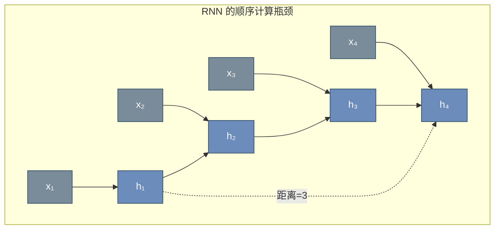
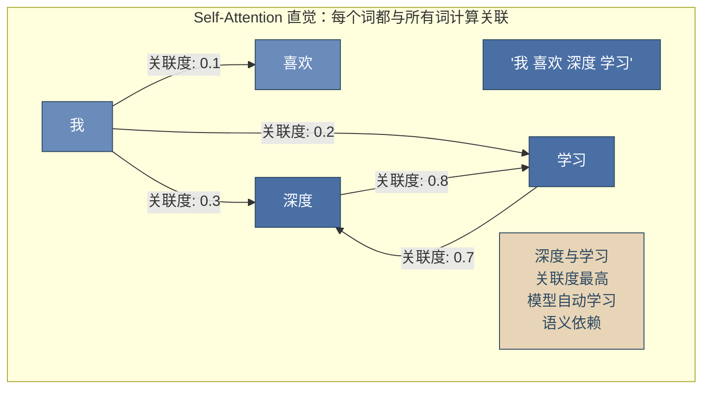
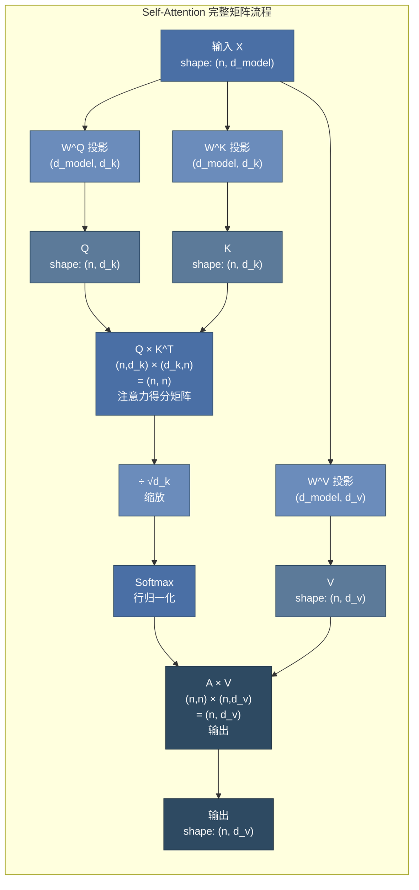
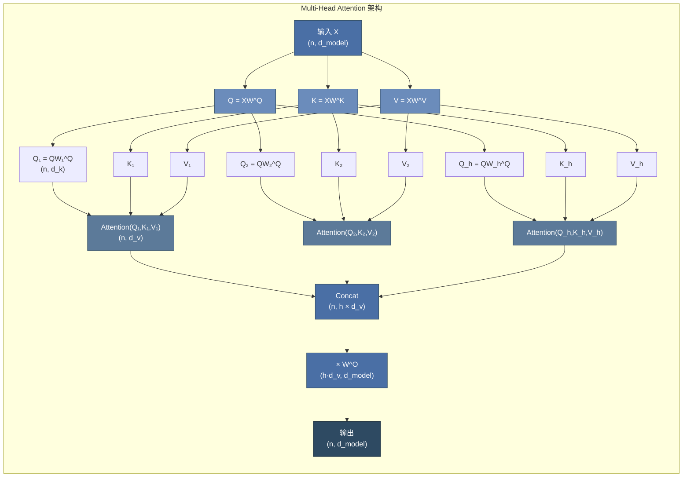

# 第 14 章 Attention 数学与张量形状 ⭐⭐⭐⭐
> [!abstract] 本章导航
> **定位**：第二部分 机器学习与大模型基础中的第 14 章；围绕“Attention 数学与张量形状”建立单一、可追踪的知识主线。
>
> **先修**：[[13_Tokenizer与词表工程|第 13 章 Tokenizer 与词表工程]]。
>
> **学习目标**：
> - 解释 从 RNN 到 Attention ⭐⭐⭐⭐ 的核心问题、机制与适用边界。
> - 实现或评估 Self-Attention 自注意力机制 ⭐⭐⭐⭐⭐ 的最小闭环。
> - 使用可复现证据诊断 Multi-Head Attention ⭐⭐⭐⭐⭐ 的工程取舍与失败模式。
>
> **建议路径**：从 RNN 到 Attention ⭐⭐⭐⭐ → Self-Attention 自注意力机制 ⭐⭐⭐⭐⭐ → Multi-Head Attention ⭐⭐⭐⭐⭐。
>
> **配套代码**：`code/ch15_transformer/`。

本章先回答“从 RNN 到 Attention ⭐⭐⭐⭐”为什么成立，再沿着机制、实现、评估和边界逐步展开。阅读时先建立因果链，再运行或推演示例，最后用章末自测检查能否脱离原文复述。
## 14.1 从 RNN 到 Attention ⭐⭐⭐⭐

### 14.1.1 RNN 的序列瓶颈

RNN 及其变体（LSTM、GRU）在处理序列时面临一个根本性的结构缺陷：**顺序计算依赖**。第 $t$ 步的计算必须等待第 $t-1$ 步完成，形成了无法打破的串行链条。



**RNN 的核心问题**：

| 问题 | 表现 | 根本原因 |
|------|------|---------|
| **无法并行** | $h_t$ 依赖 $h_{t-1}$，无法 GPU 并行加速 | 链式计算结构 |
| **长距离依赖困难** | 相距较远 token 的信息难以有效传递 | 梯度需经过多层传递 |
| **信息瓶颈** | 整个序列信息被压缩到固定维度 $h_T$ | 编码器-解码器架构的瓶颈 |

### 14.1.2 Attention 的关键思想

Attention 机制源于 2014 年 Bahdanau 等人提出的**序列到序列注意力**，其核心突破是：

> 让解码器在生成每个输出时，动态地"关注"输入序列的不同部分，而不是依赖单一的上下文向量。

Transformer 将这一思想推向极致：**完全抛弃 RNN，仅用 Attention 机制建模序列依赖**。

## 14.2 Self-Attention 自注意力机制 ⭐⭐⭐⭐⭐

Self-Attention（自注意力）是 Transformer 的灵魂。它允许序列中的每个位置都能"关注"序列中所有其他位置，并自动学习关注的权重。

### 14.2.1 核心直觉



### 14.2.2 Q/K/V 机制详解 ⭐⭐⭐⭐⭐

Self-Attention 通过三个可学习的投影矩阵 $W^Q, W^K, W^V$ 将输入映射为 **Query**、**Key**、**Value** 三个向量。

**类比理解**：
- **Query (Q)** = "我有什么问题/需求" — 当前位置发起的查询
- **Key (K)** = "我有什么信息/特征" — 每个位置的内容标识
- **Value (V)** = "我的具体内容是什么" — 每个位置的实际信息

**计算过程**：

$$Q = X W^Q, \quad K = X W^K, \quad V = X W^V$$

其中 $X \in \mathbb{R}^{n \times d_{model}}$ 是输入序列的嵌入矩阵，$n$ 是序列长度，$d_{model}$ 是模型维度。

### 14.2.3 Scaled Dot-Product Attention 公式推导 ⭐⭐⭐⭐⭐

**完整的 Attention 计算公式**：

$$\text{Attention}(Q, K, V) = \text{softmax}\left(\frac{QK^T}{\sqrt{d_k}}\right)V$$

**分步拆解**：

**Step 1 — 计算注意力得分矩阵（相似度）**

$$S = QK^T \in \mathbb{R}^{n \times n}$$

$S_{ij}$ 表示第 $i$ 个 Query 与第 $j$ 个 Key 的点积相似度，这是注意力权重计算的关键步骤。

**Step 2 — 缩放（Scaling）**

$$S_{scaled} = \frac{S}{\sqrt{d_k}}$$

**🎯 为什么必须除以 $\sqrt{d_k}$？**

当 $d_k$ 较大时，两个随机向量的点积方差随 $d_k$ 线性增长：

$$\text{Var}(q \cdot k) = \text{Var}\left(\sum_{i=1}^{d_k} q_i k_i\right) = \sum_{i=1}^{d_k} \text{Var}(q_i k_i) = d_k \cdot \sigma^2$$

因此点积的数值量级约为 $O(\sqrt{d_k})$。如果不缩放，Softmax 输入会进入**梯度极小的饱和区**（极值接近 0 或 1），导致梯度消失。

**Step 3 — Softmax 归一化**

$$A = \text{softmax}(S_{scaled})$$

$A \in \mathbb{R}^{n \times n}$ 是**注意力权重矩阵**，每行之和为 1，表示每个位置对其他位置的关注程度。

**Step 4 — 加权求和**

$$\text{Output} = AV \in \mathbb{R}^{n \times d_v}$$

### 14.2.4 矩阵运算完整图解 ⭐⭐⭐⭐⭐



**时间复杂度分析**：

| 操作 | 计算量 | 复杂度 |
|------|--------|--------|
| $Q, K, V$ 投影 | $3 \times n \times d_{model} \times d_k$ | $O(n \cdot d^2)$ |
| $QK^T$ | $n \times n \times d_k$ | $O(n^2 \cdot d)$ |
| Softmax | $n \times n$ | $O(n^2)$ |
| $AV$ | $n \times n \times d_v$ | $O(n^2 \cdot d)$ |
| **总计** | — | **$O(n^2 \cdot d)$** |

Self-Attention 的复杂度瓶颈在于序列长度 $n$ 的**平方关系** — 这也是长上下文优化的核心挑战。

### 14.2.5 PyTorch 实现

```python
import torch
import torch.nn as nn
import math

class ScaledDotProductAttention(nn.Module):
    """Scaled Dot-Product Attention 的完整实现"""

    def __init__(self, dropout=0.1):
        super().__init__()
        self.dropout = nn.Dropout(dropout)
        self.scale = None  # 将在 forward 中设置

    def forward(self, Q, K, V, mask=None):
        """
        Args:
            Q: (batch, n, d_k) - Query
            K: (batch, n, d_k) - Key
            V: (batch, n, d_v) - Value
            mask: (batch, n, n) - 可选的掩码矩阵
        Returns:
            output: (batch, n, d_v)
            attn_weights: (batch, n, n) - 用于可视化
        """
        d_k = Q.size(-1)

        # Step 1: Q × K^T
        scores = torch.matmul(Q, K.transpose(-2, -1))  # (batch, n, n)

        # Step 2: Scale
        scores = scores / math.sqrt(d_k)

        # Step 3: Mask（可选 — Decoder 中必须）
        if mask is not None:
            scores = scores.masked_fill(mask == 0, float('-inf'))

        # Step 4: Softmax
        attn_weights = torch.softmax(scores, dim=-1)  # (batch, n, n)
        attn_weights = self.dropout(attn_weights)

        # Step 5: 加权 V
        output = torch.matmul(attn_weights, V)  # (batch, n, d_v)

        return output, attn_weights


# ========== 验证计算 ==========
batch_size, seq_len, d_k, d_v = 2, 4, 8, 8
Q = torch.randn(batch_size, seq_len, d_k)
K = torch.randn(batch_size, seq_len, d_k)
V = torch.randn(batch_size, seq_len, d_v)

attn = ScaledDotProductAttention()
output, weights = attn(Q, K, V)

print(f"Q shape: {Q.shape}")
print(f"K shape: {K.shape}")
print(f"V shape: {V.shape}")
print(f"注意力权重 shape: {weights.shape}")
print(f"输出 shape: {output.shape}")
print(f"权重行和: {weights[0].sum(dim=-1)}")  # 应全为 1.0
```

## 14.3 Multi-Head Attention ⭐⭐⭐⭐⭐

### 14.3.1 核心思想

Multi-Head Attention 的核心洞察：

> 单次 Attention 只捕捉一种关联模式。使用多组独立的 Q/K/V 投影，让模型同时在不同"子空间"中关注不同类型的信息。

类比 CNN 的多通道卷积：每个注意力头学习不同的特征模式（语法关系、语义关联、指代关系等）。

### 14.3.2 计算流程

$$\text{MultiHead}(Q, K, V) = \text{Concat}(\text{head}_1, ..., \text{head}_h) W^O$$

$$\text{where } \text{head}_i = \text{Attention}(QW_i^Q, KW_i^K, VW_i^V)$$



**🎯 为什么需要 Multi-Head？**

1. **多子空间并行**：每个头在不同投影空间中学习，可捕捉不同粒度和类型的依赖关系
2. **增加表达能力**：单头的 $d_k = d_{model}$，多头后每个头的 $d_k = d_{model}/h$，在相同参数量下增加多样性
3. **便于并行计算**：所有头的 Attention 计算可以并行执行

**标准超参数设置**：

| 模型 | $d_{model}$ | heads (h) | $d_k = d_v$ | 每层参数量 |
|------|------------|-----------|-------------|-----------|
| BERT-Base | 768 | 12 | 64 | $4 \times 768^2 = 2.36M$ |
| BERT-Large | 1024 | 16 | 64 | $4 \times 1024^2 = 4.19M$ |
| GPT-3 175B | 12288 | 96 | 128 | $4 \times 12288^2 = 603M$ |

### 14.3.3 PyTorch 实现

```python
class MultiHeadAttention(nn.Module):
    """Multi-Head Attention 完整实现"""

    def __init__(self, d_model, num_heads, dropout=0.1):
        super().__init__()
        assert d_model % num_heads == 0, "d_model 必须被 num_heads 整除"

        self.d_model = d_model
        self.num_heads = num_heads
        self.d_k = d_model // num_heads  # 每个头的维度

        # 线性投影层: W^Q, W^K, W^V
        self.W_Q = nn.Linear(d_model, d_model)
        self.W_K = nn.Linear(d_model, d_model)
        self.W_V = nn.Linear(d_model, d_model)

        # 输出投影: W^O
        self.W_O = nn.Linear(d_model, d_model)

        self.attention = ScaledDotProductAttention(dropout)
        self.dropout = nn.Dropout(dropout)
        self.layer_norm = nn.LayerNorm(d_model)

    def split_heads(self, x, batch_size):
        """
        将 (batch, n, d_model) 拆分为 (batch, h, n, d_k)
        便于并行计算多个头的 Attention
        """
        x = x.view(batch_size, -1, self.num_heads, self.d_k)
        return x.transpose(1, 2)  # (batch, h, n, d_k)

    def forward(self, Q, K, V, mask=None):
        batch_size = Q.size(0)

        # 1. 线性投影
        Q = self.W_Q(Q)  # (batch, n, d_model)
        K = self.W_K(K)
        V = self.W_V(V)

        # 2. 拆分为多头
        Q = self.split_heads(Q, batch_size)  # (batch, h, n, d_k)
        K = self.split_heads(K, batch_size)
        V = self.split_heads(V, batch_size)

        # 3. 缩放点积注意力
        attn_output, attn_weights = self.attention(Q, K, V, mask)
        # attn_output: (batch, h, n, d_k)

        # 4. 合并多头
        attn_output = attn_output.transpose(1, 2).contiguous()
        attn_output = attn_output.view(batch_size, -1, self.d_model)

        # 5. 输出投影
        output = self.W_O(attn_output)
        output = self.dropout(output)

        return output, attn_weights


# ========== 验证 ==========
d_model, num_heads = 512, 8
mha = MultiHeadAttention(d_model, num_heads)

batch_size, seq_len = 2, 10
x = torch.randn(batch_size, seq_len, d_model)

output, weights = mha(x, x, x)
print(f"输入 shape: {x.shape}")
print(f"输出 shape: {output.shape}")  # (2, 10, 512)
print(f"参数量: {sum(p.numel() for p in mha.parameters()):,}")
```
## 🧭 本章小结

- 从 RNN 到 Attention ⭐⭐⭐⭐：能够说清问题、机制、证据与边界。
- Self-Attention 自注意力机制 ⭐⭐⭐⭐⭐：能够说清问题、机制、证据与边界。
- Multi-Head Attention ⭐⭐⭐⭐⭐：能够说清问题、机制、证据与边界。

## ✅ 自测与练习

1. 不看正文，解释“从 RNN 到 Attention ⭐⭐⭐⭐”解决什么问题，并给出一个不适用场景。
2. 为“Self-Attention 自注意力机制 ⭐⭐⭐⭐⭐”设计一个最小可复现实验，明确输入、指标和通过条件。
3. 比较“Multi-Head Attention ⭐⭐⭐⭐⭐”的至少两种方案，说明质量、成本、延迟或风险取舍。

## 🧪 配套代码与验收

- `code/ch15_transformer/`

```powershell
python code/scripts/run_all_examples.py --chapter ch15 --tier core
```

默认验收不下载模型、不调用付费 API；真实 API 或 GPU 示例必须按 metadata 显式启用。成功标准是相关脚本输出 `OK`，条件不足时输出可解释的 `[SKIP]`。

## 🎯 面试题精讲

回答本章问题时使用四步结构：先给结论，再解释机制，然后给项目证据，最后主动说明适用边界。涉及性能或效果时，补充模型、硬件、数据、并发、版本和统计口径；条件不完整时明确说“需要实测”。

## 📋 本章速查表

| 主题 | 回答主线 |
|---|---|
| 从 RNN 到 Attention ⭐⭐⭐⭐ | 问题 → 机制 → 示例 → 指标 → 边界 |
| Self-Attention 自注意力机制 ⭐⭐⭐⭐⭐ | 问题 → 机制 → 示例 → 指标 → 边界 |
| Multi-Head Attention ⭐⭐⭐⭐⭐ | 问题 → 机制 → 示例 → 指标 → 边界 |

## 🔗 相关章节

- [[13_Tokenizer与词表工程|第 13 章 Tokenizer 与词表工程]]
- [[15_Transformer架构与实现|第 15 章 Transformer 架构与实现]]

## 📖 一手参考资料

> 核验基线：2026-07-31；结构复核：2026-08-05。产品、API、法规、价格与 benchmark 会变化，使用前应再次核验。

- [[docs/AUTHORITATIVE_SOURCES|章节权威来源索引]]：按主题维护官方文档、标准、原论文和官方仓库。
