# 第14章 RAG 检索增强生成 ⭐⭐⭐⭐⭐

> **面试频率**：极高（~90%必问）| **技术热度**：★★★★★ | **2025-2026年最核心考点之一**
>
> RAG（Retrieval-Augmented Generation）是大模型落地企业场景的首选架构。它将大模型的生成能力与外部知识检索相结合，有效解决了模型知识过时、幻觉、无法访问私有数据三大痛点。本章从架构原理到高级优化，从向量索引到评估体系，完整覆盖 RAG 技术栈的每一个关键环节。
>
> 🆕 **2026年更新**：新增 RAG 与 Agent 融合（RAG-as-a-Tool）、多模态 RAG、MCP 集成、端云协同 RAG 等最新趋势。

---

## 14.1 RAG 概述与价值 ⭐⭐⭐⭐

### 14.1.1 为什么需要 RAG

大语言模型（LLM）存在三大固有缺陷：

| 缺陷 | 说明 | RAG 解决方案 |
|------|------|-------------|
| **知识静态** | 模型知识截止于训练日期，无法获知最新信息 | 实时检索外部数据源 |
| **幻觉问题** | 模型会"一本正经地胡说八道" | 检索结果作为事实依据，约束生成 |
| **无私有数据访问** | 无法访问企业内部文档、数据库 | 将私有数据索引化，检索后增强生成 |

### 14.1.2 RAG vs 微调（Fine-tuning）

这是面试中最经典的对比问题之一：

| 维度 | RAG | 微调 |
|------|-----|------|
| **数据更新** | 实时更新（换文档即可） | 需重新训练 |
| **成本** | 低（仅推理+索引构建） | 高（训练计算+数据标注） |
| **知识覆盖** | 可覆盖海量文档 | 受限于模型参数量 |
| **可解释性** | 高（可追溯到来源文档） | 低（知识固化在参数中） |
| **适用场景** | 知识库问答、文档检索 | 风格迁移、特定格式输出、推理能力增强 |
| **实现复杂度** | 中（需搭建检索系统） | 高（需训练 pipeline） |

**核心原则**：知识性问题优先用 RAG，能力和风格问题考虑微调。两者可以结合 —— RAG 提供事实依据，微调后的模型提供更好的推理和生成风格。

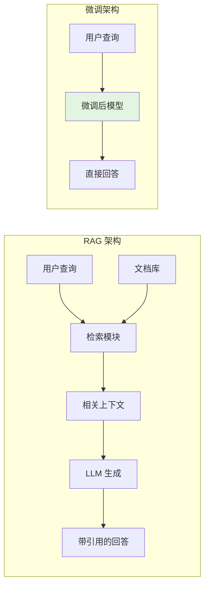

### 14.1.3 RAG 演进路线

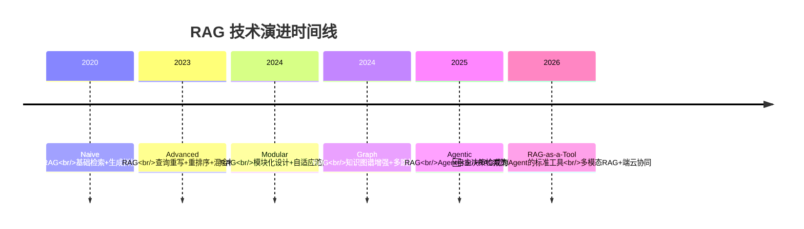

| 阶段 | 特点 | 关键技术 |
|------|------|---------|
| **Naive RAG** | 文档→分块→Embedding→检索→拼接→生成 | 基础向量检索 |
| **Advanced RAG** | 在 Naive 基础上增加优化模块 | Query Rewriting、HyDE、Re-ranking |
| **Graph RAG** | 构建文档知识图谱，支持多跳推理 | 实体抽取、关系建模、图遍历 |
| **Agentic RAG** | Agent 自主决策检索策略和路径 | ReAct、Self-RAG、多工具协同 |

---

## 14.2 RAG 完整架构 ⭐⭐⭐⭐⭐

### 14.2.1 整体流程图

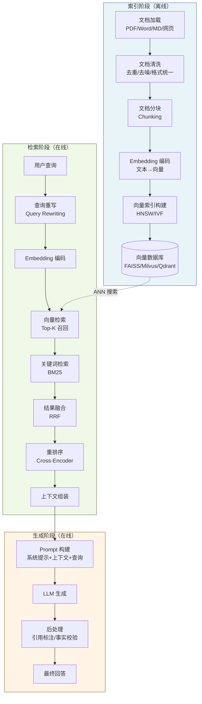

### 14.2.2 各阶段详解

**索引阶段（Indexing）** —— 一次性离线构建：

```python
# RAG 索引阶段完整代码示例
from langchain.document_loaders import PyPDFLoader, TextLoader
from langchain.text_splitter import RecursiveCharacterTextSplitter
from langchain.embeddings import HuggingFaceEmbeddings
from langchain.vectorstores import FAISS
import os

def build_rag_index(
    document_paths: list[str],
    embedding_model: str = "BAAI/bge-large-zh-v1.5",
    chunk_size: int = 512,
    chunk_overlap: int = 50,
    output_dir: str = "./faiss_index"
) -> FAISS:
    """
    构建 RAG 向量索引 - 完整流程
    
    Args:
        document_paths: 文档路径列表（支持 PDF、TXT、MD）
        embedding_model: Embedding 模型名称
        chunk_size: 分块大小（token 数）
        chunk_overlap: 块间重叠（保持语义连续性）
        output_dir: 索引保存目录
    """
    
    # Step 1: 文档加载
    documents = []
    for path in document_paths:
        if path.endswith('.pdf'):
            loader = PyPDFLoader(path)
        else:
            loader = TextLoader(path, encoding='utf-8')
        documents.extend(loader.load())
    
    print(f"[1/4] 加载文档完成：共 {len(documents)} 页/段")
    
    # Step 2: 文档分块
    # RecursiveCharacterTextSplitter 优先按段落分割，再按句子，再按字符
    text_splitter = RecursiveCharacterTextSplitter(
        chunk_size=chunk_size,
        chunk_overlap=chunk_overlap,
        length_function=len,
        separators=["\n\n", "\n", "。", "！", "？", "；", " ", ""]
    )
    chunks = text_splitter.split_documents(documents)
    print(f"[2/4] 文档分块完成：共 {len(chunks)} 个 chunk")
    
    # Step 3: Embedding 编码
    embeddings = HuggingFaceEmbeddings(
        model_name=embedding_model,
        model_kwargs={'device': 'cuda'},
        encode_kwargs={'normalize_embeddings': True}  # 归一化，便于余弦相似度计算
    )
    
    # Step 4: 构建向量索引并保存
    vectorstore = FAISS.from_documents(chunks, embeddings)
    vectorstore.save_local(output_dir)
    print(f"[4/4] 索引构建完成，已保存到 {output_dir}")
    
    return vectorstore
```

**检索+生成阶段（Retrieval + Generation）**：

```python
class RAGPipeline:
    """RAG 检索生成 Pipeline - 完整实现"""
    
    def __init__(self, vectorstore: FAISS, llm_client, top_k: int = 5):
        self.vectorstore = vectorstore
        self.llm = llm_client
        self.top_k = top_k
        
        # RAG Prompt 模板
        self.rag_prompt_template = """基于以下检索到的上下文信息回答问题。
如果上下文中没有相关信息，请明确说明"根据现有资料无法回答"。

上下文：
{context}

---

问题：{question}

请给出准确、简洁的回答。如果涉及数据，请注明来源。"""
    
    def retrieve(self, query: str) -> list[tuple[str, float]]:
        """
        向量检索：返回 (文档内容, 相似度分数) 列表
        """
        results = self.vectorstore.similarity_search_with_score(query, k=self.top_k)
        return [(doc.page_content, score) for doc, score in results]
    
    def generate(self, query: str, retrieved_docs: list[tuple[str, float]]) -> str:
        """
        基于检索结果生成回答
        """
        # 组装上下文
        context = "\n\n---\n\n".join([
            f"[文档 {i+1}]（相似度：{score:.3f}）\n{content}"
            for i, (content, score) in enumerate(retrieved_docs)
        ])
        
        # 构建完整 Prompt
        prompt = self.rag_prompt_template.format(
            context=context,
            question=query
        )
        
        # 调用 LLM
        response = self.llm.chat.completions.create(
            model="gpt-4",
            messages=[{"role": "user", "content": prompt}],
            temperature=0.3,  # RAG 需要低 temperature，保证事实性
        )
        
        return response.choices[0].message.content
    
    def query(self, question: str) -> dict:
        """端到端查询"""
        docs = self.retrieve(question)
        answer = self.generate(question, docs)
        
        return {
            "question": question,
            "answer": answer,
            "sources": [
                {"content": d[:200] + "...", "score": float(s)}
                for d, s in docs
            ]
        }

# 使用
# rag = RAGPipeline(vectorstore, openai_client)
# result = rag.query("公司的年假政策是什么？")
```

---

## 14.3 文档处理与分块策略 ⭐⭐⭐⭐⭐

> **面试金句**：RAG 中最难的地方不是检索，不是生成，而是**文档分块（Chunking）** —— 分不好，检索再强也无用。

### 14.3.1 分块策略对比

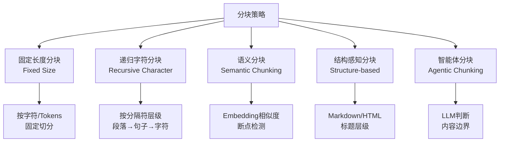

| 分块策略 | 原理 | 优点 | 缺点 | 适用场景 |
|----------|------|------|------|---------|
| **固定长度** | 按固定字符/Tokens 切分 | 简单高效、可预测 | 可能切断语义、上下文丢失 | 快速原型、均匀文档 |
| **递归字符** | 按分隔符层级（段落→句子→词） | 保持自然边界、实现简单 | 对长段落处理不佳 | **最常用**、通用场景 |
| **语义分块** | 检测 Embedding 相似度突变点 | 语义完整、检索精度高 | 计算成本高 | 高质量 RAG、长文档 |
| **结构感知** | 按文档结构（标题、章节） | 完全保持结构语义 | 依赖文档格式 | Markdown、HTML、论文 |
| **智能体分块** | 用 LLM 判断内容边界 | 最智能、质量最高 | 成本高、速度慢 | 高精度要求场景 |

### 14.3.2 递归字符分块（最常用）

```python
from langchain.text_splitter import RecursiveCharacterTextSplitter

# 递归字符分块：按优先级尝试不同分隔符
text_splitter = RecursiveCharacterTextSplitter(
    chunk_size=512,        # 每个 chunk 的目标大小
    chunk_overlap=128,     # 相邻 chunk 的重叠量（关键！保持上下文连贯）
    length_function=len,   # 长度计算函数
    # 分隔符优先级：先按大段落分，不行再按句子，最后按字符
    separators=[
        "\n\n",      # 优先：段落分隔
        "\n",        # 其次：换行
        "。", "！", "？",  # 再其次：句子结束符
        "；",        # 分号
        " ",         # 空格
        ""           # 最后：任意字符
    ],
    is_separator_regex=False,
)

chunks = text_splitter.split_text(long_document_text)
```

### 14.3.3 语义分块（Semantic Chunking）⭐⭐⭐⭐

语义分块的核心思想：在 Embedding 空间中检测**语义突变点**作为分块边界。

```python
from sentence_transformers import SentenceTransformer
import numpy as np

def semantic_chunking(
    text: str,
    embedder: SentenceTransformer,
    window_size: int = 3,       # 滑动窗口大小
    threshold_percentile: float = 80,  # 断点阈值百分位
) -> list[str]:
    """
    语义分块：基于 Embedding 相似度检测语义断点
    
    原理：相邻句子如果语义相似度高（Embedding 余弦相似度高），应属于同一块；
         如果相似度骤降，说明发生了话题转换，应在此处断开。
    """
    
    # Step 1: 按句子分割
    import re
    sentences = re.split(r'(?<=[。！？;])\s+', text)
    sentences = [s.strip() for s in sentences if s.strip()]
    
    if len(sentences) <= window_size:
        return [text]
    
    # Step 2: 计算每个句子的 Embedding
    embeddings = embedder.encode(sentences, normalize_embeddings=True)
    
    # Step 3: 计算相邻窗口的相似度
    similarities = []
    for i in range(len(sentences) - window_size):
        # 窗口 A: [i, i+window_size)
        # 窗口 B: [i+1, i+window_size+1)
        vec_a = np.mean(embeddings[i:i+window_size], axis=0)
        vec_b = np.mean(embeddings[i+1:i+window_size+1], axis=0)
        sim = np.dot(vec_a, vec_b)  # 余弦相似度（已归一化）
        similarities.append(sim)
    
    # Step 4: 检测断点（相似度低于阈值的点）
    threshold = np.percentile(similarities, 100 - threshold_percentile)
    breakpoints = [i for i, sim in enumerate(similarities) if sim < threshold]
    
    # Step 5: 按断点分块
    chunks = []
    start = 0
    for bp in breakpoints:
        end = bp + 1
        chunk = ''.join(sentences[start:end])
        chunks.append(chunk)
        start = end
    chunks.append(''.join(sentences[start:]))
    
    return chunks
```

### 14.3.4 分块大小选择指南

| Chunk 大小 | Tokens | 适用场景 | 注意事项 |
|------------|--------|---------|---------|
| **小 Chunk** | 128-256 | 细粒度事实检索、FAQ | 丢失上下文，需大 overlap |
| **中 Chunk** | 512 | **通用场景**、均衡选择 | overlap 建议 10-20% |
| **大 Chunk** | 1024+ | 长文档理解、叙事类 | 检索精度下降，需重排序 |

**overlap 的作用**：相邻 chunk 重叠部分确保跨边界的语义不被切断，建议 overlap = 10-20% chunk_size。

### 14.3.5 元数据增强（Metadata Enrichment）

给每个 chunk 附加元数据，提升检索精度：

```python
# 元数据增强示例
chunk_with_metadata = {
    "page_content": "年假政策：员工每年享有 15 天带薪年假...",
    "metadata": {
        "source": "公司人事手册_v2024.pdf",  # 来源文档
        "page": 15,                           # 页码
        "section": "第三章 休假制度",          # 章节
        "doc_type": "policy",                 # 文档类型
        "created_at": "2024-01-15",           # 创建日期
    }
}
```

---

## 14.4 Embedding 与向量数据库 ⭐⭐⭐⭐⭐

### 14.4.1 Embedding 原理

Embedding 是将**文本映射到高维稠密向量空间**的技术，语义相似的文本在向量空间中距离相近。

$$
\text{Embedding}: \mathcal{T} \rightarrow \mathbb{R}^d \quad \text{（通常 } d = 384, 768, 1024, 1792 \text{）}
$$

**相似度度量方式**：

| 度量方式 | 公式 | 特点 | 适用 |
|----------|------|------|------|
| **余弦相似度** | $\cos(\theta) = \frac{A \cdot B}{\|A\| \|B\|}$ | 忽略向量长度，只关注方向 | **最常用**、语义相似度 |
| **欧氏距离** | $\|A - B\|_2 = \sqrt{\sum(a_i - b_i)^2}$ | 考虑向量长度 | 稠密向量空间 |
| **点积** | $A \cdot B = \sum a_i b_i$ | 计算最快，需归一化 | 归一化后的向量 |

```python
# Embedding 相似度计算示例
import numpy as np
from sentence_transformers import SentenceTransformer

model = SentenceTransformer('BAAI/bge-large-zh-v1.5')

# 编码文本
sentences = [
    "机器学习是人工智能的一个分支",
    "深度学习是机器学习的一种方法",
    "苹果是一种水果",
]
embeddings = model.encode(sentences, normalize_embeddings=True)

# 计算余弦相似度矩阵
sim_matrix = np.dot(embeddings, embeddings.T)
print("相似度矩阵：")
# [[1.0,  0.85, 0.12],
#  [0.85, 1.0,  0.08],
#  [0.12, 0.08, 1.0 ]]
# 前两句相似度高（都是 AI 相关），第三句差异大
```

### 14.4.2 Embedding 模型选型

| 模型 | 维度 | 语言 | 特点 | 适用场景 |
|------|------|------|------|---------|
| **text-embedding-3** | 3072 | 多语言 | OpenAI 官方，效果顶尖 | 不差钱的生产环境 |
| **BAAI/bge-m3** | 1024 | 中英 | 微软+北航开源，多粒度 | **中文 RAG 首选** |
| **BAAI/bge-large-zh** | 1024 | 中文 | BGE 系列中文大模型 | 中文高精度场景 |
| **sentence-transformers/all-MiniLM** | 384 | 多语言 | 轻量快速 | 资源受限、快速原型 |
| **moka-ai/m3e-base** | 768 | 中文 | 中文社区 popular | 中文通用 |
| **nvidia/NV-Embed-v2** | 4096 | 多语言 | NVIDIA 开源，SOTA 水平 | 高质量要求 |

**2024-2025 选型建议**：中文场景首选 **BGE-M3**（支持密集+稀疏+多向量三种检索模式），英文场景首选 **text-embedding-3-large** 或 **NV-Embed**。

```python
# BGE-M3 使用示例（支持多向量检索）
from FlagEmbedding import BGEM3FlagModel

model = BGEM3FlagModel('BAAI/bge-m3', use_fp16=True)

sentences = ["什么是机器学习？", "Machine learning is..."]
embeddings = model.encode(
    sentences,
    batch_size=12,
    max_length=8192,
    return_dense=True,      # 稠密向量（语义匹配）
    return_sparse=True,     # 稀疏向量（关键词匹配）
    return_colbert_vecs=True,  # ColBERT 多向量（细粒度匹配）
)

# dense_embeddings: 用于语义相似度搜索
# sparse_embeddings: 用于关键词匹配（类似 BM25）
# colbert_vecs: 用于 Late Interaction 细粒度匹配
```

### 14.4.3 ANN 近似最近邻搜索

向量数据库的核心能力是**ANN（Approximate Nearest Neighbor）搜索** —— 在海量高维向量中快速找到与查询向量最相似的 $k$ 个向量。

**暴力精确搜索（Flat）** 的复杂度为 $O(n \times d)$，当 $n > 100$ 万时不可接受。ANN 通过**牺牲极少量精度**换取 **100-1000 倍速度提升**。

### 14.4.4 HNSW 索引原理 ⭐⭐⭐⭐⭐

HNSW（Hierarchical Navigable Small World）是目前最主流的 ANN 索引算法，基于**多层图结构**。

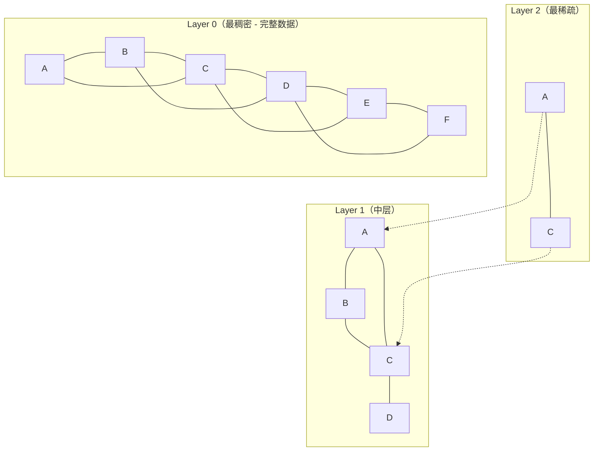

**HNSW 搜索过程**：

1. **从最高层进入**：选择最顶层的一个随机入口点
2. **贪心下降**：在每一层用贪心算法找到距离查询点最近的节点
3. **层间传递**：将当前层最近节点作为下一层的入口点
4. **底层精确搜索**：在最稠密的底层进行精细搜索，返回最终 Top-K

**时间复杂度**：搜索 $O(\log N)$，构建 $O(N \log N)$

```python
# HNSW 参数调优
import faiss

def create_hnsw_index(vectors: np.ndarray, m: int = 32, ef_construction: int = 200) -> faiss.Index:
    """
    创建 HNSW 索引
    
    参数说明：
    - M: 每个节点的最大连接数（越大图越稠密，精度↑内存↑）
    - efConstruction: 构建时的搜索深度（越大构建越慢，精度↑）
    - efSearch: 搜索时的搜索深度（越大搜索越慢，精度↑）
    """
    dim = vectors.shape[1]
    
    # 使用 Inner Product（需要向量已归一化，等价于余弦相似度）
    index = faiss.IndexHNSWFlat(dim, m, faiss.METRIC_INNER_PRODUCT)
    index.hnsw.efConstruction = ef_construction
    
    # 添加向量（训练+添加）
    index.add(vectors)
    
    # 搜索时可调整 efSearch 平衡速度和精度
    index.hnsw.efSearch = 128  # 默认 16，增大可提升召回率
    
    return index
```

### 14.4.5 IVF 索引原理 ⭐⭐⭐⭐

IVF（Inverted File Index，倒排文件索引）先将向量空间划分为 $nlist$ 个** Voronoi 单元**（聚类中心），查询时只搜索最近的几个单元。

```python
def create_ivf_index(vectors: np.ndarray, nlist: int = 100) -> faiss.Index:
    """
    IVF 索引构建
    
    参数：
    - nlist: 聚类中心数量（通常 4*sqrt(N) ~ 16*sqrt(N)）
    - nprobe: 查询时搜索的单元数（越大精度越高，速度越慢）
    """
    dim = vectors.shape[1]
    quantizer = faiss.IndexFlatIP(dim)  # 用于聚类的精确索引
    index = faiss.IndexIVFFlat(quantizer, dim, nlist, faiss.METRIC_INNER_PRODUCT)
    
    # IVF 需要先训练
    index.train(vectors)
    index.add(vectors)
    
    # 搜索参数：探索多少个聚类单元
    index.nprobe = 10  # 默认 1，增大提升召回率
    
    return index
```

**HNSW vs IVF 对比**：

| 维度 | HNSW | IVF |
|------|------|-----|
| **构建速度** | 较慢 | 较快 |
| **搜索速度** | 极快 | 快 |
| **内存占用** | 高（存储图结构） | 中 |
| **召回率** | 高（>95%@Top10） | 中（依赖 nprobe） |
| **增量添加** | 支持 | 支持但需重新训练（IVF） |
| **适用规模** | 千万级 | 亿级（IVF+PQ） |
| **调参复杂度** | 低 | 中 |

### 14.4.6 PQ 乘积量化 ⭐⭐⭐

PQ（Product Quantization）将高维向量压缩为低维表示，大幅降低内存占用。

```python
def create_ivfpq_index(vectors: np.ndarray, nlist: int = 100, m: int = 16, nbits: int = 8):
    """
    IVF + PQ 组合索引
    
    参数：
    - m: 将向量分成 m 个子向量（m 必须整除 dim）
    - nbits: 每个子量化的比特数（通常 8）
    
    内存节省：原始 dim*32bit → m*8bit，压缩率约 dim*4/m
    """
    dim = vectors.shape[1]
    quantizer = faiss.IndexFlatIP(dim)
    # PQ 参数: m=子向量数, nbits=每个子向量量化比特
    index = faiss.IndexIVFPQ(quantizer, dim, nlist, m, nbits)
    index.train(vectors)
    index.add(vectors)
    index.nprobe = 10
    return index
```

### 14.4.7 主流向量数据库对比 ⭐⭐⭐⭐

| 特性 | FAISS | Milvus/Zilliz | Qdrant | Pinecone | Chroma | Weaviate |
|------|-------|--------------|--------|----------|--------|----------|
| **开源** | ✅ | ✅ | ✅ | ❌ | ✅ | ✅ |
| **本地部署** | ✅ | ✅ | ✅ | ❌ | ✅ | ✅ |
| **分布式** | ❌ | ✅ | ✅ | ✅ | ❌ | ✅ |
| **索引算法** | HNSW/IVF/PQ | HNSW/IVF/Disk | HNSW | 多种 | HNSW | HNSW |
| **混合搜索** | 需手动实现 | ✅ 内置 | ✅ 内置 | ✅ | ✅ | ✅ |
| **元数据过滤** | 需手动 | ✅ | ✅ | ✅ | ✅ | ✅ |
| **性能** | 极高 | 高 | 高 | 高 | 中 | 高 |
| **适用规模** | 百万级 | 十亿级 | 亿级 | 十亿级 | 百万级 | 亿级 |
| **云托管** | ❌ | ✅ | ✅ | ✅ | ❌ | ✅ |
| **选型建议** | 原型/嵌入式 | 企业大规模 | **中小规模首选** | 快速上云 | 入门学习 | 多模态 |

**2025 年选型建议**：
- **原型/学习**：FAISS（免费、速度快）
- **中小规模生产**（<1000万）：Qdrant（Rust 编写、功能全、易部署）
- **大规模生产**：Milvus（分布式、功能最全面）
- **快速上云**：Pinecone（Serverless、免运维）


---

## 14.5 检索与重排序 ⭐⭐⭐⭐⭐

### 14.5.1 混合搜索（Hybrid Search）⭐⭐⭐⭐⭐

纯向量检索在以下场景表现不佳：
- **精确匹配需求**：ID、型号、人名、缩写（如"GPT-4"、"iPhone 15"）
- **罕见词/专业术语**：向量可能无法很好表示低频词
- **数字/日期**：语义相似但数值不同（如"2023年"和"2024年"向量可能很近）

**混合搜索 = 稠密检索（向量相似度）+ 稀疏检索（BM25/关键词）**

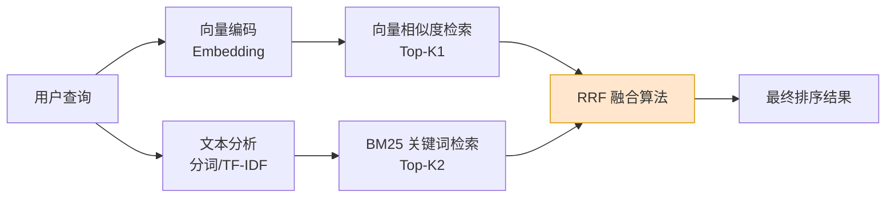

#### BM25 原理

BM25 是经典的关键词匹配评分函数：

$$
\text{BM25}(q, d) = \sum_{t \in q} \text{IDF}(t) \cdot \frac{f(t, d) \cdot (k_1 + 1)}{f(t, d) + k_1 \cdot (1 - b + b \cdot \frac{|d|}{\text{avgdl}})}
$$

其中：
- $f(t, d)$：词项 $t$ 在文档 $d$ 中的词频
- $\text{IDF}(t) = \log \frac{N - n(t) + 0.5}{n(t) + 0.5}$：逆文档频率
- $k_1$：控制词频饱和度（通常 1.2-2.0）
- $b$：控制文档长度归一化（通常 0.75）

```python
# 混合搜索实现
from rank_bm25 import BM25Okapi
import numpy as np

class HybridRetriever:
    """
    混合检索器：向量相似度 + BM25 融合
    """
    
    def __init__(self, documents: list[str], embeddings: np.ndarray, k1: float = 1.5, b: float = 0.75):
        self.documents = documents
        self.embeddings = embeddings  # 向量 [N, D]
        
        # BM25 初始化
        tokenized_docs = [doc.lower().split() for doc in documents]
        self.bm25 = BM25Okapi(tokenized_docs, k1=k1, b=b)
        
        # 向量检索用 FAISS
        import faiss
        self.dim = embeddings.shape[1]
        self.index = faiss.IndexFlatIP(self.dim)  # Inner Product = 余弦（已归一化）
        self.index.add(embeddings)
    
    def search(
        self,
        query: str,
        query_embedding: np.ndarray,
        top_k: int = 10,
        alpha: float = 0.5,  # 向量权重
        beta: float = 0.5,   # BM25 权重
    ) -> list[tuple[int, float]]:
        """
        混合搜索 + RRF 融合
        
        Args:
            alpha: 向量检索的融合权重
            beta: BM25 检索的融合权重
        """
        # 向量检索 Top-K
        vector_scores, vector_indices = self.index.search(
            query_embedding.reshape(1, -1), k=min(top_k * 2, len(self.documents))
        )
        vector_scores = vector_scores[0]
        vector_indices = vector_indices[0]
        
        # BM25 检索 Top-K
        tokenized_query = query.lower().split()
        bm25_scores = np.array(self.bm25.get_scores(tokenized_query))
        bm25_top_indices = np.argsort(bm25_scores)[::-1][:top_k * 2]
        
        # RRF（Reciprocal Rank Fusion）融合
        # RRF 公式：score = sum(1 / (k + rank))，k 通常为 60
        rrf_k = 60
        rrf_scores = {}
        
        # 向量检索排名贡献
        for rank, idx in enumerate(vector_indices):
            if idx < 0:  # FAISS 返回 -1 表示不够结果
                break
            rrf_scores[idx] = rrf_scores.get(idx, 0) + alpha / (rrf_k + rank + 1)
        
        # BM25 排名贡献
        for rank, idx in enumerate(bm25_top_indices):
            rrf_scores[idx] = rrf_scores.get(idx, 0) + beta / (rrf_k + rank + 1)
        
        # 按 RRF 分数排序
        sorted_results = sorted(rrf_scores.items(), key=lambda x: x[1], reverse=True)
        return sorted_results[:top_k]

# 使用
# retriever = HybridRetriever(docs, embeddings)
# results = retriever.search("query text", query_embedding, top_k=5, alpha=0.7, beta=0.3)
```

**RRF（Reciprocal Rank Fusion）公式**：

$$
\text{RRF Score}(d) = \sum_{i} \frac{w_i}{k + \text{rank}_i(d)}
$$

其中 $k=60$ 是平滑常数，$w_i$ 是各检索方法的权重，$\text{rank}_i(d)$ 是文档 $d$ 在第 $i$ 个检索结果中的排名。

### 14.5.2 Re-ranking（重排序）⭐⭐⭐⭐⭐

初次检索（召回阶段）追求**速度快、召回率高**，但精度有限。Re-ranking 用更精确的模型对 Top-K 结果重新排序。

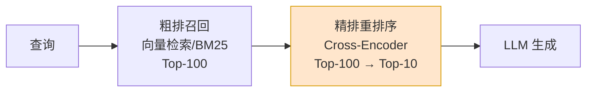

**为什么需要两阶段？**

| 阶段 | 模型 | 复杂度 | 候选数 | 目标 |
|------|------|--------|--------|------|
| **召回（Retrieval）** | Bi-Encoder / Embedding | $O(N)$，可索引 | 万~百万 | 快速缩小范围 |
| **精排（Re-ranking）** | Cross-Encoder | $O(K \times L)$，需逐对计算 | 百级别 | 精确排序 |

**Bi-Encoder vs Cross-Encoder**：

```python
# Bi-Encoder：分别编码查询和文档，点积计算相似度
# 优点：可预先计算文档向量，搜索速度快
# 缺点：查询和文档没有交互，精度有限

query_embedding = bi_encoder.encode("什么是 RAG？")   # [768]
doc_embedding = bi_encoder.encode("RAG 是一种将检索和生成结合的技术...")  # [768]
similarity = np.dot(query_embedding, doc_embedding)  # 标量

# Cross-Encoder：将查询和文档拼接后一起编码
# 优点：查询和文档在注意力层充分交互，精度高
# 缺点：无法预计算，每次都要完整前向传播

pair_input = "[CLS] 什么是 RAG？ [SEP] RAG 是一种将检索和生成结合的技术..."
score = cross_encoder.predict(pair_input)  # 相关性分数 [0, 1]
```

```python
# Cross-Encoder Re-ranking 实战
from sentence_transformers import CrossEncoder

class Reranker:
    """Cross-Encoder 重排序器"""
    
    def __init__(self, model_name: str = "BAAI/bge-reranker-large"):
        """
        推荐模型：
        - BAAI/bge-reranker-large：中文场景首选
        - BAAI/bge-reranker-base：速度优先
        - cross-encoder/ms-marco-MiniLM-L-6-v2：英文场景
        """
        self.model = CrossEncoder(model_name)
    
    def rerank(self, query: str, documents: list[str], top_k: int = 5) -> list[tuple[str, float]]:
        """
        对候选文档进行重排序
        
        Args:
            query: 用户查询
            documents: 召回的候选文档列表
            top_k: 返回 Top-K
        
        Returns:
            [(文档, 重排序分数), ...]
        """
        # 构造 (query, doc) 对
        pairs = [(query, doc) for doc in documents]
        
        # Cross-Encoder 打分（会内部进行 batch 处理）
        scores = self.model.predict(pairs)
        
        # 按分数排序
        scored_docs = list(zip(documents, scores))
        scored_docs.sort(key=lambda x: x[1], reverse=True)
        
        return scored_docs[:top_k]

# 完整 RAG Pipeline 集成 Re-ranking
class AdvancedRAG:
    """带混合搜索 + 重排序的 Advanced RAG"""
    
    def __init__(self, vectorstore, retriever, reranker, llm_client):
        self.vectorstore = vectorstore
        self.retriever = retriever      # 混合检索器
        self.reranker = reranker        # Cross-Encoder 重排序
        self.llm = llm_client
    
    def query(self, question: str, recall_k: int = 20, final_k: int = 5) -> dict:
        # Step 1: 混合检索，召回更多候选
        query_embedding = get_embedding(question)
        recalled = self.retriever.search(
            question, query_embedding, top_k=recall_k
        )
        candidate_docs = [self.retriever.documents[i] for i, _ in recalled]
        
        # Step 2: Cross-Encoder 重排序
        reranked = self.reranker.rerank(question, candidate_docs, top_k=final_k)
        
        # Step 3: 取 Top 文档构建上下文
        context = "\n\n---\n\n".join([
            f"[相关度 {score:.3f}] {doc[:500]}"
            for doc, score in reranked
        ])
        
        # Step 4: LLM 生成
        prompt = f"""基于以下检索结果回答问题：

{context}

---

问题：{question}

请给出准确、简洁的回答。"""
        
        response = self.llm.chat.completions.create(
            model="gpt-4",
            messages=[{"role": "user", "content": prompt}],
            temperature=0.3,
        )
        
        return {
            "answer": response.choices[0].message.content,
            "sources": reranked,
            "recall_count": len(recalled),
        }
```

### 14.5.3 Query Rewriting（查询重写）⭐⭐⭐⭐

用户原始查询往往不完美，Query Rewriting 通过改写查询来提升检索效果。

```python
# Query Rewriting 策略

# 1. 同义词扩展
REWRITE_TEMPLATE_SYNONYM = """
将用户查询扩展为多个语义等价的查询，覆盖不同表达方式。

用户查询：{query}

请输出 3 个语义等价但表述不同的查询（每行一个，不要编号）：
"""

# 2. 伪文档扩展（HyDE - Hypothetical Document Embedding）
REWRITE_TEMPLATE_HYDE = """
请根据用户查询，生成一段可能包含答案的理想文档片段。
这段文档将用于语义检索，请尽可能包含相关的关键词和概念。

用户查询：{query}

理想文档片段：
"""

# 3. 子查询分解（用于复杂多步问题）
REWRITE_TEMPLATE_SUBQUERY = """
将复杂查询分解为多个简单子查询。

复杂查询：{query}

请分解为 2-3 个可以独立回答的子查询（每行一个）：
"""

# HyDE 实现
class HyDERewriter:
    """
    HyDE（Hypothetical Document Embedding）：
    用 LLM 生成假想的理想文档，然后用这个文档的 Embedding 去检索
    核心洞察：生成文档的 Embedding 比查询 Embedding 更"丰富"
    """
    
    def __init__(self, llm_client, embedder):
        self.llm = llm_client
        self.embedder = embedder
    
    def rewrite(self, query: str) -> np.ndarray:
        # 生成假想文档
        prompt = REWRITE_TEMPLATE_HYDE.format(query=query)
        response = self.llm.chat.completions.create(
            model="gpt-3.5-turbo",
            messages=[{"role": "user", "content": prompt}],
            temperature=0.7,
        )
        hypothetical_doc = response.choices[0].message.content
        
        # 返回假想文档的 Embedding（而非原始查询的）
        return self.embedder.encode(hypothetical_doc, normalize_embeddings=True)
```

---

## 14.6 高级 RAG 技术 ⭐⭐⭐⭐

### 14.6.1 Graph RAG ⭐⭐⭐⭐

Graph RAG 将文档转化为**知识图谱**，利用图的拓扑结构进行多跳推理。


**Graph RAG 核心流程**：

1. **实体抽取**：从文档中提取实体（人名、公司、地点等）
2. **关系抽取**：识别实体间的关系
3. **图谱构建**：将实体和关系存储为图（Neo4j/知识图谱）
4. **图查询**：根据查询在图中遍历，获取多跳关联信息
5. **增强生成**：将图谱路径作为上下文输入 LLM

```python
# Graph RAG 简化实现
class GraphRAG:
    """Graph RAG 简化实现（基于 NetworkX）"""
    
    def __init__(self, llm_client, embedder):
        self.llm = llm_client
        self.embedder = embedder
        import networkx as nx
        self.graph = nx.Graph()
    
    def extract_entities_relations(self, text: str) -> list[dict]:
        """用 LLM 抽取实体和关系"""
        prompt = f"""从以下文本中提取实体和关系，输出 JSON 格式：
{ text }

格式：[{{"subject": "实体1", "relation": "关系", "object": "实体2"}}, ...]
"""
        response = self.llm.chat.completions.create(
            model="gpt-4",
            messages=[{"role": "user", "content": prompt}],
            temperature=0.0,
        )
        import json
        return json.loads(response.choices[0].message.content)
    
    def build_graph(self, documents: list[str]):
        """从文档构建知识图谱"""
        for doc in documents:
            triples = self.extract_entities_relations(doc)
            for t in triples:
                self.graph.add_edge(
                    t["subject"], t["object"],
                    relation=t["relation"],
                    source=doc[:100]
                )
    
    def retrieve(self, query: str, max_hops: int = 2) -> list[str]:
        """图检索：从查询实体出发，进行多跳邻居遍历"""
        # 从查询中提取实体（简化：假设查询就是实体名）
        query_embedding = self.embedder.encode(query)
        
        # 找到最匹配的图节点
        best_node = None
        best_score = -1
        for node in self.graph.nodes():
            node_emb = self.embedder.encode(node)
            score = np.dot(query_embedding, node_emb)
            if score > best_score:
                best_score = score
                best_node = node
        
        if best_node is None:
            return []
        
        # 多跳邻居遍历
        from collections import deque
        visited = {best_node}
        queue = deque([(best_node, 0)])
        paths = []
        
        while queue:
            node, hops = queue.popleft()
            if hops > max_hops:
                continue
            
            for neighbor in self.graph.neighbors(node):
                edge_data = self.graph.get_edge_data(node, neighbor)
                path = f"{node} --[{edge_data['relation']}]--> {neighbor}"
                paths.append(path)
                
                if neighbor not in visited and hops < max_hops:
                    visited.add(neighbor)
                    queue.append((neighbor, hops + 1))
        
        return paths
```

### 14.6.2 Agentic RAG ⭐⭐⭐⭐⭐

Agentic RAG 将 Agent 的自主决策能力引入 RAG，让系统能**动态选择检索策略**、**多步检索**、**自我校验**。

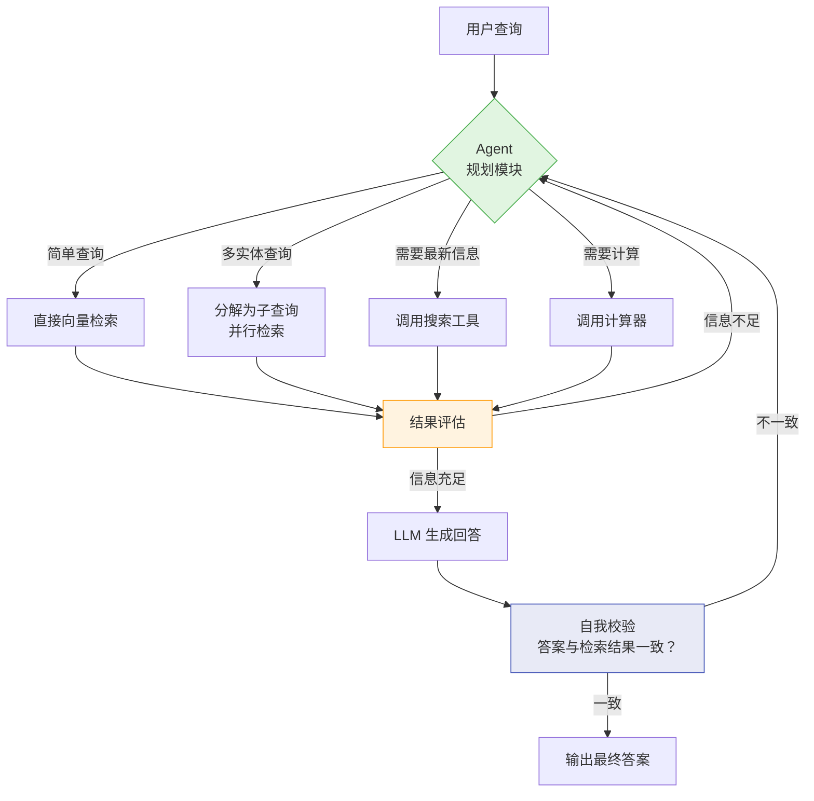

```python
# Agentic RAG 核心实现
class AgenticRAG:
    """
    Agentic RAG：Agent 驱动的自适应检索
    
    核心特点：
    1. 路由决策：根据查询类型选择检索策略
    2. 多步检索：信息不足时自动补充检索
    3. 自我校验：生成后校验答案与检索结果的一致性
    """
    
    def __init__(self, vectorstore, llm_client, tools: dict):
        self.vectorstore = vectorstore
        self.llm = llm_client
        self.tools = tools  # {"web_search": ..., "calculator": ...}
    
    def plan(self, query: str) -> dict:
        """规划：决定检索策略"""
        prompt = f"""分析以下查询，选择最佳检索策略。

可用工具：
- vector_search: 向量检索私有知识库
- web_search: 互联网搜索最新信息
- calculator: 数学计算
- multi_query: 将复杂查询分解为多个子查询

用户查询：{query}

请输出 JSON 格式：
{{
    "strategy": "vector_search|web_search|multi_query|hybrid",
    "reasoning": "选择理由",
    "sub_queries": ["子查询1", "子查询2"],  // multi_query 时使用
    "tools": ["工具名1", "工具名2"]  // 需要调用的额外工具
}}"""
        response = self.llm.chat.completions.create(
            model="gpt-4",
            messages=[{"role": "user", "content": prompt}],
            temperature=0.0,
        )
        import json
        return json.loads(response.choices[0].message.content)
    
    def retrieve(self, strategy: dict, query: str) -> list[str]:
        """执行检索"""
        documents = []
        
        if strategy["strategy"] == "vector_search":
            docs = self.vectorstore.similarity_search(query, k=5)
            documents = [d.page_content for d in docs]
        
        elif strategy["strategy"] == "multi_query":
            # 对每个子查询分别检索，合并结果
            for sq in strategy.get("sub_queries", [query]):
                docs = self.vectorstore.similarity_search(sq, k=3)
                documents.extend([d.page_content for d in docs])
        
        elif strategy["strategy"] == "hybrid":
            # 向量 + 工具调用
            docs = self.vectorstore.similarity_search(query, k=3)
            documents = [d.page_content for d in docs]
            
            for tool_name in strategy.get("tools", []):
                if tool_name in self.tools:
                    result = self.tools[tool_name](query)
                    documents.append(f"[{tool_name}结果]: {result}")
        
        return documents
    
    def self_check(self, query: str, answer: str, sources: list[str]) -> bool:
        """自我校验：检查答案是否与检索结果一致"""
        prompt = f"""校验以下回答是否与提供的来源信息一致。

来源信息：
{chr(10).join(sources[:3])}

回答：{answer}

如果回答中的事实都能在来源中找到依据，输出 "CONSISTENT"。
如果回答中包含来源中没有的信息（可能是幻觉），输出 "INCONSISTENT: 具体原因"。
"""
        response = self.llm.chat.completions.create(
            model="gpt-4",
            messages=[{"role": "user", "content": prompt}],
            temperature=0.0,
        )
        result = response.choices[0].message.content
        return "CONSISTENT" in result, result
    
    def query(self, question: str, max_iterations: int = 3) -> dict:
        """端到端查询（含规划+检索+校验循环）"""
        all_sources = []
        
        for i in range(max_iterations):
            # 规划
            strategy = self.plan(question)
            
            # 检索
            sources = self.retrieve(strategy, question)
            all_sources.extend(sources)
            
            # 生成
            context = "\n\n---\n\n".join(all_sources[:8])  # 限制上下文长度
            prompt = f"""基于以下信息回答问题：
{context}

问题：{question}

请给出准确、简洁的回答。"""
            
            response = self.llm.chat.completions.create(
                model="gpt-4",
                messages=[{"role": "user", "content": prompt}],
                temperature=0.3,
            )
            answer = response.choices[0].message.content
            
            # 自我校验
            is_consistent, check_result = self.self_check(question, answer, all_sources)
            
            if is_consistent:
                return {
                    "answer": answer,
                    "sources": all_sources,
                    "iterations": i + 1,
                    "check": "passed"
                }
            
            # 不一致时，将校验反馈加入上下文，下一轮重新规划
            question += f"\n\n[注意：上次回答校验未通过，原因：{check_result}，请修正]"
        
        return {
            "answer": answer,
            "sources": all_sources,
            "iterations": max_iterations,
            "check": "max iterations reached"
        }
```

### 14.6.3 高级 RAG 技术总结

| 技术 | 核心思想 | 解决的问题 | 实现复杂度 |
|------|---------|-----------|-----------|
| **HyDE** | 生成假想文档再检索 | 查询短、表达不完整 | 低 |
| **Query Rewriting** | 重写/扩展查询 | 用户表达不佳 | 低 |
| **Graph RAG** | 知识图谱多跳推理 | 跨文档关联查询 | 高 |
| **Agentic RAG** | Agent 自主规划检索 | 复杂查询、动态策略 | 高 |
| **Self-RAG** | 生成时自我判断是否需要检索 | 避免过度/不足检索 | 中 |
| **Corrective RAG** | 检索质量差时fallback到搜索 | 知识库覆盖不足 | 中 |
| **RAG-Fusion** | 多查询并行+RRF融合 | 查询歧义 | 中 |

---

## 14.7 RAG 与 Agent 的融合（2026年趋势）🆕 ⭐⭐⭐⭐⭐

> **2026年更新**：Agentic RAG 从"前沿概念"演进为**工程标配**。2026年面试的高频问题是：**"RAG 和 Agent 是什么关系？"** 核心答案：**RAG 是 Agent 的一种 Tool Calling**。

### 14.7.1 从 Agentic RAG 到 RAG-as-a-Tool

2025 年的 Agentic RAG 让 Agent "使用" 了 RAG 能力。2026 年的范式升级是 **RAG 被重新定义为 Agent 工具箱中的一个标准工具**，与 Web Search、Code Execution、Database Query 处于同一抽象层级。

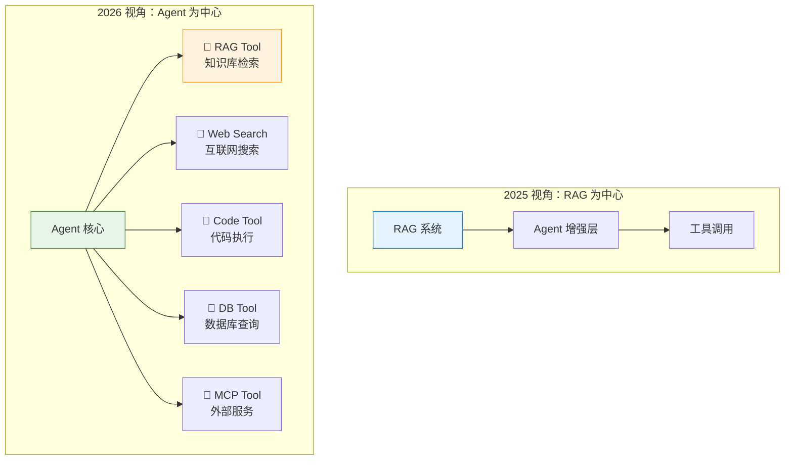

**核心区别**：

| 维度 | 2025 Agentic RAG | 2026 RAG-as-a-Tool |
|------|-----------------|-------------------|
| **架构定位** | RAG 是主框架，Agent 是增强模块 | Agent 是主框架，RAG 是工具之一 |
| **检索策略** | Agent 决定检索方式 | Agent 决定是否调用 RAG（可能选择其他工具） |
| **知识来源** | 以内置知识库为主 | 多个 RAG 工具对应多个知识库 |
| **MCP 集成** | 手动对接 | 通过 MCP 协议标准化接入 |
| **面试考察点** | 实现方式 | **架构设计 + 工具抽象** |

### 14.7.2 MCP 与 RAG 的工程化集成 🆕

2026 年 MCP（Model Context Protocol）从概念普及进入**工程化管理阶段**，RAG 系统通过 MCP 暴露为标准化工具：

```python
# 🆕 2026年：RAG 作为 MCP Tool 的架构
from mcp.server import Server
from mcp.types import Tool, TextContent

class RAGMCPTool:
    """
    将 RAG 系统封装为 MCP Tool —— 2026年工程标准
    
    这样任何支持 MCP 的 Agent（Claude、GPT、自研 Agent）
    都可以通过统一接口调用 RAG 能力
    """

    def __init__(self, vectorstore, embedder, top_k: int = 5):
        self.vectorstore = vectorstore
        self.embedder = embedder
        self.top_k = top_k

    async def handle_tool_call(self, name: str, arguments: dict) -> list[TextContent]:
        """MCP Tool 调用入口"""
        query = arguments.get("query", "")
        filters = arguments.get("filters", {})  # 🆕 元数据过滤

        # 执行检索
        docs = self.vectorstore.similarity_search(
            query, 
            k=self.top_k,
            filter=filters  # 按 source/tag/date 过滤
        )

        # 格式化返回（MCP 标准格式）
        results = []
        for i, doc in enumerate(docs, 1):
            results.append(
                f"[{i}] 来源: {doc.metadata.get('source', 'unknown')}\n"
                f"相关度: {doc.metadata.get('score', 'N/A')}\n"
                f"内容: {doc.page_content[:500]}"
            )

        return [TextContent(type="text", text="\n\n---\n\n".join(results))]

    def get_tool_definition(self) -> Tool:
        """MCP Tool 定义 —— 让 Agent 知道何时调用 RAG"""
        return Tool(
            name="knowledge_base_search",
            description=(
                "从企业知识库中检索相关信息。"
                "适用于：公司政策、技术文档、产品手册、历史数据等内部知识查询。"
                "当问题涉及公司内部信息时使用此工具。"
            ),
            inputSchema={
                "type": "object",
                "properties": {
                    "query": {"type": "string", "description": "检索查询"},
                    "filters": {
                        "type": "object",
                        "description": "可选的元数据过滤条件（source/tag/date）",
                    },
                },
                "required": ["query"],
            },
        )
```

### 14.7.3 Skills 与 MCP 的区分（2026年面试高频考点）🆕

2026 年一个重要面试考点是 **Skills 和 MCP 的区别**：

| 维度 | **MCP（Model Context Protocol）** | **Skills（技能系统）** |
|------|----------------------------------|----------------------|
| **本质** | 通信协议 | 能力描述 + 实现封装 |
| **作用** | 标准化 Agent ↔ Tool 的交互方式 | 定义 Agent 能做什么 |
| **关注点** | "如何调用"（协议层） | "能做什么 + 如何做"（语义层） |
| **类比** | HTTP（传输协议） | REST API（接口定义） |
| **关系** | MCP 是 Skills 的**传输载体** | Skills 是 MCP 的**语义上层** |

**一句话记忆**：MCP 是"电线"，Skills 是"电器+说明书"。

### 14.7.4 多 Agent RAG 协作架构 🆕

2026 年 Claude 4.6/4.7 引入 **Agent Teams** 概念，多 Agent 可以协作完成复杂的 RAG 任务：

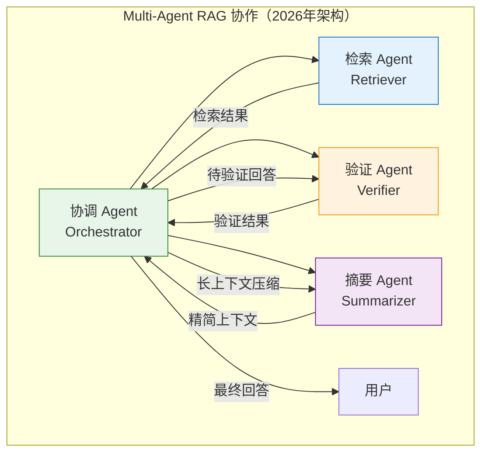

**多 Agent RAG 的优势**：
1. **职责分离**：检索 Agent 专注召回率，验证 Agent 专注 Faithfulness，各自优化
2. **并行执行**：多个子查询可以同时分发到不同的检索 Agent
3. **迭代深化**：验证 Agent 发现信息不足时，反馈给协调 Agent 重新检索
4. **质量控制**：摘要 Agent 负责上下文压缩，避免超长上下文稀释注意力

---

## 14.8 多模态 RAG 🆕 ⭐⭐⭐⭐

> **2026年新方向**：RAG 不再局限于文本，图文混合检索成为新热点。面试中"多模态 RAG 的技术挑战"已成为高频题。

### 14.8.1 多模态 RAG 场景与架构

多模态 RAG 处理**文本 + 图像 + 表格 + 音频**的混合检索：

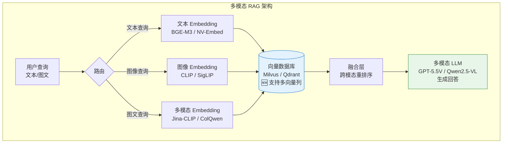

### 14.8.2 多模态 Embedding 选型（2026年）🆕

| 模型 | 模态 | 维度 | 适用场景 | 特点 |
|------|------|------|---------|------|
| **CLIP** | 图文 | 512 | 通用图文检索 | OpenAI 经典模型，广泛支持 |
| **SigLIP** | 图文 | 768 | 精细图文匹配 | Google 出品，精度优于 CLIP |
| **Jina-CLIP** | 图文 | 768 | 多语言图文 | 支持中文图文混合检索 |
| **ColQwen** | 图文 | 变长 | 文档理解 | 专门针对文档图像优化 |
| **NV-Embed-v2** | 纯文本 | 4096 | 高精度文本 | NVIDIA SOTA，纯文本首选 |

### 14.8.3 多模态 RAG 的技术挑战 🆕

面试高频问题：多模态 RAG 相比纯文本 RAG 有哪些额外挑战？

| 挑战 | 说明 | 解决方向 |
|------|------|---------|
| **模态对齐** | 文本和图像的 Embedding 空间不一致 | 用多模态预训练模型统一编码空间 |
| **跨模态检索** | 文本查询找图像（或反之） | 共享 Embedding 空间 + 跨模态重排序 |
| **图文关联分块** | 图像和附近文本应作为整体检索 | 文档解析时保留版面结构（Layout-aware chunking） |
| **OCR 质量** | 图像中的文字提取准确率影响检索 | 专用 OCR 模型（PaddleOCR/EasyOCR）+ 后校验 |
| **显存压力** | 图像 Embedding 计算量大 | 图像预压缩 + 缓存策略 |
| **评估复杂** | 多模态结果的 Faithfulness 更难判断 | 需要专门的多模态评估框架 |

```python
# 🆕 多模态 RAG 简化实现
class MultimodalRAG:
    """多模态 RAG：支持文本 + 图像混合检索"""

    def __init__(self, text_embedder, image_embedder, multimodal_llm):
        self.text_embedder = text_embedder   # 文本 Embedding 模型
        self.image_embedder = image_embedder  # CLIP/SigLIP 图像编码器
        self.llm = multimodal_llm            # 多模态大模型（如 Qwen-VL）
        self.doc_store = []   # 文档存储
        self.image_store = [] # 图像存储

    def index_document(self, text_chunks: list[str], images: list[np.ndarray]):
        """索引文档：文本和图像分别编码"""
        # 文本编码
        text_embeddings = self.text_embedder.encode(text_chunks)
        for chunk, emb in zip(text_chunks, text_embeddings):
            self.doc_store.append({"type": "text", "content": chunk, "embedding": emb})

        # 图像编码
        if images:
            image_embeddings = self.image_embedder.encode(images)
            for img, emb in zip(images, image_embeddings):
                self.image_store.append({"type": "image", "content": img, "embedding": emb})

    def retrieve(self, query: str, query_image: np.ndarray = None, top_k: int = 5):
        """
        多模态检索：支持纯文本查询、纯图像查询、图文查询
        """
        results = []

        # 文本检索
        query_text_emb = self.text_embedder.encode([query])
        text_scores = cosine_similarity(query_text_emb, 
            [d["embedding"] for d in self.doc_store])
        for i, score in enumerate(text_scores[0]):
            results.append(("text", i, score))

        # 图像检索（如果有查询图像）
        if query_image is not None:
            query_img_emb = self.image_embedder.encode([query_image])
            img_scores = cosine_similarity(query_img_emb,
                [d["embedding"] for d in self.image_store])
            for i, score in enumerate(img_scores[0]):
                results.append(("image", i, score))

        # 按相似度排序
        results.sort(key=lambda x: x[2], reverse=True)
        return results[:top_k]

    def generate(self, query: str, retrieved_items: list) -> str:
        """使用多模态 LLM 生成回答"""
        # 组装多模态 Prompt（文本 + 图像）
        messages = [{"role": "user", "content": []}]

        # 添加检索到的文本
        for item_type, idx, score in retrieved_items:
            if item_type == "text":
                messages[0]["content"].append({
                    "type": "text",
                    "text": f"[相关文档]\n{self.doc_store[idx]['content']}\n"
                })
            elif item_type == "image":
                messages[0]["content"].append({
                    "type": "image",
                    "image": self.image_store[idx]['content']
                })

        # 添加用户问题
        messages[0]["content"].append({"type": "text", "text": f"\n问题：{query}"})

        return self.llm.chat(messages)


def cosine_similarity(a, b):
    """计算余弦相似度"""
    from sklearn.metrics.pairwise import cosine_similarity as cs
    return cs(np.array(a), np.array(b))
```

---

## 14.9 2026年新RAG模式 🆕 ⭐⭐⭐⭐⭐

> **2026年最新趋势**：随着 ColPali、Contextual Retrieval、Long-context LLM 等技术成熟，RAG 正从"传统向量检索"向"多模态 + 上下文增强 + 延迟交互"演进。本节汇总 2025-2026 年最值得关注的 8 个 RAG 新方向，是 2026 年面试的**高阶加分项**。

### 14.9.1 Vision-RAG：ColPali / ColQwen（无 OCR 文档图像检索）

传统 RAG 必须先 OCR 提取文字，但 PDF 中的图表、公式、复杂排版往往在 OCR 阶段就丢失语义。**ColPali**（2024）与 **ColQwen**（基于 Qwen2-VL）提出**直接对文档图像做 Embedding**：

- **核心思想**：将整页文档图像喂给 VLM，输出**多向量表示**（每个 patch 一个向量）
- **检索方式**：ColBERT-style 延迟交互（late interaction），计算查询与图像块的最大相似度
- **优势**：完全跳过 OCR，保留版式、图表、手写体等视觉信息
- **代价**：存储成本高（每页约 1024 个向量），需专门的向量库

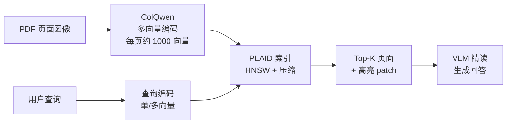

```python
# ColQwen Vision-RAG 简化示例
from colpali_engine.models import ColQwen2, ColQwen2Processor
import torch
from PIL import Image

# 1. 加载视觉-文档编码器
model = ColQwen2.from_pretrained(
    "vidore/colqwen2-v1.0",
    torch_dtype=torch.bfloat16,
    device="cuda",
)
processor = ColQwen2Processor.from_pretrained("vidore/colqwen2-v1.0")

# 2. 编码文档图像（每页 PDF 转 PNG）
page_images = [Image.open(f"page_{i}.png") for i in range(10)]
batch = processor.process_images(page_images).to(model.device)
with torch.no_grad():
    doc_embeddings = model(**batch)  # [B_pages, P_patches, D_dim]

# 3. 编码查询
query_batch = processor.process_queries(["RAG 的核心思想是什么？"]).to(model.device)
with torch.no_grad():
    query_embeddings = model(**query_batch)  # [1, Q_tokens, D_dim]

# 4. 延迟交互打分（max-sim 算子）
scores = processor.score_multi_vector(query_embeddings, doc_embeddings)
top_k_indices = scores[0].topk(3).indices.tolist()
```

### 14.9.2 Contextual Retrieval（Anthropic 2024）

Anthropic 2024 年提出的 **Contextual Retrieval** 通过在 Embedding 前**为每个 chunk 注入上下文**，将检索失败率降低 **35%-49%**：

- **传统问题**：chunk "年假 15 天"脱离上下文后，无法判断属于哪个公司、哪种员工
- **解决方案**：用 LLM 给每个 chunk 生成 50-100 token 的上下文前缀，再合并 Embedding
- **配合 BM25**：同时给稀疏检索也注入上下文，召回率再提升 5%
- **代价**：索引阶段需要一次 LLM 调用（约 0.001$/chunk）

```python
# Contextual Retrieval 实现（Anthropic 官方推荐写法）
from anthropic import Anthropic

client = Anthropic()


def add_context_to_chunk(chunk: str, full_document: str) -> str:
    """为每个 chunk 注入 LLM 生成的上下文描述"""
    prompt = f"""以下是文档的一个片段，请用 50-100 字简要说明这个片段的上下文，
    使其脱离原文后仍能独立理解。包括：文档主题、关键实体、与上下文的关系。

    完整文档（前 2000 字摘要）：
    {full_document[:2000]}

    目标片段：
    {chunk}

    上下文描述（简洁，不要重复片段内容）："""

    response = client.messages.create(
        model="claude-haiku-4-5",  # 用小模型即可
        max_tokens=200,
        messages=[{"role": "user", "content": prompt}],
    )
    context = response.content[0].text
    return f"[上下文：{context}]\n\n{chunk}"  # 合并后一起 Embedding
```

### 14.9.3 Late Chunking（jina.ai Contextual Chunking）

jina.ai 提出的 **Late Chunking** 颠覆了"先切分再 Embedding"的传统流程：

- **传统流程**：`文档 → 切 chunk → 每 chunk 独立 Embedding`（上下文丢失）
- **Late Chunking**：`文档 → 整篇 Embedding → 按 token 位置切分`（保留全局上下文）

**核心原理**：用 Long-Context Embedding 模型（如 jina-embeddings-v3，8K tokens）对整篇文档做一次编码，**每个 token 的 Embedding 都已包含完整上下文**；然后按 chunk 边界对 token Embedding 做 pooling，得到 chunk Embedding。

```python
# jina Late Chunking 示例
import requests


def late_chunking(document: str, chunk_size: int = 512) -> list[list[float]]:
    response = requests.post(
        "https://api.jina.ai/v1/embeddings",
        headers={"Authorization": f"Bearer {JINA_API_KEY}"},
        json={
            "model": "jina-embeddings-v3",
            "input": [document],  # 整篇文档
            "task": "retrieval.passage",
            "late_chunking": True,  # 开启 late chunking
            "embedding_dim": 1024,
        },
    )
    # 返回 [N_chunks, D] 矩阵
    return response.json()["data"][0]["embeddings"]
```

### 14.9.4 ColBERTv2 / PLAID（Late-Interaction 范式）

ColBERT 系列是**延迟交互范式**的代表：

- **Bi-Encoder**：查询和文档各自编码 → 点积（快但精度低）
- **Cross-Encoder**：查询和文档拼接 → 完整注意力（精确但不可索引）
- **ColBERT / ColBERTv2 / PLAID**：**多向量独立编码 + 检索时 Max-Sim 打分**（折中方案）

| 范式 | 编码方式 | 检索打分 | 速度 | 精度 | 索引可行性 |
|------|---------|---------|------|------|----------|
| Bi-Encoder | 独立 | 点积 | 极快 | 中 | ✅ |
| Cross-Encoder | 联合 | 单次前向 | 极慢 | 极高 | ❌ |
| **ColBERTv2/PLAID** | 独立 | **Max-Sim 延迟交互** | 中 | 高 | ✅（压缩后） |

```python
# ColBERTv2 / PLAID 检索示例
from pylate import models, retrieve

model = models.ColBERT(
    model_name_or_path="lightonai/colbertv2.0",
    device="cuda",
)

# 文档索引（每个文档产出多个 token-level 向量）
documents = ["RAG 是检索增强生成", "ColBERT 是延迟交互模型"]
documents_embeddings = model.encode(
    documents, is_query=False, show_progress_bar=True
)

# PLAID 索引（多向量 + 压缩）
index = retrieve.PLAID(
    indexing_batch_size=128, index_folder="pylate_index"
)
index = index.add_documents(documents=documents, embeddings=documents_embeddings)

# 查询
query_embeddings = model.encode(
    ["什么是 RAG？"], is_query=True, show_progress_bar=True
)
scores = index.retrieve(queries_embeddings=query_embeddings, k=5)
```

### 14.9.5 混合检索终极形态：BM25 + Dense + Cross-Encoder + RRF

2026 年生产级 RAG 的**标配三段式**：

1. **第一路 BM25**：精确关键词匹配（ID、型号、专有名词）
2. **第二路 Dense**：语义相似度（召回更多可能相关的内容）
3. **第三路 Cross-Encoder**：精排前 50-100 个候选
4. **RRF 融合** BM25 + Dense → Cross-Encoder 精排 → Top-K

| 检索层 | 召回目标 | 典型模型 | 候选规模 |
|--------|---------|---------|---------|
| **稀疏层** | 精确关键词 | BM25 / SPLADE / BGE-M3-sparse | Top-100 |
| **稠密层** | 语义匹配 | BGE-M3 / text-embedding-3 / NV-Embed | Top-100 |
| **精排层** | 交互精排 | bge-reranker-v2-m3 / Cohere Rerank 3.5 | Top-10 |

### 14.9.6 Long-Context RAG vs 传统 RAG 权衡

随着 Gemini 1.5（1M-2M tokens）、Claude 4.6（1M tokens）等长上下文模型成熟，"**把全文档塞进 Prompt**"成为 RAG 的替代方案。

| 维度 | 传统 RAG | Long-Context RAG |
|------|---------|-----------------|
| **检索准确率** | 受限于分块和检索 | 100%（原文完整保留） |
| **Token 成本** | 低（1K-10K 上下文） | 高（100K-2M 上下文） |
| **延迟** | 低（向量检索 ms 级） | 高（首 token 5-30s） |
| **多文档交叉** | 需要重排序融合 | 原生支持 |
| **可解释性** | 高（可追溯来源） | 中（需引用标注） |
| **适用规模** | 百万级文档 | 数十个文档（受限于 context window） |

**面试回答要点**：

- **小规模（<100 文档）**：Long-Context 更优，避免分块误差
- **大规模（>10K 文档）**：必须用 RAG，Long-Context 不可行
- **折中方案**：先用 RAG 召回 Top-20 文档，再喂入 Long-Context 模型精读

### 14.9.7 MRL（Matryoshka Representation Learning）Embeddings

MRL 让 Embedding 支持**可变维度截断**：

- 训练时让模型学会在不同维度下都保留有效信息
- 推理时可按需截断（如 1024 维 → 256 维，节省 75% 存储）
- 短维度检索速度更快，长维度精度更高

```python
# MRL Embedding 使用（OpenAI text-embedding-3 系列原生支持）
import openai

response = openai.embeddings.create(
    model="text-embedding-3-large",
    input="RAG 是检索增强生成",
    dimensions=512,  # 可选 256, 512, 1024, 3072
)
vector = response.data[0].embedding  # 512 维向量
```

### 14.9.8 2026 年主流 Reranker 选型

| 模型 | 厂商 | 多语言 | 速度 | 精度 | 适用场景 |
|------|------|--------|------|------|---------|
| **Cohere Rerank 3.5** | Cohere | ✅ 100+ 语言 | API 调用 | SOTA | 生产首选，闭源 |
| **bge-reranker-v2-m3** | BAAI | ✅ 多语言 | GPU 推理 | 高 | 开源首选，中文友好 |
| **bge-reranker-v2-gemma** | BAAI | ✅ | 较慢 | 极高 | 高精度场景 |
| **Jina Reranker v2** | Jina | ✅ 100+ 语言 | API 调用 | 高 | 多语言生产环境 |
| **mxbai-rerank-large** | Mixedbread | 英文为主 | 极快 | 高 | 英文场景 |
| **Qwen3-Reranker** | Alibaba | ✅ 中英 | 中 | 高 | 阿里生态集成 |

```python
# bge-reranker-v2-m3 重排序示例
from FlagEmbedding import FlagReranker

reranker = FlagReranker(
    "BAAI/bge-reranker-v2-m3", use_fp16=True, device="cuda"
)

query = "什么是 RAG？"
candidates = [
    "RAG 是检索增强生成，结合检索与生成。",
    "今天天气不错，适合出游。",
    "RAG 通过向量检索为 LLM 提供外部知识。",
]

# 返回每个候选的相关性分数
scores = reranker.compute_score([[query, c] for c in candidates])
# scores = [0.95, 0.02, 0.89]
```

### 14.9.9 2026 年 RAG 模式选型决策树

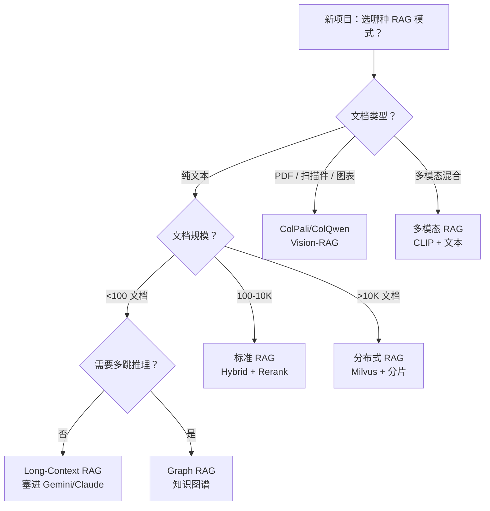

| 决策点 | 推荐方案 | 关键理由 |
|--------|---------|---------|
| **PDF 含复杂版式** | ColPali/ColQwen | OCR 会丢失图表信息 |
| **大文档需要全局理解** | Long-Context RAG | 避免分块误差 |
| **超大规模（>10K）** | Hybrid RAG + 分片索引 | 长上下文不可行 |
| **多跳关联查询** | Graph RAG | 向量检索无法做关系推理 |
| **实时性要求高** | 传统 RAG（向量检索） | 延迟 < 100ms |
| **多语言混合** | bge-m3 + bge-reranker-v2-m3 | 单模型多语言支持 |

### 14.9.10 2026 年新 RAG 模式面试金句

1. **ColPali 的核心创新**："跳过 OCR，直接 Embedding 文档图像 —— 用 VLM 的多向量 + 延迟交互替代传统 OCR+文本检索 pipeline。"
2. **Contextual Retrieval 的本质**："用 LLM 给每个 chunk 注入上下文，再做 Embedding —— 把 chunk 失去的上下文补回来。"
3. **Late Chunking 的精髓**："先 Embedding 整篇文档，再按位置切分 —— 让每个 token 的 Embedding 都保留全局上下文。"
4. **Long-Context vs RAG**："小规模选 Long-Context，大规模选 RAG；混合方案是 RAG 召回 + Long-Context 精读。"
5. **MRL 的价值**："一个 Embedding 多种维度，按需截断 —— 牺牲少量精度换 75% 存储节省。"
6. **Reranker 选型**："闭源选 Cohere Rerank 3.5，开源中文选 bge-reranker-v2-m3，多语言选 Jina Reranker v2。"

---

## 14.10 RAG 评估与优化 ⭐⭐⭐⭐

### 14.9.1 RAG 评估指标体系

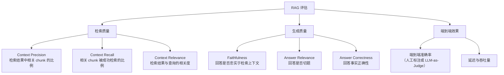

| 指标 | 说明 | 计算方式 | 目标值 |
|------|------|---------|--------|
| **Context Precision@K** | Top-K 结果中相关文档的比例 | $\frac{\text{相关文档数}}{K}$ | > 80% |
| **Context Recall** | 答案所需信息在检索结果中的覆盖度 | LLM 判断 | > 70% |
| **Faithfulness** | 回答中的陈述能否被上下文支撑 | LLM 逐句验证 | > 90% |
| **Answer Relevance** | 回答是否直接回应问题（无跑题） | LLM 判断 | > 85% |
| **Answer Correctness** | 回答的事实正确性 | 对比标准答案 | > 85% |

### 14.9.2 LLM-as-Judge 评估实现

```python
class RAGEvaluator:
    """RAG 评估器：使用 LLM 作为裁判"""
    
    def __init__(self, llm_client):
        self.llm = llm_client
    
    def evaluate_faithfulness(self, answer: str, contexts: list[str]) -> float:
        """
        评估回答的忠实度（Faithfulness）
        检查回答中的每个陈述是否都能在上下文中找到依据
        """
        context_text = "\n".join(contexts)
        
        prompt = f"""评估以下回答是否忠实于提供的上下文。

上下文：
{context_text}

回答：{answer}

请逐句分析回答中的每个事实性陈述，判断是否能从上下文中找到依据。
输出格式：
{{
    "faithfulness_score": 0-1之间的浮点数,
    "violations": ["未找到依据的陈述1", "未找到依据的陈述2"]
}}

faithfulness_score = 有依据的陈述数 / 总陈述数"""
        
        response = self.llm.chat.completions.create(
            model="gpt-4",
            messages=[{"role": "user", "content": prompt}],
            temperature=0.0,
        )
        import json, re
        content = response.choices[0].message.content
        # 提取 JSON
        json_match = re.search(r'\{.*?\}', content, re.DOTALL)
        if json_match:
            result = json.loads(json_match.group())
            return result.get("faithfulness_score", 0.0)
        return 0.0
    
    def evaluate_answer_relevance(self, question: str, answer: str) -> float:
        """评估回答的相关性"""
        prompt = f"""评估以下回答是否与问题相关。

问题：{question}
回答：{answer}

如果回答完全跑题，输出 0；如果完全切题，输出 1。
只输出一个 0-1 之间的数字。"""
        
        response = self.llm.chat.completions.create(
            model="gpt-4",
            messages=[{"role": "user", "content": prompt}],
            temperature=0.0,
        )
        try:
            return float(response.choices[0].message.content.strip())
        except ValueError:
            return 0.5
    
    def evaluate(self, question: str, answer: str, contexts: list[str]) -> dict:
        """完整评估"""
        return {
            "faithfulness": self.evaluate_faithfulness(answer, contexts),
            "relevance": self.evaluate_answer_relevance(question, answer),
            "overall": None,  # 加权综合
        }
```

### 14.9.3 RAG 优化检查清单

```markdown
## RAG 系统优化检查清单

### 索引阶段优化
- [ ] 文档清洗：去除页眉页脚、重复内容、乱码
- [ ] 分块策略：尝试不同 chunk_size 和 overlap
- [ ] 语义分块：对长文档使用 Embedding 相似度分块
- [ ] 元数据增强：为 chunk 添加标题、章节、页码等元数据
- [ ] Embedding 模型：对比 2-3 个模型的检索效果
- [ ] 索引算法：HNSW 参数调优（M, efConstruction, efSearch）

### 检索阶段优化
- [ ] 混合搜索：向量 + BM25 融合
- [ ] Query Rewriting：同义词扩展、HyDE
- [ ] 重排序：Cross-Encoder 精排
- [ ] 召回数量：调优 Top-K（通常 20-50 召回，5-10 精排）

### 生成阶段优化
- [ ] Prompt 工程：系统化提示模板设计
- [ ] 上下文压缩：对长上下文进行摘要压缩
- [ ] 引用标注：让模型标注信息来源
- [ ] Temperature：RAG 场景推荐 0.0-0.3

### 评估与迭代
- [ ] 构建评估数据集：50-100 个标注问答对
- [ ] 监控关键指标：Faithfulness、Relevance、Latency
- [ ] A/B 测试：分块策略、Embedding 模型、重排序模型对比
```

---

## 14.11 RAG 面试题精讲 🎯

### 🎯 高频题1：RAG 的完整工作流程是什么？

**参考答案**：

RAG 分为**索引阶段（离线）**和**检索生成阶段（在线）**：

1. **索引阶段**：文档加载 → 清洗 → 分块（Chunking）→ Embedding 编码 → 向量索引构建 → 存入向量数据库
2. **检索阶段**：用户查询 → 查询重写（可选）→ Embedding 编码 → 向量检索（+ BM25 混合搜索）→ 重排序 → 取 Top-K 文档
3. **生成阶段**：组装 Prompt（系统提示 + 检索上下文 + 用户查询）→ LLM 生成 → 输出带引用的回答

关键优化点：分块策略选择、混合搜索、Cross-Encoder 重排序、Query Rewriting。

---

### 🎯 高频题2：RAG 中最难的部分是什么？

**参考答案**：

**文档分块（Chunking）**是 RAG 中最难的部分。原因：

1. **语义完整性**：分块位置不当会切断语义（如把"条件：温度大于30度"切成两块）
2. **粒度权衡**：太小则丢失上下文，太大则检索精度下降
3. **格式差异**：PDF、Word、Markdown 的解析和分块策略各不相同
4. **无通用最优解**：不同文档类型和查询模式需要不同的分块策略

最佳实践：用递归字符分块做基线，对关键文档尝试语义分块，通过评估指标对比效果。

---

### 🎯 高频题3：混合搜索中，向量检索和 BM25 如何融合？

**参考答案**：

用 **RRF（Reciprocal Rank Fusion）** 融合：

$$
\text{RRF Score}(d) = \frac{\alpha}{k + \text{rank}_{vector}(d)} + \frac{\beta}{k + \text{rank}_{bm25}(d)}
$$

其中 $k=60$ 为平滑常数，$\alpha$ 和 $\beta$ 为权重（通常各 0.5，或根据场景调整）。

向量检索擅长语义匹配（如"大语言模型"匹配"LLM"），BM25 擅长精确关键词匹配（如型号、ID）。两者互补，融合后召回率显著提升。

---

### 🎯 高频题4：HNSW 索引的原理是什么？为什么快？

**参考答案**：

HNSW（Hierarchical Navigable Small World）是一种**多层图索引**结构：

- **最底层（Layer 0）**：包含全部数据的稠密图
- **上层**：每往上一层，节点数指数减少，形成越来越稀疏的图
- **搜索**：从顶层随机节点进入，贪心找到最近节点，将该节点作为下一层的入口，逐层下降，直到最底层精细搜索

时间复杂度 $O(\log N)$，远快于暴力搜索的 $O(N)$。快的原因：上层稀疏图快速定位大致区域，底层稠密图精确搜索，类似于跳表（Skip List）的思想。

---

### 🎯 高频题5：Re-ranking 的作用是什么？为什么不用它直接检索？

**参考答案**：

Re-ranking 解决的是**召回-精排的精度矛盾**：

- 召回阶段需要**速度快**，用 Bi-Encoder（分别编码查询和文档，可预计算文档向量），但精度有限
- 精排阶段追求**精度高**，用 Cross-Encoder（查询和文档拼接后一起编码，注意力层充分交互），但速度较慢无法遍历全量

所以采用**两阶段架构**：先用 Bi-Encoder 快速召回 Top-100，再用 Cross-Encoder 对这 100 个精确排序，取 Top-10 用于生成。

---

### 🎯 高频题6：Graph RAG 和普通 RAG 的本质区别？

**参考答案**：

普通 RAG 基于**扁平向量相似度**，无法处理需要多跳推理的查询（如"Alice 的老板的公司的总部在哪里" —— 需要 Alice→老板→公司→总部 多步推导）。

Graph RAG 将文档转化为**知识图谱**，利用图的拓扑结构进行**多跳遍历**，能够回答跨文档关联的复杂查询。

但 Graph RAG 的构建成本高（需要实体抽取、关系抽取），适合知识密集型场景，普通 RAG 适合文档问答场景。

---

### 🎯 高频题7：RAG 如何解决大模型幻觉问题？

**参考答案**：

RAG 从三个层面缓解幻觉：

1. **事实约束**：将检索结果作为上下文，要求模型"基于以下信息回答"，限制生成空间
2. **可溯源**：检索结果标注来源，模型回答可追溯到原始文档
3. **自我校验**（Agentic RAG）：生成后校验回答是否在检索结果中有依据

但 RAG 不是银弹：如果检索结果本身有误，或者模型"忽视"上下文自行发挥，仍会产生幻觉。所以需要 Faithfulness 评估指标持续监控。

---

### 🎯 高频题8：Agentic RAG 和普通 RAG 的区别？

**参考答案**：

普通 RAG 的检索策略是**固定的**（向量检索 → Top-K → 生成）。

Agentic RAG 引入了**智能体决策层**，让系统能够：
1. **路由**：根据查询类型选择不同检索策略（向量/关键词/网络搜索）
2. **多步**：信息不足时自动补充检索
3. **工具调用**：调用计算器、搜索引擎等外部工具
4. **自我校验**：生成后验证答案与检索结果的一致性

本质区别：从"固定 pipeline" 进化为 "自适应 Agent"。

---

### 🎯🆕 高频题9：RAG 和 Agent 是什么关系？（2026年必考）

**参考答案**：

2026 年视角：**RAG 是 Agent 的一种 Tool Calling**，两者不是并列关系，而是包含关系。

```
Agent（智能体）
├── RAG Tool（知识库检索）
├── Web Search Tool（互联网搜索）
├── Code Execution Tool（代码执行）
├── Database Query Tool（数据库查询）
├── API Call Tool（外部 API）
└── MCP Tools（通过 MCP 协议接入的标准化工具）
```

当 Agent 接收到用户问题时：
1. **规划（Planning）**：分析问题需要哪些工具
2. **工具选择（Tool Selection）**：如果问题涉及内部知识，调用 RAG Tool
3. **执行（Execution）**：RAG Tool 完成检索，返回结果
4. **集成（Integration）**：Agent 将 RAG 结果与其他工具结果整合，生成最终回答

**面试金句**："RAG 从主角变成了 Agent 的工具箱中的一员——这是一个架构视角的根本转变。"

---

### 🎯🆕 高频题10：如何设计端云协同的 RAG 系统？（2026年高频）

**参考答案**：

端云协同 RAG 的核心是**分层检索策略**：

| 层级 | 模型 | 存储内容 | 作用 |
|------|------|---------|------|
| **端侧** | 3B-7B Embedding 模型 | 高频知识索引 | 本地快速响应，保护隐私 |
| **边缘** | 13B-34B 模型 | 部门级知识库 | 区域共享知识 |
| **云端** | 70B+ 模型 | 全量企业知识 | 复杂查询、深度推理 |

**设计要点**：
1. **端侧缓存**：将用户最常查询的知识（个人文档、最近项目）索引在本地
2. **检索路由**：端侧检索置信度 > 0.8 时直接返回；否则上云
3. **隐私保护**：敏感文档只在端侧索引，不上传云端
4. **增量同步**：云端新知识定期同步到端侧（如每天一次增量更新）
5. **模型协同**：端侧小模型做初筛，云端大模型做精排和生成

---

### 🎯🆕 高频题11：多模态 RAG 有哪些技术挑战？（2026年新热点）

**参考答案**：

多模态 RAG 相比纯文本 RAG 面临六大额外挑战：

1. **模态对齐（Modality Alignment）**：文本和图像的 Embedding 空间不一致，需要多模态预训练模型（如 CLIP、SigLIP）统一编码空间
2. **跨模态检索（Cross-Modal Retrieval）**：文本查询找图像（或反之），需要在共享 Embedding 空间中计算相似度
3. **图文关联分块（Layout-aware Chunking）**：文档中的图像和附近文本应作为整体检索，需要保留版面结构
4. **OCR 质量瓶颈**：图像中的文字提取准确率直接影响检索效果，需要专用 OCR + 后校验
5. **计算资源压力**：图像 Embedding 计算量大，端侧部署需要预压缩和缓存策略
6. **评估复杂度**：多模态结果的 Faithfulness 更难判断，需要专门的多模态评估框架

**一句话总结**："多模态 RAG 的核心挑战不是多一个模态，而是如何让不同模态在统一的检索空间中'说同一种语言'。"

---

## 14.12 本章小结

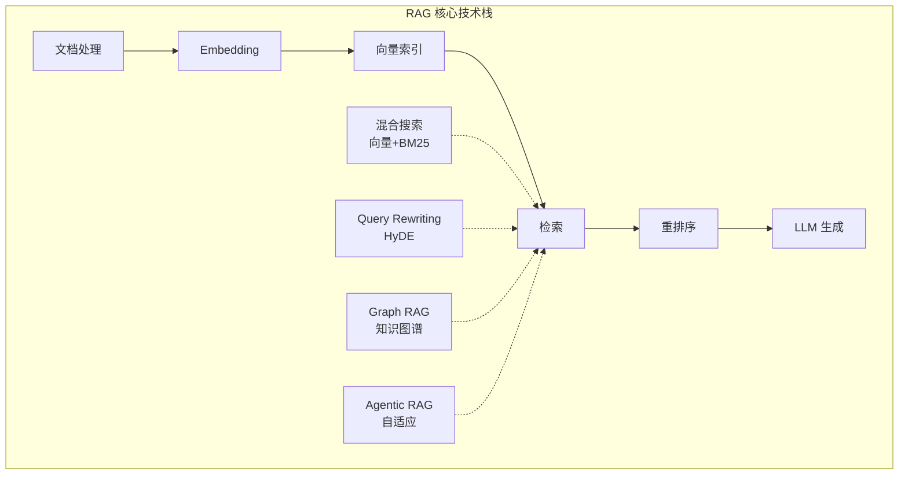

| 知识点 | 面试频率 | 关键要点 |
|--------|---------|---------|
| RAG 完整架构 | ⭐⭐⭐⭐⭐ | 索引→检索→生成三阶段 |
| 文档分块策略 | ⭐⭐⭐⭐⭐ | 递归字符/语义/结构分块 |
| Embedding 选型 | ⭐⭐⭐⭐⭐ | BGE-M3 / text-embedding-3 |
| HNSW/IVF 索引 | ⭐⭐⭐⭐ | 多层图/Voronoi 单元 |
| 向量数据库选型 | ⭐⭐⭐⭐ | Qdrant/Milvus/FAISS |
| 混合搜索 + RRF | ⭐⭐⭐⭐⭐ | 向量+BM25融合 |
| Cross-Encoder 重排 | ⭐⭐⭐⭐⭐ | Bi-Encoder vs Cross-Encoder |
| Graph RAG | ⭐⭐⭐⭐ | 知识图谱多跳推理 |
| Agentic RAG | ⭐⭐⭐⭐⭐ | Agent 自适应检索 |
| RAG 评估指标 | ⭐⭐⭐⭐ | Faithfulness/Relevance/Recall |

**2026年更新要点**：

| 🆕 2026年新趋势 | 说明 | 面试热度 |
|----------------|------|---------|
| **RAG-as-a-Tool** | RAG 被重新定义为 Agent 的工具调用之一 | ⭐⭐⭐⭐⭐ |
| **MCP + RAG 集成** | 通过 MCP 协议标准化暴露 RAG 能力 | ⭐⭐⭐⭐ |
| **Skills vs MCP** | Skills 是"电器+说明书"，MCP 是"电线" | ⭐⭐⭐⭐ |
| **多 Agent RAG 协作** | Claude 4.6/4.7 Agent Teams 驱动的多 Agent RAG | ⭐⭐⭐⭐ |
| **多模态 RAG** | 图文混合检索，CLIP/SigLIP 统一编码空间 | ⭐⭐⭐⭐ |
| **端云协同 RAG** | 端侧3B-7B快速响应 + 云端70B+深度推理 | ⭐⭐⭐⭐⭐ |

**下一步**：RAG 解决了"知识供给"问题，接下来我们将学习 Agent —— 让大模型拥有自主规划、工具调用、多 Agent 协作的能力。2026 年的核心架构范式是 **Agent 为中心，RAG 为工具**。

---

## 📚 相关章节

- [[12_Transformer与大模型原理]] — 大模型架构与上下文学习能力，RAG 的理论基础
- [[13_Prompt_Engineering]] — RAG 系统中 Prompt 模板设计与检索结果注入策略
- [[15_Agent智能体开发]] — Agentic RAG：Agent 自主决策检索策略，RAG-as-a-Tool
- [[16_模型微调与推理优化]] — Embedding 模型微调与 RAG 推理性能优化
- [[18_LLM工程框架实战]] — LlamaIndex / LangChain / Haystack 框架实战
- [[25_推理引擎与高性能服务]] — RAG 推理服务的 TTFT 优化
- [[27_推理模型与Test-Time_Compute]] — 长 CoT 检索融合的推理模型
- [[29_Context_Engineering]] — RAG 作为 Context 来源的工程实践
