# 第15章 Agent 智能体开发 ⭐⭐⭐⭐⭐

> **面试频率**：极高（2025-2026年持续最热方向，几乎必考）| **技术热度**：★★★★★
>
> Agent（智能体）是大模型应用开发的下一个范式。从 ReAct 框架到 Function Calling，从 MCP 协议到 Multi-Agent 协作，Agent 正在重塑人机交互的边界。本章深入解析 Agent 的四大核心模块、手写 ReAct Agent、多工具调用、MCP 协议、A2A 协议、Agent Teams 等 2025-2026 年持续最热考点，助你在面试中从容应对。

---

## 15.1 Agent 基础概念 ⭐⭐⭐⭐⭐

### 15.1.1 什么是 AI Agent

AI Agent（人工智能智能体）是一个能够**感知环境、自主决策、执行行动**的系统。与大模型的单次调用不同，Agent 具备**持续交互**和**目标驱动**的能力。

**普通 LLM 调用 vs Agent**：

| 维度 | 普通 LLM 调用 | AI Agent |
|------|-------------|----------|
| **交互模式** | 单轮/多轮对话 | 持续的感知-思考-行动循环 |
| **外部工具** | 无 | 可调用 API、搜索、数据库等 |
| **记忆能力** | 仅对话历史 | 短期+长期记忆 |
| **目标导向** | 逐轮响应 | 自主规划步骤达成目标 |
| **反思能力** | 无 | 可评估行动效果并调整 |

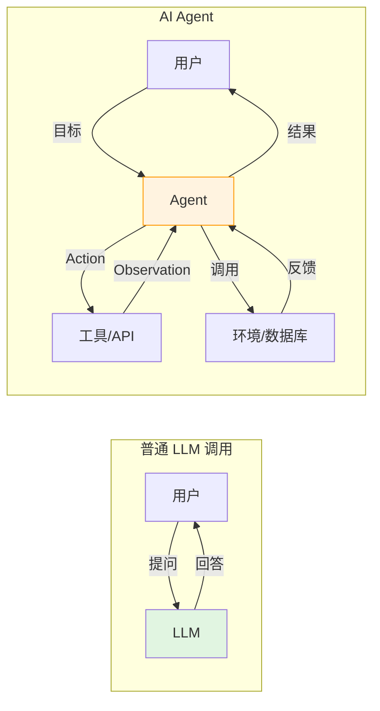
```mermaid
graph LR
    subgraph "普通 LLM 调用"
        U1[用户] -->|"提问"| L1[LLM]
        L1 -->|"回答"| U1
        style L1 fill:#e1f5e1
    end
    
    subgraph "AI Agent"
        U2[用户] -->|"目标"| A[Agent]
        A -->|"Action"| T[工具/API]
        T -->|"Observation"| A
        A -->|"调用"| E[环境/数据库]
        E -->|"反馈"| A
        A -->|"结果"| U2
        style A fill:#fff3e0,stroke:#ff9800
    end
```

### 15.1.2 Agent 四大核心模块

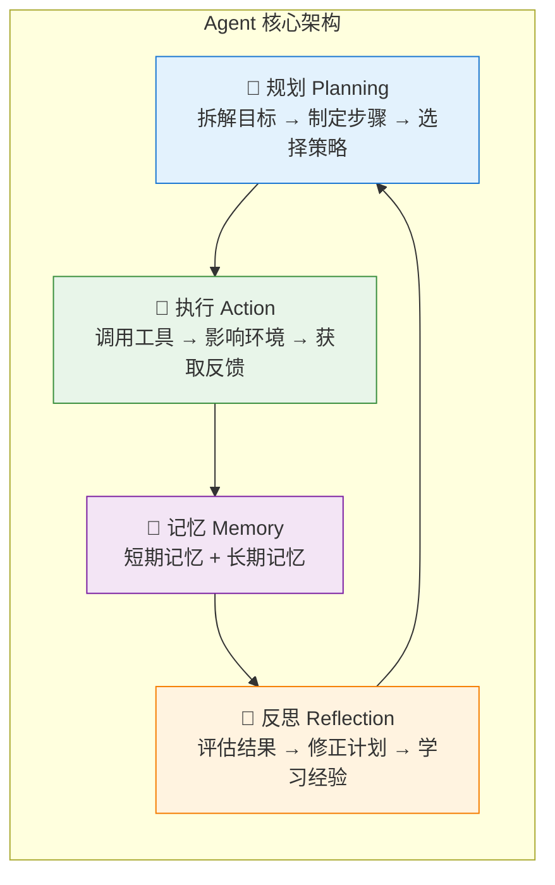
```mermaid
graph TD
    subgraph "Agent 核心架构"
        direction TB
        
        P["🧠 规划 Planning<br/>拆解目标 → 制定步骤 → 选择策略"]
        M["💾 记忆 Memory<br/>短期记忆 + 长期记忆"]
        A2["🔧 执行 Action<br/>调用工具 → 影响环境 → 获取反馈"]
        R["🔄 反思 Reflection<br/>评估结果 → 修正计划 → 学习经验"]
        
        P --> A2
        A2 --> M
        M --> R
        R --> P
    end
    
    style P fill:#e3f2fd,stroke:#1976d2
    style M fill:#f3e5f5,stroke:#7b1fa2
    style A2 fill:#e8f5e9,stroke:#388e3c
    style R fill:#fff3e0,stroke:#f57c00
```

#### 模块1：感知（Perception）

Agent 接收外部输入的方式：
- **用户指令**：自然语言描述的目标
- **工具返回值**：API 调用结果、数据库查询结果
- **环境状态**：系统状态、错误信息、时间等

#### 模块2：规划（Planning）⭐⭐⭐⭐⭐

规划是 Agent 的"大脑"，将复杂目标拆解为可执行的步骤：

| 规划类型 | 说明 | 示例 |
|----------|------|------|
| **单路径规划** | 线性步骤序列 | Step1→Step2→Step3 |
| **多路径规划** | 生成多个候选计划，评估后选择 | ToT（Tree of Thoughts）|
| **动态规划** | 根据执行反馈调整计划 | ReAct、Reflexion |
| **分层规划** | 高层目标 → 子目标 → 具体行动 | Hierarchical Agent |

#### 模块3：执行（Action）

执行模块负责**调用工具**改变环境状态。常见工具类型：

```python
# Agent 工具定义示例
TOOLS = [
    {
        "name": "web_search",
        "description": "搜索引擎，用于获取最新信息",
        "parameters": {
            "query": {"type": "string", "description": "搜索关键词"}
        }
    },
    {
        "name": "calculator",
        "description": "计算器，执行数学运算",
        "parameters": {
            "expression": {"type": "string", "description": "数学表达式"}
        }
    },
    {
        "name": "database_query",
        "description": "数据库查询",
        "parameters": {
            "sql": {"type": "string", "description": "SQL 语句"}
        }
    },
    {
        "name": "send_email",
        "description": "发送邮件",
        "parameters": {
            "to": {"type": "string"},
            "subject": {"type": "string"},
            "body": {"type": "string"}
        }
    },
]
```

#### 模块4：记忆（Memory）

记忆让 Agent 能够"记住"过去的经验和知识：

- **短期记忆（Short-term Memory）**：当前对话上下文，在 Prompt 中维护
- **长期记忆（Long-term Memory）**：向量数据库存储的历史经验、知识图谱
- **工作记忆（Working Memory）**：当前任务相关的临时信息

#### 模块5：反思（Reflection）

反思模块让 Agent 具备**自我评估**和**错误修正**能力：

```python
# 反思 Prompt 模板
REFLECTION_PROMPT = """请评估刚才的行动结果：

原目标：{goal}
执行计划：{plan}
实际行动：{action}
观察结果：{observation}

请回答：
1. 目标是否达成？（是/部分/否）
2. 如果未达成，原因是什么？
3. 下一步计划如何调整？
4. 有哪些经验可以记录到长期记忆中？
"""
```

### 15.1.3 Agent 分类

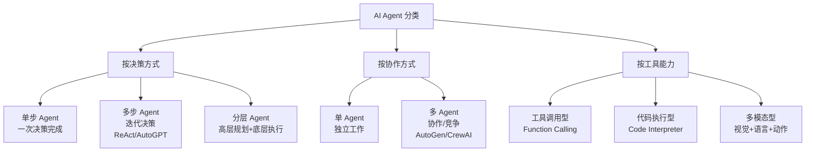
```mermaid
graph TD
    A["AI Agent 分类"] --> B["按决策方式"]
    A --> C["按协作方式"]
    A --> D["按工具能力"]
    
    B --> B1["单步 Agent<br/>一次决策完成"]
    B --> B2["多步 Agent<br/>迭代决策<br/>ReAct/AutoGPT"]
    B --> B3["分层 Agent<br/>高层规划+底层执行"]
    
    C --> C1["单 Agent<br/>独立工作"]
    C --> C2["多 Agent<br/>协作/竞争<br/>AutoGen/CrewAI"]
    
    D --> D1["工具调用型<br/>Function Calling"]
    D --> D2["代码执行型<br/>Code Interpreter"]
    D --> D3["多模态型<br/>视觉+语言+动作"]
```

---

## 15.2 ReAct 框架 ⭐⭐⭐⭐⭐

### 15.2.1 ReAct 核心思想

ReAct（Reasoning + Acting）是 Agent 领域最具影响力的框架，核心思想是**将推理（Reasoning）和行动（Acting）交织在一起** —— 模型先思考（Thought），再决定行动（Action），然后观察结果（Observation），循环往复直到完成目标。

### 15.2.2 ReAct 决策流程

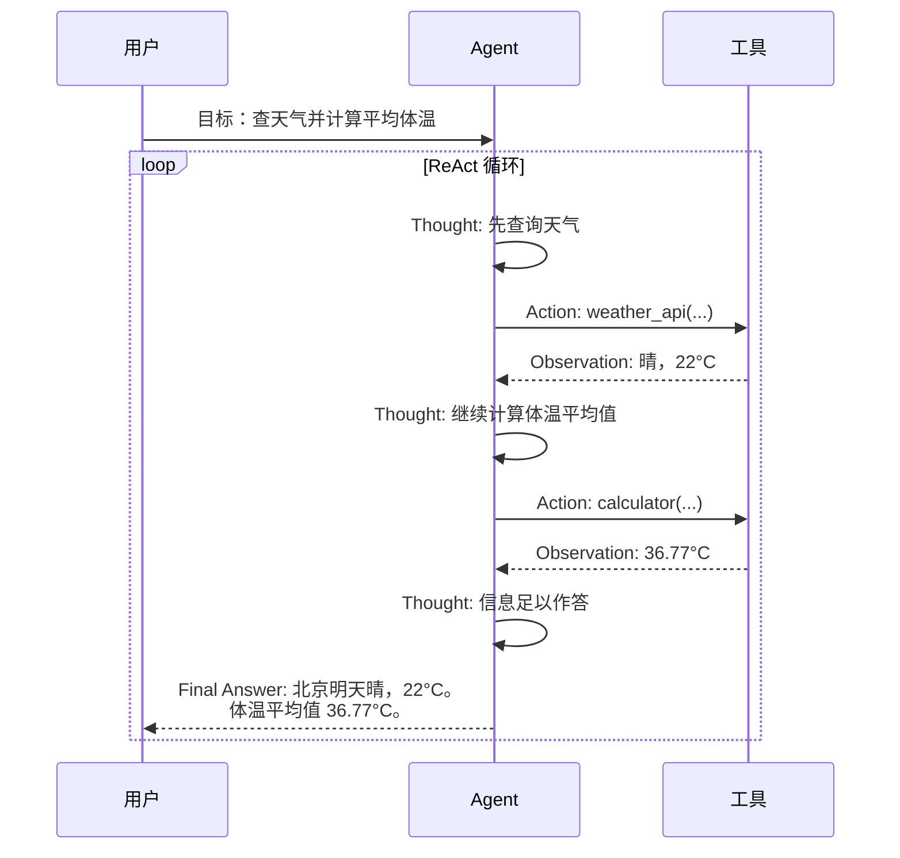
```mermaid
sequenceDiagram
    participant U as 用户
    participant A as Agent
    participant T as 工具

    U->>A: 目标：查天气并计算平均体温
    
    loop ReAct 循环
        A->>A: Thought: 先查询天气
        A->>T: Action: weather_api(...)
        T-->>A: Observation: 晴，22°C
        
        A->>A: Thought: 继续计算体温平均值
        A->>T: Action: calculator(...)
        T-->>A: Observation: 36.77°C
        
        A->>A: Thought: 信息足以作答
        A-->>U: Final Answer: 北京明天晴，22°C。<br/>体温平均值 36.77°C。
    end
```

### 15.2.3 手写 ReAct Agent（完整实战）

```python
"""
从零实现 ReAct Agent - 完整可运行代码
"""
import json
import re
import os
from typing import Callable, Any

class Tool:
    """工具基类"""
    
    def __init__(self, name: str, description: str, func: Callable, params_schema: dict):
        self.name = name
        self.description = description
        self.func = func
        self.params_schema = params_schema
    
    def execute(self, **kwargs) -> str:
        """执行工具，返回字符串结果"""
        try:
            result = self.func(**kwargs)
            return str(result)
        except Exception as e:
            return f"错误：{str(e)}"
    
    def to_prompt_format(self) -> str:
        """转换为 Prompt 中的工具描述"""
        params_desc = "\n".join([
            f"  - {k}: {v.get('description', v.get('type', 'string'))}"
            for k, v in self.params_schema.get("properties", {}).items()
        ])
        return f"- {self.name}: {self.description}\n参数：\n{params_desc}"


class ReActAgent:
    """
    ReAct Agent 完整实现
    
    核心循环：Thought → Action → Observation → ... → Final Answer
    """
    
    def __init__(self, llm_api_key: str = None):
        self.tools: dict[str, Tool] = {}
        self.memory: list[dict] = []  # 历史记录
        self.max_iterations = 10      # 最大迭代次数，防止无限循环
        self.llm_api_key = llm_api_key or os.getenv("OPENAI_API_KEY")
        self.model = os.getenv("OPENAI_MODEL", "gpt-5.6")
        self.mock = os.getenv("LLM_MOCK", "1") != "0"
        
        # ReAct Prompt 模板
        self.react_prompt_template = """你是一个智能助手，可以通过调用工具来完成任务。

可用工具：
{tools_description}

你必须按照以下格式思考和工作：
Thought: 你的思考过程，分析当前状况和下一步行动
Action: 工具名称(参数1="值1", 参数2="值2")
Observation: 工具返回的结果（由系统自动填入）
... （可以重复多轮 Thought/Action/Observation）
Thought: 任务已完成
Final Answer: 最终答案

---

开始任务！

{history}
Thought: """
    
    def register_tool(self, tool: Tool):
        """注册工具"""
        self.tools[tool.name] = tool
    
    def _build_tools_description(self) -> str:
        """构建工具描述"""
        return "\n".join([t.to_prompt_format() for t in self.tools.values()])
    
    def _call_llm(self, prompt: str) -> str:
        """默认离线模拟；仅在 LLM_MOCK=0 时调用 Responses API。"""
        if self.mock:
            return self._simulate_llm(prompt)

        if not self.llm_api_key:
            raise RuntimeError("LLM_MOCK=0 时必须设置 OPENAI_API_KEY")

        from openai import OpenAI

        client = OpenAI(api_key=self.llm_api_key)
        response_kwargs = (
            {"reasoning": {"effort": "low"}} if self.model.startswith("gpt-5.6") else {}
        )
        response = client.responses.create(
            model=self.model,
            instructions=(
                "你是严格遵循 ReAct 格式的助手。每轮只返回下一条 Action 或 Final Answer；"
                "不要自行编造 Observation。"
            ),
            input=prompt,
            **response_kwargs,
        )
        return response.output_text
    
    def _simulate_llm(self, prompt: str) -> str:
        """LLM 模拟器（用于无 API 时的测试）"""
        history = prompt.split("开始任务！")[-1] if "开始任务！" in prompt else ""
        
        # 简单规则匹配模拟决策
        if "weather" in history.lower() or "天气" in history or "温度" in history:
            if "Observation" not in history:
                return "我需要先查询天气信息。\nAction: weather_api(city=\"北京\")"
            elif "calculator" not in history and "average" in history.lower() or "平均" in history:
                return "现在计算体温平均值。\nAction: calculator(expression=\"(36.5+37.0+36.8)/3\")"
            else:
                return "所有信息已获取。\nFinal Answer: 北京今天气温为 25°C，天气晴朗。三人体温平均值为 36.77°C。"
        
        if "search" in history.lower() or "查" in history:
            if "Observation" not in history:
                return "我需要搜索相关信息。\nAction: search(query=\"Python GIL\")"
            else:
                return "已找到相关信息。\nFinal Answer: Python GIL（全局解释器锁）是 CPython 中防止多线程并发执行字节码的机制。"
        
        return "我需要分析当前情况。\nAction: search(query=\"一般信息\")"
    
    def _parse_action(self, text: str) -> tuple[str, dict] | None:
        """从 LLM 输出解析 Action"""
        # 匹配 Action: tool_name(param1="value", param2="value")
        action_pattern = r'Action:\s*(\w+)\((.*)\)'
        match = re.search(action_pattern, text)
        
        if not match:
            return None
        
        tool_name = match.group(1)
        params_str = match.group(2)
        
        # 解析参数
        params = {}
        # 匹配 key="value" 或 key='value' 或 key=value
        param_pattern = r'(\w+)\s*=\s*(?:"([^"]*)"|\'([^\']*)\'|([^,\s]*))'
        for pmatch in re.finditer(param_pattern, params_str):
            key = pmatch.group(1)
            value = pmatch.group(2) or pmatch.group(3) or pmatch.group(4)
            params[key] = value
        
        return tool_name, params
    
    def _extract_final_answer(self, text: str) -> str | None:
        """提取 Final Answer"""
        match = re.search(r'Final Answer:\s*(.+)', text, re.DOTALL)
        if match:
            return match.group(1).strip()
        return None
    
    def _extract_thought(self, text: str) -> str:
        """提取 Thought"""
        match = re.search(r'Thought:\s*(.+?)(?=Action:|Final Answer:|$)', text, re.DOTALL)
        if match:
            return match.group(1).strip()
        return ""
    
    def run(self, task: str) -> dict:
        """
        执行 ReAct 循环
        
        Returns:
            {
                "task": str,
                "final_answer": str,
                "steps": list[dict],
                "iterations": int,
            }
        """
        history = f"任务：{task}\n"
        steps = []
        
        for i in range(self.max_iterations):
            # 构建完整 Prompt
            prompt = self.react_prompt_template.format(
                tools_description=self._build_tools_description(),
                history=history
            )
            
            # 调用 LLM 生成 Thought + Action
            llm_output = self._call_llm(prompt)
            
            thought = self._extract_thought(llm_output)
            final_answer = self._extract_final_answer(llm_output)
            
            # 检查是否已有最终答案
            if final_answer:
                steps.append({"type": "final", "thought": thought, "answer": final_answer})
                return {
                    "task": task,
                    "final_answer": final_answer,
                    "steps": steps,
                    "iterations": i + 1,
                }
            
            # 解析 Action
            action_parsed = self._parse_action(llm_output)
            
            if not action_parsed:
                steps.append({"type": "error", "output": llm_output, "reason": "无法解析 Action"})
                break
            
            tool_name, params = action_parsed
            
            # 执行工具
            if tool_name not in self.tools:
                observation = f"错误：工具 '{tool_name}' 不存在。可用工具：{list(self.tools.keys())}"
            else:
                tool = self.tools[tool_name]
                observation = tool.execute(**params)
            
            # 记录步骤
            steps.append({
                "type": "action",
                "thought": thought,
                "action": f"{tool_name}({params})",
                "observation": observation,
            })
            
            # 更新历史
            history += f"{llm_output}\nObservation: {observation}\n"
        
        # 超过最大迭代次数
        return {
            "task": task,
            "final_answer": "未能完成任务（达到最大迭代次数）",
            "steps": steps,
            "iterations": self.max_iterations,
        }


# ============ 工具函数定义 ============

def weather_api(city: str, date: str = "今天") -> str:
    """模拟天气查询"""
    weather_db = {
        "北京": {"temp": 25, "condition": "晴", "humidity": "45%"},
        "上海": {"temp": 28, "condition": "多云", "humidity": "65%"},
        "深圳": {"temp": 30, "condition": "小雨", "humidity": "80%"},
    }
    info = weather_db.get(city, {"temp": 22, "condition": "未知", "humidity": "50%"})
    return f"{city}{date}天气：{info['condition']}，气温{info['temp']}°C，湿度{info['humidity']}"


def calculator(expression: str) -> str:
    """安全计算器"""
    # 只允许数字和基本运算符
    allowed_chars = set("0123456789+-*/.() ")
    if not all(c in allowed_chars for c in expression):
        return "错误：表达式包含非法字符"
    try:
        result = eval(expression)
        return f"{expression} = {result}"
    except Exception as e:
        return f"计算错误：{str(e)}"


def search(query: str) -> str:
    """模拟搜索引擎"""
    knowledge_base = {
        "Python GIL": "Python GIL（全局解释器锁）是 CPython 解释器的机制，确保同一时刻只有一个线程执行 Python 字节码。",
        "RAG": "RAG（检索增强生成）将外部知识检索与大语言模型结合，有效减少模型幻觉。",
        "LoRA": "LoRA（低秩适配）是一种参数高效微调方法，通过低秩矩阵微调大模型。",
    }
    for key, value in knowledge_base.items():
        if key.lower() in query.lower():
            return f"搜索结果：{value}"
    return f"搜索结果：找到关于 '{query}' 的 10 条相关网页..."


# ============ 使用示例 ============

def main():
    """主函数 - 运行 ReAct Agent"""
    agent = ReActAgent()
    
    # 注册工具
    agent.register_tool(Tool(
        name="weather_api",
        description="查询指定城市的天气信息",
        func=weather_api,
        params_schema={"properties": {
            "city": {"type": "string", "description": "城市名称"},
            "date": {"type": "string", "description": "日期，如'今天'、'明天'"}
        }}
    ))
    agent.register_tool(Tool(
        name="calculator",
        description="执行数学计算",
        func=calculator,
        params_schema={"properties": {
            "expression": {"type": "string", "description": "数学表达式，如(36.5+37.0)/2"}
        }}
    ))
    agent.register_tool(Tool(
        name="search",
        description="搜索引擎，查询一般知识",
        func=search,
        params_schema={"properties": {
            "query": {"type": "string", "description": "搜索关键词"}
        }}
    ))
    
    # 执行任务
    task = "查询北京今天天气，然后计算36.5、37.0、36.8的平均值"
    result = agent.run(task)
    
    print(f"任务：{result['task']}")
    print(f"最终答案：{result['final_answer']}")
    print(f"迭代次数：{result['iterations']}")
    print("\n详细步骤：")
    for i, step in enumerate(result['steps'], 1):
        print(f"\n--- 步骤 {i} ---")
        if step['type'] == 'action':
            print(f"Thought: {step['thought']}")
            print(f"Action: {step['action']}")
            print(f"Observation: {step['observation']}")
        elif step['type'] == 'final':
            print(f"Thought: {step['thought']}")
            print(f"Final Answer: {step['answer']}")


if __name__ == "__main__":
    main()
```

---

## 15.3 Function Calling ⭐⭐⭐⭐⭐

### 15.3.1 Function Calling 核心流程

Function Calling（函数调用）是大模型的一项核心能力，让模型能够**理解工具定义**、**判断何时调用**、**生成正确参数**，从而实现与外部世界的交互。

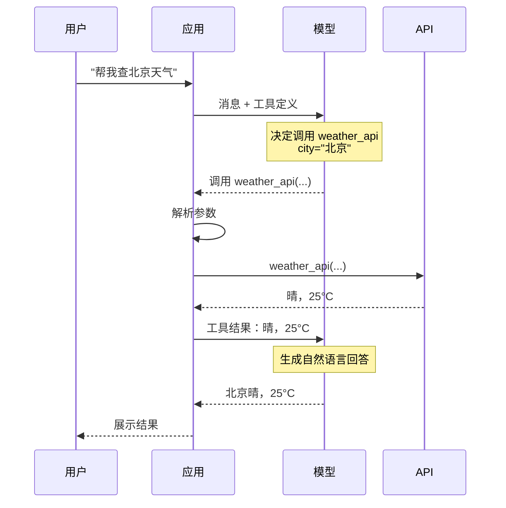
```mermaid
%%{init: {"sequence": {"actorMargin": 25, "width": 120}}}%%
sequenceDiagram
    participant U as 用户
    participant App as 应用
    participant LLM as 模型
    participant API as API

    U->>App: "帮我查北京天气"
    App->>LLM: 消息 + 工具定义
    
    Note over LLM: 决定调用 weather_api<br/>city="北京"
    
    LLM-->>App: 调用 weather_api(...)
    
    App->>App: 解析参数
    App->>API: weather_api(...)
    API-->>App: 晴，25°C
    
    App->>LLM: 工具结果：晴，25°C
    
    Note over LLM: 生成自然语言回答
    
    LLM-->>App: 北京晴，25°C
    App-->>U: 展示结果
```

### 15.3.2 Function Calling vs ReAct 的本质区别

| 维度 | ReAct | Function Calling |
|------|-------|-----------------|
| **输出格式** | 文本格式（Thought + Action） | 结构化 JSON |
| **解析方式** | 正则/规则解析 | 原生 JSON 解析 |
| **思考过程** | 显式输出 Thought | 隐式（模型内部） |
| **模型支持** | 任何 LLM（通过 Prompt） | 需要模型原生支持（如 GPT-5.6、Claude、Qwen）|
| **可靠性** | 中（解析可能出错） | 高（结构化输出） |
| **灵活性** | 高（可自定义格式） | 中（遵循 API 格式） |

**核心关系**：Function Calling 是 ReAct 中 "Action" 步骤的**工程化、标准化实现**。ReAct 是思想，Function Calling 是工具。

### 15.3.3 多工具调用 Agent 实战

```python
"""
Function Calling 多工具 Agent - 完整实战
"""
import json
import os
import openai

class FunctionCallingAgent:
    """
    基于 OpenAI Function Calling 的 Agent
    
    核心流程：
    1. 定义 tools（函数 schema）
    2. 发送用户消息 + tools 定义
    3. 如果模型返回 function_call，执行对应函数
    4. 将结果返回给模型，生成最终回答
    """
    
    def __init__(self, api_key: str = None):
        self.client = openai.OpenAI(api_key=api_key)
        self.model = os.getenv("OPENAI_MODEL", "gpt-5.6")
        # 此处保留 Chat Completions 以教学 message.tool_calls；GPT-5.6 关闭 reasoning。
        self.model_kwargs = (
            {"reasoning_effort": "none"} if self.model.startswith("gpt-5.6") else {}
        )
        self.tools = []
        self.tool_functions = {}
        self.conversation = []
    
    def register_tool(self, name: str, description: str, parameters: dict, func: callable):
        """注册工具"""
        self.tools.append({
            "type": "function",
            "function": {
                "name": name,
                "description": description,
                "parameters": parameters,
            }
        })
        self.tool_functions[name] = func
    
    def execute(self, user_message: str, max_tool_calls: int = 5) -> str:
        """执行对话循环"""
        self.conversation = [{"role": "user", "content": user_message}]
        
        for _ in range(max_tool_calls):
            response = self.client.chat.completions.create(
                model=self.model,
                messages=self.conversation,
                tools=self.tools if self.tools else None,
                tool_choice="auto",
                **self.model_kwargs,
            )
            
            message = response.choices[0].message
            
            # 检查是否需要调用工具
            if not message.tool_calls:
                # 不需要工具，直接返回回答
                return message.content
            
            # 记录助手消息（含 tool_calls）
            self.conversation.append({
                "role": "assistant",
                "content": message.content or "",
                "tool_calls": [
                    {
                        "id": tc.id,
                        "type": "function",
                        "function": {
                            "name": tc.function.name,
                            "arguments": tc.function.arguments,
                        }
                    }
                    for tc in message.tool_calls
                ]
            })
            
            # 执行所有工具调用
            for tool_call in message.tool_calls:
                func_name = tool_call.function.name
                func_args = json.loads(tool_call.function.arguments)
                
                if func_name in self.tool_functions:
                    result = self.tool_functions[func_name](**func_args)
                else:
                    result = f"错误：工具 {func_name} 不存在"
                
                # 将工具结果加入对话
                self.conversation.append({
                    "role": "tool",
                    "tool_call_id": tool_call.id,
                    "content": str(result),
                })
        
        # 达到最大工具调用次数，生成最终回答
        final_response = self.client.chat.completions.create(
            model=self.model,
            messages=self.conversation,
            **self.model_kwargs,
        )
        return final_response.choices[0].message.content


# ============ 工具函数定义 ============

import requests

def get_weather(city: str) -> str:
    """获取天气（模拟）"""
    weather_data = {
        "北京": "晴，25°C",
        "上海": "多云，28°C",
        "广州": "小雨，30°C",
        "深圳": "雷阵雨，29°C",
    }
    return weather_data.get(city, "未知城市")


def get_stock_price(symbol: str) -> str:
    """获取股票价格（模拟）"""
    stocks = {
        "AAPL": "182.50 USD",
        "GOOGL": "142.30 USD",
        "MSFT": "380.20 USD",
        "TSLA": "240.10 USD",
    }
    return stocks.get(symbol.upper(), "未知股票代码")


def search_knowledge(query: str) -> str:
    """知识库搜索（模拟）"""
    kb = {
        "年假": "员工每年享有 15 天带薪年假，入职满 1 年后可申请。",
        "报销": "差旅报销需在出差结束后 30 天内提交，附发票和行程单。",
        "加班": "加班需提前在 OA 系统申请，加班费按法定标准计算。",
    }
    for key, value in kb.items():
        if key in query:
            return value
    return f"未找到 '{query}' 的相关政策"


def send_notification(to: str, message: str) -> str:
    """发送通知（模拟）"""
    return f"通知已发送给 {to}: {message}"


# ============ 使用示例 ============

def main():
    agent = FunctionCallingAgent()
    
    # 注册工具
    agent.register_tool(
        name="get_weather",
        description="获取指定城市的当前天气",
        parameters={
            "type": "object",
            "properties": {
                "city": {"type": "string", "description": "城市名称，如北京、上海"}
            },
            "required": ["city"]
        },
        func=get_weather
    )
    
    agent.register_tool(
        name="get_stock_price",
        description="获取指定股票的当前价格",
        parameters={
            "type": "object",
            "properties": {
                "symbol": {"type": "string", "description": "股票代码，如 AAPL、GOOGL"}
            },
            "required": ["symbol"]
        },
        func=get_stock_price
    )
    
    agent.register_tool(
        name="search_knowledge",
        description="搜索公司内部知识库",
        parameters={
            "type": "object",
            "properties": {
                "query": {"type": "string", "description": "搜索关键词"}
            },
            "required": ["query"]
        },
        func=search_knowledge
    )
    
    agent.register_tool(
        name="send_notification",
        description="发送通知给指定人员",
        parameters={
            "type": "object",
            "properties": {
                "to": {"type": "string", "description": "接收人"},
                "message": {"type": "string", "description": "通知内容"}
            },
            "required": ["to", "message"]
        },
        func=send_notification
    )
    
    # 测试：需要调用多个工具的复杂查询
    query = "北京天气怎么样？顺便帮我查一下 AAPL 的股价。如果天气好，通知小王出门记得带伞。"
    result = agent.execute(query)
    print(f"查询：{query}")
    print(f"结果：{result}")


if __name__ == "__main__":
    main()
```

---

## 15.4 MCP 协议 ⭐⭐⭐⭐⭐

### 15.4.1 什么是 MCP

MCP（Model Context Protocol，模型上下文协议）是 Anthropic 于 2024 年底推出的**开放标准协议**，旨在为 AI 模型提供与外部工具和数据源连接的标准化方式。它被称为 "AI 领域的 USB-C 接口"。

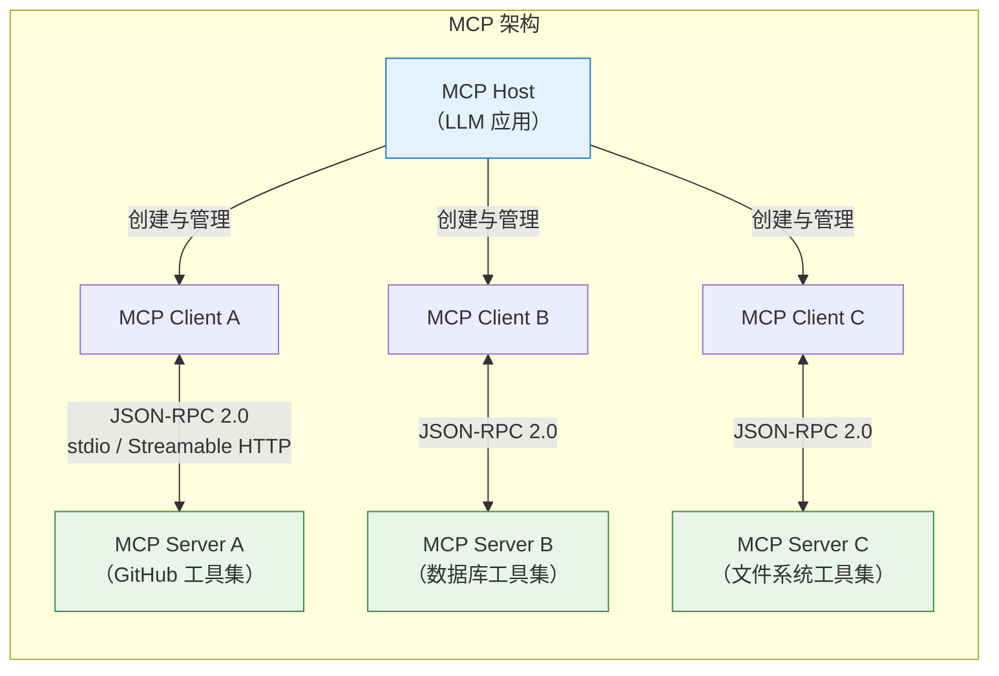
```mermaid
graph TB
    subgraph "MCP 架构"
        direction TB
        
        Host["MCP Host<br/>（LLM 应用）"]
        Client1["MCP Client A"]
        Client2["MCP Client B"]
        Client3["MCP Client C"]
        Server1["MCP Server A<br/>（GitHub 工具集）"]
        Server2["MCP Server B<br/>（数据库工具集）"]
        Server3["MCP Server C<br/>（文件系统工具集）"]
        
        Host -->|"创建与管理"| Client1
        Host -->|"创建与管理"| Client2
        Host -->|"创建与管理"| Client3
        Client1 <-->|"JSON-RPC 2.0<br/>stdio / Streamable HTTP"| Server1
        Client2 <-->|"JSON-RPC 2.0"| Server2
        Client3 <-->|"JSON-RPC 2.0"| Server3
    end
    
    style Host fill:#e3f2fd,stroke:#1976d2
    style Server1 fill:#e8f5e9,stroke:#388e3c
    style Server2 fill:#e8f5e9,stroke:#388e3c
    style Server3 fill:#e8f5e9,stroke:#388e3c
```

**MCP 的核心设计**：

| 组件 | 角色 | 说明 |
|------|------|------|
| **MCP Client** | 消费者 | LLM 应用（如 Claude Desktop、Cursor、自定义 Agent）|
| **MCP Server** | 提供者 | 暴露工具和数据源的服务端 |
| **Transport** | 传输层 | stdio（本地）或 SSE（远程）|
| **Protocol** | 协议层 | JSON-RPC 2.0 |

### 15.4.2 MCP 三大核心能力

MCP Server 可以向 Client 暴露三类能力：

#### 1. Tools（工具）⭐⭐⭐⭐⭐

模型可调用的函数，类似于 Function Calling 中的函数定义：

```json
{
  "tools": [
    {
      "name": "read_file",
      "description": "读取文件内容",
      "inputSchema": {
        "type": "object",
        "properties": {
          "path": {"type": "string", "description": "文件路径"}
        },
        "required": ["path"]
      }
    },
    {
      "name": "write_file",
      "description": "写入文件内容",
      "inputSchema": {
        "type": "object",
        "properties": {
          "path": {"type": "string"},
          "content": {"type": "string"}
        },
        "required": ["path", "content"]
      }
    }
  ]
}
```

#### 2. Resources（资源）

只读的数据资源，模型可以读取但不可修改：

```json
{
  "resources": [
    {
      "uri": "file:///project/README.md",
      "mimeType": "text/markdown",
      "name": "项目 README"
    },
    {
      "uri": "db://users/schema",
      "mimeType": "application/json",
      "name": "用户表结构"
    }
  ]
}
```

#### 3. Prompts（提示模板）

预定义的提示词模板，Server 可以向 Client 提供标准化的交互模式：

```json
{
  "prompts": [
    {
      "name": "code_review",
      "description": "代码审查模板",
      "arguments": [
        {
          "name": "language",
          "description": "编程语言",
          "required": true
        }
      ]
    }
  ]
}
```

### 15.4.3 MCP 通信流程

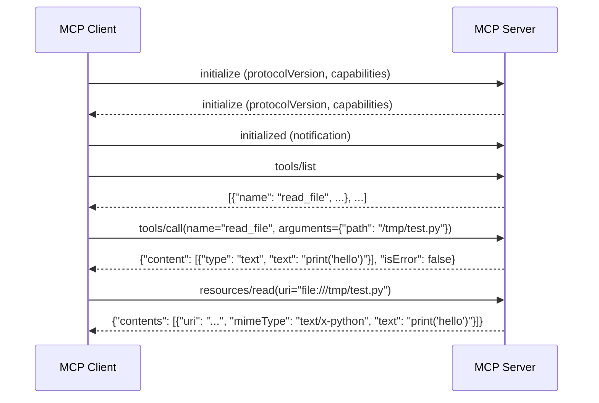
```mermaid
sequenceDiagram
    participant Client as MCP Client
    participant Server as MCP Server

    %% 初始化
    Client->>Server: initialize (protocolVersion, capabilities)
    Server-->>Client: initialize (protocolVersion, capabilities)
    Client->>Server: initialized (notification)

    %% 工具发现
    Client->>Server: tools/list
    Server-->>Client: [{"name": "read_file", ...}, ...]

    %% 工具调用
    Client->>Server: tools/call(name="read_file", arguments={"path": "/tmp/test.py"})
    Server-->>Client: {"content": [{"type": "text", "text": "print('hello')"}], "isError": false}

    %% 资源读取
    Client->>Server: resources/read(uri="file:///tmp/test.py")
    Server-->>Client: {"contents": [{"uri": "...", "mimeType": "text/x-python", "text": "print('hello')"}]}
```

### 15.4.4 MCP 与 Function Calling 的本质区别 ⭐⭐⭐⭐⭐

这是 **2025 年面试最高频的问题之一**。

| 维度 | Function Calling | MCP |
|------|-----------------|-----|
| **定位** | 模型的**输出格式能力** | **连接协议/标准** |
| **层级** | 应用层（单个函数调用）| 协议层（客户端-服务端架构）|
| **工具发现** | 调用前静态定义 | 运行时动态发现（tools/list）|
| **工具来源** | 应用程序硬编码 | 独立的 MCP Server，可插拔 |
| **通信方式** | 函数调用 → 本地执行 | JSON-RPC 2.0（stdio/SSE）|
| **复用性** | 低（每个应用自己实现）| 高（一个 Server 服务多个 Client）|
| **生态** | 各平台独立 | 开放生态，社区共享 Server |

**一句话总结**：Function Calling 是**能力**（模型能输出函数调用指令），MCP 是**协议**（标准化地连接模型与工具生态）。

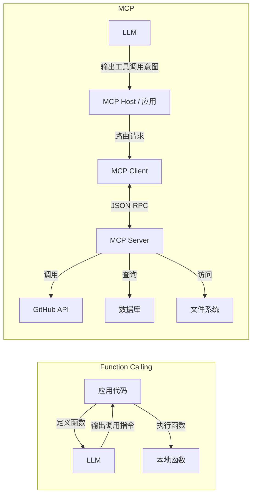
```mermaid
graph LR
    subgraph "Function Calling"
        A[应用代码] -->|"定义函数"| B[LLM]
        B -->|"输出调用指令"| A
        A -->|"执行函数"| C[本地函数]
    end
    
    subgraph "MCP"
        I[LLM] -->|"输出工具调用意图"| Host[MCP Host / 应用]
        Host -->|"路由请求"| D[MCP Client]
        D <-->|"JSON-RPC"| E[MCP Server]
        E -->|"调用"| F[GitHub API]
        E -->|"查询"| G[数据库]
        E -->|"访问"| H[文件系统]
    end
```

### 15.4.5 MCP Server 简单实现

```python
"""
MCP Server 简化实现示例
展示 MCP 协议的核心交互模式
"""
import json
import sys
from typing import Any

class MCPServer:
    """
    MCP Server 简化实现
    
    通信方式：stdio（标准输入输出上的 JSON-RPC）
    """
    
    def __init__(self):
        self.tools = {
            "read_file": self.read_file,
            "list_directory": self.list_directory,
        }
    
    def send(self, message: dict):
        """发送 JSON-RPC 消息"""
        print(json.dumps(message), flush=True)
    
    def recv(self) -> dict | None:
        """接收 JSON-RPC 消息"""
        try:
            line = sys.stdin.readline()
            if not line:
                return None
            return json.loads(line)
        except json.JSONDecodeError:
            return None
    
    def handle_initialize(self, request_id: Any, params: dict) -> dict:
        """处理初始化请求"""
        return {
            "jsonrpc": "2.0",
            "id": request_id,
            "result": {
                "protocolVersion": "2024-11-05",
                "capabilities": {
                    "tools": {},
                    "resources": {}
                },
                "serverInfo": {
                    "name": "simple-filesystem-server",
                    "version": "1.0.0"
                }
            }
        }
    
    def handle_tools_list(self, request_id: Any) -> dict:
        """处理工具列表请求"""
        return {
            "jsonrpc": "2.0",
            "id": request_id,
            "result": {
                "tools": [
                    {
                        "name": "read_file",
                        "description": "读取文件内容",
                        "inputSchema": {
                            "type": "object",
                            "properties": {
                                "path": {"type": "string"}
                            },
                            "required": ["path"]
                        }
                    },
                    {
                        "name": "list_directory",
                        "description": "列出目录内容",
                        "inputSchema": {
                            "type": "object",
                            "properties": {
                                "path": {"type": "string"}
                            },
                            "required": ["path"]
                        }
                    }
                ]
            }
        }
    
    def handle_tools_call(self, request_id: Any, params: dict) -> dict:
        """处理工具调用请求"""
        tool_name = params.get("name")
        arguments = params.get("arguments", {})
        
        if tool_name in self.tools:
            try:
                result = self.tools[tool_name](**arguments)
                return {
                    "jsonrpc": "2.0",
                    "id": request_id,
                    "result": {
                        "content": [{"type": "text", "text": result}],
                        "isError": False
                    }
                }
            except Exception as e:
                return {
                    "jsonrpc": "2.0",
                    "id": request_id,
                    "result": {
                        "content": [{"type": "text", "text": f"错误: {str(e)}"}],
                        "isError": True
                    }
                }
        else:
            return {
                "jsonrpc": "2.0",
                "id": request_id,
                "error": {"code": -32601, "message": f"工具 {tool_name} 不存在"}
            }
    
    def read_file(self, path: str) -> str:
        with open(path, 'r', encoding='utf-8') as f:
            return f.read()
    
    def list_directory(self, path: str) -> str:
        import os
        entries = os.listdir(path)
        return "\n".join(entries)
    
    def run(self):
        """主事件循环"""
        while True:
            request = self.recv()
            if request is None:
                break
            
            method = request.get("method", "")
            request_id = request.get("id")
            params = request.get("params", {})
            
            if method == "initialize":
                response = self.handle_initialize(request_id, params)
            elif method == "tools/list":
                response = self.handle_tools_list(request_id)
            elif method == "tools/call":
                response = self.handle_tools_call(request_id, params)
            else:
                response = {
                    "jsonrpc": "2.0",
                    "id": request_id,
                    "error": {"code": -32601, "message": f"未知方法: {method}"}
                }
            
            self.send(response)


if __name__ == "__main__":
    server = MCPServer()
    server.run()
```

---

### 15.4.6 MCP 工程化管理 🆕（2026年更新）

> 2026年，MCP 已从"新协议介绍"进入"工程化管理"阶段。面试中不再只问"什么是 MCP"，而是追问"你们怎么管理几百个 MCP Server？"

#### 1. 大量 MCP Server 的管理挑战

当生产环境中的 MCP Server 从 3-5 个增长到 50+ 甚至 100+ 时，面临以下挑战：

| 挑战 | 描述 | 解决方案 |
|------|------|---------|
| **服务发现** | 如何知道有哪些 Server 可用 | MCP Registry（注册中心） |
| **动态加载** | 运行时增删 Server 不重启 | 热插拔 + 健康检查 |
| **权限控制** | 不同用户能访问不同工具 | RBAC + Tool 级权限 |
| **审计追踪** | 谁调用了什么工具 | 全链路日志 + 调用链 |
| **版本管理** | Server 升级不影响 Client | 语义化版本 + 灰度发布 |
| **性能监控** | 哪些工具慢、失败率高 | 指标采集 + 告警 |

#### 2. MCP Server 动态加载架构

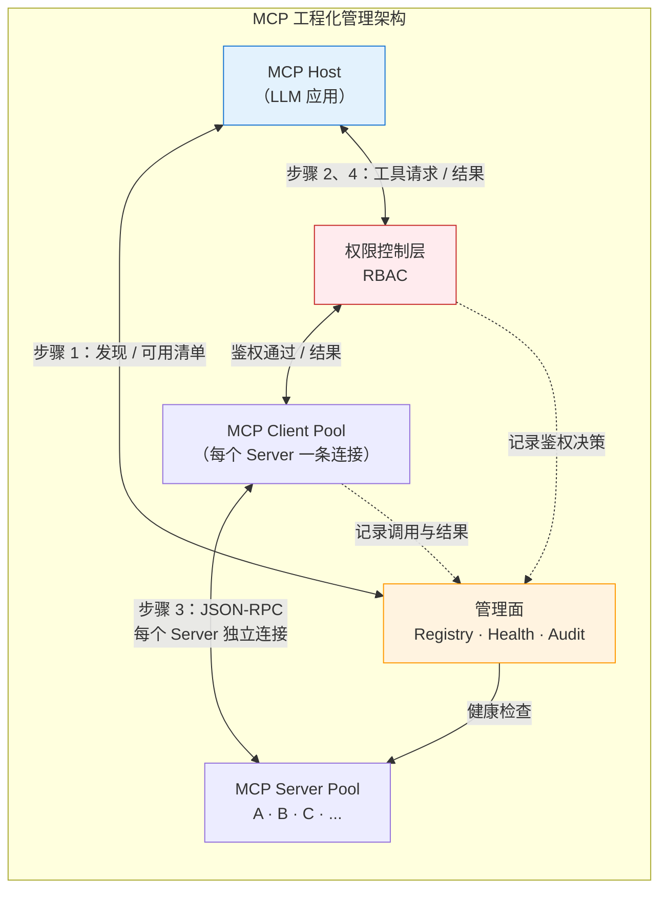
```mermaid
graph TB
    subgraph "MCP 工程化管理架构"
        direction TB

        Host["MCP Host<br/>（LLM 应用）"]
        ClientPool["MCP Client Pool<br/>（每个 Server 一条连接）"]
        Servers["MCP Server Pool<br/>A · B · C · ..."]
        Auth["权限控制层<br/>RBAC"]
        Ops["管理面<br/>Registry · Health · Audit"]

        Host <-->|"步骤 1：发现 / 可用清单"| Ops
        Host <-->|"步骤 2、4：工具请求 / 结果"| Auth
        Auth <-->|"鉴权通过 / 结果"| ClientPool
        ClientPool <-->|"步骤 3：JSON-RPC<br/>每个 Server 独立连接"| Servers
        Ops -->|"健康检查"| Servers
        Auth -.->|"记录鉴权决策"| Ops
        ClientPool -.->|"记录调用与结果"| Ops
    end

    style Host fill:#e3f2fd,stroke:#1976d2
    style Ops fill:#fff3e0,stroke:#ff9800
    style Auth fill:#ffebee,stroke:#c62828
```

#### 3. 动态加载与权限控制代码示例

```python
"""
MCP 工程化管理 - Server 注册中心 + 动态加载 + 权限控制
"""
import json
import time
import hashlib
from typing import Optional
from dataclasses import dataclass, field
from datetime import datetime, timedelta
from enum import Enum


class PermissionLevel(Enum):
    """工具权限级别"""
    DENY = 0      # 禁止访问
    READ = 1      # 只读访问
    WRITE = 2     # 读写访问
    ADMIN = 3     # 完全控制


@dataclass
class MCPServerInfo:
    """MCP Server 注册信息"""
    name: str
    version: str
    transport: str          # "stdio" | "sse"
    endpoint: str           # 路径或 URL
    tools: list[dict] = field(default_factory=list)
    permissions: dict[str, PermissionLevel] = field(default_factory=dict)
    last_heartbeat: float = 0.0
    health_status: str = "unknown"  # "healthy" | "unhealthy" | "unknown"
    metadata: dict = field(default_factory=dict)


class MCPRegistry:
    """
    MCP Server 注册中心

    功能：
    1. Server 注册与发现
    2. 健康检查
    3. 版本管理
    4. 工具级权限控制 (RBAC)
    """

    def __init__(self):
        self._servers: dict[str, MCPServerInfo] = {}
        self._user_roles: dict[str, list[str]] = {}  # user_id -> [role, ...]
        self._role_permissions: dict[str, dict[str, PermissionLevel]] = {}
        self._audit_log: list[dict] = []
        self._max_log_entries = 10000

    def register(self, server_info: MCPServerInfo) -> bool:
        """注册 MCP Server"""
        server_id = f"{server_info.name}@{server_info.version}"
        server_info.last_heartbeat = time.time()
        server_info.health_status = "healthy"
        self._servers[server_id] = server_info
        return True

    def discover(self, user_id: str) -> list[MCPServerInfo]:
        """
        为用户发现可用的 Server（根据权限过滤）

        Args:
            user_id: 用户ID

        Returns:
            用户有权限访问的 Server 列表
        """
        available = []
        user_perms = self._get_user_permissions(user_id)

        for server_id, server in self._servers.items():
            if server.health_status != "healthy":
                continue
            # 过滤用户有权限的工具
            allowed_tools = []
            for tool in server.tools:
                tool_name = tool.get("name", "")
                perm = user_perms.get(tool_name, PermissionLevel.DENY)
                if perm.value >= PermissionLevel.READ.value:
                    allowed_tools.append(tool)

            if allowed_tools:
                filtered_server = MCPServerInfo(
                    name=server.name,
                    version=server.version,
                    transport=server.transport,
                    endpoint=server.endpoint,
                    tools=allowed_tools,
                    permissions={k: v for k, v in user_perms.items() 
                               if v.value >= PermissionLevel.READ.value},
                    health_status=server.health_status,
                    metadata=server.metadata,
                )
                available.append(filtered_server)

        return available

    def check_permission(
        self, 
        user_id: str, 
        tool_name: str, 
        required_level: PermissionLevel = PermissionLevel.READ
    ) -> bool:
        """检查用户是否有权限调用指定工具"""
        user_perms = self._get_user_permissions(user_id)
        actual = user_perms.get(tool_name, PermissionLevel.DENY)
        return actual.value >= required_level.value

    def _get_user_permissions(self, user_id: str) -> dict[str, PermissionLevel]:
        """获取用户的所有工具权限"""
        roles = self._user_roles.get(user_id, ["default"])
        merged: dict[str, PermissionLevel] = {}

        for role in roles:
            role_perms = self._role_permissions.get(role, {})
            for tool, perm in role_perms.items():
                if tool not in merged or perm.value > merged[tool].value:
                    merged[tool] = perm

        return merged

    def log_tool_call(
        self, 
        user_id: str, 
        tool_name: str, 
        arguments: dict, 
        result: str,
        duration_ms: float,
        success: bool
    ):
        """记录工具调用审计日志"""
        entry = {
            "timestamp": datetime.now().isoformat(),
            "user_id": self._hash_id(user_id),
            "tool_name": tool_name,
            "arguments": self._sanitize_args(arguments),
            "result_preview": result[:200] if result else "",
            "duration_ms": duration_ms,
            "success": success,
        }
        self._audit_log.append(entry)

        # 防止日志无限增长
        if len(self._audit_log) > self._max_log_entries:
            self._audit_log = self._audit_log[-self._max_log_entries // 2:]

    def health_check(self) -> dict[str, str]:
        """对所有 Server 执行健康检查"""
        now = time.time()
        for server_id, server in self._servers.items():
            if now - server.last_heartbeat > 60:  # 60秒无心跳视为不健康
                server.health_status = "unhealthy"
        return {sid: s.health_status for sid, s in self._servers.items()}

    @staticmethod
    def _hash_id(user_id: str) -> str:
        """对用户ID做哈希处理（隐私保护）"""
        return hashlib.sha256(user_id.encode()).hexdigest()[:16]

    @staticmethod
    def _sanitize_args(args: dict) -> dict:
        """清理敏感参数（如密码、token）"""
        sensitive_keys = {"password", "token", "secret", "api_key", "auth"}
        sanitized = {}
        for k, v in args.items():
            if any(sk in k.lower() for sk in sensitive_keys):
                sanitized[k] = "***REDACTED***"
            else:
                sanitized[k] = v
        return sanitized


# ============ 使用示例 ============

def demo_mcp_registry():
    """MCP Registry 使用演示"""
    registry = MCPRegistry()

    # 1. 定义角色权限：客服人员只能查询，管理员可以修改
    registry._role_permissions["customer_service"] = {
        "query_order": PermissionLevel.READ,
        "query_policy": PermissionLevel.READ,
        "search_knowledge": PermissionLevel.READ,
    }
    registry._role_permissions["admin"] = {
        "query_order": PermissionLevel.WRITE,
        "update_order": PermissionLevel.WRITE,
        "refund_request": PermissionLevel.ADMIN,
    }

    # 2. 分配角色
    registry._user_roles["alice"] = ["customer_service"]
    registry._user_roles["bob"] = ["admin"]

    # 3. 注册 Server
    registry.register(MCPServerInfo(
        name="order-system",
        version="1.2.0",
        transport="stdio",
        endpoint="/servers/order-mcp",
        tools=[
            {"name": "query_order", "description": "查询订单"},
            {"name": "update_order", "description": "更新订单"},
        ],
    ))

    # 4. 权限检查
    print(f"Alice 能否 query_order: {registry.check_permission('alice', 'query_order')}")
    print(f"Alice 能否 update_order: {registry.check_permission('alice', 'update_order')}")
    print(f"Bob 能否 update_order: {registry.check_permission('bob', 'update_order')}")

    # 5. 发现可用 Server
    alice_servers = registry.discover("alice")
    print(f"\nAlice 可用的 Server: {[s.name for s in alice_servers]}")
    print(f"Alice 可用的工具: {[t['name'] for s in alice_servers for t in s.tools]}")

    # 6. 记录审计日志
    registry.log_tool_call(
        user_id="alice",
        tool_name="query_order",
        arguments={"order_id": "#12345"},
        result="订单状态：已发货",
        duration_ms=45.2,
        success=True,
    )
    print(f"\n审计日志条目数: {len(registry._audit_log)}")


if __name__ == "__main__":
    demo_mcp_registry()
```

**面试追问**："MCP Server 多了之后，一个工具的调用链怎么追踪？" → 引入**调用链追踪（Trace ID）**，每个 Agent 任务生成唯一 Trace ID，贯穿所有 MCP 工具调用，便于故障排查和性能分析。
## 15.5 Agent 记忆管理 ⭐⭐⭐⭐

### 15.5.1 记忆分层架构

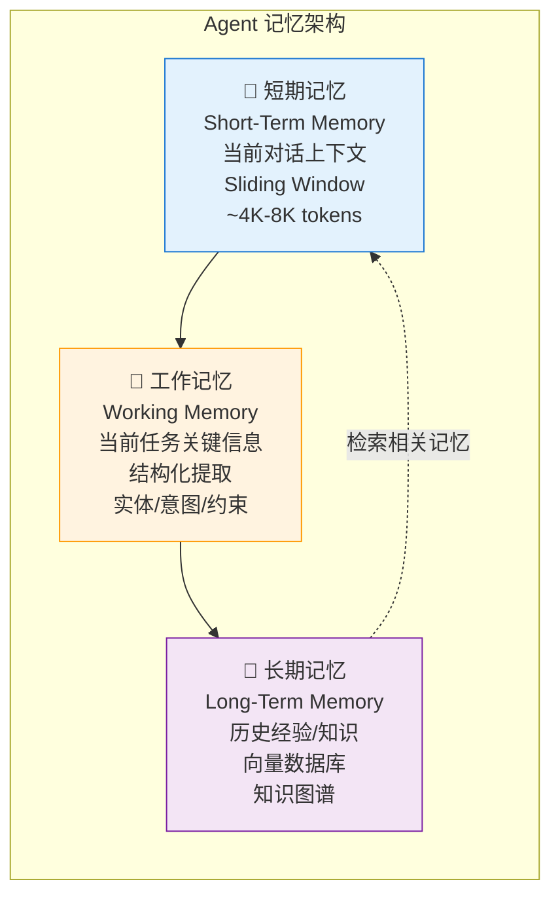
```mermaid
graph TB
    subgraph "Agent 记忆架构"
        direction TB
        
        STM["🧠 短期记忆<br/>Short-Term Memory<br/>当前对话上下文<br/>Sliding Window<br/>~4K-8K tokens"]
        
        WM["📝 工作记忆<br/>Working Memory<br/>当前任务关键信息<br/>结构化提取<br/>实体/意图/约束"]
        
        LTM["💾 长期记忆<br/>Long-Term Memory<br/>历史经验/知识<br/>向量数据库<br/>知识图谱"]
        
        STM --> WM
        WM --> LTM
        LTM -.->|"检索相关记忆"| STM
    end
    
    style STM fill:#e3f2fd,stroke:#1976d2
    style WM fill:#fff3e0,stroke:#ff9800
    style LTM fill:#f3e5f5,stroke:#7b1fa2
```

### 15.5.2 短期记忆：滑动窗口管理

```python
class SlidingWindowMemory:
    """滑动窗口短期记忆管理"""
    
    def __init__(self, max_tokens: int = 4000, tokenizer=None):
        self.max_tokens = max_tokens
        self.messages: list[dict] = []
        self.tokenizer = tokenizer
    
    def add(self, role: str, content: str):
        """添加消息，超出窗口时移除最旧的消息"""
        self.messages.append({"role": role, "content": content})
        self._ensure_window_size()
    
    def _ensure_window_size(self):
        """确保不超过最大 token 数"""
        while self._estimate_tokens() > self.max_tokens and len(self.messages) > 2:
            # 保留 system prompt，移除最早的 user/assistant 对话
            if len(self.messages) > 1 and self.messages[1]["role"] != "system":
                self.messages.pop(1)
            else:
                self.messages.pop(2)
    
    def _estimate_tokens(self) -> int:
        """估算 token 数（粗略估计：1 token ≈ 0.75 中文字符）"""
        total = 0
        for msg in self.messages:
            content = msg.get("content", "")
            # 粗略估算
            total += len(content) // 3 * 2 + 4  # 每条消息 overhead
        return total
    
    def get_messages(self) -> list[dict]:
        return self.messages.copy()
    
    def clear(self):
        self.messages = []


# 使用示例
memory = SlidingWindowMemory(max_tokens=4000)
memory.add("system", "你是一个智能客服助手")
memory.add("user", "我想退货")
memory.add("assistant", "好的，请提供您的订单号")
memory.add("user", "订单号是 #12345")
# ... 更多对话
```

### 15.5.3 长期记忆：向量存储 + 知识图谱

```python
from sentence_transformers import SentenceTransformer
import numpy as np

class LongTermMemory:
    """
    Agent 长期记忆系统
    
    包含两个存储：
    1. 经验记忆（向量数据库）：存储历史对话和经验
    2. 事实记忆（知识图谱）：存储实体关系
    """
    
    def __init__(self, embedding_model: str = "BAAI/bge-small-zh-v1.5"):
        self.embedder = SentenceTransformer(embedding_model)
        
        # 经验记忆: [(text, embedding, metadata), ...]
        self.experiences: list[dict] = []
        
        # 事实记忆: {entity: {relation: target, ...}, ...}
        self.facts: dict[str, dict[str, str]] = {}
    
    def add_experience(self, text: str, experience_type: str = "conversation"):
        """添加经验记忆"""
        embedding = self.embedder.encode(text, normalize_embeddings=True)
        self.experiences.append({
            "text": text,
            "embedding": embedding,
            "metadata": {"type": experience_type, "timestamp": "now"}
        })
    
    def retrieve_relevant(self, query: str, top_k: int = 3) -> list[str]:
        """检索相关经验"""
        if not self.experiences:
            return []
        
        query_emb = self.embedder.encode(query, normalize_embeddings=True)
        
        # 计算余弦相似度
        experiences_array = np.array([e["embedding"] for e in self.experiences])
        similarities = np.dot(experiences_array, query_emb)
        
        # 取 Top-K
        top_indices = np.argsort(similarities)[::-1][:top_k]
        return [self.experiences[i]["text"] for i in top_indices]
    
    def add_fact(self, entity: str, relation: str, target: str):
        """添加事实记忆"""
        if entity not in self.facts:
            self.facts[entity] = {}
        self.facts[entity][relation] = target
    
    def query_fact(self, entity: str, relation: str = None) -> dict | str:
        """查询事实"""
        if entity not in self.facts:
            return {}
        if relation:
            return self.facts[entity].get(relation, "未知")
        return self.facts[entity]


# 完整记忆管理集成
class AgentMemory:
    """Agent 完整记忆系统"""
    
    def __init__(self, stm_max_tokens: int = 4000):
        self.stm = SlidingWindowMemory(max_tokens=stm_max_tokens)
        self.ltm = LongTermMemory()
        self.working_memory: dict = {}
    
    def memorize_interaction(self, user_msg: str, assistant_msg: str):
        """记录一次交互到短期记忆和长期记忆"""
        self.stm.add("user", user_msg)
        self.stm.add("assistant", assistant_msg)
        
        # 同时存入长期经验记忆
        self.ltm.add_experience(f"User: {user_msg}\nAssistant: {assistant_msg}")
    
    def get_context(self, current_query: str) -> list[dict]:
        """
        获取完整上下文：
        1. 短期记忆（对话历史）
        2. 从长期记忆中检索相关经验
        """
        messages = self.stm.get_messages()
        
        # 检索长期记忆中的相关经验
        relevant_experiences = self.ltm.retrieve_relevant(current_query, top_k=2)
        
        if relevant_experiences:
            # 将相关经验作为上下文注入
            context_msg = "相关历史经验：\n" + "\n---\n".join(relevant_experiences)
            messages.insert(1, {"role": "system", "content": context_msg})
        
        return messages
```

---

## 15.6 多 Agent 协作系统 ⭐⭐⭐⭐

### 15.6.1 多 Agent 架构模式

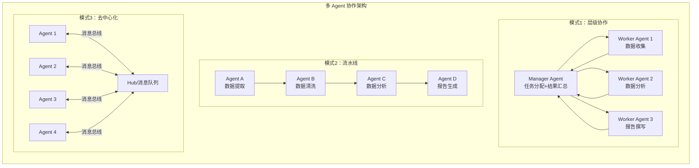
```mermaid
graph TB
    subgraph "多 Agent 协作架构"
        direction TB
        
        subgraph "模式1：层级协作"
            M[Manager Agent<br/>任务分配+结果汇总]
            W1[Worker Agent 1<br/>数据收集]
            W2[Worker Agent 2<br/>数据分析]
            W3[Worker Agent 3<br/>报告撰写]
            M --> W1
            M --> W2
            M --> W3
            W1 --> M
            W2 --> M
            W3 --> M
        end
        
        subgraph "模式2：流水线"
            P1[Agent A<br/>数据提取] --> P2[Agent B<br/>数据清洗]
            P2 --> P3[Agent C<br/>数据分析]
            P3 --> P4[Agent D<br/>报告生成]
        end
        
        subgraph "模式3：去中心化"
            A1[Agent 1] <-->|"消息总线"| H[Hub/消息队列]
            A2[Agent 2] <-->|"消息总线"| H
            A3[Agent 3] <-->|"消息总线"| H
            A4[Agent 4] <-->|"消息总线"| H
        end
    end
```

### 15.6.2 主流多 Agent 框架

| 框架 | 开发者 | 核心特点 | 适用场景 |
|------|--------|---------|---------|
| **AutoGen** | 微软 | Conversational Programming、多 Agent 对话、代码执行 | 复杂任务自动化、代码生成 |
| **MetaGPT** | 开源社区 | SOP（标准作业程序）驱动、角色专业化 | 软件开发、项目管理 |
| **CrewAI** | 开源社区 | 角色扮演、流程编排、工具共享 | 团队协作模拟、工作流自动化 |
| **A2A 协议** | Google | Agent-to-Agent 开放协议、标准化 Agent 间通信 | 跨平台 Agent 互操作 |

### 15.6.3 A2A 协议简介 ⭐⭐⭐⭐

A2A（Agent-to-Agent）是 Google 于 2025 年推出的**开放 Agent 间通信协议**，旨在解决不同框架、不同平台的 Agent 如何互相发现和协作的问题。

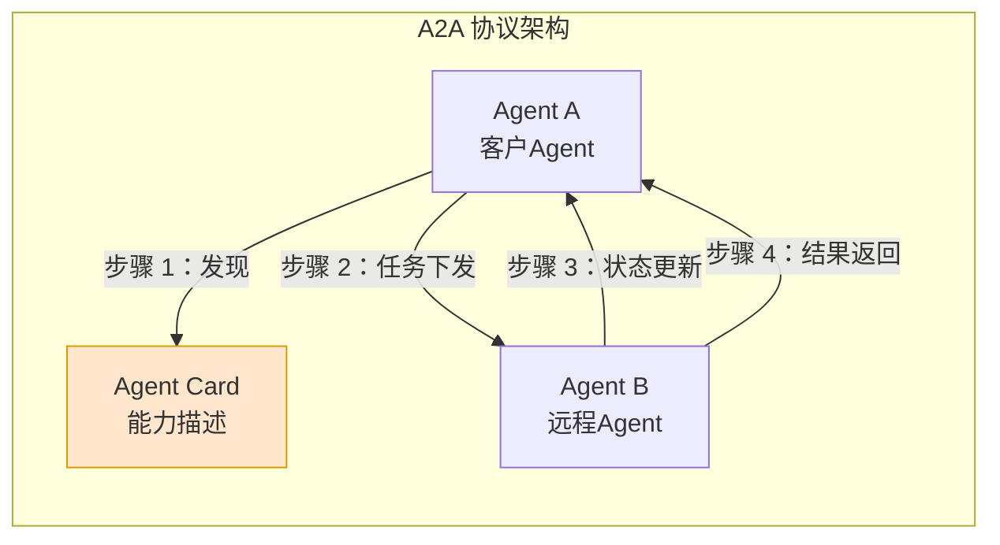
```mermaid
graph LR
    subgraph "A2A 协议架构"
        A1[Agent A<br/>客户Agent] -->|"步骤 1：发现"| D[Agent Card<br/>能力描述]
        A1 -->|"步骤 2：任务下发"| A2[Agent B<br/>远程Agent]
        A2 -->|"步骤 3：状态更新"| A1
        A2 -->|"步骤 4：结果返回"| A1
    end
    
    style D fill:#ffe6cc,stroke:#d79b00
```

**A2A 核心概念**：

| 概念 | 说明 |
|------|------|
| **Agent Card** | 描述 Agent 能力的 JSON 文件（类似 OpenAPI 文档） |
| **Task** | Agent 间传递的任务单元 |
| **Message** | 任务中的消息流（可包含文本、文件、结构化数据） |
| **Push Notification** | 异步任务状态更新机制 |

**MCP vs A2A 的区别**：

| 维度 | MCP | A2A |
|------|-----|-----|
| **连接对象** | Client ↔ Server（模型 ↔ 工具）| Agent ↔ Agent（智能体 ↔ 智能体）|
| **关系模式** | 一对多（一个 Client 连多个 Server）| 多对多（任意 Agent 间通信）|
| **能力描述** | tools/list + resources/list | Agent Card |
| **发起方** | Client 调用 Server | 任意 Agent 可向另一 Agent 下发任务 |
| **类比** | USB-C（设备连接标准）| 蓝牙（设备间通信协议）|

---

### 15.6.4 Agent Teams 架构 🆕（2026年更新）

> Anthropic 在 2026 年 2 月发布 Claude Opus 4.6 时，为 **Claude Code** 引入了
> Agent Teams 研究预览。它是产品编排能力，不是某个模型天然具备的通用 API
> “架构”；适合可拆成独立、偏读取子任务的并行协作，功能状态与限制应以上线时的
> Claude Code 文档为准。

#### 1. Agent Teams 核心概念

传统 Multi-Agent 是**串行**的：Manager 分配任务 → Worker 执行 → Manager 汇总。Agent Teams 是**并行协作**的：Team Lead 统筹，Teammates 各自有独立上下文，通过共享任务列表和邮箱系统通信。

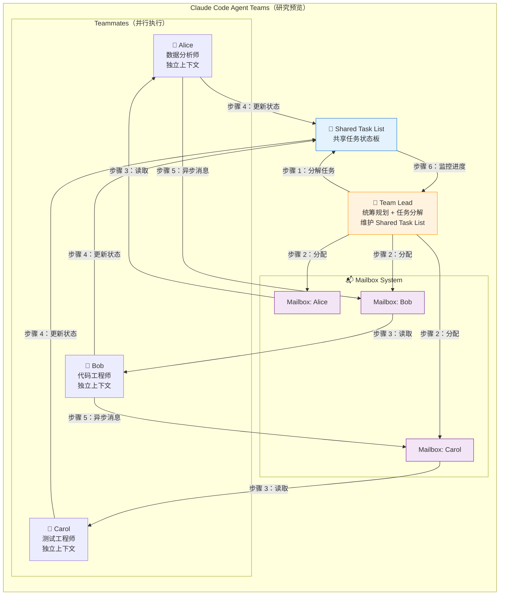
```mermaid
graph TB
    subgraph "Claude Code Agent Teams（研究预览）"
        direction TB

        TL["👤 Team Lead
统筹规划 + 任务分解
维护 Shared Task List"]

        subgraph "📬 Mailbox System"
            M1["Mailbox: Alice"]
            M2["Mailbox: Bob"]
            M3["Mailbox: Carol"]
        end

        subgraph "Teammates（并行执行）"
            T1["🤖 Alice
数据分析师
独立上下文"]
            T2["🤖 Bob
代码工程师
独立上下文"]
            T3["🤖 Carol
测试工程师
独立上下文"]
        end

        STL["📝 Shared Task List
共享任务状态板"]

        TL -->|"步骤 1：分解任务"| STL
        TL -->|"步骤 2：分配"| M1
        TL -->|"步骤 2：分配"| M2
        TL -->|"步骤 2：分配"| M3
        M1 -->|"步骤 3：读取"| T1
        M2 -->|"步骤 3：读取"| T2
        M3 -->|"步骤 3：读取"| T3
        T1 -->|"步骤 4：更新状态"| STL
        T2 -->|"步骤 4：更新状态"| STL
        T3 -->|"步骤 4：更新状态"| STL
        T1 -->|"步骤 5：异步消息"| M2
        T2 -->|"步骤 5：异步消息"| M3
        STL -->|"步骤 6：监控进度"| TL
    end

    style TL fill:#fff3e0,stroke:#ff9800
    style STL fill:#e3f2fd,stroke:#1976d2
    style M1 fill:#f3e5f5,stroke:#7b1fa2
    style M2 fill:#f3e5f5,stroke:#7b1fa2
    style M3 fill:#f3e5f5,stroke:#7b1fa2
```

#### 2. Agent Teams vs 传统 Multi-Agent vs 子代理

| 维度 | 传统 Multi-Agent | Claude Code Agent Teams | 子代理 (Sub-agent) |
|------|-----------------|-------------------------|-------------------|
| **架构模式** | 串行流水线 | 并行协作 | 嵌套调用 |
| **上下文** | 共享/透传 | 独立上下文 | 继承父上下文 |
| **生命周期** | 随任务创建销毁 | 团队运行期间的独立会话 | 临时实例 |
| **通信方式** | 直接函数调用 | Mailbox + Shared Task List | 参数传递 |
| **协作关系** | Manager-Worker | Team Lead + Teammates | Parent-Child |
| **类比** | 工厂流水线 | 敏捷开发团队 | 函数嵌套调用 |

**核心区别**：Agent Teams 的 Teammates 在团队运行期间拥有各自的上下文和状态，
通过共享任务与消息协作；这不等于跨运行永久存在，也不代表所有 Multi-Agent 框架都采用同一实现。

#### 3. Agent Teams 关键组件

| 组件 | 作用 | 类比 |
|------|------|------|
| **Team Lead** | 接收任务、分解子任务、分配给小组成员、监控进度 | 项目经理 |
| **Teammates** | 各自独立执行分配的任务，拥有独立上下文 | 团队成员 |
| **Shared Task List** | 共享的任务状态板，所有人可见当前进度 | Jira / Trello |
| **Mailbox System** | 异步消息通信，Teammates 之间通过邮箱交换信息 | 企业邮箱 |
| **Handoff Protocol** | 任务交接协议，确保任务在不同 Agent 间平滑转移 | 工作交接单 |

#### 4. Agent Teams 工作流程示例

```python
"""
Agent Teams 简化实现示例
展示 Team Lead + Teammates + Shared Task List + Mailbox 的核心交互
"""
from dataclasses import dataclass, field
from typing import Optional
from datetime import datetime
from enum import Enum
import uuid


class TaskStatus(Enum):
    PENDING = "pending"
    ASSIGNED = "assigned"
    IN_PROGRESS = "in_progress"
    COMPLETED = "completed"
    FAILED = "failed"


@dataclass
class Task:
    """共享任务列表中的任务单元"""
    id: str
    description: str
    assignee: Optional[str] = None  # Agent 名称
    status: TaskStatus = TaskStatus.PENDING
    result: Optional[str] = None
    created_at: str = ""
    completed_at: Optional[str] = None
    dependencies: list[str] = field(default_factory=list)  # 依赖的其他任务ID


@dataclass
class Message:
    """Mailbox 消息"""
    id: str
    from_agent: str
    to_agent: str
    content: str
    timestamp: str
    task_id: Optional[str] = None


class SharedTaskList:
    """共享任务状态板 - 所有 Agent 可见"""

    def __init__(self):
        self._tasks: dict[str, Task] = {}
        self._listeners: list[callable] = []

    def add_task(self, task: Task):
        self._tasks[task.id] = task
        self._notify_listeners("task_added", task)

    def update_status(self, task_id: str, status: TaskStatus, result: str = None):
        if task_id in self._tasks:
            task = self._tasks[task_id]
            task.status = status
            if result:
                task.result = result
            if status in (TaskStatus.COMPLETED, TaskStatus.FAILED):
                task.completed_at = datetime.now().isoformat()
            self._notify_listeners("task_updated", task)

    def get_pending_tasks(self) -> list[Task]:
        return [t for t in self._tasks.values() if t.status == TaskStatus.PENDING]

    def get_tasks_by_assignee(self, agent_name: str) -> list[Task]:
        return [t for t in self._tasks.values() if t.assignee == agent_name]

    def is_all_completed(self) -> bool:
        if not self._tasks:
            return False
        return all(t.status in (TaskStatus.COMPLETED, TaskStatus.FAILED) 
                  for t in self._tasks.values())

    def summary(self) -> dict:
        statuses = {}
        for t in self._tasks.values():
            statuses[t.status.value] = statuses.get(t.status.value, 0) + 1
        return statuses

    def _notify_listeners(self, event: str, task: Task):
        for listener in self._listeners:
            try:
                listener(event, task)
            except Exception:
                pass


class MailboxSystem:
    """邮箱系统 - Agent 间异步通信"""

    def __init__(self):
        self._mailboxes: dict[str, list[Message]] = {}

    def register(self, agent_name: str):
        if agent_name not in self._mailboxes:
            self._mailboxes[agent_name] = []

    def send(self, message: Message):
        self.register(message.to_agent)
        self._mailboxes[message.to_agent].append(message)

    def receive(self, agent_name: str) -> list[Message]:
        """获取并清空某 Agent 的邮箱"""
        messages = self._mailboxes.get(agent_name, [])
        self._mailboxes[agent_name] = []
        return messages

    def peek(self, agent_name: str) -> list[Message]:
        """查看但不清空"""
        return self._mailboxes.get(agent_name, []).copy()


class AgentTeam:
    """
    Agent Team 协调器

    简化版实现，展示核心概念：
    - Team Lead 分解任务
    - Teammates 并行执行
    - Shared Task List 同步状态
    - Mailbox 异步通信
    """

    def __init__(self, team_lead_name: str = "lead"):
        self.team_lead = team_lead_name
        self.teammates: list[str] = []
        self.task_list = SharedTaskList()
        self.mailbox = MailboxSystem()
        self.mailbox.register(team_lead_name)

    def add_teammate(self, name: str, role: str = "worker"):
        """添加团队成员"""
        self.teammates.append(name)
        self.mailbox.register(name)

    def create_tasks(self, project_description: str) -> list[Task]:
        """
        Team Lead 分解任务
        （实际中这里会调用 LLM 进行任务分解）
        """
        # 模拟 LLM 分解结果
        tasks = [
            Task(
                id=str(uuid.uuid4())[:8],
                description=f"分析需求: {project_description}",
                assignee=self.teammates[0] if self.teammates else None,
                created_at=datetime.now().isoformat(),
            ),
            Task(
                id=str(uuid.uuid4())[:8],
                description="编写核心代码",
                assignee=self.teammates[1] if len(self.teammates) > 1 else None,
                created_at=datetime.now().isoformat(),
                dependencies=[],  # 依赖第一个任务
            ),
            Task(
                id=str(uuid.uuid4())[:8],
                description="编写测试用例",
                assignee=self.teammates[2] if len(self.teammates) > 2 else None,
                created_at=datetime.now().isoformat(),
                dependencies=[],
            ),
        ]

        # 设置依赖关系
        if len(tasks) >= 2 and tasks[1].assignee:
            tasks[1].dependencies.append(tasks[0].id)

        for task in tasks:
            self.task_list.add_task(task)

        return tasks

    def teammate_execute(self, teammate: str, task: Task) -> str:
        """
        模拟 Teammate 执行任务
        （实际中这里会调用独立的 LLM Agent 实例）
        """
        # 更新任务状态
        self.task_list.update_status(task.id, TaskStatus.IN_PROGRESS)

        # 模拟执行（实际中调用 LLM）
        result = f"[{teammate}] 完成任务: {task.description}"

        # 更新任务状态为完成
        self.task_list.update_status(task.id, TaskStatus.COMPLETED, result)

        # 发送通知到 Team Lead 的邮箱
        self.mailbox.send(Message(
            id=str(uuid.uuid4())[:8],
            from_agent=teammate,
            to_agent=self.team_lead,
            content=f"任务 {task.id} 已完成: {result}",
            timestamp=datetime.now().isoformat(),
            task_id=task.id,
        ))

        return result

    def get_progress(self) -> dict:
        """获取整体进度"""
        return {
            "team_lead": self.team_lead,
            "teammates": self.teammates,
            "task_summary": self.task_list.summary(),
            "all_completed": self.task_list.is_all_completed(),
        }


# ============ 使用示例 ============

def demo_agent_teams():
    """Agent Teams 演示"""
    # 1. 创建团队
    team = AgentTeam(team_lead_name="项目经理")
    team.add_teammate("Alice", "需求分析师")
    team.add_teammate("Bob", "代码工程师")
    team.add_teammate("Carol", "测试工程师")

    # 2. Team Lead 分解任务
    print("=== Team Lead 分解任务 ===")
    tasks = team.create_tasks("开发一个用户登录模块")
    for t in tasks:
        print(f"  任务 {t.id}: {t.description} -> {t.assignee}")

    # 3. Teammates 并行执行任务
    print("\n=== Teammates 并行执行 ===")
    for i, task in enumerate(tasks):
        if task.assignee:
            result = team.teammate_execute(task.assignee, task)
            print(f"  {result}")

    # 4. Team Lead 查看邮箱（异步通知）
    print("\n=== Team Lead 查看邮箱 ===")
    messages = team.mailbox.receive(team.team_lead)
    for m in messages:
        print(f"  来自 {m.from_agent}: {m.content}")

    # 5. 查看整体进度
    print("\n=== 整体进度 ===")
    progress = team.get_progress()
    print(f"  团队: {progress['team_lead']} + {progress['teammates']}")
    print(f"  任务统计: {progress['task_summary']}")
    print(f"  全部完成: {progress['all_completed']}")


if __name__ == "__main__":
    demo_agent_teams()
```

#### 5. Agent Teams 与 A2A 的协同

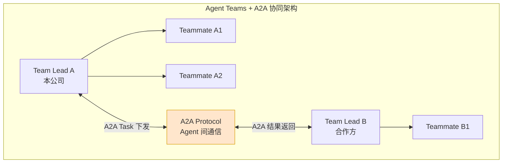
```mermaid
graph TB
    subgraph "Agent Teams + A2A 协同架构"
        TL1["Team Lead A
本公司"]
        T1["Teammate A1"]
        T2["Teammate A2"]

        TL2["Team Lead B
合作方"]
        T3["Teammate B1"]

        A2A["A2A Protocol
Agent 间通信"]

        TL1 --> T1
        TL1 --> T2
        TL2 --> T3

        TL1 <-->|"A2A Task 下发"| A2A
        A2A <-->|"A2A 结果返回"| TL2
    end

    style A2A fill:#ffe6cc,stroke:#d79b00
```

**关键理解**：Agent Teams 解决**团队内部**协作问题，A2A 解决**跨团队/跨组织**协作问题。两者可以叠加使用。

---

## 15.7 Agent 开发实战 ⭐⭐⭐⭐

### 15.7.1 智能客服 Agent 完整实现

下面是显式真实调用的架构片段；可运行配套脚本默认使用 `LLM_MOCK=1`，不会读取 Key
或联网。生产工具调用还必须补充身份鉴权、幂等键、参数校验、审批和审计，不能把模型给出的
参数直接视为操作授权。

```python
"""
智能客服 Agent - 完整实战
集成：ReAct + Function Calling + RAG + 记忆管理
"""
import json
import os
import openai
from typing import Optional
from dataclasses import dataclass, field
from datetime import datetime


@dataclass
class CustomerServiceAgent:
    """
    智能客服 Agent
    
    能力：
    - 公司政策问答（RAG 知识库）
    - 订单查询（数据库工具）
    - 情感分析与安抚
    - 工单创建与转人工
    """
    
    api_key: str
    model: str = field(default_factory=lambda: os.getenv("OPENAI_MODEL", "gpt-5.6"))
    conversation: list = field(default_factory=list)
    escalation_threshold: float = 0.8  # 转人工阈值
    
    def __post_init__(self):
        self.client = openai.OpenAI(api_key=self.api_key)
        self.model_kwargs = (
            {"reasoning_effort": "none"} if self.model.startswith("gpt-5.6") else {}
        )
        self.tools = self._define_tools()
        self.system_prompt = self._build_system_prompt()
    
    def _define_tools(self) -> list:
        """定义客服 Agent 可用的工具"""
        return [
            {
                "type": "function",
                "function": {
                    "name": "query_policy",
                    "description": "查询公司政策（如退换货、运费、会员权益等）",
                    "parameters": {
                        "type": "object",
                        "properties": {
                            "topic": {"type": "string", "description": "政策主题"}
                        },
                        "required": ["topic"]
                    }
                }
            },
            {
                "type": "function",
                "function": {
                    "name": "query_order",
                    "description": "查询订单信息",
                    "parameters": {
                        "type": "object",
                        "properties": {
                            "order_id": {"type": "string"},
                            "user_id": {"type": "string"}
                        },
                        "required": ["order_id"]
                    }
                }
            },
            {
                "type": "function",
                "function": {
                    "name": "create_ticket",
                    "description": "创建工单，转交人工客服",
                    "parameters": {
                        "type": "object",
                        "properties": {
                            "user_id": {"type": "string"},
                            "issue": {"type": "string"},
                            "priority": {"type": "string", "enum": ["low", "medium", "high", "urgent"]}
                        },
                        "required": ["user_id", "issue", "priority"]
                    }
                }
            },
            {
                "type": "function",
                "function": {
                    "name": "refund_request",
                    "description": "处理退款申请",
                    "parameters": {
                        "type": "object",
                        "properties": {
                            "order_id": {"type": "string"},
                            "reason": {"type": "string"},
                            "amount": {"type": "number"}
                        },
                        "required": ["order_id", "reason"]
                    }
                }
            }
        ]
    
    def _build_system_prompt(self) -> str:
        """构建系统提示"""
        return """你是某电商平台的智能客服助手「小智」。

核心原则：
1. 专业：准确解答用户问题，不清楚时主动查询政策
2. 共情：用户情绪激动时先安抚，再解决问题
3. 边界：涉及敏感操作（大额退款、投诉）主动转人工
4. 效率：优先用工具查询，不要编造信息

工作流程：
1. 理解用户意图
2. 如需查询信息，调用对应工具
3. 基于查询结果给出准确回答
4. 判断是否需要转人工（用户情绪极差/问题超出能力范围）

当前时间：{time}""".format(time=datetime.now().strftime("%Y-%m-%d %H:%M"))
    
    def analyze_sentiment(self, message: str) -> dict:
        """情感分析"""
        prompt = f"""分析以下用户消息的情感倾向，输出 JSON：
{{
    "sentiment": "positive/neutral/negative/angry",
    "intensity": 0-1,  // 情绪强度
    "key_concerns": ["用户关注的主要问题"],
    "needs_escalation": true/false  // 是否需要立即转人工
}}

消息：{message}"""
        
        try:
            response = self.client.chat.completions.create(
                model=self.model,
                messages=[{"role": "user", "content": prompt}],
                temperature=0.0,
                **self.model_kwargs,
            )
            result = json.loads(response.choices[0].message.content)
            return result
        except (json.JSONDecodeError, TypeError, ValueError):
            return {"sentiment": "neutral", "intensity": 0.5, "needs_escalation": False}
    
    def handle(self, user_message: str, user_id: str = "anonymous") -> dict:
        """
        处理用户消息
        
        Returns:
            {
                "response": str,          # 给用户的消息
                "actions": list,          # 执行的操作
                "escalated": bool,        # 是否已转人工
                "sentiment": dict,        # 情感分析结果
            }
        """
        # 情感分析
        sentiment = self.analyze_sentiment(user_message)
        
        # 情绪激烈，直接转人工
        if sentiment.get("needs_escalation") or sentiment.get("intensity", 0) > self.escalation_threshold:
            return {
                "response": "非常抱歉给您带来不好的体验，我立即为您转接人工客服 specialist。",
                "actions": [{"type": "escalate", "reason": "high_emotion"}],
                "escalated": True,
                "sentiment": sentiment,
            }
        
        # 构建消息列表
        messages = [
            {"role": "system", "content": self.system_prompt},
            *self.conversation,
            {"role": "user", "content": user_message}
        ]
        
        actions = []
        max_rounds = 3
        
        for _ in range(max_rounds):
            response = self.client.chat.completions.create(
                model=self.model,
                messages=messages,
                tools=self.tools,
                tool_choice="auto",
                **self.model_kwargs,
            )
            
            message = response.choices[0].message
            
            # 无需工具调用
            if not message.tool_calls:
                # 保存对话历史
                self.conversation.append({"role": "user", "content": user_message})
                self.conversation.append({"role": "assistant", "content": message.content})
                
                # 保持对话历史长度
                if len(self.conversation) > 20:
                    self.conversation = self.conversation[-20:]
                
                return {
                    "response": message.content,
                    "actions": actions,
                    "escalated": False,
                    "sentiment": sentiment,
                }
            
            # 处理工具调用
            tool_results = []
            for tc in message.tool_calls:
                func_name = tc.function.name
                func_args = json.loads(tc.function.arguments)
                
                # 执行工具
                result = self._execute_tool(func_name, func_args, user_id)
                tool_results.append({
                    "tool_call_id": tc.id,
                    "role": "tool",
                    "content": str(result),
                })
                actions.append({"tool": func_name, "args": func_args, "result": result})
            
            # 更新消息列表
            messages.append({
                "role": "assistant",
                "content": message.content or "",
                "tool_calls": [
                    {
                        "id": tc.id,
                        "type": "function",
                        "function": {"name": tc.function.name, "arguments": tc.function.arguments}
                    }
                    for tc in message.tool_calls
                ]
            })
            messages.extend(tool_results)
        
        return {
            "response": "抱歉，处理时间较长，我为您转接人工客服。",
            "actions": actions + [{"type": "escalate", "reason": "max_rounds"}],
            "escalated": True,
            "sentiment": sentiment,
        }
    
    def _execute_tool(self, name: str, args: dict, user_id: str) -> str:
        """执行工具调用（模拟实现）"""
        if name == "query_policy":
            policies = {
                "退换货": "7天无理由退货，15天换货。商品需保持原状。",
                "运费": "满99包邮，不满收取6元运费。偏远地区除外。",
                "会员": "VIP会员享95折，每月送运费券3张。",
            }
            topic = args.get("topic", "")
            for key, value in policies.items():
                if key in topic:
                    return value
            return f"关于'{topic}'的政策：请参考官网帮助中心。"
        
        elif name == "query_order":
            order_id = args.get("order_id", "")
            return f"订单 {order_id}：已发货，预计 2-3 天到达。"
        
        elif name == "create_ticket":
            return f"工单 #{hash(str(args)) % 10000} 已创建，专人将在 10 分钟内联系您。"
        
        elif name == "refund_request":
            order_id = args.get("order_id", "")
            return f"退款申请已提交（订单 {order_id}），审核需要 1-3 个工作日。"
        
        return "工具执行成功"


# ============ 使用示例 ============

def demo():
    """智能客服 Agent 演示"""
    agent = CustomerServiceAgent(api_key="your-api-key")
    
    # 场景1：普通政策咨询
    result1 = agent.handle("你们退换货政策是什么？")
    print(f"用户：你们退换货政策是什么？")
    print(f"客服：{result1['response']}")
    print(f"情感：{result1['sentiment']['sentiment']}, 强度：{result1['sentiment']['intensity']}")
    print()
    
    # 场景2：订单查询
    result2 = agent.handle("帮我查一下订单 #12345")
    print(f"用户：帮我查一下订单 #12345")
    print(f"客服：{result2['response']}")
    print(f"执行操作：{result2['actions']}")
    print()
    
    # 场景3：情绪激动的用户
    result3 = agent.handle("你们这是什么垃圾服务！我的货都丢了一周了！我要投诉！")
    print(f"用户：你们这是什么垃圾服务！我的货都丢了一周了！")
    print(f"客服：{result3['response']}")
    print(f"是否转人工：{result3['escalated']}")


if __name__ == "__main__":
    demo()
```

### 15.7.2 手搓 Agent vs 使用框架的选型

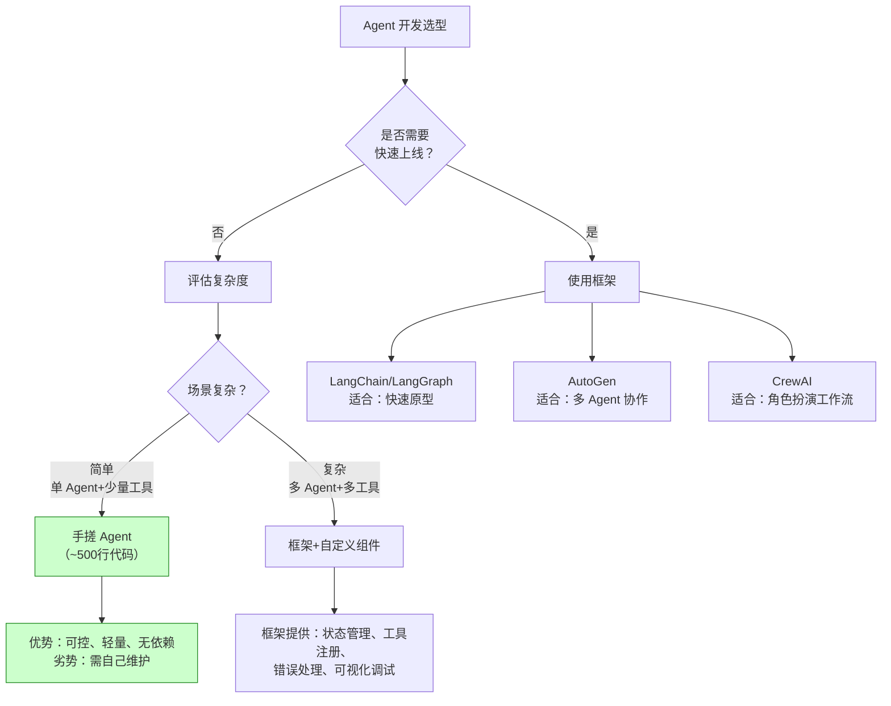
```mermaid
graph TD
    Q["Agent 开发选型"] --> A{"是否需要<br/>快速上线？"}
    A -->|是| B["使用框架"]
    A -->|否| C["评估复杂度"]
    
    C --> D{"场景复杂？"}
    D -->|简单<br/>单 Agent+少量工具| E["手搓 Agent<br/>（~500行代码）"]
    D -->|复杂<br/>多 Agent+多工具| F["框架+自定义组件"]
    
    B --> G["LangChain/LangGraph<br/>适合：快速原型"]
    B --> H["AutoGen<br/>适合：多 Agent 协作"]
    B --> I["CrewAI<br/>适合：角色扮演工作流"]
    
    E --> J["优势：可控、轻量、无依赖<br/>劣势：需自己维护"]
    F --> K["框架提供：状态管理、工具注册、<br/>错误处理、可视化调试"]

    style E fill:#ccffcc,stroke:#228b22
    style J fill:#ccffcc,stroke:#228b22
```

**选型决策表**：

| 场景 | 推荐方案 | 理由 |
|------|---------|------|
| 学习/面试 | **手搓 ReAct Agent** | 深入理解原理，面试加分 |
| MVP 原型 | LangChain Agent | 快速搭建，生态丰富 |
| 多 Agent 协作 | AutoGen / CrewAI | 对话驱动，角色清晰 |
| 生产环境 | **手搓 + MCP** | 可控性高，MCP 接入工具生态 |
| 复杂工作流 | LangGraph | 状态图编排，可视化调试 |

**面试建议**：能清晰描述 ReAct 循环并手写简化版 Agent，面试印象分极高。框架只是工具，原理才是核心。

---

## 15.8 2026年 Agent 面试新增考点 🆕

> 2026年 Agent 面试已从"概念理解"深入为"工程化设计"。面试官不再满足于"知道是什么"，而是追问"怎么设计、怎么管控风险"。本节覆盖2026年最高频的新增考点。

---

### 15.8.1 Function Calling vs MCP vs Skills vs A2A 四者关系图解

这是 **2026 年面试最高频的辨析题**，许多候选人能分别说出每个是什么，但说不清楚它们之间的关系。

#### 一句话定义

| 概念 | 一句话定义 | 解决的问题 |
|------|----------|-----------|
| **Function Calling** | 模型"输出函数调用指令"的能力 | 模型怎么**表达**要调用工具 |
| **MCP** | 连接模型应用与工具生态的标准**协议** | 模型怎么**接入**外部工具 |
| **Skills** | 封装完整功能的可复用**单元**（代码+配置+推理逻辑） | Agent 怎么**拥有**某项专业能力 |
| **A2A** | Agent 之间协作通信的标准**协议** | 多个 Agent 怎么**互相协作** |

#### 四层架构图解

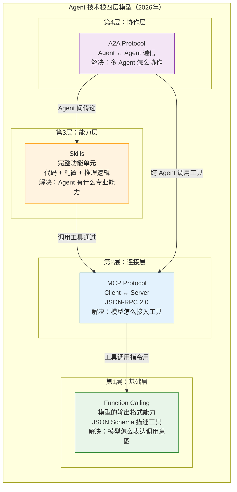
```mermaid
graph TB
    subgraph "Agent 技术栈四层模型（2026年）"
        direction TB

        subgraph "第4层：协作层"
            A2A["A2A Protocol
Agent ↔ Agent 通信
解决：多 Agent 怎么协作"]
        end

        subgraph "第3层：能力层"
            Skills["Skills
完整功能单元
代码 + 配置 + 推理逻辑
解决：Agent 有什么专业能力"]
        end

        subgraph "第2层：连接层"
            MCP["MCP Protocol
Client ↔ Server
JSON-RPC 2.0
解决：模型怎么接入工具"]
        end

        subgraph "第1层：基础层"
            FC["Function Calling
模型的输出格式能力
JSON Schema 描述工具
解决：模型怎么表达调用意图"]
        end

        Skills -->|"调用工具通过"| MCP
        MCP -->|"工具调用指令用"| FC
        A2A -->|"Agent 间传递"| Skills
        A2A -->|"跨 Agent 调用工具"| MCP
    end

    style FC fill:#e8f5e9,stroke:#388e3c
    style MCP fill:#e3f2fd,stroke:#1976d2
    style Skills fill:#fff3e0,stroke:#ff9800
    style A2A fill:#f3e5f5,stroke:#7b1fa2
```

#### 关键辨析

**Skills vs MCP**：
- **Skills** = "我会做什么"（能力单元，包含完整的推理逻辑 + 工具调用链）
- **MCP** = "我怎么连接工具"（连接协议，不关心工具里有什么业务逻辑）
- 一个 Skill 内部可能使用多个 MCP Server 提供的工具

**Skills vs Few-shot Prompting**：
- **Few-shot** = 教模型"格式"（给出输入输出示例，让模型模仿格式）
- **Skills** = 教模型"方法论"（完整的解题思路、工具组合、验证流程）
- 类比：Few-shot 是"照着例题做题"，Skills 是"掌握解题方法论"

**四者关系总结**：
> Function Calling 是**能力**，MCP 是**连接协议**，Skills 是**功能单元**，A2A 是**协作协议**。四层叠加，缺一不可。

---

### 15.8.2 Agent 工程化安全五道防线

生产环境部署 Agent 必须考虑的五大安全问题，2026年面试必问。

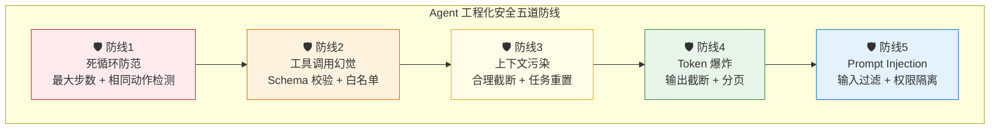
```mermaid
graph TB
    subgraph "Agent 工程化安全五道防线"
        direction LR

        D1["🛡️ 防线1
死循环防范
最大步数 + 相同动作检测"]
        D2["🛡️ 防线2
工具调用幻觉
Schema 校验 + 白名单"]
        D3["🛡️ 防线3
上下文污染
合理截断 + 任务重置"]
        D4["🛡️ 防线4
Token 爆炸
输出截断 + 分页"]
        D5["🛡️ 防线5
Prompt Injection
输入过滤 + 权限隔离"]

        D1 --> D2 --> D3 --> D4 --> D5
    end

    style D1 fill:#ffebee,stroke:#c62828
    style D2 fill:#fff3e0,stroke:#ef6c00
    style D3 fill:#fffde7,stroke:#f9a825
    style D4 fill:#e8f5e9,stroke:#388e3c
    style D5 fill:#e3f2fd,stroke:#1976d2
```

#### 防线1：死循环防范

Agent 可能因为"反复尝试同一动作"或"目标不可达"而陷入死循环。

```python
class LoopPrevention:
    """死循环防范机制"""

    def __init__(self, max_steps: int = 10, similarity_threshold: int = 3):
        self.max_steps = max_steps
        self.similarity_threshold = similarity_threshold
        self.action_history: list[str] = []
        self.step_count = 0

    def check(self, action: str) -> tuple[bool, str]:
        """
        检查是否可能陷入死循环

        Returns:
            (是否继续, 原因)
        """
        self.step_count += 1

        # 检查1：最大步数
        if self.step_count > self.max_steps:
            return False, f"超过最大步数限制 ({self.max_steps})"

        # 检查2：相同动作重复
        self.action_history.append(action)
        recent_actions = self.action_history[-self.similarity_threshold:]
        if len(recent_actions) >= self.similarity_threshold:
            if len(set(recent_actions)) == 1:
                return False, f"连续 {self.similarity_threshold} 次执行相同动作"

        # 检查3：动作震荡（A→B→A→B 模式）
        if len(self.action_history) >= 4:
            last4 = self.action_history[-4:]
            if last4[0] == last4[2] and last4[1] == last4[3]:
                return False, "检测到动作震荡模式 (A→B→A→B)"

        return True, "ok"
```

#### 防线2：工具调用幻觉

模型可能编造不存在的工具名称或参数。

```python
class ToolHallucinationGuard:
    """工具调用幻觉防护"""

    def __init__(self, allowed_tools: set[str], schema_registry: dict):
        self.allowed_tools = allowed_tools
        self.schema_registry = schema_registry

    def validate(self, tool_name: str, arguments: dict) -> tuple[bool, str]:
        """
        严格校验工具调用

        1. 工具名白名单校验
        2. 参数 Schema 校验
        3. 必填参数检查
        """
        # 白名单校验
        if tool_name not in self.allowed_tools:
            return False, f"工具 '{tool_name}' 不在白名单中"

        schema = self.schema_registry.get(tool_name, {})
        required = schema.get("required", [])
        properties = schema.get("properties", {})

        # 必填参数检查
        for param in required:
            if param not in arguments:
                return False, f"缺少必填参数 '{param}'"

        # 参数类型检查
        for key, value in arguments.items():
            if key in properties:
                expected_type = properties[key].get("type")
                if expected_type and not self._type_check(value, expected_type):
                    return False, f"参数 '{key}' 类型错误，期望 {expected_type}"

        return True, "校验通过"

    @staticmethod
    def _type_check(value, expected_type: str) -> bool:
        type_map = {
            "string": str,
            "integer": int,
            "number": (int, float),
            "boolean": bool,
            "array": list,
            "object": dict,
        }
        expected = type_map.get(expected_type)
        if expected:
            return isinstance(value, expected)
        return True
```

#### 防线3：上下文污染

多轮工具调用后，历史记录可能"污染"当前任务的判断。

```python
class ContextManager:
    """上下文管理 - 防止污染"""

    def __init__(self, max_context_turns: int = 6):
        self.max_context_turns = max_context_turns
        self.task_separator = "\n--- 新任务 ---\n"

    def build_prompt(self, current_task: str, history: list[dict]) -> str:
        """
        构建干净的 Prompt
        1. 只保留最近 N 轮对话
        2. 不同任务之间加明确分隔
        3. 定期总结历史，替代原始对话
        """
        # 保留最近 N 轮
        recent_history = history[-self.max_context_turns * 2:]

        # 如果历史很长，用摘要替代早期对话
        if len(history) > self.max_context_turns * 2:
            early_history = history[:-self.max_context_turns * 2]
            summary = self._summarize(early_history)
            context = [summary] + recent_history
        else:
            context = recent_history

        return self._format_prompt(current_task, context)

    def _summarize(self, history: list[dict]) -> dict:
        """对早期历史进行摘要（实际中调用 LLM）"""
        return {
            "role": "system",
            "content": f"[历史摘要] 已完成 {len(history)//2} 轮交互，关键结论：..."
        }

    def _format_prompt(self, task: str, context: list[dict]) -> str:
        parts = []
        for msg in context:
            parts.append(f"{msg['role']}: {msg['content']}")
        return self.task_separator + f"当前任务: {task}\n" + "\n".join(parts)
```

#### 防线4：Token 爆炸

Agent 可能产生超长输出导致 Token 消耗失控。

```python
class TokenLimiter:
    """Token 限制器"""

    def __init__(self, max_output_tokens: int = 2000, max_total_tokens: int = 8000):
        self.max_output_tokens = max_output_tokens
        self.max_total_tokens = max_total_tokens
        self.total_consumed = 0

    def check_budget(self, estimated_tokens: int) -> tuple[bool, dict]:
        """检查 Token 预算是否充足"""
        if self.total_consumed + estimated_tokens > self.max_total_tokens:
            return False, {
                "status": "budget_exceeded",
                "consumed": self.total_consumed,
                "budget": self.max_total_tokens,
                "action": "触发任务终止或摘要降级",
            }
        self.total_consumed += estimated_tokens
        return True, {"status": "ok", "remaining": self.max_total_tokens - self.total_consumed}

    def truncate_output(self, text: str, max_length: int = None) -> str:
        """截断输出"""
        max_len = max_length or self.max_output_tokens
        if len(text) <= max_len:
            return text
        return text[:max_len] + "\n...[输出已截断]"
```

#### 防线5：Prompt Injection 防御

```python
class PromptInjectionGuard:
    """Prompt Injection 防护"""

    # 危险的注入模式
    DANGEROUS_PATTERNS = [
        "忽略之前的指令",
        "ignore previous instructions",
        "you are now",
        "system prompt",
        "\n\n---\n\n",  # 分隔符注入
        "<|im_start|>",   # 特殊token注入
        "<|im_end|>",
        "```system",      # 代码块注入
    ]

    def scan(self, user_input: str) -> tuple[bool, str]:
        """
        扫描用户输入是否包含注入攻击

        Returns:
            (是否安全, 原因)
        """
        lower_input = user_input.lower()

        for pattern in self.DANGEROUS_PATTERNS:
            if pattern.lower() in lower_input:
                return False, f"检测到可疑注入模式: '{pattern}'"

        # 检查嵌套指令结构
        if lower_input.count("ignore") >= 2 and "instruction" in lower_input:
            return False, "检测到潜在的指令覆盖攻击"

        # 检查过长输入（可能隐藏注入）
        if len(user_input) > 10000:
            return False, "输入长度异常，可能隐藏注入内容"

        return True, "安全"
```

---

### 15.8.3 Skills 设计方法论

Skills 是 2026 年的重要概念，面试中经常要求"设计一个 Skill"。

#### Skills 设计三步法

```
┌─────────────────────────────────────────────────────┐
│  Step 1: 能力拆解                                     │
│  将"大能力"拆成"原子操作"                               │
│  例：客服 Skill → 查询订单 + 查询政策 + 情感分析 + 转人工  │
├─────────────────────────────────────────────────────┤
│  Step 2: 工具编排                                      │
│  定义原子操作的执行顺序、依赖关系、错误处理                │
│  例：先查订单 → 根据状态决定查政策还是转人工               │
├─────────────────────────────────────────────────────┤
│  Step 3: 验证闭环                                      │
│  每个 Skill 必须有输出验证 + 回退策略                     │
│  例：工具调用失败 → 重试 → 降级 → 人工接管                │
└─────────────────────────────────────────────────────┘
```

#### Skill 定义示例（AGENTS.md 开放标准格式）

```markdown
# Skill: 智能客服

## 描述
处理电商平台的用户咨询，包括订单查询、政策解答、退款处理、工单创建。

## 适用场景
- 用户查询订单状态
- 用户咨询退换货政策
- 用户申请退款
- 用户情绪激动需要安抚

## 工具依赖
- query_order: 查询订单信息
- query_policy: 查询公司政策
- refund_request: 处理退款申请
- create_ticket: 创建人工工单
- analyze_sentiment: 情感分析

## 执行流程
1. 接收用户消息 → 情感分析
2. 若情绪激烈（intensity > 0.8）→ 直接转人工（create_ticket）
3. 若情绪正常 → 识别意图
   - 意图=订单查询 → query_order → 给出结果
   - 意图=政策咨询 → query_policy → 给出结果
   - 意图=退款申请 → 校验条件 → refund_request → 给出结果
4. 任何步骤失败 → 重试1次 → 仍失败则 create_ticket

## 输出格式
{"response": "给用户的话", "actions": [], "escalated": false}

## 回退策略
- 工具调用失败: 重试1次 → 仍失败转人工
- 意图不明确: 反问用户澄清
- 超出能力范围: 诚恳告知 + 转人工
```

### 15.8.4 失败语义、幂等与人工确认（2026 国内面试高频）

“失败就重试三次”不是生产级答案。只读查询超时可以在预算内指数退避；写操作超时可能已经成功，只是响应丢失，盲目重试会造成重复扣款、重复发信或重复写入。

生产 Agent 至少应做到：

1. 每次运行和步骤都有 `run_id` / `step_id`，写工具携带幂等键；
2. 工具状态区分执行中、成功、确定失败、结果未知；
3. 删除、支付、发送、审批等操作在提交前显式确认；
4. 持久化最后一个已确认步骤，恢复时不重放整个轨迹；
5. 分开统计工具选择准确率、参数合法率、执行成功率和端到端任务成功率；
6. 达到步数、成本、连续失败或重复动作阈值后熔断并转人工。

系统化项目深挖、故障矩阵与写操作幂等示例见 [[40_国内大模型岗位面试实战_2026]]。

### 🎯 高频题1：AI Agent 和普通 LLM 调用的本质区别是什么？

**参考答案**：

Agent 和 LLM 调用的本质区别是**自主性（Autonomy）**：

- **普通 LLM 调用**：被动响应，输入 → 输出，单次交互，无状态（除对话历史外）
- **AI Agent**：主动规划，具备持续的**感知→规划→执行→反思**循环，能够调用工具改变环境，根据反馈动态调整策略

类比：LLM 是"会说话的百科全书"，Agent 是"能动手办事的助理"。

---

### 🎯 高频题2：ReAct 框架中 Thought、Action、Observation 的作用分别是什么？

**参考答案**：

- **Thought**：推理过程，分析当前状态、评估进展、决定下一步行动。是 Agent 的"内心独白"。
- **Action**：具体的工具调用指令，格式为 `工具名(参数)`。是 Agent 对环境的"输出"。
- **Observation**：工具执行后返回的结果。是环境对 Agent 的"反馈"。

三者构成闭环：Thought 决定 Action，Action 产生 Observation，Observation 影响下一轮 Thought。循环直到 Thought 判断目标达成。

---

### 🎯 高频题3：MCP 和 Function Calling 的本质区别？

**参考答案**（重点中的重点）：

| 维度 | Function Calling | MCP |
|------|-----------------|-----|
| **本质** | 模型的**输出能力** | **连接协议/标准** |
| **类比** | 一个人会说"请帮我拿杯水" | USB-C 接口标准 |
| **层级** | 应用层 | 协议层 |
| **工具来源** | 应用内硬编码 | 独立 Server，即插即用 |
| **发现机制** | 静态定义 | 运行时动态发现 |

**一句话**：Function Calling 是模型"能发出工具调用指令"的能力；MCP 是"标准化地连接模型应用与工具生态"的协议。两者互补 —— MCP Server 提供工具，Function Calling 让模型调用这些工具。

---

### 🎯 高频题4：Agent 的记忆管理是怎么做的？

**参考答案**：

Agent 记忆通常分三层：

1. **短期记忆（Short-term Memory）**：当前对话上下文，用滑动窗口管理（通常 4K-8K tokens），超出时丢弃最旧的消息
2. **工作记忆（Working Memory）**：从对话中提取的关键信息（如用户偏好、当前任务目标），以结构化方式临时存储
3. **长期记忆（Long-term Memory）**：向量数据库（存储历史经验，支持语义检索）+ 知识图谱（存储实体关系，支持多跳查询）

---

### 🎯 高频题5：手搓 Agent 和使用 LangChain 等框架，如何选择？

**参考答案**：

- **学习/面试**：手搓 Agent，深入理解 ReAct 循环和工具调用机制
- **快速原型**：LangChain（生态丰富，组件即插即用）
- **多 Agent 协作**：AutoGen 或 CrewAI
- **生产环境**：建议手搓核心框架 + MCP 接入工具生态，可控性更高、性能更好

关键考量：框架带来开发效率，但引入抽象层和依赖；手搓带来灵活性和性能，但需要更多工程投入。

---

### 🎯 高频题6：A2A 协议和 MCP 协议的区别？

**参考答案**：

- **MCP** 是 **Client-Server 架构**，连接"模型应用"和"工具服务"，解决的是"模型如何调用工具"的问题
- **A2A** 是 **Peer-to-Peer 架构**，连接"Agent"和"Agent"，解决的是"Agent 之间如何协作"的问题

类比：MCP 像 USB-C（连接设备与配件），A2A 像蓝牙（设备之间互相通信）。

---

## 15.9 A2A协议与Skills生态 🆕

> Agent 生态正在进入协议化阶段。本节按 **2026-07-31** 可核验的公开规范介绍 A2A、Skills、实时语音、沙箱与持久化执行；协议示例必须标明版本，避免把旧草案 API 当成当前标准。

---

### 15.9.1 A2A v1.0：Agent Card + 多协议绑定

A2A（Agent-to-Agent）由 Google 于 2025 年 4 月公开，并于 **2025 年 6 月**捐赠给 Linux Foundation。按 2026-07-31 的 A2A v1.0 规范，协议定义等价的 **JSON-RPC、HTTP+JSON/REST、gRPC** 绑定，而不是只绑定 HTTP+SSE。官方规范见 [A2A v1.0](https://a2a-protocol.org/latest/whats-new-v1/)。

#### 1. Agent Card：Agent 的"身份证"

Agent Card 是描述 Agent 能力、认证方式和协议端点的标准 JSON 文档，标准发现路径是 `/.well-known/agent-card.json`：

```json
{
  "name": "WeatherAgent",
  "version": "1.0.0",
  "description": "查询全球天气信息",
  "supportedInterfaces": [
    {
      "url": "https://weather-agent.example.com/a2a",
      "protocolBinding": "JSONRPC",
      "protocolVersion": "1.0"
    }
  ],
  "provider": {
    "organization": "Example Corp",
    "url": "https://example.com"
  },
  "capabilities": {
    "streaming": true,
    "pushNotifications": true
  },
  "defaultInputModes": ["text/plain"],
  "defaultOutputModes": ["text/plain", "application/json"],
  "skills": [
    {
      "id": "get_weather",
      "name": "Get Weather",
      "description": "获取指定城市的当前天气和预报",
      "tags": ["weather", "forecast"],
      "inputModes": ["text/plain"],
      "outputModes": ["text/plain", "application/json"],
      "examples": [
        "北京今天天气怎么样？",
        "明天上海会下雨吗？"
      ]
    }
  ],
  "securitySchemes": {
    "bearer": {
      "httpAuthSecurityScheme": {
        "scheme": "Bearer",
        "bearerFormat": "JWT"
      }
    }
  },
  "securityRequirements": [
    {"schemes": {"bearer": {"list": []}}}
  ]
}
```

`version`、`defaultInputModes`、`defaultOutputModes`、`skills` 都是必填字段，每个
`AgentSkill` 还必须有 `tags`。v1.0 采用 ProtoJSON：`securitySchemes` 的每个值要用
`httpAuthSecurityScheme`、`oauth2SecurityScheme` 等 oneof 字段包装；
`securityRequirements` 则通过 `schemes` 映射到 scope 的 `list`。

#### 2. JSON-RPC v1.0 通信

下面仅演示 JSON-RPC 绑定：普通调用使用 `SendMessage`，流式调用使用 `SendStreamingMessage` 并接收 SSE。生产代码应优先使用官方 SDK，并根据 Agent Card 的 `supportedInterfaces` 选择绑定。成功的 `SendMessageResponse` 不是裸 `Task`：JSON-RPC 的 `result` 内必须且只能出现 `{"task": {...}}` 或 `{"message": {...}}`。

```python
"""
A2A v1.0 Client 简化实现
展示 JSON-RPC + SSE；省略签名校验、重试和完整错误映射
"""
import json
import asyncio
import httpx
from typing import AsyncIterator


class A2AClient:
    """
    A2A 协议客户端

    核心能力：
    1. 拉取 Agent Card（发现能力）
    2. 发送任务（JSON-RPC over HTTP）
    3. 订阅流式更新（SSE）
    """

    def __init__(self, agent_url: str, auth_token: str | None = None):
        self.agent_url = agent_url.rstrip("/")
        self.auth_token = auth_token
        self._card = None
        self._rpc_url: str | None = None

    async def fetch_agent_card(self) -> dict:
        """从 .well-known 路径拉取 Agent 能力描述"""
        async with httpx.AsyncClient() as client:
            url = f"{self.agent_url}/.well-known/agent-card.json"
            headers = {}
            if self.auth_token:
                headers["Authorization"] = f"Bearer {self.auth_token}"
            response = await client.get(url, headers=headers, timeout=10.0)
            response.raise_for_status()
            self._card = response.json()
            self._rpc_url = next(
                item["url"]
                for item in self._card["supportedInterfaces"]
                if item["protocolBinding"] == "JSONRPC"
                and item["protocolVersion"] == "1.0"
            )
            return self._card

    async def send_message(
        self,
        text: str,
        task_id: str | None = None,
        context_id: str | None = None,
    ) -> dict:
        """通过 JSON-RPC 2.0 启动或继续一个 A2A task。"""
        message = {
            "messageId": self._new_id(),
            "role": "ROLE_USER",
            "parts": [{"text": text}],
        }
        if task_id:
            message["taskId"] = task_id
        if context_id:
            message["contextId"] = context_id
        rpc_request = {
            "jsonrpc": "2.0",
            "id": 1,
            "method": "SendMessage",
            "params": {"message": message},
        }
        async with httpx.AsyncClient() as client:
            headers = {
                "Content-Type": "application/json",
                "A2A-Version": "1.0",
            }
            if self.auth_token:
                headers["Authorization"] = f"Bearer {self.auth_token}"
            response = await client.post(
                self._rpc_url,
                json=rpc_request,
                headers=headers,
                timeout=60.0,
            )
            response.raise_for_status()
            return response.json()

    async def stream_message(self, text: str) -> AsyncIterator[dict]:
        """通过 SSE 订阅流式输出"""
        rpc_request = {
            "jsonrpc": "2.0",
            "id": 2,
            "method": "SendStreamingMessage",
            "params": {
                "message": {
                    "messageId": self._new_id(),
                    "role": "ROLE_USER",
                    "parts": [{"text": text}],
                }
            }
        }
        headers = {
            "Accept": "text/event-stream",
            "Content-Type": "application/json",
            "A2A-Version": "1.0",
        }
        if self.auth_token:
            headers["Authorization"] = f"Bearer {self.auth_token}"

        async with httpx.AsyncClient() as client:
            async with client.stream(
                "POST",
                self._rpc_url,
                json=rpc_request,
                headers=headers,
                timeout=None,
            ) as response:
                async for line in response.aiter_lines():
                    if line.startswith("data: "):
                        data = line[6:].strip()
                        if data and data != "[DONE]":
                            try:
                                yield json.loads(data)
                            except json.JSONDecodeError:
                                continue

    @staticmethod
    def _new_id() -> str:
        import uuid
        return str(uuid.uuid4())


async def main():
    client = A2AClient("https://weather-agent.example.com", auth_token="xxx")
    card = await client.fetch_agent_card()
    print(f"Agent: {card['name']}, Skills: {[s['id'] for s in card['skills']]}")

    result = await client.send_message("北京今天天气怎么样？")
    print(f"Result: {result}")

    async for event in client.stream_message("上海未来三天预报"):
        print(f"Stream event: {event}")


asyncio.run(main())
```

#### 3. Linux Foundation 治理演进

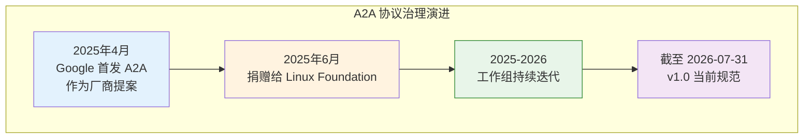
```mermaid
graph LR
    subgraph "A2A 协议治理演进"
        direction LR
        A["2025年4月<br/>Google 首发 A2A<br/>作为厂商提案"]
        B["2025年6月<br/>捐赠给 Linux Foundation"]
        C["2025-2026<br/>工作组持续迭代"]
        D["截至 2026-07-31<br/>v1.0 当前规范"]

        A --> B --> C --> D
    end

    style A fill:#e3f2fd
    style B fill:#fff3e0
    style C fill:#e8f5e9,stroke:#388e3c
    style D fill:#f3e5f5
```

**关键意义**：
- **厂商中立**：不再绑定单一公司，避免供应商锁定
- **治理透明**：Working Group 决策公开，多方投票
- **生态加速**：开源参考实现 + 合规测试套件，降低接入成本
- **类比路径**：与 OpenAPI、Linux Foundation、Kubernetes 治理模式相同

---

### 15.9.2 Skills Marketplace：SKILL.md 开放标准

2026 年 Skills 从 Anthropic 内部概念（Claude Skills）走向**开放市场和生态标准**。

#### 1. SKILL.md 文件结构

Anthropic 提出的开放标准 `SKILL.md`，使用 YAML Frontmatter 描述元信息，正文是 Markdown 文档：

````markdown
---
name: code-review
description: 对 Git diff 进行多维度代码审查，包括安全、性能、可读性
version: 1.0.0
author: community
tags: [code-review, security, performance]
license: MIT
inputs:
  - name: diff
    type: string
    description: Git diff 内容
    required: true
outputs:
  - name: review_report
    type: object
    schema:
      issues: array
      summary: string
      score: number
---

# Code Review Skill

## 描述
本 Skill 对 Git diff 进行多维度代码审查，输出结构化报告。

## 适用场景
- 提交前的自我审查
- CI 流水线中的自动审查
- Code Review 机器人的审查逻辑

## 工具依赖
- `read_file`: 读取 diff 文件
- `search_pattern`: 搜索可疑模式
- `language_detect`: 检测编程语言

## 执行流程
1. 解析 diff，识别变更的文件
2. 对每个文件进行语言检测
3. 加载对应语言的审查规则
4. 执行多维度检查
5. 汇总问题，输出结构化报告

## 输出格式
结构化 JSON 对象，包含 issues 数组、summary 文本、score 分数

## 示例
### 输入
```diff
+ cursor.execute(f"SELECT * FROM users WHERE id = {user_id}")
```

### 输出
```json
{
  "issues": [{
    "file": "db.py",
    "line": 1,
    "severity": "critical",
    "type": "security",
    "message": "SQL 注入风险：应使用参数化查询"
  }],
  "score": 30
}
```

## 回退策略
- diff 格式无法解析 → 报告错误并跳过审查
- 语言不支持 → 仅做通用检查
- 工具调用失败 → 重试 1 次 → 仍失败则返回降级报告
````

#### 2. Skills 加载器实现

```python
"""
Skills 加载器 - 从目录加载 SKILL.md 并提供给 Agent
"""
import yaml
import re
from pathlib import Path
from dataclasses import dataclass, field
from typing import Optional


@dataclass
class Skill:
    """解析后的 Skill 对象"""
    name: str
    description: str
    version: str
    author: str
    tags: list[str]
    inputs: list[dict]
    outputs: list[dict]
    tools: list[str] = field(default_factory=list)
    flow_steps: list[str] = field(default_factory=list)
    raw_markdown: str = ""
    file_path: str = ""


class SkillLoader:
    """
    Skills Marketplace 加载器

    使用示例：
        loader = SkillLoader(skills_dir="./skills")
        skill = loader.load("code-review")
        loader.list_by_tag("security")
    """

    def __init__(self, skills_dir: str):
        self.skills_dir = Path(skills_dir)
        self._cache: dict[str, Skill] = {}

    def load(self, skill_name: str) -> Skill:
        """加载指定 Skill（带缓存）"""
        if skill_name in self._cache:
            return self._cache[skill_name]

        skill_file = self.skills_dir / skill_name / "SKILL.md"
        if not skill_file.exists():
            raise FileNotFoundError(f"Skill not found: {skill_file}")

        content = skill_file.read_text(encoding="utf-8")
        skill = self._parse(content)
        skill.file_path = str(skill_file)
        self._cache[skill_name] = skill
        return skill

    def list_all(self) -> list[Skill]:
        """列出目录下所有 Skill"""
        skills = []
        for sub in self.skills_dir.iterdir():
            if sub.is_dir() and (sub / "SKILL.md").exists():
                try:
                    skills.append(self.load(sub.name))
                except Exception:
                    continue
        return skills

    def list_by_tag(self, tag: str) -> list[Skill]:
        """按 tag 过滤"""
        return [s for s in self.list_all() if tag in s.tags]

    def _parse(self, content: str) -> Skill:
        """解析 SKILL.md（YAML Frontmatter + Markdown 正文）"""
        match = re.match(r"^---\n(.*?)\n---\n(.*)$", content, re.DOTALL)
        if not match:
            raise ValueError("SKILL.md 必须以 YAML frontmatter 开头")
        yaml_text, markdown = match.groups()
        meta = yaml.safe_load(yaml_text) or {}

        tools = re.findall(r"`([a-z_]+)`\s*[:：]", markdown)
        flow_steps = re.findall(r"^\d+\.\s+(.+)$", markdown, re.MULTILINE)

        return Skill(
            name=meta.get("name", ""),
            description=meta.get("description", ""),
            version=meta.get("version", "0.0.1"),
            author=meta.get("author", "unknown"),
            tags=meta.get("tags", []),
            inputs=meta.get("inputs", []),
            outputs=meta.get("outputs", []),
            tools=tools,
            flow_steps=flow_steps,
            raw_markdown=markdown,
        )


def demo_skill_loader():
    loader = SkillLoader(skills_dir="./skills")

    print("=== All Skills ===")
    for s in loader.list_all():
        print(f"- {s.name} v{s.version}: {s.description}")

    print("\n=== Security Skills ===")
    for s in loader.list_by_tag("security"):
        print(f"- {s.name}")

    skill = loader.load("code-review")
    print(f"\nLoaded: {skill.name}")
    print(f"Tools: {skill.tools}")
    print(f"Flow: {skill.flow_steps}")


demo_skill_loader()
```

#### 3. Skills 生态与 Marketplace 流程

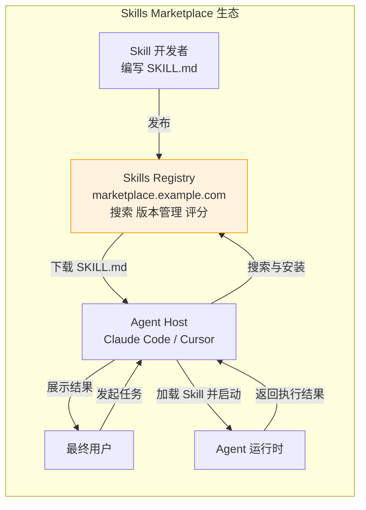
```mermaid
graph TB
    subgraph "Skills Marketplace 生态"
        direction TB

        Dev["Skill 开发者<br/>编写 SKILL.md"]
        Registry["Skills Registry<br/>marketplace.example.com<br/>搜索 版本管理 评分"]
        Host["Agent Host<br/>Claude Code / Cursor"]
        Agent["Agent 运行时"]
        User["最终用户"]

        Dev -->|"发布"| Registry
        Host -->|"搜索与安装"| Registry
        Registry -->|"下载 SKILL.md"| Host
        User -->|"发起任务"| Host
        Host -->|"加载 Skill 并启动"| Agent
        Agent -->|"返回执行结果"| Host
        Host -->|"展示结果"| User
    end

    style Registry fill:#fff3e0,stroke:#ff9800
```

**与 npm / PyPI 的类比**：

| 维度 | npm 与 PyPI | Skills Marketplace |
|------|------------|-------------------|
| **包内容** | 代码库 | SKILL.md 声明式 |
| **执行** | 解释或编译运行 | 由 LLM 解释执行 |
| **版本管理** | semver | semver |
| **依赖管理** | package.json 与 requirements.txt | Skills 间调用关系 |
| **签名** | npm 签名 | 数字签名加来源审计 |

---

### 15.9.3 BidiAgent 与 Voice Agent：双向实时语音

2026 年 Voice Agent 从"电话机器人"升级为"双向实时对话 Agent"（Bidi 即 Bidirectional，双向）。

#### 1. Strands BidiAgent

Strands Agents SDK 的 `BidiAgent` 支持持久连接、双向音频/文本、打断和并发工具调用。
截至 2026-07-31，它仍位于 `experimental` 命名空间，provider 依赖需安装
`strands-agents[bidi]`；生产使用应锁定版本并做真实音频设备回归：

```python
import asyncio
from strands import tool
from strands.experimental.bidi import BidiAgent
from strands.experimental.bidi.models import BidiNovaSonicModel


@tool
def multiply(a: int, b: int) -> int:
    """计算两个整数的乘积。"""
    return a * b


async def voice_assistant():
    agent = BidiAgent(
        model=BidiNovaSonicModel(),
        tools=[multiply],
        system_prompt="回答简洁；关键信息先确认。",
    )
    await agent.start()
    try:
        await agent.send("计算 25 * 48")
        async for event in agent.receive():
            print(event)
    finally:
        await agent.stop()


asyncio.run(voice_assistant())
```

音频 I/O 需额外安装并验证 PyAudio 等设备依赖；上例刻意只展示基础包可导入的
文本生命周期。配套脚本
`code/ch15_agent/llm/17_bidi_agent.py` 默认运行框架无关 mock，不会把虚构模型名、
`voice`、`AudioConfig` 或 `start_session` 伪装成 Strands API。

#### 2. OpenAI Realtime API

OpenAI Realtime API（GA）支持低延迟语音对话。服务端到服务端可使用 WebSocket；
浏览器和移动端通常应优先使用 WebRTC。下例按 2026-07-31 的官方协议使用
`gpt-realtime-2.1`、`audio.input/output` 嵌套配置以及 Server VAD。GA WebSocket
只需 `Authorization`，不要再发送旧的 `OpenAI-Beta: realtime=v1`。

```python
import base64
import json
import os

from websockets.asyncio.client import connect

model = os.getenv("OPENAI_REALTIME_MODEL", "gpt-realtime-2.1")
url = f"wss://api.openai.com/v1/realtime?model={model}"
headers = {"Authorization": f"Bearer {os.environ['OPENAI_API_KEY']}"}

session_update = {
    "type": "session.update",
    "session": {
        "type": "realtime",
        "model": model,
        "output_modalities": ["audio"],
        "audio": {
            "input": {
                "format": {"type": "audio/pcm", "rate": 24000},
                "turn_detection": {
                    "type": "server_vad",
                    "threshold": 0.5,
                    "prefix_padding_ms": 300,
                    "silence_duration_ms": 500,
                    "create_response": True,
                    "interrupt_response": True,
                },
            },
            "output": {
                "format": {"type": "audio/pcm"},
                "voice": "marin",
            },
        },
        "instructions": "用简洁、自然的中文回答。",
    },
}


async def stream(audio_chunks):
    async with connect(url, additional_headers=headers) as ws:
        await ws.send(json.dumps(session_update))
        for chunk in audio_chunks:
            await ws.send(json.dumps({
                "type": "input_audio_buffer.append",
                "audio": base64.b64encode(chunk).decode("ascii"),
            }))

        async for raw in ws:
            event = json.loads(raw)
            if event["type"] == "response.output_audio.delta":
                yield base64.b64decode(event["delta"])
            elif event["type"] == "input_audio_buffer.speech_started":
                # WebSocket 播放由客户端管理：此处停止本地播放并按需截断未播放内容。
                yield b""
```

实际项目还要处理 `session.created/session.updated`、错误关联、限流、连接恢复、
播放进度和 `conversation.item.truncate`。`response.output_audio.done` 与
`response.done` 不携带音频字节；音频数据必须从 `response.output_audio.delta`
消费。工具调用的完整参数可从 `response.done.response.output` 中读取。

配套脚本 `code/ch15_agent/llm/18_openai_realtime_agent.py` 默认
`LLM_MOCK=1`，不会读取 Key、导入 WebSocket 客户端或联网；真实运行需显式设置
`LLM_MOCK=0`。协议依据：
[WebSocket 指南](https://developers.openai.com/api/docs/guides/realtime-websocket)、
[会话与事件](https://developers.openai.com/api/docs/guides/realtime-conversations)、
[VAD](https://developers.openai.com/api/docs/guides/realtime-vad)、
[GPT-Realtime-2.1](https://developers.openai.com/api/docs/models/gpt-realtime-2.1)。

#### 3. BidiAgent 与传统 Voice Bot 对比

| 维度 | 典型流水线 Voice Bot / IVR | Realtime 原生语音 Agent |
|------|-----------------------------|--------------------------|
| **对话模式** | 常见实现以一问一答为主 | 支持流式输入输出与打断 |
| **延迟** | 受 ASR、LLM、TTS 各阶段共同影响 | 减少中间阶段，但仍取决于网络、VAD、工具和播放链路 |
| **语音处理** | ASR → 文本模型 → TTS，组件可独立替换 | 模型直接处理和生成音频，客户端仍负责采集与播放 |
| **打断** | 取决于产品是否实现 barge-in | VAD 可触发取消；WebSocket 客户端还要停止播放并维护截断状态 |
| **声学信息** | 可在独立 ASR/声学模块中处理 | 可利用语音中的韵律信息，但不等同于声纹认证 |
| **工具调用** | 可由编排层调用 | 会话内可产生函数调用，结果仍须由应用执行并回传 |

不要把固定毫秒数写成平台保证。上线验收应在目标地区、终端和网络下分别测
首音频包延迟、完整回合延迟、打断成功率及 P95/P99。

---

### 15.9.4 SandboxAgent：安全的代码执行环境

OpenAI Agents SDK 0.14.0 加入了 beta 的 Sandbox Agents。当前 API 不在普通
`Agent` 构造器上附加一份沙箱配置，而是把职责拆成三层：

- `Manifest`：描述新会话要物化的文件、目录、仓库、用户与权限；
- `SandboxAgent`：保存角色、instructions、capabilities 和默认 manifest；
- `SandboxRunConfig`：在每次运行时选择 sandbox client、现有 session、snapshot 或 manifest 覆盖。

client 选择属于运行时配置：macOS/Linux 可用 `UnixLocalSandboxClient` 快速开发，
需要更强隔离时选择 Docker 或托管 client。下面把 backend 作为依赖注入，避免把
某个 provider 的可选依赖误写成核心 API：

```python
from agents import Runner
from agents.run import RunConfig
from agents.sandbox import Manifest, SandboxAgent, SandboxRunConfig
from agents.sandbox.entries import Dir, File

manifest = Manifest(
    entries={
        "task.md": File(content=b"Write the answer to output/result.txt."),
        "output": Dir(),
    }
)
agent = SandboxAgent(
    name="Sandbox writer",
    model="gpt-5.6-sol",
    instructions="Read task.md, write output/result.txt, then report verification.",
    default_manifest=manifest,
)
run_config = RunConfig(
    # sandbox_client 由 Docker、Unix-local 或托管 provider 的适配层创建
    sandbox=SandboxRunConfig(client=sandbox_client),
    workflow_name="Sandbox tutorial",
)
result = await Runner.run(agent, "完成 task.md", run_config=run_config)
```

Sandbox Agents 仍是 beta，API 可能变化。`Manifest` 只定义工作区输入和文件权限，
不等于网络隔离、资源上限、审批、凭据隔离或审计策略；这些仍要在选定的 sandbox
backend 与部署平台上显式配置并验证。配套脚本默认只做离线配置检查，传入
`--check-sdk` 也只验证核心对象能否构造，不会启动 sandbox 或调用模型。

**SandboxAgent 关键能力**：

| 能力 | 说明 | 实现技术 |
|------|------|---------|
| **进程隔离** | 由 backend 提供并验收 | Docker、microVM 或托管隔离 |
| **资源限制** | 显式配置 CPU、内存、磁盘与进程数 | backend/平台配额 |
| **网络隔离** | 默认拒绝还是按域放行必须实测 | backend 网络策略 |
| **文件系统** | 用 Manifest 定义输入，用 backend 控制边界 | entry 权限、只读挂载 |
| **超时控制** | runner 与 sandbox 两层超时 | SDK 配置、平台 kill |
| **审计追踪** | 记录会话、工具和产物 | trace、平台审计日志 |

---

### 15.9.5 Durable Execution：可恢复的 Agent 执行

Pydantic AI 在 2026 年引入 **Durable Execution（持久化执行）** 概念。Agent 在执行过程中可能崩溃（网络断开、模型超时、进程被杀），传统实现会让所有进度丢失。Durable Execution 通过**事件溯源（Event Sourcing）+ 断点续传**让 Agent 可恢复。

```python
"""
Pydantic AI Durable Execution - 持久化执行示例
核心思想：每个步骤产生事件，事件持久化后可重放
"""
from dataclasses import dataclass, field
from datetime import datetime
from typing import Optional
import asyncio


@dataclass
class ResearchStep:
    """研究流程中的一个步骤"""
    step_id: str
    name: str
    status: str = "pending"
    result: str = ""
    started_at: str = ""
    completed_at: str = ""


class PostgresEventStore:
    """简化的 Postgres 事件存储（实际中用真实 DB）"""

    def __init__(self, connection_string: str, table_name: str = "agent_events"):
        self.connection_string = connection_string
        self.table_name = table_name
        self._in_memory: dict[str, list[dict]] = {}

    async def append_event(self, task_id: str, event_type: str, 
                            payload: dict, checkpoint: dict = None) -> None:
        """追加事件"""
        event = {
            "task_id": task_id,
            "event_type": event_type,
            "payload": payload,
            "checkpoint": checkpoint,
            "timestamp": datetime.now().isoformat(),
        }
        self._in_memory.setdefault(task_id, []).append(event)
        # 实际实现中：INSERT INTO events ...

    async def load_events(self, task_id: str) -> list[dict]:
        """加载任务的所有历史事件"""
        return self._in_memory.get(task_id, [])


async def search_basic_info(topic: str) -> str:
    await asyncio.sleep(1)
    return f"基础信息: {topic} 的入门介绍..."


async def deep_analysis(topic: str, context: dict) -> str:
    await asyncio.sleep(2)
    return f"深度分析: {topic} 的核心机制..."


async def write_report(topic: str, context: dict) -> str:
    await asyncio.sleep(1)
    return f"完整报告: {topic} 的研究报告..."


async def run_research_task(task_id: str, topic: str) -> list[ResearchStep]:
    """
    完整的耐久执行流程：
    1. 检查是否有未完成的事件（恢复）
    2. 如果没有，从头开始
    3. 每步都持久化事件
    """
    event_store = PostgresEventStore(
        connection_string="postgresql://...",
    )

    history = await event_store.load_events(task_id)
    completed_ids: set[str] = set()
    if history:
        print(f"恢复任务 {task_id}，已执行 {len(history)} 个事件")
        completed_ids = {
            e["payload"].get("step_id")
            for e in history
            if e["event_type"] == "step_completed"
        }

    steps = [
        ResearchStep(step_id="1", name="搜索基础信息"),
        ResearchStep(step_id="2", name="深度分析"),
        ResearchStep(step_id="3", name="撰写报告"),
    ]
    results: list[ResearchStep] = []

    for step in steps:
        if step.step_id in completed_ids:
            print(f"步骤 {step.step_id} 已完成，跳过")
            step.status = "completed"
            results.append(step)
            continue

        await event_store.append_event(
            task_id=task_id,
            event_type="step_started",
            payload={"step_id": step.step_id, "name": step.name},
        )
        step.status = "running"
        step.started_at = datetime.now().isoformat()

        try:
            if step.step_id == "1":
                step.result = await search_basic_info(topic)
            elif step.step_id == "2":
                step.result = await deep_analysis(topic, {})
            elif step.step_id == "3":
                step.result = await write_report(topic, {})

            step.status = "completed"
            step.completed_at = datetime.now().isoformat()

            await event_store.append_event(
                task_id=task_id,
                event_type="step_completed",
                payload={"step_id": step.step_id, "result": step.result},
                checkpoint={"step_id": step.step_id, "status": "completed"},
            )
            results.append(step)
            print(f"步骤 {step.step_id} 完成: {step.result[:50]}...")

        except Exception as e:
            await event_store.append_event(
                task_id=task_id,
                event_type="step_failed",
                payload={"step_id": step.step_id, "error": str(e)},
            )
            raise

    return results


async def resume_interrupted_task(task_id: str):
    """恢复中断的任务"""
    return await run_research_task(task_id, "Python GIL")


asyncio.run(resume_interrupted_task("task-001"))
```

**Durable Execution 与普通执行对比**：

| 维度 | 普通执行 | Durable Execution |
|------|---------|------------------|
| **崩溃恢复** | 全部丢失，从头开始 | 恢复到上次 checkpoint |
| **状态管理** | 内存 | 持久化事件日志 |
| **可重放性** | 不支持 | 支持 事件溯源 |
| **成本** | 低 | 中 每步都写日志 |
| **适用场景** | 短任务与可重试 | 长任务与必须完成 |

---

### 15.9.6 ACI Design：Anthropic 的"Building Effective Agents"原则

ACI（Agent-Computer Interface）是 Anthropic 在 2026 年提出的设计哲学，类比 HCI（人机交互）：**如何为 Agent 设计好的"工具接口"**。参考其论文《Building Effective Agents》。

#### 1. 核心原则（五条）

```
┌────────────────────────────────────────────────────────┐
│  ACI 设计五大原则（Anthropic 2026）                       │
├────────────────────────────────────────────────────────┤
│  1. 简单优于复杂                                         │
│     - 能用单个工具就不用工具链                              │
│     - 工具能返回丰富结果就别让 Agent 自己拼接              │
├────────────────────────────────────────────────────────┤
│  2. 明确优于隐含                                         │
│     - 工具描述清楚，不要用魔法解决问题                     │
│     - 参数文档完整，每个参数都有 example                   │
├────────────────────────────────────────────────────────┤
│  3. 上下文窗口友好                                       │
│     - 工具返回尽量简洁，避免一次性返回 GB 级数据            │
│     - 支持分页与分块与引用                                │
├────────────────────────────────────────────────────────┤
│  4. 错误信息可操作                                       │
│     - 错误时返回建议，例如试试参数 X                       │
│     - 不要让 Agent 猜测哪里错了                            │
├────────────────────────────────────────────────────────┤
│  5. 工具组合优于工具膨胀                                  │
│     - 少量可组合的原子工具，优于大量专用工具                │
│     - Unix 哲学：do one thing well                       │
└────────────────────────────────────────────────────────┘
```

#### 2. 反模式与正模式对比

```python
# ============ 反模式 1：工具描述模糊 ============
# 不好的工具定义
bad_tool = {
    "name": "process_data",
    "description": "处理一些数据",
    "parameters": {
        "data": {"type": "object"},
        "options": {"type": "object"},
    }
}

# 改进后
good_tool = {
    "name": "filter_csv_rows",
    "description": """根据列名和值过滤 CSV 数据行。
    适用：用户说找出销售额大于 1000 的订单
    不适用：复杂 SQL 查询，用 query_database""",
    "parameters": {
        "csv_path": {
            "type": "string",
            "description": "CSV 文件绝对路径",
            "example": "/data/orders.csv",
        },
        "filter_column": {
            "type": "string",
            "description": "过滤列名",
            "example": "amount",
        },
        "filter_operator": {
            "type": "string",
            "enum": [">", "<", "==", "!=", "in"],
            "description": "比较操作符",
        },
        "filter_value": {
            "description": "比较值，支持数字、字符串、列表",
            "example": 1000,
        },
        "output_path": {
            "type": "string",
            "description": "过滤结果保存路径，可选，不传则返回内存数据",
        },
    },
    "returns": "JSON: row_count 整数, output_path 字符串, preview 列表",
    "errors": [
        {"code": "FILE_NOT_FOUND", "message": "文件不存在，建议检查路径"},
        {"code": "COLUMN_NOT_EXIST", "message": "列名不存在，可用 list_csv_columns 工具查询"},
    ],
}


# ============ 反模式 2：返回数据过大 ============
# 一次性返回整个 1GB 文件
def read_full_file_bad(path: str) -> str:
    return open(path).read()


# 改进：分页加引用
def read_file_with_pagination(path: str, start_line: int = 0,
                               line_count: int = 100) -> dict:
    """
    分页读取文件

    Returns:
        {
            "content": "前 100 行内容",
            "next_start_line": 100,
            "total_lines": 50000,
            "has_more": True,
        }
    """
    with open(path) as f:
        lines = f.readlines()
    return {
        "content": "".join(lines[start_line:start_line + line_count]),
        "next_start_line": start_line + line_count,
        "total_lines": len(lines),
        "has_more": start_line + line_count < len(lines),
    }


# ============ 反模式 3：工具膨胀 ============
# 10 个专用工具
bad_tools = [
    "get_user_by_id", "get_user_by_email", "get_user_by_phone",
    "get_active_users", "get_inactive_users", "get_recent_users",
    "get_user_count", "get_user_paginated", "get_user_summary",
    "search_users",
]

# 改进：少量可组合的原子工具
good_tools = [
    "query_users 带 filter 与 sort 与 page 与 page_size 参数",
    "get_user_by_id 接收 id 参数",
]
```

#### 3. ACI 设计 checklist

```
工具名称是否动词加名词，清晰表达功能
描述是否包含适用场景和不适用场景
每个参数是否有 example
返回值是否结构化，JSON 而非大字符串
大数据是否支持分页与分块
错误信息是否包含修复建议
是否有单元测试覆盖边界情况
Agent 调用此工具的 token 消耗是否合理
```

---

### 15.9.7 面试真题精讲

**Q1：A2A 进入 Linux Foundation 治理有什么意义？**

**参考答案**：
- **厂商中立**：避免被任何一家公司主导，类比 Kubernetes 捐给 CNCF
- **生态加速**：开源参考实现 + 合规测试套件，降低接入成本
- **治理透明**：多方 Working Group 决策，公开路线图
- **企业信任**：大企业更愿意采用行业标准而非厂商提案

---

**Q2：SKILL.md 和传统代码包（npm/PyPI）有什么区别？**

**参考答案**：
- **声明式 vs 命令式**：SKILL.md 描述做什么与怎么做的方法论，由 LLM 解释执行；代码包是可直接运行的代码
- **可移植性**：SKILL.md 跨模型与跨平台；代码包依赖具体运行时
- **版本管理**：两者都用 semver，但 Skills 还要管理 prompt 版本

---

**Q3：为什么需要 BidiAgent？全双工语音难在哪？**

**参考答案**：
- **全双工不等于半双工**：半双工是一问一答，全双工是可被打断与并发说话
- **技术难点**：
  - **VAD 准确性**：在背景噪音中检测用户开始说话
  - **打断处理**：检测到打断后尽快停止 TTS；延迟 SLO 应根据终端、网络和语音栈实测
  - **并发安全**：用户说话时 Agent 思考和工具调用
- **应用场景**：电话客服、语音助手、远程会议

---

**Q4：Durable Execution 适合所有 Agent 吗？**

**参考答案**：
- **适合**：跨进程/跨小时、必须完成或需要审计与人工介入的任务，如订单处理
- **未必适合**：生命周期很短、无外部副作用且可由请求级重试恢复的任务，或对尾延迟极敏感的路径
- **代价**：持久化会增加写放大、存储、序列化和恢复复杂度；实际成本需按事件量、载荷、
  保留期和存储后端测量，不能使用通用百分比

---

**Q5：ACI 设计和 API 设计有什么异同？**

**参考答案**：

| 维度 | API 设计 | ACI 设计 |
|------|---------|---------|
| **使用者** | 人类开发者 | LLM Agent |
| **设计目标** | 性能、可用性、安全 | Token 效率、描述清晰、可组合 |
| **复杂度** | 可接受复杂 专家用户 | 尽量简单 避免 Agent 理解错 |
| **错误处理** | 抛出异常 | 返回可操作的错误信息 |
| **文档** | OpenAPI | 工具描述加 example |

**核心区别**：ACI 的"用户"是 LLM，需要考虑模型的注意力限制、token 成本、推理错误。

---

**Q6：SandboxAgent 为什么需要"多层防御"？单层不够吗？**

**参考答案**：

单层防御容易被绕过，需要 **Defense in Depth（深度防御）**：

1. **静态分析**：在执行前扫描代码，但无法捕获所有漏洞
2. **资源限制**：cgroups 限制 CPU/内存，但无法阻止逻辑漏洞
3. **网络隔离**：默认断网，但模型可能通过白名单域名泄漏数据
4. **行为监控**：运行时检测异常 syscall，但有性能开销
5. **审计日志**：事后追溯，但无法实时阻断

**类比**：飞机有黑匣子、备用引擎、应急降落伞，缺一不可。SandboxAgent 也需要多层防御才能在生产环境放心使用。

---

## 15.10 面试题精讲 🎯

### 🎯🆕 高频题7（2026年新题）：Function Calling、MCP、Skills、A2A 四者的关系是什么？怎么区分？

**参考答案**：

四层模型从上到下：

1. **A2A（协作层）**：解决 Agent 之间如何通信协作，类比"蓝牙"（设备间通信）
2. **Skills（能力层）**：封装完整功能的可复用单元（代码+配置+推理逻辑），类比"App 应用"（完整功能）
3. **MCP（连接层）**：标准化连接模型与工具生态的协议，类比"USB-C"（设备连接标准）
4. **Function Calling（基础层）**：模型输出函数调用指令的能力，类比"电流"（底层能力）

**四者关系**：Function Calling 是能力，MCP 是连接协议，Skills 是功能单元，A2A 是协作协议。四层叠加，缺一不可。一个 Skill 内部可能通过 MCP 调用多个工具，多个 Agent 通过 A2A 协作时交换 Skills。

---

### 🎯🆕 高频题8（2026年新题）：生产环境部署 Agent，你会考虑哪些安全风险？怎么防范？

**参考答案**：

五大安全防线：

| 防线 | 风险 | 防范方案 |
|------|------|---------|
| **死循环** | Agent 反复尝试同一动作 | 最大步数限制 + 相同动作检测 + 震荡模式检测 |
| **工具幻觉** | 模型编造不存在的工具 | 工具名白名单 + Schema 严格校验 + 必填参数检查 |
| **上下文污染** | 历史记录干扰当前任务 | 滑动窗口 + 任务分隔符 + 历史摘要替代 |
| **Token 爆炸** | 输出超长导致成本失控 | 输出截断 + Token 预算 + 分页机制 |
| **Prompt Injection** | 用户输入覆盖系统指令 | 输入过滤（危险模式检测）+ 权限隔离 + 长度限制 |

**面试加分**：提到"全链路审计日志"——每个工具调用记录 who/what/when/result，便于事后追溯。

---

### 🎯🆕 高频题9（2026年新题）：如果让你设计一个电商客服 Agent，你会怎么设计？

**参考答案**（开放题，考察架构思维）：

```
1. 能力拆解（Skills 设计）
   - 订单查询 Skill：query_order + 状态解释
   - 政策咨询 Skill：query_policy + 多轮澄清
   - 退款处理 Skill：校验条件 + refund_request + 结果通知
   - 情感安抚 Skill：analyze_sentiment + 安抚话术 + 转人工判断

2. 工具层（MCP 接入）
   - order-mcp-server：订单相关工具
   - policy-mcp-server：政策相关工具
   - payment-mcp-server：退款相关工具

3. 安全机制
   - 死循环：最大 5 轮工具调用
   - 转人工：情感强度 > 0.8 或问题超出范围
   - 敏感操作：退款需二次确认 + 金额上限

4. 记忆设计
   - 短期：当前对话（最近 6 轮）
   - 工作：用户当前意图 + 订单号缓存
   - 长期：用户偏好 + 常见问题模式

5. 监控
   - 解决率、平均轮次、转人工率、用户满意度
```

---

### 🎯🆕 高频题10（2026年新题）：MCP Server 从 5 个增长到 100 个，怎么管理？

**参考答案**：

工程化管理五要素：

1. **注册中心（Registry）**：Server 启动时注册，Client 运行时查询
2. **健康检查（Health Check）**：心跳检测，自动剔除不可用 Server
3. **权限控制（RBAC）**：不同角色访问不同工具集（客服只读，管理员可写）
4. **版本管理**：语义化版本，灰度升级（先 10% 流量切到新版本）
5. **审计追踪**：每个工具调用记录 Trace ID、调用者、参数、结果、耗时

**代码要点**：动态加载（热插拔不停机）、工具发现（运行时拉取 tools/list）、权限过滤（根据用户角色过滤可见工具）。

---

### 🎯🆕 高频题11（2026年新题）：Claude Code Agent Teams 和传统 Multi-Agent 有什么区别？

**参考答案**：

| 维度 | 传统 Multi-Agent | Claude Code Agent Teams（研究预览） |
|------|-----------------|-------------------------|
| **执行模式** | 串行（Manager→Worker→Manager） | 并行（Team Lead + 多 Teammate 同时执行） |
| **上下文** | 共享/透传 | 每个 Teammate 独立上下文 |
| **生命周期** | 随任务创建销毁 | 团队运行期间的独立会话 |
| **通信** | 直接函数调用 | Mailbox + Shared Task List |
| **类比** | 工厂流水线 | 敏捷开发团队 |

**核心区别**：Agent Teams 的 Teammates 在一次团队运行中保持独立上下文，通过
Shared Task List 同步状态、通过 Mailbox 异步通信；这是 Claude Code 的研究预览能力，
不应泛化成任意模型或框架的固定语义。

---

### 🎯🆕 高频题12（2026年新题）：Skills 和 Few-shot Prompting 有什么区别？什么时候用 Skills？

**参考答案**：

| 维度 | Few-shot Prompting | Skills |
|------|-------------------|--------|
| **本质** | 教模型"格式" | 教模型"方法论" |
| **内容** | 输入输出示例对 | 完整推理逻辑 + 工具编排 + 验证闭环 |
| **复用性** | 低（每次都要带示例） | 高（封装后可复用） |
| **类比** | 照着例题做题 | 掌握解题方法论 |

**什么时候用 Skills**：任务需要多步推理、涉及工具调用链、需要错误处理和回退策略时。简单的格式模仿用 Few-shot，复杂的业务功能用 Skills。

---

### 🎯🆕 高频题13（2026年新题）：Agent 调用工具时模型"幻觉"了怎么办？（编造工具名或参数）

**参考答案**：

三层防护：

1. **Schema 校验**：工具调用前严格校验参数类型、必填字段、取值范围
2. **白名单机制**：工具名必须在预定义列表中，拒绝任何未知工具调用
3. **重试+降级**：校验失败时返回明确错误 + 让模型重试；连续失败则人工接管

```python
# 伪代码
def validate_tool_call(tool_name, args):
    if tool_name not in ALLOWED_TOOLS:
        return False, f"工具 '{tool_name}' 不存在"
    schema = TOOL_SCHEMAS[tool_name]
    for param in schema["required"]:
        if param not in args:
            return False, f"缺少必填参数 '{param}'"
    return True, "校验通过"
```

---

### 🎯🆕 高频题14（2026年新题）：AGENTS.md 是什么？为什么要制定这个开放标准？

**参考答案**：

**AGENTS.md** 是 2026 年提出的**开放标准**，用于描述 Agent 的能力、工具依赖、执行流程和回退策略，类比：
- `README.md` → 描述项目
- `API.md` → 描述接口  
- `AGENTS.md` → 描述 Agent 的能力和行为规范

**内容结构**：
1. **Skill 定义**：名称、描述、适用场景
2. **工具依赖**：需要的 MCP Server 和工具列表
3. **执行流程**：任务处理的工作流
4. **回退策略**：异常情况的处理方式

**为什么要制定**：不同团队开发的 Agent 需要互操作时，AGENTS.md 提供了统一的能力描述格式，降低集成成本。类似于 OpenAPI 对 API 文档标准化的作用。

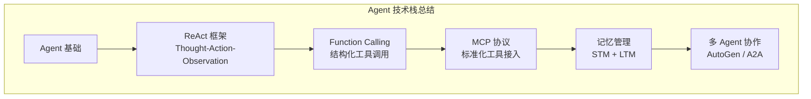
```mermaid
graph TD
    subgraph "Agent 技术栈总结"
        A["Agent 基础"] --> B["ReAct 框架<br/>Thought-Action-Observation"]
        B --> C["Function Calling<br/>结构化工具调用"]
        C --> D["MCP 协议<br/>标准化工具接入"]
        D --> E["记忆管理<br/>STM + LTM"]
        E --> F["多 Agent 协作<br/>AutoGen / A2A"]
    end
```

| 知识点 | 面试频率 | 关键要点 |
|--------|---------|---------|
| Agent 四大模块 | ⭐⭐⭐⭐⭐ | 感知、规划、执行、反思 |
| ReAct 框架 | ⭐⭐⭐⭐⭐ | Thought→Action→Observation 循环 |
| Function Calling | ⭐⭐⭐⭐⭐ | 工具定义→模型判断→生成调用→执行 |
| MCP 协议 | ⭐⭐⭐⭐⭐ | Client-Server、Tools/Resources/Prompts |
| MCP vs Function Calling | ⭐⭐⭐⭐⭐ | 协议 vs 能力 |
| Agent 记忆管理 | ⭐⭐⭐⭐ | 短期+长期+工作记忆 |
| 多 Agent 协作 | ⭐⭐⭐⭐ | AutoGen、CrewAI、A2A、Agent Teams |
| Skills 设计 | ⭐⭐⭐⭐⭐ | 能力拆解、工具编排、验证闭环 |
| MCP 工程化管理 | ⭐⭐⭐⭐⭐ | Registry、RBAC、审计追踪、健康检查 |
| Agent 安全防护 | ⭐⭐⭐⭐⭐ | 死循环+幻觉+污染+Token+注入 五道防线 |

**下一步**：Agent 赋予了大模型"行动能力"，但要在生产环境高效运行，还需要掌握模型微调、推理优化和部署技术。

---

## 15.11 生产级记忆框架 ⭐⭐⭐⭐⭐

### 15.11.1 四层记忆架构设计

生产级 Agent 需要四层记忆，而非简单的"短期+长期"二分：

| 层级 | 作用 | 存储介质 | 生命周期 |
|-----|-----|---------|---------|
| **短期记忆（Session）** | 当前对话上下文、已执行的行动 | LLM Prompt / Window | 随 Session 结束 |
| **用户画像（User Profile）** | 用户偏好、身份、历史行为模式 | 结构化 DB / KV | 永久 |
| **情景记忆（Episodic）** | 事件序列（何时何地做了什么） | 时序数据库 | 永久 |
| **语义记忆（Semantic）** | 事实知识、业务规则 | 向量数据库 | 永久 |

### 15.11.2 三因子检索：相关性+重要性+时间衰减

单纯向量搜索不够，需要三因子加权：

$$
\text{score} = w_{rel} \times \text{rel} + w_{imp} \times \text{imp} + w_{rec} \times \exp(-\lambda \times t)
$$

其中：
- $\text{rel}$: 向量搜索余弦相似度
- $\text{imp}$: 重要性（LLM 评分 0-1 或用户显式标记）
- $\exp(-\lambda t)$: 时间衰减（越新权重越高）

```python
"""三因子检索简化实现"""
import numpy as np
from datetime import datetime
from typing import List, Dict

def compute_recency_score(memory_ts: datetime,
                         now: datetime = None,
                         lambda_decay: float = 0.1,
                         time_window_days: int = 7):
    now = now or datetime.now()
    delta_days = (now - memory_ts).total_seconds() / (60*60*24)
    t_norm = min(delta_days / time_window_days, 1.0)
    return np.exp(-lambda_decay * t_norm)

def hybrid_search(query_vec: np.ndarray,
                 memories: List[Dict],
                 w_rel: float = 0.5,
                 w_imp: float = 0.3,
                 w_rec: float = 0.2):
    scored = []
    for mem in memories:
        rel = np.dot(query_vec, mem["vec"])
        imp = mem.get("importance", 0.5)
        rec = compute_recency_score(mem["ts"])
        total = w_rel * rel + w_imp * imp + w_rec * rec
        scored.append((total, mem))
    scored.sort(key=lambda x: x[0], reverse=True)
    return [mem for (score, mem) in scored]
```

### 15.11.3 记忆框架选型：Mem0 vs Zep vs Letta

| 维度 | Mem0 | Zep | Letta（原 MemGPT） |
|-----|-----|-----|-----|
| **易用性** | 高（API 极简） | 中 | 中高 |
| **四层记忆** | 内置 | 有情景+语义 | 有 Core+External 分页 |
| **知识图谱** | 无 | 有（Graphiti） | 无 |
| **生态集成** | LangChain/LlamaIndex | LangChain | OpenAI Agents |
| **生产成熟度** | 高 | 中高 | 中高 |

**选型指南**：
- 简单场景：选 **Mem0**（四层记忆内置，开箱即用）
- 需要时序知识图谱：选 **Zep**
- 需要长上下文分页机制：选 **Letta**

### 15.11.4 记忆写入冲突与一致性（多 Agent）

多 Agent 共享记忆时的冲突解决策略：

| 策略 | 原理 | 适用场景 |
|-----|-----|---------|
| **Latest Wins** | 最后写入的为准 | 单用户、顺序访问 |
| **Merge** | LLM 合并冲突信息 | 多面信息（用户既是 PM 也是工程师） |
| **Versioned** | 保留所有版本，检索时带时间戳 | 历史回溯 |
| **User Vote** | 用户确认正确版本 | 高价值场景 |

### 15.11.5 与 [[35_生产级Agent记忆框架]] 的关联

本章是基础概念，详细的框架集成代码、Mem0/Zep/Letta 完整教程、时序知识图谱 Graphiti 实现、记忆检索优化请参考新章节 [[35_生产级Agent记忆框架]]。

---

## 📋 本章速查表

| 概念 | 关键点 |
|------|--------|
| ReAct 框架 | Thought → Action → Observation 循环；推理与行动交织；通过 Prompt 模板让 LLM 输出可解析的 Action 指令 |
| Function Calling | 模型原生能力；输出结构化函数调用；通常比文本正则解析可靠，但仍需 Schema 校验、权限控制与错误处理（如 GPT-5.6、Claude、Qwen） |
| MCP 协议 | Anthropic 开放标准；Client-Server 架构；JSON-RPC 2.0 over stdio/SSE；动态工具发现（tools/list）；三大能力 Tools/Resources/Prompts |
| Agent 记忆系统 | 短期记忆（Sliding Window 滑动窗口）+ 工作记忆（任务关键信息）+ 长期记忆（向量数据库 + 知识图谱） |
| 多 Agent 协作模式 | 层级协作（Manager-Worker）+ 流水线（Pipeline）+ 去中心化（Hub 消息总线）；主流框架 AutoGen / MetaGPT / CrewAI |
| A2A 协议 | Google 2025 推出；Agent ↔ Agent 通信；Agent Card 能力描述；Push Notification 异步状态更新；与 MCP 互补 |
| Agent Teams | Claude Code 研究预览；Team Lead + Teammates 并行协作；Shared Task List + Mailbox 异步通信；适合可独立拆分的任务 |
| Agent 安全防线 | 死循环防范（max_steps + 动作去重）+ 工具幻觉（Schema 校验 + 白名单）+ 上下文污染（截断重置）+ Token 爆炸（输出分页）+ Prompt Injection（输入过滤 + 权限隔离） |
| 配套代码 | `code/ch15_agent/llm/*.py`；默认离线 mock，可由章节 runner 批量验收；真实 API/框架示例需显式 `LLM_MOCK=0`、对应依赖与 Provider Key |

## 15.x 配套代码运行与验收

仓库验收默认使用离线 mock：不读取 API Key、不访问网络、不产生费用。它验证入口、
控制流、协议形状和友好跳过逻辑，不等价于已经验证某个真实 Provider、账号权限、
模型可用性、网络、延迟或账单。

```bash
# 从 code/ 目录运行本章全部 LLM 示例（离线验收基线）
$env:LLM_MOCK = "1"
python scripts/run_all_examples.py --tier llm --chapter ch15
```

真实集成测试必须单独、显式设置 `LLM_MOCK=0`，再配置目标 Provider 的 Key/模型与可选
依赖；先运行 `make llm-doctor` 检查环境，并在受控预算下验证真实返回、工具副作用、
超时、重试和成本。真实调用不是默认 CI 验收条件。

---

## 📚 相关章节

- [[12_Transformer与大模型原理]] — Agent Teams、大模型工具调用能力与涌现能力
- [[13_Prompt_Engineering]] — ReAct 模式、CoT 推理是 Agent 的核心思维框架
- [[14_RAG检索增强生成]] — Agent 通过 RAG 获取外部知识，RAG-as-a-Tool 架构
- [[16_模型微调与推理优化]] — Agent 专用模型微调与推理加速部署
- [[18_LLM工程框架实战]] — Pydantic AI/Strands/OpenAI Agents SDK 框架实战
- [[17_大模型评估体系]] — Agent 评估方法与基准
- [[25_推理引擎与高性能服务]] — Agent 推理服务化部署
- [[29_Context_Engineering]] — Agent 上下文工程实践
- [[30_高效序列架构SSM与Mamba]] — 高效序列建模与长上下文 Agent
- [[35_生产级Agent记忆框架]] — Mem0/Zep/Letta 四层记忆框架集成
- [[39_ComputerUse与GUIAgent训练]] — GUI Agent 训练范式与 OSWorld 基准
