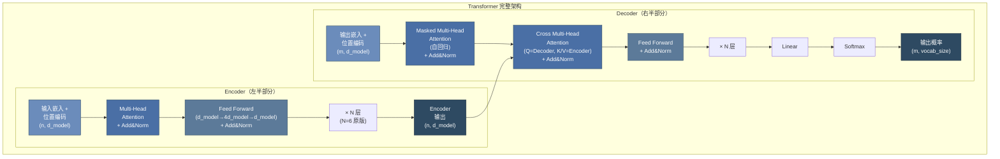
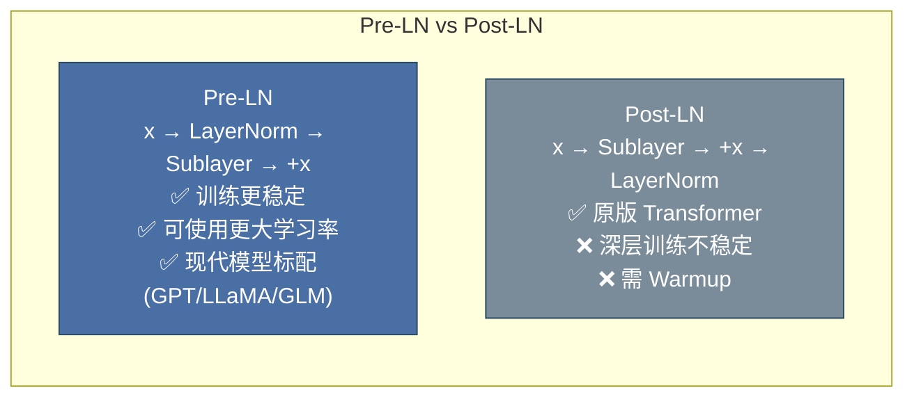
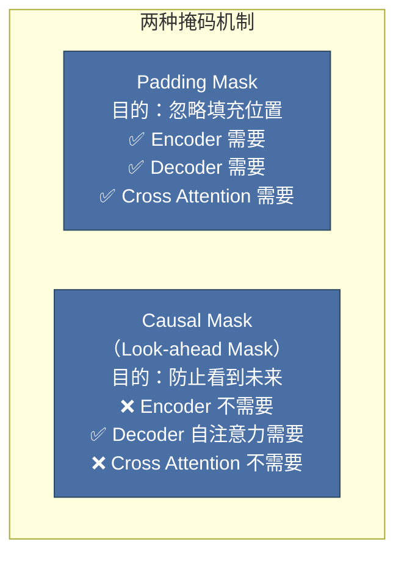
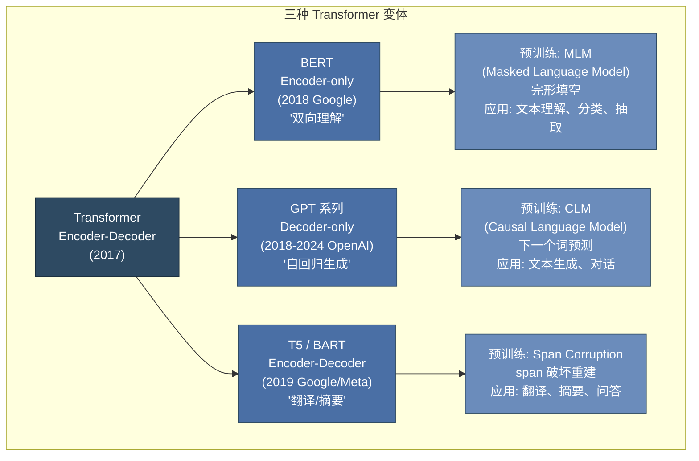
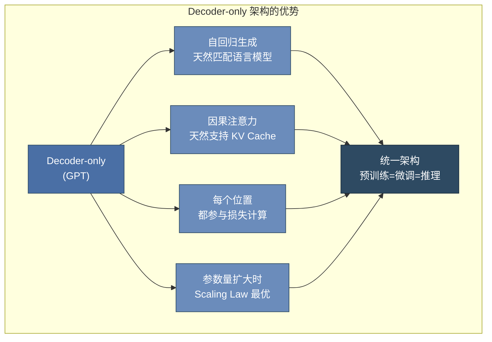

# 第 15 章 Transformer 架构与实现 ⭐⭐⭐⭐
> [!abstract] 本章导航
> **定位**：第二部分 机器学习与大模型基础中的第 15 章；围绕“Transformer 架构与实现”建立单一、可追踪的知识主线。
>
> **先修**：[[14_Attention数学与张量形状|第 14 章 Attention 数学与张量形状]]。
>
> **学习目标**：
> - 解释 Transformer 完整架构 ⭐⭐⭐⭐⭐ 的核心问题、机制与适用边界。
> - 实现或评估 三种 Transformer 变体 ⭐⭐⭐⭐⭐ 的最小闭环。
> - 使用可复现证据诊断 完整 Transformer PyTorch 实现 的工程取舍与失败模式。
>
> **建议路径**：Transformer 完整架构 ⭐⭐⭐⭐⭐ → 三种 Transformer 变体 ⭐⭐⭐⭐⭐ → 完整 Transformer PyTorch 实现。
>
> **配套代码**：`code/ch15_transformer/`。

本章先回答“Transformer 完整架构 ⭐⭐⭐⭐⭐”为什么成立，再沿着机制、实现、评估和边界逐步展开。阅读时先建立因果链，再运行或推演示例，最后用章末自测检查能否脱离原文复述。
## 15.1 Transformer 完整架构 ⭐⭐⭐⭐⭐

### 15.1.1 Encoder-Decoder 整体架构



### 15.1.2 编码器 (Encoder)

每个 Encoder Layer 包含两个子层：

1. **Multi-Head Self-Attention**：编码器对自身输入序列计算注意力
2. **Position-wise FFN**：对每个位置独立应用相同的全连接网络

$$\text{FFN}(x) = \max(0, xW_1 + b_1)W_2 + b_2$$

FFN 中间层维度为 $4 \times d_{model}$，即先升维再降维，增加非线性表达能力。

### 15.1.3 解码器 (Decoder)

每个 Decoder Layer 包含三个子层：

1. **Masked Multi-Head Self-Attention**：自回归掩码，防止看到未来位置
2. **Cross Attention**：$Q$ 来自 Decoder，$K$ 和 $V$ 来自 Encoder 输出
3. **Position-wise FFN**：同 Encoder

### 15.1.4 位置编码 (Positional Encoding) ⭐⭐⭐⭐⭐

由于 Self-Attention 是**置换等变的**（permutation invariant），即调换输入顺序不影响输出，模型无法感知序列位置信息。位置编码为每个位置注入唯一标识。

**原版正弦位置编码**：

$$PE_{(pos, 2i)} = \sin\left(\frac{pos}{10000^{2i/d_{model}}}\right)$$

$$PE_{(pos, 2i+1)} = \cos\left(\frac{pos}{10000^{2i/d_{model}}}\right)$$

**特性分析**：
- 每个位置有唯一的编码值
- 位置 $pos+k$ 的编码可由位置 $pos$ 的编码线性表示（利用三角恒等式）
- 可外推到训练时未见过的更长序列（但效果有限）

**现代替代方案 — RoPE (Rotary Position Embedding)** ⭐⭐⭐⭐⭐：

RoPE 是当前大模型（LLaMA、Qwen、Baichuan 等）的标配位置编码。

核心思想：将位置信息编码为 Query 和 Key 向量的**旋转矩阵乘法**，而非直接加到嵌入上。

$$f(q, m) = q \cdot e^{i m \theta} = R_{\Theta,m} \cdot q$$

其中 $R_{\Theta,m}$ 是旋转矩阵，将二维子空间旋转 $m \cdot \theta$ 角度。

**RoPE 的优势**：
1. **相对位置感知**：注意力得分 $q_m^T k_n$ 仅依赖于相对距离 $m-n$，符合自然语言的平移不变性
2. **长序列外推**：可通过调整旋转基实现更长上下文（YaRN、NTK-aware 等技巧）
3. **与 Attention 机制深度融合**：位置信息直接参与 Q/K 计算，而非作为加法偏置

```python
import torch
import math

class SinusoidalPositionalEncoding(nn.Module):
    """原版正弦位置编码"""

    def __init__(self, d_model, max_len=5000, dropout=0.1):
        super().__init__()
        self.dropout = nn.Dropout(dropout)

        pe = torch.zeros(max_len, d_model)
        position = torch.arange(0, max_len, dtype=torch.float).unsqueeze(1)

        div_term = torch.exp(
            torch.arange(0, d_model, 2).float() *
            (-math.log(10000.0) / d_model)
        )

        pe[:, 0::2] = torch.sin(position * div_term)
        pe[:, 1::2] = torch.cos(position * div_term)

        self.register_buffer('pe', pe.unsqueeze(0))  # (1, max_len, d_model)

    def forward(self, x):
        x = x + self.pe[:, :x.size(1), :]
        return self.dropout(x)
```

### 15.1.5 残差连接与层归一化 (Pre-LN vs Post-LN) ⭐⭐⭐⭐⭐

**残差连接（Residual Connection）**：

$$\text{Output} = \text{LayerNorm}(x + \text{Sublayer}(x))$$

作用：缓解梯度消失，使深层网络可训练（继承自 ResNet 的思想）。

**Pre-LN vs Post-LN 之争**：



| 特性 | Post-LN（原版） | Pre-LN（现代） |
|------|----------------|---------------|
| 归一化位置 | 子层输出之后 | 子层输入之前 |
| 训练稳定性 | 较差，深层易崩溃 | 好 |
| 学习率 | 需较小学习率 + Warmup | 可使用较大学习率 |
| Warmup 依赖 | 强依赖 | 减少依赖 |
| 代表模型 | 原版 Transformer, BERT | GPT-3/4, LLaMA, T5 |

### 15.1.6 掩码机制：Padding Mask 与 Causal Mask ⭐⭐⭐⭐⭐

掩码是 Transformer 中控制注意力范围的关键机制。



**Padding Mask**：处理变长序列，将填充位置（pad token）的注意力权重设为 $-\infty$，使其在 Softmax 后贡献为 0。

**Causal Mask（因果/下三角掩码）**：用于 Decoder 的自注意力，确保在预测第 $t$ 个位置时只能看到 $\leq t$ 的位置。

```python
def create_causal_mask(seq_len):
    """创建下三角掩码 — Decoder 自注意力使用"""
    # mask[i,j] = True 表示位置 i 可以关注位置 j
    mask = torch.tril(torch.ones(seq_len, seq_len))  # 下三角矩阵
    return mask  # (seq_len, seq_len)

def create_padding_mask(seq, pad_idx=0):
    """创建填充掩码 — 忽略 pad token"""
    # (batch, 1, 1, seq_len)，广播到 (batch, 1, seq_len, seq_len)
    mask = (seq != pad_idx).unsqueeze(1).unsqueeze(2)
    return mask  # (batch, 1, 1, seq_len)

# 因果掩码可视化
causal = create_causal_mask(5)
print("Causal Mask (下三角):")
print(causal.int())
# 输出:
# tensor([[1, 0, 0, 0, 0],
#         [1, 1, 0, 0, 0],
#         [1, 1, 1, 0, 0],
#         [1, 1, 1, 1, 0],
#         [1, 1, 1, 1, 1]])
```

## 15.2 三种 Transformer 变体 ⭐⭐⭐⭐⭐

### 15.2.1 架构对比全景图



### 15.2.2 Encoder-only：BERT

BERT（Bidirectional Encoder Representations from Transformers）使用 Transformer 的编码器堆栈。

**预训练任务**：
1. **MLM（Masked Language Model）**：随机遮盖 15% 的 token，模型预测被遮盖的词
2. **NSP（Next Sentence Prediction）**：预测两个句子是否相邻（后续被证明作用有限）

**MLM 的细节处理**：被选中的 15% token 中，80% 替换为 `[MASK]`，10% 替换为随机词，10% 保持不变。这种策略缓解预训练-微调的差异。

**应用场景**：文本分类、命名实体识别、问答、语义相似度等**理解类任务**。

### 15.2.3 Decoder-only：GPT 系列 ⭐⭐⭐⭐⭐

GPT（Generative Pre-trained Transformer）仅使用 Transformer 的解码器部分，配合因果掩码进行自回归语言建模。

**预训练任务**：**CLM（Causal Language Modeling）**，即给定前缀 $w_1, ..., w_{t-1}$，预测下一个词 $w_t$。

$$L = -\sum_{t=1}^{T} \log P(w_t | w_1, ..., w_{t-1}; \Theta)$$

### 15.2.4 面试高频题：GPT 为什么采用 Decoder-only？⭐⭐⭐⭐⭐

**核心原因**：

1. **参数效率**：
   - 在相同参数量下，Decoder-only 模型比 Encoder-Decoder 更"深"（所有参数用于生成）
   - Encoder-Decoder 需要两套 Attention 机制，参数分散

2. **自回归天然匹配生成**：
   - 语言生成本质上是自回归的（从左到右逐个生成 token）
   - Decoder-only 的因果掩码完美匹配这一特性

3. **Scaling Law 的发现**：
   - OpenAI 的研究发现，Decoder-only 架构在参数量扩大时表现更优
   - GPT-3（175B）验证了超大规模 Decoder-only 模型的惊人能力

4. **训练效率**：
   - 不需要复杂的 Mask 策略（BERT 的 MLM 只有 15% 位置参与预测）
   - 除 padding、边界和显式忽略的位置外，每个有效 token 都可作为下一 token 预测目标；
     “参与目标的位置更多”不等于端到端数据利用率固定为 100%

5. **Attention 计算的简洁性**：
   - Decoder-only 的 Self-Attention 是**下三角矩阵**，天然适合缓存（KV Cache）
   - Encoder-Decoder 的 Cross Attention 增加了复杂度



## 15.3 完整 Transformer PyTorch 实现

```python
import torch
import torch.nn as nn
import math

class TransformerEncoderLayer(nn.Module):
    """Transformer Encoder Layer — 包含 Self-Attention + FFN"""

    def __init__(self, d_model, num_heads, d_ff, dropout=0.1):
        super().__init__()
        self.self_attn = MultiHeadAttention(d_model, num_heads, dropout)
        self.ffn = nn.Sequential(
            nn.Linear(d_model, d_ff),
            nn.GELU(),
            nn.Dropout(dropout),
            nn.Linear(d_ff, d_model),
            nn.Dropout(dropout)
        )
        self.norm1 = nn.LayerNorm(d_model)
        self.norm2 = nn.LayerNorm(d_model)

    def forward(self, x, mask=None):
        # Pre-LN 结构: Norm → Sublayer → Residual
        attn_out, _ = self.self_attn(self.norm1(x), self.norm1(x), self.norm1(x), mask)
        x = x + attn_out

        ffn_out = self.ffn(self.norm2(x))
        x = x + ffn_out

        return x


class TransformerDecoderLayer(nn.Module):
    """Transformer Decoder Layer — 包含 Masked Self-Attn + Cross Attn + FFN"""

    def __init__(self, d_model, num_heads, d_ff, dropout=0.1):
        super().__init__()
        self.self_attn = MultiHeadAttention(d_model, num_heads, dropout)
        self.cross_attn = MultiHeadAttention(d_model, num_heads, dropout)
        self.ffn = nn.Sequential(
            nn.Linear(d_model, d_ff),
            nn.GELU(),
            nn.Dropout(dropout),
            nn.Linear(d_ff, d_model),
            nn.Dropout(dropout)
        )
        self.norm1 = nn.LayerNorm(d_model)
        self.norm2 = nn.LayerNorm(d_model)
        self.norm3 = nn.LayerNorm(d_model)

    def forward(self, x, encoder_output, src_mask=None, tgt_mask=None):
        # Masked Self-Attention
        self_attn_out, _ = self.self_attn(
            self.norm1(x), self.norm1(x), self.norm1(x), tgt_mask
        )
        x = x + self_attn_out

        # Cross Attention (Q from decoder, K/V from encoder)
        cross_attn_out, _ = self.cross_attn(
            self.norm2(x), encoder_output, encoder_output, src_mask
        )
        x = x + cross_attn_out

        # FFN
        ffn_out = self.ffn(self.norm3(x))
        x = x + ffn_out

        return x


class Transformer(nn.Module):
    """完整 Transformer 模型"""

    def __init__(self, src_vocab_size, tgt_vocab_size, d_model=512,
                 num_heads=8, num_layers=6, d_ff=2048, max_len=5000,
                 dropout=0.1):
        super().__init__()

        self.d_model = d_model

        # 嵌入层
        self.src_embedding = nn.Embedding(src_vocab_size, d_model)
        self.tgt_embedding = nn.Embedding(tgt_vocab_size, d_model)

        # 位置编码
        self.pos_encoding = SinusoidalPositionalEncoding(d_model, max_len, dropout)

        # 编码器
        self.encoder_layers = nn.ModuleList([
            TransformerEncoderLayer(d_model, num_heads, d_ff, dropout)
            for _ in range(num_layers)
        ])

        # 解码器
        self.decoder_layers = nn.ModuleList([
            TransformerDecoderLayer(d_model, num_heads, d_ff, dropout)
            for _ in range(num_layers)
        ])

        # 输出层
        self.output_layer = nn.Linear(d_model, tgt_vocab_size)

        self._init_parameters()

    def _init_parameters(self):
        for p in self.parameters():
            if p.dim() > 1:
                nn.init.xavier_uniform_(p)

    def encode(self, src, src_mask=None):
        x = self.src_embedding(src) * math.sqrt(self.d_model)
        x = self.pos_encoding(x)
        for layer in self.encoder_layers:
            x = layer(x, src_mask)
        return x

    def decode(self, tgt, encoder_output, src_mask=None, tgt_mask=None):
        x = self.tgt_embedding(tgt) * math.sqrt(self.d_model)
        x = self.pos_encoding(x)
        for layer in self.decoder_layers:
            x = layer(x, encoder_output, src_mask, tgt_mask)
        return x

    def forward(self, src, tgt, src_mask=None, tgt_mask=None):
        encoder_output = self.encode(src, src_mask)
        decoder_output = self.decode(tgt, encoder_output, src_mask, tgt_mask)
        return self.output_layer(decoder_output)
```
## 🧭 本章小结

- Transformer 完整架构 ⭐⭐⭐⭐⭐：能够说清问题、机制、证据与边界。
- 三种 Transformer 变体 ⭐⭐⭐⭐⭐：能够说清问题、机制、证据与边界。
- 完整 Transformer PyTorch 实现：能够说清问题、机制、证据与边界。

## ✅ 自测与练习

1. 不看正文，解释“Transformer 完整架构 ⭐⭐⭐⭐⭐”解决什么问题，并给出一个不适用场景。
2. 为“三种 Transformer 变体 ⭐⭐⭐⭐⭐”设计一个最小可复现实验，明确输入、指标和通过条件。
3. 比较“完整 Transformer PyTorch 实现”的至少两种方案，说明质量、成本、延迟或风险取舍。

## 🧪 配套代码与验收

- `code/ch15_transformer/`

```powershell
python code/scripts/run_all_examples.py --chapter ch15 --tier core
```

默认验收不下载模型、不调用付费 API；真实 API 或 GPU 示例必须按 metadata 显式启用。成功标准是相关脚本输出 `OK`，条件不足时输出可解释的 `[SKIP]`。

## 🎯 面试题精讲

回答本章问题时使用四步结构：先给结论，再解释机制，然后给项目证据，最后主动说明适用边界。涉及性能或效果时，补充模型、硬件、数据、并发、版本和统计口径；条件不完整时明确说“需要实测”。

## 📋 本章速查表

| 主题 | 回答主线 |
|---|---|
| Transformer 完整架构 ⭐⭐⭐⭐⭐ | 问题 → 机制 → 示例 → 指标 → 边界 |
| 三种 Transformer 变体 ⭐⭐⭐⭐⭐ | 问题 → 机制 → 示例 → 指标 → 边界 |
| 完整 Transformer PyTorch 实现 | 问题 → 机制 → 示例 → 指标 → 边界 |

## 🔗 相关章节

- [[14_Attention数学与张量形状|第 14 章 Attention 数学与张量形状]]
- [[16_大模型预训练解码与模型选型|第 16 章 大模型预训练、解码与模型选型]]

## 📖 一手参考资料

> 核验基线：2026-07-31；结构复核：2026-08-05。产品、API、法规、价格与 benchmark 会变化，使用前应再次核验。

- [[docs/AUTHORITATIVE_SOURCES|章节权威来源索引]]：按主题维护官方文档、标准、原论文和官方仓库。
