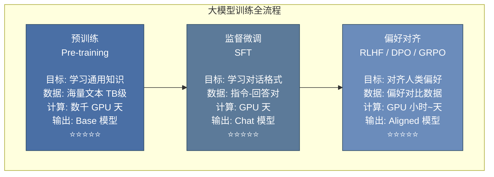
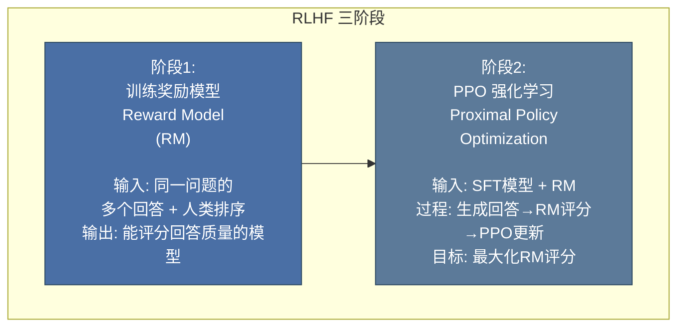
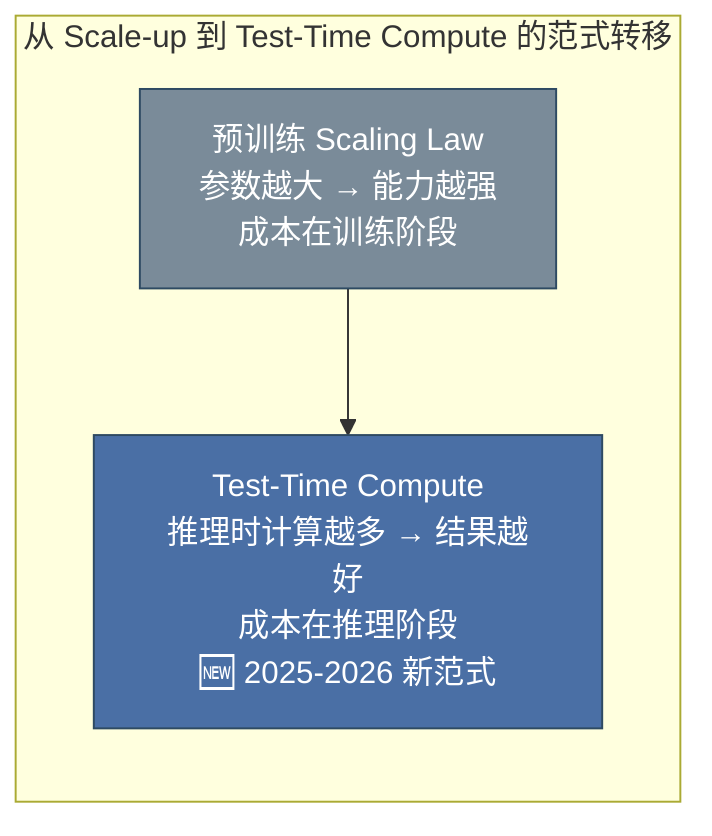
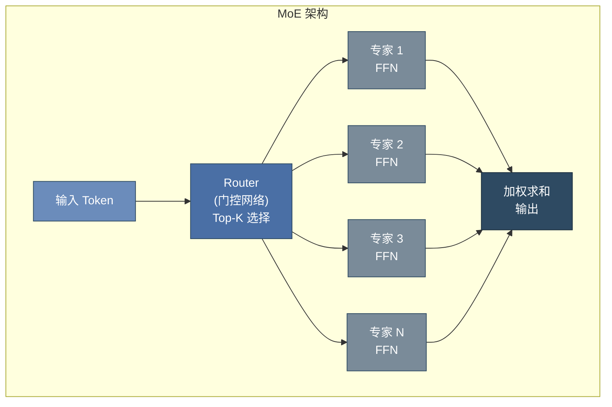

# 第 16 章 大模型预训练、解码与模型选型 ⭐⭐⭐⭐
> [!abstract] 本章导航
> **定位**：第二部分 机器学习与大模型基础中的第 16 章；围绕“大模型预训练、解码与模型选型”建立单一、可追踪的知识主线。
>
> **先修**：[[15_Transformer架构与实现|第 15 章 Transformer 架构与实现]]。
>
> **学习目标**：
> - 解释 大模型训练流程 ⭐⭐⭐⭐⭐ 的核心问题、机制与适用边界。
> - 实现或评估 大模型核心概念 ⭐⭐⭐⭐ 的最小闭环。
> - 使用可复现证据诊断 截至 2026-07-31 的官方模型信息与选型 的工程取舍与失败模式。
>
> **建议路径**：大模型训练流程 ⭐⭐⭐⭐⭐ → 大模型核心概念 ⭐⭐⭐⭐ → 截至 2026-07-31 的官方模型信息与选型。
>
> **配套代码**：`code/ch15_transformer/`。

本章先回答“大模型训练流程 ⭐⭐⭐⭐⭐”为什么成立，再沿着机制、实现、评估和边界逐步展开。阅读时先建立因果链，再运行或推演示例，最后用章末自测检查能否脱离原文复述。
## 16.1 大模型训练流程 ⭐⭐⭐⭐⭐

### 16.1.1 完整训练流程图



### 16.1.2 预训练（Pre-training）

**目标**：在大规模无标注文本上学习通用的语言表示和世界知识。

**数据**：网页文本（Common Crawl）、书籍、代码、百科、论文等，总量可达数 TB。

**关键超参数**：

| 模型 | 参数量 | 训练数据量 | Batch Size | 学习率 | 训练时长 |
|------|--------|-----------|------------|--------|---------|
| GPT-3 | 175B | 300B tokens | 3.2M | 0.6×10⁻⁴ | ~3000 V100 GPU 天 |
| LLaMA-2 | 70B | 2T tokens | 4M | 1.5×10⁻⁴ | ~1.7M GPU 小时 |
| Qwen-72B | 72B | 3T+ tokens | — | — | — |

**预训练的核心挑战**：
1. **计算成本**：需要大规模 GPU/TPU 集群，成本数百万美元
2. **数据质量**：海量数据中的噪声、重复、有毒内容需清洗
3. **训练稳定性**：深层大模型易出现 loss spike（损失突增），需要精细调参

### 16.1.3 监督微调（SFT）⭐⭐⭐⭐⭐

**目标**：将预训练模型适配到对话/指令遵循格式。

**数据格式**（指令微调数据）：

```json
{
    "messages": [
        {"role": "system", "content": "你是一个有帮助的AI助手。"},
        {"role": "user", "content": "请解释什么是Transformer？"},
        {"role": "assistant", "content": "Transformer是一种深度学习架构..."}
    ]
}
```

**SFT 的技术要点**：
- 通常只计算 assistant 回复部分的 loss（user 部分 loss 设为 0，不反向传播）
- 学习率比预训练小 10-100 倍（通常 1e-5 ~ 2e-5）
- 训练 1-3 个 epoch 即可（过多会导致过拟合）

### 16.1.4 RLHF（基于人类反馈的强化学习）⭐⭐⭐⭐⭐

RLHF 是 ChatGPT 成功的关键技术之一，包含三个步骤：



**PPO 的核心原理**：

PPO（Proximal Policy Optimization）是一种策略梯度算法，通过**限制策略更新幅度**来保持训练稳定性。

$$L^{PPO}(\theta) = \hat{\mathbb{E}}_t \left[ \min(r_t(\theta) \hat{A}_t, \text{clip}(r_t(\theta), 1-\epsilon, 1+\epsilon) \hat{A}_t) \right]$$

其中 $r_t(\theta) = \frac{\pi_\theta(a_t|s_t)}{\pi_{\theta_{old}}(a_t|s_t)}$ 是新旧策略比率，$\hat{A}_t$ 是优势函数估计。

**PPO 的组件**：
1. **Actor（策略网络）**：SFT 模型，负责生成回答
2. **Critic（价值网络）**：估计状态价值函数 $V(s)$
3. **Reward Model**：给生成回答打分
4. **Reference Model**：冻结的 SFT 模型，防止策略偏离太远（KL 散度约束）

### 16.1.5 DPO（直接偏好优化）⭐⭐⭐⭐⭐

DPO 是 RLHF 的简化替代，**绕过奖励模型和强化学习**，直接用偏好数据进行优化。

**核心思想**：将 RL 目标转化为分类问题，直接优化策略模型。

$$L_{DPO}(\theta) = -\mathbb{E}_{(x, y_w, y_l)} \left[ \log \sigma \left( \beta \log \frac{\pi_\theta(y_w|x)}{\pi_{ref}(y_w|x)} - \beta \log \frac{\pi_\theta(y_l|x)}{\pi_{ref}(y_l|x)} \right) \right]$$

其中 $y_w$ 是偏好的回答（win），$y_l$ 是不偏好的回答（lose），$\beta$ 控制偏离参考模型的程度。

**DPO vs PPO**：

| 维度 | PPO | DPO |
|------|-----|-----|
| 是否需要 RM | ✅ 需要单独训练 | ❌ 不需要 |
| 是否需要 RL | ✅ PPO 算法 | ❌ 转化为分类损失 |
| 训练稳定性 | 较低（超参数敏感） | **较高** |
| 训练速度 | 慢（采样 + 多轮更新） | **快** |
| 效果上限 | 通常更高（精细优化） | 接近 PPO |
| 实现复杂度 | 高 | **低** |

### 16.1.6 GRPO（群体相对策略优化）⭐⭐⭐⭐⭐

GRPO 是 DeepSeek 团队提出的强化学习算法，用于训练 DeepSeek-R1 等推理模型。

**核心创新 — 去 Critic 化**：

传统 PPO 需要维护 Critic 网络来估计优势函数，GRPO 通过**组内相对比较**替代 Critic：

1. 对每个问题，采样一组回答（Group）
2. 使用奖励模型或规则（如答案正确性）给每个回答打分
3. 优势函数 = 个体得分 - 组内平均分
4. 基于此相对优势更新策略

$$\hat{A}_{i} = \frac{r_i - \text{mean}(\{r_j\}_{j=1}^{G})}{\text{std}(\{r_j\}_{j=1}^{G})}$$

**GRPO 的优势**：
- **无需 Critic 模型**：减少一半参数量和显存占用
- **适合推理任务**：组内比较天然适配有明确答案的数学/编程问题
- **高效扩展**：适合大规模并行训练

```python
# GRPO 伪代码
for batch in dataloader:
    # 1. 对同一问题采样 G 个回答
    responses = [generate(model, question) for _ in range(G)]

    # 2. 奖励评分（可基于规则或奖励模型）
    rewards = [reward_fn(q, r) for r in responses]

    # 3. 计算组内相对优势
    mean_reward = sum(rewards) / G
    advantages = [r - mean_reward for r in rewards]

    # 4. 策略梯度更新
    loss = -sum(advantage * log_prob for advantage, log_prob in zip(advantages, log_probs))
    loss.backward()
```

## 16.2 大模型核心概念 ⭐⭐⭐⭐

### 16.2.1 涌现能力（Emergent Abilities）⭐⭐⭐⭐

“涌现能力”通常指某项能力随模型规模或训练计算增加而出现明显、非线性的测量提升。是否真有相变取决于任务和指标：离散评分可能把平滑改进显示成“突然出现”，因此不应断言小模型上能力完全不存在。

典型涌现能力：
- **In-Context Learning（上下文学习）**：通过 prompt 中的示例学习新任务
- **Chain-of-Thought 推理**：逐步推理复杂问题
- **指令遵循**：理解和执行自然语言指令
- **代码生成**：编写和解释程序代码

**涌现的争议**：有研究认为涌现可能是评估指标的离散性造成的假象，而非真正的相变。但经验上，大模型确实在特定规模后表现出质的飞跃。

**🆕 2026 年更新 — 从"规模涌现"到"推理时涌现"**：

2025-2026年，业界发现了一个更深层的规律：**Test-Time Compute（推理时计算）**可以让中等规模的模型通过"花更多时间思考"达到超大模型的效果。



这一范式可见于支持 reasoning/thinking/effort 控制的闭源 API，也可见于 DeepSeek-R1 等公开报告。不同厂商、不同 model ID 的参数名和允许值并不通用，应按对应版本文档调用。

这意味着：**模型能力 = f(参数规模, 推理时计算)**，两个维度都可以独立优化。

### 16.2.2 上下文学习（In-Context Learning）⭐⭐⭐⭐⭐

**定义**：大模型在不更新参数的情况下，仅通过在输入上下文中提供几个示例（few-shot）就能学习新任务的能力。

**三种形式**：

| 形式 | 示例数量 | 说明 |
|------|---------|------|
| Zero-shot | 0 个 | 直接给指令，模型理解执行 |
| One-shot | 1 个 | 提供 1 个输入-输出示例 |
| Few-shot | 2-5 个 | 提供多个示例，引导模型模式 |

**上下文学习的原理假说**：
1. **隐式梯度下降**：Attention 机制在前向传播中执行了类似梯度更新的操作
2. **任务检索**：预训练时见过类似任务，示例帮助定位相关知识
3. **元学习**：模型在预训练过程中学会了"如何学习"

### 16.2.3 MoE 架构（Mixture of Experts）⭐⭐⭐⭐

MoE 是当前大模型扩展的重要方向，核心思想：**用条件计算替代全部计算**。

**核心结构**：

$$y = \sum_{i=1}^{N} G(x)_i \cdot E_i(x)$$

其中 $G$ 是门控网络（Gating Network），$E_i$ 是第 $i$ 个专家网络。门控网络决定每个输入 token 激活哪些专家。



**MoE 的关键设计**：

| 设计 | 说明 | 目的 |
|------|------|------|
| **Top-K 路由** | 只激活 K 个专家（通常 K=1~2） | 减少计算量 |
| **负载均衡损失** | 惩罚路由不均衡 | 防止所有 token 涌向少数专家 |
| **专家容量** | 限制每个专家处理的最大 token 数 | 防止过载 |

**代表模型**：
- Mixtral 8×7B / 8×22B：Mistral AI 的 MoE 模型
- **DeepSeek-V2/V3**：论文公开了 MLA 与 DeepSeekMoE，可据原始报告讨论
- 闭源 GPT、Claude、Gemini 系列的底层参数量和专家结构未公开；不能把行业传闻写成已证实的 MoE 案例

> **证据边界**：API 的“推理模式”“工具调用”或“多智能体产品能力”不等于厂商公开了底层神经网络结构。面试时应明确区分模型架构、训练方法、推理策略和应用层编排。

**MoE 的优势**：
- **参数量大，激活参数量小**：总参数量可达千亿级，但每个 token 只激活部分参数
- **专家特化**：不同专家可学习不同领域知识（语法、数学、代码等）

**MoE 的挑战**：
- 通信开销（多专家分布在不同设备）
- 负载均衡（某些专家可能被过度使用）
- 微调复杂度增加

**🆕 2026 年新趋势 — 推理时计算（Test-Time Compute）成为标配**：

2026年的顶级大模型不再仅依赖预训练参数，而是在推理阶段动态分配计算资源：

| 技术 | 原理 | 效果 | 代表模型 |
|------|------|------|---------|
| **增加推理预算** | 允许模型使用更多内部推理 token/步骤 | 质量、延迟和成本一起变化，收益需按任务评测 | 支持 reasoning/thinking 控制的 API |
| **多样本聚合** | 采样多条独立路径，再按答案或验证器聚合 | 用额外调用换取稳健性；不是所有任务都受益 | Self-Consistency |
| **搜索与回溯** | 在候选计划/解空间中扩展并剪枝 | 适合有可验证状态的任务，成本可能快速增长 | Agent/规划系统 |
| **验证器引导** | 用规则、测试或学习到的验证器筛选结果 | 可减少部分错误，但验证器自身也需评估 | 代码测试、数学验证 |

> **💡 面试要点**：理解 Test-Time Compute 的范式转移 —— 它意味着模型能力可以在不增加参数的情况下通过"思考更久"来提升，这是 2026 年大模型工程的核心优化方向。

## 16.3 截至 2026-07-31 的官方模型信息与选型

模型版本变化快，本节采用两个规则：

1. **只写厂商发布页、API 文档或模型论文明确披露的事实**；闭源架构未知就写“未披露”。
2. **把产品名、API 模型 ID 和快照版本分开**；上线前在供应商模型目录重新确认上下文、价格、地区可用性与弃用日期。

### 16.3.1 官方发布快照

| 厂商 | 截至日期可确认的公开产品线 | 官方可确认信息 | 不应推断 |
|------|----------------------------|----------------|----------|
| **OpenAI** | GPT-5 于 2025-08-07 发布；GPT-5.5 于 2026-04-23 发布；GPT-5.6 于 2026-07-09 发布 | 官方发布页与模型目录说明其 API 能力、工具和版本 | 参数量、是否 MoE、激活参数、训练 GPU 数均未披露 |
| **Anthropic** | Claude Opus 4.7、Opus 4.8；当前型号以官方 Models Overview 为准 | 以 Models Overview、Extended Thinking 和 Effort 文档为准 | 不把“Agent Teams”产品功能等同于已公开的神经符号底层架构，也不把虚构评测场景中的名称当作已发布产品 |
| **Google** | Gemini 3 于 2025-11-18 发布；I/O 2026 又公布 Gemini 3.5 / Gemini Omni 等进展 | 具体可调用型号、模态、上下文和 thinking 参数以 Gemini API 模型页为准 | 不从产品多模态/端侧能力反推未披露参数量与内部模块 |
| **DeepSeek** | DeepSeek-V2、V3 与 R1 有论文或开放权重 | 可引用论文中的参数规模、MLA/MoE、训练阶段和公开 benchmark | 不能把 V3 预训练成本直接写成 R1 全流程成本 |

这张表不是永久排名。工程选型必须用自己的代表性任务集评测质量、延迟、吞吐、工具成功率、结构化输出合规率与总成本。

### 16.3.2 闭源模型如何做专业比较

不要制作“架构竞猜表”。闭源模型更适合比较可验证的接口合同：

- **模型与快照**：记录精确 API model ID、发布日期、弃用策略和区域可用性
- **输入输出能力**：文本/图像/音频、结构化输出、工具调用、上下文限制
- **推理控制**：厂商支持的 reasoning/thinking/effort 参数及其版本约束
- **工程指标**：首 token 延迟、完成延迟、并发吞吐、超时率、工具任务成功率
- **风险指标**：拒答、幻觉、提示注入、数据保留、内容合规与可观测性

模型名称相近不代表请求参数兼容。例如 Anthropic 新型号可能要求 adaptive thinking 与 effort，而旧型号仍使用手动 token budget；必须按选定 model ID 查对应文档。

### 16.3.3 DeepSeek-R1：只引用报告明确给出的口径

DeepSeek-R1 基于 DeepSeek-V3-Base 进行多阶段后训练，并公开了 R1 与蒸馏模型权重。可确认的口径包括：

| 维度 | 可引用事实 | 注意事项 |
|------|------------|----------|
| **基础模型规模** | DeepSeek-V3 / R1 为 671B 总参数、每 token 约 37B 激活参数 | DeepSeek-V2 是 236B 总参数、约 21B 激活参数，不能混写 |
| **公开评测** | R1 仓库报告 MATH-500 pass@1 为 97.3，另列 AIME、Codeforces 等结果 | 必须写 benchmark 名称、版本、采样/评测设置与对比对象 |
| **训练成本** | V3 技术报告给出其预训练约 2.788M H800 GPU-hours，按报告口径折算约 5.576M 美元 | 这不是 R1 的完整数据、预训练、SFT、RL、蒸馏和试验总成本 |
| **后训练方法** | R1 报告描述 cold-start、GRPO、rejection sampling、SFT/RL 阶段 | 不应虚构一个额外的“推理专用层” |
| **开放程度** | 权重可获取，仓库列出许可与派生模型 | “开放权重”不自动等于训练数据、训练代码全部开源 |

**DeepSeek-R1 的核心方法 — 强化学习 + 思维链蒸馏**：

1. **GRPO 强化学习**：通过同一问题的组内相对奖励估计优势，避免单独训练价值模型
2. **冷启动数据**：少量高质量 CoT 数据启动训练
3. **蒸馏**：用 R1 生成的数据微调更小的 Qwen/Llama 基座模型
4. **拒绝采样**：过滤低质量推理路径，保留高质量 CoT

### 16.3.4 可复现的模型选型表

与其写“综合最强/Agent 最强”，不如维护下面的实测表。每一行都应绑定模型快照和评测日期：

| 指标 | 定义示例 | 为什么重要 |
|------|----------|------------|
| **任务质量** | Golden Set 准确率、人工盲评、代码测试通过率 | 公开榜单不一定代表自己的流量 |
| **工具可靠性** | 正确选工具率、参数 schema 合规率、端到端任务成功率 | Agent 失败通常发生在模型外部状态与工具边界 |
| **延迟/吞吐** | TTFT、P50/P95 完成延迟、tokens/s、并发下成功率 | 长上下文与高推理预算会改变尾延迟 |
| **成本** | 输入、缓存输入、输出、工具/搜索与失败重试的单任务总成本 | 只比较标价会漏掉输出长度和重试 |
| **安全合规** | 注入攻击成功率、越权工具调用率、数据驻留/保留策略 | 决定是否能进入生产环境 |
| **可运维性** | 快照固定、限流、批处理、可观测字段、弃用窗口 | “当前最新”会快速变化 |

**参考资料（核对日期：2026-07-31）**：

- [OpenAI：Introducing GPT-5](https://openai.com/index/introducing-gpt-5/)
- [OpenAI：Introducing GPT-5.5](https://openai.com/index/introducing-gpt-5-5/)
- [OpenAI：GPT-5.6](https://openai.com/index/gpt-5-6/)
- [OpenAI API Models](https://developers.openai.com/api/docs/models/all)
- [Anthropic：Claude Opus 4.8](https://www.anthropic.com/news/claude-opus-4-8)
- [Anthropic Models Overview](https://platform.claude.com/docs/en/about-claude/models/overview)
- [Google：Gemini 3](https://blog.google/products-and-platforms/products/gemini/gemini-3/)
- [Google I/O 2026 AI updates](https://blog.google/innovation-and-ai/technology/developers-tools/google-io-2026-collection/)
- [DeepSeek-R1](https://github.com/deepseek-ai/DeepSeek-R1)
- [DeepSeek-V3 Technical Report](https://arxiv.org/abs/2412.19437)
- [DeepSeek-V2](https://github.com/deepseek-ai/DeepSeek-V2)
## 🧭 本章小结

- 大模型训练流程 ⭐⭐⭐⭐⭐：能够说清问题、机制、证据与边界。
- 大模型核心概念 ⭐⭐⭐⭐：能够说清问题、机制、证据与边界。
- 截至 2026-07-31 的官方模型信息与选型：能够说清问题、机制、证据与边界。

## ✅ 自测与练习

1. 不看正文，解释“大模型训练流程 ⭐⭐⭐⭐⭐”解决什么问题，并给出一个不适用场景。
2. 为“大模型核心概念 ⭐⭐⭐⭐”设计一个最小可复现实验，明确输入、指标和通过条件。
3. 比较“截至 2026-07-31 的官方模型信息与选型”的至少两种方案，说明质量、成本、延迟或风险取舍。

## 🧪 配套代码与验收

- `code/ch15_transformer/`

```powershell
python code/scripts/run_all_examples.py --chapter ch15 --tier core
```

默认验收不下载模型、不调用付费 API；真实 API 或 GPU 示例必须按 metadata 显式启用。成功标准是相关脚本输出 `OK`，条件不足时输出可解释的 `[SKIP]`。

## 🎯 面试题精讲

回答本章问题时使用四步结构：先给结论，再解释机制，然后给项目证据，最后主动说明适用边界。涉及性能或效果时，补充模型、硬件、数据、并发、版本和统计口径；条件不完整时明确说“需要实测”。

## 📋 本章速查表

| 主题 | 回答主线 |
|---|---|
| 大模型训练流程 ⭐⭐⭐⭐⭐ | 问题 → 机制 → 示例 → 指标 → 边界 |
| 大模型核心概念 ⭐⭐⭐⭐ | 问题 → 机制 → 示例 → 指标 → 边界 |
| 截至 2026-07-31 的官方模型信息与选型 | 问题 → 机制 → 示例 → 指标 → 边界 |

## 🔗 相关章节

- [[15_Transformer架构与实现|第 15 章 Transformer 架构与实现]]
- [[17_Prompt_Engineering|第 17 章 Prompt Engineering]]

## 📖 一手参考资料

> 核验基线：2026-07-31；结构复核：2026-08-05。产品、API、法规、价格与 benchmark 会变化，使用前应再次核验。

- [[docs/AUTHORITATIVE_SOURCES|章节权威来源索引]]：按主题维护官方文档、标准、原论文和官方仓库。
