# 第 16 章 模型微调与推理优化 ⭐⭐⭐⭐

> [!abstract] 本章导航
> **定位**：连接训练后对齐、参数高效微调与推理部署，形成模型能力改造闭环。
>
> **先修**：[[11_深度学习与PyTorch]]、[[12_Transformer与大模型原理]]。
>
> **学习目标**：
> - 比较 SFT、偏好优化和参数高效微调方法。
> - 估算训练、权重和 KV Cache 的资源需求。
> - 根据质量、成本和硬件选择优化与部署方案。
>
> **建议路径**：微调概述 → LoRA 与 QLoRA → 对齐技术 → … → RL Post-Training 专题。先完成主线，再按需要阅读进阶内容。
>
> **配套代码**：`code/ch16_finetuning/`。

> [!info] 阅读提示
> 从 LoRA/QLoRA 高效微调到 RLHF/DPO/GRPO 对齐技术，从 KV Cache 到 Flash Attention 推理加速，从 INT4 量化到 vLLM 部署，本章串联微调、对齐、优化和部署的主要决策链路。
>
> **版本与范围**：新增端云协同部署架构、Test-Time Compute 推理时计算、Xinference 与公开端侧部署工具，并补充 RL 后训练的证据边界。

## 16.1 微调概述 ⭐⭐⭐⭐

### 16.1.1 为什么需要微调

微调（Fine-tuning）是在预训练大模型的基础上，使用特定领域或任务的数据继续训练，使模型适应特定场景。

**需要微调的场景**：

| 场景 | 说明 | 替代方案 |
|------|------|---------|
| **垂直领域知识** | 医疗、法律、金融等专业领域 | RAG（知识性内容优先用 RAG）|
| **特定输出格式** | JSON、SQL、特定代码风格 | Few-shot Prompting |
| **品牌语气** | 企业特定的语言风格 | 微调效果更稳定 |
| **推理能力增强** | 数学、逻辑推理能力 | 需要大量推理数据微调 |
| **长上下文适配** | 适应超长文档理解 | 与位置编码扩展结合 |

**微调 vs RAG 的选择原则**：

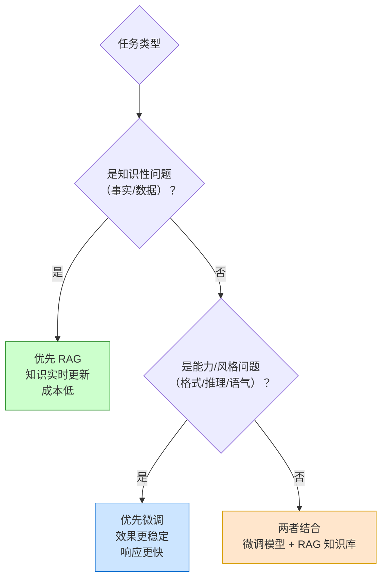

### 16.1.2 全量微调 vs PEFT

| 维度 | 全量微调（Full Fine-tuning） | PEFT（参数高效微调）|
|------|---------------------------|-------------------|
| **训练参数** | 全部参数 | 由 rank、目标模块和方法决定，通常远少于全量 |
| **显存需求** | 需保存全部可训练参数及优化器状态 | 通常更低；仍取决于模型、序列、batch、精度与量化 |
| **训练速度** | 基线 | 可能减少反向与通信开销；端到端耗时必须实测 |
| **效果** | 容量上限高，但不保证优于 PEFT | 依任务、数据和目标模块而定 |
| **灾难性遗忘** | 风险取决于数据和训练配方 | 冻结基座可降低部分风险，不等于免疫 |
| **存储成本** | 每个任务保存完整 checkpoint | 每个任务保存 adapter；大小由 rank/模块决定 |

**PEFT 主要方法家族**：

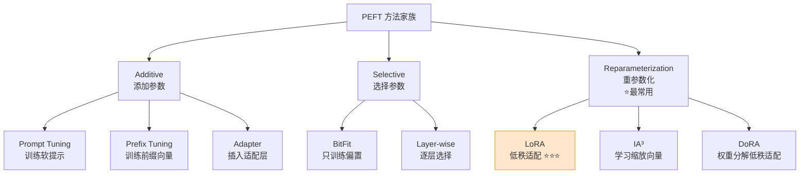

## 16.2 LoRA 与 QLoRA ⭐⭐⭐⭐⭐

### 16.2.1 LoRA 数学原理

LoRA（Low-Rank Adaptation）的核心洞察：**模型权重的更新是低秩的**。

对于预训练权重矩阵 $W_0 \in \mathbb{R}^{d \times k}$，微调时不直接更新 $W_0$，而是引入一对低秩矩阵：

$$
W = W_0 + \Delta W = W_0 + BA
$$

其中 $B \in \mathbb{R}^{d \times r}$，$A \in \mathbb{R}^{r \times k}$，$r \ll \min(d, k)$（典型 $r = 8, 16, 32, 64$）。

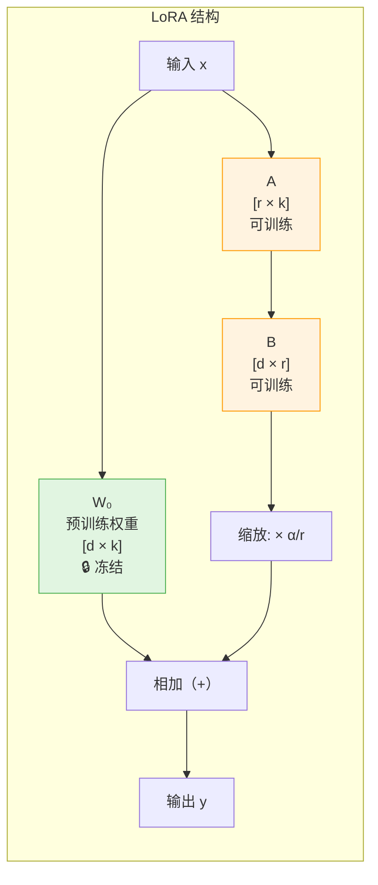

**参数量对比**：

| 配置 | 原始参数量 | LoRA 参数量 | 比例 |
|------|-----------|-------------|------|
| 7B 模型, r=16 | 7,000 M | ~33 M | 0.47% |
| 7B 模型, r=64 | 7,000 M | ~131 M | 1.87% |
| 13B 模型, r=16 | 13,000 M | ~50 M | 0.38% |
| 70B 模型, r=16 | 70,000 M | ~100 M | 0.14% |

**缩放因子 $\alpha$**：

$$h = W_0 x + \frac{\alpha}{r} \cdot BAx$$

$\alpha/r$ 是适配器分支的缩放系数。它只缩放 $BAx$，不能据此断言 LoRA 分支与
原始权重“影响力相当”，也不能脱离初始化、学习率、rank、目标模块和数据给出任务选择规则。

### 16.2.2 LoRA 实战代码

```python
"""
使用 PEFT 库进行 LoRA 微调 - 完整实战
"""
import torch
from transformers import (
    AutoModelForCausalLM,
    AutoTokenizer,
    TrainingArguments,
    DataCollatorForSeq2Seq,
    Trainer
)
from peft import LoraConfig, get_peft_model, prepare_model_for_kbit_training, TaskType
from datasets import Dataset

# ========== Step 1: 加载模型和分词器 ==========

model_name = "Qwen/Qwen2.5-7B-Instruct"  # 或其他模型

tokenizer = AutoTokenizer.from_pretrained(model_name, trust_remote_code=True)

# 加载模型（bfloat16 节省显存）
model = AutoModelForCausalLM.from_pretrained(
    model_name,
    torch_dtype=torch.bfloat16,
    device_map="auto",           # 自动分配 GPU/CPU
    trust_remote_code=True,
)

print(f"模型加载完成，原始参数量: {sum(p.numel() for p in model.parameters()) / 1e6:.1f}M")

# ========== Step 2: 配置 LoRA ==========

lora_config = LoraConfig(
    r=16,                        # LoRA 秩
    lora_alpha=32,               # 缩放因子 = alpha / r = 2
    target_modules=[             # 应用 LoRA 的模块（不同模型名称不同）
        "q_proj",                # Query 投影
        "k_proj",                # Key 投影
        "v_proj",                # Value 投影
        "o_proj",                # Output 投影
        "gate_proj",             # MLP Gate 投影
        "up_proj",               # MLP Up 投影
        "down_proj",             # MLP Down 投影
    ],
    lora_dropout=0.05,           # LoRA 层的 Dropout
    bias="none",                 # 不训练偏置
    task_type=TaskType.CAUSAL_LM,
    # 推理时可将 LoRA 权重合并回原模型（merge_and_unload）
)

# 应用 LoRA
model = get_peft_model(model, lora_config)

# 打印可训练参数
model.print_trainable_parameters()
# 输出示例：trainable params: 33,554,432 || all params: 7,000,000,000 || trainable%: 0.479

# ========== Step 3: 准备训练数据 ==========

def format_instruction(sample: dict) -> str:
    """将样本格式化为指令格式"""
    return f"""<|im_start|>system
你是一个专业的客服助手。<|im_end|>
<|im_start|>user
{sample['instruction']}<|im_end|>
<|im_start|>assistant
{sample['output']}<|im_end|>"""


# 准备示例数据
train_data = [
    {
        "instruction": "你们的退换货政策是什么？",
        "output": "我们支持7天无理由退货。商品需保持原状，附完整包装。退货申请通过后，款项将在3-5个工作日内原路退回。"
    },
    {
        "instruction": "订单多久能到？",
        "output": "一般下单后24小时内发货，国内快递3-5天送达，偏远地区可能需要5-7天。您可以在订单详情页查看实时物流信息。"
    },
    # ... 更多数据（实际训练需要 1000+ 条）
]

# 格式化并编码
def preprocess(samples):
    texts = [format_instruction(s) for s in samples]
    model_inputs = tokenizer(
        texts,
        max_length=512,
        truncation=True,
        padding="max_length",
    )
    # 对于 Causal LM，labels = input_ids（预测下一个 token）
    model_inputs["labels"] = model_inputs["input_ids"].copy()
    return model_inputs

dataset = Dataset.from_list(train_data)
tokenized_dataset = dataset.map(
    lambda samples: preprocess([samples]),
    batched=False,
    remove_columns=dataset.column_names,
)

# ========== Step 4: 训练配置 ==========

training_args = TrainingArguments(
    output_dir="./lora_output",
    num_train_epochs=3,
    per_device_train_batch_size=4,      # 根据显存调整
    gradient_accumulation_steps=4,       # 有效 batch_size = 4 * 4 = 16
    learning_rate=2e-4,                  # LoRA 通常用较大学习率
    max_grad_norm=0.3,                   # 梯度裁剪
    warmup_ratio=0.03,                   # 预热比例
    lr_scheduler_type="cosine",          # 余弦退火
    logging_steps=10,
    save_strategy="epoch",
    fp16=False,
    bf16=True,                           # 需支持 BF16 的硬件（如 NVIDIA Ampere 及更新架构）
    optim="paged_adamw_32bit",           # 分页优化器（节省显存）
    group_by_length=True,                # 相近长度样本分组，提升效率
    report_to="none",
)

# ========== Step 5: 开始训练 ==========

trainer = Trainer(
    model=model,
    args=training_args,
    train_dataset=tokenized_dataset,
    data_collator=DataCollatorForSeq2Seq(tokenizer, pad_to_multiple_of=8),
)

trainer.train()

# ========== Step 6: 保存 LoRA 权重 ==========

model.save_pretrained("./lora_output/final")
tokenizer.save_pretrained("./lora_output/final")

# ========== Step 7: 推理测试 ==========

def generate_response(model, tokenizer, instruction: str) -> str:
    """使用微调后的模型生成回答"""
    prompt = f"""<|im_start|>system\n你是一个专业的客服助手。<|im_end|>
<|im_start|>user\n{instruction}<|im_end|>
<|im_start|>assistant\n"""
    
    inputs = tokenizer(prompt, return_tensors="pt").to(model.device)
    
    outputs = model.generate(
        **inputs,
        max_new_tokens=256,
        temperature=0.7,
        top_p=0.9,
        do_sample=True,
    )
    
    response = tokenizer.decode(outputs[0], skip_special_tokens=True)
    # 提取 assistant 部分
    return response.split("assistant")[-1].strip()

# 测试
test_query = "你们的退换货政策是什么？"
response = generate_response(model, tokenizer, test_query)
print(f"Q: {test_query}")
print(f"A: {response}")

# ========== Step 8: 合并 LoRA 到原模型（可选）==========

# 合并后可以直接用原始模型方式推理，无需 PEFT 库
merged_model = model.merge_and_unload()
merged_model.save_pretrained("./merged_model")
```

### 16.2.3 QLoRA：4-bit 量化 + LoRA ⭐⭐⭐⭐⭐

QLoRA 将 LoRA 与 4-bit 量化结合，实现**单卡消费级 GPU 微调 7B/13B 模型**。

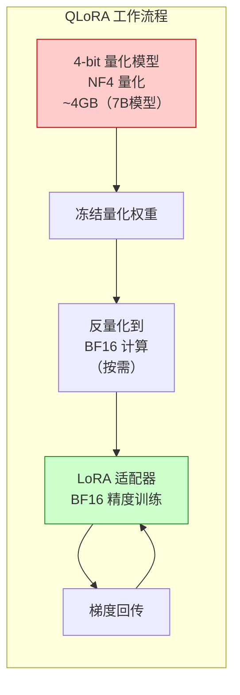

**QLoRA 关键技术**：

| 技术 | 说明 | 作用 |
|------|------|------|
| **4-bit NormalFloat (NF4)** | QLoRA 论文面向正态分布权重设计的 4-bit 数据类型 | 质量需按模型与任务回归 |
| **Double Quantization** | 对量化常数再次量化 | 减少量化常数的平均存储开销 |
| **Paged Optimizer** | 通过统一内存分页处理显存峰值 | 缓解长序列/小批次下的瞬时 OOM 风险 |

```python
# QLoRA 配置（只需修改模型加载部分）
from transformers import BitsAndBytesConfig

# 4-bit 量化配置
bnb_config = BitsAndBytesConfig(
    load_in_4bit=True,                           # 启用 4-bit 量化
    bnb_4bit_quant_type="nf4",                   # NF4 量化类型
    bnb_4bit_compute_dtype=torch.bfloat16,       # 计算时用 bf16
    bnb_4bit_use_double_quant=True,              # 二次量化
)

model = AutoModelForCausalLM.from_pretrained(
    model_name,
    quantization_config=bnb_config,  # 使用量化配置
    device_map="auto",
    trust_remote_code=True,
)

# 准备模型用于量化训练（必须！）
model = prepare_model_for_kbit_training(model)

# 然后正常应用 LoRA 配置
model = get_peft_model(model, lora_config)

# 训练参数相同
# 不给“7B=固定显存”结论：峰值还取决于具体架构、目标模块、rank、
# 序列长度、micro-batch、梯度累积、checkpointing、量化元数据和内核工作区。
# 在目标配置上记录 torch.cuda.max_memory_allocated() 与端到端训练吞吐。
```

### 16.2.4 LoRA 超参数调优指南

| 超参数 | 推荐值 | 影响 | 调优建议 |
|--------|--------|------|---------|
| **r (rank)** | 8-64 | 表达能力 | 简单任务 8-16，复杂任务 32-64 |
| **alpha** | 2r | 缩放强度 | 通常设为 2r，效果与 r 不匹配时调整 |
| **target_modules** | q/v_proj 或全部 | 训练范围 | 内存受限时只训 q/v_proj |
| **dropout** | 0.05-0.1 | 正则化 | 数据少时增大，数据多时减小 |
| **lr** | 1e-4 ~ 1e-3 | 学习速度 | QLoRA 可用更大 lr |
| **有效 batch** | 任务相关 | 梯度方差与吞吐 | 用 micro-batch + gradient accumulation 调整并做消融 |

## 16.3 对齐技术 ⭐⭐⭐⭐

### 16.3.1 对齐技术概述

对齐（Alignment）的目标是使模型行为符合**人类价值观和偏好**，核心方法是让模型学习"什么回答是人类更喜欢的"。

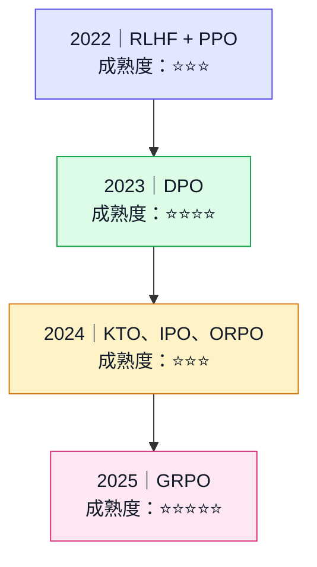

### 16.3.2 RLHF（基于人类反馈的强化学习）

RLHF 三阶段流程：

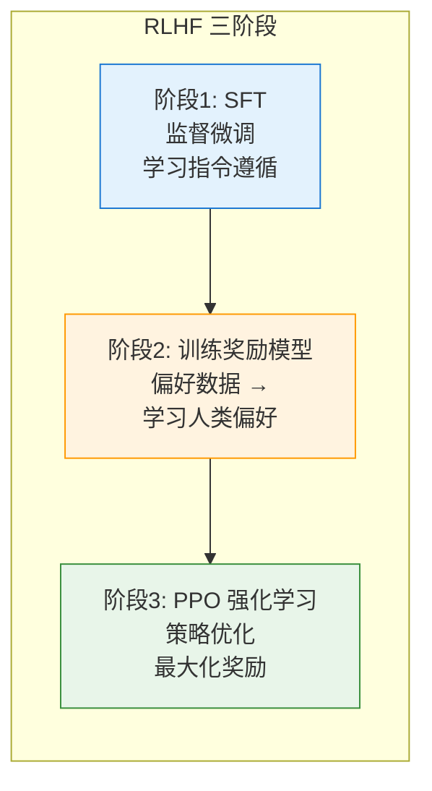

**阶段1：监督微调（Supervised Fine-Tuning, SFT）**

从预训练模型出发，使用经过筛选的人类示范数据（指令 $x$ 与目标回答 $y$）进行教师强制训练，
最小化目标回答 token 的负对数似然：

$$
\mathcal{L}_{SFT} = -\mathbb{E}_{(x,y) \sim D_{SFT}}
\left[\sum_{t=1}^{|y|}\log \pi_{\theta}(y_t \mid x, y_{<t})\right]
$$

- **训练产物**：得到初始策略 $\pi_{SFT}$，使模型掌握基本的指令遵循、回答格式与任务行为；
  这不等于已经学会全部人类偏好。
- **与后续阶段的关系**：经典 PPO-RLHF 通常用 $\pi_{SFT}$ 初始化待优化策略，并保留其冻结副本
  $\pi_{ref}$ 作为 KL 约束的参考策略；奖励模型是否复用同一初始化取决于具体实现。
- **实现边界**：常见训练器只对回答 token 计算损失并屏蔽 prompt token，但应以聊天模板、
  数据整理器和训练框架的实际掩码逻辑为准。

> 这里描述的是经典 InstructGPT 风格的 SFT → RM → PPO 流程，并非所有 RL 后训练都必须先做
> SFT；例如 R1-Zero 的公开路线从基础模型直接进入 RL。

**阶段2：奖励模型（Reward Model）**

收集偏好数据（同一问题的两个回答，标注哪个更好），训练评分模型：

$$
\mathcal{L}_{RM} = -\mathbb{E}_{(x, y_w, y_l) \sim D} \left[ \log \sigma \left( r(x, y_w) - r(x, y_l) \right) \right]
$$

其中 $y_w$ 是人类偏好的回答（win），$y_l$ 是不被偏好的回答（lose）。

**阶段3：PPO 强化学习**

$$
\mathcal{L}_{PPO} = \mathbb{E} \left[ \min \left( \rho_t \hat{A}_t, \text{clip}(\rho_t, 1-\epsilon, 1+\epsilon) \hat{A}_t \right) \right] - \beta \mathbb{KL}[\pi_\theta \| \pi_{ref}]
$$

**RLHF + PPO 的工程代价**：

- 典型链路包含 SFT 策略、奖励模型、参考策略和价值函数；它们可能共享基座、使用 adapter、
  预计算部分 logits，或在不同阶段加载，不能简单等同为固定数量的常驻完整模型。
- 在线采样、奖励尺度、KL 控制、价值函数拟合和批次构成都可能影响训练稳定性。
- 资源成本取决于模型是否共享/冻结、优化器状态、rollout 后端及 ZeRO/FSDP/PEFT 配置。

### 16.3.3 DPO（直接偏好优化）⭐⭐⭐⭐

DPO 的核心洞察：**不需要显式训练奖励模型**，直接用偏好数据优化策略：

$$
\mathcal{L}_{DPO} = -\mathbb{E}_{(x, y_w, y_l) \sim D} \left[ \log \sigma \left( \beta \log \frac{\pi_\theta(y_w|x)}{\pi_{ref}(y_w|x)} - \beta \log \frac{\pi_\theta(y_l|x)}{\pi_{ref}(y_l|x)} \right) \right]
$$

**DPO 与典型 PPO-RLHF 的结构差异**：

| 维度 | RLHF+PPO | DPO |
|------|----------|-----|
| **训练组件** | 策略、奖励信号、价值函数、参考约束等 | 可训练策略 + 参考策略/logits；不单独训练奖励模型 |
| **稳定性** | 对奖励、KL、采样与超参敏感 | 目标更接近监督学习，但仍依赖数据和 $\beta$ |
| **实现复杂度** | 高 | 低（类 SFT） |
| **训练成本** | 含在线 rollout 与奖励模型路径 | 通常链路更短；墙钟时间按同模型/数据/硬件实测 |

### 16.3.4 GRPO（Group Relative Policy Optimization）⭐⭐⭐⭐⭐

GRPO 由 DeepSeekMath（2024）提出，并用于 DeepSeek-R1 公开技术报告中的 RL 阶段。

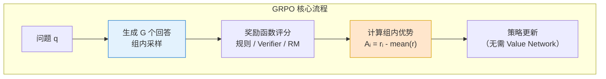

**GRPO vs PPO 的核心区别**：

| 维度 | PPO | GRPO |
|------|-----|------|
| **Value Network** | 需要独立的 Critic 网络估计优势 | ❌ 不需要 |
| **优势计算** | GAE（Generalized Advantage Estimation）| 组内相对奖励：$A_i = \frac{r_i - \text{mean}(r)}{\text{std}(r)}$ |
| **采样方式** | 单轨迹 | 每组采样 $G$ 个回答 |
| **组件** | 策略、Critic；常见实现还含参考/奖励模型 | 去掉 Critic；参考/奖励组件取决于目标与实现 |
| **稳定性因素** | Critic 拟合、GAE、奖励/KL 与采样 | 组大小、组内奖励方差、奖励尺度、clip/KL 与采样 |
| **代表模型** | InstructGPT | **DeepSeek-R1** |

**GRPO 的损失函数**：

$$
\mathcal{L}_{GRPO} = \mathbb{E}_{q \sim P(Q), \{o_i\}_{i=1}^G \sim \pi_{\theta_{old}}} \left[ \frac{1}{G} \sum_{i=1}^G \min \left( \rho_i A_i, \text{clip}(\rho_i) A_i \right) - \beta \mathbb{D}_{KL}[\pi_\theta \| \pi_{ref}] \right]
$$

其中 $A_i = \frac{r_i - \text{mean}(\{r_j\})}{\text{std}(\{r_j\})}$ 是组内归一化的优势函数。

**能确认与不能外推的结论**：

1. **能确认**：GRPO 用组内相对奖励估计优势，因此不训练独立 Critic / Value Model。
2. **资源影响**：去掉 Critic 可减少对应参数、梯度或优化器状态，但总显存和速度仍由
   rollout、参考/奖励模型、序列长度、优化器、并行和卸载方案决定。
3. **稳定性边界**：组内奖励无方差时优势退化；组大小、奖励缩放、长度偏差和采样分布
   都会改变训练行为。原论文实验结果不是“GRPO 在所有任务更稳定/更好”的证明。

原始证据：[DeepSeekMath](https://arxiv.org/abs/2402.03300) 与
[DeepSeek-R1 technical report](https://arxiv.org/abs/2501.12948)。

## 16.4 推理优化技术 ⭐⭐⭐⭐⭐

### 16.4.1 推理优化技术全景

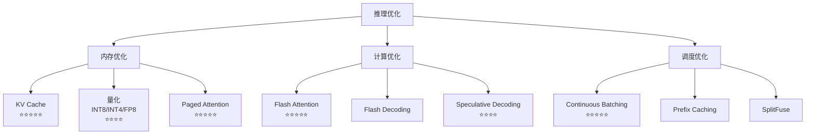

### 16.4.2 KV Cache ⭐⭐⭐⭐⭐

KV Cache 是自回归解码中减少重复键值计算的基础机制。

**核心原理**：Transformer 解码时，每一步都需要计算前面所有 token 的 Key 和 Value。这些 K/V 在自回归生成中**不会变化**，可以缓存复用。

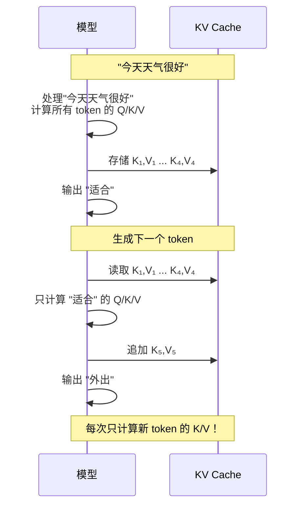

**KV Cache 显存估算**：

$$
M_{\mathrm{KV}}
= 2_{\mathrm{K,V}} \times B \times L \times H_{\mathrm{KV}}
\times T \times D_h \times s
$$

其中，$B$ 为批大小，$L$ 为层数，$H_{\mathrm{KV}}$ 为 KV 头数，$T$ 为已缓存 token 数，
$D_h$ 为每个头的维度，$s$ 为每个缓存元素的字节数。以 LLaMA-2-7B（bf16）为例：

- $B=1$、$L=32$、$H_{\mathrm{KV}}=32$、$T=4096$、$D_h=128$、$s=2$ 字节
- KV Cache = $2 \times 1 \times 32 \times 32 \times 4096 \times 128 \times 2$
  = 2,147,483,648 字节 = 2 GiB（约 2.15 GB）

> [!NOTE]
> GQA/MQA 模型必须代入实际的 KV 头数 $H_{\mathrm{KV}}$，不能直接使用查询头数
> $H_{\mathrm{Q}}$；其 KV Cache 相对 MHA 的比例约为 $H_{\mathrm{KV}}/H_{\mathrm{Q}}$。

```python
# KV Cache 在 PyTorch 中的概念实现
class KVCache:
    """KV Cache 简化实现"""
    
    def __init__(
        self,
        num_layers: int,
        batch_size: int,
        num_kv_heads: int,
        head_dim: int,
        max_seq_len: int,
    ):
        self.num_layers = num_layers
        # 预分配 [layers, 2(k/v), batch, kv_heads, max_seq, head_dim]
        self.cache = torch.zeros(
            num_layers, 2, batch_size, num_kv_heads, max_seq_len, head_dim,
            dtype=torch.bfloat16, device="cuda"
        )
        self.current_len = 0
    
    def get(self, layer_idx: int) -> tuple[torch.Tensor, torch.Tensor]:
        """获取指定层的 K/V（到当前长度）"""
        k = self.cache[layer_idx, 0, :, :, :self.current_len, :]
        v = self.cache[layer_idx, 1, :, :, :self.current_len, :]
        return k, v
    
    def update(self, layer_idx: int, new_k: torch.Tensor, new_v: torch.Tensor):
        """追加新的 K/V"""
        seq_len = new_k.shape[2]
        self.cache[layer_idx, 0, :, :, self.current_len:self.current_len+seq_len, :] = new_k
        self.cache[layer_idx, 1, :, :, self.current_len:self.current_len+seq_len, :] = new_v
    
    def increment(self, delta: int = 1):
        self.current_len += delta
```

### 16.4.3 Flash Attention ⭐⭐⭐⭐⭐

Flash Attention 通过**分块计算（Tiling）**和**IO 感知的注意力算法**，将 Attention 的显存复杂度从 $O(N^2)$ 降低到**线性**，同时避免了大矩阵的显存读写。

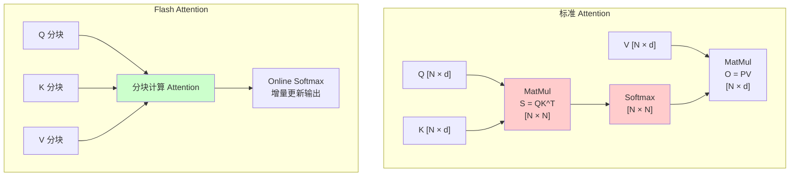

**Flash Attention 核心思想**：

标准 Attention 需要显式计算 $N \times N$ 的注意力矩阵：

$$\text{Attention}(Q, K, V) = \text{softmax}\left(\frac{QK^T}{\sqrt{d_k}}\right)V$$

Flash Attention 将 Q、K、V 分成小块，在 SRAM（高速缓存）中完成分块计算，避免将 $O(N^2)$ 的中间结果写入 HBM（显存）：

1. **分块（Tiling）**：将 Q、K、V 分成能在 SRAM 容纳的小块
2. **Online Softmax**：增量计算 softmax，无需存储完整的注意力矩阵
3. **重计算（Recomputation）**：反向传播时不保存注意力矩阵，重新分块计算

**效果**：

| 指标 | 标准 Attention | Flash Attention |
|------|--------------|-----------------|
| **显存** | $O(N^2)$ | $O(N)$ |
| **速度** | 大量 HBM 读写 | 常可更快；收益依序列、形状、GPU、精度与内核版本 |
| **最长序列** | 受显存限制 | 显著延长 |

```python
# Flash Attention 使用（PyTorch 2.0+ 原生支持）
import torch
import torch.nn.functional as F

# 方式1：PyTorch 原生 scaled_dot_product_attention（自动选择最优实现）
with torch.backends.cuda.sdp_kernel(
    enable_flash=True,      # 启用 Flash Attention
    enable_math=False,      # 禁用数学实现
    enable_mem_efficient=False
):
    output = F.scaled_dot_product_attention(Q, K, V, is_causal=True)

# 方式2：Flash Attention 2 库
from flash_attn import flash_attn_func
output = flash_attn_func(Q, K, V, causal=True)
```

### 16.4.4 Paged Attention ⭐⭐⭐⭐⭐

Paged Attention 借鉴操作系统的**虚拟内存分页机制**，解决 KV Cache 的**显存碎片化**和**共享低效**问题。

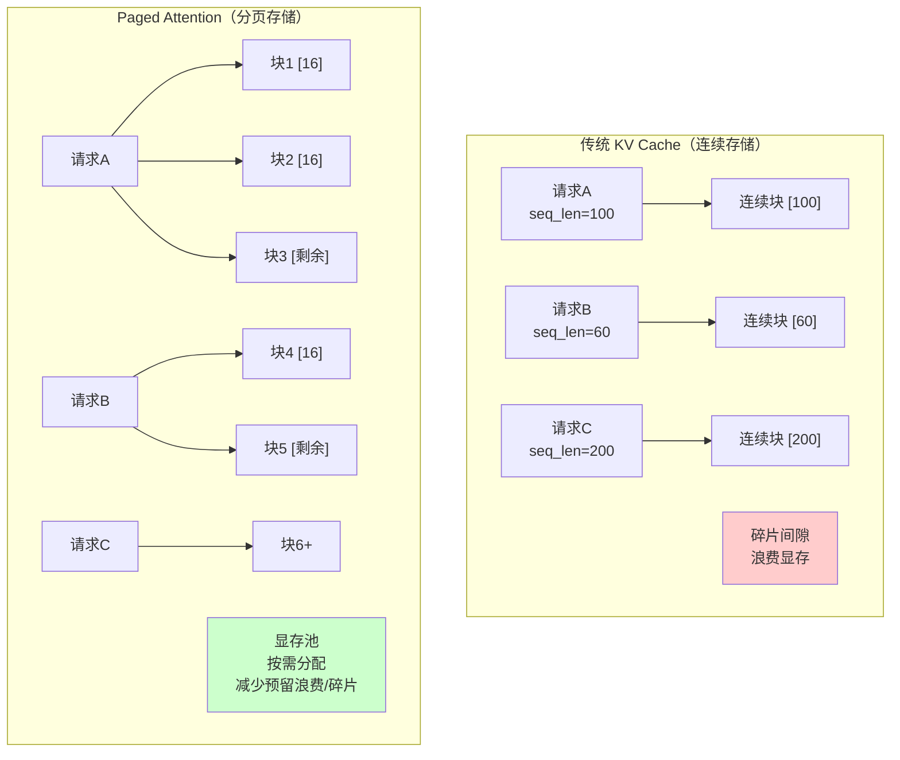

**Paged Attention 核心设计**：

| 概念 | 类比操作系统 | 作用 |
|------|-----------|------|
| **逻辑块（Logical Block）** | 虚拟地址空间 | 序列的连续逻辑分块 |
| **物理块（Physical Block）** | 物理内存页 | KV Cache 的固定大小存储单元；block size 由引擎/配置决定 |
| **块表（Block Table）** | 页表 | 逻辑块 → 物理块的映射 |
| **显存池（Memory Pool）** | 物理内存池 | 预分配的显存块池，按需分配 |

**Paged Attention 的优势**：
1. **减少预留浪费与碎片**：固定大小的物理块，按需分配；不能理解为完全“消除”
2. **高效共享**：启用兼容的前缀缓存后，共享前缀可复用物理块；命中率和显存收益取决于流量
3. **支持 Continuous Batching**：不同长度的请求可以灵活调度

### 16.4.5 Continuous Batching ⭐⭐⭐⭐⭐

传统 Batch 处理等所有序列完成后才释放资源，导致**GPU 空转**（某些短序列完成后，长序列还在继续）。

Continuous Batching（也称为 In-flight Batching 或 Iteration-level Batching）在**每个生成迭代**后动态调整 batch：

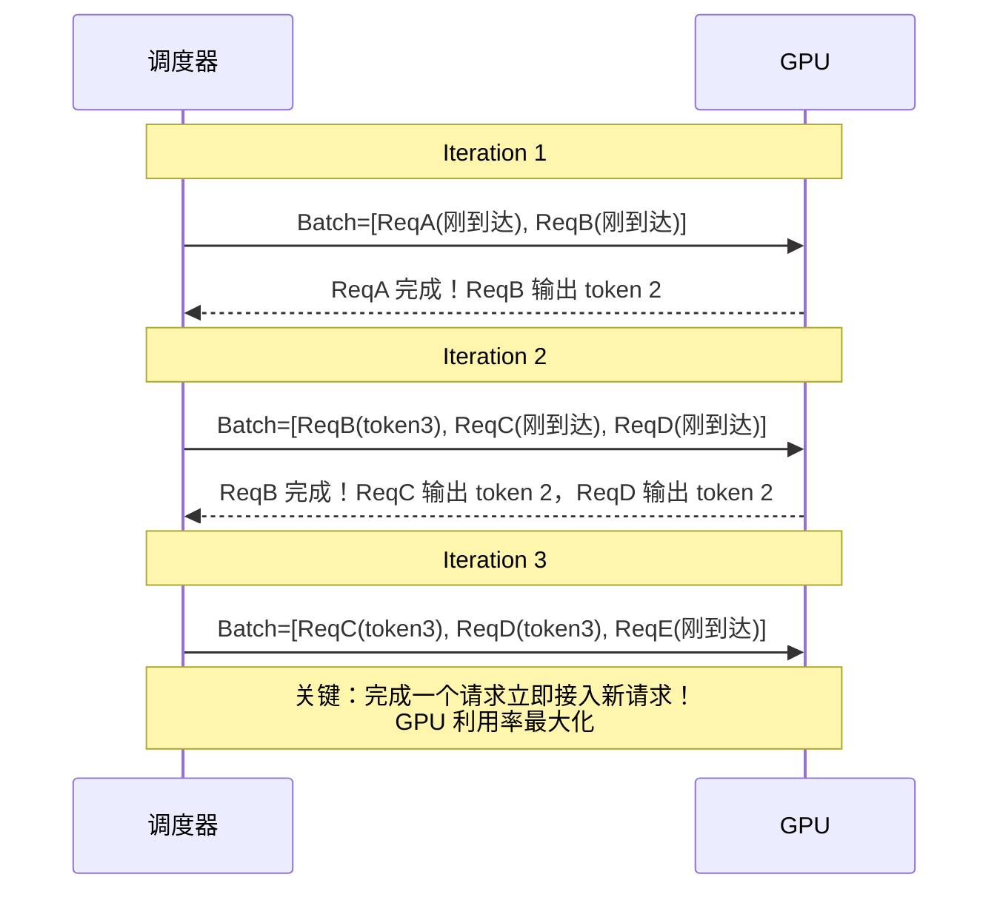

**收益边界**：Continuous Batching 通常能减少 padding 与队头阻塞，但吞吐、TTFT 和 P99
取决于模型、输入/输出长度、到达率、调度参数与硬件；必须在相同延迟 SLO 下对照压测。

### 16.4.6 Speculative Decoding（推测解码）⭐⭐⭐⭐

用一个**小模型（Draft Model）**快速生成候选序列，再用**大模型**并行验证，接受正确的部分。

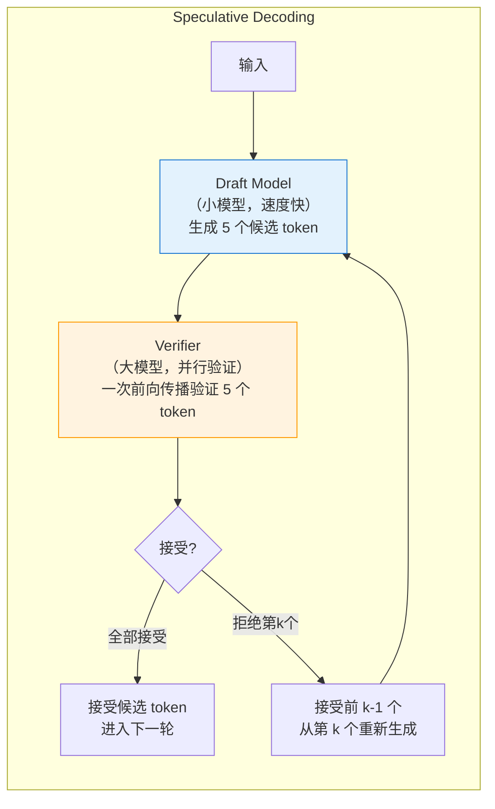

**加速原理**：Draft/proposer 先提出候选，Target 并行验证；算法保持目标分布，但工程收益由
接受率、proposer 成本、候选长度、采样参数、batch 与硬件共同决定，低接受率时可能没有收益。

**关键参数**：
- **Draft/proposer 选择**：可用小模型、n-gram、Medusa/EAGLE/MTP 等，需与引擎兼容
- **候选 token 数（gamma）**：越多不一定越快，需联合接受率调参
- **接受率**：必须从目标请求分布实测，不设跨模型通用阈值

## 16.5 模型量化与压缩 ⭐⭐⭐

### 16.5.1 量化技术概览

量化将模型权重从高精度（FP32/BF16）压缩到低精度（INT8/INT4），大幅降低显存占用。

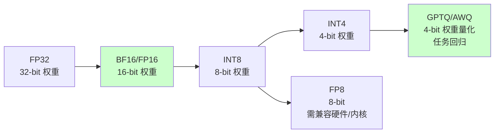

### 16.5.2 GPTQ vs AWQ vs GGUF

| 量化方法 | 类型 | 原理 | 优点 | 缺点 |
|----------|------|------|------|------|
| **GPTQ** | 后训练量化 | 逐层量化，最小化输出误差 | 通用性好，精度较高 | 量化速度慢 |
| **AWQ** | 后训练量化 | **激活感知**，保护显著权重通道 | 常见权重量化路线 | 效果依模型、校准集和实现 |
| **GGUF** | 文件格式 | llama.cpp 的量化格式 | 跨平台、CPU 友好 | 主要面向消费级 |
| **BitsAndBytes (NF4)** | 加载/训练时量化 | 4-bit NormalFloat | 使用方便，常见于 QLoRA | 与 GPTQ/AWQ 的质量不可脱离任务比较 |

**AWQ vs GPTQ 的核心区别**：

AWQ 的核心洞察是**并非所有权重量化后的损失都相同** —— 保护"对激活值影响更大"的权重，可以获得更好的精度。

```python
# AWQ 量化模型加载
from awq import AutoAWQForCausalLM
from transformers import AutoTokenizer

model = AutoAWQForCausalLM.from_quantized(
    "TheBloke/Llama-2-7B-AWQ",
    fuse_layers=True,           # 融合层，加速推理
    use_exllama=True,           # 使用 ExLlama 内核
)
tokenizer = AutoTokenizer.from_pretrained("TheBloke/Llama-2-7B-AWQ")

# GPTQ 量化模型加载（使用 AutoGPTQ）
from auto_gptq import AutoGPTQForCausalLM

model = AutoGPTQForCausalLM.from_quantized(
    "TheBloke/Llama-2-7B-GPTQ",
    device="cuda:0",
    use_triton=True,            # Triton 加速内核
)
```

## 16.6 模型部署 ⭐⭐⭐⭐

### 16.6.1 部署框架对比（2026年更新）

| 维度 | vLLM | TensorRT-LLM | llama.cpp | Xinference 🆕 |
|------|------|--------------|-----------|--------------|
| **定位** | **高吞吐服务** | **低延迟推理** | **跨平台本地部署** | **开源模型推理平台** |
| **GPU 支持** | ✅ CUDA/ROCm（以版本支持矩阵为准） | ✅ NVIDIA | ✅ CUDA/Vulkan/Metal | ✅ CUDA |
| **CPU 支持** | 不是主要目标 | 不是主要目标 | ✅ **核心优势** | ✅ |
| **量化** | AWQ/GPTQ/FP8 等 | FP8/INT8/INT4 等 | GGUF/Q4/Q5/Q8 | 取决于所选后端 |
| **关键特性** | PagedAttention + Continuous Batching | NVIDIA kernel 优化 | 消费级硬件友好 | 统一管理多模型 |
| **部署方式** | OpenAI-compatible API | Python/C++ runtime | 独立二进制/绑定 | REST API + Web UI |
| **适用场景** | **生产 GPU 集群** | **高性能 NVIDIA 环境** | **Mac/边缘设备/CPU** | **中小规模模型管理** |

> 版本号变化很快。表中能力按 **2026-07-31** 的公开文档归类；实施时应锁定依赖版本并核对对应 release notes。

### 16.6.2 vLLM 部署实战

```python
"""
vLLM 部署大模型服务 - 完整实战
"""
from vllm import LLM, SamplingParams
from fastapi import FastAPI, Request
from pydantic import BaseModel
import uvicorn

# ========== 方式1：脚本直接推理 ==========

def vllm_direct_inference():
    """直接使用 vLLM 推理"""
    
    # 加载模型（自动启用 PagedAttention + Continuous Batching）
    llm = LLM(
        model="Qwen/Qwen2.5-7B-Instruct",
        tensor_parallel_size=1,      # GPU 数量
        gpu_memory_utilization=0.85,  # GPU 显存利用率上限
        max_model_len=4096,           # 最大序列长度
        quantization=None,            # 或 "awq" / "gptq" / "fp8"
    )
    
    # 采样参数
    sampling_params = SamplingParams(
        temperature=0.7,
        top_p=0.9,
        max_tokens=512,
    )
    
    # 批量推理
    prompts = [
        "请用一句话介绍机器学习。",
        "什么是深度学习？",
        "Transformer 架构的核心思想是什么？",
    ]
    
    outputs = llm.generate(prompts, sampling_params)
    
    for prompt, output in zip(prompts, outputs):
        print(f"Prompt: {prompt}")
        print(f"Output: {output.outputs[0].text}")
        print()


# ========== 方式2：FastAPI 服务封装 ==========

app = FastAPI(title="LLM Inference Service")

# 全局模型（启动时加载）
llm_engine: LLM = None

class InferenceRequest(BaseModel):
    prompt: str
    temperature: float = 0.7
    top_p: float = 0.9
    max_tokens: int = 512

class InferenceResponse(BaseModel):
    text: str
    usage: dict

@app.on_event("startup")
def load_model():
    """服务启动时加载模型"""
    global llm_engine
    llm_engine = LLM(
        model="Qwen/Qwen2.5-7B-Instruct",
        tensor_parallel_size=1,
        gpu_memory_utilization=0.9,
        max_model_len=8192,
    )
    print("模型加载完成")

@app.post("/v1/chat/completions", response_model=InferenceResponse)
async def chat_completion(request: InferenceRequest):
    """兼容 OpenAI 格式的 Chat Completion API"""
    
    sampling_params = SamplingParams(
        temperature=request.temperature,
        top_p=request.top_p,
        max_tokens=request.max_tokens,
    )
    
    outputs = llm_engine.generate(request.prompt, sampling_params)
    generated_text = outputs[0].outputs[0].text
    
    # 统计 token 使用量
    input_tokens = len(outputs[0].prompt_token_ids)
    output_tokens = len(outputs[0].outputs[0].token_ids)
    
    return InferenceResponse(
        text=generated_text,
        usage={
            "prompt_tokens": input_tokens,
            "completion_tokens": output_tokens,
            "total_tokens": input_tokens + output_tokens,
        }
    )

@app.get("/health")
def health():
    return {"status": "healthy", "model_loaded": llm_engine is not None}


# ========== 方式3：Docker 容器化部署 ==========

"""
Dockerfile 示例：

FROM vllm/vllm-openai:latest

# 设置环境变量
ENV MODEL_NAME="Qwen/Qwen2.5-7B-Instruct"
ENV TENSOR_PARALLEL_SIZE=1

# 暴露端口
EXPOSE 8000

# 启动 OpenAI-compatible 服务
ENTRYPOINT python -m vllm.entrypoints.openai.api_server \
    --model ${MODEL_NAME} \
    --tensor-parallel-size ${TENSOR_PARALLEL_SIZE} \
    --gpu-memory-utilization 0.85 \
    --max-model-len 8192 \
    --port 8000

构建和运行：
docker build -t llm-service .
docker run --gpus all -p 8000:8000 -e MODEL_NAME="Qwen/Qwen2.5-7B-Instruct" llm-service

调用方式（OpenAI SDK 兼容）：
import openai
client = openai.OpenAI(base_url="http://localhost:8000/v1", api_key="dummy")
response = client.chat.completions.create(
    model="Qwen/Qwen2.5-7B-Instruct",
    messages=[{"role": "user", "content": "Hello!"}]
)
"""


if __name__ == "__main__":
    # 启动 FastAPI 服务
    uvicorn.run(app, host="0.0.0.0", port=8000)
```

### 16.6.3 Xinference 部署

Xinference 是 2025-2026 年崛起的**开源模型推理平台**，定位是"模型推理的 Kubernetes"——统一管理多种模型的部署、扩缩容和监控。

```python
"""
🆕 Xinference 部署示例 —— 2026年推荐的多模型管理方案
"""
# 安装: pip install xinference

# 启动 Xinference 服务
# xinference-local --host 0.0.0.0 --port 9997

from xinference.client import Client

client = Client("http://localhost:9997")

# 列出可用的内置模型
print(client.list_models())

# 部署模型（自动下载 + 启动推理服务）
model_uid = client.launch_model(
    model_name="qwen2.5-instruct",  # 模型名称
    model_size_in_billions=7,       # 7B 参数
    model_format="pytorch",         # 格式
    quantization="none",            # 不量化（或 "4-bit", "8-bit"）
    n_gpu=1,                        # GPU 数量
)

# 获取模型句柄，进行推理
model = client.get_model(model_uid)
response = model.chat(
    messages=[{"role": "user", "content": "你好！"}],
    generate_config={"temperature": 0.7, "max_tokens": 512}
)
print(response["choices"][0]["message"]["content"])

# 停止模型释放资源
client.terminate_model(model_uid)
```

**Xinference vs vLLM 直接部署**：

| 维度 | vLLM 直接部署 | Xinference |
|------|--------------|-----------|
| **模型管理** | 手动管理每个模型 | 统一管理，Web UI 操作 |
| **多模型** | 每个模型一个服务 | 一个平台管理多个模型 |
| **自动扩缩** | 需配合 K8s HPA | 内置自动扩缩容 |
| **适用规模** | 大规模生产 | **中小规模、快速迭代** |
| **上手难度** | 中（需配置） | 低（一键启动） |

### 16.6.4 DeepSeek 系列模型部署：选择公开可验证的后端

截至 **2026-07-31**，本节只保留 DeepSeek 官方组织可核验的公开模型与通用部署后端；原稿中无法由官方仓库、PyPI 和 release notes 复现的端侧引擎名及示例 API 已删除。教程、简历或生产方案都不应引用不可复现的产品/API。

DeepSeek-R1 Distill 等公开权重应使用模型卡给出的准确组织名（例如 `deepseek-ai/...`），再按目标硬件选择公开后端。吞吐必须注明模型文件、量化格式、上下文、batch、硬件和软件版本，不能给出脱离测试条件的固定 tokens/s。

**部署方案选择**：

| 场景 | 方案 | 模型 | 硬件 |
|------|------|------|------|
| **端侧（手机/IoT）** | MLC-LLM / ExecuTorch（先核对模型支持） | 小参数蒸馏或量化模型 | 手机 NPU / 嵌入式 |
| **个人 PC** | llama.cpp + GGUF | DeepSeek-R1-Distill-Qwen 系列 | 消费级 GPU / Apple Silicon / CPU |
| **边缘服务器** | vLLM + AWQ | DeepSeek-R1-Distill-14B/32B | A10 / L4 |
| **云端生产** | vLLM + TensorRT-LLM | DeepSeek-V3 / DeepSeek-R1 | A100 / H100 |

参考：[DeepSeek 官方 GitHub](https://github.com/deepseek-ai)、[DeepSeek-R1 模型仓库](https://github.com/deepseek-ai/DeepSeek-R1)。

### 16.6.5 部署架构最佳实践

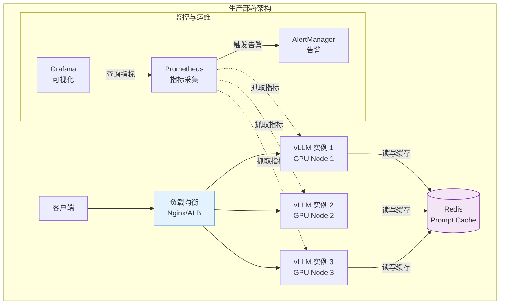

**生产部署关键考量**：

| 维度 | 建议 |
|------|------|
| **GPU 选型** | A100/H100 用于高吞吐，L4/A10 用于成本敏感场景 |
| **批处理** | 使用 vLLM 的 Continuous Batching，配合动态 batching 参数 |
| **负载均衡** | 按 token 数量路由（而非请求数），避免单节点过载 |
| **Prompt Cache** | 对 System Prompt 做前缀缓存，减少重复计算 |
| **自动扩缩容** | 基于 GPU 利用率和队列长度做 HPA |
| **优雅降级** | 队列满时返回 429，避免 OOM |

## 16.7 端云协同部署架构（2026年面试热点） ⭐⭐⭐⭐⭐

> **架构题**：端云协同是常见部署方案之一。面试时要能回答：**“何时值得引入端侧小模型，
> 端—边—云如何分工与验收？”**

### 16.7.1 端-边-云三层架构

一种常见但非必需的方案是**三层协同**：端侧（Device）→ 边缘（Edge）→ 云端（Cloud）。
是否需要边缘层取决于隐私、网络、SLO、运维和单位成本；简单系统不应为追求层级而增加复杂度。

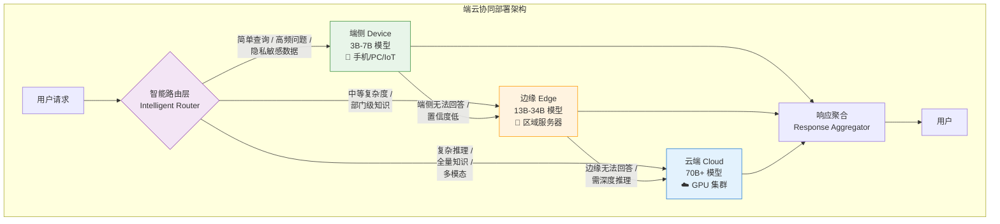

### 16.7.2 各层模型选型与定位

| 层级 | 示例规模 | 代表性开放权重 | 定位 | 验收口径 |
|------|---------|----------------|------|---------|
| **端侧** | 小模型/量化模型 | Qwen2.5、Phi、Gemma 等端侧规格 | 高频问答、隐私处理、离线使用 | 按目标设备测 P95 TTFT/TPOT、能耗和峰值内存 |
| **边缘** | 中等规模/任务模型 | Qwen2.5、R1 Distill 等可部署规格 | 部门级知识、中等推理 | 按并发与网络边界测端到端 P95/P99 |
| **云端** | 大模型或托管 API | 自托管开放权重或厂商当前 API | 复杂推理、全量知识、多模态 | 同时验收质量、延迟、吞吐、可用性与单请求成本 |

规模与层级只是架构示例，不是延迟保证。SLO 由产品场景定义，不能从参数量或部署位置直接推出。

**端侧模型选型关键**：
- **3B 级别**：适合纯文本问答、简单分类（如 Qwen2.5-3B-Instruct）
- **7B 级别**：通用对话、代码补全、文档摘要（如 Qwen2.5-7B-Instruct）
- **量化方案**：端侧通常使用 INT4/INT8 量化，配合 llama.cpp/mlc-llm 部署

### 16.7.3 动态调度策略（面试核心）

动态调度是端云协同的**核心难点**，常见策略：

**1. 基于置信度的路由**

```python
# 🆕 基于置信度的动态路由
class ConfidenceRouter:
    """
    基于模型置信度的动态调度路由
    
    策略：端侧先尝试，置信度低于阈值则上云
    """

    def __init__(
        self,
        device_model,      # 端侧 3B-7B 模型
        edge_model,        # 边缘 13B-34B 模型
        cloud_model,       # 云端 70B+ 模型
        device_threshold=0.8,   # 端侧置信度阈值
        edge_threshold=0.75,    # 边缘置信度阈值
    ):
        self.models = {
            "device": device_model,
            "edge": edge_model,
            "cloud": cloud_model,
        }
        self.thresholds = {
            "device": device_threshold,
            "edge": edge_threshold,
        }

    def route(self, query: str, context: dict = None) -> dict:
        """
        动态路由决策

        返回: {"tier": "device|edge|cloud", "confidence": float, "response": str}
        """
        # 策略1：隐私检查 - 敏感数据直接端侧处理
        if context and context.get("privacy_level") == "high":
            return self._execute("device", query)

        # 策略2：逐层尝试（Cascade）
        for tier in ["device", "edge"]:
            result = self._execute(tier, query)
            if result["confidence"] >= self.thresholds[tier]:
                return result

        # 策略3：云端兜底
        return self._execute("cloud", query)

    def _execute(self, tier: str, query: str) -> dict:
        """在指定层级执行推理"""
        model = self.models[tier]
        response = model.generate(query)

        # 计算置信度（基于输出 token 的平均概率）
        confidence = self._compute_confidence(response)

        return {
            "tier": tier,
            "confidence": confidence,
            "response": response.text,
            "latency_ms": response.latency_ms,
        }

    def _compute_confidence(self, response) -> float:
        """计算模型输出的置信度"""
        # 使用输出 token 的平均概率作为置信度
        if hasattr(response, 'token_probs'):
            return sum(response.token_probs) / len(response.token_probs)
        return 0.5  # 默认中等置信度
```

**2. 基于查询特征的路由**

```python
# 🆕 基于查询特征的智能路由
class FeatureRouter:
    """基于查询特征的规则路由 —— 适合特定业务场景"""

    def route(self, query: str, query_type: str = None) -> str:
        """根据查询特征选择部署层级"""

        # 自动分类（或使用独立分类器）
        if query_type is None:
            query_type = self._classify(query)

        # 路由规则
        routing_rules = {
            # 简单问答 → 端侧
            "greeting": "device",
            "faq": "device",
            "definition": "device",

            # 中等复杂度 → 边缘
            "code_generation": "edge",
            "document_summary": "edge",
            "sql_query": "edge",

            # 复杂推理 → 云端
            "multi_step_reasoning": "cloud",
            "math_proof": "cloud",
            "creative_writing": "cloud",
            "multi_modal": "cloud",

            # 隐私敏感 → 端侧
            "personal_data": "device",
            "medical_query": "device",
        }

        return routing_rules.get(query_type, "cloud")  # 默认云端

    def _classify(self, query: str) -> str:
        """查询分类（可用小模型或规则）"""
        # 简化实现：关键词匹配
        keywords = {
            "greeting": ["你好", "hello", "hi"],
            "math_proof": ["证明", "推导", "求解方程"],
            "code_generation": ["写代码", "function", "算法"],
        }
        for qtype, words in keywords.items():
            if any(w in query.lower() for w in words):
                return qtype
        return "general"
```

**3. 基于成本-延迟权衡的路由**

| 策略 | 原理 | 适用场景 | 缺点 |
|------|------|---------|------|
| **Cascade（级联）** | 端侧→边缘→云端逐层尝试 | 成本敏感 | 延迟累积 |
| **Prediction（预测）** | 用分类器预判查询复杂度 | 延迟敏感 | 需要训练分类器 |
| **Parallel（并行）** | 端侧和云端同时请求 | 极低延迟要求 | 成本翻倍 |
| **Hybrid（混合）** | 简单问题端侧，复杂问题上云 | 均衡方案 | 需要维护规则 |

### 16.7.4 端侧部署技术栈（2026年）


| 框架               | 适用平台           | 模型支持        | 特点                         |
| ---------------- | -------------- | ----------- | -------------------------- |
| **llama.cpp**    | 全平台（CPU/GPU）   | GGUF 格式     | 跨平台候选，量化与后端支持按版本核对     |
| **mlc-llm**      | 手机/iOS/Android | 多种          | 移动端候选，需核对模型与设备支持         |
| **ExecuTorch**   | iOS/Android    | PyTorch 模型  | Meta 出品，与 PyTorch 生态深度集成   |
| **TensorRT-LLM** | NVIDIA 边缘设备    | 以支持矩阵为准   | NVIDIA 栈候选，需实测构建与运行时兼容性 |


### 16.7.5 生产部署关键考量


1. **模型同步策略**
   - 端侧模型 OTA 更新（增量更新，减少流量）
   - 边缘模型热更新（不中断服务）
   - 云端模型 A/B 切换

2. **监控指标**
   - 各层级调用比例（device:edge:cloud = ?）
   - 端侧命中率（目标由质量、延迟、隐私和成本约束共同确定）
   - 平均延迟 P50/P95/P99
   - 推理成本分布

3. **降级策略**
   - 云端不可用时，自动降级到边缘
   - 边缘不可用时，端侧独立运行（有限功能）
   - 所有层级不可用时，返回缓存答案

## 16.8 推理时计算（Test-Time Compute） ⭐⭐⭐⭐⭐

> **2026年重要趋势**：Test-Time Compute（推理时计算 / 推理时扩展）成为部署架构的核心考量因素。
> 不同提供商暴露的参数并不统一，应按具体模型文档配置，不能自造一套“通用档位”。

### 16.8.1 什么是推理时计算

传统范式：模型能力只取决于**训练时的计算量**（模型大小 × 训练数据量）。

**Test-Time Compute 范式**：模型能力 = 训练计算 + **推理计算**（思考时间/采样次数）。

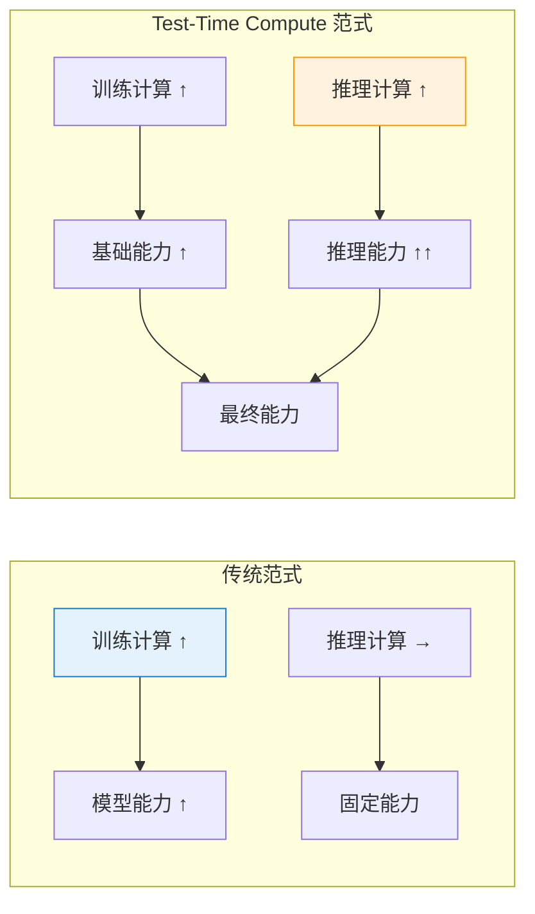

**核心洞察**：增加推理步骤、采样或验证预算，可能在不改变参数的情况下改善部分任务，但必须同时核算正确率、延迟、token 和计算成本。

### 16.8.2 推理时计算的技术手段

| 技术 | 原理 | 额外开销来源 | 如何验证效果 |
|------|------|------------|------------|
| **模型原生 reasoning effort** | 由 API 调节模型内部推理计算 | 推理 token、响应时间与费用可能增加 | 按档位比较任务成功率、token、P95 延迟与成本 |
| **Self-Consistency** | 多次采样后投票或聚合 | 多次模型调用，可串行或并行 | 比较单次采样与 N 路采样的净收益 |
| **Best-of-N Sampling** | 生成 N 个候选，用评分器选最优 | N 次生成 + 评分器调用 | 同时评估评分器偏差与端到端成功率 |
| **Tree of Thoughts** | 维护多个推理路径并搜索 | 分支数、深度与回溯次数 | 设停止条件，在目标任务集上消融 |
| **Multi-Agent Verification** | 由独立角色复核证据或结果 | Agent 调用、工具调用和同步开销 | 检查最终正确率是否覆盖额外成本 |

### 16.8.3 对部署架构的影响

Test-Time Compute 对部署架构提出了全新挑战：

下面以 **2026-07-31 官方模型指引中的 GPT-5.6** 为时点快照。`gpt-5.6` 是
`gpt-5.6-sol` 的别名；其 `reasoning.effort` 枚举为 `none`、`low`、`medium`（默认）、
`high`、`xhigh`、`max`。模型 ID 和枚举会演进，生产配置应由模型页/SDK schema 校验：

```python
from openai import AsyncOpenAI


class AdaptiveInferenceEngine:
    """示例路由器：路由规则必须由业务评测校准。"""

    EFFORT_BY_TASK = {
        "lookup": "none",
        "routine": "low",
        "analysis": "medium",
        "complex": "high",
        "critical": "max",
    }

    def __init__(self, client: AsyncOpenAI, model: str = "gpt-5.6"):
        self.client = client
        self.model = model

    async def generate(
        self,
        query: str,
        task_class: str = "routine",
        service_tier: str | None = None,
    ) -> dict:
        effort = self.EFFORT_BY_TASK[task_class]
        request_options = {}
        if service_tier is not None:
            request_options["service_tier"] = service_tier

        response = await self.client.responses.create(
            model=self.model,
            input=query,
            reasoning={"effort": effort},
            **request_options,
        )
        return {
            "answer": response.output_text,
            "reasoning_effort": effort,
            "usage": response.usage,
        }
```

这里的 `service_tier` 与 `reasoning.effort` 是两个独立维度：

| 维度 | 控制什么 | 官方示例 |
|------|----------|----------|
| `reasoning.effort` | 模型为一次回答投入多少推理计算 | GPT-5.6：`none` / `low` / `medium` / `high` / `xhigh` / `max` |
| 处理服务层级 | 请求的调度、时延与计价特征 | Standard（默认）、Fast（`service_tier="fast"`）、Flex（`service_tier="flex"`，仅支持的模型） |
| 推理模式 | 一次请求的执行方式 | GPT-5.6 的 Pro 是 `reasoning.mode="pro"`，不是独立 `-pro` 模型 slug；与 effort 独立 |

Fast mode（2026-07-30 由 Priority processing 更名）面向延迟敏感请求；Flex 面向可容忍更慢处理和
资源不可用风险的低优先级任务。二者都不会替你选择 reasoning effort，也不能保证某个固定毫秒延迟。

> 官方核验：[OpenAI 模型列表](https://developers.openai.com/api/docs/models)、
> [GPT-5.6 模型指引](https://developers.openai.com/api/docs/guides/latest-model)、
> [Fast mode](https://developers.openai.com/api/docs/guides/fast-mode) 与
> [Flex processing](https://developers.openai.com/api/docs/guides/flex-processing)。

### 16.8.4 Test-Time Compute 部署要点

**面试高频考点**：

1. **成本-质量权衡**
   - 以 `none` / `low` 作为延迟与成本基线，再逐档比较质量收益
   - `high` / `xhigh` 只在代表性任务上证明有净收益时启用
   - 模型、effort 和 service tier 分开做实验，不把效果归因混在一起

2. **Token 预算管理**
   - 监控输入、输出和可观测的 reasoning token，用产品预算设置限额与降级
   - 只使用模型页或 API schema 明确公开的预算与输出限制参数
   - 预算阈值来自线上分布和任务价值，不来自教程中的固定 token 数

3. **延迟管理**
   - 更高 effort、更多采样和更长输出都可能增加延迟，关系并非固定倍数
   - 分别记录排队、首 token、生成与工具调用耗时，并看 P50/P95/P99
   - 是否流式输出取决于模型支持；不要向用户暴露私有推理过程

4. **模型与服务边界**
   - GPT-5.6：六档 `reasoning.effort`；默认 `medium`
   - GPT-5.6 Pro mode：同一模型上的 `reasoning.mode="pro"`；与 effort 分开评估质量、延迟和用量
   - Standard / Fast / Flex：处理服务层级，不是推理强度等级；支持范围以当前模型页为准

## 16.9 RL Post-Training 专题 ⭐⭐⭐⭐⭐

> **证据口径**：本节以 DeepSeekMath、DeepSeek-R1 等公开论文/技术报告解释 RL
> post-training，不从闭源产品表现反推其未公开训练配方。框架和后端能力按
> **2026-07-31** 的官方文档快照描述，选型前仍需锁版本复核。

### 16.9.1 GRPO 深挖：去 Critic、组内相对优势、DeepSeek-R1 配方

**GRPO（Group Relative Policy Optimization）** 由 DeepSeekMath（2024）提出。它不训练
独立 Critic / Value Model，而是在同一 prompt 下采样一组回答，用组内奖励统计量构造相对优势。
这是结构差异；“质量更好、训练更稳、固定省多少资源”都不是由结构本身保证的结论。

#### 核心思想与公式

对每个 prompt $q$，从旧策略 $\pi_{\theta_{old}}$ 采样 $G$ 个回答 $\{o_1, \dots, o_G\}$，获得奖励 $\{r_1, \dots, r_G\}$。组内归一化后的优势为：

$$A_i = \frac{r_i - \text{mean}(r_1,\dots,r_G)}{\text{std}(r_1,\dots,r_G)}$$

下面是便于理解的 token-level 示意目标（带 clip 与参考策略 KL）；不同论文/框架版本在
归一化粒度、长度归一、KL 估计器和是否保留参考策略上可能不同：

$$\mathcal{L}_{\text{GRPO}}(\theta) = -\mathbb{E}_{q,\{o_i\}} \left[ \frac{1}{G}\sum_{i=1}^{G} \frac{1}{|o_i|}\sum_{t=1}^{|o_i|} \min\!\Big(\rho_{i,t} A_i, \text{clip}(\rho_{i,t}, 1-\epsilon, 1+\epsilon) A_i\Big) - \beta\, \mathbb{D}_{KL}(\pi_\theta \Vert \pi_{\text{ref}}) \right]$$

其中重要性采样比 $\rho_{i,t} = \frac{\pi_\theta(o_{i,t} \mid q, o_{i,<t})}{\pi_{\theta_{old}}(o_{i,t} \mid q, o_{i,<t})}$，$\beta$ 控制与参考策略的偏离。

#### 与 PPO 的差异

| 维度 | PPO | GRPO |
|------|-----|------|
| **价值模型 Critic** | 通常需要独立 Value Network | 不需要独立 Critic；节省量取决于其规模与分片/卸载 |
| **优势估计** | GAE + Value Bootstrap | 组内归一化（z-score） |
| **奖励来源** | Reward Model（学习而来） | 规则奖励 / Verifier / Reward Model 均可 |
| **训练稳定性** | 依赖 Critic 质量 | 依赖组大小 $G$ 与奖励方差 |
| **适用场景** | 通用 RLHF | 推理 / 数学 / 代码（可验证任务） |
| **显存/资源** | 策略、Critic、优化器及可能的参考/奖励模型 | 去掉 Critic，但参考/奖励模型是否常驻、ZeRO/FSDP/PEFT 和 optimizer state 仍决定总量 |

#### DeepSeek-R1 公开报告中的训练链路

- **R1-Zero 路线**：报告描述其从 DeepSeek-V3-Base 开始、未先做 SFT，直接进行大规模 RL；
  观察到自我验证、反思和更长推理等行为，同时也报告了可读性差、语言混杂等问题。
- **冷启动 → RL → 拒绝采样 → SFT → 二阶段 RL** 的 R1 完整流水线：
  1. 使用少量长 CoT 冷启动数据（公开报告未给出可完整复现的全部数据与超参数）
  2. 面向推理的 RL（可验证正确性、格式及语言一致性信号）
  3. 拒绝采样后结合非推理数据再做 SFT
  4. 第二阶段 RL 同时覆盖推理与通用偏好/安全目标
- **可复现边界**：技术报告公开了阶段和若干奖励设计，不等于公开了训练语料、采样器、
  超参数和基础设施的完整 recipe；教程不能把该链路写成适用于任意基座的保证。
- **蒸馏链路**：R1-Distill-Qwen / Llama 系列（详见 16.10.6）。

```python
# GRPO 教学目标（PyTorch 风格；完整可运行版见配套 12_grpo_loss.py）
import torch

def grpo_loss(log_probs, old_log_probs, ref_log_probs, rewards, group_size, beta=0.04, eps=0.2):
    # 前提：同一 prompt 的 group_size 条回答在 batch 中连续排列
    grouped = rewards.reshape(-1, group_size)
    advantages = (
        (grouped - grouped.mean(dim=1, keepdim=True))
        / grouped.std(dim=1, keepdim=True, unbiased=False).clamp_min(1e-4)
    ).reshape(-1)

    ratio = torch.exp(log_probs - old_log_probs)
    surr1 = ratio * advantages.unsqueeze(-1)
    surr2 = ratio.clamp(1 - eps, 1 + eps) * advantages.unsqueeze(-1)
    policy_loss = -torch.minimum(surr1, surr2).mean()

    # k3 KL 估计器；生产实现还要处理 response mask、分布式聚合与数值稳定性
    log_ratio = ref_log_probs - log_probs
    kl = (log_ratio.exp() - log_ratio - 1).mean()
    return policy_loss + beta * kl
```

### 16.9.2 RL Post-Training 框架全景

不要把“训练框架”和“rollout 后端”混成一个排行榜。常见栈由以下可替换组件组成：

| 层 | 官方可核验示例 | 选型时核对 |
|----|----------------|------------|
| 算法/Trainer | TRL 的 GRPO、RLOO、DPO、KTO 等 Trainer | stable/main 版本、loss 变体、数据格式、参考策略语义 |
| 参数高效训练 | PEFT LoRA/QLoRA | 目标模块、rank、量化与并行兼容性 |
| 分布式训练 | Accelerate/FSDP、DeepSpeed ZeRO | stage、参数/梯度/优化器分片、offload 与 checkpoint |
| Rollout/Serving | vLLM、SGLang 或训练框架内置引擎 | 模型兼容、权重同步、采样语义、吞吐、恢复与可观测性 |
| 编排 | verl 等专用 RL 框架或自研编排 | 同步/异步一致性、背压、失败重试、数据血缘 |

例如，TRL 当前 GRPO 文档分别提供 vLLM colocate 和 server 模式；两者在 GPU 隔离、
NCCL 风险、显存竞争和网络开销上不同，不能只凭后端名称判断优劣。DeepSpeed ZeRO
分别分片优化器状态、梯度和参数，仍需按 stage 与 offload 配置核算资源。

**典型组件关系**：

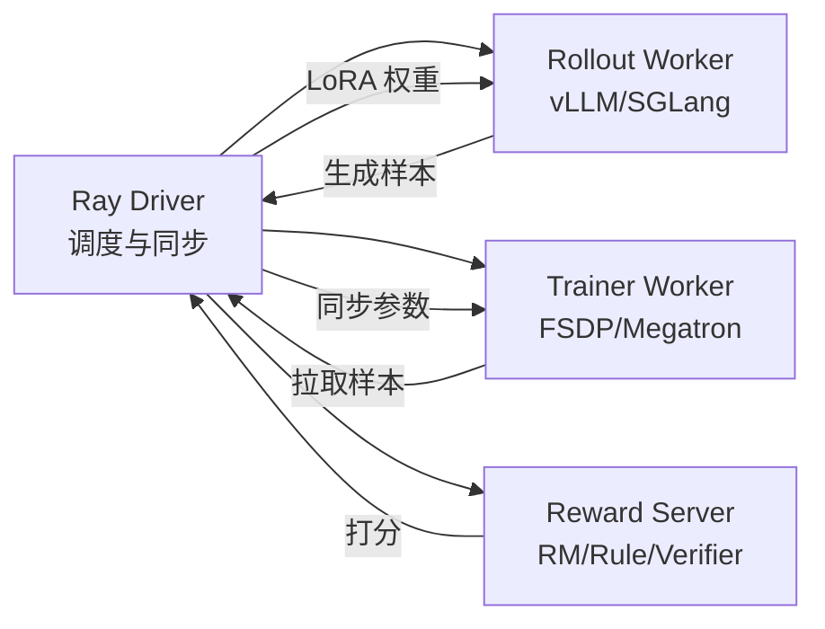

关键点：训练与 rollout 可以共置或分离；权重同步方式、暂停时间和一致性语义取决于
框架/后端版本，必须通过版本化集成测试确认。奖励可混合规则、Verifier 与 Reward Model。

官方入口：[TRL GRPO](https://huggingface.co/docs/trl/grpo_trainer)、
[PEFT LoRA](https://huggingface.co/docs/peft/en/package_reference/lora)、
[DeepSpeed ZeRO](https://deepspeed.readthedocs.io/en/latest/zero3.html) 和
[vLLM 功能兼容矩阵](https://docs.vllm.ai/en/stable/features/)。

### 16.9.3 SGLang 作为 Rollout 后端

SGLang 是可用于 rollout 的 serving 后端之一。RadixAttention、连续批处理、结构化输出、
工具调用和 LoRA 能力是否可用，要同时核对 SGLang 版本、模型、attention backend 与启动参数。
前缀缓存只有在请求确实共享前缀时才可能产生收益；adapter 加载也不等于异步训练自动实现了
原子权重切换和零停机。

以下命令只演示“启动服务 + 用官方 benchmark 客户端压测”的可复核路径，不伪造易漂移的
进程内 `Engine.load_lora()` API：

```bash
python -m sglang.launch_server \
  --model-path Qwen/Qwen2.5-7B-Instruct \
  --port 30000

python -m sglang.bench_serving \
  --backend sglang-oai-chat \
  --base-url http://127.0.0.1:30000 \
  --model Qwen/Qwen2.5-7B-Instruct \
  --dataset-name random \
  --num-prompts 256 \
  --max-concurrency 32
```

压测至少记录成功率、request/input/output token throughput、TTFT、TPOT/ITL 和 E2E P95/P99；
再用同一模型、采样参数、输入/输出长度分布和并发与 vLLM 或框架内置后端对照。

**Rollout 后端验收表**：

| 维度 | 必答问题 |
|------|----------|
| 模型与采样 | 目标模型、量化、reasoning parser、logprobs 与采样参数是否兼容？ |
| 权重同步 | 全量/adapter 如何更新？请求看到哪个版本？失败后能否回滚？ |
| 结构化与工具 | 约束解码/工具调用语义是否满足环境协议？ |
| 性能 | 同一流量下 TTFT、TPOT、吞吐、显存和失败率如何？ |
| 运维 | 背压、超时、重试、指标、trace、故障恢复是否完整？ |

官方入口：[SGLang Benchmark Serving](https://docs.sglang.ai/developer_guide/bench_serving)。

### 16.9.4 RLVR：RL with Verifiable Rewards

**RLVR**（RL with Verifiable Rewards，可验证奖励的强化学习）通常指把可程序化检查的
任务结果作为 RL 奖励。它描述的是**奖励来源**，不是某个唯一算法；可与 GRPO、RLOO 等
策略优化方法组合，也可再混合 Reward Model 或人工反馈。

- **数学题**：最终答案与标准答案匹配（符号/数值）
- **代码题**：单元测试通过率
- **形式化证明**：Lean / Coq kernel-check
- **结构约束**：JSON schema 验证、字符串匹配（只能证明格式/局部规则满足）
- **指令博弈**：可计算的胜负判定

**优势与风险**：

1. 在可判定任务上，verifier 可以减少逐样本人类偏好标注，并提供可重复的结果级信号。
2. 奖励并非“几乎无噪声”：标准答案、解析器、单元测试和沙箱都可能有缺陷、覆盖不足、
   假阴性/假阳性或被策略钻空子；二元结果奖励还可能稀疏。
3. 结果 verifier 不自动证明中间推理正确或可泛化。可结合过程监督、独立测试集、
   对抗样例和人工抽检，但这些也各有误差。

**RLVR 与传统 RLHF 对比**：

| 维度 | RLHF | RLVR |
|------|------|------|
| **奖励来源** | Reward Model（学习） | 规则 / Verifier（程序） |
| **主要误差** | 标注偏差、RM 泛化/过优化 | verifier 规格/实现错误、覆盖不足、reward hacking |
| **成本结构** | 人类偏好采集 + RM 训练/维护 | 规格、测试、沙箱与 verifier 工程；不一定更低 |
| **适用任务** | 通用对话、风格 | 数学、代码、形式化推理 |
| **可泛化性** | 强 | 受限于 verifier 覆盖 |
| **公开证据示例** | InstructGPT 等公开 RLHF 工作 | DeepSeek-R1 报告中的规则奖励路径 |

> 不能从闭源模型的输出风格反推它是否或如何使用 RLVR。DeepSeek-R1 的技术报告是这里
> 可引用的公开训练证据；其结果也只支持报告中的模型、数据、奖励和评测设置。

**Verifier 编写示例**（数学题）：

```python
# 简化版 math_verifier：检查模型最终答案是否在 \boxed{} 中且等于标准答案
import re

def math_reward(model_output: str, ground_truth: str) -> float:
    # 1) 提取 \boxed{...} 中的答案
    match = re.search(r"\\boxed\{([^{}]+)\}", model_output)
    if not match:
        return 0.0
    pred = match.group(1).strip()
    # 2) 简单字符串等价 + 数值等价
    if pred == ground_truth.strip():
        return 1.0
    try:
        if abs(float(pred) - float(ground_truth)) < 1e-6:
            return 1.0
    except ValueError:
        pass
    return 0.0

# 复合奖励：准确性 + 格式
def composite_reward(model_output, gt, fmt_ok):
    return math_reward(model_output, gt) + 0.1 * float(fmt_ok)
```

### 16.9.5 RLOO 与直接偏好优化方法

RLOO 是在线 REINFORCE 风格算法；IPO、ORPO、CPO、KTO 属于离线偏好/反馈优化方法。
把它们统称为“五大无 Critic 算法”会掩盖数据来源和参考策略语义的差异。

#### 方法边界

| 方法 | 训练信号 | 在线采样 | Critic | 参考策略/基线 | 论文能支持的窄结论 |
|------|----------|----------|--------|---------------|--------------------|
| **RLOO** | 在线标量奖励 | 是 | 不需要 | 通常用参考策略做 KL 约束 | leave-one-out baseline 可替代 Critic；具体收益限于论文设置 |
| **IPO** | 成对偏好 | 否 | 不需要 | 需要 | $\Psi$PO 的 identity 特例；不能泛化为“必然防过拟合/收敛更快” |
| **ORPO** | chosen/rejected + chosen NLL | 否 | 不需要 | 不需要 | reference-free，把 SFT NLL 与 odds-ratio 偏好项联合优化 |
| **CPO** | 成对偏好 + chosen NLL | 否 | 不需要 | 不需要 | 原论文聚焦机器翻译；不能外推为通用 DPO 稳定性修复 |
| **KTO** | 单条输出的 desirable/undesirable 标签 | 否 | 不需要 | 目标中使用参考策略 | 不要求同一 prompt 的成对偏好；论文也明确不存在普适最优 HALO |

`reference-free` 只是目标函数属性，不等于固定节省 50% 显存。DPO 可预计算参考 logits、
用 adapter 切换或分片；ORPO/CPO 也仍有可训练参数、优化器、激活、长序列和并行通信开销。

#### 选型时先看信号和验收，不背“唯一推荐”

| 已有条件 | 候选 | 必做对照 |
|----------|------|----------|
| 能在线生成并获得标量奖励 | RLOO、GRPO 等在线方法 | on-policy 程度、采样成本、KL、reward hacking、失败恢复 |
| 有成对偏好数据 | DPO、IPO、ORPO、CPO 等 | 同一基座/数据预算下的质量、长度偏差、稳定性和峰值显存 |
| 只有逐条好/坏标签 | KTO、BCO 等 pointwise 方法 | 类别不平衡、参考点估计、校准和域外泛化 |
| 显存紧张 | PEFT、量化、预计算 reference logits、ZeRO/FSDP/offload | 先测峰值显存/吞吐，再判断算法目标是否值得改变 |

```python
# ORPO 损失核心（序列级示意；不传 reference logits）
import torch, torch.nn.functional as F

def log_odds(sequence_logp):
    p = sequence_logp.exp().clamp(max=1 - 1e-7)
    return sequence_logp - torch.log1p(-p)

def orpo_loss(chosen_logp, rejected_logp, chosen_nll, lam=0.1):
    log_odds_ratio = log_odds(chosen_logp) - log_odds(rejected_logp)
    preference_loss = -F.logsigmoid(log_odds_ratio).mean()
    return chosen_nll + lam * preference_loss
```

配套 `gpu/15_orpo_loss.py` 演示可微目标；生产实现还要正确处理 prompt/response mask、
不同 completion 长度、分布式聚合与数值稳定性。TRL 当前把 ORPO/CPO 放在 experimental
命名空间，升级前应检查版本迁移说明。

原始论文：[RLOO](https://arxiv.org/abs/2402.14740)、
[IPO](https://arxiv.org/abs/2310.12036)、[ORPO](https://arxiv.org/abs/2403.07691)、
[CPO](https://arxiv.org/abs/2401.08417)、[KTO](https://arxiv.org/abs/2402.01306)。

### 16.9.6 Reasoning Model 训练：R1-Distill-Qwen 与 CoT Faithfulness

#### R1-Distill 系列：只按公开 benchmark 口径下结论

DeepSeek-R1 报告使用约 800K 条由 R1 生成并筛选的样本微调多个 Qwen/Llama 基座。
下表是报告/官方模型仓库发布的 **AIME 2024 pass@1 / MATH-500 pass@1**，不是“通用
推理能力迁移率”：

| 模型 | 官方列出的基座 | 公开结果：AIME 2024 / MATH-500 pass@1 |
|------|----------------|------------------------------------------|
| DeepSeek-R1-Distill-Qwen-1.5B | Qwen2.5-Math-1.5B | 28.9 / 83.9 |
| DeepSeek-R1-Distill-Qwen-7B | Qwen2.5-Math-7B | 55.5 / 92.8 |
| DeepSeek-R1-Distill-Llama-8B | Llama-3.1-8B | 50.4 / 89.1 |
| DeepSeek-R1-Distill-Qwen-14B | Qwen2.5-14B | 69.7 / 93.9 |
| DeepSeek-R1-Distill-Qwen-32B | Qwen2.5-32B | 72.6 / 94.3 |
| DeepSeek-R1-Distill-Llama-70B | Llama-3.3-70B-Instruct | 70.0 / 94.5 |

官方仓库说明：最大生成长度为 32,768 tokens；需要采样的 benchmark 使用 temperature
0.6、top-p 0.95，并为每题生成 64 个回答来估计 pass@1。复测还需锁定 prompt、
答案解析器、数据版本和随机种子。

**可支持的结论**：这些学生模型在上述设置下获得了较强的数学 benchmark 表现。
**不能支持的结论**：推理能力“几乎完全迁移”、对所有领域接近 671B R1，或生成的
CoT 必然忠实。模型规模、基座、数据筛选和目标任务都会影响结果。

数据来源：[DeepSeek-R1 官方仓库的 Distilled Model Evaluation](https://github.com/deepseek-ai/DeepSeek-R1#deepseek-r1-evaluation)。

#### CoT Faithfulness（思维链忠实性）

模型输出的 CoT 是可观察文本，不是其内部计算过程的完整证明。不要把“答案正确”、
“解释听起来合理”和“每一步对答案有因果贡献”混为一谈。

工程上可以提高**可验证性**，但不要承诺“忠实性已解决”：

1. 对可形式化步骤使用计算器、Python、单元测试或证明内核复核。
2. 用独立样本检查中间步骤、最终答案和引用证据，而不是让同一模型自证。
3. 对过程奖励模型和 LLM judge 做人工校准、对抗测试和跨模型一致性分析。
4. 将面向用户的解释与内部/隐藏 reasoning token 分开；不要求或展示供应商未公开的私有推理过程。

#### 工程决策路径（不是“2026 统一 Recipe”）

```text
Gate 0  定义任务集、质量/安全/成本指标，先做未微调基线
Gate 1  数据与许可通过后，用 SFT/PEFT 验证是否已满足需求
Gate 2  仅在奖励可审计且在线采样有净收益时引入 GRPO/RLOO 等 RL
Gate 3  偏好、通用能力与安全分别回归，防止局部 benchmark 优化掩盖退化
Gate 4  蒸馏需验证学生模型相对自身基线的增益、域外泛化和数据来源
Gate 5  以可回滚 checkpoint、独立评测和在线小流量实验决定是否发布
```

DeepSeek-R1 的公开多阶段流水线是一个重要案例，不是所有基座、任务和预算的默认答案。
TRL、PEFT、vLLM/SGLang、DeepSpeed 也只是实现组件；组合前必须按所锁版本验证兼容性。

**2026 面试高频追问**：

1. R1-Zero 跳过 SFT 说明了什么？——只说明该报告的基座与训练设置中，RL 可诱发若干
   推理行为；报告同时记录可读性和语言混杂问题，不能外推到任意模型。
2. GRPO 必须用规则奖励吗？——不必须；规则、verifier 和 Reward Model 都可用或混合，
   但各自存在覆盖、偏差、尺度和 reward hacking 风险。
3. “671B 蒸馏到 1.5B”准确吗？——它是用 R1 生成数据微调 1.5B 基座，不是参数逐层迁移；
   28.9 是官方 AIME 2024 pass@1 结果，不能代表全能力保留比例。
4. 蒸馏、SFT 和 RL 谁性价比最高？——没有跨任务答案；先统一数据、计算预算和评测口径，
   用增量实验比较质量、峰值显存、吞吐、稳定性和域外退化。

### 16.9.7 章节速记卡

| 主题 | 一句话总结 |
|------|----------|
| GRPO | 去独立 Critic、用组内奖励构造优势；资源与稳定性仍需实测 |
| 训练/rollout 栈 | Trainer、PEFT、分布式训练和 serving 后端分层选型并锁版本 |
| SGLang / vLLM | 都是候选 rollout 后端；用同一流量和 SLO 做兼容性、性能与恢复测试 |
| RLVR | verifier 提供可重复信号，但仍有规格错误、覆盖不足和 reward hacking |
| 偏好/反馈方法 | 先区分在线奖励、成对偏好和 pointwise 标签，再做同口径实验 |
| Reasoning 蒸馏 | 公开 benchmark 显示学生模型可获益，不等于全能力或 CoT 忠实性完全迁移 |

## 🧭 本章小结

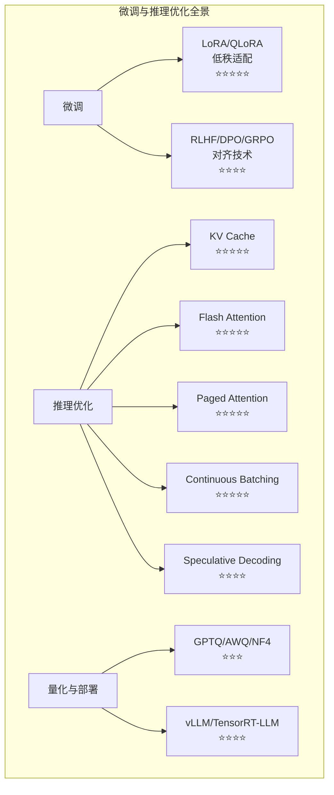

| 知识点 | 面试频率 | 关键要点 |
|--------|---------|---------|
| 全量微调 vs PEFT | ⭐⭐⭐⭐ | 参数效率、成本对比 |
| LoRA 原理 | ⭐⭐⭐⭐⭐ | 低秩分解 W = W₀ + BA |
| QLoRA | ⭐⭐⭐⭐⭐ | 4-bit 量化 + 分页优化器 |
| RLHF 三阶段 | ⭐⭐⭐⭐ | SFT → RM → PPO |
| DPO 原理 | ⭐⭐⭐⭐ | 无需 RM，直接偏好优化 |
| GRPO | ⭐⭐⭐⭐⭐ | 去 Critic，组内相对奖励 |
| KV Cache | ⭐⭐⭐⭐⭐ | 缓存 K/V，避免重复计算 |
| Flash Attention | ⭐⭐⭐⭐⭐ | 分块计算，IO 感知 |
| Paged Attention | ⭐⭐⭐⭐⭐ | 虚拟内存分页机制 |
| Continuous Batching | ⭐⭐⭐⭐⭐ | 迭代级动态调度 |
| 量化技术对比 | ⭐⭐⭐ | GPTQ/AWQ/GGUF/NF4 |
| vLLM 部署 | ⭐⭐⭐⭐ | PagedAttention + CB |

本章给出的是核心知识框架，不承诺覆盖某个固定比例的面试题。应以目标 JD、当前官方文档、
可复现实验记录和真实项目证据继续补充。

### 2026年新增重点

| 知识点 | 面试频率 | 关键要点 |
|--------|---------|---------|
| **端云协同架构** | ⭐⭐⭐⭐⭐ | 端3B-7B / 边13B-34B / 云70B+ 三层分工 |
| **动态调度策略** | ⭐⭐⭐⭐⭐ | Cascade / Prediction / Hybrid 路由 |
| **端侧部署技术栈** | ⭐⭐⭐⭐ | llama.cpp / MLC-LLM / ExecuTorch；按模型与硬件核对支持矩阵 |
| **Test-Time Compute** | ⭐⭐⭐⭐⭐ | 推理时计算 = 模型能力新维度 |
| **推理时计算控制** | ⭐⭐⭐⭐ | 使用模型官方 effort 枚举；与 Standard / Fast / Flex 服务层级分开评测 |
| **vLLM 当前重点** | ⭐⭐⭐⭐ | V1 scheduler、Automatic Prefix Caching、量化/硬件兼容矩阵、实验性 disaggregated prefilling |
| **DeepSeek 部署优化** | ⭐⭐⭐⭐ | 官方权重 + 公开后端；性能结论必须附测试条件 |
| **Xinference** | ⭐⭐⭐ | 开源模型推理平台，统一管理多模型 |
| **Python 3.14** | ⭐⭐ | 已发布稳定版；先核对 PyTorch/CUDA/推理框架支持矩阵，不把解释器升级等同于模型加速 |

## ✅ 自测与练习

先合上正文，再回答以下问题；无法说明证据或边界时，回到对应小节复习。

1. 你能否比较 SFT、偏好优化和参数高效微调方法？
2. 你能否估算训练、权重和 KV Cache 的资源需求？
3. 你能否根据质量、成本和硬件选择优化与部署方案？

## 🧪 配套代码与验收

本章同时包含纯算法示例和依赖 CUDA、模型权重、PEFT/bitsandbytes 或 vLLM 的条件性示例。
默认 GPU runner 会传入 `--mock`：纯本地安全示例可运行，真实加载/训练/服务脚本应明确
`[SKIP]`。默认离线通过不代表 LoRA/QLoRA 训练或 vLLM 服务已在本机验收。

```bash
# 默认安全验收：不加载模型、不启动服务
cd code
python scripts/run_all_examples.py --tier gpu --chapter ch16

# 真实 GPU 条件满足后才逐个启用；先确认脚本、模型许可、显存与输出目录
python scripts/run_all_examples.py --tier gpu --chapter ch16 --real-gpu
```

真实 GPU 路径不会承诺按显存大小自动“降级成已通过”；依赖或资源不足应清楚地失败/跳过，并在
目标模型、序列长度、batch 和 GPU 上单独记录峰值显存、吞吐、质量与产物。

## 🎯 面试题精讲

### 高频题1：LoRA 的原理是什么？为什么只训练少量参数就能有效？

**参考答案**：

LoRA（Low-Rank Adaptation）的核心洞察是：**模型权重的更新矩阵 $\Delta W$ 是低秩的**。

预训练权重 $W_0 \in \mathbb{R}^{d \times k}$ 保持不变，引入低秩分解 $W = W_0 + BA$，其中 $B \in \mathbb{R}^{d \times r}$，$A \in \mathbb{R}^{r \times k}$，$r \ll \min(d, k)$。

有效的原因：
1. **预训练模型已具备通用知识**，微调只需要"轻推"到特定方向
2. **低秩假设成立**：实际任务的有效更新确实集中在低维子空间
3. **冻结原参数避免灾难性遗忘**

参数量：原始 $d \times k$ → LoRA $(d + k) \times r$，当 $r=16, d=k=4096$ 时，仅需 **0.8%** 的参数。

---

### 高频题2：QLoRA 和 LoRA 的区别？

**参考答案**：

QLoRA = **4-bit 量化 + LoRA + 分页优化器**。

核心区别：
1. QLoRA 用 4-bit NF4 量化存储基础模型权重（LoRA 用 16-bit）
2. 计算时反量化为 bf16，但 LoRA 参数始终保持 bf16
3. 引入分页优化器（Paged Optimizer），利用 CPU 内存做 offload 防止 OOM

效果：**单张 24GB 消费级 GPU 可微调 7B/13B 模型**，而 LoRA 通常需要 40GB+。

---

### 高频题3：KV Cache 的作用和显存估算？

**参考答案**：

KV Cache 缓存 Transformer 解码过程中每个 token 的 Key 和 Value 向量，避免重复计算。

显存公式：

$$
M_{\mathrm{KV}}
= 2_{\mathrm{K,V}} \times B \times L \times H_{\mathrm{KV}}
\times T \times D_h \times s
$$

以 LLaMA-2-7B、bf16、batch=1、seq_len=4096 为例：
$2 \times 1 \times 32 \times 32 \times 4096 \times 128 \times 2 = 2\ \mathrm{GiB}$。

**优化方向**：MQA/GQA（多查询/分组查询注意力）通过减少 KV 头数降低缓存；其他条件相同时，
缓存比例约为 $H_{\mathrm{KV}}/H_{\mathrm{Q}}$，应按模型配置计算，不能背固定的缩减倍数。

---

### 高频题4：Flash Attention 的原理？

**参考答案**：

Flash Attention 的核心是**分块计算（Tiling）+ IO 感知**：

1. **问题**：标准 Attention 需要显式存储 $N \times N$ 的注意力矩阵，HBM 读写成为瓶颈
2. **解决**：将 Q、K、V 分成能在 GPU SRAM（高速缓存）容纳的小块，在 SRAM 中完成分块 Attention 计算
3. **Online Softmax**：增量计算 softmax，避免存储完整注意力矩阵
4. **效果边界**：避免物化完整注意力矩阵，I/O 与显存复杂度改善；速度取决于序列长度、
   dtype、GPU、kernel、mask 和 batch，不能背固定倍数

---

### 高频题5：Paged Attention 解决了什么问题？

**参考答案**：

Paged Attention 借鉴操作系统虚拟内存分页机制，解决三个问题：

1. **显存碎片**：传统方式为每个请求预分配连续显存，导致内部和外部碎片；Paged Attention 用固定大小的块按需分配
2. **共享低效**：多个请求共享相同前缀（如 System Prompt）时，Paged Attention 通过块共享避免重复存储
3. **调度限制**：配合 Continuous Batching，实现请求的动态插入和退出

收益需要用相同模型、流量、block 配置和 SLO 实测；PagedAttention 减少浪费，但不承诺
跨场景固定显存利用率。

---

### 高频题6：GRPO 和 PPO 的核心区别？

**参考答案**：

| 维度 | PPO | GRPO |
|------|-----|------|
| Critic 网络 | 需要独立的 Value Network | ❌ 不需要 |
| 优势计算 | GAE | 组内相对奖励归一化 |
| 采样 | 单轨迹 | 每组采样 G 个回答 |
| 代表模型 | InstructGPT | DeepSeek-R1 |

GRPO 的核心结构变化是**去 Critic 化**：用同一 prompt 下多条回答的组内相对奖励估计优势，
不训练独立 Value Network。它省去的是 Critic 对应的资源，不等于总显存按固定比例下降，
也不保证比 PPO 更稳定；稳定性仍取决于奖励方差、组大小、采样、KL/clip 和实现。

---

### 高频题7：vLLM、TensorRT-LLM、llama.cpp 的适用场景？

**参考答案**：

- **vLLM**：生产 GPU 集群部署，PagedAttention + Continuous Batching 实现高吞吐，OpenAI-compatible API
- **TensorRT-LLM**：NVIDIA GPU 极致优化，追求最低延迟，适合有 NVIDIA 专业卡的环境
- **llama.cpp**：跨平台本地部署，消费级硬件友好，Mac/CPU/GPU 都能跑，适合个人使用和边缘设备

---

### 高频题8：如何设计端云协同的 AI 系统？端-边-云如何分工？（重点）

**参考答案**：

端云协同 AI 系统的核心是**"合适的模型做合适的事"**，三层架构分工如下：

**端侧（3B-7B）**：
- 高频简单问答（FAQ、问候、基础查询）
- 隐私敏感处理（个人信息、本地文档）
- 离线场景（网络不可用时的基础功能）
- 部署：INT4 量化 + llama.cpp/mlc-llm

**边缘（13B-34B）**：
- 部门级业务知识（区域服务器承载）
- 中等复杂度推理（代码生成、文档摘要）
- 端侧命中率低时的"中间层"
- 部署：vLLM + 量化（AWQ/GPTQ）

**云端（70B+）**：
- 复杂推理（多步分析、数学证明、创意写作）
- 全量企业知识库查询
- 多模态处理（图文混合）
- 部署：vLLM + TensorRT-LLM，多卡并行

**动态调度策略**：
- **Cascade 模式**：端侧→边缘→云端逐层尝试，成本最优
- **Prediction 模式**：用分类器预判复杂度，直接路由到合适层级
- **混合模式**：简单问题上端侧，复杂问题上云端，中间走边缘

---

### 高频题9：什么是 Test-Time Compute？它对部署有什么影响？（2026年热点）

**参考答案**：

**Test-Time Compute（推理时计算）** 将部分质量优化转移到推理阶段：通过增加推理步骤、多次采样、搜索或验证分配额外计算。它不是通用增益，需按任务评估质量—延迟—成本曲线。

**关键技术手段**：
- **模型原生 effort 参数**：在供应商支持的枚举内调节推理计算
- **Self-Consistency**：多次采样后投票或聚合
- **Best-of-N**：生成 N 个候选后用独立评分器选优

**对部署的影响**：
1. **Token 与成本**：更高 effort 或更多候选通常增加资源消耗，但增幅必须实测
2. **延迟**：推理、排队、工具调用和输出长度共同影响 P50/P95/P99
3. **路由**：根据任务成功率、SLO 和单次任务价值选择模型与 effort
4. **服务层级**：Standard / Fast / Flex 影响请求调度，不能当作 reasoning effort

**回答要点**：Test-Time Compute 通过采样、搜索、验证或延长推理过程增加推理预算；质量收益不是必然，需要同时评估任务正确率、延迟、token 和计算成本。

---

### 高频题10：端侧部署 7B 模型的技术方案有哪些？（2026年高频）

**参考答案**：

**端侧部署 7B 模型的技术栈（2026年）**：

| 框架 | 平台 | 量化支持 | 适用场景 |
|------|------|---------|---------|
| **llama.cpp** | 全平台 | GGUF Q4/Q5/Q8 | 跨平台候选，核对模型/后端支持 |
| **mlc-llm** | iOS/Android | 多种 | 移动端候选，核对设备支持 |
| **ExecuTorch** | iOS/Android | 多种 | PyTorch 生态 |
| **TensorRT-LLM** | NVIDIA Jetson | FP8/INT8/INT4 | NVIDIA 边缘设备 |

**关键优化手段**：
1. **INT4 量化**：权重理论存储约为 FP16 的 1/4；运行内存还包括元数据、KV Cache 与工作区
2. **KV Cache 量化**：INT4/INT8 量化 KV Cache，减少显存占用
3. **滑动窗口注意力**：限制上下文长度，减少计算量
4. **投机解码（Speculative Decoding）**：proposer 草拟 + target 验证；收益依接受率、流量和硬件实测

---

### 高频题11：vLLM 相比早期版本有哪些重要更新？（2026年）

**参考答案**：

**vLLM 2025-2026 年重要更新**：

| 特性 | 说明 |
|------|------|
| **多模态支持** | 支持 VL 模型（如 Qwen-VL、LLaVA）的推理部署 |
| **Prefix Caching** | 复用相同前缀的 KV；命中率由真实 prompt 分布决定 |
| **Chunked Prefill** | 将长序列的 prefill 阶段分块，降低延迟峰值 |
| **FP8 量化** | 支持范围随模型、GPU 和 vLLM 版本变化；精度需任务集回归 |
| **Speculative Decoding** | 内置投机解码支持，无需额外集成 |
| **Pipeline Parallelism** | 支持流水线并行，适合超大模型（70B+）多卡部署 |
| **Disaggregated Serving** | Prefill/Decode 分离；是否增益取决于传输、负载与调度 |

vLLM 是生产 GPU 部署的常见选项之一；还需与 SGLang、TensorRT-LLM、托管服务等按模型兼容性、
SLO、运维和成本做同负载对比。Xinference 可用于多模型管理，但不是所有场景的必选层。

## 📋 本章速查表

| 概念 | 关键点 |
|------|--------|
| **LoRA 低秩适配** | $W = W_0 + BA$；rank、目标模块决定可训练参数与 adapter 大小，冻结 $W_0$ 只能降低而非消除遗忘风险 |
| **QLoRA** | 4-bit NF4 量化基座 + LoRA + Paged Optimizer + Double Quantization；显存仍由模型、序列、batch、checkpointing 与实现共同决定 |
| **RLHF / DPO / GRPO** | 经典 RLHF 常见 SFT→RM→PPO；DPO 不单训 RM；GRPO 去独立 Critic、用组内奖励构造优势，资源与稳定性需实测 |
| **KV Cache** | 缓存每层 K/V，避免自回归重复计算；容量按层数、KV heads、head dim、token 数、batch 与 dtype 计算 |
| **Flash Attention** | 分块（Tiling）+ IO 感知 + Online Softmax；避免物化完整注意力矩阵，速度收益按形状/GPU/内核实测 |
| **Paged Attention** | 借鉴 OS 分页；固定块按需分配并减少内部碎片，利用率收益依请求长度分布 |
| **Continuous Batching** | 迭代级动态调度，减少等待；吞吐/尾延迟需相对相同模型与 SLO 的静态基线评测 |
| **Speculative Decoding** | proposer 草拟、大模型验证；收益取决于方法、接受率、draft 成本、流量和硬件 |
| **量化方案对比** | GPTQ / AWQ / GGUF / NF4 各有后端与校准边界；7B 的 FP16→INT4 原始权重理论字节数约 14GB→3.5GB，运行时总显存还包括量化元数据、KV cache、激活和工作区 |
| **部署框架选型** | 按模型/硬件兼容、质量、TTFT/TPOT/P99、吞吐、显存、恢复和运维成本比较 vLLM、SGLang、TensorRT-LLM、llama.cpp、Xinference 等候选 |
| **配套代码** | `ch16_finetuning/llm/*.py` + `ch16_finetuning/gpu/*.py`；默认离线契约，真实 API/GPU 路径显式启用；依脚本分别需要 API、CUDA、模型或本地服务 |

## 🔗 相关章节

- [[12_Transformer与大模型原理]] — RLHF/DPO/GRPO 对齐技术的理论基础与模型架构
- [[14_RAG检索增强生成]] — Embedding 模型微调与 RAG 系统的推理优化
- [[15_Agent智能体开发]] — Agent 模型微调与多 Agent 部署架构
- [[25_推理引擎与高性能服务]] — 量化后模型的 vLLM/SGLang 部署
- [[27_推理模型与Test-Time_Compute]] — Reasoning Model 的训练与部署
- [[19_分布式训练系统]] — 分布式微调与多卡 LoRA 训练

## 📖 一手参考资料

> 核验日期：2026-08-04。版本、价格、法规、模型能力和 benchmark 以链接页面当前状态为准。

- [[docs/AUTHORITATIVE_SOURCES|章节权威来源索引]]：按章节维护的官方文档、标准、原论文和官方仓库。
