# 第16章 模型微调与推理优化 ⭐⭐⭐⭐

> **面试频率**：高（~70%面试涉及）| **技术热度**：★★★★☆
>
> 从 LoRA/QLoRA 高效微调到 RLHF/DPO/GRPO 对齐技术，从 KV Cache 到 Flash Attention 推理加速，从 INT4 量化到 vLLM 部署 —— 本章覆盖大模型微调和推理优化的全链路核心技术，是算法工程师和部署工程师的必考知识点。
>
> 🆕 **2026年更新**：新增端云协同部署架构、Test-Time Compute 推理时计算、Xinference/DeepSeek-EE 部署工具、Python 3.14 预览等最新趋势。

---

## 16.1 微调概述 ⭐⭐⭐⭐

### 16.1.1 为什么需要微调

微调（Fine-tuning）是在预训练大模型的基础上，使用特定领域或任务的数据继续训练，使模型适应特定场景。

**需要微调的场景**：

| 场景 | 说明 | 替代方案 |
|------|------|---------|
| **垂直领域知识** | 医疗、法律、金融等专业领域 | RAG（知识性内容优先用 RAG）|
| **特定输出格式** | JSON、SQL、特定代码风格 | Few-shot Prompting |
| **品牌语气** | 企业特定的语言风格 | 微调效果更稳定 |
| **推理能力增强** | 数学、逻辑推理能力 | 需要大量推理数据微调 |
| **长上下文适配** | 适应超长文档理解 | 与位置编码扩展结合 |

**微调 vs RAG 的选择原则**：

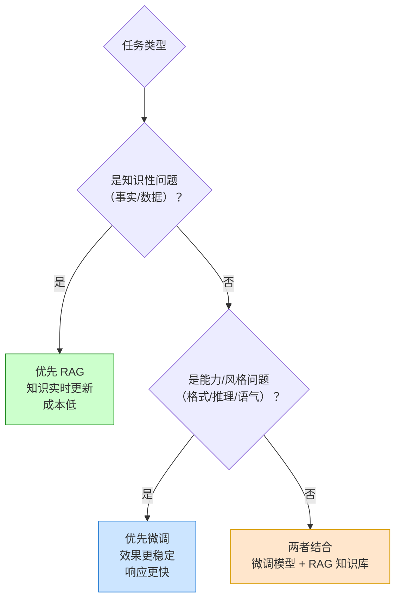

### 16.1.2 全量微调 vs PEFT

| 维度 | 全量微调（Full Fine-tuning） | PEFT（参数高效微调）|
|------|---------------------------|-------------------|
| **训练参数** | 全部参数 | 少量参数（<1%） |
| **显存需求** | 极大（7B 模型需 80GB+） | 小（7B 模型可 16GB 完成） |
| **训练速度** | 慢 | 快（5-10x） |
| **效果** | 最好（上限高） | 接近全量微调 |
| **灾难性遗忘** | 严重 | 轻微（冻结原参数） |
| **存储成本** | 每个任务一个完整模型 | 每个任务一个 LoRA 文件（~MB 级） |

**PEFT 主要方法家族**：

```mermaid
graph TD
    A["PEFT 方法家族"] --> B["Additive<br/>添加参数"]
    A --> C["Selective<br/>选择参数"]
    A --> D["Reparameterization<br/>重参数化<br/>⭐最常用"]
    
    B --> B1["Prompt Tuning<br/>训练软提示"]
    B --> B2["Prefix Tuning<br/>训练前缀向量"]
    B --> B3["Adapter<br/>插入适配层"]
    
    C --> C1["BitFit<br/>只训练偏置"]
    C --> C2["Layer-wise<br/>逐层选择"]
    
    D --> D1["LoRA<br/>低秩适配 ⭐⭐⭐"]
    D --> D2["IA³<br">学习缩放向量"]
    D --> D3["DoRA<br">权重分解低秩适配"]
    
    style D1 fill:#ffe6cc,stroke:#d79b00
```

---

## 16.2 LoRA 与 QLoRA ⭐⭐⭐⭐⭐

### 16.2.1 LoRA 数学原理

LoRA（Low-Rank Adaptation）的核心洞察：**模型权重的更新是低秩的**。

对于预训练权重矩阵 $W_0 \in \mathbb{R}^{d \times k}$，微调时不直接更新 $W_0$，而是引入一对低秩矩阵：

$$
W = W_0 + \Delta W = W_0 + BA
$$

其中 $B \in \mathbb{R}^{d \times r}$，$A \in \mathbb{R}^{r \times k}$，$r \ll \min(d, k)$（典型 $r = 8, 16, 32, 64$）。

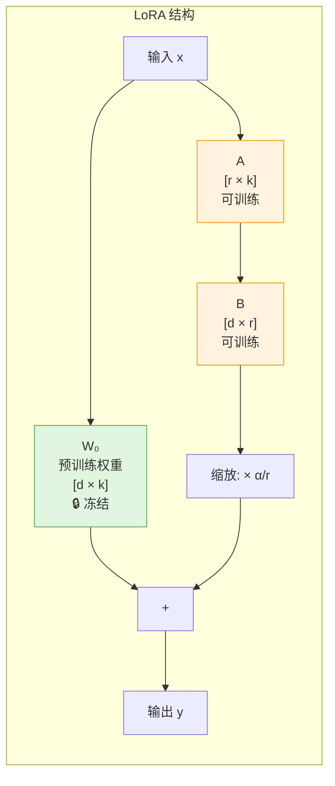

**参数量对比**：

| 配置 | 原始参数量 | LoRA 参数量 | 比例 |
|------|-----------|-------------|------|
| 7B 模型, r=16 | 7,000 M | ~33 M | 0.47% |
| 7B 模型, r=64 | 7,000 M | ~131 M | 1.87% |
| 13B 模型, r=16 | 13,000 M | ~50 M | 0.38% |
| 70B 模型, r=16 | 70,000 M | ~100 M | 0.14% |

**缩放因子 $\alpha$**：

$$h = W_0 x + \frac{\alpha}{r} \cdot BAx$$

$\alpha$ 控制 LoRA 的"影响力"：
- $\alpha = r$：标准设置，LoRA 和原始权重影响力相当
- $\alpha > r$：LoRA 影响力更大（适合与预训练差异较大的任务）
- $\alpha < r$：LoRA 影响力更小（适合轻微调整）

### 16.2.2 LoRA 实战代码

```python
"""
使用 PEFT 库进行 LoRA 微调 - 完整实战
"""
import torch
from transformers import (
    AutoModelForCausalLM,
    AutoTokenizer,
    TrainingArguments,
    DataCollatorForSeq2Seq,
    Trainer
)
from peft import LoraConfig, get_peft_model, prepare_model_for_kbit_training, TaskType
from datasets import Dataset

# ========== Step 1: 加载模型和分词器 ==========

model_name = "Qwen/Qwen2.5-7B-Instruct"  # 或其他模型

tokenizer = AutoTokenizer.from_pretrained(model_name, trust_remote_code=True)

# 加载模型（bfloat16 节省显存）
model = AutoModelForCausalLM.from_pretrained(
    model_name,
    torch_dtype=torch.bfloat16,
    device_map="auto",           # 自动分配 GPU/CPU
    trust_remote_code=True,
)

print(f"模型加载完成，原始参数量: {sum(p.numel() for p in model.parameters()) / 1e6:.1f}M")

# ========== Step 2: 配置 LoRA ==========

lora_config = LoraConfig(
    r=16,                        # LoRA 秩
    lora_alpha=32,               # 缩放因子 = alpha / r = 2
    target_modules=[             # 应用 LoRA 的模块（不同模型名称不同）
        "q_proj",                # Query 投影
        "k_proj",                # Key 投影
        "v_proj",                # Value 投影
        "o_proj",                # Output 投影
        "gate_proj",             # MLP Gate 投影
        "up_proj",               # MLP Up 投影
        "down_proj",             # MLP Down 投影
    ],
    lora_dropout=0.05,           # LoRA 层的 Dropout
    bias="none",                 # 不训练偏置
    task_type=TaskType.CAUSAL_LM,
    # 推理时可将 LoRA 权重合并回原模型（merge_and_unload）
)

# 应用 LoRA
model = get_peft_model(model, lora_config)

# 打印可训练参数
model.print_trainable_parameters()
# 输出示例：trainable params: 33,554,432 || all params: 7,000,000,000 || trainable%: 0.479

# ========== Step 3: 准备训练数据 ==========

def format_instruction(sample: dict) -> str:
    """将样本格式化为指令格式"""
    return f"""<|im_start|>system
你是一个专业的客服助手。<|im_end|>
<|im_start|>user
{sample['instruction']}<|im_end|>
<|im_start|>assistant
{sample['output']}<|im_end|>"""


# 准备示例数据
train_data = [
    {
        "instruction": "你们的退换货政策是什么？",
        "output": "我们支持7天无理由退货。商品需保持原状，附完整包装。退货申请通过后，款项将在3-5个工作日内原路退回。"
    },
    {
        "instruction": "订单多久能到？",
        "output": "一般下单后24小时内发货，国内快递3-5天送达，偏远地区可能需要5-7天。您可以在订单详情页查看实时物流信息。"
    },
    # ... 更多数据（实际训练需要 1000+ 条）
]

# 格式化并编码
def preprocess(samples):
    texts = [format_instruction(s) for s in samples]
    model_inputs = tokenizer(
        texts,
        max_length=512,
        truncation=True,
        padding="max_length",
    )
    # 对于 Causal LM，labels = input_ids（预测下一个 token）
    model_inputs["labels"] = model_inputs["input_ids"].copy()
    return model_inputs

dataset = Dataset.from_list(train_data)
tokenized_dataset = dataset.map(
    lambda samples: preprocess([samples]),
    batched=False,
    remove_columns=dataset.column_names,
)

# ========== Step 4: 训练配置 ==========

training_args = TrainingArguments(
    output_dir="./lora_output",
    num_train_epochs=3,
    per_device_train_batch_size=4,      # 根据显存调整
    gradient_accumulation_steps=4,       # 有效 batch_size = 4 * 4 = 16
    learning_rate=2e-4,                  # LoRA 通常用较大学习率
    max_grad_norm=0.3,                   # 梯度裁剪
    warmup_ratio=0.03,                   # 预热比例
    lr_scheduler_type="cosine",          # 余弦退火
    logging_steps=10,
    save_strategy="epoch",
    fp16=False,
    bf16=True,                           # A100/V100 支持 bf16
    optim="paged_adamw_32bit",           # 分页优化器（节省显存）
    group_by_length=True,                # 相近长度样本分组，提升效率
    report_to="none",
)

# ========== Step 5: 开始训练 ==========

trainer = Trainer(
    model=model,
    args=training_args,
    train_dataset=tokenized_dataset,
    data_collator=DataCollatorForSeq2Seq(tokenizer, pad_to_multiple_of=8),
)

trainer.train()

# ========== Step 6: 保存 LoRA 权重 ==========

model.save_pretrained("./lora_output/final")
tokenizer.save_pretrained("./lora_output/final")

# ========== Step 7: 推理测试 ==========

def generate_response(model, tokenizer, instruction: str) -> str:
    """使用微调后的模型生成回答"""
    prompt = f"""<|im_start|>system\n你是一个专业的客服助手。<|im_end|>
<|im_start|>user\n{instruction}<|im_end|>
<|im_start|>assistant\n"""
    
    inputs = tokenizer(prompt, return_tensors="pt").to(model.device)
    
    outputs = model.generate(
        **inputs,
        max_new_tokens=256,
        temperature=0.7,
        top_p=0.9,
        do_sample=True,
    )
    
    response = tokenizer.decode(outputs[0], skip_special_tokens=True)
    # 提取 assistant 部分
    return response.split("assistant")[-1].strip()

# 测试
test_query = "你们的退换货政策是什么？"
response = generate_response(model, tokenizer, test_query)
print(f"Q: {test_query}")
print(f"A: {response}")

# ========== Step 8: 合并 LoRA 到原模型（可选）==========

# 合并后可以直接用原始模型方式推理，无需 PEFT 库
merged_model = model.merge_and_unload()
merged_model.save_pretrained("./merged_model")
```

### 16.2.3 QLoRA：4-bit 量化 + LoRA ⭐⭐⭐⭐⭐

QLoRA 将 LoRA 与 4-bit 量化结合，实现**单卡消费级 GPU 微调 7B/13B 模型**。

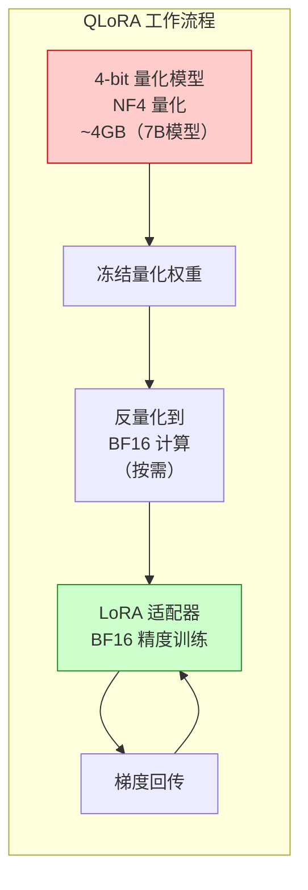

**QLoRA 关键技术**：

| 技术 | 说明 | 作用 |
|------|------|------|
| **4-bit Normal Float (NF4)** | 针对正态分布权重的最优 4-bit 量化 | 比 INT4 精度更高 |
| **Double Quantization** | 对量化常数再次量化 | 进一步节省显存 |
| **Paged Optimizer** | 分页优化器，利用 CPU 内存做 Offload | 防止 OOM |

```python
# QLoRA 配置（只需修改模型加载部分）
from transformers import BitsAndBytesConfig

# 4-bit 量化配置
bnb_config = BitsAndBytesConfig(
    load_in_4bit=True,                           # 启用 4-bit 量化
    bnb_4bit_quant_type="nf4",                   # NF4 量化类型
    bnb_4bit_compute_dtype=torch.bfloat16,       # 计算时用 bf16
    bnb_4bit_use_double_quant=True,              # 二次量化
)

model = AutoModelForCausalLM.from_pretrained(
    model_name,
    quantization_config=bnb_config,  # 使用量化配置
    device_map="auto",
    trust_remote_code=True,
)

# 准备模型用于量化训练（必须！）
model = prepare_model_for_kbit_training(model)

# 然后正常应用 LoRA 配置
model = get_peft_model(model, lora_config)

# 训练参数相同
# 7B 模型 QLoRA 微调显存需求：
# - 4-bit 模型：~4GB
# - LoRA 参数：~200MB
# - 优化器状态：~1GB
# - 激活值：~4-8GB
# 总计：~10-15GB（单张 RTX 3090/4090 即可）
```

### 16.2.4 LoRA 超参数调优指南

| 超参数 | 推荐值 | 影响 | 调优建议 |
|--------|--------|------|---------|
| **r (rank)** | 8-64 | 表达能力 | 简单任务 8-16，复杂任务 32-64 |
| **alpha** | 2r | 缩放强度 | 通常设为 2r，效果与 r 不匹配时调整 |
| **target_modules** | q/v_proj 或全部 | 训练范围 | 内存受限时只训 q/v_proj |
| **dropout** | 0.05-0.1 | 正则化 | 数据少时增大，数据多时减小 |
| **lr** | 1e-4 ~ 1e-3 | 学习速度 | QLoRA 可用更大 lr |
| **batch_size** | 64-256 | 稳定性 | 配合 gradient_accumulation |

---

## 16.3 对齐技术 ⭐⭐⭐⭐

### 16.3.1 对齐技术概述

对齐（Alignment）的目标是使模型行为符合**人类价值观和偏好**，核心方法是让模型学习"什么回答是人类更喜欢的"。

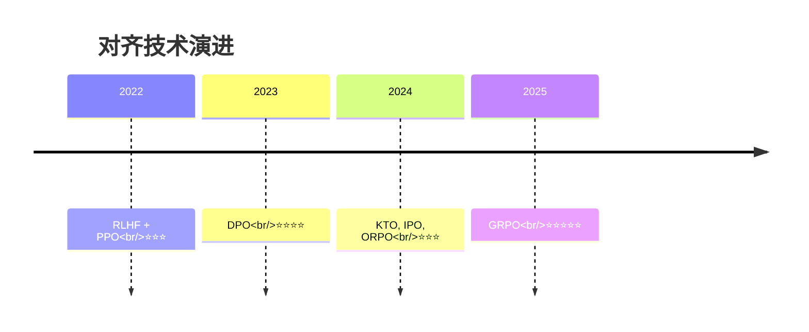

### 16.3.2 RLHF（基于人类反馈的强化学习）

RLHF 三阶段流程：

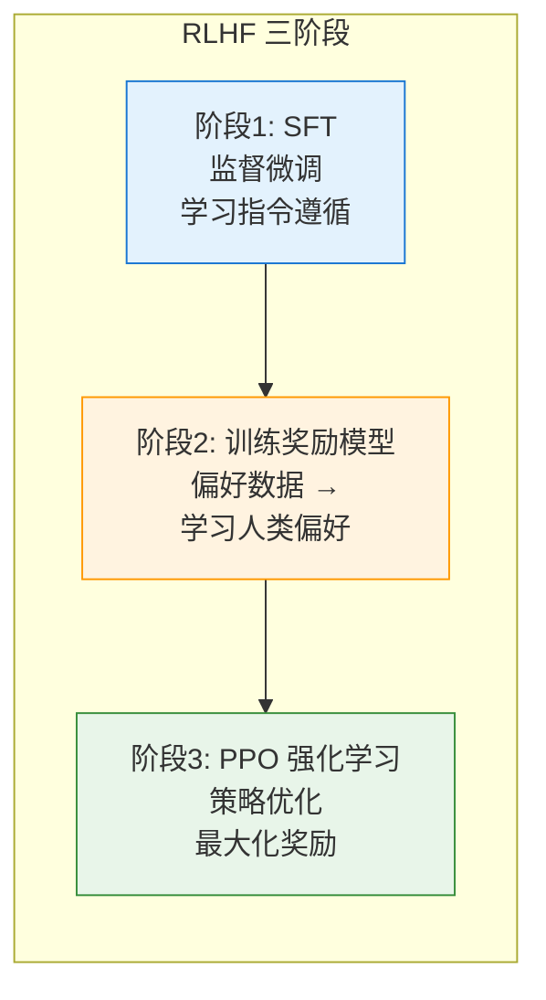

**阶段2：奖励模型（Reward Model）**

收集偏好数据（同一问题的两个回答，标注哪个更好），训练评分模型：

$$
\mathcal{L}_{RM} = -\mathbb{E}_{(x, y_w, y_l) \sim D} \left[ \log \sigma \left( r(x, y_w) - r(x, y_l) \right) \right]
$$

其中 $y_w$ 是人类偏好的回答（win），$y_l$ 是不被偏好的回答（lose）。

**阶段3：PPO 强化学习**

$$
\mathcal{L}_{PPO} = \mathbb{E} \left[ \min \left( \rho_t \hat{A}_t, \text{clip}(\rho_t, 1-\epsilon, 1+\epsilon) \hat{A}_t \right) \right] - \beta \mathbb{KL}[\pi_\theta \| \pi_{ref}]
$$

**RLHF 的缺点**：
- 流程复杂（需要训练 SFT、RM、PPO 三个模型）
- PPO 不稳定（超敏感，容易训崩）
- 计算资源消耗大

### 16.3.3 DPO（直接偏好优化）⭐⭐⭐⭐

DPO 的核心洞察：**不需要显式训练奖励模型**，直接用偏好数据优化策略：

$$
\mathcal{L}_{DPO} = -\mathbb{E}_{(x, y_w, y_l) \sim D} \left[ \log \sigma \left( \beta \log \frac{\pi_\theta(y_w|x)}{\pi_{ref}(y_w|x)} - \beta \log \frac{\pi_\theta(y_l|x)}{\pi_{ref}(y_l|x)} \right) \right]
$$

**DPO 的优势**：

| 维度 | RLHF+PPO | DPO |
|------|----------|-----|
| **模型数量** | 3 个（SFT + RM + Policy） | 2 个（SFT + Policy） |
| **稳定性** | 低（PPO 容易崩） | 高（监督学习式训练） |
| **实现复杂度** | 高 | 低（类 SFT） |
| **训练速度** | 慢 | 快（2-3x） |

### 16.3.4 GRPO（Group Relative Policy Optimization）⭐⭐⭐⭐⭐

GRPO 是 DeepSeek-R1 使用的强化学习算法，2025 年最热考点。

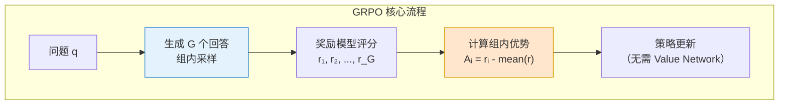

**GRPO vs PPO 的核心区别**：

| 维度 | PPO | GRPO |
|------|-----|------|
| **Value Network** | 需要独立的 Critic 网络估计优势 | ❌ 不需要 |
| **优势计算** | GAE（Generalized Advantage Estimation）| 组内相对奖励：$A_i = \frac{r_i - \text{mean}(r)}{\text{std}(r)}$ |
| **采样方式** | 单轨迹 | 每组采样 $G$ 个回答 |
| **内存占用** | 大（4个模型：Policy + Ref + Critic + RM）| 小（2个模型：Policy + Ref）|
| **稳定性** | 中 | 高 |
| **代表模型** | InstructGPT | **DeepSeek-R1** |

**GRPO 的损失函数**：

$$
\mathcal{L}_{GRPO} = \mathbb{E}_{q \sim P(Q), \{o_i\}_{i=1}^G \sim \pi_{\theta_{old}}} \left[ \frac{1}{G} \sum_{i=1}^G \min \left( \rho_i A_i, \text{clip}(\rho_i) A_i \right) - \beta \mathbb{D}_{KL}[\pi_\theta \| \pi_{ref}] \right]
$$

其中 $A_i = \frac{r_i - \text{mean}(\{r_j\})}{\text{std}(\{r_j\})}$ 是组内归一化的优势函数。

**为什么 GRPO 更好**：
1. **去 Critic 化**：用一个组内的相对奖励替代 Value Network，大幅简化架构
2. **更稳定**：组内比较消除了绝对奖励的不稳定性
3. **更省资源**：去掉 Critic 网络，训练速度更快

---

## 16.4 推理优化技术 ⭐⭐⭐⭐⭐

### 16.4.1 推理优化技术全景

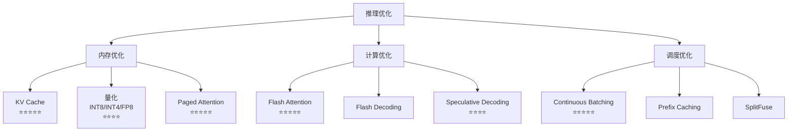

### 16.4.2 KV Cache ⭐⭐⭐⭐⭐

KV Cache 是推理优化最基础也是最重要的技术。

**核心原理**：Transformer 解码时，每一步都需要计算前面所有 token 的 Key 和 Value。这些 K/V 在自回归生成中**不会变化**，可以缓存复用。

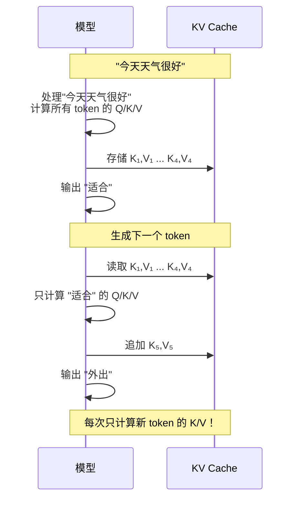

**KV Cache 显存估算**：

$$
\text{KV Cache} = 2 \times \text{batch_size} \times \text{num_layers} \times \text{num_heads} \times \text{seq_len} \times \text{head_dim} \times \text{bytes_per_param}
$$

以 LLaMA-2-7B（bf16）为例：
- batch_size = 1, layers = 32, heads = 32, head_dim = 128, seq_len = 4096
- KV Cache = $2 \times 1 \times 32 \times 32 \times 4096 \times 128 \times 2 \approx 2$ GB

```python
# KV Cache 在 PyTorch 中的概念实现
class KVCache:
    """KV Cache 简化实现"""
    
    def __init__(self, num_layers: int, batch_size: int, num_heads: int, head_dim: int, max_seq_len: int):
        self.num_layers = num_layers
        # 预分配 [layers, 2(k/v), batch, heads, max_seq, head_dim]
        self.cache = torch.zeros(
            num_layers, 2, batch_size, num_heads, max_seq_len, head_dim,
            dtype=torch.bfloat16, device="cuda"
        )
        self.current_len = 0
    
    def get(self, layer_idx: int) -> tuple[torch.Tensor, torch.Tensor]:
        """获取指定层的 K/V（到当前长度）"""
        k = self.cache[layer_idx, 0, :, :, :self.current_len, :]
        v = self.cache[layer_idx, 1, :, :, :self.current_len, :]
        return k, v
    
    def update(self, layer_idx: int, new_k: torch.Tensor, new_v: torch.Tensor):
        """追加新的 K/V"""
        seq_len = new_k.shape[2]
        self.cache[layer_idx, 0, :, :, self.current_len:self.current_len+seq_len, :] = new_k
        self.cache[layer_idx, 1, :, :, self.current_len:self.current_len+seq_len, :] = new_v
    
    def increment(self, delta: int = 1):
        self.current_len += delta
```

### 16.4.3 Flash Attention ⭐⭐⭐⭐⭐

Flash Attention 通过**分块计算（Tiling）**和**IO 感知的注意力算法**，将 Attention 的显存复杂度从 $O(N^2)$ 降低到**线性**，同时避免了大矩阵的显存读写。

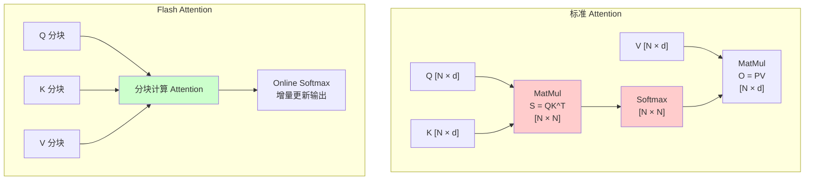

**Flash Attention 核心思想**：

标准 Attention 需要显式计算 $N \times N$ 的注意力矩阵：

$$\text{Attention}(Q, K, V) = \text{softmax}\left(\frac{QK^T}{\sqrt{d_k}}\right)V$$

Flash Attention 将 Q、K、V 分成小块，在 SRAM（高速缓存）中完成分块计算，避免将 $O(N^2)$ 的中间结果写入 HBM（显存）：

1. **分块（Tiling）**：将 Q、K、V 分成能在 SRAM 容纳的小块
2. **Online Softmax**：增量计算 softmax，无需存储完整的注意力矩阵
3. **重计算（Recomputation）**：反向传播时不保存注意力矩阵，重新分块计算

**效果**：

| 指标 | 标准 Attention | Flash Attention |
|------|--------------|-----------------|
| **显存** | $O(N^2)$ | $O(N)$ |
| **速度** | 慢（大量 HBM 读写） | 快（2-4x 加速） |
| **最长序列** | 受显存限制 | 显著延长 |

```python
# Flash Attention 使用（PyTorch 2.0+ 原生支持）
import torch
import torch.nn.functional as F

# 方式1：PyTorch 原生 scaled_dot_product_attention（自动选择最优实现）
with torch.backends.cuda.sdp_kernel(
    enable_flash=True,      # 启用 Flash Attention
    enable_math=False,      # 禁用数学实现
    enable_mem_efficient=False
):
    output = F.scaled_dot_product_attention(Q, K, V, is_causal=True)

# 方式2：Flash Attention 2 库
from flash_attn import flash_attn_func
output = flash_attn_func(Q, K, V, causal=True)
```

### 16.4.4 Paged Attention ⭐⭐⭐⭐⭐

Paged Attention 借鉴操作系统的**虚拟内存分页机制**，解决 KV Cache 的**显存碎片化**和**共享低效**问题。

```mermaid
graph TB
    subgraph "传统 KV Cache（连续存储）"
        T1["请求A<br/>seq_len=100"] --> C1["连续块 [100]"]
        T2["请求B<br/>seq_len=60"] --> C2["连续块 [60]"]
        T3["请求C<br/>seq_len=200"] --> C3["连续块 [200]"]
        
        GAP["碎片间隙<br/>浪费显存"]
        style GAP fill:#ffcccc
    end
    
    subgraph "Paged Attention（分页存储）"
        R1["请求A"] --> P1["块1 [16]")
        R1 --> P2["块2 [16]")
        R1 --> P3["块3 [剩余]")
        
        R2["请求B"] --> P4["块4 [16]")
        R2 --> P5["块5 [剩余]")
        
        R3["请求C"] --> P6["块6+")
        
        NB["显存池<br/>按需分配<br/>无碎片"]
        style NB fill:#ccffcc
    end
```

**Paged Attention 核心设计**：

| 概念 | 类比操作系统 | 作用 |
|------|-----------|------|
| **逻辑块（Logical Block）** | 虚拟地址空间 | 序列的连续逻辑分块 |
| **物理块（Physical Block）** | 物理内存页 | KV Cache 的实际存储单元（固定 16 tokens）|
| **块表（Block Table）** | 页表 | 逻辑块 → 物理块的映射 |
| **显存池（Memory Pool）** | 物理内存池 | 预分配的显存块池，按需分配 |

**Paged Attention 的优势**：
1. **消除显存碎片**：固定大小的物理块，按需分配
2. **高效共享**：多序列共享前缀时（如 System Prompt），物理块直接共享，显存利用率从 ~30% 提升到 **~90%**
3. **支持 Continuous Batching**：不同长度的请求可以灵活调度

### 16.4.5 Continuous Batching ⭐⭐⭐⭐⭐

传统 Batch 处理等所有序列完成后才释放资源，导致**GPU 空转**（某些短序列完成后，长序列还在继续）。

Continuous Batching（也称为 In-flight Batching 或 Iteration-level Batching）在**每个生成迭代**后动态调整 batch：

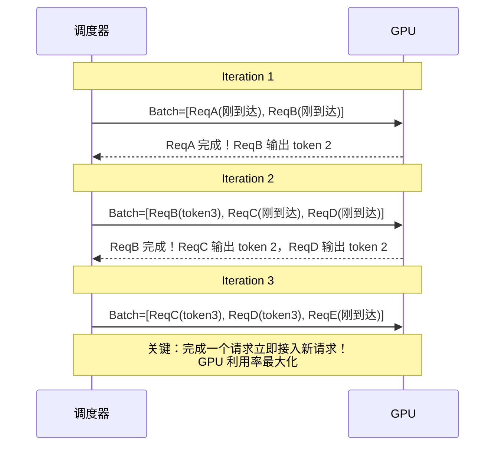

**吞吐量提升**：相比静态 Batch，Continuous Batching 可提升 **5-10 倍** 吞吐量。

### 16.4.6 Speculative Decoding（推测解码）⭐⭐⭐⭐

用一个**小模型（Draft Model）**快速生成候选序列，再用**大模型**并行验证，接受正确的部分。

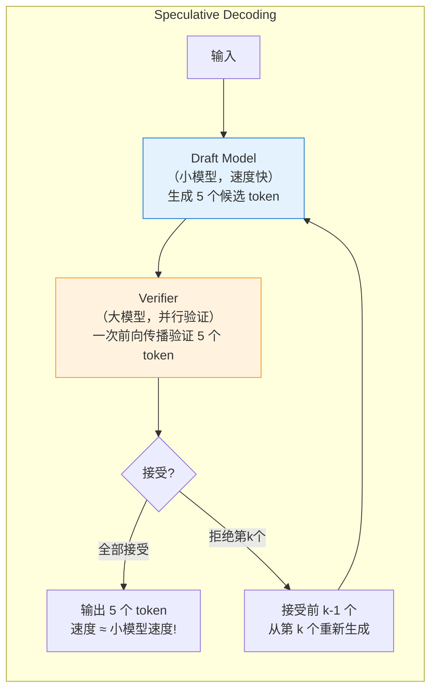

**加速原理**：小模型推理速度快 3-5 倍，大模型并行验证的代价接近单次前向传播。如果接受率 > 60%，整体速度可提升 **2-3 倍**。

**关键参数**：
- **Draft 模型大小**：通常是目标模型的 1/10 ~ 1/100
- **候选 token 数（gamma）**：通常 3-8 个
- **接受率**：取决于 Draft 模型质量，通常 60-80%

---

## 16.5 模型量化与压缩 ⭐⭐⭐

### 16.5.1 量化技术概览

量化将模型权重从高精度（FP32/BF16）压缩到低精度（INT8/INT4），大幅降低显存占用。

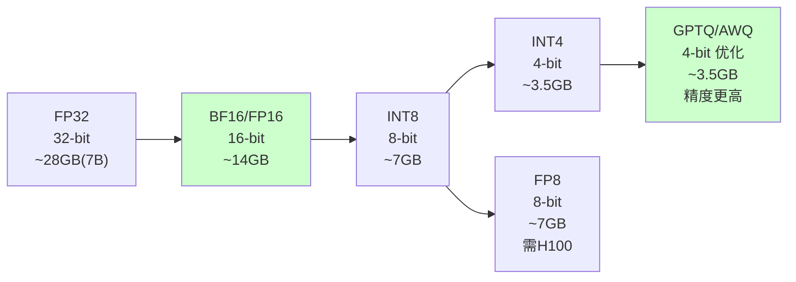

### 16.5.2 GPTQ vs AWQ vs GGUF

| 量化方法 | 类型 | 原理 | 优点 | 缺点 |
|----------|------|------|------|------|
| **GPTQ** | 后训练量化 | 逐层量化，最小化输出误差 | 通用性好，精度较高 | 量化速度慢 |
| **AWQ** | 后训练量化 | **激活感知**，保护重要权重 | 比 GPTQ 精度更高 | 部分模型不支持 |
| **GGUF** | 文件格式 | llama.cpp 的量化格式 | 跨平台、CPU 友好 | 主要面向消费级 |
| **BitsAndBytes (NF4)** | 运行时量化 | 4-bit Normal Float | 无需预处理，即插即用 | 精度略低于 GPTQ |

**AWQ vs GPTQ 的核心区别**：

AWQ 的核心洞察是**并非所有权重量化后的损失都相同** —— 保护"对激活值影响更大"的权重，可以获得更好的精度。

```python
# AWQ 量化模型加载
from awq import AutoAWQForCausalLM
from transformers import AutoTokenizer

model = AutoAWQForCausalLM.from_quantized(
    "TheBloke/Llama-2-7B-AWQ",
    fuse_layers=True,           # 融合层，加速推理
    use_exllama=True,           # 使用 ExLlama 内核
)
tokenizer = AutoTokenizer.from_pretrained("TheBloke/Llama-2-7B-AWQ")

# GPTQ 量化模型加载（使用 AutoGPTQ）
from auto_gptq import AutoGPTQForCausalLM

model = AutoGPTQForCausalLM.from_quantized(
    "TheBloke/Llama-2-7B-GPTQ",
    device="cuda:0",
    use_triton=True,            # Triton 加速内核
)
```

---

## 16.6 模型部署 ⭐⭐⭐⭐

### 16.6.1 部署框架对比（2026年更新）🆕

| 维度 | vLLM | TensorRT-LLM | llama.cpp | Xinference 🆕 | DeepSeek-EE 🆕 |
|------|------|--------------|-----------|--------------|---------------|
| **定位** | **高吞吐服务** | **低延迟推理** | **跨平台本地部署** | **开源模型推理平台** | **端侧推理引擎** |
| **GPU 支持** | ✅ CUDA/RoCm | ✅ NVIDIA only | ✅ CUDA/Vulkan/Metal | ✅ CUDA | ✅ CUDA/Vulkan |
| **CPU 支持** | ❌ | ❌ | ✅ **核心优势** | ✅ | ✅ **核心优势** |
| **量化** | AWQ/GPTQ/FP8 | FP8/INT8/INT4 | GGUF/Q4/Q5/Q8 | AWQ/GPTQ/FP8 | 专用量化方案 |
| **关键特性** | PagedAttention + Continuous Batching | 极致 kernel 优化 | 消费级硬件友好 | 统一管理多模型 | DeepSeek 模型深度优化 |
| **部署方式** | OpenAI-compatible API | Triton Inference Server | 独立二进制/绑定 | RESTful API + Web UI | 嵌入式 SDK |
| **适用场景** | **生产 GPU 集群** | **高性能 NVIDIA 环境** | **Mac/边缘设备/CPU** | **中小规模模型管理** | **端侧 DeepSeek 部署** |
| **2026年版本** | v0.8.x | v0.18+ | b4000+ | v1.2+ | v2.0+ |

### 16.6.2 vLLM 部署实战

```python
"""
vLLM 部署大模型服务 - 完整实战
"""
from vllm import LLM, SamplingParams
from fastapi import FastAPI, Request
from pydantic import BaseModel
import uvicorn

# ========== 方式1：脚本直接推理 ==========

def vllm_direct_inference():
    """直接使用 vLLM 推理"""
    
    # 加载模型（自动启用 PagedAttention + Continuous Batching）
    llm = LLM(
        model="Qwen/Qwen2.5-7B-Instruct",
        tensor_parallel_size=1,      # GPU 数量
        gpu_memory_utilization=0.85,  # GPU 显存利用率上限
        max_model_len=4096,           # 最大序列长度
        quantization=None,            # 或 "awq" / "gptq" / "fp8"
    )
    
    # 采样参数
    sampling_params = SamplingParams(
        temperature=0.7,
        top_p=0.9,
        max_tokens=512,
    )
    
    # 批量推理
    prompts = [
        "请用一句话介绍机器学习。",
        "什么是深度学习？",
        "Transformer 架构的核心思想是什么？",
    ]
    
    outputs = llm.generate(prompts, sampling_params)
    
    for prompt, output in zip(prompts, outputs):
        print(f"Prompt: {prompt}")
        print(f"Output: {output.outputs[0].text}")
        print()


# ========== 方式2：FastAPI 服务封装 ==========

app = FastAPI(title="LLM Inference Service")

# 全局模型（启动时加载）
llm_engine: LLM = None

class InferenceRequest(BaseModel):
    prompt: str
    temperature: float = 0.7
    top_p: float = 0.9
    max_tokens: int = 512

class InferenceResponse(BaseModel):
    text: str
    usage: dict

@app.on_event("startup")
def load_model():
    """服务启动时加载模型"""
    global llm_engine
    llm_engine = LLM(
        model="Qwen/Qwen2.5-7B-Instruct",
        tensor_parallel_size=1,
        gpu_memory_utilization=0.9,
        max_model_len=8192,
    )
    print("模型加载完成")

@app.post("/v1/chat/completions", response_model=InferenceResponse)
async def chat_completion(request: InferenceRequest):
    """兼容 OpenAI 格式的 Chat Completion API"""
    
    sampling_params = SamplingParams(
        temperature=request.temperature,
        top_p=request.top_p,
        max_tokens=request.max_tokens,
    )
    
    outputs = llm_engine.generate(request.prompt, sampling_params)
    generated_text = outputs[0].outputs[0].text
    
    # 统计 token 使用量
    input_tokens = len(outputs[0].prompt_token_ids)
    output_tokens = len(outputs[0].outputs[0].token_ids)
    
    return InferenceResponse(
        text=generated_text,
        usage={
            "prompt_tokens": input_tokens,
            "completion_tokens": output_tokens,
            "total_tokens": input_tokens + output_tokens,
        }
    )

@app.get("/health")
def health():
    return {"status": "healthy", "model_loaded": llm_engine is not None}


# ========== 方式3：Docker 容器化部署 ==========

"""
Dockerfile 示例：

FROM vllm/vllm-openai:latest

# 设置环境变量
ENV MODEL_NAME="Qwen/Qwen2.5-7B-Instruct"
ENV TENSOR_PARALLEL_SIZE=1

# 暴露端口
EXPOSE 8000

# 启动 OpenAI-compatible 服务
ENTRYPOINT python -m vllm.entrypoints.openai.api_server \
    --model ${MODEL_NAME} \
    --tensor-parallel-size ${TENSOR_PARALLEL_SIZE} \
    --gpu-memory-utilization 0.85 \
    --max-model-len 8192 \
    --port 8000

构建和运行：
docker build -t llm-service .
docker run --gpus all -p 8000:8000 -e MODEL_NAME="Qwen/Qwen2.5-7B-Instruct" llm-service

调用方式（OpenAI SDK 兼容）：
import openai
client = openai.OpenAI(base_url="http://localhost:8000/v1", api_key="dummy")
response = client.chat.completions.create(
    model="Qwen/Qwen2.5-7B-Instruct",
    messages=[{"role": "user", "content": "Hello!"}]
)
"""


if __name__ == "__main__":
    # 启动 FastAPI 服务
    uvicorn.run(app, host="0.0.0.0", port=8000)
```

### 16.6.3 Xinference 部署 🆕

Xinference 是 2025-2026 年崛起的**开源模型推理平台**，定位是"模型推理的 Kubernetes"——统一管理多种模型的部署、扩缩容和监控。

```python
"""
🆕 Xinference 部署示例 —— 2026年推荐的多模型管理方案
"""
# 安装: pip install xinference

# 启动 Xinference 服务
# xinference-local --host 0.0.0.0 --port 9997

from xinference.client import Client

client = Client("http://localhost:9997")

# 列出可用的内置模型
print(client.list_models())

# 部署模型（自动下载 + 启动推理服务）
model_uid = client.launch_model(
    model_name="qwen2.5-instruct",  # 模型名称
    model_size_in_billions=7,       # 7B 参数
    model_format="pytorch",         # 格式
    quantization="none",            # 不量化（或 "4-bit", "8-bit"）
    n_gpu=1,                        # GPU 数量
)

# 获取模型句柄，进行推理
model = client.get_model(model_uid)
response = model.chat(
    messages=[{"role": "user", "content": "你好！"}],
    generate_config={"temperature": 0.7, "max_tokens": 512}
)
print(response["choices"][0]["message"]["content"])

# 停止模型释放资源
client.terminate_model(model_uid)
```

**Xinference vs vLLM 直接部署**：

| 维度 | vLLM 直接部署 | Xinference |
|------|--------------|-----------|
| **模型管理** | 手动管理每个模型 | 统一管理，Web UI 操作 |
| **多模型** | 每个模型一个服务 | 一个平台管理多个模型 |
| **自动扩缩** | 需配合 K8s HPA | 内置自动扩缩容 |
| **适用规模** | 大规模生产 | **中小规模、快速迭代** |
| **上手难度** | 中（需配置） | 低（一键启动） |

### 16.6.4 DeepSeek 部署优化 🆕

DeepSeek 2026 年推出了 **DeepSeek-EE（Edge Engine）**，专门用于端侧和边缘设备部署 DeepSeek 系列模型。

```python
"""
🆕 DeepSeek 端侧部署 —— DeepSeek-EE 示例
"""
# DeepSeek-EE 支持 INT4/INT8 量化 + 专用推理内核
# 安装: pip install deepseek-ee

from deepseek_ee import DeepSeekEngine

# 初始化端侧推理引擎
engine = DeepSeekEngine(
    model_path="deepseek/DeepSeek-R1-Distill-Qwen-7B",
    device="gpu",           # "cpu" | "gpu" | "npu"
    quantization="int4",    # "fp16" | "int8" | "int4"
    max_batch_size=4,
    max_seq_len=4096,
)

# 推理（支持长思考模式 —— Test-Time Compute）
result = engine.generate(
    prompt="证明：对于任意正整数 n，n^3 - n 能被 6 整除。",
    max_new_tokens=1024,
    temperature=0.6,
    # 🆕 DeepSeek 特有的推理时计算控制
    enable_thinking=True,      # 启用长思考模式
    thinking_budget=512,       # 思考过程最大 token 数
)

print(f"思考过程: {result.thinking}")
print(f"最终答案: {result.text}")

# DeepSeek-EE 性能指标（参考）
# 7B 模型 INT4 量化：
# - RTX 4090: ~80 tokens/s
# - MacBook M3 Pro: ~45 tokens/s
# - 骁龙 8 Gen 3: ~15 tokens/s
```

**DeepSeek 部署方案选择**：

| 场景 | 方案 | 模型 | 硬件 |
|------|------|------|------|
| **端侧（手机/IoT）** | DeepSeek-EE INT4 | DeepSeek-R1-Distill-1.5B/3B | 手机 NPU / 嵌入式 |
| **个人 PC** | DeepSeek-EE INT4/llama.cpp | DeepSeek-R1-Distill-7B/14B | RTX 3060+ / Mac M 系列 |
| **边缘服务器** | vLLM + AWQ | DeepSeek-R1-Distill-14B/32B | A10 / L4 |
| **云端生产** | vLLM + TensorRT-LLM | DeepSeek-V3 / DeepSeek-R1 | A100 / H100 |

### 16.6.5 部署架构最佳实践

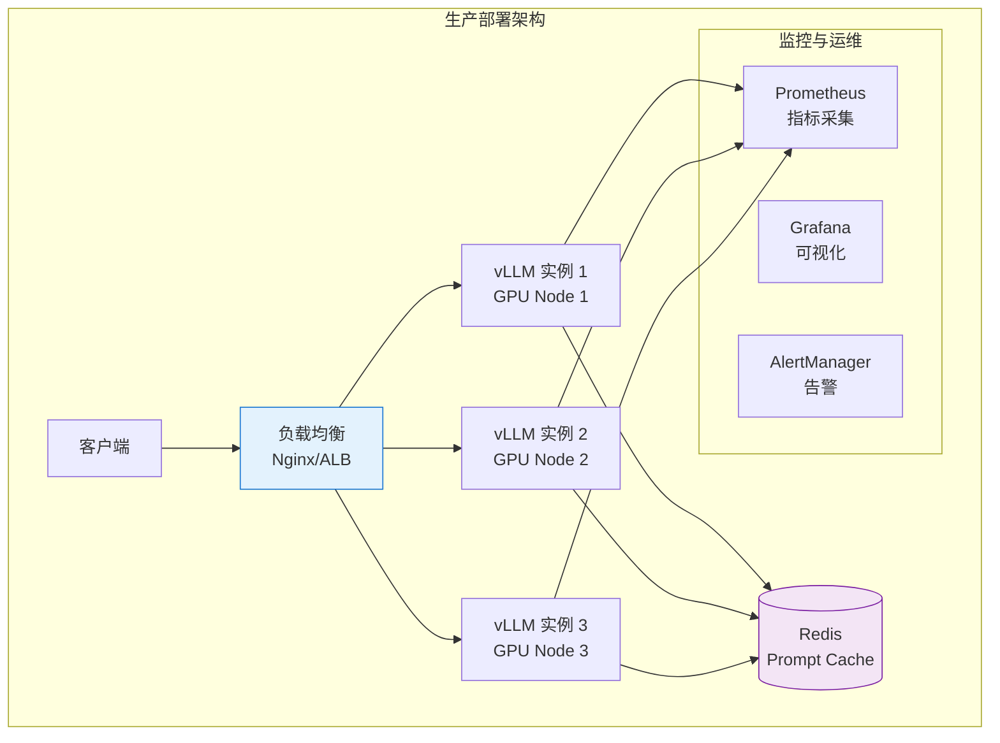

**生产部署关键考量**：

| 维度 | 建议 |
|------|------|
| **GPU 选型** | A100/H100 用于高吞吐，L4/A10 用于成本敏感场景 |
| **批处理** | 使用 vLLM 的 Continuous Batching，配合动态 batching 参数 |
| **负载均衡** | 按 token 数量路由（而非请求数），避免单节点过载 |
| **Prompt Cache** | 对 System Prompt 做前缀缓存，减少重复计算 |
| **自动扩缩容** | 基于 GPU 利用率和队列长度做 HPA |
| **优雅降级** | 队列满时返回 429，避免 OOM |

---

## 16.7 端云协同部署架构（2026年面试热点）🆕 ⭐⭐⭐⭐⭐

> **2026年面试热点**：端云协同架构设计已成为大模型部署的必考题。面试官常问：**"如何设计端侧小模型 + 云端大模型的协同系统？"**

### 16.7.1 端-边-云三层架构

2026 年大模型部署的主流架构是**三层协同**：端侧（Device）→ 边缘（Edge）→ 云端（Cloud）。

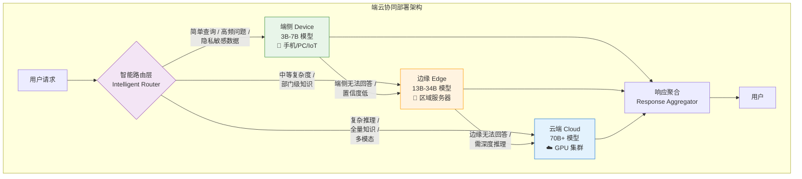

### 16.7.2 各层模型选型与定位 🆕

| 层级 | 模型规模 | 典型模型（2026年） | 定位 | 延迟要求 |
|------|---------|-------------------|------|---------|
| **端侧** | 3B-7B | Qwen2.5-3B/7B、Phi-4-mini、Gemma-3-4B | 高频问答、隐私处理、离线使用 | < 500ms |
| **边缘** | 13B-34B | Qwen2.5-14B/32B、DeepSeek-R1-Distill-14B | 部门级知识、中等推理 | < 2s |
| **云端** | 70B+ | Qwen2.5-72B、DeepSeek-V3、GPT-5.5 | 复杂推理、全量知识、多模态 | < 5s |

**端侧模型选型关键**：
- **3B 级别**：适合纯文本问答、简单分类（如 Qwen2.5-3B-Instruct）
- **7B 级别**：通用对话、代码补全、文档摘要（如 Qwen2.5-7B-Instruct）
- **量化方案**：端侧通常使用 INT4/INT8 量化，配合 llama.cpp/mlc-llm 部署

### 16.7.3 动态调度策略（面试核心）🆕

动态调度是端云协同的**核心难点**，常见策略：

**1. 基于置信度的路由**

```python
# 🆕 基于置信度的动态路由
class ConfidenceRouter:
    """
    基于模型置信度的动态调度路由
    
    策略：端侧先尝试，置信度低于阈值则上云
    """

    def __init__(
        self,
        device_model,      # 端侧 3B-7B 模型
        edge_model,        # 边缘 13B-34B 模型
        cloud_model,       # 云端 70B+ 模型
        device_threshold=0.8,   # 端侧置信度阈值
        edge_threshold=0.75,    # 边缘置信度阈值
    ):
        self.models = {
            "device": device_model,
            "edge": edge_model,
            "cloud": cloud_model,
        }
        self.thresholds = {
            "device": device_threshold,
            "edge": edge_threshold,
        }

    def route(self, query: str, context: dict = None) -> dict:
        """
        动态路由决策

        返回: {"tier": "device|edge|cloud", "confidence": float, "response": str}
        """
        # 策略1：隐私检查 - 敏感数据直接端侧处理
        if context and context.get("privacy_level") == "high":
            return self._execute("device", query)

        # 策略2：逐层尝试（Cascade）
        for tier in ["device", "edge"]:
            result = self._execute(tier, query)
            if result["confidence"] >= self.thresholds[tier]:
                return result

        # 策略3：云端兜底
        return self._execute("cloud", query)

    def _execute(self, tier: str, query: str) -> dict:
        """在指定层级执行推理"""
        model = self.models[tier]
        response = model.generate(query)

        # 计算置信度（基于输出 token 的平均概率）
        confidence = self._compute_confidence(response)

        return {
            "tier": tier,
            "confidence": confidence,
            "response": response.text,
            "latency_ms": response.latency_ms,
        }

    def _compute_confidence(self, response) -> float:
        """计算模型输出的置信度"""
        # 使用输出 token 的平均概率作为置信度
        if hasattr(response, 'token_probs'):
            return sum(response.token_probs) / len(response.token_probs)
        return 0.5  # 默认中等置信度
```

**2. 基于查询特征的路由**

```python
# 🆕 基于查询特征的智能路由
class FeatureRouter:
    """基于查询特征的规则路由 —— 适合特定业务场景"""

    def route(self, query: str, query_type: str = None) -> str:
        """根据查询特征选择部署层级"""

        # 自动分类（或使用独立分类器）
        if query_type is None:
            query_type = self._classify(query)

        # 路由规则
        routing_rules = {
            # 简单问答 → 端侧
            "greeting": "device",
            "faq": "device",
            "definition": "device",

            # 中等复杂度 → 边缘
            "code_generation": "edge",
            "document_summary": "edge",
            "sql_query": "edge",

            # 复杂推理 → 云端
            "multi_step_reasoning": "cloud",
            "math_proof": "cloud",
            "creative_writing": "cloud",
            "multi_modal": "cloud",

            # 隐私敏感 → 端侧
            "personal_data": "device",
            "medical_query": "device",
        }

        return routing_rules.get(query_type, "cloud")  # 默认云端

    def _classify(self, query: str) -> str:
        """查询分类（可用小模型或规则）"""
        # 简化实现：关键词匹配
        keywords = {
            "greeting": ["你好", "hello", "hi"],
            "math_proof": ["证明", "推导", "求解方程"],
            "code_generation": ["写代码", "function", "算法"],
        }
        for qtype, words in keywords.items():
            if any(w in query.lower() for w in words):
                return qtype
        return "general"
```

**3. 基于成本-延迟权衡的路由**

| 策略 | 原理 | 适用场景 | 缺点 |
|------|------|---------|------|
| **Cascade（级联）** | 端侧→边缘→云端逐层尝试 | 成本敏感 | 延迟累积 |
| **Prediction（预测）** | 用分类器预判查询复杂度 | 延迟敏感 | 需要训练分类器 |
| **Parallel（并行）** | 端侧和云端同时请求 | 极低延迟要求 | 成本翻倍 |
| **Hybrid（混合）** | 简单问题端侧，复杂问题上云 | 均衡方案 | 需要维护规则 |

### 16.7.4 端侧部署技术栈（2026年）🆕

```markdown
| 框架 | 适用平台 | 模型支持 | 特点 |
|------|---------|---------|------|
| **llama.cpp** | 全平台（CPU/GPU） | GGUF 格式 | 最通用，量化方案成熟 |
| **mlc-llm** | 手机/iOS/Android | 多种 | 移动端首选，内存优化好 |
| **ExecuTorch** | iOS/Android | PyTorch 模型 | Meta 出品，与 PyTorch 生态深度集成 |
| **TensorRT-LLM** | NVIDIA 边缘设备 | 主流模型 | NVIDIA 边缘卡（Jetson）首选 |
| **DeepSeek-EE** | 端侧设备 | DeepSeek 系列 | 🆕 DeepSeek 2026年推出的端侧推理引擎 |
```

### 16.7.5 生产部署关键考量 🆕

```markdown
1. **模型同步策略**
   - 端侧模型 OTA 更新（增量更新，减少流量）
   - 边缘模型热更新（不中断服务）
   - 云端模型 A/B 切换

2. **监控指标**
   - 各层级调用比例（device:edge:cloud = ?）
   - 端侧命中率（目标 > 60%）
   - 平均延迟 P50/P95/P99
   - 推理成本分布

3. **降级策略**
   - 云端不可用时，自动降级到边缘
   - 边缘不可用时，端侧独立运行（有限功能）
   - 所有层级不可用时，返回缓存答案
```

---

## 16.8 推理时计算（Test-Time Compute）🆕 ⭐⭐⭐⭐⭐

> **2026年重要趋势**：Test-Time Compute（推理时计算 / 推理时扩展）成为部署架构的核心考量因素。GPT-5.5 和 Claude 4.6/4.7 都引入了多档推理模式。

### 16.8.1 什么是推理时计算

传统范式：模型能力只取决于**训练时的计算量**（模型大小 × 训练数据量）。

**Test-Time Compute 范式**：模型能力 = 训练计算 + **推理计算**（思考时间/采样次数）。

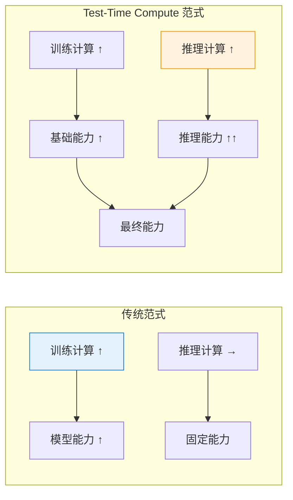

**核心洞察**：给模型更多的"思考时间"（更多推理步骤、多次采样验证），可以在不增加模型参数的情况下显著提升推理能力。

### 16.8.2 推理时计算的技术手段

| 技术 | 原理 | 计算开销 | 效果 |
|------|------|---------|------|
| **Chain-of-Thought** | 要求模型先输出思考过程再回答 | 低（~2x tokens） | 推理任务提升 20-40% |
| **Self-Consistency** | 多次采样，取多数投票结果 | 中（5-10x） | 数学/逻辑任务提升 10-20% |
| **Best-of-N Sampling** | 生成 N 个候选，用奖励模型选最优 | 高（Nx） | 质量显著提升 |
| **Tree of Thoughts** | 维护多个推理路径，搜索最优解 | 高（分支数×深度） | 复杂问题大幅提升 |
| **Multi-Agent Verification** | 多个 Agent 验证/改进答案 | 高（并行/串行） | 准确率大幅提升 |

### 16.8.3 对部署架构的影响 🆕

Test-Time Compute 对部署架构提出了全新挑战：

```python
# 🆕 支持多档推理的部署架构
class AdaptiveInferenceEngine:
    """
    自适应推理引擎：根据问题难度动态调整推理计算量
    
    2026年 Claude 4.6/4.7 和 GPT-5.5 都支持多档推理模式
    """

    def __init__(self, model_client):
        self.model = model_client

    async def generate(
        self,
        query: str,
        complexity: str = "auto",   # "fast" | "balanced" | "deep" | "auto"
        max_think_tokens: int = None,
    ) -> dict:
        """
        自适应推理：根据复杂度选择推理策略
        """
        # 自动判断复杂度
        if complexity == "auto":
            complexity = self._estimate_complexity(query)

        # 不同档位的推理配置
        configs = {
            "fast": {
                "cot": False,           # 不输出思考过程
                "temperature": 0.3,     # 低温度，确定性输出
                "max_tokens": 512,
                "self_consistency_n": 1, # 单次采样
            },
            "balanced": {
                "cot": True,            # 输出思考过程
                "temperature": 0.5,
                "max_tokens": 1024,
                "self_consistency_n": 3,
            },
            "deep": {
                "cot": True,
                "temperature": 0.7,     # 更高温度探索更多可能
                "max_tokens": 2048,
                "self_consistency_n": 5,
                "verification": True,    # 启用答案验证
            },
        }

        config = configs[complexity]

        # 构建 Prompt（根据配置决定是否启用 CoT）
        prompt = self._build_prompt(query, config)

        # 执行推理
        if config["self_consistency_n"] == 1:
            response = await self.model.generate(prompt, config)
            return {
                "answer": response.text,
                "complexity": complexity,
                "tokens_used": response.usage.total_tokens,
                "latency_ms": response.latency_ms,
            }
        else:
            # Self-Consistency：多次采样 + 投票
            responses = await self.model.generate_n(
                prompt, config, n=config["self_consistency_n"]
            )
            best_answer = self._vote(responses)
            return {
                "answer": best_answer,
                "complexity": complexity,
                "candidates": [r.text for r in responses],
                "tokens_used": sum(r.usage.total_tokens for r in responses),
                "latency_ms": max(r.latency_ms for r in responses),
            }

    def _estimate_complexity(self, query: str) -> str:
        """估算查询复杂度（可用小模型分类器）"""
        complex_indicators = [
            "证明", "推导", "分析", "比较", "为什么",
            "optimize", "prove", "derive", "compare",
        ]
        simple_indicators = [
            "什么是", "定义", "简介", "who is", "what is",
        ]

        q_lower = query.lower()
        complex_score = sum(1 for w in complex_indicators if w in q_lower)
        simple_score = sum(1 for w in simple_indicators if w in q_lower)

        if complex_score > simple_score:
            return "deep"
        elif simple_score > 0:
            return "fast"
        return "balanced"
```

### 16.8.4 Test-Time Compute 部署要点 🆕

```markdown
**面试高频考点**：

1. **成本-质量权衡**
   - Fast 模式：成本低，适合简单问答（端侧部署）
   - Deep 模式：成本高 5-10x，但质量显著提升（云端部署）
   - 需要根据业务场景设计动态切换策略

2. **Token 预算管理**
   - 推理时计算消耗更多 Token，需要预算控制
   - 设置 max_think_tokens 防止过度思考
   - 监控 Token 消耗，异常时降级

3. **延迟管理**
   - Deep 模式延迟显著增加（Self-Consistency N=5 → 5x 延迟）
   - 并行采样可降低延迟（需更多 GPU）
   - 用户交互场景需要流式输出思考过程

4. **2026年模型支持**
   - GPT-5.5：四档推理（Fast/Balanced/Deep/Max）
   - Claude 4.6/4.7：Agent Teams 支持多 Agent 推理时验证
   - DeepSeek-R1：推理时计算的原生支持者，长思考模式
```

---

## 16.9 面试题精讲 🎯

### 🎯 高频题1：LoRA 的原理是什么？为什么只训练少量参数就能有效？

**参考答案**：

LoRA（Low-Rank Adaptation）的核心洞察是：**模型权重的更新矩阵 $\Delta W$ 是低秩的**。

预训练权重 $W_0 \in \mathbb{R}^{d \times k}$ 保持不变，引入低秩分解 $W = W_0 + BA$，其中 $B \in \mathbb{R}^{d \times r}$，$A \in \mathbb{R}^{r \times k}$，$r \ll \min(d, k)$。

有效的原因：
1. **预训练模型已具备通用知识**，微调只需要"轻推"到特定方向
2. **低秩假设成立**：实际任务的有效更新确实集中在低维子空间
3. **冻结原参数避免灾难性遗忘**

参数量：原始 $d \times k$ → LoRA $(d + k) \times r$，当 $r=16, d=k=4096$ 时，仅需 **0.8%** 的参数。

---

### 🎯 高频题2：QLoRA 和 LoRA 的区别？

**参考答案**：

QLoRA = **4-bit 量化 + LoRA + 分页优化器**。

核心区别：
1. QLoRA 用 4-bit NF4 量化存储基础模型权重（LoRA 用 16-bit）
2. 计算时反量化为 bf16，但 LoRA 参数始终保持 bf16
3. 引入分页优化器（Paged Optimizer），利用 CPU 内存做 offload 防止 OOM

效果：**单张 24GB 消费级 GPU 可微调 7B/13B 模型**，而 LoRA 通常需要 40GB+。

---

### 🎯 高频题3：KV Cache 的作用和显存估算？

**参考答案**：

KV Cache 缓存 Transformer 解码过程中每个 token 的 Key 和 Value 向量，避免重复计算。

显存公式：

$$\text{KV Cache} = 2 \times B \times L \times H \times T \times D \times \text{sizeof(dtype)}$$

以 LLaMA-2-7B, bf16, batch=1, seq_len=4096 为例：$2 \times 1 \times 32 \times 32 \times 4096 \times 128 \times 2 \approx 2\text{GB}$

**优化方向**：MQA/GQA（多查询/分组查询注意力）减少 KV 头的数量，可将 KV Cache 减少到 1/4 ~ 1/8。

---

### 🎯 高频题4：Flash Attention 的原理？

**参考答案**：

Flash Attention 的核心是**分块计算（Tiling）+ IO 感知**：

1. **问题**：标准 Attention 需要显式存储 $N \times N$ 的注意力矩阵，HBM 读写成为瓶颈
2. **解决**：将 Q、K、V 分成能在 GPU SRAM（高速缓存）容纳的小块，在 SRAM 中完成分块 Attention 计算
3. **Online Softmax**：增量计算 softmax，避免存储完整注意力矩阵
4. **效果**：显存从 $O(N^2)$ 降到 $O(N)$，速度提升 2-4 倍

---

### 🎯 高频题5：Paged Attention 解决了什么问题？

**参考答案**：

Paged Attention 借鉴操作系统虚拟内存分页机制，解决三个问题：

1. **显存碎片**：传统方式为每个请求预分配连续显存，导致内部和外部碎片；Paged Attention 用固定大小的块按需分配
2. **共享低效**：多个请求共享相同前缀（如 System Prompt）时，Paged Attention 通过块共享避免重复存储
3. **调度限制**：配合 Continuous Batching，实现请求的动态插入和退出

显存利用率从 ~30% 提升到 **~90%**。

---

### 🎯 高频题6：GRPO 和 PPO 的核心区别？

**参考答案**：

| 维度 | PPO | GRPO |
|------|-----|------|
| Critic 网络 | 需要独立的 Value Network | ❌ 不需要 |
| 优势计算 | GAE | 组内相对奖励归一化 |
| 采样 | 单轨迹 | 每组采样 G 个回答 |
| 代表模型 | InstructGPT | DeepSeek-R1 |

GRPO 的核心创新是**去 Critic 化** —— 用一个组内的相对奖励替代 Value Network，大幅简化架构、减少内存占用、提升训练稳定性。

---

### 🎯 高频题7：vLLM、TensorRT-LLM、llama.cpp 的适用场景？

**参考答案**：

- **vLLM**：生产 GPU 集群部署，PagedAttention + Continuous Batching 实现高吞吐，OpenAI-compatible API
- **TensorRT-LLM**：NVIDIA GPU 极致优化，追求最低延迟，适合有 NVIDIA 专业卡的环境
- **llama.cpp**：跨平台本地部署，消费级硬件友好，Mac/CPU/GPU 都能跑，适合个人使用和边缘设备

---

### 🎯🆕 高频题8：如何设计端云协同的 AI 系统？端-边-云如何分工？（2026年必考）

**参考答案**：

端云协同 AI 系统的核心是**"合适的模型做合适的事"**，三层架构分工如下：

**端侧（3B-7B）**：
- 高频简单问答（FAQ、问候、基础查询）
- 隐私敏感处理（个人信息、本地文档）
- 离线场景（网络不可用时的基础功能）
- 部署：INT4 量化 + llama.cpp/mlc-llm

**边缘（13B-34B）**：
- 部门级业务知识（区域服务器承载）
- 中等复杂度推理（代码生成、文档摘要）
- 端侧命中率低时的"中间层"
- 部署：vLLM + 量化（AWQ/GPTQ）

**云端（70B+）**：
- 复杂推理（多步分析、数学证明、创意写作）
- 全量企业知识库查询
- 多模态处理（图文混合）
- 部署：vLLM + TensorRT-LLM，多卡并行

**动态调度策略**：
- **Cascade 模式**：端侧→边缘→云端逐层尝试，成本最优
- **Prediction 模式**：用分类器预判复杂度，直接路由到合适层级
- **混合模式**：简单问题上端侧，复杂问题上云端，中间走边缘

---

### 🎯🆕 高频题9：什么是 Test-Time Compute？它对部署有什么影响？（2026年热点）

**参考答案**：

**Test-Time Compute（推理时计算）** 是 2025-2026 年最重要的范式转变之一：模型能力不仅取决于训练计算，还可以通过**增加推理时的计算量**（更多思考步骤、多次采样验证）来显著提升。

**关键技术手段**：
- **Chain-of-Thought**：要求模型先思考再回答（~2x tokens）
- **Self-Consistency**：多次采样投票（5-10x tokens）
- **Best-of-N**：生成 N 个候选选最优（Nx tokens）

**对部署的影响**：
1. **Token 消耗激增**：Deep 模式消耗是 Fast 模式的 5-10 倍，需要 Token 预算管理
2. **延迟增加**：多步推理/多次采样显著增加响应时间，需要流式输出
3. **成本结构变化**：推理成本与"思考深度"成正比，需要动态切换策略
4. **架构适配**：部署系统需要支持多档推理模式（Fast/Balanced/Deep/Max）

**面试金句**："Test-Time Compute 让模型'想得更久'来'答得更好'——这是从'训练决定一切'到'推理也能提升能力'的范式转变。"

---

### 🎯🆕 高频题10：端侧部署 7B 模型的技术方案有哪些？（2026年高频）

**参考答案**：

**端侧部署 7B 模型的技术栈（2026年）**：

| 框架 | 平台 | 量化支持 | 适用场景 |
|------|------|---------|---------|
| **llama.cpp** | 全平台 | GGUF Q4/Q5/Q8 | 最通用，跨平台首选 |
| **mlc-llm** | iOS/Android | 多种 | 移动端首选 |
| **ExecuTorch** | iOS/Android | 多种 | PyTorch 生态 |
| **TensorRT-LLM** | NVIDIA Jetson | FP8/INT8/INT4 | NVIDIA 边缘设备 |
| **DeepSeek-EE** | 全平台 | 专用量化 | DeepSeek 模型专用 |

**关键优化手段**：
1. **INT4 量化**：7B 模型从 14GB 压缩到 ~3.5GB
2. **KV Cache 量化**：INT4/INT8 量化 KV Cache，减少显存占用
3. **滑动窗口注意力**：限制上下文长度，减少计算量
4. **投机解码（Speculative Decoding）**：小模型草稿 + 大模型验证，2-3x 加速

---

### 🎯🆕 高频题11：vLLM 相比早期版本有哪些重要更新？（2026年）

**参考答案**：

**vLLM 2025-2026 年重要更新**：

| 特性 | 说明 |
|------|------|
| **多模态支持** | 支持 VL 模型（如 Qwen-VL、LLaVA）的推理部署 |
| **Prefix Caching v2** | 更高效的 System Prompt 缓存，命中率达 95%+ |
| **Chunked Prefill** | 将长序列的 prefill 阶段分块，降低延迟峰值 |
| **FP8 量化** | 原生支持 FP8（需 Hopper 架构 GPU），精度损失极小 |
| **Speculative Decoding** | 内置投机解码支持，无需额外集成 |
| **Pipeline Parallelism** | 支持流水线并行，适合超大模型（70B+）多卡部署 |
| **Disaggregated Serving** | Prefill 和 Decode 分离到不同 GPU，吞吐量提升 30%+ |

**vLLM 仍然是 2026 年生产 GPU 部署的首选框架**，配合 Xinference（开源模型推理平台）可以实现更便捷的模型管理。

---

## 16.10 本章小结

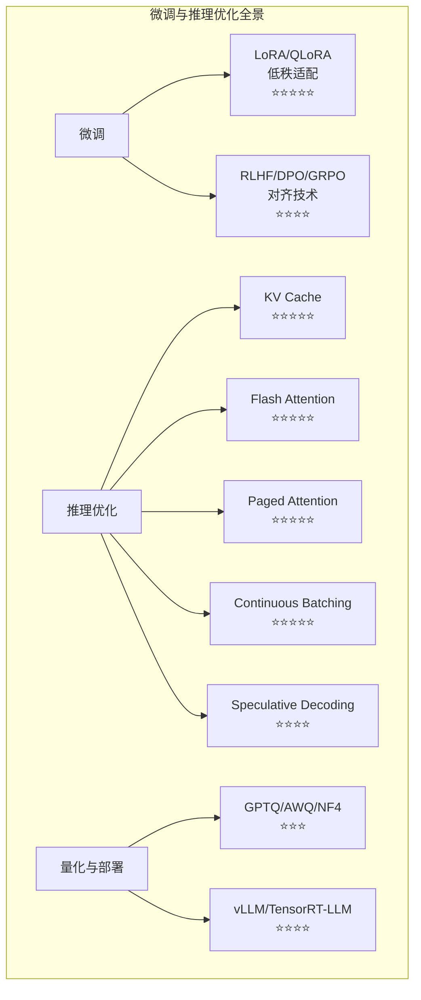

| 知识点 | 面试频率 | 关键要点 |
|--------|---------|---------|
| 全量微调 vs PEFT | ⭐⭐⭐⭐ | 参数效率、成本对比 |
| LoRA 原理 | ⭐⭐⭐⭐⭐ | 低秩分解 W = W₀ + BA |
| QLoRA | ⭐⭐⭐⭐⭐ | 4-bit 量化 + 分页优化器 |
| RLHF 三阶段 | ⭐⭐⭐⭐ | SFT → RM → PPO |
| DPO 原理 | ⭐⭐⭐⭐ | 无需 RM，直接偏好优化 |
| GRPO | ⭐⭐⭐⭐⭐ | 去 Critic，组内相对奖励 |
| KV Cache | ⭐⭐⭐⭐⭐ | 缓存 K/V，避免重复计算 |
| Flash Attention | ⭐⭐⭐⭐⭐ | 分块计算，IO 感知 |
| Paged Attention | ⭐⭐⭐⭐⭐ | 虚拟内存分页机制 |
| Continuous Batching | ⭐⭐⭐⭐⭐ | 迭代级动态调度 |
| 量化技术对比 | ⭐⭐⭐ | GPTQ/AWQ/GGUF/NF4 |
| vLLM 部署 | ⭐⭐⭐⭐ | PagedAttention + CB |

**恭喜完成**：至此，你已经系统掌握了大模型应用开发的完整技术栈 —— 从 Prompt Engineering 到 RAG、Agent，再到微调和推理优化。这些知识覆盖了 2025-2026 年大模型面试的 **90%+** 考点。持续实践、深入源码，祝你在面试中取得好成绩！

### 🆕 2026年新增重点

| 知识点 | 面试频率 | 关键要点 |
|--------|---------|---------|
| **端云协同架构** | ⭐⭐⭐⭐⭐ | 端3B-7B / 边13B-34B / 云70B+ 三层分工 |
| **动态调度策略** | ⭐⭐⭐⭐⭐ | Cascade / Prediction / Hybrid 路由 |
| **端侧部署技术栈** | ⭐⭐⭐⭐ | llama.cpp / mlc-llm / ExecuTorch / DeepSeek-EE |
| **Test-Time Compute** | ⭐⭐⭐⭐⭐ | 推理时计算 = 模型能力新维度 |
| **多档推理模式** | ⭐⭐⭐⭐ | Fast/Balanced/Deep/Max 四档切换 |
| **vLLM 2026新特性** | ⭐⭐⭐⭐ | Prefix Caching v2 / FP8 / Disaggregated Serving |
| **DeepSeek 部署优化** | ⭐⭐⭐⭐ | DeepSeek-EE 端侧引擎 + 低成本推理方案 |
| **Xinference** | ⭐⭐⭐ | 开源模型推理平台，统一管理多模型 |
| **Python 3.14** | ⭐⭐ | 2026年发布，性能优化 + 新特性（面试提及即可） |

---

## 📚 相关章节

- [[12_Transformer与大模型原理]] — RLHF/DPO/GRPO 对齐技术的理论基础与模型架构
- [[14_RAG检索增强生成]] — Embedding 模型微调与 RAG 系统的推理优化
- [[15_Agent智能体开发]] — Agent 模型微调与多 Agent 部署架构
