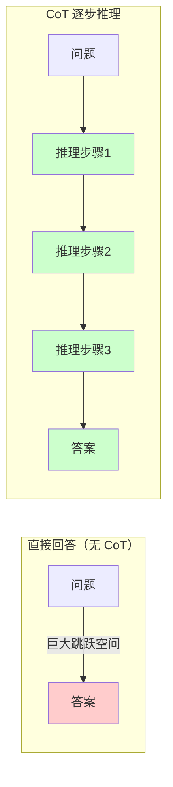
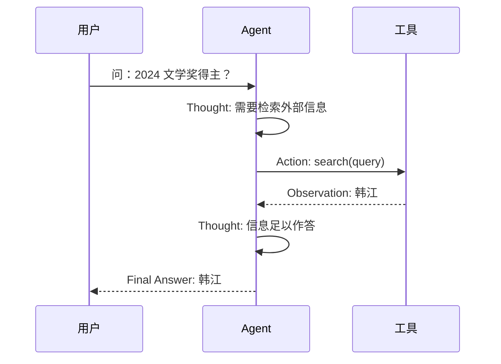
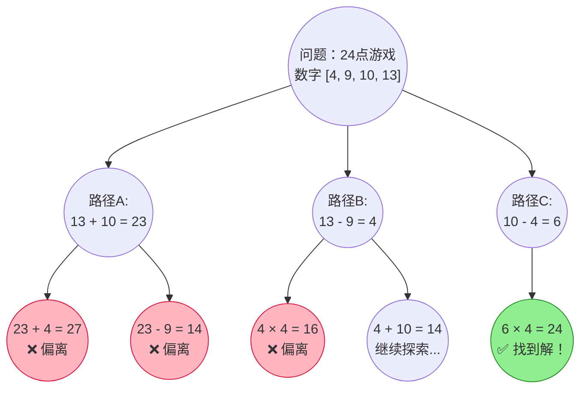
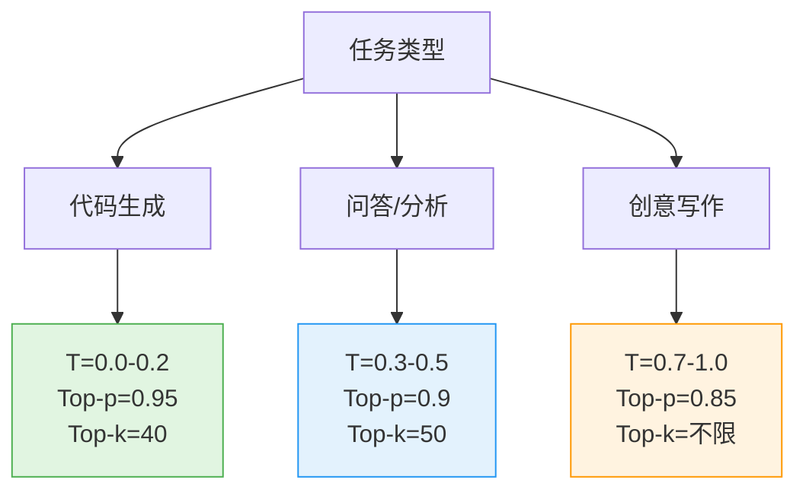

# 第 17 章 Prompt Engineering ⭐⭐⭐⭐
> [!abstract] 本章导航
> **定位**：第三部分 Prompt、Context 与 RAG中的第 17 章；围绕“Prompt Engineering”建立单一、可追踪的知识主线。
>
> **先修**：[[16_大模型预训练解码与模型选型|第 16 章 大模型预训练、解码与模型选型]]。
>
> **学习目标**：
> - 解释 Prompt 设计基础 ⭐⭐⭐ 的核心问题、机制与适用边界。
> - 实现或评估 高级 Prompt 技巧 ⭐⭐⭐⭐⭐ 的最小闭环。
> - 使用可复现证据诊断 采样参数与生成控制 ⭐⭐⭐⭐ 的工程取舍与失败模式。
>
> **建议路径**：Prompt 设计基础 ⭐⭐⭐ → 高级 Prompt 技巧 ⭐⭐⭐⭐⭐ → 采样参数与生成控制 ⭐⭐⭐⭐ → 结构化输出与 Prompt 实践。
>
> **配套代码**：`code/ch17_prompt_engineering/`。

本章先回答“Prompt 设计基础 ⭐⭐⭐”为什么成立，再沿着机制、实现、评估和边界逐步展开。阅读时先建立因果链，再运行或推演示例，最后用章末自测检查能否脱离原文复述。
## 17.1 Prompt 设计基础 ⭐⭐⭐

### 17.1.1 什么是 Prompt Engineering

Prompt Engineering（提示工程）是指通过**设计和优化输入提示词（Prompt）**，引导大语言模型（LLM）生成高质量、符合预期的输出。它不修改模型参数，仅通过调整输入来激发模型的内在能力，是成本最低的大模型优化手段。

**为什么 Prompt Engineering 如此重要？**

| 维度 | 说明 |
|------|------|
| **成本** | 零训练成本，仅消耗推理 token |
| **迭代速度** | 秒级迭代，无需等待训练完成 |
| **通用性** | 适用于所有 LLM，不受模型版本限制 |
| **效果天花板** | 好的 Prompt 能让 7B 模型逼近 13B 模型效果 |

### 17.1.2 Prompt 的核心组成要素

一个完整的 Prompt 通常包含以下组件：

```markdown
【系统提示 System Prompt】
你是一位专业的 Python 技术面试官，擅长考察候选人的编程思维和代码能力。

【角色设定 Role】
请以资深面试官的身份进行提问。

【上下文 Context】
候选人正在应聘高级 Python 开发工程师岗位。

【指令 Instruction】
请设计 3 道面试题，考察以下知识点，每道题附带评分标准。

【输出格式 Output Format】
以 JSON 格式输出，包含字段：question、difficulty、key_points、scoring_criteria

【少示例 Few-shot Examples】
示例1：...
示例2：...
```

### 17.1.3 基础设计原则

**原则1：具体且明确（Be Specific）**

```markdown
❌ 差："写一段 Python 代码"
✅ 好："请编写一个 Python 函数 `def fibonacci(n: int) -> int`，
     使用递归方式计算第 n 个斐波那契数，要求：
     1. 添加类型注解和 docstring
     2. 包含输入校验（n 必须为非负整数）
     3. 时间复杂度为 O(2^n) 是可接受的"
```

**原则2：结构化分隔（Use Delimiters）**

使用 XML 标签、三重引号或 Markdown 标题明确分隔不同部分：

```python
prompt = """
请根据以下产品描述，生成5条营销文案。

<product_description>
产品：智能降噪耳机 Pro
特点：-40dB 主动降噪、40小时续航、Hi-Res 金标认证
目标人群：25-35岁都市白领
</product_description>

<requirements>
- 每条文案不超过 30 字
- 突出续航和降噪两个卖点
- 风格：简洁有力、有记忆点
</requirements>
"""
```

**原则3：约束先行（Constraints First）**

将约束条件放在 Prompt 开头，确保模型优先关注：

```markdown
【约束】输出必须是有效的 JSON，不要包含任何 Markdown 代码块标记。
【任务】分析以下用户评论的情感倾向...
```

**原则4：让模型先思考再回答（Think Step by Step）**

要求模型展示中间步骤有时有助于复杂推理，但也可能增加冗余、延迟或错误传播；是否有效应按任务评测：

```markdown
请先分析每个选项的优缺点，然后给出最终推荐。
你的分析过程用 <thinking> 标签包裹，最终推荐用 <answer> 标签包裹。
```

### 17.1.4 常见 Prompt 模式总结

| 模式 | 适用场景 | 示例 |
|------|---------|------|
| **直接指令** | 简单、明确的任务 | "将以下英文翻译成中文" |
| **角色扮演** | 需要专业领域知识 | "你是一位资深数据分析师..." |
| **模板填充** | 结构化输出 | "请按以下格式输出：{\"name\": \"...\", \"age\": ...}" |
| **分步指令** | 复杂多步任务 | "第一步：... 第二步：... 第三步：..." |
| **对比分析** | 需要权衡决策 | "请对比方案 A 和方案 B，从成本、效率、风险三个维度分析" |

## 17.2 高级 Prompt 技巧 ⭐⭐⭐⭐⭐

> [!tip] 学习重点
> 本节不只关注提示词模板，还要说明示例、推理过程、结构约束和评测方法如何共同影响输出。

### 17.2.1 Few-shot Prompting ⭐⭐⭐⭐

Few-shot Prompting 通过在 Prompt 中提供**少量示例**，让模型理解任务模式和输出格式，无需微调即可快速适配新任务。示例数量没有跨模型通用最优值，应通过任务评测确定。

**核心原理**：大模型具有 **In-Context Learning（上下文学习）** 能力，即从 Prompt 提供的示例中"学习"任务模式，调整其条件生成概率。

```python
# Few-shot Prompting 示例：情感分类
few_shot_prompt = """
请根据以下示例，判断每条评论的情感倾向（正面/负面/中性）。

示例1：
评论："这款手机拍照效果太棒了，夜景模式非常清晰！"
情感：正面

示例2：
评论："物流慢得要死，等了一周才到。"
情感：负面

示例3：
评论："产品一般，和价格匹配。"
情感：中性

---

待分类评论："客服态度很好，但产品质量有待提升。"
情感："""

# 预期输出：中性（或 混合，取决于模型理解）
```

**示例选择的关键原则**：

| 原则 | 说明 |
|------|------|
| **多样性覆盖** | 示例应覆盖不同类别、不同难度 |
| **格式一致** | 所有示例的输出格式必须严格统一 |
| **难度递增** | 从简单到复杂排列 |
| **边界案例** | 包含 1 个容易混淆的边界案例 |

```python
# 进阶：动态 Few-shot（从向量数据库检索最相似的示例）
from sentence_transformers import SentenceTransformer
import numpy as np

class DynamicFewShotSelector:
    """动态 Few-shot 示例选择器：基于语义相似度检索最相关的示例"""

    def __init__(self, examples: list[dict]):
        """
        Args:
            examples: [{"input": str, "output": str, "task_type": str}, ...]
        """
        self.examples = examples
        self.embedder = SentenceTransformer('BAAI/bge-small-zh-v1.5')
        self.embeddings = self.embedder.encode(
            [ex["input"] for ex in examples],
            normalize_embeddings=True
        )

    def retrieve(self, query: str, top_k: int = 3) -> list[dict]:
        """检索与 query 最相似的 top_k 个示例"""
        query_vec = self.embedder.encode(query, normalize_embeddings=True)
        # 余弦相似度 = 归一化后的点积
        similarities = np.dot(self.embeddings, query_vec)
        top_indices = np.argsort(similarities)[::-1][:top_k]
        return [self.examples[i] for i in top_indices]

# 使用示例
examples_db = [
    {"input": "这电影真好看", "output": "正面", "task_type": "情感分析"},
    {"input": "服务态度太差", "output": "负面", "task_type": "情感分析"},
    {"input": "一般般吧", "output": "中性", "task_type": "情感分析"},
    # ... 更多示例
]

selector = DynamicFewShotSelector(examples_db)
relevant_examples = selector.retrieve("物流速度很快", top_k=2)
# 自动检索到与"物流"相关的示例
```

### 17.2.2 Chain-of-Thought（CoT）⭐⭐⭐⭐⭐

思维链提示（Chain-of-Thought，CoT）的核心思想是**为多步任务提供或触发中间推理结构**，而不是只要求直接输出答案。

#### 17.2.2.1 Zero-shot-CoT：零示例触发推理

只需在 Prompt 末尾添加一句魔法咒语：

```markdown
"Let's think step by step."（英文模型）
"请逐步思考。"（中文模型）
```

```python
# Zero-shot-CoT 示例
prompt_zero_shot_cot = """
问题：一个农场有鸡和兔共 35 只，脚共 94 只。鸡和兔各有多少只？

请逐步思考，在最后一行以 "答案：X" 的格式给出结果。
"""

# 模型输出示例：
# 设鸡有 x 只，兔有 y 只。
# 根据题意：x + y = 35
#           2x + 4y = 94
# 从第一式得：x = 35 - y
# 代入第二式：2(35 - y) + 4y = 94
#             70 - 2y + 4y = 94
#             2y = 24
#             y = 12
# 所以 x = 35 - 12 = 23
# 答案：鸡 23 只，兔 12 只
```

#### 17.2.2.2 Few-shot-CoT：示例引导推理模式

```python
# Few-shot-CoT 示例：数学推理
few_shot_cot_prompt = """
请按照示例中的推理方式，逐步解答问题。

Q: 小明有 24 颗糖，给了小红 8 颗，然后又买了 15 颗。现在有多少颗？
A: 小明开始有 24 颗糖。给了小红 8 颗后，剩下 24 - 8 = 16 颗。
   然后又买了 15 颗，所以现在有 16 + 15 = 31 颗。
   答案是 31。

Q: 一本书 120 页，第一天看了 1/3，第二天看了剩下的 1/4。还剩多少页？
A: 第一天看了 120 × 1/3 = 40 页，剩下 120 - 40 = 80 页。
   第二天看了 80 × 1/4 = 20 页。
   还剩 80 - 20 = 60 页。
   答案是 60。

Q: {question}
A: """

question = "一个水池有甲、乙两个进水管。甲管单独注满需 6 小时，乙管单独注满需 4 小时。两管同时开，几小时注满？"
```

**CoT 为什么有效？**

从原理上看，CoT 利用了 Transformer 的自回归特性：

$$
P(a_1, a_2, ..., a_n | q) = \prod_{t=1}^{n} P(a_t | q, a_1, ..., a_{t-1})
$$

通过显式写出中间推理步骤 $r_1, r_2, ..., r_k$，模型被引导生成一系列条件概率更"确定"的中间状态：

$$
P(\text{answer} | q) \rightarrow P(r_1 | q) \cdot P(r_2 | q, r_1) \cdot ... \cdot P(\text{answer} | q, r_1, ..., r_k)
$$

分步可以缩小单步决策范围，但也会累积早期错误；最终效果取决于模型、任务、示例和评分口径。



### 17.2.3 Self-Consistency：自一致性投票 ⭐⭐⭐⭐

对同一个 CoT 问题采样多条推理路径，取最一致的答案：

```python
import os
from collections import Counter
from openai import OpenAI

client = OpenAI()
OPENAI_MODEL = os.getenv("OPENAI_MODEL", "gpt-5.6")
# Chat Completions 保留用于 n/temperature 采样；GPT-5.6 关闭 reasoning 后再使用采样参数。
OPENAI_SAMPLING_KWARGS = (
    {"reasoning_effort": "none"} if OPENAI_MODEL.startswith("gpt-5.6") else {}
)

def self_consistency_cot(prompt: str, n_samples: int = 5, temperature: float = 0.7) -> str:
    """
    Self-Consistency CoT：多次采样，多数投票

    Args:
        prompt: CoT prompt
        n_samples: 采样次数；应按正确率、延迟和成本评测确定
        temperature: 通常设置为 > 0 以增加路径多样性
    """
    answers = []

    for _ in range(n_samples):
        response = client.chat.completions.create(
            model=OPENAI_MODEL,
            messages=[{"role": "user", "content": prompt}],
            temperature=temperature,  # >0 以生成不同推理路径
            **OPENAI_SAMPLING_KWARGS,
        )
        # 从输出中提取最终答案
        answer = extract_final_answer(response.choices[0].message.content)
        answers.append(answer)

    # 多数投票
    most_common = Counter(answers).most_common(1)[0]
    return most_common[0], most_common[1] / n_samples  # (答案, 置信度)
```

这里有意保留 Chat Completions：该实验依赖 `temperature` 和多次采样，返回值也是
`choices`。推理、工具调用和多轮生产工作流优先使用 Responses API；迁移时要同时把
`messages`/`choices` 改为 `input`/`output_text`，并把推理参数写成
`reasoning={"effort": ...}`，不能只替换端点名。模型名通过 `OPENAI_MODEL` 注入，
避免把已退役模型写死在教程中。

### 17.2.4 ReAct（Reasoning + Acting）⭐⭐⭐⭐⭐

ReAct 将**推理（Reasoning）**与**行动（Acting）**结合，让模型不仅能思考，还能调用工具获取外部信息。

**核心循环**：Thought（思考） → Action（行动）→ Observation（观察）→ ... → Answer（答案）



```python
# ReAct Prompt 模板
REACT_PROMPT_TEMPLATE = """回答以下问题，你可以使用以下工具：

工具：
- search(query): 搜索引擎，返回网页摘要
- calculator(expression): 计算器，执行数学运算
- wikipedia(topic): 维基百科查询

请按照以下格式回答：
Thought: 你的思考过程
Action: 工具名称(参数)
Observation: 工具返回的结果
...（以上 Thought/Action/Observation 可重复多轮）...
Thought: 最终结论
Final Answer: 最终答案

---

问题：{question}
"""

# 模拟 ReAct 执行循环
import ast
import math
import operator
import re

_BIN_OPS = {
    ast.Add: operator.add,
    ast.Sub: operator.sub,
    ast.Mult: operator.mul,
    ast.Div: operator.truediv,
    ast.FloorDiv: operator.floordiv,
    ast.Mod: operator.mod,
    ast.Pow: operator.pow,
}
_UNARY_OPS = {ast.UAdd: operator.pos, ast.USub: operator.neg}

def safe_calculate(expression: str) -> str:
    """只解释数字与白名单算术运算；不执行名字、调用、属性或下标。"""
    if len(expression) > 128:
        raise ValueError("表达式过长")
    tree = ast.parse(expression, mode="eval")
    if sum(1 for _ in ast.walk(tree)) > 32:
        raise ValueError("表达式过于复杂")

    def evaluate(node: ast.AST, depth: int = 0):
        if depth > 8:
            raise ValueError("表达式嵌套过深")
        if isinstance(node, ast.Expression):
            return evaluate(node.body, depth + 1)
        if isinstance(node, ast.Constant) and type(node.value) in (int, float):
            return node.value
        if isinstance(node, ast.UnaryOp) and type(node.op) in _UNARY_OPS:
            value = _UNARY_OPS[type(node.op)](evaluate(node.operand, depth + 1))
        elif isinstance(node, ast.BinOp) and type(node.op) in _BIN_OPS:
            left = evaluate(node.left, depth + 1)
            right = evaluate(node.right, depth + 1)
            if isinstance(node.op, ast.Pow) and (abs(left) > 10**10 or abs(right) > 10):
                raise ValueError("幂运算超出限制")
            value = _BIN_OPS[type(node.op)](left, right)
        else:
            raise ValueError("只允许数字和 + - * / // % **")
        if abs(value) > 10**100 or not math.isfinite(float(value)):
            raise ValueError("结果超出限制")
        return value

    return str(evaluate(tree))

def execute_react(question: str, tools: dict, max_steps: int = 5) -> str:
    """
    ReAct 执行循环

    Args:
        question: 用户问题
        tools: {"tool_name": callable, ...}
        max_steps: 最大步数，防止无限循环
    """
    history = REACT_PROMPT_TEMPLATE.format(question=question)

    for step in range(max_steps):
        # 调用 LLM 生成下一步
        response = call_llm(history)

        # 解析 Thought 和 Action
        thought_match = re.search(r"Thought:\s*(.+)", response)
        action_match = re.search(r"Action:\s*(\w+)\((.*)\)", response)
        final_match = re.search(r"Final Answer:\s*(.+)", response)

        if final_match:
            return final_match.group(1)

        if action_match:
            tool_name = action_match.group(1)
            tool_arg = action_match.group(2)

            # 执行工具
            if tool_name in tools:
                try:
                    observation = tools[tool_name](tool_arg)
                except (SyntaxError, TypeError, ValueError, ZeroDivisionError) as exc:
                    observation = f"工具参数错误：{exc}"
                history += f"\n{response}\nObservation: {observation}\n"
            else:
                history += f"\n{response}\nObservation: 错误：工具 {tool_name} 不存在\n"

    return "超出最大步数限制，未能完成回答。"

# 工具定义示例
tools = {
    "search": lambda q: f"搜索结果：关于 '{q}' 的信息...",
    "calculator": safe_calculate,
}
```

> 这里的正则解析仅用于展示 ReAct 循环。生产系统应优先采用模型原生的结构化 Tool Calling，并对工具名、参数 Schema、调用次数、超时、权限和副作用逐项做确定性校验；不要把模型生成的字符串直接交给 `eval`、Shell 或 SQL 执行器。

### 17.2.5 Tree of Thoughts（ToT）⭐⭐⭐⭐

ToT 将 CoT 的**线性推理**扩展为**树状搜索**，允许模型在多个推理路径中探索、评估和回溯。



**ToT 核心步骤**：

```python
class TreeOfThoughts:
    """Tree of Thoughts 简版实现"""

    def __init__(self, branch_factor: int = 3, max_depth: int = 5):
        self.branch_factor = branch_factor  # 每节点分支数
        self.max_depth = max_depth          # 最大搜索深度

    def generate_thoughts(self, state: str, k: int) -> list[str]:
        """从当前状态生成 k 个候选思考步骤"""
        prompt = f"基于当前进展：{state}\n请提出 {k} 个不同的下一步思路（每行一个）："
        response = call_llm(prompt)
        return [t.strip() for t in response.split('\n') if t.strip()][:k]

    def evaluate(self, state: str) -> float:
        """评估当前思考路径的 promising 程度（0-1）"""
        prompt = f"评估以下解题进展的可行性（只输出 0-10 的数字）：\n{state}"
        score = float(call_llm(prompt).strip()) / 10
        return score

    def search(self, initial_state: str) -> str:
        """BFS + 评估函数进行树搜索"""
        from heapq import heappush, heappop

        # 优先队列：(负分, 深度, 状态)
        queue = [(-self.evaluate(initial_state), 0, initial_state)]
        best_state = initial_state
        best_score = -1

        while queue:
            neg_score, depth, state = heappop(queue)
            score = -neg_score

            if score > best_score:
                best_score = score
                best_state = state

            if depth >= self.max_depth:
                continue

            # 生成子节点
            for thought in self.generate_thoughts(state, self.branch_factor):
                new_state = state + "\n" + thought
                child_score = self.evaluate(new_state)
                heappush(queue, (-child_score, depth + 1, new_state))

        return best_state
```

**CoT vs ReAct vs ToT 对比**：

| 维度 | CoT | ReAct | ToT |
|------|-----|-------|-----|
| **推理结构** | 线性链 | 线性链 + 工具调用 | 树状搜索 |
| **外部交互** | 无 | 有（API/搜索等） | 可选 |
| **路径探索** | 单一路径 | 单一路径 | 多路径并行 |
| **适用问题** | 数学/逻辑推理 | 需要外部信息的任务 | 组合优化/博弈/创意 |
| **复杂度** | 低 | 中 | 高 |
| **Token 消耗** | 少 | 中 | 多 |

## 17.3 采样参数与生成控制 ⭐⭐⭐⭐

### 17.3.1 Temperature（温度）

Temperature 控制模型输出的**随机性**，是 Softmax 之前的 logits 缩放因子：

$$
P(w_i) = \frac{\exp(z_i / T)}{\sum_j \exp(z_j / T)}
$$

其中 $T$ 为 Temperature，$z_i$ 为第 $i$ 个 token 的 logit。

| Temperature | 效果 | 适用场景 |
|-------------|------|---------|
| **0.0-0.3** | 确定性高，几乎总是选概率最高的 token | 代码生成、数学计算、结构化输出 |
| **0.4-0.7** | 平衡，有一定多样性 | 问答、摘要、翻译 |
| **0.8-1.2** | 多样性高，创意丰富 | 创意写作、头脑风暴 |
| **> 1.5** | 过于随机，可能产生无意义输出 | 一般不推荐 |

```python
# Temperature 对比实验
import os
from openai import OpenAI

client = OpenAI()
OPENAI_MODEL = os.getenv("OPENAI_MODEL", "gpt-5.6")
OPENAI_SAMPLING_KWARGS = (
    {"reasoning_effort": "none"} if OPENAI_MODEL.startswith("gpt-5.6") else {}
)

def compare_temperatures(prompt: str, temps: list[float] = [0.0, 0.5, 1.0]):
    """对比不同 Temperature 下的输出差异"""
    results = {}
    for t in temps:
        response = client.chat.completions.create(
            model=OPENAI_MODEL,
            messages=[{"role": "user", "content": prompt}],
            temperature=t,
            n=3,  # 每个温度生成3个样本
            **OPENAI_SAMPLING_KWARGS,
        )
        results[t] = [c.message.content for c in response.choices]
    return results

# 观察稳定性与多样性趋势；任何取值都不保证三次输出相同或不同
results = compare_temperatures("用一句话形容秋天", [0.0, 0.7, 1.2])
```

### 17.3.2 Top-p（Nucleus Sampling）

Top-p 采样从最可能的 token 开始累积概率，直到累积概率超过阈值 $p$，然后在这个"核"内进行采样。

```python
def nucleus_sampling(logits, p=0.9):
    """
    Top-p (Nucleus) Sampling 原理演示

    Args:
        logits: 模型输出的原始分数 [vocab_size]
        p: 累积概率阈值（通常 0.85-0.95）
    """
    import numpy as np

    # 1. 计算概率分布
    probs = np.exp(logits) / np.sum(np.exp(logits))

    # 2. 按概率降序排序
    sorted_indices = np.argsort(probs)[::-1]
    sorted_probs = probs[sorted_indices]

    # 3. 累积概率，找到核
    cumsum = np.cumsum(sorted_probs)
    nucleus_size = np.searchsorted(cumsum, p) + 1

    # 4. 只在核内重新归一化并采样
    nucleus_probs = sorted_probs[:nucleus_size]
    nucleus_probs = nucleus_probs / nucleus_probs.sum()
    nucleus_indices = sorted_indices[:nucleus_size]

    # 5. 采样
    chosen = np.random.choice(nucleus_indices, p=nucleus_probs)
    return chosen
```

### 17.3.3 Top-k

Top-k 采样只保留概率最高的 $k$ 个 token，在这 $k$ 个中重新归一化后采样。

### 17.3.4 参数组合建议



| 场景 | Temperature | Top-p | Top-k | 说明 |
|------|-------------|-------|-------|------|
| **SQL/代码生成** | 0.0 | 1.0 | 1 | 贪婪解码，确定性输出 |
| **JSON/XML 输出** | 0.0-0.2 | 0.95 | 40 | 低随机性，保证格式正确 |
| **知识问答** | 0.3-0.5 | 0.9 | 50 | 平衡准确性和流畅度 |
| **摘要/翻译** | 0.3-0.5 | 0.9 | 50 | 较低随机性 |
| **头脑风暴** | 0.7-1.0 | 0.85 | 不限 | 高多样性 |
| **故事创作** | 0.8-1.2 | 0.8 | 60 | 最大化创意 |

**重要**：参数是否可用及取值范围由模型/API 决定，表中数值只能作为实验起点。`temperature=0` 与 `seed` 通常只能**降低方差**，不能承诺跨请求、模型快照或后端升级后的逐 token 严格一致；外部工具、检索结果和并发也会引入变化。格式正确性应使用 Structured Outputs/约束解码，业务正确性应依赖测试、校验与评测集。

## 17.4 结构化输出与 Prompt 实践

> [!info] 版本与范围
> 本节涵盖 Extended Thinking、Prompt Caching、Computer Use 和结构化输出。各厂商接口与限制变化较快，代码和结论以就近官方链接及核验日期为准。

### 17.4.1 Structured Outputs：约束解码

Structured Outputs 在解码阶段约束输出结构。它解决的是“能否按受支持的 Schema 解析”，不保证字段内容真实、数值在业务上合理，也不替代权限、安全审核或事实校验。

#### 17.4.1.1 三大实现路径对比

| 技术路径 | 原理 | 代表实现 | 兼容性 |
|---------|------|---------|-------|
| **JSON Mode** | API 约束为合法 JSON，但不保证符合业务 Schema | OpenAI JSON Mode | 仅支持该能力的模型/API |
| **Structured/Constrained Decoding** | 词表级屏蔽，保证受支持的结构约束 | OpenAI Structured Outputs、XGrammar、Outlines | Schema 子集和模型相关 |
| **CFG-guided** | 上下文无关文法 + 引导 | guidance、lm-format-enforcer | 需集成 |
| **Tool Calling** | 用工具调用结构化字段 | OpenAI Tools、Claude Tools | 主流模型 |

#### 17.4.1.2 xgrammar：词表级约束解码

```python
# XGrammar v0.1 于 2024-11 发布；以下按 0.2.x API
# 安装：pip install xgrammar
import json
import xgrammar as xgr
import torch
from transformers import AutoConfig, AutoModelForCausalLM, AutoTokenizer

# 1. 定义 JSON Schema
json_schema = {
    "type": "object",
    "properties": {
        "name": {"type": "string"},
        "age": {"type": "integer", "minimum": 0, "maximum": 150},
        "skills": {"type": "array", "items": {"type": "string"}}
    },
    "required": ["name", "age"]
}

# 2. 加载同一个模型的 tokenizer/config，并编译 JSON Schema
model_name = "Qwen/Qwen3-8B"
tokenizer = AutoTokenizer.from_pretrained(model_name)
config = AutoConfig.from_pretrained(model_name)
model = AutoModelForCausalLM.from_pretrained(
    model_name, torch_dtype=torch.bfloat16, device_map="cuda"
)
tokenizer_info = xgr.TokenizerInfo.from_huggingface(
    tokenizer, vocab_size=config.vocab_size
)
compiler = xgr.GrammarCompiler(tokenizer_info)
compiled = compiler.compile_json_schema(json.dumps(json_schema))

# 3. 通过 Hugging Face LogitsProcessor 在每步屏蔽不合法 token
prompt = "只输出 JSON：生成一个包含 name、age、skills 的用户信息。"
model_inputs = tokenizer(prompt, return_tensors="pt").to(model.device)
processor = xgr.contrib.hf.LogitsProcessor(compiled)
generated_ids = model.generate(
    **model_inputs,
    max_new_tokens=200,
    do_sample=False,
    logits_processor=[processor],
)

# 只解码新生成部分，否则 prompt 会破坏 json.loads
new_ids = generated_ids[0][len(model_inputs.input_ids[0]):]
result = tokenizer.decode(new_ids, skip_special_tokens=True)
data = json.loads(result)
print(data)
```

XGrammar 保证的是它所支持的文法/Schema 结构；仍要再做 Pydantic/JSON Schema 与业务规则校验。例如 `age` 即使是整数，也仍需校验来源、范围和权限。性能开销与 tokenizer、Schema、批量和推理后端有关，应基准测试，不能固定写成“5%-15%”。

#### 17.4.1.3 guidance：基于模板的引导生成

```python
# guidance 库通过 CFG 控制生成
# 安装：pip install guidance
import guidance

# 定义带类型约束的模板
@guidance()
def user_info(lm, name_desc=""):
    lm += '{{json\n'
    lm += f'  "name": "{name_desc}",\n'
    lm += '"age": {{gen "age" pattern="[0-9]+" stop=","}},\n'
    lm += '"skills": [{{gen "skill" pattern="\\w+" stop=",|\\]"}}]\n'
    lm += '}}\n'
    return lm

# 调用模型（需要先加载）
# lm = guidance.models.LlamaCpp("path/to/model.gguf")
# result = lm + user_info(name_desc="张伟")
# result["age"]  # 自动是合法整数
```

#### 17.4.1.4 OpenAI JSON Schema 严格模式

```python
# OpenAI Structured Outputs：Responses API + Pydantic
from openai import OpenAI
from pydantic import BaseModel

client = OpenAI()

class UserInfo(BaseModel):
    name: str
    age: int
    skills: list[str]

response = client.responses.parse(
    model="gpt-5.6",
    input=[
        {"role": "system", "content": "从用户描述中提取结构化信息。"},
        {"role": "user", "content": "张伟今年 28 岁，擅长 Python 和 Rust。"}
    ],
    text_format=UserInfo,
)

if response.output_parsed is None:
    # 处理拒绝、截断或其他未产生结构化结果的状态
    raise RuntimeError(f"未得到结构化结果，status={response.status}")
data = response.output_parsed
print(data.model_dump())
```

`strict`/`parse` 的承诺应读作：在模型未拒绝、响应未截断且 Schema 受支持时，输出结构符合 Schema；它不保证提取事实正确。权威参考（核验日期：2026-07-31）：[XGrammar Quick Start](https://xgrammar.mlc.ai/docs/start/quick_start)、[XGrammar GrammarCompiler API](https://xgrammar.mlc.ai/docs/api/python/grammar_compiler.html)、[OpenAI GPT-5.6 model page](https://developers.openai.com/api/docs/models/gpt-5.6-sol)。

---

### 17.4.2 面试真题精讲

#### 17.4.2.1 高频题1：Extended Thinking 和普通 CoT Prompt 的区别是什么？

**参考答案**：

| 维度 | CoT Prompt | Extended Thinking |
|------|-----------|-------------------|
| **控制方式** | 文本指令，模型可能遵循也可能不遵循 | 模型/API 提供的 effort、thinking level 或旧版预算参数 |
| **思考可见性** | 只应要求可审计的简要依据，不假设获得内部推理 | 可能返回 thinking block/摘要，也可能不返回，取决于模型 |
| **Token 控制** | 通过输出上限间接控制 | 离散档位或预算，语义随模型版本变化 |
| **计费** | 按目标 API 的 usage 口径 | 推理 token 的统计和计费按厂商文档 |
| **适用模型** | 需实测指令遵循效果 | 仅支持相应能力的模型 |

本质区别：**CoT Prompt 是文本层指令，Extended Thinking/Reasoning 是服务商提供的执行控制面**；两者都不保证答案正确，必须用外部验证和评测选型。

---

#### 17.4.2.2 高频题2：Anthropic / OpenAI / Gemini 的 Prompt Caching 有什么区别？

**参考答案**：

| 维度 | Anthropic | OpenAI | Gemini |
|------|----------|--------|--------|
| **触发方式** | 手动 `cache_control` | 支持隐式；GPT-5.6 还支持显式断点 | Gemini 2.5+ 隐式，也可显式创建缓存资源 |
| **TTL** | 5 分钟 / 1 小时 | 模型与 `prompt_cache_options.ttl` 相关 | 显式缓存默认 1 小时，可更新 TTL/过期时间 |
| **计费要点** | 写入 1.25×/2×，读取/刷新 0.1×基础输入价 | GPT-5.6 写入 1.25×，读取按模型 cached-input 价格 | 读取与存储价格按目标模型和缓存时长 |
| **观测字段** | creation/read/uncached input 分开 | total input、cached 与 cache-write tokens | prompt 与 cached-content token |
| **适合场景** | 重复的长前缀，是否采用由复用次数决定 | 同左 | 同一大内容上的多次请求 |

---

#### 17.4.2.3 高频题3：xgrammar 和传统 JSON Mode 的核心差异？

**参考答案**：

- **JSON Mode**：由支持它的 API 在解码时约束为合法 JSON，但不保证符合业务 Schema；它不是“只靠 Prompt + 修复”。
- **XGrammar**：在**词表级别屏蔽不符合已编译文法的 token**，保证受支持的结构约束。它仍不保证字段事实和业务语义正确；性能影响必须按 tokenizer、Schema、批量和推理后端实测。
## 🧭 本章小结

- Prompt 设计基础 ⭐⭐⭐：能够说清问题、机制、证据与边界。
- 高级 Prompt 技巧 ⭐⭐⭐⭐⭐：能够说清问题、机制、证据与边界。
- 采样参数与生成控制 ⭐⭐⭐⭐：能够说清问题、机制、证据与边界。

## ✅ 自测与练习

1. 不看正文，解释“Prompt 设计基础 ⭐⭐⭐”解决什么问题，并给出一个不适用场景。
2. 为“高级 Prompt 技巧 ⭐⭐⭐⭐⭐”设计一个最小可复现实验，明确输入、指标和通过条件。
3. 比较“采样参数与生成控制 ⭐⭐⭐⭐”的至少两种方案，说明质量、成本、延迟或风险取舍。

## 🧪 配套代码与验收

- `code/ch17_prompt_engineering/`

```powershell
python code/scripts/run_all_examples.py --chapter ch17 --tier core
```

默认验收不下载模型、不调用付费 API；真实 API 或 GPU 示例必须按 metadata 显式启用。成功标准是相关脚本输出 `OK`，条件不足时输出可解释的 `[SKIP]`。

## 🎯 面试题精讲

回答本章问题时使用四步结构：先给结论，再解释机制，然后给项目证据，最后主动说明适用边界。涉及性能或效果时，补充模型、硬件、数据、并发、版本和统计口径；条件不完整时明确说“需要实测”。

## 📋 本章速查表

| 主题 | 回答主线 |
|---|---|
| Prompt 设计基础 ⭐⭐⭐ | 问题 → 机制 → 示例 → 指标 → 边界 |
| 高级 Prompt 技巧 ⭐⭐⭐⭐⭐ | 问题 → 机制 → 示例 → 指标 → 边界 |
| 采样参数与生成控制 ⭐⭐⭐⭐ | 问题 → 机制 → 示例 → 指标 → 边界 |
| 结构化输出与 Prompt 实践 | 问题 → 机制 → 示例 → 指标 → 边界 |

## 🔗 相关章节

- [[16_大模型预训练解码与模型选型|第 16 章 大模型预训练、解码与模型选型]]
- [[18_Context_Engineering|第 18 章 Context Engineering]]

## 📖 一手参考资料

> 核验基线：2026-07-31；结构复核：2026-08-05。产品、API、法规、价格与 benchmark 会变化，使用前应再次核验。

- [[docs/AUTHORITATIVE_SOURCES|章节权威来源索引]]：按主题维护官方文档、标准、原论文和官方仓库。
