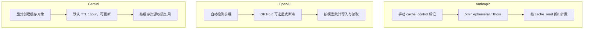
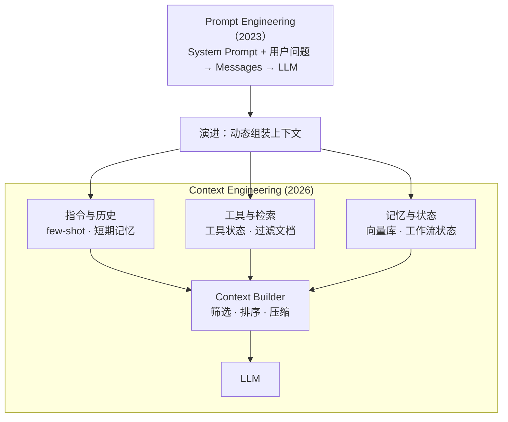
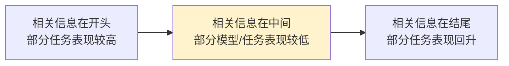
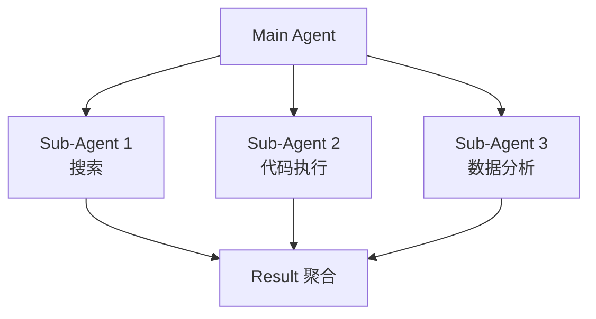

# 第 18 章 Context Engineering ⭐⭐⭐⭐
> [!abstract] 本章导航
> **定位**：第三部分 Prompt、Context 与 RAG中的第 18 章；围绕“Context Engineering”建立单一、可追踪的知识主线。
>
> **先修**：[[17_Prompt_Engineering|第 17 章 Prompt Engineering]]。
>
> **学习目标**：
> - 解释 上下文缓存与成本控制 的核心问题、机制与适用边界。
> - 实现或评估 从 Prompt 到 Context 的最小闭环。
> - 使用可复现证据诊断 Context 的四大组成 的工程取舍与失败模式。
>
> **建议路径**：上下文缓存与成本控制 → 从 Prompt 到 Context → Context 的四大组成 → 上下文窗口经济学 → 压缩与裁剪策略 → Sub-Agent 模式 → 生产边界与面试表达。
>
> **配套代码**：`code/ch18_context_engineering/`。

本章先回答“上下文缓存与成本控制”为什么成立，再沿着机制、实现、评估和边界逐步展开。阅读时先建立因果链，再运行或推演示例，最后用章末自测检查能否脱离原文复述。
## 18.1 上下文缓存与成本控制
### 18.1.1 Prompt Caching：成本优化的关键

Prompt Caching 可复用大段相同前缀（如 system prompt、few-shot 示例、长文档）的计算。是否省钱取决于前缀长度、复用次数、写入/读取单价、TTL 和命中率；不存在跨厂商通用的“节省 50%-90%”保证。

#### 18.1.1.1 Anthropic Prompt Caching（5min/1hr）

Anthropic 提供两种 TTL 的缓存：

| 缓存类型 | TTL | 写入计价（相对基础输入） | 命中/刷新计价 |
|---------|-----|---------|---------|
| **ephemeral（默认）** | 5 分钟 | 1.25× | 0.1× |
| **ephemeral + `ttl: "1h"`** | 1 小时 | 2× | 0.1× |

```python
# Anthropic Prompt Caching 示例
import anthropic

client = anthropic.Anthropic()

# 在 system prompt 中标记 cache_control 断点
system_prompt = [
    {
        "type": "text",
        "text": "你是一位资深 Python 后端工程师，擅长代码审查和性能优化。请严格按 JSON 格式输出审查结果。",
    },
    {
        "type": "text",
        "text": f"<company_kb>\n{open('kb.md').read()}\n</company_kb>",  # 大段静态内容
        "cache_control": {"type": "ephemeral"}  # 5 分钟缓存
    }
]

# 长文档（每次请求不同，但前缀可复用）
long_document = load_user_document()  # 假设 50K tokens

response = client.messages.create(
    model="claude-opus-4-8",
    max_tokens=2048,
    system=system_prompt,
    messages=[{
        "role": "user",
        "content": [
            {"type": "text", "text": f"<document>{long_document}</document>"},
            {"type": "text", "text": "请审查上述代码的安全漏洞。"}
        ]
    }]
)

# 检查缓存命中情况
print(f"缓存创建: {response.usage.cache_creation_input_tokens}")
print(f"缓存读取: {response.usage.cache_read_input_tokens}")
print(f"新输入:   {response.usage.input_tokens}")
reuse_rate = response.usage.cache_read_input_tokens / max(
    response.usage.cache_read_input_tokens
    + response.usage.cache_creation_input_tokens
    + response.usage.input_tokens,
    1,
)
print(f"缓存 token 复用率: {reuse_rate:.2%}")
```

#### 18.1.1.2 OpenAI Automatic Caching

OpenAI 对支持的模型提供 prompt caching。GPT-5.6 仍可使用隐式自动缓存，也新增显式断点；显式写入按未缓存输入的 1.25× 计价，读取按模型页的 cached-input 价格计价。缓存行为和最低前缀长度应以目标模型文档为准。

```python
# GPT-5.6 隐式缓存：保持稳定前缀在前、动态内容在后
from openai import OpenAI

client = OpenAI()

# 只要前缀稳定（前 1024+ tokens 相同），OpenAI 自动命中缓存
response = client.responses.create(
    model="gpt-5.6",
    input=[
        {
            "role": "system",
            "content": LARGE_SYSTEM_PROMPT  # > 1024 tokens，自动进入缓存候选
        },
        {
            "role": "user",
            "content": f"文档：{document}\n问题：{user_query}"  # 动态部分
        }
    ]
)
```

**OpenAI 缓存关键约束**：

- 查看 `usage.input_tokens_details.cached_tokens` 与 GPT-5.6 的 `cache_write_tokens`，用实际账单口径计算收益
- 同一前缀只改一个 token，改动点之后的内容通常不能复用
- GPT-5.6 可通过 `prompt_cache_options` 选择隐式/显式模式及 TTL；不要继续使用旧的 `prompt_cache_retention`

#### 18.1.1.3 Gemini Explicit Caching

Gemini 2.5+ 同时支持隐式缓存；显式缓存需要主动创建缓存对象，适合“一份大内容、多次提问”。显式缓存默认 TTL 为 1 小时，也可传 `ttl` 或绝对 `expire_time`，官方 API 没有“最长 1 小时”的通用限制。

```python
# Google Gen AI SDK
from google import genai
from google.genai import types

client = genai.Client()
model_name = "gemini-3.6-flash"

# 1. 显式创建缓存；省略 ttl 时默认 1 小时
cache = client.caches.create(
    model=model_name,
    config=types.CreateCachedContentConfig(
        display_name="company-handbook-cache",
        system_instruction="你是企业知识库助手。",
        contents=[large_handbook_doc],
        ttl="3600s",
    ),
)

# 2. 使用缓存进行推理
response = client.models.generate_content(
    model=model_name,
    contents="公司年假政策是什么？",
    config=types.GenerateContentConfig(cached_content=cache.name),
)
print(response.text)

# 3. 查询缓存用量
usage = response.usage_metadata
print(f"缓存命中 tokens: {usage.cached_content_token_count}")
print(f"新输入 tokens:   {usage.prompt_token_count - usage.cached_content_token_count}")
```

**Gemini 缓存特性**：

- 默认 TTL 为 1 小时，可更新 TTL 或绝对过期时间
- 可在有权限访问该缓存资源的请求间复用；不要把它理解成跨用户公开共享
- 适合"一份长文档 + 多次提问"场景
- 显式缓存可能同时涉及缓存输入和存储费用，应按目标模型当前价格计算盈亏平衡点

#### 18.1.1.4 三家厂商缓存对比



缓存能力与价格会变化。权威参考（核验日期：2026-07-31）：[Anthropic Prompt Caching](https://docs.anthropic.com/en/docs/build-with-claude/prompt-caching)、[Anthropic Pricing](https://docs.anthropic.com/en/docs/about-claude/pricing)、[OpenAI GPT-5.6 model guidance](https://developers.openai.com/api/docs/guides/latest-model)、[Google Gemini Caching API](https://ai.google.dev/api/caching)。

---

### 18.1.2 Prompt Cache 命中率优化实战

缓存只复用**从开头连续相同的前缀**。不能为了命中而重排 system/user/assistant 消息，否则会改变对话语义。也不要用“4 字符约等于 1 token”估算中文；应调用目标模型的 tokenizer/token-count API。

不同厂商的 usage 字段口径不同，先归一化再监控：

| 厂商 | 复用率示例口径 |
|------|----------------|
| Anthropic | `cache_read / (cache_read + cache_creation + uncached_input)` |
| OpenAI | `input_tokens_details.cached_tokens / input_tokens` |
| Gemini | `cached_content_token_count / prompt_token_count` |

#### 18.1.2.1 优化策略清单

1. 将版本化的 system prompt、工具定义和固定 few-shot 放在最前面，动态问题放在最后。
2. 保持消息顺序、角色、空白和工具定义稳定；模板变更要显式版本化。
3. 只缓存确实会被复用且超过服务商阈值的前缀；不要用无意义 padding 凑阈值。
4. 同时监控命中 token、写入 token、读取 token、总输入 token、延迟和真实费用。
5. 用业务流量计算盈亏平衡点；高命中率不等于低成本或高质量。

#### 18.1.2.2 实战代码：保持连续前缀的缓存规划器

```python
from collections.abc import Callable

class PromptCachePlanner:
    """只在调用者明确声明的边界处分割，不移动任何消息。"""

    def __init__(
        self,
        count_tokens: Callable[[list[dict]], int],
        min_cache_tokens: int,
    ):
        self.count_tokens = count_tokens
        self.min_cache_tokens = min_cache_tokens

    def split(
        self,
        messages: list[dict],
        stable_prefix_count: int,
    ) -> tuple[list[dict], list[dict]]:
        if not 0 <= stable_prefix_count <= len(messages):
            raise ValueError("stable_prefix_count 越界")
        prefix = messages[:stable_prefix_count]
        suffix = messages[stable_prefix_count:]
        if self.count_tokens(prefix) < self.min_cache_tokens:
            return [], messages
        return prefix, suffix

# count_tokens 应绑定目标模型的官方 tokenizer/token-count API。
# stable_prefix_count 来自应用模板版本，而不是按消息长度猜测。
```

#### 18.1.2.3 命中率监控与告警

```python
from collections import deque
from dataclasses import dataclass, field

@dataclass
class CacheMetrics:
    """接收已按供应商口径归一化的 cached/total input tokens。"""

    window_size: int = 100
    history: deque[tuple[int, int]] = field(init=False)

    def __post_init__(self):
        self.history = deque(maxlen=self.window_size)

    def record(self, cached_tokens: int, total_input_tokens: int):
        if not 0 <= cached_tokens <= total_input_tokens:
            raise ValueError("token 指标不合法或尚未按供应商口径归一化")
        self.history.append((cached_tokens, total_input_tokens))

    @property
    def weighted_reuse_rate(self) -> float:
        cached = sum(item[0] for item in self.history)
        total = sum(item[1] for item in self.history)
        return cached / total if total else 0.0

# 阈值来自容量计划和成本模型，不应在通用库中硬编码。
```

---

## 18.2 从 Prompt 到 Context



**核心洞察**: Context = Prompt + History + Tools + RAG + Memory + State。

## 18.3 Context 的四大组成

### 18.3.1 Instructions (指令)

- System prompt
- Few-shot examples
- Tool definitions
- Output format spec

### 18.3.2 Knowledge (知识)

- RAG 检索结果
- User-uploaded documents
- Database query results
- Web search results

### 18.3.3 Tools (工具)

- Available MCP servers
- Function schemas
- Current tool state
- Recent tool outputs

### 18.3.4 State (状态)

- Conversation history
- Long-term memory
- Structured state (LangGraph)
- Sub-agent results

## 18.4 上下文窗口经济学

### 18.4.1 Token 经济学公式

```
总成本 = 未缓存输入 + 缓存写入 + 缓存读取 + 输出 + 缓存存储/工具/基础设施
端到端延迟 = 排队 + TTFT（含 prefill）+ TPOT × 输出tokens + 工具调用
质量 = f(模型快照, 任务, 上下文长度/位置/结构, 干扰项, 解码配置)
```

模型窗口、区域可用性和计价变化很快，不在教程中冻结一张“永久有效”的数值表。部署前应逐项核验：

| 核验项 | 为什么不能只看宣传窗口 |
|---|---|
| 精确模型 ID / 快照 | 同一家族不同快照的窗口、输入类型和缓存规则可能不同 |
| 最大输入与最大输出 | “上下文窗口”通常包含输入、输出及部分工具内容，口径需看 API 文档 |
| 超长上下文计价 | 部分提供方在阈值后采用不同费率，区域/服务层也可能影响价格 |
| 目标任务有效性 | API 能接收不等于模型能可靠利用；必须做位置、长度和干扰项评测 |

当前入口：[OpenAI 模型目录](https://developers.openai.com/api/docs/models)、
[Claude 模型概览](https://platform.claude.com/docs/en/about-claude/models/overview)、
[Gemini 模型目录](https://ai.google.dev/gemini-api/docs/models)。

### 18.4.2 Context 衰减现象 (Context Rot)



这里必须区分两个现象：

- [Lost in the Middle](https://aclanthology.org/2024.tacl-1.9/) 在多文档问答和键值检索中观察到：
  相关信息位于开头或结尾时常优于位于中间，呈任务相关的 U 型位置效应。
- [Chroma Context Rot](https://www.trychroma.com/research/context-rot) 控制任务复杂度并改变输入长度、
  语义相似度、干扰项和文本结构，观察到长度增加时性能会变得更不可靠；但其特定 NIAH
  设置并未观察到显著的位置差异。

因此不存在适用于所有模型的 `64K`、`200K` 质量分界，也不能断言“尾部几乎忘记”。
配套 `03_context_rot_demo.py` 只画一条**合成教学 U 型曲线**，不是任何模型的测量结果。

真实评测至少应固定模型快照和解码配置，交叉改变：

1. 输入长度与证据位置（覆盖首/中/尾多个位置）；
2. 词面匹配与语义匹配；
3. 无干扰、单干扰和多干扰；
4. 连贯与打乱的 haystack；
5. 多个样本/随机种子，并报告准确率、拒答率、置信区间、延迟和实际 token 成本。

## 18.5 压缩与裁剪策略

### 18.5.1 三大策略对比

| 策略 | 原理 | 优势 | 劣势 |
|------|------|------|------|
| **Summarization** | LLM 生成历史摘要 | 保留语义 | 需额外 LLM 调用 |
| **Sliding Window** | 只保留最近 K 轮 | 简单 | 丢失早期信息 |
| **Compaction** | 关键事实抽取 | 保留事实 | 需规则定义 |

### 18.5.2 LangGraph 持久化示例

```python
from langgraph.checkpoint.memory import MemorySaver
from langgraph.graph import StateGraph

# 持久化状态 - 即使 LLM "忘记"，state 仍保留
memory = MemorySaver()

workflow = StateGraph(AgentState)
workflow.add_node("agent", call_model)
workflow.add_node("tools", ToolNode(tools))
workflow.set_entry_point("agent")
workflow.add_conditional_edges("agent", should_continue, {"tools": "tools", "end": END})
workflow.add_edge("tools", "agent")

app = workflow.compile(checkpointer=memory)

# 多轮对话
config = {"configurable": {"thread_id": "user-123"}}
result1 = app.invoke({"messages": [...]}, config)
result2 = app.invoke({"messages": [...]}, config)  # 状态保留
```

## 18.6 Sub-Agent 模式



**优势**:
- 每个 sub-agent 拥有干净的 context
- 并行执行
- 错误隔离

代价是额外调用、协调状态和汇总信息可能增加总 token 与延迟；是否更省需要实测。

**代表实现**: Claude Code / Cursor Agent / Devin。

## 18.7 Context Caching (提示缓存)

以下为 2026-07-31 官方文档口径；上线前仍需重新核对模型与价格页：

| 提供方 | 当前机制与时效 | 成本边界 |
|---|---|---|
| **Anthropic** | 自动或显式 breakpoint；默认 5 分钟，可选 1 小时 | 相对基础输入价：5 分钟写入 `1.25×`、1 小时写入 `2×`、读取 `0.1×` |
| **OpenAI（GPT-5.6+）** | 默认 implicit，也可显式 breakpoint；`ttl` 表示最短生命周期，当前唯一值/默认值为 `30m`，服务可能保留更久 | 写入 `1.25×` 未缓存输入价；命中按 cached-input 价，需查目标模型价格页 |
| **Gemini（2.5+）** | implicit 默认启用但不保证命中；Generate Content 可显式缓存，默认 TTL 1 小时 | implicit 命中才传递折扣；显式缓存另计 token 存储时长，绝非“免费命中” |

官方依据：[Anthropic Prompt Caching](https://platform.claude.com/docs/en/build-with-claude/prompt-caching)、
[OpenAI Prompt Caching](https://developers.openai.com/api/docs/guides/prompt-caching)、
[Gemini implicit caching](https://ai.google.dev/gemini-api/docs/caching) 与
[Gemini Generate Content explicit caching](https://ai.google.dev/gemini-api/docs/generate-content/caching)。

**最佳实践**：把完全稳定的 system prompt、few-shot 和工具 schema 放在前缀，动态内容放在后缀；
记录 cache-write/cache-read token、命中率和 TTL。`0.1×` 只表示 Anthropic **已命中的输入 token**
相对基础输入价便宜 90%，不等于整次请求或整套系统总成本下降 90%；首次写入、未命中输入、
输出、存储、工具和基础设施仍会计费。

## 18.8 Haystack 2.x Context-Engineered Pipelines

```python
import os

from haystack import Pipeline
from haystack.components.builders import ChatPromptBuilder
from haystack.components.generators import OpenAIGenerator
from haystack.components.retrievers import InMemoryBM25Retriever

# Context-engineered pipeline
pipe = Pipeline()
pipe.add_component("retriever", InMemoryBM25Retriever(document_store=doc_store))
pipe.add_component("prompt_builder", ChatPromptBuilder(template=template))
pipe.add_component("llm", OpenAIGenerator(model=os.environ["OPENAI_MODEL"]))

pipe.connect("retriever.documents", "prompt_builder.documents")
pipe.connect("prompt_builder.prompt", "llm.messages")

result = pipe.run({
    "retriever": {"query": query},
    "prompt_builder": {"question": query}
})
```
## 🧭 本章小结

- 上下文缓存与成本控制：能够说清问题、机制、证据与边界。
- 从 Prompt 到 Context：能够说清问题、机制、证据与边界。
- Context 的四大组成：能够说清问题、机制、证据与边界。

## ✅ 自测与练习

1. 不看正文，解释“上下文缓存与成本控制”解决什么问题，并给出一个不适用场景。
2. 为“从 Prompt 到 Context”设计一个最小可复现实验，明确输入、指标和通过条件。
3. 比较“Context 的四大组成”的至少两种方案，说明质量、成本、延迟或风险取舍。

## 🧪 配套代码与验收

- `code/ch18_context_engineering/`

```powershell
python code/scripts/run_all_examples.py --chapter ch18 --tier core
```

默认验收不下载模型、不调用付费 API；真实 API 或 GPU 示例必须按 metadata 显式启用。成功标准是相关脚本输出 `OK`，条件不足时输出可解释的 `[SKIP]`。

## 🎯 面试题精讲

回答本章问题时使用四步结构：先给结论，再解释机制，然后给项目证据，最后主动说明适用边界。涉及性能或效果时，补充模型、硬件、数据、并发、版本和统计口径；条件不完整时明确说“需要实测”。

## 📋 本章速查表

| 主题 | 回答主线 |
|---|---|
| 上下文缓存与成本控制 | 问题 → 机制 → 示例 → 指标 → 边界 |
| 从 Prompt 到 Context | 问题 → 机制 → 示例 → 指标 → 边界 |
| Context 的四大组成 | 问题 → 机制 → 示例 → 指标 → 边界 |
| 上下文窗口经济学 | 问题 → 机制 → 示例 → 指标 → 边界 |
| 压缩与裁剪策略 | 问题 → 机制 → 示例 → 指标 → 边界 |

## 🔗 相关章节

- [[17_Prompt_Engineering|第 17 章 Prompt Engineering]]
- [[19_RAG数据解析分块与索引|第 19 章 RAG 数据解析、分块与索引]]

## 📖 一手参考资料

> 核验基线：2026-07-31；结构复核：2026-08-05。产品、API、法规、价格与 benchmark 会变化，使用前应再次核验。

- [[docs/AUTHORITATIVE_SOURCES|章节权威来源索引]]：按主题维护官方文档、标准、原论文和官方仓库。
