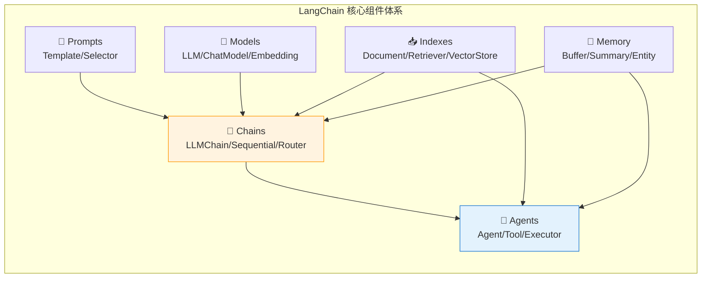
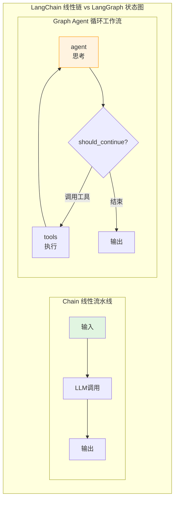
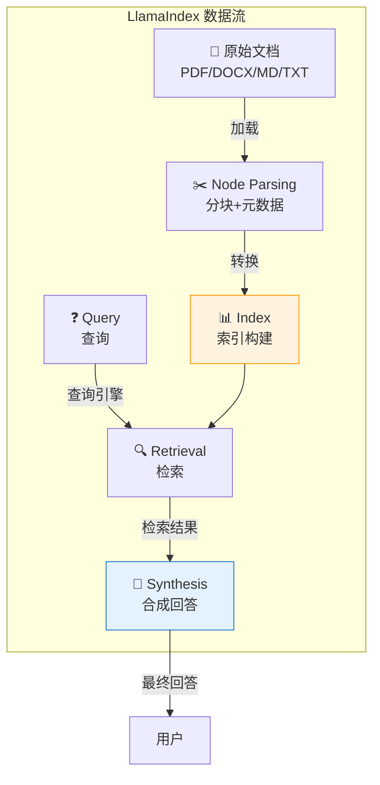
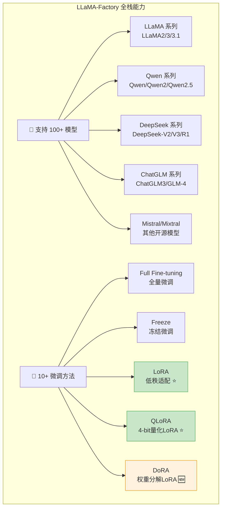
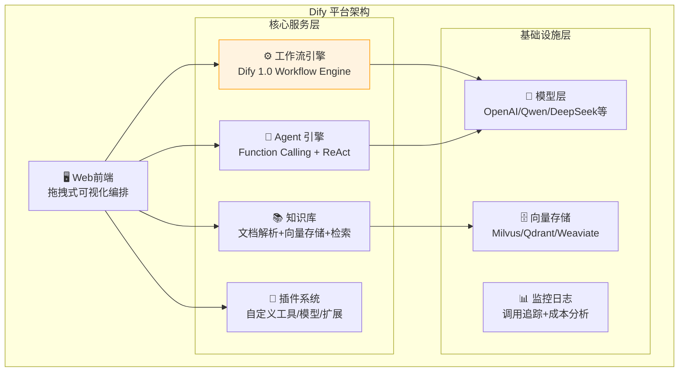
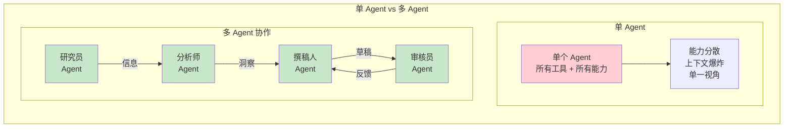
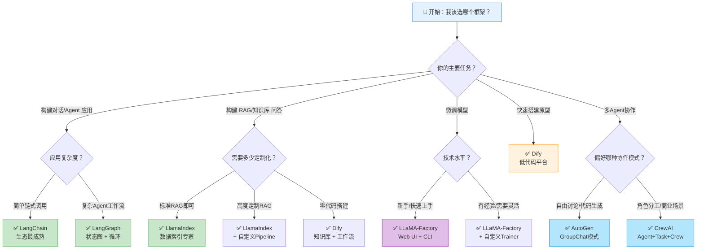

# 第 18 章 LLM 工程框架实战 ⭐⭐⭐⭐⭐

> [!abstract] 本章导航
> **定位**：把 RAG、Agent 和微调能力映射到主流框架，重点训练抽象与选型判断。
>
> **先修**：[[13_Prompt_Engineering]]、[[14_RAG检索增强生成]]、[[15_Agent智能体开发]]。
>
> **学习目标**：
> - 比较主流 LLM 框架的核心抽象和版本边界。
> - 运行一个最小框架示例并识别状态与数据流。
> - 根据可控性、生态和运维成本做出选型。
>
> **建议路径**：LangChain 核心 → LangGraph 状态图工作流 → LlamaIndex 数据索引与检索 → … → 框架选型决策树。先完成主线，再按需要阅读进阶内容。
>
> **配套代码**：`code/ch18_llm_frameworks/`。

> [!info] 阅读提示
> 从 LangChain 到 LangGraph，从 LlamaIndex 到 Dify，从 LLaMA-Factory 到 AutoGen/CrewAI —— 大模型工程框架生态在 2025-2026 年经历了持续演进。本章深入解析六大核心框架的设计哲学、核心抽象、实战代码和面试考点，帮助你建立完整的框架选型知识体系。
>
> **版本与范围**：新增 LangGraph v1.0 稳定版 API、Dify 1.0 工作流引擎、CrewAI 企业级 Flow 模式、LlamaIndex Agent Workflow、LLaMA-Factory 多模态微调支持等最新内容。

## 18.1 LangChain 核心 ⭐⭐⭐⭐⭐

> **版本边界（2026-07）**：本仓库面向 LangChain 1.x。LCEL、`create_agent` 和 LangGraph 是当前路径；
> `LLMChain`、`ConversationChain` 及旧 Memory 类已迁入 `langchain-classic`，下文保留这些内容只用于
> 阅读存量项目和迁移面试题，不能继续从 `langchain` 主命名空间导入。模型示例默认读取
> `OPENAI_MODEL`，未设置时使用当前通用别名 `gpt-5.6`：
>
> ```python
> import os
> OPENAI_MODEL = os.environ.get("OPENAI_MODEL", "gpt-5.6")
> ```
>
> 低成本批处理应根据运行时的当前模型目录和本地评测另选模型，不把历史的 `mini` ID 固化到代码中。

### 18.1.1 LangChain 设计哲学

LangChain 的核心理念是 **"Composability"（可组合性）** —— 将 LLM 应用拆解为可复用的组件，通过链式调用来构建复杂应用。



**LangChain 表达式语言（LCEL）** 是 LangChain 的最新编排范式，使用 `|` 管道操作符连接组件：

```python
# LCEL 风格：声明式链式调用
from langchain_core.prompts import ChatPromptTemplate
from langchain_openai import ChatOpenAI
from langchain_core.output_parsers import StrOutputParser

prompt = ChatPromptTemplate.from_template("讲一个关于{topic}的笑话")
model = ChatOpenAI(model=OPENAI_MODEL)
output_parser = StrOutputParser()

# 管道式组合：prompt | model | parser
chain = prompt | model | output_parser

# 一行调用
result = chain.invoke({"topic": "程序员"})
print(result)
```

### 18.1.2 Chain 概念与类型 ⭐⭐⭐⭐

Chain 是 LangChain 的核心抽象 —— 将多个组件"链接"成一个可执行流程。

#### LLMChain：最基础的链（存量迁移参考）

> LangChain 1.x 新项目优先使用上面的 LCEL；运行这一存量写法需额外安装 `langchain-classic`。

```python
from langchain_classic.chains import LLMChain
from langchain_core.prompts import PromptTemplate
from langchain_openai import ChatOpenAI

llm = ChatOpenAI(model=OPENAI_MODEL)

prompt = PromptTemplate(
    input_variables=["product", "audience"],
    template="为{product}写一段面向{audience}的广告文案，50字以内。"
)

chain = LLMChain(llm=llm, prompt=prompt)
result = chain.invoke({"product": "智能手表", "audience": "运动爱好者"})
print(result["text"])
```

#### SequentialChain：顺序执行链

```python
from langchain_classic.chains import LLMChain, SequentialChain
from langchain_core.prompts import PromptTemplate
from langchain_openai import ChatOpenAI

llm = ChatOpenAI(model=OPENAI_MODEL)

# 第一链：生成大纲
chain1 = LLMChain(
    llm=llm,
    prompt=PromptTemplate(
        input_variables=["topic"],
        template="为关于'{topic}'的博客文章生成一个3点大纲。"
    ),
    output_key="outline"
)

# 第二链：基于大纲写正文
chain2 = LLMChain(
    llm=llm,
    prompt=PromptTemplate(
        input_variables=["outline"],
        template="基于以下大纲，写一篇300字的博客文章：\n\n{outline}"
    ),
    output_key="article"
)

# 串联
overall_chain = SequentialChain(
    chains=[chain1, chain2],
    input_variables=["topic"],
    output_variables=["outline", "article"],
    verbose=True
)

result = overall_chain.invoke({"topic": "大模型应用框架选型"})
print(result["article"])
```

#### RouterChain：条件路由链

RouterChain 根据输入内容动态选择下游处理链：

```python
from langchain_classic.chains import ConversationChain
from langchain_classic.chains.router import MultiPromptChain
from langchain_openai import ChatOpenAI

llm = ChatOpenAI(model=OPENAI_MODEL)

# 定义不同专业的提示词模板
physics_template = """你是一位物理学专家。请专业地回答以下问题：
{input}"""

math_template = """你是一位数学专家。请用严谨的数学语言回答：
{input}"""

coding_template = """你是一位资深程序员。请用代码示例回答问题：
{input}"""

prompt_infos = [
    {"name": "physics", "description": "适合回答物理问题", "prompt_template": physics_template},
    {"name": "math", "description": "适合回答数学问题", "prompt_template": math_template},
    {"name": "coding", "description": "适合回答编程问题", "prompt_template": coding_template},
]

# 自动路由：LLM 根据问题内容选择最合适的专家
router_chain = MultiPromptChain.from_prompts(
    llm=llm,
    prompt_infos=prompt_infos,
    verbose=True
)

# 同一个链，自动路由到不同专家
print(router_chain.invoke("什么是量子纠缠？"))       # → physics
print(router_chain.invoke("如何用Python写快速排序？"))  # → coding
```

#### Chain 类型对比表

| Chain 类型 | 执行模式 | 适用场景 | 数据流 |
|-----------|---------|---------|-------|
| **LLMChain** | 单步 | 单一 LLM 调用 + Prompt | 输入 → Prompt → LLM → 输出 |
| **SequentialChain** | 串行 | 多步骤流水线 | 上一步输出 → 下一步输入 |
| **RouterChain** | 条件分支 | 按内容分流处理 | 输入 → 路由判断 → 选择子链 |
| **RetrievalQA** | 检索+生成 | RAG 问答 | 问题 → 检索 → 上下文+问题 → LLM |
| **ConversationalRetrievalChain** | 对话+检索 | 带历史的 RAG 对话 | 历史+问题 → 检索 → 上下文+历史+问题 → LLM |
| **MapReduceChain** | 并行→聚合 | 长文档处理 | 文档分段 → 并行处理 → 汇总 |

### 18.1.3 Memory 机制深度解析 ⭐⭐⭐⭐

Memory 是对话系统的核心。LangChain 提供了多种 Memory 实现来管理对话上下文。

#### ConversationBufferMemory：完整缓冲记忆

```python
from langchain_classic.chains import ConversationChain
from langchain_classic.memory import ConversationBufferMemory
from langchain_openai import ChatOpenAI

llm = ChatOpenAI(model=OPENAI_MODEL)
memory = ConversationBufferMemory(return_messages=True)

conversation = ConversationChain(
    llm=llm,
    memory=memory,
    verbose=True
)

conversation.predict(input="我叫张三，我今年30岁。")
conversation.predict(input="我的名字是什么？")   # ✓ 正确回答 "张三"
conversation.predict(input="我几岁了？")         # ✓ 正确回答 "30"

# 查看记忆内容
print(memory.load_memory_variables({}))
# {'history': [HumanMessage(...), AIMessage(...), ...]}
```

**Memory 类型对比**：

| Memory 类型 | 存储方式 | Token 消耗 | 遗忘风险 | 适用场景 |
|------------|---------|-----------|---------|---------|
| **ConversationBufferMemory** | 完整存储所有消息 | 线性增长 | 无（但有截断） | 短对话 |
| **ConversationBufferWindowMemory** | 只保留最近 K 轮 | 固定 O(K) | 早期对话丢失 | 中等长度对话 |
| **ConversationSummaryMemory** | LLM 摘要 | 固定（摘要+最近轮次） | 细节可能丢失 | 长对话 |
| **ConversationSummaryBufferMemory** | 摘要+最近 K 轮缓冲 | 可控 | 较少 | 超长对话 |
| **ConversationTokenBufferMemory** | 按 Token 数截断 | 固定上限 | 早期对话丢失 | Token 限制场景 |
| **VectorStoreRetrieverMemory** | 向量检索 | 每次检索固定 | 可能遗漏 | 需要长期记忆 |

#### ConversationSummaryMemory：摘要记忆

```python
from langchain_classic.memory import ConversationSummaryMemory
from langchain_openai import ChatOpenAI

llm = ChatOpenAI(model=OPENAI_MODEL)
memory = ConversationSummaryMemory(
    llm=llm,
    return_messages=True,
    max_token_limit=500  # 摘要的最大 Token 数
)

conversation = ConversationChain(llm=llm, memory=memory)

# 多轮对话后，早期对话被压缩为摘要
conversation.predict(input="我叫王五，在北京工作。")
conversation.predict(input="我是一名软件工程师。")
conversation.predict(input="我的团队有10个人。")
conversation.predict(input="我在做什么工作？")  # ✓ 从摘要或历史中获取

print(memory.load_memory_variables({})["history"])
# System: 用户叫王五，在北京工作，是一名软件工程师，团队有10人。
# Human: 我在做什么工作？
# AI: 你是一名软件工程师。
```

#### 自定义 Memory 实战：带 Token 管理的记忆

```python
from langchain_classic.memory import ConversationSummaryBufferMemory
from langchain_openai import ChatOpenAI
from langchain_classic.chains import ConversationChain

llm = ChatOpenAI(model=OPENAI_MODEL)

# SummaryBufferMemory = 摘要 + 最近 K 轮原始对话
memory = ConversationSummaryBufferMemory(
    llm=llm,
    max_token_limit=2000,  # 总 Token 预算
    return_messages=True,
)

conversation = ConversationChain(
    llm=llm,
    memory=memory,
    verbose=False
)

# 模拟长对话
topics = [
    "我想了解大模型应用框架。",
    "请详细介绍 LangChain。",
    "LangChain 的 Memory 有哪些类型？",
    "Memory 的 Token 消耗如何优化？",
    "除了 LangChain，还有哪些框架？",
    "LangGraph 和 LangChain 有什么关系？",
    "请对比一下所有框架的优劣。",
]

for topic in topics:
    response = conversation.predict(input=topic)
    mem = memory.load_memory_variables({})
    history = mem.get("history", "")
    print(f"问题: {topic[:30]}... | 记忆长度: {len(str(history))} 字符")
```

### 18.1.4 Tool 定义与使用 ⭐⭐⭐⭐

Tool（工具）是 Agent 与外部世界交互的桥梁。LangChain 支持多种方式定义工具。

```python
from langchain_core.tools import tool
from langchain.agents import create_agent
from langchain_openai import ChatOpenAI

# ===== 方式1: 使用 @tool 装饰器 =====
@tool
def get_weather(city: str) -> str:
    """获取指定城市的实时天气信息。参数 city 为城市名称（中文）。"""
    # 模拟 API 调用
    weather_data = {
        "北京": "晴，25°C，湿度45%",
        "上海": "多云，28°C，湿度60%",
        "深圳": "阵雨，30°C，湿度80%",
    }
    return weather_data.get(city, f"未找到{city}的天气数据")

@tool
def calculate(expression: str) -> str:
    """执行数学计算。参数 expression 为数学表达式字符串，如 '2+3*4'。"""
    try:
        result = eval(expression, {"__builtins__": {}}, {})
        return f"计算结果：{expression} = {result}"
    except Exception as e:
        return f"计算错误：{str(e)}"

@tool
def search_database(query: str, limit: int = 5) -> str:
    """在数据库中搜索信息。参数 query 为搜索关键词，limit 为返回结果数量。"""
    # 模拟数据库查询
    mock_db = {
        "langchain": "LangChain 是一个用于构建 LLM 应用的框架...",
        "python": "Python 3.14 预计于 2025 年发布...",
        "gpt": "GPT-5.6 是 OpenAI 当前的通用模型系列...",
    }
    results = []
    for k, v in mock_db.items():
        if query.lower() in k or query.lower() in v:
            results.append(f"[{k}]: {v[:100]}...")
    return "\n".join(results[:limit]) or "未找到匹配结果"

# 工具列表
tools = [get_weather, calculate, search_database]

# ===== 创建 Agent =====
llm = ChatOpenAI(model=OPENAI_MODEL)
agent = create_agent(
    model=llm,
    tools=tools,
    system_prompt="你是一个有用的助手，可以使用工具来帮助用户。",
)

# 测试
result = agent.invoke({
    "messages": [{
        "role": "user",
        "content": "北京今天天气怎样？然后帮我算一下 123 * 456 等于多少？",
    }]
})
print(result["messages"][-1].content)
```

### 18.1.5 完整实战：构建带记忆的对话系统 ⭐⭐⭐⭐⭐

```python
"""
完整示例：带记忆的多工具对话 Agent
具备以下能力：
1. 多轮对话记忆（ConversationSummaryBufferMemory）
2. 三个外部工具（天气、计算器、知识检索）
3. 自动工具选择与调用
4. 流式输出支持
"""
from langchain_classic.agents import AgentExecutor, create_openai_functions_agent
from langchain_openai import ChatOpenAI
from langchain_classic.memory import ConversationSummaryBufferMemory
from langchain_core.prompts import ChatPromptTemplate, MessagesPlaceholder
from langchain_core.tools import tool
from langchain_core.messages import AIMessage, HumanMessage
import json
import asyncio

# ===== Step 1: 定义工具 =====
@tool
def weather_tool(city: str) -> str:
    """查询城市天气。输入城市名称。"""
    return json.dumps({"city": city, "temp": "26°C", "condition": "晴"})

@tool
def calculator(expr: str) -> str:
    """执行数学计算。输入表达式如 '2+3*4'。"""
    return str(eval(expr, {"__builtins__": {}}, {"abs": abs, "pow": pow}))

@tool  
def knowledge_search(query: str) -> str:
    """搜索知识库。输入搜索关键词。"""
    kb = {
        "python": "Python 是一种解释型、面向对象的高级编程语言。",
        "ai": "人工智能是计算机科学的一个分支。",
        "llm": "大语言模型（LLM）是基于 Transformer 架构的大规模语言模型。",
    }
    results = [v for k, v in kb.items() if query.lower() in k]
    return results[0] if results else "未找到相关知识。"

# ===== Step 2: 配置记忆 =====
llm = ChatOpenAI(model=OPENAI_MODEL, streaming=True)

memory = ConversationSummaryBufferMemory(
    llm=llm,
    max_token_limit=2000,
    return_messages=True,
    memory_key="chat_history",
    output_key="output",
)

# ===== Step 3: 构建 Agent =====
prompt = ChatPromptTemplate.from_messages([
    ("system", """你是一个智能助手，名为"小智"。你可以：
1. 查询天气信息
2. 执行数学计算
3. 搜索知识库

请根据用户的问题选择合适的工具。回答要亲切、准确。"""),
    MessagesPlaceholder(variable_name="chat_history"),
    ("human", "{input}"),
    MessagesPlaceholder(variable_name="agent_scratchpad"),
])

tools = [weather_tool, calculator, knowledge_search]
agent = create_openai_functions_agent(llm, tools, prompt)

executor = AgentExecutor(
    agent=agent,
    tools=tools,
    memory=memory,
    verbose=True,
    max_iterations=5,
    handle_parsing_errors=True,
)

# ===== Step 4: 交互式对话 =====
def chat():
    print("=" * 50)
    print("🤖 小智智能助手 - 输入 'quit' 退出")
    print("=" * 50)

    while True:
        user_input = input("\n👤 你: ")
        if user_input.lower() in ["quit", "exit", "q"]:
            print("再见！")
            break

        try:
            result = executor.invoke({"input": user_input})
            print(f"\n🤖 小智: {result['output']}")
        except Exception as e:
            print(f"\n❌ 错误: {e}")

if __name__ == "__main__":
    chat()
```

> 📚 **相关章节**：Agent 理论原理见 [[15_Agent智能体开发]]；RAG 系统设计见 [[14_RAG检索增强生成]]。

## 18.2 LangGraph 状态图工作流 ⭐⭐⭐⭐⭐

### 18.2.1 为什么需要 LangGraph

LangChain 的线性 Chain 抽象在处理**复杂、非线性、有条件的 Agent 工作流**时力不从心。LangGraph 将 Agent 建模为**有向有环图（状态机）**，天然支持：

- **循环与迭代**：ReAct 的"思考-行动-观察"循环
- **条件分支**：根据中间结果选择不同路径
- **人机协同（Human-in-the-Loop）**：暂停执行等待人工审批
- **持久化与恢复**：状态可序列化，支持断点续跑
- **流式执行**：每个节点都可以是流式



### 18.2.2 核心概念：State, Node, Edge ⭐⭐⭐⭐

```python
from typing import TypedDict, Annotated, Literal
from langgraph.graph import StateGraph, END
from langgraph.graph.message import add_messages
from langchain_openai import ChatOpenAI
from langchain_core.tools import tool
from langgraph.prebuilt import ToolNode
import operator

# ===== 1. 定义 State（状态）- 在节点间传递的共享数据 =====
class AgentState(TypedDict):
    """
    State 是 LangGraph 的核心：定义了图中流动的数据结构。
    每个 Node 接收 State，返回 State 的部分更新。
    """
    messages: Annotated[list, add_messages]  # add_messages：追加而非覆盖
    next_step: str  # 用于条件路由
    
# ===== 2. 定义 Node（节点）- 执行具体逻辑的函数 =====
def agent_node(state: AgentState) -> dict:
    """
    Agent 节点：调用 LLM 决定下一步行动
    绑定工具后 LLM 可以返回 function_call
    """
    llm = ChatOpenAI(model=OPENAI_MODEL)
    tools = [search_tool, calculator_tool]
    llm_with_tools = llm.bind_tools(tools)
    
    response = llm_with_tools.invoke(state["messages"])
    return {"messages": [response]}

# ===== 3. 定义 Edge（边）- 控制流向 =====
# 普通边（无条件）
# graph.add_edge("node_a", "node_b")  # A 执行后总是到 B

# 条件边（根据状态决定）
def should_continue(state: AgentState) -> Literal["tools", "end"]:
    """
    条件路由函数：
    如果 LLM 返回了 function_call → 执行工具
    否则 → 结束
    """
    last_message = state["messages"][-1]
    if hasattr(last_message, "tool_calls") and last_message.tool_calls:
        return "tools"
    return "end"
```

### 18.2.3 实战：构建多步骤 Agent 工作流 ⭐⭐⭐⭐⭐

```python
"""
LangGraph 实战：多步骤 Research Agent

工作流：接收问题 → 搜索 → 分析 → 判断是否需要更多搜索
   如果需要 → 继续搜索（循环）
   如果足够 → 生成最终答案
"""
from typing import TypedDict, Annotated, Literal
from langgraph.graph import StateGraph, END
from langgraph.graph.message import add_messages
from langgraph.checkpoint.memory import MemorySaver
from langchain_openai import ChatOpenAI
from langchain_core.tools import tool
from langchain_core.messages import SystemMessage, HumanMessage, AIMessage
import json

# ===== 定义工具 =====
@tool
def web_search(query: str) -> str:
    """搜索网络获取信息"""
    # 模拟搜索结果
    mock_results = {
        "langgraph": "LangGraph 是 LangChain 团队开发的状态图Agent框架，支持循环、条件分支和人机协同。",
        "react": "ReAct 是 Reasoning+Acting 的缩写，是 LLM Agent 的经典范式。",
        "multi-agent": "多Agent系统通过多个Agent协作完成复杂任务，常见框架有 AutoGen 和 CrewAI。",
    }
    for k, v in mock_results.items():
        if k in query.lower():
            return v
    return f"关于'{query}'的搜索结果：这是一个活跃的研究领域..."

@tool
def analyze_data(data: str) -> str:
    """分析数据并提取关键洞察"""
    return f"分析结果：'{data}' 中包含3个关键点，建议进一步研究第2点。"

# ===== 定义 State =====
class ResearchState(TypedDict):
    messages: Annotated[list, add_messages]
    research_topic: str
    search_count: int
    analysis_complete: bool

# ===== 定义 Nodes =====
llm = ChatOpenAI(model=OPENAI_MODEL)
tools = [web_search, analyze_data]
llm_with_tools = llm.bind_tools(tools)

def researcher_node(state: ResearchState) -> dict:
    """研究员节点：决定搜索什么"""
    topic = state.get("research_topic", "unknown")
    sys_msg = SystemMessage(content=f"你是一个研究助手。当前主题：{topic}。使用 search 工具获取信息。")
    
    messages = [sys_msg] + state["messages"][-5:]  # 最近5条消息避免过长
    response = llm_with_tools.invoke(messages)
    
    return {
        "messages": [response],
        "search_count": state.get("search_count", 0)
    }

def analyst_node(state: ResearchState) -> dict:
    """分析师节点：分析已收集的信息"""
    sys_msg = SystemMessage(content="分析当前的搜索结果，提取关键信息。如果信息不足，标注为需要继续搜索。")
    messages = [sys_msg] + state["messages"][-5:]
    
    response = llm.invoke(messages)
    return {
        "messages": [response],
        "search_count": state.get("search_count", 0) + 1,
        "analysis_complete": state.get("search_count", 0) >= 3  # 搜索3次后完成
    }

def writer_node(state: ResearchState) -> dict:
    """撰稿节点：生成最终研究报告"""
    sys_msg = SystemMessage(content="基于所有研究信息，撰写一份简洁的研究报告（200字以内）。")
    messages = [sys_msg] + state["messages"]
    
    response = llm.invoke(messages)
    return {"messages": [response]}

# ===== 条件路由 =====
def route_after_analyst(state: ResearchState) -> Literal["researcher", "writer"]:
    if state.get("analysis_complete", False):
        return "writer"
    return "researcher"

def route_after_researcher(state: ResearchState) -> Literal["tools", "analyst"]:
    last_msg = state["messages"][-1]
    if hasattr(last_msg, "tool_calls") and last_msg.tool_calls:
        return "tools"
    return "analyst"

# ===== 构建图 =====
def build_research_graph():
    builder = StateGraph(ResearchState)
    
    # 添加节点
    builder.add_node("researcher", researcher_node)
    builder.add_node("tools", ToolNode(tools))
    builder.add_node("analyst", analyst_node)
    builder.add_node("writer", writer_node)
    
    # 添加边
    builder.set_entry_point("researcher")
    
    # 条件边
    builder.add_conditional_edges("researcher", route_after_researcher, {
        "tools": "tools",
        "analyst": "analyst"
    })
    builder.add_edge("tools", "researcher")  # 工具执行后回到研究员
    builder.add_conditional_edges("analyst", route_after_analyst, {
        "researcher": "researcher",  # 循环：继续搜索
        "writer": "writer"           # 结束：生成报告
    })
    builder.add_edge("writer", END)
    
    # 编译（带持久化）
    memory = MemorySaver()
    return builder.compile(checkpointer=memory)

# ===== 运行 =====
graph = build_research_graph()

config = {"configurable": {"thread_id": "research-001"}}
result = graph.invoke(
    {
        "messages": [HumanMessage(content="请研究LangGraph的最新特性")],
        "research_topic": "LangGraph",
        "search_count": 0,
        "analysis_complete": False
    },
    config=config
)

# 打印执行结果
for msg in result["messages"]:
    if isinstance(msg, AIMessage) and msg.content:
        print(f"AI: {msg.content[:200]}...\n")
```

### 18.2.4 人机协同（Human-in-the-Loop）⭐⭐⭐⭐

```python
"""
LangGraph Human-in-the-Loop 实战
关键操作审批流：生成操作计划 → 暂停等待人工确认 → 继续执行
"""
from langgraph.graph import StateGraph, END
from langgraph.checkpoint.memory import MemorySaver
from langgraph.types import interrupt, Command
from typing import TypedDict, Annotated
from langgraph.graph.message import add_messages

class ApprovalState(TypedDict):
    messages: Annotated[list, add_messages]
    plan: str
    approved: bool

def planner_node(state: ApprovalState) -> dict:
    """生成执行计划"""
    plan = """
    执行计划：
    1. 备份数据库
    2. 更新模型版本到 v2.1
    3. 运行回归测试
    4. 切换流量到新版本
    """
    return {"plan": plan, "messages": [AIMessage(content=f"已生成计划：\n{plan}")]}

def human_approval_node(state: ApprovalState) -> dict:
    """人机协同关键节点：使用 interrupt() 暂停执行"""
    # 这里 interrupt() 会暂停图执行，等待外部输入
    user_decision = interrupt(f"请审批以下计划：\n{state['plan']}\n\n输入 'approve' 或 'reject':")
    
    if user_decision.lower() == "approve":
        return {"approved": True, "messages": [AIMessage(content="计划已批准，开始执行。")]}
    else:
        return {"approved": False, "messages": [AIMessage(content="计划被拒绝。")]}

def execute_node(state: ApprovalState) -> dict:
    """执行已批准的计划"""
    return {"messages": [AIMessage(content="执行完成：所有步骤已成功。")]}

def route_after_approval(state: ApprovalState) -> Literal["execute", END]:
    return "execute" if state["approved"] else END

# 构建图
builder = StateGraph(ApprovalState)
builder.add_node("planner", planner_node)
builder.add_node("human_approval", human_approval_node)
builder.add_node("execute", execute_node)

builder.set_entry_point("planner")
builder.add_edge("planner", "human_approval")
builder.add_conditional_edges("human_approval", route_after_approval)
builder.add_edge("execute", END)

graph = builder.compile(checkpointer=MemorySaver())

# 第一轮：运行到审批节点前
config = {"configurable": {"thread_id": "approval-001"}}
result = graph.invoke(
    {"messages": [HumanMessage(content="准备部署新版本")], "approved": False},
    config=config
)

# 程序在此暂停，等待人工输入
# 通过 graph.invoke() 传入 Command(resume=...) 来恢复并传递审批结果
result = graph.invoke(
    Command(resume="approve"),  # 传入 "approve" 继续执行
    config=config
)
```

> 📚 **相关章节**：Agent 设计模式详见 [[15_Agent智能体开发]]。

## 18.3 LlamaIndex 数据索引与检索 ⭐⭐⭐⭐⭐

### 18.3.1 核心概念与架构概览

LlamaIndex（原 GPT Index）是专注于**数据索引与检索增强生成（RAG）**的框架。其设计哲学是：**将你的数据连接到大模型**。



**核心抽象**：

| 概念 | 说明 | 类比 |
|------|------|------|
| **Document** | 原始文档容器，包含文本+元数据 | 一本书 |
| **Node** | 文档的一个片段/块，带元数据 | 书的一个段落 |
| **Index** | 索引结构，用于检索 | 书后的索引 |
| **Retriever** | 检索器，从 Index 中召回相关 Node | 搜索引擎 |
| **QueryEngine** | 查询引擎，端到端问答 | 搜索+回答 |
| **ChatEngine** | 聊天引擎，带对话历史的问答 | 对话式搜索 |

### 18.3.2 索引类型与应用场景 ⭐⭐⭐⭐

#### VectorStoreIndex：向量索引（最常用）

```python
from llama_index.core import VectorStoreIndex, SimpleDirectoryReader
from llama_index.core import Settings
from llama_index.embeddings.openai import OpenAIEmbedding
from llama_index.llms.openai import OpenAI
import os

# 全局配置
Settings.llm = OpenAI(model=os.environ.get("OPENAI_MODEL", "gpt-5.6"))
Settings.embed_model = OpenAIEmbedding(model="text-embedding-3-small")

# 加载文档
documents = SimpleDirectoryReader("./data/").load_data()

# 构建向量索引（自动分块+向量化+存储）
index = VectorStoreIndex.from_documents(documents)

# 查询
query_engine = index.as_query_engine()
response = query_engine.query("公司的退换货政策是什么？")
print(response)
```

#### SummaryIndex：摘要索引

```python
from llama_index.core import SummaryIndex

# SummaryIndex 适合需要对整个文档集合进行概括的场景
summary_index = SummaryIndex.from_documents(documents)

query_engine = summary_index.as_query_engine(
    response_mode="tree_summarize"  # 递归摘要模式
)
response = query_engine.query("总结所有文档的核心观点")
print(response)
```

#### TreeIndex：树形索引

```python
from llama_index.core import TreeIndex

# TreeIndex 适合层次化、多文档对比场景
tree_index = TreeIndex.from_documents(
    documents,
    num_children=10,  # 每个摘要节点覆盖的子节点数
)

query_engine = tree_index.as_query_engine(
    response_mode="tree_summarize"
)
```

#### KeywordTableIndex：关键词表索引

```python
from llama_index.core import KeywordTableIndex

# 适合基于关键词的精确匹配 + LLM 扩展
kw_index = KeywordTableIndex.from_documents(documents)

query_engine = kw_index.as_query_engine(
    retriever_mode="keyword",  # 先关键词匹配，再 LLM 筛选
)
```

#### 索引类型对比

| 索引类型 | 检索原理 | 优点 | 缺点 | 适用场景 |
|---------|---------|------|------|---------|
| **VectorStoreIndex** | 语义向量相似度 | 语义理解好，覆盖面广 | 计算成本高 | **通用 RAG（首选）** |
| **SummaryIndex** | 生成全量摘要后回答 | 全局视角好 | 细节可能丢失 | 文档总结、概览 |
| **TreeIndex** | 层次化摘要树 | 适合大规模文档集 | 构建复杂 | 多文档对比分析 |
| **KeywordTableIndex** | 关键词+LLM路由 | 精确匹配快 | 语义理解弱 | 字典式查询 |
| **KnowledgeGraphIndex** | 知识图谱三元组 | 关系推理强 | 构建成本高 | 实体关系问答 |

### 18.3.3 查询引擎与聊天引擎 ⭐⭐⭐⭐

```python
from llama_index.core import VectorStoreIndex, SimpleDirectoryReader
from llama_index.core.query_engine import RetrieverQueryEngine
from llama_index.core.chat_engine import CondenseQuestionChatEngine
from llama_index.core.retrievers import VectorIndexRetriever
from llama_index.core.postprocessor import SimilarityPostprocessor
from llama_index.core.response_synthesizers import CompactAndRefine
from llama_index.core.memory import ChatMemoryBuffer

# 加载并构建索引
documents = SimpleDirectoryReader("./enterprise_docs/").load_data()
index = VectorStoreIndex.from_documents(documents)

# ===== 查询引擎：无状态 =====
retriever = VectorIndexRetriever(
    index=index,
    similarity_top_k=5,
)

query_engine = RetrieverQueryEngine(
    retriever=retriever,
    response_synthesizer=CompactAndRefine(verbose=True),
    node_postprocessors=[SimilarityPostprocessor(similarity_cutoff=0.7)],
)

response = query_engine.query("2025年的营收目标是多少？")
print(f"查询结果: {response}")
print(f"参考来源: {[n.metadata for n in response.source_nodes]}")

# ===== 聊天引擎：有状态（带记忆） =====
chat_engine = CondenseQuestionChatEngine.from_defaults(
    query_engine=query_engine,
    memory=ChatMemoryBuffer.from_defaults(token_limit=3000),
    verbose=True,
)

# 多轮对话
response1 = chat_engine.chat("公司的核心价值观是什么？")
print(f"第1轮: {response1}")

response2 = chat_engine.chat("这个价值观如何体现在招聘中？")
print(f"第2轮（需理解'这个'指代）: {response2}")

response3 = chat_engine.chat("能否用一句话总结？")
print(f"第3轮: {response3}")
```

### 18.3.4 实战：企业文档问答系统 ⭐⭐⭐⭐⭐

```python
"""
LlamaIndex 实战：企业文档智能问答系统

完整的 RAG pipeline：
1. 多格式文档加载（PDF, DOCX, MD）
2. 智能分块 + 元数据提取
3. 向量索引构建 + 持久化
4. 高级检索（混合检索 + 重排序）
5. 带记忆的多轮对话
"""
from llama_index.core import (
    VectorStoreIndex,
    SimpleDirectoryReader,
    Settings,
    StorageContext,
    load_index_from_storage,
)
from llama_index.core.node_parser import SentenceSplitter, HierarchicalNodeParser
from llama_index.core.retrievers import VectorIndexRetriever
from llama_index.core.query_engine import RetrieverQueryEngine
from llama_index.core.chat_engine import CondenseQuestionChatEngine
from llama_index.core.postprocessor import (
    SimilarityPostprocessor,
    KeywordNodePostprocessor,
    SentenceTransformerRerank,
)
from llama_index.core.memory import ChatMemoryBuffer
from llama_index.embeddings.openai import OpenAIEmbedding
from llama_index.llms.openai import OpenAI
from llama_index.core.extractors import (
    TitleExtractor,
    QuestionsAnsweredExtractor,
    SummaryExtractor,
)
import os

# ===== Step 1: 全局配置 =====
Settings.llm = OpenAI(model=os.environ.get("OPENAI_MODEL", "gpt-5.6"))
Settings.embed_model = OpenAIEmbedding(model="text-embedding-3-small")
Settings.chunk_size = 512
Settings.chunk_overlap = 50

# ===== Step 2: 加载多格式文档 =====
PERSIST_DIR = "./storage/enterprise_index"

if not os.path.exists(PERSIST_DIR):
    # 加载文档（支持 PDF, DOCX, TXT, MD）
    documents = SimpleDirectoryReader(
        input_dir="./enterprise_docs/",
        recursive=True,
        required_exts=[".pdf", ".docx", ".txt", ".md"],
    ).load_data()
    
    print(f"加载了 {len(documents)} 个文档")
    
    # ===== Step 3: 分层分块 + 元数据提取 =====
    node_parser = HierarchicalNodeParser.from_defaults(
        chunk_sizes=[2048, 512, 128],  # 三层分块
        chunk_overlap=20,
    )
    
    nodes = node_parser.get_nodes_from_documents(documents)
    print(f"生成 {len(nodes)} 个节点")
    
    # 提取元数据（标题、摘要、问题等）
    nodes = SentenceSplitter(chunk_size=512, chunk_overlap=50).get_nodes_from_documents(documents)
    
    # ===== Step 4: 构建并持久化索引 =====
    index = VectorStoreIndex(
        nodes,
        show_progress=True,
    )
    index.storage_context.persist(persist_dir=PERSIST_DIR)
    print("索引已持久化")
else:
    # 从磁盘加载已有索引
    storage_context = StorageContext.from_defaults(persist_dir=PERSIST_DIR)
    index = load_index_from_storage(storage_context)
    print("索引已从磁盘加载")

# ===== Step 5: 配置高级检索管线 =====
retriever = VectorIndexRetriever(
    index=index,
    similarity_top_k=20,  # 初筛20条
    vector_store_query_mode="default",
)

# 重排序：使用 BGE Reranker 对初筛结果精排
try:
    reranker = SentenceTransformerRerank(
        model="BAAI/bge-reranker-large",
        top_n=5,
    )
except ImportError:
    reranker = None

# 后处理管线：相似度过滤 + 重排序
node_postprocessors = [
    SimilarityPostprocessor(similarity_cutoff=0.65),
]
if reranker:
    node_postprocessors.append(reranker)

# ===== Step 6: 构建查询/对话引擎 =====
query_engine = RetrieverQueryEngine(
    retriever=retriever,
    node_postprocessors=node_postprocessors,
)

chat_engine = CondenseQuestionChatEngine.from_defaults(
    query_engine=query_engine,
    memory=ChatMemoryBuffer.from_defaults(token_limit=4000),
    condense_question_prompt=(
        "给定对话历史和后续问题，将后续问题改写为独立问题。\n"
        "对话历史:\n{chat_history}\n"
        "后续问题: {question}\n"
        "独立问题:"
    ),
    verbose=False,
)

# ===== Step 7: 交互式问答 =====
print("\n" + "=" * 60)
print("📚 企业文档智能问答系统 - 输入 'quit' 退出")
print(f"📊 已加载 {len(documents) if 'documents' in dir() else 'N/A'} 个文档")
print("=" * 60)

while True:
    user_query = input("\n❓ 问题: ")
    if user_query.lower() in ["quit", "exit", "q"]:
        break
    
    try:
        response = chat_engine.chat(user_query)
        print(f"\n💡 回答: {response}")
        print(f"\n📎 参考来源（共{len(response.source_nodes)}条）:")
        for i, node in enumerate(response.source_nodes[:3], 1):
            score = node.score if node.score else "N/A"
            file = node.metadata.get("file_name", "未知")
            print(f"  {i}. [{file}] (相关度: {score:.3f})")
    except Exception as e:
        print(f"\n❌ 错误: {e}")
```

> 📚 **相关章节**：RAG 理论与高级技巧详见 [[14_RAG检索增强生成]]；向量数据库选型详见第14章。

## 18.4 LLaMA-Factory 全栈微调 ⭐⭐⭐⭐⭐

### 18.4.1 为什么选择 LLaMA-Factory

LLaMA-Factory（原名 LLaMA Board）是目前**最易用、最全面的开源微调框架**，支持超过 **100+ 种模型**、**10+ 种微调方法**，提供 Web UI 和命令行双模式。

**核心竞争力**：

| 维度 | LLaMA-Factory | 传统方案（HuggingFace 原生） |
|------|--------------|---------------------------|
| **上手难度** | ⭐ 一键启动 Web UI | ⭐⭐⭐ 手写训练代码 |
| **模型支持** | 100+（LLaMA, Qwen, DeepSeek, ChatGLM...） | 手动适配 |
| **微调方法** | LoRA, QLoRA, Full, Freeze 等 | 手动配置 |
| **数据集管理** | 内置数据加载+格式转换 | 自己写预处理 |
| **显存优化** | 自动 4bit/8bit QLoRA | 手动配置 |
| **监控可视化** | 内置 TensorBoard + SwanLab | 手动集成 |

### 18.4.2 支持的模型和方法



### 18.4.3 Web UI 使用指南

```bash
# 安装 LLaMA-Factory
git clone https://github.com/hiyouga/LLaMA-Factory.git
cd LLaMA-Factory
pip install -e ".[torch,metrics]"

# 启动 Web UI（推荐新手使用）
llamafactory-cli webui
# 访问 http://localhost:7860
```

**Web UI 操作流程**：

1. **选择模型**：在 "Model" 选项卡选择基座模型（如 Qwen2.5-7B-Instruct）
2. **配置微调方法**：选择 LoRA / QLoRA / Full
3. **上传/选择数据集**：支持 Alpaca/ShareGPT 格式
4. **设置超参数**：learning rate, epochs, batch size, LoRA rank
5. **预览命令行**：Web UI 自动生成对应的 CLI 命令
6. **一键启动训练**：点击 "Start" 开始微调
7. **推理测试**：在 "Chat" 选项卡测试微调后的模型

### 18.4.4 命令行微调实战 ⭐⭐⭐⭐

#### 数据集准备

```python
"""
准备微调数据的标准格式
支持 Alpaca 格式和 ShareGPT 格式
"""
import json

# Alpaca 格式（推荐用于指令微调）
alpaca_data = [
    {
        "instruction": "你是一个Python专家，请解释以下概念。",
        "input": "Python中的GIL是什么？",
        "output": "GIL（Global Interpreter Lock，全局解释器锁）是CPython中的一个互斥锁，它确保同一时刻只有一个线程执行Python字节码。这意味着在多核CPU上，CPU密集型的Python多线程程序无法利用多核优势。但I/O密集型任务仍然可以受益于多线程，因为I/O操作会释放GIL。\n\n解决方案：\n1. 使用多进程（multiprocessing）替代多线程\n2. 使用C扩展释放GIL\n3. 使用其他Python实现（如Jython、IronPython）",
        "system": "",
        "history": []
    },
    # ... 更多数据（建议至少 1000+ 条）
]

# ShareGPT 格式（适合对话数据）
sharegpt_data = [
    {
        "conversations": [
            {"from": "human", "value": "你好，请问Python的装饰器是什么？"},
            {"from": "gpt", "value": "装饰器是Python中一种特殊的语法，允许在不修改原函数代码的情况下增加额外功能..."},
            {"from": "human", "value": "能给我一个实际例子吗？"},
            {"from": "gpt", "value": "当然！比如@staticmethod、@classmethod就是内置装饰器..."}
        ],
        "system": "你是一个Python教学助手"
    }
]

# 保存为 JSON 文件
with open("my_dataset.json", "w", encoding="utf-8") as f:
    json.dump(alpaca_data, f, ensure_ascii=False, indent=2)
```

#### LoRA 微调命令

```bash
# ===== LoRA 微调 Qwen2.5-7B =====
llamafactory-cli train \
    --model_name_or_path Qwen/Qwen2.5-7B-Instruct \
    --output_dir ./output/qwen2.5-lora \
    --dataset my_dataset \
    --template qwen \
    --finetuning_type lora \
    --lora_target q_proj,v_proj \
    --lora_rank 8 \
    --lora_alpha 16 \
    --lora_dropout 0.05 \
    --per_device_train_batch_size 4 \
    --gradient_accumulation_steps 4 \
    --lr_scheduler_type cosine \
    --logging_steps 10 \
    --save_steps 500 \
    --learning_rate 1e-4 \
    --num_train_epochs 3.0 \
    --bf16 \
    --plot_loss
```

#### QLoRA 微调命令（低显存方案）

```bash
# ===== QLoRA 微调（推荐单卡 24GB 场景）=====
llamafactory-cli train \
    --model_name_or_path Qwen/Qwen2.5-7B-Instruct \
    --output_dir ./output/qwen2.5-qlora \
    --dataset my_dataset \
    --template qwen \
    --finetuning_type lora \
    --quantization_method bitsandbytes \
    --quantization_bit 4 \
    --lora_target q_proj,v_proj,k_proj,o_proj \
    --lora_rank 16 \
    --lora_alpha 32 \
    --per_device_train_batch_size 2 \
    --gradient_accumulation_steps 8 \
    --learning_rate 2e-4 \
    --num_train_epochs 3.0 \
    --fp16
```

### 18.4.5 LoRA/QLoRA 参数配置详解 ⭐⭐⭐⭐

| 参数 | 含义 | 推荐值 | 调参建议 |
|------|------|--------|---------|
| **lora_rank (r)** | 低秩矩阵的秩 | 8-32 | r越大参数越多，效果越好但过拟合风险增加 |
| **lora_alpha** | LoRA缩放系数 | r的1-2倍（如 r=8 → alpha=16） | 增大相当于提高学习率 |
| **lora_dropout** | Dropout概率 | 0.05-0.1 | 防止过拟合，小数据集可适当增大 |
| **lora_target** | 应用LoRA的目标模块 | q_proj, v_proj (基础) / 全部线性层 (完整) | 完整效果好但参数多 |
| **learning_rate** | 学习率 | LoRA: 1e-4 ~ 5e-4 / QLoRA: 2e-4 | 全量微调用 1e-5 ~ 5e-5 |
| **quantization_bit** | 量化位数 | 4 (推荐) / 8 | 4-bit 显存最小但可能精度损失 |
| **per_device_train_batch_size** | 每卡批次大小 | 2-8 | 受显存限制，结合 gradient_accumulation |
| **gradient_accumulation_steps** | 梯度累积步数 | 4-8 | 有效批次 = batch_size × accumulation_steps |
| **num_train_epochs** | 训练轮数 | 2-5 | 小数据集多轮，大数据集少轮 |
| **lr_scheduler_type** | 学习率调度器 | cosine | cosine 是最稳定选择 |
| **warmup_ratio** | 预热比例 | 0.03-0.1 | 稳定训练初期 |
| **bf16 / fp16** | 混合精度训练 | bf16 (推荐) | bf16 数值稳定性更好 |

```python
# ✅ 最佳实践：不同场景的参数组推荐
configs = {
    "快速实验": {
        "finetuning_type": "lora",
        "lora_rank": 8,
        "lora_alpha": 16,
        "lora_target": "q_proj,v_proj",
        "per_device_train_batch_size": 4,
        "learning_rate": 2e-4,
        "num_train_epochs": 2,
    },
    "生产级微调": {
        "finetuning_type": "lora",
        "lora_rank": 32,
        "lora_alpha": 64,
        "lora_target": "q_proj,k_proj,v_proj,o_proj",
        "per_device_train_batch_size": 2,
        "gradient_accumulation_steps": 8,
        "learning_rate": 1e-4,
        "num_train_epochs": 3,
        "lr_scheduler_type": "cosine",
        "warmup_ratio": 0.05,
    },
    "低显存QLoRA": {
        "finetuning_type": "lora",
        "quantization_bit": 4,
        "lora_rank": 16,
        "lora_alpha": 32,
        "per_device_train_batch_size": 1,
        "gradient_accumulation_steps": 16,
        "learning_rate": 2e-4,
        "num_train_epochs": 3,
    }
}
```

#### 模型导出与推理

```bash
# 合并 LoRA 权重到基座模型
llamafactory-cli export \
    --model_name_or_path Qwen/Qwen2.5-7B-Instruct \
    --adapter_name_or_path ./output/qwen2.5-lora \
    --template qwen \
    --finetuning_type lora \
    --export_dir ./output/qwen2.5-merged \
    --export_size 2 \
    --export_legacy_format False

# 使用微调后模型进行推理
llamafactory-cli chat \
    --model_name_or_path ./output/qwen2.5-merged \
    --template qwen
```

> 📚 **相关章节**：微调理论详解见 [[16_模型微调与推理优化]]。

## 18.5 Dify 低代码 Agent 平台 ⭐⭐⭐⭐⭐

### 18.5.1 平台架构概览

Dify 是一个开源的 **LLM 应用开发平台**，提供工作流、知识库、模型接入和应用发布等能力。版本号本身不能代表生产成熟度，仍需按可观测性、权限、扩展点和升级成本评估。



### 18.5.2 工作流设计

Dify 的核心是**可视化工作流编排**，支持以下节点类型：

| 节点类型 | 说明 | 面试考点 |
|---------|------|---------|
| **开始节点** | 定义输入变量 | 输入参数设计 |
| **LLM 节点** | 调用大模型 | Prompt 设计、模型选型 |
| **知识检索节点** | 从知识库检索上下文 | 检索策略、重排序 |
| **代码节点** | 执行 Python/JS 代码 | 数据处理、格式转换 |
| **条件分支节点** | if-else 路由 | 条件设计逻辑 |
| **工具调用节点** | 调用外部 API | API 集成 |
| **循环节点** | 迭代执行 🆕 | 批量处理 |
| **模板转换节点** | 数据格式转换 | Jinja2 模板 |
| **结束节点** | 定义输出变量 | 输出格式设计 |

**工作流设计最佳实践**：

```yaml
# Dify 工作流设计模式（思维导图形式）
智能客服工作流:
  开始:
    输入: user_query, user_id, conversation_history
  
  意图识别（LLM节点）:
    提示词: "将用户问题分类为：售前咨询/售后支持/投诉/其他"
    输出: intent
  
  条件分支:
    售前咨询 → 知识检索（产品知识库）→ LLM回答
    售后支持 → 工单查询（API工具）→ LLM回答
    投诉 → 情绪安抚（LLM）→ 转人工（工具）
    其他 → 通用对话（LLM）
  
  结束:
    输出: answer, source_docs, action_taken
```

### 18.5.3 知识库集成

Dify 的知识库模块提供了**从文档上传到检索问答的完整链路**：

```python
# Dify 知识库 API 调用示例（Python SDK）
from dify_client import DifyClient

api_key = "app-xxxxxxxxxxxx"
client = DifyClient(api_key)

# 方式1：通过 API 上传文档到知识库
with open("企业规章制度.pdf", "rb") as f:
    response = client.file_upload(
        file=f,
        user="admin"
    )
    document_id = response["id"]

# 方式2：使用知识库应用进行问答
response = client.chat_messages(
    query="公司的加班政策是怎样的？",
    user="employee_001",
    response_mode="streaming",
)
for chunk in response:
    print(chunk.get("answer", ""), end="", flush=True)

# 方式3：获取引用来源
response = client.chat_messages(
    query="年假有多少天？",
    user="employee_001",
    response_mode="blocking",
)
for retriever_resource in response.get("retriever_resources", []):
    print(f"引用: {retriever_resource['document_name']}")
    print(f"内容: {retriever_resource['content'][:200]}")
```

**知识库高级功能**：

| 功能 | 说明 | 面试相关 |
|------|------|---------|
| **分段模式** | 自动/自定义分块策略 | 分块大小对检索效果的影响 |
| **索引方式** | 高质量/经济模式 | Embedding 模型选型 |
| **检索设置** | TopK、分数阈值、Rerank | 检索精度 vs 召回率权衡 |
| **元数据过滤** | 按文档属性过滤 | 结构化数据过滤 |
| **检索模式** | 混合检索（向量+关键词） | 混合检索原理 |

### 18.5.4 插件与工具扩展

Dify 1.0 引入了完善的插件系统，支持自定义扩展：

```python
# Dify 插件开发示例
# 文件：my_tool_provider.yaml
"""
identity:
  name: "股票查询工具"
  author: "your_team"
  label:
    en_US: "Stock Query Tool"
    zh_Hans: "股票查询工具"

tools:
  - name: "query_stock_price"
    description: "查询股票实时价格"
    parameters:
      - name: "symbol"
        type: "string"
        description: "股票代码，如 AAPL"
        required: true
      - name: "period"
        type: "string"
        description: "查询周期：1d/5d/1m/6m/1y"
        required: false
"""

# 工具实现
def query_stock_price(symbol: str, period: str = "1d") -> str:
    """查询股票价格"""
    import yfinance as yf
    stock = yf.Ticker(symbol)
    hist = stock.history(period=period)
    current_price = hist['Close'].iloc[-1]
    return f"{symbol} 最新价格: ${current_price:.2f}"
```

> 📚 **相关章节**：知识库设计原理见 [[14_RAG检索增强生成]]；Agent 设计见 [[15_Agent智能体开发]]。

## 18.6 AutoGen / CrewAI 多 Agent 框架 ⭐⭐⭐⭐

### 18.6.1 多 Agent 范式的兴起

2025-2026 年，**多 Agent 协作**成为大模型应用的重要范式。相比单 Agent，多 Agent 系统能通过**角色分工、对话协作、任务分解**来处理更复杂的问题。



### 18.6.2 AutoGen 核心概念 ⭐⭐⭐⭐

AutoGen（Microsoft）的核心理念是**以对话为中心的多 Agent 编程**。

> 下例展示 AutoGen 0.2 / AG2 风格的存量 `GroupChat` 配置，用于迁移阅读；Microsoft AutoGen
> 当前项目应以 `autogen_agentchat` 文档为准。

```python
"""
AutoGen 实战：多 Agent 代码审查系统
"""
import autogen
from autogen import AssistantAgent, UserProxyAgent, GroupChat, GroupChatManager
import os

# ===== 配置 LLM =====
config_list = [
    {
        "model": os.environ.get("OPENAI_MODEL", "gpt-5.6"),
        "api_key": os.environ["OPENAI_API_KEY"],
    }
]

llm_config = {
    "config_list": config_list,
    "timeout": 120,
}

# ===== 定义 Agent 角色 =====
# 用户代理（代表人类用户）
user_proxy = UserProxyAgent(
    name="user_proxy",
    system_message="你是一个开发者，需要审查代码。",
    human_input_mode="TERMINATE",  # 只在终止时请求人工输入
    max_consecutive_auto_reply=5,
    code_execution_config={"work_dir": "coding", "use_docker": False},
)

# 程序员 Agent
coder = AssistantAgent(
    name="coder",
    system_message="""你是一个资深Python程序员。
    编写清晰、高效、有注释的代码。
    使用类型标注和文档字符串。
    遵循 PEP 8 规范。""",
    llm_config=llm_config,
)

# 代码审查 Agent
reviewer = AssistantAgent(
    name="reviewer",
    system_message="""你是一个严格的代码审查员。
    检查代码的：
    1. 正确性 - 逻辑是否有误
    2. 安全性 - 是否有漏洞
    3. 性能 - 是否有瓶颈
    4. 可读性 - 是否易于维护
    提供具体的改进建议。""",
    llm_config=llm_config,
)

# 测试工程师 Agent
tester = AssistantAgent(
    name="tester",
    system_message="""你是一个测试工程师。
    为代码编写全面的单元测试。
    覆盖正常情况、边界情况和异常情况。""",
    llm_config=llm_config,
)

# ===== 创建群组对话 =====
groupchat = GroupChat(
    agents=[user_proxy, coder, reviewer, tester],
    messages=[],
    max_round=12,
    speaker_selection_method="auto",  # 自动选择下一个发言者
)

manager = GroupChatManager(
    groupchat=groupchat,
    llm_config=llm_config,
)

# ===== 启动对话 =====
user_proxy.initiate_chat(
    manager,
    message="""
    请实现一个 LRU Cache（最近最少使用缓存），要求：
    1. 支持 get(key) 和 put(key, value) 操作
    2. 时间复杂度 O(1)
    3. 固定容量，满时淘汰最久未使用的项
    4. 线程安全
    """,
)
```

**AutoGen 核心抽象对比**：

| 概念 | 说明 | 使用场景 |
|------|------|---------|
| **ConversableAgent** | 可对话的 Agent 基类 | 所有 Agent 的基类 |
| **AssistantAgent** | 由 LLM 驱动的 Agent | 执行具体任务的 Agent |
| **UserProxyAgent** | 代表人类用户的 Agent | 人机交互入口 |
| **GroupChat** | 多 Agent 群组对话容器 | 多个 Agent 自由讨论 |
| **GroupChatManager** | 管理群组对话流程 | 控制发言顺序和轮次 |
| **TwoAgentChat** | 两个 Agent 的一对一对话 | 简化版协作 |

### 18.6.3 CrewAI 角色分工 ⭐⭐⭐⭐

CrewAI 的设计理念更偏向**组织行为学** —— 模拟人类团队的协作模式。

```python
"""
CrewAI 实战：市场调研团队
"""
from crewai import Agent, Task, Crew, Process
from crewai_tools import SerperDevTool, ScrapeWebsiteTool

# ===== 定义工具 =====
search_tool = SerperDevTool()
scrape_tool = ScrapeWebsiteTool()

# ===== 定义 Agent（明确角色分工） =====
market_researcher = Agent(
    role="市场研究员",
    goal="收集和分析目标市场的最新信息",
    backstory="""你是一位经验丰富的市场研究员，拥有15年的行业经验。
    擅长使用搜索工具快速定位关键信息，并能从海量数据中提取有价值的洞察。
    你的分析总是基于可靠的数据来源。""",
    tools=[search_tool, scrape_tool],
    verbose=True,
    allow_delegation=False,
)

data_analyst = Agent(
    role="数据分析师",
    goal="将研究的原始数据转化为可操作的商业洞察",
    backstory="""你是一位精通数据分析的专家，善于从数字中发现趋势和模式。
    你的报告总是包含清晰的图表分析和具体的行动建议。
    你擅长识别市场机会和潜在风险。""",
    tools=[],
    verbose=True,
    allow_delegation=False,
)

report_writer = Agent(
    role="报告撰写人",
    goal="将分析结果整合为专业、易读的市场调研报告",
    backstory="""你是一位专业的商业报告撰写人，曾为多家500强企业撰写报告。
    你的报告结构清晰、语言精练、重点突出，并且总是考虑到不同层级读者的需求。
    你善于将复杂的数据转化为简洁的叙述。""",
    tools=[],
    verbose=True,
    allow_delegation=False,
)

# ===== 定义 Task（明确任务分工） =====
research_task = Task(
    description="""研究2025-2026年AI Agent框架市场：
    1. 识别TOP 5框架（LangChain, AutoGen, CrewAI, Dify, 其他）
    2. 分析每个框架的市场定位和核心优势
    3. 收集用户评价和采用率数据
    4. 整理每个框架的典型应用案例""",
    expected_output="一份包含框架概述、数据支持、引用来源的详细研究报告，至少1000字。",
    agent=market_researcher,
)

analysis_task = Task(
    description="""基于市场研究员提供的数据进行分析：
    1. 对比各框架的功能、性能、生态
    2. 识别市场趋势和未来方向
    3. 为不同场景提供框架选型建议
    4. 评估各框架的学习成本和ROI""",
    expected_output="一份包含对比表格、趋势分析和选型建议的分析报告。",
    agent=data_analyst,
    context=[research_task],  # 依赖 research_task 的输出
)

writing_task = Task(
    description="""整合研究成果和分析结果，撰写的最终调研报告：
    1. 执行摘要（200字）
    2. 市场概况
    3. 框架详细对比
    4. 趋势分析
    5. 选型建议
    6. 附录（数据来源）""",
    expected_output="一份结构完整、专业美观的Markdown格式市场调研报告。",
    agent=report_writer,
    context=[research_task, analysis_task],
    output_file="market_research_report.md",
)

# ===== 创建 Crew 并执行 =====
crew = Crew(
    agents=[market_researcher, data_analyst, report_writer],
    tasks=[research_task, analysis_task, writing_task],
    process=Process.sequential,  # 顺序执行
    verbose=True,
)

result = crew.kickoff()
print(result)
```

### 18.6.4 AutoGen vs CrewAI 对比分析

| 维度 | AutoGen | CrewAI |
|------|---------|--------|
| **开发方** | Microsoft Research | CrewAI Inc. |
| **设计理念** | 以**对话**为中心 | 以**角色**和**任务**为中心 |
| **Agent 定义** | `ConversableAgent` + 系统提示词 | `Agent` + role/goal/backstory |
| **协作模式** | GroupChat（自由讨论） | Process（sequential/hierarchical） |
| **任务分解** | 对话自然分解 | 显式 Task + context 依赖 |
| **人机协同** | UserProxyAgent（原生支持） | human_input 开关 |
| **代码执行** | 内置代码执行器 | 需通过工具实现 |
| **学习曲线** | 中等（概念较多） | 低（直觉式设计） |
| **灵活性** | 高（自定义空间大） | 中等（更结构化） |
| **社区活跃度** | ⭐⭐⭐⭐ | ⭐⭐⭐ |
| **适用场景** | 代码生成、复杂推理 | 商业决策、内容创作 |
| **🆕 2026更新** | AutoGen Studio 2.0 | CrewAI Flow（有状态工作流） |

**选型建议**：

```python
# 决策伪代码
def choose_multi_agent_framework(scenario: str) -> str:
    if "代码生成" in scenario or "数学推理" in scenario:
        return "AutoGen（内置代码执行，推理能力强）"
    elif "商业分析" in scenario or "内容创作" in scenario:
        return "CrewAI（角色分工清晰，上手快）"
    elif "研究探索" in scenario and "需要自由讨论" in scenario:
        return "AutoGen（GroupChat 适合开放讨论）"
    elif "结构化流水线" in scenario and "明确上下游" in scenario:
        return "CrewAI（Process 模式适合流水线）"
    elif "需要人机协同" in scenario:
        return "AutoGen（UserProxyAgent 更成熟）"
    else:
        return "两者均可，建议先试用 CrewAI 上手更快"
```

> 📚 **相关章节**：Agent 理论与设计模式详见 [[15_Agent智能体开发]]。

## 18.7 2026年新框架 ⭐⭐⭐⭐⭐

> **重要趋势**：Agent 框架正在按约束分化：有的强调模型与工具集成，有的强调状态图和持久化，
> 有的强调 Python 类型校验，也有的与特定云或模型 API 深度集成。LangChain、LangGraph、
> Pydantic AI、Strands、OpenAI Agents 等都仍有适用场景；选型应基于状态恢复、类型边界、
> 提供商、部署环境、可观测性和团队经验，而不是按“新旧”或流行度一票否决。

### 18.7.1 Pydantic AI — 类型安全的 Pythonic Agent 框架

Pydantic AI 是 Pydantic 团队推出的 Python Agent 框架，强调 Pydantic 模型、依赖注入和结构化输出。
当团队已经使用 Pydantic/FastAPI、希望把输入输出契约纳入类型检查与运行时校验时，它是值得优先验证的候选；
若系统更依赖可视化状态图、JavaScript 生态或特定云托管能力，则应与相应框架做同任务 PoC。

**核心特性**：
- **类型安全 agents**：依赖注入、结果校验全部使用 Pydantic v2 模型，无需手写 `JSON Schema`
- **MCP-native**：内置 Model Context Protocol 客户端，一行代码连接 MCP server
- **A2A-native**：原生支持 Agent-to-Agent 协议，可发现远程 agent 并委托任务
- **Durable Execution**：通过 `pydantic-graph` 内置图状态机，支持 checkpoint / resume / 时间旅行
- **Logfire 集成**：开箱即用的可观测性（OpenTelemetry 兼容）

```python
"""
Pydantic AI 实战：类型安全的研究助手
"""
from pydantic_ai import Agent, RunContext
from pydantic import BaseModel, Field
from dataclasses import dataclass
import asyncio
import os

# ===== 1. 用 Pydantic 模型声明 Agent 输出 =====
class ResearchReport(BaseModel):
    """研究结果的结构化输出"""
    summary: str = Field(description="一句话总结")
    key_points: list[str] = Field(description="3-5 个关键点")
    sources: list[str] = Field(description="引用来源列表")
    confidence: float = Field(ge=0, le=1, description="置信度 0-1")

# ===== 2. 通过依赖注入传递上下文 =====
@dataclass
class Deps:
    user_id: str
    api_key: str

# ===== 3. 定义 Agent =====
research_agent = Agent(
    model=f"openai:{os.environ.get('OPENAI_MODEL', 'gpt-5.6')}",
    output_type=ResearchReport,  # 当前结构化输出参数
    instructions="你是一个严谨的研究助手，输出必须可验证。",
    deps_type=Deps,
)

@research_agent.tool
async def web_search(ctx: RunContext[Deps], query: str) -> str:
    """联网搜索工具（自动注册为 LLM 可用工具）"""
    # 真实场景：调 Serper / Tavily / Bing
    return f"[{query}] 的模拟搜索结果：..."

# ===== 4. 运行 =====
async def main():
    deps = Deps(user_id="alice", api_key=os.environ["SEARCH_API_KEY"])
    result = await research_agent.run(
        "请调研 2026 年 LangChain 的市场份额变化",
        deps=deps,
    )
    # 类型安全：IDE 自动补全、运行时校验
    report: ResearchReport = result.output
    print(report.summary, report.confidence, report.key_points)

asyncio.run(main())
```

### 18.7.2 Strands Agents SDK — AWS 开源的 model-driven Agent SDK

Strands Agents SDK 由 AWS 于 2025 年开源，采用 model-driven 设计：开发者提供模型、系统提示和工具，
SDK 负责 Agent loop。它与 Bedrock/AWS 部署集成较深，同时通过 provider 抽象支持 Anthropic、Google、
OpenAI、OpenAI Responses API 等后端。它是 AWS/Bedrock 团队的自然候选，但不是 Anthropic 指定的
Claude Python 实现，也不意味着所有提供商的能力完全等价。

**核心特性**：
- **AWS / Bedrock 深度集成**：默认 provider 与部署参考面向 AWS，同时可替换其他模型 provider
- **模型驱动 Agent loop**：模型在工具、提示与运行时边界内决定下一步操作
- **多提供商抽象**：Python SDK 可选 Bedrock、Anthropic、Google、OpenAI、SageMaker 等后端
- **多协议支持**：内置 MCP、A2A 适配器
- **Strands Tools 生态**：丰富的官方 / 社区工具集

> 来源：[AWS — Introducing Strands Agents](https://aws.amazon.com/blogs/opensource/introducing-strands-agents-an-open-source-ai-agents-sdk/)；
> 当前 provider 支持矩阵以
> [Strands 官方文档](https://strandsagents.com/docs/user-guide/concepts/model-providers/)为准。

```python
"""
Strands Agents SDK 实战：研究 Agent
"""
from strands import Agent, tool
from strands.models import BedrockModel
from strands.tools.mcp import MCPClient
from mcp import stdio_client, StdioServerParameters
import os

# ===== 1. 定义工具 =====
@tool
def get_weather(city: str) -> str:
    """获取城市天气"""
    return f"{city} 当前晴，25°C"

# ===== 2. 加载 MCP Server =====
mcp_client = MCPClient(lambda: stdio_client(
    StdioServerParameters(command="uvx", args=["awslabs.aws-documentation-mcp-server"])
))

with mcp_client:
    tools = [get_weather] + mcp_client.list_tools_sync()

    # ===== 3. 从部署配置读取已获授权的 Bedrock model ID =====
    model = BedrockModel(
        model_id=os.environ["BEDROCK_MODEL_ID"],
        temperature=0.7,
    )

    # ===== 4. 创建 Agent =====
    agent = Agent(
        model=model,
        tools=tools,
        system_prompt="你可以使用 AWS 文档 MCP 工具和天气工具回答问题。",
    )

    # 双向流：边思考边输出，边调工具
    stream = agent.stream_async("对比一下 AWS Bedrock 上 Claude 3.5 和 3.7 的差异")
    async for event in stream:
        if "data" in event:
            print(event["data"], end="", flush=True)
        elif "tool_use" in event:
            print(f"\n[调用工具: {event['tool_use']['name']}]")
```

### 18.7.3 OpenAI Agents SDK — 官方出品的轻量级 Agent 运行时

OpenAI Agents SDK（前身 OpenAI Swarm）是 OpenAI 2025 年开源的轻量级 agent 运行时，强调**多 agent handoff（交接）、会话管理、可观测 tracing**。v0.14.0 加入了仍处于 beta 的 Sandbox Agents；其入口是 `agents.sandbox`，sandbox client 和会话来源放在 `SandboxRunConfig`，不要沿用旧扩展路径。

**核心特性**：
- **Multi-Agent Handoffs**：agent 之间无缝交接，类似客服转接
- **Sandbox Agents（beta）**：用 `Manifest` 定义工作区、`SandboxAgent` 定义角色、`SandboxRunConfig` 选择 Docker/本地/托管 client；安全性取决于 backend 与部署策略
- **Realtime**：`agents.realtime` 提供服务端 WebSocket 会话；新项目从
  `gpt-realtime-2.1` 与嵌套 `audio.input` / `audio.output` 配置起步。浏览器
  WebRTC 不属于 Python Agents SDK 的传输边界
- **Sessions**：内置 SQLite / Redis session 持久化，断线可恢复
- **Tracing**：深度集成 OpenAI Traces，可视化每步决策

```python
"""
OpenAI Agents SDK 实战：多 agent 客服系统
"""
from agents import Agent, Runner, SQLiteSession, function_tool, handoff
from agents.sandbox import Manifest, SandboxAgent, SandboxRunConfig
import asyncio
import os

OPENAI_MODEL = os.environ.get("OPENAI_MODEL", "gpt-5.6")

# ===== 1. 定义工具 =====
@function_tool
def check_order(order_id: str) -> str:
    """查询订单状态"""
    return f"订单 {order_id} 状态：已发货，预计明天到达"

# ===== 2. 定义专业 agent =====
billing_agent = Agent(
    name="Billing",
    instructions="处理账单、退款、发票问题。如不确定请转交。",
    model=OPENAI_MODEL,
)

tech_agent = Agent(
    name="TechSupport",
    instructions="处理技术问题：登录错误、功能 bug。",
    model=OPENAI_MODEL,
    tools=[check_order],
)

# ===== 3. 路由 agent：识别意图并 handoff =====
triage_agent = Agent(
    name="Triage",
    instructions="根据用户问题分诊到 Billing 或 TechSupport。",
    model=OPENAI_MODEL,
    handoffs=[
        handoff(billing_agent, tool_description_override="转账单客服"),
        handoff(tech_agent,  tool_description_override="转技术支持"),
    ],
)

# ===== 4. 运行（自动持久化 session）=====
async def main():
    session = SQLiteSession("user-001")
    result = await Runner.run(
        triage_agent,
        input="我的订单 #12345 一直没收到，我想退款。",
        session=session,
    )
    print(f"最终回复: {result.final_output}")
    print("执行轨迹可在 OpenAI Dashboard 的 Traces 页面查看")

asyncio.run(main())
```

### 18.7.4 AG2 — ex-AutoGen 的现代化重写

AG2 是 AutoGen 核心团队（Chi Wang 等）在 2025 年底启动的 **AutoGen 全面重写版本**。原 AutoGen 0.2.x 进入维护模式，AG2 1.0 主打**模块化、类型安全、与 LangGraph 互操作**。

**核心特性**：
- **ex-AutoGen rewrite**：保留 GroupChat、UserProxy 等核心抽象，API 全面现代化
- **类型化 GroupChat**：发言者选择、消息流转全部强类型
- **与 LangGraph 互操作**：可在 LangGraph 中调用 AG2 agent，反之亦然
- **A2A 协议支持**：原生实现 Google A2A 规范

```python
"""
AG2 实战：现代化多 Agent 协作
"""
from ag2 import AssistantAgent, UserProxyAgent, GroupChat, GroupChatManager
import os

# 配置 LLM
llm_config = {
    "model": os.environ.get("OPENAI_MODEL", "gpt-5.6"),
    "api_key": os.environ["OPENAI_API_KEY"],
}

# ===== 定义 Agents =====
planner = AssistantAgent(
    name="Planner",
    system_message="你是项目规划师，拆解任务为子任务。",
    llm_config=llm_config,
)

coder = AssistantAgent(
    name="Coder",
    system_message="你是 Python 专家，实现子任务代码。",
    llm_config=llm_config,
)

reviewer = AssistantAgent(
    name="Reviewer",
    system_message="你是代码审查员，确保代码质量。",
    llm_config=llm_config,
)

user = UserProxyAgent(
    name="User",
    code_execution_config={"work_dir": "coding"},
    human_input_mode="NEVER",
)

# ===== GroupChat =====
chat = GroupChat(
    agents=[user, planner, coder, reviewer],
    speaker_selection_method="round_robin",  # 确定性发言顺序
    max_round=8,
)
manager = GroupChatManager(groupchat=chat, llm_config=llm_config)

user.initiate_chat(manager, message="实现一个分布式任务调度系统")
```

### 18.7.5 Haystack 2.x — deepset 的 context-engineered pipeline 框架

Haystack（deepset 公司）从 1.x 全面重写为 2.x，定位"**production-ready、context-engineered pipelines**"。2026 年 2.x 稳定，配合 **Hayhooks**（HTTP / gRPC API 包装器）+ **MCP Server** 提供端到端 RAG 部署方案。

**核心特性**：
- **Context-Engineered Pipelines**：显式建模 query rewriting、reranking、contextual compression
- **Hayhooks**：将 pipeline 一键部署为 REST / gRPC 端点
- **Hayhooks MCP Server**：把 pipeline 暴露为 MCP 工具，供 Claude / Cursor 直接调用
- **强类型组件**：基于 dataclass 的 Component 协议

```python
"""
Haystack 2.x 实战：context-engineered RAG pipeline
"""
from haystack import Pipeline, component, Document
from haystack.components.builders import ChatPromptBuilder
from haystack.components.generators.chat import OpenAIChatGenerator
from haystack.components.retrievers import InMemoryBM25Retriever
from haystack.document_stores.in_memory import InMemoryDocumentStore
import os

# ===== 1. 自定义 rerank 组件 =====
@component
class ContextualCompressor:
    @component.output_types(documents=list[Document])
    def run(self, documents: list[Document], query: str):
        # 简化版：截断过短 / 过长文档
        compressed = [d for d in documents if 50 < len(d.content) < 2000]
        return {"documents": compressed}

# ===== 2. 构建 pipeline =====
pipe = Pipeline()
pipe.add_component("retriever", InMemoryBM25Retriever(document_store=InMemoryDocumentStore()))
pipe.add_component("compressor", ContextualCompressor())
pipe.add_component("prompt_builder", ChatPromptBuilder(template="""
Given context and answer the question.
Context: {{ d.content }}\n
Question: {{query}}
"""))
pipe.add_component(
    "llm",
    OpenAIChatGenerator(model=os.environ.get("OPENAI_MODEL", "gpt-5.6")),
)

pipe.connect("retriever.documents", "compressor.documents")
pipe.connect("compressor.documents", "prompt_builder.documents")
pipe.connect("prompt_builder.prompt", "llm.messages")

# ===== 3. 部署 =====
# 先实现 BasePipelineWrapper 并将 pipeline 序列化到部署目录，然后执行：
# hayhooks pipeline deploy-files -n my_rag ./my_rag
# hayhooks mcp run
```

### 18.7.6 Smolagents — HuggingFace 极简 code-agents

Smolagents 是 HuggingFace 2025 年推出的"**极简主义**"agent 框架。整个核心代码 < 1000 行，但功能完整。

**核心特性**：
- **Code Agents**：agent 直接写 Python 代码调用工具（区别于 JSON tool calls）
- **HuggingFace 生态**：直接调用 Hub 上的模型、datasets、spaces
- **极小依赖**：核心仅需 `transformers` + `tools`
- **沙箱安全**：内置 `E2BSandbox` 隔离执行

```python
"""
Smolagents 实战：极简 code-agent
"""
from smolagents import CodeAgent, InferenceClientModel, tool
import os

@tool
def get_weather(city: str) -> str:
    """获取天气"""
    return f"{city}: 晴 25°C"

# 从 Hub 当前可用且已获授权的模型中选择，不把历史模型 ID 固化在教程中。
model = InferenceClientModel(
    model_id=os.environ["HF_MODEL_ID"],
    token=os.environ.get("HF_TOKEN"),
)

agent = CodeAgent(
    tools=[get_weather],
    model=model,
    max_steps=5,
)

# Agent 内部会写代码：result = get_weather("北京")
result = agent.run("查询北京和上海的天气，并告诉我哪个更适合户外运动。")
print(result)
```

### 18.7.7 Agno — ex-Phidata 的高性能多模态 Agent 平台

Agno（原名 Phidata，2025 年改名）是**最快**的 Python agent 框架之一，benchmark 显示其 agent 启动时间比 LangGraph 快约 10x。

**核心特性**：
- **ex-Phidata**：原 Phidata 团队重写品牌
- **极速启动**：agent 实例化 < 5 微秒
- **多模态原生**：agent 可同时处理文本、图像、音频、视频
- **内置 Memory + Knowledge**：开箱即用 RAG 和长期记忆

```python
"""
Agno 实战：多模态研究助手
"""
from agno.agent import Agent
from agno.models.openai import OpenAIChat
from agno.tools.duckduckgo import DuckDuckGoTools
from agno.knowledge.pdf import PDFKnowledgeBase
from agno.vectordb.pgvector import PgVector
from agno.storage.sqlite import SqliteStorage
import os

# 知识库 + 长期记忆
knowledge = PDFKnowledgeBase(
    path="./docs",
    vector_db=PgVector(table_name="agno_docs", db_url="postgresql://..."),
)
storage = SqliteStorage(table_name="agent_sessions", db_file="sessions.db")

agent = Agent(
    name="Researcher",
    model=OpenAIChat(id=os.environ.get("OPENAI_MODEL", "gpt-5.6")),
    tools=[DuckDuckGoTools()],
    knowledge=knowledge,
    storage=storage,
    markdown=True,
    show_tool_calls=True,
)

# 多模态输入：文本 + 图像
agent.run("分析这张图，并联网搜索相关最新研究", images=["./chart.png"])
```

### 18.7.8 Mastra — TypeScript 原生 AI 工程框架

Mastra 是 2025 年出现的 **TypeScript 优先** agent 框架，定位"**AI 工程框架**"（区别于单纯 agent library），对前端 / 全栈 Node.js 工程师极其友好。

**核心特性**：
- **TypeScript 原生**：端到端类型推断、Zod 校验
- **Next.js / Hono 集成**：与前端框架无缝对接
- **内置 MCP / A2A**：标准协议支持
- **Mastra Studio**：可视化 agent 调试器（类似 LangSmith）

```typescript
// Mastra 实战：TypeScript 多 agent 系统
import { Agent, MCPClient } from "@mastra/core";
import { openai } from "@ai-sdk/openai";
import { z } from "zod";

// 1. 定义输出 schema（Zod）
const ReportSchema = z.object({
  summary: z.string(),
  keyPoints: z.array(z.string()),
});

// 2. 定义 agent
const researcher = new Agent({
  name: "Researcher",
  model: openai(process.env.OPENAI_MODEL ?? "gpt-5.6"),
  instructions: "你是研究助手。",
  outputSchema: ReportSchema,
});

// 3. MCP client：连接外部工具
const mcp = new MCPClient({
  servers: [{ command: "uvx", args: ["awslabs.aws-docs-mcp"] }],
});

// 4. 运行
const result = await researcher.generate(
  "调研 2026 年 TypeScript agent 框架趋势",
  { tools: await mcp.getTools() }
);
console.log(result.object.summary); // 类型安全
```

### 18.7.9 2026 框架约束矩阵

> **核心结论**：不存在跨团队通用的“最佳 Agent 框架”。LangChain 适合复用其模型、工具和检索集成，
> LangGraph 适合显式状态图与恢复，Pydantic AI 适合强类型 Python 边界，Strands 适合 AWS/Bedrock
> 与 model-driven Agent，OpenAI Agents 适合 OpenAI API 生态。先列硬约束，再用同一任务验证。

| 框架 | 类型安全 | MCP | A2A | Durable | 优先考虑条件 |
|------|---------|-----|-----|---------|-------|
| **LangGraph** | ⚠️ TypedDict | ✅ | ⚠️ 需适配 | ✅ Checkpoint | 复杂多步 agent / 人机协同 |
| **Pydantic AI** | ✅✅ Pydantic v2 | ✅ 原生 | ✅ 原生 | ✅ pydantic-graph | 追求类型安全的 Python 团队 |
| **Strands** | ✅ Type hints | ✅ | ✅ | ✅ | AWS / Bedrock 用户 |
| **OpenAI Agents** | ✅ Python type | ⚠️ 第三方 | ⚠️ 第三方 | ✅ Sessions | OpenAI 生态重度用户 |
| Haystack 2.x | ✅ dataclass | ✅ Hayhooks | ❌ | ⚠️ | RAG / 检索流水线 |
| Smolagents | ⚠️ | ⚠️ | ❌ | ❌ | 极简实验、HuggingFace 用户 |
| Agno | ✅ | ✅ | ⚠️ | ✅ | 高性能、多模态 |
| Mastra | ✅✅ Zod | ✅ | ✅ | ⚠️ | TypeScript / 全栈团队 |
| AG2 (ex-AutoGen) | ✅ | ⚠️ | ✅ | ⚠️ | 多 agent 协作 |

> 📚 **相关章节**：详细 Agent 理论见 [[15_Agent智能体开发]]；MCP / A2A 协议见 [[17_大模型评估体系]]。

## 18.8 框架选型决策树 ⭐⭐⭐⭐⭐

### 18.8.1 场景化决策流程



### 18.8.2 框架优劣全面对比表

| 评估维度 | LangChain | LangGraph | LlamaIndex | LLaMA-Factory | Dify | AutoGen | CrewAI |
|---------|-----------|-----------|------------|---------------|------|---------|--------|
| **学习成本** | ⭐⭐ 中 | ⭐⭐⭐ 较高 | ⭐⭐ 中 | ⭐ 低 | ⭐ 低 | ⭐⭐ 中 | ⭐ 低 |
| **灵活性** | ★★★★☆ | ★★★★★ | ★★★★☆ | ★★★☆☆ | ★★☆☆☆ | ★★★★★ | ★★★☆☆ |
| **RAG能力** | ★★★☆☆ | ★★★☆☆ | ★★★★★ | ☆☆☆☆☆ | ★★★★☆ | ★★☆☆☆ | ★★☆☆☆ |
| **Agent能力** | ★★★★☆ | ★★★★★ | ★★★☆☆ | ☆☆☆☆☆ | ★★★★☆ | ★★★★★ | ★★★★☆ |
| **多Agent** | ★☆☆☆☆ | ★★★★☆ | ☆☆☆☆☆ | ☆☆☆☆☆ | ★★☆☆☆ | ★★★★★ | ★★★★☆ |
| **微调能力** | ☆☆☆☆☆ | ☆☆☆☆☆ | ☆☆☆☆☆ | ★★★★★ | ★★☆☆☆ | ☆☆☆☆☆ | ☆☆☆☆☆ |
| **低代码** | ★☆☆☆☆ | ★☆☆☆☆ | ★★☆☆☆ | ★★★★☆ | ★★★★★ | ★★☆☆☆ | ★★☆☆☆ |
| **生态/社区** | ★★★★★ | ★★★★☆ | ★★★★★ | ★★★★☆ | ★★★★☆ | ★★★☆☆ | ★★★☆☆ |
| **生产部署** | ★★★★☆ | ★★★☆☆ | ★★★★☆ | ★★★★☆ | ★★★★★ | ★★☆☆☆ | ★★☆☆☆ |
| **文档质量** | ★★★★☆ | ★★★☆☆ | ★★★★☆ | ★★★★☆ | ★★★★★ | ★★★☆☆ | ★★★☆☆ |
| **人机协同** | ★★☆☆☆ | ★★★★★ | ☆☆☆☆☆ | ☆☆☆☆☆ | ★★★★☆ | ★★★★☆ | ★★★☆☆ |

### 18.8.3 常见组合方案

```python
# 推荐框架组合方案

# 方案 A：最强组合（全栈自研）
SCENARIO_A = {
    "描述": "企业级全栈大模型应用",
    "组合": {
        "微调": "LLaMA-Factory（微调领域模型）",
        "RAG": "LlamaIndex（构建知识库检索）",
        "Agent": "LangGraph（复杂 Agent 工作流）",
        "编排": "LangChain（胶水代码和工具集成）",
        "部署": "vLLM + FastAPI（高性能推理服务）",
    }
}

# 方案 B：快速落地（低代码优先）
SCENARIO_B = {
    "描述": "中小企业快速搭建 AI 应用",
    "组合": {
        "平台": "Dify（可视化搭建 + 知识库 + Agent）",
        "微调": "LLaMA-Factory（按需微调后导入 Dify）",
        "扩展": "Dify 插件系统（自定义工具）",
    }
}

# 方案 C：研究探索（最强灵活）
SCENARIO_C = {
    "描述": "学术研究 + 原型探索",
    "组合": {
        "多Agent": "AutoGen / CrewAI（根据场景选择）",
        "数据": "LlamaIndex（知识检索）",
        "实验": "Jupyter + LangChain（快速迭代）",
    }
}

# 方案 D：企业知识库（知识管理驱动）
SCENARIO_D = {
    "描述": "企业文档智能问答",
    "组合": {
        "核心": "LlamaIndex（文档索引 + 检索 + 问答）",
        "界面": "Dify（内置 LlamaIndex 或 API 对接）",
        "优化": "微调 Embedding 模型（LLaMA-Factory）",
    }
}
```

## 🧭 本章小结

本章应形成以下可复述结论：

- 比较主流 LLM 框架的核心抽象和版本边界。
- 运行一个最小框架示例并识别状态与数据流。
- 根据可控性、生态和运维成本做出选型。

## ✅ 自测与练习

先合上正文，再回答以下问题；无法说明证据或边界时，回到对应小节复习。

1. 你能否比较主流 LLM 框架的核心抽象和版本边界？
2. 你能否运行一个最小框架示例并识别状态与数据流？
3. 你能否根据可控性、生态和运维成本做出选型？

## 🧪 配套代码与验收

本章共有 **37 个** Python 示例，包含可连接真实提供商的路径、纯本地算法演示、离线结构示意和
可选依赖探测。它们不是“配置一个 Key 即全部真跑”的同一种程序。

### 18.9.1 默认离线验收

```bash
cd code/
make install-llm
LLM_MOCK=1 python scripts/run_all_examples.py --tier llm --chapter ch18
```

离线验收只证明导入、配置结构和本地控制流可执行。输出 `[SKIP]` 表示缺少可选依赖或主动避开远端
服务，不等价于真实 API、Dify 实例、Bedrock、模型下载或训练已通过。

### 18.9.2 真实调用必须显式开启

以 OpenAI LCEL 示例为例：

```bash
LLM_MOCK=0 OPENAI_API_KEY=... OPENAI_MODEL=gpt-5.6 \
  python ch18_llm_frameworks/llm/01_langchain_basic_chain.py
```

- OpenAI 模型由 `OPENAI_MODEL` 覆盖；选择低成本档时先查看当前模型目录，再做质量、延迟和成本评测。
- Strands/Bedrock 必须设置目标区域中已获授权的 `BEDROCK_MODEL_ID`，不能复用教程中的历史 Claude ID。
- Dify、AutoGen/AG2、CrewAI、Hayhooks、Hugging Face 等示例分别需要对应服务、凭据和安全边界。
- 不要在同一次验收中批量开启所有真实外部调用；逐个示例验证并检查费用、远端资源和清理策略。

### 18.9.3 示例分组

| 区间 | 数量 | 默认验收含义 |
|------|-----:|--------------|
| `01-09`（含两个 `01`） | 10 | LCEL 与 LangChain Classic 迁移示例；Classic 缺失时允许 `[SKIP]` |
| `10-12, 34, 36` | 5 | LangGraph 状态、HITL 与 checkpoint 的本地控制流 |
| `13-18` | 6 | LlamaIndex 离线索引/检索契约；真实 embedding/LLM 另验 |
| `19-20` | 2 | LLaMA-Factory 数据和配置生成；训练不在离线 runner 范围内 |
| `21-24` | 4 | Dify、AutoGen、CrewAI 的 SDK/配置示意 |
| `25-33, 35` | 10 | Pydantic AI、Strands、OpenAI Agents、AG2、Haystack、Smolagents、Agno 等结构示例 |

### 18.9.4 资源边界

框架结构和云 API 示例通常不需要本地 GPU；LLaMA-Factory 真训练、本地大模型推理和首次模型下载则
需要独立评估 GPU/内存/磁盘。仓库中的小模型或适配器只能用于对应的本地示例，不代表与当前云模型
等价，也不能作为整章真实验收的替代。

## 🎯 面试题精讲

### 真题 18-1：LangChain 的 Chain 和 Agent 有什么区别？
> **来源**：字节跳动 / 2025年 / 大模型应用开发工程师

**参考答案**：

Chain 是**预定义的、确定性的**执行序列，而 Agent 是**动态决策的、不确定的**执行流程。

| 维度 | Chain | Agent |
|------|-------|-------|
| **决策方式** | 预定义顺序 | LLM 动态决定下一步 |
| **工具调用** | 固定工具链 | 根据上下文选择工具 |
| **执行路径** | 线性/有向无环图 | 有向有环图（可循环） |
| **适用场景** | 确定性流水线 | 开放性问题解决 |
| **实现方式** | `SequentialChain`, `RouterChain` | `create_openai_functions_agent` |

在 LangGraph 中，Agent 本质上是一个带有循环和条件分支的 Graph，而 Chain 是一个无环的 Graph。

### 真题 18-2：LangGraph 中 State 的设计原则是什么？
> **来源**：阿里巴巴 / 2026年 / Agent 框架面试

**参考答案**：

1. **最小化原则**：State 只包含节点间需要传递的必要数据，避免"上帝对象"
2. **可序列化**：State 字段必须支持 JSON 序列化（用于 checkpoint 持久化）
3. **使用 Annotated 管理合并策略**：`Annotated[list, operator.add]` 用于追加，`Annotated[list, add_messages]` 用于消息历史
4. **类型明确**：每个字段使用 Python 类型标注
5. **不可变偏好**：节点返回 dict 作为更新，而非直接修改 State

```python
# ✅ 好的 State 设计
class AgentState(TypedDict):
    messages: Annotated[list, add_messages]  # 消息历史（追加）
    task_list: list[str]                     # 待办任务
    completed: Annotated[set, lambda a, b: a | b]  # 完成的集合（并集）
    
# ❌ 避免
class BadState(TypedDict):
    everything: dict  # 大杂烩
    temp: Any         # 不明确类型
```

### 真题 18-3：LlamaIndex 的索引类型如何选择？
> **来源**：腾讯 / 2025年 / RAG 系统设计岗

**参考答案**：

- **VectorStoreIndex**（首选）：90% 的场景适用，基于语义向量检索
- **SummaryIndex**：需要"鸟瞰式"概括整个文档集时
- **TreeIndex**：大规模文档集（10万+），需要层次化浏览
- **KeywordTableIndex**：需要精确关键词匹配 + LLM 扩展的字典式查询
- **KnowledgeGraphIndex**：实体关系复杂的领域（医疗、法律）

实际项目中，常使用**混合索引策略**：VectorStoreIndex 做初筛，SummaryIndex 提供全局上下文，KeywordTableIndex 处理精确查询。

### 真题 18-4：QLoRA 显存计算与参数配置
> **来源**：华为 / 2026年 / 模型部署工程师

**参考答案**：

QLoRA 的核心原理是：**4-bit 量化基座模型 + LoRA 训练适配器**。

**显存计算**（以 7B 模型为例）：

| 组件 | 全量微调 | QLoRA |
|------|---------|-------|
| 模型权重 | 7B × 4 bytes (FP32) = 28 GB | 7B × 0.5 bytes (4-bit) = 3.5 GB |
| 梯度 | 7B × 4 bytes = 28 GB | 可训练参数 × 4 bytes ≈ 100 MB |
| 优化器状态 | Adam 的 m/v：7B × (4+4) bytes = 56 GB | ≈ 200 MB |
| 激活值 | ~4 GB | ~2 GB（梯度检查点） |
| **总计** | **~116 GB** | **~6 GB** |

这里采用“FP32 权重 + FP32 梯度 + 两份 FP32 Adam 状态”的简化口径。混合精度训练还可能包含 BF16/FP16 计算权重、FP32 master weights、临时 buffer 和显存分配器碎片；实际峰值必须用同一精度口径并结合 sequence length、micro-batch 与 activation checkpointing 实测。

**QLoRA 关键参数**：
- `lora_rank=16, lora_alpha=32`（适中配置）
- `quantization_bit=4`（推荐 nf4 量化类型）
- `per_device_train_batch_size=1, gradient_accumulation_steps=16`

### 真题 18-5：Dify 与自建 RAG 系统的对比
> **来源**：美团 / 2025年 / 技术选型面试

**参考答案**：

| 维度 | Dify | 自建（LangChain + LlamaIndex） |
|------|------|------------------------------|
| **开发速度** | 1-3天 | 2-4周 |
| **定制化程度** | 中等 | 极高 |
| **维护成本** | 低（平台升级） | 高（自行维护） |
| **团队要求** | 1-2人 | 3-5人（含 ML + 后端） |
| **成本** | Dify Cloud 按量付费 | 服务器 + 人力 |
| **适用场景** | 原型验证、内部工具、非核心业务 | 核心业务、定制需求、高并发 |

**建议**：先用 Dify 快速验证，确认效果后，核心功能自建，非核心功能保留在 Dify。

### 真题 18-6：多 Agent 框架中，如何处理 Agent 之间的上下文传递？
> **来源**：百度 / 2026年 / 多Agent系统设计

**参考答案**：

不同框架的上下文传递机制：

1. **AutoGen**：通过对话历史（GroupChat.messages），每个 Agent 看到完整对话
2. **CrewAI**：通过 Task 的 `context` 参数，显式声明依赖关系
3. **LangGraph**：通过 State 在节点间传递，每个节点可读写 State

**最佳实践**：
- 使用**结构化输出**（JSON Schema）而非自然语言传递信息
- 控制上下文长度，使用摘要（Summary）压缩中间结果
- 使用**共享内存**（如向量存储）存储长期信息

### 真题 18-7：LangChain 的 Memory 如何控制 Token 消耗？
> **来源**：小红书 / 2025年 / LLM应用开发

**参考答案**：

1. **ConversationBufferWindowMemory**：只保留最近 K 轮，固定 Token 消耗
2. **ConversationSummaryMemory**：LLM 压缩历史为摘要，适合长对话
3. **ConversationSummaryBufferMemory**（最佳实践）：摘要 + 最近 K 轮缓冲
4. **ConversationTokenBufferMemory**：按 Token 数量硬截断
5. **VectorStoreRetrieverMemory**：将历史向量化后按需检索

```python
# 推荐配置：Summary + Buffer 混合策略
import os

memory = ConversationSummaryBufferMemory(
    # 当前低成本档只是起点；上线前仍需按质量、延迟和成本评测，可用环境变量覆盖。
    llm=ChatOpenAI(model=os.environ.get("OPENAI_SUMMARY_MODEL", "gpt-5.6-luna")),
    max_token_limit=2000,    # 总预算
    return_messages=True,
)
```

### 真题 18-8：解释 LangGraph 的 checkpoint 机制及其价值
> **来源**：蚂蚁集团 / 2026年 / Agent基础设施

**参考答案**：

LangGraph 的 checkpoint 是对**图执行状态的完整快照**，包含每个节点的输入输出和当前 State。

**核心价值**：
1. **断点续跑**：执行到任意节点可暂停，之后从断点恢复
2. **Human-in-the-Loop**：在关键节点暂停，等待人工审批后继续
3. **时间旅行调试**：可以回溯到历史任意状态
4. **分支探索**：从同一状态出发，探索不同路径（类似 Git 分支）
5. **重放审计**：完整记录执行轨迹，便于分析优化

```python
from langgraph.checkpoint.memory import MemorySaver

checkpointer = MemorySaver()
graph = builder.compile(checkpointer=checkpointer)

# 使用 thread_id 隔离不同会话
config = {"configurable": {"thread_id": "conversation-1"}}
graph.invoke({"messages": [...]}, config)

# 查看历史状态
states = list(graph.get_state_history(config))
```

### 真题 18-9：2026年框架选型的核心考量因素
> **来源**：字节跳动 / 2026年 / 技术Leader面试

**参考答案**：

2026 年框架选型的 5 个核心考量：

1. **生产稳定性**：LangChain + LlamaIndex 最稳定；LangGraph v1.0 已 GA
2. **供应商锁定**：Dify 开源可私有化，避免过度依赖云服务
3. **模型无关性**：支持 OpenAI / Qwen / DeepSeek 等多模型切换
4. **可观测性**：LangSmith / Phoenix / 内置日志
5. **团队技能匹配**：低代码选 Dify，全栈选 LangChain + LangGraph

## 📋 本章速查表

### 框架全景速查表

| 框架 | 定位 | 核心抽象 | 适用场景 | 学习曲线 | 生态成熟度 |
|------|------|---------|---------|---------|-----------|
| **LangChain** | LLM应用编排 | Chain, Tool, Memory | 对话系统、工具调用、RAG | ⭐⭐ 中等 | ★★★★★ 最成熟 |
| **LangGraph** | 状态图Agent | State, Node, Edge | 复杂Agent、多步推理、人机协同 | ⭐⭐⭐ 较陡 | ★★★★☆ 快速增长 |
| **LlamaIndex** | 数据索引与检索 | Document, Index, Node | 企业文档问答、知识库 | ⭐⭐ 中等 | ★★★★★ 成熟 |
| **LLaMA-Factory** | 模型微调工厂 | Model, Dataset, Trainer | 全栈微调、LoRA/QLoRA | ⭐ 简单 | ★★★★☆ 成熟 |
| **Dify** | 低代码Agent平台 | 工作流、知识库、工具 | 快速搭建AI应用 | ⭐ 简单 | ★★★★☆ 快速增长 |
| **AutoGen** | 多Agent对话 | ConversableAgent, GroupChat | 多Agent协作、代码生成 | ⭐⭐ 中等 | ★★★☆☆ 发展中 |
| **CrewAI** | 角色分工Agent | Agent, Task, Crew | 团队协作、角色扮演 | ⭐ 简单 | ★★★☆☆ 快速增长 |

### 本章速查表

| 概念 | 关键点 |
|------|--------|
| **LangChain (v1)** | 提供模型、工具、检索与 Agent 集成；适合需要其生态组件或较轻编排的团队，复杂状态恢复可结合 LangGraph。 |
| **LangGraph** | 状态图（State + Node + Edge）驱动的 Agent 框架；支持循环、checkpoint 与人机协同；适合需要显式状态机和可恢复执行的流程。 |
| **LlamaIndex** | 围绕 `Document / Node / Index / QueryEngine` 的数据索引与检索框架；`Workflow` 事件驱动 API 适合构建 RAG 与企业知识库。 |
| **Pydantic AI** | Pydantic 团队的 Python Agent 框架；输出校验与依赖注入适合已有 Pydantic/FastAPI 技术栈、重视类型契约的团队。 |
| **LLaMA-Factory** | 一体化模型微调工厂；支持 LoRA / QLoRA / 全参数微调，覆盖 100+ 模型；多模态微调与 vLLM 推理导出，CLI + WebUI 双模式。 |
| **Dify** | 低代码 LLM 应用平台（BaaS+Y）；`DSL` 工作流引擎 + 内置知识库 + 工具节点 + RAG 管线；适合快速搭建生产级 AI 应用原型与中小团队落地。 |
| **AutoGen** | 微软开源多 Agent 对话框架（v0.4 重写为 Actor Model）；`AssistantAgent / UserProxyAgent / GroupChat` 支持代码执行、人机协同与分布式部署。 |
| **CrewAI** | 角色分工式多 Agent 框架；`Agent / Task / Crew / Process` 四要素；`Flow` 模式（2026）支持企业级状态持久化与生产部署。 |
| **框架选型决策** | 生态集成 → LangChain；显式状态与恢复 → LangGraph；强类型 Python → Pydantic AI；AWS/Bedrock → Strands；数据检索 → LlamaIndex；低代码 → Dify；多 Agent 协作 → 先比较 AutoGen / CrewAI 等候选。 |
| **2026 新趋势** | MCP/A2A 等协议降低框架耦合；持久化执行、审批边界、评测与可观测性成为共同要求。可观测后端按现有平台、数据治理和成本选择。 |
| **配套代码** | `code/ch18_llm_frameworks/` 包含离线可执行、可选依赖 `[SKIP]` 与显式真实 API 三类路径；默认 `LLM_MOCK=1` 不读 key、不联网，真实框架/服务必须逐项验收。 |

---

> **章节总结**：本章覆盖了 2026 年大模型应用开发领域的 7 大核心框架。记住：**没有银弹，只有最合适的工具**。LangChain 是瑞士军刀，LangGraph 是手术刀，LlamaIndex 是档案馆长，LLaMA-Factory 是模型工匠，Dify 是快速成型机，AutoGen 是圆桌会议，CrewAI 是项目团队。根据你的场景选择，并始终保持对新技术的好奇心。
>
> 📚 **相关章节**：
> - [[13_Prompt_Engineering]] — Prompt 模板与 Few-shot 上下文组装
> - [[14_RAG检索增强生成]] — RAG 系统的 Agent 化设计
> - [[15_Agent智能体开发]] — Agent 基础与 ReAct 框架
> - [[16_模型微调与推理优化]] — 模型微调与部署
> - [[17_大模型评估体系]] — 框架选型后的评估
> - [[20_LLMOps与模型可观测性]] — LangSmith/LangFuse 监控
> - [[25_推理引擎与高性能服务]] — 框架与推理引擎的集成
> - [[29_Context_Engineering]] — Context 设计与框架选型

## 🔗 相关章节

- [[13_Prompt_Engineering]]：提供本章依赖的前置概念。
- [[14_RAG检索增强生成]]：提供本章依赖的前置概念。
- [[15_Agent智能体开发]]：提供本章依赖的前置概念。
- [[20_LLMOps与模型可观测性]]：承接本章方法并进入下一层应用或工程问题。
- [[24_云原生部署与工程化]]：承接本章方法并进入下一层应用或工程问题。

## 📖 一手参考资料

| 资源 | 链接 | 说明 |
|------|------|------|
| LangChain 官方文档 | https://python.langchain.com | 最全面的 LangChain 教程 |
| LangGraph 文档 | https://langchain-ai.github.io/langgraph/ | 状态图 Agent 官方指南 |
| LlamaIndex 文档 | https://docs.llamaindex.ai | 数据索引框架权威参考 |
| LLaMA-Factory | https://github.com/hiyouga/LLaMA-Factory | 微调工厂 GitHub |
| Dify 文档 | https://docs.dify.ai | 开源 LLM 应用平台 |
| AutoGen 官方 | https://microsoft.github.io/autogen/ | 多 Agent 框架 |
| CrewAI 文档 | https://docs.crewai.com | 角色分工 Agent 框架 |

> 核验日期：2026-08-04。版本、价格、法规、模型能力和 benchmark 以链接页面当前状态为准。

- [[docs/AUTHORITATIVE_SOURCES|章节权威来源索引]]：按章节维护的官方文档、标准、原论文和官方仓库。
