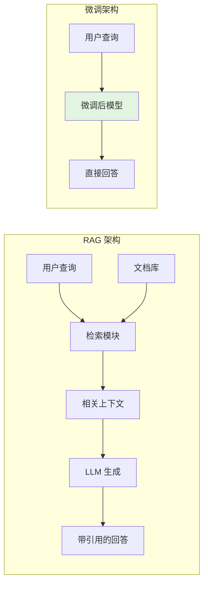
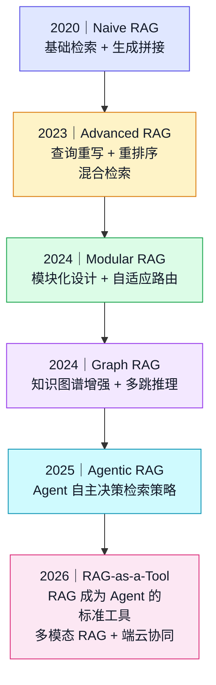
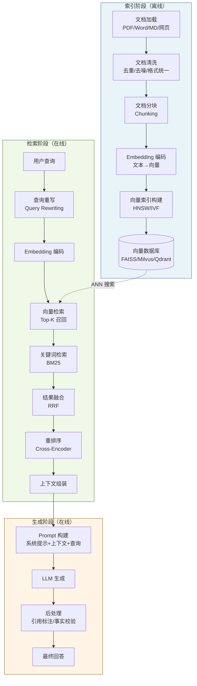
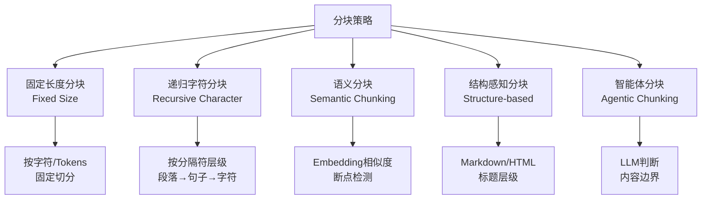
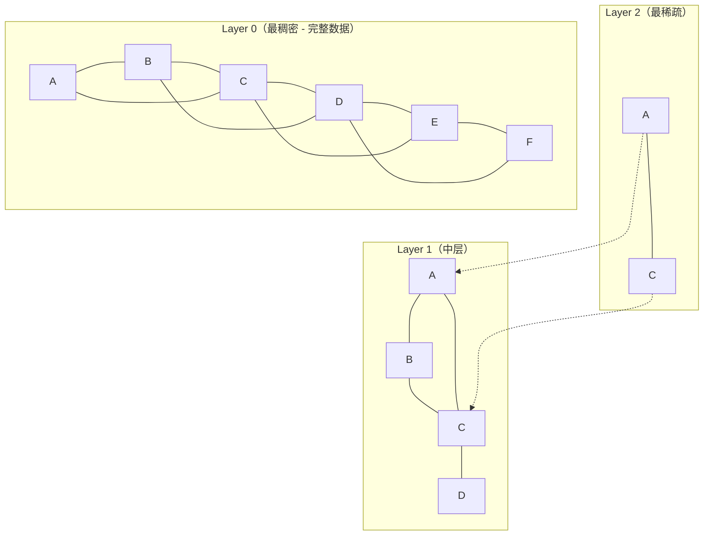

# 第 19 章 RAG 数据解析、分块与索引 ⭐⭐⭐⭐
> [!abstract] 本章导航
> **定位**：第三部分 Prompt、Context 与 RAG中的第 19 章；围绕“RAG 数据解析、分块与索引”建立单一、可追踪的知识主线。
>
> **先修**：[[18_Context_Engineering|第 18 章 Context Engineering]]。
>
> **学习目标**：
> - 解释 RAG 概述与价值 ⭐⭐⭐⭐ 的核心问题、机制与适用边界。
> - 实现或评估 RAG 完整架构 ⭐⭐⭐⭐⭐ 的最小闭环。
> - 使用可复现证据诊断 文档处理与分块策略 ⭐⭐⭐⭐⭐ 的工程取舍与失败模式。
>
> **建议路径**：RAG 概述与价值 ⭐⭐⭐⭐ → RAG 完整架构 ⭐⭐⭐⭐⭐ → 文档处理与分块策略 ⭐⭐⭐⭐⭐ → Embedding 与向量数据库 ⭐⭐⭐⭐⭐。
>
> **配套代码**：`code/ch19_rag_indexing/`。

本章先回答“RAG 概述与价值 ⭐⭐⭐⭐”为什么成立，再沿着机制、实现、评估和边界逐步展开。阅读时先建立因果链，再运行或推演示例，最后用章末自测检查能否脱离原文复述。
## 19.1 RAG 概述与价值 ⭐⭐⭐⭐

### 19.1.1 为什么需要 RAG

大语言模型（LLM）在知识更新、事实一致性和私有数据访问方面存在三类常见限制：

| 限制 | 说明 | RAG 的应对方式 |
|------|------|-------------|
| **知识静态** | 模型知识受训练数据和时间范围限制 | 按需检索可更新的外部数据源 |
| **事实不一致** | 模型可能生成缺少依据或与来源冲突的内容 | 提供可引用上下文，并单独评估事实一致性 |
| **无私有数据访问** | 无法访问企业内部文档、数据库 | 将私有数据索引化，检索后增强生成 |

### 19.1.2 RAG vs 微调（Fine-tuning）

这是面试中最经典的对比问题之一：

| 维度 | RAG | 微调 |
|------|-----|------|
| **数据更新** | 实时更新（换文档即可） | 需重新训练 |
| **成本** | 低（仅推理+索引构建） | 高（训练计算+数据标注） |
| **知识覆盖** | 可覆盖海量文档 | 受限于模型参数量 |
| **可解释性** | 高（可追溯到来源文档） | 低（知识固化在参数中） |
| **适用场景** | 知识库问答、文档检索 | 风格迁移、特定格式输出、推理能力增强 |
| **实现复杂度** | 中（需搭建检索系统） | 高（需训练 pipeline） |

**核心原则**：知识性问题优先用 RAG，能力和风格问题考虑微调。两者可以结合 —— RAG 提供事实依据，微调后的模型提供更好的推理和生成风格。



### 19.1.3 RAG 演进路线



| 阶段 | 特点 | 关键技术 |
|------|------|---------|
| **Naive RAG** | 文档→分块→Embedding→检索→拼接→生成 | 基础向量检索 |
| **Advanced RAG** | 在 Naive 基础上增加优化模块 | Query Rewriting、HyDE、Re-ranking |
| **Graph RAG** | 构建文档知识图谱，支持多跳推理 | 实体抽取、关系建模、图遍历 |
| **Agentic RAG** | Agent 自主决策检索策略和路径 | ReAct、Self-RAG、多工具协同 |

## 19.2 RAG 完整架构 ⭐⭐⭐⭐⭐

### 19.2.1 整体流程图



### 19.2.2 各阶段详解

**索引阶段（Indexing）** —— 一次性离线构建：

```python
# RAG 索引阶段完整代码示例
from langchain.document_loaders import PyPDFLoader, TextLoader
from langchain.text_splitter import RecursiveCharacterTextSplitter
from langchain.embeddings import HuggingFaceEmbeddings
from langchain.vectorstores import FAISS
import os

def build_rag_index(
    document_paths: list[str],
    embedding_model: str = "BAAI/bge-large-zh-v1.5",
    chunk_size: int = 512,
    chunk_overlap: int = 50,
    output_dir: str = "./faiss_index"
) -> FAISS:
    """
    构建 RAG 向量索引 - 完整流程

    Args:
        document_paths: 文档路径列表（支持 PDF、TXT、MD）
        embedding_model: Embedding 模型名称
        chunk_size: 分块大小（token 数）
        chunk_overlap: 块间重叠（保持语义连续性）
        output_dir: 索引保存目录
    """

    # Step 1: 文档加载
    documents = []
    for path in document_paths:
        if path.endswith('.pdf'):
            loader = PyPDFLoader(path)
        else:
            loader = TextLoader(path, encoding='utf-8')
        documents.extend(loader.load())

    print(f"[1/4] 加载文档完成：共 {len(documents)} 页/段")

    # Step 2: 文档分块
    # RecursiveCharacterTextSplitter 优先按段落分割，再按句子，再按字符
    text_splitter = RecursiveCharacterTextSplitter(
        chunk_size=chunk_size,
        chunk_overlap=chunk_overlap,
        length_function=len,
        separators=["\n\n", "\n", "。", "！", "？", "；", " ", ""]
    )
    chunks = text_splitter.split_documents(documents)
    print(f"[2/4] 文档分块完成：共 {len(chunks)} 个 chunk")

    # Step 3: Embedding 编码
    embeddings = HuggingFaceEmbeddings(
        model_name=embedding_model,
        model_kwargs={'device': 'cuda'},
        encode_kwargs={'normalize_embeddings': True}  # 归一化，便于余弦相似度计算
    )

    # Step 4: 构建向量索引并保存
    vectorstore = FAISS.from_documents(chunks, embeddings)
    vectorstore.save_local(output_dir)
    print(f"[4/4] 索引构建完成，已保存到 {output_dir}")

    return vectorstore
```

**检索+生成阶段（Retrieval + Generation）**：

下文的简单生成片段保留 Chat Completions，便于聚焦
`messages → choices` 的 RAG 主链路和采样参数；所有片段复用同一组可配置常量。
OpenAI 对推理、工具调用和多轮工作流更推荐 Responses API，但迁移时必须同步改用
`input`、`reasoning={"effort": ...}` 与 `response.output_text`，不能混用两个端点的参数和返回结构。

```python
import os

OPENAI_MODEL = os.getenv("OPENAI_MODEL", "gpt-5.6")
OPENAI_CHAT_KWARGS = (
    {"reasoning_effort": "none"} if OPENAI_MODEL.startswith("gpt-5.6") else {}
)


class RAGPipeline:
    """RAG 检索生成 Pipeline - 完整实现"""

    def __init__(self, vectorstore: FAISS, llm_client, top_k: int = 5):
        self.vectorstore = vectorstore
        self.llm = llm_client
        self.top_k = top_k

        # RAG Prompt 模板
        self.rag_prompt_template = """基于以下检索到的上下文信息回答问题。
如果上下文中没有相关信息，请明确说明"根据现有资料无法回答"。

上下文：
{context}

---

问题：{question}

请给出准确、简洁的回答。如果涉及数据，请注明来源。"""

    def retrieve(self, query: str) -> list[tuple[str, float]]:
        """
        向量检索：返回 (文档内容, 相似度分数) 列表
        """
        results = self.vectorstore.similarity_search_with_score(query, k=self.top_k)
        return [(doc.page_content, score) for doc, score in results]

    def generate(self, query: str, retrieved_docs: list[tuple[str, float]]) -> str:
        """
        基于检索结果生成回答
        """
        # 组装上下文
        context = "\n\n---\n\n".join([
            f"[文档 {i+1}]（相似度：{score:.3f}）\n{content}"
            for i, (content, score) in enumerate(retrieved_docs)
        ])

        # 构建完整 Prompt
        prompt = self.rag_prompt_template.format(
            context=context,
            question=query
        )

        # 调用 LLM
        response = self.llm.chat.completions.create(
            model=OPENAI_MODEL,
            messages=[{"role": "user", "content": prompt}],
            temperature=0.3,  # RAG 需要低 temperature，保证事实性
            **OPENAI_CHAT_KWARGS,
        )

        return response.choices[0].message.content

    def query(self, question: str) -> dict:
        """端到端查询"""
        docs = self.retrieve(question)
        answer = self.generate(question, docs)

        return {
            "question": question,
            "answer": answer,
            "sources": [
                {"content": d[:200] + "...", "score": float(s)}
                for d, s in docs
            ]
        }

# 使用
# rag = RAGPipeline(vectorstore, openai_client)
# result = rag.query("公司的年假政策是什么？")
```

## 19.3 文档处理与分块策略 ⭐⭐⭐⭐⭐

> **回答要点**：文档分块（Chunking）是 RAG 质量的关键变量之一；应与解析、召回、重排和生成分开评测，不能把所有坏例都归因于分块。

### 19.3.1 分块策略对比



| 分块策略 | 原理 | 优点 | 缺点 | 适用场景 |
|----------|------|------|------|---------|
| **固定长度** | 按固定字符/Tokens 切分 | 简单高效、可预测 | 可能切断语义、上下文丢失 | 快速原型、均匀文档 |
| **递归字符** | 按分隔符层级（段落→句子→词） | 保持自然边界、实现简单 | 对长段落处理不佳 | **最常用**、通用场景 |
| **语义分块** | 检测 Embedding 相似度突变点 | 语义完整、检索精度高 | 计算成本高 | 高质量 RAG、长文档 |
| **结构感知** | 按文档结构（标题、章节） | 完全保持结构语义 | 依赖文档格式 | Markdown、HTML、论文 |
| **智能体分块** | 用 LLM 判断内容边界 | 最智能、质量最高 | 成本高、速度慢 | 高精度要求场景 |

### 19.3.2 递归字符分块（最常用）

```python
from langchain.text_splitter import RecursiveCharacterTextSplitter

# 递归字符分块：按优先级尝试不同分隔符
text_splitter = RecursiveCharacterTextSplitter(
    chunk_size=512,        # 每个 chunk 的目标大小
    chunk_overlap=128,     # 相邻 chunk 的重叠量（关键！保持上下文连贯）
    length_function=len,   # 长度计算函数
    # 分隔符优先级：先按大段落分，不行再按句子，最后按字符
    separators=[
        "\n\n",      # 优先：段落分隔
        "\n",        # 其次：换行
        "。", "！", "？",  # 再其次：句子结束符
        "；",        # 分号
        " ",         # 空格
        ""           # 最后：任意字符
    ],
    is_separator_regex=False,
)

chunks = text_splitter.split_text(long_document_text)
```

### 19.3.3 语义分块（Semantic Chunking）⭐⭐⭐⭐

语义分块的核心思想：在 Embedding 空间中检测**语义突变点**作为分块边界。

```python
from sentence_transformers import SentenceTransformer
import numpy as np

def semantic_chunking(
    text: str,
    embedder: SentenceTransformer,
    window_size: int = 3,       # 滑动窗口大小
    threshold_percentile: float = 80,  # 断点阈值百分位
) -> list[str]:
    """
    语义分块：基于 Embedding 相似度检测语义断点

    原理：相邻句子如果语义相似度高（Embedding 余弦相似度高），应属于同一块；
         如果相似度骤降，说明发生了话题转换，应在此处断开。
    """

    # Step 1: 按句子分割
    import re
    sentences = re.split(r'(?<=[。！？;])\s+', text)
    sentences = [s.strip() for s in sentences if s.strip()]

    if len(sentences) <= window_size:
        return [text]

    # Step 2: 计算每个句子的 Embedding
    embeddings = embedder.encode(sentences, normalize_embeddings=True)

    # Step 3: 计算相邻窗口的相似度
    similarities = []
    for i in range(len(sentences) - window_size):
        # 窗口 A: [i, i+window_size)
        # 窗口 B: [i+1, i+window_size+1)
        vec_a = np.mean(embeddings[i:i+window_size], axis=0)
        vec_b = np.mean(embeddings[i+1:i+window_size+1], axis=0)
        sim = np.dot(vec_a, vec_b)  # 余弦相似度（已归一化）
        similarities.append(sim)

    # Step 4: 检测断点（相似度低于阈值的点）
    threshold = np.percentile(similarities, 100 - threshold_percentile)
    breakpoints = [i for i, sim in enumerate(similarities) if sim < threshold]

    # Step 5: 按断点分块
    chunks = []
    start = 0
    for bp in breakpoints:
        end = bp + 1
        chunk = ''.join(sentences[start:end])
        chunks.append(chunk)
        start = end
    chunks.append(''.join(sentences[start:]))

    return chunks
```

### 19.3.4 分块大小选择指南

| Chunk 大小 | Tokens | 适用场景 | 注意事项 |
|------------|--------|---------|---------|
| **小 Chunk** | 128-256 | 细粒度事实检索、FAQ | 丢失上下文，需大 overlap |
| **中 Chunk** | 512 | **通用场景**、均衡选择 | overlap 建议 10-20% |
| **大 Chunk** | 1024+ | 长文档理解、叙事类 | 检索精度下降，需重排序 |

**overlap 的作用**：相邻 chunk 重叠部分确保跨边界的语义不被切断，建议 overlap = 10-20% chunk_size。

### 19.3.5 元数据增强（Metadata Enrichment）

给每个 chunk 附加元数据，提升检索精度：

```python
# 元数据增强示例
chunk_with_metadata = {
    "page_content": "年假政策：员工每年享有 15 天带薪年假...",
    "metadata": {
        "source": "公司人事手册_v2024.pdf",  # 来源文档
        "page": 15,                           # 页码
        "section": "第三章 休假制度",          # 章节
        "doc_type": "policy",                 # 文档类型
        "created_at": "2024-01-15",           # 创建日期
    }
}
```

## 19.4 Embedding 与向量数据库 ⭐⭐⭐⭐⭐

### 19.4.1 Embedding 原理

Embedding 是将**文本映射到高维稠密向量空间**的技术，语义相似的文本在向量空间中距离相近。

$$
\text{Embedding}: \mathcal{T} \rightarrow \mathbb{R}^d \quad \text{（通常 } d = 384, 768, 1024, 1792 \text{）}
$$

**相似度度量方式**：

| 度量方式 | 公式 | 特点 | 适用 |
|----------|------|------|------|
| **余弦相似度** | $\cos(\theta) = \frac{A \cdot B}{\lVert A \rVert \lVert B \rVert}$ | 忽略向量长度，只关注方向 | **最常用**、语义相似度 |
| **欧氏距离** | $\lVert A - B \rVert_2 = \sqrt{\sum(a_i - b_i)^2}$ | 考虑向量长度 | 稠密向量空间 |
| **点积** | $A \cdot B = \sum a_i b_i$ | 计算最快，需归一化 | 归一化后的向量 |

```python
# Embedding 相似度计算示例
import numpy as np
from sentence_transformers import SentenceTransformer

model = SentenceTransformer('BAAI/bge-large-zh-v1.5')

# 编码文本
sentences = [
    "机器学习是人工智能的一个分支",
    "深度学习是机器学习的一种方法",
    "苹果是一种水果",
]
embeddings = model.encode(sentences, normalize_embeddings=True)

# 计算余弦相似度矩阵
sim_matrix = np.dot(embeddings, embeddings.T)
print("相似度矩阵：")
# [[1.0,  0.85, 0.12],
#  [0.85, 1.0,  0.08],
#  [0.12, 0.08, 1.0 ]]
# 前两句相似度高（都是 AI 相关），第三句差异大
```

### 19.4.2 Embedding 模型选型

| 模型 | 维度 | 语言 | 特点 | 适用场景 |
|------|------|------|------|---------|
| **text-embedding-3** | 3072 | 多语言 | OpenAI 官方，效果顶尖 | 不差钱的生产环境 |
| **BAAI/bge-m3** | 1024 | 中英 | 微软+北航开源，多粒度 | **中文 RAG 首选** |
| **BAAI/bge-large-zh** | 1024 | 中文 | BGE 系列中文大模型 | 中文高精度场景 |
| **sentence-transformers/all-MiniLM** | 384 | 多语言 | 轻量快速 | 资源受限、快速原型 |
| **moka-ai/m3e-base** | 768 | 中文 | 中文社区 popular | 中文通用 |
| **nvidia/NV-Embed-v2** | 4096 | 多语言 | NVIDIA 开源，SOTA 水平 | 高质量要求 |

**2024-2025 选型建议**：中文场景首选 **BGE-M3**（支持密集+稀疏+多向量三种检索模式），英文场景首选 **text-embedding-3-large** 或 **NV-Embed**。

```python
# BGE-M3 使用示例（支持多向量检索）
from FlagEmbedding import BGEM3FlagModel

model = BGEM3FlagModel('BAAI/bge-m3', use_fp16=True)

sentences = ["什么是机器学习？", "Machine learning is..."]
embeddings = model.encode(
    sentences,
    batch_size=12,
    max_length=8192,
    return_dense=True,      # 稠密向量（语义匹配）
    return_sparse=True,     # 稀疏向量（关键词匹配）
    return_colbert_vecs=True,  # ColBERT 多向量（细粒度匹配）
)

# dense_embeddings: 用于语义相似度搜索
# sparse_embeddings: 用于关键词匹配（类似 BM25）
# colbert_vecs: 用于 Late Interaction 细粒度匹配
```

### 19.4.3 ANN 近似最近邻搜索

向量数据库的核心能力是**ANN（Approximate Nearest Neighbor）搜索** —— 在海量高维向量中快速找到与查询向量最相似的 $k$ 个向量。

**暴力精确搜索（Flat）** 的复杂度为 $O(n \times d)$，当 $n > 100$ 万时不可接受。ANN 通过**牺牲极少量精度**换取 **100-1000 倍速度提升**。

### 19.4.4 HNSW 索引原理 ⭐⭐⭐⭐⭐

HNSW（Hierarchical Navigable Small World）是目前最主流的 ANN 索引算法，基于**多层图结构**。



**HNSW 搜索过程**：

1. **从最高层进入**：选择最顶层的一个随机入口点
2. **贪心下降**：在每一层用贪心算法找到距离查询点最近的节点
3. **层间传递**：将当前层最近节点作为下一层的入口点
4. **底层精确搜索**：在最稠密的底层进行精细搜索，返回最终 Top-K

**时间复杂度**：搜索 $O(\log N)$，构建 $O(N \log N)$

```python
# HNSW 参数调优
import faiss

def create_hnsw_index(vectors: np.ndarray, m: int = 32, ef_construction: int = 200) -> faiss.Index:
    """
    创建 HNSW 索引

    参数说明：
    - M: 每个节点的最大连接数（越大图越稠密，精度↑内存↑）
    - efConstruction: 构建时的搜索深度（越大构建越慢，精度↑）
    - efSearch: 搜索时的搜索深度（越大搜索越慢，精度↑）
    """
    dim = vectors.shape[1]

    # 使用 Inner Product（需要向量已归一化，等价于余弦相似度）
    index = faiss.IndexHNSWFlat(dim, m, faiss.METRIC_INNER_PRODUCT)
    index.hnsw.efConstruction = ef_construction

    # 添加向量（训练+添加）
    index.add(vectors)

    # 搜索时可调整 efSearch 平衡速度和精度
    index.hnsw.efSearch = 128  # 默认 16，增大可提升召回率

    return index
```

### 19.4.5 IVF 索引原理 ⭐⭐⭐⭐

IVF（Inverted File Index，倒排文件索引）先将向量空间划分为 $nlist$ 个** Voronoi 单元**（聚类中心），查询时只搜索最近的几个单元。

```python
def create_ivf_index(vectors: np.ndarray, nlist: int = 100) -> faiss.Index:
    """
    IVF 索引构建

    参数：
    - nlist: 聚类中心数量（通常 4*sqrt(N) ~ 16*sqrt(N)）
    - nprobe: 查询时搜索的单元数（越大精度越高，速度越慢）
    """
    dim = vectors.shape[1]
    quantizer = faiss.IndexFlatIP(dim)  # 用于聚类的精确索引
    index = faiss.IndexIVFFlat(quantizer, dim, nlist, faiss.METRIC_INNER_PRODUCT)

    # IVF 需要先训练
    index.train(vectors)
    index.add(vectors)

    # 搜索参数：探索多少个聚类单元
    index.nprobe = 10  # 默认 1，增大提升召回率

    return index
```

**HNSW vs IVF 对比**：

| 维度 | HNSW | IVF |
|------|------|-----|
| **构建速度** | 较慢 | 较快 |
| **搜索速度** | 极快 | 快 |
| **内存占用** | 高（存储图结构） | 中 |
| **召回率** | 高（>95%@Top10） | 中（依赖 nprobe） |
| **增量添加** | 支持 | 支持但需重新训练（IVF） |
| **适用规模** | 千万级 | 亿级（IVF+PQ） |
| **调参复杂度** | 低 | 中 |

### 19.4.6 PQ 乘积量化 ⭐⭐⭐

PQ（Product Quantization）将高维向量压缩为低维表示，大幅降低内存占用。

```python
def create_ivfpq_index(vectors: np.ndarray, nlist: int = 100, m: int = 16, nbits: int = 8):
    """
    IVF + PQ 组合索引

    参数：
    - m: 将向量分成 m 个子向量（m 必须整除 dim）
    - nbits: 每个子量化的比特数（通常 8）

    内存节省：原始 dim*32bit → m*8bit，压缩率约 dim*4/m
    """
    dim = vectors.shape[1]
    quantizer = faiss.IndexFlatIP(dim)
    # PQ 参数: m=子向量数, nbits=每个子向量量化比特
    index = faiss.IndexIVFPQ(quantizer, dim, nlist, m, nbits)
    index.train(vectors)
    index.add(vectors)
    index.nprobe = 10
    return index
```

### 19.4.7 主流向量数据库对比 ⭐⭐⭐⭐

| 特性 | FAISS | Milvus/Zilliz | Qdrant | Pinecone | Chroma | Weaviate |
|------|-------|--------------|--------|----------|--------|----------|
| **开源** | ✅ | ✅ | ✅ | ❌ | ✅ | ✅ |
| **本地部署** | ✅ | ✅ | ✅ | ❌ | ✅ | ✅ |
| **分布式** | ❌ | ✅ | ✅ | ✅ | ❌ | ✅ |
| **索引算法** | HNSW/IVF/PQ | HNSW/IVF/Disk | HNSW | 多种 | HNSW | HNSW |
| **混合搜索** | 需手动实现 | ✅ 内置 | ✅ 内置 | ✅ | ✅ | ✅ |
| **元数据过滤** | 需手动 | ✅ | ✅ | ✅ | ✅ | ✅ |
| **性能** | 极高 | 高 | 高 | 高 | 中 | 高 |
| **适用规模** | 百万级 | 十亿级 | 亿级 | 十亿级 | 百万级 | 亿级 |
| **云托管** | ❌ | ✅ | ✅ | ✅ | ❌ | ✅ |
| **选型建议** | 原型/嵌入式 | 企业大规模 | **中小规模首选** | 快速上云 | 入门学习 | 多模态 |

**2025 年选型建议**：
- **原型/学习**：FAISS（免费、速度快）
- **中小规模生产**（<1000万）：Qdrant（Rust 编写、功能全、易部署）
- **大规模生产**：Milvus（分布式、功能最全面）
- **快速上云**：Pinecone（Serverless、免运维）
## 🧭 本章小结

- RAG 概述与价值 ⭐⭐⭐⭐：能够说清问题、机制、证据与边界。
- RAG 完整架构 ⭐⭐⭐⭐⭐：能够说清问题、机制、证据与边界。
- 文档处理与分块策略 ⭐⭐⭐⭐⭐：能够说清问题、机制、证据与边界。

## ✅ 自测与练习

1. 不看正文，解释“RAG 概述与价值 ⭐⭐⭐⭐”解决什么问题，并给出一个不适用场景。
2. 为“RAG 完整架构 ⭐⭐⭐⭐⭐”设计一个最小可复现实验，明确输入、指标和通过条件。
3. 比较“文档处理与分块策略 ⭐⭐⭐⭐⭐”的至少两种方案，说明质量、成本、延迟或风险取舍。

## 🧪 配套代码与验收

- `code/ch19_rag_indexing/`

```powershell
python code/scripts/run_all_examples.py --chapter ch19 --tier core
```

默认验收不下载模型、不调用付费 API；真实 API 或 GPU 示例必须按 metadata 显式启用。成功标准是相关脚本输出 `OK`，条件不足时输出可解释的 `[SKIP]`。

## 🎯 面试题精讲

回答本章问题时使用四步结构：先给结论，再解释机制，然后给项目证据，最后主动说明适用边界。涉及性能或效果时，补充模型、硬件、数据、并发、版本和统计口径；条件不完整时明确说“需要实测”。

## 📋 本章速查表

| 主题 | 回答主线 |
|---|---|
| RAG 概述与价值 ⭐⭐⭐⭐ | 问题 → 机制 → 示例 → 指标 → 边界 |
| RAG 完整架构 ⭐⭐⭐⭐⭐ | 问题 → 机制 → 示例 → 指标 → 边界 |
| 文档处理与分块策略 ⭐⭐⭐⭐⭐ | 问题 → 机制 → 示例 → 指标 → 边界 |
| Embedding 与向量数据库 ⭐⭐⭐⭐⭐ | 问题 → 机制 → 示例 → 指标 → 边界 |

## 🔗 相关章节

- [[18_Context_Engineering|第 18 章 Context Engineering]]
- [[20_RAG检索重排与高级方法|第 20 章 RAG 检索、重排与高级方法]]

## 📖 一手参考资料

> 核验基线：2026-07-31；结构复核：2026-08-05。产品、API、法规、价格与 benchmark 会变化，使用前应再次核验。

- [[docs/AUTHORITATIVE_SOURCES|章节权威来源索引]]：按主题维护官方文档、标准、原论文和官方仓库。
