# 第19章 分布式训练系统 ⭐⭐⭐⭐⭐

> **面试频率**：中等偏高（~50%面试涉及）| **难度**：极高 | **工程权重**：最高
>
> 当模型参数从 7B 迈向 70B、405B、乃至万亿参数级别，单张 GPU 的显存早已不堪重负。分布式训练系统是大模型时代的"入场券" —— 没有它，我们甚至无法加载一个完整的 Llama-70B 模型。本章从数据并行到模型并行，从 ZeRO 优化到 DeepSpeed 实战，从 Megatron-LM 3D并行到混合精度训练，覆盖大模型分布式训练的全部核心技术。
>
> 🆕 **2026年更新**：新增 FSDP2（`DTensor` 架构）、DeepSpeed Ulysses 序列并行、FP8 训练实战、通信-计算重叠的前沿技巧。

---

## 19.1 分布式训练概述 ⭐⭐⭐⭐⭐

### 19.1.1 为什么需要分布式训练

单卡训练大模型面临两个根本性瓶颈：

| 瓶颈 | 具体表现 | 举例 |
|------|---------|------|
| **显存不足** | 模型参数 + 梯度 + 优化器状态远超单卡显存 | Llama-70B 以 FP16 加载需 ~140GB，单张 H100（80GB）无法容纳 |
| **训练太慢** | 单卡算力有限，训练时间不可接受 | 单张 A100 训练 GPT-3（175B）需要约 288 年 |

**显存占用估算公式**：

对于参数量为 $\Phi$ 的模型，训练时显存占用约：

$$
M_{\text{total}} = \underbrace{2\Phi}_{\text{模型参数(FP16)}} + \underbrace{2\Phi}_{\text{梯度(FP16)}} + \underbrace{12\Phi}_{\text{Adam优化器(FP32)}} + \underbrace{M_{\text{activation}}}_{\text{激活值}}
$$

> 训练时显存约是推理时的 **4倍以上**（仅参数+梯度+优化器就需要 $16\Phi$ 字节）。

**以 Llama-7B 为例**：

| 组件 | 计算公式 | 显存占用 |
|------|---------|---------|
| 模型参数 (FP16) | $2 \times 7\text{B}$ | 14 GB |
| 梯度 (FP16) | $2 \times 7\text{B}$ | 14 GB |
| Adam 优化器 (FP32) | $12 \times 7\text{B}$ | 84 GB |
| 激活值 (估算) | — | ~20-50 GB |
| **总计** | | **~130-160 GB** |

一张 A100-80GB 最多只能做 batch_size=1 的 LoRA 微调，全量训练必须有 2+ 张 GPU。

### 19.1.2 分布式训练的挑战

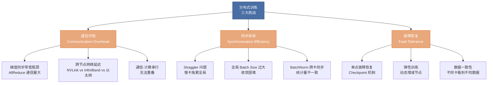

### 19.1.3 并行策略分类全景图

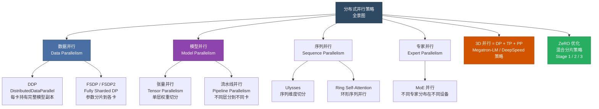

**并行策略速查表**：

| 策略 | 解决什么问题 | 适用场景 | 代表框架 |
|------|------------|---------|---------|
| 数据并行 (DP/DDP) | 训练速度慢 | 模型能放入单卡 | PyTorch DDP |
| FSDP | 显存不足 (参数) | 7B-70B 模型 | PyTorch FSDP |
| 张量并行 (TP) | 显存不足 (单层太大) | 超大层（如 4096 维 FFN） | Megatron-LM |
| 流水线并行 (PP) | 显存不足 (层数太多) | 深层模型 | DeepSpeed/PipeDream |
| 序列并行 (SP) | 长序列显存爆炸 | 128K+ 上下文 | DeepSpeed Ulysses |
| ZeRO-1/2/3 | 显存不足 (层次化方案) | 通用，最流行 | DeepSpeed |
| 3D 并行 (DP+TP+PP) | 超大规模模型 | 175B+ 模型 | Megatron-DeepSpeed |

---

## 19.2 数据并行 ⭐⭐⭐⭐

### 19.2.1 DP（DataParallel）原理与局限性

DP 是 PyTorch 最早提供的数据并行方案，原理简单但效率低下。

```python
# ❌ DataParallel 用法（不推荐）
import torch.nn as nn

model = nn.DataParallel(model)  # 单机多卡
output = model(input_data)

# DP 的工作流程：
# 1. 将每个 batch 的数据均匀分配到所有 GPU
# 2. 每个 GPU 独立前向传播
# 3. 将各 GPU 的 loss 汇总到 GPU 0
# 4. GPU 0 计算梯度并广播到所有 GPU
# 5. 所有 GPU 用相同梯度更新参数
```

**DP 的致命缺陷**：

| 问题 | 原因 | 后果 |
|------|------|------|
| **单卡瓶颈** | 所有梯度汇集到 GPU 0，由 GPU 0 负责 reduce 和 broadcast | GPU 0 负载远高于其他卡 |
| **Python 线程限制** | 使用 Python 线程做多卡调度 | GIL 成为瓶颈 |
| **不支持多机** | 只能在单机内使用 | 无法扩展到多机多卡 |
| **通信效率低** | 每个 batch 都要在 GPU 0 做 reduce | 无法与计算重叠 |

### 19.2.2 DDP（DistributedDataParallel）原理与优势

DDP 是当前 PyTorch 推荐的数据并行方案，彻底解决了 DP 的缺陷。

**DDP 核心设计**：

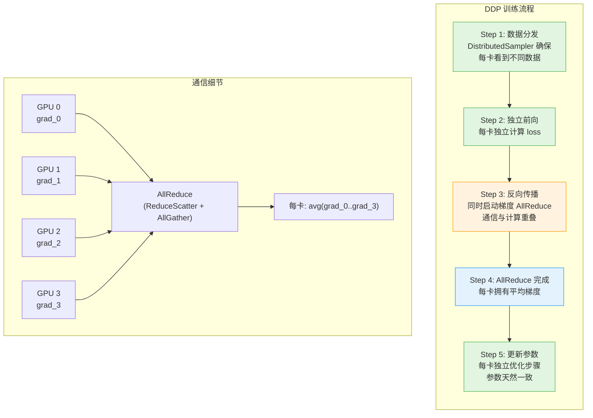

**DP vs DDP 对比**：

| 维度 | DataParallel (DP) | DistributedDataParallel (DDP) |
|------|-------------------|-------------------------------|
| **通信方式** | GPU 0 是中心节点 | 所有 GPU 对等通信（AllReduce） |
| **多机支持** | 不支持 | 支持（TCP/NCCL 后端） |
| **通信效率** | 低（串行 reduce+scatter） | 高（Ring AllReduce，带宽最优） |
| **负载均衡** | GPU 0 负载高 2-3x | 所有 GPU 均等 |
| **GIL 问题** | 有（多线程） | 无（多进程） |
| **梯度同步时机** | loss.backward() 之后 | backward() 过程中（overlap） |
| **推荐程度** | ⭐（废弃） | ⭐⭐⭐⭐⭐ |

### 19.2.3 梯度同步：AllReduce 通信原语

梯度同步是数据并行的核心。设 $N$ 个 GPU，每个 GPU $i$ 有梯度 $\mathbf{g}_i$，所有 GPU 都需要获得平均梯度：

$$
\bar{\mathbf{g}} = \frac{1}{N} \sum_{i=1}^{N} \mathbf{g}_i
$$

**Ring AllReduce 算法**（最常用的实现）：

```
Ring AllReduce = ReduceScatter + AllGather

ReduceScatter 阶段（N-1 步）:
  每个 GPU 沿着环形拓扑传递和累加部分梯度块
  最终每个 GPU 拥有 1/N 的完整求和结果

AllGather 阶段（N-1 步）:
  每个 GPU 将持有的 1/N 结果沿环广播
  最终所有 GPU 拥有完整结果

通信量: 2(N-1)/N × 数据量 ≈ 2× 数据量（与 GPU 数量无关！）
```

> **面试重点**：Ring AllReduce 的通信量与 GPU 数量 $N$ **无关**（当 $N$ 很大时），这是它成为标准的根本原因。

### 19.2.4 FSDP（Fully Sharded Data Parallel）

FSDP 是 PyTorch 官方提供的参数分片方案，相当于 DeepSpeed ZeRO Stage 3 的 PyTorch 原生实现。

**FSDP 核心思想**：

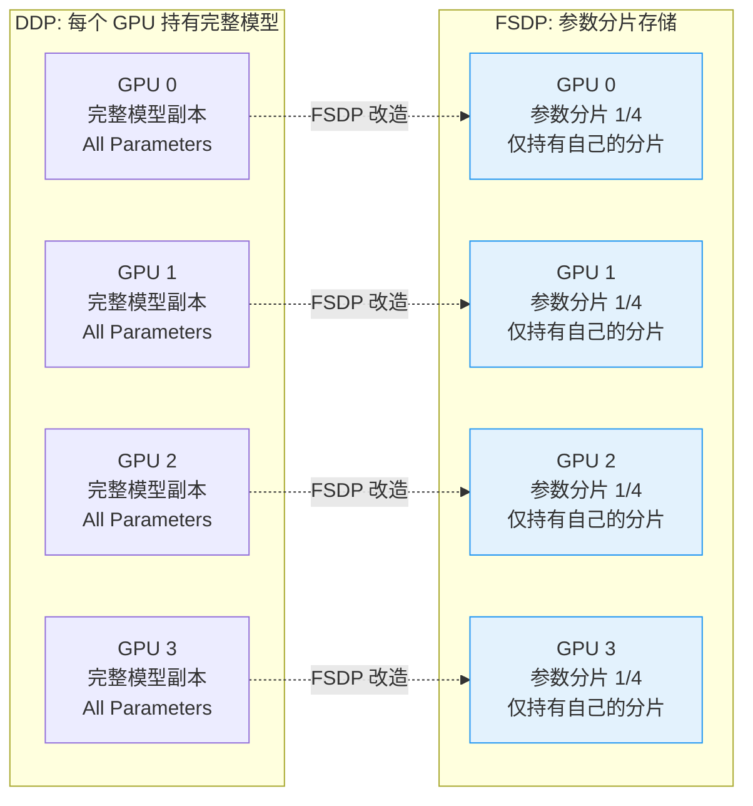

FSDP 的前向/反向过程中，参数动态地 all-gather（收集完整参数）和 release（释放非本地分片），使得每个 GPU 在任何时刻只持有自己负责的参数分片。

### 19.2.5 DDP / FSDP 代码示例

**DDP 完整实战代码**：

```python
"""
DDP 训练完整示例 - 单机多卡 / 多机多卡
启动方式: torchrun --nproc_per_node=8 train_ddp.py
"""
import os
import torch
import torch.nn as nn
import torch.distributed as dist
from torch.nn.parallel import DistributedDataParallel as DDP
from torch.utils.data import DataLoader, DistributedSampler

# ============================================================
# 1. 初始化分布式环境
# ============================================================
def setup_distributed():
    """初始化 NCCL 分布式后端"""
    dist.init_process_group(
        backend="nccl",          # GPU 通信使用 NCCL
        init_method="env://",    # 从环境变量读取配置（torchrun 自动设置）
    )
    local_rank = int(os.environ["LOCAL_RANK"])
    torch.cuda.set_device(local_rank)
    return local_rank

def cleanup():
    dist.destroy_process_group()

# ============================================================
# 2. 模型定义
# ============================================================
class SimpleLLM(nn.Module):
    """模拟大模型结构"""
    def __init__(self, vocab_size=50000, hidden_dim=4096, num_layers=32):
        super().__init__()
        self.embed = nn.Embedding(vocab_size, hidden_dim)
        self.layers = nn.ModuleList([
            nn.TransformerDecoderLayer(
                d_model=hidden_dim,
                nhead=32,
                dim_feedforward=hidden_dim * 4,
                batch_first=True
            )
            for _ in range(num_layers)
        ])
        self.lm_head = nn.Linear(hidden_dim, vocab_size)

    def forward(self, x):
        x = self.embed(x)
        for layer in self.layers:
            x = layer(x, memory=torch.zeros_like(x))  # 简化的 decoder
        return self.lm_head(x)

# ============================================================
# 3. 训练主函数（DDP 方式）
# ============================================================
def train_ddp():
    local_rank = setup_distributed()
    world_size = dist.get_world_size()
    global_rank = dist.get_rank()

    print(f"[Rank {global_rank}/{world_size}] Initializing on GPU {local_rank}")

    # --- 模型 ---
    model = SimpleLLM().to(local_rank)
    # 关键：使用 DDP 包装模型
    model = DDP(
        model,
        device_ids=[local_rank],
        output_device=local_rank,
        find_unused_parameters=False,   # 生产环境设为 False 提升性能
        gradient_as_bucket_view=True,   # 减少内存拷贝
    )

    # --- 数据集 ---
    dataset = torch.randint(0, 50000, (100000, 2048))  # 模拟数据
    # 关键：使用 DistributedSampler 确保每卡看到不同数据
    sampler = DistributedSampler(
        dataset,
        num_replicas=world_size,
        rank=global_rank,
        shuffle=True,
    )
    dataloader = DataLoader(dataset, batch_size=4, sampler=sampler)

    # --- 优化器 ---
    optimizer = torch.optim.AdamW(model.parameters(), lr=3e-4)

    # ============================================================
    # 4. 训练循环
    # ============================================================
    model.train()
    for epoch in range(3):
        sampler.set_epoch(epoch)  # 每个 epoch 重新 shuffle

        for step, batch in enumerate(dataloader):
            batch = batch.to(local_rank)

            # 前向
            outputs = model(batch)
            loss = outputs.mean()

            # 反向 —— DDP 在这里自动进行梯度 AllReduce
            # backward() 过程中梯度同步与计算重叠
            optimizer.zero_grad()
            loss.backward()
            optimizer.step()

            if step % 10 == 0 and global_rank == 0:
                # 注意：每张卡上的 loss 不同（数据不同），
                # 需要 all_reduce 求平均才能得到全局 loss
                loss_tensor = loss.detach().clone()
                dist.all_reduce(loss_tensor, op=dist.ReduceOp.AVG)
                print(f"Epoch {epoch}, Step {step}, "
                      f"Global Loss: {loss_tensor.item():.4f}")

    cleanup()

if __name__ == "__main__":
    train_ddp()
```

**FSDP 实战代码**：

```python
"""
FSDP 训练示例 - PyTorch 原生参数分片
启动方式: torchrun --nproc_per_node=8 train_fsdp.py
"""
import os
import torch
import torch.nn as nn
import torch.distributed as dist
from torch.distributed.fsdp import (
    FullyShardedDataParallel as FSDP,
    MixedPrecision,
    ShardingStrategy,
    BackwardPrefetch,
    CPUOffload,
)
from torch.distributed.fsdp.wrap import (
    transformer_auto_wrap_policy,
    size_based_auto_wrap_policy,
)

def setup():
    dist.init_process_group(backend="nccl")
    local_rank = int(os.environ["LOCAL_RANK"])
    torch.cuda.set_device(local_rank)
    return local_rank

def train_fsdp():
    local_rank = setup()

    # ============================================================
    # FSDP 混合精度配置
    # ============================================================
    mixed_precision_policy = MixedPrecision(
        param_dtype=torch.bfloat16,   # 参数用 BF16 存储
        reduce_dtype=torch.bfloat16,  # 梯度 reduce 用 BF16
        buffer_dtype=torch.bfloat16,  # buffer 用 BF16
    )

    # ============================================================
    # FSDP 分片策略
    # ============================================================
    # HYBRID_SHARD: 节点内全分片，节点间 DDP
    # FULL_SHARD: ZeRO Stage 3 等价
    # SHARD_GRAD_OP: ZeRO Stage 2 等价
    sharding_strategy = ShardingStrategy.FULL_SHARD

    # ============================================================
    # FSDP 配置
    # ============================================================
    from transformers import AutoModelForCausalLM, AutoConfig

    config = AutoConfig.from_pretrained("meta-llama/Llama-2-7b-hf")
    model = AutoModelForCausalLM.from_config(config)

    # 定义哪些子模块需要被 FSDP 包装
    auto_wrap_policy = transformer_auto_wrap_policy(
        transformer_layer_cls={
            # 每个 TransformerBlock 是一个 FSDP 单元
            type(model.model.layers[0]),
        }
    )

    model = FSDP(
        model,
        auto_wrap_policy=auto_wrap_policy,
        sharding_strategy=sharding_strategy,
        mixed_precision=mixed_precision_policy,
        backward_prefetch=BackwardPrefetch.BACKWARD_PRE,  # 预取下一层参数
        cpu_offload=CPUOffload(offload_params=False),      # 是否卸载到 CPU
        device_id=local_rank,
        # 关键：限制 FSDP 单元内的参数数量
        # 太小 → 通信过多，太大 → 显存占用大
        limit_all_gathers=True,
    )

    print(f"Model wrapped with FSDP on rank {dist.get_rank()}")
    print(f"Sharding strategy: {sharding_strategy}")

    # 训练循环（与 DDP 类似，但 FSDP 自动管理参数收集和释放）
    optimizer = torch.optim.AdamW(model.parameters(), lr=3e-4)
    for step in range(100):
        input_ids = torch.randint(0, 32000, (2, 1024)).to(local_rank)
        outputs = model(input_ids, labels=input_ids)
        loss = outputs.loss
        loss.backward()
        optimizer.step()
        optimizer.zero_grad()
        if step % 10 == 0:
            print(f"Step {step}, Loss: {loss.item():.4f}")

    dist.destroy_process_group()

if __name__ == "__main__":
    train_fsdp()
```

**启动命令**：

```bash
# 单机 8 卡 DDP 训练
torchrun --nproc_per_node=8 train_ddp.py

# 多机多卡（2 台机器，每台 8 卡）
# 在机器 0（master）上：
torchrun --nproc_per_node=8 --nnodes=2 --node_rank=0 \
    --master_addr="192.168.1.100" --master_port=29500 \
    train_ddp.py

# 在机器 1 上：
torchrun --nproc_per_node=8 --nnodes=2 --node_rank=1 \
    --master_addr="192.168.1.100" --master_port=29500 \
    train_ddp.py

# FSDP 训练
torchrun --nproc_per_node=8 train_fsdp.py
```

---

## 19.3 模型并行 ⭐⭐⭐⭐⭐

当模型单层参数量太大，或总层数太多，即使做了数据并行也无法放入单卡时，就需要模型并行。

### 19.3.1 张量并行（Tensor Parallelism）

**核心思想**：将一层内的权重矩阵**按列或按行切分**到多张 GPU 上，每张 GPU 计算一部分，然后合并结果。

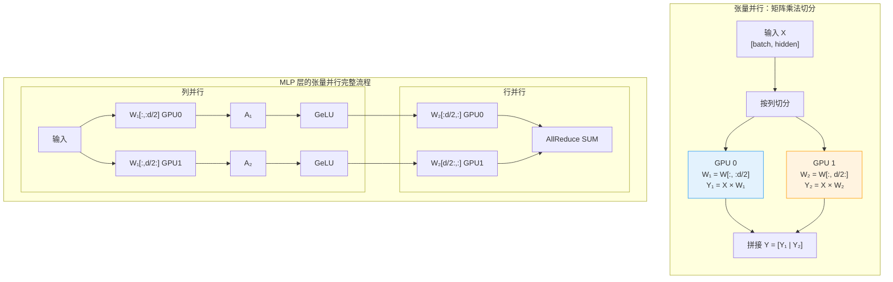

**MLP 张量并行的数学描述**：

设 MLP 层为 $Y = W_2 \cdot \text{GeLU}(W_1 \cdot X)$

- **列并行**（第1个全连接层）：将 $W_1$ 按列切分
  $$W_1 = [W_1^{(1)} | W_1^{(2)}], \quad Y_1 = \text{GeLU}(X W_1^{(1)}), \quad Y_2 = \text{GeLU}(X W_1^{(2)})$$

- **行并行**（第2个全连接层）：将 $W_2$ 按行切分，最后 AllReduce
  $$W_2 = \begin{bmatrix} W_2^{(1)} \\ W_2^{(2)} \end{bmatrix}, \quad Z = W_2^{(1)} Y_1 + W_2^{(2)} Y_2$$

**Self-Attention 的张量并行**：

对于 Multi-Head Attention，按 head 数量切分是最自然的方案：
- GPU 0 持有 head 0~N/2-1 的 Q/K/V/O 权重
- GPU 1 持有 head N/2~N-1 的 Q/K/V/O 权重

### 19.3.2 流水线并行（Pipeline Parallelism）

**核心思想**：将模型按层切分，GPU 0 负责 layer 0-7，GPU 1 负责 layer 8-15，GPU 2 负责 layer 16-23，GPU 3 负责 layer 24-31。数据像流水线一样依次经过各 GPU。

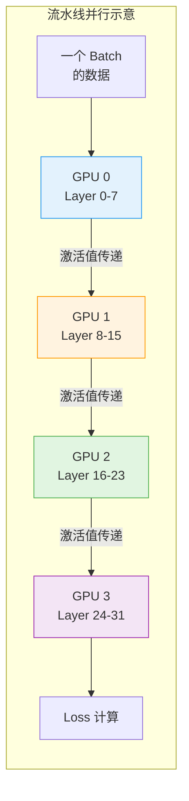

**Microbatch 与 Bubble 时间**：

流水线并行最核心的问题是 **Bubble（气泡）** —— GPU 空闲等待的时间。

```
朴素流水线（GPipe 方案）:
Time →
GPU 0: [F0][F1][F2][F3] | ●●●●●●●● | [B3][B2][B1][B0]
GPU 1: ●● | [F0][F1][F2][F3] | [B3][B2][B1][B0] | ●●●●●●●●
GPU 2: ●●●● | [F0][F1][F2][F3] | [B3][B2][B1][B0] | ●●●●
GPU 3: ●●●●●● | [F0][F1][F2][F3] | [B3][B2][B1][B0] | ●●

F = Forward, B = Backward, ● = Idle (Bubble)
总 Bubble 比例 = (P-1) / M  (P=GPU数, M=microbatch数)
```

**Bubble 时间公式**：

设 microbatch 数量为 $m$，Pipeline Stage 数量为 $p$：

$$
\text{Bubble Ratio} = \frac{p - 1}{m}
$$

> **面试要点**：增加 microbatch 数量 $m$ 可以减小 bubble 比例，但 $m$ 受全局 batch size 约束。**1F1B 调度**可以在不增加 $m$ 的情况下减少显存占用。

### 19.3.3 1F1B 调度策略

1F1B（One Forward One Backward）是 DeepSpeed 采用的调度策略，核心是**让前向和反向交替进行**，减少缓存激活值的数量。

```
1F1B 调度（DeepSpeed 方案）:
Time →
GPU 0: [F0][F1][F2][F3][B0][F4][B1][F5][B2][B3][B4][B5]
GPU 1:     [F0][F1][F2][F3][B0][F4][B1][F5][B2][B3][B4][B5]
GPU 2:         [F0][F1][F2][F3][B0][F4][B1][F5][B2][B3][B4]
GPU 3:             [F0][F1][F2][F3][B0][F4][B1][F5][B2][B3]

相比于 GPipe:
- 减少激活值缓存：只需缓存 m 个 microbatch 的激活值（vs GPipe 的 2m）
- 保持相同的 bubble 比例
- 更早释放已反向传播完毕的层的激活值
```

**流水线调度对比**：

| 调度策略 | 来源 | Bubble 比例 | 激活值缓存 | 特点 |
|---------|------|-------------|-----------|------|
| **GPipe** | Google | $\frac{p-1}{m}$ | $\times p$ （高） | 先全部 forward 再全部 backward |
| **PipeDream-Flush** | DeepSpeed | $\frac{p-1}{m}$ | $\times 1$ （低） | 1F1B + warmup + cooldown |
| **Interleaved 1F1B** | Megatron-LM | $\frac{p-1}{m \cdot v}$ | 更低 | 每个设备分配多个 stage chunks |

---

## 19.4 ZeRO 优化 ⭐⭐⭐⭐⭐

> **面试必考**：这是分布式训练中被问频率最高的知识点。面试官期待你能清晰区分三个 Stage 的分片内容和显存节省比例。

ZeRO（Zero Redundancy Optimizer）是 DeepSpeed 的核心贡献，被誉为"大模型训练的根基"。

### 19.4.1 训练时显存都去哪儿了

回顾训练显存占用：

| 组件 | 大小 | 是否冗余 |
|------|------|---------|
| 模型参数 (Parameters) | $2\Phi$ (FP16) | 每卡一份完整副本（DDP模式） |
| 梯度 (Gradients) | $2\Phi$ (FP16) | 每卡一份完整副本 |
| 优化器状态 (Optimizer States) | $12\Phi$ (FP32) | 每卡一份完整副本 |
| 激活值 (Activations) | 依赖 batch size | 唯一且必须的 |

**核心洞察**：在 DDP 中，每张 GPU 都持有**完整的**参数、梯度和优化器状态 —— 这造成了 $(2+2+12)\Phi = 16\Phi$ 字节的冗余存储。

### 19.4.2 ZeRO 三个 Stage 全景

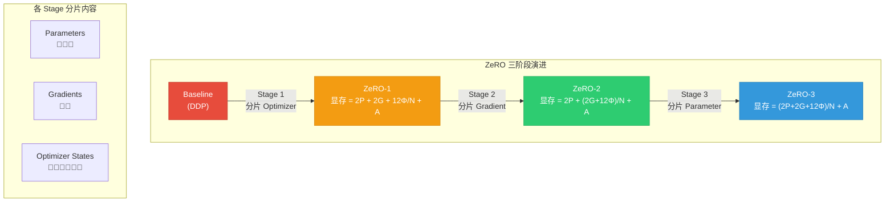

### 19.4.3 ZeRO Stage 1：优化器状态分片

**分片内容**：仅分片优化器状态（Adam 的 $m$ 和 $v$）

**显存节省**：

$$
M_{\text{ZeRO-1}} = \underbrace{2\Phi}_{\text{参数}} + \underbrace{2\Phi}_{\text{梯度}} + \underbrace{\frac{12\Phi}{N}}_{\text{优化器分片}} + M_{\text{activation}}
$$

- 显存节省：约 $4\times$（4 卡时节省优化器状态的 75%）
- 通信开销：与 DDP 相同（仅 AllReduce 梯度）
- **推荐场景**：模型能放入单卡但 batch size 受限时

### 19.4.4 ZeRO Stage 2：梯度 + 优化器状态分片

**分片内容**：分片梯度 + 优化器状态

每个 GPU 只持有与自己优化器状态分片对应的梯度分片。在 backward 过程中，梯度通过 ReduceScatter 而不是 AllReduce 通信，每个 GPU 只接收自己负责的那部分梯度平均值。

$$
M_{\text{ZeRO-2}} = \underbrace{2\Phi}_{\text{参数}} + \underbrace{\frac{2\Phi + 12\Phi}{N}}_{\text{梯度+优化器分片}} + M_{\text{activation}}
$$

- 显存节省：约 $8\times$（8 卡时）
- 通信变化：AllReduce → ReduceScatter（通信量不变，但语义不同）
- **推荐场景**：中等规模模型（7B-13B），最常用的配置

### 19.4.5 ZeRO Stage 3：参数 + 梯度 + 优化器状态分片

**分片内容**：一切分片 —— 参数、梯度、优化器状态全部切分

这是最激进的方案。每个 GPU 在任何时刻只持有自己负责的 **1/N 的参数**。需要计算某一层的参数时，通过 AllGather 收集完整参数；计算完毕后立即释放非本地的参数分片。

$$
M_{\text{ZeRO-3}} = \frac{2\Phi + 2\Phi + 12\Phi}{N} + M_{\text{activation}} = \frac{16\Phi}{N} + M_{\text{activation}}
$$

- 显存节省：接近线性 $N\times$（$N$ 为 GPU 数）
- 额外通信开销：前向/反向都需要 AllGather 参数，通信量增加约 1.5x
- **推荐场景**：超大模型（70B+），模型无法放入单卡

### 19.4.6 显存节省汇总

| ZeRO Stage | 参数存储 | 梯度存储 | 优化器存储 | 总参数量显存 | 节省倍数 (N=8) |
|-----------|---------|---------|-----------|------------|---------------|
| **DDP (基线)** | $2\Phi$ | $2\Phi$ | $12\Phi$ | $16\Phi$ | 1x |
| **ZeRO-1** | $2\Phi$ | $2\Phi$ | $12\Phi / N$ | $4\Phi + 12\Phi/N$ | ~2.9x |
| **ZeRO-2** | $2\Phi$ | $2\Phi / N$ | $12\Phi / N$ | $2\Phi + 14\Phi/N$ | ~4.3x |
| **ZeRO-3** | $2\Phi / N$ | $2\Phi / N$ | $12\Phi / N$ | $16\Phi / N$ | ~8x |

> **关键计算**：以 Llama-7B 在 8 张 A100 (80GB) 上训练为例：
> - DDP: $16 \times 7\text{GB} = 112\text{GB}$ / 卡 — **放不下！**
> - ZeRO-3: $16 \times 7\text{GB} / 8 = 14\text{GB}$ / 卡 — **绰绰有余**

### 19.4.7 ZeRO-Offload 与 ZeRO-Infinity

当 GPU 显存仍然不够时，可以进一步将部分数据卸载到 CPU 内存甚至 NVMe SSD：

| 技术 | 卸载目标 | 卸载内容 | 额外开销 |
|------|---------|---------|---------|
| **ZeRO-Offload** | CPU DRAM | 优化器状态 + 梯度 | PCIe 带宽（~32 GB/s） |
| **ZeRO-Infinity** | NVMe SSD | 参数 + 优化器状态 | NVMe 带宽（~2-7 GB/s） |

---

## 19.5 DeepSpeed 实战 ⭐⭐⭐⭐⭐

### 19.5.1 DeepSpeed 配置文件详解

DeepSpeed 的核心是 JSON 配置文件，通过它控制所有分布式训练策略。

```json
{
    "train_batch_size": 128,
    "train_micro_batch_size_per_gpu": 4,

    "optimizer": {
        "type": "AdamW",
        "params": {
            "lr": 3e-4,
            "betas": [0.9, 0.95],
            "eps": 1e-8,
            "weight_decay": 0.1
        }
    },

    "scheduler": {
        "type": "WarmupDecayLR",
        "params": {
            "total_num_steps": 10000,
            "warmup_min_lr": 0,
            "warmup_max_lr": 3e-4,
            "warmup_num_steps": 1000
        }
    },

    "zero_optimization": {
        "stage": 2,
        "offload_optimizer": {
            "device": "none",
            "pin_memory": true
        },
        "allgather_partitions": true,
        "allgather_bucket_size": 5e8,
        "overlap_comm": true,
        "reduce_scatter": true,
        "reduce_bucket_size": 5e8,
        "contiguous_gradients": true,
        "round_robin_gradients": true
    },

    "fp16": {
        "enabled": true,
        "auto_cast": true,
        "loss_scale": 0,
        "initial_scale_power": 16,
        "loss_scale_window": 1000,
        "hysteresis": 2,
        "min_loss_scale": 1
    },

    "bf16": {
        "enabled": false
    },

    "gradient_clipping": 1.0,

    "steps_per_print": 10,
    "wall_clock_breakdown": false,

    "activation_checkpointing": {
        "partition_activations": true,
        "cpu_checkpointing": false,
        "number_checkpoints": null,
        "synchronize_checkpoint_boundary": false
    }
}
```

**DeepSpeed 配置文件关键参数说明**：

| 参数 | 含义 | 推荐值 |
|------|------|--------|
| `train_micro_batch_size_per_gpu` | 每卡每步处理的 micro batch 大小 | 尽可能大（受显存限制） |
| `zero_optimization.stage` | ZeRO 阶段 (1/2/3) | Stage 2（通用）/ Stage 3（大模型） |
| `offload_optimizer.device` | 优化器卸载目标 | `"cpu"`（显存紧张时） |
| `overlap_comm` | 是否通信与计算重叠 | `true` |
| `reduce_bucket_size` | 梯度桶大小 | `5e8`（500MB，默认即可） |
| `activation_checkpointing` | 激活重计算 | 显存紧张时开启，以时间换空间 |

### 19.5.2 ZeRO Stage 2/3 实战代码

```python
"""
DeepSpeed ZeRO Stage 2/3 完整训练示例
启动方式: deepspeed --num_gpus=8 train_deepspeed.py \
              --deepspeed ds_config.json
"""
import os
import torch
import deepspeed
from transformers import (
    AutoModelForCausalLM,
    AutoTokenizer,
    AutoConfig,
    TrainingArguments,
    Trainer,
    HfArgumentParser,
)

# ============================================================
# 方式一: 使用 DeepSpeed 原生 API
# ============================================================
def train_with_deepspeed_api():
    """使用 DeepSpeed 原生 API 进行训练"""

    # 1. 解析 DeepSpeed 配置
    parser = argparse.ArgumentParser()
    parser.add_argument("--local_rank", type=int, default=-1)
    parser = deepspeed.add_config_arguments(parser)
    args = parser.parse_args()

    # 2. 构建模型
    config = AutoConfig.from_pretrained("meta-llama/Llama-2-7b-hf")
    model = AutoModelForCausalLM.from_config(config)

    # 3. DeepSpeed 初始化（关键步骤）
    model_engine, optimizer, _, _ = deepspeed.initialize(
        args=args,
        model=model,
        model_parameters=model.parameters(),
        # DeepSpeed 会自动:
        # - 包装模型为 DeepSpeedEngine
        # - 创建 ZeRO 优化器（替代 PyTorch 优化器）
        # - 初始化分布式通信
    )

    # 4. 训练循环
    for step in range(10000):
        # 准备数据
        input_ids = torch.randint(0, 32000, (4, 2048)).to(model_engine.device)

        # 前向传播
        outputs = model_engine(input_ids, labels=input_ids)
        loss = outputs.loss

        # 反向传播（DeepSpeed 自动处理梯度同步和分片）
        model_engine.backward(loss)

        # 参数更新（DeepSpeed 自动处理优化器状态分片和 offload）
        model_engine.step()

        if step % 100 == 0:
            print(f"Step {step}, Loss: {loss.item():.4f}")

        # 保存 Checkpoint
        if step % 1000 == 0:
            model_engine.save_checkpoint(f"./checkpoints/step_{step}")


# ============================================================
# 方式二: 使用 HuggingFace Trainer + DeepSpeed（推荐）
# ============================================================
def train_with_hf_trainer():
    """使用 HuggingFace Trainer + DeepSpeed 插件"""

    # HuggingFace Trainer 自动读取 --deepspeed 参数
    # 只需配置 TrainingArguments 即可

    from transformers import Trainer, TrainingArguments

    training_args = TrainingArguments(
        output_dir="./output",
        per_device_train_batch_size=4,
        gradient_accumulation_steps=8,  # 等效 batch_size = 4 * 8 * 8GPU = 256
        learning_rate=3e-4,
        warmup_steps=1000,
        max_steps=10000,
        logging_steps=10,
        save_steps=1000,
        fp16=False,
        bf16=True,              # 优先使用 BF16
        deepspeed="ds_config_stage3.json",
        # 其他参数...
    )

    model = AutoModelForCausalLM.from_pretrained(
        "meta-llama/Llama-2-7b-hf",
        torch_dtype=torch.bfloat16,
        use_cache=False,  # 训练时必须关闭 KV cache
    )

    tokenizer = AutoTokenizer.from_pretrained("meta-llama/Llama-2-7b-hf")
    tokenizer.pad_token = tokenizer.eos_token

    trainer = Trainer(
        model=model,
        args=training_args,
        train_dataset=train_dataset,
        tokenizer=tokenizer,
    )

    trainer.train()
```

### 19.5.3 ZeRO Stage 3 专项配置

```json
{
    "zero_optimization": {
        "stage": 3,

        "offload_optimizer": {
            "device": "cpu",
            "pin_memory": true
        },
        "offload_param": {
            "device": "cpu",
            "pin_memory": true,
            "buffer_count": 5,
            "buffer_size": 1e8
        },

        "overlap_comm": true,
        "contiguous_gradients": true,
        "reduce_bucket_size": 5e8,
        "stage3_prefetch_bucket_size": 5e8,
        "stage3_param_persistence_threshold": 1e6,
        "stage3_max_live_parameters": 1e9,
        "stage3_max_reuse_distance": 1e9,
        "stage3_gather_16bit_weights_on_model_save": true,

        "sub_group_size": 1e9
    }
}
```

### 19.5.4 DeepSpeed Chat（RLHF 训练）

DeepSpeed Chat 是专门为 RLHF 三阶段训练设计的端到端系统：

```python
"""
DeepSpeed-Chat RLHF 训练流程（简化示例）
实际使用 deepspeed-chat 命令行工具
"""
# 阶段一：SFT（监督微调）
# deepspeed --num_gpus=8 main.py \
#     --data_path ./sft_data.json \
#     --model_name_or_path meta-llama/Llama-2-7b-hf \
#     --per_device_train_batch_size 4 \
#     --zero_stage 2 \
#     --sft_only

# 阶段二：Reward Model 训练
# deepspeed --num_gpus=8 main.py \
#     --data_path ./rm_data.json \
#     --model_name_or_path ./sft_checkpoint \
#     --num_padding_at_beginning 1 \
#     --zero_stage 2 \
#     --reward_model_only

# 阶段三：RLHF (PPO) 训练
# deepspeed --num_gpus=8 main.py \
#     --actor_model ./sft_checkpoint \
#     --critic_model ./rm_checkpoint \
#     --zero_stage 3 \
#     --offload \
#     --rlhf_only

# 关键：RLHF 阶段需要同时加载 4 个模型
# Actor + Reference + Reward + Critic
# 因此通常需要 ZeRO Stage 3 + CPU Offload
```

**DeepSpeed Chat 的显存优势**：

| 阶段 | 需加载的模型数 | 传统方式显存 | DeepSpeed Chat (8x A100) |
|------|-------------|------------|--------------------------|
| SFT | 1 个 | 需要 ZeRO-2+ | ZeRO-2（轻松） |
| Reward Model | 1 个 | 需要 ZeRO-2+ | ZeRO-2（轻松） |
| RLHF (PPO) | 4 个（Actor+Ref+RM+Critic） | ~16x 模型大小 | ZeRO-3 + CPU Offload（可行） |

### 19.5.5 训练效率优化技巧

```bash
# ============================================================
# DeepSpeed 训练效率优化 Checklist
# ============================================================

# 1. 梯度累积
# 增大 effective batch size 而不增加显存
# ds_config.json:
#   "gradient_accumulation_steps": 8

# 2. 通信与计算重叠
# ds_config.json:
#   "overlap_comm": true  # ZeRO-1/2 的通信重叠
#   "contiguous_gradients": true  # 梯度连续存储减少拷贝

# 3. 激活检查点 (Activation Checkpointing)
# 用计算时间换显存空间
# ds_config.json:
#   "activation_checkpointing": {
#       "partition_activations": true
#   }
# 代码中：
#   model.gradient_checkpointing_enable()

# 4. 使用 BF16 代替 FP16（A100/H100 上）
# ds_config.json:
#   "bf16": {"enabled": true}

# 5. 关闭不必要的特性
#   - 关闭 wall_clock_breakdown（生产环境）
#   - 关闭 tensorboard logging 的频繁写入
#   - 使用 NVIDIALlama 的优化配置

# 6. 通信后端优化
# 设置 NCCL 环境变量:
#   export NCCL_IB_DISABLE=0           # 启用 InfiniBand
#   export NCCL_SOCKET_IFNAME=eth0     # 指定网卡
#   export NCCL_DEBUG=INFO             # 调试通信（生产关掉）
#   export NCCL_P2P_DISABLE=0          # 允许 GPU 间 P2P 通信
```

---

## 19.6 Megatron-LM 架构 ⭐⭐⭐⭐

### 19.6.1 3D 并行：TP + PP + DP

Megatron-LM 是 NVIDIA 开发的大模型训练框架，核心创新是提出 **张量并行（TP）+ 流水线并行（PP）+ 数据并行（DP）的组合策略**，即 **3D 并行**。

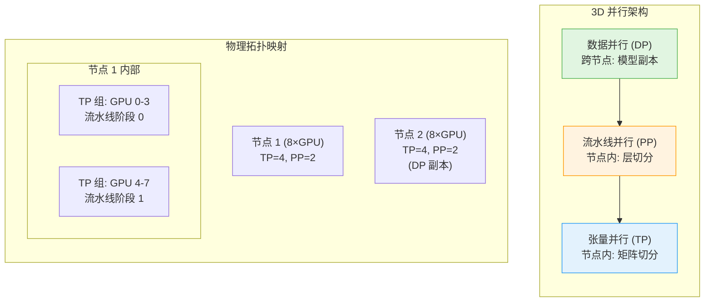

**3D 并行的 GPU 分配公式**：

$$
N_{\text{total}} = N_{\text{TP}} \times N_{\text{PP}} \times N_{\text{DP}}
$$

> 例如：1024 张 GPU = TP=8 × PP=16 × DP=8

**各并行度的选择原则**：

| 并行维度 | 优先选择原因 | 通信代价 | 推荐配置 |
|---------|------------|---------|---------|
| **TP (张量并行)** | 通信量最大，限制在**单节点内** | 每层 2 次 AllReduce | TP ≤ 8（单节点 NVLink） |
| **PP (流水线并行)** | 通信量中等，跨节点 | 仅传递层间激活值 | 按模型层数确定 |
| **DP (数据并行)** | 通信量最小 | 仅 AllReduce 梯度 | 剩余 GPU 全部用于 DP |

### 19.6.2 Megatron-LM 与 DeepSpeed 对比

| 维度 | Megatron-LM | DeepSpeed |
|------|------------|-----------|
| **开发者** | NVIDIA | Microsoft |
| **核心策略** | 3D 并行（TP+PP+DP） | ZeRO 优化（Stage 1/2/3） |
| **张量并行** | 原生支持，实现最成熟 | 可结合 Megatron 的 TP |
| **使用门槛** | 高（需要仔细设计 TP/PP 切分） | 低（一个 JSON 配置文件搞定） |
| **通信效率** | 更高（针对 TP 优化极致） | 较高（ZeRO-3 有额外通信开销） |
| **适用规模** | 万亿参数级别 | 百亿到千亿参数 |
| **推荐策略** | **Megatron-LM 的 TP + DeepSpeed 的 ZeRO** （取长补短） |

```python
# Megatron-DeepSpeed 组合使用（伪代码）
# 这是一个典型的 175B+ 模型训练配置

# Megatron-LM 负责:
#   - 张量并行 (TP=8): 节点内 8 张 GPU 切分单层
#   - 流水线并行 (PP=16): 16 个 pipeline stage

# DeepSpeed 负责:
#   - ZeRO Stage 1: 在 DP 维度做优化器分片
#   - 优化器状态和数据加载

# 总 GPU: 8 × 16 × 8 = 1024 张
# TP=8, PP=16, DP=8
```

---

## 19.7 混合精度训练 ⭐⭐⭐⭐

### 19.7.1 FP16/BF16/FP8 的区别

混合精度训练是指在训练过程中同时使用多种数值精度，以减少显存占用和加速计算。

| 精度 | 总位数 | 指数位 | 尾数位 | 动态范围 | 精度 | 适用场景 |
|------|-------|--------|--------|---------|------|---------|
| **FP32** | 32 | 8 | 23 | $\pm 3.4 \times 10^{38}$ | 最高 | 累积/存储 |
| **TF32** | 19 | 8 | 10 | $\pm 3.4 \times 10^{38}$ | 高 | A100 默认 tensor core 格式 |
| **FP16** | 16 | 5 | 10 | $\pm 65504$ | 中 | 传统混合精度训练 |
| **BF16** | 16 | 8 | 7 | $\pm 3.4 \times 10^{38}$ | 中（低精度） | **大模型训练首选** |
| **FP8 (E4M3)** | 8 | 4 | 3 | $\pm 448$ | 低 | H100/B200 的下一代训练 |
| **FP8 (E5M2)** | 8 | 5 | 2 | $\pm 57344$ | 更低 | H100/B200 大动态范围 |

**BF16 vs FP16 的关键区别**：

```
FP16: [S] [EEEEE] [MMMMMMMMMM]    ← 5位指数 + 10位尾数
                                    → 范围小但精度高
                                    需要 Loss Scaling

BF16: [S] [EEEEEEEE] [MMMMMMM]    ← 8位指数 + 7位尾数
   (Brain Float 16)                → 范围与 FP32 相同
                                    不需要 Loss Scaling ✅
```

$$
\text{FP16 能表示的 min positive} = 2^{-14} \approx 6.1 \times 10^{-5}
$$
$$
\text{BF16 能表示的 min positive} = 2^{-126} \approx 1.2 \times 10^{-38}
$$

> **关键结论**：BF16 的动态范围与 FP32 相同，因此**不需要 Loss Scaling**，这是大模型训练普遍使用 BF16 的根本原因。FP8 则需要更复杂的逐层缩放策略。

### 19.7.2 损失缩放（Loss Scaling）

当使用 FP16 训练时，很多梯度值会小于 FP16 能表示的最小正数（$6.1 \times 10^{-5}$），导致 **Underflow（下溢）** —— 梯度变为 0，训练停滞。

**解决方案**：在 FP16 训练中将 loss 乘以一个大常数（如 $2^{16}$），使得小梯度的值落入 FP16 可表示范围，然后在更新参数前再除以相同常数。

```python
# PyTorch 的自动混合精度示例（AMP）
import torch
from torch.cuda.amp import autocast, GradScaler

def train_with_amp(model, dataloader, optimizer):
    """
    使用 FP16 AMP 进行混合精度训练
    注意：BF16 不需要 GradScaler！
    """
    scaler = GradScaler(init_scale=2**16)  # 初始缩放因子 65536

    for batch in dataloader:
        optimizer.zero_grad()

        # autocast 自动将前向传播转为 FP16
        with autocast(device_type="cuda", dtype=torch.float16):
            outputs = model(batch)
            loss = outputs.loss

        # 反向传播：scaler 自动处理梯度缩放
        # scaler.scale(loss) 将 loss 乘以 scale_factor
        # backward 后 scaler 会自动检测溢出（inf/nan）
        scaler.scale(loss).backward()

        # 如果有溢出，跳过本次更新并增加 scale
        # 如果没有溢出，正常更新并尝试增加 scale
        scaler.step(optimizer)
        scaler.update()

        # 内部逻辑（简化）:
        # if 检测到 INF/NaN:
        #     skip update, scale *= 0.5 (backoff_factor)
        # else:
        #     unscale gradients, optimizer.step()
        #     scale *= 2.0 (growth_factor)
```

**Loss Scaling 的动态调整策略**：

| 阶段 | Scale 变化 | 说明 |
|------|-----------|------|
| **正常训练** | Scale $\times$ 2.0 | 每 N 步倍增，直到接近 FP16 上限 |
| **检测到溢出** | Scale $\times$ 0.5 | 梯度包含 Inf/NaN，跳过本次更新 |
| **稳定后** | Scale 保持 | 在溢出阈值附近稳定 |
| **BF16 训练** | **不需要** | 动态范围与 FP32 相同 |

### 19.7.3 Automatic Mixed Precision (AMP)

AMP 的完整工作流程：

```python
"""
混合精度训练的最佳实践 —— BF16 优先（2026年推荐）
"""
import torch

# ============================================================
# 方式一：PyTorch 原生 BF16（推荐，A100/H100 首选）
# ============================================================
@torch.no_grad()
def train_with_bf16():
    """最简单的 BF16 训练 —— 零代码侵入"""
    model = MyModel().to("cuda")
    optimizer = torch.optim.AdamW(model.parameters(), lr=3e-4)

    for batch in dataloader:
        optimizer.zero_grad()

        # 只需一行：开启 BF16 autocast
        with torch.autocast(device_type="cuda", dtype=torch.bfloat16):
            outputs = model(batch)
            loss = outputs.loss

        # 反向传播自动用 BF16（梯度可能自动提升到 FP32）
        loss.backward()
        optimizer.step()
        # 注意：BF16 不需要 GradScaler！


# ============================================================
# 方式二：DeepSpeed 的 BF16 配置
# ============================================================
# ds_config.json:
# {
#     "bf16": {
#         "enabled": true
#     },
#     "fp16": {
#         "enabled": false   // 只启用 BF16
#     }
# }

# ============================================================
# 方式三：FSDP + BF16
# ============================================================
from torch.distributed.fsdp import MixedPrecision

mp_policy = MixedPrecision(
    param_dtype=torch.bfloat16,
    reduce_dtype=torch.bfloat16,
    buffer_dtype=torch.bfloat16,
)
```

**精度选择决策树**：

```
训练硬件
├── H100/H200/B200
│   └── 使用 FP8 训练（需 torchao / TransformerEngine）
├── A100
│   └── 使用 BF16（Tensor Core 原生支持，无需 Loss Scaling）
├── V100
│   └── 使用 FP16 + Loss Scaling（不支持 BF16 加速）
└── 老旧 GPU
    └── 使用 FP32（不支持混合精度加速）
```

---

## 19.8 通信原语 ⭐⭐⭐⭐

### 19.8.1 核心通信原语

分布式训练中，GPU 之间的通信依赖 NCCL 库提供的集合通信原语。

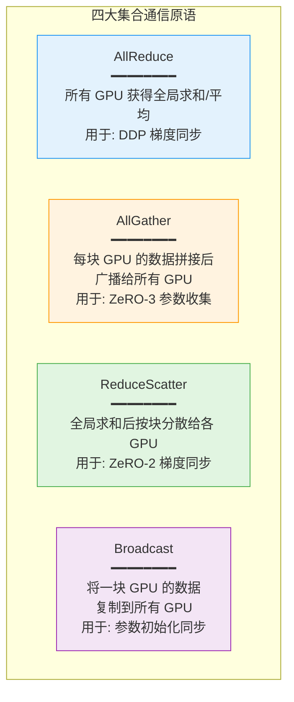

**各原语的数学描述与通信量**：

| 原语 | 输入 | 输出 | 通信量 | 用途 |
|------|------|------|--------|------|
| **AllReduce** | 每卡有 $x_i$ | 每卡得到 $\sum x_i$ | $2\frac{N-1}{N}K$ | DDP 梯度同步 |
| **AllGather** | 每卡有 $K/N$ 数据 | 每卡得到全部 $K$ 数据 | $\frac{N-1}{N}K$ | ZeRO-3 参数收集 |
| **ReduceScatter** | 每卡有 $K$ 数据 | 每卡得到 $K/N$ 的求和 | $\frac{N-1}{N}K$ | ZeRO-2 梯度分片 |
| **Broadcast** | 卡 0 有 $K$ 数据 | 所有卡得到 $K$ 数据 | $K$ | 参数初始化 |
| **Scatter** | 卡 0 有 $K$ 数据 | 每卡得到 $K/N$ | $\frac{N-1}{N}K$ | 数据分发 |

### 19.8.2 NCCL 通信库

NCCL（NVIDIA Collective Communications Library）是 NVIDIA GPU 间通信的事实标准：

```bash
# NCCL 关键环境变量配置
export NCCL_DEBUG=INFO              # 调试信息级别 (生产关掉)
export NCCL_IB_DISABLE=0           # 启用 InfiniBand (默认)
export NCCL_SOCKET_IFNAME=eth0     # 指定使用的网卡
export NCCL_IB_HCA=mlx5_0          # 指定 IB 网卡
export NCCL_P2P_DISABLE=0          # 启用 GPU P2P 直连
export NCCL_NET_GDR_LEVEL=5        # GPU Direct RDMA 级别

# 跨节点网络选择
# NVLink:  节点内 GPU 间通信 (900 GB/s on H100)
# InfiniBand: 节点间通信 (400 GB/s NDR400)
# RoCE:    节点间通信 (200-400 GB/s)
# 以太网:   最慢的方案 (仅用于小规模)
```

**NCCL 通信拓扑感知**：

```python
import torch.distributed as dist

def inspect_nccl_topology():
    """检查 NCCL 通信拓扑"""
    if dist.is_initialized():
        # 获取当前 rank 和 world_size
        rank = dist.get_rank()
        world_size = dist.get_world_size()

        # NCCL 会自动检测最优通信路径:
        # 节点内: NVLink → NVSwitch (全互联)
        # 节点间: InfiniBand → 环形拓扑
        # 当检测到 NVSwitch 时，使用 Tree 算法而非 Ring 算法

        print(f"Rank {rank}/{world_size}")
        print(f"NCCL version: {torch.cuda.nccl.version()}")

# NCCL 内部通信算法选择:
# - Ring: 默认算法，适用于任意拓扑
# - Tree: 当有 NVSwitch 时使用，延迟更低
# - CollNet: 当检测到特定 InfiniBand 拓扑时使用
```

### 19.8.3 通信与计算重叠

这是提升分布式训练效率最关键的技巧 —— 让通信和计算在时间上重叠，隐藏通信延迟。

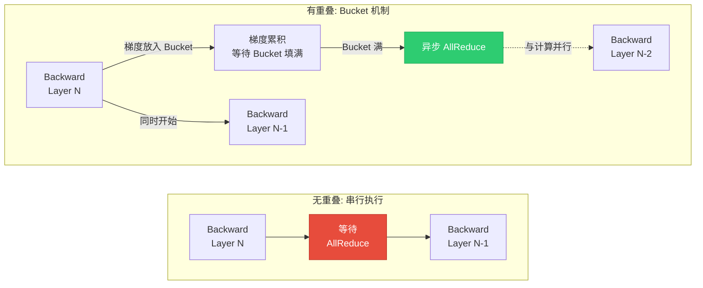

**Bucket 机制实现原理**：

```python
# DDP 的梯度 Bucket 机制（源码简化）
class BucketManager:
    """
    DDP 将梯度按 bucket_size 分组，
    一个 bucket 填满后立即启动异步 AllReduce，
    同时继续计算其他层的梯度。
    """
    def __init__(self, bucket_size_mb=25):
        self.bucket_size = bucket_size_mb * 1024 * 1024  # 25 MB 默认
        self.buckets = []  # 待填充的 bucket

    def add_gradient(self, param_name, grad):
        """将梯度加入对应 bucket"""
        bucket = self._find_bucket(param_name)
        bucket.add(grad)

        if bucket.is_full():
            # 异步启动 AllReduce，不阻塞后续层的 backward
            bucket.start_async_allreduce()

    # 效果:
    # Backward(Layer 32) → Bucket 满 → Async AllReduce(Layer 32-29)
    # Backward(Layer 28)                                          ← 同时进行
    # Backward(Layer 27) → Bucket 满 → Async AllReduce(Layer 27-24)
    # ...
```

**通信重叠的优化配置**：

```python
# DeepSpeed 通信重叠配置
# ds_config.json:
{
    "zero_optimization": {
        "overlap_comm": true,          # ✅ 启用通信重叠
        "reduce_bucket_size": 5e8,    # 500MB bucket（更大 = 更好重叠）
        "allgather_bucket_size": 5e8,
        "contiguous_gradients": true, # ✅ 梯度连续存储
        "round_robin_gradients": true # ✅ 轮询梯度分组（更好的负载均衡）
    }
}

# FSDP 通信重叠配置
model = FSDP(
    model,
    backward_prefetch=BackwardPrefetch.BACKWARD_PRE,
    # BACKWARD_PRE: 在当前层 backward 时预取下一层参数
    # BACKWARD_POST: 在当前层 backward 后预取（默认）
    # 预取让 AllGather（收集参数）与 backward（计算梯度）重叠
    forward_prefetch=True,  # FSDP2 支持前向预取
)
```

---

## 19.9 2026年新训练技术 ⭐⭐⭐⭐⭐

> **本节为 2026 年版新增内容**，聚焦过去一年里在大模型训练效率上取得突破性进展的四项新技术：Muon Optimizer、Schedule-Free AdamW、TokenSpeed、TLX Block Attention。这些技术从**优化器、数学训练算法、Kernels 层面**三个不同维度刷新了 LLM 训练的效率上限，是 2026 年 LLM 工程师面试的高频考点。

### 19.9.1 Muon Optimizer ⭐⭐⭐⭐⭐

**背景与作者**：Muon（**M**omentum **O**rthogonalized by **N**ewton-schulz iteration）由 **Keller Jordan** 在 2024 年提出，并凭借 **NanoGPT speedrun**（以极少算力刷新 NanoGPT 训练速度记录）一战成名。2026 年 6 月，**Microsoft DeepSpeed 正式在 2026.06 版本中原生集成 Muon**，使其与 ZeRO-3 / FSDP 兼容，成为工业级训练的标准优化器选项之一。

**核心思想**：Muon 在 Adam 之外开辟了一条新路 —— 它**不再把梯度当作标量来维护动量，而是把动量矩阵通过 Newton-Schulz 迭代正交化**（orthogonalize），从而让每个参数更新方向都尽量"互不冗余"，对 LLM 训练中的矩阵参数（特别是 Transformer 的 $W_Q, W_K, W_V, W_O, W_{\text{ffn}}$）格外友好。

**Muon vs AdamW 关键差异**：

| 维度 | AdamW | Muon |
|------|-------|------|
| 更新量 | 标量化的 $m_t / (\sqrt{v_t} + \epsilon)$ | 矩阵正交化后的 $U$ |
| 一阶梯度处理 | 自适应学习率（per-param） | 全局统一学习率 + 正交化 |
| 显存开销 | 需保存 $m, v$ 两个 FP32 状态（$2\Phi$） | 仅保存 FP32 动量（$\Phi$），**省一半** |
| LLM 训练速度 | 基线 | 经验上**在部分 LLM 训练中比 AdamW 快 2 倍** |

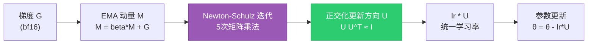

**Muon 优化器的 PyTorch 实现**：

```python
import torch
from torch import Tensor

@torch.compile
def zeropower_via_newtonschulz5(G: Tensor, steps: int = 5, eps: float = 1e-7) -> Tensor:
    """
    Newton-Schulz 迭代近似计算 G 的"零次幂"（即正交化）。
    实测 5 次迭代即可得到足够精确的 U。
    """
    assert G.ndim >= 2
    a, b, c = (3.4445, -4.7750, 2.0315)
    X = G.bfloat16()
    if G.size(-2) > G.size(-1):
        X = X.mT  # 始终让较小维度在最后，便于迭代
    # 归一化: 谱范数 <= 1
    X = X / (X.norm(dim=(-2, -1), keepdim=True) + eps)
    for _ in range(steps):
        A = X @ X.mT
        B = b * A + c * (A @ A)
        X = a * X + B @ X
    if G.size(-2) > G.size(-1):
        X = X.mT
    return X.to(G.dtype)


class Muon(torch.optim.Optimizer):
    """
    Muon: Momentum Orthogonalized by Newton-Schulz.
    用法: optimizer = Muon(model_params, lr=0.02, momentum=0.95)
    注意: 仅用于 >= 2D 参数（矩阵），embedding / lm_head 仍用 AdamW。
    """
    def __init__(self, params, lr: float = 0.02, momentum: float = 0.95,
                 weight_decay: float = 0.0, nesterov: bool = True):
        defaults = dict(lr=lr, momentum=momentum, weight_decay=weight_decay,
                        nesterov=nesterov)
        super().__init__(params, defaults)

    @torch.no_grad()
    def step(self):
        for group in self.param_groups:
            lr = group["lr"]
            momentum = group["momentum"]
            wd = group["weight_decay"]
            nesterov = group["nesterov"]
            for p in group["params"]:
                if p.grad is None:
                    continue
                g = p.grad
                # 1) 动量 (类似 SGD with momentum)
                state = self.state[p]
                if "momentum_buffer" not in state:
                    state["momentum_buffer"] = torch.zeros_like(g)
                buf = state["momentum_buffer"]
                buf.mul_(momentum).add_(g)
                g = g.add(buf, alpha=momentum) if nesterov else buf
                # 2) Decoupled weight decay
                if wd != 0:
                    p.data.mul_(1 - lr * wd)
                # 3) 矩阵参数走 Newton-Schulz 正交化
                if g.ndim == 2:
                    g = zeropower_via_newtonschulz5(g)
                # 4) 应用更新（统一学习率，不做 per-param scale）
                p.data.add_(g, alpha=-lr)
        return None
```

> **DeepSpeed 2026.06 集成**：`deepspeed --num_gpus=64 train.py --optimizer muon` 即可启用；同时 ZeRO-3 状态下 Muon 的动量也会被分片，无需额外改造。

---

### 19.9.2 Schedule-Free AdamW ⭐⭐⭐⭐

**痛点**：传统 AdamW 必须配合精心调度的 **Learning Rate Schedule**（warmup → cosine → cooldown），任何 schedule 的偏差都可能让训练崩溃或损失十几个百分点的最终质量。

**核心思想**：Schedule-Free AdamW（Meta FAIR, 2024-2025）在**不依赖任何 LR schedule** 的前提下即可接近甚至超越 cosine schedule 的最终性能 —— 用一组巧妙的"插点 + 平均"技巧，让参数空间中的"重心"自然等价于带 schedule 的训练。

**关键公式（简化）**：

$$
\begin{cases}
y_{t+1} = x_t - \eta_t \, \nabla f(x_t, \xi_t) \\
z_{t+1} = z_t - \eta_t \, \nabla f(x_t, \xi_t) \\
x_{t+1} = \frac{(1 - c_{t+1}) y_{t+1} + c_{t+1} z_{t+1}}{1 - \prod_{i=1}^{t+1} (1 - c_i)}
\end{cases}
$$

其中 $c_t = \frac{t}{\text{warmup} + t}$。**$x$ 是真正被"评估/采样"的参数轨迹**，$y, z$ 是内部迭代点，$x$ 自然成为它们的加权平均，从而抵消了不调 schedule 带来的振荡。

**优势**：

- **零调参成本**：直接给一个合理的 base LR 即可，不需要 cos、linear、wsd 等任何 schedule。
- **支持早停/续训**：传统 cosine schedule 一旦中断就回不去，Schedule-Free 可以随时停、随时恢复，质量几乎无损。
- **可与 Muon 配合**：在 DeepSpeed 2026.06 中，Schedule-Free AdamW + Muon 的混合优化器（Muon 管矩阵、Schedule-Free AdamW 管 embedding/lm_head）成为新 SOTA。

---

### 19.9.3 TokenSpeed ⭐⭐⭐⭐⭐

**来源**：PyTorch 官方博客 2026 年 5 月发布的训练效率基准 **TokenSpeed**。

**定位**：类似 MLPerf Training，但更聚焦**端到端 tokens/sec/GPU**，覆盖 MoE、Hybrid 架构、长上下文等 2026 年主流模型形态。

**头条成绩**：在 1024 张 Blackwell B200 上，**Qwen3.5-397B-A17B**（397B 总参数 / 17B 激活的 MoE 架构）实现了 **580 tokens/sec/GPU** 的训练吞吐，对比 2025 年同期的 Llama-3-405B 基线提升了约 **3.4 倍**。

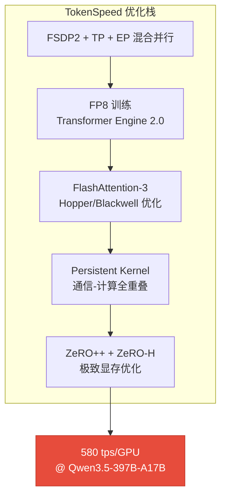

**关键收益来源**：

1. **FP8 训练全面成熟**：Transformer Engine 2.0 在 Blackwell 上对 MoE 的 FP8 路由损失已 < 0.05%，不再是"准生产"。
2. **Persistent Kernel 模式**：通信 collective 算子以 CUDA Graph + persistent thread 形式常驻 GPU，AllReduce 几乎零开销。
3. **EP (Expert Parallel) for MoE**：对 397B-A17B 这种激活比 4% 的 MoE，EP 把 17B 激活的 all-to-all 通信量减少到 DP 的 $\frac{1}{E}$（$E$ 为专家数）。

---

### 19.9.4 TLX Block Attention ⭐⭐⭐⭐

**来源**：PyTorch 官方博客 2026 年 5 月同篇报告。

**全名**：**T**orch **L**ibrary e**X**tension — Block Attention，是 PyTorch 团队与 NVIDIA 联合发布的 **warp-specialized Blackwell kernel**，专为**固定块稀疏 self-attention**（fixed-block sparse self-attention）设计。

**问题动机**：长上下文训练中，标准 self-attention 的 $O(n^2)$ 复杂度是显存/算力杀手。Block Attention 把 query/key 按固定 block（如 128 tokens）切分，仅对**当前 query block 真正需要关注**的 KV block 范围做 attention，对其余 block 跳过。

**实现亮点**：

- **Warp-Specialized Kernel**：在 Blackwell SM 上，把 Producer/Consumer Warp 拆开 —— 一组 Warp 负责从 HBM 异步加载 KV blocks，另一组 Warp 做 Tensor Core 矩阵乘，最大限度隐藏访存延迟。
- **与 FlashAttention-3 兼容的 API**：可直接替换 `F.scaled_dot_product_attention`，框架自动选择 block-sparse 路径。
- **典型加速**：在 128K 上下文 + 训练模式下，相比 dense FlashAttention-3 节省 **~35% 训练时间**；在 1M 上下文推理（KV cache 推理）下可节省 **~50%**。

```python
# 伪代码: TLX Block Attention 用法（PyTorch 2.9+）
import torch
from torch.nn.attention.flex_attention import flex_attention, create_block_mask

def causal_block_mask(b, h, q_idx, kv_idx):
    # 仅保留当前 query block 关注的 KV block，假设 block_size=128
    block_size = 128
    q_block = q_idx // block_size
    kv_block = kv_idx // block_size
    # 因果 + 局部窗口
    return (q_block >= kv_block) & (q_block - kv_block < 4)  # 滑窗 4 blocks

block_mask = create_block_mask(causal_block_mask, B=1, H=1, Q_LEN=131072, KV_LEN=131072)

# 编译后内核自动使用 TLX warp-specialized path
out = flex_attention(q, k, v, block_mask=block_mask)  # 走 TLX Blackwell kernel
```

---

### 19.9.5 小结：2026 年训练效率组合拳

| 技术 | 优化目标 | 收益量级 | 工业可用性 |
|------|----------|----------|------------|
| **Muon Optimizer** | 优化器数学 | 部分 LLM 训练 **~2x** vs AdamW | DeepSpeed 2026.06 原生 |
| **Schedule-Free AdamW** | 训练流程 | 省去 LR schedule 调参，损失 < 1% | torch_optimizer 0.5+ |
| **TokenSpeed** | 端到端训练吞吐 | 397B-A17B 达到 **580 tps/GPU** | PyTorch 2.9+ |
| **TLX Block Attention** | 长上下文 attention kernel | 128K 上下文省 **~35%** 时间 | PyTorch 2.9+ |

> **面试提示**：面试官很可能会问"如果让你把 Llama-3-70B 重训一次，你会用哪些 2026 年的新技术？"—— 推荐组合：**FSDP2 + TP=8 + Muon 优化器 + FP8 (TE2.0) + FlashAttention-3 + TokenSpeed 流水线**。

---

## 🎯 面试真题

### 题 1：请详细解释 DDP 和 DP 的区别

**难度**：⭐⭐⭐ | **频率**：极高

**参考答案**：

DDP（DistributedDataParallel）和 DP（DataParallel）都是 PyTorch 的数据并行方案，但设计理念完全不同：

1. **进程模型**：DP 使用单进程多线程（受 Python GIL 限制），DDP 使用多进程（每个 GPU 一个独立进程）。

2. **通信方式**：DP 将所有梯度汇集到 GPU 0，由 GPU 0 计算平均后再广播；DDP 使用 AllReduce 对等通信，所有 GPU 同时参与。

3. **负载均衡**：DP 中 GPU 0 的负载远高于其他 GPU（需额外的 reduce 和 broadcast）；DDP 中所有 GPU 负载均等。

4. **梯度同步时机**：DP 在 loss.backward() 完成后才开始同步；DDP 在 backward() 过程中就梯度 bucket 填满即启动异步 AllReduce，实现通信与计算重叠。

5. **多机支持**：DP 仅支持单机多卡；DDP 支持多机多卡。

6. **性能差异**：在 8 卡场景下，DDP 比 DP 快约 30-50%，且 GPU 利用率更均匀。

---

### 题 2：ZeRO 的三个 Stage 分别分片了什么？显存节省如何计算？

**难度**：⭐⭐⭐⭐ | **频率**：极高

**参考答案**：

ZeRO（Zero Redundancy Optimizer）通过消除数据并行中的冗余存储来节省显存。

**分片策略**：

- **ZeRO Stage 1**：仅分片**优化器状态**。减少 Adam 的 $m$ 和 $v$ 的冗余（$12\Phi$ → $12\Phi/N$），通信不变。

- **ZeRO Stage 2**：分片**梯度 + 优化器状态**。$2\Phi + 12\Phi$ → $(2\Phi + 12\Phi)/N$。梯度使用 ReduceScatter 替代 AllReduce。

- **ZeRO Stage 3**：分片**参数 + 梯度 + 优化器状态**。全部 $16\Phi$ → $16\Phi/N$。计算时需要 AllGather 收集完整参数，通信量增加 ~1.5x。

**显存节省公式**（$N$ 为 GPU 数量，$\Phi$ 为参数量）：

| Stage | 参数量显存 | 8 卡节省倍数 |
|-------|-----------|------------|
| DDP (baseline) | $16\Phi$ | 1x |
| ZeRO-1 | $4\Phi + 12\Phi/N$ | ~2.9x |
| ZeRO-2 | $2\Phi + 14\Phi/N$ | ~4.3x |
| ZeRO-3 | $16\Phi/N$ | ~8x |

> **注意**：以上仅为参数相关的显存，实际还需加上激活值显存 $M_{\text{activation}}$。

---

### 题 3：什么是 Tensor Parallelism 和 Pipeline Parallelism？它们的优缺点是什么？

**难度**：⭐⭐⭐⭐ | **频率**：高

**参考答案**：

**Tensor Parallelism（张量并行）**：
- **做法**：将单层内的权重矩阵按列/行切分到多张 GPU，每张 GPU 计算部分结果，然后合并。
- **优点**：通信在层内完成，延迟低（NVLink 900GB/s）；可以将超大单层（如 hidden_dim=8192）放入多张 GPU。
- **缺点**：每层都需要 2 次 AllReduce，通信量很大；只能在**节点内**使用（受 NVLink 带宽限制）。

**Pipeline Parallelism（流水线并行）**：
- **做法**：将模型按层切分，GPU 0 负责 layer 0-7，GPU 1 负责 layer 8-15，数据依次流经各 GPU。
- **优点**：通信量小（仅传递层间激活值）；可以跨节点扩展。
- **缺点**：存在 Bubble（GPU 空闲时间），Bubble 比例 = $(p-1)/m$；需要仔细切分以保证各 stage 负载均衡。

**关键面试点**：两者通常**同时使用**。TP 在**节点内**（8 卡以内）、PP **跨节点**、DP 在**所有节点**。

---

### 题 4：FP16 训练为什么需要 Loss Scaling？BF16 为什么不需要？

**难度**：⭐⭐⭐ | **频率**：高

**参考答案**：

**FP16 需要 Loss Scaling 的原因**：
- FP16 的指数位只有 5 位，最小可表示的正数约为 $6.1 \times 10^{-5}$。
- 训练后期，很多梯度的值会小于这个阈值，导致 **Underflow（下溢）**—— 梯度变为 0，训练无法继续。
- **Loss Scaling** 在反向传播前将 loss 乘以一个大常数（如 $2^{16}$），使梯度值 "左移" 到 FP16 可表示范围。更新参数前再除以相同常数。

**BF16 不需要 Loss Scaling 的原因**：
- BF16（Brain Float 16）有 8 位指数位，与 FP32 相同，动态范围完全一致（$\pm 3.4 \times 10^{38}$）。
- 虽然 BF16 的尾数位只有 7 位（vs FP16 的 10 位），精度更低，但在大模型训练中梯度噪声的容忍度很高。
- **结论**：BF16 天然避免了梯度下溢问题，这是它在大模型训练中全面取代 FP16 的根本原因。

---

### 题 5：1F1B 调度策略是什么？与 GPipe 相比有什么优势？

**难度**：⭐⭐⭐⭐ | **频率**：中等

**参考答案**：

**GPipe 的朴素流水线**：
- 先完成所有 microbatch 的前向传播，再反向传播。
- **缺点**：需要缓存所有 microbatch 的激活值，直到反向传播完成。显存消耗 = $\text{激活值} \times m$（$m$ 为 microbatch 数）。

**1F1B（One Forward One Backward）**：
- 在完成 warmup 阶段的 $p-1$ 个前向传播后，开始交替执行前向和反向。
- **优势 1**：显存占用减少约 2x —— 只需缓存 $p$ 个 microbatch 的激活值（vs GPipe 的 $2m$）。
- **优势 2**：更早释放已完成反向传播的层的激活值。
- **Bubble 比例不变**：仍为 $(p-1)/m$。

**调度对比**（$p=4, m=8$）：
```
GPipe:     FFFF FFFF .... .... BBBB BBBB  (Bubble 集中在首尾)
1F1B:      FFF FBFB FBFB FBFB BBB        (Bubble 均匀分散)
```

---

### 题 6：分布式训练中如何实现通信与计算的重叠？

**难度**：⭐⭐⭐⭐ | **频率**：中等

**参考答案**：

通信与计算重叠是提升分布式训练效率的关键技术，主要通过以下机制实现：

**1. DDP 的 Bucket 机制**：
- 将梯度按 bucket 分组（默认 25MB）。
- 当一个 bucket 填满后立即启动异步 AllReduce，不阻塞后续层的 backward。
- 效果：Layer N-2 的梯度正在通信时，Layer N-3 的 backward 可以同时计算。

**2. FSDP 的参数预取（Backward Prefetch）**：
- 在当前层 backward 时，提前 AllGather 下一层所需的参数。
- `backward_prefetch=BackwardPrefetch.BACKWARD_PRE`

**3. DeepSpeed 的通信重叠**：
- `overlap_comm: true` 在 ZeRO-1/2 中实现梯度通信与 backward 重叠。
- ZeRO-3 中的参数收集也可部分与计算重叠（但受限于依赖关系，重叠程度有限）。

**4. 关键原则**：
- 使用异步通信（NCCL 的非阻塞原语）。
- 合理设置 bucket_size：太小通信次数多，太大影响重叠效果。
- 利用 CUDA Stream 将通信和计算分配到不同流上。

---

### 题 7：如果要训练一个 175B 的模型，如何设计分布式策略？

**难度**：⭐⭐⭐⭐⭐ | **频率**：中等

**参考答案**：

训练 GPT-3 (175B) 级别的模型，需要组合使用多种并行策略：

**显存需求估算**：
- 参数 (FP16): $2 \times 175\text{B} = 350\text{GB}$
- 梯度 (FP16): 350GB
- 优化器 (FP32): $12 \times 175\text{B} = 2.1\text{TB}$
- 激活值: ~几百 GB 到 TB
- **总需求**: ~3TB+（单张 H100 ~80GB）

**推荐方案：Megatron-LM 的 3D 并行 + DeepSpeed ZeRO**：

| 并行维度 | 配置 | 理由 |
|---------|------|------|
| **张量并行 (TP)** | TP=8 | 节点内 8 卡 NVLink，最大化带宽利用率 |
| **流水线并行 (PP)** | PP=16 | 175B 约 96 层，每 stage 管 6 层，负载均衡 |
| **数据并行 (DP)** | DP=8 | 剩余维度的数据并行 |
| **ZeRO** | Stage 1 | 在 DP 维度做优化器状态分片 |
| **总 GPU** | $8 \times 16 \times 8 = 1024$ 张 | A100-80GB |

**额外优化**：
- BF16 混合精度（无需 Loss Scaling）
- Activation Checkpointing（以计算换显存）
- 序列并行（如果上下文长度 > 8192）

**备选方案**：纯 DeepSpeed ZeRO-3 + CPU Offload，约需 256-512 张 GPU，实现更简单但效率略低。

---

### 题 8：Activation Checkpointing 的原理是什么？在什么情况下使用？

**难度**：⭐⭐⭐ | **频率**：高

**参考答案**：

**原理**：
- 正常训练中，前向传播的中间激活值会被缓存，供反向传播使用。
- Activation Checkpointing（也称为 Gradient Checkpointing）在前向传播时**不缓存**中间激活值（或只缓存少量检查点），反向传播时从最近的检查点**重新计算**前向传播，以获取需要的激活值。

**显存与计算的权衡**：
- 显存节省：约 $\sqrt{L}$（$L$ 为层数）到一个数量级。
- 计算增加：约 30-50% 的额外前向计算（只重算激活值，不重算参数）。

$$
\text{如果每层都重算: 显存} \propto O(1), \text{ 计算} \propto O(L)
$$
$$
\text{如果只设检查点: 显存} \propto O(\sqrt{L}), \text{ 计算} \propto O(\sqrt{L})
$$

**使用场景**：
- **必须使用**：训练 70B+ 模型时，激活值本身可能占满一张 80GB 显卡。
- **建议使用**：batch size 较大或序列较长时。
- **配合使用**：与 ZeRO-3 组合可进一步降低显存占用。

**代码示例**：
```python
# PyTorch 方式
model.gradient_checkpointing_enable()

# Transformers 方式
model = AutoModelForCausalLM.from_pretrained(
    "meta-llama/Llama-2-7b-hf",
    use_cache=False,  # 训练时必须关闭 KV cache
)
model.gradient_checkpointing_enable()

# DeepSpeed 配置方式
# ds_config.json:
# {
#     "activation_checkpointing": {
#         "partition_activations": true,
#         "cpu_checkpointing": false
#     }
# }
```

---

### 题 9：NCCL 的 Ring AllReduce 和 Tree AllReduce 有什么区别？

**难度**：⭐⭐⭐⭐ | **频率**：中等

**参考答案**：

**Ring AllReduce（环形算法）**：
- **算法**：GPU 排列成环形，数据沿环传递。
- **步骤数**：$2(N-1)$ 步（ReduceScatter + AllGather 各 $N-1$ 步）。
- **带宽利用率**：最优（每个 GPU 在每个 step 同时收发数据）。
- **延迟**：与 $N$ 成正比。
- **适用拓扑**：任意拓扑，尤其是没有 NVSwitch 的情况。

**Tree AllReduce（树形算法）**：
- **算法**：GPU 排列成树形（通常是双层二叉树），数据从叶子汇集到根再广播。
- **步骤数**：$2\log_2(N)$ 步。
- **带宽利用率**：叶子节点在非活跃步空闲，利用率不如 Ring。
- **延迟**：与 $\log_2(N)$ 成正比。
- **适用拓扑**：有 NVSwitch 的节点（H100 8卡通过 NVSwitch 全互联）。

**选择规则**：
- 小数据量（延迟敏感）：Tree 更好。
- 大数据量（带宽敏感）：Ring 更好。
- NCCL 会自动选择最优算法，无需手动干预。

---

### 题 10：FSDP 与 DeepSpeed ZeRO-3 有什么异同？

**难度**：⭐⭐⭐⭐ | **频率**：中等（2026年上升趋势）

**参考答案**：

| 维度 | FSDP (PyTorch) | DeepSpeed ZeRO-3 |
|------|---------------|------------------|
| **参数分片** | 是 | 是 |
| **梯度分片** | 是 | 是 |
| **优化器分片** | 是 | 是 |
| **CPU Offload** | 支持 (FSDP + CPUOffload) | 原生支持 (ZeRO-Offload/Infinity) |
| **通信重叠** | Backward Prefetch | overlap_comm |
| **混合精度** | MixedPrecision 配置 | fp16/bf16 JSON 配置 |
| **与 HF 集成** | 原生支持 | 原生支持 |
| **灵活性** | 更灵活（可自定义 wrap policy） | 更自动化（配置即用） |
| **性能** | PyTorch 原生优化，延迟更低 | 更成熟，优化更全面 |
| **推荐场景** | PyTorch 原生用户，追求极致性能 | 追求易用性和全面优化 |

**FSDP2 (2024-2026 新架构)**：
- 基于 `DTensor` 的新实现，统一了张量并行和 FSDP 的底层表示。
- 支持更灵活的混合并行策略。
- 通信效率进一步提升。

> **面试建议**：如果面试官问 "你会选择 FSDP 还是 DeepSpeed"，回答应关注场景 —— 纯 PyTorch 生态选 FSDP，需要 RLHF/全面优化选 DeepSpeed。

---

## 📊 速查表

### 分布式训练策略速查

| 需求 | 推荐策略 | 框架 | 最小 GPU 数 |
|------|---------|------|------------|
| 7B 模型全量微调 | ZeRO-2 / FSDP | DeepSpeed / FSDP | 2-4 张 A100 |
| 13B 模型全量微调 | ZeRO-3 | DeepSpeed | 4-8 张 A100 |
| 70B 模型全量微调 | ZeRO-3 + CPU Offload | DeepSpeed | 8-16 张 A100 |
| 175B 模型预训练 | 3D 并行 (TP+PP+DP) | Megatron + DeepSpeed | 256-1024 张 A100 |
| RLHF 训练 | ZeRO-3 + 多模型管理 | DeepSpeed Chat | 16-32 张 A100 |
| 长序列训练 (128K+) | 序列并行 + ZeRO-3 | DeepSpeed Ulysses | 8-16 张 A100 |

### NCCL 通信量速查

| 原语 | 通信量 (per GPU) | 延迟 (N=8) |
|------|-----------------|-----------|
| AllReduce (Ring) | $2\frac{N-1}{N}K$ | $O(N)$ |
| AllGather | $\frac{N-1}{N}K$ | $O(N)$ |
| ReduceScatter | $\frac{N-1}{N}K$ | $O(N)$ |
| Broadcast | $K$ | $O(\log N)$ (Tree) |

---

## 📚 相关章节交叉引用

- [[11_深度学习与PyTorch]] — CUDA 编程基础和 GPU 显存管理
- [[12_Transformer与大模型原理]] — Transformer 架构（张量并行的理论基础）
- [[15_Agent智能体开发]] — 多模型部署的分布式调度
- [[16_模型微调与推理优化]] — LoRA/QLoRA（减少可训练参数，降低分布式成本）
- [[25_推理引擎与高性能服务]] — 训练好的模型如何在 vLLM/SGLang 部署
- [[28_端侧与边缘LLM]] — 端侧模型的蒸馏与压缩技术

---

> **💡 面试提醒**：分布式训练是区分初中级和高级工程师的关键分水岭。面试官通常从 ZeRO 三阶段的区别问起，然后深入到并行策略的选择、通信优化、以及实际项目中遇到的问题。建议至少亲手跑过一次 DDP + DeepSpeed ZeRO-2 的完整训练流程。
