# 第20章 LLMOps与模型可观测性 ⭐⭐⭐⭐

> **面试重要度**：高（定性判断，不代表岗位样本统计）| **审校日期**：2026-07-31
>
> LLMOps（Large Language Model Operations）覆盖实验追踪、Prompt 与配置版本、评估、可观测性、
> 成本治理和发布回滚。本章聚焦可验证的工程方法；模型名称、价格、上下文上限和平台能力都可能变化，
> 使用前必须复核供应商当前文档与账户账单。
>
> **权威基线**：[OpenAI 模型目录](https://developers.openai.com/api/docs/models)、
> [Anthropic 模型概览](https://platform.claude.com/docs/en/about-claude/models/overview)、
> [OpenTelemetry GenAI spans](https://github.com/open-telemetry/semantic-conventions-genai/blob/main/docs/gen-ai/gen-ai-spans.md) 与
> [GenAI metrics](https://github.com/open-telemetry/semantic-conventions-genai/blob/main/docs/gen-ai/gen-ai-metrics.md)。
> OTel GenAI 约定已迁移到独立仓库，相关定义仍可能处于 Development，生产中应锁定版本。

---

## 20.1 LLMOps 全景概述 ⭐⭐⭐⭐

### 20.1.1 MLOps vs LLMOps：核心区别

许多面试官会从"MLOps 经验"切入，考察你对 LLMOps 特殊性的理解。虽然 LLMOps 继承了 MLOps 的核心理念，但大模型的引入带来了范式级变化。

| 维度 | MLOps（传统） | LLMOps（大模型） |
|------|-------------|----------------|
| **模型来源** | 从零训练/微调小模型 | 基于预训练大模型（Foundation Model） |
| **计算资源** | 训练与推理成本取决于负载 | 大模型推理常成为主要可变成本，可用 API 或自托管 |
| **数据管理** | 训练数据 → 特征工程 → 特征存储 | Prompt 模板 + 上下文 + 检索语料 |
| **版本对象** | 模型权重 + 超参数 | 模型版本 + Prompt 版本 + 检索配置 |
| **评估方式** | 精确指标（Accuracy/F1/RMSE） | 模糊指标（相关性/安全性/幻觉率/人类偏好） |
| **部署模式** | REST API / Batch 推理 | 流式输出 / Tool Calling / Agent 编排 |
| **监控重点** | 特征漂移 / 预测延迟 | Prompt 漂移 / Token 用量 / 输出质量 |
| **迭代速度** | 受数据、训练和发布周期约束 | Prompt 可快迭代，但仍须经过评估与发布门禁 |

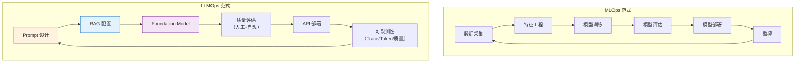

### 20.1.2 LLM 应用生命周期的特殊性

LLM 应用的开发与传统 ML 系统有本质不同，主要体现在以下几个方面：

**1. Prompt 即代码**

Prompt、Few-shot 样例和输出约束都会改变系统行为，但改动的方向和幅度取决于模型、数据集与评分方法，
不能预设固定提升比例。因此 **Prompt 必须像代码一样被版本管理、审查，并在固定评估集上回归测试**。

**2. 模型作为外部依赖**

LLM 应用通常不自己训练模型，而是调用第三方 API（OpenAI、Anthropic）或部署开源模型。这意味着：
- 模型提供商的别名更新、快照退役和服务策略是**外部依赖变化**
- API 版本、Retirement Policy 直接影响线上服务
- 需要**多模型 Fallback 策略**

**3. 评估的模糊性**

传统 ML 的评估指标（Accuracy、F1）是确定性的。LLM 输出的"好"与"坏"往往是主观的：
- 同一问题的多个回答可能都"对"但质量不同
- 需要**LLM-as-a-Judge** + 人工抽检的双重评估体系
- 安全性和幻觉检测是额外的评估维度

**4. 成本可变的推理**

在容量与负载稳定时，传统服务的单位成本相对可预测；LLM 的 Token 消耗还受输入、输出、缓存、
推理用量、工具循环和供应商计费规则影响。因此应同时记录 **usage、实际账单归因和预算**，
不能用一张写死的价格表代替当前账单。

```python
from dataclasses import dataclass

@dataclass(frozen=True)
class TokenRates:
    input_usd_per_million: float
    output_usd_per_million: float
    source: str  # 价格页/合同/账单版本

def estimate_daily_cost(input_tokens: int, output_tokens: int, rates: TokenRates) -> float:
    return (
        input_tokens / 1_000_000 * rates.input_usd_per_million
        + output_tokens / 1_000_000 * rates.output_usd_per_million
    )
```

完整可运行版本见 `code/ch20_llmops/llm/01_cost_comparison.py`。示例费率仅用于演示计算，
模型通过环境变量选择；生产费率必须从当前价格页、合同或账单配置注入。

### 20.1.3 LLMOps 能力成熟度模型 ⭐⭐⭐

企业在 LLMOps 建设上通常经历以下成熟度阶段：

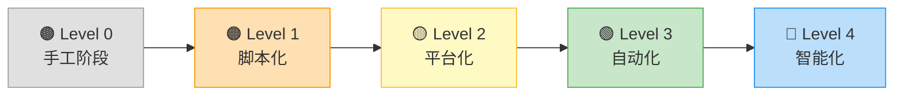

| 成熟度 | 特征 | 工具需求 | 典型场景 |
|--------|------|---------|---------|
| **L0: 手工阶段** | 手动复制 Prompt，人工看结果 | ChatGPT Web UI | 个人探索 |
| **L1: 脚本化** | Python 脚本调 API，CSV 记录结果 | requests + Excel | 小团队原型 |
| **L2: 平台化** | 实验追踪 + Prompt 版本管理 + 基础监控 | MLflow / W&B / LangSmith | 10+ 人团队 |
| **L3: 自动化** | CI/CD + 自动评估 + 告警 + A/B 测试 | GitHub Actions + Grafana | 生产级应用 |
| **L4: 智能化** | 自动 Prompt 优化 + 自适应路由 + 异常自愈 | DSPy + 端云协同 | 大规模部署 |

> 📚 **交叉引用**：LLMOps 中涉及到的模型部署方案（vLLM、TensorRT-LLM），请参考 [第16章 模型微调与推理优化](16_模型微调与推理优化.md#167-模型部署与服务化) 的部署章节。

---

## 20.2 实验追踪 ⭐⭐⭐⭐

### 20.2.1 为什么 LLM 实验需要追踪

LLM 实验的变量远多于传统 ML：

- **Prompt 模板**：单角色/多角色、Few-shot 示例数量和内容、System Prompt 措辞
- **模型选择**：供应商模型 ID/快照（例如当前文档中的 GPT-5.6、Claude Sonnet 5）或自托管模型
- **推理参数**：temperature、top_p、max_tokens
- **RAG 配置**：检索 top_k、Embedding 模型、chunk_size
- **输出后处理**：正则提取、格式校验、重试策略

Prompt 改动可能改变质量、延迟和成本，幅度必须在固定数据集与线上 Guardrail 上测量。
**没有版本、样本和指标记录，就无法归因。**

### 20.2.2 MLflow 核心概念 ⭐⭐⭐

MLflow 是最广泛使用的开源 ML 实验追踪平台，其核心抽象如下：

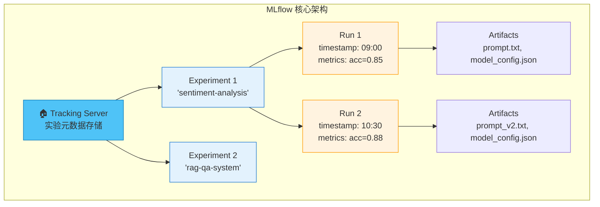

**核心概念速查**：

| 概念 | 说明 | 类比 |
|------|------|------|
| **Experiment** | 一组相关实验的容器（如某个项目） | Git 仓库 |
| **Run** | 单次实验执行 | Git Commit |
| **Parameter** | 实验的输入配置（超参数/Prompt） | 函数参数 |
| **Metric** | 评估指标（accuracy/latency/cost） | 函数返回值 |
| **Artifact** | 任意输出文件（模型/图表/配置） | Build Artifact |

**MLflow 实战代码示例**：

```python
import os
import mlflow

model = os.environ.get("OPENAI_MODEL", "gpt-5.6")
with mlflow.start_run(run_name="prompt-v3"):
    mlflow.log_params({"model": model, "prompt_version": "v3"})
    mlflow.log_metrics({"task_score": measured_score, "latency_ms": measured_latency_ms})
    mlflow.log_artifact("prompt_v3.txt")
```

记录的模型 ID、Prompt 版本、评估集版本和环境必须来自同一次执行。完整示例
`code/ch20_llmops/llm/02_mlflow_llm_tracking.py` 默认离线；只有设置
`LLM_MOCK=0` 与 `LLM_REAL_API=1` 同时满足时才构造真实 API 客户端。

### 20.2.3 Weights & Biases (W&B) 实战 ⭐⭐⭐

W&B 是商业实验追踪与协作平台之一。是否选择它取决于部署方式、权限、成本、数据驻留和团队工作流，
不宜用“最流行”或“能力更强”作无样本依据的结论。

**MLflow vs W&B 对比**：

| 维度 | MLflow | W&B / Weave |
|------|--------|-----|
| **定位** | ML/GenAI 实验、Tracing、评估与监控 | 实验追踪；Weave 提供 LLM Tracing、评估和数据集 |
| **部署/许可** | 开源，可自托管；托管形态依发行方 | 产品形态与套餐会变化，按当前官方条款核验 |
| **GenAI 能力** | GenAI tracing/evaluate、Prompt Registry、生产 Trace 评估 | Weave traces/evaluations/datasets/versioning |
| **选型重点** | 与现有 MLflow、OTel、数据栈的整合 | 团队协作体验、托管边界、数据与费用要求 |

截至 2026-07-31，MLflow 官方 GenAI 文档已覆盖
[GenAI 应用能力](https://mlflow.org/docs/latest/genai/overview/) 和
[OTel 兼容 Tracing](https://mlflow.org/docs/latest/genai/tracing)；W&B 的 LLM 能力应按
[Weave 官方概览](https://docs.wandb.ai/weave/concepts/what-is-weave) 核验。面试时不要再把 MLflow 描述为
“仅有基础 LLM 支持”。

配套示例 `code/ch20_llmops/llm/03_wandb_llm_tracking.py` 将样本级结果写入 Table，
默认仅演示离线数据流；真实 W&B 与模型 API 都要求同时显式设置
`LLM_MOCK=0` 与 `LLM_REAL_API=1`。

### 20.2.4 实验对比与超参数调优追踪 ⭐⭐

**超参数重要性分析**：

LLM 应用的超参数空间与传统 ML 不同：

| 超参数类别 | 具体参数 | 调优优先级 | 影响面 |
|-----------|---------|-----------|--------|
| **Prompt 设计** | 角色设定、Few-shot 示例、Output Format | ⭐⭐⭐⭐⭐ | 质量（最大影响） |
| **推理参数** | temperature, top_p, max_tokens | ⭐⭐⭐⭐ | 创意/稳定性 |
| **RAG 参数** | top_k, similarity_threshold, chunk_size | ⭐⭐⭐⭐ | 准确性 |
| **模型选择** | 模型版本、Provider | ⭐⭐⭐ | 质量+成本 |
| **缓存策略** | TTL、相似度阈值 | ⭐⭐ | 成本+延迟 |

```python
# 使用 MLflow 进行 LLM 超参数搜索
import itertools
import os
import mlflow

mlflow.set_experiment("hyperparam-search")

# 定义搜索空间
search_space = {
    "temperature": [0.0, 0.3, 0.7, 1.0],
    "model": [
        os.environ.get("LLM_MODEL_FAST", "gpt-5.6-terra"),
        os.environ.get("LLM_MODEL_QUALITY", "gpt-5.6-sol"),
    ],
    "prompt_style": ["concise", "detailed", "chain_of_thought"],
}

# 网格搜索
for temp, model, style in itertools.product(
    search_space["temperature"],
    search_space["model"],
    search_space["prompt_style"]
):
    with mlflow.start_run(run_name=f"{model}_t{temp}_{style}"):
        mlflow.log_params({
            "temperature": temp,
            "model": model,
            "prompt_style": style,
        })
        
        # ... 执行评估逻辑 ...
        
        # 使用 Nested Run 记录每个测试用例
        for test_case in test_cases:
            with mlflow.start_run(run_name=test_case["id"], nested=True):
                # ... 单个测试用例的评估 ...
                pass

# 查找最佳实验
best_run = mlflow.search_runs(
    experiment_ids=[experiment_id],
    order_by=["metrics.accuracy DESC"],
    max_results=1,
)
print(f"最佳实验: {best_run.iloc[0]['run_id']}")
print(f"最佳准确率: {best_run.iloc[0]['metrics.accuracy']}")
```

> 📚 **交叉引用**：模型的超参数选择（temperature、top_p 等）直接影响输出质量，具体原理请参考 [[13_Prompt_Engineering]] 中的推理参数详解。

---

## 20.3 LLM可观测性 ⭐⭐⭐⭐⭐

> 可观测性（Observability）是 LLMOps 中最核心、最被面试官关注的能力维度。如果说实验追踪是"记录做了什么"，可观测性就是"看清发生了什么"。

### 20.3.1 什么是 LLM 可观测性

LLM 可观测性包含三个层次：

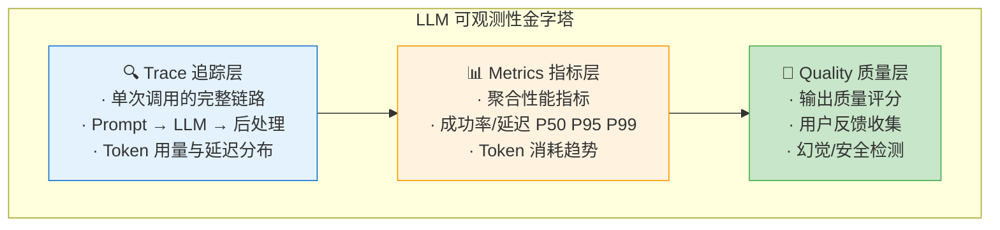

### 20.3.2 LangSmith 核心功能 ⭐⭐⭐⭐⭐

LangSmith 是 LangChain 团队推出的 LLM 可观测性平台，其核心抽象与 MLflow 类似但专注于 LLM 链路：

| 概念 | 说明 | 示例 |
|------|------|------|
| **Trace** | 一次完整的 LLM 调用链路 | 用户提问 → RAG检索 → LLM生成 → 后处理 |
| **Run** | Trace 中的单个步骤 | 单次 Embedding 计算、单次 LLM 调用 |
| **Feedback** | 对 Run 结果的人工/自动评价 | 👍/👎、5星评分、Correct/Incorrect |
| **Dataset** | 测试用例集合 | 100个标注好的问答对 |
| **Experiment** | 在 Dataset 上的一次批量评估 | 测试 Prompt v2 的准确率 |

**LangSmith 集成代码示例**：

```python
# LangSmith 可观测性实战
import os
from langsmith import traceable, Client
from openai import OpenAI

# 真实联网必须显式 opt-in；凭据只从运行环境/密钥管理系统提供。
if os.environ.get("LLM_MOCK") != "0" or os.environ.get("LLM_REAL_API") != "1":
    raise RuntimeError("live mode requires LLM_MOCK=0 and LLM_REAL_API=1")
model = os.environ.get("OPENAI_MODEL", "gpt-5.6")

client = Client()
openai_client = OpenAI()

# 方法1：使用 @traceable 装饰器自动追踪
@traceable(
    run_type="chain",
    name="QA Pipeline",
    metadata={"version": "1.2.0", "environment": "staging"}
)
def qa_pipeline(question: str, context_docs: list[str]) -> dict:
    """完整的 QA 流水线，LangSmith 自动追踪每个步骤"""
    
    # 步骤1：构建 Prompt
    prompt = build_prompt(question, context_docs)
    
    # 步骤2：调用 LLM
    answer = call_llm(prompt)
    
    # 步骤3：后处理
    result = post_process(answer)
    
    return result

@traceable(run_type="prompt", name="Build Prompt")
def build_prompt(question: str, docs: list[str]) -> str:
    """构建 Prompt（LangSmith 自动记录输入/输出）"""
    context = "\n\n".join(docs)
    return f"""基于以下上下文回答问题。

上下文：
{context}

问题：{question}

回答："""

@traceable(run_type="llm", name="LLM Call")
def call_llm(prompt: str) -> str:
    """LLM 调用；延迟可由 Span 计时，Token 仍应从 Provider usage 显式上报。"""
    response = openai_client.chat.completions.create(
        model=model,
        messages=[{"role": "user", "content": prompt}],
        temperature=0.1,
    )
    return response.choices[0].message.content

@traceable(run_type="chain", name="Post-process")
def post_process(answer: str) -> dict:
    """后处理"""
    return {
        "answer": answer.strip(),
        "length": len(answer),
        "has_citation": "来源" in answer,
    }

# 方法2：手动创建 Run 和 Feedback
def manual_trace_example():
    """手动创建 Trace 并添加 Feedback"""
    
    # 创建 Run
    run = client.create_run(
        name="manual-qa-evaluation",
        run_type="chain",
        inputs={"question": "什么是向量数据库？"},
        project_name=os.environ.get("LANGCHAIN_PROJECT", "my-qa-system"),
    )
    
    # 执行...
    result = qa_pipeline("什么是向量数据库？", ["向量数据库是...", "它用于..."])
    
    # 更新 Run 输出
    client.update_run(
        run.id,
        outputs=result,
        end_time=None,  # 自动记录结束时间
    )
    
    # 添加人工反馈
    client.create_feedback(
        run.id,
        key="user-rating",
        score=0.9,  # 0-1 评分
        comment="回答准确，引用了正确的来源",
    )
    
    # 添加自动评估反馈
    client.create_feedback(
        run.id,
        key="contains-citation",
        score=1.0 if result["has_citation"] else 0.0,
        comment="自动检测引用",
    )

# 运行示例
result = qa_pipeline(
    "什么是 MCP 协议？",
    ["MCP (Model Context Protocol) 是 Anthropic 推出的..."]
)
print(f"Answer: {result['answer'][:100]}...")
print(f"🔗 在 LangSmith UI 查看完整 Trace")
```

**LangSmith 在面试中的高频使用场景**：

| 场景 | LangSmith 功能 | 面试话术 |
|------|---------------|---------|
| **调试 Prompt** | 查看完整 Trace，定位哪一步出错 | "我使用 LangSmith 的 Trace 功能定位到 Prompt 中的指令歧义" |
| **回归测试** | Dataset + Experiment 对比新旧 Prompt | "每次改 Prompt 后，在 LangSmith 上跑一遍 Dataset 确保不退化" |
| **用户反馈闭环** | Feedback API 收集用户评分 | "通过 LangSmith Feedback 收集用户纠错，持续优化" |
| **成本归因** | Trace 级别的 Token 统计 | "通过 LangSmith 按项目/用户查看 Token 消耗分布" |

### 20.3.3 Langfuse：开源可观测性平台 ⭐⭐⭐⭐

Langfuse 提供 LLM Tracing、评估、Prompt 管理和数据集能力，核心可开源自托管，也有云与商业功能。
截至 2026-07-31，Cloud 已进入 v4 的 observations-first 数据模型，Python SDK v4 是当前主版本；自托管
Server 与 SDK 仍需按兼容矩阵配对。以 [Langfuse v4](https://langfuse.com/docs/v4)、
[Python v3 → v4 迁移](https://langfuse.com/docs/observability/sdk/upgrade-path/python-v3-to-v4)、
[自托管说明](https://langfuse.com/faq/all/self-hosting-langfuse) 和
[版本兼容矩阵](https://langfuse.com/docs/compatibility) 为准。

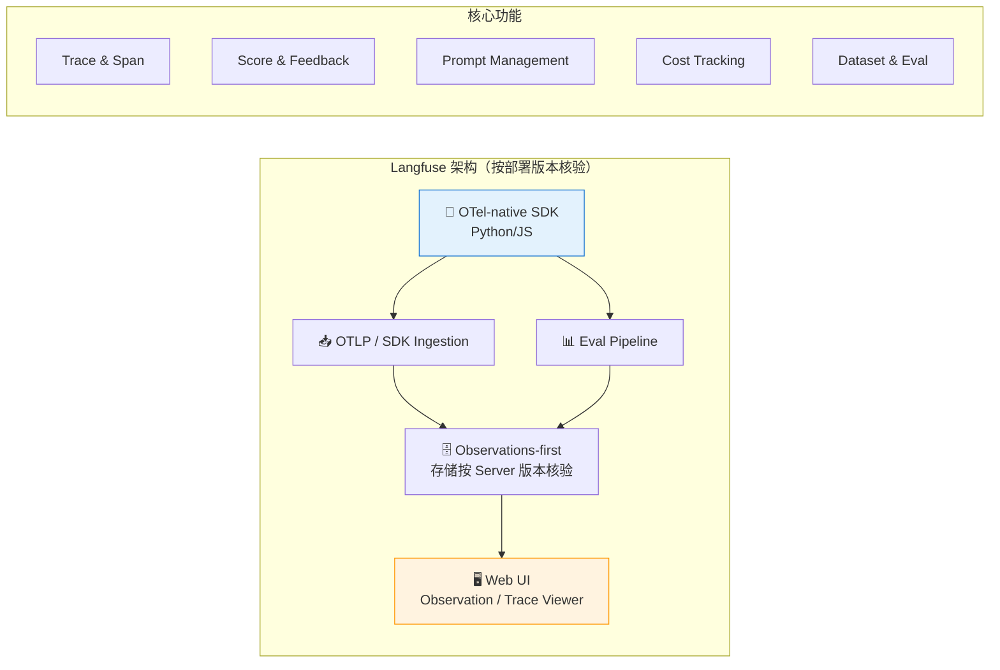

**LangSmith vs Langfuse 对比**：

| 维度 | LangSmith | Langfuse |
|------|-----------|----------|
| **产品/许可** | 商业平台；套餐与部署能力按官方条款核验 | 核心 OSS 为 MIT；云和企业能力另有条款 |
| **部署** | 按当前企业方案核验 | 可自托管；需承担数据库、升级、备份和安全运维 |
| **Prompt/评估** | 支持 Dataset、Experiment、Feedback 等工作流 | 支持 Prompt、Dataset、Experiment、Score 等工作流 |
| **集成** | 与 LangChain/LangGraph 紧密，同时支持其他集成 | 多 SDK/框架与 OTel 路径；兼容性按版本矩阵验证 |
| **成本** | 以当前套餐和用量为准 | SaaS 费用或自托管 TCO，不能把 OSS 等同于零成本 |

```python
from langfuse import get_client, observe, propagate_attributes

langfuse = get_client()  # 仅在显式 live 入口中初始化

@observe(
    name="customer-support-agent",
    as_type="agent",
    capture_input=False,
    capture_output=False,
)
def handle_customer_query(query: str, conversation_history: list) -> dict:
    # v4 用 propagate_attributes 将关联属性传播到当前及子 observations。
    with propagate_attributes(
        trace_name="customer-support-agent",
        tags=["customer-support"],
        metadata={"channel": "web"},
    ):
        intent = classify_intent(query)
        langfuse.update_current_span(metadata={"intent": intent})
        docs = retrieve_knowledge(query, intent)
        answer = generate_response(query, docs, conversation_history)
        langfuse.update_current_span(
            output={"intent": intent, "source_count": len(docs)}
        )
        langfuse.score_current_trace(
            name="response_length",
            value=min(len(answer) / 500, 1.0),
            data_type="NUMERIC",
        )
        trace_id = langfuse.get_current_trace_id()
    return {"answer": answer, "trace_id": trace_id}

# 已结束 Trace 的异步评分使用 create_score，而不是旧版 score()。
def evaluate_response_quality(trace_id: str, score: float) -> None:
    langfuse.create_score(
        trace_id=trace_id,
        name="quality_score",
        value=score,
        data_type="NUMERIC",
    )
```

`@observe` 默认会捕获参数与返回值；Prompt、检索文档或用户输入可能包含敏感数据，因此示例按官方
[Instrumentation](https://langfuse.com/docs/observability/sdk/instrumentation) 使用
`capture_input=False, capture_output=False`。配套脚本
`code/ch20_llmops/llm/06_langfuse_observability.py` 默认离线且不读取凭据。

### 20.3.4 Prompt 调试与优化 ⭐⭐⭐

可观测性工具最重要的应用场景之一就是 **Prompt 调试**。在面试中，能够清晰描述如何使用 Trace 工具定位 Prompt 问题是重要加分项。

**Prompt 调试工作流**：

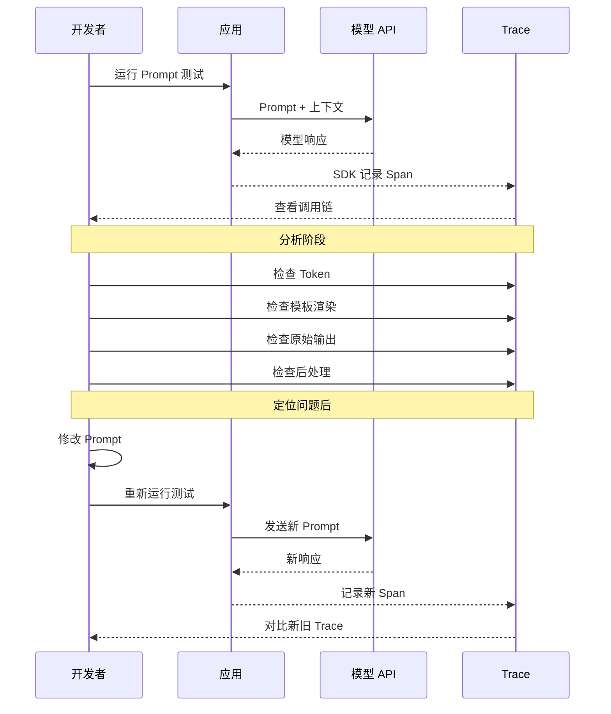

**常见 Prompt 问题及 Trace 定位方法**：

| 问题 | Trace 表现 | 定位方法 |
|------|-----------|---------|
| **Prompt 过长或被截断** | 输入 Token 接近模型/网关的上下文预算，或出现明确截断信号 | 用实际 tokenizer、Provider usage 与当前上下文上限核验 |
| **指令未被遵循** | LLM 输出格式与期望不符 | 对比 Prompt 原文与渲染结果 |
| **RAG 检索错误** | 检索结果不相关 | 检查检索步骤 Run 的输入/输出 |
| **幻觉问题** | 输出包含不存在的信息 | 对比 retrieval Run 输出与 LLM Run 输出 |
| **后处理 Bug** | LLM 输出正确但最终结果错误 | 检查后处理 Run 的输入/输出对比 |

```python
# 使用 LangSmith SDK 进行 Prompt 调试（真实查询需显式 live 授权）
import os
from langsmith import Client

if os.environ.get("LLM_MOCK") != "0" or os.environ.get("LLM_REAL_API") != "1":
    raise RuntimeError("live mode requires LLM_MOCK=0 and LLM_REAL_API=1")
client = Client()

def debug_prompt_issue(
    project_name: str,
    *,
    min_prompt_chars: int,
    max_prompt_chars: int,
):
    """字符数只做初筛；是否截断必须再核对 tokenizer、usage 和上下文上限。"""
    
    # 查找所有相关 Trace
    runs = list(client.list_runs(
        project_name=project_name,
        execution_order=1,
        filter=f'eq(name, "Build Prompt")',
    ))
    
    issues = {
        "short_prompts": [],
        "empty_contexts": [],
        "long_prompts_by_chars": [],
    }
    
    for run in runs:
        prompt_text = run.outputs.get("prompt", "") if run.outputs else ""
        input_data = run.inputs or {}
        
        if len(prompt_text) < min_prompt_chars:
            issues["short_prompts"].append({
                "run_id": run.id,
                "prompt_chars": len(prompt_text),
                "input": input_data,
            })
        
        # 检测2：上下文是否为空
        if not input_data.get("context"):
            issues["empty_contexts"].append({
                "run_id": run.id,
                "question": input_data.get("question"),
            })
        
        if len(prompt_text) > max_prompt_chars:
            issues["long_prompts_by_chars"].append({
                "run_id": run.id,
                "prompt_chars": len(prompt_text),
            })
    
    # 生成诊断报告
    print(f"=== Prompt 诊断报告 ===")
    print(f"总 Trace 数: {len(runs)}")
    print(f"字符数偏短: {len(issues['short_prompts'])}")
    print(f"空上下文: {len(issues['empty_contexts'])}")
    print(f"字符数偏长: {len(issues['long_prompts_by_chars'])}")
    
    # 返回问题的 Trace ID 供进一步分析
    return issues

# 使用示例
issues = debug_prompt_issue(
    "my-qa-system",
    min_prompt_chars=20,
    max_prompt_chars=8000,
)
```

上面的字符阈值只是教学筛选策略，不是任何模型的 Token 上限；生产中应把它们版本化，并用真实
tokenizer、Provider usage、网关截断日志和目标模型当前上下文限制复核。

### 20.3.5 Token 用量追踪 ⭐⭐⭐

```python
rates = rate_card[model]  # 来自当前价格页/合同/账单配置
cost_usd = (
    input_tokens / 1_000_000 * rates.input_usd_per_million
    + output_tokens / 1_000_000 * rates.output_usd_per_million
)
budget_tracker.record(model=model, cost_usd=cost_usd, rate_source=rates.source)
```

必须把缓存读写、批处理、推理 Token 等供应商特定计费项纳入 Rate Card；未知模型应失败并告警，
不能静默按 0 元或套用其他模型价格。完整实现见
`code/ch20_llmops/llm/08_token_tracker.py`，预算、告警比率和教学费率均可配置。

---

## 20.4 Prompt 版本管理与A/B测试 ⭐⭐⭐⭐

### 20.4.1 Prompt 版本控制方案

Prompt 是 LLM 应用中最敏感的配置。它的微小变动可能引起输出质量的显著变化。业界常用的 Prompt 版本控制方案有以下几种：

| 方案 | 适用场景 | 优点 | 缺点 |
|------|---------|------|------|
| **Git 管理 Prompt 文件** | 小团队 | 简单、版控能力强 | 缺乏运行时管理 |
| **LangSmith Prompt Hub** | LangChain 用户 | 与 Trace 集成、自动版本 | 依赖商业平台 |
| **Langfuse Prompt Management** | 需自托管或使用云服务的团队 | Prompt 发布与版本能力 | 版本、套餐与运维需核验 |
| **数据库 + 配置中心** | 企业级 | 运行时动态切换 | 开发成本高 |
| **Feature Flag 控制** | A/B 测试 | 灰度发布 | 架构复杂度增加 |

```yaml
# Prompt 版本控制 YAML 配置示例
# prompts/qa_prompt.yaml

prompts:
  qa_default:
    version: "3.2.0"
    created: "2026-05-15"
    author: "alice@company.com"
    status: "production"  # draft | testing | production | deprecated
    description: "标准问答 Prompt，优化了引用格式和拒绝策略"
    
    template: |
      你是一个专业的知识问答助手。请基于以下参考资料回答问题。
      
      ## 参考资料
      {context}
      
      ## 对话历史
      {chat_history}
      
      ## 当前问题
      {question}
      
      ## 回答要求
      1. 如果参考资料包含答案，请给出准确回答并标注来源
      2. 如果参考资料不充分，请明确说明"根据现有资料无法确定"
      3. 如果问题涉及主观判断，请给出平衡的观点
      4. 使用 [来源N] 格式标注引用
      
      ## 回答
    
    # 关联的测试集
    test_dataset: "qa_regression_test_v2"
    
    # 性能基线
    baseline:
      accuracy: 0.87
      hallucination_rate: 0.03
      avg_latency_ms: 850
      avg_tokens: 420
    
    # A/B 测试配置
    ab_test:
      enabled: false
      traffic_split: 50
      variant: null
  
  qa_v4_experimental:
    version: "4.0.0-beta.1"
    created: "2026-05-28"
    author: "bob@company.com"
    status: "testing"
    description: "引入 Chain-of-Thought + 自我验证的实验版 Prompt"
    
    template: |
      你是一个专业的知识问答助手。请按以下步骤工作：
      
      ## 步骤1：分析问题
      仔细阅读问题，识别关键概念和所需信息类型。
      
      ## 步骤2：检索相关证据
      从参考资料中找出与问题相关的内容：
      {context}
      
      ## 步骤3：推理与回答
      基于找到的证据，逐步推理并给出回答。
      
      ## 步骤4：自我验证
      检查你的回答是否：
      - 完全基于参考资料
      - 没有编造信息
      - 标注了所有来源
      
      问题：{question}
    
    test_dataset: "qa_regression_test_v2"
    
    baseline:
      accuracy: null  # 测试中
      hallucination_rate: null
      avg_latency_ms: null
      avg_tokens: null
    
    ab_test:
      enabled: false
      traffic_split: 0
      variant: null
```

### 20.4.2 A/B 测试框架设计 ⭐⭐⭐⭐

A/B 测试是验证线上因果影响的常用方法之一；离线回归、专家标注和安全审查仍不可缺少。
框架需要解决实验单位、流量分配、功效分析、多重检验、业务指标与质量 Guardrail。

```python
# LLM Prompt A/B 测试框架
import hashlib
import random
from enum import Enum
from dataclasses import asdict, dataclass, field
from statistics import NormalDist
from typing import Any, Optional
from datetime import datetime
import json

class Variant(Enum):
    CONTROL = "control"      # 原版 Prompt
    TREATMENT = "treatment"  # 新版 Prompt

@dataclass
class ABTestConfig:
    """A/B 测试配置"""
    experiment_id: str
    control_prompt: str
    treatment_prompt: str
    min_sample_size: int
    max_latency_ratio: float
    max_token_ratio: float
    max_error_rate_absolute_increase: float
    minimum_relative_lift_pct: float
    significance_alpha: float = 0.05
    traffic_split: float = 0.5  # treatment 流量比例
    
    # 关键指标
    primary_metric: str = "user_satisfaction"  # 北极星指标
    guardrail_metrics: list = field(default_factory=lambda: [
        "response_latency_ms",
        "token_usage",
        "error_rate",
    ])
    
    # 状态
    status: str = "draft"  # draft | running | completed | stopped
    
@dataclass
class ABTestResult:
    """单次 A/B 测试结果"""
    user_id: str
    variant: Variant
    query: str
    response: str
    
    # 业务指标
    user_rated_helpful: Optional[bool] = None
    user_clicked_source: Optional[bool] = None
    conversation_continued: Optional[bool] = None
    
    # 性能指标
    latency_ms: float = 0.0
    prompt_tokens: int = 0
    completion_tokens: int = 0
    total_tokens: int = 0
    request_succeeded: bool = True
    
    # 质量指标
    hallucination_detected: bool = False
    safety_flag_raised: bool = False
    
    timestamp: str = field(default_factory=lambda: datetime.now().isoformat())


class LLMABTestFramework:
    """LLM Prompt A/B 测试框架"""
    
    def __init__(self, config: ABTestConfig):
        self.config = config
        self.results: list[ABTestResult] = []
    
    def assign_variant(self, user_id: str, query: str) -> Variant:
        """
        确定性流量分配（基于用户 ID 哈希）
        
        为什么不用随机数？
        - 确定性分配：同一用户始终看到同一个版本（避免体验不一致）
        - 可复现：相同 user_id 始终分配到同一组
        - 均匀分布：哈希值均匀分布在 [0, 1)
        """
        # 使用 SHA256 哈希确保均匀分布
        hash_input = f"{self.config.experiment_id}:{user_id}"
        hash_value = int(hashlib.sha256(hash_input.encode()).hexdigest(), 16)
        bucket = (hash_value % 10000) / 10000.0  # [0, 1)
        
        if bucket < self.config.traffic_split:
            return Variant.TREATMENT
        else:
            return Variant.CONTROL
    
    def get_prompt(self, variant: Variant, **kwargs) -> str:
        """根据 Variant 获取对应的 Prompt 模板"""
        template = (
            self.config.treatment_prompt
            if variant == Variant.TREATMENT
            else self.config.control_prompt
        )
        return template.format(**kwargs)
    
    def record_result(self, result: ABTestResult):
        """记录单次测试结果"""
        self.results.append(result)
    
    def analyze(self) -> dict:
        """
        分析 A/B 测试结果
        
        返回包括：
        - 各组样本量
        - 核心指标对比
        - 统计显著性（简化版 Z-test）
        - Guardrail 指标检查
        """
        control_results = [r for r in self.results if r.variant == Variant.CONTROL]
        treatment_results = [r for r in self.results if r.variant == Variant.TREATMENT]
        
        if len(control_results) < self.config.min_sample_size:
            return {"status": "insufficient_data", "message": "Control 组样本不足"}
        if len(treatment_results) < self.config.min_sample_size:
            return {"status": "insufficient_data", "message": "Treatment 组样本不足"}
        
        analysis = {
            "experiment_id": self.config.experiment_id,
            "status": "analyzed",
            "sample_sizes": {
                "control": len(control_results),
                "treatment": len(treatment_results),
                "total": len(self.results),
            },
        }
        
        # 缺失反馈不能当作“不满意”；主要指标只用有评分的样本。
        control_rated = [r for r in control_results if r.user_rated_helpful is not None]
        treatment_rated = [r for r in treatment_results if r.user_rated_helpful is not None]
        if min(len(control_rated), len(treatment_rated)) < self.config.min_sample_size:
            return {"status": "insufficient_data", "message": "有效评分样本不足"}

        control_helpful = sum(r.user_rated_helpful is True for r in control_rated)
        treatment_helpful = sum(r.user_rated_helpful is True for r in treatment_rated)
        n_c, n_t = len(control_rated), len(treatment_rated)
        control_rate = control_helpful / n_c
        treatment_rate = treatment_helpful / n_t
        relative_change = (
            (treatment_rate - control_rate) / control_rate * 100
            if control_rate
            else (float("inf") if treatment_rate else 0.0)
        )
        
        analysis["primary_metric"] = {
            "name": "user_satisfaction",
            "control_rate": control_rate,
            "treatment_rate": treatment_rate,
            "relative_change": relative_change,
        }
        
        # 2. 简化统计显著性检验（Z-test for proportions）
        p_pool = (control_helpful + treatment_helpful) / (n_c + n_t)
        
        if p_pool > 0 and p_pool < 1:
            se = (p_pool * (1 - p_pool) * (1/n_c + 1/n_t)) ** 0.5
            z_score = (treatment_rate - control_rate) / se if se > 0 else 0
            p_value = 2 * (1 - NormalDist().cdf(abs(z_score)))
            analysis["primary_metric"]["z_score"] = z_score
            analysis["primary_metric"]["p_value"] = p_value
            analysis["primary_metric"]["significant"] = (
                p_value < self.config.significance_alpha
            )
        
        # 3. Guardrail 指标检查
        guardrails = {}
        for metric in self.config.guardrail_metrics:
            if metric == "response_latency_ms":
                c_val = sum(r.latency_ms for r in control_results) / len(control_results)
                t_val = sum(r.latency_ms for r in treatment_results) / len(treatment_results)
                guardrails[metric] = {
                    "control": c_val,
                    "treatment": t_val,
                    "change_pct": (t_val - c_val) / c_val * 100,
                    "degraded": t_val > c_val * self.config.max_latency_ratio,
                }
            elif metric == "token_usage":
                c_val = sum(r.total_tokens for r in control_results) / len(control_results)
                t_val = sum(r.total_tokens for r in treatment_results) / len(treatment_results)
                guardrails[metric] = {
                    "control": c_val,
                    "treatment": t_val,
                    "change_pct": (t_val - c_val) / c_val * 100,
                    "degraded": t_val > c_val * self.config.max_token_ratio,
                }
            elif metric == "error_rate":
                c_val = sum(not r.request_succeeded for r in control_results) / len(control_results)
                t_val = sum(not r.request_succeeded for r in treatment_results) / len(treatment_results)
                guardrails[metric] = {
                    "control": c_val,
                    "treatment": t_val,
                    "absolute_change": t_val - c_val,
                    "degraded": (
                        t_val - c_val > self.config.max_error_rate_absolute_increase
                    ),
                }
        
        analysis["guardrail_metrics"] = guardrails
        
        # 综合建议
        sig = analysis["primary_metric"].get("significant", False)
        rel_change = analysis["primary_metric"]["relative_change"]
        has_degradation = any(g.get("degraded", False) for g in guardrails.values())
        
        if sig and rel_change > self.config.minimum_relative_lift_pct and not has_degradation:
            analysis["recommendation"] = "✅ 建议上线 Treatment（统计显著正向提升，无明显劣化）"
        elif sig and rel_change < -self.config.minimum_relative_lift_pct:
            analysis["recommendation"] = "❌ Treatment 显著劣于 Control，建议放弃"
        elif has_degradation:
            analysis["recommendation"] = "⚠️ Guardrail 指标劣化，需进一步分析"
        else:
            analysis["recommendation"] = "⏳ 统计不显著，建议继续收集数据"
        
        return analysis
    
    def export_results(self, filepath: str):
        """导出结果为 JSON"""
        rows = []
        for result in self.results:
            row = asdict(result)
            row["variant"] = result.variant.value
            rows.append(row)
        with open(filepath, "w", encoding="utf-8") as f:
            json.dump(rows, f, ensure_ascii=False, indent=2)


# ============ 使用示例 ============
config = ABTestConfig(
    experiment_id="prompt-v4-beta1-vs-v3.2",
    control_prompt="你是一个问答助手。基于以下参考资料回答问题：\n{context}\n\n问题：{question}",
    treatment_prompt="你是一个专业问答助手。请先分析问题，再基于参考资料逐步推理，最后给出带来源标注的回答。\n\n参考资料：{context}\n\n问题：{question}\n\n请按以下格式回答：\n1. 分析：\n2. 回答：\n3. 来源：",
    # 以下只是教学实验策略，不是跨业务基准。
    max_latency_ratio=1.2,
    max_token_ratio=1.5,
    max_error_rate_absolute_increase=0.005,
    minimum_relative_lift_pct=5.0,
    traffic_split=0.5,
    min_sample_size=100,
)

framework = LLMABTestFramework(config)

# 模拟实验
user_ids = [f"user_{i}" for i in range(500)]
for uid in user_ids:
    variant = framework.assign_variant(uid, "test query")
    # 模拟结果记录...
    result = ABTestResult(
        user_id=uid,
        variant=variant,
        query="什么是 Python 装饰器？",
        response="A decorator is...",
        user_rated_helpful=True,
        latency_ms=random.gauss(800, 100),
        total_tokens=random.randint(300, 600),
    )
    framework.record_result(result)

# 分析结果
analysis = framework.analyze()
print(json.dumps(analysis, ensure_ascii=False, indent=2))
```

上例阈值和模拟分布仅用于解释结构。完整实现见
`code/ch20_llmops/llm/09_ab_test_framework.py`，额外处理缺失反馈、零基线、错误率 Guardrail、
配置校验与 `Enum` 的 JSON 序列化；生产实验还应做功效分析、实验污染检查和多重检验控制。

### 20.4.3 统计显著性检验 ⭐⭐

在 A/B 测试中，仅看指标差异是不够的，必须检验差异是否具有**统计显著性**。

```python
# LLM A/B 测试中的统计显著性检验
import numpy as np
from scipy import stats

class ABStatisticalTests:
    """A/B 测试常用统计检验"""
    
    @staticmethod
    def two_proportion_z_test(
        successes_a: int, n_a: int,
        successes_b: int, n_b: int,
        alpha: float = 0.05,
    ) -> dict:
        """
        双比例 Z 检验（用于二分类指标：是否正确/是否点赞）
        
        适用场景：
        - 正确率对比
        - 用户点赞率对比
        - 引用点击率对比
        """
        p_a = successes_a / n_a
        p_b = successes_b / n_b
        p_pool = (successes_a + successes_b) / (n_a + n_b)
        
        # 标准误
        se = np.sqrt(p_pool * (1 - p_pool) * (1/n_a + 1/n_b))
        
        # Z 统计量
        z_score = (p_b - p_a) / se if se > 0 else 0
        
        # P 值（双尾检验）
        p_value = 2 * (1 - stats.norm.cdf(abs(z_score)))
        
        # 置信区间
        diff = p_b - p_a
        ci_margin = stats.norm.ppf(1 - alpha/2) * np.sqrt(
            p_a * (1 - p_a) / n_a + p_b * (1 - p_b) / n_b
        )
        ci_lower = diff - ci_margin
        ci_upper = diff + ci_margin
        
        return {
            "test": "Two-Proportion Z-Test",
            "control_rate": p_a,
            "treatment_rate": p_b,
            "difference": diff,
            "relative_change_pct": (diff / p_a * 100) if p_a > 0 else float('inf'),
            "z_score": z_score,
            "p_value": p_value,
            "significant": p_value < alpha,
            "confidence_level": 1 - alpha,
            "confidence_interval": (ci_lower, ci_upper),
        }
    
    @staticmethod
    def welch_t_test(
        values_a: list[float], values_b: list[float],
        alpha: float = 0.05,
    ) -> dict:
        """
        Welch's T 检验（用于连续指标：延迟/Token 数/评分）
        
        适用场景：
        - 平均延迟对比
        - 平均 Token 用量对比
        - 用户评分对比
        """
        t_stat, p_value = stats.ttest_ind(
            values_b, values_a, equal_var=False
        )
        
        mean_a = np.mean(values_a)
        mean_b = np.mean(values_b)
        
        return {
            "test": "Welch's T-Test",
            "control_mean": mean_a,
            "treatment_mean": mean_b,
            "difference": mean_b - mean_a,
            "relative_change_pct": (mean_b - mean_a) / mean_a * 100,
            "t_statistic": t_stat,
            "p_value": p_value,
            "significant": p_value < alpha,
        }
    
    @staticmethod
    def compute_required_sample_size(
        baseline_rate: float,
        minimum_detectable_effect: float,
        alpha: float = 0.05,
        power: float = 0.80,
    ) -> int:
        """
        计算 A/B 测试所需的最小样本量
        
        面试常问：'A/B 测试需要多少样本？'
        """
        z_alpha = stats.norm.ppf(1 - alpha / 2)  # 双尾
        z_beta = stats.norm.ppf(power)
        
        # Cohen's h 效应量
        h = 2 * np.arcsin(np.sqrt(baseline_rate + minimum_detectable_effect)) - \
            2 * np.arcsin(np.sqrt(baseline_rate))
        
        n = 2 * ((z_alpha + z_beta) / h) ** 2
        return int(np.ceil(n))


# ============ 使用示例 ============
tester = ABStatisticalTests()

# 示例1：正确率对比
result1 = tester.two_proportion_z_test(
    successes_a=170, n_a=200,  # Control: 85% 正确
    successes_b=188, n_b=200,  # Treatment: 94% 正确
)
print(f"正确率对比: p={result1['p_value']:.4f}, 显著={result1['significant']}")

# 示例2：计算所需样本量
n_required = tester.compute_required_sample_size(
    baseline_rate=0.85,
    minimum_detectable_effect=0.05,  # 教学场景：检测 5 个百分点的绝对差
)
print(f"每组需要 {n_required} 个样本")
```

> 📚 **交叉引用**：A/B 测试中使用的评估方法（正确率、用户满意度等），请参考 [[13_Prompt_Engineering]] 中的 LLM 评估体系。

---

## 20.5 成本监控与Token计量 ⭐⭐⭐

### 20.5.1 API 成本 Rate Card（运行时配置）

模型、价格、缓存规则、Batch 折扣、区域/服务等级和上下文上限都会变化，教程不再复制一张会过期的价格表。
上线前从以下官方页面生成带 `source_url`、`fetched_at`、币种和生效时间的版本化 Rate Card：

| Provider | 当前模型入口 | 当前计费入口 | 需要记录的计费维度 |
|----------|-------------|-------------|------------------|
| OpenAI | [Models](https://developers.openai.com/api/docs/models) | [API Pricing](https://openai.com/api/pricing/) | uncached/cache read/cache write、output、Batch/服务等级、工具 |
| Anthropic | [Models overview](https://platform.claude.com/docs/en/about-claude/models/overview) | [Pricing](https://platform.claude.com/docs/en/about-claude/pricing) | input/output、cache write/read、TTL、区域与平台 |
| Google Gemini | [Models](https://ai.google.dev/gemini-api/docs/models) | [Pricing](https://ai.google.dev/gemini-api/docs/pricing) | 模态、thinking、cache/storage、Batch、Grounding |
| DeepSeek | [Models & Pricing](https://api-docs.deepseek.com/quick_start/pricing/) | 同左 | cache hit/miss、output、模型版本与退役日期 |
| 自托管 | 部署清单与权重许可证 | 内部成本模型 | GPU/CPU、显存、吞吐、利用率、能耗、运维与折旧 |

**成本速算公式**：

$$\text{单次调用成本} = \frac{\text{输入 Token} \times \text{输入单价} + \text{输出 Token} \times \text{输出单价}}{1,000,000}$$

### 20.5.2 Token 计数与预估 ⭐⭐⭐

```python
import os
from dataclasses import dataclass
import tiktoken

@dataclass(frozen=True)
class ModelCostConfig:
    input_usd_per_million: float
    output_usd_per_million: float
    context_window_tokens: int
    source: str

class TokenEstimator:
    """规划估算器；最终用量和账单以供应商响应/账单为准。"""

    @classmethod
    def count_tokens(cls, text: str, model: str) -> int:
        try:
            encoding = tiktoken.encoding_for_model(model)
        except (KeyError, ValueError):
            # 本地 tiktoken 可能尚未识别新模型；fallback 只是估算，不冒充官方 tokenizer。
            encoding = tiktoken.get_encoding("o200k_base")
        try:
            return len(encoding.encode(text))
        except Exception:
            return cls._estimate_tokens(text)

    @staticmethod
    def _estimate_tokens(text: str) -> int:
        chinese_chars = sum(1 for c in text if '一' <= c <= '鿿')
        other_chars = len(text) - chinese_chars
        return max(1, int(chinese_chars / 1.5 + other_chars / 4))

    @classmethod
    def estimate_cost(
        cls,
        prompt: str,
        expected_output_tokens: int,
        model: str,
        config: ModelCostConfig,
    ) -> dict:
        input_tokens = cls.count_tokens(prompt, model)
        input_cost = input_tokens / 1_000_000 * config.input_usd_per_million
        output_cost = expected_output_tokens / 1_000_000 * config.output_usd_per_million
        return {
            "model": model,
            "input_tokens_estimated": input_tokens,
            "total_cost_usd_estimated": round(input_cost + output_cost, 6),
            "context_window_used_pct_estimated": round(
                input_tokens / config.context_window_tokens * 100, 2
            ),
            "rate_source": config.source,
        }

model = os.environ.get("OPENAI_MODEL", "gpt-5.6")
config = ModelCostConfig(
    input_usd_per_million=float(os.environ["LLM_INPUT_USD_PER_MILLION"]),
    output_usd_per_million=float(os.environ["LLM_OUTPUT_USD_PER_MILLION"]),
    context_window_tokens=int(os.environ["LLM_CONTEXT_WINDOW_TOKENS"]),
    source=os.environ["LLM_RATE_SOURCE"],
)
```

本地计数只能用于容量规划，供应商 usage 才是单次调用的首要用量证据，最终费用以当前合同/账单为准。
完整的可离线运行版本见 `code/ch20_llmops/llm/11_token_estimator.py`；其中默认费率明确标为教学输入。

### 20.5.3 成本优化策略 ⭐⭐⭐⭐

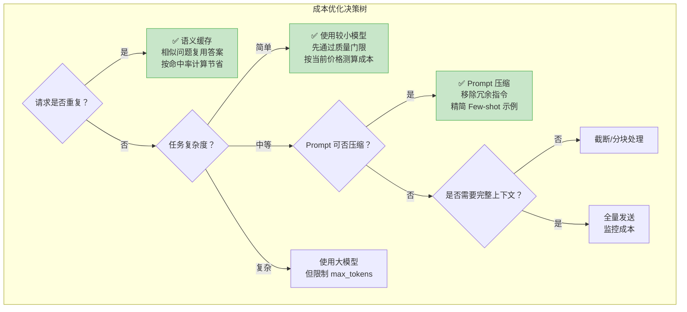

**六大成本优化策略**：

| 策略 | 应测指标 | 主要风险 | 适用场景 |
|------|---------|---------|---------|
| **应用层缓存** | 命中率、陈旧率、每次命中避免成本 | 错答复用、权限与数据隔离 | 高频重复/可安全复用 |
| **模型路由** | 分层流量、升级率、质量 Guardrail、加权成本 | 小模型误路由 | 难度可分类的任务 |
| **Prompt/上下文压缩** | 输入 Token 差额、质量变化 | 丢失约束或证据 | 冗余长上下文 |
| **输出上限** | 输出 Token、截断率、任务完成率 | 回答不完整 | 输出长度可控 |
| **Batch/异步服务等级** | 官方折扣、排队时延、失败重试成本 | 时效性下降 | 离线批量任务 |
| **Provider Prompt Caching** | cache write/read Token、命中率、TTL、净成本 | 前缀失配、写入费、过期 | 稳定且重复的长前缀 |

OpenAI 与 Anthropic 当前都提供 Prompt Caching，但缓存触发、显式断点、写入/读取费率、TTL 和模型支持
并不相同；例如 GPT-5.6 系列的缓存写入也可能计费。应按
[OpenAI Prompt Caching](https://developers.openai.com/api/docs/guides/prompt-caching) 与
[Anthropic Prompt Caching](https://platform.claude.com/docs/en/build-with-claude/prompt-caching)
读取 usage 并计算净节省，不能宣称固定百分比。

```python
# 精确 Prompt 缓存基线；语义缓存还需向量检索、阈值校准和误命中评估
import hashlib
import json

class ExactPromptCache:
    """精确哈希缓存；真正的语义缓存还需要向量检索与误命中评估。"""
    
    def __init__(self):
        self.cache: dict[str, dict] = {}
        self.lookups = 0
        self.hits = 0
    
    def _compute_hash(self, prompt: str, model: str, **params) -> str:
        """计算请求的哈希值"""
        key_data = json.dumps({
            "prompt": prompt,
            "model": model,
            "params": {k: v for k, v in sorted(params.items())},
        }, sort_keys=True)
        return hashlib.sha256(key_data.encode("utf-8")).hexdigest()
    
    def get(self, prompt: str, model: str, **params) -> str | None:
        """精确匹配缓存"""
        self.lookups += 1
        key = self._compute_hash(prompt, model, **params)
        if key in self.cache:
            self.hits += 1
            self.cache[key]["hits"] += 1
            return self.cache[key]["response"]
        return None
    
    def set(self, prompt: str, model: str, response: str, **params):
        """存入缓存"""
        key = self._compute_hash(prompt, model, **params)
        self.cache[key] = {
            "response": response,
            "timestamp": __import__('time').time(),
            "hits": 0,
        }
    
    def get_cache_stats(self) -> dict:
        """缓存统计"""
        return {
            "cache_entries": len(self.cache),
            "lookups": self.lookups,
            "total_hits": self.hits,
            "total_misses": self.lookups - self.hits,
            "hit_rate": self.hits / self.lookups if self.lookups else 0.0,
        }
    
    def estimated_savings(self, avoided_cost_per_hit_usd: float) -> float:
        """按账单归因得到的单次避免成本估算。"""
        return self.hits * avoided_cost_per_hit_usd


# 使用示例
cache = ExactPromptCache()

# 包装 LLM 调用
def cached_llm_call(prompt: str, model: str, **params) -> str:
    cached = cache.get(prompt, model, **params)
    if cached:
        print("⚡ Cache hit! 节省一次 API 调用")
        return cached
    
    # 实际 API 调用...
    response = f"Response for: {prompt[:50]}..."  # 模拟
    cache.set(prompt, model, response, **params)
    return response
```

---

## 20.6 模型监控与告警 ⭐⭐⭐⭐

### 20.6.1 核心监控指标

LLM 应用需要多维度监控，一个完整的监控体系包含以下指标类别：

| 指标类别 | 具体指标 | 阈值来源 | 采集方式 |
|---------|---------|---------|---------|
| **延迟** | TTFT、端到端 P50/P95/P99 | 用户体验 SLO，按流式/非流式和任务分桶 | 客户端与服务端 Span |
| **吞吐** | QPS/RPM、排队、限流余量 | 供应商配额与容量压测 | 请求计数器/限流响应头 |
| **错误率** | 4xx/5xx、超时、重试后失败 | 历史基线与错误预算 | HTTP 状态码/Span status |
| **Token 用量** | 输入/输出/缓存/推理 Token | 财务预算与任务分布 | Provider usage/账单 |
| **输出质量** | 任务评分、用户反馈、不支持断言 | 标注集基线与风险等级 | 用户反馈 + 自动/人工评估 |
| **模型可用性** | 成功率、区域/Provider 故障 | 产品可用性 SLO | Health Check + 合成请求 |
| **缓存** | 命中率、陈旧率、误命中率、净节省 | 自有流量基线 | 缓存层统计 + 账单 |

```python
import math

def nearest_rank(values: list[float], percentile: float) -> float:
    if not values:
        raise ValueError("percentile requires at least one observation")
    ordered = sorted(values)
    return ordered[max(0, math.ceil(percentile * len(ordered)) - 1)]

alert_policy = {
    # 从用户体验 SLO、历史基线、错误预算和最小请求量注入，不能照抄教程数值。
    "error_rate_threshold": configured_error_rate,
    "p95_latency_threshold_ms": configured_p95_ms,
    "minimum_requests": configured_minimum_requests,
    "window": configured_window,
}
```

分位数必须明确窗口、样本量和算法；“当前采集窗口无请求”只有在该窗口本应有流量时才是故障。
完整的线程安全离线示例见 `code/ch20_llmops/llm/13_llm_metrics_collector.py`。

### 20.6.2 数据漂移检测（Embedding Drift）⭐⭐

LLM 应用的数据漂移可表现为用户问题的话题、语言或难度分布变化，但“检测到 embedding
分布变化”不等于“质量一定下降”。应把漂移信号与任务成功率、人工复核和检索/生成指标联动。

```python
import numpy as np
from scipy.spatial.distance import cosine
from scipy.stats import ks_2samp

class EmbeddingDriftDetector:
    def __init__(
        self,
        *,
        centroid_distance_threshold: float,
        ks_familywise_alpha: float,
        min_samples_per_window: int,
        max_ks_dimensions: int,
    ):
        self.centroid_threshold = centroid_distance_threshold
        self.ks_familywise_alpha = ks_familywise_alpha
        self.min_samples = min_samples_per_window
        self.max_ks_dimensions = max_ks_dimensions

    def detect_drift(self, reference: np.ndarray, current: np.ndarray) -> dict:
        if len(reference) < self.min_samples or len(current) < self.min_samples:
            # “数据不足”不能记作“未漂移”。
            return {"drift_detected": None, "status": "insufficient_data"}

        ref_array = np.asarray(reference, dtype=float)
        cur_array = np.asarray(current, dtype=float)
        if ref_array.ndim != 2 or cur_array.shape[1] != ref_array.shape[1]:
            raise ValueError("reference/current must be finite 2-D arrays with the same dimension")

        ref_centroid = np.mean(ref_array, axis=0)
        cur_centroid = np.mean(cur_array, axis=0)
        centroid_distance = float(cosine(ref_centroid, cur_centroid))

        tested_dimensions = min(ref_array.shape[1], self.max_ks_dimensions)
        pvalues = [
            float(ks_2samp(ref_array[:, dim], cur_array[:, dim]).pvalue)
            for dim in range(tested_dimensions)
        ]
        # 平均 p-value 不是显著性检验；这里用 Bonferroni 控制多重比较。
        per_dimension_alpha = self.ks_familywise_alpha / tested_dimensions
        ks_drift = min(pvalues) < per_dimension_alpha
        drift_detected = (
            centroid_distance > self.centroid_threshold or ks_drift
        )
        return {
            "drift_detected": drift_detected,
            "centroid_cosine_distance": round(centroid_distance, 4),
            "minimum_ks_pvalue": min(pvalues),
            "ks_per_dimension_alpha": per_dimension_alpha,
        }
```

质心阈值、窗口、显著性水平和抽样维度没有跨业务通用值，应使用 reference-vs-reference
回放/Bootstrap 控制误报，再用已标注的真实漂移与下游质量变化验证召回。逐维 KS 也不是完整的
多变量检验；高风险场景还应比较 MMD/分类器两样本检验等方法。完整离线实现见
`code/ch20_llmops/llm/14_embedding_drift_detector.py`。

### 20.6.3 输出质量监控 ⭐⭐⭐

```python
# LLM 输出质量自动监控
from typing import Optional

class OutputQualityMonitor:
    """LLM 输出质量自动检测器"""
    
    @staticmethod
    def check_hallucination_indicators(response: str, context: str = None) -> dict:
        """
        幻觉检测（基于启发式规则 + 简单检测）
        
        注意：这只是一个轻量级检测器，生产环境建议使用专门的幻觉检测模型
        """
        indicators = {
            "excessive_confidence": False,
            "unverifiable_claims": False,
            "contradiction": False,
            "hallucination_risk": "low",
        }
        
        # 检测1：过度自信模式
        overconfident_phrases = [
            "毫无疑问", "绝对是", "100%确定", "一定是",
            "definitely", "absolutely", "without any doubt",
        ]
        for phrase in overconfident_phrases:
            if phrase in response:
                indicators["excessive_confidence"] = True
                break
        
        # 检测2：无法验证的陈述（在无上下文时）
        if context:
            # 简化：检查回答中的关键实体是否出现在上下文中
            pass
        
        # 检测3：自我矛盾
        if "但是" in response and "因此" in response:
            # 简化检测：有转折又有结论时需要关注
            indicators["hallucination_risk"] = "medium"
        
        # 综合评分
        risk_score = sum([
            indicators["excessive_confidence"],
            indicators["unverifiable_claims"],
            indicators["contradiction"],
        ])
        
        if risk_score >= 2:
            indicators["hallucination_risk"] = "high"
        
        return indicators
    
    @staticmethod
    def check_safety(response: str) -> dict:
        """安全检查（简化版）"""
        safety_flags = {
            "harmful_content": False,
            "pii_leak": False,
            "prompt_injection_reflected": False,
            "overall_safe": True,
        }
        
        # PII 检测（简化正则）
        import re
        pii_patterns = {
            "phone": r'\b1[3-9]\d{9}\b',
            "email": r'\b[\w.-]+@[\w.-]+\.\w+\b',
            "id_card": r'\b\d{17}[\dXx]\b',
        }
        
        for pii_type, pattern in pii_patterns.items():
            if re.search(pattern, response):
                safety_flags["pii_leak"] = True
                safety_flags["overall_safe"] = False
                break
        
        return safety_flags
    
    @staticmethod
    def check_format_compliance(
        response: str, expected_format: str = "json"
    ) -> dict:
        """格式合规检查"""
        import json as json_module
        
        result = {
            "format": expected_format,
            "compliant": False,
            "error": None,
        }
        
        if expected_format == "json":
            try:
                # 尝试提取 JSON（处理 ```json ... ``` 包裹）
                if "```json" in response:
                    start = response.index("```json") + 7
                    end = response.index("```", start)
                    json_str = response[start:end].strip()
                elif "{" in response:
                    start = response.index("{")
                    end = response.rindex("}") + 1
                    json_str = response[start:end]
                else:
                    json_str = response
                
                json_module.loads(json_str)
                result["compliant"] = True
            except (ValueError, json_module.JSONDecodeError) as e:
                result["error"] = str(e)
        
        return result


# 使用示例
monitor = OutputQualityMonitor()

# 检测幻觉风险
response = "毫无疑问，Python 是世界上最完美的编程语言，没有任何缺点。"
hallucination = monitor.check_hallucination_indicators(response)
print(f"幻觉风险: {hallucination['hallucination_risk']}")
# 输出: 幻觉风险: high
```

### 20.6.4 Prometheus + Grafana 集成 ⭐⭐⭐

```yaml
# prometheus.yml - LLM 应用监控配置示例
global:
  scrape_interval: 15s
  evaluation_interval: 15s

scrape_configs:
  - job_name: 'llm-application'
    static_configs:
      - targets: ['localhost:8000']  # FastAPI metrics 端点
    metrics_path: '/metrics'
    
  - job_name: 'llm-model-gateway'
    static_configs:
      - targets: ['model-gateway:9090']
    
  - job_name: 'node-exporter'
    static_configs:
      - targets: ['localhost:9100']

# 告警规则
rule_files:
  - 'alerts/llm_alerts.yml'
```

```yaml
# alerts/llm_alerts.yml - LLM 应用告警规则
groups:
  - name: llm_alerts
    rules:
      # 告警1：高错误率
      - alert: HighErrorRate
        expr: |
          rate(llm_requests_failed_total[5m]) / clamp_min(rate(llm_requests_total[5m]), 1)
          > on() llm_error_rate_slo_threshold
        for: 5m
        labels:
          severity: critical
          team: llm-ops
        annotations:
          summary: "LLM API 错误率超过业务 SLO"
          description: "过去 5 分钟错误率 {{ $value | humanizePercentage }}"
      
      # 告警2：P95 延迟过高
      - alert: HighLatency
        expr: |
          histogram_quantile(0.95, rate(llm_request_duration_seconds_bucket[5m]))
          > on() llm_latency_p95_slo_seconds
        for: 5m
        labels:
          severity: warning
        annotations:
          summary: "P95 延迟超过业务 SLO"
          description: "当前 P95 延迟: {{ $value }}s"
      
      # 告警3：Token 用量逼近预算
      - alert: TokenBudgetWarning
        expr: |
          llm_token_cost_daily_total / clamp_min(llm_token_budget_daily, 0.000001)
          > on() llm_budget_warning_ratio
        for: 1m
        labels:
          severity: warning
        annotations:
          summary: "Token 成本已超过业务配置的预算预警比率"
```

上述三个阈值 Gauge 由配置系统发布；值来自业务 SLO、错误预算、基线和财务政策。缓存命中率本身
不宜设跨业务通用下限，应联合陈旧率、误命中率和净节省诊断。

```python
# FastAPI 应用中暴露 Prometheus 指标
import os
from fastapi import FastAPI
from prometheus_client import (
    CONTENT_TYPE_LATEST,
    CollectorRegistry,
    Counter,
    Histogram,
    generate_latest,
)
from starlette.responses import Response

app = FastAPI()
default_model = os.environ.get("OPENAI_MODEL", "gpt-5.6")
registry = CollectorRegistry()

# Prometheus 指标定义
llm_requests_total = Counter(
    "llm_requests_total",
    "Total LLM requests",
    ["model", "status"],
    registry=registry,
)

llm_request_duration = Histogram(
    "llm_request_duration_seconds",
    "LLM request duration in seconds",
    ["model"],
    buckets=[0.1, 0.5, 1.0, 2.0, 3.0, 5.0, 10.0, 30.0],
    registry=registry,
)

llm_token_usage = Counter(
    "llm_token_usage_total",
    "Total tokens used",
    ["model", "type"],  # type: input / output
    registry=registry,
)

# Prometheus metrics 端点
@app.get("/metrics")
async def metrics():
    return Response(
        content=generate_latest(registry),
        headers={"Content-Type": CONTENT_TYPE_LATEST},
    )

# 在 LLM 调用处记录指标
@app.post("/chat")
async def chat(request: dict):
    model = request.get("model", default_model)
    
    with llm_request_duration.labels(model=model).time():
        try:
            # ... LLM 调用 ...
            response = {"answer": "mock response"}
            
            # 记录成功
            llm_requests_total.labels(model=model, status="success").inc()
            llm_token_usage.labels(model=model, type="input").inc(100)
            llm_token_usage.labels(model=model, type="output").inc(50)
            
            return response
        except Exception as e:
            llm_requests_total.labels(model=model, status="error").inc()
            raise
```

这里使用独立 `CollectorRegistry`，避免测试或应用工厂重复构建时注册同名指标。成本应由 Provider usage
与版本化 Rate Card/账单归因后记录，不能在请求路径凭固定单价伪造“日成本” Gauge。

---

## 20.7 持续集成与持续部署（ML CI/CD）⭐⭐⭐⭐

### 20.7.1 LLM 应用的 CI/CD Pipeline 设计

LLM 应用的 CI/CD 与传统软件 CI/CD 的核心区别在于**需要模型评估门禁**。

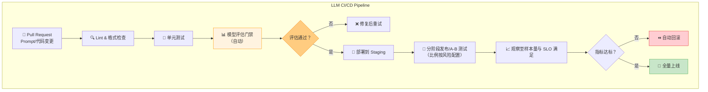

### 20.7.2 自动化评估门禁 ⭐⭐⭐⭐

评估门禁是 LLM CI/CD 的核心，确保每次 Prompt 或配置变更不会导致质量退化。

```python
# LLM CI/CD 评估门禁实现
import json
import math
from dataclasses import dataclass
from typing import Callable

@dataclass(frozen=True)
class QualityGate:
    """由业务标注集、SLO 与预算注入；没有跨任务通用默认阈值。"""
    min_accuracy: float
    max_hallucination_rate: float
    max_latency_p95_ms: float
    max_cost_per_query: float
    require_safety_check: bool = True

class LLMEvaluationGate:
    """LLM 应用的自动化评估门禁"""
    
    def __init__(
        self,
        gate_config: QualityGate,
        eval_fn: Callable[..., dict],
        test_dataset: list[dict],
    ):
        self.config = gate_config
        self.eval_fn = eval_fn
        self.test_dataset = test_dataset
    
    def run_evaluation(self, prompt_version: str) -> dict:
        """
        运行评估门禁
        
        返回评估报告，如果任一指标不通过则标记 failed=True
        """
        if not self.test_dataset:
            raise ValueError("test_dataset must not be empty")
        results = []
        total_cost = 0.0
        
        for test_case in self.test_dataset:
            result = self.eval_fn(
                prompt_version=prompt_version,
                query=test_case["query"],
                expected=test_case.get("expected"),
                context=test_case.get("context"),
            )
            results.append(result)
            total_cost += result.get("cost", 0)
        
        # 汇总指标
        n = len(results)
        avg_accuracy = sum(r.get("correct", 0) for r in results) / n
        hallucination_count = sum(r.get("hallucination", False) for r in results)
        avg_cost = total_cost / n
        latencies = sorted(r.get("latency_ms", 0) for r in results)
        p95_latency = latencies[max(0, math.ceil(0.95 * n) - 1)]
        
        # 门禁检查
        checks = {
            "accuracy": {
                "value": avg_accuracy,
                "threshold": self.config.min_accuracy,
                "passed": avg_accuracy >= self.config.min_accuracy,
            },
            "hallucination_rate": {
                "value": hallucination_count / n,
                "threshold": self.config.max_hallucination_rate,
                "passed": (hallucination_count / n) <= self.config.max_hallucination_rate,
            },
            "latency_p95_ms": {
                "value": p95_latency,
                "threshold": self.config.max_latency_p95_ms,
                "passed": p95_latency <= self.config.max_latency_p95_ms,
            },
            "cost_per_query": {
                "value": avg_cost,
                "threshold": self.config.max_cost_per_query,
                "passed": avg_cost <= self.config.max_cost_per_query,
            },
        }
        if self.config.require_safety_check:
            # 缺失安全评估按失败处理，避免 fail-open。
            safety_passed = all(bool(r.get("safety_passed", False)) for r in results)
            checks["safety"] = {
                "value": safety_passed,
                "threshold": True,
                "passed": safety_passed,
            }
        
        all_passed = all(c["passed"] for c in checks.values())
        
        report = {
            "prompt_version": prompt_version,
            "dataset_size": n,
            "evaluation_passed": all_passed,
            "checks": checks,
            "details": {
                "test_cases": len(self.test_dataset),
                "total_cost": round(total_cost, 4),
                "avg_accuracy": round(avg_accuracy, 3),
            },
            "recommendation": (
                "✅ 所有门禁通过，可以部署"
                if all_passed
                else "❌ 门禁未通过！请检查失败项并修复"
            ),
        }
        
        return report
    
    def save_report(self, report: dict, filepath: str):
        """保存评估报告"""
        with open(filepath, "w", encoding="utf-8") as f:
            json.dump(report, f, ensure_ascii=False, indent=2)


# 使用示例
def mock_eval_fn(prompt_version, query, expected=None, context=None):
    """模拟评估函数"""
    import random
    return {
        "correct": random.random() > 0.1,
        "hallucination": random.random() < 0.03,
        "cost": random.uniform(0.001, 0.02),
        "latency_ms": max(0, random.gauss(800, 200)),
        "safety_passed": True,
    }

gate = LLMEvaluationGate(
    gate_config=QualityGate(
        min_accuracy=0.85,
        max_hallucination_rate=0.05,
        max_latency_p95_ms=3000,
        max_cost_per_query=0.05,
    ),
    eval_fn=mock_eval_fn,
    test_dataset=[{"query": f"test query {i}"} for i in range(50)],
)

report = gate.run_evaluation("prompt_v4.0.0")
print(report["recommendation"])
print(json.dumps(report["checks"], ensure_ascii=False, indent=2))
```

上述门限与模拟分布仅用于演示配置结构，不能直接复制到生产；应由版本化标注集、历史基线、
统计不确定性、用户体验 SLO 和财务预算共同确定。

### 20.7.3 金丝雀发布与回滚策略 ⭐⭐⭐

| 策略 | 原理 | 适用场景 | 回滚速度 |
|------|------|---------|---------|
| **金丝雀发布** | 以策略配置的小流量起步，按样本量与 Guardrail 扩大 | 中等风险变更 | 取决于控制面与状态迁移 |
| **蓝绿部署** | 两套隔离环境，验证后切换流量 | 可双环境承载的重大变更 | 取决于流量切换与数据兼容 |
| **影子模式** | 新版本接收副本但不返回；高风险工具必须禁用 | 先验证行为与性能 | 主路径可不受影响，但仍有成本/数据风险 |
| **A/B 测试** | 按实验单位稳定分流，做功效与显著性分析 | 验证产品/Prompt 因果效果 | 取决于样本量，不预设分钟级 |

```python
# 金丝雀发布控制器
import time
from enum import Enum
from dataclasses import dataclass, field

class ReleaseStage(Enum):
    ROLLED_BACK = 0.0
    CANARY_5 = 0.05
    CANARY_25 = 0.25
    CANARY_50 = 0.50
    FULL = 1.0

@dataclass
class CanaryController:
    """金丝雀发布控制器；以下流量阶段只是教学策略。"""
    
    new_version: str
    old_version: str
    promotion_max_error_rate: float
    rollback_error_rate: float
    stage_min_minutes: dict[ReleaseStage, float]
    min_health_checks_per_stage: int
    
    current_stage: ReleaseStage = ReleaseStage.CANARY_5
    stage_start_time: float = field(default_factory=time.time)
    
    health_checks_passed: int = 0
    health_checks_total: int = 0
    
    auto_rollback_enabled: bool = True
    rollback_reason: str | None = None
    
    def get_traffic_split(self) -> float:
        """获取新版流量比例"""
        return self.current_stage.value

    def get_error_rate(self) -> float | None:
        # 无样本不是 100% 错误，也不是 0% 错误。
        if self.health_checks_total == 0:
            return None
        return 1 - self.health_checks_passed / self.health_checks_total
    
    def should_promote(self) -> bool:
        """检查是否可以推进到下一阶段"""
        if self.current_stage in {ReleaseStage.ROLLED_BACK, ReleaseStage.FULL}:
            return False
        if self.health_checks_total < self.min_health_checks_per_stage:
            return False
        elapsed_minutes = (time.time() - self.stage_start_time) / 60
        error_rate = self.get_error_rate()
        
        # 条件1：运行足够时间
        # 还应联看延迟、质量、安全、成本和最小样本量。
        
        return (
            elapsed_minutes >= self.stage_min_minutes[self.current_stage]
            and error_rate is not None
            and error_rate < self.promotion_max_error_rate
        )
    
    def promote(self):
        """推进到下一阶段"""
        stages = [
            ReleaseStage.CANARY_5,
            ReleaseStage.CANARY_25,
            ReleaseStage.CANARY_50,
            ReleaseStage.FULL,
        ]
        current_idx = stages.index(self.current_stage)
        if current_idx < len(stages) - 1:
            self.current_stage = stages[current_idx + 1]
            self.stage_start_time = time.time()
            # 每个阶段使用自己的观察窗口，避免累计样本掩盖新阶段问题。
            self.health_checks_passed = 0
            self.health_checks_total = 0
            print(f"🚀 推进到 {self.current_stage.name}: {self.current_stage.value*100:.0f}% 流量")
    
    def rollback(self, reason: str):
        """将新版流量降为 0；CANARY_5 不是回滚完成。"""
        self.current_stage = ReleaseStage.ROLLED_BACK
        self.stage_start_time = time.time()
        self.rollback_reason = reason
        print(f"⏪ 回滚到 {self.old_version}！原因：{reason}")
        # 实际实现中：切换负载均衡器指向旧版本
    
    def record_health_check(self, passed: bool):
        """记录健康检查结果"""
        self.health_checks_total += 1
        if passed:
            self.health_checks_passed += 1
    
    def get_status(self) -> dict:
        """获取当前发布状态"""
        return {
            "stage": self.current_stage.name,
            "traffic_split": self.current_stage.value,
            "new_version": self.new_version,
            "old_version": self.old_version,
            "elapsed_minutes": (time.time() - self.stage_start_time) / 60,
            "health_checks": self.health_checks_total,
            "error_rate": self.get_error_rate(),
            "rollback_reason": self.rollback_reason,
        }


# 使用示例
controller = CanaryController(
    new_version="prompt_v4.0.0",
    old_version="prompt_v3.2.0",
    # 教学策略参数；生产中从风险分级、容量与错误预算配置。
    promotion_max_error_rate=0.005,
    rollback_error_rate=0.01,
    stage_min_minutes={
        ReleaseStage.CANARY_5: 30,
        ReleaseStage.CANARY_25: 60,
        ReleaseStage.CANARY_50: 60,
    },
    min_health_checks_per_stage=20,
)

# 模拟金丝雀发布流程
for i in range(50):
    controller.record_health_check(i < 48)
    
    if controller.should_promote():
        controller.promote()
    
    # 如果错误率太高，自动回滚
    error_rate = controller.get_error_rate()
    if (
        controller.auto_rollback_enabled
        and controller.health_checks_total >= controller.min_health_checks_per_stage
        and error_rate is not None
        and error_rate > controller.rollback_error_rate
    ):
        controller.rollback("错误率超过配置的回滚阈值")
        break

print(json.dumps(controller.get_status(), ensure_ascii=False, indent=2))
```

回滚完成必须是新版流量 0，而不是回到 5% canary；每次晋级也应重置该阶段的观察窗口。
完整实现 `code/ch20_llmops/llm/18_canary_controller.py` 还校验阶段配置、最小样本量和阈值顺序。

### 20.7.4 GitHub Actions CI/CD 示例

```yaml
# .github/workflows/llm-ci-cd.yml
# LLM 应用 CI/CD Pipeline - GitHub Actions 配置

name: LLM CI/CD Pipeline

on:
  pull_request:
    branches: [main]
    paths:
      - 'prompts/**'
      - 'src/**'
      - 'config/**'
  push:
    branches: [main]

env:
  OPENAI_API_KEY: ${{ secrets.OPENAI_API_KEY }}
  LANGCHAIN_API_KEY: ${{ secrets.LANGCHAIN_API_KEY }}
  PYTHON_VERSION: '3.12'

jobs:
  # ====== 阶段1：代码检查 ======
  lint-and-test:
    runs-on: ubuntu-latest
    steps:
      - uses: actions/checkout@v4
      
      - name: Setup Python
        uses: actions/setup-python@v5
        with:
          python-version: ${{ env.PYTHON_VERSION }}
      
      - name: Install dependencies
        run: |
          pip install -r requirements.txt
          pip install ruff pytest
      
      - name: Lint
        run: ruff check src/ prompts/
      
      - name: Unit Tests
        run: pytest tests/unit/ -v --tb=short
      
      - name: Prompt Template Validation
        run: python scripts/validate_prompts.py

  # ====== 阶段2：评估门禁（仅 PR 时运行） ======
  evaluation-gate:
    needs: lint-and-test
    if: github.event_name == 'pull_request'
    runs-on: ubuntu-latest
    steps:
      - uses: actions/checkout@v4
      
      - name: Setup Python
        uses: actions/setup-python@v5
        with:
          python-version: ${{ env.PYTHON_VERSION }}
      
      - name: Install dependencies
        run: pip install -r requirements.txt
      
      - name: Run Evaluation Dataset
        run: |
          python scripts/run_evaluation.py \
            --prompt-version "${{ github.event.pull_request.head.sha }}" \
            --dataset "qa_regression_test_v2" \
            --output "eval_report.json"
      
      - name: Check Quality Gates
        run: python scripts/check_quality_gates.py eval_report.json
      
      - name: Upload Evaluation Report
        uses: actions/upload-artifact@v4
        with:
          name: evaluation-report
          path: eval_report.json
      
      - name: Comment PR with Results
        uses: actions/github-script@v7
        with:
          script: |
            const fs = require('fs');
            const report = JSON.parse(fs.readFileSync('eval_report.json', 'utf8'));
            const body = `## 📊 LLM 评估报告\n\n` +
              `| 指标 | 值 | 门禁 | 状态 |\n` +
              `|------|----|------|------|\n` +
              `| 准确率 | ${report.avg_accuracy} | ${report.checks.accuracy.threshold} | ${report.checks.accuracy.passed ? '✅' : '❌'} |\n` +
              `| 幻觉率 | ${report.hallucination_rate} | ${report.checks.hallucination_rate.threshold} | ${report.checks.hallucination_rate.passed ? '✅' : '❌'} |\n` +
              `| P95延迟 | ${report.p95_latency}ms | ${report.checks.latency_p95_ms.threshold}ms | ${report.checks.latency_p95_ms.passed ? '✅' : '❌'} |\n`;
            github.rest.issues.createComment({
              issue_number: context.issue.number,
              owner: context.repo.owner,
              repo: context.repo.repo,
              body
            });

  # ====== 阶段3：部署到 Staging（仅 main 分支 push） ======
  deploy-staging:
    needs: lint-and-test
    if: github.event_name == 'push' && github.ref == 'refs/heads/main'
    runs-on: ubuntu-latest
    environment: staging
    steps:
      - uses: actions/checkout@v4
      
      - name: Deploy to Staging
        run: |
          echo "Deploying to staging environment..."
          # 实际部署命令：kubectl / docker compose / serverless deploy
          # ...
      
      - name: Smoke Test
        run: |
          sleep 30  # 等待服务启动
          python scripts/smoke_test.py --env staging
      
      - name: Health Check
        run: |
          for i in {1..10}; do
            curl -f http://staging.example.com/health && break
            sleep 5
          done

  # ====== 阶段4：部署到 Production（金丝雀） ======
  deploy-production:
    needs: deploy-staging
    if: github.event_name == 'push' && github.ref == 'refs/heads/main'
    runs-on: ubuntu-latest
    environment: 
      name: production
      url: https://api.example.com
    steps:
      - uses: actions/checkout@v4
      
      - name: Canary Deploy
        env:
          CANARY_TRAFFIC_PERCENT: ${{ vars.CANARY_TRAFFIC_PERCENT }}
        run: |
          echo "Starting canary deployment (${CANARY_TRAFFIC_PERCENT}% traffic)..."
          # kubectl set image deployment/llm-app-canary ...
          # 或更新负载均衡器权重
      
      - name: Monitor Canary
        env:
          CANARY_DURATION_SECONDS: ${{ vars.CANARY_DURATION_SECONDS }}
          CANARY_ERROR_THRESHOLD: ${{ vars.CANARY_ERROR_THRESHOLD }}
          CANARY_LATENCY_THRESHOLD_MS: ${{ vars.CANARY_LATENCY_THRESHOLD_MS }}
        run: |
          python scripts/monitor_canary.py \
            --duration "$CANARY_DURATION_SECONDS" \
            --error-threshold "$CANARY_ERROR_THRESHOLD" \
            --latency-threshold "$CANARY_LATENCY_THRESHOLD_MS"
      
      - name: Full Rollout or Rollback
        run: |
          if python scripts/check_canary_health.py; then
            echo "✅ Canary healthy, promoting according to release policy"
            python scripts/full_rollout.py
          else
            echo "❌ Canary unhealthy, rolling back"
            python scripts/rollback.py
            exit 1
          fi
```

---

## 🎯 面试真题精讲

### 🎯 面试题1：MLOps 和 LLMOps 的核心区别是什么？面试官为什么问这个问题？

**参考答案**：

MLOps 和 LLMOps 的本质区别在于**被运维的对象发生了根本变化**：

1. **从"自己训练的模型"到"调用的基础模型"**：MLOps 管理的是自己训练/微调的模型权重；LLMOps 管理的更多是 Prompt、RAG 配置、API 版本和服务编排。

2. **从"确定性评估"到"模糊性评估"**：传统 MLOps 有明确的指标（Accuracy/F1），LLMOps 的"好"是主观的，需要 LLM-as-Judge + 人工评估。

3. **从"固定成本推理"到"可变 Token 成本"**：传统推理成本固定，LLM 推理成本随 Token 用量波动，成本管理成为运维核心。

4. **从"模型版本"到"Prompt + 模型 + 检索配置"的多维版本**：LLM 应用的"版本"是 Prompt 版本、模型版本、检索配置版本的笛卡尔积。

**面试金句**："MLOps 管的是模型，LLMOps 管的是 Prompt 驱动的智能应用 —— Prompt 变成了代码，模型变成了外部依赖。"

---

### 🎯 面试题2：在大模型应用中，为什么要做实验追踪？如果不做会有什么问题？

**参考答案**：

LLM 实验的变量空间极大（Prompt 措辞、模型选择、temperature、检索 top_k 等），而且**变量之间的交互复杂**。不做实验追踪会导致：

1. **无法复现**：无法确定某次结果对应的 Prompt、模型快照、参数与数据集版本
2. **无法对比**：不知道改 Prompt 后是提升还是回退
3. **无法归因**：效果好/坏不知道是哪个变量导致的
4. **无法协作**：团队成员各自试验，无法共享知识

**推荐工具**：MLflow（开源，适合自建）或 W&B（商业，适合团队协作）。

**回答要点**：Prompt 改动的影响方向和幅度都要通过同版本数据集与指标测量；没有实验记录就无法复现或归因。

---

### 🎯 面试题3：LangSmith 的 Trace、Run、Feedback 分别是什么？你在项目中怎么用的？

**参考答案**：

- **Trace**：一次完整 LLM 调用的**端到端链路**（用户输入 → 检索 → LLM → 后处理 → 输出），是 LangSmith 的一级抽象。
- **Run**：Trace 中的**单个步骤**（如一次 Embedding 计算、一次 LLM API 调用），有输入、输出、耗时、Token 用量。
- **Feedback**：对 Run 的**评价标签**（👍/👎、5星、正确/错误），可以是人工标注，也可以是自动评估。

**项目经验示例**：
"我在项目中用 LangSmith 做了三件事：
1. 用 `@traceable` 装饰器自动追踪 QA Pipeline 的每个步骤，快速定位到 Prompt 渲染阶段的 bug
2. 建立 Evaluation Dataset（200 个标注问答），每次改 Prompt 后自动跑一遍，对比准确率变化
3. 接入用户反馈（👍/👎），统计不同 Prompt 版本的用户满意度"

---

### 🎯 面试题4：如何设计 LLM 应用的 A/B 测试？需要注意什么？

**参考答案**：

LLM A/B 测试的核心挑战是**输出的主观性**和**多维度权衡**。设计时需要注意：

**1. 流量分配策略**：
- 使用**用户 ID 哈希**做确定性分配（同一用户始终看到同一版本）
- 避免随机分配导致同一用户在不同请求中看到不同行为

**2. 指标设计（三层）**：
- **北极星指标**：用户满意度（👍/👎 比例）、任务完成率
- **质量指标**：准确率、幻觉率（自动检测 + 人工抽检）
- **Guardrail 指标**：延迟（P95/P99）、Token 消耗、错误率

**3. 统计显著性**：
- 使用双比例 Z 检验（二分类指标）
- 使用 Welch's T 检验（连续指标）
- 样本量由基线率、最小可检测效应、显著性水平、检验功效和方差决定，不存在通用“100+”下限

**4. 陷阱注意**：
- 不要只看准确率忽略延迟/成本（可能有 Guardrail 劣化）
- 样本量不足时不要过早下结论
- 避免"Peeking"（频繁检查 P 值）

---

### 🎯 面试题5：如何计算 LLM 应用的成本？有哪些优化策略？

**参考答案**：

**成本计算**：
$$\text{单次成本} = \frac{\text{输入Token} \times \text{输入单价} + \text{输出Token} \times \text{输出单价}}{1,000,000}$$

**优化策略**：先建立按模型、任务和 trajectory 的账单基线，再依次验证应用/Provider 缓存、模型路由、
上下文压缩、输出上限与 Batch/异步服务等级。每项都同时报告质量 Guardrail、延迟、命中/升级率和
净成本差额；没有自己的流量与账单数据，就不承诺固定节省比例。

---

### 🎯 面试题6：LLM 应用需要监控哪些指标？怎么设计告警？

**参考答案**：

**四大类监控指标**：

1. **金指标（Golden Signals）**：
   - 延迟（P50/P95/P99）
   - 错误率
   - 吞吐量（QPS/RPM）

2. **LLM 特有指标**：
   - Token 用量（输入/输出 Token 趋势）
   - Token 成本（每日/每用户）
   - 缓存命中率

3. **质量指标**：
   - 用户满意度（👍/👎 比例）
   - 幻觉检测命中率
   - LLM-as-Judge 自动评分

4. **基础设施指标**：
   - GPU 利用率（自部署）
   - API Rate Limit 余量
   - 模型可用性（Health Check）

**告警设计原则**：
- 错误率与延迟：相对业务 SLO 和错误预算告警，并要求持续窗口，避免瞬时抖动
- 成本：相对已配置预算、预测和历史基线告警
- 缓存：命中率只作诊断，还要联看陈旧率、误命中率和净节省
- 严重级别、阈值、窗口和路由对象均由业务风险与 runbook 决定

**工具选择**：Prometheus（指标收集） + Grafana（可视化） + PagerDuty/钉钉（告警通知）

---

### 🎯 面试题7：什么是数据漂移？如何检测 LLM 应用中的数据漂移？

**参考答案**：

**数据漂移**（Data Drift）指模型服务的数据分布（用户输入）随时间发生变化。在 LLM 应用中表现为：用户提问的话题、语言风格、复杂度分布发生变化。

**检测方法**：

1. **Embedding 漂移检测**：对比参考期和当前期的 Embedding 质心余弦距离
2. **KS 检验**：逐维度检验 Embedding 分布是否一致
3. **话题分布变化**：定期聚类用户问题，对比话题分布
4. **Token/长度分布变化**：监控输入 Prompt 的长度分布变化

**面试要点强调**："数据漂移在 LLM 应用中同样存在，但不是传统的特征漂移（Feature Drift），而是**语义漂移（Semantic Drift）**——用户问的问题变了。检测手段也从特征分布对比变成了 Embedding 空间分析。"

---

### 🎯 面试题8：如何设计 LLM 应用的 CI/CD Pipeline？评估门禁怎么做？

**参考答案**：

**LLM CI/CD Pipeline 核心阶段**：

1. **代码检查**：Lint + 单元测试 + Prompt 模板验证
2. **评估门禁**（核心差异点）：在 Regression Test Dataset 上运行评估
3. **Staging 部署**：部署到预发布环境
4. **分阶段发布**：按变更风险配置初始流量、观察窗口、样本量和升级条件
5. **全量上线**：质量、可靠性、安全和成本 Guardrail 达标后再扩大流量

**评估门禁检查项**：
- 准确率不低于基线（防止回归）
- 幻觉率不超过阈值
- P95 延迟不超过上限
- 单次查询成本不超过预算
- 安全检查通过

**回答边界**：自动门禁适合确定性检查和稳定量表，但不能消除 Judge 偏差或替代高风险场景的人工复核；
应保留标注集版本、置信区间、bad case 和人工仲裁记录。

---

### 🎯 面试题9：Langfuse 和 LangSmith 怎么选？

**参考答案**：

| 维度 | 核验问题 |
|------|---------|
| **部署与数据边界** | 是否必须自托管、数据驻留与备份如何做；Langfuse 核心 OSS 可自托管，但基础设施并非零成本 |
| **框架/SDK 集成** | 对当前 LangChain、OpenAI、Anthropic、OTel 版本做最小 PoC，不按品牌推断 |
| **评估与 Prompt** | 数据集、在线/离线评估、Prompt 发布标签和回滚是否覆盖团队流程 |
| **权限与合规** | SSO、RBAC、审计、保留策略在哪个套餐/版本提供 |
| **成本与运维** | SaaS 费用与自托管 ClickHouse/PostgreSQL、升级、备份、值班成本一起算 |
| **可迁移性** | 能否以 OTLP/开放 schema 导出，避免观测数据锁定 |

**面试边界**：如果没有亲自使用，不要声称“真实使用经验”；可以说明依据官方文档完成了哪些 PoC，
验证了哪些版本、数据流和故障场景。

---

### 🎯 面试题10：截至 2026-07-31，LLMOps 应重点关注哪些变化？

**参考答案**：

1. **缓存计费更复杂**：按模型区分 cache write/read、TTL 和显式断点，直接读取 usage 与账单。
2. **GenAI 语义约定持续演进**：OTel GenAI 已迁至独立仓库且仍有 Development 定义，必须锁版本。
3. **Tracing 与评估融合**：MLflow、LangSmith、Langfuse、Weave 等都覆盖更多 Trace/Eval 流程，选型需实时核验。
4. **推理用量进入成本模型**：reasoning Token 是 output 的子集，观测时避免重复累计。
5. **Agent 需要轨迹级治理**：按 trajectory 归因 LLM、Tool、重试和回滚，内容字段默认关闭。
6. **路由与 Gateway 需可验证**：模型 fallback 不能只看成本，还要测质量、升级率、幂等与故障恢复。

回答时给出官方文档日期、版本与自身验证数据，比列“热点名词”更可信。

---

## 20.8 速查表

### LLMOps 工具矩阵

| 类别 | 工具示例 | 当前核验重点 |
|------|---------|-------------|
| **实验/Trace/Eval** | MLflow | GenAI Trace、Scorer、Dataset、Prompt Registry 与 OTel 兼容版本 |
| **实验/Trace/Eval** | W&B / Weave | Traces、Evaluations、Datasets、版本与套餐 |
| **可观测/评估** | LangSmith | Trace、Dataset、Experiment、Feedback 与数据/权限边界 |
| **可观测/Prompt** | Langfuse | OSS/Cloud 功能差异、Server/SDK 兼容、存储与运维 |
| **评估框架** | Ragas / DeepEval | 指标定义、Judge 模型、校准集与版本 |
| **Gateway/推理** | LiteLLM / vLLM | Provider/模型兼容、路由、限流、用量与回滚 |
| **通用遥测** | OpenTelemetry / Prometheus / Grafana | SemConv 版本、基数、采样、保留与告警 |
| **CI/CD** | GitHub Actions 等 | 密钥隔离、离线门禁、真实 API opt-in 与制品追溯 |

工具功能、许可和套餐变化快；本表用于列选型维度，不替代各项目当前官方文档和 PoC。

### 关键公式速查

| 公式 | 用途 |
|------|------|
| $\text{单次成本} = \frac{I \times P_i + O \times P_o}{10^6}$ | API 调用成本 |
| $\text{KV Cache} = 2 \times B \times L \times H \times T \times D \times \text{sizeof}$ | KV Cache 显存 |
| $\text{Z-score} = \frac{p_t - p_c}{\sqrt{p_{\text{pool}}(1-p_{\text{pool}})(1/n_c+1/n_t)}}$ | A/B 测试显著性 |
| $n = 2(\frac{Z_{\alpha/2} + Z_{\beta}}{h})^2$ | 最小样本量 |

首行只是最简 Token 计费式；实际 Rate Card 还应包含 cache write/read、reasoning、Batch、区域、
服务等级与工具费用，且 reasoning Token 若已计入 output 不可重复相加。

---

## 20.10 OpenTelemetry GenAI 语义约定（截至 2026-07-31）⭐⭐⭐⭐⭐

> 🆕 **截至 2026-07-31**：OpenTelemetry 已形成 GenAI 语义约定，但相关定义已迁移到独立的 GenAI semantic-conventions 仓库，部分信号/属性仍处于 Development 或迁移阶段。工程中必须锁定 semconv 与 instrumentation 版本，不能笼统宣称“全部 Stable 1.x”。

### 20.10.1 背景：从私有 Trace 到 OTLP `gen_ai.*` 标准

过去 LLM 可观测性高度依赖各厂商私有协议（LangSmith Trace、Langfuse Span），导致：

- 跨厂商、跨框架的 Trace 难以对齐
- 评估指标（cost / quality / safety）没有统一字段
- 与现有 APM（Datadog / Grafana Tempo / Honeycomb）集成成本高

当前可用 **OpenTelemetry GenAI Semantic Conventions**（OTel `gen_ai.*` 命名空间）表达跨后端信号，
也可使用 **OpenInference** 的 LLM/RAG 专用 Span 语义；二者并非互斥，版本与映射需显式管理：

| 规范 | 主导方 | 核心特点 | 2026 状态 |
|------|--------|---------|-----------|
| **OTel GenAI SemConv** | CNCF OpenTelemetry | OTLP 原生、定义通用 `gen_ai.*` 字段 | **部分仍为 Development；需锁版本** |
| **OpenInference** | Arize AI | LLM 专用 SpanKind、覆盖 RAG/Agent | 与 OTel 融合 |
| **LangSmith/Langfuse 产品 schema** | 各厂商 | 产品工作流与 UI | OTel 兼容范围按当前版本核验 |

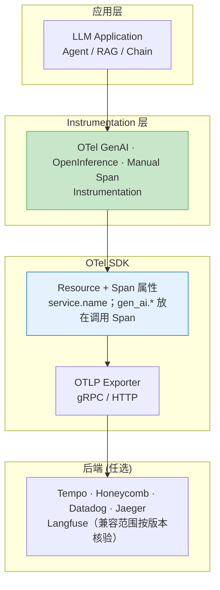

### 20.10.2 OTLP `gen_ai.*` 核心字段

OTel GenAI 语义约定对通用调用字段进行了建模。下表只列截至 2026-07-31 可在官方 registry 中核验的字段；成本、RAG 命中和业务评分应放入自有命名空间，并在团队内维护 schema。

| 字段 | 类型 | 含义 | 示例 |
|------|------|------|------|
| `gen_ai.operation.name` | string | 操作类型 | `chat` / `text_completion` |
| `gen_ai.provider.name` | string | 模型提供商 | `openai` / `anthropic` / `gcp.gemini` |
| `gen_ai.request.model` | string | 请求的模型 | `gpt-5.6`、`claude-sonnet-5` |
| `gen_ai.request.temperature` | double | 采样温度 | `0.7` |
| `gen_ai.request.max_tokens` | int | 输出上限 | `2048` |
| `gen_ai.usage.input_tokens` | int | prompt tokens | `1234` |
| `gen_ai.usage.output_tokens` | int | completion tokens | `512` |
| `gen_ai.usage.cache_creation.input_tokens` | int | 缓存写入的输入 token；已包含在 input 总数中 | `200` |
| `gen_ai.usage.cache_read.input_tokens` | int | 缓存读取的输入 token；已包含在 input 总数中 | `800` |
| `gen_ai.usage.reasoning.output_tokens` | int | 推理 token；已包含在 output 总数中 | `120` |
| `gen_ai.response.finish_reasons` | string[] | 结束原因 | `["stop"]` |
| `gen_ai.response.model` | string | 实际响应模型（与请求可能不同） | `claude-sonnet-5` |
| `gen_ai.response.id` | string | Provider 响应 ID | `chatcmpl-abc123` |
| `gen_ai.operation.name` | string | 工具执行子 Span 的操作类型 | `execute_tool` |
| `gen_ai.tool.name` | string | 工具执行子 Span 的工具名 | `search_knowledge_base` |
| `gen_ai.tool.call.id` | string | 工具执行子 Span 的调用 ID | `call_xyz` |
| `gen_ai.tool.call.arguments` | object/JSON | 工具参数；Opt-In，可能包含敏感信息 | `{"query":"..."}` |

建议自定义字段使用 `app.*` 前缀，例如 `app.llm.cost.usd`、`app.rag.retrieved_documents`、
`app.evaluation.score`，避免与未来标准字段冲突。Prompt、响应和工具参数都可能含 PII/密钥，
默认不采集正文，只在经过脱敏、采样和权限控制后启用。`cache_creation.input_tokens` 与
`cache_read.input_tokens` 都属于
`input_tokens` 的子集，`reasoning.output_tokens` 是 `output_tokens` 的子集，汇总或计费时不可重复相加。
当前定义以已迁移的
[OpenTelemetry GenAI Semantic Conventions 独立仓库](https://github.com/open-telemetry/semantic-conventions-genai)
为准；旧 registry 仅保留迁移提示，相关定义仍可能处于 Development。

> 💡 **面试回答边界**：OTel 解决跨后端的信号命名和导出，LangSmith/Langfuse 等平台提供
> 调试、评估与协作能力；二者可以组合，不能据少量岗位或面经断言前者正在替代后者。

### 20.10.3 代码示例 1：OpenTelemetry SDK + GenAI 语义约定

```python
"""
20.10.3 - OpenTelemetry GenAI 语义约定的最小生产连接骨架
- 使用当前 registry 中的 gen_ai.* 属性
- 业务成本、RAG 与评估字段使用 app.* 自定义命名空间
- 通过 OTLP gRPC 导出到 Tempo / Honeycomb
"""
import os
from opentelemetry import trace, metrics
from opentelemetry.sdk.resources import Resource, SERVICE_NAME, SERVICE_VERSION
from opentelemetry.sdk.trace import TracerProvider
from opentelemetry.sdk.trace.export import BatchSpanProcessor
from opentelemetry.exporter.otlp.proto.grpc.trace_exporter import OTLPSpanExporter
from opentelemetry.exporter.otlp.proto.grpc.metric_exporter import OTLPMetricExporter
from opentelemetry.sdk.metrics import MeterProvider
from opentelemetry.sdk.metrics.export import PeriodicExportingMetricReader

if os.environ.get("OTEL_EXPORT_ENABLED") != "1":
    raise RuntimeError("set OTEL_EXPORT_ENABLED=1 only for an authorized OTLP endpoint")

# ---------- 1. Resource：服务身份 ----------
resource = Resource.create(
    {
        SERVICE_NAME: "qa-agent-prod",
        SERVICE_VERSION: "v2.3.0",
        "deployment.environment.name": "production",
    }
)

# ---------- 2. Tracer Provider + OTLP Exporter ----------
provider = TracerProvider(resource=resource)
otlp_exporter = OTLPSpanExporter(
    endpoint=os.getenv("OTEL_EXPORTER_OTLP_ENDPOINT", "http://otel-collector:4317"),
    headers={"x-api-key": os.getenv("OTEL_API_KEY", "")},
    # 可选：gzip 可能减少传输字节但增加 CPU；需按链路实测
    # compression=Compression.Gzip,
)
provider.add_span_processor(BatchSpanProcessor(otlp_exporter))
trace.set_tracer_provider(provider)
tracer = trace.get_tracer("qa-agent.instrumentation", "1.0.0")

# ---------- 3. Meter Provider：成本 / Token / 延迟指标 ----------
metric_exporter = OTLPMetricExporter(
    endpoint=os.getenv("OTEL_EXPORTER_OTLP_ENDPOINT", "http://otel-collector:4317")
)
metric_reader = PeriodicExportingMetricReader(metric_exporter)
meter_provider = MeterProvider(
    resource=resource,
    metric_readers=[metric_reader],
)
metrics.set_meter_provider(meter_provider)
meter = metrics.get_meter("qa-agent.metrics")

# 标准 Token 指标 + 业务成本指标
llm_cost_histogram = meter.create_histogram(
    name="app.llm.cost",
    unit="usd",
    description="LLM 调用成本（USD）",
)
llm_token_usage = meter.create_histogram(
    name="gen_ai.client.token.usage",
    unit="{token}",
    description="每次调用使用的输入或输出 Token 数",
)


# ---------- 4. 业务封装：自动附加 gen_ai.* 属性 ----------
class GenAITelemetry:
    def __init__(self, tracer, meter):
        self.tracer = tracer
        self.meter = meter

    def record_llm_call(
        self,
        provider_name: str,
        model: str,
        input_tokens: int,
        output_tokens: int,
        cost_usd: float | None,
        response_id: str | None,
        finish_reason: str,
        cached_input_tokens: int = 0,
        cache_creation_input_tokens: int = 0,
        thinking_budget_tokens: int | None = None,
        thinking_tokens_used: int | None = None,
        tool_calls: list[dict] | None = None,
        retrieval: dict | None = None,
        judge_scores: dict[str, float] | None = None,
        user_id: str | None = None,
        trajectory_id: str | None = None,
    ) -> None:
        """记录一次 LLM 调用；不默认写入 prompt/response 正文。"""
        with self.tracer.start_as_current_span(
            f"chat {model}",
            kind=trace.SpanKind.CLIENT,
        ) as span:
            # ---- 请求侧属性 ----
            span.set_attribute("gen_ai.operation.name", "chat")
            span.set_attribute("gen_ai.provider.name", provider_name)
            span.set_attribute("gen_ai.request.model", model)
            span.set_attribute("gen_ai.request.temperature", 0.7)
            span.set_attribute("gen_ai.request.max_tokens", 2048)

            # ---- 响应侧属性 ----
            span.set_attribute("gen_ai.response.model", model)
            if response_id:
                span.set_attribute("gen_ai.response.id", response_id)
            span.set_attribute("gen_ai.response.finish_reasons", [finish_reason])

            # ---- Token 与成本 ----
            span.set_attribute("gen_ai.usage.input_tokens", input_tokens)
            span.set_attribute("gen_ai.usage.output_tokens", output_tokens)
            if cached_input_tokens:
                span.set_attribute("gen_ai.usage.cache_read.input_tokens", cached_input_tokens)
            if cache_creation_input_tokens:
                span.set_attribute(
                    "gen_ai.usage.cache_creation.input_tokens",
                    cache_creation_input_tokens,
                )
            if cost_usd is not None:
                span.set_attribute("app.llm.cost.usd", cost_usd)

            # reasoning.output_tokens 已包含在 output_tokens 中，不能重复计费
            if thinking_budget_tokens is not None:
                span.set_attribute("app.llm.reasoning_budget_tokens", thinking_budget_tokens)
            if thinking_tokens_used is not None:
                span.set_attribute(
                    "gen_ai.usage.reasoning.output_tokens", thinking_tokens_used
                )

            # ---- Tool Calls：每次工具执行使用标准 INTERNAL 子 Span ----
            for tc in tool_calls or []:
                tool_name = tc.get("name", "unknown")
                with self.tracer.start_as_current_span(
                    f"execute_tool {tool_name}",
                    kind=trace.SpanKind.INTERNAL,
                ) as tool_span:
                    tool_span.set_attribute("gen_ai.operation.name", "execute_tool")
                    tool_span.set_attribute("gen_ai.tool.name", tool_name)
                    tool_span.set_attribute("gen_ai.tool.call.id", tc.get("id", ""))
                    # 参数与结果可能含敏感信息，默认不记录正文。

            # ---- RAG 检索：团队自定义 schema ----
            if retrieval:
                span.set_attribute("app.rag.hit", retrieval.get("hit", False))
                span.set_attribute("app.rag.retrieved_documents", retrieval.get("documents", 0))
                if "score_max" in retrieval:
                    span.set_attribute("app.rag.score_max", retrieval["score_max"])

            # ---- Judge 评估分数：团队自定义 schema ----
            if judge_scores:
                for name, score in judge_scores.items():
                    span.add_event(
                        "app.evaluation",
                        attributes={
                            "app.evaluation.name": name,
                            "app.evaluation.score": score,
                        },
                    )

            # ---- 业务标识 ----
            if user_id:
                span.set_attribute("user.id", user_id)
            if trajectory_id:
                span.set_attribute("app.agent.trajectory_id", trajectory_id)

            # ---- 指标记录 ----
            common_attrs = {
                "gen_ai.operation.name": "chat",
                "gen_ai.provider.name": provider_name,
                "gen_ai.request.model": model,
                "gen_ai.response.model": model,
            }
            if cost_usd is not None:
                llm_cost_histogram.record(cost_usd, attributes=common_attrs)
            llm_token_usage.record(
                input_tokens,
                attributes={**common_attrs, "gen_ai.token.type": "input"},
            )
            llm_token_usage.record(
                output_tokens,
                attributes={**common_attrs, "gen_ai.token.type": "output"},
            )


# ---------- 5. 使用示例 ----------
telemetry = GenAITelemetry(tracer, meter)
observed_cost = os.environ.get("LLM_OBSERVED_COST_USD")

telemetry.record_llm_call(
    provider_name="anthropic",
    model=os.environ.get("ANTHROPIC_MODEL", "claude-sonnet-5"),
    input_tokens=128,
    output_tokens=87,
    cost_usd=float(observed_cost) if observed_cost is not None else None,
    response_id="offline-response-001",
    finish_reason="end_turn",
    cached_input_tokens=64,
    cache_creation_input_tokens=0,
    thinking_budget_tokens=2048,
    thinking_tokens_used=512,
    tool_calls=[
        {"name": "search_web", "id": "toolu_01A", "arguments": {"query": "entanglement"}}
    ],
    retrieval={"hit": True, "documents": 5, "score_max": 0.87},
    judge_scores={"relevance": 0.92, "factuality": 0.88, "conciseness": 0.75},
    user_id=None,
    trajectory_id="traj-abc-001",
)
```

`OTLPMetricExporter` 只是 exporter；要让 SDK 周期性收集并导出指标，还必须把
`PeriodicExportingMetricReader` 传入 `MeterProvider.metric_readers`。Token 指标按规范使用
`gen_ai.client.token.usage` Histogram，并以必需属性 `gen_ai.token.type=input|output` 区分方向；
仅在提供方返回用量或 instrumentation 能可靠计数时上报。参考
[OpenTelemetry GenAI 独立规范仓库](https://github.com/open-telemetry/semantic-conventions-genai) 与
[OpenTelemetry Python SDK：PeriodicExportingMetricReader](https://opentelemetry-python.readthedocs.io/en/latest/sdk/metrics.export.html#opentelemetry.sdk.metrics.export.PeriodicExportingMetricReader)
（截至 2026-07-31）。

### 20.10.4 代码示例 2：OpenInference + OTLP 双规范导出

OpenInference 在 RAG / Agent 场景下提供更细粒度的 SpanKind，二者可以并存导出：

```python
"""
20.10.4 - OpenInference + OpenTelemetry 双规范
- SpanKind: CHAIN / LLM / RETRIEVER / TOOL / AGENT / EMBEDDING
- 通过 OTelSpanExporter 统一导出到 OTLP 后端
"""
import os
from openinference.instrumentation.langchain import LangChainInstrumentor
from openinference.instrumentation.openai import OpenAIInstrumentor
from openinference.semconv.trace import (
    SpanAttributes,
    OpenInferenceSpanKindValues,
)
from opentelemetry import trace
from opentelemetry.exporter.otlp.proto.grpc.trace_exporter import OTLPSpanExporter
from opentelemetry.sdk.trace import TracerProvider
from opentelemetry.sdk.trace.export import BatchSpanProcessor
from opentelemetry.sdk.resources import Resource
from opentelemetry.semconv.resource import ResourceAttributes

# 1. 初始化 OTel Provider
resource = Resource.create(
    {
        ResourceAttributes.SERVICE_NAME: "rag-qa-service",
        ResourceAttributes.SERVICE_VERSION: "1.4.0",
    }
)
provider = TracerProvider(resource=resource)
provider.add_span_processor(
    BatchSpanProcessor(
        OTLPSpanExporter(endpoint="http://otel-collector:4317")
    )
)
trace.set_tracer_provider(provider)

# 2. 自动 instrument 只在显式 live 模式启用
if os.environ.get("LLM_MOCK") != "0" or os.environ.get("LLM_REAL_API") != "1":
    raise RuntimeError("live mode requires LLM_MOCK=0 and LLM_REAL_API=1")
LangChainInstrumentor().instrument(tracer_provider=provider)
OpenAIInstrumentor().instrument(tracer_provider=provider)


# 3. 手动记录 RAG 检索 Span（OpenInference RETRIEVER Kind）
def instrument_retrieval(query: str, top_k: int = 5, capture_content: bool = False):
    tracer = trace.get_tracer("rag.retriever")
    with tracer.start_as_current_span("vector_search") as span:
        # OpenInference 语义约定
        span.set_attribute(SpanAttributes.OPENINFERENCE_SPAN_KIND, "RETRIEVER")
        if capture_content:
            span.set_attribute(SpanAttributes.RETRIEVAL_QUERY_TEXT, query)
        span.set_attribute(SpanAttributes.RETRIEVAL_TOP_K, top_k)

        # 业务执行
        docs = vector_store.similarity_search(query, k=top_k)

        # 检索结果属性
        span.set_attribute(SpanAttributes.RETRIEVAL_DOCUMENT_COUNT, len(docs))
        for i, d in enumerate(docs[:3]):  # 写入前3条
            span.set_attribute(
                f"{SpanAttributes.RETRIEVAL_DOCUMENTS}.{i}.document.id", d.metadata["id"]
            )
            span.set_attribute(
                f"{SpanAttributes.RETRIEVAL_DOCUMENTS}.{i}.document.score", d.metadata["score"]
            )
            if capture_content:
                span.set_attribute(
                    f"{SpanAttributes.RETRIEVAL_DOCUMENTS}.{i}.document.content",
                    d.page_content[:256],
                )

        # RAG 指标属于应用自定义 schema，不冒充 OTel GenAI 标准字段
        span.set_attribute("app.rag.hit", len(docs) > 0)
        if docs:
            span.set_attribute(
                "app.rag.score_max", max(d.metadata["score"] for d in docs)
            )
        return docs


# 4. 手动记录 Agent 决策 Span
def instrument_agent_step(
    step_name: str,
    decision: str,
    observation: str,
    capture_content: bool = False,
):
    tracer = trace.get_tracer("agent.react")
    with tracer.start_as_current_span(f"agent.{step_name}") as span:
        span.set_attribute(SpanAttributes.OPENINFERENCE_SPAN_KIND, "AGENT")
        span.set_attribute("agent.step.name", step_name)
        if capture_content:
            span.set_attribute("agent.decision", decision)
            span.set_attribute("agent.observation", observation[:512])
        return decision
```

### 20.10.5 in-prod Eval Pipeline 模式

离线 Eval 使用固定测试集，**in-prod eval（生产中评估）** 则对经过权限控制与采样的线上 Trace
运行评分。它能发现真实分布中的问题，但会引入成本、隐私、选择偏差和 Judge 漂移，不能替代离线回归与人工复核。

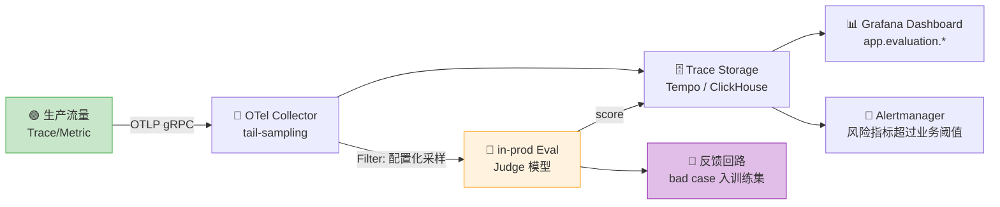

**典型流水线**（伪代码）：

```python
"""
20.10.5 - in-prod Eval Pipeline 模式
- 采样率、Judge 和阈值由配置注入
- 评估分数回写 Trace 属性
- 触发 bad case 自动入库
"""
import random
import os
from opentelemetry import trace

JUDGE_PROBABILITY = float(os.environ.get("LLM_JUDGE_SAMPLE_RATIO", "0.01"))
JUDGE_MODEL = os.environ.get("LLM_JUDGE_MODEL", "gpt-5.6")
BAD_CASE_THRESHOLD = float(os.environ.get("LLM_BAD_CASE_THRESHOLD", "0.7"))
tracer = trace.get_tracer("in-prod-eval")

def with_judge(llm_call_span, response_text: str, query: str, ground_truth: str | None = None):
    """在线上 Span 上挂载 Judge 评估"""
    if random.random() > JUDGE_PROBABILITY:
        return None  # 采样外，跳过

    # 调用已配置的 Judge 模型评估
    scores = {
        "relevance": judge_relevance(query, response_text),
        "hallucination": judge_hallucination(response_text, ground_truth),
        "helpfulness": judge_helpfulness(query, response_text),
    }

    # 自定义评估字段使用 app.*；异步评估应创建关联 Span，
    # 不能尝试修改已经结束并导出的原始 LLM Span。
    for name, score in scores.items():
        llm_call_span.set_attribute(f"app.evaluation.{name}", score)
        llm_call_span.add_event(
            f"judge.{name}",
            attributes={
                "app.evaluation.name": name,
                "app.evaluation.score": score,
                "app.evaluation.judge_model": JUDGE_MODEL,
            },
        )

    # 触发 bad case 入库
    if scores["hallucination"] > BAD_CASE_THRESHOLD:
        bad_case_queue.put({
            "trace_id": llm_call_span.get_span_context().trace_id,
            "query": query,
            "response": response_text,
            "scores": scores,
        })
    return scores
```

`0.01` 与 `0.7` 只是可覆盖的教学默认值，不是行业基准；生产值应由隐私政策、Judge 预算、
标注集校准结果和 bad-case 人工复核能力共同决定。

### 20.10.6 成本遥测作为 SLO 维度（Cost Telemetry as SLO）

成本可以作为服务治理维度，但目标应来自业务预算与错误成本。`reasoning.output_tokens` 是 `output_tokens` 的子集，不能再按一份独立 token 重复计费；缓存、batch、图片和音频价格也必须按提供商账单口径拆分。

**核心公式**：

$$\text{单次成本} = \frac{I_{\text{uncached}}P_i + I_{\text{cache-read}}P_c + O_{\text{total}}P_o}{10^6} + C_{\text{tool/media}}$$

**SLI/SLO 模板**：

| SLI | 计算 | SLO 目标 | 维度 |
|-----|------|---------|------|
| **P95 单次成本** | `histogram_quantile(0.95, sum by (le) (rate(app_llm_cost_bucket[5m])))` | 按业务预算定义 | `gen_ai.request.model` |
| **每小时总成本** | `sum(increase(app_llm_cost_sum[1h]))` | 按租户/产品预算定义 | `service.name` |
| **Cost/Request P99** | `histogram_quantile(0.99, ...)` | 按流量分层定义 | `app.agent.trajectory_id` |
| **推理预算耗尽率** | `exhausted / reasoning_requests` | 由质量-成本实验确定 | `gen_ai.request.model` |

```yaml
# 20.10.6 - 成本 SLO PrometheusRule 示例
apiVersion: monitoring.coreos.com/v1
kind: PrometheusRule
metadata:
  name: llm-cost-slos
spec:
  groups:
    - name: llm.cost
      interval: 30s
      rules:
        # SLO 1：单次成本 P95
        - alert: LLMCostP95TooHigh
          expr: |
            histogram_quantile(0.95,
              sum by (le, gen_ai_request_model) (
                rate(app_llm_cost_bucket[5m])
              )
            ) > on(gen_ai_request_model) app_llm_cost_p95_budget_usd
          for: 10m
          labels:
            severity: warning
            slo: cost-p95
          annotations:
            summary: "LLM 单次成本 P95 超过模型预算"
            runbook: "https://wiki.example.com/runbook/llm-cost-p95"

        # SLO 2：按受控预算域聚合；不要把原始 user_id 放进 Prometheus label
        - alert: LLMBudgetScopeCostAnomaly
          expr: |
            sum by (budget_scope) (
              increase(app_llm_cost_sum[1h])
            ) > on(budget_scope) app_llm_hourly_budget_usd
          for: 5m
          labels:
            severity: critical
          annotations:
            summary: "预算域 {{ $labels.budget_scope }} 的 1h 成本超过配置"

        # SLO 3：Thinking Budget 命中率
        - record: llm:thinking_budget_hit_ratio
          expr: |
            1 - (
              sum(rate(app_llm_reasoning_budget_exhausted_total[10m]))
              /
              clamp_min(sum(rate(app_llm_reasoning_requests_total[10m])), 1)
            )
```

`app_llm_cost_p95_budget_usd` 与 `app_llm_hourly_budget_usd` 由财务/配置系统发布，
示例不内置美元阈值。用户级审计放在低基数以外的日志/Trace 或专用分析存储中。

### 20.10.7 Per-Trajectory Cost Attribution（按轨迹成本归因）

Agent 应用的"一次请求"可能是 5-20 次 LLM 调用，需要把成本按 **trajectory（轨迹）** 归因：

```python
"""
20.10.7 - Per-Trajectory 成本归因
- 每次 Agent 任务生成唯一 trajectory_id
- 所有子 Span 携带 trajectory_id 属性
- 在 Tempo / Grafana 按 trajectory_id 聚合成本
"""
from contextlib import contextmanager
import hashlib
import os
from opentelemetry import trace
from opentelemetry.trace import Status, StatusCode
import uuid


def classify_query(user_query: str) -> str:
    """只返回低基数业务类别；生产规则应版本化并避免敏感类别。"""
    normalized = user_query.lower()
    if "python" in normalized or "代码" in user_query:
        return "coding"
    return "general"


class TrajectoryCostTracker:
    def __init__(self):
        self.tracer = trace.get_tracer("agent.trajectory")

    @contextmanager
    def trajectory(self, user_query: str, agent_name: str = "react-agent"):
        """开启一条 Trajectory，所有子 Span 自动归因"""
        trajectory_id = f"traj-{uuid.uuid4().hex[:12]}"
        with self.tracer.start_as_current_span(
            f"trajectory.{agent_name}",
            attributes={
                "gen_ai.agent.name": agent_name,
                "app.agent.trajectory_id": trajectory_id,
                # 只记录低敏派生信息；哈希仍是伪名化数据，需要访问控制。
                "app.agent.query_length": len(user_query),
                "app.agent.query_category": classify_query(user_query),
                "app.agent.query_hash": hashlib.sha256(
                    user_query.encode("utf-8")
                ).hexdigest()[:16],
            },
        ) as root:
            cost_attrs = {"app.agent.trajectory_id": trajectory_id}
            try:
                yield trajectory_id, cost_attrs
                root.set_status(Status(StatusCode.OK))
            except Exception as e:
                root.set_status(Status(StatusCode.ERROR, str(e)))
                root.record_exception(e)
                raise

    def attribute_subspan(self, span, trajectory_id: str):
        """给子 Span 注入 trajectory_id"""
        span.set_attribute("app.agent.trajectory_id", trajectory_id)

    def cost_summary(self, trajectory_id: str, spans: list) -> dict:
        """汇总单条 Trajectory 的成本"""
        total_cost = 0.0
        total_input = 0
        total_output = 0
        total_thinking = 0
        total_input_cost = 0.0
        total_output_cost = 0.0
        llm_calls = 0
        tool_calls = 0

        for s in spans:
            if s.attributes.get("app.agent.trajectory_id") != trajectory_id:
                continue
            if s.attributes.get("openinference.span.kind") == "LLM":
                llm_calls += 1
                total_cost += s.attributes.get("app.llm.cost.usd", 0)
                total_input += s.attributes.get("gen_ai.usage.input_tokens", 0)
                total_output += s.attributes.get("gen_ai.usage.output_tokens", 0)
                total_thinking += s.attributes.get(
                    "gen_ai.usage.reasoning.output_tokens", 0
                )
                total_input_cost += s.attributes.get("app.llm.cost.input.usd", 0)
                total_output_cost += s.attributes.get("app.llm.cost.output.usd", 0)
            elif s.attributes.get("openinference.span.kind") == "TOOL":
                tool_calls += 1

        return {
            "trajectory_id": trajectory_id,
            "llm_calls": llm_calls,
            "tool_calls": tool_calls,
            "total_cost_usd": round(total_cost, 6),
            "total_input_tokens": total_input,
            "total_output_tokens": total_output,
            "total_thinking_tokens": total_thinking,
            "observed_cost_breakdown_usd": {
                "input": round(total_input_cost, 6),
                # reasoning 是 output 子集，不再单独计费
                "output_including_reasoning": round(total_output_cost, 6),
                "unattributed": round(
                    max(total_cost - total_input_cost - total_output_cost, 0), 6
                ),
            },
        }


# 使用示例
tracker = TrajectoryCostTracker()

with tracker.trajectory("帮我写一个 Python 装饰器") as (traj_id, cost_attrs):
    # 第 1 步 LLM 调用
    telemetry.record_llm_call(
        model=os.environ.get("ANTHROPIC_MODEL", "claude-sonnet-5"),
        ...,
        trajectory_id=traj_id,
    )
    # 第 2 步 Tool 调用
    span = tracer.start_span("tool.search_docs")
    tracker.attribute_subspan(span, traj_id)
    # ...
    # 第 3 步 LLM 调用
    telemetry.record_llm_call(
        model=os.environ.get("ANTHROPIC_FAST_MODEL", "claude-haiku-4-5"),
        ...,
        trajectory_id=traj_id,
    )
```

### 20.10.8 Reasoning Usage Guardrail（推理用量护栏）

不同提供商的控制面并不等价：有的暴露显式 token budget，有的只提供 `reasoning_effort` 档位。统一观测时记录实际 `gen_ai.usage.reasoning.output_tokens`，预算/档位和业务判定放在 `app.*` 字段。

```python
"""
20.10.8 - Thinking Budget SLO 监控
- 跟踪 thinking_tokens_used / thinking_budget_tokens
- 当 thinking_used ≥ budget 时判定为"思考超限"
- 当 thinking_used 远小于 budget 时判定为"预算浪费"
"""
from opentelemetry import metrics, trace

meter = metrics.get_meter("thinking-budget-slo")

# 三个核心指标
thinking_usage_hist = meter.create_histogram(
    "app.llm.reasoning.tokens",
    unit="{token}",
    description="实际使用的思考 token",
)
thinking_budget_hist = meter.create_histogram(
    "app.llm.reasoning.budget",
    unit="{token}",
    description="设定的思考预算",
)
thinking_overshoot_counter = meter.create_counter(
    "app.llm.reasoning.budget_exhausted",
    unit="{request}",
    description="思考超限次数（used >= budget）",
)
thinking_waste_counter = meter.create_counter(
    "app.llm.reasoning.underuse",
    unit="{request}",
    description="低于业务配置利用率阈值的次数",
)


def record_thinking_usage(
    provider_name: str,
    model: str,
    budget_tokens: int,
    used_tokens: int,
    span: trace.Span,
    overshoot_ratio: float,
    underuse_ratio: float,
):
    if budget_tokens <= 0 or used_tokens < 0:
        raise ValueError("budget_tokens must be positive and used_tokens non-negative")
    if not 0 <= underuse_ratio < 1 <= overshoot_ratio:
        raise ValueError("expected 0 <= underuse_ratio < 1 <= overshoot_ratio")
    """记录一次思考预算使用情况"""
    attrs = {
        "gen_ai.operation.name": "chat",
        "gen_ai.provider.name": provider_name,
        "gen_ai.request.model": model,
    }

    thinking_usage_hist.record(used_tokens, attributes=attrs)
    thinking_budget_hist.record(budget_tokens, attributes=attrs)

    utilization = used_tokens / budget_tokens
    span.set_attribute("gen_ai.usage.reasoning.output_tokens", used_tokens)
    span.set_attribute("app.llm.reasoning.budget_tokens", budget_tokens)
    span.set_attribute("app.llm.reasoning.utilization_ratio", round(utilization, 3))

    # SLO 判定
    if utilization > overshoot_ratio:
        thinking_overshoot_counter.add(1, attributes=attrs)
        span.set_attribute("app.llm.reasoning.guardrail_status", "budget_exhausted")
    elif utilization < underuse_ratio:
        thinking_waste_counter.add(1, attributes=attrs)
        span.set_attribute("app.llm.reasoning.guardrail_status", "underuse")
    else:
        span.set_attribute("app.llm.reasoning.guardrail_status", "within_budget")
```

**SLO 指标**：

| 指标 | 计算 | 目标设定 |
|------|------|---------|
| **Budget Exhaustion Rate** | exhausted / reasoning_requests | 按任务质量与成本实验设定 |
| **Underuse Rate** | underuse / reasoning_requests | 仅作诊断，不设跨业务通用阈值 |
| **Median Utilization** | histogram_quantile(0.5, utilization_ratio) | 按模型、档位和任务分桶 |

### 20.10.9 Cascade / Router 模型成本模式

Cascade Router（级联路由器）先用便宜模型，复杂 case 升级到贵模型。需要**分段成本监控**：

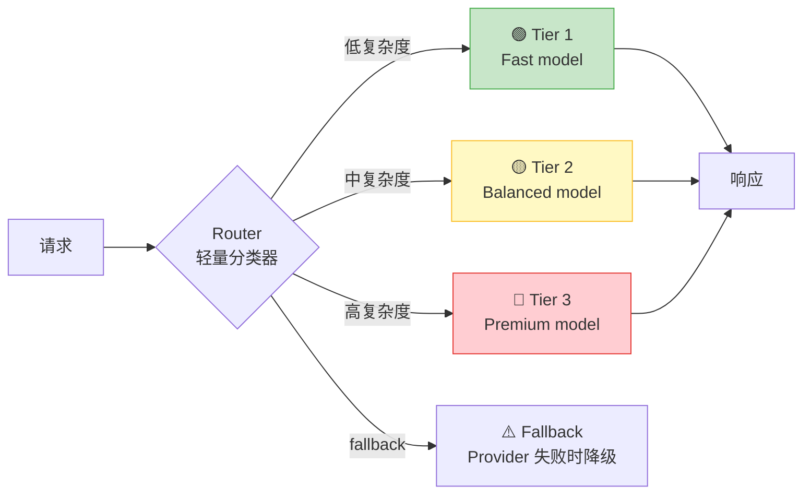

**关键 OTLP 属性**：

```python
"""
20.10.9 - Cascade Router 成本模式
- app.llm.router.tier 标识业务路由层
- app.llm.router.upgrade_reason 记录升级原因
"""
def cascade_route(
    complexity: float,
    routes: dict[str, str],
    fast_max_complexity: float,
    balanced_max_complexity: float,
) -> tuple[str, str]:
    """模型 ID 与阈值均从版本化配置注入。"""
    span = trace.get_current_span()
    span.set_attribute("app.llm.router.query_complexity", complexity)

    if complexity < fast_max_complexity:
        tier = "tier_1_fast"
    elif complexity < balanced_max_complexity:
        tier = "tier_2_balanced"
    else:
        tier = "tier_3_premium"
    span.set_attribute("app.llm.router.tier", tier)
    span.set_attribute("gen_ai.request.model", routes[tier])
    return tier, routes[tier]


def record_upgrade(
    original_tier: str,
    upgraded_tier: str,
    reason: str,
    estimated_cost_delta_usd: float,
):
    """记录级联升级事件"""
    span = trace.get_current_span()
    span.add_event(
        "cascade.upgrade",
        attributes={
            "app.llm.router.from_tier": original_tier,
            "app.llm.router.to_tier": upgraded_tier,
            "app.llm.router.upgrade_reason": reason,
            # 差额由当前 Rate Card × 本次 usage 计算后注入
            "app.llm.router.estimated_cost_delta_usd": estimated_cost_delta_usd,
        },
    )
```

**SLO 关注点**：

| 关注点 | 公式 | 目标 |
|--------|------|------|
| **Tier 分布** | count(tier) / total | 观察分布漂移，不设跨业务通用目标 |
| **升级率** | count(upgrade) / total | 由路由标注集与质量 Guardrail 校准 |
| **加权成本** | Σ(observed_cost) / requests | 不超过业务预算且质量不退化 |

### 20.10.10 Agent 回滚策略（Agent Rollback）

Agent 应用的回滚可能涉及 Prompt、Tool allowlist、模型路由和编排策略的多版本组合。
可以用 OTel Span/Event 保留决策证据，但回滚层级和时限必须结合系统架构与风险建模，不能宣称唯一“最佳实践”。

```python
"""
20.10.10 - Agent 多层回滚策略
- Level 1：流量回切
- Level 2：Prompt 版本回滚
- Level 3：Tool 白名单回滚
- Level 4：模型版本回滚
"""
from enum import Enum
from opentelemetry import trace

class RollbackLevel(Enum):
    TRAFFIC_SHIFT = 1        # 切回旧版本实例
    PROMPT_VERSION = 2       # 回滚 Prompt 到上一个稳定版
    TOOL_ALLOWLIST = 3       # 禁用高风险工具
    MODEL_VERSION = 4        # 回滚到上一版本模型


class AgentRollbackController:
    def __init__(self, otlp_exporter):
        self.tracer = trace.get_tracer("agent.rollback")
        self.exporter = otlp_exporter

    def detect_rollback_signal(self, span: trace.Span, signal: str, severity: float):
        """检测回滚信号，写入 Span Event"""
        span.add_event(
            "rollback.signal",
            attributes={
                "app.rollback.signal.name": signal,
                "app.rollback.signal.severity": severity,
            },
        )

    def execute_rollback(
        self,
        level: RollbackLevel,
        reason: str,
        target_version: str | None = None,
    ) -> dict:
        """执行多层回滚"""
        target_required = {
            RollbackLevel.TRAFFIC_SHIFT,
            RollbackLevel.PROMPT_VERSION,
            RollbackLevel.MODEL_VERSION,
        }
        if level in target_required and not target_version:
            raise ValueError(f"target_version is required for {level.name}")
        with self.tracer.start_as_current_span(f"rollback.{level.name}") as span:
            span.set_attribute("app.rollback.level", level.value)
            span.set_attribute("app.rollback.reason", reason)
            span.set_attribute("app.rollback.target_version", target_version or "")

            if level == RollbackLevel.TRAFFIC_SHIFT:
                # 切流量到旧版本（Kubernetes/Service Mesh）
                action = self._shift_traffic_to_old(target_version)
            elif level == RollbackLevel.PROMPT_VERSION:
                action = self._rollback_prompt_version(target_version)
            elif level == RollbackLevel.TOOL_ALLOWLIST:
                action = self._disable_risky_tools([
                    "send_email", "execute_code", "delete_file"
                ])
            elif level == RollbackLevel.MODEL_VERSION:
                action = self._rollback_model_version(target_version)
            else:
                action = "noop"

            span.set_attribute("app.rollback.action", action)
            return {"level": level.value, "action": action, "reason": reason}

    def _shift_traffic_to_old(self, version: str) -> str:
        return f"k8s_traffic_shifted_to_{version}"

    def _rollback_prompt_version(self, version: str) -> str:
        return f"prompt_registry_rollback_to_{version}"

    def _disable_risky_tools(self, tools: list) -> str:
        return f"tool_allowlist_disabled: {','.join(tools)}"

    def _rollback_model_version(self, version: str) -> str:
        return f"model_pinned_to_{version}"


# SLO 联动：阈值、持续窗口和冷却时间均由策略配置
def cost_overrun_auto_rollback(
    controller,
    current_cost_per_hour: float,
    budget_per_hour: float,
    overrun_multiplier: float,
):
    if current_cost_per_hour > budget_per_hour * overrun_multiplier:
        controller.execute_rollback(
            level=RollbackLevel.TRAFFIC_SHIFT,
            reason="cost_overrun",
            target_version="v2.2.0",  # 上一稳定版
        )
```

**回滚决策表**：

| 触发信号 | 候选等级 | 阈值/时限来源 | 目标 |
|---------|---------|--------------|------|
| 错误预算快速消耗、依赖故障 | L1 Traffic | 服务 SLO 与故障演练 | 上一 stable/健康 Provider |
| 质量回归且能归因到 Prompt | L2 Prompt | 标注集、线上 Guardrail 与人工复核 | 上一版 Prompt |
| 工具失败或风险策略触发 | L3 Tool Allowlist | 工具风险等级与审计策略 | 最小安全白名单 |
| 模型延迟/错误/行为回归 | L4 Model | 模型分桶 SLO 与回归集 | 已验证模型快照 |

### 20.10.11 面试实战建议

**Q1：你们团队如何统一 LLM 可观测性的字段？**
- 答：使用 OTel GenAI 语义约定，LLM 调用记录 `gen_ai.usage.input_tokens`、`gen_ai.usage.output_tokens` 和 `gen_ai.response.finish_reasons`；成本与轨迹不是标准 GenAI 字段，分别放入团队维护的 `app.llm.cost.usd`、`app.agent.trajectory_id`。配合 OpenInference 的 `SpanKind`（LLM/RETRIEVER/TOOL/AGENT）做 RAG/Agent 场景细分。

**Q2：成本 SLO 怎么设？**
- 答：把"单次调用成本 P95"和"每小时总成本"作为硬 SLO（写进 PrometheusRule 告警），把"Cost/Request P99"和"Thinking Budget 命中率"作为软 SLO（写进 Grafana Dashboard），用 burn-rate alert 防止成本爆炸。

**Q3：Cascade Router 怎么监控？**
- 答：路由不是 OTel GenAI 标准字段，使用团队自定义的 `app.llm.router.tier`
  （tier_1/tier_2/tier_3）和 `app.llm.router.upgrade_reason`
  （low_confidence/tool_error/length_limit），再计算“加权平均成本”和“升级率”，并给自定义
  schema 做版本管理。

**Q4：Agent 应用如何回滚？**
- 答：先把流量、Prompt、工具策略和模型快照分别版本化，再按故障归因选择最小影响的回滚层级。
  OTel Span/Event 提供证据和关联 ID，控制面执行仍需幂等、权限、审计、冷却时间和人工接管。

---

## 20.9 本章小结

本章系统讲解了 LLMOps 与模型可观测性的核心知识体系：

- **20.1 LLMOps 全景概述**：MLOps 与 LLMOps 的核心区别在于管理对象从"模型"变为"Prompt 驱动的智能应用"；LLMOps 能力成熟度模型从 L0（手工）到 L4（智能化）。
- **20.2 实验追踪**：MLflow 与 W&B/Weave 都在演进 GenAI 能力；按部署、治理、集成和团队需求选型。
- **20.3 LLM可观测性**：LangSmith、Langfuse 等平台各有产品抽象；跨平台信号可优先采用
  OTel/OTLP，并锁定 GenAI semconv 与 instrumentation 版本。
- **20.4 Prompt 版本管理与A/B测试**：Prompt 版本控制是 LLMOps 特有的挑战；A/B 测试需要兼顾统计显著性和 Guardrail 指标。
- **20.5 成本监控与Token计量**：Rate Card 必须版本化，成本优化需用实际 usage、账单和质量 Guardrail 验证。
- **20.6 模型监控与告警**：四维监控体系（金指标/LLM特有/质量/基础设施）；数据漂移检测从特征空间转向 Embedding 空间。
- **20.7 CI/CD**：自动化评估门禁是 LLM CI/CD 的核心；金丝雀发布配合自动回滚保障生产安全。

## 20.x 配套代码与运行边界

本章示例默认离线：不会读取模型 API Key，也不会发起模型或可观测平台网络请求。真实 OpenAI/W&B、
LangSmith、Langfuse 或外部 MLflow/OTLP 连接必须同时显式设置 `LLM_MOCK=0` 与
`LLM_REAL_API=1`（OTLP 另需
`OTEL_EXPORT_ENABLED=1`），并由运行环境提供凭据。示例没有声称已接入 ClickHouse 或完成真实生产推理。

```powershell
# 在 code/ 目录执行离线验收
$env:LLM_MOCK = "1"  # PowerShell；Bash 使用 export LLM_MOCK=1
python ch20_llmops/llm/19_otel_genai_telemetry.py
python ch20_llmops/llm/09_ab_test_framework.py
python ch20_llmops/llm/08_token_tracker.py
```

## 📚 相关章节

- [[13_Prompt_Engineering]] — Prompt 设计的最佳实践
- [[14_RAG检索增强生成]] — RAG 系统的可观测性
- [[15_Agent智能体开发]] — Agent 的调试与监控
- [[16_模型微调与推理优化]] — 模型部署方案的监控指标
- [[25_推理引擎与高性能服务]] — vLLM/SGLang 推理引擎的 Prometheus 指标
- [[29_Context_Engineering]] — Token 成本与 Context Rot 监控
- [[28_端侧与边缘LLM]] — 端侧 LLM 的监控与可观测性挑战
