# 第20章 LLMOps与模型可观测性 ⭐⭐⭐⭐

> **面试频率**：高（~60%大模型应用岗位涉及）| **技术热度**：★★★★☆
>
> LLMOps（Large Language Model Operations）是大模型从实验走向生产落地的工程化基石。从实验追踪、Prompt 版本管理到可观测性、成本监控、CI/CD 自动化部署，本章系统讲解如何将大模型应用"管起来、看得见、跑得稳"。无论你是 MLOps 工程师转型，还是面试大模型应用开发岗位，本章都是必读内容。
>
> 🆕 **2026年更新**：新增 LangFuse 开源可观测性方案、Prompt 版本管理与 A/B 测试框架、Embedding 数据漂移检测、金丝雀发布策略、Python 3.14 预览适配等最新趋势。

---

## 20.1 LLMOps 全景概述 ⭐⭐⭐⭐

### 20.1.1 MLOps vs LLMOps：核心区别

许多面试官会从"MLOps 经验"切入，考察你对 LLMOps 特殊性的理解。虽然 LLMOps 继承了 MLOps 的核心理念，但大模型的引入带来了范式级变化。

| 维度 | MLOps（传统） | LLMOps（大模型） |
|------|-------------|----------------|
| **模型来源** | 从零训练/微调小模型 | 基于预训练大模型（Foundation Model） |
| **计算资源** | 训练为主，推理开销小 | 推理开销巨大（GPU 集群） |
| **数据管理** | 训练数据 → 特征工程 → 特征存储 | Prompt 模板 + 上下文 + 检索语料 |
| **版本对象** | 模型权重 + 超参数 | 模型版本 + Prompt 版本 + 检索配置 |
| **评估方式** | 精确指标（Accuracy/F1/RMSE） | 模糊指标（相关性/安全性/幻觉率/人类偏好） |
| **部署模式** | REST API / Batch 推理 | 流式输出 / Tool Calling / Agent 编排 |
| **监控重点** | 特征漂移 / 预测延迟 | Prompt 漂移 / Token 用量 / 输出质量 |
| **迭代速度** | 周/月级 | 小时/天级（Prompt 即时调整） |

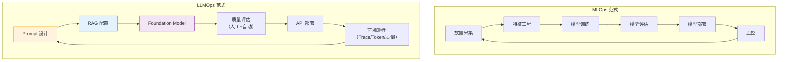

### 20.1.2 LLM 应用生命周期的特殊性

LLM 应用的开发与传统 ML 系统有本质不同，主要体现在以下几个方面：

**1. Prompt 即代码**

在 LLM 应用中，Prompt 等同于传统 ML 中的"模型超参数 + 特征工程"。一个 Prompt 的改动（如添加 `Chain-of-Thought` 引导）可能带来 10-30% 的准确率提升。因此 **Prompt 必须像代码一样被版本管理、审查和测试**。

**2. 模型作为外部依赖**

LLM 应用通常不自己训练模型，而是调用第三方 API（OpenAI、Anthropic）或部署开源模型。这意味着：
- 模型提供商的更新（如 GPT-4 → GPT-5）是**外部不可控变量**
- API 版本、Retirement Policy 直接影响线上服务
- 需要**多模型 Fallback 策略**

**3. 评估的模糊性**

传统 ML 的评估指标（Accuracy、F1）是确定性的。LLM 输出的"好"与"坏"往往是主观的：
- 同一问题的多个回答可能都"对"但质量不同
- 需要**LLM-as-a-Judge** + 人工抽检的双重评估体系
- 安全性和幻觉检测是额外的评估维度

**4. 成本可变的推理**

传统 ML 推理成本基本固定（相同模型、相同输入）。LLM 的 Token 消耗与输入/输出长度直接相关，且不同模型价格差异巨大（可差 10-50 倍），因此**成本管理和 Token 预算**成为运维的核心指标。

```python
# 传统 ML 推理 vs LLM 推理的成本对比（示例）
class CostComparison:
    """传统 ML vs LLM 的成本特征差异"""
    
    @staticmethod
    def traditional_ml_cost(predictions_per_day: int, gpu_cost_per_hour: float = 3.0):
        """传统 ML：固定 GPU 实例成本"""
        daily_cost = 24 * gpu_cost_per_hour  # GPU 24小时运行
        cost_per_1k = daily_cost / (predictions_per_day / 1000)
        return {
            "daily_cost": daily_cost,
            "cost_per_1k_predictions": cost_per_1k,
            "cost_variance": "固定（无波动）"
        }
    
    @staticmethod
    def llm_cost(
        prompt_tokens_per_day: int,
        completion_tokens_per_day: int,
        model: str = "gpt-4o"
    ):
        """LLM：按 Token 计费，成本波动大"""
        # 2026年参考价格（每百万 token）
        pricing = {
            "gpt-4o": {"input": 2.50, "output": 10.00},
            "gpt-4o-mini": {"input": 0.15, "output": 0.60},
            "claude-sonnet-4": {"input": 3.00, "output": 15.00},
            "claude-haiku-4": {"input": 0.25, "output": 1.25},
        }
        p = pricing.get(model, pricing["gpt-4o-mini"])
        daily_cost = (
            prompt_tokens_per_day / 1_000_000 * p["input"] +
            completion_tokens_per_day / 1_000_000 * p["output"]
        )
        return {
            "daily_cost": daily_cost,
            "cost_per_1k_predictions": daily_cost / (prompt_tokens_per_day / 1000),
            "cost_variance": f"按 Token 波动（Prompt 长度变化影响大）"
        }
```

### 20.1.3 LLMOps 能力成熟度模型 ⭐⭐⭐

企业在 LLMOps 建设上通常经历以下成熟度阶段：

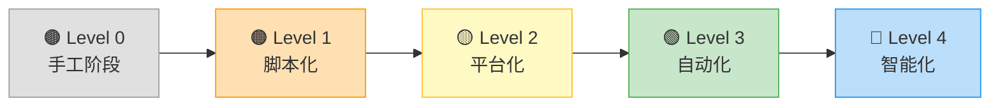

| 成熟度 | 特征 | 工具需求 | 典型场景 |
|--------|------|---------|---------|
| **L0: 手工阶段** | 手动复制 Prompt，人工看结果 | ChatGPT Web UI | 个人探索 |
| **L1: 脚本化** | Python 脚本调 API，CSV 记录结果 | requests + Excel | 小团队原型 |
| **L2: 平台化** | 实验追踪 + Prompt 版本管理 + 基础监控 | MLflow / W&B / LangSmith | 10+ 人团队 |
| **L3: 自动化** | CI/CD + 自动评估 + 告警 + A/B 测试 | GitHub Actions + Grafana | 生产级应用 |
| **L4: 智能化** | 自动 Prompt 优化 + 自适应路由 + 异常自愈 | DSPy + 端云协同 | 大规模部署 |

> 📚 **交叉引用**：LLMOps 中涉及到的模型部署方案（vLLM、TensorRT-LLM），请参考 [第16章 模型微调与推理优化](16_模型微调与推理优化.md#167-模型部署与服务化) 的部署章节。

---

## 20.2 实验追踪 ⭐⭐⭐⭐

### 20.2.1 为什么 LLM 实验需要追踪

LLM 实验的变量远多于传统 ML：

- **Prompt 模板**：单角色/多角色、Few-shot 示例数量和内容、System Prompt 措辞
- **模型选择**：GPT-4o / Claude Sonnet / Gemini / 开源模型
- **推理参数**：temperature、top_p、max_tokens
- **RAG 配置**：检索 top_k、Embedding 模型、chunk_size
- **输出后处理**：正则提取、格式校验、重试策略

一个微小的 Prompt 改动可能导致 20% 的性能差距。**不记录实验等于在黑暗中摸索。**

### 20.2.2 MLflow 核心概念 ⭐⭐⭐

MLflow 是最广泛使用的开源 ML 实验追踪平台，其核心抽象如下：

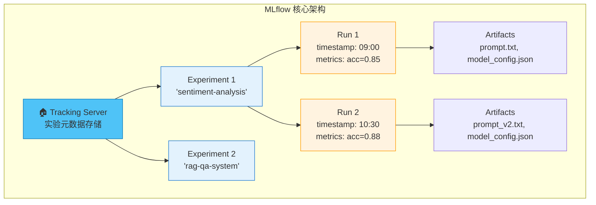

**核心概念速查**：

| 概念 | 说明 | 类比 |
|------|------|------|
| **Experiment** | 一组相关实验的容器（如某个项目） | Git 仓库 |
| **Run** | 单次实验执行 | Git Commit |
| **Parameter** | 实验的输入配置（超参数/Prompt） | 函数参数 |
| **Metric** | 评估指标（accuracy/latency/cost） | 函数返回值 |
| **Artifact** | 任意输出文件（模型/图表/配置） | Build Artifact |

**MLflow 实战代码示例**：

```python
# MLflow 追踪 LLM 实验的完整示例
import mlflow
import time
from openai import OpenAI

# 1. 设置 MLflow Tracking URI
mlflow.set_tracking_uri("http://localhost:5000")  # 或使用 sqlite:///mlflow.db
mlflow.set_experiment("llm-sentiment-analysis")

# 2. 定义实验参数
prompt_variants = {
    "v1_basic": "Classify the sentiment of the following text as positive, negative, or neutral: {text}",
    "v2_cot": "Let's think step by step. First identify key emotional words, then classify the overall sentiment as positive, negative, or neutral. Text: {text}",
    "v3_expert": "You are a sentiment analysis expert. Analyze the following text and classify its sentiment as positive, negative, or neutral. Provide reasoning. Text: {text}",
}

# 3. 执行实验
client = OpenAI()

for prompt_name, prompt_template in prompt_variants.items():
    with mlflow.start_run(run_name=prompt_name):
        # 记录参数
        mlflow.log_params({
            "prompt_name": prompt_name,
            "prompt_template": prompt_template,
            "model": "gpt-4o-mini",
            "temperature": 0.1,
            "max_tokens": 100,
        })
        
        # 记录开始时间
        start_time = time.time()
        
        # 模拟 LLM 调用和评估
        test_cases = [
            ("I absolutely love this product!", "positive"),
            ("This is the worst experience ever.", "negative"),
            ("The meeting is scheduled for 3pm.", "neutral"),
        ]
        
        correct = 0
        total_tokens = 0
        total_latency = 0
        
        for text, expected in test_cases:
            prompt = prompt_template.format(text=text)
            
            t0 = time.time()
            response = client.chat.completions.create(
                model="gpt-4o-mini",
                messages=[{"role": "user", "content": prompt}],
                temperature=0.1,
                max_tokens=100,
            )
            latency = time.time() - t0
            
            # 解析结果（简化）
            result = response.choices[0].message.content.strip().lower()
            is_correct = expected in result
            
            if is_correct:
                correct += 1
            total_tokens += response.usage.total_tokens
            total_latency += latency
        
        # 记录指标
        accuracy = correct / len(test_cases)
        avg_latency = total_latency / len(test_cases)
        avg_tokens = total_tokens / len(test_cases)
        
        mlflow.log_metrics({
            "accuracy": accuracy,
            "avg_latency_ms": avg_latency * 1000,
            "avg_tokens_per_call": avg_tokens,
            "total_tokens": total_tokens,
            "total_time_sec": time.time() - start_time,
        })
        
        # 保存 Prompt 模板为 Artifact
        with open("current_prompt.txt", "w") as f:
            f.write(prompt_template)
        mlflow.log_artifact("current_prompt.txt")
        
        print(f"[{prompt_name}] Accuracy: {accuracy:.2%}, Latency: {avg_latency*1000:.0f}ms")

print("\n✅ 所有实验完成！运行 `mlflow ui` 查看结果")
```

### 20.2.3 Weights & Biases (W&B) 实战 ⭐⭐⭐

W&B 是 LLM 社区最流行的商业实验追踪平台，其对 LLM 实验的追踪能力更丰富。

**MLflow vs W&B 对比**：

| 维度 | MLflow | W&B |
|------|--------|-----|
| **开源/商业** | 开源（Apache 2.0） | 商业（免费额度有限） |
| **部署方式** | 自托管 | SaaS + 私有化 |
| **LLM 支持** | 基础（需自行组织） | 原生支持 Prompt 追踪 |
| **可视化** | 基础图表 | 丰富的交互式图表 |
| **协作** | 需自行搭建 | 团队协作开箱即用 |
| **集成** | 广泛（Spark/TensorFlow/PyTorch） | LLM 生态（OpenAI/LangChain/Anthropic） |

```python
# W&B 追踪 LLM 实验示例
import wandb
from openai import OpenAI

# 初始化 W&B
wandb.init(
    project="llm-qa-evaluation",
    name=f"experiment-{wandb.util.generate_id()}",
    config={
        "model": "gpt-4o",
        "temperature": 0.1,
        "max_tokens": 200,
        "prompt_version": "v3_expert",
        "retrieval_top_k": 5,
    }
)

client = OpenAI()

# 创建 W&B Table 记录每个样本的详细结果
results_table = wandb.Table(
    columns=["query", "expected", "predicted", "correct", "latency_ms", "tokens"]
)

test_data = [
    ("What is Python?", "A programming language"),
    ("Explain recursion", "A function that calls itself"),
]

for query, expected in test_data:
    response = client.chat.completions.create(
        model="gpt-4o",
        messages=[{"role": "user", "content": query}],
        temperature=wandb.config.temperature,
        max_tokens=wandb.config.max_tokens,
    )
    predicted = response.choices[0].message.content
    is_correct = expected.lower() in predicted.lower()
    
    results_table.add_data(
        query, expected, predicted[:200], is_correct,
        response.usage.completion_tokens,
        response.usage.total_tokens,
    )

# 记录到 W&B
wandb.log({
    "accuracy": sum(1 for r in results_table.data if r[3]) / len(results_table.data),
    "results_table": results_table,
})

wandb.finish()
```

### 20.2.4 实验对比与超参数调优追踪 ⭐⭐

**超参数重要性分析**：

LLM 应用的超参数空间与传统 ML 不同：

| 超参数类别 | 具体参数 | 调优优先级 | 影响面 |
|-----------|---------|-----------|--------|
| **Prompt 设计** | 角色设定、Few-shot 示例、Output Format | ⭐⭐⭐⭐⭐ | 质量（最大影响） |
| **推理参数** | temperature, top_p, max_tokens | ⭐⭐⭐⭐ | 创意/稳定性 |
| **RAG 参数** | top_k, similarity_threshold, chunk_size | ⭐⭐⭐⭐ | 准确性 |
| **模型选择** | 模型版本、Provider | ⭐⭐⭐ | 质量+成本 |
| **缓存策略** | TTL、相似度阈值 | ⭐⭐ | 成本+延迟 |

```python
# 使用 MLflow 进行 LLM 超参数搜索
import mlflow
import itertools

mlflow.set_experiment("hyperparam-search")

# 定义搜索空间
search_space = {
    "temperature": [0.0, 0.3, 0.7, 1.0],
    "model": ["gpt-4o-mini", "gpt-4o"],
    "prompt_style": ["concise", "detailed", "chain_of_thought"],
}

# 网格搜索
for temp, model, style in itertools.product(
    search_space["temperature"],
    search_space["model"],
    search_space["prompt_style"]
):
    with mlflow.start_run(run_name=f"{model}_t{temp}_{style}"):
        mlflow.log_params({
            "temperature": temp,
            "model": model,
            "prompt_style": style,
        })
        
        # ... 执行评估逻辑 ...
        
        # 使用 Nested Run 记录每个测试用例
        for test_case in test_cases:
            with mlflow.start_run(run_name=test_case["id"], nested=True):
                # ... 单个测试用例的评估 ...
                pass

# 查找最佳实验
best_run = mlflow.search_runs(
    experiment_ids=[experiment_id],
    order_by=["metrics.accuracy DESC"],
    max_results=1,
)
print(f"最佳实验: {best_run.iloc[0]['run_id']}")
print(f"最佳准确率: {best_run.iloc[0]['metrics.accuracy']}")
```

> 📚 **交叉引用**：模型的超参数选择（temperature、top_p 等）直接影响输出质量，具体原理请参考 [[13_Prompt_Engineering]] 中的推理参数详解。

---

## 20.3 LLM可观测性 ⭐⭐⭐⭐⭐

> 可观测性（Observability）是 LLMOps 中最核心、最被面试官关注的能力维度。如果说实验追踪是"记录做了什么"，可观测性就是"看清发生了什么"。

### 20.3.1 什么是 LLM 可观测性

LLM 可观测性包含三个层次：

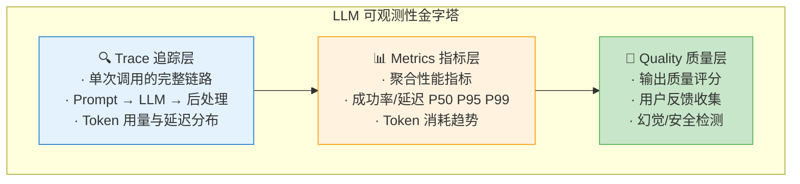

### 20.3.2 LangSmith 核心功能 ⭐⭐⭐⭐⭐

LangSmith 是 LangChain 团队推出的 LLM 可观测性平台，其核心抽象与 MLflow 类似但专注于 LLM 链路：

| 概念 | 说明 | 示例 |
|------|------|------|
| **Trace** | 一次完整的 LLM 调用链路 | 用户提问 → RAG检索 → LLM生成 → 后处理 |
| **Run** | Trace 中的单个步骤 | 单次 Embedding 计算、单次 LLM 调用 |
| **Feedback** | 对 Run 结果的人工/自动评价 | 👍/👎、5星评分、Correct/Incorrect |
| **Dataset** | 测试用例集合 | 100个标注好的问答对 |
| **Experiment** | 在 Dataset 上的一次批量评估 | 测试 Prompt v2 的准确率 |

**LangSmith 集成代码示例**：

```python
# LangSmith 可观测性实战
import os
from langsmith import traceable, Client
from openai import OpenAI

# 设置环境变量
os.environ["LANGCHAIN_TRACING_V2"] = "true"
os.environ["LANGCHAIN_API_KEY"] = "ls__your_api_key"
os.environ["LANGCHAIN_PROJECT"] = "my-qa-system"

client = Client()
openai_client = OpenAI()

# 方法1：使用 @traceable 装饰器自动追踪
@traceable(
    run_type="chain",
    name="QA Pipeline",
    metadata={"version": "1.2.0", "environment": "staging"}
)
def qa_pipeline(question: str, context_docs: list[str]) -> dict:
    """完整的 QA 流水线，LangSmith 自动追踪每个步骤"""
    
    # 步骤1：构建 Prompt
    prompt = build_prompt(question, context_docs)
    
    # 步骤2：调用 LLM
    answer = call_llm(prompt)
    
    # 步骤3：后处理
    result = post_process(answer)
    
    return result

@traceable(run_type="prompt", name="Build Prompt")
def build_prompt(question: str, docs: list[str]) -> str:
    """构建 Prompt（LangSmith 自动记录输入/输出）"""
    context = "\n\n".join(docs)
    return f"""基于以下上下文回答问题。

上下文：
{context}

问题：{question}

回答："""

@traceable(run_type="llm", name="GPT-4o Call")
def call_llm(prompt: str) -> str:
    """LLM 调用（自动记录 Token 用量和延迟）"""
    response = openai_client.chat.completions.create(
        model="gpt-4o",
        messages=[{"role": "user", "content": prompt}],
        temperature=0.1,
    )
    return response.choices[0].message.content

@traceable(run_type="chain", name="Post-process")
def post_process(answer: str) -> dict:
    """后处理"""
    return {
        "answer": answer.strip(),
        "length": len(answer),
        "has_citation": "来源" in answer,
    }

# 方法2：手动创建 Run 和 Feedback
def manual_trace_example():
    """手动创建 Trace 并添加 Feedback"""
    
    # 创建 Run
    run = client.create_run(
        name="manual-qa-evaluation",
        run_type="chain",
        inputs={"question": "什么是向量数据库？"},
        project_name=os.environ["LANGCHAIN_PROJECT"],
    )
    
    # 执行...
    result = qa_pipeline("什么是向量数据库？", ["向量数据库是...", "它用于..."])
    
    # 更新 Run 输出
    client.update_run(
        run.id,
        outputs=result,
        end_time=None,  # 自动记录结束时间
    )
    
    # 添加人工反馈
    client.create_feedback(
        run.id,
        key="user-rating",
        score=0.9,  # 0-1 评分
        comment="回答准确，引用了正确的来源",
    )
    
    # 添加自动评估反馈
    client.create_feedback(
        run.id,
        key="contains-citation",
        score=1.0 if result["has_citation"] else 0.0,
        comment="自动检测引用",
    )

# 运行示例
result = qa_pipeline(
    "什么是 MCP 协议？",
    ["MCP (Model Context Protocol) 是 Anthropic 推出的..."]
)
print(f"Answer: {result['answer'][:100]}...")
print(f"🔗 在 LangSmith UI 查看完整 Trace")
```

**LangSmith 在面试中的高频使用场景**：

| 场景 | LangSmith 功能 | 面试话术 |
|------|---------------|---------|
| **调试 Prompt** | 查看完整 Trace，定位哪一步出错 | "我使用 LangSmith 的 Trace 功能定位到 Prompt 中的指令歧义" |
| **回归测试** | Dataset + Experiment 对比新旧 Prompt | "每次改 Prompt 后，在 LangSmith 上跑一遍 Dataset 确保不退化" |
| **用户反馈闭环** | Feedback API 收集用户评分 | "通过 LangSmith Feedback 收集用户纠错，持续优化" |
| **成本归因** | Trace 级别的 Token 统计 | "通过 LangSmith 按项目/用户查看 Token 消耗分布" |

### 20.3.3 LangFuse：开源可观测性替代方案 ⭐⭐⭐⭐

LangFuse 是 2025-2026 年快速崛起的**开源** LLM 可观测性平台，常作为 LangSmith 的替代方案出现在面试题中。

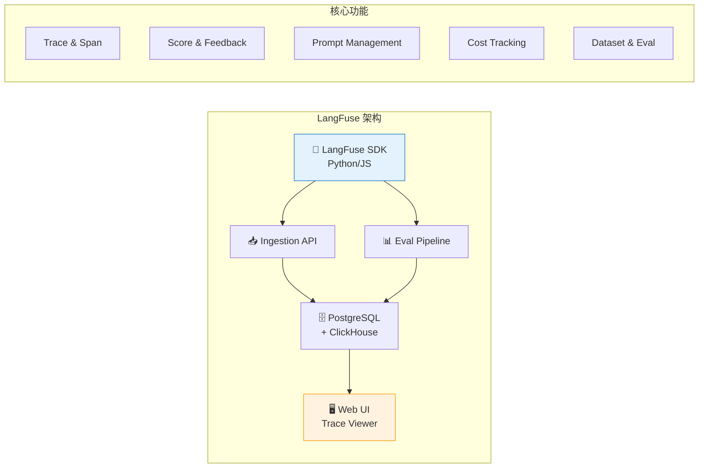

**LangSmith vs LangFuse 对比**：

| 维度 | LangSmith | LangFuse |
|------|-----------|----------|
| **开源** | ❌ 商业 SaaS | ✅ MIT 开源 |
| **自托管** | 企业版支持 | ✅ Docker 一键部署 |
| **Prompt 管理** | Prompt Hub | ✅ 内置 Prompt 版本管理 |
| **定价** | 免费额度 + 按量付费 | 免费（自托管）/ 云服务有免费额度 |
| **集成深度** | LangChain/LangGraph 深度集成 | 框架无关，广泛兼容 |
| **评估系统** | ✅ 内置 | ✅ 内置 + LLM-as-Judge |
| **社区活跃度** | LangChain 生态 | 快速增长中 |

```python
# LangFuse 集成示例（与 LangChain 结合）
from langfuse import Langfuse
from langfuse.decorators import observe, langfuse_context

# 初始化
langfuse = Langfuse(
    secret_key="sk-lf-...",
    public_key="pk-lf-...",
    host="https://cloud.langfuse.com",  # 或自托管地址
)

# 使用 @observe 装饰器自动追踪
@observe(name="customer-support-agent")
def handle_customer_query(query: str, conversation_history: list) -> dict:
    """客户支持 Agent，LangFuse 自动追踪全链路"""
    
    # 更新当前 trace 的元数据
    langfuse_context.update_current_trace(
        name=f"support-{query[:30]}",
        tags=["production", "customer-support"],
        metadata={"user_tier": "premium", "channel": "web"},
    )
    
    # 步骤1：意图识别
    intent = classify_intent(query)
    langfuse_context.update_current_observation(
        metadata={"intent": intent}
    )
    
    # 步骤2：检索相关知识
    docs = retrieve_knowledge(query, intent)
    
    # 步骤3：生成回答
    answer = generate_response(query, docs, conversation_history)
    
    # 记录评分
    langfuse_context.score_current_trace(
        name="response_length",
        value=min(len(answer) / 500, 1.0),  # 归一化到 0-1
    )
    
    return {"answer": answer, "intent": intent, "sources": len(docs)}

@observe()
def classify_intent(query: str) -> str:
    """意图识别（作为 Span 出现在 Trace 中）"""
    # ... LLM 调用 ...
    return "technical_support"

@observe()
def retrieve_knowledge(query: str, intent: str) -> list:
    """知识检索"""
    # ... RAG 检索 ...
    return ["doc1", "doc2"]

@observe()
def generate_response(query: str, docs: list, history: list) -> str:
    """生成回答"""
    # ... LLM 调用 ...
    return "Generated answer..."

# 事后添加评分（异步评估）
def evaluate_response_quality(trace_id: str, response: str):
    """异步评估回答质量"""
    # 使用 LLM-as-Judge
    score = judge_response(response)
    langfuse.score(
        trace_id=trace_id,
        name="quality_score",
        value=score,
        comment=f"Auto-evaluated: {score:.2f}",
    )
```

### 20.3.4 Prompt 调试与优化 ⭐⭐⭐

可观测性工具最重要的应用场景之一就是 **Prompt 调试**。在面试中，能够清晰描述如何使用 Trace 工具定位 Prompt 问题是重要加分项。

**Prompt 调试工作流**：

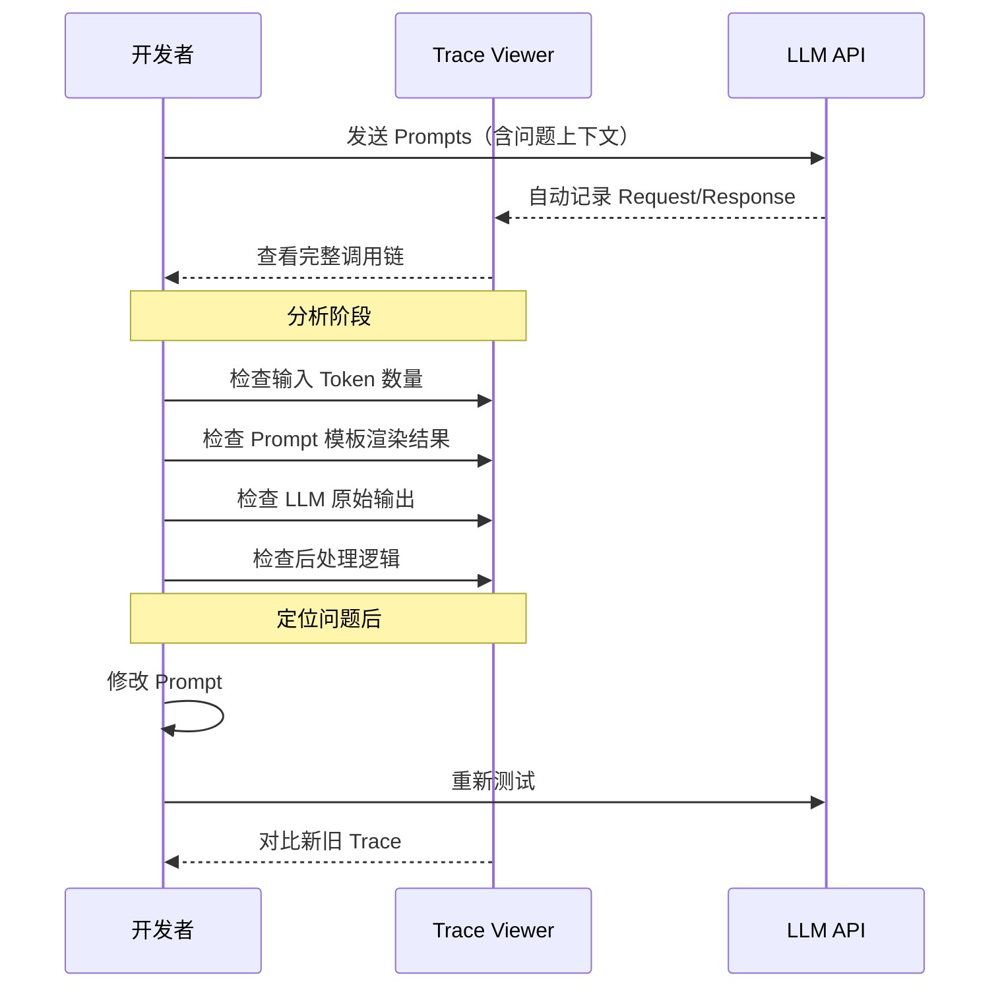

**常见 Prompt 问题及 Trace 定位方法**：

| 问题 | Trace 表现 | 定位方法 |
|------|-----------|---------|
| **Prompt 过长截断** | Token 数接近 max_tokens | 检查 Run 的 token_usage |
| **指令未被遵循** | LLM 输出格式与期望不符 | 对比 Prompt 原文与渲染结果 |
| **RAG 检索错误** | 检索结果不相关 | 检查检索步骤 Run 的输入/输出 |
| **幻觉问题** | 输出包含不存在的信息 | 对比 retrieval Run 输出与 LLM Run 输出 |
| **后处理 Bug** | LLM 输出正确但最终结果错误 | 检查后处理 Run 的输入/输出对比 |

```python
# 使用 LangSmith SDK 进行 Prompt 调试
from langsmith import Client

client = Client()

def debug_prompt_issue(project_name: str, query_pattern: str):
    """通过 LangSmith API 批量诊断 Prompt 问题"""
    
    # 查找所有相关 Trace
    runs = list(client.list_runs(
        project_name=project_name,
        execution_order=1,
        filter=f'eq(name, "Build Prompt")',
    ))
    
    issues = {
        "truncated_prompts": [],
        "empty_contexts": [],
        "long_prompts": [],
        "malformed_outputs": [],
    }
    
    for run in runs:
        prompt_text = run.outputs.get("prompt", "") if run.outputs else ""
        input_data = run.inputs or {}
        
        # 检测1：Prompt 是否为空或过短
        if len(prompt_text) < 50:
            issues["truncated_prompts"].append({
                "run_id": run.id,
                "prompt_length": len(prompt_text),
                "input": input_data,
            })
        
        # 检测2：上下文是否为空
        if not input_data.get("context"):
            issues["empty_contexts"].append({
                "run_id": run.id,
                "question": input_data.get("question"),
            })
        
        # 检测3：Prompt 是否过长（可能被 API 截断）
        if len(prompt_text) > 8000:
            issues["long_prompts"].append({
                "run_id": run.id,
                "prompt_length": len(prompt_text),
            })
    
    # 生成诊断报告
    print(f"=== Prompt 诊断报告 ===")
    print(f"总 Trace 数: {len(runs)}")
    print(f"截断/过短: {len(issues['truncated_prompts'])}")
    print(f"空上下文: {len(issues['empty_contexts'])}")
    print(f"过长 Prompt: {len(issues['long_prompts'])}")
    
    # 返回问题的 Trace ID 供进一步分析
    return issues

# 使用示例
issues = debug_prompt_issue("my-qa-system", "customer support")
```

### 20.3.5 Token 用量追踪 ⭐⭐⭐

```python
# 实时 Token 用量追踪与预算管理
import time
from collections import defaultdict
from dataclasses import dataclass, field
from typing import Dict

@dataclass
class TokenTracker:
    """Token 用量追踪器 —— 面试常考设计模式"""
    
    daily_budget: float = 50.0  # 每日预算 $50
    alert_threshold: float = 0.8  # 80% 时告警
    
    _daily_usage: Dict[str, float] = field(default_factory=lambda: defaultdict(float))
    _monthly_usage: float = 0.0
    _model_pricing: Dict[str, Dict[str, float]] = field(default_factory=lambda: {
        "gpt-4o": {"input": 2.50, "output": 10.00},
        "gpt-4o-mini": {"input": 0.15, "output": 0.60},
        "claude-sonnet-4": {"input": 3.00, "output": 15.00},
    })
    
    def track_call(
        self,
        model: str,
        input_tokens: int,
        output_tokens: int,
        user_id: str = "default",
    ) -> float:
        """记录一次 LLM 调用并返回本次调用成本"""
        pricing = self._model_pricing.get(model, {"input": 0.0, "output": 0.0})
        
        input_cost = (input_tokens / 1_000_000) * pricing["input"]
        output_cost = (output_tokens / 1_000_000) * pricing["output"]
        total_cost = input_cost + output_cost
        
        # 更新追踪
        today = time.strftime("%Y-%m-%d")
        self._daily_usage[today] += total_cost
        self._monthly_usage += total_cost
        
        # 检查是否超过阈值
        if self._daily_usage[today] > self.daily_budget * self.alert_threshold:
            self._send_alert(
                f"⚠️ Token 用量已达日预算的 {self.alert_threshold*100:.0f}% "
                f"(${self._daily_usage[today]:.2f}/${self.daily_budget:.2f})"
            )
        
        return total_cost
    
    def get_usage_summary(self) -> dict:
        """获取用量摘要"""
        today = time.strftime("%Y-%m-%d")
        return {
            "today": {"date": today, "cost": self._daily_usage[today]},
            "monthly_total": self._monthly_usage,
            "budget_remaining": self.daily_budget - self._daily_usage[today],
        }
    
    def _send_alert(self, message: str):
        """发送告警（可接入 Slack/钉钉/邮件）"""
        print(f"[ALERT] {message}")

# 使用示例
tracker = TokenTracker(daily_budget=100.0)

# 模拟调用
cost = tracker.track_call("gpt-4o", input_tokens=2000, output_tokens=500)
print(f"本次调用成本: ${cost:.4f}")

# 模拟大量调用触发告警
for i in range(100):
    tracker.track_call("gpt-4o", input_tokens=10000, output_tokens=2000)

print(tracker.get_usage_summary())
```

---

## 20.4 Prompt 版本管理与A/B测试 ⭐⭐⭐⭐

### 20.4.1 Prompt 版本控制方案

Prompt 是 LLM 应用中最敏感的配置。它的微小变动可能引起输出质量的显著变化。业界常用的 Prompt 版本控制方案有以下几种：

| 方案 | 适用场景 | 优点 | 缺点 |
|------|---------|------|------|
| **Git 管理 Prompt 文件** | 小团队 | 简单、版控能力强 | 缺乏运行时管理 |
| **LangSmith Prompt Hub** | LangChain 用户 | 与 Trace 集成、自动版本 | 依赖商业平台 |
| **LangFuse Prompt Management** | 开源用户 | 开源、API 管理 | 需自行部署 |
| **数据库 + 配置中心** | 企业级 | 运行时动态切换 | 开发成本高 |
| **Feature Flag 控制** | A/B 测试 | 灰度发布 | 架构复杂度增加 |

```yaml
# Prompt 版本控制 YAML 配置示例
# prompts/qa_prompt.yaml

prompts:
  qa_default:
    version: "3.2.0"
    created: "2026-05-15"
    author: "alice@company.com"
    status: "production"  # draft | testing | production | deprecated
    description: "标准问答 Prompt，优化了引用格式和拒绝策略"
    
    template: |
      你是一个专业的知识问答助手。请基于以下参考资料回答问题。
      
      ## 参考资料
      {context}
      
      ## 对话历史
      {chat_history}
      
      ## 当前问题
      {question}
      
      ## 回答要求
      1. 如果参考资料包含答案，请给出准确回答并标注来源
      2. 如果参考资料不充分，请明确说明"根据现有资料无法确定"
      3. 如果问题涉及主观判断，请给出平衡的观点
      4. 使用 [来源N] 格式标注引用
      
      ## 回答
    
    # 关联的测试集
    test_dataset: "qa_regression_test_v2"
    
    # 性能基线
    baseline:
      accuracy: 0.87
      hallucination_rate: 0.03
      avg_latency_ms: 850
      avg_tokens: 420
    
    # A/B 测试配置
    ab_test:
      enabled: false
      traffic_split: 50
      variant: null
  
  qa_v4_experimental:
    version: "4.0.0-beta.1"
    created: "2026-05-28"
    author: "bob@company.com"
    status: "testing"
    description: "引入 Chain-of-Thought + 自我验证的实验版 Prompt"
    
    template: |
      你是一个专业的知识问答助手。请按以下步骤工作：
      
      ## 步骤1：分析问题
      仔细阅读问题，识别关键概念和所需信息类型。
      
      ## 步骤2：检索相关证据
      从参考资料中找出与问题相关的内容：
      {context}
      
      ## 步骤3：推理与回答
      基于找到的证据，逐步推理并给出回答。
      
      ## 步骤4：自我验证
      检查你的回答是否：
      - 完全基于参考资料
      - 没有编造信息
      - 标注了所有来源
      
      问题：{question}
    
    test_dataset: "qa_regression_test_v2"
    
    baseline:
      accuracy: null  # 测试中
      hallucination_rate: null
      avg_latency_ms: null
      avg_tokens: null
    
    ab_test:
      enabled: false
      traffic_split: 0
      variant: null
```

### 20.4.2 A/B 测试框架设计 ⭐⭐⭐⭐

A/B 测试是验证 Prompt 改动的金标准。一个好的 LLM A/B 测试框架需要解决：流量分配、统计显著性、业务指标与质量指标的权衡。

```python
# LLM Prompt A/B 测试框架
import hashlib
import random
from enum import Enum
from dataclasses import dataclass, field
from typing import Any, Optional
from datetime import datetime
import json

class Variant(Enum):
    CONTROL = "control"      # 原版 Prompt
    TREATMENT = "treatment"  # 新版 Prompt

@dataclass
class ABTestConfig:
    """A/B 测试配置"""
    experiment_id: str
    control_prompt: str
    treatment_prompt: str
    traffic_split: float = 0.5  # treatment 流量比例
    min_sample_size: int = 100  # 最小样本量（每组的独立用户数）
    
    # 关键指标
    primary_metric: str = "user_satisfaction"  # 北极星指标
    guardrail_metrics: list = field(default_factory=lambda: [
        "response_latency_ms",
        "token_usage",
        "error_rate",
    ])
    
    # 状态
    status: str = "draft"  # draft | running | completed | stopped
    
@dataclass
class ABTestResult:
    """单次 A/B 测试结果"""
    user_id: str
    variant: Variant
    query: str
    response: str
    
    # 业务指标
    user_rated_helpful: Optional[bool] = None
    user_clicked_source: Optional[bool] = None
    conversation_continued: Optional[bool] = None
    
    # 性能指标
    latency_ms: float = 0.0
    prompt_tokens: int = 0
    completion_tokens: int = 0
    total_tokens: int = 0
    
    # 质量指标
    hallucination_detected: bool = False
    safety_flag_raised: bool = False
    
    timestamp: str = field(default_factory=lambda: datetime.now().isoformat())


class LLMABTestFramework:
    """LLM Prompt A/B 测试框架"""
    
    def __init__(self, config: ABTestConfig):
        self.config = config
        self.results: list[ABTestResult] = []
    
    def assign_variant(self, user_id: str, query: str) -> Variant:
        """
        确定性流量分配（基于用户 ID 哈希）
        
        为什么不用随机数？
        - 确定性分配：同一用户始终看到同一个版本（避免体验不一致）
        - 可复现：相同 user_id 始终分配到同一组
        - 均匀分布：哈希值均匀分布在 [0, 1)
        """
        # 使用 SHA256 哈希确保均匀分布
        hash_input = f"{self.config.experiment_id}:{user_id}"
        hash_value = int(hashlib.sha256(hash_input.encode()).hexdigest(), 16)
        bucket = (hash_value % 10000) / 10000.0  # [0, 1)
        
        if bucket < self.config.traffic_split:
            return Variant.TREATMENT
        else:
            return Variant.CONTROL
    
    def get_prompt(self, variant: Variant, **kwargs) -> str:
        """根据 Variant 获取对应的 Prompt 模板"""
        template = (
            self.config.treatment_prompt
            if variant == Variant.TREATMENT
            else self.config.control_prompt
        )
        return template.format(**kwargs)
    
    def record_result(self, result: ABTestResult):
        """记录单次测试结果"""
        self.results.append(result)
    
    def analyze(self) -> dict:
        """
        分析 A/B 测试结果
        
        返回包括：
        - 各组样本量
        - 核心指标对比
        - 统计显著性（简化版 Z-test）
        - Guardrail 指标检查
        """
        control_results = [r for r in self.results if r.variant == Variant.CONTROL]
        treatment_results = [r for r in self.results if r.variant == Variant.TREATMENT]
        
        if len(control_results) < self.config.min_sample_size:
            return {"status": "insufficient_data", "message": "Control 组样本不足"}
        if len(treatment_results) < self.config.min_sample_size:
            return {"status": "insufficient_data", "message": "Treatment 组样本不足"}
        
        analysis = {
            "experiment_id": self.config.experiment_id,
            "status": "analyzed",
            "sample_sizes": {
                "control": len(control_results),
                "treatment": len(treatment_results),
                "total": len(self.results),
            },
        }
        
        # 1. 分析主要指标（用户满意度）
        control_helpful = [r for r in control_results if r.user_rated_helpful is True]
        treatment_helpful = [r for r in treatment_results if r.user_rated_helpful is True]
        
        control_rate = len(control_helpful) / len(control_results)
        treatment_rate = len(treatment_helpful) / len(treatment_results)
        
        analysis["primary_metric"] = {
            "name": "user_satisfaction",
            "control_rate": control_rate,
            "treatment_rate": treatment_rate,
            "relative_change": (treatment_rate - control_rate) / control_rate * 100,
        }
        
        # 2. 简化统计显著性检验（Z-test for proportions）
        n_c = len(control_results)
        n_t = len(treatment_results)
        p_pool = (len(control_helpful) + len(treatment_helpful)) / (n_c + n_t)
        
        if p_pool > 0 and p_pool < 1:
            se = (p_pool * (1 - p_pool) * (1/n_c + 1/n_t)) ** 0.5
            z_score = (treatment_rate - control_rate) / se if se > 0 else 0
            # 简化：|z| > 1.96 对应 p < 0.05
            analysis["primary_metric"]["z_score"] = z_score
            analysis["primary_metric"]["significant"] = abs(z_score) > 1.96
        
        # 3. Guardrail 指标检查
        guardrails = {}
        for metric in self.config.guardrail_metrics:
            if metric == "response_latency_ms":
                c_val = sum(r.latency_ms for r in control_results) / n_c
                t_val = sum(r.latency_ms for r in treatment_results) / n_t
                guardrails[metric] = {
                    "control": c_val,
                    "treatment": t_val,
                    "change_pct": (t_val - c_val) / c_val * 100,
                    "degraded": t_val > c_val * 1.2,  # 延迟增加20%以上为劣化
                }
            elif metric == "token_usage":
                c_val = sum(r.total_tokens for r in control_results) / n_c
                t_val = sum(r.total_tokens for r in treatment_results) / n_t
                guardrails[metric] = {
                    "control": c_val,
                    "treatment": t_val,
                    "change_pct": (t_val - c_val) / c_val * 100,
                    "degraded": t_val > c_val * 1.5,  # Token 增加50%以上为劣化
                }
        
        analysis["guardrail_metrics"] = guardrails
        
        # 综合建议
        sig = analysis["primary_metric"].get("significant", False)
        rel_change = analysis["primary_metric"]["relative_change"]
        has_degradation = any(g.get("degraded", False) for g in guardrails.values())
        
        if sig and rel_change > 5 and not has_degradation:
            analysis["recommendation"] = "✅ 建议上线 Treatment（统计显著正向提升，无明显劣化）"
        elif sig and rel_change < -5:
            analysis["recommendation"] = "❌ Treatment 显著劣于 Control，建议放弃"
        elif has_degradation:
            analysis["recommendation"] = "⚠️ Guardrail 指标劣化，需进一步分析"
        else:
            analysis["recommendation"] = "⏳ 统计不显著，建议继续收集数据"
        
        return analysis
    
    def export_results(self, filepath: str):
        """导出结果为 JSON"""
        with open(filepath, "w", encoding="utf-8") as f:
            json.dump(
                [r.__dict__ for r in self.results],
                f, ensure_ascii=False, indent=2
            )


# ============ 使用示例 ============
config = ABTestConfig(
    experiment_id="prompt-v4-beta1-vs-v3.2",
    control_prompt="你是一个问答助手。基于以下参考资料回答问题：\n{context}\n\n问题：{question}",
    treatment_prompt="你是一个专业问答助手。请先分析问题，再基于参考资料逐步推理，最后给出带来源标注的回答。\n\n参考资料：{context}\n\n问题：{question}\n\n请按以下格式回答：\n1. 分析：\n2. 回答：\n3. 来源：",
    traffic_split=0.5,
    min_sample_size=100,
)

framework = LLMABTestFramework(config)

# 模拟实验
user_ids = [f"user_{i}" for i in range(500)]
for uid in user_ids:
    variant = framework.assign_variant(uid, "test query")
    # 模拟结果记录...
    result = ABTestResult(
        user_id=uid,
        variant=variant,
        query="什么是 Python 装饰器？",
        response="A decorator is...",
        user_rated_helpful=True,
        latency_ms=random.gauss(800, 100),
        total_tokens=random.randint(300, 600),
    )
    framework.record_result(result)

# 分析结果
analysis = framework.analyze()
print(json.dumps(analysis, ensure_ascii=False, indent=2))
```

### 20.4.3 统计显著性检验 ⭐⭐

在 A/B 测试中，仅看指标差异是不够的，必须检验差异是否具有**统计显著性**。

```python
# LLM A/B 测试中的统计显著性检验
import numpy as np
from scipy import stats

class ABStatisticalTests:
    """A/B 测试常用统计检验"""
    
    @staticmethod
    def two_proportion_z_test(
        successes_a: int, n_a: int,
        successes_b: int, n_b: int,
        alpha: float = 0.05,
    ) -> dict:
        """
        双比例 Z 检验（用于二分类指标：是否正确/是否点赞）
        
        适用场景：
        - 正确率对比
        - 用户点赞率对比
        - 引用点击率对比
        """
        p_a = successes_a / n_a
        p_b = successes_b / n_b
        p_pool = (successes_a + successes_b) / (n_a + n_b)
        
        # 标准误
        se = np.sqrt(p_pool * (1 - p_pool) * (1/n_a + 1/n_b))
        
        # Z 统计量
        z_score = (p_b - p_a) / se if se > 0 else 0
        
        # P 值（双尾检验）
        p_value = 2 * (1 - stats.norm.cdf(abs(z_score)))
        
        # 置信区间
        diff = p_b - p_a
        ci_margin = stats.norm.ppf(1 - alpha/2) * np.sqrt(
            p_a * (1 - p_a) / n_a + p_b * (1 - p_b) / n_b
        )
        ci_lower = diff - ci_margin
        ci_upper = diff + ci_margin
        
        return {
            "test": "Two-Proportion Z-Test",
            "control_rate": p_a,
            "treatment_rate": p_b,
            "difference": diff,
            "relative_change_pct": (diff / p_a * 100) if p_a > 0 else float('inf'),
            "z_score": z_score,
            "p_value": p_value,
            "significant": p_value < alpha,
            "ci_95": (ci_lower, ci_upper),
        }
    
    @staticmethod
    def welch_t_test(
        values_a: list[float], values_b: list[float],
        alpha: float = 0.05,
    ) -> dict:
        """
        Welch's T 检验（用于连续指标：延迟/Token 数/评分）
        
        适用场景：
        - 平均延迟对比
        - 平均 Token 用量对比
        - 用户评分对比
        """
        t_stat, p_value = stats.ttest_ind(
            values_b, values_a, equal_var=False
        )
        
        mean_a = np.mean(values_a)
        mean_b = np.mean(values_b)
        
        return {
            "test": "Welch's T-Test",
            "control_mean": mean_a,
            "treatment_mean": mean_b,
            "difference": mean_b - mean_a,
            "relative_change_pct": (mean_b - mean_a) / mean_a * 100,
            "t_statistic": t_stat,
            "p_value": p_value,
            "significant": p_value < alpha,
        }
    
    @staticmethod
    def compute_required_sample_size(
        baseline_rate: float,
        minimum_detectable_effect: float,
        alpha: float = 0.05,
        power: float = 0.80,
    ) -> int:
        """
        计算 A/B 测试所需的最小样本量
        
        面试常问：'A/B 测试需要多少样本？'
        """
        z_alpha = stats.norm.ppf(1 - alpha / 2)  # 双尾
        z_beta = stats.norm.ppf(power)
        
        # Cohen's h 效应量
        h = 2 * np.arcsin(np.sqrt(baseline_rate + minimum_detectable_effect)) - \
            2 * np.arcsin(np.sqrt(baseline_rate))
        
        n = 2 * ((z_alpha + z_beta) / h) ** 2
        return int(np.ceil(n))


# ============ 使用示例 ============
tester = ABStatisticalTests()

# 示例1：正确率对比
result1 = tester.two_proportion_z_test(
    successes_a=170, n_a=200,  # Control: 85% 正确
    successes_b=188, n_b=200,  # Treatment: 94% 正确
)
print(f"正确率对比: p={result1['p_value']:.4f}, 显著={result1['significant']}")

# 示例2：计算所需样本量
n_required = tester.compute_required_sample_size(
    baseline_rate=0.85,
    minimum_detectable_effect=0.05,  # 希望检测出 5% 的提升
)
print(f"每组需要 {n_required} 个样本")
```

> 📚 **交叉引用**：A/B 测试中使用的评估方法（正确率、用户满意度等），请参考 [[13_Prompt_Engineering]] 中的 LLM 评估体系。

---

## 20.5 成本监控与Token计量 ⭐⭐⭐

### 20.5.1 各主流模型 API 成本速查（2026年）

LLM 应用的成本是面试中经常讨论的实际话题。以下是 2026 年主流模型的 API 定价参考：

| 模型 | Provider | 输入 $/1M tokens | 输出 $/1M tokens | 上下文窗口 | 备注 |
|------|----------|-----------------|-----------------|-----------|------|
| **GPT-4o** | OpenAI | $2.50 | $10.00 | 128K | 多模态 |
| **GPT-4o-mini** | OpenAI | $0.15 | $0.60 | 128K | 高性价比 |
| **GPT-4.5** | OpenAI | $75.00 | $150.00 | 128K | 最强但最贵 |
| **Claude Sonnet 4** | Anthropic | $3.00 | $15.00 | 200K | 推理强 |
| **Claude Haiku 4** | Anthropic | $0.25 | $1.25 | 200K | 经济型 |
| **Claude Opus 4** | Anthropic | $15.00 | $75.00 | 200K | 旗舰 |
| **Gemini 2.5 Pro** | Google | $1.25 | $10.00 | 1M | 超长上下文 |
| **Gemini 2.5 Flash** | Google | $0.10 | $0.40 | 1M | 极低成本 |
| **DeepSeek-V3** | DeepSeek | $0.27 | $1.10 | 128K | 国产高性价比 |
| **Llama 4 (自部署)** | Meta | GPU 成本 | GPU 成本 | 128K+ | 开源免费 |

**成本速算公式**：

$$\text{单次调用成本} = \frac{\text{输入 Token} \times \text{输入单价} + \text{输出 Token} \times \text{输出单价}}{1,000,000}$$

### 20.5.2 Token 计数与预估 ⭐⭐⭐

```python
# Token 计数与成本预估工具
import tiktoken
from typing import Optional

class TokenEstimator:
    """Token 计数与成本预估器"""
    
    # 模型对应的 tokenizer
    MODEL_ENCODING_MAP = {
        "gpt-4o": "o200k_base",
        "gpt-4o-mini": "o200k_base",
        "gpt-4": "cl100k_base",
        "gpt-3.5-turbo": "cl100k_base",
        "text-embedding-3": "cl100k_base",
    }
    
    # 每百万 Token 成本（USD, 2026年参考）
    PRICING = {
        "gpt-4o": {"input": 2.50, "output": 10.00, "context_window": 128000},
        "gpt-4o-mini": {"input": 0.15, "output": 0.60, "context_window": 128000},
        "claude-sonnet-4": {"input": 3.00, "output": 15.00, "context_window": 200000},
        "claude-haiku-4": {"input": 0.25, "output": 1.25, "context_window": 200000},
    }
    
    @classmethod
    def count_tokens(cls, text: str, model: str = "gpt-4o") -> int:
        """统计文本的 Token 数量"""
        encoding_name = cls.MODEL_ENCODING_MAP.get(model, "cl100k_base")
        try:
            encoding = tiktoken.get_encoding(encoding_name)
            return len(encoding.encode(text))
        except Exception:
            # 回退：英文 ~4 字符/token，中文 ~1.5 字符/token
            return cls._estimate_tokens(text)
    
    @staticmethod
    def _estimate_tokens(text: str) -> int:
        """Token 估算（不依赖 tiktoken）"""
        chinese_chars = sum(1 for c in text if '一' <= c <= '鿿')
        other_chars = len(text) - chinese_chars
        return int(chinese_chars / 1.5 + other_chars / 4)
    
    @classmethod
    def estimate_cost(
        cls,
        prompt: str,
        expected_output_length: int = 200,
        model: str = "gpt-4o",
    ) -> dict:
        """预估单次调用成本"""
        input_tokens = cls.count_tokens(prompt, model)
        output_tokens = expected_output_length  # 预估输出
        
        pricing = cls.PRICING.get(model, cls.PRICING["gpt-4o-mini"])
        
        input_cost = (input_tokens / 1_000_000) * pricing["input"]
        output_cost = (output_tokens / 1_000_000) * pricing["output"]
        total_cost = input_cost + output_cost
        
        return {
            "model": model,
            "input_tokens": input_tokens,
            "output_tokens_estimated": output_tokens,
            "input_cost": round(input_cost, 6),
            "output_cost": round(output_cost, 6),
            "total_cost": round(total_cost, 6),
            "context_window_used_pct": round(
                input_tokens / pricing["context_window"] * 100, 1
            ),
        }
    
    @classmethod
    def compare_models(
        cls, prompt: str, expected_output: int = 200
    ) -> list[dict]:
        """对比不同模型的成本"""
        results = []
        for model in cls.PRICING:
            results.append(cls.estimate_cost(prompt, expected_output, model))
        results.sort(key=lambda x: x["total_cost"])
        return results


# 使用示例
estimator = TokenEstimator()

prompt = "请详细解释 Python 中的异步编程模型，包括 asyncio、协程和事件循环的概念。" * 5

# 单模型估算
cost = estimator.estimate_cost(prompt, model="gpt-4o")
print(f"GPT-4o: ${cost['total_cost']:.4f} ({cost['input_tokens']} input tokens)")

# 多模型对比
comparison = estimator.compare_models(prompt)
print("\n=== 模型成本对比 ===")
for c in comparison:
    print(f"{c['model']}: ${c['total_cost']:.6f}")
```

### 20.5.3 成本优化策略 ⭐⭐⭐⭐

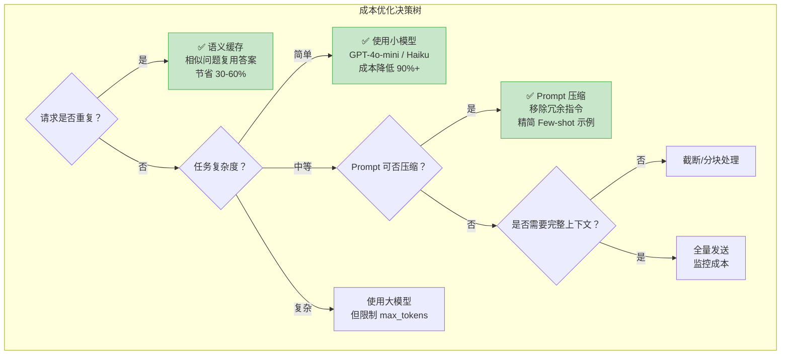

**六大成本优化策略**：

| 策略 | 预期节省 | 实现难度 | 适用场景 |
|------|---------|---------|---------|
| **语义缓存** | 30-60% | 中 | 高频重复/相似问题 |
| **模型降级** | 80-95% | 低 | 简单任务用小模型 |
| **Prompt 压缩** | 20-50% | 中 | 长上下文场景 |
| **限制 max_tokens** | 10-30% | 低 | 不需要长回答 |
| **Batch 处理** | 50% | 中 | 离线批量任务 |
| **Prompt Caching（API）** | 50-90% | 低 | 长 System Prompt |

> 🆕 **2026年更新**：Anthropic Claude 和 OpenAI 都支持 **Prompt Caching**，对重复使用的 System Prompt 和长上下文自动缓存，可节省 50-90% 的输入 Token 成本。面试中提及此特性是重要的加分项。

```python
# 语义缓存实现示例
import hashlib
import json
from functools import lru_cache
from typing import Optional

class SemanticCache:
    """LLM 响应缓存（语义相似度匹配）"""
    
    def __init__(self, similarity_threshold: float = 0.95):
        self.cache: dict[str, dict] = {}
        self.threshold = similarity_threshold
    
    def _compute_hash(self, prompt: str, model: str, **params) -> str:
        """计算请求的哈希值"""
        key_data = json.dumps({
            "prompt": prompt,
            "model": model,
            "params": {k: v for k, v in sorted(params.items())},
        }, sort_keys=True)
        return hashlib.sha256(key_data.encode()).hexdigest()
    
    def get(self, prompt: str, model: str, **params) -> Optional[str]:
        """精确匹配缓存"""
        key = self._compute_hash(prompt, model, **params)
        if key in self.cache:
            self.cache[key]["hits"] += 1
            return self.cache[key]["response"]
        return None
    
    def set(self, prompt: str, model: str, response: str, **params):
        """存入缓存"""
        key = self._compute_hash(prompt, model, **params)
        self.cache[key] = {
            "response": response,
            "timestamp": __import__('time').time(),
            "hits": 0,
        }
    
    def get_cache_stats(self) -> dict:
        """缓存统计"""
        total = len(self.cache)
        total_hits = sum(v["hits"] for v in self.cache.values())
        return {
            "cache_entries": total,
            "total_hits": total_hits,
            "hit_rate": total_hits / max(total_hits + total, 1),
        }
    
    def estimated_savings(self, avg_cost_per_call: float = 0.01) -> float:
        """估算节省成本"""
        stats = self.get_cache_stats()
        return stats["total_hits"] * avg_cost_per_call


# 使用示例
cache = SemanticCache()

# 包装 LLM 调用
def cached_llm_call(prompt: str, model: str = "gpt-4o-mini", **params) -> str:
    cached = cache.get(prompt, model, **params)
    if cached:
        print("⚡ Cache hit! 节省一次 API 调用")
        return cached
    
    # 实际 API 调用...
    response = f"Response for: {prompt[:50]}..."  # 模拟
    cache.set(prompt, model, response, **params)
    return response
```

---

## 20.6 模型监控与告警 ⭐⭐⭐⭐

### 20.6.1 核心监控指标

LLM 应用需要多维度监控，一个完整的监控体系包含以下指标类别：

| 指标类别 | 具体指标 | 告警阈值参考 | 采集方式 |
|---------|---------|------------|---------|
| **延迟** | P50/P95/P99 延迟 | P95 > 3s 告警 | API 响应时间 |
| **吞吐** | QPS / RPM | 达到速率限制 80% 告警 | 请求计数器 |
| **错误率** | 4xx/5xx 比例 | > 1% 告警 | HTTP 状态码 |
| **Token 用量** | 输入/输出 Token 趋势 | 日预算 80% 告警 | API Usage 字段 |
| **输出质量** | 用户满意度 / 幻觉率 | 满意度 < 80% 告警 | 用户反馈 + 自动检测 |
| **模型可用性** | API 成功率 | < 99% 告警 | Health Check |
| **缓存命中率** | Cache Hit Rate | < 30% 告警 | 缓存层统计 |

```python
# LLM 应用监控指标收集器
import time
import threading
from collections import defaultdict, deque
from dataclasses import dataclass, field
from typing import Deque

@dataclass
class LLMMetricsCollector:
    """LLM 应用指标收集器 —— 面试中展示系统设计能力"""
    
    # 延迟统计（滑动窗口）
    _latencies: Deque[float] = field(default_factory=lambda: deque(maxlen=10000))
    
    # 请求计数
    _total_requests: int = 0
    _successful_requests: int = 0
    _failed_requests: int = 0
    
    # Token 统计
    _total_input_tokens: int = 0
    _total_output_tokens: int = 0
    _total_cost: float = 0.0
    
    # 按模型分组
    _model_stats: dict = field(default_factory=lambda: defaultdict(
        lambda: {"requests": 0, "tokens": 0, "cost": 0.0, "errors": 0}
    ))
    
    _lock: threading.Lock = field(default_factory=threading.Lock)
    
    def record_request(
        self,
        model: str,
        latency_ms: float,
        input_tokens: int,
        output_tokens: int,
        cost: float,
        success: bool = True,
    ):
        """记录一次请求的指标"""
        with self._lock:
            self._latencies.append(latency_ms)
            self._total_requests += 1
            self._total_input_tokens += input_tokens
            self._total_output_tokens += output_tokens
            self._total_cost += cost
            
            if success:
                self._successful_requests += 1
            else:
                self._failed_requests += 1
            
            stats = self._model_stats[model]
            stats["requests"] += 1
            stats["tokens"] += input_tokens + output_tokens
            stats["cost"] += cost
            if not success:
                stats["errors"] += 1
    
    def get_latency_percentiles(self) -> dict:
        """计算延迟分位数"""
        if not self._latencies:
            return {"p50": 0, "p95": 0, "p99": 0}
        
        sorted_lat = sorted(self._latencies)
        n = len(sorted_lat)
        return {
            "p50": sorted_lat[int(n * 0.50)],
            "p95": sorted_lat[int(n * 0.95)],
            "p99": sorted_lat[int(n * 0.99)],
            "avg": sum(sorted_lat) / n,
            "min": sorted_lat[0],
            "max": sorted_lat[-1],
        }
    
    def get_error_rate(self) -> float:
        """计算错误率"""
        if self._total_requests == 0:
            return 0.0
        return self._failed_requests / self._total_requests
    
    def get_summary(self) -> dict:
        """获取监控摘要（可暴露给 Prometheus 端点）"""
        return {
            "requests": {
                "total": self._total_requests,
                "successful": self._successful_requests,
                "failed": self._failed_requests,
                "error_rate": self.get_error_rate(),
            },
            "latency": self.get_latency_percentiles(),
            "tokens": {
                "total_input": self._total_input_tokens,
                "total_output": self._total_output_tokens,
            },
            "cost": {
                "total": round(self._total_cost, 4),
            },
            "per_model": dict(self._model_stats),
        }
    
    def check_alerts(self) -> list[dict]:
        """检查告警条件"""
        alerts = []
        summary = self.get_summary()
        
        # 告警1：错误率过高
        if summary["requests"]["error_rate"] > 0.01:
            alerts.append({
                "severity": "critical",
                "message": f"错误率过高: {summary['requests']['error_rate']:.2%}",
                "threshold": "> 1%",
            })
        
        # 告警2：P95 延迟过高
        if summary["latency"]["p95"] > 3000:
            alerts.append({
                "severity": "warning",
                "message": f"P95 延迟过高: {summary['latency']['p95']:.0f}ms",
                "threshold": "> 3000ms",
            })
        
        # 告警3：无请求（可能服务挂了）
        if self._total_requests == 0:
            alerts.append({
                "severity": "critical",
                "message": "5 分钟内无任何请求",
            })
        
        return alerts
```

### 20.6.2 数据漂移检测（Embedding Drift）⭐⭐

LLM 应用的数据漂移表现为**用户问题的分布变化**（话题漂移、语言风格变化），需要检测手段来保证模型在新的数据分布上依然有效。

```python
# Embedding 数据漂移检测
import numpy as np
from scipy.spatial.distance import cosine
from scipy.stats import ks_2samp
from typing import Callable

class EmbeddingDriftDetector:
    """基于 Embedding 的数据漂移检测器"""
    
    def __init__(
        self,
        embed_fn: Callable[[str], list[float]],
        reference_window_size: int = 1000,
        drift_threshold: float = 0.1,
    ):
        """
        Args:
            embed_fn: Embedding 函数（如 OpenAI Embeddings）
            reference_window_size: 参考窗口大小
            drift_threshold: 漂移阈值（0-1）
        """
        self.embed_fn = embed_fn
        self.window_size = reference_window_size
        self.threshold = drift_threshold
        
        self.reference_embeddings: list[np.ndarray] = []
        self.current_embeddings: list[np.ndarray] = []
    
    def add_reference(self, text: str):
        """添加参考数据点"""
        emb = np.array(self.embed_fn(text))
        self.reference_embeddings.append(emb)
        if len(self.reference_embeddings) > self.window_size:
            self.reference_embeddings.pop(0)
    
    def add_current(self, text: str):
        """添加当前数据点"""
        emb = np.array(self.embed_fn(text))
        self.current_embeddings.append(emb)
        if len(self.current_embeddings) > self.window_size:
            self.current_embeddings.pop(0)
    
    def detect_drift(self) -> dict:
        """
        检测数据漂移
        
        方法1：平均余弦距离（检测语义偏移）
        方法2：KS 检验（检测分布变化）
        """
        if len(self.reference_embeddings) < 50 or len(self.current_embeddings) < 50:
            return {"drift_detected": False, "reason": "数据不足"}
        
        ref_array = np.array(self.reference_embeddings)
        cur_array = np.array(self.current_embeddings)
        
        # 方法1：计算参考集和当前集的平均质心余弦距离
        ref_centroid = np.mean(ref_array, axis=0)
        cur_centroid = np.mean(cur_array, axis=0)
        centroid_distance = cosine(ref_centroid, cur_centroid)
        
        # 方法2：逐维度 KS 检验
        n_dims = ref_array.shape[1]
        ks_pvalues = []
        for dim in range(min(n_dims, 10)):  # 采样10个维度
            stat, pval = ks_2samp(ref_array[:, dim], cur_array[:, dim])
            ks_pvalues.append(pval)
        
        avg_ks_pvalue = np.mean(ks_pvalues)
        
        # 判定漂移
        drift_detected = (
            centroid_distance > self.threshold or
            avg_ks_pvalue < 0.05  # 显著分布差异
        )
        
        return {
            "drift_detected": drift_detected,
            "centroid_cosine_distance": round(centroid_distance, 4),
            "avg_ks_pvalue": round(avg_ks_pvalue, 4),
            "reference_samples": len(self.reference_embeddings),
            "current_samples": len(self.current_embeddings),
            "interpretation": (
                "⚠️ 检测到数据漂移！用户问题分布已发生变化，建议复查 Prompt 效果"
                if drift_detected
                else "✅ 数据分布稳定，未见明显漂移"
            ),
        }


# 使用示例（需要 OpenAI API Key）
# from openai import OpenAI
# client = OpenAI()
# 
# def get_embedding(text: str) -> list[float]:
#     return client.embeddings.create(
#         model="text-embedding-3-small", input=text
#     ).data[0].embedding
# 
# detector = EmbeddingDriftDetector(get_embedding)
# 
# # 建立参考基线（历史正常数据）
# for query in historical_queries:
#     detector.add_reference(query)
# 
# # 添加当前数据
# for query in recent_queries:
#     detector.add_current(query)
# 
# # 检测
# result = detector.detect_drift()
# print(result["interpretation"])
```

### 20.6.3 输出质量监控 ⭐⭐⭐

```python
# LLM 输出质量自动监控
from typing import Optional

class OutputQualityMonitor:
    """LLM 输出质量自动检测器"""
    
    @staticmethod
    def check_hallucination_indicators(response: str, context: str = None) -> dict:
        """
        幻觉检测（基于启发式规则 + 简单检测）
        
        注意：这只是一个轻量级检测器，生产环境建议使用专门的幻觉检测模型
        """
        indicators = {
            "excessive_confidence": False,
            "unverifiable_claims": False,
            "contradiction": False,
            "hallucination_risk": "low",
        }
        
        # 检测1：过度自信模式
        overconfident_phrases = [
            "毫无疑问", "绝对是", "100%确定", "一定是",
            "definitely", "absolutely", "without any doubt",
        ]
        for phrase in overconfident_phrases:
            if phrase in response:
                indicators["excessive_confidence"] = True
                break
        
        # 检测2：无法验证的陈述（在无上下文时）
        if context:
            # 简化：检查回答中的关键实体是否出现在上下文中
            pass
        
        # 检测3：自我矛盾
        if "但是" in response and "因此" in response:
            # 简化检测：有转折又有结论时需要关注
            indicators["hallucination_risk"] = "medium"
        
        # 综合评分
        risk_score = sum([
            indicators["excessive_confidence"],
            indicators["unverifiable_claims"],
            indicators["contradiction"],
        ])
        
        if risk_score >= 2:
            indicators["hallucination_risk"] = "high"
        
        return indicators
    
    @staticmethod
    def check_safety(response: str) -> dict:
        """安全检查（简化版）"""
        safety_flags = {
            "harmful_content": False,
            "pii_leak": False,
            "prompt_injection_reflected": False,
            "overall_safe": True,
        }
        
        # PII 检测（简化正则）
        import re
        pii_patterns = {
            "phone": r'\b1[3-9]\d{9}\b',
            "email": r'\b[\w.-]+@[\w.-]+\.\w+\b',
            "id_card": r'\b\d{17}[\dXx]\b',
        }
        
        for pii_type, pattern in pii_patterns.items():
            if re.search(pattern, response):
                safety_flags["pii_leak"] = True
                safety_flags["overall_safe"] = False
                break
        
        return safety_flags
    
    @staticmethod
    def check_format_compliance(
        response: str, expected_format: str = "json"
    ) -> dict:
        """格式合规检查"""
        import json as json_module
        
        result = {
            "format": expected_format,
            "compliant": False,
            "error": None,
        }
        
        if expected_format == "json":
            try:
                # 尝试提取 JSON（处理 ```json ... ``` 包裹）
                if "```json" in response:
                    start = response.index("```json") + 7
                    end = response.index("```", start)
                    json_str = response[start:end].strip()
                elif "{" in response:
                    start = response.index("{")
                    end = response.rindex("}") + 1
                    json_str = response[start:end]
                else:
                    json_str = response
                
                json_module.loads(json_str)
                result["compliant"] = True
            except (ValueError, json_module.JSONDecodeError) as e:
                result["error"] = str(e)
        
        return result


# 使用示例
monitor = OutputQualityMonitor()

# 检测幻觉风险
response = "毫无疑问，Python 是世界上最完美的编程语言，没有任何缺点。"
hallucination = monitor.check_hallucination_indicators(response)
print(f"幻觉风险: {hallucination['hallucination_risk']}")
# 输出: 幻觉风险: high
```

### 20.6.4 Prometheus + Grafana 集成 ⭐⭐⭐

```yaml
# prometheus.yml - LLM 应用监控配置示例
global:
  scrape_interval: 15s
  evaluation_interval: 15s

scrape_configs:
  - job_name: 'llm-application'
    static_configs:
      - targets: ['localhost:8000']  # FastAPI metrics 端点
    metrics_path: '/metrics'
    
  - job_name: 'llm-model-gateway'
    static_configs:
      - targets: ['model-gateway:9090']
    
  - job_name: 'node-exporter'
    static_configs:
      - targets: ['localhost:9100']

# 告警规则
rule_files:
  - 'alerts/llm_alerts.yml'
```

```yaml
# alerts/llm_alerts.yml - LLM 应用告警规则
groups:
  - name: llm_alerts
    rules:
      # 告警1：高错误率
      - alert: HighErrorRate
        expr: rate(llm_requests_failed_total[5m]) / rate(llm_requests_total[5m]) > 0.01
        for: 5m
        labels:
          severity: critical
          team: llm-ops
        annotations:
          summary: "LLM API 错误率超过 1%"
          description: "过去 5 分钟错误率 {{ $value | humanizePercentage }}"
      
      # 告警2：P95 延迟过高
      - alert: HighLatency
        expr: histogram_quantile(0.95, rate(llm_request_duration_seconds_bucket[5m])) > 3
        for: 5m
        labels:
          severity: warning
        annotations:
          summary: "P95 延迟超过 3 秒"
          description: "当前 P95 延迟: {{ $value }}s"
      
      # 告警3：Token 用量逼近预算
      - alert: TokenBudgetWarning
        expr: llm_token_cost_daily_total > llm_token_budget_daily * 0.8
        for: 1m
        labels:
          severity: warning
        annotations:
          summary: "Token 用量已达日预算的 80%"
      
      # 告警4：缓存命中率过低
      - alert: LowCacheHitRate
        expr: rate(llm_cache_hits_total[5m]) / rate(llm_cache_requests_total[5m]) < 0.3
        for: 10m
        labels:
          severity: info
        annotations:
          summary: "LLM 缓存命中率低于 30%（可能存在新的非重复查询模式）"
```

```python
# FastAPI 应用中暴露 Prometheus 指标
from fastapi import FastAPI
from prometheus_client import Counter, Histogram, Gauge, generate_latest
from starlette.responses import Response

app = FastAPI()

# Prometheus 指标定义
llm_requests_total = Counter(
    "llm_requests_total",
    "Total LLM requests",
    ["model", "status"]
)

llm_request_duration = Histogram(
    "llm_request_duration_seconds",
    "LLM request duration in seconds",
    ["model"],
    buckets=[0.1, 0.5, 1.0, 2.0, 3.0, 5.0, 10.0, 30.0],
)

llm_token_usage = Counter(
    "llm_token_usage_total",
    "Total tokens used",
    ["model", "type"]  # type: input / output
)

llm_token_cost = Gauge(
    "llm_token_cost_daily_total",
    "Daily token cost in USD"
)

# Prometheus metrics 端点
@app.get("/metrics")
async def metrics():
    return Response(content=generate_latest(), media_type="text/plain")

# 在 LLM 调用处记录指标
@app.post("/chat")
async def chat(request: dict):
    model = request.get("model", "gpt-4o-mini")
    
    with llm_request_duration.labels(model=model).time():
        try:
            # ... LLM 调用 ...
            response = {"answer": "mock response"}
            
            # 记录成功
            llm_requests_total.labels(model=model, status="success").inc()
            llm_token_usage.labels(model=model, type="input").inc(100)
            llm_token_usage.labels(model=model, type="output").inc(50)
            
            return response
        except Exception as e:
            llm_requests_total.labels(model=model, status="error").inc()
            raise
```

---

## 20.7 持续集成与持续部署（ML CI/CD）⭐⭐⭐⭐

### 20.7.1 LLM 应用的 CI/CD Pipeline 设计

LLM 应用的 CI/CD 与传统软件 CI/CD 的核心区别在于**需要模型评估门禁**。

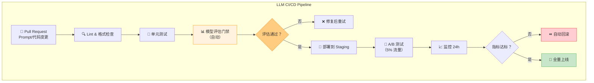

### 20.7.2 自动化评估门禁 ⭐⭐⭐⭐

评估门禁是 LLM CI/CD 的核心，确保每次 Prompt 或配置变更不会导致质量退化。

```python
# LLM CI/CD 评估门禁实现
import json
from dataclasses import dataclass
from typing import Callable

@dataclass
class QualityGate:
    """评估门禁配置"""
    min_accuracy: float = 0.85
    max_hallucination_rate: float = 0.05
    max_latency_p95_ms: float = 3000
    max_cost_per_query: float = 0.05
    require_safety_check: bool = True

class LLMEvaluationGate:
    """LLM 应用的自动化评估门禁"""
    
    def __init__(
        self,
        gate_config: QualityGate,
        eval_fn: Callable[..., dict],
        test_dataset: list[dict],
    ):
        self.config = gate_config
        self.eval_fn = eval_fn
        self.test_dataset = test_dataset
    
    def run_evaluation(self, prompt_version: str) -> dict:
        """
        运行评估门禁
        
        返回评估报告，如果任一指标不通过则标记 failed=True
        """
        results = []
        total_cost = 0.0
        total_latency = 0.0
        
        for test_case in self.test_dataset:
            result = self.eval_fn(
                prompt_version=prompt_version,
                query=test_case["query"],
                expected=test_case.get("expected"),
                context=test_case.get("context"),
            )
            results.append(result)
            total_cost += result.get("cost", 0)
            total_latency += result.get("latency_ms", 0)
        
        # 汇总指标
        n = len(results)
        avg_accuracy = sum(r.get("correct", 0) for r in results) / n
        hallucination_count = sum(r.get("hallucination", False) for r in results)
        avg_cost = total_cost / n
        p95_latency = sorted(
            r.get("latency_ms", 0) for r in results
        )[int(n * 0.95)]
        
        # 门禁检查
        checks = {
            "accuracy": {
                "value": avg_accuracy,
                "threshold": self.config.min_accuracy,
                "passed": avg_accuracy >= self.config.min_accuracy,
            },
            "hallucination_rate": {
                "value": hallucination_count / n,
                "threshold": self.config.max_hallucination_rate,
                "passed": (hallucination_count / n) <= self.config.max_hallucination_rate,
            },
            "latency_p95_ms": {
                "value": p95_latency,
                "threshold": self.config.max_latency_p95_ms,
                "passed": p95_latency <= self.config.max_latency_p95_ms,
            },
            "cost_per_query": {
                "value": avg_cost,
                "threshold": self.config.max_cost_per_query,
                "passed": avg_cost <= self.config.max_cost_per_query,
            },
        }
        
        all_passed = all(c["passed"] for c in checks.values())
        
        report = {
            "prompt_version": prompt_version,
            "dataset_size": n,
            "evaluation_passed": all_passed,
            "checks": checks,
            "details": {
                "test_cases": len(self.test_dataset),
                "total_cost": round(total_cost, 4),
                "avg_accuracy": round(avg_accuracy, 3),
            },
            "recommendation": (
                "✅ 所有门禁通过，可以部署"
                if all_passed
                else "❌ 门禁未通过！请检查失败项并修复"
            ),
        }
        
        return report
    
    def save_report(self, report: dict, filepath: str):
        """保存评估报告"""
        with open(filepath, "w", encoding="utf-8") as f:
            json.dump(report, f, ensure_ascii=False, indent=2)


# 使用示例
def mock_eval_fn(prompt_version, query, expected=None, context=None):
    """模拟评估函数"""
    import random
    return {
        "correct": random.random() > 0.1,
        "hallucination": random.random() < 0.03,
        "cost": random.uniform(0.001, 0.02),
        "latency_ms": random.gauss(800, 200),
    }

gate = LLMEvaluationGate(
    gate_config=QualityGate(
        min_accuracy=0.85,
        max_hallucination_rate=0.05,
        max_latency_p95_ms=3000,
        max_cost_per_query=0.05,
    ),
    eval_fn=mock_eval_fn,
    test_dataset=[{"query": f"test query {i}"} for i in range(50)],
)

report = gate.run_evaluation("prompt_v4.0.0")
print(report["recommendation"])
print(json.dumps(report["checks"], ensure_ascii=False, indent=2))
```

### 20.7.3 金丝雀发布与回滚策略 ⭐⭐⭐

| 策略 | 原理 | 适用场景 | 回滚速度 |
|------|------|---------|---------|
| **金丝雀发布** | 先 5% 流量验证 30min，逐步扩大到 25% → 50% → 100% | 中等风险变更 | 即时（切流量） |
| **蓝绿部署** | 两套完全相同的环境，切换流量 | 重大架构变更 | 秒级 |
| **影子模式** | 新版本接收真实流量但不返回结果 | 高风险变更 | N/A（不影响用户） |
| **A/B 测试** | 新老版本按比例分配流量，统计对比 | Prompt 优化 | 分钟级 |

```python
# 金丝雀发布控制器
import time
from enum import Enum
from dataclasses import dataclass, field

class ReleaseStage(Enum):
    CANARY_5 = 0.05
    CANARY_25 = 0.25
    CANARY_50 = 0.50
    FULL = 1.0

@dataclass
class CanaryController:
    """金丝雀发布控制器"""
    
    new_version: str
    old_version: str
    
    current_stage: ReleaseStage = ReleaseStage.CANARY_5
    stage_start_time: float = field(default_factory=time.time)
    
    health_checks_passed: int = 0
    health_checks_total: int = 0
    
    auto_rollback_enabled: bool = True
    
    def get_traffic_split(self) -> float:
        """获取新版流量比例"""
        return self.current_stage.value
    
    def should_promote(self) -> bool:
        """检查是否可以推进到下一阶段"""
        elapsed_minutes = (time.time() - self.stage_start_time) / 60
        error_rate = (
            1 - self.health_checks_passed / max(self.health_checks_total, 1)
        )
        
        # 条件1：运行足够时间
        min_minutes = {
            ReleaseStage.CANARY_5: 30,
            ReleaseStage.CANARY_25: 60,
            ReleaseStage.CANARY_50: 60,
        }
        
        # 条件2：错误率控制在 0.5% 以内
        # 条件3：关键指标无劣化（延迟/Token没爆炸）
        
        return (
            elapsed_minutes >= min_minutes.get(self.current_stage, 30)
            and error_rate < 0.005
            and self.current_stage != ReleaseStage.FULL
        )
    
    def promote(self):
        """推进到下一阶段"""
        stages = list(ReleaseStage)
        current_idx = stages.index(self.current_stage)
        if current_idx < len(stages) - 1:
            self.current_stage = stages[current_idx + 1]
            self.stage_start_time = time.time()
            print(f"🚀 推进到 {self.current_stage.name}: {self.current_stage.value*100:.0f}% 流量")
    
    def rollback(self, reason: str):
        """立即回滚到旧版本"""
        self.current_stage = ReleaseStage.CANARY_5
        self.stage_start_time = time.time()
        print(f"⏪ 回滚到 {self.old_version}！原因：{reason}")
        # 实际实现中：切换负载均衡器指向旧版本
    
    def record_health_check(self, passed: bool):
        """记录健康检查结果"""
        self.health_checks_total += 1
        if passed:
            self.health_checks_passed += 1
    
    def get_status(self) -> dict:
        """获取当前发布状态"""
        return {
            "stage": self.current_stage.name,
            "traffic_split": self.current_stage.value,
            "new_version": self.new_version,
            "old_version": self.old_version,
            "elapsed_minutes": (time.time() - self.stage_start_time) / 60,
            "error_rate": (
                1 - self.health_checks_passed / max(self.health_checks_total, 1)
            ),
        }


# 使用示例
controller = CanaryController(
    new_version="prompt_v4.0.0",
    old_version="prompt_v3.2.0",
)

# 模拟金丝雀发布流程
for i in range(50):
    controller.record_health_check(i < 48)  # 模拟 96% 成功率
    
    if controller.should_promote():
        controller.promote()
    
    # 如果错误率太高，自动回滚
    if controller.auto_rollback_enabled and controller.get_status()["error_rate"] > 0.01:
        controller.rollback("错误率超过 1% 阈值")
        break

print(json.dumps(controller.get_status(), ensure_ascii=False, indent=2))
```

### 20.7.4 GitHub Actions CI/CD 示例

```yaml
# .github/workflows/llm-ci-cd.yml
# LLM 应用 CI/CD Pipeline - GitHub Actions 配置

name: LLM CI/CD Pipeline

on:
  pull_request:
    branches: [main]
    paths:
      - 'prompts/**'
      - 'src/**'
      - 'config/**'
  push:
    branches: [main]

env:
  OPENAI_API_KEY: ${{ secrets.OPENAI_API_KEY }}
  LANGCHAIN_API_KEY: ${{ secrets.LANGCHAIN_API_KEY }}
  PYTHON_VERSION: '3.12'

jobs:
  # ====== 阶段1：代码检查 ======
  lint-and-test:
    runs-on: ubuntu-latest
    steps:
      - uses: actions/checkout@v4
      
      - name: Setup Python
        uses: actions/setup-python@v5
        with:
          python-version: ${{ env.PYTHON_VERSION }}
      
      - name: Install dependencies
        run: |
          pip install -r requirements.txt
          pip install ruff pytest
      
      - name: Lint
        run: ruff check src/ prompts/
      
      - name: Unit Tests
        run: pytest tests/unit/ -v --tb=short
      
      - name: Prompt Template Validation
        run: python scripts/validate_prompts.py

  # ====== 阶段2：评估门禁（仅 PR 时运行） ======
  evaluation-gate:
    needs: lint-and-test
    if: github.event_name == 'pull_request'
    runs-on: ubuntu-latest
    steps:
      - uses: actions/checkout@v4
      
      - name: Setup Python
        uses: actions/setup-python@v5
        with:
          python-version: ${{ env.PYTHON_VERSION }}
      
      - name: Install dependencies
        run: pip install -r requirements.txt
      
      - name: Run Evaluation Dataset
        run: |
          python scripts/run_evaluation.py \
            --prompt-version "${{ github.event.pull_request.head.sha }}" \
            --dataset "qa_regression_test_v2" \
            --output "eval_report.json"
      
      - name: Check Quality Gates
        run: python scripts/check_quality_gates.py eval_report.json
      
      - name: Upload Evaluation Report
        uses: actions/upload-artifact@v4
        with:
          name: evaluation-report
          path: eval_report.json
      
      - name: Comment PR with Results
        uses: actions/github-script@v7
        with:
          script: |
            const fs = require('fs');
            const report = JSON.parse(fs.readFileSync('eval_report.json', 'utf8'));
            const body = `## 📊 LLM 评估报告\n\n` +
              `| 指标 | 值 | 门禁 | 状态 |\n` +
              `|------|----|------|------|\n` +
              `| 准确率 | ${report.avg_accuracy} | ≥0.85 | ${report.checks.accuracy.passed ? '✅' : '❌'} |\n` +
              `| 幻觉率 | ${report.hallucination_rate} | ≤0.05 | ${report.checks.hallucination_rate.passed ? '✅' : '❌'} |\n` +
              `| P95延迟 | ${report.p95_latency}ms | ≤3000ms | ${report.checks.latency_p95_ms.passed ? '✅' : '❌'} |\n`;
            github.rest.issues.createComment({
              issue_number: context.issue.number,
              owner: context.repo.owner,
              repo: context.repo.repo,
              body
            });

  # ====== 阶段3：部署到 Staging（仅 main 分支 push） ======
  deploy-staging:
    needs: lint-and-test
    if: github.event_name == 'push' && github.ref == 'refs/heads/main'
    runs-on: ubuntu-latest
    environment: staging
    steps:
      - uses: actions/checkout@v4
      
      - name: Deploy to Staging
        run: |
          echo "Deploying to staging environment..."
          # 实际部署命令：kubectl / docker compose / serverless deploy
          # ...
      
      - name: Smoke Test
        run: |
          sleep 30  # 等待服务启动
          python scripts/smoke_test.py --env staging
      
      - name: Health Check
        run: |
          for i in {1..10}; do
            curl -f http://staging.example.com/health && break
            sleep 5
          done

  # ====== 阶段4：部署到 Production（金丝雀） ======
  deploy-production:
    needs: deploy-staging
    if: github.event_name == 'push' && github.ref == 'refs/heads/main'
    runs-on: ubuntu-latest
    environment: 
      name: production
      url: https://api.example.com
    steps:
      - uses: actions/checkout@v4
      
      - name: Canary Deploy (5%)
        run: |
          echo "Starting canary deployment (5% traffic)..."
          # kubectl set image deployment/llm-app-canary ...
          # 或更新负载均衡器权重
      
      - name: Monitor Canary (30 min)
        run: |
          python scripts/monitor_canary.py \
            --duration 1800 \
            --error-threshold 0.01 \
            --latency-threshold 3000
      
      - name: Full Rollout or Rollback
        run: |
          if python scripts/check_canary_health.py; then
            echo "✅ Canary healthy, promoting to 100%"
            python scripts/full_rollout.py
          else
            echo "❌ Canary unhealthy, rolling back"
            python scripts/rollback.py
            exit 1
          fi
```

---

## 🎯 面试真题精讲

### 🎯 面试题1：MLOps 和 LLMOps 的核心区别是什么？面试官为什么问这个问题？

**参考答案**：

MLOps 和 LLMOps 的本质区别在于**被运维的对象发生了根本变化**：

1. **从"自己训练的模型"到"调用的基础模型"**：MLOps 管理的是自己训练/微调的模型权重；LLMOps 管理的更多是 Prompt、RAG 配置、API 版本和服务编排。

2. **从"确定性评估"到"模糊性评估"**：传统 MLOps 有明确的指标（Accuracy/F1），LLMOps 的"好"是主观的，需要 LLM-as-Judge + 人工评估。

3. **从"固定成本推理"到"可变 Token 成本"**：传统推理成本固定，LLM 推理成本随 Token 用量波动，成本管理成为运维核心。

4. **从"模型版本"到"Prompt + 模型 + 检索配置"的多维版本**：LLM 应用的"版本"是 Prompt 版本、模型版本、检索配置版本的笛卡尔积。

**面试金句**："MLOps 管的是模型，LLMOps 管的是 Prompt 驱动的智能应用 —— Prompt 变成了代码，模型变成了外部依赖。"

---

### 🎯 面试题2：在大模型应用中，为什么要做实验追踪？如果不做会有什么问题？

**参考答案**：

LLM 实验的变量空间极大（Prompt 措辞、模型选择、temperature、检索 top_k 等），而且**变量之间的交互复杂**。不做实验追踪会导致：

1. **无法复现**：忘了上周哪个 Prompt + 参数组合达到 90% 准确率
2. **无法对比**：不知道改 Prompt 后是提升还是回退
3. **无法归因**：效果好/坏不知道是哪个变量导致的
4. **无法协作**：团队成员各自试验，无法共享知识

**推荐工具**：MLflow（开源，适合自建）或 W&B（商业，适合团队协作）。

**面试金句**："在 LLM 开发中，Prompt 的一次微调可能带来 20% 的性能差异，不追踪实验就像'在黑暗中修飞机'。"

---

### 🎯 面试题3：LangSmith 的 Trace、Run、Feedback 分别是什么？你在项目中怎么用的？

**参考答案**：

- **Trace**：一次完整 LLM 调用的**端到端链路**（用户输入 → 检索 → LLM → 后处理 → 输出），是 LangSmith 的一级抽象。
- **Run**：Trace 中的**单个步骤**（如一次 Embedding 计算、一次 LLM API 调用），有输入、输出、耗时、Token 用量。
- **Feedback**：对 Run 的**评价标签**（👍/👎、5星、正确/错误），可以是人工标注，也可以是自动评估。

**项目经验示例**：
"我在项目中用 LangSmith 做了三件事：
1. 用 `@traceable` 装饰器自动追踪 QA Pipeline 的每个步骤，快速定位到 Prompt 渲染阶段的 bug
2. 建立 Evaluation Dataset（200 个标注问答），每次改 Prompt 后自动跑一遍，对比准确率变化
3. 接入用户反馈（👍/👎），统计不同 Prompt 版本的用户满意度"

---

### 🎯 面试题4：如何设计 LLM 应用的 A/B 测试？需要注意什么？

**参考答案**：

LLM A/B 测试的核心挑战是**输出的主观性**和**多维度权衡**。设计时需要注意：

**1. 流量分配策略**：
- 使用**用户 ID 哈希**做确定性分配（同一用户始终看到同一版本）
- 避免随机分配导致同一用户在不同请求中看到不同行为

**2. 指标设计（三层）**：
- **北极星指标**：用户满意度（👍/👎 比例）、任务完成率
- **质量指标**：准确率、幻觉率（自动检测 + 人工抽检）
- **Guardrail 指标**：延迟（P95/P99）、Token 消耗、错误率

**3. 统计显著性**：
- 使用双比例 Z 检验（二分类指标）
- 使用 Welch's T 检验（连续指标）
- 至少需要 100+ 样本/组才有统计意义

**4. 陷阱注意**：
- 不要只看准确率忽略延迟/成本（可能有 Guardrail 劣化）
- 样本量不足时不要过早下结论
- 避免"Peeking"（频繁检查 P 值）

---

### 🎯 面试题5：如何计算 LLM 应用的成本？有哪些优化策略？

**参考答案**：

**成本计算**：
$$\text{单次成本} = \frac{\text{输入Token} \times \text{输入单价} + \text{输出Token} \times \text{输出单价}}{1,000,000}$$

**六大优化策略**（从易到难）：

| 优先级 | 策略 | 节省 | 实现难度 |
|--------|------|------|---------|
| ⭐⭐⭐⭐⭐ | 模型降级（简单任务用小模型） | 80-95% | 低 |
| ⭐⭐⭐⭐⭐ | API Prompt Caching | 50-90% | 低（API 原生支持） |
| ⭐⭐⭐⭐ | 语义缓存 | 30-60% | 中 |
| ⭐⭐⭐⭐ | Prompt 压缩 | 20-50% | 中 |
| ⭐⭐⭐ | 限制 max_tokens | 10-30% | 低 |
| ⭐⭐ | Batch 处理 | 50% | 中 |

**面试金句**："成本优化的第一原则是'用对的模型做对的事' —— 80% 的简单问题用便宜模型就够了，只有 20% 真正复杂的问题需要大模型。"

---

### 🎯 面试题6：LLM 应用需要监控哪些指标？怎么设计告警？

**参考答案**：

**四大类监控指标**：

1. **金指标（Golden Signals）**：
   - 延迟（P50/P95/P99）
   - 错误率
   - 吞吐量（QPS/RPM）

2. **LLM 特有指标**：
   - Token 用量（输入/输出 Token 趋势）
   - Token 成本（每日/每用户）
   - 缓存命中率

3. **质量指标**：
   - 用户满意度（👍/👎 比例）
   - 幻觉检测命中率
   - LLM-as-Judge 自动评分

4. **基础设施指标**：
   - GPU 利用率（自部署）
   - API Rate Limit 余量
   - 模型可用性（Health Check）

**告警设计原则**：
- 高错误率（>1%）→ 立即告警（Critical）
- 高延迟（P95 > 3s）→ 提前告警（Warning）
- Token 用量达预算 80% → 预算告警
- 缓存命中率下降 → 关注告警

**工具选择**：Prometheus（指标收集） + Grafana（可视化） + PagerDuty/钉钉（告警通知）

---

### 🎯 面试题7：什么是数据漂移？如何检测 LLM 应用中的数据漂移？

**参考答案**：

**数据漂移**（Data Drift）指模型服务的数据分布（用户输入）随时间发生变化。在 LLM 应用中表现为：用户提问的话题、语言风格、复杂度分布发生变化。

**检测方法**：

1. **Embedding 漂移检测**：对比参考期和当前期的 Embedding 质心余弦距离
2. **KS 检验**：逐维度检验 Embedding 分布是否一致
3. **话题分布变化**：定期聚类用户问题，对比话题分布
4. **Token/长度分布变化**：监控输入 Prompt 的长度分布变化

**面试要点强调**："数据漂移在 LLM 应用中同样存在，但不是传统的特征漂移（Feature Drift），而是**语义漂移（Semantic Drift）**——用户问的问题变了。检测手段也从特征分布对比变成了 Embedding 空间分析。"

---

### 🎯 面试题8：如何设计 LLM 应用的 CI/CD Pipeline？评估门禁怎么做？

**参考答案**：

**LLM CI/CD Pipeline 核心阶段**：

1. **代码检查**：Lint + 单元测试 + Prompt 模板验证
2. **评估门禁**（核心差异点）：在 Regression Test Dataset 上运行评估
3. **Staging 部署**：部署到预发布环境
4. **金丝雀发布**：先 5% 流量验证 → 逐步扩大
5. **全量上线**：确认无异常后 100% 流量切换

**评估门禁检查项**：
- 准确率不低于基线（防止回归）
- 幻觉率不超过阈值
- P95 延迟不超过上限
- 单次查询成本不超过预算
- 安全检查通过

**面试金句**："LLM CI/CD 的核心是'自动化评估门禁'——让评估数据集自动判断新 Prompt 是否可以上线，避免人工评测的延迟和主观性。"

---

### 🎯🆕 面试题9：LangFuse 和 LangSmith 怎么选？各自优劣势？（2026年新增）

**参考答案**：

| 场景 | 推荐 | 理由 |
|------|------|------|
| **个人项目/开源** | LangFuse | 开源免费，自托管 |
| **LangChain 深度用户** | LangSmith | 深度集成，开箱即用 |
| **数据隐私严格** | LangFuse | 自托管，数据不出域 |
| **团队协作复杂** | LangSmith | 更好的协作和权限管理 |
| **预算有限** | LangFuse | 自托管零成本 |
| **需要 Prompt 管理** | 两者均可 | 都支持 Prompt 版本管理 |

**面试要点**：展示你对两个工具的差异有实际使用体验，而不是照搬文档。提及"LangFuse 的 Prompt Management 是内置的，LangSmith 通过 Prompt Hub 实现"这种细节体现真实使用经验。

---

### 🎯🆕 面试题10：2025-2026年 LLMOps 有哪些值得关注的新趋势？（2026年热点）

**参考答案**：

1. **Prompt Caching 成为标配**：OpenAI 和 Anthropic 都支持 Prompt Caching，对重复 System Prompt 自动缓存，成本降低 50-90%
2. **开源可观测性崛起**：LangFuse 成为 LangSmith 的有力替代，开源生态成熟
3. **AI Gateway 标准化**：统一的模型路由层（如 LiteLLM、Portkey）成为标配，实现多模型 Fallback 和成本控制
4. **自动化评估体系成熟**：LLM-as-Judge + 人工抽检的混合评估成为最佳实践
5. **端云协同的可观测性**：端侧、边缘、云端三层需要统一的监控体系
6. **Test-Time Compute 的成本模型**：多档推理模式需要新的成本管理手段
7. **MCP 协议与监控集成**：Model Context Protocol 使得工具调用的 Trace 更加标准化

**面试金句**："2025-2026年 LLMOps 从'能跑起来就行'进化到'管得住、看得见、算得清'，成本意识和质量意识成为工程师的核心素养。"

---

## 20.8 速查表

### LLMOps 工具矩阵

| 类别 | 工具 | 开源 | 核心功能 | 适用阶段 |
|------|------|------|---------|---------|
| **实验追踪** | MLflow | ✅ | Experiment/Run/Artifact | 全流程 |
| **实验追踪** | W&B | 部分 | Prompt 追踪、交互图表 | 实验阶段 |
| **可观测性** | LangSmith | ❌ | Trace/Feedback/Dataset | 全流程 |
| **可观测性** | LangFuse | ✅ | Trace/Prompt管理/Cost | 全流程 |
| **Prompt 管理** | LangFuse | ✅ | 版本管理、A/B测试 | 开发/生产 |
| **成本管理** | Helicone | 部分 | Token计数、成本归因 | 生产 |
| **评估** | RAGAS | ✅ | RAG 专用评估指标 | 评估阶段 |
| **评估** | DeepEval | ✅ | 通用 LLM 评估框架 | 评估阶段 |
| **部署** | vLLM | ✅ | 高性能推理服务 | 生产 |
| **部署** | LiteLLM | ✅ | 多模型统一 API 网关 | 生产 |
| **监控** | Prometheus+Grafana | ✅ | 通用监控告警 | 生产 |
| **CI/CD** | GitHub Actions | 部分 | 自动化 Pipeline | CI/CD |

### 关键公式速查

| 公式 | 用途 |
|------|------|
| $\text{单次成本} = \frac{I \times P_i + O \times P_o}{10^6}$ | API 调用成本 |
| $\text{KV Cache} = 2 \times B \times L \times H \times T \times D \times \text{sizeof}$ | KV Cache 显存 |
| $\text{Z-score} = \frac{p_t - p_c}{\sqrt{p_{\text{pool}}(1-p_{\text{pool}})(1/n_c+1/n_t)}}$ | A/B 测试显著性 |
| $n = 2(\frac{Z_{\alpha/2} + Z_{\beta}}{h})^2$ | 最小样本量 |

---

## 20.10 OpenTelemetry GenAI 语义约定（2026年新）⭐⭐⭐⭐⭐

> 🆕 **2026年新趋势**：随着 OpenTelemetry GenAI 语义约定（`gen_ai.*`）的正式稳定，以及 OpenInference 规范与 OTLP 协议的深度融合，大模型可观测性进入了"标准化 + 成本感知 SLO"的新阶段。本节讲解 2026 年大厂面试高频考点。

### 20.10.1 背景：从私有 Trace 到 OTLP `gen_ai.*` 标准

过去 LLM 可观测性高度依赖各厂商私有协议（LangSmith Trace、LangFuse Span），导致：

- 跨厂商、跨框架的 Trace 难以对齐
- 评估指标（cost / quality / safety）没有统一字段
- 与现有 APM（Datadog / Grafana Tempo / Honeycomb）集成成本高

2025-2026 年，**OpenTelemetry GenAI Semantic Conventions**（OTel `gen_ai.*` 命名空间）与 **OpenInference** 双轨成型：

| 规范 | 主导方 | 核心特点 | 2026 状态 |
|------|--------|---------|-----------|
| **OTel GenAI SemConv** | CNCF OpenTelemetry | OTLP 原生、与 APM 无缝集成、`gen_ai.*` 标准化字段 | **Stable 1.x** |
| **OpenInference** | Arize AI | LLM 专用 SpanKind、覆盖 RAG/Agent | 与 OTel 融合 |
| **LangSmith/LangFuse 私有协议** | 各厂商 | 框架集成最深、UI 体验好 | 兼容 OTel 导出 |

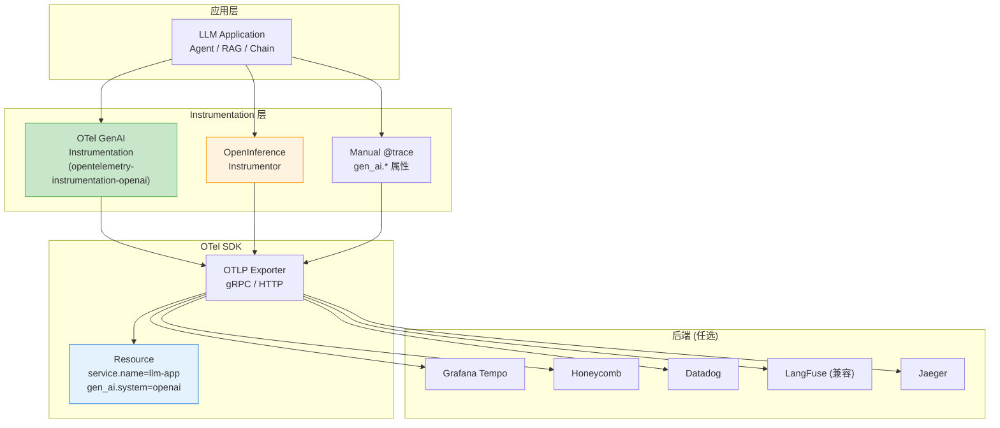

### 20.10.2 OTLP `gen_ai.*` 核心字段

OTel GenAI 语义约定对 LLM 调用进行了标准化建模，常用字段如下：

| 字段 | 类型 | 含义 | 示例 |
|------|------|------|------|
| `gen_ai.system` | string | 模型提供商 | `openai` / `anthropic` / `azure.openai` |
| `gen_ai.request.model` | string | 请求的模型 | `gpt-4o`、`claude-sonnet-4-6` |
| `gen_ai.request.temperature` | double | 采样温度 | `0.7` |
| `gen_ai.request.max_tokens` | int | 输出上限 | `2048` |
| `gen_ai.usage.input_tokens` | int | prompt tokens | `1234` |
| `gen_ai.usage.output_tokens` | int | completion tokens | `512` |
| `gen_ai.usage.cached_input_tokens` | int | 缓存命中的 prompt tokens | `800` |
| `gen_ai.response.finish_reason` | string | 结束原因 | `stop` / `length` / `tool_calls` / `content_filter` |
| `gen_ai.response.model` | string | 实际响应模型（与请求可能不同） | `gpt-4o-2024-08-06` |
| `gen_ai.response.id` | string | Provider 响应 ID | `chatcmpl-abc123` |
| `gen_ai.tool.name` | string | Tool Call 工具名 | `search_knowledge_base` |
| `gen_ai.tool.call.id` | string | 工具调用 ID | `call_xyz` |
| `gen_ai.evaluation.score` | double | 评估器打分 | `0.92` |
| `gen_ai.evaluation.name` | string | 评估器名 | `hallucination_judge` / `relevance` |
| `gen_ai.retrieval.hit` | boolean | RAG 检索是否命中 | `true` |
| `gen_ai.retrieval.documents` | int | 召回文档数 | `5` |
| `gen_ai.retrieval.score_max` | double | Top-1 相似度 | `0.83` |
| `gen_ai.cost.usd` | double | 单次调用美元成本 | `0.00234` |
| `gen_ai.thinking.budget_tokens` | int | 思考预算（Claude / o-series） | `8192` |
| `gen_ai.thinking.tokens_used` | int | 实际消耗的思考 token | `4231` |

> 💡 **面试金句**：在 2026 年大厂面试中，要求候选人"基于 OTLP `gen_ai.*` 字段设计可观测性方案"已经逐渐替代了"LangSmith 如何使用"这类工具题。

### 20.10.3 代码示例 1：OpenTelemetry SDK + GenAI 语义约定

```python
"""
20.10.3 - OpenTelemetry GenAI 语义约定完整配置
- 自动注入 gen_ai.* 属性
- 手动附加 finish_reason、tool_calls、judge_scores
- 通过 OTLP gRPC 导出到 Tempo / Honeycomb
"""
import os
from opentelemetry import trace, metrics
from opentelemetry.sdk.resources import Resource, SERVICE_NAME, SERVICE_VERSION
from opentelemetry.sdk.trace import TracerProvider
from opentelemetry.sdk.trace.export import BatchSpanProcessor
from opentelemetry.exporter.otlp.proto.grpc.trace_exporter import OTLPSpanExporter
from opentelemetry.exporter.otlp.proto.grpc.metric_exporter import OTLPMetricExporter
from opentelemetry.sdk.metrics import MeterProvider, Counter, Histogram
from opentelemetry.semconv.resource import ResourceAttributes
from opentelemetry.semconv.gen_ai import (
    GenAiAttributes,
    GenAiOperationNameValues,
)

# ---------- 1. Resource：服务身份 ----------
resource = Resource.create(
    {
        SERVICE_NAME: "qa-agent-prod",
        SERVICE_VERSION: "v2.3.0",
        ResourceAttributes.DEPLOYMENT_ENVIRONMENT: "production",
        # 标识 LLM 系统
        GenAiAttributes.GEN_AI_SYSTEM: "openai",
    }
)

# ---------- 2. Tracer Provider + OTLP Exporter ----------
provider = TracerProvider(resource=resource)
otlp_exporter = OTLPSpanExporter(
    endpoint=os.getenv("OTEL_EXPORTER_OTLP_ENDPOINT", "http://tempo:4317"),
    headers={"x-api-key": os.getenv("OTEL_API_KEY", "")},
    # 可选：启用 gzip 压缩降低网络开销
    # compression=Compression.Gzip,
)
provider.add_span_processor(BatchSpanProcessor(otlp_exporter))
trace.set_tracer_provider(provider)
tracer = trace.get_tracer("qa-agent.instrumentation", "1.0.0")

# ---------- 3. Meter Provider：成本 / Token / 延迟指标 ----------
meter_provider = MeterProvider(
    resource=resource,
    metric_readers=[
        OTLPMetricExporter(
            endpoint=os.getenv("OTEL_EXPORTER_OTLP_ENDPOINT", "http://tempo:4317")
        )
    ],
)
metrics.set_meter_provider(meter_provider)
meter = metrics.get_meter("qa-agent.metrics")

# 三大核心指标
llm_cost_histogram = meter.create_histogram(
    name="gen_ai.cost.usd",
    unit="usd",
    description="LLM 调用成本（USD）",
)
llm_input_token_counter = meter.create_counter(
    name="gen_ai.usage.input_tokens",
    unit="tokens",
    description="Prompt Token 用量",
)
llm_output_token_counter = meter.create_counter(
    name="gen_ai.usage.output_tokens",
    unit="tokens",
    description="Completion Token 用量",
)


# ---------- 4. 业务封装：自动附加 gen_ai.* 属性 ----------
class GenAITelemetry:
    def __init__(self, tracer, meter):
        self.tracer = tracer
        self.meter = meter

    def record_llm_call(
        self,
        model: str,
        prompt: str,
        response_text: str,
        input_tokens: int,
        output_tokens: int,
        cost_usd: float,
        finish_reason: str,
        cached_input_tokens: int = 0,
        thinking_budget_tokens: int | None = None,
        thinking_tokens_used: int | None = None,
        tool_calls: list[dict] | None = None,
        retrieval: dict | None = None,
        judge_scores: dict[str, float] | None = None,
        user_id: str | None = None,
        trajectory_id: str | None = None,
    ) -> None:
        """记录一次 LLM 调用，自动写满 OTel GenAI 语义约定。"""
        with self.tracer.start_as_current_span(
            f"{GenAiOperationNameValues.CHAT.value} {model}",
            kind=trace.SpanKind.CLIENT,
        ) as span:
            # ---- 请求侧属性 ----
            span.set_attribute(GenAiAttributes.GEN_AI_OPERATION_NAME, "chat")
            span.set_attribute(GenAiAttributes.GEN_AI_REQUEST_MODEL, model)
            span.set_attribute(GenAiAttributes.GEN_AI_REQUEST_TEMPERATURE, 0.7)
            span.set_attribute(GenAiAttributes.GEN_AI_REQUEST_MAX_TOKENS, 2048)

            # ---- 响应侧属性 ----
            span.set_attribute(GenAiAttributes.GEN_AI_RESPONSE_MODEL, model)
            span.set_attribute(GenAiAttributes.GEN_AI_RESPONSE_FINISH_REASONS, [finish_reason])

            # ---- Token 与成本 ----
            span.set_attribute(GenAiAttributes.GEN_AI_USAGE_INPUT_TOKENS, input_tokens)
            span.set_attribute(GenAiAttributes.GEN_AI_USAGE_OUTPUT_TOKENS, output_tokens)
            if cached_input_tokens:
                span.set_attribute(
                    GenAiAttributes.GEN_AI_USAGE_CACHED_INPUT_TOKENS, cached_input_tokens
                )
            span.set_attribute(GenAiAttributes.GEN_AI_COST_USD, cost_usd)

            # ---- 思考预算（Claude / o-series）----
            if thinking_budget_tokens is not None:
                span.set_attribute(
                    GenAiAttributes.GEN_AI_THINKING_BUDGET_TOKENS, thinking_budget_tokens
                )
            if thinking_tokens_used is not None:
                span.set_attribute(
                    GenAiAttributes.GEN_AI_THINKING_TOKENS_USED, thinking_tokens_used
                )

            # ---- Tool Calls ----
            for idx, tc in enumerate(tool_calls or []):
                span.set_attribute(f"gen_ai.tool.name.{idx}", tc.get("name", ""))
                span.set_attribute(f"gen_ai.tool.call.id.{idx}", tc.get("id", ""))
                span.set_attribute(f"gen_ai.tool.arguments.{idx}", str(tc.get("arguments", {}))[:512])

            # ---- RAG 检索 ----
            if retrieval:
                span.set_attribute(GenAiAttributes.GEN_AI_RETRIEVAL_HIT, retrieval.get("hit", False))
                span.set_attribute(
                    GenAiAttributes.GEN_AI_RETRIEVAL_DOCUMENTS, retrieval.get("documents", 0)
                )
                if "score_max" in retrieval:
                    span.set_attribute(
                        GenAiAttributes.GEN_AI_RETRIEVAL_SCORE_MAX, retrieval["score_max"]
                    )

            # ---- Judge 评估分数 ----
            if judge_scores:
                for name, score in judge_scores.items():
                    span.set_attribute(f"gen_ai.evaluation.{name}", score)
                    # 也写为 Span Event（便于聚合）
                    span.add_event(
                        "evaluation",
                        attributes={
                            "gen_ai.evaluation.name": name,
                            "gen_ai.evaluation.score": score,
                        },
                    )

            # ---- 业务标识 ----
            if user_id:
                span.set_attribute("enduser.id", user_id)
            if trajectory_id:
                span.set_attribute("gen_ai.agent.trajectory_id", trajectory_id)

            # ---- 指标记录 ----
            common_attrs = {
                "gen_ai.system": "openai",
                "gen_ai.response.model": model,
            }
            llm_cost_histogram.record(cost_usd, attributes=common_attrs)
            llm_input_token_counter.add(input_tokens, attributes=common_attrs)
            llm_output_token_counter.add(output_tokens, attributes=common_attrs)


# ---------- 5. 使用示例 ----------
telemetry = GenAITelemetry(tracer, meter)

telemetry.record_llm_call(
    model="claude-sonnet-4-6",
    prompt="Explain quantum entanglement in 3 sentences.",
    response_text="Quantum entanglement is ...",
    input_tokens=128,
    output_tokens=87,
    cost_usd=0.001342,
    finish_reason="end_turn",
    cached_input_tokens=64,
    thinking_budget_tokens=2048,
    thinking_tokens_used=512,
    tool_calls=[
        {"name": "search_web", "id": "toolu_01A", "arguments": {"query": "entanglement"}}
    ],
    retrieval={"hit": True, "documents": 5, "score_max": 0.87},
    judge_scores={"relevance": 0.92, "factuality": 0.88, "conciseness": 0.75},
    user_id="u_12345",
    trajectory_id="traj-abc-001",
)
```

### 20.10.4 代码示例 2：OpenInference + OTLP 双规范导出

OpenInference 在 RAG / Agent 场景下提供更细粒度的 SpanKind，二者可以并存导出：

```python
"""
20.10.4 - OpenInference + OpenTelemetry 双规范
- SpanKind: CHAIN / LLM / RETRIEVER / TOOL / AGENT / EMBEDDING
- 通过 OTelSpanExporter 统一导出到 OTLP 后端
"""
from openinference.instrumentation.langchain import LangChainInstrumentor
from openinference.instrumentation.openai import OpenAIInstrumentor
from openinference.semconv.trace import (
    SpanAttributes,
    OpenInferenceSpanKindValues,
)
from opentelemetry import trace
from opentelemetry.exporter.otlp.proto.grpc.trace_exporter import OTLPSpanExporter
from opentelemetry.sdk.trace import TracerProvider
from opentelemetry.sdk.trace.export import BatchSpanProcessor
from opentelemetry.sdk.resources import Resource
from opentelemetry.semconv.resource import ResourceAttributes

# 1. 初始化 OTel Provider
resource = Resource.create(
    {
        ResourceAttributes.SERVICE_NAME: "rag-qa-service",
        ResourceAttributes.SERVICE_VERSION: "1.4.0",
    }
)
provider = TracerProvider(resource=resource)
provider.add_span_processor(
    BatchSpanProcessor(
        OTLPSpanExporter(endpoint="http://otel-collector:4317")
    )
)
trace.set_tracer_provider(provider)

# 2. 自动 instrument LangChain / OpenAI 调用
LangChainInstrumentor().instrument(tracer_provider=provider)
OpenAIInstrumentor().instrument(tracer_provider=provider)


# 3. 手动记录 RAG 检索 Span（OpenInference RETRIEVER Kind）
def instrument_retrieval(query: str, top_k: int = 5):
    tracer = trace.get_tracer("rag.retriever")
    with tracer.start_as_current_span("vector_search") as span:
        # OpenInference 语义约定
        span.set_attribute(SpanAttributes.OPENINFERENCE_SPAN_KIND, "RETRIEVER")
        span.set_attribute(SpanAttributes.RETRIEVAL_QUERY_TEXT, query)
        span.set_attribute(SpanAttributes.RETRIEVAL_TOP_K, top_k)

        # 业务执行
        docs = vector_store.similarity_search(query, k=top_k)

        # 检索结果属性
        span.set_attribute(SpanAttributes.RETRIEVAL_DOCUMENT_COUNT, len(docs))
        for i, d in enumerate(docs[:3]):  # 写入前3条
            span.set_attribute(
                f"{SpanAttributes.RETRIEVAL_DOCUMENTS}.{i}.document.id", d.metadata["id"]
            )
            span.set_attribute(
                f"{SpanAttributes.RETRIEVAL_DOCUMENTS}.{i}.document.score", d.metadata["score"]
            )
            span.set_attribute(
                f"{SpanAttributes.RETRIEVAL_DOCUMENTS}.{i}.document.content",
                d.page_content[:256],
            )

        # 命中标记（OTel GenAI 也支持）
        span.set_attribute("gen_ai.retrieval.hit", len(docs) > 0)
        if docs:
            span.set_attribute(
                "gen_ai.retrieval.score_max", max(d.metadata["score"] for d in docs)
            )
        return docs


# 4. 手动记录 Agent 决策 Span
def instrument_agent_step(step_name: str, decision: str, observation: str):
    tracer = trace.get_tracer("agent.react")
    with tracer.start_as_current_span(f"agent.{step_name}") as span:
        span.set_attribute(SpanAttributes.OPENINFERENCE_SPAN_KIND, "AGENT")
        span.set_attribute("agent.step.name", step_name)
        span.set_attribute("agent.decision", decision)
        span.set_attribute("agent.observation", observation[:512])
        return decision
```

### 20.10.5 in-prod Eval Pipeline 模式

传统 Eval 是离线跑测试集，**in-prod eval（生产中评估）** 通过 OTLP 把线上 Trace 接入评估 Pipeline，是 2026 年大厂核心实践。

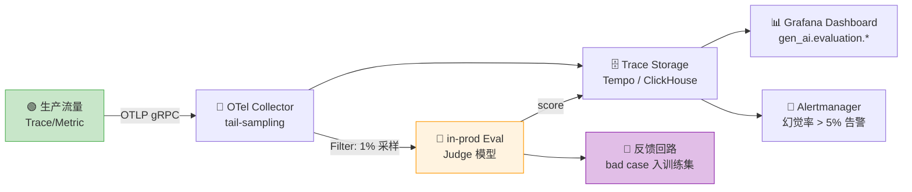

**典型流水线**（伪代码）：

```python
"""
20.10.5 - in-prod Eval Pipeline 模式
- 1% 流量做 Judge 评估
- 评估分数回写 Trace 属性
- 触发 bad case 自动入库
"""
import random
from opentelemetry import trace

JUDGE_PROBABILITY = 0.01  # 1% 流量跑 Judge
tracer = trace.get_tracer("in-prod-eval")

def with_judge(llm_call_span, response_text: str, query: str, ground_truth: str | None = None):
    """在线上 Span 上挂载 Judge 评估"""
    if random.random() > JUDGE_PROBABILITY:
        return None  # 采样外，跳过

    # 调用 Judge 模型（GPT-4o / Claude）评估
    scores = {
        "relevance": judge_relevance(query, response_text),
        "hallucination": judge_hallucination(response_text, ground_truth),
        "helpfulness": judge_helpfulness(query, response_text),
    }

    # 写回 Span（与原始 Span 同 TraceId）
    for name, score in scores.items():
        llm_call_span.set_attribute(f"gen_ai.evaluation.{name}", score)
        llm_call_span.add_event(
            f"judge.{name}",
            attributes={
                "gen_ai.evaluation.name": name,
                "gen_ai.evaluation.score": score,
                "gen_ai.evaluation.judge_model": "gpt-4o",
            },
        )

    # 触发 bad case 入库
    if scores["hallucination"] < 0.3:
        bad_case_queue.put({
            "trace_id": llm_call_span.get_span_context().trace_id,
            "query": query,
            "response": response_text,
            "scores": scores,
        })
    return scores
```

### 20.10.6 成本遥测作为 SLO 维度（Cost Telemetry as SLO）

2026 年业界主流做法是把 **Token × $/Token × Thinking Budget** 作为与延迟并列的 SLO 维度。

**核心公式**：

$$\text{单次成本} = \frac{\text{input\_tokens} \times P_i^{\text{model}} + \text{output\_tokens} \times P_o^{\text{model}} + \text{thinking\_tokens} \times P_t^{\text{model}}}{10^6}$$

**SLI/SLO 模板**：

| SLI | 计算 | SLO 目标 | 维度 |
|-----|------|---------|------|
| **P95 单次成本** | histogram_quantile(0.95, sum by (le) (rate(gen_ai.cost.usd_bucket[5m]))) | ≤ $0.05 | `gen_ai.request.model` |
| **每小时总成本** | sum(increase(gen_ai.cost.usd_sum[1h])) | ≤ $budget | `service.name` |
| **Cost/Request P99** | histogram_quantile(0.99, ...) | ≤ $0.20 | `gen_ai.agent.trajectory_id` |
| **Token 利用率** | output_tokens / (input_tokens + output_tokens) | 0.3 ~ 0.7 | `gen_ai.system` |
| **Thinking Budget 命中率** | 1 - count(thinking_tokens_used >= budget) / count(thinking_budget_tokens > 0) | ≥ 95% | `gen_ai.request.model` |

```yaml
# 20.10.6 - 成本 SLO PrometheusRule 示例
apiVersion: monitoring.coreos.com/v1
kind: PrometheusRule
metadata:
  name: llm-cost-slos
spec:
  groups:
    - name: llm.cost
      interval: 30s
      rules:
        # SLO 1：单次成本 P95
        - alert: LLMCostP95TooHigh
          expr: |
            histogram_quantile(0.95,
              sum by (le, gen_ai_request_model) (
                rate(gen_ai_cost_usd_bucket[5m])
              )
            ) > 0.05
          for: 10m
          labels:
            severity: warning
            slo: cost-p95
          annotations:
            summary: "LLM 单次成本 P95 > $0.05"
            runbook: "https://wiki.example.com/runbook/llm-cost-p95"

        # SLO 2：每用户每小时成本熔断
        - alert: LLMUserCostAnomaly
          expr: |
            sum by (enduser_id) (
              increase(gen_ai_cost_usd_sum[1h])
            ) > 5
          for: 5m
          labels:
            severity: critical
          annotations:
            summary: "用户 {{ $labels.enduser_id }} 1h 成本 > $5"

        # SLO 3：Thinking Budget 命中率
        - record: llm:thinking_budget_hit_ratio
          expr: |
            1 - (
              sum(rate(gen_ai_thinking_tokens_used_count{
                gen_ai_thinking_tokens_used >= gen_ai_thinking_budget_tokens
              }[10m]))
              /
              sum(rate(gen_ai_thinking_budget_tokens_count[10m]))
            )
```

### 20.10.7 Per-Trajectory Cost Attribution（按轨迹成本归因）

Agent 应用的"一次请求"可能是 5-20 次 LLM 调用，需要把成本按 **trajectory（轨迹）** 归因：

```python
"""
20.10.7 - Per-Trajectory 成本归因
- 每次 Agent 任务生成唯一 trajectory_id
- 所有子 Span 携带 trajectory_id 属性
- 在 Tempo / Grafana 按 trajectory_id 聚合成本
"""
from contextlib import contextmanager
from opentelemetry import trace
from opentelemetry.trace import Status, StatusCode
import uuid

class TrajectoryCostTracker:
    def __init__(self):
        self.tracer = trace.get_tracer("agent.trajectory")

    @contextmanager
    def trajectory(self, user_query: str, agent_name: str = "react-agent"):
        """开启一条 Trajectory，所有子 Span 自动归因"""
        trajectory_id = f"traj-{uuid.uuid4().hex[:12]}"
        with self.tracer.start_as_current_span(
            f"trajectory.{agent_name}",
            attributes={
                "gen_ai.agent.name": agent_name,
                "gen_ai.agent.trajectory_id": trajectory_id,
                "gen_ai.agent.user_query": user_query[:256],
            },
        ) as root:
            cost_attrs = {"gen_ai.agent.trajectory_id": trajectory_id}
            try:
                yield trajectory_id, cost_attrs
                root.set_status(Status(StatusCode.OK))
            except Exception as e:
                root.set_status(Status(StatusCode.ERROR, str(e)))
                root.record_exception(e)
                raise

    def attribute_subspan(self, span, trajectory_id: str):
        """给子 Span 注入 trajectory_id"""
        span.set_attribute("gen_ai.agent.trajectory_id", trajectory_id)

    def cost_summary(self, trajectory_id: str, spans: list) -> dict:
        """汇总单条 Trajectory 的成本"""
        total_cost = 0.0
        total_input = 0
        total_output = 0
        total_thinking = 0
        llm_calls = 0
        tool_calls = 0

        for s in spans:
            if s.attributes.get("gen_ai.agent.trajectory_id") != trajectory_id:
                continue
            if s.attributes.get("openinference.span.kind") == "LLM":
                llm_calls += 1
                total_cost += s.attributes.get("gen_ai.cost.usd", 0)
                total_input += s.attributes.get("gen_ai.usage.input_tokens", 0)
                total_output += s.attributes.get("gen_ai.usage.output_tokens", 0)
                total_thinking += s.attributes.get("gen_ai.thinking.tokens_used", 0)
            elif s.attributes.get("openinference.span.kind") == "TOOL":
                tool_calls += 1

        return {
            "trajectory_id": trajectory_id,
            "llm_calls": llm_calls,
            "tool_calls": tool_calls,
            "total_cost_usd": round(total_cost, 6),
            "total_input_tokens": total_input,
            "total_output_tokens": total_output,
            "total_thinking_tokens": total_thinking,
            "cost_breakdown": {
                "input": round(total_input / 1e6 * 3.0, 6),    # 假设 $3/M
                "output": round(total_output / 1e6 * 15.0, 6),  # 假设 $15/M
                "thinking": round(total_thinking / 1e6 * 15.0, 6),
            },
        }


# 使用示例
tracker = TrajectoryCostTracker()

with tracker.trajectory("帮我写一个 Python 装饰器") as (traj_id, cost_attrs):
    # 第 1 步 LLM 调用
    telemetry.record_llm_call(
        model="claude-sonnet-4-6",
        ...,
        trajectory_id=traj_id,
    )
    # 第 2 步 Tool 调用
    span = tracer.start_span("tool.search_docs")
    tracker.attribute_subspan(span, traj_id)
    # ...
    # 第 3 步 LLM 调用
    telemetry.record_llm_call(
        model="claude-haiku-4-5",  # 降级到小模型
        ...,
        trajectory_id=traj_id,
    )
```

### 20.10.8 Thinking-Budget SLO（思考预算 SLO）

Claude（`thinking.budget_tokens`）与 OpenAI o-series（`reasoning_effort`）都引入了"思考预算"机制，但容易出现"思考爆炸"问题（thinking_tokens >> output_tokens）。需要专门的 SLO 监控：

```python
"""
20.10.8 - Thinking Budget SLO 监控
- 跟踪 thinking_tokens_used / thinking_budget_tokens
- 当 thinking_used ≥ budget 时判定为"思考超限"
- 当 thinking_used 远小于 budget 时判定为"预算浪费"
"""
from opentelemetry import metrics, trace
from opentelemetry.semconv.gen_ai import GenAiAttributes

meter = metrics.get_meter("thinking-budget-slo")

# 三个核心指标
thinking_usage_hist = meter.create_histogram(
    "gen_ai.thinking.tokens_used",
    unit="tokens",
    description="实际使用的思考 token",
)
thinking_budget_hist = meter.create_histogram(
    "gen_ai.thinking.budget_tokens",
    unit="tokens",
    description="设定的思考预算",
)
thinking_overshoot_counter = meter.create_counter(
    "gen_ai.thinking.overshoot",
    unit="count",
    description="思考超限次数（used >= budget）",
)
thinking_waste_counter = meter.create_counter(
    "gen_ai.thinking.underuse",
    unit="count",
    description="思考预算浪费次数（used < 0.3 * budget）",
)


def record_thinking_usage(
    model: str,
    budget_tokens: int,
    used_tokens: int,
    span: trace.Span,
):
    """记录一次思考预算使用情况"""
    attrs = {"gen_ai.request.model": model}

    thinking_usage_hist.record(used_tokens, attributes=attrs)
    thinking_budget_hist.record(budget_tokens, attributes=attrs)

    utilization = used_tokens / max(budget_tokens, 1)
    span.set_attribute("gen_ai.thinking.utilization_ratio", round(utilization, 3))

    # SLO 判定
    if utilization >= 1.0:
        thinking_overshoot_counter.add(1, attributes=attrs)
        span.set_attribute("gen_ai.thinking.slo_status", "overshoot")
    elif utilization < 0.3:
        thinking_waste_counter.add(1, attributes=attrs)
        span.set_attribute("gen_ai.thinking.slo_status", "waste")
    else:
        span.set_attribute("gen_ai.thinking.slo_status", "healthy")
```

**SLO 指标**：

| 指标 | 计算 | 推荐目标 |
|------|------|---------|
| **Overshoot Rate** | overshoot / total | ≤ 5% |
| **Waste Rate** | underuse / total | ≤ 15% |
| **Median Utilization** | histogram_quantile(0.5, utilization_ratio) | 0.5 ~ 0.8 |

### 20.10.9 Cascade / Router 模型成本模式

Cascade Router（级联路由器）先用便宜模型，复杂 case 升级到贵模型。需要**分段成本监控**：

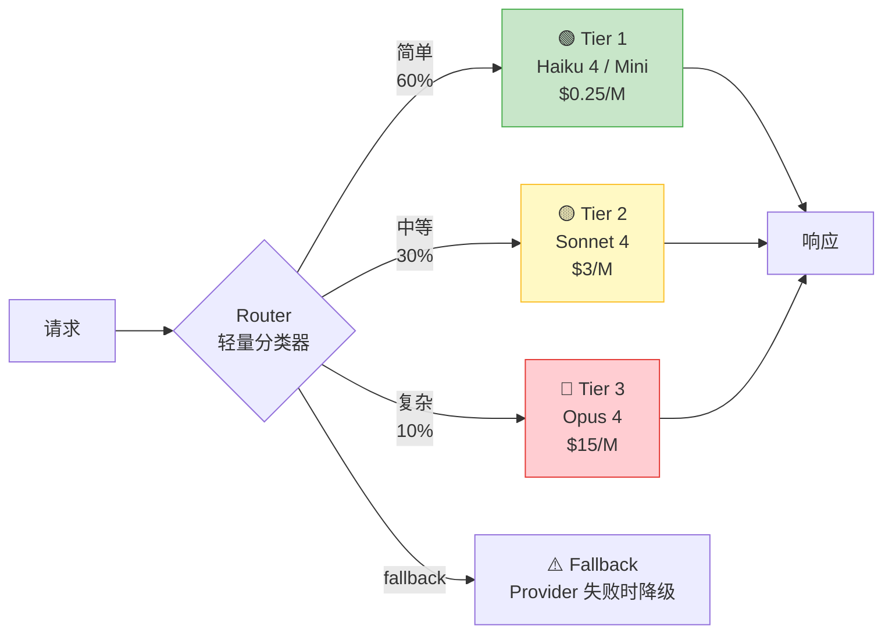

**关键 OTLP 属性**：

```python
"""
20.10.9 - Cascade Router 成本模式
- gen_ai.router.tier 标识路由层
- gen_ai.router.upgrade_reason 记录升级原因
"""
def cascade_route(query: str, complexity: float) -> str:
    """三档 Cascade Router"""
    span = trace.get_current_span()
    span.set_attribute("gen_ai.router.query_complexity", complexity)

    if complexity < 0.3:
        span.set_attribute("gen_ai.router.tier", "tier_1_cheap")
        span.set_attribute("gen_ai.router.cost_per_1m_input", 0.25)
        return "claude-haiku-4-5"
    elif complexity < 0.7:
        span.set_attribute("gen_ai.router.tier", "tier_2_mid")
        span.set_attribute("gen_ai.router.cost_per_1m_input", 3.0)
        return "claude-sonnet-4-6"
    else:
        span.set_attribute("gen_ai.router.tier", "tier_3_premium")
        span.set_attribute("gen_ai.router.cost_per_1m_input", 15.0)
        return "claude-opus-4-6"


def record_upgrade(original_tier: str, upgraded_tier: str, reason: str):
    """记录级联升级事件"""
    span = trace.get_current_span()
    span.add_event(
        "cascade.upgrade",
        attributes={
            "gen_ai.router.from_tier": original_tier,
            "gen_ai.router.to_tier": upgraded_tier,
            "gen_ai.router.upgrade_reason": reason,  # low_confidence / tool_error / etc
            "gen_ai.router.cost_delta_usd": compute_cost_delta(original_tier, upgraded_tier),
        },
    )
```

**SLO 关注点**：

| 关注点 | 公式 | 目标 |
|--------|------|------|
| **Tier 1 命中率** | count(tier=1) / total | ≥ 55% |
| **升级率** | count(upgrade) / total | ≤ 20% |
| **加权成本** | Σ(tier_cost × tier_traffic) | ≤ target_blend_cost |

### 20.10.10 Agent 回滚策略（Agent Rollback）

Agent 应用相比传统应用，回滚挑战更大：可能涉及 Prompt 模板、Tool 定义、规划策略的多版本组合。**2026 年最佳实践是基于 GenAI 语义约定的多层回滚**：

```python
"""
20.10.10 - Agent 多层回滚策略
- Level 1：流量回切（秒级）
- Level 2：Prompt 版本回滚（分钟级）
- Level 3：Tool 白名单回滚（分钟级）
- Level 4：模型版本回滚（分钟级）
"""
from enum import Enum
from opentelemetry import trace

class RollbackLevel(Enum):
    TRAFFIC_SHIFT = 1        # 切回旧版本实例
    PROMPT_VERSION = 2       # 回滚 Prompt 到上一个稳定版
    TOOL_ALLOWLIST = 3       # 禁用高风险工具
    MODEL_VERSION = 4        # 回滚到上一版本模型


class AgentRollbackController:
    def __init__(self, otlp_exporter):
        self.tracer = trace.get_tracer("agent.rollback")
        self.exporter = otlp_exporter

    def detect_rollback_signal(self, span: trace.Span, signal: str, severity: float):
        """检测回滚信号，写入 Span Event"""
        span.add_event(
            "rollback.signal",
            attributes={
                "rollback.signal.name": signal,  # hallucination_spike / tool_error_rate / cost_overrun
                "rollback.signal.severity": severity,
            },
        )

    def execute_rollback(
        self,
        level: RollbackLevel,
        reason: str,
        target_version: str | None = None,
    ) -> dict:
        """执行多层回滚"""
        with self.tracer.start_as_current_span(f"rollback.{level.name}") as span:
            span.set_attribute("rollback.level", level.value)
            span.set_attribute("rollback.reason", reason)
            span.set_attribute("rollback.target_version", target_version or "")

            if level == RollbackLevel.TRAFFIC_SHIFT:
                # 切流量到旧版本（Kubernetes/Service Mesh）
                action = self._shift_traffic_to_old()
            elif level == RollbackLevel.PROMPT_VERSION:
                action = self._rollback_prompt_version(target_version)
            elif level == RollbackLevel.TOOL_ALLOWLIST:
                action = self._disable_risky_tools([
                    "send_email", "execute_code", "delete_file"
                ])
            elif level == RollbackLevel.MODEL_VERSION:
                action = self._rollback_model_version(target_version)
            else:
                action = "noop"

            span.set_attribute("rollback.action", action)
            return {"level": level.value, "action": action, "reason": reason}

    def _shift_traffic_to_old(self) -> str:
        return "k8s_traffic_shifted_to_v2.2.0"

    def _rollback_prompt_version(self, version: str) -> str:
        return f"prompt_registry_rollback_to_{version}"

    def _disable_risky_tools(self, tools: list) -> str:
        return f"tool_allowlist_disabled: {','.join(tools)}"

    def _rollback_model_version(self, version: str) -> str:
        return f"model_pinned_to_{version}"


# SLO 联动：自动回滚触发
def cost_overrun_auto_rollback(controller, current_cost_per_hour: float, budget_per_hour: float):
    """当 1h 成本超预算 1.5x 时自动触发回滚"""
    if current_cost_per_hour > budget_per_hour * 1.5:
        controller.execute_rollback(
            level=RollbackLevel.TRAFFIC_SHIFT,
            reason=f"cost_overrun:{current_cost_per_hour:.2f}>{budget_per_hour:.2f}*1.5",
            target_version="v2.2.0",  # 上一稳定版
        )
```

**回滚决策表**：

| 触发条件 | 等级 | 响应时间 | 目标版本 |
|---------|------|---------|---------|
| 错误率 > 5% | L1 Traffic | 30s | 上一 stable |
| Hallucination Score < 0.5 | L2 Prompt | 2min | 上一版 Prompt |
| 工具调用错误 > 10% | L3 Tool Allowlist | 1min | 仅白名单工具 |
| 模型 P99 latency > 10s | L4 Model | 2min | 上一版模型 |

### 20.10.11 面试实战建议

**Q1：你们团队如何统一 LLM 可观测性的字段？**
- 答：使用 OTel GenAI 语义约定（`gen_ai.*`），所有 LLM 调用强制注入 `gen_ai.usage.input_tokens` / `output_tokens` / `cost.usd` / `response.finish_reasons`，同时通过 `gen_ai.agent.trajectory_id` 关联 Agent 轨迹。配合 OpenInference 的 `SpanKind`（LLM/RETRIEVER/TOOL/AGENT）做 RAG/Agent 场景细分。

**Q2：成本 SLO 怎么设？**
- 答：把"单次调用成本 P95"和"每小时总成本"作为硬 SLO（写进 PrometheusRule 告警），把"Cost/Request P99"和"Thinking Budget 命中率"作为软 SLO（写进 Grafana Dashboard），用 burn-rate alert 防止成本爆炸。

**Q3：Cascade Router 怎么监控？**
- 答：每条 Span 写 `gen_ai.router.tier`（tier_1/tier_2/tier_3）和 `gen_ai.router.upgrade_reason`（low_confidence/tool_error/length_limit），计算"加权平均成本"和"升级率"两个关键指标，用这两个指标反推路由策略是否需要调优。

**Q4：Agent 应用如何回滚？**
- 答：采用 4 级回滚（流量切回 → Prompt 版本 → 工具白名单 → 模型版本），每级都基于 OTLP Span 事件触发，自动联动 SLO 告警。Prompt 版本通过 LangFuse Prompt Registry 或自建 Registry 管理，每次发布记录 trace_id 便于追溯。

---

## 20.9 本章小结

本章系统讲解了 LLMOps 与模型可观测性的核心知识体系：

- **20.1 LLMOps 全景概述**：MLOps 与 LLMOps 的核心区别在于管理对象从"模型"变为"Prompt 驱动的智能应用"；LLMOps 能力成熟度模型从 L0（手工）到 L4（智能化）。
- **20.2 实验追踪**：MLflow 的核心抽象（Experiment/Run/Artifact）在 LLM 场景同样适用；W&B 对 LLM 的原生支持更强。
- **20.3 LLM可观测性**：LangSmith 的 Trace/Run/Feedback 三层抽象是当前行业标准；LangFuse 作为开源替代在 2026 年快速崛起。
- **20.4 Prompt 版本管理与A/B测试**：Prompt 版本控制是 LLMOps 特有的挑战；A/B 测试需要兼顾统计显著性和 Guardrail 指标。
- **20.5 成本监控与Token计量**：Token 成本管理是 LLM 应用运维的核心；六大优化策略覆盖从缓存到模型降级的全方案。
- **20.6 模型监控与告警**：四维监控体系（金指标/LLM特有/质量/基础设施）；数据漂移检测从特征空间转向 Embedding 空间。
- **20.7 CI/CD**：自动化评估门禁是 LLM CI/CD 的核心；金丝雀发布配合自动回滚保障生产安全。

## 📚 相关章节

- [[13_Prompt_Engineering]] — Prompt 设计的最佳实践
- [[14_RAG检索增强生成]] — RAG 系统的可观测性
- [[15_Agent智能体开发]] — Agent 的调试与监控
- [[16_模型微调与推理优化]] — 模型部署方案的监控指标
- [[25_推理引擎与高性能服务]] — vLLM/SGLang 推理引擎的 Prometheus 指标
- [[29_Context_Engineering]] — Token 成本与 Context Rot 监控
- [[28_端侧与边缘LLM]] — 端侧 LLM 的监控与可观测性挑战
