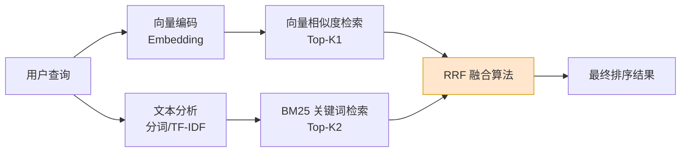
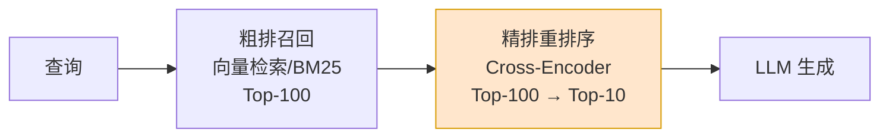
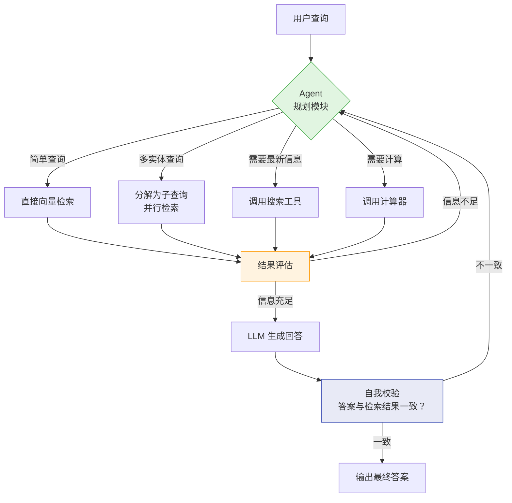

# 第 20 章 RAG 检索、重排与高级方法 ⭐⭐⭐⭐
> [!abstract] 本章导航
> **定位**：第三部分 Prompt、Context 与 RAG中的第 20 章；围绕“RAG 检索、重排与高级方法”建立单一、可追踪的知识主线。
>
> **先修**：[[19_RAG数据解析分块与索引|第 19 章 RAG 数据解析、分块与索引]]。
>
> **学习目标**：
> - 解释 检索与重排序 ⭐⭐⭐⭐⭐ 的核心问题、机制与适用边界。
> - 实现或评估 高级 RAG 技术 ⭐⭐⭐⭐ 的最小闭环。
> - 使用可复现证据诊断 高级 RAG 技术 ⭐⭐⭐⭐ 的工程取舍与失败模式。
>
> **建议路径**：检索与重排序 ⭐⭐⭐⭐⭐ → 高级 RAG 技术 ⭐⭐⭐⭐。
>
> **配套代码**：`code/ch19_rag_indexing/`。

本章先回答“检索与重排序 ⭐⭐⭐⭐⭐”为什么成立，再沿着机制、实现、评估和边界逐步展开。阅读时先建立因果链，再运行或推演示例，最后用章末自测检查能否脱离原文复述。
## 20.1 检索与重排序 ⭐⭐⭐⭐⭐

### 20.1.1 混合搜索（Hybrid Search）⭐⭐⭐⭐⭐

纯向量检索在以下场景表现不佳：
- **精确匹配需求**：ID、型号、人名、缩写（如 `"gpt-5.6"`、`"iPhone 15"`）
- **罕见词/专业术语**：向量可能无法很好表示低频词
- **数字/日期**：语义相似但数值不同（如"2023年"和"2024年"向量可能很近）

**混合搜索 = 稠密检索（向量相似度）+ 稀疏检索（BM25/关键词）**



#### 20.1.1.1 BM25 原理

BM25 是经典的关键词匹配评分函数：

$$
\text{BM25}(q, d) = \sum_{t \in q} \text{IDF}(t) \cdot \frac{f(t, d) \cdot (k_1 + 1)}{f(t, d) + k_1 \cdot (1 - b + b \cdot \frac{|d|}{\text{avgdl}})}
$$

其中：
- $f(t, d)$：词项 $t$ 在文档 $d$ 中的词频
- $\text{IDF}(t) = \log \frac{N - n(t) + 0.5}{n(t) + 0.5}$：逆文档频率
- $k_1$：控制词频饱和度（通常 1.2-2.0）
- $b$：控制文档长度归一化（通常 0.75）

```python
# 混合搜索实现
from rank_bm25 import BM25Okapi
import numpy as np

class HybridRetriever:
    """
    混合检索器：向量相似度 + BM25 融合
    """

    def __init__(self, documents: list[str], embeddings: np.ndarray, k1: float = 1.5, b: float = 0.75):
        self.documents = documents
        self.embeddings = embeddings  # 向量 [N, D]

        # BM25 初始化
        tokenized_docs = [doc.lower().split() for doc in documents]
        self.bm25 = BM25Okapi(tokenized_docs, k1=k1, b=b)

        # 向量检索用 FAISS
        import faiss
        self.dim = embeddings.shape[1]
        self.index = faiss.IndexFlatIP(self.dim)  # Inner Product = 余弦（已归一化）
        self.index.add(embeddings)

    def search(
        self,
        query: str,
        query_embedding: np.ndarray,
        top_k: int = 10,
        alpha: float = 0.5,  # 向量权重
        beta: float = 0.5,   # BM25 权重
    ) -> list[tuple[int, float]]:
        """
        混合搜索 + RRF 融合

        Args:
            alpha: 向量检索的融合权重
            beta: BM25 检索的融合权重
        """
        # 向量检索 Top-K
        vector_scores, vector_indices = self.index.search(
            query_embedding.reshape(1, -1), k=min(top_k * 2, len(self.documents))
        )
        vector_scores = vector_scores[0]
        vector_indices = vector_indices[0]

        # BM25 检索 Top-K
        tokenized_query = query.lower().split()
        bm25_scores = np.array(self.bm25.get_scores(tokenized_query))
        bm25_top_indices = np.argsort(bm25_scores)[::-1][:top_k * 2]

        # RRF（Reciprocal Rank Fusion）融合
        # RRF 公式：score = sum(1 / (k + rank))，k 通常为 60
        rrf_k = 60
        rrf_scores = {}

        # 向量检索排名贡献
        for rank, idx in enumerate(vector_indices):
            if idx < 0:  # FAISS 返回 -1 表示不够结果
                break
            rrf_scores[idx] = rrf_scores.get(idx, 0) + alpha / (rrf_k + rank + 1)

        # BM25 排名贡献
        for rank, idx in enumerate(bm25_top_indices):
            rrf_scores[idx] = rrf_scores.get(idx, 0) + beta / (rrf_k + rank + 1)

        # 按 RRF 分数排序
        sorted_results = sorted(rrf_scores.items(), key=lambda x: x[1], reverse=True)
        return sorted_results[:top_k]

# 使用
# retriever = HybridRetriever(docs, embeddings)
# results = retriever.search("query text", query_embedding, top_k=5, alpha=0.7, beta=0.3)
```

**RRF（Reciprocal Rank Fusion）公式**：

$$
\text{RRF Score}(d) = \sum_{i} \frac{w_i}{k + \text{rank}_i(d)}
$$

其中 $k=60$ 是平滑常数，$w_i$ 是各检索方法的权重，$\text{rank}_i(d)$ 是文档 $d$ 在第 $i$ 个检索结果中的排名。

### 20.1.2 Re-ranking（重排序）⭐⭐⭐⭐⭐

初次检索（召回阶段）追求**速度快、召回率高**，但精度有限。Re-ranking 用更精确的模型对 Top-K 结果重新排序。



**为什么需要两阶段？**

| 阶段 | 模型 | 复杂度 | 候选数 | 目标 |
|------|------|--------|--------|------|
| **召回（Retrieval）** | Bi-Encoder / Embedding | $O(N)$，可索引 | 万~百万 | 快速缩小范围 |
| **精排（Re-ranking）** | Cross-Encoder | $O(K \times L)$，需逐对计算 | 百级别 | 精确排序 |

**Bi-Encoder vs Cross-Encoder**：

```python
# Bi-Encoder：分别编码查询和文档，点积计算相似度
# 优点：可预先计算文档向量，搜索速度快
# 缺点：查询和文档没有交互，精度有限

query_embedding = bi_encoder.encode("什么是 RAG？")   # [768]
doc_embedding = bi_encoder.encode("RAG 是一种将检索和生成结合的技术...")  # [768]
similarity = np.dot(query_embedding, doc_embedding)  # 标量

# Cross-Encoder：将查询和文档拼接后一起编码
# 优点：查询和文档在注意力层充分交互，精度高
# 缺点：无法预计算，每次都要完整前向传播

pair_input = "[CLS] 什么是 RAG？ [SEP] RAG 是一种将检索和生成结合的技术..."
score = cross_encoder.predict(pair_input)  # 相关性分数 [0, 1]
```

```python
# Cross-Encoder Re-ranking 实战
from sentence_transformers import CrossEncoder

class Reranker:
    """Cross-Encoder 重排序器"""

    def __init__(self, model_name: str = "BAAI/bge-reranker-large"):
        """
        推荐模型：
        - BAAI/bge-reranker-large：中文场景首选
        - BAAI/bge-reranker-base：速度优先
        - cross-encoder/ms-marco-MiniLM-L-6-v2：英文场景
        """
        self.model = CrossEncoder(model_name)

    def rerank(self, query: str, documents: list[str], top_k: int = 5) -> list[tuple[str, float]]:
        """
        对候选文档进行重排序

        Args:
            query: 用户查询
            documents: 召回的候选文档列表
            top_k: 返回 Top-K

        Returns:
            [(文档, 重排序分数), ...]
        """
        # 构造 (query, doc) 对
        pairs = [(query, doc) for doc in documents]

        # Cross-Encoder 打分（会内部进行 batch 处理）
        scores = self.model.predict(pairs)

        # 按分数排序
        scored_docs = list(zip(documents, scores))
        scored_docs.sort(key=lambda x: x[1], reverse=True)

        return scored_docs[:top_k]

# 完整 RAG Pipeline 集成 Re-ranking
class AdvancedRAG:
    """带混合搜索 + 重排序的 Advanced RAG"""

    def __init__(self, vectorstore, retriever, reranker, llm_client):
        self.vectorstore = vectorstore
        self.retriever = retriever      # 混合检索器
        self.reranker = reranker        # Cross-Encoder 重排序
        self.llm = llm_client

    def query(self, question: str, recall_k: int = 20, final_k: int = 5) -> dict:
        # Step 1: 混合检索，召回更多候选
        query_embedding = get_embedding(question)
        recalled = self.retriever.search(
            question, query_embedding, top_k=recall_k
        )
        candidate_docs = [self.retriever.documents[i] for i, _ in recalled]

        # Step 2: Cross-Encoder 重排序
        reranked = self.reranker.rerank(question, candidate_docs, top_k=final_k)

        # Step 3: 取 Top 文档构建上下文
        context = "\n\n---\n\n".join([
            f"[相关度 {score:.3f}] {doc[:500]}"
            for doc, score in reranked
        ])

        # Step 4: LLM 生成
        prompt = f"""基于以下检索结果回答问题：

{context}

---

问题：{question}

请给出准确、简洁的回答。"""

        response = self.llm.chat.completions.create(
            model=OPENAI_MODEL,
            messages=[{"role": "user", "content": prompt}],
            temperature=0.3,
            **OPENAI_CHAT_KWARGS,
        )

        return {
            "answer": response.choices[0].message.content,
            "sources": reranked,
            "recall_count": len(recalled),
        }
```

### 20.1.3 Query Rewriting（查询重写）⭐⭐⭐⭐

用户原始查询往往不完美，Query Rewriting 通过改写查询来提升检索效果。

```python
# Query Rewriting 策略

# 1. 同义词扩展
REWRITE_TEMPLATE_SYNONYM = """
将用户查询扩展为多个语义等价的查询，覆盖不同表达方式。

用户查询：{query}

请输出 3 个语义等价但表述不同的查询（每行一个，不要编号）：
"""

# 2. 伪文档扩展（HyDE - Hypothetical Document Embedding）
REWRITE_TEMPLATE_HYDE = """
请根据用户查询，生成一段可能包含答案的理想文档片段。
这段文档将用于语义检索，请尽可能包含相关的关键词和概念。

用户查询：{query}

理想文档片段：
"""

# 3. 子查询分解（用于复杂多步问题）
REWRITE_TEMPLATE_SUBQUERY = """
将复杂查询分解为多个简单子查询。

复杂查询：{query}

请分解为 2-3 个可以独立回答的子查询（每行一个）：
"""

# HyDE 实现
class HyDERewriter:
    """
    HyDE（Hypothetical Document Embedding）：
    用 LLM 生成假想的理想文档，然后用这个文档的 Embedding 去检索
    核心洞察：生成文档的 Embedding 比查询 Embedding 更"丰富"
    """

    def __init__(self, llm_client, embedder):
        self.llm = llm_client
        self.embedder = embedder

    def rewrite(self, query: str) -> np.ndarray:
        # 生成假想文档
        prompt = REWRITE_TEMPLATE_HYDE.format(query=query)
        response = self.llm.chat.completions.create(
            model=OPENAI_MODEL,
            messages=[{"role": "user", "content": prompt}],
            temperature=0.7,
            **OPENAI_CHAT_KWARGS,
        )
        hypothetical_doc = response.choices[0].message.content

        # 返回假想文档的 Embedding（而非原始查询的）
        return self.embedder.encode(hypothetical_doc, normalize_embeddings=True)
```

## 20.2 高级 RAG 技术 ⭐⭐⭐⭐

### 20.2.1 Graph RAG ⭐⭐⭐⭐

Graph RAG 将文档转化为**知识图谱**，利用图的拓扑结构进行多跳推理。


**Graph RAG 核心流程**：

1. **实体抽取**：从文档中提取实体（人名、公司、地点等）
2. **关系抽取**：识别实体间的关系
3. **图谱构建**：将实体和关系存储为图（Neo4j/知识图谱）
4. **图查询**：根据查询在图中遍历，获取多跳关联信息
5. **增强生成**：将图谱路径作为上下文输入 LLM

```python
# Graph RAG 简化实现
class GraphRAG:
    """Graph RAG 简化实现（基于 NetworkX）"""

    def __init__(self, llm_client, embedder):
        self.llm = llm_client
        self.embedder = embedder
        import networkx as nx
        self.graph = nx.Graph()

    def extract_entities_relations(self, text: str) -> list[dict]:
        """用 LLM 抽取实体和关系"""
        prompt = f"""从以下文本中提取实体和关系，输出 JSON 格式：
{ text }

格式：[{{"subject": "实体1", "relation": "关系", "object": "实体2"}}, ...]
"""
        response = self.llm.chat.completions.create(
            model=OPENAI_MODEL,
            messages=[{"role": "user", "content": prompt}],
            temperature=0.0,
            **OPENAI_CHAT_KWARGS,
        )
        import json
        return json.loads(response.choices[0].message.content)

    def build_graph(self, documents: list[str]):
        """从文档构建知识图谱"""
        for doc in documents:
            triples = self.extract_entities_relations(doc)
            for t in triples:
                self.graph.add_edge(
                    t["subject"], t["object"],
                    relation=t["relation"],
                    source=doc[:100]
                )

    def retrieve(self, query: str, max_hops: int = 2) -> list[str]:
        """图检索：从查询实体出发，进行多跳邻居遍历"""
        # 从查询中提取实体（简化：假设查询就是实体名）
        query_embedding = self.embedder.encode(query)

        # 找到最匹配的图节点
        best_node = None
        best_score = -1
        for node in self.graph.nodes():
            node_emb = self.embedder.encode(node)
            score = np.dot(query_embedding, node_emb)
            if score > best_score:
                best_score = score
                best_node = node

        if best_node is None:
            return []

        # 多跳邻居遍历
        from collections import deque
        visited = {best_node}
        queue = deque([(best_node, 0)])
        paths = []

        while queue:
            node, hops = queue.popleft()
            if hops > max_hops:
                continue

            for neighbor in self.graph.neighbors(node):
                edge_data = self.graph.get_edge_data(node, neighbor)
                path = f"{node} --[{edge_data['relation']}]--> {neighbor}"
                paths.append(path)

                if neighbor not in visited and hops < max_hops:
                    visited.add(neighbor)
                    queue.append((neighbor, hops + 1))

        return paths
```

### 20.2.2 Agentic RAG ⭐⭐⭐⭐⭐

Agentic RAG 将 Agent 的自主决策能力引入 RAG，让系统能**动态选择检索策略**、**多步检索**、**自我校验**。



```python
# Agentic RAG 核心实现
class AgenticRAG:
    """
    Agentic RAG：Agent 驱动的自适应检索

    核心特点：
    1. 路由决策：根据查询类型选择检索策略
    2. 多步检索：信息不足时自动补充检索
    3. 自我校验：生成后校验答案与检索结果的一致性
    """

    def __init__(self, vectorstore, llm_client, tools: dict):
        self.vectorstore = vectorstore
        self.llm = llm_client
        self.tools = tools  # {"web_search": ..., "calculator": ...}

    def plan(self, query: str) -> dict:
        """规划：决定检索策略"""
        prompt = f"""分析以下查询，选择最佳检索策略。

可用工具：
- vector_search: 向量检索私有知识库
- web_search: 互联网搜索最新信息
- calculator: 数学计算
- multi_query: 将复杂查询分解为多个子查询

用户查询：{query}

请输出 JSON 格式：
{{
    "strategy": "vector_search|web_search|multi_query|hybrid",
    "reasoning": "选择理由",
    "sub_queries": ["子查询1", "子查询2"],  // multi_query 时使用
    "tools": ["工具名1", "工具名2"]  // 需要调用的额外工具
}}"""
        response = self.llm.chat.completions.create(
            model=OPENAI_MODEL,
            messages=[{"role": "user", "content": prompt}],
            temperature=0.0,
            **OPENAI_CHAT_KWARGS,
        )
        import json
        return json.loads(response.choices[0].message.content)

    def retrieve(self, strategy: dict, query: str) -> list[str]:
        """执行检索"""
        documents = []

        if strategy["strategy"] == "vector_search":
            docs = self.vectorstore.similarity_search(query, k=5)
            documents = [d.page_content for d in docs]

        elif strategy["strategy"] == "multi_query":
            # 对每个子查询分别检索，合并结果
            for sq in strategy.get("sub_queries", [query]):
                docs = self.vectorstore.similarity_search(sq, k=3)
                documents.extend([d.page_content for d in docs])

        elif strategy["strategy"] == "hybrid":
            # 向量 + 工具调用
            docs = self.vectorstore.similarity_search(query, k=3)
            documents = [d.page_content for d in docs]

            for tool_name in strategy.get("tools", []):
                if tool_name in self.tools:
                    result = self.tools[tool_name](query)
                    documents.append(f"[{tool_name}结果]: {result}")

        return documents

    def self_check(self, query: str, answer: str, sources: list[str]) -> bool:
        """自我校验：检查答案是否与检索结果一致"""
        prompt = f"""校验以下回答是否与提供的来源信息一致。

来源信息：
{chr(10).join(sources[:3])}

回答：{answer}

如果回答中的事实都能在来源中找到依据，输出 "CONSISTENT"。
如果回答中包含来源中没有的信息（可能是幻觉），输出 "INCONSISTENT: 具体原因"。
"""
        response = self.llm.chat.completions.create(
            model=OPENAI_MODEL,
            messages=[{"role": "user", "content": prompt}],
            temperature=0.0,
            **OPENAI_CHAT_KWARGS,
        )
        result = response.choices[0].message.content
        return "CONSISTENT" in result, result

    def query(self, question: str, max_iterations: int = 3) -> dict:
        """端到端查询（含规划+检索+校验循环）"""
        all_sources = []

        for i in range(max_iterations):
            # 规划
            strategy = self.plan(question)

            # 检索
            sources = self.retrieve(strategy, question)
            all_sources.extend(sources)

            # 生成
            context = "\n\n---\n\n".join(all_sources[:8])  # 限制上下文长度
            prompt = f"""基于以下信息回答问题：
{context}

问题：{question}

请给出准确、简洁的回答。"""

            response = self.llm.chat.completions.create(
                model=OPENAI_MODEL,
                messages=[{"role": "user", "content": prompt}],
                temperature=0.3,
                **OPENAI_CHAT_KWARGS,
            )
            answer = response.choices[0].message.content

            # 自我校验
            is_consistent, check_result = self.self_check(question, answer, all_sources)

            if is_consistent:
                return {
                    "answer": answer,
                    "sources": all_sources,
                    "iterations": i + 1,
                    "check": "passed"
                }

            # 不一致时，将校验反馈加入上下文，下一轮重新规划
            question += f"\n\n[注意：上次回答校验未通过，原因：{check_result}，请修正]"

        return {
            "answer": answer,
            "sources": all_sources,
            "iterations": max_iterations,
            "check": "max iterations reached"
        }
```

### 20.2.3 高级 RAG 技术总结

| 技术 | 核心思想 | 解决的问题 | 实现复杂度 |
|------|---------|-----------|-----------|
| **HyDE** | 生成假想文档再检索 | 查询短、表达不完整 | 低 |
| **Query Rewriting** | 重写/扩展查询 | 用户表达不佳 | 低 |
| **Graph RAG** | 知识图谱多跳推理 | 跨文档关联查询 | 高 |
| **Agentic RAG** | Agent 自主规划检索 | 复杂查询、动态策略 | 高 |
| **Self-RAG** | 生成时自我判断是否需要检索 | 避免过度/不足检索 | 中 |
| **Corrective RAG** | 检索质量差时fallback到搜索 | 知识库覆盖不足 | 中 |
| **RAG-Fusion** | 多查询并行+RRF融合 | 查询歧义 | 中 |
## 🧭 本章小结

- 检索与重排序 ⭐⭐⭐⭐⭐：能够说清问题、机制、证据与边界。
- 高级 RAG 技术 ⭐⭐⭐⭐：能够说清问题、机制、证据与边界。

## ✅ 自测与练习

1. 不看正文，解释“检索与重排序 ⭐⭐⭐⭐⭐”解决什么问题，并给出一个不适用场景。
2. 为“高级 RAG 技术 ⭐⭐⭐⭐”设计一个最小可复现实验，明确输入、指标和通过条件。
3. 比较“高级 RAG 技术 ⭐⭐⭐⭐”的至少两种方案，说明质量、成本、延迟或风险取舍。

## 🧪 配套代码与验收

- `code/ch19_rag_indexing/`

```powershell
python code/scripts/run_all_examples.py --chapter ch19 --tier core
```

默认验收不下载模型、不调用付费 API；真实 API 或 GPU 示例必须按 metadata 显式启用。成功标准是相关脚本输出 `OK`，条件不足时输出可解释的 `[SKIP]`。

## 🎯 面试题精讲

回答本章问题时使用四步结构：先给结论，再解释机制，然后给项目证据，最后主动说明适用边界。涉及性能或效果时，补充模型、硬件、数据、并发、版本和统计口径；条件不完整时明确说“需要实测”。

## 📋 本章速查表

| 主题 | 回答主线 |
|---|---|
| 检索与重排序 ⭐⭐⭐⭐⭐ | 问题 → 机制 → 示例 → 指标 → 边界 |
| 高级 RAG 技术 ⭐⭐⭐⭐ | 问题 → 机制 → 示例 → 指标 → 边界 |

## 🔗 相关章节

- [[19_RAG数据解析分块与索引|第 19 章 RAG 数据解析、分块与索引]]
- [[21_生产级RAG系统|第 21 章 生产级 RAG 系统]]

## 📖 一手参考资料

> 核验基线：2026-07-31；结构复核：2026-08-05。产品、API、法规、价格与 benchmark 会变化，使用前应再次核验。

- [[docs/AUTHORITATIVE_SOURCES|章节权威来源索引]]：按主题维护官方文档、标准、原论文和官方仓库。
