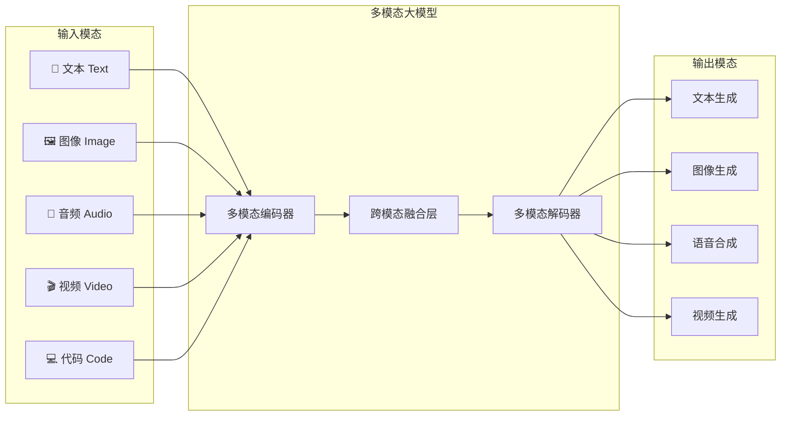
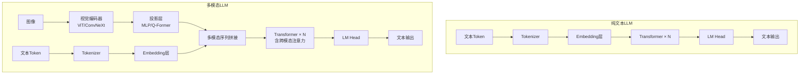
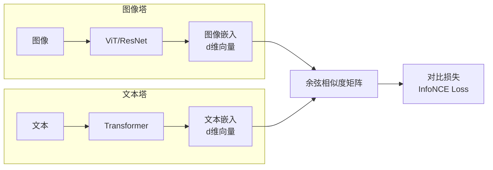
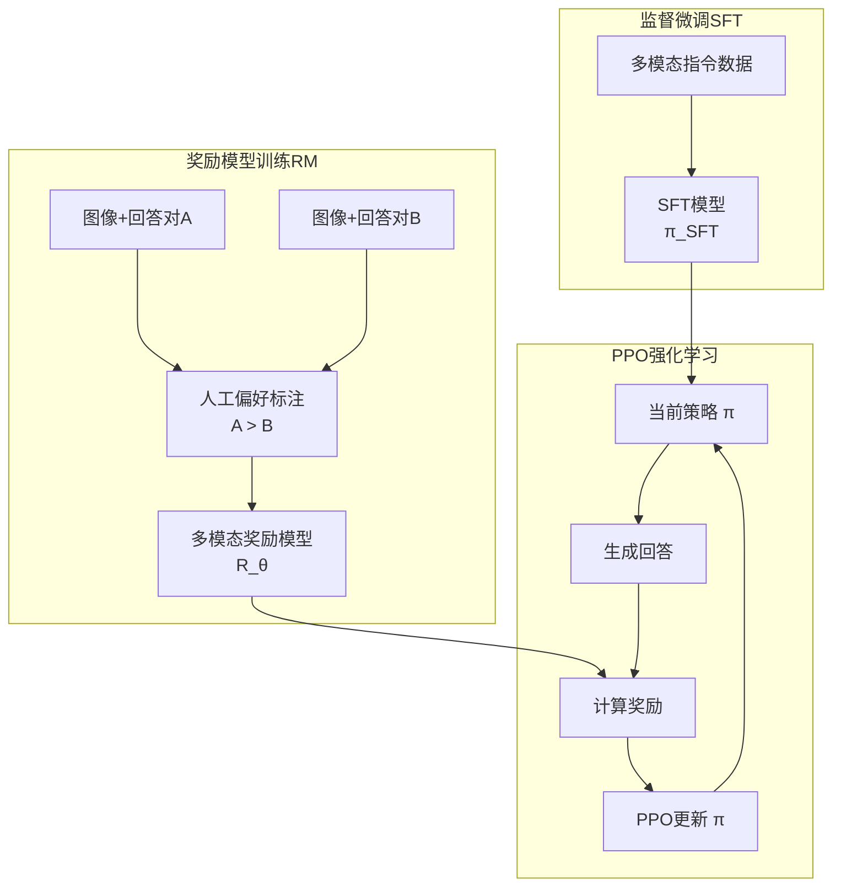
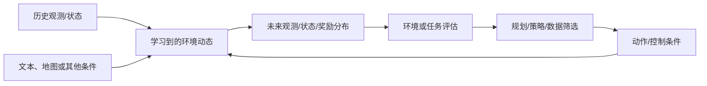
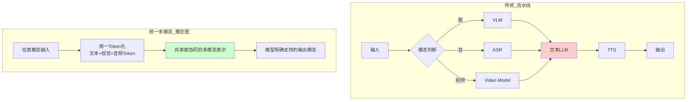
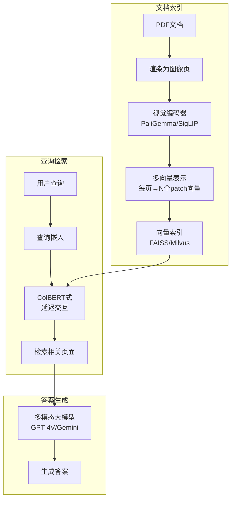
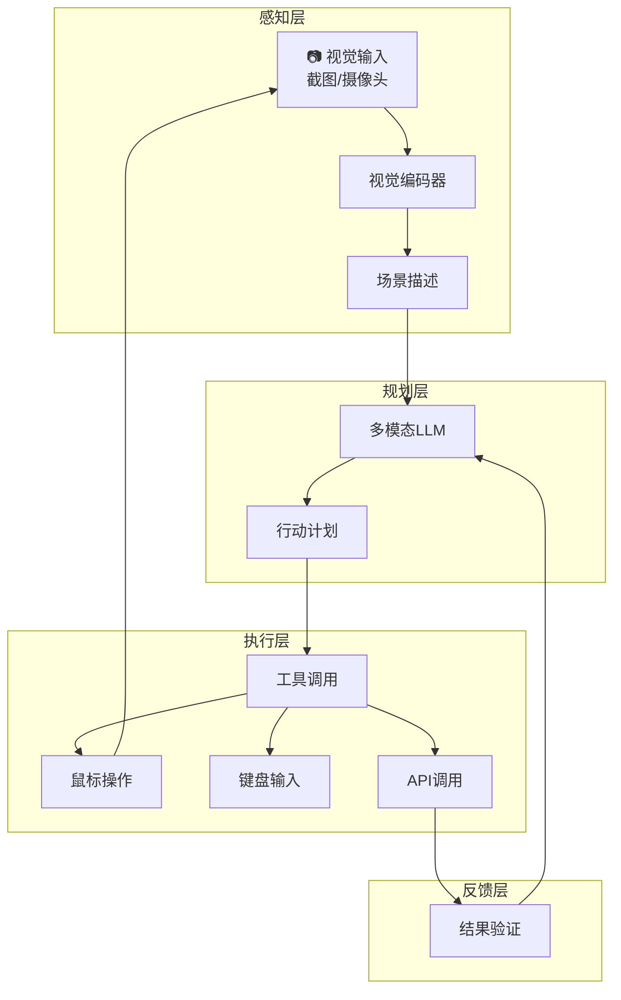

# 21 多模态大模型

> **一句话总结**：多模态大模型让 AI 拥有了"眼睛和耳朵"，能同时理解文本、图像、音频、视频等多种模态信息，是通往通用人工智能（AGI）的必经之路。本章从 CLIP 的对比学习奠基，到 LLaVA 的架构创新，再到扩散模型的生成革命，系统梳理多模态技术的核心原理与2026年最新进展。

---

## 21.1 多模态概述

### 21.1.1 什么是多模态AI

**多模态AI**（Multimodal AI）指能够同时处理、理解和生成**多种信息模态**（文本、图像、音频、视频、代码等）的人工智能系统。与传统的单一模态模型（如纯文本GPT、纯视觉ResNet）不同，多模态模型能够在不同模态之间建立**跨模态关联**，实现更接近人类的综合感知能力。



### 21.1.2 从单模态到多模态的技术跨越

| 阶段 | 时间 | 代表模型 | 核心能力 | 局限 |
|------|------|----------|----------|------|
| **单模态时代** | 2012-2020 | ResNet, BERT, GPT-3 | 单一模态理解 | 模态隔离，无法跨模态推理 |
| **双塔对齐** | 2021-2022 | CLIP, ALIGN, BLIP | 图像-文本匹配 | 仅能做检索/分类，不能生成 |
| **浅层融合** | 2022-2023 | Flamingo, BLIP-2 | 图文浅层交互 | 模态交互深度不足 |
| **深度原生多模态** | 2023-2024 | GPT-4V, Gemini 1.0, LLaVA | 深度图文理解 | 视频/音频支持有限 |
| **能力分化与工具化** | 2025-2026 | GPT-5.6、Gemini 3.6 Flash、Claude Fable 5、Qwen3-VL、Llama 4 | 图像理解扩展到长上下文、视频/音频理解与 GUI 操作；具体模态依模型而定 | 模态、输出类型和工具支持不能由系列名推断 |

### 21.1.3 2026年多模态大模型格局 🆕

| 官方模型/系列 | 开放性 | 官方支持的输入 → 输出 | 使用边界 |
|------|--------|----------|----------|
| **GPT-5.6 Sol**（`gpt-5.6-sol`，`gpt-5.6` 为其别名） | 闭源 API | 文本、图像 → 文本 | 音频和视频不是该模型的输入模态；图像生成、computer use 是 Responses API 中可调用的工具能力 |
| **Gemini 3.6 Flash**（`gemini-3.6-flash`） | 闭源 API，稳定版 | 文本、图像、视频、音频、PDF → 文本 | 模型页明确标注不支持图像生成和音频生成；不要把输入理解能力写成生成能力 |
| **Claude Fable 5**（`claude-fable-5`） | 闭源 API | 文本、图像 → 文本 | 当前 Claude 模型统一支持视觉输入，不另设 `Vision` 型号后缀 |
| **Qwen3-VL**（如 `Qwen/Qwen3-VL-235B-A22B-Instruct`） | 开放权重，Apache-2.0 | 文本、图像、视频 → 文本 | 官方提供 Dense/MoE、Instruct/Thinking 等多种规格；系列命名以 `Qwen3-VL` 为准 |
| **Llama 4 Scout / Maverick** | 开放权重，自定义社区许可证 | 文本、图像 → 文本 | 不是 OSI 意义的“完全开源”；分发须遵守归属、可接受使用政策等条款，发布时月活超过 7 亿还需另行申请许可 |
| **DeepSeek-VL2** | 开放权重，DeepSeek Model License | 文本、图像 → 文本 | 截至核验日，DeepSeek 官方公开仓库可核验的是 VL2 系列；不据非官方名称推测能力 |

> **核验入口（2026-07-31）**：[OpenAI 模型目录](https://developers.openai.com/api/docs/models)、
> [Gemini 3.6 Flash 模型页](https://ai.google.dev/gemini-api/docs/models/gemini-3.6-flash)、
> [Claude 模型目录](https://platform.claude.com/docs/en/about-claude/models/overview)、
> [Qwen3-VL 官方仓库](https://github.com/QwenLM/Qwen3-VL)、
> [Llama 4 Model Card](https://github.com/meta-llama/llama-models/blob/main/models/llama4/MODEL_CARD.md) 与
> [Llama 4 Community License](https://github.com/meta-llama/llama-models/blob/main/models/llama4/LICENSE)。

### 21.1.4 多模态 vs 纯文本模型的架构差异



**核心差异**：
1. **输入处理**：多模态模型需要额外的模态编码器将非文本数据转换为LLM可理解的向量表示
2. **模态对齐**：需要投影层将不同模态的表示映射到统一语义空间
3. **训练策略**：通常分阶段训练——先预训练对齐，再指令微调
4. **计算开销**：视觉编码器带来的额外参数量（通常3-10亿参数）

> 📚 **相关章节**：[[12_Transformer与大模型原理]]（MoE架构）、[[19_分布式训练系统]]（多模态模型的分布式训练策略）

---

## 21.2 CLIP与对比学习

### 21.2.1 CLIP 核心思想

**CLIP**（Contrastive Language-Image Pre-training）由 OpenAI 于2021年提出，是多模态领域的奠基性工作。其核心思想极其优雅：**通过对比学习，将图像和文本映射到同一个向量空间，使得匹配的图文对在空间中距离最近**。

#### 双塔架构



**关键设计**：
- **双塔独立编码**：图像编码器和文本编码器各自独立工作，仅在最后通过对比损失进行对齐
- **大规模弱监督数据**：从互联网收集的4亿图文对，利用自然语言作为监督信号
- **零样本迁移能力**：训练完成后可以直接用于任意分类任务，无需微调

#### 零样本分类流程

给定一张图像和一组类别名称（如"猫"、"狗"、"汽车"），CLIP 的零样本分类流程如下：

1. 将类别名称转换为 prompt 模板：`"a photo of a {class_name}"`
2. 文本编码器对所有类别 prompt 进行编码，得到文本嵌入矩阵 $T \in \mathbb{R}^{N \times d}$
3. 图像编码器对输入图像编码，得到图像嵌入 $I \in \mathbb{R}^{1 \times d}$
4. 计算 $I$ 与 $T$ 中每一行的余弦相似度
5. 取相似度最大的类别作为预测结果

### 21.2.2 训练目标：InfoNCE Loss

CLIP 使用 **InfoNCE Loss**（Information Noise-Contrastive Estimation），在批量数据中同时优化图像到文本和文本到图像两个方向的匹配。

**前向传播**：
给定一个包含 $N$ 个图文对的批次 $\{(I_i, T_i)\}_{i=1}^{N}$：

1. 图像编码：$f_I(I_i) \in \mathbb{R}^d$，文本编码：$f_T(T_i) \in \mathbb{R}^d$
2. L2 归一化后计算相似度矩阵：$S_{ij} = \frac{f_I(I_i)^\top f_T(T_j)}{\tau}$

其中 $\tau$ 是可学习的温度参数。

**InfoNCE Loss**：

$$\mathcal{L}_{\text{CLIP}} = \frac{1}{2}\left(\mathcal{L}_{I \to T} + \mathcal{L}_{T \to I}\right)$$

$$\mathcal{L}_{I \to T} = -\frac{1}{N}\sum_{i=1}^{N} \log \frac{\exp(S_{ii})}{\sum_{j=1}^{N} \exp(S_{ij})}$$

$$\mathcal{L}_{T \to I} = -\frac{1}{N}\sum_{i=1}^{N} \log \frac{\exp(S_{ii})}{\sum_{j=1}^{N} \exp(S_{ji})}$$

**直观理解**：
- 对于第 $i$ 张图像，它的正样本是第 $i$ 条文本，其余 $N-1$ 条文本都是负样本
- 对称地，对于第 $i$ 条文本，它的正样本是第 $i$ 张图像
- 两个方向取平均，保证图文对齐的对称性

### 21.2.3 代码示例：使用 OpenCLIP

以下是真实权重路径，会读取本地图像，且 `pretrained` 可能触发权重下载。仓库中的配套脚本还要求
`CH21_OPENCLIP_RUN=1`，并在加载前校验 GPU 与 `CH21_IMAGE`；离线整库验收只会条件性跳过。

```python
import torch
import os
import torch.nn.functional as F
from PIL import Image
import open_clip

# 1. 加载模型和预处理
model_name = "ViT-B-32"
pretrained = "laion2b_s34b_b79k"

model, _, preprocess = open_clip.create_model_and_transforms(
    model_name, pretrained=pretrained
)
tokenizer = open_clip.get_tokenizer(model_name)
model = model.eval()

# 2. 准备输入
image = preprocess(Image.open("cat.jpg")).unsqueeze(0)  # [1, 3, 224, 224]
texts = [
    "a photo of a cat",
    "a photo of a dog",
    "a photo of a car"
]
text_tokens = tokenizer(texts)  # [3, 77]

# 3. 编码
with torch.no_grad():
    image_features = model.encode_image(image)  # [1, d]
    text_features = model.encode_text(text_tokens)  # [3, d]

    # L2归一化
    image_features = F.normalize(image_features, dim=-1)
    text_features = F.normalize(text_features, dim=-1)

    # 计算相似度
    similarity = (image_features @ text_features.T) * model.logit_scale.exp()
    # 或使用 temperature 参数: similarity = image_features @ text_features.T / τ

    probs = similarity.softmax(dim=-1)

print("分类概率:")
for text, prob in zip(texts, probs[0]):
    print(f"  {text}: {prob.item():.4f}")
```

### 21.2.4 实现 CLIP 训练（简化版）

```python
import torch
import torch.nn as nn
import torch.nn.functional as F

class SimpleCLIP(nn.Module):
    """简化版 CLIP 双塔模型"""
    def __init__(self, image_encoder, text_encoder, embed_dim=512):
        super().__init__()
        self.image_encoder = image_encoder
        self.text_encoder = text_encoder

        # 投影层：将编码器输出映射到统一的嵌入维度
        self.image_proj = nn.Linear(image_encoder.output_dim, embed_dim)
        self.text_proj = nn.Linear(text_encoder.output_dim, embed_dim)

        # 可学习的温度参数（初始化为 log(1/0.07) ≈ 2.659）
        self.logit_scale = nn.Parameter(torch.ones([]) * 2.659)

    def encode_image(self, image):
        features = self.image_encoder(image)
        features = self.image_proj(features)
        return F.normalize(features, dim=-1)

    def encode_text(self, text):
        features = self.text_encoder(text)
        features = self.text_proj(features)
        return F.normalize(features, dim=-1)

    def forward(self, image, text):
        # 编码
        image_embeds = self.encode_image(image)   # [B, d]
        text_embeds = self.encode_text(text)       # [B, d]

        # 计算相似度矩阵
        logit_scale = self.logit_scale.exp()
        logits_per_image = logit_scale * image_embeds @ text_embeds.T  # [B, B]
        logits_per_text = logits_per_image.T

        # 标签：对角线为正样本（第i张图对应第i条文本）
        labels = torch.arange(len(image), device=image.device)

        # 双向 InfoNCE Loss
        loss_i2t = F.cross_entropy(logits_per_image, labels)
        loss_t2i = F.cross_entropy(logits_per_text, labels)
        loss = (loss_i2t + loss_t2i) / 2

        return loss, image_embeds, text_embeds

# 使用示例
# model = SimpleCLIP(vision_encoder, text_encoder, embed_dim=512)
# loss, img_emb, txt_emb = model(images, texts)
```

### 21.2.5 CLIP 的局限性与改进

| 局限 | 描述 | 改进方案 |
|------|------|----------|
| **细粒度理解不足** | CLIP 擅长全局语义，但对物体位置、数量、空间关系理解差 | 引入区域级对比学习 |
| **文本编码器容量小** | 原始CLIP文本塔只有12层Transformer | 使用更大LLM作为文本塔 |
| **对比损失效率低** | 需要大batch size（通常32k+） | **SigLIP**：改用Sigmoid损失 |
| **训练数据噪声** | 互联网图文对包含大量噪声 | 数据清洗 + 质量过滤 |
| **分辨率受限** | 通常224×224或336×336 | 动态分辨率、多尺度训练 |

#### SigLIP

**SigLIP**（Sigmoid Loss for Language Image Pre-training）将 CLIP 的 Softmax 对比损失改为更简单的**二分类 Sigmoid 损失**：

$$\mathcal{L}_{\text{SigLIP}} = -\frac{1}{|B|}\sum_{(i,j)} \left[y_{ij}\log\sigma(S_{ij}) + (1-y_{ij})\log(1-\sigma(S_{ij}))\right]$$

其中 $y_{ij}=1$ 当 $i=j$（正样本），否则 $y_{ij}=0$（负样本），$\sigma$ 是 Sigmoid 函数。

**优势**：不再需要全局归一化，允许更小的 batch size，训练更稳定，且在大规模数据上表现更好。

#### EVA-CLIP

**EVA-CLIP** 使用更强的视觉编码器（EVA，基于Masked Image Modeling预训练的ViT-giant），在保持训练效率的同时显著提升性能。

> 📚 **相关章节**：[[14_RAG检索增强生成]]（对比学习原理）、[[15_Agent智能体开发]]（多模态Agent）

---

## 21.3 视觉Transformer（ViT）

### 21.3.1 ViT 架构：图像即序列

**Vision Transformer (ViT)** 由 Google 于2020年提出，首次将纯 Transformer 架构应用于图像分类，证明了"CNN 不是必须的"。

**核心思想**：将图像分割为固定大小的 patch，将每个 patch 视为一个 token（类比 NLP 中的词），然后用标准 Transformer 处理。

```mermaid
flowchart TB
    subgraph Patch化
        IMG[输入图像<br/>224×224×3] --> P[切分为Patches<br/>16×16 patch → 14×14=196个patch]
        P --> F[Flatten<br/>每个patch: 16×16×3=768维]
    end

    subgraph 线性投影
        F --> LP[线性投影 E<br/>768→D 维]
        LP --> PE[+ 位置编码<br/>Position Embedding]
        PE --> CLS[+ [CLS] Token<br/>可学习的分类token]
    end

    subgraph Transformer编码器
        CLS --> TR[Transformer Encoder × L]
        TR --> TR1[多头自注意力 + MLP]
        TR1 --> TR2[Layer Norm + 残差连接]
    end

    subgraph 分类头
        TR2 --> CLS_OUT[取[CLS]输出]
        CLS_OUT --> MLP[MLP Head]
        MLP --> OUT[分类结果]
    end
```

**数学表示**：

给定图像 $\mathbf{x} \in \mathbb{R}^{H \times W \times C}$，将其分割为 $N = \frac{HW}{P^2}$ 个 patch（patch大小为 $P \times P$）：

$$\mathbf{x}_p = \text{Flatten}(\text{Patchify}(\mathbf{x})) \in \mathbb{R}^{N \times (P^2 \cdot C)}$$

通过线性投影 + 位置编码得到输入序列：

$$\mathbf{z}_0 = [\mathbf{x}_{\text{class}}; \mathbf{x}_p^1 \mathbf{E}; \mathbf{x}_p^2 \mathbf{E}; \ldots; \mathbf{x}_p^N \mathbf{E}] + \mathbf{E}_{\text{pos}}$$

其中 $\mathbf{E} \in \mathbb{R}^{(P^2 \cdot C) \times D}$ 是 patch embedding 矩阵，$\mathbf{E}_{\text{pos}} \in \mathbb{R}^{(N+1) \times D}$ 是可学习的位置编码。

### 21.3.2 ViT 代码实现

```python
import torch
import torch.nn as nn
import math

class PatchEmbedding(nn.Module):
    """将图像切分为patch并线性投影"""
    def __init__(self, img_size=224, patch_size=16, in_channels=3, embed_dim=768):
        super().__init__()
        self.img_size = img_size
        self.patch_size = patch_size
        self.num_patches = (img_size // patch_size) ** 2

        # 使用卷积实现patch切分（高效实现）
        self.proj = nn.Conv2d(
            in_channels, embed_dim,
            kernel_size=patch_size, stride=patch_size
        )

    def forward(self, x):
        # x: [B, 3, 224, 224]
        x = self.proj(x)  # [B, 768, 14, 14]
        x = x.flatten(2)  # [B, 768, 196]
        x = x.transpose(1, 2)  # [B, 196, 768]
        return x


class VisionTransformer(nn.Module):
    """简化版 ViT-Base"""
    def __init__(
        self,
        img_size=224,
        patch_size=16,
        in_channels=3,
        num_classes=1000,
        embed_dim=768,
        depth=12,
        num_heads=12,
        mlp_ratio=4.0,
        dropout=0.1
    ):
        super().__init__()
        self.patch_embed = PatchEmbedding(img_size, patch_size, in_channels, embed_dim)
        num_patches = self.patch_embed.num_patches

        # [CLS] token（可学习的分类token）
        self.cls_token = nn.Parameter(torch.zeros(1, 1, embed_dim))

        # 可学习的位置编码
        self.pos_embed = nn.Parameter(
            torch.zeros(1, num_patches + 1, embed_dim)
        )

        self.pos_drop = nn.Dropout(dropout)

        # Transformer 编码器层
        self.blocks = nn.ModuleList([
            TransformerBlock(embed_dim, num_heads, mlp_ratio, dropout)
            for _ in range(depth)
        ])

        self.norm = nn.LayerNorm(embed_dim)

        # 分类头
        self.head = nn.Linear(embed_dim, num_classes)

        # 初始化
        nn.init.trunc_normal_(self.pos_embed, std=0.02)
        nn.init.trunc_normal_(self.cls_token, std=0.02)
        self.apply(self._init_weights)

    def _init_weights(self, m):
        if isinstance(m, nn.Linear):
            nn.init.trunc_normal_(m.weight, std=0.02)
            if m.bias is not None:
                nn.init.zeros_(m.bias)

    def forward(self, x):
        B = x.shape[0]

        # Patch embedding
        x = self.patch_embed(x)  # [B, 196, 768]

        # 添加 [CLS] token
        cls_tokens = self.cls_token.expand(B, -1, -1)  # [B, 1, 768]
        x = torch.cat([cls_tokens, x], dim=1)  # [B, 197, 768]

        # 添加位置编码
        x = x + self.pos_embed
        x = self.pos_drop(x)

        # Transformer 编码
        for block in self.blocks:
            x = block(x)

        x = self.norm(x)

        # 取 [CLS] token 输出用于分类
        cls_output = x[:, 0]  # [B, 768]
        return self.head(cls_output)


class TransformerBlock(nn.Module):
    """单层 Transformer（Pre-LN 风格）"""
    def __init__(self, embed_dim, num_heads, mlp_ratio=4.0, dropout=0.1):
        super().__init__()
        self.norm1 = nn.LayerNorm(embed_dim)
        self.attn = nn.MultiheadAttention(
            embed_dim, num_heads, dropout=dropout, batch_first=True
        )
        self.norm2 = nn.LayerNorm(embed_dim)
        self.mlp = nn.Sequential(
            nn.Linear(embed_dim, int(embed_dim * mlp_ratio)),
            nn.GELU(),
            nn.Dropout(dropout),
            nn.Linear(int(embed_dim * mlp_ratio), embed_dim),
            nn.Dropout(dropout),
        )

    def forward(self, x):
        # Self-Attention
        x = x + self.attn(self.norm1(x), self.norm1(x), self.norm1(x))[0]
        # MLP
        x = x + self.mlp(self.norm2(x))
        return x


# 使用示例
# vit = VisionTransformer(img_size=224, patch_size=16, num_classes=1000)
# img = torch.randn(4, 3, 224, 224)
# logits = vit(img)  # [4, 1000]
```

### 21.3.3 ViT 与 CNN 的关系

| 维度 | CNN | ViT |
|------|-----|-----|
| **归纳偏置** | 强（局部性、平移等变性） | 弱（仅位置编码） |
| **感受野** | 局部→逐层扩大 | 全局（自注意力） |
| **数据需求** | 相对少 | 需要大量数据 |
| **计算复杂度** | $\mathcal{O}(N \cdot K^2)$ | $\mathcal{O}(N^2)$ |
| **可解释性** | 较好（特征图可视化） | 较差（注意力图稀疏） |
| **细粒度特征** | 擅长 | 需要更多数据 |

**互补趋势（2024-2026）**：
- **ConvNeXt**：用现代技术"现代化"CNN，接近ViT性能但保留CNN效率
- **混合架构**：早期层用CNN提取局部特征，深层用Transformer建模全局关系
- **Swin Transformer**：引入窗口注意力，融合CNN局部性和ViT全局性
- **InternImage**：使用可变形卷积的大规模CNN，在检测任务上超越ViT

### 21.3.4 DINO/DINOv2 自监督视觉预训练

**DINO**（Self-Distillation with No Labels）和 **DINOv2** 是 Meta 提出的自监督视觉预训练框架，不需要任何标签即可学到高质量的视觉表示。

**核心机制**：
1. **师生网络**：教师网络和学生网络结构相同，但在不同视角下处理同一张图像的增强版本
2. **动量更新**：教师参数 $\theta_t \leftarrow \lambda \theta_t + (1-\lambda) \theta_s$
3. **中心化与锐化**：防止模型坍塌到常数输出

**DINOv2 的改进**：
- 更大规模训练数据（1.42亿张精选图像）
- 统一的训练框架（分类/密集预测共用同一表示）
- 直接可作为高质量视觉特征提取器，广泛应用于多模态任务

### 21.3.5 位置编码在视觉中的处理 

| 编码方式 | 原理 | 优点 | 缺点 |
|----------|------|------|------|
| **可学习位置编码** | 每个位置学习一个向量 | 简单，效果好 | 无法泛化到不同分辨率 |
| **正弦位置编码** | $\text{PE}_{(pos,2i)} = \sin(pos/10000^{2i/d})$ | 可外推 | 固定模式，不如学习型灵活 |
| **相对位置偏置** | 学习相对位置的注意力偏置 | 泛化性好 | 增加参数量 |
| **2D sin-cos编码** | 分别对行、列使用正弦编码 | 保留2D结构信息 | 实现稍复杂 |
| **RoPE in Vision** | 对Q、K分别施加旋转编码 | 更好的相对位置建模 | 2025年才在视觉中验证有效 🆕 |

> ⚠️ **面试高频**：ViT 如何处理不同分辨率？答：使用**位置编码插值**——将预训练的位置编码通过双线性插值调整到目标分辨率，这是 ViT 灵活处理多分辨率的关键技巧。

> 📚 **相关章节**：[[12_Transformer与大模型原理]]（Transformer 详解）、[[16_模型微调与推理优化]]（开源视觉模型）

---

## 21.4 多模态LLM架构

### 21.4.1 LLaVA：多模态对话的经典架构

**LLaVA**（Large Language and Vision Assistant）将视觉能力注入LLM，是开源社区最具影响力的多模态对话模型。其架构极简但有效，被誉为"多模态LLM的Hello World"。

```mermaid
flowchart TB
    subgraph 视觉编码
        IMG[输入图像<br/>X_v] --> VIT[CLIP ViT-L<br/>视觉编码器]
        VIT --> VIS[视觉特征<br/>Z_v ∈ ℝ^{N×d_v}]
    end

    subgraph 投影层
        VIS --> PROJ[投影矩阵 W<br/>d_v → d_llm]
        PROJ --> PROJ_OUT[投影后特征<br/>H_v ∈ ℝ^{N×d_llm}]
    end

    subgraph LLM
        TXT[文本指令<br/>X_q] --> TOK[Tokenizer]
        TOK --> EMB[Word Embedding]
        EMB --> CAT[序列拼接]
        PROJ_OUT --> CAT
        CAT --> LLM_CORE[LLM Backbone<br/>Vicuna/Llama]
        LLM_CORE --> GEN[自回归生成]
        GEN --> OUT[文本回答<br/>X_a]
    end
```

#### 两阶段训练

| 阶段 | 目标 | 可训练参数 | 数据 |
|------|------|------------|------|
| **阶段1：特征对齐** | 将视觉特征映射到LLM词嵌入空间 | 仅投影层 W | 图文对（CC3M约59.5万） |
| **阶段2：指令微调** | 让模型学会多模态指令跟随 | 投影层 + LLM（视觉编码器冻结） | 多模态指令数据（约15万） |

### 21.4.2 LLaVA 核心代码实现

```python
import torch
import torch.nn as nn
from transformers import AutoModel, AutoTokenizer, CLIPVisionModel

class LLaVA(nn.Module):
    """简化版 LLaVA 架构"""
    def __init__(
        self,
        vision_encoder_name="openai/clip-vit-large-patch14-336",
        llm_name="meta-llama/Llama-3-8B-Instruct",
        vision_hidden_size=1024,
        llm_hidden_size=4096,
    ):
        super().__init__()

        # 1. 视觉编码器（通常冻结）
        self.vision_encoder = CLIPVisionModel.from_pretrained(vision_encoder_name)
        for param in self.vision_encoder.parameters():
            param.requires_grad = False

        # 2. 投影层：视觉空间 → LLM空间
        self.mm_projector = nn.Sequential(
            nn.Linear(vision_hidden_size, llm_hidden_size),
            nn.GELU(),
            nn.Linear(llm_hidden_size, llm_hidden_size),
        )

        # 3. 大语言模型
        self.llm = AutoModel.from_pretrained(llm_name)
        self.tokenizer = AutoTokenizer.from_pretrained(llm_name)

        # 添加特殊 token
        self.tokenizer.add_special_tokens({"additional_special_tokens": ["<image>"]})
        self.llm.resize_token_embeddings(len(self.tokenizer))

        self.image_token_id = self.tokenizer.convert_tokens_to_ids("<image>")

    def encode_image(self, image):
        """编码图像为视觉token序列"""
        # image: [B, 3, H, W]
        with torch.no_grad():
            vision_outputs = self.vision_encoder(image, output_hidden_states=True)
            # 取倒数第二层特征（LLaVA-1.5的做法）
            vision_features = vision_outputs.hidden_states[-2]  # [B, N_patches, 1024]

        # 投影到LLM空间
        vision_features = self.mm_projector(vision_features)  # [B, N_patches, 4096]
        return vision_features

    def prepare_inputs(self, images, texts):
        """
        构建多模态输入序列
        格式: <s> USER: <image>\n{text} ASSISTANT:
        """
        batch_input_ids = []
        batch_attention_mask = []

        image_features = self.encode_image(images)  # [B, N_vis, d_llm]

        for i, text in enumerate(texts):
            # Tokenize 文本（包含 <image> 占位符）
            chat = [
                {"role": "user", "content": f"<image>\n{text}"},
            ]
            prompt = self.tokenizer.apply_chat_template(
                chat, tokenize=False, add_generation_prompt=True
            )
            input_ids = self.tokenizer(prompt, return_tensors="pt").input_ids[0]

            # 找到 <image> token 的位置
            img_positions = (input_ids == self.image_token_id).nonzero(as_tuple=True)[0]

            # 用视觉特征替换 <image> token（这里简化处理，仅替换第一个）
            if len(img_positions) > 0:
                img_pos = img_positions[0]
                img_feat = image_features[i]  # [N_vis, d_llm]

                # 获取LLM的词嵌入
                word_embeds = self.llm.get_input_embeddings()(input_ids)

                # 在 <image> 位置插入视觉特征
                # 前部分 + 视觉特征 + 后部分
                prefix_embeds = word_embeds[:img_pos]       # 包含 <image> 之前
                suffix_embeds = word_embeds[img_pos+1:]     # <image> 之后

                # 拼接
                input_embeds = torch.cat([
                    prefix_embeds,
                    img_feat,
                    suffix_embeds,
                ], dim=0)

                batch_input_ids.append({
                    "inputs_embeds": input_embeds.unsqueeze(0),
                    "use_embeds": True
                })

        return batch_input_ids

    def generate(self, images, texts, max_new_tokens=256, **kwargs):
        """多模态文本生成"""
        prepared = self.prepare_inputs(images, texts)

        outputs = []
        for item in prepared:
            if item.get("use_embeds"):
                output = self.llm.generate(
                    inputs_embeds=item["inputs_embeds"],
                    max_new_tokens=max_new_tokens,
                    **kwargs
                )
            generated = self.tokenizer.decode(output[0], skip_special_tokens=True)
            outputs.append(generated)

        return outputs


# 使用示例
# model = LLaVA()
# from PIL import Image
# image = Image.open("scene.jpg")
# response = model.generate(
#     images=preprocess(image).unsqueeze(0),
#     texts=["请描述这张图片中的场景"]
# )
# print(response[0])
```

### 21.4.3 Qwen-VL 架构演进

阿里巴巴的 Qwen-VL 系列代表了开源多模态模型的持续演进：

| 版本 | 发布时间 | 核心改进 | 关键能力 |
|------|----------|----------|----------|
| **Qwen-VL** | 2023.08 | ViT-G + Qwen-7B，三阶段训练 | 基础图文理解 |
| **Qwen-VL-Plus** | 2024.01 | 动态分辨率，更好的OCR | 文档理解增强 |
| **Qwen2-VL** | 2024.08 | 原生动态分辨率，视频理解 | 视频对话，实时分析 |
| **Qwen2.5-VL** | 2025.01 | 视觉定位、长视频和文档理解增强 | 图像/视频理解与视觉 Agent |
| **Qwen3-VL** 🆕 | 2025.09 起 | Dense/MoE 多规格，提供 Instruct/Thinking 权重 | 图像/视频理解、空间推理与 Agent 交互 |

**核心创新点**：
1. **动态分辨率**：不固定图像尺寸，根据原始比例动态调整，保留更多细节
2. **Naive Dynamic Resolution**（Qwen2-VL）：按原始分辨率映射为动态数量的视觉 token
3. **Video MRoPE**：多维旋转位置编码，同时编码时间+空间位置

### 21.4.4 闭源模型：区分公开能力与内部架构

对于 GPT、Gemini、Claude 等闭源模型，官方模型页通常公开**模型 ID、输入/输出模态、上下文限制和工具支持**，
但不会完整公开视觉编码器、融合层、专家路由或训练配方。因此面试中应按下面两层回答：

| 可核验事实 | 可以怎样表述 | 不应怎样表述 |
|------|------|------|
| 模型页列出的输入/输出类型 | “Gemini 3.6 Flash 接受文本、图像、视频、音频和 PDF，输出文本” | “它一定用 3D 位置编码处理视频” |
| API 列出的工具 | “GPT-5.6 可通过 Responses API 使用 image generation / computer use 工具” | “GPT-5.6 的同一组权重原生生成图像、视频” |
| 官方技术报告或模型卡 | 引用其明确披露的结构与训练方法 | 依据产品演示反推 MoE 路由、融合层或训练数据 |

架构题需要展开时，优先引用可审计的 LLaVA、Qwen3-VL、Llama 4 等论文或模型卡，再把闭源模型限定为
“接口能力对比”。**工具编排上的统一体验，不等于模型权重和解码架构已经统一。**

### 21.4.5 多模态指令微调数据构建

**数据金字塔**（从下到上质量递增、数量递减）：

```
          / 高质量多模态对话 \
         /   （人工标注10K）   \
        /  学术数据集汇总100K   \
       /   自动生成数据500K      \
      /  图文对数据1B+           \
```

**数据构建方法**：

1. **图文对重标注**：使用GPT-4V对图文对生成详细描述和QA对
2. **数据集混合**：
   - 学术VQA数据集（VQAv2, GQA, OK-VQA, TextVQA）
   - OCR数据集（OCR-VQA, ST-VQA）
   - 文档理解（DocVQA, ChartQA, InfoVQA）
   - 多语言数据
3. **负样本挖掘**：故意放入不匹配的图文对，训练模型说"我不知道"
4. **思维链数据**：要求模型展示推理过程，逐步分析图像

> 📚 **相关章节**：[[16_模型微调与推理优化]]（指令微调方法论）、[[13_Prompt_Engineering]]（多模态提示工程）

---

## 21.5 扩散模型基础

### 21.5.1 DDPM 核心原理

**DDPM**（Denoising Diffusion Probabilistic Models）是扩散模型的奠基性工作，通过模拟物理中的扩散过程来生成数据。

**前向扩散过程（加噪）**：

给定真实数据 $\mathbf{x}_0 \sim q(\mathbf{x})$，逐步添加高斯噪声：

$$q(\mathbf{x}_t | \mathbf{x}_{t-1}) = \mathcal{N}(\mathbf{x}_t; \sqrt{1-\beta_t} \mathbf{x}_{t-1}, \beta_t \mathbf{I})$$

其中 $\beta_t \in (0, 1)$ 是噪声调度。经过 $T$ 步后，$\mathbf{x}_T$ 接近纯噪声。

**重参数化技巧**：可以直接从 $\mathbf{x}_0$ 采样任意时刻的 $\mathbf{x}_t$：

$$q(\mathbf{x}_t | \mathbf{x}_0) = \mathcal{N}(\mathbf{x}_t; \sqrt{\bar{\alpha}_t} \mathbf{x}_0, (1-\bar{\alpha}_t) \mathbf{I})$$

其中 $\alpha_t = 1-\beta_t$，$\bar{\alpha}_t = \prod_{s=1}^{t} \alpha_s$。

$$\mathbf{x}_t = \sqrt{\bar{\alpha}_t} \mathbf{x}_0 + \sqrt{1-\bar{\alpha}_t} \boldsymbol{\epsilon}, \quad \boldsymbol{\epsilon} \sim \mathcal{N}(0, \mathbf{I})$$

**反向去噪过程**：

学习一个神经网络 $\boldsymbol{\epsilon}_\theta(\mathbf{x}_t, t)$ 来预测添加的噪声：

$$\mathcal{L}_{\text{simple}} = \mathbb{E}_{t, \mathbf{x}_0, \boldsymbol{\epsilon}} \left[ \|\boldsymbol{\epsilon} - \boldsymbol{\epsilon}_\theta(\mathbf{x}_t, t)\|^2 \right]$$

```mermaid
flowchart LR
    subgraph 前向过程q
        X0[x₀<br/>真实图像] -->|加噪| X1[x₁] -->|加噪| X2[x₂] -->|...| XT[xT<br/>纯噪声]
    end

    subgraph 反向过程p_θ
        XT2[xT<br/>纯噪声] -->|去噪| XT1[x_{T-1}] -->|去噪| XT2_1[x_{T-2}] -->|...| X0_2[x₀<br/>生成图像]
    end
```

### 21.5.2 DDPM 简化实现

```python
import torch
import torch.nn as nn
import torch.nn.functional as F
import math

class SinusoidalPositionEmbedding(nn.Module):
    """时间步的正弦位置嵌入"""
    def __init__(self, dim):
        super().__init__()
        self.dim = dim

    def forward(self, t):
        # t: [B]
        device = t.device
        half_dim = self.dim // 2
        embeddings = math.log(10000) / (half_dim - 1)
        embeddings = torch.exp(torch.arange(half_dim, device=device) * -embeddings)
        embeddings = t[:, None] * embeddings[None, :]
        embeddings = torch.cat([embeddings.sin(), embeddings.cos()], dim=-1)
        return embeddings


class SimpleUNet(nn.Module):
    """简化版 UNet，用于 DDPM 图像生成"""
    def __init__(self, in_channels=3, base_channels=64, time_emb_dim=256):
        super().__init__()
        self.time_mlp = nn.Sequential(
            SinusoidalPositionEmbedding(base_channels * 4),
            nn.Linear(base_channels * 4, time_emb_dim),
            nn.GELU(),
            nn.Linear(time_emb_dim, time_emb_dim),
        )

        # 编码器（下采样）
        self.enc1 = self._make_block(in_channels, base_channels)
        self.enc2 = self._make_block(base_channels, base_channels * 2)
        self.enc3 = self._make_block(base_channels * 2, base_channels * 4)

        # 中间层
        self.mid = self._make_block(base_channels * 4, base_channels * 4)

        # 时间嵌入投影
        self.time_proj = nn.Linear(time_emb_dim, base_channels * 4)

        # 解码器（上采样）
        self.dec3 = self._make_block(base_channels * 8, base_channels * 2)
        self.dec2 = self._make_block(base_channels * 4, base_channels)
        self.dec1 = self._make_block(base_channels * 2, base_channels)

        # 输出层
        self.final = nn.Conv2d(base_channels, in_channels, kernel_size=1)

        self.down = nn.MaxPool2d(2)
        self.up = nn.Upsample(scale_factor=2, mode='bilinear', align_corners=True)

    def _make_block(self, in_ch, out_ch):
        return nn.Sequential(
            nn.Conv2d(in_ch, out_ch, 3, padding=1),
            nn.GroupNorm(8, out_ch),
            nn.SiLU(),
            nn.Conv2d(out_ch, out_ch, 3, padding=1),
            nn.GroupNorm(8, out_ch),
            nn.SiLU(),
        )

    def forward(self, x, t):
        # x: [B, 3, H, W], t: [B]
        t_emb = self.time_mlp(t)  # [B, time_emb_dim]

        # 编码器
        e1 = self.enc1(x)        # [B, 64, H, W]
        e2 = self.enc2(self.down(e1))  # [B, 128, H/2, W/2]
        e3 = self.enc3(self.down(e2))  # [B, 256, H/4, W/4]

        # 注入时间信息
        t_proj = self.time_proj(t_emb)[:, :, None, None]  # [B, 256, 1, 1]
        mid = self.mid(self.down(e3))  # [B, 256, H/8, W/8]
        mid = mid + t_proj * mid  # 时间条件注入

        # 解码器（含跳跃连接）
        d3 = self.dec3(torch.cat([self.up(mid), e3], dim=1))
        d2 = self.dec2(torch.cat([self.up(d3), e2], dim=1))
        d1 = self.dec1(torch.cat([self.up(d2), e1], dim=1))

        return self.final(d1)


class DDPM:
    """DDPM 训练与采样框架"""
    def __init__(self, model, n_steps=1000, beta_start=1e-4, beta_end=0.02, device='cuda'):
        self.model = model.to(device)
        self.n_steps = n_steps
        self.device = device

        # 线性噪声调度
        self.betas = torch.linspace(beta_start, beta_end, n_steps).to(device)
        self.alphas = 1 - self.betas
        self.alpha_bars = torch.cumprod(self.alphas, dim=0)

    def add_noise(self, x0, t):
        """前向加噪：x0 -> xt"""
        alpha_bar_t = self.alpha_bars[t][:, None, None, None]
        epsilon = torch.randn_like(x0)
        xt = torch.sqrt(alpha_bar_t) * x0 + torch.sqrt(1 - alpha_bar_t) * epsilon
        return xt, epsilon

    def training_step(self, x0):
        """单步训练"""
        B = x0.shape[0]
        t = torch.randint(0, self.n_steps, (B,), device=self.device)

        xt, noise = self.add_noise(x0, t)
        pred_noise = self.model(xt, t)

        loss = F.mse_loss(pred_noise, noise)
        return loss

    @torch.no_grad()
    def sample(self, shape, return_intermediates=False):
        """DDPM 采样：从噪声生成图像"""
        self.model.eval()
        x = torch.randn(shape, device=self.device)

        intermediates = []
        for t in reversed(range(self.n_steps)):
            t_batch = torch.full((shape[0],), t, device=self.device, dtype=torch.long)

            # 预测噪声
            pred_noise = self.model(x, t_batch)

            # 计算 x_{t-1}
            alpha_t = self.alphas[t]
            alpha_bar_t = self.alpha_bars[t]
            beta_t = self.betas[t]

            if t > 0:
                noise = torch.randn_like(x)
            else:
                noise = 0

            x = (1 / torch.sqrt(alpha_t)) * (
                x - ((1 - alpha_t) / torch.sqrt(1 - alpha_bar_t)) * pred_noise
            ) + torch.sqrt(beta_t) * noise

            if return_intermediates and t % 100 == 0:
                intermediates.append(x.clone())

        if return_intermediates:
            return x, intermediates
        return x


# 训练示例
# unet = SimpleUNet(in_channels=3, base_channels=64)
# ddpm = DDPM(unet, n_steps=1000, device='cuda')
# optimizer = torch.optim.AdamW(unet.parameters(), lr=1e-4)
# for epoch in range(epochs):
#     for images in dataloader:
#         loss = ddpm.training_step(images)
#         optimizer.zero_grad()
#         loss.backward()
#         optimizer.step()
```

### 21.5.3 Stable Diffusion 架构

**Stable Diffusion** 的核心创新是**在潜空间（Latent Space）中进行扩散**，而非像素空间，大幅降低了计算成本。

```mermaid
flowchart TB
    subgraph 像素空间
        IMG[图像<br/>512×512×3]
    end

    subgraph VAE潜空间
        IMG --> ENC[VAE编码器]
        ENC --> LAT[潜变量 z<br/>64×64×4]
        LAT --> DEC[VAE解码器]
        DEC --> IMG_OUT[重建图像]
    end

    subgraph 扩散过程在潜空间
        LAT --> DIFF[扩散过程<br/>加噪/去噪]
        DIFF --> UNET[UNet<br/>ϵ_θ(z_t, t, c)]
    end

    subgraph 文本条件
        TXT[文本Prompt] --> CLIP[CLIP Text Encoder]
        CLIP --> CTX[文本嵌入 c]
        CTX --> UNET
    end
```

**三大核心组件**：

| 组件 | 作用 | 参数量 | 训练状态 |
|------|------|--------|----------|
| **VAE** | 图像压缩到潜空间（8×压缩） | ~80M | 冻结 |
| **CLIP Text Encoder** | 文本条件编码 | ~123M | 冻结 |
| **UNet** | 潜空间去噪预测（含交叉注意力） | ~860M | 训练 |

**交叉注意力机制**（Cross-Attention）：将文本条件注入UNet的每一层。

$$\text{Attention}(Q, K, V) = \text{softmax}\left(\frac{Q K^\top}{\sqrt{d}}\right) V$$

其中：
- $Q$ 来自潜空间特征
- $K, V$ 来自 CLIP 文本编码

### 21.5.4 DiT：Diffusion Transformer 演进

**DiT**（Diffusion Transformer）将 UNet 替换为纯 Transformer，是扩散模型架构的重要演进。

| 架构 | UNet (SD) | DiT (SD3/Flux) |
|------|-----------|----------------|
| **主干网络** | CNN-based UNet | Transformer |
| **条件注入** | 交叉注意力 | AdaLN（自适应层归一化） |
| **位置编码** | 隐式（卷积） | 显式（位置嵌入） |
| **可扩展性** | 受限于CNN归纳偏置 | 随计算量增长持续提升 |
| **代表模型** | SD 1.5, SDXL | SD3, Flux, Sora |

**DiT Block 结构**：

$$\mathbf{x} \leftarrow \mathbf{x} + \text{MultiHeadSelfAttention}(\text{AdaLN}_1(\mathbf{x}, \mathbf{c}))$$
$$\mathbf{x} \leftarrow \mathbf{x} + \text{MLP}(\text{AdaLN}_2(\mathbf{x}, \mathbf{c}))$$

其中 $\text{AdaLN}(\mathbf{x}, \mathbf{c}) = \gamma(\mathbf{c}) \cdot \text{LayerNorm}(\mathbf{x}) + \beta(\mathbf{c})$

### 21.5.5 2026年图像生成趋势 🆕

| 趋势 | 代表模型/技术 | 核心创新 |
|------|--------------|----------|
| **DiT全面取代UNet** | Flux, SD3.5, Hunyuan-DiT | Transformer成为生成模型标配 |
| **理解模型与生成工具协作** | GPT-5.6 + GPT Image 2、Gemini 3.6 Flash + 专用图像模型 | 通过 API/Agent 工具组合完成理解与生成，不推断为同一模型权重 |
| **实时生成** | SD Turbo, LCM, SDXS | 1-4步即可完成生成 |
| **可控生成** | ControlNet, IP-Adapter, InstantID | 精确控制姿势、面部、风格 |
| **视频生成爆发** | Sora, Kling 2.0, Veo 3 | 从图像生成扩展到视频生成 |
| **3D/4D生成** | 3D Gaussian Splatting + Diffusion | 从2D扩散到3D场景生成 |

> 📚 **相关章节**：[[21_多模态大模型]]（音频生成）、[[21_多模态大模型]]（视频生成详解）

---

## 21.6 多模态微调与对齐

### 21.6.1 多模态LoRA微调

**LoRA**（Low-Rank Adaptation）在多模态场景中同样表现出色。对于多模态LLM，LoRA的典型配置：

| 配置项 | 推荐值 | 说明 |
|--------|--------|------|
| **目标模块** | 先定位语言层，再选择 q/k/v/o_proj 等 | 避免误把视觉塔同名层一起注入 |
| **Rank r** | 8-128，按任务验证 | 没有“视觉任务一定需要更高秩”的通用结论 |
| **Alpha** | 2×r | 缩放系数 |
| **连接模块** | 按具体 VLM 架构决定 | Qwen2-VL 并不存在通用的 `mm_projector` 变量 |
| **视觉编码器** | 冻结或小学习率微调 | 取决于领域偏移、数据量和显存 |

```python
import torch
from peft import LoraConfig, get_peft_model, TaskType
from transformers import (
    AutoProcessor,
    BitsAndBytesConfig,
    Qwen2VLForConditionalGeneration,
)

# 量化配置（节省显存）
bnb_config = BitsAndBytesConfig(
    load_in_4bit=True,
    bnb_4bit_compute_dtype=torch.bfloat16,
    bnb_4bit_use_double_quant=True,
    bnb_4bit_quant_type="nf4",
)

# 加载真正包含视觉塔的 VLM；不要用纯文本 Qwen2-7B 代替
model_id = "Qwen/Qwen2-VL-7B-Instruct"
processor = AutoProcessor.from_pretrained(model_id)
model = Qwen2VLForConditionalGeneration.from_pretrained(
    model_id,
    quantization_config=bnb_config,
    torch_dtype=torch.bfloat16,
    device_map="auto",
)

# LoRA 配置
lora_config = LoraConfig(
    task_type=TaskType.CAUSAL_LM,
    r=32,
    lora_alpha=64,
    lora_dropout=0.05,
    target_modules=["q_proj", "k_proj", "v_proj", "o_proj",
                    "gate_proj", "up_proj", "down_proj"],
    bias="none",
)

# 注入 LoRA 后冻结视觉塔；是否解冻应通过领域数据实验决定
model = get_peft_model(model, lora_config)
for param in model.base_model.model.visual.parameters():
    param.requires_grad = False
model.print_trainable_parameters()

# processor 负责图像/视频与文本模板；训练时还要：
# 1) 对 padding、用户指令和视觉占位 token 设置 label=-100；
# 2) 使用匹配当前 transformers/peft 版本的数据 collator；
# 3) 单卡可用 device_map，DDP/DeepSpeed 训练不要使用 device_map="auto"。
```

该片段只展示“正确加载 VLM + 注入 LoRA”的最小边界，不冒充完整训练脚本。完整训练还必须锁定 `transformers`/`peft` 版本并在小 batch 上验证图像输入、label mask、梯度和保存/恢复。参考：[Qwen2-VL 官方模型卡](https://huggingface.co/Qwen/Qwen2-VL-7B-Instruct)（截至 2026-07-31）。

### 21.6.2 视觉-语言对齐技术

| 对齐层次 | 方法 | 代表工作 | 特点 |
|----------|------|----------|------|
| **全局对齐** | 对比学习 | CLIP, SigLIP | 图像整体与文本匹配 |
| **区域对齐** | 目标检测+文本 | GLIP, GroundingDINO | 物体级别对齐 |
| **像素对齐** | 分割+文本 | SAM+CLIP, LSeg | 像素级别语义理解 |
| **细粒度对齐** | 属性绑定 | TIFA, VPEval | 颜色、数量、位置等属性 |
| **时序对齐** | 视频-文本对齐 | VideoCLIP, InternVideo | 动作与时序关系 |

### 21.6.3 多模态RLHF

多模态RLHF在传统RLHF基础上增加了视觉偏好维度：



**多模态RLHF的关键挑战**：
1. **幻觉奖励**：模型可能描述图像中不存在的物体，需要专门的幻觉检测奖励
2. **视觉真实性**：回答必须与视觉内容一致
3. **有帮助vs无害权衡**：拒绝回答vs编造答案之间的平衡

> ⭐ **难度标记**：多模态RLHF是当前多模态对齐的前沿方向（2025-2026），实现复杂度极高，面试中掌握原理即可。

### 21.6.4 多模态微调：从骨架到真实验收

配套 `code/ch21_multimodal/gpu/07_sft_training.py` 只演示图像与对话的整理结构和训练配置，
不会加载 checkpoint、创建空 `train_dataset` 后假装训练，也不会把“构造 Trainer”记为成功。

完整 SFT 至少要补齐并验证：

1. 锁定与 checkpoint 匹配的 `transformers`、`peft`、processor 和对话模板；
2. 用真实样本生成 `pixel_values`、`input_ids`、`attention_mask` 与只监督 assistant 的 labels；
3. 核对 LoRA target module 是否真实存在，避免误注入视觉塔或漏掉目标层；
4. 至少执行一次 forward/backward/optimizer step，断言可训练参数梯度有限且非全零；
5. 保存 adapter 与 processor，在新进程重新加载并做固定样本回归；
6. DDP/DeepSpeed/FSDP、量化、batch、序列长度和 checkpointing 按实际硬件独立验收。

因此，本节提供的是可审计的实现清单，不是未经数据与硬件验证的“一键完整训练脚本”。

> 📚 **相关章节**：[[16_模型微调与推理优化]]（RLHF原理）、[[16_模型微调与推理优化]]（LoRA详解）

---

## 21.7 世界模型与Diffusion LLM

> ⭐⭐⭐⭐⭐ **截至 2026-07-31 的前沿快照**：本节聚焦**世界模型（World Models）**、
> **Diffusion LLM**、**实时语音模型**与**统一 Any-to-Any 模型**。这些方向迭代很快；
> 型号、开放程度、输入输出模态与 SDK 接口必须回到厂商模型页/仓库逐项核对。

### 21.7.1 世界模型（World Models）

**工程定义**：世界模型学习环境状态或观测随时间、动作和条件变化的规律，用于未来预测、
规划、数据生成或策略学习。它不一定输出像素，也不一定采用 DiT；“能生成逼真视频”更不等于
已经学会可靠物理规律。判断项目能力时至少要分开验证：长期一致性、动作可控性、因果/物理
指标、闭环任务收益与失败模式。



**代表系统（只比较官方公开边界，不做主观“物理强弱”排名）**：

| 系统 | 当前公开边界 | 能据此确认 | 仍需单独验证 |
|------|-------------|-----------|-------------|
| **Genie 3** | Google DeepMind 研究系统；官方页面给出 720p、20–24 FPS 的实时交互描述 | 可交互生成世界的产品/研究演示 | 权重、本地部署、目标任务长期一致性与闭环收益 |
| **Cosmos 3** | NVIDIA 开放的 Physical AI 世界基础模型平台；`Cosmos3-Nano`/`Super` 与官方代码、模型卡可查 | 文本、图像、视频、音频、动作等当前受支持模态与工具链 | 许可证适用性、目标硬件资源、物理正确性和机器人安全 |
| **通用视频生成产品** | Sora、Veo、可灵等按各自产品页提供视频生成能力 | 产品明确列出的时长、分辨率、音频与地区可用性 | 不能仅凭视频逼真度推断其是动作条件世界模型或可靠仿真器 |

**版本边界**：

- **Genie 3**：官方把它描述为实时可交互世界模型；其页面同时列出局限。教程不反推未公开的
  训练架构、loss、权重规模或本地显存需求。
- **Cosmos 3**：当前统一的 omni-model 取代早期 Cosmos 分立的 Predict、Reason、Transfer
  路线。当前 Diffusers 类名是 `Cosmos3OmniPipeline`，模型标识示例为
  `nvidia/Cosmos3-Nano`；旧 `CosmosPredictPipeline` 不是当前接口。
- 对任何系统，“官方演示可用”“模型权重可下载”“特定机器人闭环安全可部署”是三种不同证据。

```python
# Cosmos 3 当前 Diffusers 接口形状（会下载大体量权重；不是默认验收）
import json
import torch
from diffusers import Cosmos3OmniPipeline

pipe = Cosmos3OmniPipeline.from_pretrained(
    "nvidia/Cosmos3-Nano",
    torch_dtype=torch.bfloat16,
    device_map="cuda",
)

# 最小 text-to-image 形状；正式项目应使用官方 prompt-upsampling 与安全检查流程
result = pipe(
    prompt=json.dumps({"scene": "A robot arm in a kitchen"}),
    num_frames=1,
    height=720,
    width=1280,
)
result.video[0].save("cosmos3_t2i.jpg")
```

> 上述代码来自当前接口形状，但本仓库的默认 GPU 验收不会下载或运行 Cosmos 3。
> 真跑前必须阅读当前模型卡、NVIDIA Open Model License、安全检查要求和官方 cookbook，并先做
> 磁盘/显存预算；生成一张图也不能证明物理世界模型或机器人策略有效。

### 21.7.2 Diffusion LLM：扩散语言模型

**动机**：自回归LLM（GPT系）逐token生成，**无法并行、难以编辑、推理延迟与长度线性相关**。Diffusion LLM将扩散模型应用于离散token，支持**并行解码、双向上下文、任意位置编辑**。

```mermaid
flowchart LR
    subgraph 自回归LLM
        AR1[token1] --> AR2[token2]
        AR2 --> AR3[token3]
        AR3 --> AR4[...]
        AR4 --> AR5[tokenN]
    end

    subgraph Diffusion_LLM
        NOISE[全[MASK]序列<br/>T=N步噪声]
        STEP1[T=N-1<br/>部分降噪]
        STEP2[T=N-2<br/>更多token显现]
        FINAL[T=0<br/>完整文本]
        NOISE --> STEP1
        STEP1 --> STEP2
        STEP2 --> FINAL
    end

    style AR5 fill:#ffcccc
    style FINAL fill:#ccffcc
```

**可公开核验的 Diffusion LLM 路线**：

| 工作 | 公开证据 | 核心创新 | 结论边界 |
|------|---------|---------|---------|
| **LLaDA 2.0** | 论文与官方仓库 | 将 AR checkpoint 转换并扩展到 block diffusion，提供不同规模开放权重 | 质量/速度只在论文指定模型、任务与实现内比较 |
| **BD3-LM** | ICLR 2025 论文与代码 | 块间自回归、块内扩散，支持可变长度与 KV cache | 论文结论是相对其研究基线，不等于生产服务固定加速 |
| **SEDD** | 论文与研究实现 | Score Entropy Discrete Diffusion | 适合作为方法基线，不能直接外推到商用大模型 |

**关键技术原理：**

- **Mask Diffusion**：前向过程随机将token替换为`[MASK]`，反向过程预测原token。与BERT的MLM一脉相承，但采样步数可调（1-50步）。
- **BD3-LM**：将序列切块（block），**块间自回归、块内扩散**，结合两者优势——长序列质量好、短块并行快。
- **推理实现**：并行 unmask、block KV cache 和动态步数都是可能的优化，但公开引擎的
  模型支持与 CLI 会变化；部署前必须以目标模型仓库和引擎兼容矩阵为准。
- **公平评测**：固定模型质量门限、输出长度、batch/QPS、硬件和采样参数，同时报告
  TTFT、TPOT、吞吐、峰值内存与任务质量，不能只比较供应商给出的 tokens/s。

参考：[LLaDA 2.0 论文](https://arxiv.org/abs/2512.15745)、
[BD3-LM 论文](https://arxiv.org/abs/2503.09573)与
[BD3-LM 官方代码](https://github.com/kuleshov-group/bd3lms)。

### 21.7.3 实时语音模型

**痛点**：传统语音 pipeline 常由 ASR + LLM + TTS 串联，端到端时延会叠加；端到端语音模型
可以保留更多声学信息并支持双工交互，但实际延迟仍受网络、VAD、codec、推理硬件和缓冲策略影响。

| 模型/接口（核验 2026-07-31） | 输入/输出边界 | 发布状态 | 延迟口径 |
|------|------|------|------|
| **Moshi** | 端到端语音/文本研究模型 | 开放代码/权重 | 论文给出其特定配置的理论 160ms、L4 实测约 200ms，不外推到其他部署 |
| **GPT-Realtime-2.1** | 文本/音频输入输出，图像仅输入，不支持视频 | OpenAI API | 官方未给本教程可复用的统一端到端 SLA，需按区域与网络压测 |
| **Gemini 3.1 Flash Live Preview** | Live API 音频到音频，并支持文档所列多模态交互 | Preview | 预览能力与限制会变化，按模型页和会话配置实测 |

**Moshi关键创新**：
- **Mimi neural codec**：12.5Hz超低码率（1.1kbps）音频token化
- **Inner Monologue**：模型同时输出"文字思考流"+"语音流"，提升语义连贯
- **多流Transformer**：用户音频流 + 模型音频流 + 文本流并行建模

```python
# Moshi 实时对话（伪代码）
from moshi import MoshiClient
import asyncio

async def realtime_chat():
    client = MoshiClient("ws://localhost:8998")

    # 全双工流：用户讲话和模型回复同时进行
    async def send_audio():
        async for chunk in mic_stream():        # 80ms chunks
            await client.send_user_audio(chunk)

    async def recv_audio():
        async for chunk in client.recv_model_audio():
            await speaker_play(chunk)            # 实际缓冲与播放延迟需端到端测量

    await asyncio.gather(send_audio(), recv_audio())
```

### 21.7.4 统一Any-to-Any模型

**Any-to-Any 是目标而非系列名自动保证的能力**。必须逐个核对输入模态、输出模态、
工具能力和部署接口；“可理解图像”不等于“可原生生成图像”。

| 模型（核验 2026-07-31） | 可核验的模态边界 | 开放性/状态 |
|------|---------|------|
| **GPT-Realtime-2.1** | 文本/音频输入输出，图像输入；不支持视频 | 闭源 API |
| **Gemini 3.1 Flash Live Preview** | Live API 的实时音频交互；其他模态以当前模型页为准 | 闭源 Preview |
| **Qwen3-Omni-30B-A3B-Instruct** | 文本、图像、音频、视频输入；文本与语音输出 | 开放权重，许可见模型仓库 |
| **MiniCPM-o 2.6** | 历史开放模型：图像、视频、音频输入与文本/语音能力 | 官方文档已于 2026-02 标为 archived |

**架构对比：传统 vs 统一**



**统一建模的潜在优势**（不是对闭源内部架构的披露）：
1. **跨模态推理**：可在图像中"看到"音频提示的内容
2. **链路简化**：可能减少显式 ASR/文本 LLM/TTS 间的信息损失；延迟仍需实测
3. **联合学习**：模态间共享训练信号，但效果取决于数据与训练配方
4. **情感保真**：语音中的情感、节奏、笑声端到端建模

### 21.7.5 四大方向技术对比与选型

| 维度 | 世界模型 | Diffusion LLM | 实时语音 | Any-to-Any |
|------|---------|---------------|---------|-----------|
| **代表** | Genie 3、Cosmos 等 | LLaDA 2.0、BD3-LM | Moshi、GPT-Realtime-2.1 | Qwen3-Omni；闭源 Live API 按模态矩阵判断 |
| **核心问题** | 时空一致+物理仿真 | 并行解码+双向编辑 | 低延迟双工 | 统一多模态空间 |
| **训练数据** | 视频+动作+物理 | 大规模文本 | 大规模对话音频 | 全模态混合 |
| **典型应用** | 游戏/机器人/影视 | 代码/长文本生成 | AI助手/客服 | 通用智能体 |
| **成熟度判断** | 按可控性与任务闭环验收 | 研究与早期工程并存 | 商用 API 与开放模型并存 | 能力边界依具体输入/输出矩阵 |
| **开放性** | 论文、开放权重与闭源产品并存 | LLaDA/BD3-LM 有公开实现 | Moshi 开放；厂商 API 闭源 | Qwen3-Omni 开放权重；厂商 Live API 闭源 |

> 💡 **选型建议**：
> - **游戏/仿真训练**：先核验世界模型是否提供动作条件、可控 rollout 与可用权重/API，再比较闭源研究系统和 Cosmos 等开放路线。
> - **视频内容创作**：按当前模型目录、地区可用性、素材权利、输出许可与人工质检选型，不沿用已弃用型号。
> - **Diffusion LLM**：当前更适合研究性 PoC；用目标质量门限和同硬件 benchmark 决定是否进入生产。
> - **语音 Agent**：可比较 GPT-Realtime-2.1、Gemini 3.1 Flash Live Preview 与 Moshi；重点测打断、噪声、端到端延迟、成本和隐私。
> - **多模态智能体**：闭源 API 与 Qwen3-Omni 等开放权重均按输入/输出模态矩阵和部署约束验收，MiniCPM-o 2.6 仅作历史参考。

> 📚 **相关章节**：[[12_Transformer与大模型原理]]（DiT架构）、[[18_LLM工程框架实战]]（SGLang部署）、[[15_Agent智能体开发]]（实时语音Agent）

---

## 21.8 多模态RAG与Agent

### 21.8.1 多模态文档检索

传统RAG只能处理文本，**多模态RAG**将检索范围扩展到图像、表格、图表等视觉元素。

**ColPali**（2024）是多模态文档检索的代表性工作：



**ColPali 核心思想**：不经过OCR转写，直接用视觉编码器处理文档图像，保留所有视觉布局信息（表格结构、图表、排版），然后使用 ColBERT 风格的延迟交互进行检索。

### 21.8.2 多模态Agent架构

多模态Agent是在传统Agent基础上增加了视觉感知和操作能力：



**2026年多模态Agent典型应用**：
1. **GUI Agent**（Claude computer use、OpenAI Responses API 的 computer use 工具）：操控桌面/网页应用
2. **视觉QA Agent**：分析图表、报告并生成洞察
3. **多模态代码Agent**：理解设计稿生成前端代码
4. **具身智能Agent**：机器人视觉导航与操作

### 21.8.3 多模态 RAG：先把检索骨架做对

配套示例只验证 late interaction 的核心评分，不把随机 query 向量、固定回答或缺失 PDF 后的
fallback 冒充端到端系统：

```python
def maxsim_score(query_vectors, document_vectors):
    similarities = query_vectors @ document_vectors.T
    return float(similarities.max(axis=1).sum())
```

一个可验收的多模态 RAG 还需要：

1. 用同一受支持 checkpoint/processor 分别编码真实查询和页面图像；
2. 对 embedding 维度、归一化、空文档、批处理和索引 revision 做断言；
3. 保存 `page_id → source/document/page/hash` 溯源，检索指标用独立标注集评测；
4. 把真实检索页按目标 VLM 的当前图像输入格式发送，并验证回答引用；
5. 分开记录 retrieval、rerank、generation 的延迟、错误与成本。

`code/ch21_multimodal/gpu/11_multimodal_rag.py` 因而标为 **STRUCTURE ONLY**；真实 ColPali/
VLM 路径必须在锁定模型、数据和服务的环境单独验收。

---

## 🎯 面试真题

### Q1: CLIP 的 InfoNCE Loss 为什么需要足够大的 batch size？

**难度**：⭐⭐⭐⭐ | **频率**：高频

**答案**：InfoNCE Loss 将同一个 batch 中的其他样本作为负样本。batch size 越大：
1. **负样本更多样**：更多负样本让对比学习任务更难，迫使模型学到更细粒度的特征
2. **统计效率**：大batch下梯度估计更稳定
3. **近似真实分布**：负样本越多，越接近从整个数据分布中采样负样本

CLIP 原始论文使用 batch size = 32,768。实践中，batch size < 4096 时性能会显著下降。**改进方案**包括：
- SigLIP：改用 Sigmoid loss，不依赖 batch 内负样本
- 动量队列（MoCo风格）：维护一个大的负样本队列
- 跨GPU负样本共享（Gather）：多卡训练时聚合所有卡的样本

---

### Q2: ViT 中的 [CLS] token 作用是什么？为什么不用全局平均池化？

**难度**：⭐⭐⭐ | **频率**：高频

**答案**：

**[CLS] token** 是一个可学习的嵌入向量，被 prepend 到 patch 序列的最前面。经过 Transformer 所有层处理后，[CLS] token 的最终输出被认为汇总了整张图像的全局信息，用于分类。

**为什么不用全局平均池化（GAP）**：
1. **可学习聚合**：[CLS] token 通过自注意力机制学会从所有 patch 中自适应地提取最有用的信息
2. **保持一致性**：与 BERT 的设计保持一致，方便迁移 NLP 中的预训练经验
3. **实验验证**：ViT 论文的消融实验表明 [CLS] 和 GAP 效果相当，但 [CLS] 在微调时更灵活
4. **2024-2026实践**：现代ViT变体（如SigLIP、DINOv2）更倾向于使用 GAP 或 register tokens（额外的可学习tokens），因为它们在密集预测任务（检测、分割）中表现更好

---

### Q3: LLaVA 的两阶段训练分别解决什么问题？

**难度**：⭐⭐⭐⭐ | **频率**：高频

**答案**：

**阶段1：特征对齐（Feature Alignment）**
- **训练参数**：仅训练投影层（mm_projector）
- **数据**：约60万图文对数据
- **目标**：将视觉编码器的输出映射到 LLM 的词嵌入空间，使 LLM 能"理解"图像 token
- **为什么需要**：视觉特征和文本特征来自完全不同的分布，直接拼接会导致梯度混乱
- **类比**：相当于让不同语言的两个人先学会对方的"发音"（将图像"翻译"成 LLM 能理解的语言）

**阶段2：指令微调（Instruction Tuning）**
- **训练参数**：投影层 + LLM 主体（冻结视觉编码器）
- **数据**：约15万多模态指令数据
- **目标**：让模型学会遵循多模态指令，如"描述这张图"、"图中有几个苹果？"
- **关键**：让 LLM 学会关注图像 token 中的相关信息，进行跨模态推理

**为什么冻结视觉编码器**：
1. 视觉编码器（CLIP ViT）已经在大规模图文数据上充分训练
2. 微调视觉编码器容易破坏其学到的通用视觉表示
3. 视觉编码器参数量大（~300M），冻结可以省显存
4. 指令微调数据量少（~150K），不适合微调大型视觉编码器

---

### Q4: Stable Diffusion 的潜空间有什么优势？为什么不在像素空间直接扩散？

**难度**：⭐⭐⭐⭐ | **频率**：中频

**答案**：

**潜空间的核心优势**：

1. **计算效率**：
   - 像素空间：512×512×3 = 786,432 维
   - 潜空间：64×64×4 = 16,384 个标量（相对该示例像素张量约 **48 倍更少**）
   - 空间位置从 512×512 降到 64×64；实际 FLOPs/显存收益取决于通道、UNet 与实现，不能由 48 直接平方

2. **语义压缩**：
   - VAE 的潜空间保留了图像的语义信息（物体形状、布局）
   - 丢弃了高频细节（纹理的像素级噪声），而这些恰好是扩散模型适合生成的部分

3. **训练稳定性**：
   - 低维空间中的扩散更容易训练
   - 减少了 mode collapse 的风险

4. **感知压缩**：
   - VAE 的 KL 正则化确保潜空间接近标准正态分布
   - 这正是扩散过程所需要的先验分布

**为什么不直接在像素空间**：
- 像素DDPM（如最早的 DDPM 论文）需要极高的计算资源
- 高分辨率像素空间训练的激活与计算成本高
- 原始 DDPM 通常需要较多去噪步；现代采样器的步数与速度需按实现说明
- 对算力的要求限制了其实际应用

---

### Q5: 多模态模型中如何处理图像分辨率不一致的问题？

**难度**：⭐⭐⭐ | **频率**：中频

**答案**：

不同应用场景的图像分辨率差异巨大（从手机拍照的 4032×3024 到文档截图 800×600），多模态模型采用以下策略：

| 策略 | 方法 | 代表模型 | 优点 | 缺点 |
|------|------|----------|------|------|
| **固定缩放** | 直接resize到固定尺寸 | CLIP, 早期LLaVA | 简单 | 丢失细节 |
| **中心裁剪** | 裁剪中心区域 | CLIP | 保留原始分辨率 | 丢失边缘信息 |
| **动态分辨率** | 根据原图比例动态调整 | LLaVA-1.5 | 较好保留比例 | patch数量变化 |
| **子图切分** | 大图切成多个子图 | Qwen2-VL, InternVL2 | 保留最多细节 | token数量翻倍 |
| **自适应池化** | 使用自适应池化统一维度 | 部分学术模型 | 实现简单 | 信息可能损失 |
| **AnyRes / 动态视觉 token** 🆕 | 多尺度切分或按分辨率动态分配 token | LLaVA-NeXT、Qwen2-VL / Qwen3-VL | 较好保留不同宽高比信息 | token 数与工程复杂度上升 |

**LLaVA-NeXT 的 AnyRes 策略**：
1. 将原图 resize 到多个候选尺寸（如 672×672, 336×1344, 1344×336）
2. 选择与原始宽高比最接近的尺寸
3. 超出部分切为子图，每个子图独立编码
4. 原图缩略图 + 所有子图特征 → 拼接送入 LLM

**面试加分点**：可以提到2025-2026年的趋势是使用 **2D RoPE** 或 **可学习的位置编码插值** 来处理任意分辨率的 patch 序列。

---

### Q6: 扩散模型和自回归模型在图像生成上的优劣对比

**难度**：⭐⭐⭐⭐⭐ | **频率**：中频（2025+高频）

**答案**：

| 维度 | 扩散模型 | 自回归图像生成 | GAN |
|------|----------|----------------|-----|
| **代表** | SD, Flux, DALL-E 3 | DALL-E 1, Parti, LlamaGen | StyleGAN |
| **生成质量** | 极高（FID最好） | 高 | 高（但mode collapse） |
| **多样性** | 好 | 好 | 差 |
| **采样速度** | 慢（数十步）→ 正在改善 | 慢（逐token生成） | 快（单次前向） |
| **训练稳定性** | 极稳定 | 稳定 | 不稳定 |
| **可控性** | 好（ControlNet） | 一般 | 差 |
| **规模化** | DiT验证了可规模化 | LLM验证了可规模化 | 困难 |
| **统一架构** | 难（文本用LLM，图像用扩散）| **易**（统一为token预测） | 不适用 |

**2025-2026趋势**：两者正在**融合或通过工具协作**：
- 部分产品在同一 API/Agent 流程中组合视觉理解与图像生成；闭源模型未披露的信息不能据此推断为同一权重或统一解码器
- 扩散模型引入 DiT（Transformer backbone）
- 自回归模型引入离散VAE（将图像压缩为离散token）
- **研究方向**：探索统一 token 表示、混合解码器以及理解模型调用专用生成工具等不同路线

---

### Q7: 为什么多模态模型更容易产生幻觉？如何缓解？

**难度**：⭐⭐⭐⭐ | **频率**：高频

**答案**：

**多模态幻觉的独特原因**：

1. **视觉编码器信息瓶颈**：CLIP ViT 将高分辨率图像压缩为少量 patch tokens，可能丢失关键细节
2. **模态对齐不完美**：投影层是一个线性/简单非线性映射，难以完美对齐两个模态的语义空间
3. **LLM的"语言先验"过强**：LLM 倾向于依赖自身知识而非视觉输入
4. **细粒度理解不足**：对数量、文字、空间关系的视觉理解远不如文本理解
5. **训练数据偏差**：指令微调数据中可能存在"说出更好听的内容"而非"忠实于图像"的偏见

**缓解策略**：

| 策略 | 方法 | 效果 |
|------|------|------|
| **高分辨率编码** | 子图切分、动态分辨率 | ⭐⭐⭐⭐⭐ |
| **幻觉检测奖励** | 在RLHF中加入"与图像一致性"奖励 | ⭐⭐⭐⭐ |
| **对比解码** | 对比有图像和无图像时的输出差异 | ⭐⭐⭐⭐ |
| **显式否定训练** | 训练模型在不确定时说"不知道" | ⭐⭐⭐ |
| **检索增强** | 先检索相关知识再回答 | ⭐⭐⭐⭐ |
| **后处理验证** | 用另一个模型验证回答是否与图像一致 | ⭐⭐⭐ |

---

### Q8: 多模态Agent与纯文本Agent的关键区别

**难度**：⭐⭐⭐⭐⭐ | **频率**：中频

**答案**：

**架构差异**：

1. **感知空间不同**：
   - 纯文本Agent：状态空间是离散的文本
   - 多模态Agent：状态空间包含连续视觉信息（屏幕像素、场景深度、物体位置）

2. **动作空间不同**：
   - 纯文本Agent：API调用、文本输出
   - 多模态Agent：鼠标坐标点击、拖拽、键盘、摄像头控制等连续动作

3. **规划复杂度不同**：
   - 纯文本：基于文本描述的符号推理
   - 多模态：需要**视觉定位**（Visual Grounding）—将文本描述映射到图像坐标

4. **错误模式不同**：
   - 纯文本Agent：逻辑错误、幻觉
   - 多模态Agent：视觉定位错误（点错按钮）、遮挡处理、UI变化适应

**关键挑战（2026年）** 🆕：
- **视觉-动作对齐**：从"看到按钮"到"点击按钮"需要精确的坐标映射
- **时序理解**：操作序列中前后的视觉状态变化
- **跨应用泛化**：不同应用UI风格差异巨大
- **安全性**：给AI操控电脑的权限需要严格的安全控制

---

### Q9: 为什么说 DiT 是扩散模型的"GPT 时刻"？

**难度**：⭐⭐⭐⭐ | **频率**：中频

**答案**：

DiT（Diffusion Transformer）之于扩散模型，如同 GPT 之于语言模型——用 Transformer 统一了架构，带来了可规模化（Scalability）的突破。

**关键类比**：

| 方面 | NLP领域 | 视觉生成领域 |
|------|---------|-------------|
| **旧架构** | RNN/LSTM | CNN-based UNet |
| **新架构** | Transformer | Transformer (DiT) |
| **规模化规律** | Scaling Law (Kaplan 2020) | DiT Scaling Law (Peebles 2023) |
| **统一趋势** | GPT统一所有NLP任务 | DiT统一图像/视频/3D生成 |

**DiT的核心贡献**：
1. **证明了扩散模型遵循 Scaling Law**：模型越大、数据越多、计算越多 → 生成质量越好
2. **架构简洁**：用标准 Transformer block 替代手工设计的 UNet
3. **为视频生成铺路**：Sora 使用 DiT 架构处理视频的时空 patches
4. **多模态统一**：Transformer 可以同时处理文本和图像 tokens

> 💡 **记忆口诀**：UNet限制上限，DiT打开天花板。

---

### Q10: 多模态模型中，什么时候应该微调视觉编码器？

**难度**：⭐⭐⭐⭐ | **频率**：中频

**答案**：

**一般原则**：大多数场景不建议微调视觉编码器，但以下情况例外：

**应该微调的情况**：
1. **领域差异巨大**：医学影像、卫星图像、工业检测（与自然图像分布差异大）
2. **特定分辨率需求**：需要匹配特殊分辨率（如全切片病理图像）
3. **视觉编码器容量不足**：使用较弱的视觉编码器（如ViT-Small），需要增强
4. **端到端任务**：任务需要视觉编码器学到特定的特征表示
5. **数据量充足**：至少有10万+高质量领域图像

**微调策略**（从保守到激进）：
| 策略 | 方法 | 适用场景 |
|------|------|----------|
| **冻结+大学习率投影层** | 视觉编码器冻结，投影层大学习率 | 通用场景（默认） |
| **视觉编码器部分解冻** | 只微调最后k层 | 轻微领域偏移 |
| **低秩微调** | 视觉编码器也加LoRA | 中度领域偏移 |
| **全量微调** | 端到端微调所有参数 | 大幅领域偏移 |

> 📚 **相关章节**：[[16_模型微调与推理优化]]（LoRA/QLoRA）、[[13_Prompt_Engineering]]（多模态Prompt技巧）、[[16_模型微调与推理优化]]（RLHF）、[[21_多模态大模型]]（音频多模态）

---

## 📊 本章速查表

| 概念 | 一句话解释 | 关键公式 |
|------|-----------|----------|
| **CLIP** | 图文对比学习，双塔架构 | $\mathcal{L} = \frac{1}{2}(\mathcal{L}_{I\to T} + \mathcal{L}_{T\to I})$ |
| **InfoNCE** | 批次内正负样本分类 | $-\log\frac{\exp(S_{ii})}{\sum_j \exp(S_{ij})}$ |
| **SigLIP** | Sigmoid代替Softmax | $-\log\sigma(S_{ij})$ 对正样本 |
| **ViT** | 图像→patch序列→Transformer | $\mathbf{z}_0 = [\mathbf{x}_{cls}; \mathbf{x}_p\mathbf{E}] + \mathbf{E}_{pos}$ |
| **DINOv2** | 自监督视觉预训练 | 师生网络+动量更新 |
| **LLaVA** | 视觉编码器+投影层+LLM | 两阶段训练 |
| **DDPM** | 前向加噪+反向去噪 | $\mathcal{L} = \mathbb{E}\|\boldsymbol{\epsilon} - \boldsymbol{\epsilon}_\theta(\mathbf{x}_t, t)\|^2$ |
| **Stable Diffusion** | 潜空间扩散 | 交叉注意力注入文本条件 |
| **DiT** | 扩散UNet→Transformer | AdaLN 条件注入 |
| **ColPali** | 视觉文档检索 | ColBERT延迟交互 + ViT |
| **多模态RLHF** | 视觉偏好对齐 | PPO + 视觉奖励模型 |

---

## 🔗 核心论文索引

| 论文 | 年份 | 核心贡献 |
|------|------|----------|
| *Learning Transferable Visual Models From Natural Language Supervision* (CLIP) | 2021 | 图文对比学习奠基 |
| *An Image is Worth 16x16 Words* (ViT) | 2020 | Transformer用于视觉 |
| *Visual Instruction Tuning* (LLaVA) | 2023 | 多模态指令微调范式 |
| *Denoising Diffusion Probabilistic Models* (DDPM) | 2020 | 扩散模型理论基础 |
| *High-Resolution Image Synthesis with Latent Diffusion Models* (LDM/SD) | 2022 | 潜空间扩散 |
| *Scalable Diffusion Models with Transformers* (DiT) | 2023 | Diffusion Transformer |
| *DINOv2: Learning Robust Visual Features without Supervision* | 2023 | 自监督视觉基础模型 |
| *SigLIP: Sigmoid Loss for Language Image Pre-Training* | 2023 | 改进对比损失 |
| *ColPali: Efficient Document Retrieval with Vision Language Models* | 2024 | 视觉文档检索 |
| *Qwen2-VL: Enhancing Vision-Language Model's Perception of the World at Any Resolution* | 2024 | 动态分辨率与 MRoPE |
| *Qwen3-VL Technical Report* 🆕 | 2025 | Qwen3-VL 公开架构、训练与评测 |
| *Llama 4 Model Card* 🆕 | 2025 | Llama 4 能力、适用范围与许可证入口 |

---

> 💡 **学习建议**：优先掌握 CLIP 的对比学习、LLaVA 的两阶段训练、Qwen3-VL 等开放模型的动态视觉处理，
> 以及扩散模型的基本流程。闭源模型只回答官方披露的模态和工具能力；多模态 Agent 可关注 Claude computer use
> 与 OpenAI Responses API computer use，并用任务成功率、误操作率、延迟和成本做实测。

---

## 📚 相关章节

- [[12_Transformer与大模型原理]]：多模态模型（CLIP ViT、LLaVA、DiT）的视觉编码器与跨模态注意力机制均建立在 Transformer 之上，是理解本章架构的数学与工程基础。
- [[15_Agent智能体开发]]：多模态Agent（GUI Agent、视觉QA Agent、具身智能Agent）是传统 Agent 框架在视觉感知与操作维度的延伸，工具调用与规划逻辑的核心模式相同。
- [[26_世界模型与具身AI]]：Genie 3、Cosmos 3 等项目把多模态建模扩展到环境动态、
  动作条件或交互；不能把所有视频生成模型都视为可靠世界模型。
- [[29_Context_Engineering]]：多模态 RAG（ColPali）、长上下文多模态理解和多模态 Prompt 编排等均属于 Context Engineering 的核心议题；上下文上限以具体模型页为准。
- [[25_推理引擎与高性能服务]]：Diffusion LLM（如 LLaDA 2.0、BD3-LM）和多模态模型需要与具体推理引擎逐版本核对算子、缓存与调度支持。
