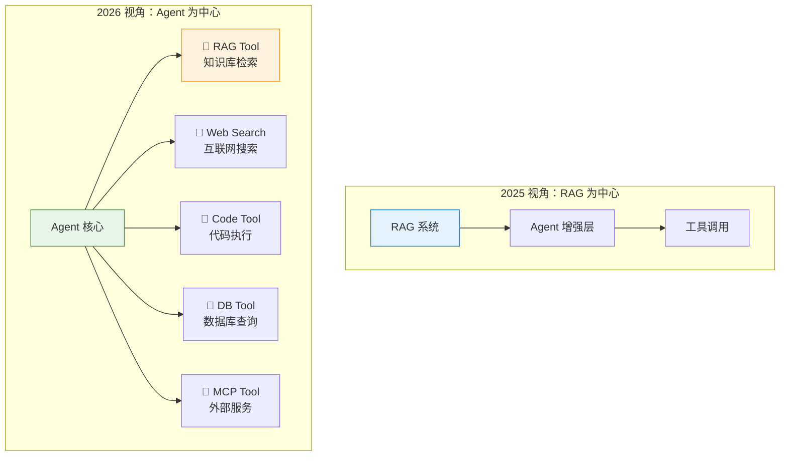
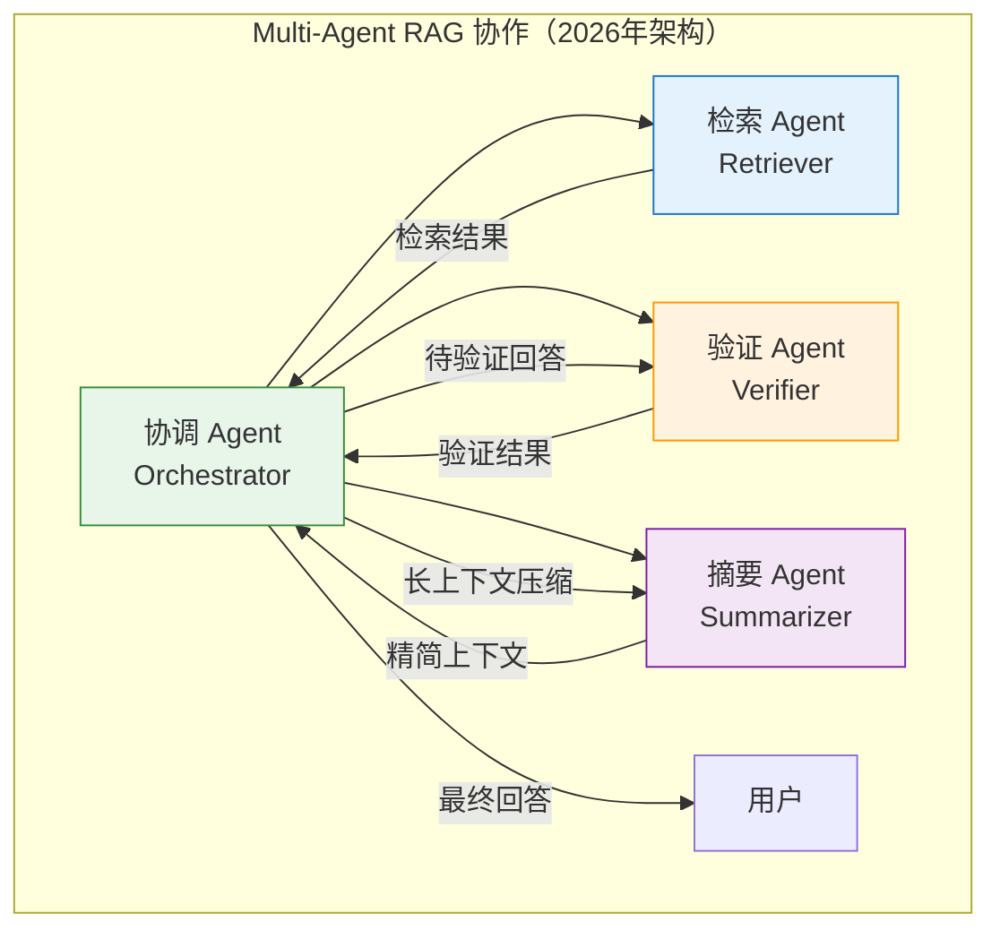
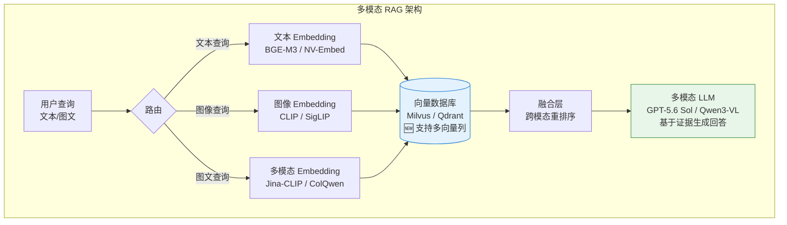
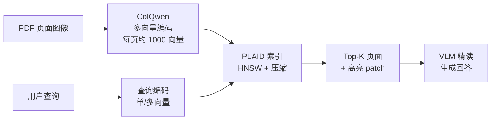
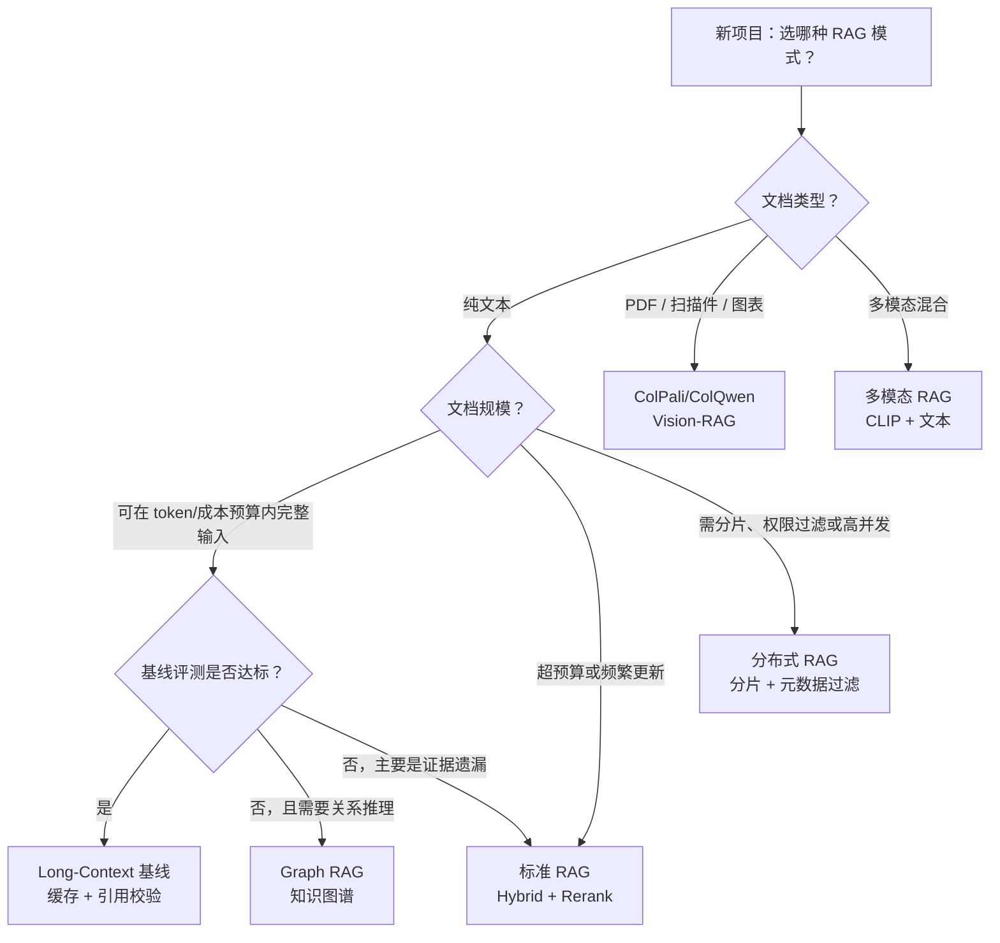
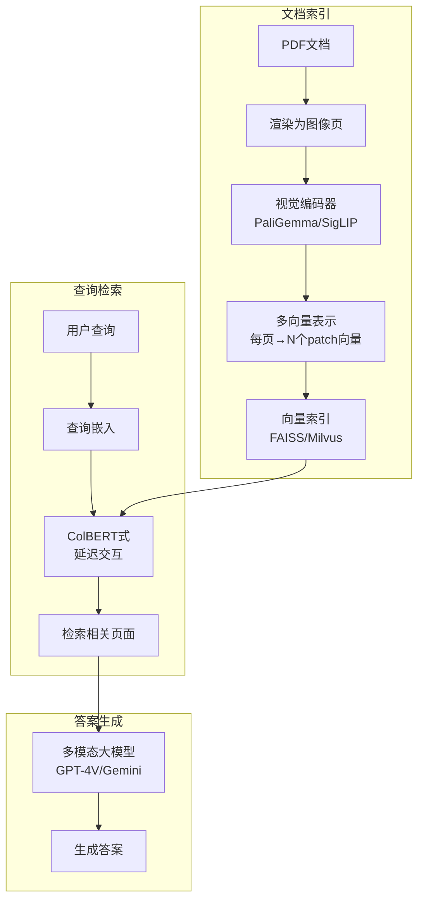
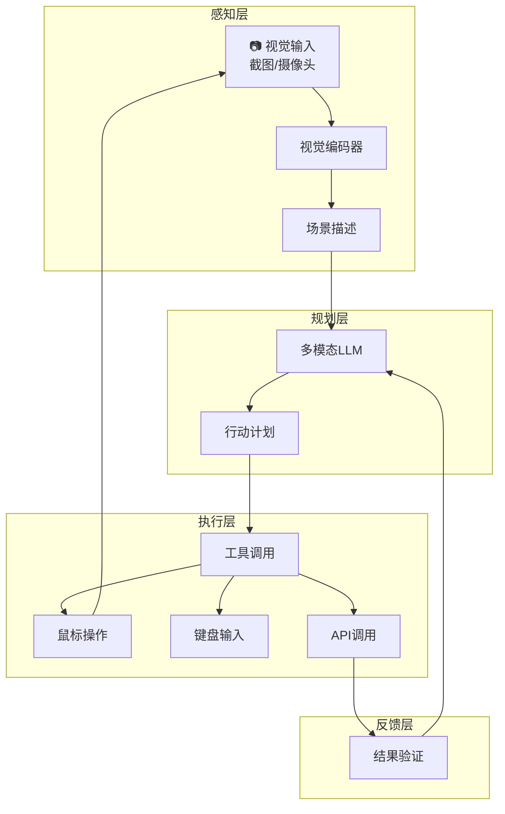

# 第 21 章 生产级 RAG 系统 ⭐⭐⭐⭐
> [!abstract] 本章导航
> **定位**：第三部分 Prompt、Context 与 RAG中的第 21 章；围绕“生产级 RAG 系统”建立单一、可追踪的知识主线。
>
> **先修**：[[20_RAG检索重排与高级方法|第 20 章 RAG 检索、重排与高级方法]]。
>
> **学习目标**：
> - 解释 RAG 与 Agent 的融合（2026年趋势） ⭐⭐⭐⭐⭐ 的核心问题、机制与适用边界。
> - 实现或评估 多模态 RAG ⭐⭐⭐⭐ 的最小闭环。
> - 使用可复现证据诊断 2026年新RAG模式 ⭐⭐⭐⭐⭐ 的工程取舍与失败模式。
>
> **建议路径**：RAG 与 Agent 的融合（2026年趋势） ⭐⭐⭐⭐⭐ → 多模态 RAG ⭐⭐⭐⭐ → 2026年新RAG模式 ⭐⭐⭐⭐⭐ → 多模态RAG与Agent。
>
> **配套代码**：`code/ch19_rag_indexing/`、`code/ch47_multimodal/`。

本章先回答“RAG 与 Agent 的融合（2026年趋势） ⭐⭐⭐⭐⭐”为什么成立，再沿着机制、实现、评估和边界逐步展开。阅读时先建立因果链，再运行或推演示例，最后用章末自测检查能否脱离原文复述。
## 21.1 RAG 与 Agent 的融合（2026年趋势） ⭐⭐⭐⭐⭐

> **2026年更新**：Agentic RAG 从"前沿概念"演进为**工程标配**。2026年面试的高频问题是：**"RAG 和 Agent 是什么关系？"** 核心答案：**RAG 是 Agent 的一种 Tool Calling**。

### 21.1.1 从 Agentic RAG 到 RAG-as-a-Tool

2025 年的 Agentic RAG 让 Agent "使用" 了 RAG 能力。2026 年的范式升级是 **RAG 被重新定义为 Agent 工具箱中的一个标准工具**，与 Web Search、Code Execution、Database Query 处于同一抽象层级。



**核心区别**：

| 维度 | 2025 Agentic RAG | 2026 RAG-as-a-Tool |
|------|-----------------|-------------------|
| **架构定位** | RAG 是主框架，Agent 是增强模块 | Agent 是主框架，RAG 是工具之一 |
| **检索策略** | Agent 决定检索方式 | Agent 决定是否调用 RAG（可能选择其他工具） |
| **知识来源** | 以内置知识库为主 | 多个 RAG 工具对应多个知识库 |
| **MCP 集成** | 手动对接 | 通过 MCP 协议标准化接入 |
| **面试考察点** | 实现方式 | **架构设计 + 工具抽象** |

### 21.1.2 MCP 与 RAG 的工程化集成

2026 年 MCP（Model Context Protocol）从概念普及进入**工程化管理阶段**，RAG 系统通过 MCP 暴露为标准化工具：

```python
# 🆕 2026年：RAG 作为 MCP Tool 的架构
from mcp.server import Server
from mcp.types import Tool, TextContent

class RAGMCPTool:
    """
    将 RAG 系统封装为 MCP Tool —— 2026年工程标准

    这样任何支持 MCP 的 Agent（Claude、GPT、自研 Agent）
    都可以通过统一接口调用 RAG 能力
    """

    def __init__(self, vectorstore, embedder, top_k: int = 5):
        self.vectorstore = vectorstore
        self.embedder = embedder
        self.top_k = top_k

    async def handle_tool_call(self, name: str, arguments: dict) -> list[TextContent]:
        """MCP Tool 调用入口"""
        query = arguments.get("query", "")
        filters = arguments.get("filters", {})  # 🆕 元数据过滤

        # 执行检索
        docs = self.vectorstore.similarity_search(
            query,
            k=self.top_k,
            filter=filters  # 按 source/tag/date 过滤
        )

        # 格式化返回（MCP 标准格式）
        results = []
        for i, doc in enumerate(docs, 1):
            results.append(
                f"[{i}] 来源: {doc.metadata.get('source', 'unknown')}\n"
                f"相关度: {doc.metadata.get('score', 'N/A')}\n"
                f"内容: {doc.page_content[:500]}"
            )

        return [TextContent(type="text", text="\n\n---\n\n".join(results))]

    def get_tool_definition(self) -> Tool:
        """MCP Tool 定义 —— 让 Agent 知道何时调用 RAG"""
        return Tool(
            name="knowledge_base_search",
            description=(
                "从企业知识库中检索相关信息。"
                "适用于：公司政策、技术文档、产品手册、历史数据等内部知识查询。"
                "当问题涉及公司内部信息时使用此工具。"
            ),
            inputSchema={
                "type": "object",
                "properties": {
                    "query": {"type": "string", "description": "检索查询"},
                    "filters": {
                        "type": "object",
                        "description": "可选的元数据过滤条件（source/tag/date）",
                    },
                },
                "required": ["query"],
            },
        )
```

### 21.1.3 Skills 与 MCP 的区分（2026年面试高频考点）

2026 年一个重要面试考点是 **Skills 和 MCP 的区别**：

| 维度 | **MCP（Model Context Protocol）** | **Skills（技能系统）** |
|------|----------------------------------|----------------------|
| **本质** | 通信协议 | 能力描述 + 实现封装 |
| **作用** | 标准化 Agent ↔ Tool 的交互方式 | 定义 Agent 能做什么 |
| **关注点** | "如何调用"（协议层） | "能做什么 + 如何做"（语义层） |
| **类比** | HTTP（传输协议） | REST API（接口定义） |
| **关系** | MCP 是 Skills 的**传输载体** | Skills 是 MCP 的**语义上层** |

**一句话记忆**：MCP 是"电线"，Skills 是"电器+说明书"。

### 21.1.4 多 Agent RAG 协作架构

2026 年 Claude 4.6/4.7 引入 **Agent Teams** 概念，多 Agent 可以协作完成复杂的 RAG 任务：



**多 Agent RAG 的优势**：
1. **职责分离**：检索 Agent 专注召回率，验证 Agent 专注 Faithfulness，各自优化
2. **并行执行**：多个子查询可以同时分发到不同的检索 Agent
3. **迭代深化**：验证 Agent 发现信息不足时，反馈给协调 Agent 重新检索
4. **质量控制**：摘要 Agent 负责上下文压缩，避免超长上下文稀释注意力

## 21.2 多模态 RAG ⭐⭐⭐⭐

> **2026年新方向**：RAG 不再局限于文本，图文混合检索成为新热点。面试中"多模态 RAG 的技术挑战"已成为高频题。

### 21.2.1 多模态 RAG 场景与架构

多模态 RAG 处理**文本 + 图像 + 表格 + 音频**的混合检索：



### 21.2.2 多模态 Embedding 选型（2026年）

| 模型 | 模态 | 维度 | 适用场景 | 特点 |
|------|------|------|---------|------|
| **CLIP** | 图文 | 512 | 通用图文检索 | OpenAI 经典模型，广泛支持 |
| **SigLIP** | 图文 | 768 | 精细图文匹配 | Google 出品，精度优于 CLIP |
| **Jina-CLIP** | 图文 | 768 | 多语言图文 | 支持中文图文混合检索 |
| **ColQwen** | 图文 | 变长 | 文档理解 | 专门针对文档图像优化 |
| **NV-Embed-v2** | 纯文本 | 4096 | 高精度文本 | NVIDIA SOTA，纯文本首选 |

### 21.2.3 多模态 RAG 的技术挑战

面试高频问题：多模态 RAG 相比纯文本 RAG 有哪些额外挑战？

| 挑战 | 说明 | 解决方向 |
|------|------|---------|
| **模态对齐** | 文本和图像的 Embedding 空间不一致 | 用多模态预训练模型统一编码空间 |
| **跨模态检索** | 文本查询找图像（或反之） | 共享 Embedding 空间 + 跨模态重排序 |
| **图文关联分块** | 图像和附近文本应作为整体检索 | 文档解析时保留版面结构（Layout-aware chunking） |
| **OCR 质量** | 图像中的文字提取准确率影响检索 | 专用 OCR 模型（PaddleOCR/EasyOCR）+ 后校验 |
| **显存压力** | 图像 Embedding 计算量大 | 图像预压缩 + 缓存策略 |
| **评估复杂** | 多模态结果的 Faithfulness 更难判断 | 需要专门的多模态评估框架 |

```python
# 🆕 多模态 RAG 简化实现
class MultimodalRAG:
    """多模态 RAG：支持文本 + 图像混合检索"""

    def __init__(self, text_embedder, image_embedder, multimodal_llm):
        self.text_embedder = text_embedder   # 文本 Embedding 模型
        self.image_embedder = image_embedder  # CLIP/SigLIP 图像编码器
        self.llm = multimodal_llm            # 多模态大模型（如 Qwen-VL）
        self.doc_store = []   # 文档存储
        self.image_store = [] # 图像存储

    def index_document(self, text_chunks: list[str], images: list[np.ndarray]):
        """索引文档：文本和图像分别编码"""
        # 文本编码
        text_embeddings = self.text_embedder.encode(text_chunks)
        for chunk, emb in zip(text_chunks, text_embeddings):
            self.doc_store.append({"type": "text", "content": chunk, "embedding": emb})

        # 图像编码
        if images:
            image_embeddings = self.image_embedder.encode(images)
            for img, emb in zip(images, image_embeddings):
                self.image_store.append({"type": "image", "content": img, "embedding": emb})

    def retrieve(self, query: str, query_image: np.ndarray = None, top_k: int = 5):
        """
        多模态检索：支持纯文本查询、纯图像查询、图文查询
        """
        results = []

        # 文本检索
        query_text_emb = self.text_embedder.encode([query])
        text_scores = cosine_similarity(query_text_emb,
            [d["embedding"] for d in self.doc_store])
        for i, score in enumerate(text_scores[0]):
            results.append(("text", i, score))

        # 图像检索（如果有查询图像）
        if query_image is not None:
            query_img_emb = self.image_embedder.encode([query_image])
            img_scores = cosine_similarity(query_img_emb,
                [d["embedding"] for d in self.image_store])
            for i, score in enumerate(img_scores[0]):
                results.append(("image", i, score))

        # 按相似度排序
        results.sort(key=lambda x: x[2], reverse=True)
        return results[:top_k]

    def generate(self, query: str, retrieved_items: list) -> str:
        """使用多模态 LLM 生成回答"""
        # 组装多模态 Prompt（文本 + 图像）
        messages = [{"role": "user", "content": []}]

        # 添加检索到的文本
        for item_type, idx, score in retrieved_items:
            if item_type == "text":
                messages[0]["content"].append({
                    "type": "text",
                    "text": f"[相关文档]\n{self.doc_store[idx]['content']}\n"
                })
            elif item_type == "image":
                messages[0]["content"].append({
                    "type": "image",
                    "image": self.image_store[idx]['content']
                })

        # 添加用户问题
        messages[0]["content"].append({"type": "text", "text": f"\n问题：{query}"})

        return self.llm.chat(messages)


def cosine_similarity(a, b):
    """计算余弦相似度"""
    from sklearn.metrics.pairwise import cosine_similarity as cs
    return cs(np.array(a), np.array(b))
```

## 21.3 2026年新RAG模式 ⭐⭐⭐⭐⭐

> **2026年最新趋势**：随着 ColPali、Contextual Retrieval、Long-context LLM 等技术成熟，RAG 正从"传统向量检索"向"多模态 + 上下文增强 + 延迟交互"演进。本节汇总 2025-2026 年最值得关注的 8 个 RAG 新方向，是 2026 年面试的**高阶加分项**。

### 21.3.1 Vision-RAG：ColPali / ColQwen（无 OCR 文档图像检索）

传统 RAG 必须先 OCR 提取文字，但 PDF 中的图表、公式、复杂排版往往在 OCR 阶段就丢失语义。**ColPali**（2024）与 **ColQwen**（基于 Qwen2-VL）提出**直接对文档图像做 Embedding**：

- **核心思想**：将整页文档图像喂给 VLM，输出**多向量表示**（每个 patch 一个向量）
- **检索方式**：ColBERT-style 延迟交互（late interaction），计算查询与图像块的最大相似度
- **优势**：完全跳过 OCR，保留版式、图表、手写体等视觉信息
- **代价**：存储成本高（每页约 1024 个向量），需专门的向量库



```python
# ColQwen Vision-RAG 简化示例
from colpali_engine.models import ColQwen2, ColQwen2Processor
import torch
from PIL import Image

# 1. 加载视觉-文档编码器
model = ColQwen2.from_pretrained(
    "vidore/colqwen2-v1.0",
    torch_dtype=torch.bfloat16,
    device="cuda",
)
processor = ColQwen2Processor.from_pretrained("vidore/colqwen2-v1.0")

# 2. 编码文档图像（每页 PDF 转 PNG）
page_images = [Image.open(f"page_{i}.png") for i in range(10)]
batch = processor.process_images(page_images).to(model.device)
with torch.no_grad():
    doc_embeddings = model(**batch)  # [B_pages, P_patches, D_dim]

# 3. 编码查询
query_batch = processor.process_queries(["RAG 的核心思想是什么？"]).to(model.device)
with torch.no_grad():
    query_embeddings = model(**query_batch)  # [1, Q_tokens, D_dim]

# 4. 延迟交互打分（max-sim 算子）
scores = processor.score_multi_vector(query_embeddings, doc_embeddings)
top_k_indices = scores[0].topk(3).indices.tolist()
```

### 21.3.2 Contextual Retrieval（Anthropic 2024）

Anthropic 2024 年提出的 **Contextual Retrieval** 通过在 Embedding 和 BM25 建索引前，
**为每个 chunk 注入文档级上下文**。在 Anthropic 公布的语料与 top-20 配置中，
Contextual Embeddings 将检索失败率从 5.7% 降到 3.7%（相对下降 35%），再结合
Contextual BM25 后降到 2.9%（相对下降 49%）。这是特定实验结果，不是所有知识库的固定提升：

- **传统问题**：chunk "年假 15 天"脱离上下文后，无法判断属于哪个公司、哪种员工
- **解决方案**：用 LLM 给每个 chunk 生成 50-100 token 的上下文前缀，再合并 Embedding
- **配合 BM25**：同一上下文同时用于稠密向量与稀疏索引，是否增益须在自己的 Golden Dataset 上复测
- **代价**：索引阶段增加 LLM 调用与 token 成本；价格随模型、缓存和文档长度变化，不写固定单价

> 来源：[Anthropic — Introducing Contextual Retrieval](https://www.anthropic.com/engineering/contextual-retrieval)。

```python
# Contextual Retrieval 简化实现（生产中需补充缓存、重试与评测）
import os
from anthropic import Anthropic

client = Anthropic()
ANTHROPIC_MODEL = os.getenv("ANTHROPIC_MODEL", "claude-haiku-4-5")


def add_context_to_chunk(chunk: str, full_document: str) -> str:
    """为每个 chunk 注入 LLM 生成的上下文描述"""
    prompt = f"""以下是文档的一个片段，请用 50-100 字简要说明这个片段的上下文，
    使其脱离原文后仍能独立理解。包括：文档主题、关键实体、与上下文的关系。

    完整文档（前 2000 字摘要）：
    {full_document[:2000]}

    目标片段：
    {chunk}

    上下文描述（简洁，不要重复片段内容）："""

    response = client.messages.create(
        model=ANTHROPIC_MODEL,  # 当前低延迟基线；上线前按质量、延迟与成本评测
        max_tokens=200,
        messages=[{"role": "user", "content": prompt}],
    )
    context = response.content[0].text
    return f"[上下文：{context}]\n\n{chunk}"  # 合并后一起 Embedding
```

### 21.3.3 Late Chunking（jina.ai Contextual Chunking）

Jina AI 提出的 **Late Chunking** 调整了“先切分再 Embedding”的处理顺序：

- **传统流程**：`文档 → 切 chunk → 每 chunk 独立 Embedding`（上下文丢失）
- **Late Chunking**：`文档 → 整篇 Embedding → 按 token 位置切分`（保留全局上下文）

**核心原理**：用 Long-Context Embedding 模型（如 jina-embeddings-v3，8K tokens）对整篇文档做一次编码，**每个 token 的 Embedding 都已包含完整上下文**；然后按 chunk 边界对 token Embedding 做 pooling，得到 chunk Embedding。

```python
# jina Late Chunking 示例
import requests


def late_chunking(document: str, chunk_size: int = 512) -> list[list[float]]:
    response = requests.post(
        "https://api.jina.ai/v1/embeddings",
        headers={"Authorization": f"Bearer {JINA_API_KEY}"},
        json={
            "model": "jina-embeddings-v3",
            "input": [document],  # 整篇文档
            "task": "retrieval.passage",
            "late_chunking": True,  # 开启 late chunking
            "embedding_dim": 1024,
        },
    )
    # 返回 [N_chunks, D] 矩阵
    return response.json()["data"][0]["embeddings"]
```

### 21.3.4 ColBERTv2 / PLAID（Late-Interaction 范式）

ColBERT 系列是**延迟交互范式**的代表：

- **Bi-Encoder**：查询和文档各自编码 → 点积（快但精度低）
- **Cross-Encoder**：查询和文档拼接 → 完整注意力（精确但不可索引）
- **ColBERT / ColBERTv2 / PLAID**：**多向量独立编码 + 检索时 Max-Sim 打分**（折中方案）

| 范式 | 编码方式 | 检索打分 | 速度 | 精度 | 索引可行性 |
|------|---------|---------|------|------|----------|
| Bi-Encoder | 独立 | 点积 | 极快 | 中 | ✅ |
| Cross-Encoder | 联合 | 单次前向 | 极慢 | 极高 | ❌ |
| **ColBERTv2/PLAID** | 独立 | **Max-Sim 延迟交互** | 中 | 高 | ✅（压缩后） |

```python
# ColBERTv2 / PLAID 检索示例
from pylate import models, retrieve

model = models.ColBERT(
    model_name_or_path="lightonai/colbertv2.0",
    device="cuda",
)

# 文档索引（每个文档产出多个 token-level 向量）
documents = ["RAG 是检索增强生成", "ColBERT 是延迟交互模型"]
documents_embeddings = model.encode(
    documents, is_query=False, show_progress_bar=True
)

# PLAID 索引（多向量 + 压缩）
index = retrieve.PLAID(
    indexing_batch_size=128, index_folder="pylate_index"
)
index = index.add_documents(documents=documents, embeddings=documents_embeddings)

# 查询
query_embeddings = model.encode(
    ["什么是 RAG？"], is_query=True, show_progress_bar=True
)
scores = index.retrieve(queries_embeddings=query_embeddings, k=5)
```

### 21.3.5 混合检索终极形态：BM25 + Dense + Cross-Encoder + RRF

2026 年生产级 RAG 的**标配三段式**：

1. **第一路 BM25**：精确关键词匹配（ID、型号、专有名词）
2. **第二路 Dense**：语义相似度（召回更多可能相关的内容）
3. **第三路 Cross-Encoder**：精排前 50-100 个候选
4. **RRF 融合** BM25 + Dense → Cross-Encoder 精排 → Top-K

| 检索层 | 召回目标 | 典型模型 | 候选规模 |
|--------|---------|---------|---------|
| **稀疏层** | 精确关键词 | BM25 / SPLADE / BGE-M3-sparse | Top-100 |
| **稠密层** | 语义匹配 | BGE-M3 / text-embedding-3 / NV-Embed | Top-100 |
| **精排层** | 交互精排 | bge-reranker-v2-m3 / Cohere Rerank 3.5 | Top-10 |

### 21.3.6 Long-Context RAG vs 传统 RAG 权衡

部分模型已经公布百万级上下文窗口，但**上下文上限只是可接收的 token 数**，不等于模型能在任意位置
稳定找回全部证据，也不代表每个账号、区域和 API 端点都采用同一限制。模型窗口、长输入计价和端点支持
应在上线前读取具体模型页；选型仍需用目标语料测引用正确率、答案完整性、P50/P95 延迟和单请求成本。

| 维度 | 传统 RAG | Long-Context RAG |
|------|---------|-----------------|
| **证据覆盖** | 受分块、召回与重排影响，可直接评测 recall@k | 全量输入仍可能受位置偏置、注意力稀释和提示结构影响，不能声称 100% |
| **Token 成本** | 通常只发送 Top-K 证据，但增加索引与检索成本 | 随实际输入长度、缓存命中和模型计价变化 |
| **延迟** | 增加检索/重排链路；可并行、缓存和预取 | 增加长序列 prefill；实际值受硬件、服务层级、区域与并发影响 |
| **多文档交叉** | 需要融合并保留文档 ID、页码等证据元数据 | 可直接联合阅读，但跨文档推理质量必须实测 |
| **可解释性** | 高（可追溯来源） | 中（需引用标注） |
| **适用边界** | 大规模、频繁更新、需权限过滤或低单次输入预算的语料 | 能在 token/成本预算内完整输入且更新较少的材料 |

**面试回答要点**：

- **材料可完整输入**：把 Long-Context + prompt caching 作为候选基线，用评测决定是否优于 RAG
- **语料大、更新快或有行级权限**：优先 RAG，以召回、重排和证据过滤控制输入
- **混合方案**：先用 RAG 召回候选文档，再由长上下文模型精读；Top-K 由覆盖率与成本曲线确定

> 例：[GPT-5.6 Sol 模型页](https://developers.openai.com/api/docs/models/gpt-5.6-sol)与
> [Gemini 3.6 Flash 模型页](https://ai.google.dev/gemini-api/docs/models/gemini-3.6-flash)
> 都给出各自的输入上限和约束；这些数字不能跨模型、跨端点套用。

### 21.3.7 MRL（Matryoshka Representation Learning）Embeddings

MRL 让 Embedding 支持**可变维度截断**：

- 训练时让模型学会在不同维度下都保留有效信息
- 推理时可按需截断（如 1024 维 → 256 维，节省 75% 存储）
- 短维度检索速度更快，长维度精度更高

```python
# MRL Embedding 使用（OpenAI text-embedding-3 系列原生支持）
import openai

response = openai.embeddings.create(
    model="text-embedding-3-large",
    input="RAG 是检索增强生成",
    dimensions=512,  # 可选 256, 512, 1024, 3072
)
vector = response.data[0].embedding  # 512 维向量
```

### 21.3.8 2026 年主流 Reranker 选型

| 模型 | 厂商 | 多语言 | 速度 | 精度 | 适用场景 |
|------|------|--------|------|------|---------|
| **Cohere Rerank 3.5** | Cohere | ✅ 100+ 语言 | API 调用 | SOTA | 生产首选，闭源 |
| **bge-reranker-v2-m3** | BAAI | ✅ 多语言 | GPU 推理 | 高 | 开源首选，中文友好 |
| **bge-reranker-v2-gemma** | BAAI | ✅ | 较慢 | 极高 | 高精度场景 |
| **Jina Reranker v2** | Jina | ✅ 100+ 语言 | API 调用 | 高 | 多语言生产环境 |
| **mxbai-rerank-large** | Mixedbread | 英文为主 | 极快 | 高 | 英文场景 |
| **Qwen3-Reranker** | Alibaba | ✅ 中英 | 中 | 高 | 阿里生态集成 |

```python
# bge-reranker-v2-m3 重排序示例
from FlagEmbedding import FlagReranker

reranker = FlagReranker(
    "BAAI/bge-reranker-v2-m3", use_fp16=True, device="cuda"
)

query = "什么是 RAG？"
candidates = [
    "RAG 是检索增强生成，结合检索与生成。",
    "今天天气不错，适合出游。",
    "RAG 通过向量检索为 LLM 提供外部知识。",
]

# 返回每个候选的相关性分数
scores = reranker.compute_score([[query, c] for c in candidates])
# scores = [0.95, 0.02, 0.89]
```

### 21.3.9 2026 年 RAG 模式选型决策树



| 决策点 | 推荐方案 | 关键理由 |
|--------|---------|---------|
| **PDF 含复杂版式** | ColPali/ColQwen | OCR 会丢失图表信息 |
| **材料可在预算内完整输入** | Long-Context 基线 | 避免分块误差，但仍需验证证据覆盖 |
| **语料超出输入预算或频繁更新** | Hybrid RAG + 分片索引 | 控制单次输入并支持增量更新 |
| **多跳关联查询** | Graph RAG | 向量检索无法做关系推理 |
| **对生成延迟敏感** | 精简 RAG 链路 + 缓存 | 用同环境压测 P50/P95，不能承诺固定毫秒数 |
| **多语言混合** | bge-m3 + bge-reranker-v2-m3 | 单模型多语言支持 |

### 21.3.10 2026 年新 RAG 模式回答要点

1. **ColPali 的核心创新**："跳过 OCR，直接 Embedding 文档图像 —— 用 VLM 的多向量 + 延迟交互替代传统 OCR+文本检索 pipeline。"
2. **Contextual Retrieval 的本质**："用 LLM 给每个 chunk 注入上下文，再做 Embedding —— 把 chunk 失去的上下文补回来。"
3. **Late Chunking 的精髓**："先 Embedding 整篇文档，再按位置切分 —— 让每个 token 的 Embedding 都保留全局上下文。"
4. **Long-Context vs RAG**："能否完整输入只是第一道门槛；最终用证据覆盖、引用正确率、P95 延迟和成本选型。"
5. **MRL 的价值**："一个 Embedding 多种维度，按需截断 —— 牺牲少量精度换 75% 存储节省。"
6. **Reranker 选型**："闭源选 Cohere Rerank 3.5，开源中文选 bge-reranker-v2-m3，多语言选 Jina Reranker v2。"

## 21.4 多模态RAG与Agent

### 21.4.1 多模态文档检索

传统RAG只能处理文本，**多模态RAG**将检索范围扩展到图像、表格、图表等视觉元素。

**ColPali**（2024）是多模态文档检索的代表性工作：



**ColPali 核心思想**：不经过OCR转写，直接用视觉编码器处理文档图像，保留所有视觉布局信息（表格结构、图表、排版），然后使用 ColBERT 风格的延迟交互进行检索。

### 21.4.2 多模态Agent架构

多模态Agent是在传统Agent基础上增加了视觉感知和操作能力：



**2026年多模态Agent典型应用**：
1. **GUI Agent**（Claude computer use、OpenAI Responses API 的 computer use 工具）：操控桌面/网页应用
2. **视觉QA Agent**：分析图表、报告并生成洞察
3. **多模态代码Agent**：理解设计稿生成前端代码
4. **具身智能Agent**：机器人视觉导航与操作

### 21.4.3 多模态 RAG：先把检索骨架做对

配套示例只验证 late interaction 的核心评分，不把随机 query 向量、固定回答或缺失 PDF 后的
fallback 冒充端到端系统：

```python
def maxsim_score(query_vectors, document_vectors):
    similarities = query_vectors @ document_vectors.T
    return float(similarities.max(axis=1).sum())
```

一个可验收的多模态 RAG 还需要：

1. 用同一受支持 checkpoint/processor 分别编码真实查询和页面图像；
2. 对 embedding 维度、归一化、空文档、批处理和索引 revision 做断言；
3. 保存 `page_id → source/document/page/hash` 溯源，检索指标用独立标注集评测；
4. 把真实检索页按目标 VLM 的当前图像输入格式发送，并验证回答引用；
5. 分开记录 retrieval、rerank、generation 的延迟、错误与成本。

`code/ch47_multimodal/gpu/11_multimodal_rag.py` 因而标为 **STRUCTURE ONLY**；真实 ColPali/
VLM 路径必须在锁定模型、数据和服务的环境单独验收。
## 🧭 本章小结

- RAG 与 Agent 的融合（2026年趋势） ⭐⭐⭐⭐⭐：能够说清问题、机制、证据与边界。
- 多模态 RAG ⭐⭐⭐⭐：能够说清问题、机制、证据与边界。
- 2026年新RAG模式 ⭐⭐⭐⭐⭐：能够说清问题、机制、证据与边界。

## ✅ 自测与练习

1. 不看正文，解释“RAG 与 Agent 的融合（2026年趋势） ⭐⭐⭐⭐⭐”解决什么问题，并给出一个不适用场景。
2. 为“多模态 RAG ⭐⭐⭐⭐”设计一个最小可复现实验，明确输入、指标和通过条件。
3. 比较“2026年新RAG模式 ⭐⭐⭐⭐⭐”的至少两种方案，说明质量、成本、延迟或风险取舍。

## 🧪 配套代码与验收

- `code/ch19_rag_indexing/`
- `code/ch47_multimodal/`

```powershell
python code/scripts/run_all_examples.py --chapter ch19 --tier core
python code/scripts/run_all_examples.py --chapter ch47 --tier core
```

默认验收不下载模型、不调用付费 API；真实 API 或 GPU 示例必须按 metadata 显式启用。成功标准是相关脚本输出 `OK`，条件不足时输出可解释的 `[SKIP]`。

## 🎯 面试题精讲

回答本章问题时使用四步结构：先给结论，再解释机制，然后给项目证据，最后主动说明适用边界。涉及性能或效果时，补充模型、硬件、数据、并发、版本和统计口径；条件不完整时明确说“需要实测”。

## 📋 本章速查表

| 主题 | 回答主线 |
|---|---|
| RAG 与 Agent 的融合（2026年趋势） ⭐⭐⭐⭐⭐ | 问题 → 机制 → 示例 → 指标 → 边界 |
| 多模态 RAG ⭐⭐⭐⭐ | 问题 → 机制 → 示例 → 指标 → 边界 |
| 2026年新RAG模式 ⭐⭐⭐⭐⭐ | 问题 → 机制 → 示例 → 指标 → 边界 |
| 多模态RAG与Agent | 问题 → 机制 → 示例 → 指标 → 边界 |

## 🔗 相关章节

- [[20_RAG检索重排与高级方法|第 20 章 RAG 检索、重排与高级方法]]
- [[22_Agent基础与工具调用|第 22 章 Agent 基础与工具调用]]

## 📖 一手参考资料

> 核验基线：2026-07-31；结构复核：2026-08-05。产品、API、法规、价格与 benchmark 会变化，使用前应再次核验。

- [[docs/AUTHORITATIVE_SOURCES|章节权威来源索引]]：按主题维护官方文档、标准、原论文和官方仓库。
