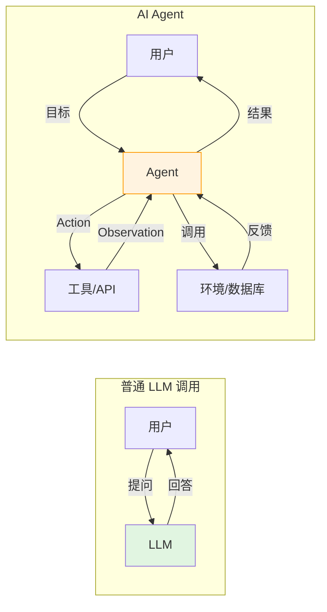
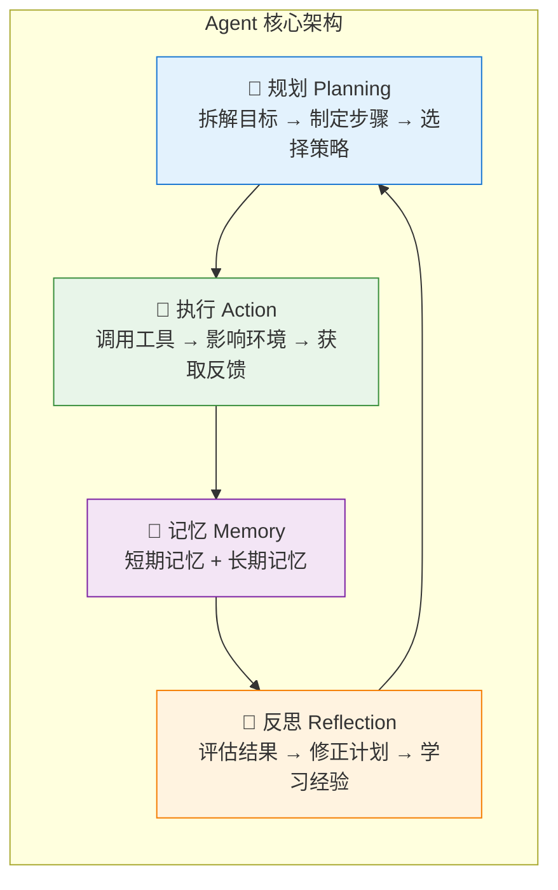
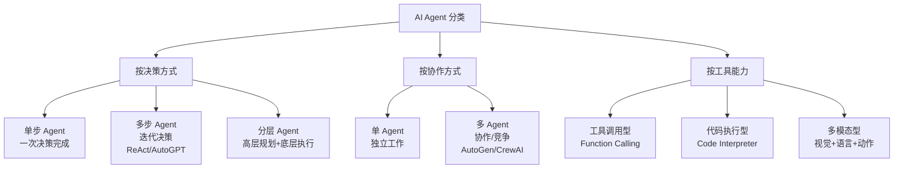
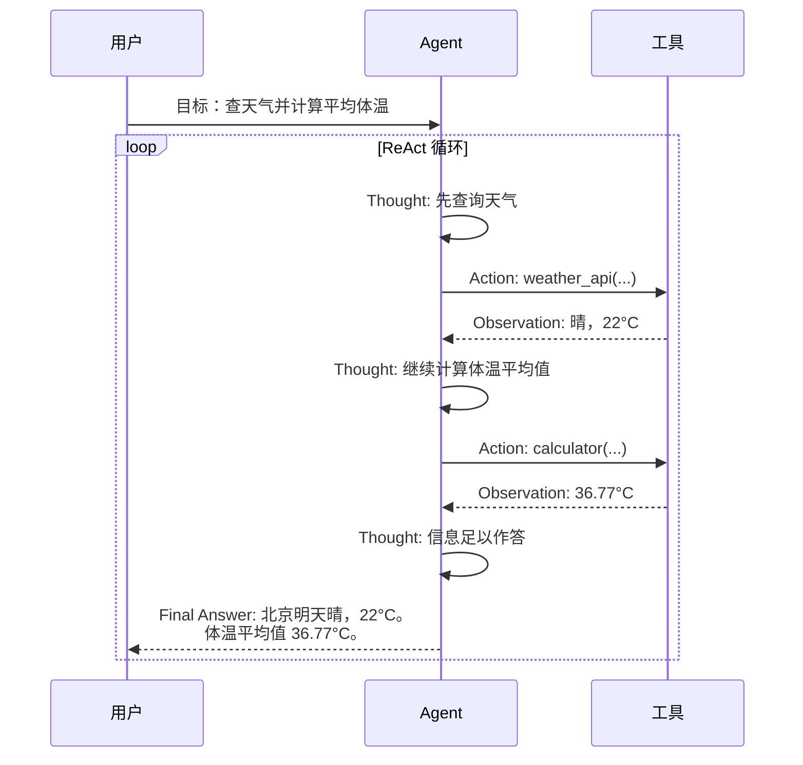
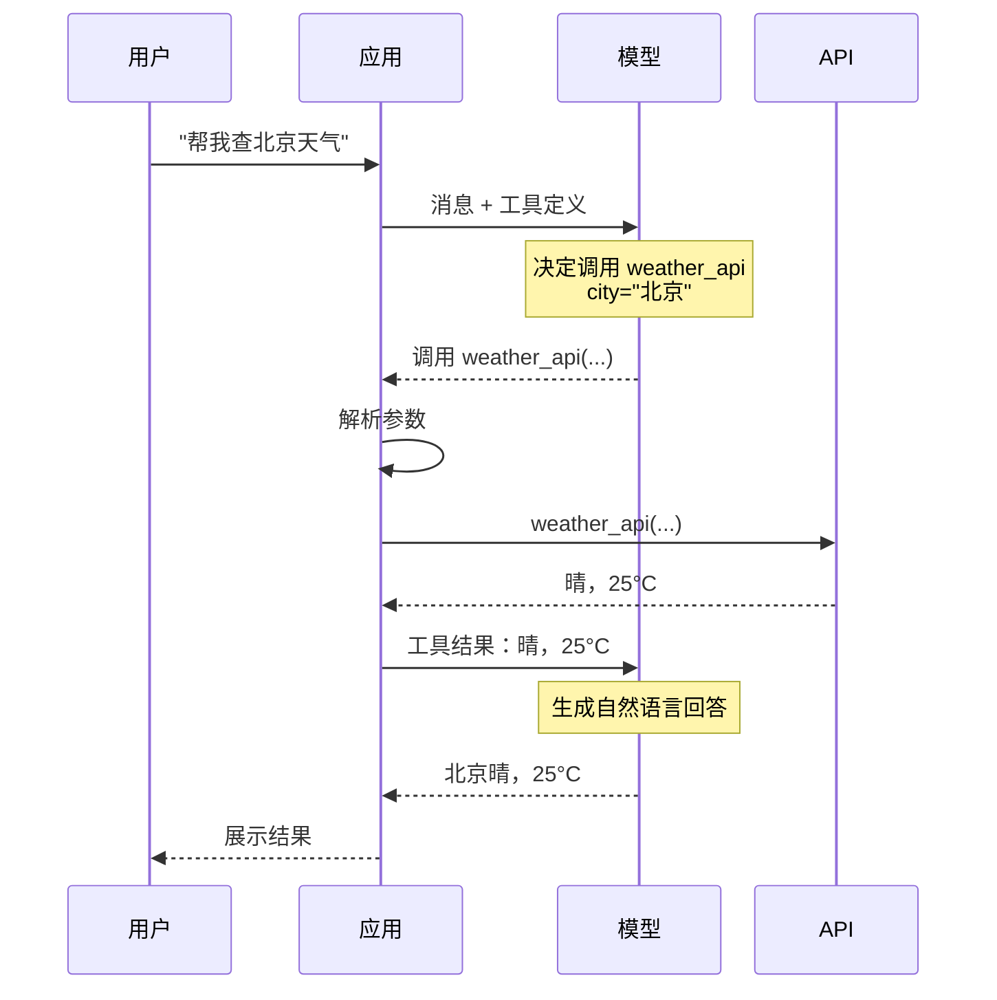

# 第 22 章 Agent 基础与工具调用 ⭐⭐⭐⭐
> [!abstract] 本章导航
> **定位**：第四部分 Agent 与工程框架中的第 22 章；围绕“Agent 基础与工具调用”建立单一、可追踪的知识主线。
>
> **先修**：[[21_生产级RAG系统|第 21 章 生产级 RAG 系统]]。
>
> **学习目标**：
> - 解释 Agent 基础概念 ⭐⭐⭐⭐⭐ 的核心问题、机制与适用边界。
> - 实现或评估 ReAct 框架 ⭐⭐⭐⭐⭐ 的最小闭环。
> - 使用可复现证据诊断 Function Calling ⭐⭐⭐⭐⭐ 的工程取舍与失败模式。
>
> **建议路径**：Agent 基础概念 ⭐⭐⭐⭐⭐ → ReAct 框架 ⭐⭐⭐⭐⭐ → Function Calling ⭐⭐⭐⭐⭐ → Agent 工程面试边界 → 实时交互与 Agent 设计原则。
>
> **配套代码**：`code/ch22_agent_tools/`。

本章先回答“Agent 基础概念 ⭐⭐⭐⭐⭐”为什么成立，再沿着机制、实现、评估和边界逐步展开。阅读时先建立因果链，再运行或推演示例，最后用章末自测检查能否脱离原文复述。
## 22.1 Agent 基础概念 ⭐⭐⭐⭐⭐

### 22.1.1 什么是 AI Agent

AI Agent（人工智能智能体）是一个能够**感知环境、自主决策、执行行动**的系统。与大模型的单次调用不同，Agent 具备**持续交互**和**目标驱动**的能力。

**普通 LLM 调用 vs Agent**：

| 维度 | 普通 LLM 调用 | AI Agent |
|------|-------------|----------|
| **交互模式** | 单轮/多轮对话 | 持续的感知-思考-行动循环 |
| **外部工具** | 无 | 可调用 API、搜索、数据库等 |
| **记忆能力** | 仅对话历史 | 短期+长期记忆 |
| **目标导向** | 逐轮响应 | 自主规划步骤达成目标 |
| **反思能力** | 无 | 可评估行动效果并调整 |



### 22.1.2 Agent 四大核心模块



#### 22.1.2.1 模块1：感知（Perception）

Agent 接收外部输入的方式：
- **用户指令**：自然语言描述的目标
- **工具返回值**：API 调用结果、数据库查询结果
- **环境状态**：系统状态、错误信息、时间等

#### 22.1.2.2 模块2：规划（Planning）⭐⭐⭐⭐⭐

规划是 Agent 的"大脑"，将复杂目标拆解为可执行的步骤：

| 规划类型 | 说明 | 示例 |
|----------|------|------|
| **单路径规划** | 线性步骤序列 | Step1→Step2→Step3 |
| **多路径规划** | 生成多个候选计划，评估后选择 | ToT（Tree of Thoughts）|
| **动态规划** | 根据执行反馈调整计划 | ReAct、Reflexion |
| **分层规划** | 高层目标 → 子目标 → 具体行动 | Hierarchical Agent |

#### 22.1.2.3 模块3：执行（Action）

执行模块负责**调用工具**改变环境状态。常见工具类型：

```python
# Agent 工具定义示例
TOOLS = [
    {
        "name": "web_search",
        "description": "搜索引擎，用于获取最新信息",
        "parameters": {
            "query": {"type": "string", "description": "搜索关键词"}
        }
    },
    {
        "name": "calculator",
        "description": "计算器，执行数学运算",
        "parameters": {
            "expression": {"type": "string", "description": "数学表达式"}
        }
    },
    {
        "name": "database_query",
        "description": "数据库查询",
        "parameters": {
            "sql": {"type": "string", "description": "SQL 语句"}
        }
    },
    {
        "name": "send_email",
        "description": "发送邮件",
        "parameters": {
            "to": {"type": "string"},
            "subject": {"type": "string"},
            "body": {"type": "string"}
        }
    },
]
```

#### 22.1.2.4 模块4：记忆（Memory）

记忆让 Agent 能够"记住"过去的经验和知识：

- **短期记忆（Short-term Memory）**：当前对话上下文，在 Prompt 中维护
- **长期记忆（Long-term Memory）**：向量数据库存储的历史经验、知识图谱
- **工作记忆（Working Memory）**：当前任务相关的临时信息

#### 22.1.2.5 模块5：反思（Reflection）

反思模块让 Agent 具备**自我评估**和**错误修正**能力：

```python
# 反思 Prompt 模板
REFLECTION_PROMPT = """请评估刚才的行动结果：

原目标：{goal}
执行计划：{plan}
实际行动：{action}
观察结果：{observation}

请回答：
1. 目标是否达成？（是/部分/否）
2. 如果未达成，原因是什么？
3. 下一步计划如何调整？
4. 有哪些经验可以记录到长期记忆中？
"""
```

### 22.1.3 Agent 分类



## 22.2 ReAct 框架 ⭐⭐⭐⭐⭐

### 22.2.1 ReAct 核心思想

ReAct（Reasoning + Acting）是 Agent 领域最具影响力的框架，核心思想是**将推理（Reasoning）和行动（Acting）交织在一起** —— 模型先思考（Thought），再决定行动（Action），然后观察结果（Observation），循环往复直到完成目标。

### 22.2.2 ReAct 决策流程



### 22.2.3 手写 ReAct Agent（完整实战）

```python
"""
从零实现 ReAct Agent - 完整可运行代码
"""
import json
import re
import os
from typing import Callable, Any

class Tool:
    """工具基类"""

    def __init__(self, name: str, description: str, func: Callable, params_schema: dict):
        self.name = name
        self.description = description
        self.func = func
        self.params_schema = params_schema

    def execute(self, **kwargs) -> str:
        """执行工具，返回字符串结果"""
        try:
            result = self.func(**kwargs)
            return str(result)
        except Exception as e:
            return f"错误：{str(e)}"

    def to_prompt_format(self) -> str:
        """转换为 Prompt 中的工具描述"""
        params_desc = "\n".join([
            f"  - {k}: {v.get('description', v.get('type', 'string'))}"
            for k, v in self.params_schema.get("properties", {}).items()
        ])
        return f"- {self.name}: {self.description}\n参数：\n{params_desc}"


class ReActAgent:
    """
    ReAct Agent 完整实现

    核心循环：Thought → Action → Observation → ... → Final Answer
    """

    def __init__(self, llm_api_key: str = None):
        self.tools: dict[str, Tool] = {}
        self.memory: list[dict] = []  # 历史记录
        self.max_iterations = 10      # 最大迭代次数，防止无限循环
        self.llm_api_key = llm_api_key or os.getenv("OPENAI_API_KEY")
        self.model = os.getenv("OPENAI_MODEL", "gpt-5.6")
        self.mock = os.getenv("LLM_MOCK", "1") != "0"

        # ReAct Prompt 模板
        self.react_prompt_template = """你是一个智能助手，可以通过调用工具来完成任务。

可用工具：
{tools_description}

你必须按照以下格式思考和工作：
Thought: 你的思考过程，分析当前状况和下一步行动
Action: 工具名称(参数1="值1", 参数2="值2")
Observation: 工具返回的结果（由系统自动填入）
... （可以重复多轮 Thought/Action/Observation）
Thought: 任务已完成
Final Answer: 最终答案

---

开始任务！

{history}
Thought: """

    def register_tool(self, tool: Tool):
        """注册工具"""
        self.tools[tool.name] = tool

    def _build_tools_description(self) -> str:
        """构建工具描述"""
        return "\n".join([t.to_prompt_format() for t in self.tools.values()])

    def _call_llm(self, prompt: str) -> str:
        """默认离线模拟；仅在 LLM_MOCK=0 时调用 Responses API。"""
        if self.mock:
            return self._simulate_llm(prompt)

        if not self.llm_api_key:
            raise RuntimeError("LLM_MOCK=0 时必须设置 OPENAI_API_KEY")

        from openai import OpenAI

        client = OpenAI(api_key=self.llm_api_key)
        response_kwargs = (
            {"reasoning": {"effort": "low"}} if self.model.startswith("gpt-5.6") else {}
        )
        response = client.responses.create(
            model=self.model,
            instructions=(
                "你是严格遵循 ReAct 格式的助手。每轮只返回下一条 Action 或 Final Answer；"
                "不要自行编造 Observation。"
            ),
            input=prompt,
            **response_kwargs,
        )
        return response.output_text

    def _simulate_llm(self, prompt: str) -> str:
        """LLM 模拟器（用于无 API 时的测试）"""
        history = prompt.split("开始任务！")[-1] if "开始任务！" in prompt else ""

        # 简单规则匹配模拟决策
        if "weather" in history.lower() or "天气" in history or "温度" in history:
            if "Observation" not in history:
                return "我需要先查询天气信息。\nAction: weather_api(city=\"北京\")"
            elif "calculator" not in history and "average" in history.lower() or "平均" in history:
                return "现在计算体温平均值。\nAction: calculator(expression=\"(36.5+37.0+36.8)/3\")"
            else:
                return "所有信息已获取。\nFinal Answer: 北京今天气温为 25°C，天气晴朗。三人体温平均值为 36.77°C。"

        if "search" in history.lower() or "查" in history:
            if "Observation" not in history:
                return "我需要搜索相关信息。\nAction: search(query=\"Python GIL\")"
            else:
                return "已找到相关信息。\nFinal Answer: Python GIL（全局解释器锁）是 CPython 中防止多线程并发执行字节码的机制。"

        return "我需要分析当前情况。\nAction: search(query=\"一般信息\")"

    def _parse_action(self, text: str) -> tuple[str, dict] | None:
        """从 LLM 输出解析 Action"""
        # 匹配 Action: tool_name(param1="value", param2="value")
        action_pattern = r'Action:\s*(\w+)\((.*)\)'
        match = re.search(action_pattern, text)

        if not match:
            return None

        tool_name = match.group(1)
        params_str = match.group(2)

        # 解析参数
        params = {}
        # 匹配 key="value" 或 key='value' 或 key=value
        param_pattern = r'(\w+)\s*=\s*(?:"([^"]*)"|\'([^\']*)\'|([^,\s]*))'
        for pmatch in re.finditer(param_pattern, params_str):
            key = pmatch.group(1)
            value = pmatch.group(2) or pmatch.group(3) or pmatch.group(4)
            params[key] = value

        return tool_name, params

    def _extract_final_answer(self, text: str) -> str | None:
        """提取 Final Answer"""
        match = re.search(r'Final Answer:\s*(.+)', text, re.DOTALL)
        if match:
            return match.group(1).strip()
        return None

    def _extract_thought(self, text: str) -> str:
        """提取 Thought"""
        match = re.search(r'Thought:\s*(.+?)(?=Action:|Final Answer:|$)', text, re.DOTALL)
        if match:
            return match.group(1).strip()
        return ""

    def run(self, task: str) -> dict:
        """
        执行 ReAct 循环

        Returns:
            {
                "task": str,
                "final_answer": str,
                "steps": list[dict],
                "iterations": int,
            }
        """
        history = f"任务：{task}\n"
        steps = []

        for i in range(self.max_iterations):
            # 构建完整 Prompt
            prompt = self.react_prompt_template.format(
                tools_description=self._build_tools_description(),
                history=history
            )

            # 调用 LLM 生成 Thought + Action
            llm_output = self._call_llm(prompt)

            thought = self._extract_thought(llm_output)
            final_answer = self._extract_final_answer(llm_output)

            # 检查是否已有最终答案
            if final_answer:
                steps.append({"type": "final", "thought": thought, "answer": final_answer})
                return {
                    "task": task,
                    "final_answer": final_answer,
                    "steps": steps,
                    "iterations": i + 1,
                }

            # 解析 Action
            action_parsed = self._parse_action(llm_output)

            if not action_parsed:
                steps.append({"type": "error", "output": llm_output, "reason": "无法解析 Action"})
                break

            tool_name, params = action_parsed

            # 执行工具
            if tool_name not in self.tools:
                observation = f"错误：工具 '{tool_name}' 不存在。可用工具：{list(self.tools.keys())}"
            else:
                tool = self.tools[tool_name]
                observation = tool.execute(**params)

            # 记录步骤
            steps.append({
                "type": "action",
                "thought": thought,
                "action": f"{tool_name}({params})",
                "observation": observation,
            })

            # 更新历史
            history += f"{llm_output}\nObservation: {observation}\n"

        # 超过最大迭代次数
        return {
            "task": task,
            "final_answer": "未能完成任务（达到最大迭代次数）",
            "steps": steps,
            "iterations": self.max_iterations,
        }


# ============ 工具函数定义 ============

def weather_api(city: str, date: str = "今天") -> str:
    """模拟天气查询"""
    weather_db = {
        "北京": {"temp": 25, "condition": "晴", "humidity": "45%"},
        "上海": {"temp": 28, "condition": "多云", "humidity": "65%"},
        "深圳": {"temp": 30, "condition": "小雨", "humidity": "80%"},
    }
    info = weather_db.get(city, {"temp": 22, "condition": "未知", "humidity": "50%"})
    return f"{city}{date}天气：{info['condition']}，气温{info['temp']}°C，湿度{info['humidity']}"


def calculator(expression: str) -> str:
    """安全计算器"""
    # 只允许数字和基本运算符
    allowed_chars = set("0123456789+-*/.() ")
    if not all(c in allowed_chars for c in expression):
        return "错误：表达式包含非法字符"
    try:
        result = eval(expression)
        return f"{expression} = {result}"
    except Exception as e:
        return f"计算错误：{str(e)}"


def search(query: str) -> str:
    """模拟搜索引擎"""
    knowledge_base = {
        "Python GIL": "Python GIL（全局解释器锁）是 CPython 解释器的机制，确保同一时刻只有一个线程执行 Python 字节码。",
        "RAG": "RAG（检索增强生成）将外部知识检索与大语言模型结合，有效减少模型幻觉。",
        "LoRA": "LoRA（低秩适配）是一种参数高效微调方法，通过低秩矩阵微调大模型。",
    }
    for key, value in knowledge_base.items():
        if key.lower() in query.lower():
            return f"搜索结果：{value}"
    return f"搜索结果：找到关于 '{query}' 的 10 条相关网页..."


# ============ 使用示例 ============

def main():
    """主函数 - 运行 ReAct Agent"""
    agent = ReActAgent()

    # 注册工具
    agent.register_tool(Tool(
        name="weather_api",
        description="查询指定城市的天气信息",
        func=weather_api,
        params_schema={"properties": {
            "city": {"type": "string", "description": "城市名称"},
            "date": {"type": "string", "description": "日期，如'今天'、'明天'"}
        }}
    ))
    agent.register_tool(Tool(
        name="calculator",
        description="执行数学计算",
        func=calculator,
        params_schema={"properties": {
            "expression": {"type": "string", "description": "数学表达式，如(36.5+37.0)/2"}
        }}
    ))
    agent.register_tool(Tool(
        name="search",
        description="搜索引擎，查询一般知识",
        func=search,
        params_schema={"properties": {
            "query": {"type": "string", "description": "搜索关键词"}
        }}
    ))

    # 执行任务
    task = "查询北京今天天气，然后计算36.5、37.0、36.8的平均值"
    result = agent.run(task)

    print(f"任务：{result['task']}")
    print(f"最终答案：{result['final_answer']}")
    print(f"迭代次数：{result['iterations']}")
    print("\n详细步骤：")
    for i, step in enumerate(result['steps'], 1):
        print(f"\n--- 步骤 {i} ---")
        if step['type'] == 'action':
            print(f"Thought: {step['thought']}")
            print(f"Action: {step['action']}")
            print(f"Observation: {step['observation']}")
        elif step['type'] == 'final':
            print(f"Thought: {step['thought']}")
            print(f"Final Answer: {step['answer']}")


if __name__ == "__main__":
    main()
```

## 22.3 Function Calling ⭐⭐⭐⭐⭐

### 22.3.1 Function Calling 核心流程

Function Calling（函数调用）是大模型的一项核心能力，让模型能够**理解工具定义**、**判断何时调用**、**生成正确参数**，从而实现与外部世界的交互。



### 22.3.2 Function Calling vs ReAct 的本质区别

| 维度 | ReAct | Function Calling |
|------|-------|-----------------|
| **输出格式** | 文本格式（Thought + Action） | 结构化 JSON |
| **解析方式** | 正则/规则解析 | 原生 JSON 解析 |
| **思考过程** | 显式输出 Thought | 隐式（模型内部） |
| **模型支持** | 任何 LLM（通过 Prompt） | 需要模型原生支持（如 GPT-5.6、Claude、Qwen）|
| **可靠性** | 中（解析可能出错） | 高（结构化输出） |
| **灵活性** | 高（可自定义格式） | 中（遵循 API 格式） |

**核心关系**：Function Calling 是 ReAct 中 "Action" 步骤的**工程化、标准化实现**。ReAct 是思想，Function Calling 是工具。

### 22.3.3 多工具调用 Agent 实战

```python
"""
Function Calling 多工具 Agent - 完整实战
"""
import json
import os
import openai

class FunctionCallingAgent:
    """
    基于 OpenAI Function Calling 的 Agent

    核心流程：
    1. 定义 tools（函数 schema）
    2. 发送用户消息 + tools 定义
    3. 如果模型返回 function_call，执行对应函数
    4. 将结果返回给模型，生成最终回答
    """

    def __init__(self, api_key: str = None):
        self.client = openai.OpenAI(api_key=api_key)
        self.model = os.getenv("OPENAI_MODEL", "gpt-5.6")
        # 此处保留 Chat Completions 以教学 message.tool_calls；GPT-5.6 关闭 reasoning。
        self.model_kwargs = (
            {"reasoning_effort": "none"} if self.model.startswith("gpt-5.6") else {}
        )
        self.tools = []
        self.tool_functions = {}
        self.conversation = []

    def register_tool(self, name: str, description: str, parameters: dict, func: callable):
        """注册工具"""
        self.tools.append({
            "type": "function",
            "function": {
                "name": name,
                "description": description,
                "parameters": parameters,
            }
        })
        self.tool_functions[name] = func

    def execute(self, user_message: str, max_tool_calls: int = 5) -> str:
        """执行对话循环"""
        self.conversation = [{"role": "user", "content": user_message}]

        for _ in range(max_tool_calls):
            response = self.client.chat.completions.create(
                model=self.model,
                messages=self.conversation,
                tools=self.tools if self.tools else None,
                tool_choice="auto",
                **self.model_kwargs,
            )

            message = response.choices[0].message

            # 检查是否需要调用工具
            if not message.tool_calls:
                # 不需要工具，直接返回回答
                return message.content

            # 记录助手消息（含 tool_calls）
            self.conversation.append({
                "role": "assistant",
                "content": message.content or "",
                "tool_calls": [
                    {
                        "id": tc.id,
                        "type": "function",
                        "function": {
                            "name": tc.function.name,
                            "arguments": tc.function.arguments,
                        }
                    }
                    for tc in message.tool_calls
                ]
            })

            # 执行所有工具调用
            for tool_call in message.tool_calls:
                func_name = tool_call.function.name
                func_args = json.loads(tool_call.function.arguments)

                if func_name in self.tool_functions:
                    result = self.tool_functions[func_name](**func_args)
                else:
                    result = f"错误：工具 {func_name} 不存在"

                # 将工具结果加入对话
                self.conversation.append({
                    "role": "tool",
                    "tool_call_id": tool_call.id,
                    "content": str(result),
                })

        # 达到最大工具调用次数，生成最终回答
        final_response = self.client.chat.completions.create(
            model=self.model,
            messages=self.conversation,
            **self.model_kwargs,
        )
        return final_response.choices[0].message.content


# ============ 工具函数定义 ============

import requests

def get_weather(city: str) -> str:
    """获取天气（模拟）"""
    weather_data = {
        "北京": "晴，25°C",
        "上海": "多云，28°C",
        "广州": "小雨，30°C",
        "深圳": "雷阵雨，29°C",
    }
    return weather_data.get(city, "未知城市")


def get_stock_price(symbol: str) -> str:
    """获取股票价格（模拟）"""
    stocks = {
        "AAPL": "182.50 USD",
        "GOOGL": "142.30 USD",
        "MSFT": "380.20 USD",
        "TSLA": "240.10 USD",
    }
    return stocks.get(symbol.upper(), "未知股票代码")


def search_knowledge(query: str) -> str:
    """知识库搜索（模拟）"""
    kb = {
        "年假": "员工每年享有 15 天带薪年假，入职满 1 年后可申请。",
        "报销": "差旅报销需在出差结束后 30 天内提交，附发票和行程单。",
        "加班": "加班需提前在 OA 系统申请，加班费按法定标准计算。",
    }
    for key, value in kb.items():
        if key in query:
            return value
    return f"未找到 '{query}' 的相关政策"


def send_notification(to: str, message: str) -> str:
    """发送通知（模拟）"""
    return f"通知已发送给 {to}: {message}"


# ============ 使用示例 ============

def main():
    agent = FunctionCallingAgent()

    # 注册工具
    agent.register_tool(
        name="get_weather",
        description="获取指定城市的当前天气",
        parameters={
            "type": "object",
            "properties": {
                "city": {"type": "string", "description": "城市名称，如北京、上海"}
            },
            "required": ["city"]
        },
        func=get_weather
    )

    agent.register_tool(
        name="get_stock_price",
        description="获取指定股票的当前价格",
        parameters={
            "type": "object",
            "properties": {
                "symbol": {"type": "string", "description": "股票代码，如 AAPL、GOOGL"}
            },
            "required": ["symbol"]
        },
        func=get_stock_price
    )

    agent.register_tool(
        name="search_knowledge",
        description="搜索公司内部知识库",
        parameters={
            "type": "object",
            "properties": {
                "query": {"type": "string", "description": "搜索关键词"}
            },
            "required": ["query"]
        },
        func=search_knowledge
    )

    agent.register_tool(
        name="send_notification",
        description="发送通知给指定人员",
        parameters={
            "type": "object",
            "properties": {
                "to": {"type": "string", "description": "接收人"},
                "message": {"type": "string", "description": "通知内容"}
            },
            "required": ["to", "message"]
        },
        func=send_notification
    )

    # 测试：需要调用多个工具的复杂查询
    query = "北京天气怎么样？顺便帮我查一下 AAPL 的股价。如果天气好，通知小王出门记得带伞。"
    result = agent.execute(query)
    print(f"查询：{query}")
    print(f"结果：{result}")


if __name__ == "__main__":
    main()
```

## 22.4 Agent 工程面试边界

> 2026年 Agent 面试已从"概念理解"深入为"工程化设计"。面试官不再满足于"知道是什么"，而是追问"怎么设计、怎么管控风险"。本节覆盖2026年最高频的新增考点。

---

### 22.4.1 高频题1：AI Agent 和普通 LLM 调用的本质区别是什么？

**参考答案**：

Agent 和 LLM 调用的本质区别是**自主性（Autonomy）**：

- **普通 LLM 调用**：被动响应，输入 → 输出，单次交互，无状态（除对话历史外）
- **AI Agent**：主动规划，具备持续的**感知→规划→执行→反思**循环，能够调用工具改变环境，根据反馈动态调整策略

类比：LLM 是"会说话的百科全书"，Agent 是"能动手办事的助理"。

---

### 22.4.2 高频题2：ReAct 框架中 Thought、Action、Observation 的作用分别是什么？

**参考答案**：

- **Thought**：推理过程，分析当前状态、评估进展、决定下一步行动。是 Agent 的"内心独白"。
- **Action**：具体的工具调用指令，格式为 `工具名(参数)`。是 Agent 对环境的"输出"。
- **Observation**：工具执行后返回的结果。是环境对 Agent 的"反馈"。

三者构成闭环：Thought 决定 Action，Action 产生 Observation，Observation 影响下一轮 Thought。循环直到 Thought 判断目标达成。

---

### 22.4.3 高频题4：Agent 的记忆管理是怎么做的？

**参考答案**：

Agent 记忆通常分三层：

1. **短期记忆（Short-term Memory）**：当前对话上下文，用滑动窗口管理（通常 4K-8K tokens），超出时丢弃最旧的消息
2. **工作记忆（Working Memory）**：从对话中提取的关键信息（如用户偏好、当前任务目标），以结构化方式临时存储
3. **长期记忆（Long-term Memory）**：向量数据库（存储历史经验，支持语义检索）+ 知识图谱（存储实体关系，支持多跳查询）

---

### 22.4.4 高频题5：手搓 Agent 和使用 LangChain 等框架，如何选择？

**参考答案**：

- **学习/面试**：手搓 Agent，深入理解 ReAct 循环和工具调用机制
- **快速原型**：LangChain（生态丰富，组件即插即用）
- **多 Agent 协作**：AutoGen 或 CrewAI
- **生产环境**：建议手搓核心框架 + MCP 接入工具生态，可控性更高、性能更好

关键考量：框架带来开发效率，但引入抽象层和依赖；手搓带来灵活性和性能，但需要更多工程投入。

---

## 22.5 实时交互与 Agent 设计原则
### 22.5.1 BidiAgent 与 Voice Agent：双向实时语音

2026 年 Voice Agent 从"电话机器人"升级为"双向实时对话 Agent"（Bidi 即 Bidirectional，双向）。

#### 22.5.1.1 Strands BidiAgent

Strands Agents SDK 的 `BidiAgent` 支持持久连接、双向音频/文本、打断和并发工具调用。
截至 2026-07-31，它仍位于 `experimental` 命名空间，provider 依赖需安装
`strands-agents[bidi]`；生产使用应锁定版本并做真实音频设备回归：

```python
import asyncio
from strands import tool
from strands.experimental.bidi import BidiAgent
from strands.experimental.bidi.models import BidiNovaSonicModel


@tool
def multiply(a: int, b: int) -> int:
    """计算两个整数的乘积。"""
    return a * b


async def voice_assistant():
    agent = BidiAgent(
        model=BidiNovaSonicModel(),
        tools=[multiply],
        system_prompt="回答简洁；关键信息先确认。",
    )
    await agent.start()
    try:
        await agent.send("计算 25 * 48")
        async for event in agent.receive():
            print(event)
    finally:
        await agent.stop()


asyncio.run(voice_assistant())
```

音频 I/O 需额外安装并验证 PyAudio 等设备依赖；上例刻意只展示基础包可导入的
文本生命周期。配套脚本
`code/ch22_agent_tools/llm/17_bidi_agent.py` 默认运行框架无关 mock，不会把虚构模型名、
`voice`、`AudioConfig` 或 `start_session` 伪装成 Strands API。

#### 22.5.1.2 OpenAI Realtime API

OpenAI Realtime API（GA）支持低延迟语音对话。服务端到服务端可使用 WebSocket；
浏览器和移动端通常应优先使用 WebRTC。下例按 2026-07-31 的官方协议使用
`gpt-realtime-2.1`、`audio.input/output` 嵌套配置以及 Server VAD。GA WebSocket
只需 `Authorization`，不要再发送旧的 `OpenAI-Beta: realtime=v1`。

```python
import base64
import json
import os

from websockets.asyncio.client import connect

model = os.getenv("OPENAI_REALTIME_MODEL", "gpt-realtime-2.1")
url = f"wss://api.openai.com/v1/realtime?model={model}"
headers = {"Authorization": f"Bearer {os.environ['OPENAI_API_KEY']}"}

session_update = {
    "type": "session.update",
    "session": {
        "type": "realtime",
        "model": model,
        "output_modalities": ["audio"],
        "audio": {
            "input": {
                "format": {"type": "audio/pcm", "rate": 24000},
                "turn_detection": {
                    "type": "server_vad",
                    "threshold": 0.5,
                    "prefix_padding_ms": 300,
                    "silence_duration_ms": 500,
                    "create_response": True,
                    "interrupt_response": True,
                },
            },
            "output": {
                "format": {"type": "audio/pcm"},
                "voice": "marin",
            },
        },
        "instructions": "用简洁、自然的中文回答。",
    },
}


async def stream(audio_chunks):
    async with connect(url, additional_headers=headers) as ws:
        await ws.send(json.dumps(session_update))
        for chunk in audio_chunks:
            await ws.send(json.dumps({
                "type": "input_audio_buffer.append",
                "audio": base64.b64encode(chunk).decode("ascii"),
            }))

        async for raw in ws:
            event = json.loads(raw)
            if event["type"] == "response.output_audio.delta":
                yield base64.b64decode(event["delta"])
            elif event["type"] == "input_audio_buffer.speech_started":
                # WebSocket 播放由客户端管理：此处停止本地播放并按需截断未播放内容。
                yield b""
```

实际项目还要处理 `session.created/session.updated`、错误关联、限流、连接恢复、
播放进度和 `conversation.item.truncate`。`response.output_audio.done` 与
`response.done` 不携带音频字节；音频数据必须从 `response.output_audio.delta`
消费。工具调用的完整参数可从 `response.done.response.output` 中读取。

配套脚本 `code/ch22_agent_tools/llm/18_openai_realtime_agent.py` 默认
`LLM_MOCK=1`，不会读取 Key、导入 WebSocket 客户端或联网；真实运行需显式设置
`LLM_MOCK=0`。协议依据：
[WebSocket 指南](https://developers.openai.com/api/docs/guides/realtime-websocket)、
[会话与事件](https://developers.openai.com/api/docs/guides/realtime-conversations)、
[VAD](https://developers.openai.com/api/docs/guides/realtime-vad)、
[GPT-Realtime-2.1](https://developers.openai.com/api/docs/models/gpt-realtime-2.1)。

#### 22.5.1.3 BidiAgent 与传统 Voice Bot 对比

| 维度 | 典型流水线 Voice Bot / IVR | Realtime 原生语音 Agent |
|------|-----------------------------|--------------------------|
| **对话模式** | 常见实现以一问一答为主 | 支持流式输入输出与打断 |
| **延迟** | 受 ASR、LLM、TTS 各阶段共同影响 | 减少中间阶段，但仍取决于网络、VAD、工具和播放链路 |
| **语音处理** | ASR → 文本模型 → TTS，组件可独立替换 | 模型直接处理和生成音频，客户端仍负责采集与播放 |
| **打断** | 取决于产品是否实现 barge-in | VAD 可触发取消；WebSocket 客户端还要停止播放并维护截断状态 |
| **声学信息** | 可在独立 ASR/声学模块中处理 | 可利用语音中的韵律信息，但不等同于声纹认证 |
| **工具调用** | 可由编排层调用 | 会话内可产生函数调用，结果仍须由应用执行并回传 |

不要把固定毫秒数写成平台保证。上线验收应在目标地区、终端和网络下分别测
首音频包延迟、完整回合延迟、打断成功率及 P95/P99。

---

### 22.5.2 ACI Design：Anthropic 的"Building Effective Agents"原则

ACI（Agent-Computer Interface）是 Anthropic 在 2026 年提出的设计哲学，类比 HCI（人机交互）：**如何为 Agent 设计好的"工具接口"**。参考其论文《Building Effective Agents》。

#### 22.5.2.1 核心原则（五条）

```
┌────────────────────────────────────────────────────────┐
│  ACI 设计五大原则（Anthropic 2026）                       │
├────────────────────────────────────────────────────────┤
│  1. 简单优于复杂                                         │
│     - 能用单个工具就不用工具链                              │
│     - 工具能返回丰富结果就别让 Agent 自己拼接              │
├────────────────────────────────────────────────────────┤
│  2. 明确优于隐含                                         │
│     - 工具描述清楚，不要用魔法解决问题                     │
│     - 参数文档完整，每个参数都有 example                   │
├────────────────────────────────────────────────────────┤
│  3. 上下文窗口友好                                       │
│     - 工具返回尽量简洁，避免一次性返回 GB 级数据            │
│     - 支持分页与分块与引用                                │
├────────────────────────────────────────────────────────┤
│  4. 错误信息可操作                                       │
│     - 错误时返回建议，例如试试参数 X                       │
│     - 不要让 Agent 猜测哪里错了                            │
├────────────────────────────────────────────────────────┤
│  5. 工具组合优于工具膨胀                                  │
│     - 少量可组合的原子工具，优于大量专用工具                │
│     - Unix 哲学：do one thing well                       │
└────────────────────────────────────────────────────────┘
```

#### 22.5.2.2 反模式与正模式对比

```python
# ============ 反模式 1：工具描述模糊 ============
# 不好的工具定义
bad_tool = {
    "name": "process_data",
    "description": "处理一些数据",
    "parameters": {
        "data": {"type": "object"},
        "options": {"type": "object"},
    }
}

# 改进后
good_tool = {
    "name": "filter_csv_rows",
    "description": """根据列名和值过滤 CSV 数据行。
    适用：用户说找出销售额大于 1000 的订单
    不适用：复杂 SQL 查询，用 query_database""",
    "parameters": {
        "csv_path": {
            "type": "string",
            "description": "CSV 文件绝对路径",
            "example": "/data/orders.csv",
        },
        "filter_column": {
            "type": "string",
            "description": "过滤列名",
            "example": "amount",
        },
        "filter_operator": {
            "type": "string",
            "enum": [">", "<", "==", "!=", "in"],
            "description": "比较操作符",
        },
        "filter_value": {
            "description": "比较值，支持数字、字符串、列表",
            "example": 1000,
        },
        "output_path": {
            "type": "string",
            "description": "过滤结果保存路径，可选，不传则返回内存数据",
        },
    },
    "returns": "JSON: row_count 整数, output_path 字符串, preview 列表",
    "errors": [
        {"code": "FILE_NOT_FOUND", "message": "文件不存在，建议检查路径"},
        {"code": "COLUMN_NOT_EXIST", "message": "列名不存在，可用 list_csv_columns 工具查询"},
    ],
}


# ============ 反模式 2：返回数据过大 ============
# 一次性返回整个 1GB 文件
def read_full_file_bad(path: str) -> str:
    return open(path).read()


# 改进：分页加引用
def read_file_with_pagination(path: str, start_line: int = 0,
                               line_count: int = 100) -> dict:
    """
    分页读取文件

    Returns:
        {
            "content": "前 100 行内容",
            "next_start_line": 100,
            "total_lines": 50000,
            "has_more": True,
        }
    """
    with open(path) as f:
        lines = f.readlines()
    return {
        "content": "".join(lines[start_line:start_line + line_count]),
        "next_start_line": start_line + line_count,
        "total_lines": len(lines),
        "has_more": start_line + line_count < len(lines),
    }


# ============ 反模式 3：工具膨胀 ============
# 10 个专用工具
bad_tools = [
    "get_user_by_id", "get_user_by_email", "get_user_by_phone",
    "get_active_users", "get_inactive_users", "get_recent_users",
    "get_user_count", "get_user_paginated", "get_user_summary",
    "search_users",
]

# 改进：少量可组合的原子工具
good_tools = [
    "query_users 带 filter 与 sort 与 page 与 page_size 参数",
    "get_user_by_id 接收 id 参数",
]
```

#### 22.5.2.3 ACI 设计 checklist

```
工具名称是否动词加名词，清晰表达功能
描述是否包含适用场景和不适用场景
每个参数是否有 example
返回值是否结构化，JSON 而非大字符串
大数据是否支持分页与分块
错误信息是否包含修复建议
是否有单元测试覆盖边界情况
Agent 调用此工具的 token 消耗是否合理
```

---
## 🧭 本章小结

- Agent 基础概念 ⭐⭐⭐⭐⭐：能够说清问题、机制、证据与边界。
- ReAct 框架 ⭐⭐⭐⭐⭐：能够说清问题、机制、证据与边界。
- Function Calling ⭐⭐⭐⭐⭐：能够说清问题、机制、证据与边界。

## ✅ 自测与练习

1. 不看正文，解释“Agent 基础概念 ⭐⭐⭐⭐⭐”解决什么问题，并给出一个不适用场景。
2. 为“ReAct 框架 ⭐⭐⭐⭐⭐”设计一个最小可复现实验，明确输入、指标和通过条件。
3. 比较“Function Calling ⭐⭐⭐⭐⭐”的至少两种方案，说明质量、成本、延迟或风险取舍。

## 🧪 配套代码与验收

- `code/ch22_agent_tools/`

```powershell
python code/scripts/run_all_examples.py --chapter ch22 --tier core
```

默认验收不下载模型、不调用付费 API；真实 API 或 GPU 示例必须按 metadata 显式启用。成功标准是相关脚本输出 `OK`，条件不足时输出可解释的 `[SKIP]`。

## 🎯 面试题精讲

回答本章问题时使用四步结构：先给结论，再解释机制，然后给项目证据，最后主动说明适用边界。涉及性能或效果时，补充模型、硬件、数据、并发、版本和统计口径；条件不完整时明确说“需要实测”。

## 📋 本章速查表

| 主题 | 回答主线 |
|---|---|
| Agent 基础概念 ⭐⭐⭐⭐⭐ | 问题 → 机制 → 示例 → 指标 → 边界 |
| ReAct 框架 ⭐⭐⭐⭐⭐ | 问题 → 机制 → 示例 → 指标 → 边界 |
| Function Calling ⭐⭐⭐⭐⭐ | 问题 → 机制 → 示例 → 指标 → 边界 |
| Agent 工程面试边界 | 问题 → 机制 → 示例 → 指标 → 边界 |
| 实时交互与 Agent 设计原则 | 问题 → 机制 → 示例 → 指标 → 边界 |

## 🔗 相关章节

- [[21_生产级RAG系统|第 21 章 生产级 RAG 系统]]
- [[23_MCP_A2A与Skills协议生态|第 23 章 MCP、A2A 与 Skills 协议生态]]

## 📖 一手参考资料

> 核验基线：2026-07-31；结构复核：2026-08-05。产品、API、法规、价格与 benchmark 会变化，使用前应再次核验。

- [[docs/AUTHORITATIVE_SOURCES|章节权威来源索引]]：按主题维护官方文档、标准、原论文和官方仓库。
