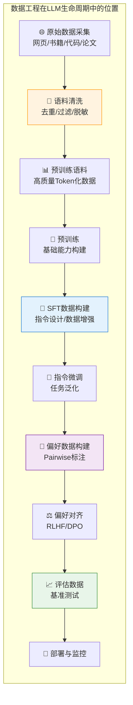
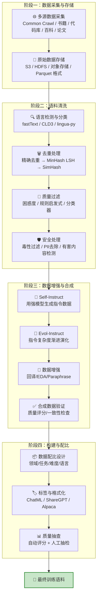
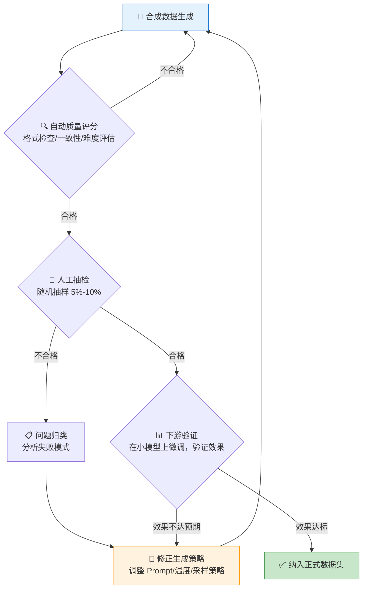
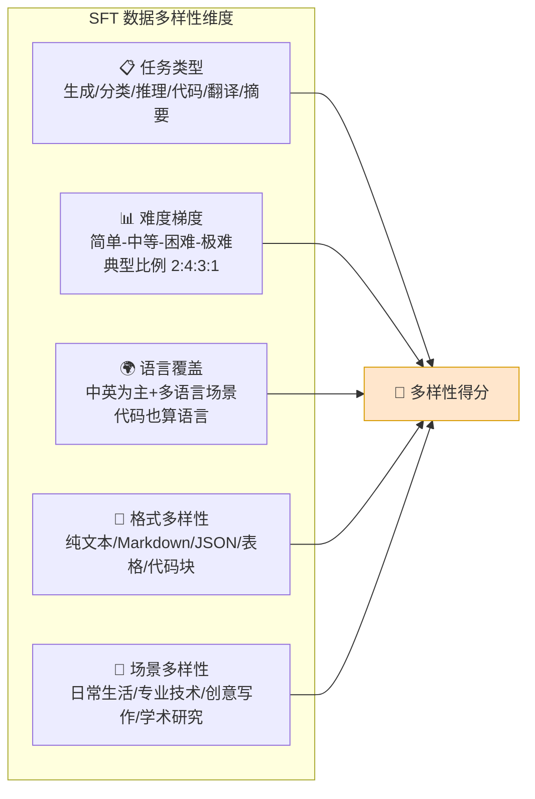
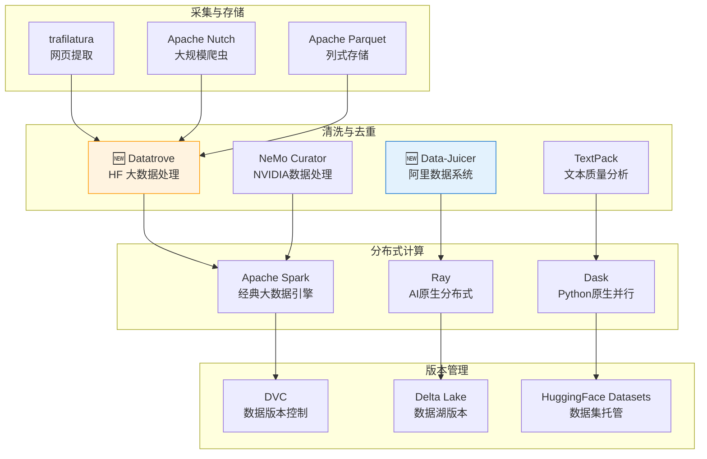

# 第22章 大模型数据工程 ⭐⭐⭐

> **面试频率**：中高（~40%面试涉及）| **技术热度**：★★★★☆
>
> 从 "Data is the new oil" 到 "Data Quality is All You Need" —— 大模型数据工程已经从幕后走到台前。预训练语料的质量直接决定模型能力上限，SFT 数据的精炼程度影响对齐效果，而数据配比设计则是各大模型厂商的"核心秘方"。本章覆盖语料采集清洗、合成数据生成、SFT数据构建、质量评估、Pipeline工具链的全链路，是算法工程师从"调参侠"进阶为"数据工程师"的必修课。
>
> 🆕 **2026年更新**：新增 Datatrove 实战、Evol-Instruct 方法论深度解析、TextPack 与 Data-Juicer 对比、LIMA 现象最新讨论、合成数据质量闭环验证、数据版本管理最佳实践。

---

## 22.1 数据工程全景 ⭐⭐⭐

### 22.1.1 大模型训练的数据依赖

大模型训练本质上是对海量数据中蕴含的知识和模式进行压缩建模。训练过程中的数据不仅是模型学习的"教材"，更是决定模型能力上限的关键因素。

**核心依赖关系**：

| 训练阶段 | 数据类型 | 典型规模 | 核心诉求 | 质量要求 |
|---------|---------|---------|---------|---------|
| **预训练 (Pre-training)** | 网页、书籍、代码、论文 | 1T ~ 15T tokens | 多样性、覆盖面、知识密度 | 去重、去毒、去噪 |
| **指令微调 (SFT)** | 指令-回复对 | 10K ~ 1M 条 | 任务覆盖、难度梯度、格式规范 | 高（错误会被放大）|
| **偏好对齐 (RLHF/DPO)** | 人类偏好对 | 1K ~ 100K 对 | 偏好信号清晰、覆盖边界 case | 极高（标注一致性关键）|
| **评估 (Evaluation)** | 基准测试集 | 1K ~ 10K 条 | 覆盖面、无污染、难度分层 | 极高（决定评估可信度）|



### 22.1.2 Scaling Law 对数据的启示

Scaling Law（缩放定律）不仅揭示了模型参数和训练计算量之间的关系，更对数据工程产生了深远影响。

**核心公式回顾**：

$$L(N, D) = \frac{A}{N^\alpha} + \frac{B}{D^\beta} + L_0$$

其中 $N$ 为模型参数量，$D$ 为训练数据量（tokens），$\alpha \approx 0.34$（参数指数），$\beta \approx 0.28$（数据指数）。

**对数据工程的三个关键启示**：

1. **数据量的边际效用递减，但不是零**：Chinchilla 最优说明，每 1 个参数约需要 20 个 tokens 训练。但如果数据质量足够高，突破 Chinchilla 最优也是可行的（如 Llama 3 在 15T tokens 上训练 8B/70B 模型，远超 Chinchilla 最优，效果依然持续提升）。

2. **数据质量比数据量更重要**：2024-2025 年的研究反复证明，高质量的小规模数据（如 FineWeb-Edu）可以超越低质量的大规模数据。**去重、去毒、教育类数据筛选**对模型质量的提升远超简单堆量。

3. **重复数据的衰减效应**：Token 重复率超过一定阈值（通常 4-8 次 epoch）后，模型性能开始退化。数据工程需要关注 **unique token coverage** 而非原始 token 总量。

> 📚 **交叉引用**：Scaling Law 的详细讨论见 [[12_Transformer与大模型原理]] 12.4 节。

### 22.1.3 数据工程 Pipeline 全景图



---

## 22.2 语料采集与清洗 ⭐⭐⭐⭐

### 22.2.1 数据源全景

预训练数据源的选择直接影响模型的知识覆盖面和能力边界。不同数据源的特性差异极大。

| 数据源 | 典型规模 | 知识密度 | 噪声水平 | 获取难度 | 代表性数据集 |
|-------|---------|---------|---------|---------|------------|
| **Common Crawl** | PB 级（原始） | 低-中 | 极高 | 低（公开） | C4, FineWeb, RefinedWeb |
| **维基百科** | ~20GB（多语言） | 高 | 低 | 低 | Wikipedia dumps |
| **书籍** | TB 级 | 高 | 低-中 | 中（版权限制） | Books3, PG-19 |
| **学术论文** | TB 级 | 极高 | 低 | 中 | S2ORC, arXiv, PubMed |
| **代码仓库** | TB 级 | 高 | 中 | 低 | The Stack, StackOverflow |
| **Reddit/社交媒体** | TB 级 | 中 | 极高 | 中 | OpenWebText2, PushShift |
| **政府/法律文件** | GB-TB 级 | 高 | 低 | 低 | US Code, EU Legislation |
| **多模态数据** | PB 级 | 中-高 | 高 | 中 | LAION, DataComp |

**2026年趋势**：多语言数据、代码数据和高质量教育类数据被视为 **高价值数据**，各国法规对数据采集的合规性要求持续提升（EU AI Act、中国生成式AI管理办法）。

### 22.2.2 去重技术

去重是数据清洗中最重要的一环。重复数据浪费计算资源、增加过拟合风险、降低数据多样性。

**三层去重架构**：

| 层级 | 方法 | 粒度 | 时间复杂度 | 适用场景 |
|-----|------|------|-----------|---------|
| **精确去重** | Hash（MD5/SHA256）匹配 | 文档级/段落级 | O(n) | 完全重复检测 |
| **近邻去重** | MinHash + LSH | 文档级 | O(n) | 相似文档聚类 |
| **模糊去重** | SimHash | 文档级/句子级 | O(n) | 近似重复检测 |
| **语义去重** | 嵌入相似度 | 文档级 | O(n²) 需优化 | 语义重复（成本高） |

**MinHash LSH 原理**：

MinHash 通过多个哈希函数对文档的 n-gram 集合求最小哈希值，生成 MinHash 签名。两个文档的 MinHash 签名的 Jaccard 相似度近似等于原始 n-gram 集合的 Jaccard 相似度。

$$P[\text{minhash}_h(A) = \text{minhash}_h(B)] = J(A, B) = \frac{|A \cap B|}{|A \cup B|}$$

LSH（Locality Sensitive Hashing）将 MinHash 签名分桶，只有落入同一桶的文档对才需比较，大幅降低复杂度。

```python
# MinHash LSH 去重示例（使用 datasketch 库）
from datasketch import MinHash, MinHashLSH
import re

def tokenize(text: str, n: int = 3) -> list[str]:
    """将文本转为 n-gram 字符集合"""
    text = re.sub(r'\s+', ' ', text.lower())
    return [text[i:i+n] for i in range(len(text) - n + 1)]

def create_minhash(text: str, num_perm: int = 128) -> MinHash:
    """为文档创建 MinHash 签名"""
    m = MinHash(num_perm=num_perm)
    for shingle in tokenize(text, n=5):
        m.update(shingle.encode('utf-8'))
    return m

# 创建 LSH 索引
lsh = MinHashLSH(threshold=0.8, num_perm=128)

documents = [
    ("doc_1", "The quick brown fox jumps over the lazy dog"),
    ("doc_2", "The quick brown fox jumps over the lazy dog."),   # 几乎相同
    ("doc_3", "Machine learning is transforming data engineering"),  # 完全不同
    ("doc_4", "A quick brown fox leaped over a lazy dog"),       # 相似但不相同
]

for doc_id, text in documents:
    mh = create_minhash(text)
    lsh.insert(doc_id, mh)

# 查询重复文档
target_mh = create_minhash(documents[0][1])
duplicates = lsh.query(target_mh)
print(f"与 doc_1 相似的文档（Jaccard >= 0.8）: {duplicates}")
# 预期输出: ['doc_1', 'doc_2', 'doc_4']
```

### 22.2.3 质量过滤

质量过滤是区分"好数据"和"坏数据"的关键步骤。2024-2026 年最重要的趋势是 **分类器过滤**和**困惑度过滤**的结合使用。

**常用过滤策略**：

| 过滤方法 | 原理 | 优势 | 劣势 |
|---------|------|------|------|
| **启发式规则** | 长度/特殊字符比例/重复 n-gram 比例 | 速度快，易解释 | 规则设计依赖经验 |
| **语言检测** | fastText/CLD3 分类 | 准确率高 | 短文本/混合语言易误判 |
| **困惑度过滤** | 用小模型计算困惑度，过滤高困惑度文本 | 自动识别低质量文本 | 需要参考模型 |
| **分类器过滤** | 训练质量分类器（如 FineWeb-Edu 分类器） | 精准度高 | 需要标注数据 |
| **URL 黑名单** | 过滤已知垃圾站点 | 干净利落 | 维护成本高 |

```python
# 质量过滤综合示例
import fasttext
import re
from collections import Counter

class TextQualityFilter:
    """多维度文本质量过滤器"""
    
    def __init__(self, lang_model_path: str = "lid.176.bin"):
        # fastText 语言检测模型（需预先下载）
        try:
            self.lang_model = fasttext.load_model(lang_model_path)
        except Exception:
            print("⚠️  fastText 模型未找到，语言检测将被跳过")
            self.lang_model = None
    
    @staticmethod
    def heuristic_filter(text: str) -> tuple[bool, str]:
        """启发式规则过滤"""
        text_stripped = text.strip()
        
        # 1. 长度过滤
        if len(text_stripped) < 50:
            return False, "too_short"
        if len(text_stripped) > 100000:
            return False, "too_long"
        
        # 2. 特殊字符比例
        special_ratio = sum(1 for c in text_stripped if not c.isalnum() and not c.isspace()) / max(len(text_stripped), 1)
        if special_ratio > 0.3:
            return False, f"high_special_char_ratio_{special_ratio:.2f}"
        
        # 3. 大写比例（适用于英文）
        alpha_chars = [c for c in text_stripped if c.isalpha()]
        if alpha_chars:
            upper_ratio = sum(1 for c in alpha_chars if c.isupper()) / len(alpha_chars)
            if upper_ratio > 0.5 and len(text_stripped) > 200:
                return False, f"high_upper_ratio_{upper_ratio:.2f}"
        
        # 4. 行重复检测
        lines = text_stripped.split('\n')
        if len(lines) > 5:
            line_counts = Counter(lines)
            most_common_ratio = line_counts.most_common(1)[0][1] / len(lines)
            if most_common_ratio > 0.5:
                return False, f"high_line_repetition_{most_common_ratio:.2f}"
        
        # 5. 停用词比例（以英文为例）
        stopwords = {'the','a','an','is','are','was','were','in','on','at','to','for','of','and','or'}
        words = text_stripped.lower().split()
        if len(words) > 20:
            stopword_ratio = sum(1 for w in words if w in stopwords) / len(words)
            if stopword_ratio < 0.05:
                return False, f"low_stopword_ratio_{stopword_ratio:.3f}"
        
        return True, "pass"
    
    def language_filter(self, text: str, target_lang: str = "__label__en") -> tuple[bool, str]:
        """语言检测过滤"""
        if self.lang_model is None:
            return True, "lang_skipped"
        text_clean = re.sub(r'\s+', ' ', text.strip())[:500]  # 取前500字符
        pred = self.lang_model.predict(text_clean)
        detected_lang = pred[0][0]
        confidence = pred[1][0]
        return detected_lang == target_lang and confidence > 0.7, f"{detected_lang}_{confidence:.2f}"
    
    def full_filter(self, text: str, target_lang: str = "__label__en") -> dict:
        """综合过滤"""
        h_pass, h_reason = self.heuristic_filter(text)
        l_pass, l_reason = self.language_filter(text, target_lang)
        
        return {
            "passed": h_pass and l_pass,
            "heuristic_pass": h_pass,
            "heuristic_reason": h_reason,
            "language_pass": l_pass,
            "language_reason": l_reason,
        }

# 使用示例
filter_obj = TextQualityFilter()

good_text = "Machine learning is a field of inquiry devoted to understanding and building methods that learn from data. It is seen as a part of artificial intelligence. Machine learning algorithms build a model based on sample data, known as training data, in order to make predictions or decisions without being explicitly programmed to do so."
bad_text = "asdf jkl; @#$%^&* !!! " * 10  # 低质量文本

print("Good text:", filter_obj.full_filter(good_text))
print("Bad text:", filter_obj.full_filter(bad_text))
```

### 22.2.4 毒性过滤与 PII 去除

**毒性过滤**：移除包含仇恨言论、暴力、色情、歧视等有害内容的文本。常用方法包括：

- **关键词匹配**：维护毒性词表和正则表达式，快速但覆盖面有限
- **分类器模型**：使用 Perspective API、Detoxify 等模型进行细粒度毒性分类
- **安全分类器**：如 Llama Guard，对输入/输出进行安全分类

**PII（个人身份信息）去除**：

PII 包括姓名、邮箱、电话号码、身份证号、地址、IP 地址等。大模型训练数据中残留的 PII 可能被模型记忆和复现，带来隐私泄露风险。

| PII 类型 | 检测方法 | 处理方式 |
|---------|---------|---------|
| 邮箱地址 | 正则表达式 | 替换为 [EMAIL] |
| 电话号码 | 正则 + libphonenumber | 替换为 [PHONE] |
| IP 地址 | 正则 | 替换为 [IP_ADDR] |
| 人名 | NER 模型（spaCy/Stanza） | 替换为 [PERSON] |
| 身份证/社保号 | 模式匹配 | 替换为 [ID_NUM] |

```python
# PII 检测与脱敏示例
import re
from typing import List, Tuple

class PIIScrubber:
    """PII 检测与脱敏"""
    
    # 常见 PII 正则模式
    PATTERNS = {
        "EMAIL": re.compile(r'\b[A-Za-z0-9._%+-]+@[A-Za-z0-9.-]+\.[A-Z|a-z]{2,}\b'),
        "IPV4": re.compile(r'\b(?:[0-9]{1,3}\.){3}[0-9]{1,3}\b'),
        "PHONE_CN": re.compile(r'\b1[3-9]\d{9}\b'),
        "PHONE_US": re.compile(r'\b\d{3}[-.]?\d{3}[-.]?\d{4}\b'),
        "URL": re.compile(r'https?://[^\s<>"{}|\[\]]+'),
        "SSN": re.compile(r'\b\d{3}-\d{2}-\d{4}\b'),
        "CREDIT_CARD": re.compile(r'\b(?:\d{4}[ -]?){4}\b'),
    }
    
    @classmethod
    def scrub_text(cls, text: str, use_ner: bool = False) -> Tuple[str, List[dict]]:
        """对文本进行 PII 脱敏"""
        findings = []
        scrubbed = text
        
        for pii_type, pattern in cls.PATTERNS.items():
            for match in pattern.finditer(text):
                findings.append({
                    "type": pii_type,
                    "value": match.group(),
                    "start": match.start(),
                    "end": match.end()
                })
                scrubbed = scrubbed.replace(match.group(), f"[{pii_type}]")
        
        return scrubbed, findings
    
    @classmethod
    def check_pii_free(cls, text: str) -> bool:
        """检查文本是否 PII-free"""
        for pattern in cls.PATTERNS.values():
            if pattern.search(text):
                return False
        return True


# 使用示例
scrubber = PIIScrubber()
sample = "联系邮箱 john.doe@example.com，电话 13800138000，IP地址 192.168.1.1"
cleaned, found = scrubber.scrub_text(sample)
print(f"脱敏后: {cleaned}")
print(f"检测到的 PII: {found}")
# 脱敏后: 联系邮箱 [EMAIL]，电话 [PHONE_CN]，IP地址 [IPV4]
```

---

## 22.3 数据增强与合成数据 ⭐⭐⭐⭐

### 22.3.1 合成数据生成的动机与方法

**为什么需要合成数据**：

- **数据稀缺**：特定领域（法律、医疗、小众语言）高质量标注数据极度匮乏
- **隐私约束**：真实数据包含敏感信息，合成数据可以避开隐私问题
- **成本控制**：人工标注成本高（一条高质量 SFT 数据可达数美元），合成数据边际成本近乎为零
- **多样性增强**：合成数据可以有目的地覆盖长尾场景和边界 case

**合成数据的三种范式**：

| 范式 | 方法 | 代表工作 | 适用阶段 |
|-----|------|---------|---------|
| **指令生成** | 种子指令 + LLM 扩展 | Self-Instruct, Alpaca | SFT |
| **指令演化** | 渐进增加复杂度 | Evol-Instruct, WizardLM | SFT |
| **偏好合成** | LLM 生成回复 + 评分排序 | UltraFeedback, JudgeLM | RLHF/DPO |
| **蒸馏生成** | 强模型回复 → 弱模型训练 | Orca, Phi 系列 | Pre-train / SFT |
| **反向生成** | 从回复反推指令 | Reverse Instruction | SFT 增强 |

### 22.3.2 Self-Instruct 方法

Self-Instruct 是合成指令数据的开山之作（Stanford Alpaca），核心思想：**用少量人工编写的种子指令，引导强模型生成更多指令数据**。

**Self-Instruct 流程**：

```
种子指令（175条） → LLM生成新指令 → 过滤低质量 → LLM生成回复 → 过滤 → 最终数据集
         ↑                                              |
         └──────────── 循环迭代（可选） ─────────────────┘
```

**关键步骤**：
1. **指令生成**：将 8 条种子指令（3 条人工 + 5 条已生成）作为 few-shot 示例，让 LLM 生成新指令
2. **分类标注**：判断新指令是分类任务还是生成任务
3. **实例生成**：对每条指令，先让 LLM 生成回复，再让 LLM 生成输入（如有需要）
4. **质量过滤**：过滤掉与已有指令 ROUGE-L 相似度超过 0.7 的样本，去除格式不规范的样本

```python
# Self-Instruct 数据生成示例
import json
from typing import Optional

# 种子指令模板
SEED_INSTRUCTIONS = [
    {"instruction": "将以下句子翻译成英文", "input": "今天天气真好", "output": "The weather is really nice today."},
    {"instruction": "用一句话总结以下段落的核心观点", "input": "...", "output": "..."},
    {"instruction": "生成一个随机密码", "input": "", "output": "K9#mP2xL@qR5"},
]

INSTRUCTION_GEN_PROMPT = """你是一个数据标注专家。请根据以下已有的指令示例，生成5条新的、多样化的任务指令。

要求：
1. 指令应该覆盖不同类型的任务（翻译、摘要、分类、代码生成、推理等）
2. 指令应该具体、清晰、可执行
3. 避免与已有指令语义重复
4. 难度应该有所梯度

已有指令示例：
{examples}

请生成5条新指令（每行一条，以 "指令N：" 开头）："""

def generate_instructions(
    seed_instructions: list[dict],
    llm_callable,  # 替换为实际的 LLM 调用函数
    num_to_generate: int = 5
) -> list[str]:
    """
    使用 Self-Instruct 方法生成新指令
    
    Args:
        seed_instructions: 种子指令列表
        llm_callable: LLM 调用函数 (prompt -> response)
        num_to_generate: 需要生成的指令数量
    """
    examples_text = "\n".join([
        f"{i+1}. {inst['instruction']}"
        for i, inst in enumerate(seed_instructions[:8])
    ])
    
    prompt = INSTRUCTION_GEN_PROMPT.format(examples=examples_text)
    response = llm_callable(prompt)
    
    # 解析生成的指令
    new_instructions = []
    for line in response.strip().split('\n'):
        line = line.strip()
        if line and any(line.startswith(f"指令{i}") for i in range(1, 10)):
            instruction = line.split('：', 1)[-1].strip().strip('"').strip("'")
            if instruction:
                new_instructions.append(instruction)
    
    return new_instructions[:num_to_generate]

# 模拟 LLM 调用（实际使用时替换为真实API调用）
def mock_llm_call(prompt: str) -> str:
    return """指令1：分析以下代码的时间复杂度
指令2：将给定的JSON数据转换为CSV格式
指令3：写一首关于人工智能的七言绝句
指令4：判断以下评论的情感倾向（正面/负面/中性）
指令5：根据用户需求生成一个SQL查询语句"""

new_instructions = generate_instructions(SEED_INSTRUCTIONS, mock_llm_call)
print("生成的指令:", new_instructions)
```

### 22.3.3 Evol-Instruct 方法 ⭐⭐⭐⭐

Evol-Instruct（WizardLM 提出）是对 Self-Instruct 的重大改进。核心创新：**不是简单扩展指令，而是对指令进行"演化"——渐进增加复杂度、深度和广度**。

**Evol-Instruct 的三种演化维度**：

| 演化类型 | 操作 | 示例 |
|---------|------|------|
| **深度演化 (In-Breadth)** | 增加约束条件、步骤数、推理深度 | "写一个排序函数" → "写一个对10万元素排序的高效函数，要求空间复杂度O(1)" |
| **广度演化 (In-Depth)** | 增加子任务、多轮要求、多方面约束 | "翻译" → "翻译并解释翻译中涉及的文化差异" |
| **难度提升** | 添加边界情况、罕见场景、对抗条件 | "回答数学问题" → "回答数学问题并给出详细的推导过程" |

**演化操作指令模板**：

```
请将以下指令改写得更复杂、更有深度。你可以：
1. 增加更多约束条件
2. 要求更详细的推理步骤
3. 添加对边界情况的考虑
4. 要求多种解法或视角
5. 增加现实世界中的复杂场景

原始指令：{instruction}
改写后的指令：
```

```python
# Evol-Instruct 指令演化示例
EVOLVE_PROMPTS = {
    "in_depth": """你是指令复杂度演化的专家。请将以下简单指令演化为更深入、要求更高推理能力的版本。

演化策略（请至少使用3种）：
- 增加更多约束条件（如时间/空间限制、特定格式要求）
- 要求逐步推理（Chain-of-Thought）
- 增加对边界情况/异常情况的处理
- 引入多步推理链条

原始指令: {instruction}
演化后的指令:""",

    "in_breadth": """你是指令多样性专家。请基于以下指令，创建一个涵盖更广知识面或技能范围的新指令。

演化策略（请至少使用2种）：
- 扩展到相关但不相同的领域
- 增加子任务或多角度要求
- 引入跨领域知识需求

原始指令: {instruction}
演化后的指令:""",

    "add_constraints": """请为以下指令添加2-3个合理但具有挑战性的约束条件。

原始指令: {instruction}
增加约束后的指令:""",
}

def evolve_instruction(
    instruction: str,
    evolve_type: str = "in_depth",
    llm_callable=None
) -> str:
    """
    对指令进行演化
    
    Args:
        instruction: 原始指令
        evolve_type: 演化类型 (in_depth / in_breadth / add_constraints)
        llm_callable: LLM 调用函数
    """
    template = EVOLVE_PROMPTS.get(evolve_type, EVOLVE_PROMPTS["in_depth"])
    prompt = template.format(instruction=instruction)
    if llm_callable:
        return llm_callable(prompt).strip()
    return prompt  # 返回 prompt 供外部调用
```

### 22.3.4 数据增强技术

除了合成新数据，对已有数据进行增强也是提升数据多样性的有效手段。

**常用数据增强技术**：

| 技术 | 方法 | 适用场景 | 注意事项 |
|-----|------|---------|---------|
| **回译 (Back Translation)** | 中→英→中，生成语义相同但表达不同的文本 | 文本生成、对话 | 可能引入翻译错误 |
| **EDA (Easy Data Augmentation)** | 同义词替换、随机插入、随机交换、随机删除 | 分类、NER | 可能改变语义 |
| **Paraphrase** | 用 LLM 改写文本，保持语义不变 | 指令数据、问答 | 需要用 LLM 验证一致性 |
| **Prompt 变异** | 对同一条指令生成多种不同的 prompt 表达 | SFT 数据 | 提升格式鲁棒性 |
| **混合拼接** | 将两条不同指令混合成一条复合指令 | SFT 数据 | 需要保证合理性 |

```python
# 回译数据增强示例
def back_translation_augment(
    texts: list[str],
    translate_func,  # 翻译函数 (text, source_lang, target_lang) -> translated_text
    source_lang: str = "zh",
    pivot_lang: str = "en",
    num_variants: int = 2
) -> list[str]:
    """
    通过回译生成数据增强变体
    
    Args:
        texts: 原始文本列表
        translate_func: 翻译API调用函数
        source_lang: 源语言
        pivot_lang: 中转语言
        num_variants: 每个文本生成的变体数量
    
    Returns:
        增强后的文本变体列表
    """
    augmented = []
    for text in texts:
        for _ in range(num_variants):
            # 正向翻译: 源语言 → 中转语言
            pivot_text = translate_func(text, source_lang, pivot_lang)
            # 反向翻译: 中转语言 → 源语言
            back_text = translate_func(pivot_text, pivot_lang, source_lang)
            # 过滤与原文完全相同的结果
            if back_text.strip() != text.strip():
                augmented.append(back_text)
    return augmented

# 模拟翻译函数（实际使用时替换为真实翻译API）
def mock_translate(text: str, src: str, tgt: str) -> str:
    """模拟翻译 - 实际使用应接入翻译API"""
    variations = {
        "你好，今天天气怎么样？": "Hello, how is the weather today?",
        "Hello, how is the weather today?": "你好，今天天气如何？",
    }
    return variations.get(text, text)

texts = ["你好，今天天气怎么样？"]
augmented = back_translation_augment(texts, mock_translate)
print("原始:", texts)
print("增强:", augmented)
```

### 22.3.5 合成数据的质量验证

合成数据不是无限生成的，必须通过质量验证闭环确保数据的有用性。

**质量验证四步法**：



**关键验证指标**：

- **指令合法性**：指令是否明确、可执行、不矛盾
- **回复正确性**：回复是否正确回答了指令要求
- **格式规范性**：回复格式是否符合预期（如 JSON 格式是否可解析）
- **安全性**：回复是否包含有害内容
- **多样性**：新指令与已有指令的语义重叠度

---

## 22.4 SFT 数据构建 ⭐⭐⭐⭐

### 22.4.1 指令数据格式与设计原则

**主流数据格式**：

| 格式 | 结构 | 代表项目 | 特点 |
|-----|------|---------|------|
| **Alpaca** | `{instruction, input, output}` | Stanford Alpaca | 最简单，input 可为空 |
| **ShareGPT** | `{conversations: [{from, value}]}` | Vicuna, LLaMA-Factory | 支持多轮对话 |
| **ChatML** | `<|im_start|>role\ncontent<|im_end|>` | OpenAI 格式 | Token 级别标记 |
| **OpenAI Chat** | `{messages: [{role, content}]}` | GPT 系列 | 工业标准格式 |

**指令数据设计原则**：

1. **明确性**：指令应清晰无歧义，避免模糊表达
2. **多样性**：覆盖不同任务类型、主题领域、语言风格
3. **难度梯度**：从简单到复杂，帮助模型逐步学习
4. **实用性**：贴近真实用户场景的使用方式
5. **格式一致性**：同一数据集内保持格式统一

### 22.4.2 数据多样性设计

数据多样性是 SFT 数据质量的核心维度。多样性的缺失会导致模型在不同场景下的表现失衡。

**多样性设计维度**：



**难度梯度设计示例**：

| 难度等级 | 比例 | 特征 | 示例指令 |
|---------|------|------|---------|
| L1 - 简单 | 20% | 单步操作，知识问答 | "法国的首都是哪里？" |
| L2 - 中等 | 40% | 需要理解+组织信息 | "用200字总结法国大革命的主要事件" |
| L3 - 困难 | 30% | 多步推理，逻辑链条 | "分析法国大革命的三个主要原因及其相互关联" |
| L4 - 极难 | 10% | 创造性任务，多约束 | "以拿破仑视角写一封信，反思滑铁卢战役的决策失误" |

### 22.4.3 偏好数据构建

偏好数据用于 RLHF/DPO 训练，格式为 `(prompt, chosen, rejected)` 三元组。

**偏好数据构建流程**：

1. **Prompt 收集**：从真实用户日志或合成数据中收集 prompt
2. **多回复生成**：用不同模型/策略生成多个回复（通常 2-4 个）
3. **偏好标注**：人类标注者对回复进行偏好排序
4. **一致性检验**：确保标注者间一致性（Inter-annotator Agreement）达到阈值

**偏好标注的关键考量**：

| 标注维度 | 说明 | 权重参考 |
|---------|------|---------|
| **帮助性 (Helpfulness)** | 是否有效回答了用户问题 | 最高 |
| **真实性 (Truthfulness)** | 是否包含事实错误 | 高 |
| **安全性 (Safety)** | 是否包含有害或不适当内容 | 最高（一票否决）|
| **完整性 (Completeness)** | 是否遗漏关键信息 | 中 |
| **格式 (Formatting)** | 结构是否清晰易读 | 低 |
| **简洁性 (Conciseness)** | 是否冗余啰嗦 | 低 |

> 📚 **交叉引用**：偏好对齐的详细方法（RLHF/DPO/GRPO）见 [[16_模型微调与推理优化]] 16.5 节。

### 22.4.4 数据配比实验设计

数据配比是大模型训练的"秘方"——不同来源、不同类型数据的比例决定了模型能力的分布。

**配比设计方法论**：

$$P_{\text{final}} = \sum_{i=1}^{k} w_i \cdot D_i, \quad \sum_{i=1}^{k} w_i = 1$$

其中 $D_i$ 为第 $i$ 类数据，$w_i$ 为对应的权重。

**常用配比策略**：

| 策略 | 方法 | 适用场景 |
|-----|------|---------|
| **均匀配比** | 所有类别等权重 | 探索性实验 |
| **质量加权** | 根据质量评分分配权重 | 有明确的质量评估体系 |
| **下游导向** | 根据下游任务重要性权重 | 有明确应用场景 |
| **自适应配比** | 训练过程中动态调整权重 | 需要持续优化 |
| **DoReMi** | 用小模型预搜索最优 domain weights | 规模化场景 |

### 22.4.5 LIMA 现象：少而精 vs 多而杂 ⭐⭐⭐⭐

LIMA（Less Is More for Alignment，Meta 2023）是大模型数据工程领域的里程碑发现。

**核心发现**：仅用 **1000 条** 精心挑选的高质量指令数据微调 Llama 65B，效果接近甚至超越了用 52K 条 Alpaca 数据微调的模型。

**LIMA 的数据标准**：

1. 每个 prompt 都必须有明确的、可验证的正确答案
2. 回复示范"教科书级别"的高质量
3. 覆盖不同的输出格式（纯文本、列表、代码、表格等）
4. 排除所有"常识性"任务（如"What is the capital of France?"）

**LIMA 现象的启示**：

- 预训练阶段已经编码了大量知识和能力，SFT 主要是"激活"和"格式化"这些能力
- 数据质量 >> 数据数量，1万条高质量数据可能优于 10万条低质量数据
- 数据工程的重心应该从"如何生成更多数据"转向"如何识别和筛选高质量数据"

> 🆕 **2026年最新讨论**：随着模型能力的提升，SFT 数据的边际效用进一步下降。部分研究显示，对于 GPT-4 级别的基础模型，SFT 阶段的数据量可以进一步缩减。但也有人指出，LIMA 结论在数学推理、代码生成等需要"能力注入"的场景中不完全成立。

---

## 22.5 数据质量评估 ⭐⭐⭐

### 22.5.1 数据质量评估维度

数据质量评估是多维度的系统工程，不能依赖单一指标。

**六维质量评估框架**：

| 维度 | 定义 | 评估方法 | 典型指标 |
|-----|------|---------|---------|
| **准确性 (Accuracy)** | 数据的正确程度 | 事实核查/知识库对照 | 事实错误率 |
| **完整性 (Completeness)** | 信息的完整程度 | 实体/属性覆盖度 | 缺失字段比例 |
| **一致性 (Consistency)** | 数据内外部一致性 | 逻辑规则验证 | 矛盾检测率 |
| **多样性 (Diversity)** | 数据的覆盖面 | 嵌入分布/聚类分析 | 类别分布熵 |
| **时效性 (Timeliness)** | 数据的时效性 | 时间戳检查 | 过期数据比例 |
| **无毒性 (Safety)** | 有害内容程度 | 安全分类器 | Toxicity Score |

### 22.5.2 自动化质量评分

**自动化评分方法分类**：

| 方法 | 原理 | 成本 | 准确度 |
|-----|------|------|-------|
| **规则评分** | 长度/格式/关键词检查 | 极低 | 中（漏报多）|
| **统计评分** | n-gram 多样性/困惑度/熵 | 低 | 中 |
| **模型评分** | LLM-as-Judge / 专用分类器 | 中-高 | 较高 |
| **对比评分** | 与参考答案的相似度 | 中 | 高（但依赖参考）|

```python
# 自动化数据质量评分
import numpy as np
from collections import Counter

class DataQualityScorer:
    """SFT 数据质量自动评分器"""
    
    @staticmethod
    def compute_text_stats(text: str) -> dict:
        """计算文本统计特征"""
        words = text.split()
        sentences = text.replace('!', '.').replace('?', '.').split('.')
        sentences = [s.strip() for s in sentences if s.strip()]
        
        return {
            "word_count": len(words),
            "sentence_count": len(sentences),
            "avg_word_length": np.mean([len(w) for w in words]) if words else 0,
            "avg_sentence_length": np.mean([len(s.split()) for s in sentences]) if sentences else 0,
            "type_token_ratio": len(set(words)) / len(words) if words else 0,
            "char_diversity": len(set(text)) / len(text) if text else 0,
        }
    
    @staticmethod
    def check_format_compliance(text: str, expected_format: str = "general") -> dict:
        """检查格式合规性"""
        checks = {}
        
        if expected_format == "json":
            import json as json_module
            try:
                json_module.loads(text)
                checks["valid_json"] = True
            except json_module.JSONDecodeError:
                checks["valid_json"] = False
        
        # 检查是否有截断
        checks["likely_truncated"] = text.rstrip().endswith((",", "、", "and", "..." , "等等"))
        
        # 检查代码块配对
        checks["code_blocks_balanced"] = text.count("```") % 2 == 0
        
        return checks
    
    def score_instruction_data(self, item: dict) -> dict:
        """
        对单条指令数据进行综合评分
        
        Args:
            item: {"instruction": str, "input": str, "output": str}
        """
        inst = item.get("instruction", "")
        output = item.get("output", "")
        full_text = inst + " " + output
        
        stats = self.compute_text_stats(full_text)
        fmt = self.check_format_compliance(output)
        
        # 评分逻辑
        scores = {
            "length_score": min(stats["word_count"] / 100, 1.0) * 100,
            "diversity_score": stats["type_token_ratio"] * 100,
            "format_score": 100 if all(fmt.values()) else 60,
            "not_truncated": 100 if not fmt.get("likely_truncated") else 0,
        }
        
        # 加权总分
        weights = {"length_score": 0.2, "diversity_score": 0.3, 
                    "format_score": 0.3, "not_truncated": 0.2}
        total = sum(scores[k] * weights[k] for k in weights)
        
        return {
            "total_score": round(total, 1),
            "detail_scores": scores,
            "stats": stats,
            "format_checks": fmt,
        }


# 示例
scorer = DataQualityScorer()
sample = {
    "instruction": "用 Python 实现二分查找",
    "input": "",
    "output": "def binary_search(arr, target):\n    left, right = 0, len(arr) - 1\n    while left <= right:\n        mid = (left + right) // 2\n        if arr[mid] == target:\n            return mid\n        elif arr[mid] < target:\n            left = mid + 1\n        else:\n            right = mid - 1\n    return -1"
}
result = scorer.score_instruction_data(sample)
print(f"总分: {result['total_score']}")
print(f"详细: {result['detail_scores']}")
```

### 22.5.3 人工抽检策略

人工抽检是数据质量保障的最后防线。有效的抽检策略可以以最小成本发现最多问题。

**分层抽样策略**：

| 层级 | 抽样比例 | 关注点 | 样本量建议 |
|-----|---------|-------|-----------|
| **高质量候选** | 5% | 验证自动化评分的准确性 | 50-100 条 |
| **边界质量** | 10% | 发现自动化评分的盲区 | 100-200 条 |
| **低质量候选** | 15% | 确认过滤规则的有效性 | 50-100 条 |
| **随机样本** | 3% | 整体质量估算 | 100-500 条 |

### 22.5.4 数据质量与模型性能的量化关系

$$Q_{\text{model}} = \alpha \cdot \log(Q_{\text{data}}) + \beta \cdot \log(N_{\text{data}}) + \gamma$$

其中 $Q_{\text{data}}$ 为数据质量指标，$N_{\text{data}}$ 为数据量，$\alpha > \beta$ 数据质量的系数大于数据量。

**关键实证发现**：

- 过滤掉最低质量的 10% 数据，模型性能提升可达 5-15%
- 在同等数据量下，去重可带来 2-5% 的性能提升
- 教育类/教科书类数据的"知识密度"是普通网页数据的 3-5 倍

---

## 22.6 数据 Pipeline 工具链 ⭐⭐⭐

### 22.6.1 工具全景



### 22.6.2 Datatrove（HuggingFace 大数据处理）

Datatrove 是 HuggingFace 推出的面向大模型数据处理的 Python 库，专为 TB-PB 级数据处理设计。

**核心特性**：
- **可组合的 Pipeline**：Reader → Filter → Dedup → Writer 流水线
- **内置去重组件**：MinHash、Sentence Dedup、URL Dedup
- **流式处理**：内存友好，适合超大规模语料
- **多节点支持**：通过 `--local_rank` 和 `--main_tasks_per_node` 分布式

```python
# Datatrove 数据处理 Pipeline 示例（概念代码）
# 实际使用请参考: https://github.com/huggingface/datatrove

# Datatrove 的 Pipeline 概念:
# 1. Reader: 读取原始数据
# 2. Processing Blocks: 一系列处理步骤
# 3. Writer: 写入处理后的数据

# Pipeline 配置示例（JSON格式概念）
datatrove_pipeline_config = {
    "reader": {
        "type": "JsonlReader",
        "data_folder": "/data/raw_cc/",
        "glob_pattern": "*.jsonl.gz",
        "text_key": "text",
        "id_key": "doc_id"
    },
    "processing": [
        {
            "type": "GopherQualityFilter",  # 基于困惑度的质量过滤
            "model_name": "gpt2",
            "threshold": 1000
        },
        {
            "type": "MinHashDedup",  # MinHash 去重
            "num_perm": 128,
            "threshold": 0.8,
            "ngram_size": 5
        },
        {
            "type": "LanguageFilter",  # 语言过滤
            "language": "en",
            "confidence_threshold": 0.65
        },
        {
            "type": "PIIRemover",  # PII 去除
            "email": True,
            "phone": True,
            "ip": True
        }
    ],
    "writer": {
        "type": "JsonlWriter",
        "output_folder": "/data/cleaned_corpus/",
        "compression": "gzip"
    }
}
```

### 22.6.3 TextPack 与 Data-Juicer 对比

| 维度 | TextPack | Data-Juicer |
|-----|----------|-------------|
| **开发者** | MIT 研究项目 | 阿里巴巴 |
| **定位** | 文本质量分析与特征提取 | 一站式数据处理系统 |
| **核心能力** | 计算文本的 N 维度质量特征 | 可配置的 Operator Pipeline |
| **可视化** | 有 Dashboard | 有 Web UI |
| **去重** | 内置 MinHash | 多种去重算法 |
| **分布式** | Ray 集成 | Ray/Spark 双引擎 |
| **学习成本** | 低 | 中 |
| **社区活跃度** | 中等 | 高（2024-2025 快速增长）|

### 22.6.4 分布式处理框架选型

| 框架 | 数据处理模型 | 适用场景 | 学习成本 | 生态 |
|-----|------------|---------|---------|------|
| **Apache Spark** | MapReduce/RDD/DataFrame | TB-PB 级离线批处理 | 中-高 | 极其丰富 |
| **Ray** | Task/Actor 模型 | 在线+离线混合，AI 场景 | 中 | 快速增长 |
| **Dask** | 类 Pandas 并行 DataFrame | Python 生态友好 | 低 | 中等 |
| **Polars** | Rust 后端 + Python 接口 | 单机大数据处理 | 低 | 2025-2026 年快速增长 |

```python
# Ray 分布式数据处理示例
import ray
from typing import List, Dict

# 初始化 Ray（单机或集群）
ray.init(ignore_reinit_error=True)

@ray.remote
class TextProcessor:
    """分布式文本处理器"""
    
    def __init__(self, lang: str = "en"):
        self.lang = lang
        self.processed_count = 0
    
    def process_batch(self, texts: List[str]) -> List[Dict]:
        """处理一批文本"""
        results = []
        for text in texts:
            self.processed_count += 1
            results.append({
                "text": text,
                "length": len(text),
                "word_count": len(text.split()),
                "lang": self.lang,
                "processor_id": ray.get_runtime_context().get_actor_id()
            })
        return results
    
    def get_count(self) -> int:
        return self.processed_count


# 创建多个分布式 Worker
num_workers = 4
processors = [TextProcessor.remote() for _ in range(num_workers)]

# 模拟数据批次
batches = [
    [f"这是第{i}批的第{j}条数据，用于测试Ray分布式处理。" for j in range(100)]
    for i in range(8)
]

# 分布式处理（Round-robin 分配批次）
futures = []
for i, batch in enumerate(batches):
    worker_idx = i % num_workers
    future = processors[worker_idx].process_batch.remote(batch)
    futures.append(future)

# 收集结果
all_results = ray.get(futures)
total_processed = sum(len(batch) for batch in all_results)
print(f"总共处理了 {total_processed} 条数据")

# 查询每个 worker 的处理量
counts = ray.get([p.get_count.remote() for p in processors])
print(f"各 Worker 处理量: {counts}")

ray.shutdown()
```

### 22.6.5 数据版本管理

大模型训练数据涉及复杂的数据版本管理问题：不同过滤策略、不同配比、不同来源的排列组合。

**数据版本管理工具对比**：

| 工具 | 核心功能 | 适合场景 | 存储后端 |
|-----|---------|---------|---------|
| **DVC** | 类 Git 的数据版本管理 | 中小规模数据集 | S3/GCS/Azure/Local |
| **Delta Lake** | 数据湖 ACID 事务 + 时间旅行 | 大规模表格数据 | HDFS/S3 |
| **HuggingFace Datasets** | 数据集托管 + 版本管理 | ML 数据集共享 | HF Hub |
| **LakeFS** | Git-like 分支管理 for Data Lake | 复杂数据协作 | S3 兼容存储 |
| **Quilt** | 数据包管理 | 研究实验管理 | S3 |

```python
# DVC 数据版本管理概念示例
# 实际使用需要通过命令行或 API

# ========== DVC 工作流（命令行概念）==========
# 1. 初始化 DVC
# $ dvc init

# 2. 添加数据文件到 DVC 跟踪
# $ dvc add data/pretrain_corpus_v1.parquet

# 3. 提交到 Git（.dvc 文件是轻量级的元数据）
# $ git add data/pretrain_corpus_v1.parquet.dvc data/.gitignore
# $ git commit -m "Add pretrain corpus v1"

# 4. 推送到远程存储
# $ dvc remote add -d myremote s3://my-bucket/dvc-store
# $ dvc push

# 5. 数据版本切换
# $ git checkout v0.1  # 切换到 v0.1 版本代码
# $ dvc checkout        # 切换到对应的数据版本

# ========== Python API 概念 ==========
# 使用 huggingface datasets 进行版本管理
# from datasets import Dataset, DatasetDict

# dataset = Dataset.from_parquet("data/sft_v3.parquet")
# dataset = dataset.train_test_split(test_size=0.05, seed=42)
# dataset.save_to_disk("data/sft_v3_processed")
# dataset.push_to_hub("my-org/sft-v3", private=True)
```

---

## 🎯 面试真题精选

### 真题1：数据去重方法对比

**题目**：大模型数据预处理中，请对比精确去重、MinHash LSH 去重和 SimHash 去重的原理、优缺点和适用场景。

**考察点**：数据工程基础能力、算法理解

**参考答案要点**：

精确去重是对每篇文档计算哈希值（MD5/SHA256），相同哈希即相同文档，时间复杂度 O(n)，但只能检测完全相同的内容，对微小的格式差异就失效。

MinHash LSH 基于集合的 Jaccard 相似度估计：$P(minhash(A)=minhash(B)) = J(A,B)$。多个哈希函数构成签名，LSH 桶化后只需比较桶内文档，将 O(n²) 降低到近似 O(n)。适合检测改写、部分复制的文档，但存储和计算开销较大。

SimHash 将文档映射为固定长度的二进制指纹，相似文档的海明距离小。适合大规模模糊去重，效率高，但对短文本效果较差。

实际工程中通常采用三级去重策略：精确去重 → MinHash LSH → SimHash。

---

### 真题2：如何评估 SFT 数据质量

**题目**：给定一个包含 100 万条记录的 SFT 数据集，你如何系统性地评估其质量？请设计完整的评估方案。

**考察点**：数据质量评估的系统思维

**参考答案要点**：

1. **自动统计层**：计算指令长度分布、回复长度分布、长度比(回复/指令)、词汇多样性(TTR)、指令-回复语义相似度分布、困惑度分布等统计量，识别异常值。

2. **格式合规层**：检查 JSON 格式是否可解析、代码块是否正确闭合、markdown 格式是否合法、特殊 token 使用是否规范。

3. **内容质量层**：对 5%-10% 的随机样本使用 LLM-as-Judge 评分（如用 GPT-4 评估帮助性、准确性、安全性），或使用专门训练的奖励模型打分。

4. **人工抽检层**：对三个分层（高质量估计/边界质量/低质量估计）各抽取 100-200 条进行人工审核，计算各层的真实质量比例。

5. **多样性评估**：计算指令类别分布（聚类/分类）、语义覆盖度（嵌入空间的 coverage）、难度分布。

---

### 真题3：Self-Instruct 的局限性及改进

**题目**：Self-Instruct 是合成 SFT 数据的经典方法，请分析其主要局限性，并说明 WizardLM 的 Evol-Instruct 是如何改进的。

**考察点**：对合成数据方法的深度理解

**参考答案要点**：

Self-Instruct 的局限：
- **指令多样性不足**：生成指令容易陷入模式重复
- **复杂度分布偏移**：倾向于生成中等复杂度的指令
- **质量衰减**：迭代生成中错误会累积
- **覆盖偏差**：训练模型的数据分布直接影响生成数据的分布

Evol-Instruct 的改进：
- 不是从零生成，而是对已有指令进行"演化"
- 分为深度演化（增加推理深度）和广度演化（扩展知识面）两个方向
- 演化操作具体化：添加约束、深化推理、增加步骤、具体化泛化要求
- 配合过滤机制确保演化后的质量

---

### 真题4：LIMA 现象的含义与实践指导

**题目**：什么是 LIMA 现象？它对你设计 SFT 数据策略有什么指导意义？

**考察点**：对前沿研究的理解与应用

**参考答案要点**：

LIMA 证明了仅用 1000 条高质量指令数据微调，效果就能媲美甚至超过用 52000 条标准数据微调。

**实践指导**：
- 将资源从"生成更多数据"转向"筛选更优质数据"
- 建立严格的数据质量标准（明确性、正确性、示范性、一致性）
- 使用强模型生成高质量回复（而非依赖众包标注）
- 质量门槛应该很高：一条真正好的 SFT 数据价值远超过 10 条平庸数据
- 但需要注意：LIMA 的结论在需要注入专业知识的场景（数学推理、代码等）中有局限性

---

### 真题5：预训练数据的质量过滤设计

**题目**：你负责一个 LLM 预训练数据的质量过滤系统。请设计一套完整的过滤 Pipeline，并说明每一层的设计理由。

**考察点**：数据工程系统设计能力

**参考答案要点**：

**Pipeline 设计（分层过滤，从快到慢）**：

1. **L1 - 规则层（毫秒级）**：长度过滤（50-100000字符）、特殊字符比例阈值、URL 黑名单、Boilerplate 去除（导航栏、广告位等模板内容）

2. **L2 - 统计层（毫秒-秒级）**：行重复率检测、n-gram 重复率、困惑度评分（用小模型如 GPT-2 Small）、压缩率检测

3. **L3 - 模型层（秒级）**：语言检测（fastText/CLD3）、质量分类器（如 FineWeb-Edu 分类器）、毒性检测（Detoxify/Perspective API）

4. **L4 - 去重层（秒-分钟级）**：精确去重 → MinHash LSH → URL 去重

**设计理由**：遵循"先快后慢"原则，每层过滤掉一定比例的数据，减少下游的计算负担。规则层成本极低但能过滤掉大量显式垃圾；模型层精准但昂贵，放在靠后位置处理筛剩下的数据。

---

### 真题6：合成数据的风险

**题目**：合成数据在大模型训练中越来越重要。请讨论合成数据的主要风险和缓解策略。

**考察点**：批判性思维、风险意识

**参考答案要点**：

| 风险 | 说明 | 缓解策略 |
|-----|------|---------|
| **模型坍塌 (Model Collapse)** | 用模型生成的数据训练新模型，误差累积导致退化 | 混合真实数据，控制合成数据比例 |
| **分布偏移** | 合成数据分布与真实用户分布不一致 | 定期用真实数据校准，监控分布差距 |
| **幻觉放大** | 合成数据中的错误被模型学习放大 | 事实核查、知识库对照、人工抽检 |
| **安全风险** | 合成过程可能产生不安全内容 | 安全分类器过滤、红队测试 |
| **多样性丧失** | 生成模型倾向于"安全"输出，缺乏尾部覆盖 | 多样性约束 prompt、温度采样策略 |
| **评测污染** | 合成数据无意中包含了评测基准内容 | 与已知评测集做相似度检测 |

---

### 真题7：数据配比实验

**题目**：你有代码、网页、书籍、论文四类预训练数据。如何设计实验确定最优的数据配比？

**考察点**：实验设计能力

**参考答案要点**：

1. **小规模代理实验**：在 1B 参数级别模型上测试不同配比，用验证集困惑度和下游任务作为指标

2. **配比空间探索**：
   - 基线：均匀配比（各 25%）
   - 极端配比：每种数据占主导（如 70%+10%+10%+10%）
   - DoReMi 方法：用小模型自动搜索 domain weights

3. **评估维度**：代码能力（HumanEval）、知识问答（MMLU）、推理能力（GSM8K）、通用能力（平均 Loss）

4. **分析原则**：
   - 代码数据比例过高可能导致通用对话能力下降
   - 网页数据多样化但噪声大
   - 书籍数据提升文本连贯性
   - 论文数据提升推理和专业知识

---

### 真题8：大规模去重的挑战

**题目**：你需要对 100TB 的 Common Crawl 数据进行去重。请设计分布式去重方案，并估算计算资源需求。

**考察点**：大规模系统设计能力

**参考答案要点**：

**方案设计**：

1. **数据分片**：将 100TB 数据分成 N 个分片（如 1000 个 100GB 分片）
2. **第一阶段 - 分片内精确去重**：每个分片独立计算文档哈希，去重（Map 阶段），可完全并行
3. **第二阶段 - 跨分片去重**：
   - 对每个文档计算 MinHash 签名（128 个哈希函数）
   - LSH 分桶：相同桶内的文档才是候选对
   - 在桶内计算精确 Jaccard 相似度
   - 构建相似文档簇，每个簇保留一个代表

**资源估算**（以 100 节点集群为例）：
- 每节点处理 1TB 数据
- MinHash 128-签名存储约 12KB/文档
- 每节点需约 200GB 内存用于 LSH 索引
- 总耗时约 12-24 小时（取决于 I/O）

**优化策略**：
- 使用 Datatrove 或 Spark 的 MinHashLSH 实现
- 对相似度阈值进行 trade-off（阈值越高，候选对越少，速度越快）
- 考虑使用 GPU 加速 MinHash 计算

---

### 真题9：PII 检测的技术挑战

**题目**：在大规模文本数据中进行 PII 检测面临哪些技术挑战？如何设计一个高召回率的 PII 检测系统？

**考察点**：隐私保护、NLP 工程

**参考答案要点**：

**核心挑战**：
1. **格式多样性**：IP 地址可以是 `192.168.1.1`、`[192, 168, 1, 1]`、`192. 168. 1. 1`（带空格）
2. **多语言**：中文姓名、日本汉字、阿拉伯语书写
3. **上下文歧义**："1024 Main St" 是地址还是代码中的数值？
4. **假阴性成本高**：漏检一条 PII 可能导致隐私泄露
5. **假阳性成本**：过度脱敏破坏数据可用性

**设计思路**：
- **正则 + 字典**：作为第一道防线，覆盖明确格式
- **NER 模型**：spaCy/Stanza 识别 PERSON/LOCATION/ORG
- **上下文分类器**：对候选 PII 判断在上下文中是否真的是 PII
- **多轮检测**：先粗略检测，再细致验证
- **保守策略**：宁可多脱敏（假阳性）不可漏检（假阴性）

---

### 真题10：数据标注团队的管理

**题目**：你需要管理一个 50 人的数据标注团队来生产 SFT 数据。请设计标注流程和质量控制方案。

**考察点**：项目管理、质量控制

**参考答案要点**：

1. **标注前**：
   - 编写详细的标注规范（Annotation Guideline），包含正例和反例
   - 设计标注培训流程 + 资格考试（通过率>90%）
   - 标注工具选型（Label Studio / Argilla / 自研平台）

2. **标注中**：
   - 埋入已知标签的"金标数据"（Golden Set），实时监控标注质量
   - 双盲标注：每条数据至少 2 人标注，计算 IAA（Cohen's Kappa）
   - 每日标注量上限控制（防止疲劳导致的标注质量下降）
   - 每日随机质检 5%-10% 的标注结果

3. **标注后**：
   - 对于 IAA<0.6 的数据，引入第三人（专家）仲裁
   - 每周汇总常见标注错误，更新培训材料
   - 标注者评分系统，低评分标注者需重新培训

---

## 📚 速查表

| 类别 | 关键方法/工具 | 一句话总结 |
|-----|-------------|----------|
| **去重** | MinHash LSH, SimHash, 精确去重 | 去重是数据质量提升的第一步，也是最 ROI 最高的操作 |
| **质量过滤** | 困惑度 + 分类器 + 启发式 | 先快后慢，多级过滤，层层筛选 |
| **合成数据** | Self-Instruct, Evol-Instruct | 用强模型生成弱模型的训练数据，但需要注意质量闭环 |
| **SFT 数据** | LIMA 原则, 多样性设计 | 少而精大于多而杂，质量>数量 |
| **数据配比** | DoReMi, 下游导向配比 | 配比无绝对最优，需要根据下游任务迭代优化 |
| **质量评估** | LLM-as-Judge, 统计+人工 | 多维度评估，自动化为主，人工为辅 |
| **工具链** | Datatrove, Data-Juicer, Spark | 选型取决于数据规模和团队技术栈 |
| **版本管理** | DVC, Delta Lake, HF Datasets | 数据版本管理 = 实验可复现性的基石 |

---

## 📚 相关章节

- [[12_Transformer与大模型原理]] — Scaling Law 与数据量的理论基础
- [[13_Prompt_Engineering]] — 与数据工程中的 Prompt 设计密切相关
- [[16_模型微调与推理优化]] — SFT 数据和偏好数据的使用场景
- [[17_大模型评估体系]] — 数据质量与模型评估的关联
- [[19_分布式训练系统]] — 大规模数据处理的分布式基础设施
- [[20_LLMOps与模型可观测性]] — 数据版本管理和 Pipeline 自动化

---

> **本章复习建议**：数据工程是大模型面试中越来越重要的考点。建议重点掌握"去重→过滤→增强→评估"四步 Pipeline，理解 Self-Instruct 和 Evol-Instruct 的差异和适用场景，能够现场设计一个完整的数据质量评估方案。动手实践方面，建议用 TextPack 或 Data-Juicer 跑一个完整的数据清洗实验，并尝试用 Self-Instruct 模板生成 100 条 SFT 数据进行质量评估。
