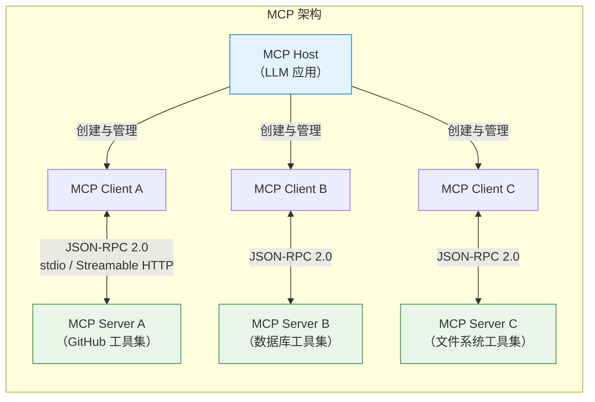
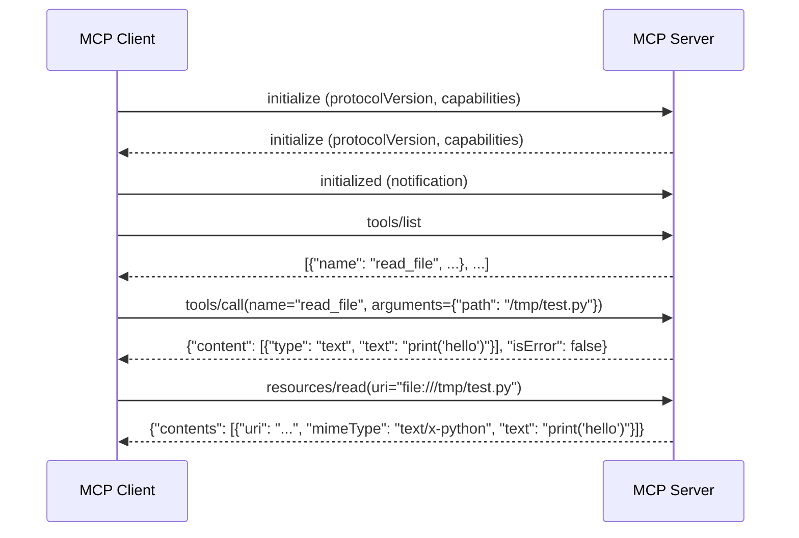
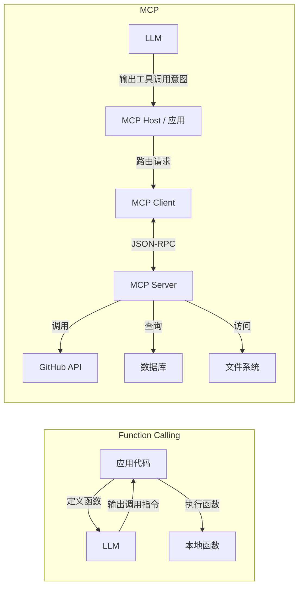
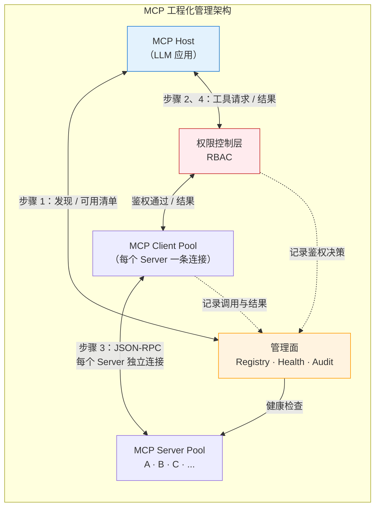
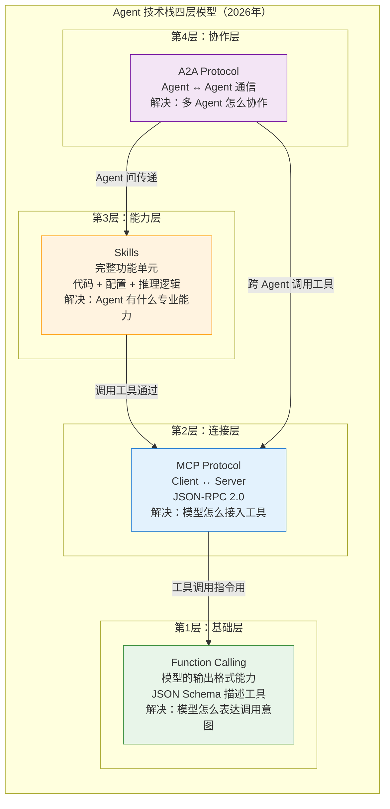
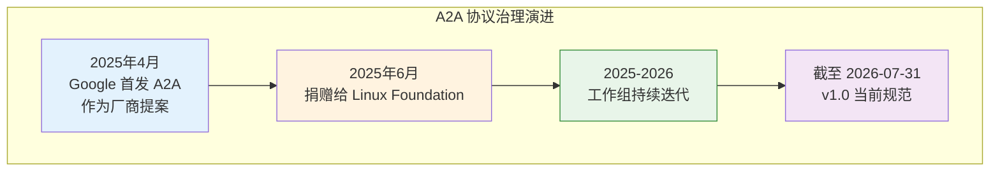
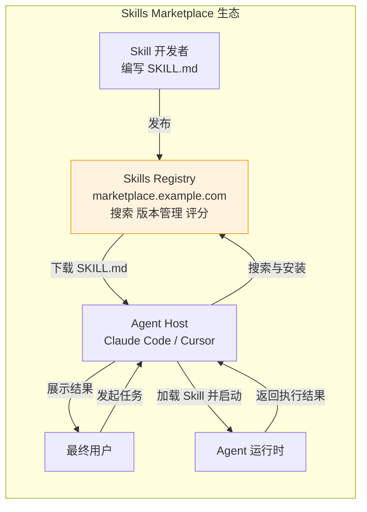

# 第 23 章 MCP、A2A 与 Skills 协议生态 ⭐⭐⭐⭐
> [!abstract] 本章导航
> **定位**：第四部分 Agent 与工程框架中的第 23 章；围绕“MCP、A2A 与 Skills 协议生态”建立单一、可追踪的知识主线。
>
> **先修**：[[22_Agent基础与工具调用|第 22 章 Agent 基础与工具调用]]。
>
> **学习目标**：
> - 解释 MCP 协议 ⭐⭐⭐⭐⭐ 的核心问题、机制与适用边界。
> - 实现或评估 协议与 Skills 关系 的最小闭环。
> - 使用可复现证据诊断 A2A 与 Skills 生态 的工程取舍与失败模式。
>
> **建议路径**：MCP 协议 ⭐⭐⭐⭐⭐ → 协议与 Skills 关系 → A2A 与 Skills 生态。
>
> **配套代码**：`code/ch22_agent_tools/`。

本章先回答“MCP 协议 ⭐⭐⭐⭐⭐”为什么成立，再沿着机制、实现、评估和边界逐步展开。阅读时先建立因果链，再运行或推演示例，最后用章末自测检查能否脱离原文复述。
## 23.1 MCP 协议 ⭐⭐⭐⭐⭐

### 23.1.1 什么是 MCP

MCP（Model Context Protocol，模型上下文协议）是 Anthropic 于 2024 年底推出的**开放标准协议**，旨在为 AI 模型提供与外部工具和数据源连接的标准化方式。它被称为 "AI 领域的 USB-C 接口"。



**MCP 的核心设计**：

| 组件 | 角色 | 说明 |
|------|------|------|
| **MCP Client** | 消费者 | LLM 应用（如 Claude Desktop、Cursor、自定义 Agent）|
| **MCP Server** | 提供者 | 暴露工具和数据源的服务端 |
| **Transport** | 传输层 | stdio（本地）或 SSE（远程）|
| **Protocol** | 协议层 | JSON-RPC 2.0 |

### 23.1.2 MCP 三大核心能力

MCP Server 可以向 Client 暴露三类能力：

#### 23.1.2.1 Tools（工具）⭐⭐⭐⭐⭐

模型可调用的函数，类似于 Function Calling 中的函数定义：

```json
{
  "tools": [
    {
      "name": "read_file",
      "description": "读取文件内容",
      "inputSchema": {
        "type": "object",
        "properties": {
          "path": {"type": "string", "description": "文件路径"}
        },
        "required": ["path"]
      }
    },
    {
      "name": "write_file",
      "description": "写入文件内容",
      "inputSchema": {
        "type": "object",
        "properties": {
          "path": {"type": "string"},
          "content": {"type": "string"}
        },
        "required": ["path", "content"]
      }
    }
  ]
}
```

#### 23.1.2.2 Resources（资源）

只读的数据资源，模型可以读取但不可修改：

```json
{
  "resources": [
    {
      "uri": "file:///project/README.md",
      "mimeType": "text/markdown",
      "name": "项目 README"
    },
    {
      "uri": "db://users/schema",
      "mimeType": "application/json",
      "name": "用户表结构"
    }
  ]
}
```

#### 23.1.2.3 Prompts（提示模板）

预定义的提示词模板，Server 可以向 Client 提供标准化的交互模式：

```json
{
  "prompts": [
    {
      "name": "code_review",
      "description": "代码审查模板",
      "arguments": [
        {
          "name": "language",
          "description": "编程语言",
          "required": true
        }
      ]
    }
  ]
}
```

### 23.1.3 MCP 通信流程



### 23.1.4 MCP 与 Function Calling 的本质区别 ⭐⭐⭐⭐⭐

这是 **2025 年面试最高频的问题之一**。

| 维度 | Function Calling | MCP |
|------|-----------------|-----|
| **定位** | 模型的**输出格式能力** | **连接协议/标准** |
| **层级** | 应用层（单个函数调用）| 协议层（客户端-服务端架构）|
| **工具发现** | 调用前静态定义 | 运行时动态发现（tools/list）|
| **工具来源** | 应用程序硬编码 | 独立的 MCP Server，可插拔 |
| **通信方式** | 函数调用 → 本地执行 | JSON-RPC 2.0（stdio/SSE）|
| **复用性** | 低（每个应用自己实现）| 高（一个 Server 服务多个 Client）|
| **生态** | 各平台独立 | 开放生态，社区共享 Server |

**一句话总结**：Function Calling 是**能力**（模型能输出函数调用指令），MCP 是**协议**（标准化地连接模型与工具生态）。



### 23.1.5 MCP Server 简单实现

```python
"""
MCP Server 简化实现示例
展示 MCP 协议的核心交互模式
"""
import json
import sys
from typing import Any

class MCPServer:
    """
    MCP Server 简化实现

    通信方式：stdio（标准输入输出上的 JSON-RPC）
    """

    def __init__(self):
        self.tools = {
            "read_file": self.read_file,
            "list_directory": self.list_directory,
        }

    def send(self, message: dict):
        """发送 JSON-RPC 消息"""
        print(json.dumps(message), flush=True)

    def recv(self) -> dict | None:
        """接收 JSON-RPC 消息"""
        try:
            line = sys.stdin.readline()
            if not line:
                return None
            return json.loads(line)
        except json.JSONDecodeError:
            return None

    def handle_initialize(self, request_id: Any, params: dict) -> dict:
        """处理初始化请求"""
        return {
            "jsonrpc": "2.0",
            "id": request_id,
            "result": {
                "protocolVersion": "2024-11-05",
                "capabilities": {
                    "tools": {},
                    "resources": {}
                },
                "serverInfo": {
                    "name": "simple-filesystem-server",
                    "version": "1.0.0"
                }
            }
        }

    def handle_tools_list(self, request_id: Any) -> dict:
        """处理工具列表请求"""
        return {
            "jsonrpc": "2.0",
            "id": request_id,
            "result": {
                "tools": [
                    {
                        "name": "read_file",
                        "description": "读取文件内容",
                        "inputSchema": {
                            "type": "object",
                            "properties": {
                                "path": {"type": "string"}
                            },
                            "required": ["path"]
                        }
                    },
                    {
                        "name": "list_directory",
                        "description": "列出目录内容",
                        "inputSchema": {
                            "type": "object",
                            "properties": {
                                "path": {"type": "string"}
                            },
                            "required": ["path"]
                        }
                    }
                ]
            }
        }

    def handle_tools_call(self, request_id: Any, params: dict) -> dict:
        """处理工具调用请求"""
        tool_name = params.get("name")
        arguments = params.get("arguments", {})

        if tool_name in self.tools:
            try:
                result = self.tools[tool_name](**arguments)
                return {
                    "jsonrpc": "2.0",
                    "id": request_id,
                    "result": {
                        "content": [{"type": "text", "text": result}],
                        "isError": False
                    }
                }
            except Exception as e:
                return {
                    "jsonrpc": "2.0",
                    "id": request_id,
                    "result": {
                        "content": [{"type": "text", "text": f"错误: {str(e)}"}],
                        "isError": True
                    }
                }
        else:
            return {
                "jsonrpc": "2.0",
                "id": request_id,
                "error": {"code": -32601, "message": f"工具 {tool_name} 不存在"}
            }

    def read_file(self, path: str) -> str:
        with open(path, 'r', encoding='utf-8') as f:
            return f.read()

    def list_directory(self, path: str) -> str:
        import os
        entries = os.listdir(path)
        return "\n".join(entries)

    def run(self):
        """主事件循环"""
        while True:
            request = self.recv()
            if request is None:
                break

            method = request.get("method", "")
            request_id = request.get("id")
            params = request.get("params", {})

            if method == "initialize":
                response = self.handle_initialize(request_id, params)
            elif method == "tools/list":
                response = self.handle_tools_list(request_id)
            elif method == "tools/call":
                response = self.handle_tools_call(request_id, params)
            else:
                response = {
                    "jsonrpc": "2.0",
                    "id": request_id,
                    "error": {"code": -32601, "message": f"未知方法: {method}"}
                }

            self.send(response)


if __name__ == "__main__":
    server = MCPServer()
    server.run()
```

---

### 23.1.6 MCP 工程化管理 （2026年更新）

> 2026年，MCP 已从"新协议介绍"进入"工程化管理"阶段。面试中不再只问"什么是 MCP"，而是追问"你们怎么管理几百个 MCP Server？"

#### 23.1.6.1 大量 MCP Server 的管理挑战

当生产环境中的 MCP Server 从 3-5 个增长到 50+ 甚至 100+ 时，面临以下挑战：

| 挑战 | 描述 | 解决方案 |
|------|------|---------|
| **服务发现** | 如何知道有哪些 Server 可用 | MCP Registry（注册中心） |
| **动态加载** | 运行时增删 Server 不重启 | 热插拔 + 健康检查 |
| **权限控制** | 不同用户能访问不同工具 | RBAC + Tool 级权限 |
| **审计追踪** | 谁调用了什么工具 | 全链路日志 + 调用链 |
| **版本管理** | Server 升级不影响 Client | 语义化版本 + 灰度发布 |
| **性能监控** | 哪些工具慢、失败率高 | 指标采集 + 告警 |

#### 23.1.6.2 MCP Server 动态加载架构



#### 23.1.6.3 动态加载与权限控制代码示例

```python
"""
MCP 工程化管理 - Server 注册中心 + 动态加载 + 权限控制
"""
import json
import time
import hashlib
from typing import Optional
from dataclasses import dataclass, field
from datetime import datetime, timedelta
from enum import Enum


class PermissionLevel(Enum):
    """工具权限级别"""
    DENY = 0      # 禁止访问
    READ = 1      # 只读访问
    WRITE = 2     # 读写访问
    ADMIN = 3     # 完全控制


@dataclass
class MCPServerInfo:
    """MCP Server 注册信息"""
    name: str
    version: str
    transport: str          # "stdio" | "sse"
    endpoint: str           # 路径或 URL
    tools: list[dict] = field(default_factory=list)
    permissions: dict[str, PermissionLevel] = field(default_factory=dict)
    last_heartbeat: float = 0.0
    health_status: str = "unknown"  # "healthy" | "unhealthy" | "unknown"
    metadata: dict = field(default_factory=dict)


class MCPRegistry:
    """
    MCP Server 注册中心

    功能：
    1. Server 注册与发现
    2. 健康检查
    3. 版本管理
    4. 工具级权限控制 (RBAC)
    """

    def __init__(self):
        self._servers: dict[str, MCPServerInfo] = {}
        self._user_roles: dict[str, list[str]] = {}  # user_id -> [role, ...]
        self._role_permissions: dict[str, dict[str, PermissionLevel]] = {}
        self._audit_log: list[dict] = []
        self._max_log_entries = 10000

    def register(self, server_info: MCPServerInfo) -> bool:
        """注册 MCP Server"""
        server_id = f"{server_info.name}@{server_info.version}"
        server_info.last_heartbeat = time.time()
        server_info.health_status = "healthy"
        self._servers[server_id] = server_info
        return True

    def discover(self, user_id: str) -> list[MCPServerInfo]:
        """
        为用户发现可用的 Server（根据权限过滤）

        Args:
            user_id: 用户ID

        Returns:
            用户有权限访问的 Server 列表
        """
        available = []
        user_perms = self._get_user_permissions(user_id)

        for server_id, server in self._servers.items():
            if server.health_status != "healthy":
                continue
            # 过滤用户有权限的工具
            allowed_tools = []
            for tool in server.tools:
                tool_name = tool.get("name", "")
                perm = user_perms.get(tool_name, PermissionLevel.DENY)
                if perm.value >= PermissionLevel.READ.value:
                    allowed_tools.append(tool)

            if allowed_tools:
                filtered_server = MCPServerInfo(
                    name=server.name,
                    version=server.version,
                    transport=server.transport,
                    endpoint=server.endpoint,
                    tools=allowed_tools,
                    permissions={k: v for k, v in user_perms.items()
                               if v.value >= PermissionLevel.READ.value},
                    health_status=server.health_status,
                    metadata=server.metadata,
                )
                available.append(filtered_server)

        return available

    def check_permission(
        self,
        user_id: str,
        tool_name: str,
        required_level: PermissionLevel = PermissionLevel.READ
    ) -> bool:
        """检查用户是否有权限调用指定工具"""
        user_perms = self._get_user_permissions(user_id)
        actual = user_perms.get(tool_name, PermissionLevel.DENY)
        return actual.value >= required_level.value

    def _get_user_permissions(self, user_id: str) -> dict[str, PermissionLevel]:
        """获取用户的所有工具权限"""
        roles = self._user_roles.get(user_id, ["default"])
        merged: dict[str, PermissionLevel] = {}

        for role in roles:
            role_perms = self._role_permissions.get(role, {})
            for tool, perm in role_perms.items():
                if tool not in merged or perm.value > merged[tool].value:
                    merged[tool] = perm

        return merged

    def log_tool_call(
        self,
        user_id: str,
        tool_name: str,
        arguments: dict,
        result: str,
        duration_ms: float,
        success: bool
    ):
        """记录工具调用审计日志"""
        entry = {
            "timestamp": datetime.now().isoformat(),
            "user_id": self._hash_id(user_id),
            "tool_name": tool_name,
            "arguments": self._sanitize_args(arguments),
            "result_preview": result[:200] if result else "",
            "duration_ms": duration_ms,
            "success": success,
        }
        self._audit_log.append(entry)

        # 防止日志无限增长
        if len(self._audit_log) > self._max_log_entries:
            self._audit_log = self._audit_log[-self._max_log_entries // 2:]

    def health_check(self) -> dict[str, str]:
        """对所有 Server 执行健康检查"""
        now = time.time()
        for server_id, server in self._servers.items():
            if now - server.last_heartbeat > 60:  # 60秒无心跳视为不健康
                server.health_status = "unhealthy"
        return {sid: s.health_status for sid, s in self._servers.items()}

    @staticmethod
    def _hash_id(user_id: str) -> str:
        """对用户ID做哈希处理（隐私保护）"""
        return hashlib.sha256(user_id.encode()).hexdigest()[:16]

    @staticmethod
    def _sanitize_args(args: dict) -> dict:
        """清理敏感参数（如密码、token）"""
        sensitive_keys = {"password", "token", "secret", "api_key", "auth"}
        sanitized = {}
        for k, v in args.items():
            if any(sk in k.lower() for sk in sensitive_keys):
                sanitized[k] = "***REDACTED***"
            else:
                sanitized[k] = v
        return sanitized


# ============ 使用示例 ============

def demo_mcp_registry():
    """MCP Registry 使用演示"""
    registry = MCPRegistry()

    # 1. 定义角色权限：客服人员只能查询，管理员可以修改
    registry._role_permissions["customer_service"] = {
        "query_order": PermissionLevel.READ,
        "query_policy": PermissionLevel.READ,
        "search_knowledge": PermissionLevel.READ,
    }
    registry._role_permissions["admin"] = {
        "query_order": PermissionLevel.WRITE,
        "update_order": PermissionLevel.WRITE,
        "refund_request": PermissionLevel.ADMIN,
    }

    # 2. 分配角色
    registry._user_roles["alice"] = ["customer_service"]
    registry._user_roles["bob"] = ["admin"]

    # 3. 注册 Server
    registry.register(MCPServerInfo(
        name="order-system",
        version="1.2.0",
        transport="stdio",
        endpoint="/servers/order-mcp",
        tools=[
            {"name": "query_order", "description": "查询订单"},
            {"name": "update_order", "description": "更新订单"},
        ],
    ))

    # 4. 权限检查
    print(f"Alice 能否 query_order: {registry.check_permission('alice', 'query_order')}")
    print(f"Alice 能否 update_order: {registry.check_permission('alice', 'update_order')}")
    print(f"Bob 能否 update_order: {registry.check_permission('bob', 'update_order')}")

    # 5. 发现可用 Server
    alice_servers = registry.discover("alice")
    print(f"\nAlice 可用的 Server: {[s.name for s in alice_servers]}")
    print(f"Alice 可用的工具: {[t['name'] for s in alice_servers for t in s.tools]}")

    # 6. 记录审计日志
    registry.log_tool_call(
        user_id="alice",
        tool_name="query_order",
        arguments={"order_id": "#12345"},
        result="订单状态：已发货",
        duration_ms=45.2,
        success=True,
    )
    print(f"\n审计日志条目数: {len(registry._audit_log)}")


if __name__ == "__main__":
    demo_mcp_registry()
```

**面试追问**："MCP Server 多了之后，一个工具的调用链怎么追踪？" → 引入**调用链追踪（Trace ID）**，每个 Agent 任务生成唯一 Trace ID，贯穿所有 MCP 工具调用，便于故障排查和性能分析。

## 23.2 协议与 Skills 关系
### 23.2.1 Function Calling vs MCP vs Skills vs A2A 四者关系图解

这是 **2026 年面试最高频的辨析题**，许多候选人能分别说出每个是什么，但说不清楚它们之间的关系。

#### 23.2.1.1 一句话定义

| 概念 | 一句话定义 | 解决的问题 |
|------|----------|-----------|
| **Function Calling** | 模型"输出函数调用指令"的能力 | 模型怎么**表达**要调用工具 |
| **MCP** | 连接模型应用与工具生态的标准**协议** | 模型怎么**接入**外部工具 |
| **Skills** | 封装完整功能的可复用**单元**（代码+配置+推理逻辑） | Agent 怎么**拥有**某项专业能力 |
| **A2A** | Agent 之间协作通信的标准**协议** | 多个 Agent 怎么**互相协作** |

#### 23.2.1.2 四层架构图解



#### 23.2.1.3 关键辨析

**Skills vs MCP**：
- **Skills** = "我会做什么"（能力单元，包含完整的推理逻辑 + 工具调用链）
- **MCP** = "我怎么连接工具"（连接协议，不关心工具里有什么业务逻辑）
- 一个 Skill 内部可能使用多个 MCP Server 提供的工具

**Skills vs Few-shot Prompting**：
- **Few-shot** = 教模型"格式"（给出输入输出示例，让模型模仿格式）
- **Skills** = 教模型"方法论"（完整的解题思路、工具组合、验证流程）
- 类比：Few-shot 是"照着例题做题"，Skills 是"掌握解题方法论"

**四者关系总结**：
> Function Calling 是**能力**，MCP 是**连接协议**，Skills 是**功能单元**，A2A 是**协作协议**。四层叠加，缺一不可。

---

### 23.2.2 Skills 设计方法论

Skills 是 2026 年的重要概念，面试中经常要求"设计一个 Skill"。

#### 23.2.2.1 Skills 设计三步法

```
┌─────────────────────────────────────────────────────┐
│  Step 1: 能力拆解                                     │
│  将"大能力"拆成"原子操作"                               │
│  例：客服 Skill → 查询订单 + 查询政策 + 情感分析 + 转人工  │
├─────────────────────────────────────────────────────┤
│  Step 2: 工具编排                                      │
│  定义原子操作的执行顺序、依赖关系、错误处理                │
│  例：先查订单 → 根据状态决定查政策还是转人工               │
├─────────────────────────────────────────────────────┤
│  Step 3: 验证闭环                                      │
│  每个 Skill 必须有输出验证 + 回退策略                     │
│  例：工具调用失败 → 重试 → 降级 → 人工接管                │
└─────────────────────────────────────────────────────┘
```

#### 23.2.2.2 Skill 定义示例（AGENTS.md 开放标准格式）

```markdown
# Skill: 智能客服

## 描述
处理电商平台的用户咨询，包括订单查询、政策解答、退款处理、工单创建。

## 适用场景
- 用户查询订单状态
- 用户咨询退换货政策
- 用户申请退款
- 用户情绪激动需要安抚

## 工具依赖
- query_order: 查询订单信息
- query_policy: 查询公司政策
- refund_request: 处理退款申请
- create_ticket: 创建人工工单
- analyze_sentiment: 情感分析

## 执行流程
1. 接收用户消息 → 情感分析
2. 若情绪激烈（intensity > 0.8）→ 直接转人工（create_ticket）
3. 若情绪正常 → 识别意图
   - 意图=订单查询 → query_order → 给出结果
   - 意图=政策咨询 → query_policy → 给出结果
   - 意图=退款申请 → 校验条件 → refund_request → 给出结果
4. 任何步骤失败 → 重试1次 → 仍失败则 create_ticket

## 输出格式
{"response": "给用户的话", "actions": [], "escalated": false}

## 回退策略
- 工具调用失败: 重试1次 → 仍失败转人工
- 意图不明确: 反问用户澄清
- 超出能力范围: 诚恳告知 + 转人工
```

### 23.2.3 高频题3：MCP 和 Function Calling 的本质区别？

**参考答案**（重点中的重点）：

| 维度 | Function Calling | MCP |
|------|-----------------|-----|
| **本质** | 模型的**输出能力** | **连接协议/标准** |
| **类比** | 一个人会说"请帮我拿杯水" | USB-C 接口标准 |
| **层级** | 应用层 | 协议层 |
| **工具来源** | 应用内硬编码 | 独立 Server，即插即用 |
| **发现机制** | 静态定义 | 运行时动态发现 |

**一句话**：Function Calling 是模型"能发出工具调用指令"的能力；MCP 是"标准化地连接模型应用与工具生态"的协议。两者互补 —— MCP Server 提供工具，Function Calling 让模型调用这些工具。

---

### 23.2.4 高频题6：A2A 协议和 MCP 协议的区别？

**参考答案**：

- **MCP** 是 **Client-Server 架构**，连接"模型应用"和"工具服务"，解决的是"模型如何调用工具"的问题
- **A2A** 是 **Peer-to-Peer 架构**，连接"Agent"和"Agent"，解决的是"Agent 之间如何协作"的问题

类比：MCP 像 USB-C（连接设备与配件），A2A 像蓝牙（设备之间互相通信）。

## 23.3 A2A 与 Skills 生态

> Agent 生态正在进入协议化阶段。本节按 **2026-07-31** 可核验的公开规范介绍 A2A、Skills、实时语音、沙箱与持久化执行；协议示例必须标明版本，避免把旧草案 API 当成当前标准。

---

### 23.3.1 A2A v1.0：Agent Card + 多协议绑定

A2A（Agent-to-Agent）由 Google 于 2025 年 4 月公开，并于 **2025 年 6 月**捐赠给 Linux Foundation。按 2026-07-31 的 A2A v1.0 规范，协议定义等价的 **JSON-RPC、HTTP+JSON/REST、gRPC** 绑定，而不是只绑定 HTTP+SSE。官方规范见 [A2A v1.0](https://a2a-protocol.org/latest/whats-new-v1/)。

#### 23.3.1.1 Agent Card：Agent 的"身份证"

Agent Card 是描述 Agent 能力、认证方式和协议端点的标准 JSON 文档，标准发现路径是 `/.well-known/agent-card.json`：

```json
{
  "name": "WeatherAgent",
  "version": "1.0.0",
  "description": "查询全球天气信息",
  "supportedInterfaces": [
    {
      "url": "https://weather-agent.example.com/a2a",
      "protocolBinding": "JSONRPC",
      "protocolVersion": "1.0"
    }
  ],
  "provider": {
    "organization": "Example Corp",
    "url": "https://example.com"
  },
  "capabilities": {
    "streaming": true,
    "pushNotifications": true
  },
  "defaultInputModes": ["text/plain"],
  "defaultOutputModes": ["text/plain", "application/json"],
  "skills": [
    {
      "id": "get_weather",
      "name": "Get Weather",
      "description": "获取指定城市的当前天气和预报",
      "tags": ["weather", "forecast"],
      "inputModes": ["text/plain"],
      "outputModes": ["text/plain", "application/json"],
      "examples": [
        "北京今天天气怎么样？",
        "明天上海会下雨吗？"
      ]
    }
  ],
  "securitySchemes": {
    "bearer": {
      "httpAuthSecurityScheme": {
        "scheme": "Bearer",
        "bearerFormat": "JWT"
      }
    }
  },
  "securityRequirements": [
    {"schemes": {"bearer": {"list": []}}}
  ]
}
```

`version`、`defaultInputModes`、`defaultOutputModes`、`skills` 都是必填字段，每个
`AgentSkill` 还必须有 `tags`。v1.0 采用 ProtoJSON：`securitySchemes` 的每个值要用
`httpAuthSecurityScheme`、`oauth2SecurityScheme` 等 oneof 字段包装；
`securityRequirements` 则通过 `schemes` 映射到 scope 的 `list`。

#### 23.3.1.2 JSON-RPC v1.0 通信

下面仅演示 JSON-RPC 绑定：普通调用使用 `SendMessage`，流式调用使用 `SendStreamingMessage` 并接收 SSE。生产代码应优先使用官方 SDK，并根据 Agent Card 的 `supportedInterfaces` 选择绑定。成功的 `SendMessageResponse` 不是裸 `Task`：JSON-RPC 的 `result` 内必须且只能出现 `{"task": {...}}` 或 `{"message": {...}}`。

```python
"""
A2A v1.0 Client 简化实现
展示 JSON-RPC + SSE；省略签名校验、重试和完整错误映射
"""
import json
import asyncio
import httpx
from typing import AsyncIterator


class A2AClient:
    """
    A2A 协议客户端

    核心能力：
    1. 拉取 Agent Card（发现能力）
    2. 发送任务（JSON-RPC over HTTP）
    3. 订阅流式更新（SSE）
    """

    def __init__(self, agent_url: str, auth_token: str | None = None):
        self.agent_url = agent_url.rstrip("/")
        self.auth_token = auth_token
        self._card = None
        self._rpc_url: str | None = None

    async def fetch_agent_card(self) -> dict:
        """从 .well-known 路径拉取 Agent 能力描述"""
        async with httpx.AsyncClient() as client:
            url = f"{self.agent_url}/.well-known/agent-card.json"
            headers = {}
            if self.auth_token:
                headers["Authorization"] = f"Bearer {self.auth_token}"
            response = await client.get(url, headers=headers, timeout=10.0)
            response.raise_for_status()
            self._card = response.json()
            self._rpc_url = next(
                item["url"]
                for item in self._card["supportedInterfaces"]
                if item["protocolBinding"] == "JSONRPC"
                and item["protocolVersion"] == "1.0"
            )
            return self._card

    async def send_message(
        self,
        text: str,
        task_id: str | None = None,
        context_id: str | None = None,
    ) -> dict:
        """通过 JSON-RPC 2.0 启动或继续一个 A2A task。"""
        message = {
            "messageId": self._new_id(),
            "role": "ROLE_USER",
            "parts": [{"text": text}],
        }
        if task_id:
            message["taskId"] = task_id
        if context_id:
            message["contextId"] = context_id
        rpc_request = {
            "jsonrpc": "2.0",
            "id": 1,
            "method": "SendMessage",
            "params": {"message": message},
        }
        async with httpx.AsyncClient() as client:
            headers = {
                "Content-Type": "application/json",
                "A2A-Version": "1.0",
            }
            if self.auth_token:
                headers["Authorization"] = f"Bearer {self.auth_token}"
            response = await client.post(
                self._rpc_url,
                json=rpc_request,
                headers=headers,
                timeout=60.0,
            )
            response.raise_for_status()
            return response.json()

    async def stream_message(self, text: str) -> AsyncIterator[dict]:
        """通过 SSE 订阅流式输出"""
        rpc_request = {
            "jsonrpc": "2.0",
            "id": 2,
            "method": "SendStreamingMessage",
            "params": {
                "message": {
                    "messageId": self._new_id(),
                    "role": "ROLE_USER",
                    "parts": [{"text": text}],
                }
            }
        }
        headers = {
            "Accept": "text/event-stream",
            "Content-Type": "application/json",
            "A2A-Version": "1.0",
        }
        if self.auth_token:
            headers["Authorization"] = f"Bearer {self.auth_token}"

        async with httpx.AsyncClient() as client:
            async with client.stream(
                "POST",
                self._rpc_url,
                json=rpc_request,
                headers=headers,
                timeout=None,
            ) as response:
                async for line in response.aiter_lines():
                    if line.startswith("data: "):
                        data = line[6:].strip()
                        if data and data != "[DONE]":
                            try:
                                yield json.loads(data)
                            except json.JSONDecodeError:
                                continue

    @staticmethod
    def _new_id() -> str:
        import uuid
        return str(uuid.uuid4())


async def main():
    client = A2AClient("https://weather-agent.example.com", auth_token="xxx")
    card = await client.fetch_agent_card()
    print(f"Agent: {card['name']}, Skills: {[s['id'] for s in card['skills']]}")

    result = await client.send_message("北京今天天气怎么样？")
    print(f"Result: {result}")

    async for event in client.stream_message("上海未来三天预报"):
        print(f"Stream event: {event}")


asyncio.run(main())
```

#### 23.3.1.3 Linux Foundation 治理演进



**关键意义**：
- **厂商中立**：不再绑定单一公司，避免供应商锁定
- **治理透明**：Working Group 决策公开，多方投票
- **生态加速**：开源参考实现 + 合规测试套件，降低接入成本
- **类比路径**：与 OpenAPI、Linux Foundation、Kubernetes 治理模式相同

---

### 23.3.2 Skills Marketplace：SKILL.md 开放标准

2026 年 Skills 从 Anthropic 内部概念（Claude Skills）走向**开放市场和生态标准**。

#### 23.3.2.1 SKILL.md 文件结构

Anthropic 提出的开放标准 `SKILL.md`，使用 YAML Frontmatter 描述元信息，正文是 Markdown 文档：

````markdown
---
name: code-review
description: 对 Git diff 进行多维度代码审查，包括安全、性能、可读性
version: 1.0.0
author: community
tags: [code-review, security, performance]
license: MIT
inputs:
  - name: diff
    type: string
    description: Git diff 内容
    required: true
outputs:
  - name: review_report
    type: object
    schema:
      issues: array
      summary: string
      score: number
---

# Code Review Skill

## 描述
本 Skill 对 Git diff 进行多维度代码审查，输出结构化报告。

## 适用场景
- 提交前的自我审查
- CI 流水线中的自动审查
- Code Review 机器人的审查逻辑

## 工具依赖
- `read_file`: 读取 diff 文件
- `search_pattern`: 搜索可疑模式
- `language_detect`: 检测编程语言

## 执行流程
1. 解析 diff，识别变更的文件
2. 对每个文件进行语言检测
3. 加载对应语言的审查规则
4. 执行多维度检查
5. 汇总问题，输出结构化报告

## 输出格式
结构化 JSON 对象，包含 issues 数组、summary 文本、score 分数

## 示例
### 输入
```diff
+ cursor.execute(f"SELECT * FROM users WHERE id = {user_id}")
```

### 输出
```json
{
  "issues": [{
    "file": "db.py",
    "line": 1,
    "severity": "critical",
    "type": "security",
    "message": "SQL 注入风险：应使用参数化查询"
  }],
  "score": 30
}
```

## 回退策略
- diff 格式无法解析 → 报告错误并跳过审查
- 语言不支持 → 仅做通用检查
- 工具调用失败 → 重试 1 次 → 仍失败则返回降级报告
````

#### 23.3.2.2 Skills 加载器实现

```python
"""
Skills 加载器 - 从目录加载 SKILL.md 并提供给 Agent
"""
import yaml
import re
from pathlib import Path
from dataclasses import dataclass, field
from typing import Optional


@dataclass
class Skill:
    """解析后的 Skill 对象"""
    name: str
    description: str
    version: str
    author: str
    tags: list[str]
    inputs: list[dict]
    outputs: list[dict]
    tools: list[str] = field(default_factory=list)
    flow_steps: list[str] = field(default_factory=list)
    raw_markdown: str = ""
    file_path: str = ""


class SkillLoader:
    """
    Skills Marketplace 加载器

    使用示例：
        loader = SkillLoader(skills_dir="./skills")
        skill = loader.load("code-review")
        loader.list_by_tag("security")
    """

    def __init__(self, skills_dir: str):
        self.skills_dir = Path(skills_dir)
        self._cache: dict[str, Skill] = {}

    def load(self, skill_name: str) -> Skill:
        """加载指定 Skill（带缓存）"""
        if skill_name in self._cache:
            return self._cache[skill_name]

        skill_file = self.skills_dir / skill_name / "SKILL.md"
        if not skill_file.exists():
            raise FileNotFoundError(f"Skill not found: {skill_file}")

        content = skill_file.read_text(encoding="utf-8")
        skill = self._parse(content)
        skill.file_path = str(skill_file)
        self._cache[skill_name] = skill
        return skill

    def list_all(self) -> list[Skill]:
        """列出目录下所有 Skill"""
        skills = []
        for sub in self.skills_dir.iterdir():
            if sub.is_dir() and (sub / "SKILL.md").exists():
                try:
                    skills.append(self.load(sub.name))
                except Exception:
                    continue
        return skills

    def list_by_tag(self, tag: str) -> list[Skill]:
        """按 tag 过滤"""
        return [s for s in self.list_all() if tag in s.tags]

    def _parse(self, content: str) -> Skill:
        """解析 SKILL.md（YAML Frontmatter + Markdown 正文）"""
        match = re.match(r"^---\n(.*?)\n---\n(.*)$", content, re.DOTALL)
        if not match:
            raise ValueError("SKILL.md 必须以 YAML frontmatter 开头")
        yaml_text, markdown = match.groups()
        meta = yaml.safe_load(yaml_text) or {}

        tools = re.findall(r"`([a-z_]+)`\s*[:：]", markdown)
        flow_steps = re.findall(r"^\d+\.\s+(.+)$", markdown, re.MULTILINE)

        return Skill(
            name=meta.get("name", ""),
            description=meta.get("description", ""),
            version=meta.get("version", "0.0.1"),
            author=meta.get("author", "unknown"),
            tags=meta.get("tags", []),
            inputs=meta.get("inputs", []),
            outputs=meta.get("outputs", []),
            tools=tools,
            flow_steps=flow_steps,
            raw_markdown=markdown,
        )


def demo_skill_loader():
    loader = SkillLoader(skills_dir="./skills")

    print("=== All Skills ===")
    for s in loader.list_all():
        print(f"- {s.name} v{s.version}: {s.description}")

    print("\n=== Security Skills ===")
    for s in loader.list_by_tag("security"):
        print(f"- {s.name}")

    skill = loader.load("code-review")
    print(f"\nLoaded: {skill.name}")
    print(f"Tools: {skill.tools}")
    print(f"Flow: {skill.flow_steps}")


demo_skill_loader()
```

#### 23.3.2.3 Skills 生态与 Marketplace 流程



**与 npm / PyPI 的类比**：

| 维度 | npm 与 PyPI | Skills Marketplace |
|------|------------|-------------------|
| **包内容** | 代码库 | SKILL.md 声明式 |
| **执行** | 解释或编译运行 | 由 LLM 解释执行 |
| **版本管理** | semver | semver |
| **依赖管理** | package.json 与 requirements.txt | Skills 间调用关系 |
| **签名** | npm 签名 | 数字签名加来源审计 |

---

### 23.3.3 面试真题精讲

**Q1：A2A 进入 Linux Foundation 治理有什么意义？**

**参考答案**：
- **厂商中立**：避免被任何一家公司主导，类比 Kubernetes 捐给 CNCF
- **生态加速**：开源参考实现 + 合规测试套件，降低接入成本
- **治理透明**：多方 Working Group 决策，公开路线图
- **企业信任**：大企业更愿意采用行业标准而非厂商提案

---

**Q2：SKILL.md 和传统代码包（npm/PyPI）有什么区别？**

**参考答案**：
- **声明式 vs 命令式**：SKILL.md 描述做什么与怎么做的方法论，由 LLM 解释执行；代码包是可直接运行的代码
- **可移植性**：SKILL.md 跨模型与跨平台；代码包依赖具体运行时
- **版本管理**：两者都用 semver，但 Skills 还要管理 prompt 版本

---

**Q3：为什么需要 BidiAgent？全双工语音难在哪？**

**参考答案**：
- **全双工不等于半双工**：半双工是一问一答，全双工是可被打断与并发说话
- **技术难点**：
  - **VAD 准确性**：在背景噪音中检测用户开始说话
  - **打断处理**：检测到打断后尽快停止 TTS；延迟 SLO 应根据终端、网络和语音栈实测
  - **并发安全**：用户说话时 Agent 思考和工具调用
- **应用场景**：电话客服、语音助手、远程会议

---

**Q4：Durable Execution 适合所有 Agent 吗？**

**参考答案**：
- **适合**：跨进程/跨小时、必须完成或需要审计与人工介入的任务，如订单处理
- **未必适合**：生命周期很短、无外部副作用且可由请求级重试恢复的任务，或对尾延迟极敏感的路径
- **代价**：持久化会增加写放大、存储、序列化和恢复复杂度；实际成本需按事件量、载荷、
  保留期和存储后端测量，不能使用通用百分比

---

**Q5：ACI 设计和 API 设计有什么异同？**

**参考答案**：

| 维度 | API 设计 | ACI 设计 |
|------|---------|---------|
| **使用者** | 人类开发者 | LLM Agent |
| **设计目标** | 性能、可用性、安全 | Token 效率、描述清晰、可组合 |
| **复杂度** | 可接受复杂 专家用户 | 尽量简单 避免 Agent 理解错 |
| **错误处理** | 抛出异常 | 返回可操作的错误信息 |
| **文档** | OpenAPI | 工具描述加 example |

**核心区别**：ACI 的"用户"是 LLM，需要考虑模型的注意力限制、token 成本、推理错误。

---

**Q6：SandboxAgent 为什么需要"多层防御"？单层不够吗？**

**参考答案**：

单层防御容易被绕过，需要 **Defense in Depth（深度防御）**：

1. **静态分析**：在执行前扫描代码，但无法捕获所有漏洞
2. **资源限制**：cgroups 限制 CPU/内存，但无法阻止逻辑漏洞
3. **网络隔离**：默认断网，但模型可能通过白名单域名泄漏数据
4. **行为监控**：运行时检测异常 syscall，但有性能开销
5. **审计日志**：事后追溯，但无法实时阻断

**类比**：飞机有黑匣子、备用引擎、应急降落伞，缺一不可。SandboxAgent 也需要多层防御才能在生产环境放心使用。
## 🧭 本章小结

- MCP 协议 ⭐⭐⭐⭐⭐：能够说清问题、机制、证据与边界。
- 协议与 Skills 关系：能够说清问题、机制、证据与边界。
- A2A 与 Skills 生态：能够说清问题、机制、证据与边界。

## ✅ 自测与练习

1. 不看正文，解释“MCP 协议 ⭐⭐⭐⭐⭐”解决什么问题，并给出一个不适用场景。
2. 为“协议与 Skills 关系”设计一个最小可复现实验，明确输入、指标和通过条件。
3. 比较“A2A 与 Skills 生态”的至少两种方案，说明质量、成本、延迟或风险取舍。

## 🧪 配套代码与验收

- `code/ch22_agent_tools/`

```powershell
python code/scripts/run_all_examples.py --chapter ch22 --tier core
```

默认验收不下载模型、不调用付费 API；真实 API 或 GPU 示例必须按 metadata 显式启用。成功标准是相关脚本输出 `OK`，条件不足时输出可解释的 `[SKIP]`。

## 🎯 面试题精讲

回答本章问题时使用四步结构：先给结论，再解释机制，然后给项目证据，最后主动说明适用边界。涉及性能或效果时，补充模型、硬件、数据、并发、版本和统计口径；条件不完整时明确说“需要实测”。

## 📋 本章速查表

| 主题 | 回答主线 |
|---|---|
| MCP 协议 ⭐⭐⭐⭐⭐ | 问题 → 机制 → 示例 → 指标 → 边界 |
| 协议与 Skills 关系 | 问题 → 机制 → 示例 → 指标 → 边界 |
| A2A 与 Skills 生态 | 问题 → 机制 → 示例 → 指标 → 边界 |

## 🔗 相关章节

- [[22_Agent基础与工具调用|第 22 章 Agent 基础与工具调用]]
- [[24_Agent工作流编排与多智能体|第 24 章 Agent 工作流编排与多智能体]]

## 📖 一手参考资料

> 核验基线：2026-07-31；结构复核：2026-08-05。产品、API、法规、价格与 benchmark 会变化，使用前应再次核验。

- [[docs/AUTHORITATIVE_SOURCES|章节权威来源索引]]：按主题维护官方文档、标准、原论文和官方仓库。
