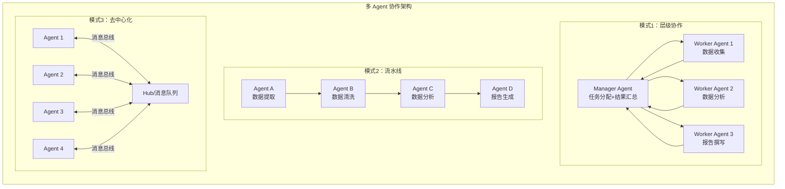
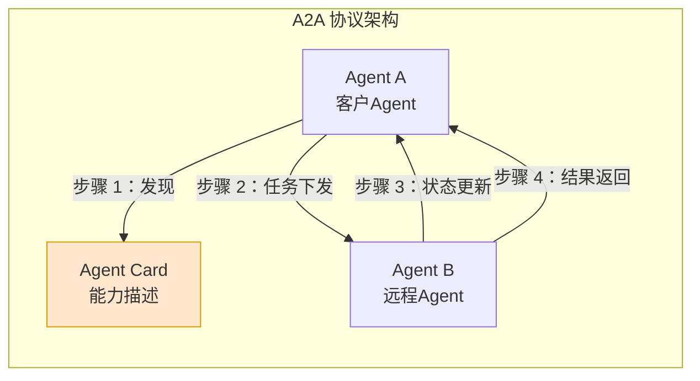
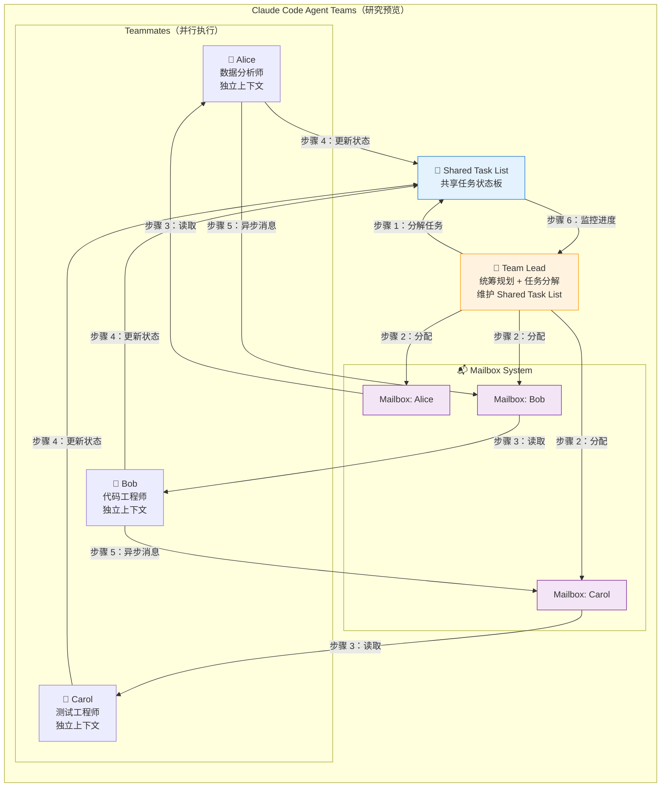
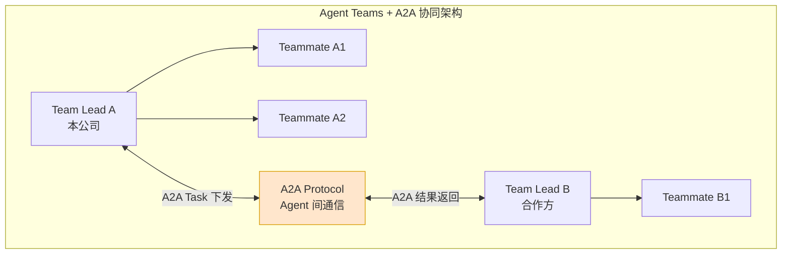
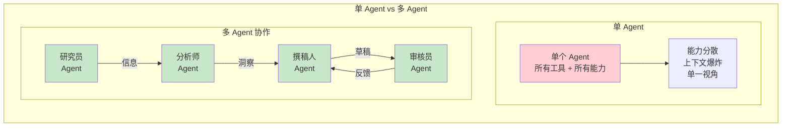

# 第 24 章 Agent 工作流编排与多智能体 ⭐⭐⭐⭐
> [!abstract] 本章导航
> **定位**：第四部分 Agent 与工程框架中的第 24 章；围绕“Agent 工作流编排与多智能体”建立单一、可追踪的知识主线。
>
> **先修**：[[23_MCP_A2A与Skills协议生态|第 23 章 MCP、A2A 与 Skills 协议生态]]。
>
> **学习目标**：
> - 解释 多 Agent 协作系统 ⭐⭐⭐⭐ 的核心问题、机制与适用边界。
> - 实现或评估 AutoGen / CrewAI 多 Agent 框架 ⭐⭐⭐⭐ 的最小闭环。
> - 使用可复现证据诊断 Human-in-the-Loop 工作流 的工程取舍与失败模式。
>
> **建议路径**：多 Agent 协作系统 ⭐⭐⭐⭐ → AutoGen / CrewAI 多 Agent 框架 ⭐⭐⭐⭐ → Human-in-the-Loop 工作流。
>
> **配套代码**：`code/ch22_agent_tools/`、`code/ch27_llm_frameworks/`。

本章先回答“多 Agent 协作系统 ⭐⭐⭐⭐”为什么成立，再沿着机制、实现、评估和边界逐步展开。阅读时先建立因果链，再运行或推演示例，最后用章末自测检查能否脱离原文复述。
## 24.1 多 Agent 协作系统 ⭐⭐⭐⭐

### 24.1.1 多 Agent 架构模式



### 24.1.2 主流多 Agent 框架

| 框架 | 开发者 | 核心特点 | 适用场景 |
|------|--------|---------|---------|
| **AutoGen** | 微软 | Conversational Programming、多 Agent 对话、代码执行 | 复杂任务自动化、代码生成 |
| **MetaGPT** | 开源社区 | SOP（标准作业程序）驱动、角色专业化 | 软件开发、项目管理 |
| **CrewAI** | 开源社区 | 角色扮演、流程编排、工具共享 | 团队协作模拟、工作流自动化 |
| **A2A 协议** | Google | Agent-to-Agent 开放协议、标准化 Agent 间通信 | 跨平台 Agent 互操作 |

### 24.1.3 A2A 协议简介 ⭐⭐⭐⭐

A2A（Agent-to-Agent）是 Google 于 2025 年推出的**开放 Agent 间通信协议**，旨在解决不同框架、不同平台的 Agent 如何互相发现和协作的问题。



**A2A 核心概念**：

| 概念 | 说明 |
|------|------|
| **Agent Card** | 描述 Agent 能力的 JSON 文件（类似 OpenAPI 文档） |
| **Task** | Agent 间传递的任务单元 |
| **Message** | 任务中的消息流（可包含文本、文件、结构化数据） |
| **Push Notification** | 异步任务状态更新机制 |

**MCP vs A2A 的区别**：

| 维度 | MCP | A2A |
|------|-----|-----|
| **连接对象** | Client ↔ Server（模型 ↔ 工具）| Agent ↔ Agent（智能体 ↔ 智能体）|
| **关系模式** | 一对多（一个 Client 连多个 Server）| 多对多（任意 Agent 间通信）|
| **能力描述** | tools/list + resources/list | Agent Card |
| **发起方** | Client 调用 Server | 任意 Agent 可向另一 Agent 下发任务 |
| **类比** | USB-C（设备连接标准）| 蓝牙（设备间通信协议）|

---

### 24.1.4 Agent Teams 架构 （2026年更新）

> Anthropic 在 2026 年 2 月发布 Claude Opus 4.6 时，为 **Claude Code** 引入了
> Agent Teams 研究预览。它是产品编排能力，不是某个模型天然具备的通用 API
> “架构”；适合可拆成独立、偏读取子任务的并行协作，功能状态与限制应以上线时的
> Claude Code 文档为准。

#### 24.1.4.1 Agent Teams 核心概念

传统 Multi-Agent 是**串行**的：Manager 分配任务 → Worker 执行 → Manager 汇总。Agent Teams 是**并行协作**的：Team Lead 统筹，Teammates 各自有独立上下文，通过共享任务列表和邮箱系统通信。



#### 24.1.4.2 Agent Teams vs 传统 Multi-Agent vs 子代理

| 维度 | 传统 Multi-Agent | Claude Code Agent Teams | 子代理 (Sub-agent) |
|------|-----------------|-------------------------|-------------------|
| **架构模式** | 串行流水线 | 并行协作 | 嵌套调用 |
| **上下文** | 共享/透传 | 独立上下文 | 继承父上下文 |
| **生命周期** | 随任务创建销毁 | 团队运行期间的独立会话 | 临时实例 |
| **通信方式** | 直接函数调用 | Mailbox + Shared Task List | 参数传递 |
| **协作关系** | Manager-Worker | Team Lead + Teammates | Parent-Child |
| **类比** | 工厂流水线 | 敏捷开发团队 | 函数嵌套调用 |

**核心区别**：Agent Teams 的 Teammates 在团队运行期间拥有各自的上下文和状态，
通过共享任务与消息协作；这不等于跨运行永久存在，也不代表所有 Multi-Agent 框架都采用同一实现。

#### 24.1.4.3 Agent Teams 关键组件

| 组件 | 作用 | 类比 |
|------|------|------|
| **Team Lead** | 接收任务、分解子任务、分配给小组成员、监控进度 | 项目经理 |
| **Teammates** | 各自独立执行分配的任务，拥有独立上下文 | 团队成员 |
| **Shared Task List** | 共享的任务状态板，所有人可见当前进度 | Jira / Trello |
| **Mailbox System** | 异步消息通信，Teammates 之间通过邮箱交换信息 | 企业邮箱 |
| **Handoff Protocol** | 任务交接协议，确保任务在不同 Agent 间平滑转移 | 工作交接单 |

#### 24.1.4.4 Agent Teams 工作流程示例

```python
"""
Agent Teams 简化实现示例
展示 Team Lead + Teammates + Shared Task List + Mailbox 的核心交互
"""
from dataclasses import dataclass, field
from typing import Optional
from datetime import datetime
from enum import Enum
import uuid


class TaskStatus(Enum):
    PENDING = "pending"
    ASSIGNED = "assigned"
    IN_PROGRESS = "in_progress"
    COMPLETED = "completed"
    FAILED = "failed"


@dataclass
class Task:
    """共享任务列表中的任务单元"""
    id: str
    description: str
    assignee: Optional[str] = None  # Agent 名称
    status: TaskStatus = TaskStatus.PENDING
    result: Optional[str] = None
    created_at: str = ""
    completed_at: Optional[str] = None
    dependencies: list[str] = field(default_factory=list)  # 依赖的其他任务ID


@dataclass
class Message:
    """Mailbox 消息"""
    id: str
    from_agent: str
    to_agent: str
    content: str
    timestamp: str
    task_id: Optional[str] = None


class SharedTaskList:
    """共享任务状态板 - 所有 Agent 可见"""

    def __init__(self):
        self._tasks: dict[str, Task] = {}
        self._listeners: list[callable] = []

    def add_task(self, task: Task):
        self._tasks[task.id] = task
        self._notify_listeners("task_added", task)

    def update_status(self, task_id: str, status: TaskStatus, result: str = None):
        if task_id in self._tasks:
            task = self._tasks[task_id]
            task.status = status
            if result:
                task.result = result
            if status in (TaskStatus.COMPLETED, TaskStatus.FAILED):
                task.completed_at = datetime.now().isoformat()
            self._notify_listeners("task_updated", task)

    def get_pending_tasks(self) -> list[Task]:
        return [t for t in self._tasks.values() if t.status == TaskStatus.PENDING]

    def get_tasks_by_assignee(self, agent_name: str) -> list[Task]:
        return [t for t in self._tasks.values() if t.assignee == agent_name]

    def is_all_completed(self) -> bool:
        if not self._tasks:
            return False
        return all(t.status in (TaskStatus.COMPLETED, TaskStatus.FAILED)
                  for t in self._tasks.values())

    def summary(self) -> dict:
        statuses = {}
        for t in self._tasks.values():
            statuses[t.status.value] = statuses.get(t.status.value, 0) + 1
        return statuses

    def _notify_listeners(self, event: str, task: Task):
        for listener in self._listeners:
            try:
                listener(event, task)
            except Exception:
                pass


class MailboxSystem:
    """邮箱系统 - Agent 间异步通信"""

    def __init__(self):
        self._mailboxes: dict[str, list[Message]] = {}

    def register(self, agent_name: str):
        if agent_name not in self._mailboxes:
            self._mailboxes[agent_name] = []

    def send(self, message: Message):
        self.register(message.to_agent)
        self._mailboxes[message.to_agent].append(message)

    def receive(self, agent_name: str) -> list[Message]:
        """获取并清空某 Agent 的邮箱"""
        messages = self._mailboxes.get(agent_name, [])
        self._mailboxes[agent_name] = []
        return messages

    def peek(self, agent_name: str) -> list[Message]:
        """查看但不清空"""
        return self._mailboxes.get(agent_name, []).copy()


class AgentTeam:
    """
    Agent Team 协调器

    简化版实现，展示核心概念：
    - Team Lead 分解任务
    - Teammates 并行执行
    - Shared Task List 同步状态
    - Mailbox 异步通信
    """

    def __init__(self, team_lead_name: str = "lead"):
        self.team_lead = team_lead_name
        self.teammates: list[str] = []
        self.task_list = SharedTaskList()
        self.mailbox = MailboxSystem()
        self.mailbox.register(team_lead_name)

    def add_teammate(self, name: str, role: str = "worker"):
        """添加团队成员"""
        self.teammates.append(name)
        self.mailbox.register(name)

    def create_tasks(self, project_description: str) -> list[Task]:
        """
        Team Lead 分解任务
        （实际中这里会调用 LLM 进行任务分解）
        """
        # 模拟 LLM 分解结果
        tasks = [
            Task(
                id=str(uuid.uuid4())[:8],
                description=f"分析需求: {project_description}",
                assignee=self.teammates[0] if self.teammates else None,
                created_at=datetime.now().isoformat(),
            ),
            Task(
                id=str(uuid.uuid4())[:8],
                description="编写核心代码",
                assignee=self.teammates[1] if len(self.teammates) > 1 else None,
                created_at=datetime.now().isoformat(),
                dependencies=[],  # 依赖第一个任务
            ),
            Task(
                id=str(uuid.uuid4())[:8],
                description="编写测试用例",
                assignee=self.teammates[2] if len(self.teammates) > 2 else None,
                created_at=datetime.now().isoformat(),
                dependencies=[],
            ),
        ]

        # 设置依赖关系
        if len(tasks) >= 2 and tasks[1].assignee:
            tasks[1].dependencies.append(tasks[0].id)

        for task in tasks:
            self.task_list.add_task(task)

        return tasks

    def teammate_execute(self, teammate: str, task: Task) -> str:
        """
        模拟 Teammate 执行任务
        （实际中这里会调用独立的 LLM Agent 实例）
        """
        # 更新任务状态
        self.task_list.update_status(task.id, TaskStatus.IN_PROGRESS)

        # 模拟执行（实际中调用 LLM）
        result = f"[{teammate}] 完成任务: {task.description}"

        # 更新任务状态为完成
        self.task_list.update_status(task.id, TaskStatus.COMPLETED, result)

        # 发送通知到 Team Lead 的邮箱
        self.mailbox.send(Message(
            id=str(uuid.uuid4())[:8],
            from_agent=teammate,
            to_agent=self.team_lead,
            content=f"任务 {task.id} 已完成: {result}",
            timestamp=datetime.now().isoformat(),
            task_id=task.id,
        ))

        return result

    def get_progress(self) -> dict:
        """获取整体进度"""
        return {
            "team_lead": self.team_lead,
            "teammates": self.teammates,
            "task_summary": self.task_list.summary(),
            "all_completed": self.task_list.is_all_completed(),
        }


# ============ 使用示例 ============

def demo_agent_teams():
    """Agent Teams 演示"""
    # 1. 创建团队
    team = AgentTeam(team_lead_name="项目经理")
    team.add_teammate("Alice", "需求分析师")
    team.add_teammate("Bob", "代码工程师")
    team.add_teammate("Carol", "测试工程师")

    # 2. Team Lead 分解任务
    print("=== Team Lead 分解任务 ===")
    tasks = team.create_tasks("开发一个用户登录模块")
    for t in tasks:
        print(f"  任务 {t.id}: {t.description} -> {t.assignee}")

    # 3. Teammates 并行执行任务
    print("\n=== Teammates 并行执行 ===")
    for i, task in enumerate(tasks):
        if task.assignee:
            result = team.teammate_execute(task.assignee, task)
            print(f"  {result}")

    # 4. Team Lead 查看邮箱（异步通知）
    print("\n=== Team Lead 查看邮箱 ===")
    messages = team.mailbox.receive(team.team_lead)
    for m in messages:
        print(f"  来自 {m.from_agent}: {m.content}")

    # 5. 查看整体进度
    print("\n=== 整体进度 ===")
    progress = team.get_progress()
    print(f"  团队: {progress['team_lead']} + {progress['teammates']}")
    print(f"  任务统计: {progress['task_summary']}")
    print(f"  全部完成: {progress['all_completed']}")


if __name__ == "__main__":
    demo_agent_teams()
```

#### 24.1.4.5 Agent Teams 与 A2A 的协同



**关键理解**：Agent Teams 解决**团队内部**协作问题，A2A 解决**跨团队/跨组织**协作问题。两者可以叠加使用。

## 24.2 AutoGen / CrewAI 多 Agent 框架 ⭐⭐⭐⭐

### 24.2.1 多 Agent 范式的兴起

2025-2026 年，**多 Agent 协作**成为大模型应用的重要范式。相比单 Agent，多 Agent 系统能通过**角色分工、对话协作、任务分解**来处理更复杂的问题。



### 24.2.2 AutoGen 核心概念 ⭐⭐⭐⭐

AutoGen（Microsoft）的核心理念是**以对话为中心的多 Agent 编程**。

> 下例展示 AutoGen 0.2 / AG2 风格的存量 `GroupChat` 配置，用于迁移阅读；Microsoft AutoGen
> 当前项目应以 `autogen_agentchat` 文档为准。

```python
"""
AutoGen 实战：多 Agent 代码审查系统
"""
import autogen
from autogen import AssistantAgent, UserProxyAgent, GroupChat, GroupChatManager
import os

# ===== 配置 LLM =====
config_list = [
    {
        "model": os.environ.get("OPENAI_MODEL", "gpt-5.6"),
        "api_key": os.environ["OPENAI_API_KEY"],
    }
]

llm_config = {
    "config_list": config_list,
    "timeout": 120,
}

# ===== 定义 Agent 角色 =====
# 用户代理（代表人类用户）
user_proxy = UserProxyAgent(
    name="user_proxy",
    system_message="你是一个开发者，需要审查代码。",
    human_input_mode="TERMINATE",  # 只在终止时请求人工输入
    max_consecutive_auto_reply=5,
    code_execution_config={"work_dir": "coding", "use_docker": False},
)

# 程序员 Agent
coder = AssistantAgent(
    name="coder",
    system_message="""你是一个资深Python程序员。
    编写清晰、高效、有注释的代码。
    使用类型标注和文档字符串。
    遵循 PEP 8 规范。""",
    llm_config=llm_config,
)

# 代码审查 Agent
reviewer = AssistantAgent(
    name="reviewer",
    system_message="""你是一个严格的代码审查员。
    检查代码的：
    1. 正确性 - 逻辑是否有误
    2. 安全性 - 是否有漏洞
    3. 性能 - 是否有瓶颈
    4. 可读性 - 是否易于维护
    提供具体的改进建议。""",
    llm_config=llm_config,
)

# 测试工程师 Agent
tester = AssistantAgent(
    name="tester",
    system_message="""你是一个测试工程师。
    为代码编写全面的单元测试。
    覆盖正常情况、边界情况和异常情况。""",
    llm_config=llm_config,
)

# ===== 创建群组对话 =====
groupchat = GroupChat(
    agents=[user_proxy, coder, reviewer, tester],
    messages=[],
    max_round=12,
    speaker_selection_method="auto",  # 自动选择下一个发言者
)

manager = GroupChatManager(
    groupchat=groupchat,
    llm_config=llm_config,
)

# ===== 启动对话 =====
user_proxy.initiate_chat(
    manager,
    message="""
    请实现一个 LRU Cache（最近最少使用缓存），要求：
    1. 支持 get(key) 和 put(key, value) 操作
    2. 时间复杂度 O(1)
    3. 固定容量，满时淘汰最久未使用的项
    4. 线程安全
    """,
)
```

**AutoGen 核心抽象对比**：

| 概念 | 说明 | 使用场景 |
|------|------|---------|
| **ConversableAgent** | 可对话的 Agent 基类 | 所有 Agent 的基类 |
| **AssistantAgent** | 由 LLM 驱动的 Agent | 执行具体任务的 Agent |
| **UserProxyAgent** | 代表人类用户的 Agent | 人机交互入口 |
| **GroupChat** | 多 Agent 群组对话容器 | 多个 Agent 自由讨论 |
| **GroupChatManager** | 管理群组对话流程 | 控制发言顺序和轮次 |
| **TwoAgentChat** | 两个 Agent 的一对一对话 | 简化版协作 |

### 24.2.3 CrewAI 角色分工 ⭐⭐⭐⭐

CrewAI 的设计理念更偏向**组织行为学** —— 模拟人类团队的协作模式。

```python
"""
CrewAI 实战：市场调研团队
"""
from crewai import Agent, Task, Crew, Process
from crewai_tools import SerperDevTool, ScrapeWebsiteTool

# ===== 定义工具 =====
search_tool = SerperDevTool()
scrape_tool = ScrapeWebsiteTool()

# ===== 定义 Agent（明确角色分工） =====
market_researcher = Agent(
    role="市场研究员",
    goal="收集和分析目标市场的最新信息",
    backstory="""你是一位经验丰富的市场研究员，拥有15年的行业经验。
    擅长使用搜索工具快速定位关键信息，并能从海量数据中提取有价值的洞察。
    你的分析总是基于可靠的数据来源。""",
    tools=[search_tool, scrape_tool],
    verbose=True,
    allow_delegation=False,
)

data_analyst = Agent(
    role="数据分析师",
    goal="将研究的原始数据转化为可操作的商业洞察",
    backstory="""你是一位精通数据分析的专家，善于从数字中发现趋势和模式。
    你的报告总是包含清晰的图表分析和具体的行动建议。
    你擅长识别市场机会和潜在风险。""",
    tools=[],
    verbose=True,
    allow_delegation=False,
)

report_writer = Agent(
    role="报告撰写人",
    goal="将分析结果整合为专业、易读的市场调研报告",
    backstory="""你是一位专业的商业报告撰写人，曾为多家500强企业撰写报告。
    你的报告结构清晰、语言精练、重点突出，并且总是考虑到不同层级读者的需求。
    你善于将复杂的数据转化为简洁的叙述。""",
    tools=[],
    verbose=True,
    allow_delegation=False,
)

# ===== 定义 Task（明确任务分工） =====
research_task = Task(
    description="""研究2025-2026年AI Agent框架市场：
    1. 识别TOP 5框架（LangChain, AutoGen, CrewAI, Dify, 其他）
    2. 分析每个框架的市场定位和核心优势
    3. 收集用户评价和采用率数据
    4. 整理每个框架的典型应用案例""",
    expected_output="一份包含框架概述、数据支持、引用来源的详细研究报告，至少1000字。",
    agent=market_researcher,
)

analysis_task = Task(
    description="""基于市场研究员提供的数据进行分析：
    1. 对比各框架的功能、性能、生态
    2. 识别市场趋势和未来方向
    3. 为不同场景提供框架选型建议
    4. 评估各框架的学习成本和ROI""",
    expected_output="一份包含对比表格、趋势分析和选型建议的分析报告。",
    agent=data_analyst,
    context=[research_task],  # 依赖 research_task 的输出
)

writing_task = Task(
    description="""整合研究成果和分析结果，撰写的最终调研报告：
    1. 执行摘要（200字）
    2. 市场概况
    3. 框架详细对比
    4. 趋势分析
    5. 选型建议
    6. 附录（数据来源）""",
    expected_output="一份结构完整、专业美观的Markdown格式市场调研报告。",
    agent=report_writer,
    context=[research_task, analysis_task],
    output_file="market_research_report.md",
)

# ===== 创建 Crew 并执行 =====
crew = Crew(
    agents=[market_researcher, data_analyst, report_writer],
    tasks=[research_task, analysis_task, writing_task],
    process=Process.sequential,  # 顺序执行
    verbose=True,
)

result = crew.kickoff()
print(result)
```

### 24.2.4 AutoGen vs CrewAI 对比分析

| 维度 | AutoGen | CrewAI |
|------|---------|--------|
| **开发方** | Microsoft Research | CrewAI Inc. |
| **设计理念** | 以**对话**为中心 | 以**角色**和**任务**为中心 |
| **Agent 定义** | `ConversableAgent` + 系统提示词 | `Agent` + role/goal/backstory |
| **协作模式** | GroupChat（自由讨论） | Process（sequential/hierarchical） |
| **任务分解** | 对话自然分解 | 显式 Task + context 依赖 |
| **人机协同** | UserProxyAgent（原生支持） | human_input 开关 |
| **代码执行** | 内置代码执行器 | 需通过工具实现 |
| **学习曲线** | 中等（概念较多） | 低（直觉式设计） |
| **灵活性** | 高（自定义空间大） | 中等（更结构化） |
| **社区活跃度** | ⭐⭐⭐⭐ | ⭐⭐⭐ |
| **适用场景** | 代码生成、复杂推理 | 商业决策、内容创作 |
| **🆕 2026更新** | AutoGen Studio 2.0 | CrewAI Flow（有状态工作流） |

**选型建议**：

```python
# 决策伪代码
def choose_multi_agent_framework(scenario: str) -> str:
    if "代码生成" in scenario or "数学推理" in scenario:
        return "AutoGen（内置代码执行，推理能力强）"
    elif "商业分析" in scenario or "内容创作" in scenario:
        return "CrewAI（角色分工清晰，上手快）"
    elif "研究探索" in scenario and "需要自由讨论" in scenario:
        return "AutoGen（GroupChat 适合开放讨论）"
    elif "结构化流水线" in scenario and "明确上下游" in scenario:
        return "CrewAI（Process 模式适合流水线）"
    elif "需要人机协同" in scenario:
        return "AutoGen（UserProxyAgent 更成熟）"
    else:
        return "两者均可，建议先试用 CrewAI 上手更快"
```

> 📚 **相关章节**：Agent 理论与设计模式详见 [[22_Agent基础与工具调用]]。

## 24.3 Human-in-the-Loop 工作流
### 24.3.1 Human-in-the-Loop（HITL）设计模式

**HITL的三种实现模式**：

| 模式 | 描述 | 延迟 | 成本 | 适用场景 |
|------|-----|------|-----|---------|
| **前置审核** | AI生成后、展示前需人工批准 | 高 | 高 | 高风险决策（贷款、医疗） |
| **后置审核** | AI先输出，人工定期抽查 | 低 | 中 | 内容审核、客服回复 |
| **异常触发** | AI正常输出自动通过，低置信度转人工 | 低（大部分） | 低 | 推荐系统、分类任务 |
| **协同决策** | AI提供建议，人类做最终决策 | 中 | 中 | 诊断辅助、代码审查 |

```python
"""
Human-in-the-Loop 实现模式

面试中常被问到：
1. 什么场景需要HITL？
2. 如何设计HITL系统？
3. HITL的延迟和成本如何平衡？
"""

from enum import Enum


class HITLMode(Enum):
    PRE_REVIEW = "前置审核"      # 先人后机
    POST_REVIEW = "后置审核"     # 先机后人
    EXCEPTION = "异常触发"       # 低置信转人
    COLLABORATIVE = "协同决策"   # 人机协同


class HumanInTheLoop:
    """HITL模式实现框架"""

    def __init__(self, mode: HITLMode, confidence_threshold: float = 0.8):
        self.mode = mode
        self.confidence_threshold = confidence_threshold

    def process(self, ai_output, confidence: float) -> Dict:
        """根据HITL模式处理AI输出"""

        if self.mode == HITLMode.PRE_REVIEW:
            # 所有输出先送人工审核
            return {
                "action": "HUMAN_REVIEW",
                "ai_output": ai_output,
                "status": "waiting_approval"
            }

        elif self.mode == HITLMode.POST_REVIEW:
            # AI先输出，异步采样审核
            return {
                "action": "PUBLISH",
                "ai_output": ai_output,
                "status": "will_be_sampled_for_review"
            }

        elif self.mode == HITLMode.EXCEPTION:
            # 高置信自动通过，低置信转人工
            if confidence >= self.confidence_threshold:
                return {
                    "action": "PUBLISH",
                    "ai_output": ai_output,
                    "confidence": confidence,
                    "status": "auto_approved"
                }
            else:
                return {
                    "action": "HUMAN_REVIEW",
                    "ai_output": ai_output,
                    "confidence": confidence,
                    "status": "low_confidence_escalated"
                }

        elif self.mode == HITLMode.COLLABORATIVE:
            # AI提供建议，附带置信度和理由
            return {
                "action": "SUGGEST",
                "ai_output": ai_output,
                "confidence": confidence,
                "instruction": "请人类决策者审核AI建议并做出最终决定"
            }
```
## 🧭 本章小结

- 多 Agent 协作系统 ⭐⭐⭐⭐：能够说清问题、机制、证据与边界。
- AutoGen / CrewAI 多 Agent 框架 ⭐⭐⭐⭐：能够说清问题、机制、证据与边界。
- Human-in-the-Loop 工作流：能够说清问题、机制、证据与边界。

## ✅ 自测与练习

1. 不看正文，解释“多 Agent 协作系统 ⭐⭐⭐⭐”解决什么问题，并给出一个不适用场景。
2. 为“AutoGen / CrewAI 多 Agent 框架 ⭐⭐⭐⭐”设计一个最小可复现实验，明确输入、指标和通过条件。
3. 比较“Human-in-the-Loop 工作流”的至少两种方案，说明质量、成本、延迟或风险取舍。

## 🧪 配套代码与验收

- `code/ch22_agent_tools/`
- `code/ch27_llm_frameworks/`

```powershell
python code/scripts/run_all_examples.py --chapter ch22 --tier core
python code/scripts/run_all_examples.py --chapter ch27 --tier core
```

默认验收不下载模型、不调用付费 API；真实 API 或 GPU 示例必须按 metadata 显式启用。成功标准是相关脚本输出 `OK`，条件不足时输出可解释的 `[SKIP]`。

## 🎯 面试题精讲

回答本章问题时使用四步结构：先给结论，再解释机制，然后给项目证据，最后主动说明适用边界。涉及性能或效果时，补充模型、硬件、数据、并发、版本和统计口径；条件不完整时明确说“需要实测”。

## 📋 本章速查表

| 主题 | 回答主线 |
|---|---|
| 多 Agent 协作系统 ⭐⭐⭐⭐ | 问题 → 机制 → 示例 → 指标 → 边界 |
| AutoGen / CrewAI 多 Agent 框架 ⭐⭐⭐⭐ | 问题 → 机制 → 示例 → 指标 → 边界 |
| Human-in-the-Loop 工作流 | 问题 → 机制 → 示例 → 指标 → 边界 |

## 🔗 相关章节

- [[23_MCP_A2A与Skills协议生态|第 23 章 MCP、A2A 与 Skills 协议生态]]
- [[25_可恢复Agent运行时|第 25 章 可恢复 Agent 运行时]]

## 📖 一手参考资料

> 核验基线：2026-07-31；结构复核：2026-08-05。产品、API、法规、价格与 benchmark 会变化，使用前应再次核验。

- [[docs/AUTHORITATIVE_SOURCES|章节权威来源索引]]：按主题维护官方文档、标准、原论文和官方仓库。
