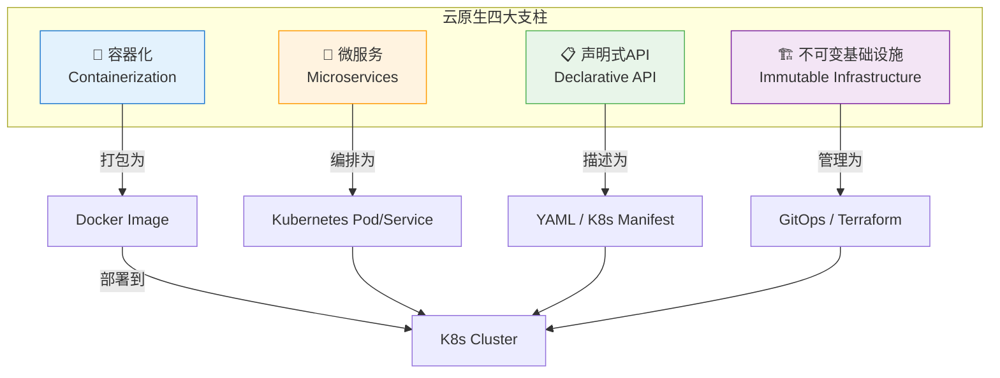
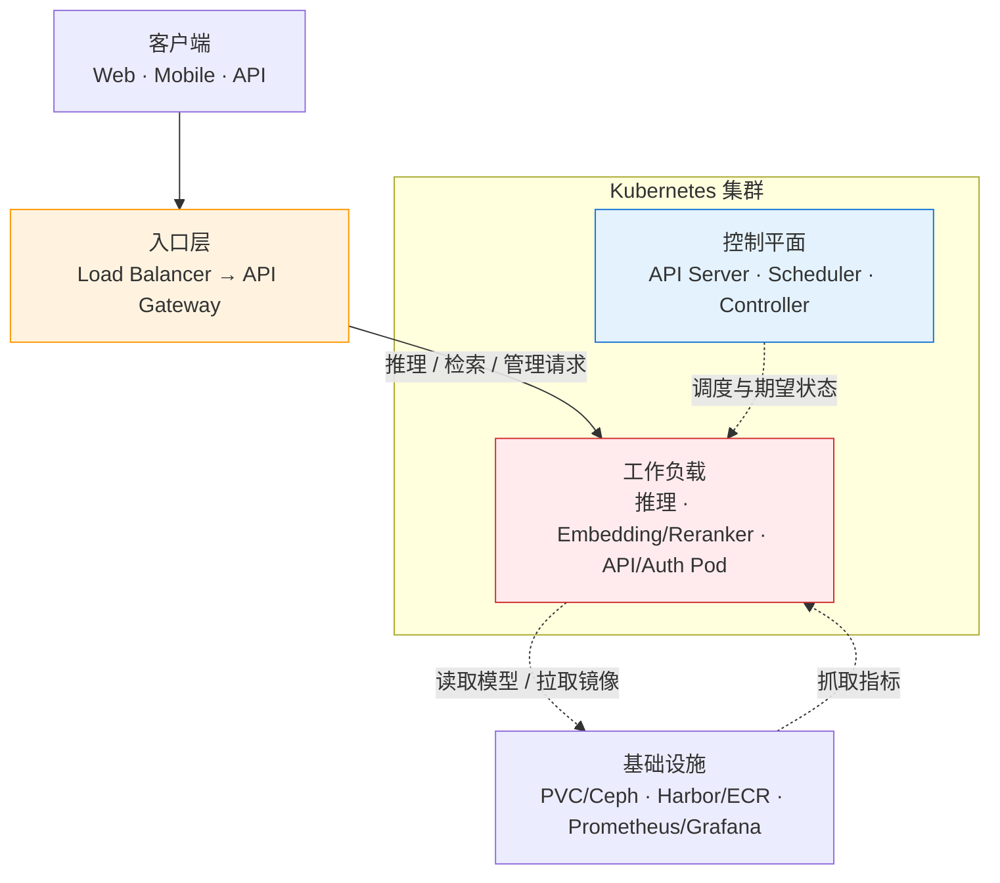
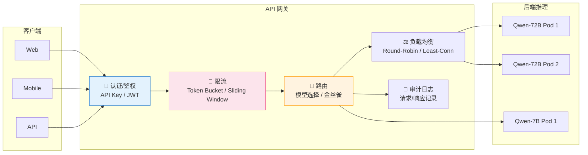
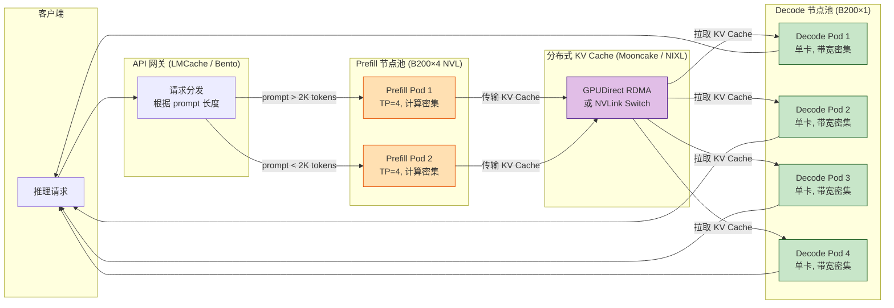
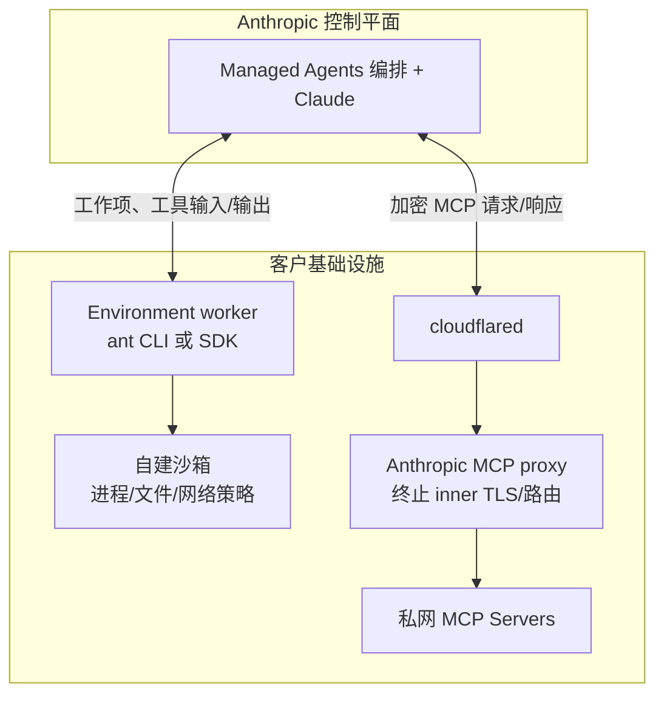
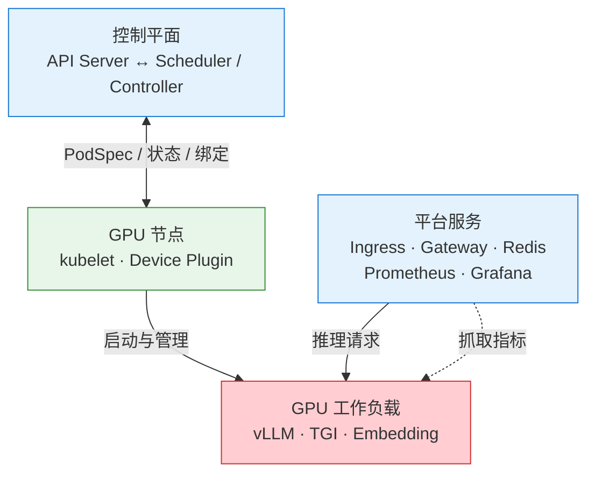
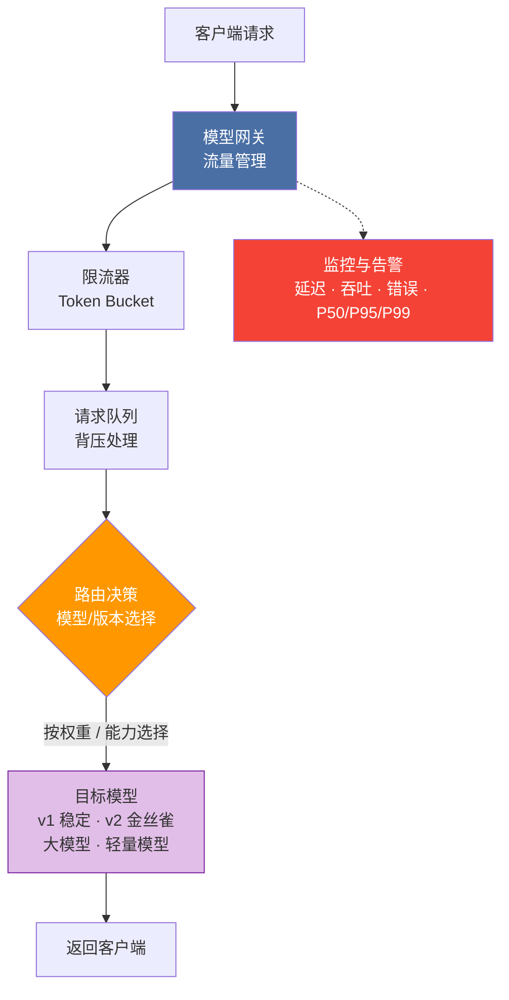

# 第24章 云原生部署与工程化 ⭐⭐

> **面试频率**：中等（大模型基础设施/平台工程岗位必考）| **技术热度**：★★★★☆
>
> "训练出好模型只是起点，稳定高效地服务模型才是终点。"云原生技术栈已经成为大模型工程化的基础设施——从 Docker 容器化到 Kubernetes 弹性编排，从 gRPC 高性能通信到 CI/CD 自动化流水线，本章系统梳理大模型应用云原生部署的完整知识图谱。无论你是 MLOps 工程师、后端开发者、还是准备面试大模型平台工程岗位，这章都是你的工程化能力底座。
>
> 🆕 **2026年更新**：新增 NVIDIA Container Toolkit v2.0、Kubernetes GPU 调度增强（DRA）、vLLM v1.0 生产级部署最佳实践、gRPC-Web 流式推理方案、GitHub Actions 模型评估门禁、多云成本优化与 Spot GPU 策略等最新内容。

---

## 📊 云原生部署技术栈速查表

| 层次 | 技术 | 核心职责 | 大模型特有关注点 | 学习曲线 |
|------|------|---------|----------------|---------|
| **容器化** | Docker / Podman | 模型服务打包 | GPU 驱动映射、CUDA 版本、大镜像优化 | ⭐⭐ 中等 |
| **编排** | Kubernetes (K8s) | 弹性扩缩容 | GPU 节点管理、HPA 自定义指标、大模型预热 | ⭐⭐⭐ 较陡 |
| **通信** | gRPC / REST | 模型服务协议 | 流式推理、Protobuf 二进制序列化、高吞吐 | ⭐⭐ 中等 |
| **网关** | Envoy / Nginx / Kong | 流量管理 | 模型路由、金丝雀发布、Token 计量鉴权 | ⭐⭐ 中等 |
| **CI/CD** | GitHub Actions / ArgoCD | 自动化交付 | 模型评估门禁、Prompt 版本管理、A/B 测试 | ⭐⭐ 中等 |
| **观测** | Prometheus + Grafana | 可观测性 | GPU 利用率、Token 消耗、TTFT/TPOT 延迟 | ⭐⭐ 中等 |

---

## 24.1 云原生概述 ⭐⭐

### 24.1.1 云原生的核心概念

云原生（Cloud Native）不仅是一套技术栈，更是一种构建和运行应用的方法论。CNCF（Cloud Native Computing Foundation）给出了权威定义：**云原生技术有利于各组织在公有云、私有云和混合云等新型动态环境中，构建和运行可弹性扩展的应用**。



**四大支柱详解：**

| 概念 | 核心思想 | 大模型场景举例 |
|------|---------|-------------|
| **容器化** | 将应用及其依赖（包括 CUDA、Python 库）打包为轻量级、可移植的镜像 | 将 vLLM + LLaMA 3.1 打包为 Docker 镜像，确保开发/测试/生产环境一致 |
| **微服务** | 将大型应用拆分为独立部署的小服务，每个服务专注单一职责 | Embedding 服务、LLM 推理服务、Reranker 服务独立部署、独立扩缩容 |
| **声明式API** | 用户描述"期望状态"，控制器自动调和至目标状态 | 声明"我需要 3 个 GPU Pod"，K8s 自动调度、监控、自愈 |
| **不可变基础设施** | 服务器/容器一旦部署就不修改，变更通过替换而非修补 | 模型更新通过滚动更新替换整个 Pod，而非进入容器修改模型文件 |

### 24.1.2 大模型应用云原生部署的特殊挑战

大模型应用将云原生部署推向了性能与资源管理的极限：

| 挑战 | 传统Web应用 | 大模型应用 | 应对策略 |
|------|-----------|----------|---------|
| **镜像大小** | 100-500 MB | 5-50 GB（含模型权重+GPU驱动） | 模型外挂、多阶段构建、分层缓存 |
| **启动时间** | 秒级 | 分钟级（模型加载到GPU显存） | Pod 预热池、Lazy Loading、模型缓存 |
| **资源调度** | CPU/内存 | GPU（稀缺资源）+ 显存（HBM带宽） | GPU 亲和性调度、MIG 分区、分时复用 |
| **扩缩容延迟** | 秒级 | 分钟级（冷启动加载模型） | 预留缓冲 Pod、模型预热镜像、HPA 提前量 |
| **网络吞吐** | 数百 QPS / Pod | 数万 Token/s / GPU（带宽密集型） | gRPC 长连接、连接池、异步流式 |
| **成本模型** | CPU 核数 × 时间 | GPU 型号/数量 × 时间，并计入存储、网络和托管费 | 按目标区域实时报价建模、Spot 实例、自动缩容、模型量化 |

### 24.1.3 大模型部署架构全景图

下面展示一个云原生推理服务参考架构。它用于讨论组件关系，不代表生产必需项，也不替代安全、
容量、成本、数据治理、容灾与运维验收：



---

## 24.2 Docker 容器化模型服务 ⭐⭐⭐

### 24.2.1 Docker 核心概念速览

| 概念 | 类比 | 命令示例 |
|------|------|---------|
| **Image（镜像）** | 类（Class）—— 只读模板 | `docker build -t llm-server:v1 .` |
| **Container（容器）** | 实例（Instance）—— 镜像的运行态 | `docker run --gpus all llm-server:v1` |
| **Registry（仓库）** | Maven Central / PyPI —— 镜像的存储分发中心 | `docker push harbor.company.com/llm-server:v1` |
| **Dockerfile** | Makefile / CMakeLists.txt —— 镜像构建脚本 | 见下方详例 |
| **Volume** | 外挂硬盘 —— 持久化存储（如模型文件） | `docker run -v /data/models:/models ...` |
| **Network** | 虚拟局域网 —— 容器间通信 | `docker network create llm-net` |

### 24.2.2 大模型服务 Dockerfile 最佳实践

大模型服务的 Dockerfile 面临几个特殊问题：(1) 模型权重文件动辄数十 GB；(2) GPU 驱动和 CUDA 运行时版本必须精确匹配；(3) 构建时间和镜像体积极度敏感。

**最佳实践清单：**

1. **使用 NVIDIA 官方 CUDA 基础镜像**，而非从 Ubuntu 裸机装驱动
2. **多阶段构建**：构建阶段安装依赖，运行阶段只复制必要产物
3. **模型权重外挂**：模型文件通过 Volume 挂载，不打入镜像
4. **`.dockerignore` 排除大文件**：避免将模型权重、测试数据、日志打入构建上下文
5. **分层缓存优化**：依赖安装（变化频率低）放在 COPY 之前
6. **非 root 用户运行**：安全合规
7. **HEALTHCHECK 健康检查**：配合 K8s Readiness Probe

### 24.2.3 多阶段构建优化镜像大小

```dockerfile
# ====== 阶段1：构建阶段 ======
FROM nvidia/cuda:12.4.0-runtime-ubuntu22.04 AS builder

# 设置国内/内网镜像源加速
RUN sed -i 's/archive.ubuntu.com/mirrors.aliyun.com/g' /etc/apt/sources.list && \
    apt-get update && apt-get install -y --no-install-recommends \
    python3.11 python3.11-venv python3.11-dev curl && \
    rm -rf /var/lib/apt/lists/*

# 安装 pip
RUN curl -sS https://bootstrap.pypa.io/get-pip.py | python3.11

# 复制依赖清单（先于代码，利用 Docker 缓存层）
WORKDIR /app
COPY requirements.txt .

# 安装依赖到虚拟环境
RUN python3.11 -m venv /opt/venv && \
    . /opt/venv/bin/activate && \
    pip install --no-cache-dir -r requirements.txt

# ====== 阶段2：运行阶段 ======
FROM nvidia/cuda:12.4.0-runtime-ubuntu22.04 AS runtime

# 安装运行时依赖（仅 Python 运行时，不装编译工具）
RUN apt-get update && apt-get install -y --no-install-recommends \
    python3.11 python3.11-venv && \
    rm -rf /var/lib/apt/lists/*

# 创建非 root 用户
RUN groupadd -r llm && useradd -r -g llm -d /app llm

# 从构建阶段复制虚拟环境
COPY --from=builder /opt/venv /opt/venv

# 复制应用代码
WORKDIR /app
COPY --chown=llm:llm src/ ./src/
COPY --chown=llm:llm config.yaml .

# 模型目录作为挂载点（不复制模型权重）
RUN mkdir -p /models && chown llm:llm /models

# 设置环境变量
ENV PATH="/opt/venv/bin:$PATH"
ENV PYTHONUNBUFFERED=1
ENV MODEL_PATH=/models/Qwen2.5-72B-Instruct-AWQ

# 健康检查（vLLM 暴露健康检查端点）
HEALTHCHECK --interval=30s --timeout=10s --start-period=120s --retries=3 \
    CMD curl -f http://localhost:8000/health || exit 1

USER llm
EXPOSE 8000

ENTRYPOINT ["python3.11", "-m", "vllm.entrypoints.openai.api_server"]
CMD ["--model", "/models/Qwen2.5-72B-Instruct-AWQ", \
     "--tensor-parallel-size", "4", \
     "--max-model-len", "32768", \
     "--gpu-memory-utilization", "0.95", \
     "--host", "0.0.0.0", \
     "--port", "8000"]
```

**镜像体积对比：**

| 构建方式 | 镜像大小 | 构建时间 | 安全性 |
|---------|---------|---------|-------|
| 单阶段构建（含编译工具） | 15.2 GB | 12 min | 低（含 gcc/cmake） |
| 单阶段构建（仅运行时） | 8.1 GB | 8 min | 中 |
| **多阶段构建** | **5.3 GB** | 10 min | 高 |
| 多阶段 + Squash | 4.1 GB | 14 min | 最高 |

### 24.2.4 GPU 容器配置（NVIDIA Container Toolkit）

大模型推理离不开 GPU。NVIDIA Container Toolkit 允许容器访问宿主机的 GPU 设备。

**安装 NVIDIA Container Toolkit（Ubuntu）：**

```bash
# 1. 添加 NVIDIA 仓库
curl -fsSL https://nvidia.github.io/libnvidia-container/gpgkey | \
    sudo gpg --dearmor -o /usr/share/keyrings/nvidia-container-toolkit-keyring.gpg

curl -s -L https://nvidia.github.io/libnvidia-container/stable/deb/nvidia-container-toolkit.list | \
    sed 's#deb https://#deb [signed-by=/usr/share/keyrings/nvidia-container-toolkit-keyring.gpg] https://#g' | \
    sudo tee /etc/apt/sources.list.d/nvidia-container-toolkit.list

# 2. 安装
sudo apt-get update
sudo apt-get install -y nvidia-container-toolkit

# 3. 配置 Docker Runtime
sudo nvidia-ctk runtime configure --runtime=docker
sudo systemctl restart docker

# 4. 验证
docker run --rm --gpus all nvidia/cuda:12.4.0-base-ubuntu22.04 nvidia-smi
```

**GPU 分配策略对比：**

| 策略 | 命令 | 适用场景 |
|------|------|---------|
| 全部 GPU | `--gpus all` | 单模型独占用满整机 |
| 指定 GPU 数量 | `--gpus 2` | 指定使用前 2 块 |
| 指定 GPU 索引 | `--gpus '"device=0,2"'` | 使用指定 GPU（如 GPU 0 和 2） |
| MIG 分区 | `--gpus '"device=0:1g.10gb"'` | A100/H100 MIG 模式，细粒度隔离 |
| 共享显存（实验性） | 需 Time-slicing 配置 | 开发测试环境 |

### 24.2.5 代码示例：FastAPI + vLLM 模型服务容器化

下面展示一个完整的生产级 FastAPI + vLLM 模型服务 Python 代码：

```python
"""
大模型推理服务 —— FastAPI + vLLM 后端
支持 OpenAI 兼容 API、流式输出、并发控制
"""

import os
import time
import asyncio
from contextlib import asynccontextmanager
from typing import Optional, AsyncGenerator

import uvicorn
from fastapi import FastAPI, HTTPException, Request
from fastapi.responses import StreamingResponse, JSONResponse
from fastapi.middleware.cors import CORSMiddleware
from pydantic import BaseModel, Field
import logging

# 配置结构化日志
logging.basicConfig(
    level=logging.INFO,
    format="%(asctime)s [%(levelname)s] %(name)s: %(message)s"
)
logger = logging.getLogger("llm-server")

# ====== 配置 ======
class ServerConfig:
    MODEL_PATH: str = os.getenv("MODEL_PATH", "/models/Qwen2.5-72B-Instruct-AWQ")
    TENSOR_PARALLEL_SIZE: int = int(os.getenv("TENSOR_PARALLEL_SIZE", "4"))
    MAX_MODEL_LEN: int = int(os.getenv("MAX_MODEL_LEN", "32768"))
    GPU_MEMORY_UTILIZATION: float = float(os.getenv("GPU_MEMORY_UTILIZATION", "0.95"))
    MAX_CONCURRENT_REQUESTS: int = int(os.getenv("MAX_CONCURRENT_REQUESTS", "64"))
    PORT: int = int(os.getenv("PORT", "8000"))

config = ServerConfig()

# ====== 请求/响应模型 ======
class ChatMessage(BaseModel):
    role: str
    content: str

class ChatCompletionRequest(BaseModel):
    model: str = "qwen2.5-72b"
    messages: list[ChatMessage]
    temperature: float = Field(default=0.7, ge=0.0, le=2.0)
    max_tokens: int = Field(default=2048, ge=1, le=32768)
    top_p: float = Field(default=1.0, ge=0.0, le=1.0)
    stream: bool = False

# ====== 信号量控制并发 ======
semaphore = asyncio.Semaphore(config.MAX_CONCURRENT_REQUESTS)

# ====== 应用生命周期 ======
@asynccontextmanager
async def lifespan(app: FastAPI):
    """应用启动/关闭的生命周期管理"""
    logger.info(f"Loading model from {config.MODEL_PATH}...")
    t0 = time.time()

    # 动态导入 vLLM（延迟加载，避免 import 时就需要 GPU）
    from vllm.engine.async_llm_engine import AsyncLLMEngine
    from vllm.engine.arg_utils import AsyncEngineArgs

    engine_args = AsyncEngineArgs(
        model=config.MODEL_PATH,
        tensor_parallel_size=config.TENSOR_PARALLEL_SIZE,
        max_model_len=config.MAX_MODEL_LEN,
        gpu_memory_utilization=config.GPU_MEMORY_UTILIZATION,
        enable_prefix_caching=True,          # 🆕 2026: 自动 Prefix Cache
        enable_chunked_prefill=True,         # 分块预填充，优化 TTFT
        max_num_batched_tokens=8192,         # 批量 Token 上限
    )
    app.state.engine = AsyncLLMEngine.from_engine_args(engine_args)

    logger.info(f"Model loaded in {time.time() - t0:.1f}s. Ready to serve.")
    yield
    # 清理资源
    if hasattr(app.state, "engine"):
        del app.state.engine
    logger.info("Server shutting down.")

# ====== FastAPI 应用 ======
app = FastAPI(title="LLM Inference Server", version="1.0.0", lifespan=lifespan)

app.add_middleware(
    CORSMiddleware,
    allow_origins=["*"],
    allow_methods=["*"],
    allow_headers=["*"],
)

# ====== 端点 ======
@app.get("/health")
async def health():
    """K8s Readiness / Liveness Probe 端点"""
    return {"status": "healthy", "model_loaded": hasattr(app.state, "engine")}

@app.post("/v1/chat/completions")
async def chat_completions(request: ChatCompletionRequest, raw_request: Request):
    """OpenAI 兼容的 Chat Completions 端点"""
    if request.stream:
        return StreamingResponse(
            _stream_generate(request),
            media_type="text/event-stream",
        )

    async with semaphore:
        try:
            result = await _generate_completion(request)
            return JSONResponse(content=result)
        except Exception as e:
            logger.error(f"Generation error: {e}")
            raise HTTPException(status_code=500, detail=str(e))

# ====== 推理核心 ======
async def _generate_completion(request: ChatCompletionRequest) -> dict:
    """同步（一次性）生成"""
    from vllm.sampling_params import SamplingParams
    from vllm.utils import random_uuid

    prompt = _build_prompt(request.messages)
    sampling_params = SamplingParams(
        temperature=request.temperature,
        max_tokens=request.max_tokens,
        top_p=request.top_p,
    )

    request_id = random_uuid()
    final_output = None
    async for result in app.state.engine.generate(prompt, sampling_params, request_id):
        final_output = result

    if final_output is None:
        raise HTTPException(status_code=500, detail="Generation failed")

    completion_text = final_output.outputs[0].text
    return {
        "id": request_id,
        "object": "chat.completion",
        "model": request.model,
        "choices": [{
            "index": 0,
            "message": {"role": "assistant", "content": completion_text},
            "finish_reason": "stop",
        }],
        "usage": {
            "prompt_tokens": len(final_output.prompt_token_ids),
            "completion_tokens": len(final_output.outputs[0].token_ids),
            "total_tokens": len(final_output.prompt_token_ids) + len(final_output.outputs[0].token_ids),
        },
    }

async def _stream_generate(request: ChatCompletionRequest) -> AsyncGenerator[str, None]:
    """流式 SSE（Server-Sent Events）生成"""
    from vllm.sampling_params import SamplingParams
    from vllm.utils import random_uuid
    import json

    async with semaphore:
        try:
            prompt = _build_prompt(request.messages)
            sampling_params = SamplingParams(
                temperature=request.temperature,
                max_tokens=request.max_tokens,
                top_p=request.top_p,
            )

            request_id = random_uuid()
            async for result in app.state.engine.generate(
                prompt, sampling_params, request_id
            ):
                text = result.outputs[0].text
                chunk = {
                    "id": request_id,
                    "object": "chat.completion.chunk",
                    "model": request.model,
                    "choices": [{
                        "index": 0,
                        "delta": {"content": text},
                        "finish_reason": None,
                    }],
                }
                yield f"data: {json.dumps(chunk)}\n\n"

            yield "data: [DONE]\n\n"
        except Exception as e:
            logger.error(f"Streaming error: {e}")
            yield f"data: {json.dumps({'error': str(e)})}\n\n"

def _build_prompt(messages: list[ChatMessage]) -> str:
    """将消息列表构建为模型 Prompt"""
    return "".join(
        f"<|im_start|>{msg.role}\n{msg.content}<|im_end|>\n"
        for msg in messages
    ) + "<|im_start|>assistant\n"

# ====== 入口 ======
if __name__ == "__main__":
    uvicorn.run(
        "server:app",
        host="0.0.0.0",
        port=config.PORT,
        workers=1,               # vLLM 内部已多进程，uvicorn 用 1 个 worker
        log_level="info",
        limit_concurrency=config.MAX_CONCURRENT_REQUESTS,
    )
```

**对应的 `requirements.txt`：**

```
vllm>=0.8.0,<1.0.0     # 推理引擎
fastapi>=0.115.0        # Web 框架
uvicorn[standard]>=0.32.0  # ASGI 服务器
pydantic>=2.0           # 数据校验
torch>=2.5.0            # PyTorch（需与 CUDA 12.4 匹配）
transformers>=4.46.0    # HuggingFace Transformers
```

---

## 24.3 Kubernetes 编排与弹性扩缩 ⭐⭐⭐

### 24.3.1 K8s 核心概念

| 概念 | 一句话解释 | 理解关键词 |
|------|----------|----------|
| **Pod** | K8s 最小调度单元，包含一个或多个容器 | 共享网络/存储命名空间 |
| **Service** | Pod 的稳定网络入口（IP + DNS） | 负载均衡、服务发现 |
| **Deployment** | 管理 Pod 的声明式副本集 | 滚动更新、回滚、副本数 |
| **ConfigMap/Secret** | 配置与敏感信息管理 | 环境注入、热更新 |
| **Ingress** | 外部流量的七层路由规则 | 域名路由、TLS 终止 |
| **StatefulSet** | 有状态应用（如模型缓存服务） | 固定 Pod 名、持久存储 |
| **HPA** | 基于指标自动扩缩 Pod 副本数 | CPU/内存/自定义指标驱动 |
| **NodeSelector / Affinity** | 控制 Pod 调度到特定节点 | GPU 节点亲和性 |

### 24.3.2 GPU 节点管理与调度

在 K8s 集群中管理 GPU 节点，需要解决两个核心问题：(1) 如何识别 GPU 资源；(2) 如何将 GPU 工作负载调度到正确的节点。

**GPU 节点标签与污染（Taint）：**

```bash
# 1. 给 GPU 节点打标签
kubectl label node gpu-node-01 accelerator=nvidia
kubectl label node gpu-node-01 nvidia.com/gpu.product=A100-SXM4-80GB

# 2. GPU 节点加 Taint（防止非 GPU 工作负载调度上来）
kubectl taint node gpu-node-01 nvidia.com/gpu=true:NoSchedule
```

**🚀 GPU Operator 自动化管理（推荐方式）：**

```bash
# 安装 NVIDIA GPU Operator（Helm）
helm repo add nvidia https://helm.ngc.nvidia.com/nvidia
helm install gpu-operator nvidia/gpu-operator \
  --namespace gpu-operator --create-namespace \
  --set driver.enabled=true \
  --set toolkit.enabled=true

# 验证 GPU 资源已注册
kubectl describe node gpu-node-01 | grep nvidia.com/gpu
```

**Pod 请求 GPU 资源：**

```yaml
# 在 Pod spec 中声明 GPU 需求
resources:
  limits:
    nvidia.com/gpu: 4   # 请求 4 块 GPU（整数）
  requests:
    nvidia.com/gpu: 4
```

### 24.3.3 HPA（Horizontal Pod Autoscaler）配置

大模型推理服务的 HPA 需要使用自定义指标（如 GPU 利用率、推理队列深度），而非简单的 CPU 指标。

**安装 Prometheus Adapter 以暴露自定义指标：**

```bash
helm repo add prometheus-community https://prometheus-community.github.io/helm-charts
helm install prometheus-adapter prometheus-community/prometheus-adapter \
  --namespace monitoring
```

**HPA 配置（基于 GPU 利用率和请求队列深度）：**

> 下列副本数、利用率和队列阈值仅用于展示字段；生产值应由目标 GPU、模型、batch 策略、
> 冷启动时间和负载测试确定，并用端到端延迟/错误率作为护栏。

```yaml
apiVersion: autoscaling/v2
kind: HorizontalPodAutoscaler
metadata:
  name: llm-inference-hpa
spec:
  scaleTargetRef:
    apiVersion: apps/v1
    kind: Deployment
    name: llm-inference-server
  minReplicas: 2      # 最少维持 2 个 Pod（避免冷启动）
  maxReplicas: 10     # 最多扩展到 10 个 Pod
  metrics:
    # 指标1：GPU 利用率（超过 80% 扩容）
    - type: Pods
      pods:
        metric:
          name: DCGM_FI_DEV_GPU_UTIL
        target:
          type: AverageValue
          averageValue: "80"
    # 指标2：推理请求队列深度
    - type: Pods
      pods:
        metric:
          name: llm_inference_queue_depth
        target:
          type: AverageValue
          averageValue: "10"
  behavior:
    scaleUp:
      stabilizationWindowSeconds: 60    # 扩容前观察 60s
      policies:
        - type: Pods
          value: 2                       # 每次最多新增 2 个 Pod
          periodSeconds: 60
    scaleDown:
      stabilizationWindowSeconds: 300   # 缩容前观察 5min（避免频繁扩缩）
      policies:
        - type: Pods
          value: 1                       # 每次最多缩 1 个 Pod
          periodSeconds: 60
```

### 24.3.4 模型服务的 K8s 部署 YAML 实战

```yaml
# ====== 1. Namespace ======
apiVersion: v1
kind: Namespace
metadata:
  name: llm-inference

---
# ====== 2. ConfigMap（非敏感配置） ======
apiVersion: v1
kind: ConfigMap
metadata:
  name: llm-server-config
  namespace: llm-inference
data:
  MODEL_PATH: "/models/Qwen2.5-72B-Instruct-AWQ"
  TENSOR_PARALLEL_SIZE: "4"
  MAX_MODEL_LEN: "32768"
  GPU_MEMORY_UTILIZATION: "0.95"
  MAX_CONCURRENT_REQUESTS: "64"

---
# ====== 3. Secret（敏感信息） ======
apiVersion: v1
kind: Secret
metadata:
  name: llm-server-secret
  namespace: llm-inference
type: Opaque
stringData:
  HF_TOKEN: "hf_your_huggingface_token_here"
  API_KEY: "sk-your-api-key"

---
# ====== 4. PersistentVolumeClaim（模型存储） ======
apiVersion: v1
kind: PersistentVolumeClaim
metadata:
  name: model-storage-pvc
  namespace: llm-inference
spec:
  accessModes:
    - ReadOnlyMany      # 多个 Pod 只读挂载
  storageClassName: ceph-filesystem  # 或 nfs / efs
  resources:
    requests:
      storage: 500Gi    # 模型文件需要大容量

---
# ====== 5. Deployment ======
apiVersion: apps/v1
kind: Deployment
metadata:
  name: llm-inference-server
  namespace: llm-inference
  labels:
    app: llm-inference
    model: qwen2.5-72b
spec:
  replicas: 2           # 初始 2 个副本
  strategy:
    type: RollingUpdate
    rollingUpdate:
      maxSurge: 1       # 滚动更新时最多多出 1 个
      maxUnavailable: 0  # 滚动更新期间不可中断（零停机）
  selector:
    matchLabels:
      app: llm-inference
  template:
    metadata:
      labels:
        app: llm-inference
        model: qwen2.5-72b
      annotations:
        prometheus.io/scrape: "true"
        prometheus.io/port: "8000"
    spec:
      # ====== GPU 节点调度 ======
      nodeSelector:
        accelerator: nvidia
        nvidia.com/gpu.product: A100-SXM4-80GB   # 精确匹配 GPU 型号
      tolerations:
        - key: nvidia.com/gpu
          operator: Exists
          effect: NoSchedule

      # ====== 容器配置 ======
      containers:
      - name: inference-server
        image: harbor.company.com/llm-server:v2.1.0
        imagePullPolicy: IfNotPresent
        ports:
        - containerPort: 8000
          name: http
        - containerPort: 9090
          name: metrics       # Prometheus 指标端口

        # ====== 环境变量 ======
        envFrom:
        - configMapRef:
            name: llm-server-config
        - secretRef:
            name: llm-server-secret

        # ====== 资源请求与限制 ======
        resources:
          requests:
            nvidia.com/gpu: 4       # 请求 4 块 GPU
            memory: "400Gi"         # CPU 内存
            cpu: "32"
          limits:
            nvidia.com/gpu: 4       # GPU 硬限制
            memory: "512Gi"
            cpu: "48"

        # ====== 卷挂载 ======
        volumeMounts:
        - name: model-storage
          mountPath: /models
          readOnly: true
        - name: dshm
          mountPath: /dev/shm       # vLLM 需要大共享内存

        # ====== 探针 ======
        livenessProbe:
          httpGet:
            path: /health
            port: 8000
          initialDelaySeconds: 300  # 模型加载需要时间
          periodSeconds: 30
          timeoutSeconds: 10
          failureThreshold: 5

        readinessProbe:
          httpGet:
            path: /health
            port: 8000
          initialDelaySeconds: 180
          periodSeconds: 10
          timeoutSeconds: 5
          failureThreshold: 3

        # ====== 启动探针（给模型加载足够时间） ======
        startupProbe:
          httpGet:
            path: /health
            port: 8000
          initialDelaySeconds: 30
          periodSeconds: 10
          failureThreshold: 60     # 最多等 30+10*60=630 秒
          timeoutSeconds: 5

      # ====== 卷定义 ======
      volumes:
      - name: model-storage
        persistentVolumeClaim:
          claimName: model-storage-pvc
      - name: dshm
        emptyDir:
          medium: Memory
          sizeLimit: 16Gi

---
# ====== 6. Service ======
apiVersion: v1
kind: Service
metadata:
  name: llm-inference-svc
  namespace: llm-inference
spec:
  selector:
    app: llm-inference
  ports:
  - name: http
    protocol: TCP
    port: 80
    targetPort: 8000
  type: ClusterIP
  sessionAffinity: ClientIP   # ⚠️ 可选：同客户端路由到同一 Pod

---
# ====== 7. HPA ======
apiVersion: autoscaling/v2
kind: HorizontalPodAutoscaler
metadata:
  name: llm-inference-hpa
  namespace: llm-inference
spec:
  scaleTargetRef:
    apiVersion: apps/v1
    kind: Deployment
    name: llm-inference-server
  minReplicas: 2
  maxReplicas: 10
  metrics:
    - type: Resource
      resource:
        name: cpu
        target:
          type: Utilization
          averageUtilization: 70
```

### 24.3.5 滚动更新与零停机部署

K8s 的 Deployment 原生支持滚动更新，但大模型服务的特殊性在于 **Pod 启动时间长（分钟级）** 和 **GPU 资源稀缺（不能随便多启动一个 Pod 预热）**。

**滚动更新策略对比：**

| 策略 | 配置 | 优点 | 缺点 | 适用 |
|------|------|------|------|------|
| **滚动更新** | `maxSurge:1, maxUnavailable:0` | 零停机，逐步替换 | 需要 1 个额外 GPU 配额 | 生产环境 |
| **蓝绿部署** | 先起一套新 Deployment，再切流量 | 瞬间回滚 | GPU 资源翻倍 | 大变更 |
| **灰度（金丝雀）** | 新 Pod 只接收 5% 流量，逐步加大 | 风险可控 | 需要网关配合 | 模型版本升级 |

**零停机部署的检查清单：**

```bash
# 1. 更新镜像前先预热（可选策略：提前触发模型下载）
kubectl set image deployment/llm-inference-server \
  inference-server=harbor.company.com/llm-server:v2.2.0 \
  -n llm-inference

# 2. 监控滚动更新状态
kubectl rollout status deployment/llm-inference-server -n llm-inference

# 3. 如果发现问题，立即回滚
kubectl rollout undo deployment/llm-inference-server -n llm-inference

# 4. 查看回滚历史
kubectl rollout history deployment/llm-inference-server -n llm-inference
```

---

## 24.4 gRPC vs REST for Model Serving ⭐⭐⭐

### 24.4.1 gRPC vs REST 协议对比

大模型推理对通信协议有独特需求：高吞吐、低延迟、流式输出、二进制安全。gRPC 和 REST 各有优劣。

| 维度 | REST (HTTP/JSON) | gRPC (HTTP/2 + Protobuf) |
|------|------------------|-------------------------|
| **序列化格式** | JSON（文本） | Protobuf（二进制） |
| **传输协议** | HTTP/1.1 或 HTTP/2 | HTTP/2（强制，多路复用） |
| **流式支持** | SSE（Server-Sent Events，单工） | Native Streaming（双工/单向流） |
| **序列化开销** | 受 JSON 库、字段和 payload 影响 | 常更紧凑；收益必须用真实消息基准测试 |
| **数据体积** | 文本与字段名会增加开销 | 二进制编码通常更小；比例依 schema/数据分布 |
| **类型安全** | 弱（运行时 Schema 校验） | 强（编译时 `.proto` 生成代码） |
| **浏览器支持** | 原生 | 需 gRPC-Web 代理 |
| **生态/调试** | curl / Postman / 浏览器直接调试 | grpcurl / BloomRPC / grpcui |
| **适用场景** | 对外 API、Web 前端、简单交互 | 微服务间通信、高吞吐、流式推理 |

### 24.4.2 Protobuf 定义模型服务接口

```protobuf
syntax = "proto3";

package llm.inference.v1;

// 模型推理服务
service LLMInference {
    // 单次生成（Unary）
    rpc Generate(GenerateRequest) returns (GenerateResponse);

    // 流式生成（Server Streaming）
    rpc GenerateStream(GenerateRequest) returns (stream GenerateStreamResponse);

    // 双向流（多轮对话 + 实时控制）
    rpc ChatStream(stream ChatMessage) returns (stream ChatStreamResponse);

    // 获取模型信息
    rpc GetModelInfo(ModelInfoRequest) returns (ModelInfoResponse);

    // 🆕 2026: Batch推理（客户端流式上传多条请求）
    rpc BatchGenerate(stream GenerateRequest) returns (BatchGenerateResponse);
}

// ====== 消息定义 ======

message GenerateRequest {
    string model_id = 1;          // 模型标识
    repeated ChatMessage messages = 2;  // 对话历史
    SamplingParams sampling_params = 3; // 采样参数
    string request_id = 4;        // 请求追踪 ID
    map<string, string> metadata = 5; // 扩展元数据
}

message ChatMessage {
    string role = 1;              // "system" | "user" | "assistant"
    string content = 2;           // 消息内容
    repeated ToolCall tool_calls = 3; // 工具调用（可选）
}

message ToolCall {
    string id = 1;
    string name = 2;
    string arguments = 3;         // JSON 序列化的参数
}

message SamplingParams {
    float temperature = 1;
    int32 max_tokens = 2;
    float top_p = 3;
    int32 top_k = 4;
    repeated string stop_sequences = 5;
    float frequency_penalty = 6;
    float presence_penalty = 7;
}

message GenerateResponse {
    string request_id = 1;
    repeated Completion completion = 2;
    TokenUsage usage = 3;
    bool is_truncated = 4;
}

message Completion {
    int32 index = 1;
    string text = 2;
    string finish_reason = 3;     // "stop" | "length" | "tool_calls"
    repeated float logprobs = 4;
}

message TokenUsage {
    int32 prompt_tokens = 1;
    int32 completion_tokens = 2;
    int32 total_tokens = 3;
    float cost_usd = 4;           // 🆕 2026: 实时成本估算
}

// ====== 流式消息 ======

message GenerateStreamResponse {
    string request_id = 1;
    oneof content {
        TokenDelta token = 2;     // 增量 Token
        ErrorInfo error = 3;      // 错误信息
        Metrics metrics = 4;      // 🆕 流式指标（TTFT, TPOT 等）
    }
}

message TokenDelta {
    int32 index = 1;
    string delta_text = 2;
    bool is_final = 3;
    string finish_reason = 4;
}

message ErrorInfo {
    int32 code = 1;
    string message = 2;
    bool is_retryable = 3;
}

message Metrics {
    double ttft_ms = 1;           // Time To First Token
    double tpot_ms = 2;           // Time Per Output Token (平均)
    double throughput_tps = 3;     // Token Per Second
}

// ====== 模型信息 ======

message ModelInfoRequest {}

message ModelInfoResponse {
    string model_id = 1;
    string model_family = 2;
    int64 parameter_count = 3;
    int32 max_context_length = 4;
    repeated string supported_languages = 5;
    string quantization = 6;      // e.g. "AWQ", "GPTQ", "FP16"
}
```

### 24.4.3 gRPC 服务端实现

```python
"""
gRPC 大模型推理服务端 —— 使用 vLLM AsyncEngine
"""

import asyncio
import grpc
from concurrent import futures

import llm_inference_pb2
import llm_inference_pb2_grpc
from vllm.engine.async_llm_engine import AsyncLLMEngine
from vllm.engine.arg_utils import AsyncEngineArgs
from vllm.sampling_params import SamplingParams
from vllm.utils import random_uuid


class LLMInferenceServicer(llm_inference_pb2_grpc.LLMInferenceServicer):
    def __init__(self, engine: AsyncLLMEngine):
        self.engine = engine

    async def Generate(self, request, context):
        """单次生成（Unary RPC）"""
        # 构建 SamplingParams
        sp = request.sampling_params
        sampling_params = SamplingParams(
            temperature=sp.temperature,
            max_tokens=sp.max_tokens,
            top_p=sp.top_p,
            top_k=sp.top_k,
        )

        # 构建 Prompt
        prompt = self._build_prompt(request.messages)

        # 推理
        request_id = request.request_id or random_uuid()
        final_output = None
        async for result in self.engine.generate(
            prompt, sampling_params, request_id
        ):
            final_output = result

        if final_output is None:
            context.set_code(grpc.StatusCode.INTERNAL)
            context.set_details("Generation returned no output")
            return llm_inference_pb2.GenerateResponse()

        return llm_inference_pb2.GenerateResponse(
            request_id=request_id,
            completion=[
                llm_inference_pb2.Completion(
                    index=0,
                    text=final_output.outputs[0].text,
                    finish_reason="stop",
                )
            ],
            usage=llm_inference_pb2.TokenUsage(
                prompt_tokens=len(final_output.prompt_token_ids),
                completion_tokens=len(final_output.outputs[0].token_ids),
                total_tokens=(
                    len(final_output.prompt_token_ids) +
                    len(final_output.outputs[0].token_ids)
                ),
            ),
        )

    async def GenerateStream(self, request, context):
        """流式生成（Server Streaming RPC）"""
        sp = request.sampling_params
        sampling_params = SamplingParams(
            temperature=sp.temperature,
            max_tokens=sp.max_tokens,
            top_p=sp.top_p,
        )

        prompt = self._build_prompt(request.messages)
        request_id = request.request_id or random_uuid()

        async for result in self.engine.generate(
            prompt, sampling_params, request_id
        ):
            yield llm_inference_pb2.GenerateStreamResponse(
                request_id=request_id,
                token=llm_inference_pb2.TokenDelta(
                    index=0,
                    delta_text=result.outputs[0].text,
                    is_final=False,
                ),
            )

        # 最终完成信号
        yield llm_inference_pb2.GenerateStreamResponse(
            request_id=request_id,
            token=llm_inference_pb2.TokenDelta(
                index=0,
                delta_text="",
                is_final=True,
                finish_reason="stop",
            ),
        )

    @staticmethod
    def _build_prompt(messages) -> str:
        parts = []
        for msg in messages:
            parts.append(f"<|im_start|>{msg.role}\n{msg.content}<|im_end|>\n")
        parts.append("<|im_start|>assistant\n")
        return "".join(parts)


async def serve():
    # 初始化 vLLM Engine
    engine_args = AsyncEngineArgs(
        model="/models/Qwen2.5-72B-Instruct-AWQ",
        tensor_parallel_size=4,
        max_model_len=32768,
        gpu_memory_utilization=0.95,
        enable_prefix_caching=True,
    )
    engine = AsyncLLMEngine.from_engine_args(engine_args)

    # 启动 gRPC 服务
    server = grpc.aio.server(
        futures.ThreadPoolExecutor(max_workers=10),
        options=[
            ("grpc.max_send_message_length", 100 * 1024 * 1024),  # 100MB
            ("grpc.max_receive_message_length", 100 * 1024 * 1024),
            ("grpc.keepalive_time_ms", 30000),
            ("grpc.keepalive_timeout_ms", 10000),
        ],
    )

    llm_inference_pb2_grpc.add_LLMInferenceServicer_to_server(
        LLMInferenceServicer(engine), server
    )

    server.add_insecure_port("[::]:50051")
    await server.start()
    print("gRPC LLM Inference Server started on port 50051")
    await server.wait_for_termination()


if __name__ == "__main__":
    asyncio.run(serve())
```

### 24.4.4 性能对比的正确测法（延迟/吞吐/序列化效率）

仓库没有随附下表所需的原始结果，不能把一组示意数字写成“实测”。应在同一模型 revision、
引擎、GPU、输入/输出长度、并发、连接复用、TLS 与 warmup 条件下做 A/B，并至少报告：

| 指标 | 必须固定/记录 | 解释边界 |
|------|---------------|----------|
| TTFT、端到端 P50/P95/P99 | 相同请求集、并发与超时 | 模型计算往往占主导，协议不能保证固定降幅 |
| tokens/s、req/s | 输入/输出 token 分布、batch 策略 | 分别报告单请求与系统吞吐 |
| 请求/响应字节数 | JSON/Protobuf schema 与压缩设置 | Protobuf 常更紧凑，但幅度取决于 payload |
| 编解码 CPU 时间 | 客户端/服务端语言与库版本 | 与模型延迟分开统计 |
| 连接数与复用率 | HTTP/1.1、HTTP/2、keep-alive/TLS | gRPC 的 HTTP/2 多路复用是机制，不是固定收益 |

### 24.4.5 流式推理的协议选择

| 协议方案 | 实现方式 | 延迟 | 实现复杂度 | 浏览器支持 | 推荐场景 |
|---------|---------|------|-----------|----------|---------|
| **SSE (REST)** | `text/event-stream` | 中 | 低 | 原生 `EventSource` | 简单流式 Web 应用 |
| **WebSocket** | 全双工 | 低 | 中 | 原生 | 需要客户端发送控制信号 |
| **gRPC Server Streaming** | Protobuf Stream | 最低 | 中 | 需 gRPC-Web | 微服务间流式推理 |
| **gRPC Bidirectional** | Protobuf Duplex Stream | 最低 | 高 | 需 gRPC-Web | 多轮对话 + 中断控制 |

---

## 24.5 模型网关与流量管理 ⭐⭐⭐

### 24.5.1 API 网关模式

在大模型推理架构中，API 网关是连接客户端与后端推理服务的关键中间件，承担**负载均衡、限流、认证、路由、协议转换**等职责。



**常见网关选型对比：**

| 网关 | 类型 | 优势 | 大模型场景适配度 |
|------|------|------|----------------|
| **Envoy** | Sidecar 代理 | 性能极高、L7 路由、gRPC 原生支持 | ★★★★★ 最佳 |
| **Kong** | API 网关 | 插件丰富、Admin API | ★★★★☆ |
| **APISIX** | API 网关 | 动态配置、性能高 | ★★★★☆ |
| **Nginx** | 反向代理 | 成熟稳定、生态大 | ★★★☆☆（需 Lua 扩展） |
| **Traefik** | 云原生网关 | 自动发现 K8s Service | ★★★☆☆ |

### 24.5.2 模型路由策略

生产环境中常同时运行多个模型版本，需要精细化路由：

| 策略 | 原理 | 用途 | 实现方式 |
|------|------|------|---------|
| **A/B 测试** | 50/50 分流到两个模型版本 | 评估模型效果差异 | Header/Cookie 路由 |
| **金丝雀发布** | 从小比例（如 5%，按风险设定）逐步加大 | 降低新模型上线风险 | 权重路由 |
| **流量镜像** | 复制流量同时发送到新旧版，新版结果丢弃 | 静默验证新模型 | Envoy Traffic Mirroring |
| **基于用户路由** | 按用户 ID Hash 路由到固定模型 | VIP 用户专用模型 | 一致性 Hash |
| **基于负载路由** | 选择当前负载最低的 Pod | 优化延迟 | Least Outstanding Requests |

**Envoy 金丝雀路由配置示例：**

```yaml
# Envoy 配置：按权重将流量分发到新旧模型版本
route_config:
  virtual_hosts:
  - name: llm_service
    domains: ["api.example.com"]
    routes:
    - match:
        prefix: "/v1/chat/completions"
      route:
        weighted_clusters:
          clusters:
          - name: llm-model-v2    # 🆕 新版本（接收 5%）
            weight: 5
          - name: llm-model-v1    # 稳定版本（接收 95%）
            weight: 95
      retry_policy:
        retry_on: "5xx,reset"
        num_retries: 2
        per_try_timeout: 30s
```

### 24.5.3 请求队列与背压处理

大模型推理是资源密集型操作，当请求超过 GPU 处理能力时，需要合理的背压机制：

```python
"""
模型网关中的请求队列与背压处理
"""

import asyncio
import time
from dataclasses import dataclass, field
from collections import deque
from enum import Enum


class ReqPriority(Enum):
    HIGH = 0      # 实时对话
    NORMAL = 1    # API 调用
    LOW = 2       # 批量任务


@dataclass
class InferenceRequest:
    request_id: str
    priority: ReqPriority
    payload: dict
    enqueue_time: float = field(default_factory=time.time)


class BackpressureGateway:
    """带背压控制的推理请求网关"""

    def __init__(
        self,
        max_queue_size: int = 100,
        max_concurrent: int = 32,
        timeout_seconds: float = 30.0,
    ):
        self.max_queue_size = max_queue_size
        self.max_concurrent = max_concurrent
        self.timeout = timeout_seconds
        self._semaphore = asyncio.Semaphore(max_concurrent)

        # 三级优先级队列
        self._queues = {
            ReqPriority.HIGH: deque(),
            ReqPriority.NORMAL: deque(),
            ReqPriority.LOW: deque(),
        }

        # 统计指标
        self.stats = {
            "accepted": 0,
            "rejected": 0,
            "timeout": 0,
            "completed": 0,
            "current_queue_depth": 0,
        }

    async def submit(self, request: InferenceRequest) -> dict:
        """提交推理请求（带背压）"""
        # 1. 队列满检查
        total_queued = sum(len(q) for q in self._queues.values())
        if total_queued >= self.max_queue_size:
            self.stats["rejected"] += 1
            return {"error": "queue_full", "retry_after_ms": 5000}

        # 2. 入队
        self._queues[request.priority].append(request)
        self.stats["accepted"] += 1

        # 3. 等待处理
        try:
            async with asyncio.timeout(self.timeout):
                async with self._semaphore:
                    # 从队列取出（按优先级）
                    req = self._dequeue()
                    self.stats["completed"] += 1
                    # 这里转发到实际的推理后端
                    return await self._forward_to_backend(req)
        except asyncio.TimeoutError:
            self.stats["timeout"] += 1
            return {"error": "timeout", "message": "Request timed out"}

    def _dequeue(self) -> InferenceRequest:
        """按优先级出队：高优先 > 普通 > 低优先"""
        for priority in (ReqPriority.HIGH, ReqPriority.NORMAL, ReqPriority.LOW):
            q = self._queues[priority]
            if q:
                return q.popleft()
        raise RuntimeError("Queue unexpectedly empty")

    async def _forward_to_backend(self, request: InferenceRequest) -> dict:
        """转发到推理后端（简化示例）"""
        # 实际实现中会调用 gRPC / HTTP 客户端
        await asyncio.sleep(0.5)  # 模拟推理耗时
        return {"request_id": request.request_id, "result": "generated..."}

    def get_stats(self) -> dict:
        """获取网关统计"""
        self.stats["current_queue_depth"] = sum(
            len(q) for q in self._queues.values()
        )
        return self.stats
```

### 24.5.4 多模型版本管理

```
生产环境中同时运行多个模型版本是常态。以下是一个多模型路由示例：

请求头: X-Model-Version: prod-v3
         X-Model-Version: canary-v4-beta
         X-Model-Version: embedding-v2

网关根据请求头自动路由到对应的模型后端：
  - prod-v3  → llm-qwen-72b-v3 (100% 生产流量)
  - canary    → llm-qwen-72b-v4 (5% 金丝雀流量)
  - embedding → embedding-server-v2 (独立 Embedding 服务)
```

---

## 24.6 Git 协作与 CI/CD ⭐⭐⭐

### 24.6.1 Git 工作流

大模型项目不同于传统软件开发，需要同时管理**代码、Prompt、模型配置、评估数据**等多个维度。

**Git Flow vs Trunk Based 对比：**

| 维度 | Git Flow | Trunk Based |
|------|----------|-------------|
| **分支模型** | main + develop + feature/ + hotfix/ + release/ | main + short-lived feature/ |
| **合并方式** | merge commit | squash merge / rebase merge |
| **发布节奏** | 按 Release 分支发布 | 持续发布（每天多次） |
| **复杂度** | 高 | 低 |
| **适用团队** | 传统发布周期（周/月） | 持续交付团队 |
| **大模型推荐** | 模型权重/Prompt 大版本管理 | 应用代码持续迭代 |

**大模型项目的分支管理策略（推荐）：**

```text
main (生产)
├── develop (集成)
│   ├── feature/chat-optimization     # 对话功能优化
│   ├── feature/kv-cache-improvement  # KV Cache 改进
│   └── exp/prompt-v3-tuning          # Prompt 实验
├── release/v3.2.0                    # 发布分支
│   └── hotfix/oom-fix                # 紧急修复
└── models/
    ├── qwen-72b-awq-v2               # 模型配置版本（Tag）
    └── embedding-v3                  # Embedding 模型版本
```

### 24.6.2 GitHub Actions CI/CD Pipeline

以下是一个完整的大模型推理服务的 CI/CD Pipeline，包含代码检查、Docker 构建、模型评估门禁、K8s 部署。

```yaml
# .github/workflows/llm-cicd.yml
name: LLM Service CI/CD Pipeline

on:
  push:
    branches: [main, develop]
  pull_request:
    branches: [main]
  workflow_dispatch:      # 允许手动触发
    inputs:
      deploy_env:
        description: 'Deployment environment'
        required: true
        type: choice
        options: [staging, production]

env:
  REGISTRY: harbor.company.com
  IMAGE_NAME: llm-inference-server
  K8S_NAMESPACE: llm-inference

jobs:
  # ========== 1. 代码质量检查 ==========
  lint-and-test:
    runs-on: ubuntu-latest
    steps:
      - uses: actions/checkout@v4

      - name: Setup Python
        uses: actions/setup-python@v5
        with:
          python-version: '3.11'

      - name: Install dependencies
        run: |
          pip install ruff mypy pytest pytest-asyncio

      - name: Lint (Ruff)
        run: ruff check src/ tests/

      - name: Type Check (Mypy)
        run: mypy src/ --ignore-missing-imports

      - name: Unit Tests
        run: pytest tests/ -v --cov=src --cov-report=xml

  # ========== 2. 模型评估门禁（仅 PR） ==========
  model-evaluation-gate:
    needs: lint-and-test
    if: github.event_name == 'pull_request'
    runs-on: [self-hosted, gpu, a10]   # 自托管 GPU Runner
    steps:
      - uses: actions/checkout@v4

      - name: Run Evaluation Suite
        run: |
          python scripts/evaluate.py \
            --eval-dataset datasets/eval/benchmark.jsonl \
            --threshold-accuracy 0.85 \
            --threshold-safety 0.99 \
            --output evaluation-results.json

      - name: Check Evaluation Gate
        run: |
          python -c "
          import json
          with open('evaluation-results.json') as f:
              results = json.load(f)
          assert results['accuracy'] >= 0.85, f\"Accuracy {results['accuracy']} below threshold\"
          assert results['safety_score'] >= 0.99, f\"Safety {results['safety_score']} below threshold\"
          print('Evaluation gate PASSED')
          "

      - name: Upload Evaluation Report
        uses: actions/upload-artifact@v4
        with:
          name: evaluation-report
          path: evaluation-results.json

  # ========== 3. Docker 构建与推送 ==========
  build-and-push:
    needs: [lint-and-test, model-evaluation-gate]
    if: |
      always() &&
      (needs.lint-and-test.result == 'success') &&
      (needs.model-evaluation-gate.result == 'success' || needs.model-evaluation-gate.result == 'skipped')
    runs-on: ubuntu-latest
    steps:
      - uses: actions/checkout@v4

      - name: Set up Docker Buildx
        uses: docker/setup-buildx-action@v3

      - name: Login to Harbor
        uses: docker/login-action@v3
        with:
          registry: ${{ env.REGISTRY }}
          username: ${{ secrets.HARBOR_USERNAME }}
          password: ${{ secrets.HARBOR_PASSWORD }}

      - name: Extract metadata
        id: meta
        uses: docker/metadata-action@v5
        with:
          images: ${{ env.REGISTRY }}/${{ env.IMAGE_NAME }}
          tags: |
            type=sha,prefix=
            type=ref,event=branch
            type=semver,pattern={{version}}

      - name: Build and Push
        uses: docker/build-push-action@v5
        with:
          context: .
          push: true
          tags: ${{ steps.meta.outputs.tags }}
          labels: ${{ steps.meta.outputs.labels }}
          cache-from: type=gha
          cache-to: type=gha,mode=max

  # ========== 4. 部署到 K8s（Staging） ==========
  deploy-staging:
    needs: build-and-push
    if: github.ref == 'refs/heads/develop'
    runs-on: ubuntu-latest
    environment: staging
    steps:
      - uses: actions/checkout@v4

      - name: Setup kubectl
        uses: azure/setup-kubectl@v4

      - name: Configure kubeconfig
        run: |
          mkdir -p $HOME/.kube
          echo "${{ secrets.KUBE_CONFIG_STAGING }}" | base64 -d > $HOME/.kube/config

      - name: Deploy to Staging
        run: |
          # 设置镜像 Tag
          IMAGE_TAG=${{ github.sha }}
          cd k8s/overlays/staging

          # 使用 Kustomize 更新并部署
          kustomize edit set image \
            llm-inference-server=${{ env.REGISTRY }}/${{ env.IMAGE_NAME }}:$IMAGE_TAG

          kubectl apply -k .

          # 等待滚动更新完成
          kubectl rollout status deployment/llm-inference-server \
            -n ${{ env.K8S_NAMESPACE }} --timeout=600s

      - name: Smoke Test
        run: |
          curl -X POST https://staging-api.example.com/v1/chat/completions \
            -H "Content-Type: application/json" \
            -H "Authorization: Bearer ${{ secrets.TEST_API_KEY }}" \
            -d '{"model":"qwen2.5-72b","messages":[{"role":"user","content":"Hello"}],"max_tokens":10}' \
            --fail --silent --max-time 120

  # ========== 5. 部署到生产（手动审批） ==========
  deploy-production:
    needs: deploy-staging
    if: github.ref == 'refs/heads/main' || github.event_name == 'workflow_dispatch'
    runs-on: ubuntu-latest
    environment:
      name: production
      url: https://api.example.com
    steps:
      - uses: actions/checkout@v4

      - name: Setup kubectl
        uses: azure/setup-kubectl@v4

      - name: Configure kubeconfig
        run: |
          mkdir -p $HOME/.kube
          echo "${{ secrets.KUBE_CONFIG_PRODUCTION }}" | base64 -d > $HOME/.kube/config

      - name: Deploy to Production (Canary 5%)
        run: |
          IMAGE_TAG=${{ github.sha }}
          cd k8s/overlays/production

          # 金丝雀部署：新版本先接收 5% 流量
          kustomize edit set image \
            llm-inference-server=${{ env.REGISTRY }}/${{ env.IMAGE_NAME }}:$IMAGE_TAG

          kubectl apply -k .

          echo "Canary deployed at 5%. Monitor for 15 minutes..."
          sleep 60  # 实际应使用正式的监控等待

      - name: Full Rollout (after manual approval)
        # 此步骤需在 GitHub Environment 中设置 Reviewers
        run: |
          kubectl scale deployment/llm-inference-server-v2 \
            -n ${{ env.K8S_NAMESPACE }} --replicas=4
          kubectl scale deployment/llm-inference-server-v1 \
            -n ${{ env.K8S_NAMESPACE }} --replicas=0
```

### 24.6.3 自动化测试与评估门禁

大模型项目的 CI 与传统软件最大的不同在于**模型质量评估门禁**。以下是评估门禁框架的设计：

```python
"""
模型评估门禁框架 —— 在 CI 中自动执行的评估脚本
"""

import json
import sys
from dataclasses import dataclass
from typing import List, Dict


@dataclass
class EvalGateConfig:
    """评估门禁配置"""
    accuracy_threshold: float = 0.85
    safety_threshold: float = 0.99
    latency_p99_threshold_ms: float = 5000.0
    token_error_rate_threshold: float = 0.05

    def check(self, results: dict) -> List[str]:
        """检查评估结果是否通过所有门禁"""
        failures = []

        if results.get("accuracy", 0) < self.accuracy_threshold:
            failures.append(
                f"Accuracy {results['accuracy']:.3f} < {self.accuracy_threshold}"
            )
        if results.get("safety_score", 0) < self.safety_threshold:
            failures.append(
                f"Safety {results['safety_score']:.3f} < {self.safety_threshold}"
            )
        if results.get("latency_p99_ms", 0) > self.latency_p99_threshold_ms:
            failures.append(
                f"Latency P99 {results['latency_p99_ms']}ms > {self.latency_p99_threshold_ms}ms"
            )
        if results.get("token_error_rate", 0) > self.token_error_rate_threshold:
            failures.append(
                f"Token Error Rate {results['token_error_rate']:.3f} > {self.token_error_rate_threshold}"
            )
        return failures


def run_evaluation(eval_dataset_path: str) -> dict:
    """
    执行模型评估（简化示例）
    实际应用会调用 LLM-as-Judge、评估框架（如 lm-evaluation-harness）等
    """
    # 模拟评估结果
    results = {
        "accuracy": 0.872,
        "safety_score": 0.995,
        "latency_p99_ms": 4200.0,
        "latency_p50_ms": 1850.0,
        "token_error_rate": 0.012,
        "bleu_score": 0.34,
        "rouge_l": 0.52,
        "hallucination_rate": 0.03,
        "total_test_cases": 1000,
        "timestamp": "2026-06-01T10:00:00Z",
    }
    return results


if __name__ == "__main__":
    import argparse

    parser = argparse.ArgumentParser()
    parser.add_argument("--eval-dataset", required=True)
    parser.add_argument("--threshold-accuracy", type=float, default=0.85)
    parser.add_argument("--threshold-safety", type=float, default=0.99)
    parser.add_argument("--output", required=True)
    args = parser.parse_args()

    # 执行评估
    results = run_evaluation(args.eval_dataset)

    # 写入结果
    with open(args.output, "w") as f:
        json.dump(results, f, indent=2)

    # 门禁检查
    config = EvalGateConfig(
        accuracy_threshold=args.threshold_accuracy,
        safety_threshold=args.threshold_safety,
    )
    failures = config.check(results)

    if failures:
        print("EVALUATION GATE FAILED:")
        for f in failures:
            print(f"  - {f}")
        sys.exit(1)
    else:
        print("EVALUATION GATE PASSED")
```

### 24.6.4 大模型项目的分支管理策略

大模型项目需要管理**代码变更 + Prompt 变更 + 模型权重变更**，推荐以下分支策略：

| 变更类型 | 分支前缀 | 示例 | CI 检查 | 发布方式 |
|---------|---------|------|---------|---------|
| 应用代码 | `feat/`, `fix/`, `perf/` | `feat/streaming-support` | 代码 Lint + 单元测试 | 持续部署 |
| Prompt 变更 | `prompt/` | `prompt/v3-cot-enhancement` | Prompt 评估 + A/B 测试 | 金丝雀发布 |
| 模型配置 | `model/` | `model/quantization-awq` | 模型评估门禁 | 金丝雀发布 |
| 实验性 | `exp/` | `exp/agent-tool-calling` | 可选 | 不合并，仅记录 |
| 紧急修复 | `hotfix/` | `hotfix/oom-large-context` | 快速检查 | 加速部署 |

---

## 24.7 推理引擎 K8s 集成（2026年新）⭐⭐⭐⭐

> **本章定位**：传统 K8s 章节解决了"如何把模型服务跑起来"，本节聚焦"如何把 2026 年主流推理引擎（vLLM/SGLang/TRT-LLM/MLC/llama.cpp）以最优拓扑跑在 K8s 上"。涵盖 PD 分离、MoE 专家并行、FP4 量化阶梯、Speculative Decoding、跨硬件可移植性以及新兴的 Ollama Cloud / Anthropic Managed Agents 等部署形态。

### 24.7.1 主流推理引擎的 K8s 适配全景

| 推理引擎 | 核心优势 | 2026 状态 | K8s 部署形态 | 适用模型规模 |
|---------|---------|-----------|-------------|------------|
| **vLLM** | PagedAttention、Continuous Batching、Prefix Cache 工业级成熟 | v1.0 稳定，V1 Engine 单架构 | Deployment + Helm Chart，operator 雏形 | 7B–700B 通用 LLM |
| **SGLang** | RadixAttention、结构化生成 DSL、端到端低延迟 | v0.4，PD-Disaggregation 一等公民 | Helm + 自定义 CRD | 推理规划、Agent、长上下文 |
| **TensorRT-LLM** | NVIDIA 极致优化、In-flight Batching、FP4/FP8 原生 | v1.0 整合 Triton/TRT | Triton Inference Server on K8s | NVIDIA 硬件、生产级高 QPS |
| **MLC-LLM** | 端侧/边缘编译、跨硬件统一 IR（TVM/MLC） | v0.20+ 支持 WebGPU/Metal/Vulkan | K8s Job 模式 + 边缘节点调度 | 7B–13B 边缘/端侧 |
| **llama.cpp** | GGUF 量化矩阵、CPU/Apple Silicon 友好 | b5000+ 支持 MoE、Speculative | K8s + hostPath（GPU passthrough 可选） | 1B–70B（轻量部署） |

**典型 Helm Chart 骨架（vLLM + SGLang 共用模式）：**

```yaml
# charts/llm-inference/Chart.yaml
apiVersion: v2
name: llm-inference
description: Production-grade LLM inference stack (vLLM / SGLang / TRT-LLM)
type: application
version: 1.6.0
appVersion: "2026.06"
maintainers:
  - name: Platform Team
keywords:
  - llm
  - vllm
  - sglang
  - inference
dependencies:
  - name: nvidia-device-plugin
    version: "0.17.0"
    repository: https://nvidia.github.io/k8s-device-plugin
  - name: dcgm-exporter
    version: "4.0.0-rc.1"
    repository: https://nvidia.github.io/dcgm-exporter

---
# charts/llm-inference/values.yaml
engine:
  type: vllm               # vllm | sglang | trtllm | mlc | llamacpp
  version: "1.0.0"
  model:
    id: "Qwen/Qwen3-Next-80B-A3B-Instruct"
    mountPath: /models
    pvc: model-weights-pvc
  parallel:
    tensorParallelSize: 4
    pipelineParallelSize: 1
    expertParallelSize: 8       # MoE 专家并行
    dataParallelSize: 2         # 副本维度
  quant:
    format: nvfp4               # fp4 | nvfp4 | mxfp4 | awq | gptq | gguf
    kvCacheDtype: fp8
    activation: fp8
  speculative:
    enabled: true
    method: eagle3               # eagle3 | medusa | ngram | draft-model
    draftModel: "Qwen/Qwen3-0.6B"
    numSpeculativeTokens: 5
  pdDisaggregation:
    enabled: true
    transport: nixl              # nixl | ucx | gloo | rdma
    prefillRoster:
      replicas: 2
      gpusPerPod: 4
    decodeRoster:
      replicas: 8
      gpusPerPod: 1

hardware:
  gpu:
    product: "B200"              # 节点标签选择
    memory: "180Gi"
    mig: false
  fabric:
    nvlink: true
    nvswitch: true
    roce: false

network:
  serviceType: ClusterIP
  ingress:
    enabled: true
    host: llm.example.com
    tls:
      secretName: llm-tls
  serviceMesh: istio              # istio | linkerd | none

autoscaling:
  hpa:
    enabled: true
    minReplicas: 2
    maxReplicas: 16
    metrics:
      - type: Pods
        pods:
          metric:
            name: vllm:num_requests_waiting
          target:
            type: AverageValue
            averageValue: "8"
  vpa: false
  keda:
    enabled: true
    prometheusAddress: http://prometheus.monitoring:9090

observability:
  prometheus:
    enabled: true
    port: 9090
  otel:
    enabled: true
    endpoint: http://otel-collector:4317
  dashboards:
    - grafana://llm-inference-overview
    - grafana://pd-disaggregation-heatmap

---
# charts/llm-inference/templates/statefulset.yaml
apiVersion: apps/v1
kind: StatefulSet
metadata:
  name: {{ include "llm-inference.fullname" . }}-{{ .Values.engine.type }}
  labels:
    engine: {{ .Values.engine.type }}
    model: {{ .Values.engine.model.id | replace "/" "-" }}
spec:
  serviceName: {{ include "llm-inference.fullname" . }}
  replicas: {{ .Values.autoscaling.hpa.minReplicas }}
  selector:
    matchLabels:
      app: {{ include "llm-inference.name" . }}
  template:
    metadata:
      annotations:
        prometheus.io/scrape: "true"
        prometheus.io/port: "9090"
    spec:
      nodeSelector:
        nvidia.com/gpu.product: {{ .Values.hardware.gpu.product }}
      tolerations:
        - key: nvidia.com/gpu
          operator: Exists
          effect: NoSchedule
      containers:
        - name: {{ .Values.engine.type }}-server
          image: "{{ .Values.engine.type }}-runtime:{{ .Values.engine.version }}-cuda12.6"
          args:
            - --model={{ .Values.engine.model.mountPath }}/{{ .Values.engine.model.id }}
            - --tensor-parallel-size={{ .Values.engine.parallel.tensorParallelSize }}
            - --expert-parallel-size={{ .Values.engine.parallel.expertParallelSize }}
            - --quantization={{ .Values.engine.quant.format }}
            - --kv-cache-dtype={{ .Values.engine.quant.kvCacheDtype }}
            {{- if .Values.engine.pdDisaggregation.enabled }}
            - --enable-pd-disaggregation
            - --pd-transport={{ .Values.engine.pdDisaggregation.transport }}
            {{- end }}
            {{- if .Values.engine.speculative.enabled }}
            - --speculative-method={{ .Values.engine.speculative.method }}
            - --num-speculative-tokens={{ .Values.engine.speculative.numSpeculativeTokens }}
            {{- end }}
          resources:
            limits:
              nvidia.com/gpu: {{ .Values.hardware.gpu.memory | replace "Gi" "" | int | div 24 }}
              memory: 512Gi
          volumeMounts:
            - name: model-weights
              mountPath: {{ .Values.engine.model.mountPath }}
              readOnly: true
            - name: dshm
              mountPath: /dev/shm
  volumeClaimTemplates:
    - metadata:
        name: model-weights
      spec:
        accessModes: ["ReadOnlyMany"]
        storageClassName: ceph-rbd-ro
        resources:
          requests:
            storage: 1Ti
```

### 24.7.2 PD-Disaggregation on NVL（Prefill/Decode 分离）

**核心思想**：Prefill（计算密集型）和 Decode（显存带宽密集型）对硬件资源的需求完全不同，传统同 Pod 部署会造成算力与带宽的相互等待。PD-Disaggregation 把两个阶段拆分到不同 Pod，通过 NVLink-C2C（NVL）或 RDMA 互联。



**SGLang PD-Disaggregation 启动参数示例：**

```bash
# Prefill 节点
python -m sglang.launch_server \
  --model /models/Qwen3-Next-80B-A3B \
  --port 30000 \
  --disaggregation-mode prefill \
  --disaggregation-transfer-backend nixl \
  --tp-size 4 \
  --nccl-init-addr prefill-0.llm-svc:5000

# Decode 节点
python -m sglang.launch_server \
  --model /models/Qwen3-Next-80B-A3B \
  --port 30001 \
  --disaggregation-mode decode \
  --disaggregation-transfer-backend nixl \
  --tp-size 1 \
  --base-gpu-id 0
```

**验收模板（仓库未提供实测结果）：**

| 指标 | 传统同实例 | PD-Disaggregation | 还需记录 |
|------|------------|-------------------|----------|
| TTFT P50/P99 | 实测 | 实测 | Prefill 队列、输入长度 |
| TPOT/ITL P50/P99 | 实测 | 实测 | Decode 并发、输出长度 |
| tokens/s、req/s | 实测 | 实测 | 到达率与 SLO |
| KV 传输延迟/失败率 | 不适用 | 实测 | NVLink/IB/RDMA/NIXL 拓扑 |
| GPU 利用率与 OOM | 实测 | 分 Prefill/Decode 报告 | 实例数与扩缩策略 |

PD 分离能隔离 Prefill 与 Decode 并独立扩缩，但 KV 传输、路由和负载失配也可能抵消收益；
只有上述同流量 A/B 才能给出结论。

### 24.7.3 MoE 专家并行拓扑

MoE（Mixture of Experts）模型（如 Qwen3-Next-80B-A3B、DeepSeek-V3-671B）需要 **专家并行（Expert Parallelism, EP）**，与传统的 TP/PP 正交：

```text
┌─────────────────────────── MoE 块并行拓扑 ──────────────────────────┐
│                                                                      │
│  Node 1 (B200×8)                Node 2 (B200×8)                     │
│  ┌──────────────┐                ┌──────────────┐                    │
│  │ Expert 0     │                │ Expert 4     │                    │
│  │ Expert 1     │  ←─All-to-All─→│ Expert 5     │                    │
│  │ Expert 2     │   (NCCL/        │ Expert 6     │                    │
│  │ Expert 3     │    NVLink)      │ Expert 7     │                    │
│  └──────────────┘                └──────────────┘                    │
│       ↑                               ↑                              │
│  Shared Expert                  Shared Expert                       │
│  (TP=4 切分)                    (TP=4 切分)                         │
│       ↑                               ↑                              │
│  Dense 层                        Dense 层                           │
│  (TP=4)                           (TP=4)                             │
│                                                                      │
│  关键参数：                                                          │
│   - EP=8  (专家分散到 8 张卡)                                        │
│   - TP=4  (Attention/Dense 内部张量并行)                             │
│   - PP=1  (流水线一般不开，因 All-to-All 频次高)                    │
│   - All-to-All 通信量：O(seq_len × hidden × num_experts_per_tok)    │
└──────────────────────────────────────────────────────────────────────┘
```

**K8s 中的 MoE 调度约束：**

```yaml
# MoE 推理 Pod 的调度关键 — 必须保证 Expert Parallel 维度的卡在同一 NVLink Domain
spec:
  schedulerName: volcano       # 使用 Volcano 做 Gang Scheduling
  affinity:
    podAntiAffinity:
      requiredDuringSchedulingIgnoredDuringExecution:
        - labelSelector:
            matchLabels:
              role: moe-prefill
          topologyKey: kubernetes.io/hostname   # 同一 Node
    nodeAffinity:
      requiredDuringSchedulingIgnoredDuringExecution:
        nodeSelectorTerms:
          - matchExpressions:
              - key: nvidia.com/gpu.nvlink-domain
                operator: In
                values: ["single-domain-8gpu"]  # 8 卡同域
  topologySpreadConstraints:
    - maxSkew: 1
      topologyKey: topology.kubernetes.io/zone
      whenUnsatisfiable: ScheduleAnyway
```

### 24.7.4 FP4 / NVFP4 / MXFP4 量化阶梯

| 量化格式 | 名义位宽 | 常见硬件/后端 | 质量验收 | 适用场景 |
|---------|----------|---------|---------|---------|
| **FP16/BF16** | 16 | 主流加速器 | 作为任务级基线 | 训练、对质量敏感 |
| **INT8 (W8A8)** | 8 | 依引擎兼容矩阵 | 对目标集回归 | 通用推理 |
| **FP8 (E4M3 / E5M2)** | 8 | 支持 FP8 的加速器/内核 | 对目标集回归 | 数据中心推理 |
| **AWQ / GPTQ (INT4)** | 4 | 依模型与引擎实现 | 校准集与目标集回归 | 显存受限 |
| **NVFP4 (E2M1 + 块缩放)** | 4 | Blackwell 与兼容引擎 | 对 checkpoint/任务回归 | Blackwell 推理 |
| **MXFP4** | 4 | 以硬件和引擎版本文档为准 | 对 checkpoint/任务回归 | 支持该格式的后端 |
| **GGUF Q4_K / Q2_K** | 约 4–2 | llama.cpp 支持平台 | 按量化类型和任务回归 | 端侧 / 边缘 |

名义位宽不是完整运行内存，也不能推出统一“精度损失”；还要计入 scale/metadata、
KV Cache、激活与工作区，并用相同模型 revision、数据集和解码参数对比。

**vLLM NVFP4 部署示例：**

```bash
# 在兼容的 Blackwell 节点加载已验证的 NVFP4 checkpoint
vllm serve /models/<compatible-nvfp4-checkpoint> \
  --quantization nvfp4 \
  --kv-cache-dtype fp8 \
  --tensor-parallel-size 8 \
  --max-model-len 65536 \
  --enable-prefix-caching \
  --enable-pd-disaggregation
```

**量化的部署侧决策树：**

```text
┌─── 你的硬件是什么？─────────────────────────────────────┐
│                                                            │
├─ NVIDIA B200/H200 ─→ NVFP4 (首选) / FP8 (次选)           │
├─ NVIDIA A100/H100 ─→ FP8 (H100) / INT8 AWQ (A100)        │
├─ Google TPU v5e/v6 ─→ BF16 / MXFP4                       │
├─ Intel Gaudi 2/3 ────→ BF16 / INT8 / MXFP4               │
├─ Huawei Ascend 910B ─→ BF16 / W8A8 (MindIE)              │
├─ Apple Silicon M3/M4 → GGUF Q4_K_M (llama.cpp)           │
└─ 普通 CPU x86 ──────→ GGUF Q4_K_M / INT4 (llama.cpp)     │
```

### 24.7.5 Speculative Decoding 作为部署期旋钮

Speculative Decoding（推测解码）是部署期性能旋钮：draft 先提出候选，target 再批量验证。
采用严格接受-拒绝校正的算法可以保持 target 分布；工程变体若改变采样或使用近似验证，仍需做
质量回归。吞吐收益不是算法名称对应的固定常数，主要受接受率、draft/target 速度比、候选长度、
batch、输入/输出长度、并发、硬件和实现版本影响。原始算法边界见
[Leviathan et al., 2023](https://arxiv.org/abs/2211.17192)。

| 方法 | 候选来源 | 主要额外资源 | 部署与验收要点 |
|------|---------|-------------|---------------|
| **EAGLE-3** | 轻量特征/草稿模块 | 草稿权重与验证开销 | 同 Pod 常见；记录接受率、TPOT、吞吐与显存 |
| **Medusa** | 同模型的多个预测头 | 额外预测头 | 与基座版本严格匹配，做质量回归 |
| **n-gram** | 已有文本片段匹配 | 索引/匹配开销 | 前缀重复高时更可能受益 |
| **Draft Model** | 独立小模型 | 小模型权重与 KV | 优先同进程/同 Pod；跨 Pod 需证明传输成本可接受 |
| **Self-Speculative** | 同模型浅层/跳层 | 控制逻辑与验证开销 | 收益依模型结构和退出策略实测 |

**SGLang 启用 EAGLE-3 Speculative Decoding：**

```bash
python -m sglang.launch_server \
  --model /models/Qwen3-Next-80B-A3B \
  --speculative-algorithm EAGLE3 \
  --speculative-draft-model-path /models/Qwen3-0.6B-EAGLE3 \
  --speculative-num-steps 5 \
  --speculative-eagle-topk 8 \
  --speculative-num-draft-tokens 32
```

### 24.7.6 硬件可移植性：TPU / Gaudi / Ascend / Apple Silicon

| 硬件 | 推理引擎栈 | K8s 设备插件 | 镜像基础 | 性能特征 |
|------|----------|------------|---------|---------|
| **Google TPU v5e/v6** | JAX / Pathways / vLLM-TPU | `gke-tpu-plugin` 或 `cloud-tpu-oss` | `gcr.io/tpu-oss-base` | BF16 / MXFP4；Pod 内 4/8 卡高带宽 |
| **Intel Gaudi 2/3** | vLLM-HPU / Habana TGI | `intel-gaudi-device-plugin` | `vault.habana.ai/gaudi-docker` | 性价比高；FP8 / MXFP4 |
| **Huawei Ascend 910B/C** | MindIE / vLLM-Ascend | `huawei-ascend-device-plugin` | `swr.cn-south-1.myhuaweicloud.com/ascend` | 国产化首选；W8A8 |
| **Apple Silicon M3/M4** | llama.cpp / MLX | 无（Metal passthrough） | `mcr.microsoft.com/ml-infuse` | 端侧 / 内网工作站 |
| **CPU x86 (AMX/AVX512)** | llama.cpp / IPEX-LLM | 无 | `intel/oneapi-basekit` | 小模型 / 开发测试 |

**Apple Silicon 通过 K8s 调度（kind + macOS 节点）：**

```yaml
apiVersion: v1
kind: Pod
metadata:
  name: llamacpp-mac-node
spec:
  nodeSelector:
    kubernetes.io/os: linux
    hardware: apple-silicon-m3-max
  containers:
    - name: llama-server
      image: ghcr.io/ggerganov/llama.cpp:server-b5000
      securityContext:
        privileged: true        # 需要 Metal 设备访问
      volumeMounts:
        - name: metal-devices
          mountPath: /dev/dri
      command: ["llama-server"]
      args:
        - -m /models/Qwen3-7B-Q4_K_M.gguf
        - --host 0.0.0.0
        - --port 8080
        - -ngl 99              # 卸载到 GPU
        - --mlock
```

### 24.7.7 Ollama Cloud + ollama launch（2026 新形态）

Ollama 在 2026 年演化为两种部署模式：

1. **`ollama launch`**：本地一键启动，开发者体验最佳
2. **Ollama Cloud**：托管推理服务，Ollama 维护 GPU 池，按 Token 计费

**ollama launch 部署到 K8s 模式：**

```bash
# 本地开发者模式
ollama launch qwen3:80b --ctx 65536 --gpu all

# 企业 K8s 模式：把 ollama 包装为 K8s Deployment
# ollama 0.5+ 支持 --server 模式 + Prometheus metrics
```

```yaml
# ollama-server-k8s.yaml
apiVersion: apps/v1
kind: Deployment
metadata:
  name: ollama-server
  namespace: llm-inference
spec:
  replicas: 1
  selector:
    matchLabels:
      app: ollama
  template:
    metadata:
      labels:
        app: ollama
    spec:
      nodeSelector:
        accelerator: nvidia
        nvidia.com/gpu.product: A100-SXM4-80GB
      containers:
        - name: ollama
          image: ollama/ollama:0.5.0
          env:
            - name: OLLAMA_KEEP_ALIVE
              value: "24h"
            - name: OLLAMA_HOST
              value: "0.0.0.0:11434"
            - name: OLLAMA_MODELS
              value: /models
            - name: OLLAMA_NUM_PARALLEL
              value: "8"
            - name: OLLAMA_MAX_LOADED_MODELS
              value: "1"
          ports:
            - containerPort: 11434
          volumeMounts:
            - name: model-storage
              mountPath: /models
          resources:
            limits:
              nvidia.com/gpu: 1
```

**Ollama Cloud 集成（混合云场景）：**

```python
import os
import ollama

# 本地模型
client_local = ollama.Client(host="http://ollama.llm-inference:11434")
resp_local = client_local.chat(
    model="qwen3:8b",
    messages=[{"role": "user", "content": "Hello"}]
)

# 直接访问 Ollama Cloud：请求内容会发送到云端
client_cloud = ollama.Client(
    host="https://ollama.com",
    headers={"Authorization": f"Bearer {os.environ['OLLAMA_API_KEY']}"}
)
resp_cloud = client_cloud.chat(
    model="gpt-oss:120b",
    messages=[{"role": "user", "content": "Complex reasoning task"}]
)
```

通过本地 Ollama 使用 `*-cloud` 模型也会把推理请求卸载到云服务；“本地 client”不等于
“数据不出本地”。敏感数据必须先按组织策略完成分类、最小化与供应商合规评估。当前端点与
认证方式见 [Ollama Cloud 官方文档](https://docs.ollama.com/cloud)。

### 24.7.8 Anthropic Managed Agents — 自托管沙箱与 MCP Tunnels

这两个能力解决不同问题，不能合并成一个未经证实的 “Managed Agents Helm Chart”：

- **Self-hosted sandboxes**：编排和模型仍在 Anthropic 一侧，工具/代码执行、文件系统与执行
  环境的网络出口位于客户基础设施。**工具输入和输出仍会发送到 Anthropic 控制平面**，供模型
  决策；因此它不是“零数据出域”。
- **MCP Tunnels**：让 Anthropic 访问客户私网中的 MCP Server。客户网络内运行
  `cloudflared` 与 Anthropic proxy；它可以和 self-hosted sandbox 组合，也可独立使用。



**Self-hosted worker 最小路径：**

```bash
# 在 Console 创建 self-hosted environment 并生成 environment key
export ANTHROPIC_ENVIRONMENT_ID="env_..."
export ANTHROPIC_ENVIRONMENT_KEY="sk-ant-oat01-..."

# 常驻 worker：轮询工作队列，在 /workspace 执行工具
ant beta:worker poll --workdir /workspace
```

需要每会话隔离时，可用自己的容器/微虚拟机启动器执行 `ant beta:worker run`，并由客户负责
镜像、`/bin/bash`、凭据注入、文件挂载、资源限制和网络策略。不要把文档中的通用 worker
路径写成 Anthropic 提供的 K8s sandbox 镜像或固定 Helm values。

**数据与网络边界：**

| 能力 | 留在客户环境 | 会跨边界 | 网络要求 |
|------|--------------|----------|----------|
| Self-hosted sandbox | 工具进程、文件系统、执行环境可访问的网络 | 工作项、工具输入和输出发送至 Anthropic 控制平面 | 常驻 worker 使用出站 HTTPS；webhook 模式另需可达端点 |
| MCP Tunnel | MCP Server 与上游内部网络 | 加密后的 MCP 请求/响应经隧道传输 | 配置/轮换访问 `api.anthropic.com:443/TCP`；`cloudflared` 运行时访问 tunnel edge `7844/TCP 或 UDP`；proxy 到上游端口按配置 |

MCP Tunnel 的传输提供方是 Cloudflare：外层 mTLS、内层 TLS 与 MCP Server OAuth 分别承担
不同的防护责任。Cloudflare 无法读取 MCP 请求/响应载荷，但可观察连接元数据；客户仍需保护
tunnel token、TLS 私钥、OAuth 与上游网络策略。

官方边界与部署步骤：
[Self-hosted sandboxes](https://platform.claude.com/docs/en/managed-agents/self-hosted-sandboxes)；
[MCP tunnels](https://platform.claude.com/docs/en/agents-and-tools/mcp-tunnels/overview)。

### 24.7.9 推理引擎选型决策速查（2026）

| 场景 | 候选 | 首要验证项 |
|------|------|------------|
| 通用数据中心推理 | vLLM / SGLang | 模型支持、continuous batching、prefix cache、SLO |
| PD 分离或长上下文 | vLLM / SGLang 的对应实现 | KV 传输后端、拓扑、TTFT/TPOT 与失败恢复 |
| NVIDIA 编译优化 | TensorRT-LLM | GPU/驱动矩阵、构建时间、模型与量化支持 |
| 浏览器/移动端 | MLC-LLM / WebLLM / llama.cpp | 设备覆盖、包体、内存、能耗与首包延迟 |
| CPU/小模型 | llama.cpp | GGUF 量化质量、线程/NUMA 与吞吐 |
| 快速本地原型 | Ollama | 当前模型清单、本地/云端数据边界 |
| 私网工具执行 | 自建 worker、Managed Agents self-hosted sandbox、MCP Tunnel | 工具输入/输出的数据流、身份、网络与审计 |

成本不能用脱离云区、GPU 单价、利用率、模型、量化、输入/输出比例和副本数的固定
`$/M tokens` 表示。统一用 `总基础设施与平台成本 / 成功输出 token` 计算，并同时报告
SLO 达标率与空闲容量。

---

## 24.8 多云部署策略 ⭐⭐

### 24.8.1 公有云 AI 服务对比

| 服务 | 云厂商 | 核心能力 | 定价模式 | 锁定风险 |
|------|-------|---------|---------|---------|
| **Amazon SageMaker** | AWS | 全托管训练+推理、JumpStart 模型市场 | 按实例小时 | 中（SageMaker SDK） |
| **Amazon Bedrock** 🆕 | AWS | 无服务器 LLM API（Claude/LLaMA/Titan） | 按 Token | 低（OpenAI 兼容） |
| **Vertex AI** | GCP | 托管训练+推理、Model Garden、AutoML | 按实例小时/Token | 中 |
| **Azure AI Foundry** | Azure | 模型目录、推理端点、AI Search、内容安全 | 按实例小时/Token | 中高（Azure 生态） |
| **GPU Cloud (CoreWeave/Lambda)** | 独立 | GPU 实例与托管集群，价格需按地区/合同实时询价 | 按实例小时/合同 | 低至中 |

**AWS SageMaker 部署示例：**

```python
"""
使用 SageMaker SDK 部署大模型推理端点
"""

import sagemaker
from sagemaker.huggingface import HuggingFaceModel

# 1. 创建 HuggingFace Model
hub = {
    "HF_MODEL_ID": "Qwen/Qwen2.5-72B-Instruct-AWQ",
    "HF_TASK": "text-generation",
    "SM_NUM_GPUS": "4",
    "MAX_INPUT_LENGTH": "32768",
    "MAX_TOTAL_TOKENS": "4096",
}

huggingface_model = HuggingFaceModel(
    env=hub,
    role=sagemaker.get_execution_role(),
    transformers_version="4.46",
    pytorch_version="2.5",
    py_version="py311",
    model_data=None,  # 从 HuggingFace Hub 直接加载
)

# 2. 部署到 GPU 端点
predictor = huggingface_model.deploy(
    initial_instance_count=2,           # 2 个 GPU 实例
    instance_type="ml.p4d.24xlarge",    # A100 x8
    container_startup_health_check_timeout=600,  # 模型加载需要时间
)
```

### 24.8.2 混合云部署架构

对于数据安全敏感的企业，混合云（私有化 GPU 集群 + 公有云弹性补充）是常见选择。

**混合云流量调度策略：**

1. **基线负载跑私有云**：利用已购 GPU 处理日常流量
2. **弹性扩缩跑公有云**：流量峰值时自动扩容公有云 GPU
3. **数据敏感型跑私有云**：涉及 PII/客户数据在私有集群处理
4. **通用对话跑公有云**：非敏感通用对话使用公有云模型 API

### 24.8.3 成本优化策略

大模型推理通常同时受 GPU/加速器占用、模型加载、KV Cache、空闲副本与平台费用影响；
成本优化必须和质量、延迟 SLO、可用性一起验收。

| 策略 | 原理 | 主要代价/风险 | 需要测量 |
|------|------|---------------|----------|
| **Spot / 抢占实例** | 使用可中断容量 | 回收、中断恢复、容量不可得 | 实时报价、完成率、重试成本 |
| **Prefix Cache** | 复用公共前缀的 KV | 命中率、缓存容量、租户隔离 | 命中率、TTFT、GPU 时间 |
| **自动缩容** | 低谷降低副本 | 冷启动和排队 | 分时流量、冷启动、SLO 达标率 |
| **模型量化** | 降低权重/计算位宽 | 任务质量、算子兼容与校准 | 质量、显存、吞吐、延迟 |
| **Continuous Batching** | 合并活跃请求的迭代 | 单请求等待与尾延迟 | 吞吐、P99、batch 分布 |
| **多模型分级** | 简单请求路由到更小模型 | 误路由与质量回退 | 分层命中、质量、单位成功请求成本 |
| **预留/承诺用量** | 用期限承诺换价格 | 锁定与利用率不足 | 当前合同价、利用率、机会成本 |

**自动缩容脚本（基于 GPU 利用率）：**

```python
"""
基于 Prometheus 指标的 GPU 节点自动缩容策略
结合 K8s HPA + KEDA 实现事件驱动弹性
"""

# KEDA ScaledObject 配置示例（数值仅为字段示意，生产阈值必须压测）
KEDA_SCALED_OBJECT = """
apiVersion: keda.sh/v1alpha1
kind: ScaledObject
metadata:
  name: llm-inference-scaler
  namespace: llm-inference
spec:
  scaleTargetRef:
    apiVersion: apps/v1
    kind: Deployment
    name: llm-inference-server
  minReplicaCount: 1
  maxReplicaCount: 8
  cooldownPeriod: 300   # 缩容冷却 5 分钟
  triggers:
    # 🆕 2026: 基于 GPU 利用率的触发
    - type: prometheus
      metadata:
        serverAddress: http://prometheus.monitoring:9090
        metricName: DCGM_FI_DEV_GPU_UTIL
        threshold: "75"       # GPU 利用率 > 75% 触发扩容
        query: |
          avg(
            DCGM_FI_DEV_GPU_UTIL{
              namespace="llm-inference",
              deployment="llm-inference-server"
            }
          )
    # 推理队列深度触发
    - type: prometheus
      metadata:
        serverAddress: http://prometheus.monitoring:9090
        metricName: llm_inference_queue_depth
        threshold: "20"
        query: |
          sum(llm_inference_queue_depth{
            namespace="llm-inference"
          })
"""
```

---

## 🎯 面试真题

### Q1：Docker 镜像为什么这么大？如何优化大模型服务的 Docker 镜像？

**答案：**

大模型服务 Docker 镜像通常比普通 Web 应用大 10-50 倍（5-50 GB vs 100-500 MB），主要原因是：(1) CUDA 运行时和 GPU 驱动层（~3-5 GB）；(2) PyTorch/Transformers 等深度学习库（~2-3 GB）；(3) 如果错误地将模型权重打入镜像，额外增加 10-50 GB。

**优化策略：**
1. **多阶段构建**：构建阶段保留编译工具链，运行阶段只复制必要的 wheel 文件和库
2. **模型外挂**：模型权重通过 Volume 或 PVC 挂载，不进入镜像层
3. **使用 Slim 基础镜像**：用 `nvidia/cuda:12.4-runtime` 替代 `devel` 版本
4. **`.dockerignore`** 排除 `.git`、`__pycache__`、模型文件、测试数据
5. **pip 清理缓存**：`pip install --no-cache-dir` 并删除 `/root/.cache`
6. **虚拟环境隔离**：使用 Python venv 避免系统包污染
7. **Docker Squash**：合并所有镜像层为单层（减少中间层体积）

---

### Q2：Kubernetes 中如何让推理 Pod 实现零停机滚动更新？

**答案：**

零停机滚动更新的关键挑战在于：大模型 Pod 启动时间长达 2-5 分钟（模型加载到 GPU 显存），而传统 Web Pod 只需数秒。

**实现方案：**

1. **`maxUnavailable: 0`**：滚动更新期间不允许旧 Pod 减少，确保始终有 Pod 在接收流量
2. **`maxSurge: 1`**：允许临时多出一个 Pod，新 Pod 就绪后再终止旧 Pod
3. **Readiness Probe**：必须正确配置，只有当模型加载完成且推理端口可用时才标记 Pod Ready
4. **Startup Probe**：给模型加载足够长的时间（如 `failureThreshold: 60, periodSeconds: 10` → 最多等 600 秒）
5. **PreStop Hook**：旧 Pod 终止前，调用优雅停机接口（`/graceful-shutdown`），等待正在处理的请求完成
6. **Service `publishNotReadyAddresses`**：谨慎使用，避免流量打到未就绪的 Pod

```yaml
spec:
  strategy:
    type: RollingUpdate
    rollingUpdate:
      maxSurge: 1
      maxUnavailable: 0
  template:
    spec:
      containers:
      - name: inference-server
        lifecycle:
          preStop:
            exec:
              command:
                - /bin/sh
                - -c
                - "curl -X POST http://localhost:8000/shutdown; sleep 15"
```

---

### Q3：gRPC 和 REST 在大模型推理中各有什么优劣？什么时候该选 gRPC？

**答案：**

| 场景 | 推荐协议 | 原因 |
|------|---------|------|
| 对外 API（第三方调用） | REST/SSE | curl/Postman 易调试、浏览器原生支持 |
| 微服务间高吞吐推理 | gRPC | HTTP/2 多路复用、Protobuf 二进制高效 |
| 流式输出给 Web 前端 | SSE (REST) | 浏览器原生 EventSource，无需代理 |
| 流式输出给后端服务 | gRPC Server Streaming | 超低延迟、类型安全 |
| 批量离线推理 | gRPC | 高吞吐场景优势明显 |
| 多模型网关路由 | gRPC | 强类型接口契约 + 服务发现 |

**选择 gRPC 的信号：**
- 内部微服务间通信（非对外开放）
- 对延迟和吞吐有极致要求（Tail Latency P99 需要控制）
- 需要强类型接口和多语言代码生成
- 需要双向流（如多轮对话 + 实时控制信号）

---

### Q4：API 网关在大模型架构中扮演什么角色？需要支持哪些特殊能力？

**答案：**

API 网关在大模型架构中不仅是传统的反向代理，还需要承担以下特殊职责：

1. **模型路由**：根据请求头（`X-Model-ID`）、用户 ID、请求复杂度等路由到不同模型版本或规格
2. **Token 计量与计费**：统计每个 API Key 的 Token 消耗量，支持实时计费
3. **流式代理**：正确转发 SSE/gRPC Stream，不缓冲整个响应
4. **请求/响应内容过滤**：安全合规审查（敏感词、PII 脱敏）
5. **缓存（语义缓存）**：相同/相似问题直接返回缓存结果，减少 GPU 调用
6. **回退与重试**：主模型出错时自动 Fallback 到备选模型
7. **金丝雀发布**：按权重将流量分发到新旧模型版本

---

### Q5：GitHub Actions 中如何实现大模型的 CI/CD？与传统 CI/CD 有什么不同？

**答案：**

大模型 CI/CD 与传统 CI/CD 最大的不同是 **模型质量评估门禁** 和 **GPU 资源需求**。

**传统 CI/CD 流水线：**
`代码 Lint → 单元测试 → 构建 → 部署`

**大模型 CI/CD 流水线：**
`代码 Lint → 单元测试 → Docker 构建 → [模型评估门禁] → 金丝雀部署 → 全量发布`

**关键不同点：**

1. **评估门禁（Eval Gate）**：在合并 PR 之前自动运行评估脚本，检查模型准确率、安全性、延迟等指标是否达标。不达标则阻止合并。
2. **GPU Runner**：需要自托管 GPU Runner（如 AWS G5 实例）来运行评估任务
3. **环境分离**：Staging 环境用于评估（有 GPU），Production 部署需要审批
4. **金丝雀发布**：先用 5% 流量验证新模型，观察 15 分钟后无异常再全量
5. **Prompt 版本管理**：Prompt 变更需要单独的 CI 检查和 A/B 测试

---

### Q6：什么是模型的冷启动问题？如何解决？

**答案：**

模型冷启动是指推理 Pod 从启动到能处理请求的时间过长（2-5 分钟），主要原因是将数十 GB 的模型权重从磁盘/网络加载到 GPU 显存。

**解决方案：**

| 方案 | 原理 | 效果 | 代价 |
|------|------|------|------|
| **预热池（Warm Pool）** | 维持 1-2 个空闲 Pod 待命 | 秒级响应 | GPU 空转成本 |
| **模型缓存持久化** | 将模型缓存在共享存储（Ceph/NFS），避免重复下载 | 减少网络IO | 存储成本 |
| **Lazy Model Loading** | 只加载常用层，使用时再加载完整模型 | ~50% 启动时间 | 实现复杂 |
| **P2P 模型分发** | 通过 Dragonfly/Kraken 实现 P2P 镜像和模型分发 | 集群级加速 | 节点带宽开销 |
| **HPA 提前扩容** | 基于预测（如历史流量规律）提前 5 分钟扩容 | 无冷启动感知 | 可能浪费资源 |
| **SageMaker/Vertex AI** | 托管服务自带预热和模型缓存 | 零运维 | 成本高、锁定 |

---

### Q7：多模型版本如何做金丝雀发布？具体流程是什么？

**答案：**

金丝雀发布（Canary Deployment）是指逐步将生产流量从旧版本模型切换到新版本，以降低新模型上线风险。

**具体流程：**

1. **部署新模型版本**：在 K8s 中部署 `llm-model-v2`，初始副本数 1
2. **配置网关权重**：Envoy/Kong 配置 95% 流量到 v1, 5% 到 v2
3. **监控观察（15-30 分钟）**：对比 v1 和 v2 的延迟、Token 质量、错误率
4. **逐步加大流量**：5% → 25% → 50% → 100%，每步观察 10-15 分钟
5. **如果异常立即回滚**：将 v2 权重调为 0，所有流量回 v1
6. **全量切换**：v2 稳定后，v1 缩容至 0

**监控指标：**
- 延迟 P50/P99/P999
- Token 有效输出率（非空/非重复输出占比）
- 用户投诉/负面反馈比例
- GPU 利用率和吞吐

---

### Q8：如何降低大模型推理的云成本？请给出具体策略。

**答案：**

成本优化不是背固定百分比，而是计算“满足质量与 SLO 的成功请求/输出 token”的全成本。

**核心策略（按性价比排序）：**

1. **Spot/抢占实例**：适合可中断任务；将 checkpoint、幂等重试和 On-Demand 回退一起计入，再按云区实时折扣核算。

2. **Prefix Cache**：复用公共前缀（如稳定 system prompt）的 KV；收益取决于前缀占比、命中率、缓存逐出与租户隔离。

3. **模型量化**：使用 AWQ、GPTQ、FP8 等降低位宽；总显存不只含权重，且质量不可假定“不受影响”，必须做任务回归。

4. **自动缩容至零/最小副本**：夜间/周末流量低谷时自动缩容，配合 KEDA 的事件驱动弹性。

5. **请求分级路由**：简单问题路由到 7B 小模型（成本低），复杂问题路由到 72B 大模型（成本高）。实现方式：在网关层根据用户输入长度/复杂度评分来路由。

6. **语义缓存**：对高频相同/相似问题，直接返回缓存结果，避免重复调用 GPU。

7. **预留/承诺用量**：适合可预测基线流量；比较当前合同价、期限、实际利用率和锁定风险，不使用跨云通用折扣。

---

### Q9：K8s 中 GPU 调度有哪些坑？如何避免 GPU 碎片化？

**答案：**

**常见坑：**

1. **GPU 资源不精确声明**：K8s 的 GPU 资源以整数为单位（`nvidia.com/gpu: 1`），无法声明"半块 GPU"。解决方法：使用 MIG（Multi-Instance GPU）将 A100/H100 物理切割为更小实例。

2. **GPU 碎片化**：一个 4-GPU 节点上运行了 2x 1-GPU Pod 后，剩余 2 块 GPU 无法满足 4-GPU 的推理需求，导致资源浪费。

3. **Topology 不感知**：多 GPU 推理依赖 NVLink 高速互联，调度器默认不感知 GPU Topology，可能将多 GPU Pod 分散到不同 NUMA 节点。

4. **显存 OOM**：K8s 不原生跟踪 GPU 显存使用（只跟踪 GPU 数量），可能发生 GPU 显存超分。

**避免策略：**

```yaml
# GPU Topology 感知调度（使用 NVIDIA GPU Operator + Topology Manager）
spec:
  affinity:
    nodeAffinity:
      requiredDuringSchedulingIgnoredDuringExecution:
        nodeSelectorTerms:
        - matchExpressions:
          - key: nvidia.com/gpu.product
            operator: In
            values: [A100-SXM4-80GB]
  # Bin Packing 策略：优先填满已使用的 GPU 节点
  schedulerName: volcano   # 使用 Volcano 调度器实现 Gang Scheduling
```

---

### Q10：什么是 GitOps？如何用 GitOps 管理大模型推理服务？

**答案：**

GitOps 是使用 Git 作为单一事实源（Single Source of Truth）来声明和管理基础设施和应用的运维范式。

**核心原则：**
1. **声明式**：所有配置（K8s YAML、监控规则、告警）以声明式方式存储在 Git 中
2. **版本化与审计**：每次变更都有 Git 历史记录，可追溯谁在什么时候做了什么
3. **自动同步**：Git 仓库的变更自动同步到集群（ArgoCD 或 Flux 持续监控）
4. **自愈**：集群实际状态与 Git 声明状态不一致时，控制器自动调和

**大模型推理服务的 GitOps 仓库结构：**

```text
llm-infra-gitops/
├── clusters/
│   ├── staging/
│   │   ├── llm-inference/
│   │   │   ├── deployment.yaml
│   │   │   ├── service.yaml
│   │   │   ├── hpa.yaml
│   │   │   └── kustomization.yaml
│   │   └── monitoring/
│   └── production/
│       └── llm-inference/
├── apps/
│   └── llm-gateway/
│       ├── envoy-config.yaml
│       └── rate-limit.yaml
└── infrastructure/
    ├── gpu-operator/
    └── prometheus/
```

**ArgoCD Application 配置：**

```yaml
apiVersion: argoproj.io/v1alpha1
kind: Application
metadata:
  name: llm-inference-production
spec:
  project: default
  source:
    repoURL: https://github.com/company/llm-infra-gitops
    targetRevision: main
    path: clusters/production/llm-inference
  destination:
    server: https://kubernetes.default.svc
    namespace: llm-inference
  syncPolicy:
    automated:
      prune: true       # 自动删除 Git 中已移除的资源
      selfHeal: true    # 自动修复手动修改的配置
    syncOptions:
      - CreateNamespace=true
```

---

## 📋 本章速查表

| 概念 | 关键点 |
|------|--------|
| Docker 容器化 | 多阶段构建 + NVIDIA 基础镜像；模型权重外挂（Volume 挂载，不打入镜像）；`--gpus all` 分配 GPU；镜像分层缓存优化 |
| Kubernetes 编排 | Pod/Deployment/Service/HPA 四件套；GPU 节点打 Label+Taint，Pod 用 `nodeSelector`+`tolerations` 调度；HPA 基于 GPU 利用率与队列深度自定义指标 |
| 模型推理部署 | vLLM/SGLang/TensorRT-LLM 等候选；PD 分离是否改善 TTFT/TPOT 取决于 KV 传输、拓扑与流量；MoE 专家并行需按通信域调度 |
| gRPC 通信 | HTTP/2 多路复用 + Protobuf；支持 Server Streaming；协议收益必须与相同模型服务的 REST/SSE 基线对照，浏览器通常需 gRPC-Web |
| 模型网关 | Envoy 性能最佳，原生 gRPC 支持；加权集群实现金丝雀发布；背压队列（信号量+优先级）防止 GPU 过载 |
| CI/CD 流水线 | GitHub Actions 四阶段：Lint→评估门禁→Docker 构建→K8s 部署；评估门禁含 accuracy/safety/latency 阈值；金丝雀 + 手动审批上线生产 |
| 可观测性 | Prometheus 抓取 DCGM GPU 指标；Grafana 监控 TTFT/TPOT/Token 吞吐；OpenTelemetry 统一 Trace；模型版本与 Prompt 版本可追溯 |
| 多云与成本 | Spot/抢占式实例、量化与弹性扩缩都可能降本，但要计入中断恢复、质量回归、冷启动与最低副本；按实时价格和目标流量核算 |

---

## 📚 相关章节

- [[09_Web开发与FastAPI]] — REST API 设计与 FastAPI 基础
- [[16_模型微调与推理优化]] — 模型量化、vLLM/TGI 推理引擎详解
- [[18_LLM工程框架实战]] — LangChain/LangGraph 应用层框架
- [[20_LLMOps与模型可观测性]] — LangSmith、MLflow、可观测性栈
- [[25_推理引擎与高性能服务]] — vLLM/SGLang 在 K8s 上的高可用部署
- [[28_端侧与边缘LLM]] — 端云协同的边缘部署架构

---

## 📋 本章知识速查

| 要记什么 | 为什么重要 | 面试怎么问 |
|---------|----------|----------|
| Docker 多阶段构建 | 模型镜像大小直接影响部署速度和存储成本 | "Docker 镜像为什么大？怎么优化？" |
| K8s GPU 调度 | 生产部署的核心技能 | "GPU Pod 怎么保证调度到正确节点？" |
| gRPC vs REST 取舍 | 直接影响服务延迟和吞吐 | "什么场景选 gRPC？" |
| HPA 配置 | 弹性是云原生的核心价值 | "HPA 用什么指标？怎么配？" |
| 金丝雀发布 | 模型上线的风险控制 | "模型版本怎么安全上线？" |
| GitOps 理念 | 现代运维范式 | "GitOps 解决什么问题？" |
| 成本优化 | 大模型推理成本是核心痛点 | "有哪些降本方法？" |
| 冷启动 | 扩缩容延迟的关键瓶颈 | "如何解决模型冷启动？" |

---

## 📊 K8s GPU 调度与模型服务架构



---

## 📊 模型推理网关流量管理


