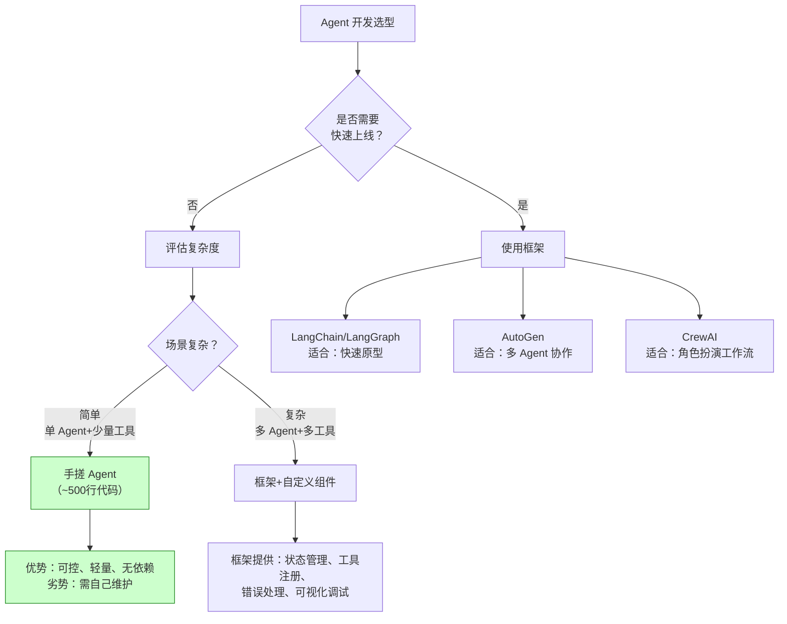
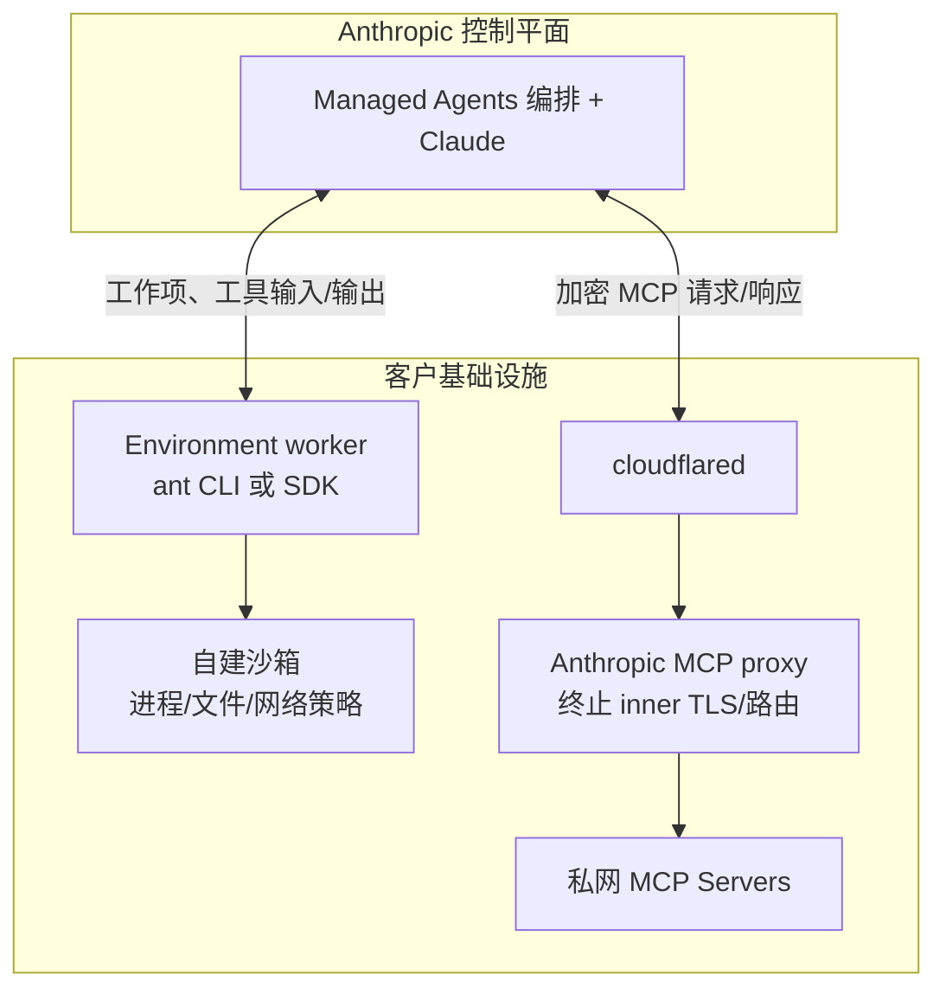

# 第 25 章 可恢复 Agent 运行时 ⭐⭐⭐⭐
> [!abstract] 本章导航
> **定位**：第四部分 Agent 与工程框架中的第 25 章；围绕“可恢复 Agent 运行时”建立单一、可追踪的知识主线。
>
> **先修**：[[24_Agent工作流编排与多智能体|第 24 章 Agent 工作流编排与多智能体]]。
>
> **学习目标**：
> - 解释 Agent 开发实战 ⭐⭐⭐⭐ 的核心问题、机制与适用边界。
> - 实现或评估 失败语义、幂等与人工确认 的最小闭环。
> - 使用可复现证据诊断 Durable Execution 的工程取舍与失败模式。
>
> **建议路径**：Agent 开发实战 ⭐⭐⭐⭐ → 失败语义、幂等与人工确认 → Durable Execution → 托管 Agent 与安全隧道。
>
> **配套代码**：`code/ch22_agent_tools/`、`code/ch43_cloudnative/`。

本章先回答“Agent 开发实战 ⭐⭐⭐⭐”为什么成立，再沿着机制、实现、评估和边界逐步展开。阅读时先建立因果链，再运行或推演示例，最后用章末自测检查能否脱离原文复述。
## 25.1 Agent 开发实战 ⭐⭐⭐⭐

### 25.1.1 智能客服 Agent 完整实现

下面是显式真实调用的架构片段；可运行配套脚本默认使用 `LLM_MOCK=1`，不会读取 Key
或联网。生产工具调用还必须补充身份鉴权、幂等键、参数校验、审批和审计，不能把模型给出的
参数直接视为操作授权。

```python
"""
智能客服 Agent - 完整实战
集成：ReAct + Function Calling + RAG + 记忆管理
"""
import json
import os
import openai
from typing import Optional
from dataclasses import dataclass, field
from datetime import datetime


@dataclass
class CustomerServiceAgent:
    """
    智能客服 Agent

    能力：
    - 公司政策问答（RAG 知识库）
    - 订单查询（数据库工具）
    - 情感分析与安抚
    - 工单创建与转人工
    """

    api_key: str
    model: str = field(default_factory=lambda: os.getenv("OPENAI_MODEL", "gpt-5.6"))
    conversation: list = field(default_factory=list)
    escalation_threshold: float = 0.8  # 转人工阈值

    def __post_init__(self):
        self.client = openai.OpenAI(api_key=self.api_key)
        self.model_kwargs = (
            {"reasoning_effort": "none"} if self.model.startswith("gpt-5.6") else {}
        )
        self.tools = self._define_tools()
        self.system_prompt = self._build_system_prompt()

    def _define_tools(self) -> list:
        """定义客服 Agent 可用的工具"""
        return [
            {
                "type": "function",
                "function": {
                    "name": "query_policy",
                    "description": "查询公司政策（如退换货、运费、会员权益等）",
                    "parameters": {
                        "type": "object",
                        "properties": {
                            "topic": {"type": "string", "description": "政策主题"}
                        },
                        "required": ["topic"]
                    }
                }
            },
            {
                "type": "function",
                "function": {
                    "name": "query_order",
                    "description": "查询订单信息",
                    "parameters": {
                        "type": "object",
                        "properties": {
                            "order_id": {"type": "string"},
                            "user_id": {"type": "string"}
                        },
                        "required": ["order_id"]
                    }
                }
            },
            {
                "type": "function",
                "function": {
                    "name": "create_ticket",
                    "description": "创建工单，转交人工客服",
                    "parameters": {
                        "type": "object",
                        "properties": {
                            "user_id": {"type": "string"},
                            "issue": {"type": "string"},
                            "priority": {"type": "string", "enum": ["low", "medium", "high", "urgent"]}
                        },
                        "required": ["user_id", "issue", "priority"]
                    }
                }
            },
            {
                "type": "function",
                "function": {
                    "name": "refund_request",
                    "description": "处理退款申请",
                    "parameters": {
                        "type": "object",
                        "properties": {
                            "order_id": {"type": "string"},
                            "reason": {"type": "string"},
                            "amount": {"type": "number"}
                        },
                        "required": ["order_id", "reason"]
                    }
                }
            }
        ]

    def _build_system_prompt(self) -> str:
        """构建系统提示"""
        return """你是某电商平台的智能客服助手「小智」。

核心原则：
1. 专业：准确解答用户问题，不清楚时主动查询政策
2. 共情：用户情绪激动时先安抚，再解决问题
3. 边界：涉及敏感操作（大额退款、投诉）主动转人工
4. 效率：优先用工具查询，不要编造信息

工作流程：
1. 理解用户意图
2. 如需查询信息，调用对应工具
3. 基于查询结果给出准确回答
4. 判断是否需要转人工（用户情绪极差/问题超出能力范围）

当前时间：{time}""".format(time=datetime.now().strftime("%Y-%m-%d %H:%M"))

    def analyze_sentiment(self, message: str) -> dict:
        """情感分析"""
        prompt = f"""分析以下用户消息的情感倾向，输出 JSON：
{{
    "sentiment": "positive/neutral/negative/angry",
    "intensity": 0-1,  // 情绪强度
    "key_concerns": ["用户关注的主要问题"],
    "needs_escalation": true/false  // 是否需要立即转人工
}}

消息：{message}"""

        try:
            response = self.client.chat.completions.create(
                model=self.model,
                messages=[{"role": "user", "content": prompt}],
                temperature=0.0,
                **self.model_kwargs,
            )
            result = json.loads(response.choices[0].message.content)
            return result
        except (json.JSONDecodeError, TypeError, ValueError):
            return {"sentiment": "neutral", "intensity": 0.5, "needs_escalation": False}

    def handle(self, user_message: str, user_id: str = "anonymous") -> dict:
        """
        处理用户消息

        Returns:
            {
                "response": str,          # 给用户的消息
                "actions": list,          # 执行的操作
                "escalated": bool,        # 是否已转人工
                "sentiment": dict,        # 情感分析结果
            }
        """
        # 情感分析
        sentiment = self.analyze_sentiment(user_message)

        # 情绪激烈，直接转人工
        if sentiment.get("needs_escalation") or sentiment.get("intensity", 0) > self.escalation_threshold:
            return {
                "response": "非常抱歉给您带来不好的体验，我立即为您转接人工客服 specialist。",
                "actions": [{"type": "escalate", "reason": "high_emotion"}],
                "escalated": True,
                "sentiment": sentiment,
            }

        # 构建消息列表
        messages = [
            {"role": "system", "content": self.system_prompt},
            *self.conversation,
            {"role": "user", "content": user_message}
        ]

        actions = []
        max_rounds = 3

        for _ in range(max_rounds):
            response = self.client.chat.completions.create(
                model=self.model,
                messages=messages,
                tools=self.tools,
                tool_choice="auto",
                **self.model_kwargs,
            )

            message = response.choices[0].message

            # 无需工具调用
            if not message.tool_calls:
                # 保存对话历史
                self.conversation.append({"role": "user", "content": user_message})
                self.conversation.append({"role": "assistant", "content": message.content})

                # 保持对话历史长度
                if len(self.conversation) > 20:
                    self.conversation = self.conversation[-20:]

                return {
                    "response": message.content,
                    "actions": actions,
                    "escalated": False,
                    "sentiment": sentiment,
                }

            # 处理工具调用
            tool_results = []
            for tc in message.tool_calls:
                func_name = tc.function.name
                func_args = json.loads(tc.function.arguments)

                # 执行工具
                result = self._execute_tool(func_name, func_args, user_id)
                tool_results.append({
                    "tool_call_id": tc.id,
                    "role": "tool",
                    "content": str(result),
                })
                actions.append({"tool": func_name, "args": func_args, "result": result})

            # 更新消息列表
            messages.append({
                "role": "assistant",
                "content": message.content or "",
                "tool_calls": [
                    {
                        "id": tc.id,
                        "type": "function",
                        "function": {"name": tc.function.name, "arguments": tc.function.arguments}
                    }
                    for tc in message.tool_calls
                ]
            })
            messages.extend(tool_results)

        return {
            "response": "抱歉，处理时间较长，我为您转接人工客服。",
            "actions": actions + [{"type": "escalate", "reason": "max_rounds"}],
            "escalated": True,
            "sentiment": sentiment,
        }

    def _execute_tool(self, name: str, args: dict, user_id: str) -> str:
        """执行工具调用（模拟实现）"""
        if name == "query_policy":
            policies = {
                "退换货": "7天无理由退货，15天换货。商品需保持原状。",
                "运费": "满99包邮，不满收取6元运费。偏远地区除外。",
                "会员": "VIP会员享95折，每月送运费券3张。",
            }
            topic = args.get("topic", "")
            for key, value in policies.items():
                if key in topic:
                    return value
            return f"关于'{topic}'的政策：请参考官网帮助中心。"

        elif name == "query_order":
            order_id = args.get("order_id", "")
            return f"订单 {order_id}：已发货，预计 2-3 天到达。"

        elif name == "create_ticket":
            return f"工单 #{hash(str(args)) % 10000} 已创建，专人将在 10 分钟内联系您。"

        elif name == "refund_request":
            order_id = args.get("order_id", "")
            return f"退款申请已提交（订单 {order_id}），审核需要 1-3 个工作日。"

        return "工具执行成功"


# ============ 使用示例 ============

def demo():
    """智能客服 Agent 演示"""
    agent = CustomerServiceAgent(api_key="your-api-key")

    # 场景1：普通政策咨询
    result1 = agent.handle("你们退换货政策是什么？")
    print(f"用户：你们退换货政策是什么？")
    print(f"客服：{result1['response']}")
    print(f"情感：{result1['sentiment']['sentiment']}, 强度：{result1['sentiment']['intensity']}")
    print()

    # 场景2：订单查询
    result2 = agent.handle("帮我查一下订单 #12345")
    print(f"用户：帮我查一下订单 #12345")
    print(f"客服：{result2['response']}")
    print(f"执行操作：{result2['actions']}")
    print()

    # 场景3：情绪激动的用户
    result3 = agent.handle("你们这是什么垃圾服务！我的货都丢了一周了！我要投诉！")
    print(f"用户：你们这是什么垃圾服务！我的货都丢了一周了！")
    print(f"客服：{result3['response']}")
    print(f"是否转人工：{result3['escalated']}")


if __name__ == "__main__":
    demo()
```

### 25.1.2 手搓 Agent vs 使用框架的选型



**选型决策表**：

| 场景 | 推荐方案 | 理由 |
|------|---------|------|
| 学习/面试 | **手搓 ReAct Agent** | 深入理解原理，面试加分 |
| MVP 原型 | LangChain Agent | 快速搭建，生态丰富 |
| 多 Agent 协作 | AutoGen / CrewAI | 对话驱动，角色清晰 |
| 生产环境 | **手搓 + MCP** | 可控性高，MCP 接入工具生态 |
| 复杂工作流 | LangGraph | 状态图编排，可视化调试 |

**面试建议**：能清晰描述 ReAct 循环并手写简化版 Agent，面试印象分极高。框架只是工具，原理才是核心。

## 25.2 失败语义、幂等与人工确认
### 25.2.1 失败语义、幂等与人工确认（2026 国内面试高频）

“失败就重试三次”不是生产级答案。只读查询超时可以在预算内指数退避；写操作超时可能已经成功，只是响应丢失，盲目重试会造成重复扣款、重复发信或重复写入。

生产 Agent 至少应做到：

1. 每次运行和步骤都有 `run_id` / `step_id`，写工具携带幂等键；
2. 工具状态区分执行中、成功、确定失败、结果未知；
3. 删除、支付、发送、审批等操作在提交前显式确认；
4. 持久化最后一个已确认步骤，恢复时不重放整个轨迹；
5. 分开统计工具选择准确率、参数合法率、执行成功率和端到端任务成功率；
6. 达到步数、成本、连续失败或重复动作阈值后熔断并转人工。

系统化项目深挖、故障矩阵与写操作幂等示例见 [[54_国内大模型岗位与项目面试实战_2026]]。

## 25.3 Durable Execution
### 25.3.1 Durable Execution：可恢复的 Agent 执行

Pydantic AI 在 2026 年引入 **Durable Execution（持久化执行）** 概念。Agent 在执行过程中可能崩溃（网络断开、模型超时、进程被杀），传统实现会让所有进度丢失。Durable Execution 通过**事件溯源（Event Sourcing）+ 断点续传**让 Agent 可恢复。

```python
"""
Pydantic AI Durable Execution - 持久化执行示例
核心思想：每个步骤产生事件，事件持久化后可重放
"""
from dataclasses import dataclass, field
from datetime import datetime
from typing import Optional
import asyncio


@dataclass
class ResearchStep:
    """研究流程中的一个步骤"""
    step_id: str
    name: str
    status: str = "pending"
    result: str = ""
    started_at: str = ""
    completed_at: str = ""


class PostgresEventStore:
    """简化的 Postgres 事件存储（实际中用真实 DB）"""

    def __init__(self, connection_string: str, table_name: str = "agent_events"):
        self.connection_string = connection_string
        self.table_name = table_name
        self._in_memory: dict[str, list[dict]] = {}

    async def append_event(self, task_id: str, event_type: str,
                            payload: dict, checkpoint: dict = None) -> None:
        """追加事件"""
        event = {
            "task_id": task_id,
            "event_type": event_type,
            "payload": payload,
            "checkpoint": checkpoint,
            "timestamp": datetime.now().isoformat(),
        }
        self._in_memory.setdefault(task_id, []).append(event)
        # 实际实现中：INSERT INTO events ...

    async def load_events(self, task_id: str) -> list[dict]:
        """加载任务的所有历史事件"""
        return self._in_memory.get(task_id, [])


async def search_basic_info(topic: str) -> str:
    await asyncio.sleep(1)
    return f"基础信息: {topic} 的入门介绍..."


async def deep_analysis(topic: str, context: dict) -> str:
    await asyncio.sleep(2)
    return f"深度分析: {topic} 的核心机制..."


async def write_report(topic: str, context: dict) -> str:
    await asyncio.sleep(1)
    return f"完整报告: {topic} 的研究报告..."


async def run_research_task(task_id: str, topic: str) -> list[ResearchStep]:
    """
    完整的耐久执行流程：
    1. 检查是否有未完成的事件（恢复）
    2. 如果没有，从头开始
    3. 每步都持久化事件
    """
    event_store = PostgresEventStore(
        connection_string="postgresql://...",
    )

    history = await event_store.load_events(task_id)
    completed_ids: set[str] = set()
    if history:
        print(f"恢复任务 {task_id}，已执行 {len(history)} 个事件")
        completed_ids = {
            e["payload"].get("step_id")
            for e in history
            if e["event_type"] == "step_completed"
        }

    steps = [
        ResearchStep(step_id="1", name="搜索基础信息"),
        ResearchStep(step_id="2", name="深度分析"),
        ResearchStep(step_id="3", name="撰写报告"),
    ]
    results: list[ResearchStep] = []

    for step in steps:
        if step.step_id in completed_ids:
            print(f"步骤 {step.step_id} 已完成，跳过")
            step.status = "completed"
            results.append(step)
            continue

        await event_store.append_event(
            task_id=task_id,
            event_type="step_started",
            payload={"step_id": step.step_id, "name": step.name},
        )
        step.status = "running"
        step.started_at = datetime.now().isoformat()

        try:
            if step.step_id == "1":
                step.result = await search_basic_info(topic)
            elif step.step_id == "2":
                step.result = await deep_analysis(topic, {})
            elif step.step_id == "3":
                step.result = await write_report(topic, {})

            step.status = "completed"
            step.completed_at = datetime.now().isoformat()

            await event_store.append_event(
                task_id=task_id,
                event_type="step_completed",
                payload={"step_id": step.step_id, "result": step.result},
                checkpoint={"step_id": step.step_id, "status": "completed"},
            )
            results.append(step)
            print(f"步骤 {step.step_id} 完成: {step.result[:50]}...")

        except Exception as e:
            await event_store.append_event(
                task_id=task_id,
                event_type="step_failed",
                payload={"step_id": step.step_id, "error": str(e)},
            )
            raise

    return results


async def resume_interrupted_task(task_id: str):
    """恢复中断的任务"""
    return await run_research_task(task_id, "Python GIL")


asyncio.run(resume_interrupted_task("task-001"))
```

**Durable Execution 与普通执行对比**：

| 维度 | 普通执行 | Durable Execution |
|------|---------|------------------|
| **崩溃恢复** | 全部丢失，从头开始 | 恢复到上次 checkpoint |
| **状态管理** | 内存 | 持久化事件日志 |
| **可重放性** | 不支持 | 支持 事件溯源 |
| **成本** | 低 | 中 每步都写日志 |
| **适用场景** | 短任务与可重试 | 长任务与必须完成 |

---

## 25.4 托管 Agent 与安全隧道
### 25.4.1 Anthropic Managed Agents — 自托管沙箱与 MCP Tunnels

这两个能力解决不同问题，不能合并成一个未经证实的 “Managed Agents Helm Chart”：

- **Self-hosted sandboxes**：编排和模型仍在 Anthropic 一侧，工具/代码执行、文件系统与执行
  环境的网络出口位于客户基础设施。**工具输入和输出仍会发送到 Anthropic 控制平面**，供模型
  决策；因此它不是“零数据出域”。
- **MCP Tunnels**：让 Anthropic 访问客户私网中的 MCP Server。客户网络内运行
  `cloudflared` 与 Anthropic proxy；它可以和 self-hosted sandbox 组合，也可独立使用。



**Self-hosted worker 最小路径：**

```bash
# 在 Console 创建 self-hosted environment 并生成 environment key
export ANTHROPIC_ENVIRONMENT_ID="env_..."
export ANTHROPIC_ENVIRONMENT_KEY="sk-ant-oat01-..."

# 常驻 worker：轮询工作队列，在 /workspace 执行工具
ant beta:worker poll --workdir /workspace
```

需要每会话隔离时，可用自己的容器/微虚拟机启动器执行 `ant beta:worker run`，并由客户负责
镜像、`/bin/bash`、凭据注入、文件挂载、资源限制和网络策略。不要把文档中的通用 worker
路径写成 Anthropic 提供的 K8s sandbox 镜像或固定 Helm values。

**数据与网络边界：**

| 能力 | 留在客户环境 | 会跨边界 | 网络要求 |
|------|--------------|----------|----------|
| Self-hosted sandbox | 工具进程、文件系统、执行环境可访问的网络 | 工作项、工具输入和输出发送至 Anthropic 控制平面 | 常驻 worker 使用出站 HTTPS；webhook 模式另需可达端点 |
| MCP Tunnel | MCP Server 与上游内部网络 | 加密后的 MCP 请求/响应经隧道传输 | 配置/轮换访问 `api.anthropic.com:443/TCP`；`cloudflared` 运行时访问 tunnel edge `7844/TCP 或 UDP`；proxy 到上游端口按配置 |

MCP Tunnel 的传输提供方是 Cloudflare：外层 mTLS、内层 TLS 与 MCP Server OAuth 分别承担
不同的防护责任。Cloudflare 无法读取 MCP 请求/响应载荷，但可观察连接元数据；客户仍需保护
tunnel token、TLS 私钥、OAuth 与上游网络策略。

官方边界与部署步骤：
[Self-hosted sandboxes](https://platform.claude.com/docs/en/managed-agents/self-hosted-sandboxes)；
[MCP tunnels](https://platform.claude.com/docs/en/agents-and-tools/mcp-tunnels/overview)。
## 🧭 本章小结

- Agent 开发实战 ⭐⭐⭐⭐：能够说清问题、机制、证据与边界。
- 失败语义、幂等与人工确认：能够说清问题、机制、证据与边界。
- Durable Execution：能够说清问题、机制、证据与边界。

## ✅ 自测与练习

1. 不看正文，解释“Agent 开发实战 ⭐⭐⭐⭐”解决什么问题，并给出一个不适用场景。
2. 为“失败语义、幂等与人工确认”设计一个最小可复现实验，明确输入、指标和通过条件。
3. 比较“Durable Execution”的至少两种方案，说明质量、成本、延迟或风险取舍。

## 🧪 配套代码与验收

- `code/ch22_agent_tools/`
- `code/ch43_cloudnative/`

```powershell
python code/scripts/run_all_examples.py --chapter ch22 --tier core
python code/scripts/run_all_examples.py --chapter ch43 --tier core
```

默认验收不下载模型、不调用付费 API；真实 API 或 GPU 示例必须按 metadata 显式启用。成功标准是相关脚本输出 `OK`，条件不足时输出可解释的 `[SKIP]`。

## 🎯 面试题精讲

回答本章问题时使用四步结构：先给结论，再解释机制，然后给项目证据，最后主动说明适用边界。涉及性能或效果时，补充模型、硬件、数据、并发、版本和统计口径；条件不完整时明确说“需要实测”。

## 📋 本章速查表

| 主题 | 回答主线 |
|---|---|
| Agent 开发实战 ⭐⭐⭐⭐ | 问题 → 机制 → 示例 → 指标 → 边界 |
| 失败语义、幂等与人工确认 | 问题 → 机制 → 示例 → 指标 → 边界 |
| Durable Execution | 问题 → 机制 → 示例 → 指标 → 边界 |
| 托管 Agent 与安全隧道 | 问题 → 机制 → 示例 → 指标 → 边界 |

## 🔗 相关章节

- [[24_Agent工作流编排与多智能体|第 24 章 Agent 工作流编排与多智能体]]
- [[26_Agent记忆与个性化|第 26 章 Agent 记忆与个性化]]

## 📖 一手参考资料

> 核验基线：2026-07-31；结构复核：2026-08-05。产品、API、法规、价格与 benchmark 会变化，使用前应再次核验。

- [[docs/AUTHORITATIVE_SOURCES|章节权威来源索引]]：按主题维护官方文档、标准、原论文和官方仓库。
