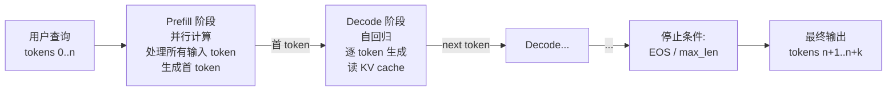
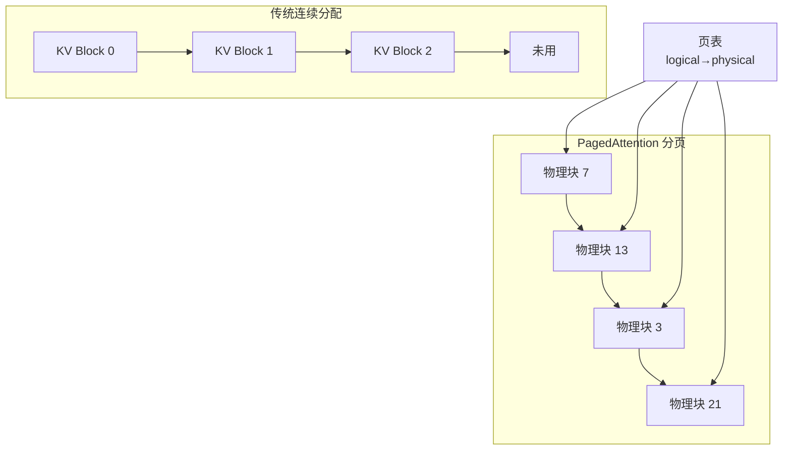
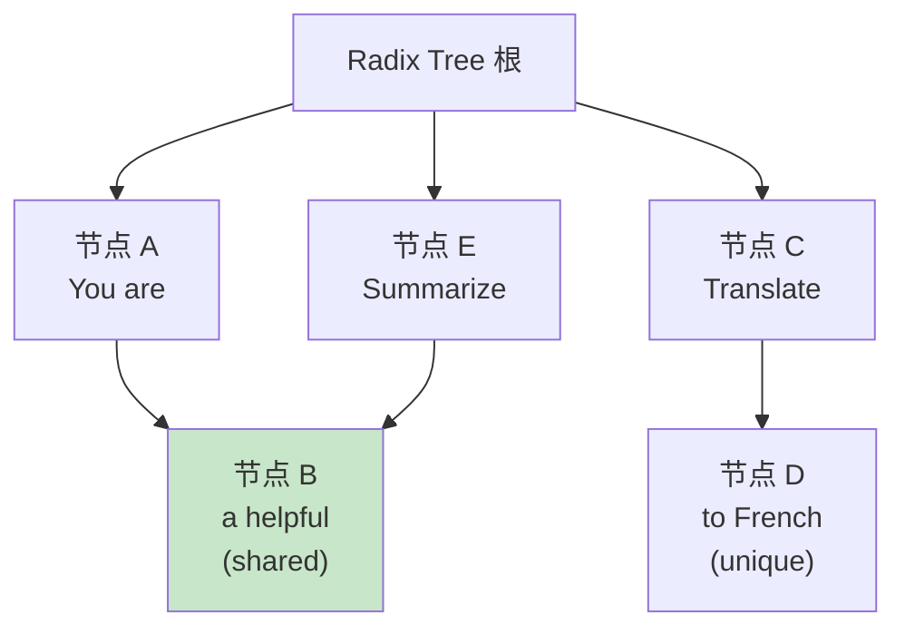
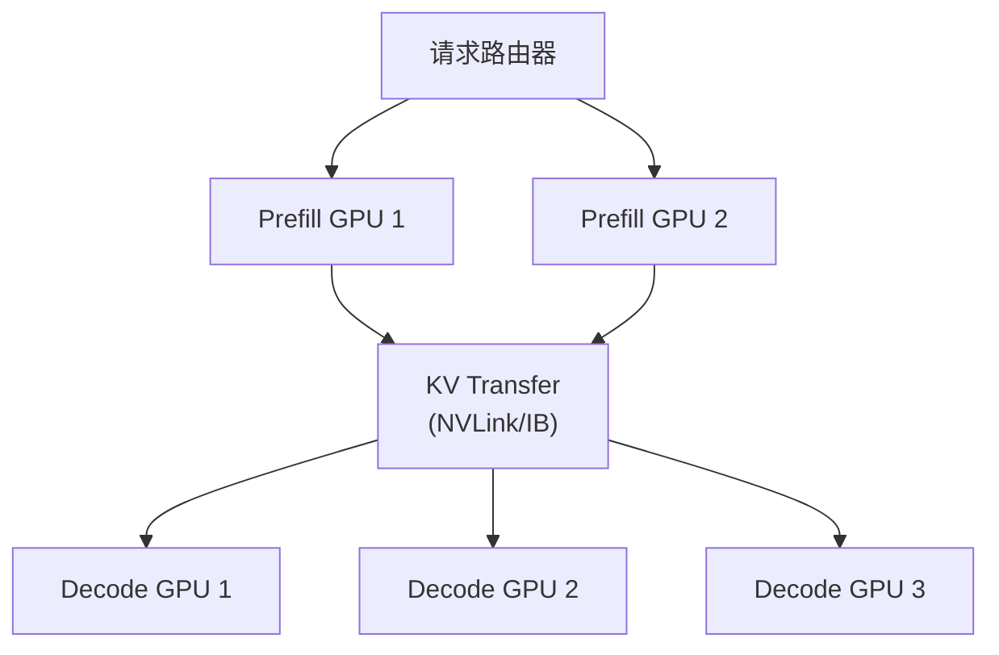
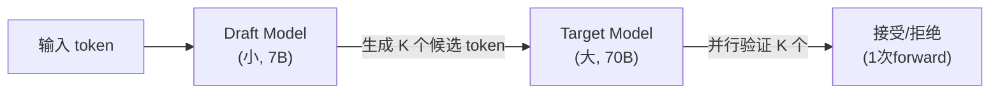
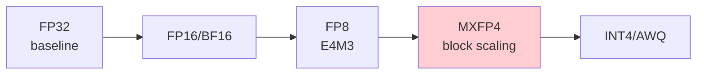
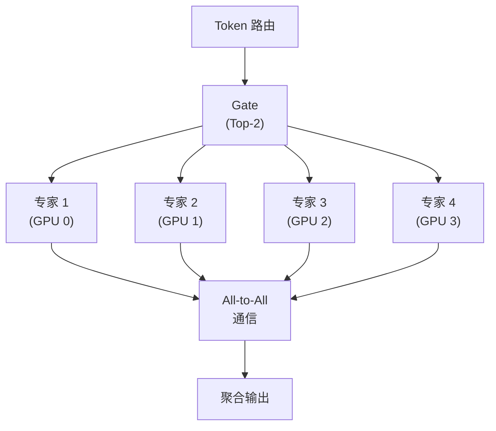
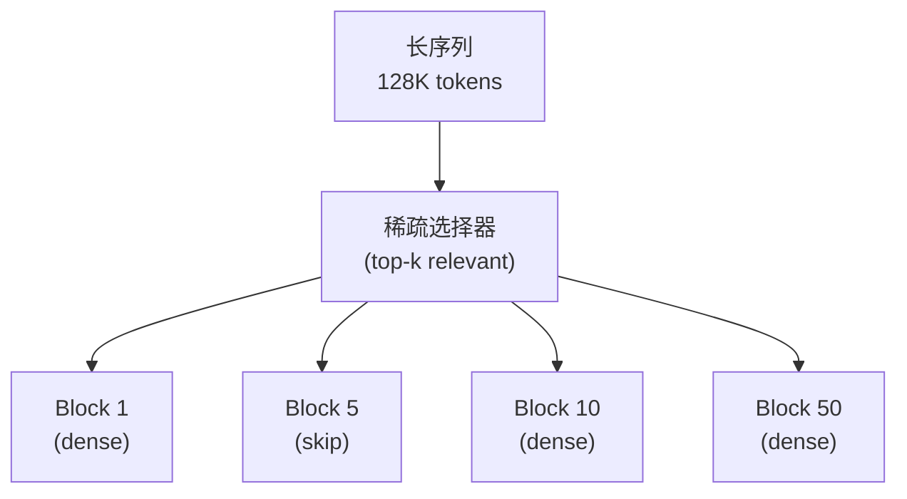
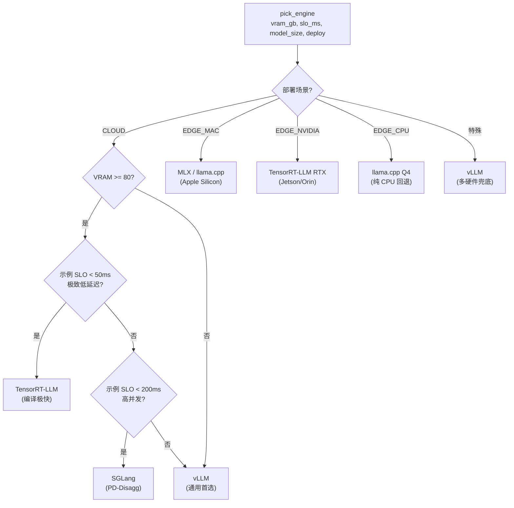

# 第 25 章 推理引擎与高性能服务 ⭐⭐⭐⭐⭐

> [!abstract] 本章导航
> **定位**：深入推理数据面与服务指标，是推理工程和容量规划的核心章节。
>
> **先修**：[[12_Transformer与大模型原理]]、[[16_模型微调与推理优化]]、[[19_分布式训练系统]]。
>
> **学习目标**：
> - 解释 Prefill、Decode、KV Cache 和批处理的性能瓶颈。
> - 用 TTFT、TPOT、吞吐和显存指标设计基准。
> - 根据模型、硬件和流量选择推理引擎。
>
> **建议路径**：推理核心原理 → 主流推理引擎对比 → 关键优化技术 → … → 推理引擎选型决策树。先完成主线，再按需要阅读进阶内容。
>
> **配套代码**：`code/ch25_inference_engines/`。

> [!info] 阅读提示
> **🆕 2026年新内容**：本章系统梳理 vLLM / SGLang / TensorRT-LLM / MLC-LLM / llama.cpp 五大主流推理引擎的架构差异，涵盖 PagedAttention、PD-Disaggregation、Speculative Decoding、FP4/MXFP4/NVFP4 量化阶梯、MoE 专家并行、稀疏注意力、硬件可移植性等 2026 年生产级技术。

大模型推理是模型能力转化为稳定在线服务的关键工程环节。给定一个 7B-70B 参数量的 LLM，如何在有限的 GPU 资源下服务高并发请求、降低首 token 延迟（TTFT）和每个 token 的延迟（TPOT）、提升吞吐量（Throughput），是所有 LLM 工程师的必修课。

本章从推理核心原理（PagedAttention、KV Cache）出发，对比五大推理引擎架构，剖析 PD-Disaggregation、Speculative Decoding、量化阶梯、MoE 推理等 2026 年关键技术，并给出选型决策树。

## 25.1 推理核心原理

### 25.1.1 自回归生成的计算特性

LLM 推理分为两个阶段：



| 阶段 | 计算特征 | 瓶颈 |
|------|---------|------|
| **Prefill** | 计算密集（GEMM 主导） | GPU 算力 |
| **Decode** | 访存密集（每步读 KV） | HBM 带宽 |

### 25.1.2 KV Cache 原理与显存估算

每个 Transformer 层的 KV Cache 大小：

```
KV Cache Size (bytes) = 2 × n_layers × seq_len × n_kv_heads × head_dim × precision_bytes × batch_size
```

**示例**: LLaMA-70B (n_layers=80, n_kv_heads=8, head_dim=128, fp16) 服务 8K context, batch=32:

```
KV = 2 × 80 × 8192 × 8 × 128 × 2 × 32
   = 85,899,345,920 bytes
   = 80 GiB ≈ 85.9 GB（batch=32；单请求约 2.5 GiB）
```

这里使用二进制 GiB 与十进制 GB 分别展示，避免容量规划时混用单位。实际服务还要为权重、激活、CUDA Graph、临时 workspace 和显存碎片预留空间。

### 25.1.3 推理优化目标（3 个核心指标）

| 指标 | 定义 | 优化方向 |
|------|------|---------|
| **TTFT** (Time To First Token) | 从收到请求到返回首 token 的时间 | Prefill 优化、Prompt Caching |
| **TPOT** (Time Per Output Token) | 每个输出 token 间隔 | Decode 优化、Batching |
| **Throughput** | 单位时间处理的请求/token 数 | Continuous Batching、PD-Disaggregation |

## 25.2 主流推理引擎对比

| 引擎 | 核心特性 | 最佳场景 | 维护方 | 生产成熟度 |
|------|---------|---------|--------|-----------|
| **vLLM** | PagedAttention, Continuous Batching | 通用 LLM 部署 | UC Berkeley / Anyscale | ⭐⭐⭐⭐⭐ |
| **SGLang** | RadixAttention, PD-Disaggregation | 高并发生产部署 | LMSYS / Stanford | ⭐⭐⭐⭐⭐ |
| **TensorRT-LLM** | 极致优化, NVIDIA 生态 | NVIDIA GPU 生产部署 | NVIDIA | ⭐⭐⭐⭐⭐ |
| **MLC-LLM** | 跨平台编译 | 移动端/边缘 | CMU | ⭐⭐⭐⭐ |
| **llama.cpp** | CPU/Mac/嵌入式 | 本地推理, GGUF 格式 | 社区 (ggerganov) | ⭐⭐⭐⭐⭐ |
| **TokenSpeed** | Agent 工作负载、混合前缀缓存、PD 状态传输 | Qwen3.5/B200 等受支持环境 | LightSeek Foundation | 新兴，按 release 验证 |

### 25.2.1 vLLM 核心：PagedAttention

传统 KV Cache 管理是连续分配（浪费显存，易碎片化）。PagedAttention 借鉴操作系统的虚拟内存 + 页表思想：



**收益边界**：PagedAttention 论文报告 KV Cache 接近零浪费；其原始 vLLM 实验在论文指定的模型、
请求分布与硬件上，相对 FasterTransformer/Orca 在相同延迟水平获得 2–4× 吞吐。该数字不是
PagedAttention 单一机制或任意版本的通用保证，复现时必须固定引擎 commit、模型、输入/输出长度、
并发、硬件与延迟 SLO。来源：
[PagedAttention/vLLM 论文](https://arxiv.org/abs/2309.06180)。

### 25.2.2 SGLang 核心：RadixAttention

SGLang 的 RadixAttention 自动识别相同的前缀，共享 KV Cache：



**适用场景**: 高 QPS 系统、Few-shot Prompt、对话系统中"system prompt 共享"。

### 25.2.3 TensorRT-LLM 核心特性

- **Engine 编译**：提前将模型编译为针对特定硬件的优化引擎
- **In-flight batching**：动态 batching
- **Kernel fusion**：融合 Attention/MLM 算子
- **支持 Speculative Decoding、EAGLE-3、Medusa**

### 25.2.4 llama.cpp 核心：GGUF 格式

GGUF (GPT-Generated Unified Format) 是 llama.cpp 的标准模型格式：

- 支持 CPU/GPU/混合
- 4-bit 量化（Q4_K_M、Q5_K_M）
- Apple Silicon Metal 加速

### 25.2.5 TokenSpeed：推理引擎，不是训练流水线

PyTorch 官方 2026-05-27 文章将 TokenSpeed 定位为面向 Agent 工作负载的开源 **LLM 推理引擎**。公开的“约 580 tok/s”结果来自 Qwen3.5-397B-A17B-NVFP4 在 B200、TP8、batch=1 等特定设置下的单用户解码测试，不能外推成其他模型、硬件或并发下的通用性能，更不能写成训练吞吐。

复现时至少固定 commit/镜像、模型与量化、GPU 与 TP/EP、输入/输出长度、并发和前缀命中率，并同时报告 TTFT、TPOT/ITL 与吞吐。来源：[PyTorch 官方 TokenSpeed 文章](https://pytorch.org/blog/up-to-580tps-new-speed-record-of-qwen3-5-397b-a17b-on-gpu-for-agentic-workloads-with-tokenspeed/)（截至 2026-07-31）。

## 25.3 关键优化技术

### 25.3.1 Continuous Batching

```mermaid
gantt
    title Static vs Continuous Batching
    dateFormat  X
    axisFormat %s
    section Static Batching
    请求1 (5 tok) :a1, 0, 5
    请求2 (3 tok) :a2, 0, 3
    请求3 (7 tok) :a3, 0, 7
    section Continuous Batching
    请求1 (5 tok) :b1, 0, 5
    请求2 (3 tok) :b2, 2, 5
    请求3 (7 tok) :b3, 4, 11
```



**Continuous Batching 收益边界**：它减少短请求等待长请求和空闲 slot 的浪费，通常改善吞吐与
排队延迟；实际幅度由长度分布、并发、batch/token 上限、模型与硬件决定，应与同版本 static
基线在相同 SLO 下压测。

### 25.3.2 PD-Disaggregation (Prefill-Decode 分离)

生产级推理系统常将 Prefill 和 Decode 部署在不同 GPU：



**收益边界**：PD 分离能隔离计算密集的 Prefill 与访存密集的 Decode，并允许独立扩缩；是否提升
取决于 KV 传输、路由、负载比例与拓扑。报告收益时必须绑定 SGLang 版本、模型、NVL/IB 拓扑、
输入/输出长度、并发和 TTFT/TPOT SLO，不能把某个 NVL72 演示结果泛化为固定倍数。

### 25.3.3 Speculative Decoding



**核心数学**: 接受率 = min(1, P_target(x) / P_draft(x))，保证生成分布一致。

**2026 主流变体**:
- **EAGLE-3**: 训练式特征级 proposer，收益取决于目标模型支持与接受率
- **DFlash**: 并行 draft/verify 研究路线，需核对模型与引擎实现
- **Medusa**: 多头并行预测
- **n-gram**: 无需训练

### 25.3.4 量化阶梯 (Quantization Ladder)

| 格式 | 名义位宽 | 原始权重字节/FP32 | 质量与兼容性边界 | 常见引擎 |
|------|---------|------------------|-------------------|---------|
| FP32 | 32 | 1 | 基线 | 通用 |
| FP16/BF16 | 16 | 约 1/2 | 数值范围不同，仍需任务回归 | 通用 |
| FP8 (E4M3/E5M2) | 8 | 约 1/4 | 依赖硬件、校准与算子支持 | vLLM/SGLang/TensorRT-LLM |
| **INT8 (W8A8)** | 8 | 约 1/4 | 对离群值和校准集敏感 | 依实现而定 |
| **MXFP4 / NVFP4** | 4 | 约 1/8 | 依赖缩放策略、模型配方与支持矩阵 | 以 NVIDIA/引擎文档为准 |
| **INT4 (AWQ/GPTQ)** | 4 | 约 1/8 | 权重量化；任务质量不可由位宽直接推断 | vLLM/SGLang/TensorRT-LLM |
| **GGUF Q4_K_M** | 4-bit 族 | 约 1/8，另有元数据开销 | 不同量化类型不可混为同一精度 | llama.cpp |

> 上表只比较原始权重存储量的理论阶次；总显存还包含量化 scale/zero-point、KV Cache、
> 激活、工作区和框架开销。任何“质量损失小/大”都必须在目标任务、模型版本和硬件上实测。



### 25.3.5 MoE 专家并行



**关键模式**: Expert Parallelism (EP) + Tensor Parallel (TP) + Pipeline Parallel (PP) 混合。

### 25.3.6 稀疏注意力 (Long-Context 推理)



**实现边界**：稀疏注意力首先是模型/算子设计，例如 DeepSeek-V4 公布的 DSA；推理引擎还需提供
匹配的算子和调度支持。不要把所有长上下文优化都称为稀疏注意力——Paged KV Cache、
Chunked Prefill、量化和上下文并行是不同路径，必须按模型版本与引擎兼容矩阵验收。

## 25.4 硬件可移植性

| 硬件 | 最佳引擎 | 关键优化 |
|------|---------|---------|
| **NVIDIA H200/B200** | vLLM/SGLang/TRT-LLM | FP4, PD-Disagg |
| **NVIDIA A100/H100** | vLLM/SGLang | FP8, Continuous Batching |
| **AMD MI300X** | vLLM (ROCm) | FP8, MoE |
| **Intel Gaudi 2/3** | vLLM-Habana | Custom kernels |
| **Google TPU v5e/v6** | JetStream/Pax | XLA 编译 |
| **Apple Silicon (M2/M3)** | llama.cpp (MLX) | Metal, ANE |
| **Ascend NPU 910B** | vLLM-Ascend | CANN |
| **Rebellions NPU** | SGLang-RBLN | RBLN SDK |

## 25.5 vLLM 部署实战

```python
# vLLM 部署 7B 模型示例
from vllm import LLM, SamplingParams

llm = LLM(
    model="meta-llama/Llama-2-7b-chat-hf",
    tensor_parallel_size=2,
    gpu_memory_utilization=0.9,
    max_num_batched_tokens=8192,
    enable_prefix_caching=True,
    quantization="awq"  # 或 "fp8" / "gptq"
)

sampling_params = SamplingParams(
    temperature=0.7,
    top_p=0.9,
    max_tokens=512
)

# 批处理请求 (Continuous Batching)
prompts = ["Hello, my name is", "The capital of France is"]
outputs = llm.generate(prompts, sampling_params)
for output in outputs:
    print(output.outputs[0].text)
```

### 25.5.1 vLLM 启动参数速查

| 参数 | 说明 |
|------|------|
| `--tensor-parallel-size N` | 张量并行度 |
| `--pipeline-parallel-size N` | 流水线并行度 |
| `--gpu-memory-utilization` | GPU 显存使用率 (0-1) |
| `--max-num-batched-tokens` | 批处理最大 token 数 |
| `--enable-prefix-caching` | 启用 prefix cache (SGLang 称 RadixAttention) |
| `--quantization` | 量化方式 (awq/gptq/fp8/squeezellm) |
| `--speculative-config` | 投机解码方法、draft 模型与 token 数等配置 |
| `--enable-chunked-prefill` | 启用 chunked prefill (混合 PD 调度) |
| `--kv-cache-dtype` | KV Cache 精度 (fp8/auto) |

## 25.6 推理引擎选型决策树

下面这张 mermaid 完整映射了 `12_engine_selection_decision_tree.py` 中 `pick_engine()` 的 7 个推荐分支（云端 + 三种端侧 + 极端情况），所有分支都已被代码枚举覆盖：



`pick_engine()` 输出结构（dataclass 简化）：

```python
@dataclass
class EngineRecommendation:
    primary: str          # 推荐引擎
    rationale: list[str]  # 关键理由
    fallback: str         # 备选引擎
    notes: str            # 硬件 / 依赖警告
```

**使用示例**（无需 GPU，纯逻辑跑通）：

```bash
cd code/
python ch25_inference_engines/gpu/12_engine_selection_decision_tree.py
# 预期输出: 7 个场景的引擎推荐 + 理由 + 备选
```

## 🧭 本章小结

> **章节小结**：本章系统梳理了 2026 年大模型推理服务的核心技术栈。PagedAttention (vLLM)
> 降低 KV Cache 碎片与预留浪费，Continuous Batching 动态复用 slot，PD-Disaggregation
> (SGLang) 隔离 Prefill/Decode 资源，Speculative Decoding 用 draft + verify 减少串行解码，
> FP4/MXFP4/NVFP4 进一步压缩权重与带宽。所有性能收益都必须绑定引擎版本、模型、硬件、长度、
> 并发和 SLO；面试重点是估算、对照实验和瓶颈解释，而不是背固定倍数。

## ✅ 自测与练习

先合上正文，再回答以下问题；无法说明证据或边界时，回到对应小节复习。

1. 你能否解释 Prefill、Decode、KV Cache 和批处理的性能瓶颈？
2. 你能否用 TTFT、TPOT、吞吐和显存指标设计基准？
3. 你能否根据模型、硬件和流量选择推理引擎？

## 🧪 配套代码与验收

> 本章有 **12 个 `.py` 文件**。仓库级默认验收会向 GPU 脚本传入 `--mock`：纯计算/纯逻辑
> 示例继续运行，涉及模型权重、CUDA 扩展、本地服务或外部 CLI 的示例明确输出 `[SKIP]`。
> 这证明离线契约可执行，不等于真实硬件性能验收。真实路径必须由操作者显式传
> `--real-gpu`，并记录模型、引擎版本、硬件、输入/输出长度、并发与原始结果。

### 25.9.1 文件 × 默认/真实路径速查表

| # | 文件 | 默认离线验收 | 显式真实路径前置条件 |
|---|------|--------------|----------------------|
| 01 | `paged_attention_block_manager.py` | `[SKIP]` | Linux、兼容 CUDA/vLLM、本地模型 |
| 02 | `continuous_batching_scheduler.py` | `[SKIP]` | 同上；并发请求参数需固定 |
| 03 | `radix_attention_prefix_tree.py` | `[SKIP]` | 同上；需构造可重复的共享前缀 |
| 04 | `pd_disaggregation.py` | `[SKIP]` | 本例是 chunked-prefill 入门，不等同跨节点 PD；真实 PD 另需 KV 传输拓扑 |
| 05 | `kv_cache_memory_calculator.py` | 纯计算运行 | 无模型；结果是容量估算 |
| 06 | `speculative_decoding.py` | `[SKIP]` | vLLM `speculative_config`、本地模型；必须报告接受率与同流量基线 |
| 07 | `moe_expert_parallel.py` | `[SKIP]` | 兼容 MoE 模型与多 GPU/互联；显存按具体模型估算 |
| 08 | `tensorrt_llm_build.py` | `[SKIP]` | Linux、NVIDIA GPU、TensorRT-LLM CLI、本地 checkpoint |
| 09 | `fp4_quantization_ladder.py` | `[SKIP]` | bitsandbytes、兼容 GPU、本地模型；实际演示 FP16/INT8/NF4 |
| 10 | `vllm_async_engine.py` | `[SKIP]` | vLLM、本地模型与足够显存 |
| 11 | `slo_ttft_tpot_monitor.py` | `[SKIP]` | 可用本地 metrics 端口与 `prometheus-client`；请求数据仍是模拟 |
| 12 | `engine_selection_decision_tree.py` | 纯逻辑运行 | 无模型；阈值是示意配置 |

### 25.9.2 一键验收

```bash
cd code/

# 默认：离线、安全；运行纯逻辑项并明确跳过条件项
python scripts/run_all_examples.py --tier gpu --chapter ch25

# 条件验收：只有在隔离且兼容的 GPU 主机上显式启用
python scripts/run_all_examples.py --tier gpu --chapter ch25 --real-gpu
```

真实路径不要只看“显存档位”。先根据权重格式、KV Cache 公式、并发、上下文长度、工作区和
TP/EP 拓扑做容量预算，再以目标流量压测 TTFT、TPOT、吞吐、P99、OOM 与质量回归。

> 仓库不附带模型权重。真实运行前按 `code/QUICKSTART.md` 准备本地模型，并核对各项目的许可证、
> 驱动/CUDA 与引擎兼容矩阵；不要把“脚本可启动”写成“生产性能已验证”。

## 🎯 面试题精讲

### 高频题1: vLLM 的 PagedAttention 解决了什么问题？原理是什么？

**答案**：传统 KV Cache 连续预分配会产生碎片和预留浪费。PagedAttention 借鉴 OS 虚拟内存，
把 KV Cache 划分为固定大小 block，通过 block table 做 logical→physical 映射。原始 vLLM 论文的
2–4× 吞吐是相对特定 FasterTransformer/Orca 基线、在论文实验配置和相同延迟水平下的系统结果，
不是任意模型和硬件上的固定收益。

### 高频题2: PD-Disaggregation 为什么能提升吞吐？

**答案**: Prefill 是计算密集（GPU bound），Decode 是访存密集（memory bound）。两者混合调度会互相干扰（Prefill 抢占带宽导致 Decode 抖动）。分离部署后：
- Prefill GPU 用 NVLink/IB 高速传输 KV 到 Decode GPU
- Decode GPU 专注逐 token 生成
- 可独立扩容

收益必须用相同模型、版本、硬件拓扑、流量和 SLO 的 A/B 压测确认；KV 传输或负载不匹配时也可能
抵消分离收益。

### 高频题3: Speculative Decoding 的接受率如何保证分布一致？

**答案**: Draft 模型生成 K 个候选 token 后，Target 模型一次 forward 并行验证。接受率：

```
α = min(1, P_target(x) / P_draft(x))
```

拒绝时从调整后的分布采样。数学证明：接受-拒绝采样保证输出分布与 Target 模型完全一致，不损失质量。

### 高频题4: 量化如何影响推理性能？FP4 vs INT4 怎么选？

**答案**:
- **INT4 (AWQ/GPTQ)**: 权重量化 4-bit，激活 FP16；通用性最好
- **FP4 (MXFP4/NVFP4)**: Block scaling，每 32 元素共享 scale；硬件原生支持（Blackwell）
- 选择: NVIDIA Blackwell GPU 选 NVFP4；其他选 INT4 AWQ；精度敏感选 FP8

### 高频题5: MoE 模型的推理瓶颈是什么？

**答案**:
1. **All-to-All 通信**: token 跨 GPU 路由，开销大
2. **专家不均衡**: 热门专家过载
3. **显存**: 总参数量大但激活少

解决: Expert Parallelism + 负载均衡 + EP+TP 混合并行。

### 高频题6: Continuous Batching 相比 Static Batching 优势？

**答案**：Static Batching 等批内所有请求结束后再接新批，长度长尾会留下空闲 slot。
Continuous Batching 在迭代边界回收已完成请求并补入新请求，通常改善资源利用率；吞吐和 P99
变化必须按真实长度分布、并发、batch/token 上限、模型和硬件实测。

### 高频题7: KV Cache 显存怎么估算？

**答案**:

```
KV Cache = 2 × n_layers × seq_len × n_kv_heads × head_dim × precision_bytes × batch_size
```

LLaMA-70B（80 层、8 KV 头、head_dim=128、FP16）服务 8K context、batch=32：约 **80 GiB（85.9 GB）**；单请求约 2.5 GiB。该值仅是 KV Cache，不含模型权重和运行时开销。

### 高频题8: 长上下文 (1M+) 推理的主要挑战？

**答案**:
1. KV Cache 占用巨大（线性增长）
2. Attention 复杂度 O(n²)
3. 显存带宽压力

解决方案: 稀疏/滑动窗口 Attention、Ring Attention、Compressive Memory、Prompt Caching。

## 📋 本章速查表

| 概念 | 关键点 |
|------|--------|
| **PagedAttention** | 分页管理 KV Cache，减少碎片和预留浪费 |
| **Continuous Batching** | 在迭代边界回收/补充 slot，收益需压测 |
| **PD-Disaggregation** | Prefill/Decode 分离部署，受 KV 传输与拓扑约束 |
| **Speculative Decoding** | 小模型 draft，大模型 verify |
| **FP4 (MXFP4/NVFP4)** | 4-bit 量化，Blackwell 原生 |
| **RadixAttention** | SGLang 前缀共享 |
| **MoE 专家并行** | All-to-All 路由 |
| **Chunked Prefill** | 混合 Prefill/Decode 调度 |
| **TTFT** | 首 token 延迟，Prefill 优化 |
| **TPOT** | 每 token 延迟，Decode 优化 |
| **配套代码（双层验收）** | 12 个 `.py`；默认执行离线安全契约，真实 vLLM/TensorRT-LLM/量化路径只在显式 `--real-gpu` 与兼容环境下运行。 |

## 🔗 相关章节

- [[16_模型微调与推理优化]] — 关联点：训练后量化（PTQ/AWQ/GPTQ）与推理量化阶梯（FP8/MXFP4/NVFP4/INT4）的衔接，微调后的推理部署是同一条链路。
- [[19_分布式训练系统]] — 关联点：推理侧的 Tensor Parallel、Pipeline Parallel 与 MoE Expert Parallelism 复用训练时的并行策略，理解分布式拓扑对推理部署至关重要。
- [[20_LLMOps与模型可观测性]] — 关联点：推理服务的 TTFT/TPOT/Throughput SLO 设计与可观测性体系（Prometheus + vLLM/SGLang metrics）是线上推理质量保障的核心。
- [[24_云原生部署与工程化]] — 关联点：推理引擎在 K8s 上的 GPU 调度、HPA 扩缩容、InferenceService CRD（如 KServe）是云原生推理的标准落地形态。
- [[12_Transformer与大模型原理]] — 关联点：KV Cache 显存估算、Attention 复杂度 O(n²) 与稀疏注意力方案都基于 Transformer 底层结构，理解原理才能真正调优推理性能。

## 📖 一手参考资料

> 核验日期：2026-08-04。版本、价格、法规、模型能力和 benchmark 以链接页面当前状态为准。

- [[docs/AUTHORITATIVE_SOURCES|章节权威来源索引]]：按章节维护的官方文档、标准、原论文和官方仓库。
