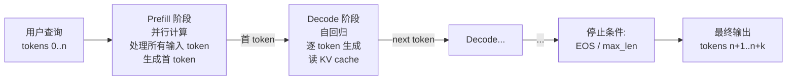
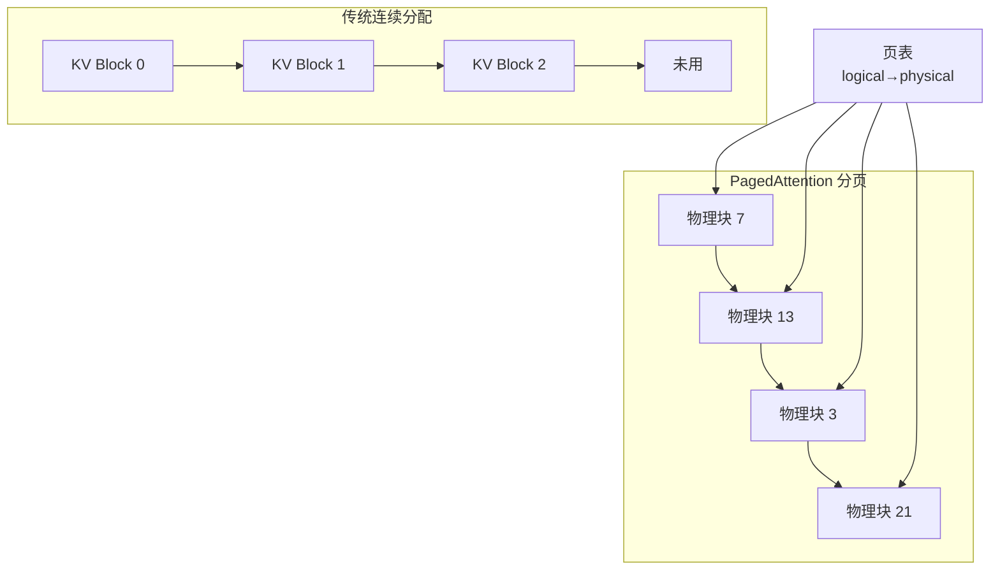
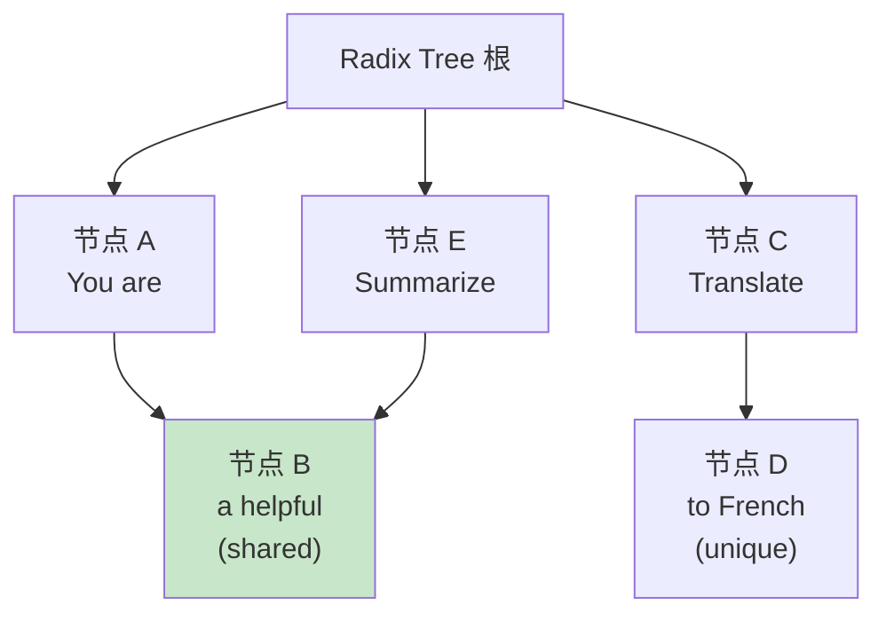
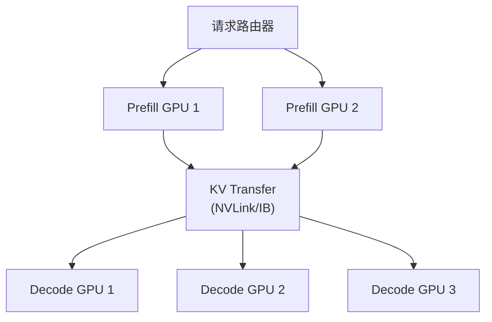
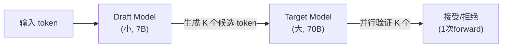
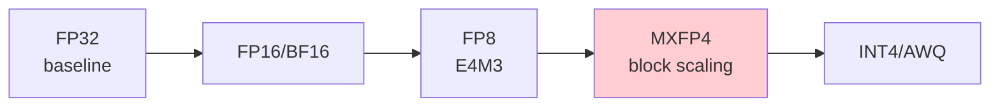
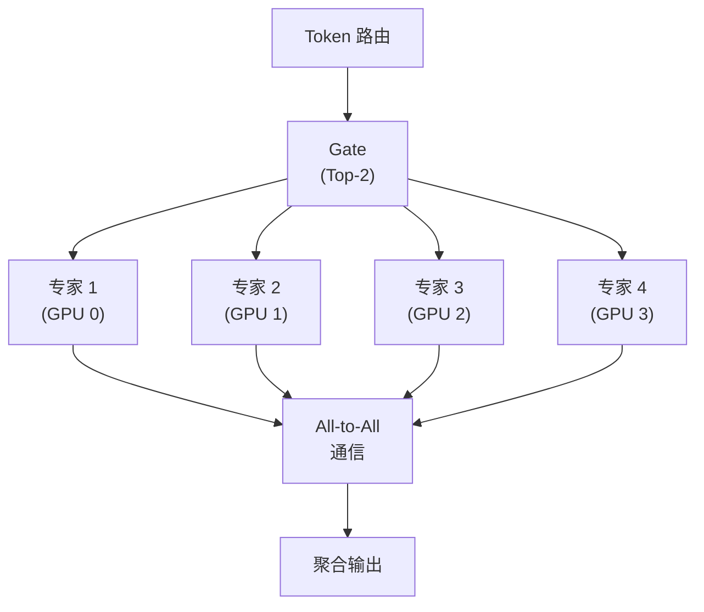
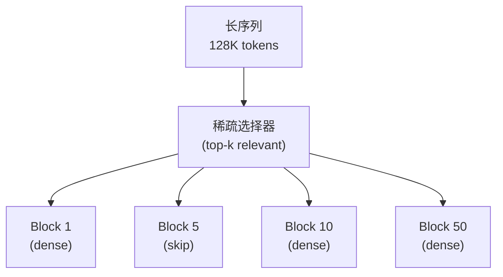
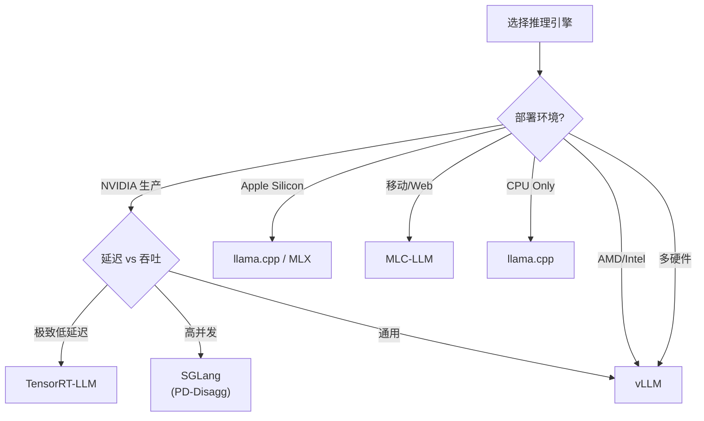

# 第 25 章 推理引擎与高性能服务 ⭐⭐⭐⭐⭐

> **面试频率**：极高（2026年大模型基础设施 JD 必考）| **难度**：⭐⭐⭐⭐⭐ | **核心地位**：ML Platform SRE / 推理工程师核心
>
> **🆕 2026年新内容**：本章系统梳理 vLLM / SGLang / TensorRT-LLM / MLC-LLM / llama.cpp 五大主流推理引擎的架构差异，涵盖 PagedAttention、PD-Disaggregation、Speculative Decoding、FP4/MXFP4/NVFP4 量化阶梯、MoE 专家并行、稀疏注意力、硬件可移植性等 2026 年生产级技术。

大模型推理是 2026 年大模型应用落地最关键的工程环节。给定一个 7B-70B 参数量的 LLM，如何在有限的 GPU 资源下服务高并发请求、降低首 token 延迟（TTFT）和每个 token 的延迟（TPOT）、提升吞吐量（Throughput），是所有 LLM 工程师的必修课。

本章从推理核心原理（PagedAttention、KV Cache）出发，对比五大推理引擎架构，剖析 PD-Disaggregation、Speculative Decoding、量化阶梯、MoE 推理等 2026 年关键技术，并给出选型决策树。

---

## 25.1 推理核心原理

### 25.1.1 自回归生成的计算特性

LLM 推理分为两个阶段：



| 阶段 | 计算特征 | 瓶颈 |
|------|---------|------|
| **Prefill** | 计算密集（GEMM 主导） | GPU 算力 |
| **Decode** | 访存密集（每步读 KV） | HBM 带宽 |

### 25.1.2 KV Cache 原理与显存估算

每个 Transformer 层的 KV Cache 大小：

```
KV Cache Size (bytes) = 2 × n_layers × seq_len × n_kv_heads × head_dim × precision_bytes × batch_size
```

**示例**: LLaMA-70B (n_layers=80, n_kv_heads=8, head_dim=128, fp16) 服务 8K context, batch=32:

```
KV = 2 × 80 × 8192 × 8 × 128 × 2 × 32 = 8.59 GB
```

### 25.1.3 推理优化目标（3 个核心指标）

| 指标 | 定义 | 优化方向 |
|------|------|---------|
| **TTFT** (Time To First Token) | 从收到请求到返回首 token 的时间 | Prefill 优化、Prompt Caching |
| **TPOT** (Time Per Output Token) | 每个输出 token 间隔 | Decode 优化、Batching |
| **Throughput** | 单位时间处理的请求/token 数 | Continuous Batching、PD-Disaggregation |

---

## 25.2 五大推理引擎对比

| 引擎 | 核心特性 | 最佳场景 | 维护方 | 生产成熟度 |
|------|---------|---------|--------|-----------|
| **vLLM** | PagedAttention, Continuous Batching | 通用 LLM 部署 | UC Berkeley / Anyscale | ⭐⭐⭐⭐⭐ |
| **SGLang** | RadixAttention, PD-Disaggregation | 高并发生产部署 | LMSYS / Stanford | ⭐⭐⭐⭐⭐ |
| **TensorRT-LLM** | 极致优化, NVIDIA 生态 | NVIDIA GPU 生产部署 | NVIDIA | ⭐⭐⭐⭐⭐ |
| **MLC-LLM** | 跨平台编译 | 移动端/边缘 | CMU | ⭐⭐⭐⭐ |
| **llama.cpp** | CPU/Mac/嵌入式 | 本地推理, GGUF 格式 | 社区 (ggerganov) | ⭐⭐⭐⭐⭐ |

### 25.2.1 vLLM 核心：PagedAttention

传统 KV Cache 管理是连续分配（浪费显存，易碎片化）。PagedAttention 借鉴操作系统的虚拟内存 + 页表思想：



**关键收益**: 显存利用率从 ~60% 提升到 95%+，吞吐量提升 2-4 倍。

### 25.2.2 SGLang 核心：RadixAttention

SGLang 的 RadixAttention 自动识别相同的前缀，共享 KV Cache：



**适用场景**: 高 QPS 系统、Few-shot Prompt、对话系统中"system prompt 共享"。

### 25.2.3 TensorRT-LLM 核心特性

- **Engine 编译**：提前将模型编译为针对特定硬件的优化引擎
- **In-flight batching**：动态 batching
- **Kernel fusion**：融合 Attention/MLM 算子
- **支持 Speculative Decoding、EAGLE-3、Medusa**

### 25.2.4 llama.cpp 核心：GGUF 格式

GGUF (GPT-Generated Unified Format) 是 llama.cpp 的标准模型格式：

- 支持 CPU/GPU/混合
- 4-bit 量化（Q4_K_M、Q5_K_M）
- Apple Silicon Metal 加速

---

## 25.3 关键优化技术

### 25.3.1 Continuous Batching

```mermaid
gantt
    title Static vs Continuous Batching
    dateFormat  X
    axisFormat %s
    section Static Batching
    请求1 (5 tok) :a1, 0, 5
    请求2 (3 tok) :a2, 0, 3
    请求3 (7 tok) :a3, 0, 7
    section Continuous Batching
    请求1 (5 tok) :b1, 0, 5
    请求2 (3 tok) :b2, 2, 5
    请求3 (7 tok) :b3, 4, 11
```



**Continuous Batching 收益**: 相比 Static Batching，吞吐量提升 10-20×。

### 25.3.2 PD-Disaggregation (Prefill-Decode 分离)

生产级推理系统常将 Prefill 和 Decode 部署在不同 GPU：



**SGLang 报告**: NVL72 域上，Prefill 提升 3.8×、Decode 提升 4.8×。

### 25.3.3 Speculative Decoding



**核心数学**: 接受率 = min(1, P_target(x) / P_draft(x))，保证生成分布一致。

**2026 主流变体**:
- **EAGLE-3**: 极低延迟
- **DFlash**: DeepSeek 方案
- **Medusa**: 多头并行预测
- **n-gram**: 无需训练

### 25.3.4 量化阶梯 (Quantization Ladder)

| 格式 | 位宽 | 显存节省 | 精度损失 | 引擎支持 |
|------|------|---------|---------|---------|
| FP32 | 32 | 1× | 0 | 全部 |
| FP16/BF16 | 16 | 2× | 极小 | 全部 |
| FP8 (E4M3/E5M2) | 8 | 4× | 极小 | vLLM/SGLang/TRT-LLM |
| **INT8 (W8A8)** | 8 | 4× | 小 | 全部 |
| **MXFP4 (Block)** | 4 | 8× | 极小 | TRT-LLM/SGLang |
| **NVFP4** | 4 | 8× | 极小 | Blackwell GPU |
| **INT4 (AWQ/GPTQ)** | 4 | 8× | 中等 | vLLM/SGLang/TRT-LLM |
| **GGUF Q4_K_M** | 4 | 8× | 极小 | llama.cpp |



### 25.3.5 MoE 专家并行



**关键模式**: Expert Parallelism (EP) + Tensor Parallel (TP) + Pipeline Parallel (PP) 混合。

### 25.3.6 稀疏注意力 (Long-Context 推理)



**代表实现**: TensorRT-LLM Sparse Attention (2026.03), DeepSeek-V3.2 day-0 in SGLang。

---

## 25.4 硬件可移植性

| 硬件 | 最佳引擎 | 关键优化 |
|------|---------|---------|
| **NVIDIA H200/B200** | vLLM/SGLang/TRT-LLM | FP4, PD-Disagg |
| **NVIDIA A100/H100** | vLLM/SGLang | FP8, Continuous Batching |
| **AMD MI300X** | vLLM (ROCm) | FP8, MoE |
| **Intel Gaudi 2/3** | vLLM-Habana | Custom kernels |
| **Google TPU v5e/v6** | JetStream/Pax | XLA 编译 |
| **Apple Silicon (M2/M3)** | llama.cpp (MLX) | Metal, ANE |
| **Ascend NPU 910B** | vLLM-Ascend | CANN |
| **Rebellions NPU** | SGLang-RBLN | RBLN SDK |

---

## 25.5 vLLM 部署实战

```python
# vLLM 部署 7B 模型示例
from vllm import LLM, SamplingParams

llm = LLM(
    model="meta-llama/Llama-2-7b-chat-hf",
    tensor_parallel_size=2,
    gpu_memory_utilization=0.9,
    max_num_batched_tokens=8192,
    enable_prefix_caching=True,
    quantization="awq"  # 或 "fp8" / "gptq"
)

sampling_params = SamplingParams(
    temperature=0.7,
    top_p=0.9,
    max_tokens=512
)

# 批处理请求 (Continuous Batching)
prompts = ["Hello, my name is", "The capital of France is"]
outputs = llm.generate(prompts, sampling_params)
for output in outputs:
    print(output.outputs[0].text)
```

### 25.5.1 vLLM 启动参数速查

| 参数 | 说明 |
|------|------|
| `--tensor-parallel-size N` | 张量并行度 |
| `--pipeline-parallel-size N` | 流水线并行度 |
| `--gpu-memory-utilization` | GPU 显存使用率 (0-1) |
| `--max-num-batched-tokens` | 批处理最大 token 数 |
| `--enable-prefix-caching` | 启用 prefix cache (SGLang 称 RadixAttention) |
| `--quantization` | 量化方式 (awq/gptq/fp8/squeezellm) |
| `--speculative-model` | 投机解码 draft 模型 |
| `--enable-chunked-prefill` | 启用 chunked prefill (混合 PD 调度) |
| `--kv-cache-dtype` | KV Cache 精度 (fp8/auto) |

---

## 25.6 推理引擎选型决策树



---

## 25.7 面试真题精讲 🎯

### 🎯 高频题1: vLLM 的 PagedAttention 解决了什么问题？原理是什么？

**答案**: 传统 KV Cache 连续预分配导致显存碎片化（最长序列决定总分配，其他请求浪费）。PagedAttention 借鉴 OS 虚拟内存，将 KV Cache 分成固定大小 block（如 16 tokens/block），通过页表 logical→physical 映射，显存利用率从 ~60% 提升至 95%+，吞吐提升 2-4×。

### 🎯 高频题2: PD-Disaggregation 为什么能提升吞吐？

**答案**: Prefill 是计算密集（GPU bound），Decode 是访存密集（memory bound）。两者混合调度会互相干扰（Prefill 抢占带宽导致 Decode 抖动）。分离部署后：
- Prefill GPU 用 NVLink/IB 高速传输 KV 到 Decode GPU
- Decode GPU 专注逐 token 生成
- 可独立扩容

SGLang 报告 NVL72 域上 Prefill 3.8×、Decode 4.8× 提升。

### 🎯 高频题3: Speculative Decoding 的接受率如何保证分布一致？

**答案**: Draft 模型生成 K 个候选 token 后，Target 模型一次 forward 并行验证。接受率：

```
α = min(1, P_target(x) / P_draft(x))
```

拒绝时从调整后的分布采样。数学证明：接受-拒绝采样保证输出分布与 Target 模型完全一致，不损失质量。

### 🎯 高频题4: 量化如何影响推理性能？FP4 vs INT4 怎么选？

**答案**:
- **INT4 (AWQ/GPTQ)**: 权重量化 4-bit，激活 FP16；通用性最好
- **FP4 (MXFP4/NVFP4)**: Block scaling，每 32 元素共享 scale；硬件原生支持（Blackwell）
- 选择: NVIDIA Blackwell GPU 选 NVFP4；其他选 INT4 AWQ；精度敏感选 FP8

### 🎯 高频题5: MoE 模型的推理瓶颈是什么？

**答案**:
1. **All-to-All 通信**: token 跨 GPU 路由，开销大
2. **专家不均衡**: 热门专家过载
3. **显存**: 总参数量大但激活少

解决: Expert Parallelism + 负载均衡 + EP+TP 混合并行。

### 🎯 高频题6: Continuous Batching 相比 Static Batching 优势？

**答案**: Static Batching 等所有请求生成完毕才开始下一批（长尾问题严重）。Continuous Batching 每步检查完成状态，slot 空闲立即填入新请求。吞吐量提升 10-20×，p99 延迟降低。

### 🎯 高频题7: KV Cache 显存怎么估算？

**答案**:

```
KV Cache = 2 × n_layers × seq_len × n_kv_heads × head_dim × precision_bytes × batch_size
```

LLaMA-70B (80层, 8 KV头, 128维, fp16) 服务 8K context, batch=32: 约 8.6 GB。

### 🎯 高频题8: 长上下文 (1M+) 推理的主要挑战？

**答案**:
1. KV Cache 占用巨大（线性增长）
2. Attention 复杂度 O(n²)
3. 显存带宽压力

解决方案: 稀疏/滑动窗口 Attention、Ring Attention、Compressive Memory、Prompt Caching。

---

## 25.8 本章速查表

| 概念 | 关键点 |
|------|--------|
| **PagedAttention** | 分页管理 KV Cache，显存利用率 95%+ |
| **Continuous Batching** | slot 池化，吞吐 10-20× |
| **PD-Disaggregation** | Prefill/Decode 分离部署，3-5× 提升 |
| **Speculative Decoding** | 小模型 draft，大模型 verify |
| **FP4 (MXFP4/NVFP4)** | 4-bit 量化，Blackwell 原生 |
| **RadixAttention** | SGLang 前缀共享 |
| **MoE 专家并行** | All-to-All 路由 |
| **Chunked Prefill** | 混合 Prefill/Decode 调度 |
| **TTFT** | 首 token 延迟，Prefill 优化 |
| **TPOT** | 每 token 延迟，Decode 优化 |

---

## 📚 相关章节

- [[16_模型微调与推理优化]] — 推理优化基础，量化基础
- [[19_分布式训练系统]] — Tensor Parallel, Pipeline Parallel
- [[18_LLM工程框架实战]] — LangChain/LlamaIndex 部署集成
- [[20_LLMOps与模型可观测性]] — 推理性能监控、TTFT/TPOT SLO
- [[24_云原生部署与工程化]] — Docker/K8s 上的推理部署
