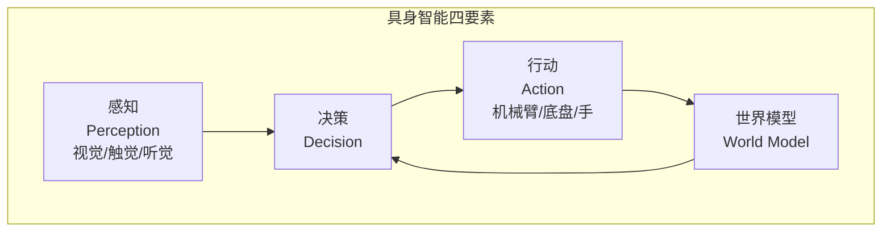
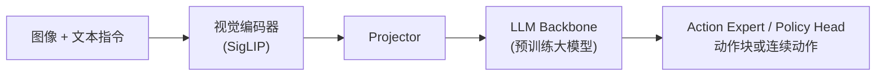
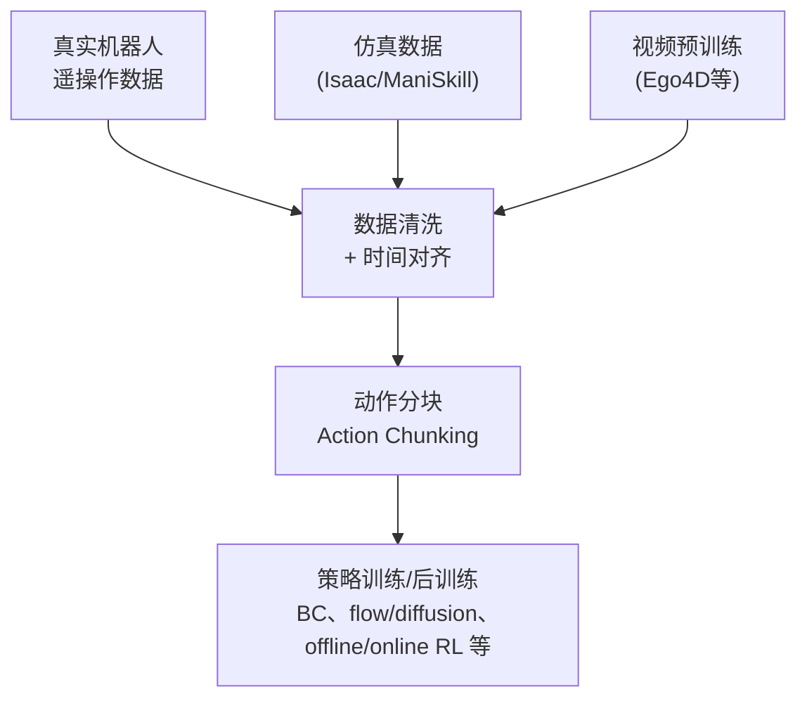
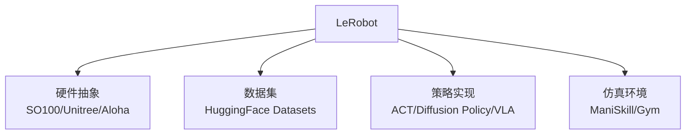
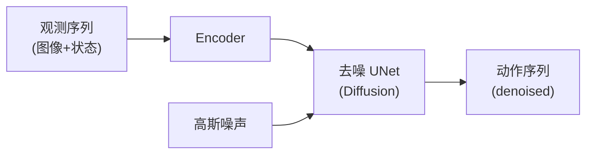
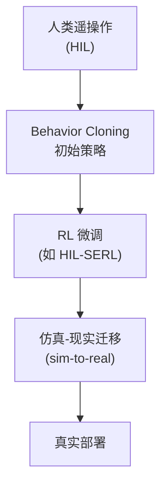

# 第 26 章 世界模型与具身智能 ⭐⭐⭐⭐

> [!abstract] 本章导航
> **定位**：连接多模态模型与物理环境，建立世界模型、VLA 和机器人学习全景。
>
> **先修**：[[11_深度学习与PyTorch]]、[[21_多模态大模型]]。
>
> **学习目标**：
> - 解释世界模型、VLA、模仿学习和机器人策略的关系。
> - 设计数据采集、训练、仿真和控制闭环。
> - 评估 sim-to-real、安全和硬件约束。
>
> **建议路径**：具身智能全景 → VLA 模型（Vision-Language-Action） → LeRobot 框架 → … → 机器人基准测试。先完成主线，再按需要阅读进阶内容。
>
> **配套代码**：`code/ch26_world_models/`。

> [!info] 阅读提示
> **截至 2026-07-31**：Physical AI / 具身智能是活跃方向。公开代表包括 Google DeepMind
> Genie 3、NVIDIA Cosmos 3、Isaac GR00T N1.7、π0.5，以及 Hugging Face LeRobot 生态。
> 产品、论文、开放权重与本仓库教学代码是不同层级，不能相互替代。

"Physical AI"（物理 AI）通常指面向真实或仿真物理环境的感知、推理、控制与学习系统。
本章介绍世界模型、VLA、LeRobot 和机器人学习范式，并持续区分研究原型、开放实现和可部署系统。

## 26.1 具身智能全景



| 层级 | 任务 | 代表模型 |
|------|------|---------|
| **L0 感知** | 物体检测/分割/姿态 | DINO, SAM |
| **L1 行动** | 简单动作输出 | RT-1, RT-2 |
| **L2 VLA** | 视觉-语言条件的动作策略 | π0.5, GR00T N1.7, SmolVLA |
| **L3 世界模型** | 学习环境动态/生成未来状态 | Genie 3, Cosmos 3 |
| **L4 通用具身** | 跨任务泛化 | 待突破 |

## 26.2 VLA 模型（Vision-Language-Action）

VLA 是具身策略的一类重要路线：用视觉、语言和机器人状态共同条件化动作预测。动作可以是离散
token，也可以由连续回归、扩散或 flow matching action expert 生成；“把动作放进 LLM 词表”
并不是所有 VLA 的统一定义。

### 26.2.1 Pi0 / Pi0.5 (Physical Intelligence)



**Pi0 核心创新**: 流匹配 (Flow Matching) 而非传统回归，输出动作分布。

### 26.2.2 Isaac GR00T N1.7（NVIDIA）

- 当前公开仓库主线是 GR00T N1.7；旧 N1.5/N1.6 应作为历史版本标注。
- 官方仓库说明 N1.7 使用 Cosmos-Reason2-2B（Qwen3-VL 架构）作为 VLM backbone，并提供
  3B base checkpoint、微调与推理参考代码。
- “权重可获得”不代表目标机器人零样本可用；仍需 embodiment 配置、数据、评估与安全控制。

### 26.2.3 SmolVLA (HuggingFace)

- 官方 LeRobot 文档中的 `smolvla_base` 是 450M base model，输出连续动作并使用 flow matching。
- “轻量”不等于任意消费级设备即插即用；训练/推理资源取决于相机数、分辨率、batch、动作维度
  和目标平台，按当前模型卡与硬件指南核对。

### 26.2.4 VLA 训练数据流



## 26.3 LeRobot 框架

LeRobot 是 Hugging Face 维护的开源机器人学习框架与数据生态之一。它提供硬件、数据集、策略、
训练和评估工具，但“事实标准”需要采用率与组织场景证据，教程不作此断言。

### 26.3.1 LeRobot 核心组件



### 26.3.2 硬件与版本边界

LeRobot 支持的机器人、相机和策略会随版本变化，应以当前
[官方文档](https://huggingface.co/docs/lerobot/index)的硬件/策略目录为准。采购前还需核对
完整 BOM、地区价格、关税、售后、安全急停与标定工具，不能把历史裸机价格当作总成本。

### 26.3.3 LeRobot 训练示例

```bash
# 当前 LeRobot CLI 形状；版本、数据集和设备参数以官方文档为准
lerobot-train \
  --policy.type=act \
  --dataset.repo_id=<org>/<dataset> \
  --output_dir=outputs/train/<run_name> \
  --policy.device=cuda
```

## 26.4 模仿学习范式

### 26.4.1 主流算法对比

| 算法 | 原理 | 代表 | 数据效率 |
|------|------|------|---------|
| **BC (Behavior Cloning)** | 监督学习 | 最基础 | 低 |
| **ACT (Action Chunking Transformer)** | Transformer + 时间集成 | Aloha 团队 | 中 |
| **Diffusion Policy** | 扩散模型生成动作 | Stanford | 高 |
| **VQ-BeT** | 矢量量化 + Behavior Transformer | Toyota | 高 |
| **Multitask DiT** | 多任务 DiT | Google DeepMind | 极高 |

### 26.4.2 Diffusion Policy 详解



**优势**: 多模态动作分布建模、不确定性表达、平滑动作生成。

## 26.5 强化学习在机器人

| 方法 | 思想 | 代表 |
|------|------|------|
| **HIL-SERL** | 人类示范 + RL 微调 | Stanford |
| **TD-MPC 系列** | 学习潜在动态并做模型预测控制 | 研究路线 |
| **QC-FQL** | Q-加权的离线/在线策略学习路线 | 以原论文设置为准 |
| **SAC-X** | 自适应多任务 RL | DeepMind |



## 26.6 机器人基准测试

| 基准 | 任务 | 难度 |
|------|------|------|
| **LIBERO** | 多任务/持续学习的仿真操作套件 | 固定版本、suite、episode 数与 seed |
| **Meta-World** | 多任务机器人操作环境 | 固定任务集合和成功率口径 |
| **RLBench** | CoppeliaSim 上的多任务操作 benchmark | 不是“100 个真机任务” |
| **CALVIN** | 长视域语言条件操作 | 报告官方链式任务协议 |
| **ManiSkill** | 仿真操作与可复现实验环境 | 锁定主版本、资产和渲染后端 |
| **Open X-Embodiment** | 跨 embodiment 数据集合 | 数据源，不是单一在线 benchmark |

## 🧭 本章小结

> **章节小结**：VLA 可用离散 token、连续回归、diffusion 或 flow matching 生成动作；LeRobot
> 是值得评估的开源工具链之一；BC、Diffusion Policy、action chunking、RL 和 world model
> 解决不同问题。Sim-to-Real 需要域随机化之外的系统辨识、校准、观测/动作延迟建模、安全限制
> 和真机评估。采购价格或教学 loss 不能替代真实任务成功率。

## ✅ 自测与练习

先合上正文，再回答以下问题；无法说明证据或边界时，回到对应小节复习。

1. 你能否解释世界模型、VLA、模仿学习和机器人策略的关系？
2. 你能否设计数据采集、训练、仿真和控制闭环？
3. 你能否评估 sim-to-real、安全和硬件约束？

## 🧪 配套代码与验收

> 本章有 10 个 GPU tier 示例。默认 runner 会传 `--mock`：涉及受限权重或外部模型的脚本应
> `[SKIP]`，小型 PyTorch/NumPy 示例可用于检查张量形状和训练循环。教学 loss 下降不能证明
> 官方 VLA、真实机器人策略或物理世界模型已经训练成功。

### 26.9.1 文件 × 能力边界速查表

| # | 文件 | 默认验收 | 能证明什么 | 不能证明什么 |
|---|------|---------|-----------|------------|
| 01 | `genie3_world_model.py` | mock 下 `[SKIP]` | 真实路径的本地模型/GPU 前置检查 | Genie 官方模型或视频世界模型能力 |
| 02 | `cosmos_physics.py` | mock 下 `[SKIP]` | Cosmos 配置访问条件与独立 toy simulator | 权重推理、物理正确性或生产吞吐 |
| 03 | `pi0_vla_flow_matching.py` | 小型 PyTorch | flow-matching 教学 loss/shape | Pi0 官方架构、数据或机器人效果 |
| 04 | `groot_n15_vla.py`（历史文件名） | 小型 PyTorch | action-expert 接口思想 | GR00T N1.5/N1.7 权重、官方架构或 Isaac 环境 |
| 05 | `lerobot_act.py` | 教学模型/可选导入 | ACT 风格接口和本地训练循环 | LeRobot CLI/真实数据的完整训练 |
| 06 | `diffusion_policy.py` | 小型 PyTorch | 一维 DDPM/DDIM 教学流程 | 真实 Diffusion Policy benchmark |
| 07 | `hil_serl.py` | 小型 PyTorch | Q-loss 与人工介入流程示意 | HIL-SERL 系统复现 |
| 08 | `action_chunking.py` | 小型 PyTorch | chunked-action 张量与损失 | ACT 论文结果或硬件控制稳定性 |
| 09 | `world_model_rollout.py` | 小型 PyTorch | 合成 dynamics/rollout 数据流 | 真实环境长期预测准确率 |
| 10 | `embodied_data_pipeline.py` | 简化本地 schema | episode/frame 数据组织 | LeRobot 数据集上传、下载或兼容认证 |

### 26.9.2 默认验收与条件性真跑

```bash
cd code

# 默认：外部模型路径跳过，本地教学实现运行
python scripts/run_all_examples.py --tier gpu --chapter ch26

# 仅在隔离的兼容 GPU 主机上显式启用；可能下载权重/访问外部服务
python scripts/run_all_examples.py --tier gpu --chapter ch26 --real-gpu
```

真实路径启用前需逐脚本核对官方仓库/模型卡、访问权限、许可证、显存、CUDA 版本、下载目录和
输出清理策略。不能用“某个显存档一定可跑”代替目标形状的峰值显存测量。

### 26.9.3 章节需求

| 小节 | 默认可学习内容 | 真实验收还需要 |
|------|---------------|---------------|
| VLA / action expert | shape、flow matching、action chunking | 官方实现、受许可数据、目标机器人/仿真器 |
| LeRobot / ACT | 接口与简化训练循环 | 锁定版本的 LeRobot、数据集与设备配置 |
| Diffusion Policy | 小型去噪训练流程 | 论文实现、真实轨迹和任务 benchmark |
| 世界模型 / rollout | 合成动态模型数据流 | 官方权重、环境评估和长期误差分析 |
| HIL / RL | 人工介入与 Q-loss 概念 | 真实控制环、安全边界和恢复机制 |

## 🎯 面试题精讲

### 高频题1: 什么是 VLA 模型？与 VLM 区别？

**答案**：VLM 主要建立视觉—语言表征并输出语言/结构化语义；VLA 进一步把机器人状态与动作
纳入策略。动作既可离散成 token，也可由连续 action head、diffusion 或 flow matching 产生。
代表性公开路线包括 RT-2、π0/π0.5、GR00T N1.7 与 SmolVLA。

### 高频题2: Diffusion Policy 为什么比 BC 更好？

**答案**:
1. **多模态分布**: 同一观测下多个合理动作（抓取点不唯一），扩散模型能表达
2. **动作平滑**: 扩散过程的去噪隐式正则化
3. **不确定性**: 多个采样可探索不同策略

### 高频题3: Sim-to-Real 迁移的核心挑战？

**答案**:
1. **视觉差异**: 仿真器渲染与真机图像不同 (sim-to-real gap)
2. **物理差异**: 摩擦/惯性等参数不准
3. **域随机化 (Domain Randomization)**: 训练时随机化仿真参数提升迁移

### 高频题4: 为什么 LeRobot 是常见候选？

**答案**:
1. **生态**：与 Hugging Face Hub、数据集和模型发布流程衔接
2. **端到端工具**：覆盖采集、数据、策略、训练、评估与部分硬件
3. **策略目录**：包含 ACT、Diffusion、SmolVLA、π0 系列等，具体以当前文档为准
4. **数据格式**：当前文档已进入 LeRobotDataset v3；项目必须锁定版本，不能混用旧导入路径

### 高频题5: 什么是世界模型？为什么重要？

**答案**: 世界模型是智能体对物理世界的内部预测模型，能"想象"动作后果再决策。重要性：
1. 减少真实环境试错成本
2. 规划与推演 (planning)
3. 数据高效学习

代表性路线包括 Genie 3 与 Cosmos 3；是否称为“世界模型”应遵循项目官方定义，不能把所有
视频生成模型自动归入同一类别。

### 高频题6: 模仿学习的数据瓶颈如何解决？

**答案**:
1. **仿真数据**: Isaac/ManiSkill 大规模生成
2. **视频预训练**: 利用互联网视频 (Ego4D)
3. **DAgger**: 让策略自己 rollout 收集新数据
4. **跨机器人迁移**: OpenX-Embodiment 多机器人数据

### 高频题7: HIL-SERL 如何结合 IL 和 RL？

**答案**: Human-in-the-Loop SERL (Sample-Efficient RL):
1. 初始 BC 训练
2. 人类遥操作 + 自主 rollout 切换
3. 失败时人类接管 (干预数据)
4. 用干预数据微调策略 + RL 奖励

### 高频题8: 2026 年值得跟踪的具身研究方向是什么？

**答案**:
1. **VLA 通用化**: 跨任务、跨机器人的通用模型
2. **视频预训练**: 大规模互联网视频的自监督学习
3. **世界模型 + RL**: 用世界模型作为 RL 模拟器
4. **人类示范数据**: 大规模遥操作数据集 (如 AgiBot, Open X-Embodiment)

## 📋 本章速查表

| 概念 | 关键点 |
|------|--------|
| **VLA** | 联合视觉、语言与动作条件的策略模型家族 |
| **Pi0** | 论文/官方实现中的 flow matching 动作生成路线 |
| **LeRobot** | Hugging Face 维护的开源机器人学习工具与数据生态之一 |
| **Diffusion Policy** | 扩散模型生成动作 |
| **世界模型** | 对环境动态或未来观测进行建模；不等同于可靠的物理仿真器 |
| **HIL-SERL** | 人类干预数据与 RL 结合的研究路线 |
| **Domain Randomization** | Sim-to-Real 关键技术 |
| **Action Chunking** | 预测未来 K 步动作 |
| **配套代码** | `01/02` 是需权重、访问权限和 GPU 的条件路径；`03-10` 是小型教学实现/接口示意，不冒充 Pi0、GR00T、Cosmos 或 LeRobot 的完整训练与部署。 |

## 🔗 相关章节

- [[12_Transformer与大模型原理]] — Transformer 是多种 VLA/ACT 的组件之一，但动作头和训练目标并不都等价于语言 token 建模
- [[21_多模态大模型]] — VLA 借用视觉-语言表征；机器人状态、连续控制、闭环安全与时序评估需要额外设计
- [[15_Agent智能体开发]] — 具身智能体是 Agent 在物理世界中的具象化，"感知-决策-行动"循环与 Agent 的 ReAct/Planning 范式一一对应
- [[19_分布式训练系统]] — 大模型/大数据训练可能需要分布式策略；小策略或 PEFT 是否需要多卡取决于容量预算
- [[11_深度学习与PyTorch]] — LeRobot 训练循环、数据加载、Diffusion Policy 去噪 UNet 等核心代码均基于 PyTorch 实现，是机器人学习的工程基础

## 📖 一手参考资料

> 核验日期：2026-08-04。版本、价格、法规、模型能力和 benchmark 以链接页面当前状态为准。

- [[docs/AUTHORITATIVE_SOURCES|章节权威来源索引]]：按章节维护的官方文档、标准、原论文和官方仓库。
