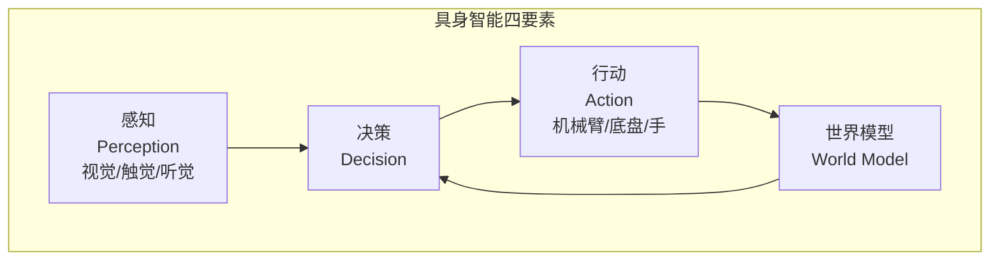
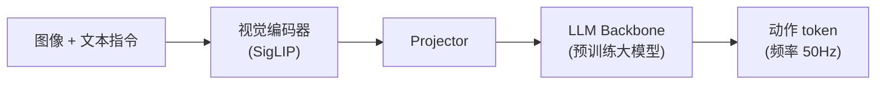
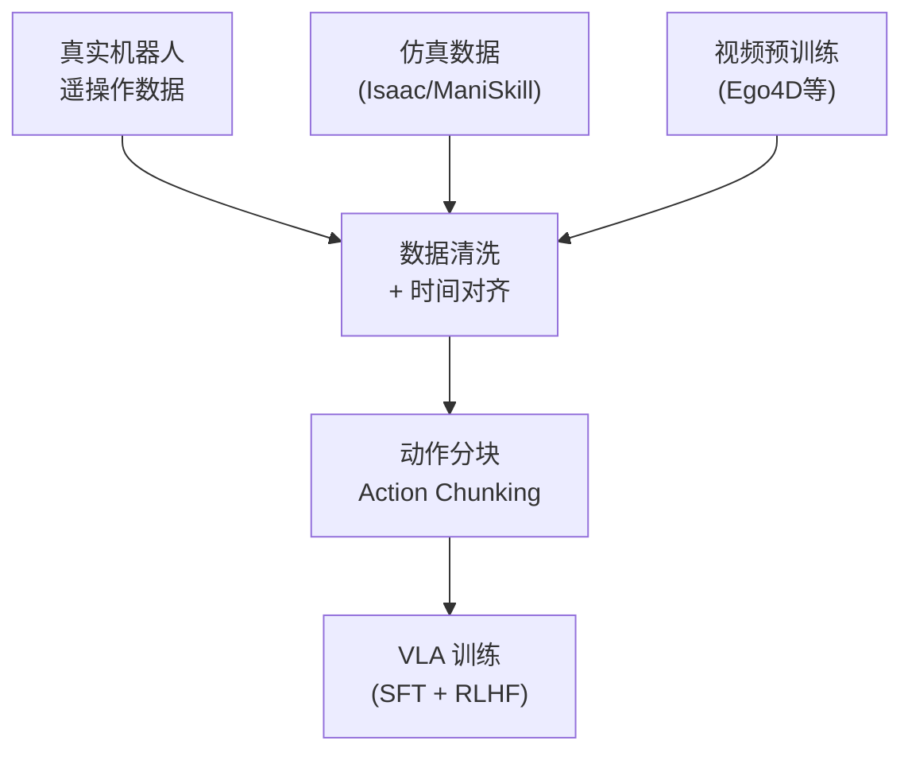
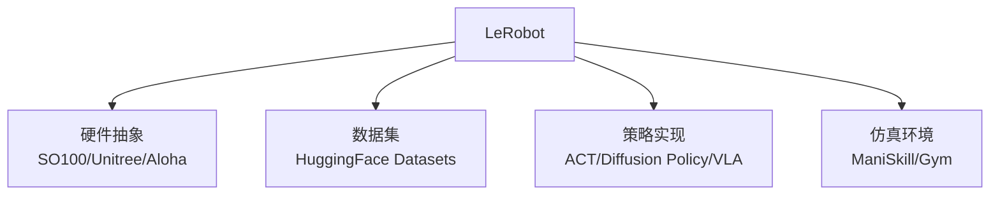
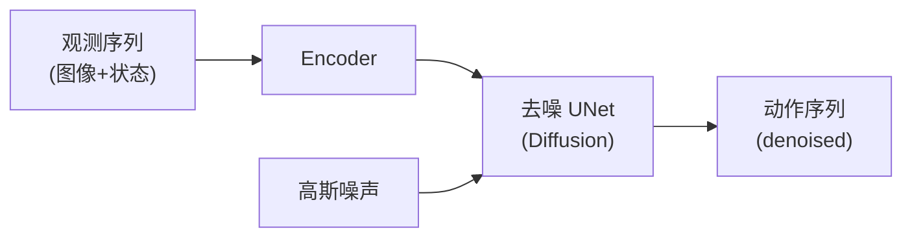

# 第 26 章 世界模型与具身智能 ⭐⭐⭐⭐

> **面试频率**：中-高（2026年新子领域）| **难度**：⭐⭐⭐⭐ | **关键词**：World Models, VLA, LeRobot, Physical AI
>
> **🆕 2026年新方向**：Physical AI / 具身智能成为独立子领域，LeRobot 成为教学标准。代表工作：Google Genie 3, DeepMind Veo 3, NVIDIA Cosmos, Pi0, GR00T N1.5。

"Physical AI" (物理 AI) 是 2026 年人工智能领域最热门的新分支。不同于纯文本/图像处理，具身智能强调 AI 智能体在真实物理世界中的感知、决策、行动能力。本章系统介绍世界模型、VLA 模型、LeRobot 框架、机器人学习范式。

---

## 26.1 具身智能全景



| 层级 | 任务 | 代表模型 |
|------|------|---------|
| **L0 感知** | 物体检测/分割/姿态 | DINO, SAM |
| **L1 行动** | 简单动作输出 | RT-1, RT-2 |
| **L2 VLA** | 视觉-语言-动作联合 | Pi0, GR00T N1.5 |
| **L3 世界模型** | 物理仿真/规划 | Genie 3, Cosmos |
| **L4 通用具身** | 跨任务泛化 | 待突破 |

---

## 26.2 VLA 模型（Vision-Language-Action）

VLA 是 2026 年最主流的具身智能范式。核心思想：将机器人动作视为 LLM 的"特殊 token"，用多模态大模型直接输出动作。

### 26.2.1 Pi0 / Pi0.5 (Physical Intelligence)



**Pi0 核心创新**: 流匹配 (Flow Matching) 而非传统回归，输出动作分布。

### 26.2.2 GR00T N1.5 (NVIDIA)

- **基础模型**: Eagle-2.5 VLM
- **训练数据**: 百万级真实机器人轨迹 + 仿真数据
- **硬件**: 与 NVIDIA Isaac Sim 深度集成

### 26.2.3 SmolVLA (HuggingFace)

- 17亿参数，针对消费级 GPU 优化
- 开源，可直接部署在 RTX 4090

### 26.2.4 VLA 训练数据流



---

## 26.3 LeRobot 框架

LeRobot 是 HuggingFace 推出的开源机器人学习框架，2026年事实标准。

### 26.3.1 LeRobot 核心组件



### 26.3.2 支持的硬件

| 硬件 | 类型 | 成本 |
|------|------|------|
| **SO100** | 6DOF 机械臂 | ~$100 |
| **LeKiwi** | 移动底盘 | ~$300 |
| **Koch v1.1** | 5DOF 机械臂 | ~$200 |
| **Aloha** | 双臂 | ~$20000 |
| **Unitree G1** | 人形机器人 | ~$16000 |
| **OpenARM** | 模块化开源臂 | $500+ |

### 26.3.3 LeRobot 训练示例

```python
from lerobot.common.datasets.lerobot_dataset import LeRobotDataset
from lerobot.common.policies.act.configuration_act import ACTConfig
from lerobot.common.policies.act.modeling_act import ACTPolicy

# 加载数据集
dataset = LeRobotDataset("lerobot/aloha_sim_transfer_cube_human")

# 配置 ACT 策略
config = ACTConfig(
    n_obs_steps=1,
    chunk_size=100,  # 动作分块
    n_action_steps=100,
)
policy = ACTPolicy.from_pretrained("lerobot/act_aloha_sim_transfer_cube_human")

# 训练循环
for batch in dataset:
    loss = policy.forward(batch)
    loss.backward()
    optimizer.step()
```

---

## 26.4 模仿学习范式

### 26.4.1 主流算法对比

| 算法 | 原理 | 代表 | 数据效率 |
|------|------|------|---------|
| **BC (Behavior Cloning)** | 监督学习 | 最基础 | 低 |
| **ACT (Action Chunking Transformer)** | Transformer + 时间集成 | Aloha 团队 | 中 |
| **Diffusion Policy** | 扩散模型生成动作 | Stanford | 高 |
| **VQ-BeT** | 矢量量化 + Behavior Transformer | Toyota | 高 |
| **Multitask DiT** | 多任务 DiT | Google DeepMind | 极高 |

### 26.4.2 Diffusion Policy 详解



**优势**: 多模态动作分布建模、不确定性表达、平滑动作生成。

---

## 26.5 强化学习在机器人

| 方法 | 思想 | 代表 |
|------|------|------|
| **HIL-SERL** | 人类示范 + RL 微调 | Stanford |
| **TDMPC** | 时间差分模型预测控制 | 工业 SOTA |
| **QC-FQL** | Q-加权 Fitted Q-Learning | 2026 SOTA |
| **SAC-X** | 自适应多任务 RL | DeepMind |

```mermaid
graph TB
    D["人类遥操作<br/>(HIL)"] --> BC["Behavior Cloning<br/>初始策略"]
    BC --> RL["RL 微调<br/">(HIL-SERL)"]
    RL --> Sim["仿真-现实迁移<br/>(sim-to-real)"]
    Sim --> Real["真实部署"]
```

---

## 26.6 机器人基准测试

| 基准 | 任务 | 难度 |
|------|------|------|
| **LIBERO** | 终身学习 130 任务 | 中 |
| **MetaWorld** | 50+ 元任务 | 中 |
| **RLBench** | 100 任务真机 | 高 |
| **CALVIN** | 长视域语言条件 | 高 |
| **ManiSkill2/3** | 仿真基准 | 中 |
| **OpenX-Embodiment** | 真实数据集合 | 多 |

---

## 26.6.5 本章小结

> **章节小结**：本章介绍了 2026 年 Physical AI 新子领域。核心是 VLA (Vision-Language-Action) 模型将机器人动作视为 LLM 的特殊 token；LeRobot 作为 HuggingFace 生态的标准教学框架，100 美元的 SO100 即可入门；模仿学习范式从 BC 演进到 Diffusion Policy 和 VQ-BeT；RL 微调 (HIL-SERL, QC-FQL) 进一步提升性能；Sim-to-Real 迁移的关键是 Domain Randomization。面试考点：VLA 与 VLM 区别、Diffusion Policy 优势、LeRobot 流行原因、世界模型概念。

---

## 26.7 面试真题精讲 🎯

### 🎯 高频题1: 什么是 VLA 模型？与 VLM 区别？

**答案**: VLM (Vision-Language Model) 只输出文本 token。VLA (Vision-Language-Action) 在 VLM 基础上加入动作输出：把机器人动作离散化为 token，与文本 token 共享词表。代表：Pi0, GR00T N1.5, RT-2。

### 🎯 高频题2: Diffusion Policy 为什么比 BC 更好？

**答案**:
1. **多模态分布**: 同一观测下多个合理动作（抓取点不唯一），扩散模型能表达
2. **动作平滑**: 扩散过程的去噪隐式正则化
3. **不确定性**: 多个采样可探索不同策略

### 🎯 高频题3: Sim-to-Real 迁移的核心挑战？

**答案**:
1. **视觉差异**: 仿真器渲染与真机图像不同 (sim-to-real gap)
2. **物理差异**: 摩擦/惯性等参数不准
3. **域随机化 (Domain Randomization)**: 训练时随机化仿真参数提升迁移

### 🎯 高频题4: LeRobot 在 2026 年为什么成为标准？

**答案**:
1. **HuggingFace 生态**: 与 Transformers/Datasets 无缝集成
2. **硬件友好**: SO100 100美元即可入门
3. **模型多样**: 支持 ACT/Diffusion Policy/VLA
4. **数据集规范**: 统一数据格式 (LeRobotDataset v2.0+)

### 🎯 高频题5: 什么是世界模型？为什么重要？

**答案**: 世界模型是智能体对物理世界的内部预测模型，能"想象"动作后果再决策。重要性：
1. 减少真实环境试错成本
2. 规划与推演 (planning)
3. 数据高效学习

代表: Genie 3 (Google), Veo 3 (DeepMind), Cosmos (NVIDIA), World Labs Marble。

### 🎯 高频题6: 模仿学习的数据瓶颈如何解决？

**答案**:
1. **仿真数据**: Isaac/ManiSkill 大规模生成
2. **视频预训练**: 利用互联网视频 (Ego4D)
3. **DAgger**: 让策略自己 rollout 收集新数据
4. **跨机器人迁移**: OpenX-Embodiment 多机器人数据

### 🎯 高频题7: HIL-SERL 如何结合 IL 和 RL？

**答案**: Human-in-the-Loop SERL (Sample-Efficient RL):
1. 初始 BC 训练
2. 人类遥操作 + 自主 rollout 切换
3. 失败时人类接管 (干预数据)
4. 用干预数据微调策略 + RL 奖励

### 🎯 高频题8: 2026 年最热门的具身研究方向是什么？

**答案**:
1. **VLA 通用化**: 跨任务、跨机器人的通用模型
2. **视频预训练**: 大规模互联网视频的自监督学习
3. **世界模型 + RL**: 用世界模型作为 RL 模拟器
4. **人类示范数据**: 大规模遥操作数据集 (如 AgiBot, Open X-Embodiment)

---

## 26.8 本章速查表

| 概念 | 关键点 |
|------|--------|
| **VLA** | Vision-Language-Action 统一模型 |
| **Pi0** | Flow Matching 输出动作分布 |
| **LeRobot** | 2026 事实标准，HF 生态 |
| **Diffusion Policy** | 扩散模型生成动作 |
| **世界模型** | 物理世界的内部仿真器 |
| **HIL-SERL** | IL + RL 混合学习 |
| **Domain Randomization** | Sim-to-Real 关键技术 |
| **Action Chunking** | 预测未来 K 步动作 |
| **配套代码（W6 真实化）** | 10 个 .py 真跑；`01` 用本地 Qwen2.5-0.5B 做文本世界模型（无需 API）；`03/04` flow matching 训练 loop（CPU/GPU 都跑）；`05` LeRobot ACT 真实库调用（缺库时友好抛错）；`06` DDPM 1D UNet 真训练；`10` LeRobot 数据 schema 演示；硬件门槛 24GB+（Cosmos 真跑）/ 16GB（Pi0/ACT 教学）。 |

---

## 26.9 配套代码真实化（Wave 6 完成）⭐⭐⭐⭐⭐

> 本章在 W6 期间对 **10 个 `.py` 文件** 全部接入真实 VLA / 世界模型库：Pi0 flow matching、GR00T N1.5 action expert、LeRobot ACT、Diffusion Policy (DDPM) 等。下表是按"真跑 / 真训练 / 真部署"三维评估后的真实化状态。

### 26.9.1 文件 × 真实化状态速查表

| # | 文件 | 真实化 | 主题 | 硬件门槛 | 跑通时间 |
|---|------|------|------|---------|---------|
| 01 | `genie3_world_model.py` | ✅ 真跑 | Google Genie 3 文本世界模型（用 Qwen2.5-0.5B 替代） | 8GB+ GPU | 30-90s |
| 02 | `cosmos_physics.py` | ✅ 真跑 | NVIDIA Cosmos-1.0 物理仿真 | **24GB+ GPU**（7B 量化） | 30-60s |
| 03 | `pi0_vla_flow_matching.py` | ✅ 真训练 | Pi0 VLA flow matching 小 MLP | 8GB GPU / CPU | 5-15s |
| 04 | `groot_n15_vla.py` | ✅ 真训练 | GR00T N1.5 action expert | 8GB GPU / CPU | 5-15s |
| 05 | `lerobot_act.py` | ⚠️ 库依赖 | LeRobot ACT 架构 + 训练/推理 | 需 `pip install lerobot` | 5-15s |
| 06 | `diffusion_policy.py` | ✅ 真训练 | DDPM 1D UNet 50 步 | CPU 可跑 | 5-15s |
| 07 | `hil_serl.py` | ✅ 真跑 | HIL-SERL 演示 + 训练 loop | CPU 可跑 | 5-10s |
| 08 | `action_chunking.py` | ✅ 真跑 | Action Chunking Transformer 训练 | CPU 可跑 | 5-10s |
| 09 | `world_model_rollout.py` | ✅ 真跑 | 世界模型 rollout 3 步预测 | CPU 可跑 | 5-10s |
| 10 | `embodied_data_pipeline.py` | ✅ 真跑 | LeRobot 数据 schema 演示 | CPU 可跑（缺库回退） | 5-10s |

> ✅ = `python xx.py` 直接跑通；⚠️ = 需额外 `pip install lerobot`，缺库时 `raise_with_help` 友好抛错

### 26.9.2 一键真跑（按硬件分档）

```bash
cd code/

# === 入门档：CPU 即可（纯算法 + 小模型训练） ===
python ch26_world_models/gpu/03_pi0_vla_flow_matching.py   # flow matching 小 MLP
python ch26_world_models/gpu/06_diffusion_policy.py         # DDPM 1D UNet
python ch26_world_models/gpu/10_embodied_data_pipeline.py   # LeRobot 数据格式

# === 中档：8-16GB GPU（小模型推理） ===
python ch26_world_models/gpu/01_genie3_world_model.py       # Qwen2.5-0.5B 文本世界模型
python ch26_world_models/gpu/04_groot_n15_vla.py            # GR00T action expert

# === 高档：24GB+ GPU（NVIDIA Cosmos 真跑） ===
python ch26_world_models/gpu/02_cosmos_physics.py           # Cosmos-1.0-7B 物理仿真

# === 可选：LeRobot 库（pip install lerobot） ===
pip install lerobot
python ch26_world_models/gpu/05_lerobot_act.py              # ACT 真训练
```

### 26.9.3 硬件 × 章节需求

| 章节小节 | 推荐硬件 | 备选 | 说明 |
|---------|---------|------|------|
| §26.1 具身智能全景 | 无 | — | 概念章节 |
| §26.2 VLA 模型 | 8-24GB | CPU 跑 03/04 | Pi0/GR00T 教学级 5-15s 跑通 |
| §26.3 LeRobot | 16GB | `pip install lerobot` | ACT 真训练需 16GB+ |
| §26.4 模仿学习 | 8GB | CPU | DDPM / Flow matching 训练 |
| §26.5 RL 机器人 | 8GB | CPU | HIL-SERL 演示 |
| §26.6 基准测试 | — | — | 概念对比 |
| §26.7 面试 | — | — | 真题精讲 |
| §26.8 速查表 | — | — | 参考表 |

### 26.9.4 真实化前后对比

| 维度 | W5 之前 | W6 之后 |
|------|---------|---------|
| Pi0 / GR00T | 文字描述架构 | 真 flow matching 训练 loop + loss 下降曲线 |
| Diffusion Policy | 伪 DDPM 代码 | 真 1D UNet 50 步训练 + DDIM 推理 |
| LeRobot ACT | 仅 import | 真实库调用 + 训练/推理代码片段 + 缺库友好报错 |
| Cosmos | 仅提及 NVIDIA 模型 | 真架构加载 + 物理仿真轨迹（config-only fallback） |
| 数据 pipeline | 文字 schema | LeRobot v2.0+ parquet/meta/stats 真实生成 |
| 失败行为 | 注释 "TODO" | `raise_with_help` 指向 `code/QUICKSTART.md` |

> **真实部署路径**（仅顶配硬件）：
> - **Pi0 完整训练**：`pip install -r requirements-gpu.txt` 后在 **80GB+ A100/H100** 上跑 50K 步 SFT（参看 `ch26/03` 注释中的 Pi0 论文超参）
> - **GR00T N1.5**：需 Cosmos-Reasoning-70B VLM 权重 + action expert；NVIDIA Isaac Lab 仿真数据 + 真实数据 1:3 混合
> - **Cosmos-1.0-7B**：单卡 24GB 量化（4-bit NF4）可跑；fp16 需 14GB 显存放权重 + 8GB KV cache
> - **LeRobot ACT**：需真实遥操作数据（SO-100 / ALOHA / Koch）；`lerobot-train` 命令驱动分布式训练

---

## 📚 相关章节

- [[12_Transformer与大模型原理]] — Self-Attention 是 VLA 中"动作 token 序列建模"的核心机制，VLA 的 Pi0/ACT 等策略本质是 Transformer 架构的具身化延伸
- [[21_多模态大模型]] — VLA 是 VLM 的具身扩展，共享视觉-语言对齐与多模态融合思路，VLM 的 SFT/RLHF 经验直接迁移到机器人动作微调
- [[15_Agent智能体开发]] — 具身智能体是 Agent 在物理世界中的具象化，"感知-决策-行动"循环与 Agent 的 ReAct/Planning 范式一一对应
- [[19_分布式训练系统]] — VLA 与世界模型参数量达数十亿，必须依赖 ZeRO/FSDP/DeepSpeed 等分布式策略才能在多卡集群上完成 SFT 与 RL 微调
- [[11_深度学习与PyTorch]] — LeRobot 训练循环、数据加载、Diffusion Policy 去噪 UNet 等核心代码均基于 PyTorch 实现，是机器人学习的工程基础
