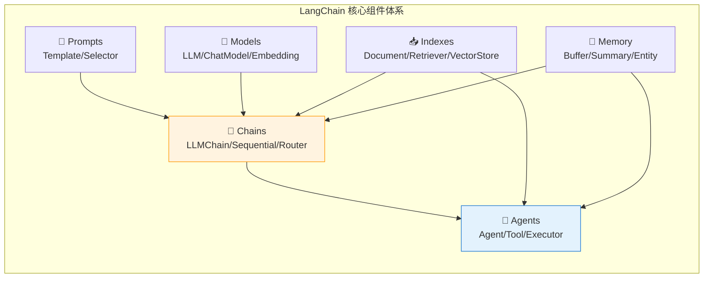
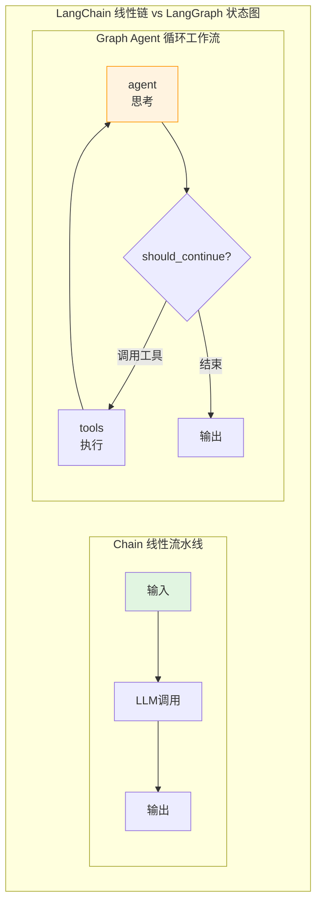
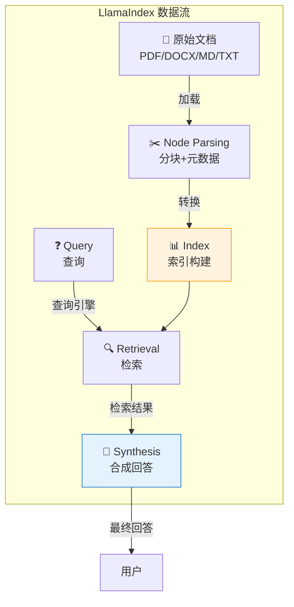
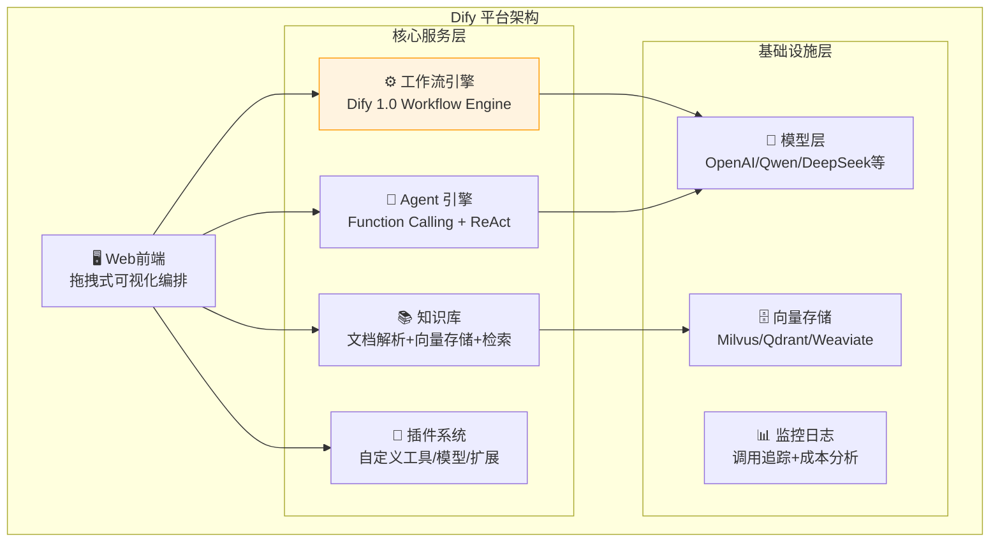
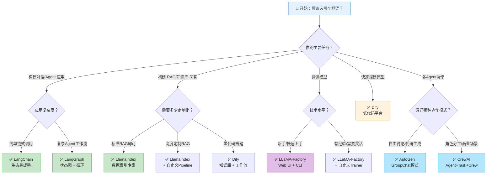

# 第 27 章 LLM 框架与平台选型 ⭐⭐⭐⭐
> [!abstract] 本章导航
> **定位**：第四部分 Agent 与工程框架中的第 27 章；围绕“LLM 框架与平台选型”建立单一、可追踪的知识主线。
>
> **先修**：[[26_Agent记忆与个性化|第 26 章 Agent 记忆与个性化]]。
>
> **学习目标**：
> - 解释 LangChain 核心 ⭐⭐⭐⭐⭐ 的核心问题、机制与适用边界。
> - 实现或评估 LangGraph 状态图工作流 ⭐⭐⭐⭐⭐ 的最小闭环。
> - 使用可复现证据诊断 LlamaIndex 数据索引与检索 ⭐⭐⭐⭐⭐ 的工程取舍与失败模式。
>
> **建议路径**：LangChain 核心 ⭐⭐⭐⭐⭐ → LangGraph 状态图工作流 ⭐⭐⭐⭐⭐ → LlamaIndex 数据索引与检索 ⭐⭐⭐⭐⭐ → Dify 低代码 Agent 平台 ⭐⭐⭐⭐⭐ → 2026年新框架 ⭐⭐⭐⭐⭐ → 框架选型决策树 ⭐⭐⭐⭐⭐。
>
> **配套代码**：`code/ch27_llm_frameworks/`。

本章先回答“LangChain 核心 ⭐⭐⭐⭐⭐”为什么成立，再沿着机制、实现、评估和边界逐步展开。阅读时先建立因果链，再运行或推演示例，最后用章末自测检查能否脱离原文复述。
## 27.1 LangChain 核心 ⭐⭐⭐⭐⭐

> **版本边界（2026-07）**：本仓库面向 LangChain 1.x。LCEL、`create_agent` 和 LangGraph 是当前路径；
> `LLMChain`、`ConversationChain` 及旧 Memory 类已迁入 `langchain-classic`，下文保留这些内容只用于
> 阅读存量项目和迁移面试题，不能继续从 `langchain` 主命名空间导入。模型示例默认读取
> `OPENAI_MODEL`，未设置时使用当前通用别名 `gpt-5.6`：
>
> ```python
> import os
> OPENAI_MODEL = os.environ.get("OPENAI_MODEL", "gpt-5.6")
> ```
>
> 低成本批处理应根据运行时的当前模型目录和本地评测另选模型，不把历史的 `mini` ID 固化到代码中。

### 27.1.1 LangChain 设计哲学

LangChain 的核心理念是 **"Composability"（可组合性）** —— 将 LLM 应用拆解为可复用的组件，通过链式调用来构建复杂应用。



**LangChain 表达式语言（LCEL）** 是 LangChain 的最新编排范式，使用 `|` 管道操作符连接组件：

```python
# LCEL 风格：声明式链式调用
from langchain_core.prompts import ChatPromptTemplate
from langchain_openai import ChatOpenAI
from langchain_core.output_parsers import StrOutputParser

prompt = ChatPromptTemplate.from_template("讲一个关于{topic}的笑话")
model = ChatOpenAI(model=OPENAI_MODEL)
output_parser = StrOutputParser()

# 管道式组合：prompt | model | parser
chain = prompt | model | output_parser

# 一行调用
result = chain.invoke({"topic": "程序员"})
print(result)
```

### 27.1.2 Chain 概念与类型 ⭐⭐⭐⭐

Chain 是 LangChain 的核心抽象 —— 将多个组件"链接"成一个可执行流程。

#### 27.1.2.1 LLMChain：最基础的链（存量迁移参考）

> LangChain 1.x 新项目优先使用上面的 LCEL；运行这一存量写法需额外安装 `langchain-classic`。

```python
from langchain_classic.chains import LLMChain
from langchain_core.prompts import PromptTemplate
from langchain_openai import ChatOpenAI

llm = ChatOpenAI(model=OPENAI_MODEL)

prompt = PromptTemplate(
    input_variables=["product", "audience"],
    template="为{product}写一段面向{audience}的广告文案，50字以内。"
)

chain = LLMChain(llm=llm, prompt=prompt)
result = chain.invoke({"product": "智能手表", "audience": "运动爱好者"})
print(result["text"])
```

#### 27.1.2.2 SequentialChain：顺序执行链

```python
from langchain_classic.chains import LLMChain, SequentialChain
from langchain_core.prompts import PromptTemplate
from langchain_openai import ChatOpenAI

llm = ChatOpenAI(model=OPENAI_MODEL)

# 第一链：生成大纲
chain1 = LLMChain(
    llm=llm,
    prompt=PromptTemplate(
        input_variables=["topic"],
        template="为关于'{topic}'的博客文章生成一个3点大纲。"
    ),
    output_key="outline"
)

# 第二链：基于大纲写正文
chain2 = LLMChain(
    llm=llm,
    prompt=PromptTemplate(
        input_variables=["outline"],
        template="基于以下大纲，写一篇300字的博客文章：\n\n{outline}"
    ),
    output_key="article"
)

# 串联
overall_chain = SequentialChain(
    chains=[chain1, chain2],
    input_variables=["topic"],
    output_variables=["outline", "article"],
    verbose=True
)

result = overall_chain.invoke({"topic": "大模型应用框架选型"})
print(result["article"])
```

#### 27.1.2.3 RouterChain：条件路由链

RouterChain 根据输入内容动态选择下游处理链：

```python
from langchain_classic.chains import ConversationChain
from langchain_classic.chains.router import MultiPromptChain
from langchain_openai import ChatOpenAI

llm = ChatOpenAI(model=OPENAI_MODEL)

# 定义不同专业的提示词模板
physics_template = """你是一位物理学专家。请专业地回答以下问题：
{input}"""

math_template = """你是一位数学专家。请用严谨的数学语言回答：
{input}"""

coding_template = """你是一位资深程序员。请用代码示例回答问题：
{input}"""

prompt_infos = [
    {"name": "physics", "description": "适合回答物理问题", "prompt_template": physics_template},
    {"name": "math", "description": "适合回答数学问题", "prompt_template": math_template},
    {"name": "coding", "description": "适合回答编程问题", "prompt_template": coding_template},
]

# 自动路由：LLM 根据问题内容选择最合适的专家
router_chain = MultiPromptChain.from_prompts(
    llm=llm,
    prompt_infos=prompt_infos,
    verbose=True
)

# 同一个链，自动路由到不同专家
print(router_chain.invoke("什么是量子纠缠？"))       # → physics
print(router_chain.invoke("如何用Python写快速排序？"))  # → coding
```

#### 27.1.2.4 Chain 类型对比表

| Chain 类型 | 执行模式 | 适用场景 | 数据流 |
|-----------|---------|---------|-------|
| **LLMChain** | 单步 | 单一 LLM 调用 + Prompt | 输入 → Prompt → LLM → 输出 |
| **SequentialChain** | 串行 | 多步骤流水线 | 上一步输出 → 下一步输入 |
| **RouterChain** | 条件分支 | 按内容分流处理 | 输入 → 路由判断 → 选择子链 |
| **RetrievalQA** | 检索+生成 | RAG 问答 | 问题 → 检索 → 上下文+问题 → LLM |
| **ConversationalRetrievalChain** | 对话+检索 | 带历史的 RAG 对话 | 历史+问题 → 检索 → 上下文+历史+问题 → LLM |
| **MapReduceChain** | 并行→聚合 | 长文档处理 | 文档分段 → 并行处理 → 汇总 |

### 27.1.3 Memory 机制深度解析 ⭐⭐⭐⭐

Memory 是对话系统的核心。LangChain 提供了多种 Memory 实现来管理对话上下文。

#### 27.1.3.1 ConversationBufferMemory：完整缓冲记忆

```python
from langchain_classic.chains import ConversationChain
from langchain_classic.memory import ConversationBufferMemory
from langchain_openai import ChatOpenAI

llm = ChatOpenAI(model=OPENAI_MODEL)
memory = ConversationBufferMemory(return_messages=True)

conversation = ConversationChain(
    llm=llm,
    memory=memory,
    verbose=True
)

conversation.predict(input="我叫张三，我今年30岁。")
conversation.predict(input="我的名字是什么？")   # ✓ 正确回答 "张三"
conversation.predict(input="我几岁了？")         # ✓ 正确回答 "30"

# 查看记忆内容
print(memory.load_memory_variables({}))
# {'history': [HumanMessage(...), AIMessage(...), ...]}
```

**Memory 类型对比**：

| Memory 类型 | 存储方式 | Token 消耗 | 遗忘风险 | 适用场景 |
|------------|---------|-----------|---------|---------|
| **ConversationBufferMemory** | 完整存储所有消息 | 线性增长 | 无（但有截断） | 短对话 |
| **ConversationBufferWindowMemory** | 只保留最近 K 轮 | 固定 O(K) | 早期对话丢失 | 中等长度对话 |
| **ConversationSummaryMemory** | LLM 摘要 | 固定（摘要+最近轮次） | 细节可能丢失 | 长对话 |
| **ConversationSummaryBufferMemory** | 摘要+最近 K 轮缓冲 | 可控 | 较少 | 超长对话 |
| **ConversationTokenBufferMemory** | 按 Token 数截断 | 固定上限 | 早期对话丢失 | Token 限制场景 |
| **VectorStoreRetrieverMemory** | 向量检索 | 每次检索固定 | 可能遗漏 | 需要长期记忆 |

#### 27.1.3.2 ConversationSummaryMemory：摘要记忆

```python
from langchain_classic.memory import ConversationSummaryMemory
from langchain_openai import ChatOpenAI

llm = ChatOpenAI(model=OPENAI_MODEL)
memory = ConversationSummaryMemory(
    llm=llm,
    return_messages=True,
    max_token_limit=500  # 摘要的最大 Token 数
)

conversation = ConversationChain(llm=llm, memory=memory)

# 多轮对话后，早期对话被压缩为摘要
conversation.predict(input="我叫王五，在北京工作。")
conversation.predict(input="我是一名软件工程师。")
conversation.predict(input="我的团队有10个人。")
conversation.predict(input="我在做什么工作？")  # ✓ 从摘要或历史中获取

print(memory.load_memory_variables({})["history"])
# System: 用户叫王五，在北京工作，是一名软件工程师，团队有10人。
# Human: 我在做什么工作？
# AI: 你是一名软件工程师。
```

#### 27.1.3.3 自定义 Memory 实战：带 Token 管理的记忆

```python
from langchain_classic.memory import ConversationSummaryBufferMemory
from langchain_openai import ChatOpenAI
from langchain_classic.chains import ConversationChain

llm = ChatOpenAI(model=OPENAI_MODEL)

# SummaryBufferMemory = 摘要 + 最近 K 轮原始对话
memory = ConversationSummaryBufferMemory(
    llm=llm,
    max_token_limit=2000,  # 总 Token 预算
    return_messages=True,
)

conversation = ConversationChain(
    llm=llm,
    memory=memory,
    verbose=False
)

# 模拟长对话
topics = [
    "我想了解大模型应用框架。",
    "请详细介绍 LangChain。",
    "LangChain 的 Memory 有哪些类型？",
    "Memory 的 Token 消耗如何优化？",
    "除了 LangChain，还有哪些框架？",
    "LangGraph 和 LangChain 有什么关系？",
    "请对比一下所有框架的优劣。",
]

for topic in topics:
    response = conversation.predict(input=topic)
    mem = memory.load_memory_variables({})
    history = mem.get("history", "")
    print(f"问题: {topic[:30]}... | 记忆长度: {len(str(history))} 字符")
```

### 27.1.4 Tool 定义与使用 ⭐⭐⭐⭐

Tool（工具）是 Agent 与外部世界交互的桥梁。LangChain 支持多种方式定义工具。

```python
from langchain_core.tools import tool
from langchain.agents import create_agent
from langchain_openai import ChatOpenAI

# ===== 方式1: 使用 @tool 装饰器 =====
@tool
def get_weather(city: str) -> str:
    """获取指定城市的实时天气信息。参数 city 为城市名称（中文）。"""
    # 模拟 API 调用
    weather_data = {
        "北京": "晴，25°C，湿度45%",
        "上海": "多云，28°C，湿度60%",
        "深圳": "阵雨，30°C，湿度80%",
    }
    return weather_data.get(city, f"未找到{city}的天气数据")

@tool
def calculate(expression: str) -> str:
    """执行数学计算。参数 expression 为数学表达式字符串，如 '2+3*4'。"""
    try:
        result = eval(expression, {"__builtins__": {}}, {})
        return f"计算结果：{expression} = {result}"
    except Exception as e:
        return f"计算错误：{str(e)}"

@tool
def search_database(query: str, limit: int = 5) -> str:
    """在数据库中搜索信息。参数 query 为搜索关键词，limit 为返回结果数量。"""
    # 模拟数据库查询
    mock_db = {
        "langchain": "LangChain 是一个用于构建 LLM 应用的框架...",
        "python": "Python 3.14 预计于 2025 年发布...",
        "gpt": "GPT-5.6 是 OpenAI 当前的通用模型系列...",
    }
    results = []
    for k, v in mock_db.items():
        if query.lower() in k or query.lower() in v:
            results.append(f"[{k}]: {v[:100]}...")
    return "\n".join(results[:limit]) or "未找到匹配结果"

# 工具列表
tools = [get_weather, calculate, search_database]

# ===== 创建 Agent =====
llm = ChatOpenAI(model=OPENAI_MODEL)
agent = create_agent(
    model=llm,
    tools=tools,
    system_prompt="你是一个有用的助手，可以使用工具来帮助用户。",
)

# 测试
result = agent.invoke({
    "messages": [{
        "role": "user",
        "content": "北京今天天气怎样？然后帮我算一下 123 * 456 等于多少？",
    }]
})
print(result["messages"][-1].content)
```

### 27.1.5 完整实战：构建带记忆的对话系统 ⭐⭐⭐⭐⭐

```python
"""
完整示例：带记忆的多工具对话 Agent
具备以下能力：
1. 多轮对话记忆（ConversationSummaryBufferMemory）
2. 三个外部工具（天气、计算器、知识检索）
3. 自动工具选择与调用
4. 流式输出支持
"""
from langchain_classic.agents import AgentExecutor, create_openai_functions_agent
from langchain_openai import ChatOpenAI
from langchain_classic.memory import ConversationSummaryBufferMemory
from langchain_core.prompts import ChatPromptTemplate, MessagesPlaceholder
from langchain_core.tools import tool
from langchain_core.messages import AIMessage, HumanMessage
import json
import asyncio

# ===== Step 1: 定义工具 =====
@tool
def weather_tool(city: str) -> str:
    """查询城市天气。输入城市名称。"""
    return json.dumps({"city": city, "temp": "26°C", "condition": "晴"})

@tool
def calculator(expr: str) -> str:
    """执行数学计算。输入表达式如 '2+3*4'。"""
    return str(eval(expr, {"__builtins__": {}}, {"abs": abs, "pow": pow}))

@tool
def knowledge_search(query: str) -> str:
    """搜索知识库。输入搜索关键词。"""
    kb = {
        "python": "Python 是一种解释型、面向对象的高级编程语言。",
        "ai": "人工智能是计算机科学的一个分支。",
        "llm": "大语言模型（LLM）是基于 Transformer 架构的大规模语言模型。",
    }
    results = [v for k, v in kb.items() if query.lower() in k]
    return results[0] if results else "未找到相关知识。"

# ===== Step 2: 配置记忆 =====
llm = ChatOpenAI(model=OPENAI_MODEL, streaming=True)

memory = ConversationSummaryBufferMemory(
    llm=llm,
    max_token_limit=2000,
    return_messages=True,
    memory_key="chat_history",
    output_key="output",
)

# ===== Step 3: 构建 Agent =====
prompt = ChatPromptTemplate.from_messages([
    ("system", """你是一个智能助手，名为"小智"。你可以：
1. 查询天气信息
2. 执行数学计算
3. 搜索知识库

请根据用户的问题选择合适的工具。回答要亲切、准确。"""),
    MessagesPlaceholder(variable_name="chat_history"),
    ("human", "{input}"),
    MessagesPlaceholder(variable_name="agent_scratchpad"),
])

tools = [weather_tool, calculator, knowledge_search]
agent = create_openai_functions_agent(llm, tools, prompt)

executor = AgentExecutor(
    agent=agent,
    tools=tools,
    memory=memory,
    verbose=True,
    max_iterations=5,
    handle_parsing_errors=True,
)

# ===== Step 4: 交互式对话 =====
def chat():
    print("=" * 50)
    print("🤖 小智智能助手 - 输入 'quit' 退出")
    print("=" * 50)

    while True:
        user_input = input("\n👤 你: ")
        if user_input.lower() in ["quit", "exit", "q"]:
            print("再见！")
            break

        try:
            result = executor.invoke({"input": user_input})
            print(f"\n🤖 小智: {result['output']}")
        except Exception as e:
            print(f"\n❌ 错误: {e}")

if __name__ == "__main__":
    chat()
```

> 📚 **相关章节**：Agent 理论原理见 [[22_Agent基础与工具调用]]；RAG 系统设计见 [[19_RAG数据解析分块与索引]]。

## 27.2 LangGraph 状态图工作流 ⭐⭐⭐⭐⭐

### 27.2.1 为什么需要 LangGraph

LangChain 的线性 Chain 抽象在处理**复杂、非线性、有条件的 Agent 工作流**时力不从心。LangGraph 将 Agent 建模为**有向有环图（状态机）**，天然支持：

- **循环与迭代**：ReAct 的"思考-行动-观察"循环
- **条件分支**：根据中间结果选择不同路径
- **人机协同（Human-in-the-Loop）**：暂停执行等待人工审批
- **持久化与恢复**：状态可序列化，支持断点续跑
- **流式执行**：每个节点都可以是流式



### 27.2.2 核心概念：State, Node, Edge ⭐⭐⭐⭐

```python
from typing import TypedDict, Annotated, Literal
from langgraph.graph import StateGraph, END
from langgraph.graph.message import add_messages
from langchain_openai import ChatOpenAI
from langchain_core.tools import tool
from langgraph.prebuilt import ToolNode
import operator

# ===== 1. 定义 State（状态）- 在节点间传递的共享数据 =====
class AgentState(TypedDict):
    """
    State 是 LangGraph 的核心：定义了图中流动的数据结构。
    每个 Node 接收 State，返回 State 的部分更新。
    """
    messages: Annotated[list, add_messages]  # add_messages：追加而非覆盖
    next_step: str  # 用于条件路由

# ===== 2. 定义 Node（节点）- 执行具体逻辑的函数 =====
def agent_node(state: AgentState) -> dict:
    """
    Agent 节点：调用 LLM 决定下一步行动
    绑定工具后 LLM 可以返回 function_call
    """
    llm = ChatOpenAI(model=OPENAI_MODEL)
    tools = [search_tool, calculator_tool]
    llm_with_tools = llm.bind_tools(tools)

    response = llm_with_tools.invoke(state["messages"])
    return {"messages": [response]}

# ===== 3. 定义 Edge（边）- 控制流向 =====
# 普通边（无条件）
# graph.add_edge("node_a", "node_b")  # A 执行后总是到 B

# 条件边（根据状态决定）
def should_continue(state: AgentState) -> Literal["tools", "end"]:
    """
    条件路由函数：
    如果 LLM 返回了 function_call → 执行工具
    否则 → 结束
    """
    last_message = state["messages"][-1]
    if hasattr(last_message, "tool_calls") and last_message.tool_calls:
        return "tools"
    return "end"
```

### 27.2.3 实战：构建多步骤 Agent 工作流 ⭐⭐⭐⭐⭐

```python
"""
LangGraph 实战：多步骤 Research Agent

工作流：接收问题 → 搜索 → 分析 → 判断是否需要更多搜索
   如果需要 → 继续搜索（循环）
   如果足够 → 生成最终答案
"""
from typing import TypedDict, Annotated, Literal
from langgraph.graph import StateGraph, END
from langgraph.graph.message import add_messages
from langgraph.checkpoint.memory import MemorySaver
from langchain_openai import ChatOpenAI
from langchain_core.tools import tool
from langchain_core.messages import SystemMessage, HumanMessage, AIMessage
import json

# ===== 定义工具 =====
@tool
def web_search(query: str) -> str:
    """搜索网络获取信息"""
    # 模拟搜索结果
    mock_results = {
        "langgraph": "LangGraph 是 LangChain 团队开发的状态图Agent框架，支持循环、条件分支和人机协同。",
        "react": "ReAct 是 Reasoning+Acting 的缩写，是 LLM Agent 的经典范式。",
        "multi-agent": "多Agent系统通过多个Agent协作完成复杂任务，常见框架有 AutoGen 和 CrewAI。",
    }
    for k, v in mock_results.items():
        if k in query.lower():
            return v
    return f"关于'{query}'的搜索结果：这是一个活跃的研究领域..."

@tool
def analyze_data(data: str) -> str:
    """分析数据并提取关键洞察"""
    return f"分析结果：'{data}' 中包含3个关键点，建议进一步研究第2点。"

# ===== 定义 State =====
class ResearchState(TypedDict):
    messages: Annotated[list, add_messages]
    research_topic: str
    search_count: int
    analysis_complete: bool

# ===== 定义 Nodes =====
llm = ChatOpenAI(model=OPENAI_MODEL)
tools = [web_search, analyze_data]
llm_with_tools = llm.bind_tools(tools)

def researcher_node(state: ResearchState) -> dict:
    """研究员节点：决定搜索什么"""
    topic = state.get("research_topic", "unknown")
    sys_msg = SystemMessage(content=f"你是一个研究助手。当前主题：{topic}。使用 search 工具获取信息。")

    messages = [sys_msg] + state["messages"][-5:]  # 最近5条消息避免过长
    response = llm_with_tools.invoke(messages)

    return {
        "messages": [response],
        "search_count": state.get("search_count", 0)
    }

def analyst_node(state: ResearchState) -> dict:
    """分析师节点：分析已收集的信息"""
    sys_msg = SystemMessage(content="分析当前的搜索结果，提取关键信息。如果信息不足，标注为需要继续搜索。")
    messages = [sys_msg] + state["messages"][-5:]

    response = llm.invoke(messages)
    return {
        "messages": [response],
        "search_count": state.get("search_count", 0) + 1,
        "analysis_complete": state.get("search_count", 0) >= 3  # 搜索3次后完成
    }

def writer_node(state: ResearchState) -> dict:
    """撰稿节点：生成最终研究报告"""
    sys_msg = SystemMessage(content="基于所有研究信息，撰写一份简洁的研究报告（200字以内）。")
    messages = [sys_msg] + state["messages"]

    response = llm.invoke(messages)
    return {"messages": [response]}

# ===== 条件路由 =====
def route_after_analyst(state: ResearchState) -> Literal["researcher", "writer"]:
    if state.get("analysis_complete", False):
        return "writer"
    return "researcher"

def route_after_researcher(state: ResearchState) -> Literal["tools", "analyst"]:
    last_msg = state["messages"][-1]
    if hasattr(last_msg, "tool_calls") and last_msg.tool_calls:
        return "tools"
    return "analyst"

# ===== 构建图 =====
def build_research_graph():
    builder = StateGraph(ResearchState)

    # 添加节点
    builder.add_node("researcher", researcher_node)
    builder.add_node("tools", ToolNode(tools))
    builder.add_node("analyst", analyst_node)
    builder.add_node("writer", writer_node)

    # 添加边
    builder.set_entry_point("researcher")

    # 条件边
    builder.add_conditional_edges("researcher", route_after_researcher, {
        "tools": "tools",
        "analyst": "analyst"
    })
    builder.add_edge("tools", "researcher")  # 工具执行后回到研究员
    builder.add_conditional_edges("analyst", route_after_analyst, {
        "researcher": "researcher",  # 循环：继续搜索
        "writer": "writer"           # 结束：生成报告
    })
    builder.add_edge("writer", END)

    # 编译（带持久化）
    memory = MemorySaver()
    return builder.compile(checkpointer=memory)

# ===== 运行 =====
graph = build_research_graph()

config = {"configurable": {"thread_id": "research-001"}}
result = graph.invoke(
    {
        "messages": [HumanMessage(content="请研究LangGraph的最新特性")],
        "research_topic": "LangGraph",
        "search_count": 0,
        "analysis_complete": False
    },
    config=config
)

# 打印执行结果
for msg in result["messages"]:
    if isinstance(msg, AIMessage) and msg.content:
        print(f"AI: {msg.content[:200]}...\n")
```

### 27.2.4 人机协同（Human-in-the-Loop）⭐⭐⭐⭐

```python
"""
LangGraph Human-in-the-Loop 实战
关键操作审批流：生成操作计划 → 暂停等待人工确认 → 继续执行
"""
from langgraph.graph import StateGraph, END
from langgraph.checkpoint.memory import MemorySaver
from langgraph.types import interrupt, Command
from typing import TypedDict, Annotated
from langgraph.graph.message import add_messages

class ApprovalState(TypedDict):
    messages: Annotated[list, add_messages]
    plan: str
    approved: bool

def planner_node(state: ApprovalState) -> dict:
    """生成执行计划"""
    plan = """
    执行计划：
    1. 备份数据库
    2. 更新模型版本到 v2.1
    3. 运行回归测试
    4. 切换流量到新版本
    """
    return {"plan": plan, "messages": [AIMessage(content=f"已生成计划：\n{plan}")]}

def human_approval_node(state: ApprovalState) -> dict:
    """人机协同关键节点：使用 interrupt() 暂停执行"""
    # 这里 interrupt() 会暂停图执行，等待外部输入
    user_decision = interrupt(f"请审批以下计划：\n{state['plan']}\n\n输入 'approve' 或 'reject':")

    if user_decision.lower() == "approve":
        return {"approved": True, "messages": [AIMessage(content="计划已批准，开始执行。")]}
    else:
        return {"approved": False, "messages": [AIMessage(content="计划被拒绝。")]}

def execute_node(state: ApprovalState) -> dict:
    """执行已批准的计划"""
    return {"messages": [AIMessage(content="执行完成：所有步骤已成功。")]}

def route_after_approval(state: ApprovalState) -> Literal["execute", END]:
    return "execute" if state["approved"] else END

# 构建图
builder = StateGraph(ApprovalState)
builder.add_node("planner", planner_node)
builder.add_node("human_approval", human_approval_node)
builder.add_node("execute", execute_node)

builder.set_entry_point("planner")
builder.add_edge("planner", "human_approval")
builder.add_conditional_edges("human_approval", route_after_approval)
builder.add_edge("execute", END)

graph = builder.compile(checkpointer=MemorySaver())

# 第一轮：运行到审批节点前
config = {"configurable": {"thread_id": "approval-001"}}
result = graph.invoke(
    {"messages": [HumanMessage(content="准备部署新版本")], "approved": False},
    config=config
)

# 程序在此暂停，等待人工输入
# 通过 graph.invoke() 传入 Command(resume=...) 来恢复并传递审批结果
result = graph.invoke(
    Command(resume="approve"),  # 传入 "approve" 继续执行
    config=config
)
```

> 📚 **相关章节**：Agent 设计模式详见 [[22_Agent基础与工具调用]]。

## 27.3 LlamaIndex 数据索引与检索 ⭐⭐⭐⭐⭐

### 27.3.1 核心概念与架构概览

LlamaIndex（原 GPT Index）是专注于**数据索引与检索增强生成（RAG）**的框架。其设计哲学是：**将你的数据连接到大模型**。



**核心抽象**：

| 概念 | 说明 | 类比 |
|------|------|------|
| **Document** | 原始文档容器，包含文本+元数据 | 一本书 |
| **Node** | 文档的一个片段/块，带元数据 | 书的一个段落 |
| **Index** | 索引结构，用于检索 | 书后的索引 |
| **Retriever** | 检索器，从 Index 中召回相关 Node | 搜索引擎 |
| **QueryEngine** | 查询引擎，端到端问答 | 搜索+回答 |
| **ChatEngine** | 聊天引擎，带对话历史的问答 | 对话式搜索 |

### 27.3.2 索引类型与应用场景 ⭐⭐⭐⭐

#### 27.3.2.1 VectorStoreIndex：向量索引（最常用）

```python
from llama_index.core import VectorStoreIndex, SimpleDirectoryReader
from llama_index.core import Settings
from llama_index.embeddings.openai import OpenAIEmbedding
from llama_index.llms.openai import OpenAI
import os

# 全局配置
Settings.llm = OpenAI(model=os.environ.get("OPENAI_MODEL", "gpt-5.6"))
Settings.embed_model = OpenAIEmbedding(model="text-embedding-3-small")

# 加载文档
documents = SimpleDirectoryReader("./data/").load_data()

# 构建向量索引（自动分块+向量化+存储）
index = VectorStoreIndex.from_documents(documents)

# 查询
query_engine = index.as_query_engine()
response = query_engine.query("公司的退换货政策是什么？")
print(response)
```

#### 27.3.2.2 SummaryIndex：摘要索引

```python
from llama_index.core import SummaryIndex

# SummaryIndex 适合需要对整个文档集合进行概括的场景
summary_index = SummaryIndex.from_documents(documents)

query_engine = summary_index.as_query_engine(
    response_mode="tree_summarize"  # 递归摘要模式
)
response = query_engine.query("总结所有文档的核心观点")
print(response)
```

#### 27.3.2.3 TreeIndex：树形索引

```python
from llama_index.core import TreeIndex

# TreeIndex 适合层次化、多文档对比场景
tree_index = TreeIndex.from_documents(
    documents,
    num_children=10,  # 每个摘要节点覆盖的子节点数
)

query_engine = tree_index.as_query_engine(
    response_mode="tree_summarize"
)
```

#### 27.3.2.4 KeywordTableIndex：关键词表索引

```python
from llama_index.core import KeywordTableIndex

# 适合基于关键词的精确匹配 + LLM 扩展
kw_index = KeywordTableIndex.from_documents(documents)

query_engine = kw_index.as_query_engine(
    retriever_mode="keyword",  # 先关键词匹配，再 LLM 筛选
)
```

#### 27.3.2.5 索引类型对比

| 索引类型 | 检索原理 | 优点 | 缺点 | 适用场景 |
|---------|---------|------|------|---------|
| **VectorStoreIndex** | 语义向量相似度 | 语义理解好，覆盖面广 | 计算成本高 | **通用 RAG（首选）** |
| **SummaryIndex** | 生成全量摘要后回答 | 全局视角好 | 细节可能丢失 | 文档总结、概览 |
| **TreeIndex** | 层次化摘要树 | 适合大规模文档集 | 构建复杂 | 多文档对比分析 |
| **KeywordTableIndex** | 关键词+LLM路由 | 精确匹配快 | 语义理解弱 | 字典式查询 |
| **KnowledgeGraphIndex** | 知识图谱三元组 | 关系推理强 | 构建成本高 | 实体关系问答 |

### 27.3.3 查询引擎与聊天引擎 ⭐⭐⭐⭐

```python
from llama_index.core import VectorStoreIndex, SimpleDirectoryReader
from llama_index.core.query_engine import RetrieverQueryEngine
from llama_index.core.chat_engine import CondenseQuestionChatEngine
from llama_index.core.retrievers import VectorIndexRetriever
from llama_index.core.postprocessor import SimilarityPostprocessor
from llama_index.core.response_synthesizers import CompactAndRefine
from llama_index.core.memory import ChatMemoryBuffer

# 加载并构建索引
documents = SimpleDirectoryReader("./enterprise_docs/").load_data()
index = VectorStoreIndex.from_documents(documents)

# ===== 查询引擎：无状态 =====
retriever = VectorIndexRetriever(
    index=index,
    similarity_top_k=5,
)

query_engine = RetrieverQueryEngine(
    retriever=retriever,
    response_synthesizer=CompactAndRefine(verbose=True),
    node_postprocessors=[SimilarityPostprocessor(similarity_cutoff=0.7)],
)

response = query_engine.query("2025年的营收目标是多少？")
print(f"查询结果: {response}")
print(f"参考来源: {[n.metadata for n in response.source_nodes]}")

# ===== 聊天引擎：有状态（带记忆） =====
chat_engine = CondenseQuestionChatEngine.from_defaults(
    query_engine=query_engine,
    memory=ChatMemoryBuffer.from_defaults(token_limit=3000),
    verbose=True,
)

# 多轮对话
response1 = chat_engine.chat("公司的核心价值观是什么？")
print(f"第1轮: {response1}")

response2 = chat_engine.chat("这个价值观如何体现在招聘中？")
print(f"第2轮（需理解'这个'指代）: {response2}")

response3 = chat_engine.chat("能否用一句话总结？")
print(f"第3轮: {response3}")
```

### 27.3.4 实战：企业文档问答系统 ⭐⭐⭐⭐⭐

```python
"""
LlamaIndex 实战：企业文档智能问答系统

完整的 RAG pipeline：
1. 多格式文档加载（PDF, DOCX, MD）
2. 智能分块 + 元数据提取
3. 向量索引构建 + 持久化
4. 高级检索（混合检索 + 重排序）
5. 带记忆的多轮对话
"""
from llama_index.core import (
    VectorStoreIndex,
    SimpleDirectoryReader,
    Settings,
    StorageContext,
    load_index_from_storage,
)
from llama_index.core.node_parser import SentenceSplitter, HierarchicalNodeParser
from llama_index.core.retrievers import VectorIndexRetriever
from llama_index.core.query_engine import RetrieverQueryEngine
from llama_index.core.chat_engine import CondenseQuestionChatEngine
from llama_index.core.postprocessor import (
    SimilarityPostprocessor,
    KeywordNodePostprocessor,
    SentenceTransformerRerank,
)
from llama_index.core.memory import ChatMemoryBuffer
from llama_index.embeddings.openai import OpenAIEmbedding
from llama_index.llms.openai import OpenAI
from llama_index.core.extractors import (
    TitleExtractor,
    QuestionsAnsweredExtractor,
    SummaryExtractor,
)
import os

# ===== Step 1: 全局配置 =====
Settings.llm = OpenAI(model=os.environ.get("OPENAI_MODEL", "gpt-5.6"))
Settings.embed_model = OpenAIEmbedding(model="text-embedding-3-small")
Settings.chunk_size = 512
Settings.chunk_overlap = 50

# ===== Step 2: 加载多格式文档 =====
PERSIST_DIR = "./storage/enterprise_index"

if not os.path.exists(PERSIST_DIR):
    # 加载文档（支持 PDF, DOCX, TXT, MD）
    documents = SimpleDirectoryReader(
        input_dir="./enterprise_docs/",
        recursive=True,
        required_exts=[".pdf", ".docx", ".txt", ".md"],
    ).load_data()

    print(f"加载了 {len(documents)} 个文档")

    # ===== Step 3: 分层分块 + 元数据提取 =====
    node_parser = HierarchicalNodeParser.from_defaults(
        chunk_sizes=[2048, 512, 128],  # 三层分块
        chunk_overlap=20,
    )

    nodes = node_parser.get_nodes_from_documents(documents)
    print(f"生成 {len(nodes)} 个节点")

    # 提取元数据（标题、摘要、问题等）
    nodes = SentenceSplitter(chunk_size=512, chunk_overlap=50).get_nodes_from_documents(documents)

    # ===== Step 4: 构建并持久化索引 =====
    index = VectorStoreIndex(
        nodes,
        show_progress=True,
    )
    index.storage_context.persist(persist_dir=PERSIST_DIR)
    print("索引已持久化")
else:
    # 从磁盘加载已有索引
    storage_context = StorageContext.from_defaults(persist_dir=PERSIST_DIR)
    index = load_index_from_storage(storage_context)
    print("索引已从磁盘加载")

# ===== Step 5: 配置高级检索管线 =====
retriever = VectorIndexRetriever(
    index=index,
    similarity_top_k=20,  # 初筛20条
    vector_store_query_mode="default",
)

# 重排序：使用 BGE Reranker 对初筛结果精排
try:
    reranker = SentenceTransformerRerank(
        model="BAAI/bge-reranker-large",
        top_n=5,
    )
except ImportError:
    reranker = None

# 后处理管线：相似度过滤 + 重排序
node_postprocessors = [
    SimilarityPostprocessor(similarity_cutoff=0.65),
]
if reranker:
    node_postprocessors.append(reranker)

# ===== Step 6: 构建查询/对话引擎 =====
query_engine = RetrieverQueryEngine(
    retriever=retriever,
    node_postprocessors=node_postprocessors,
)

chat_engine = CondenseQuestionChatEngine.from_defaults(
    query_engine=query_engine,
    memory=ChatMemoryBuffer.from_defaults(token_limit=4000),
    condense_question_prompt=(
        "给定对话历史和后续问题，将后续问题改写为独立问题。\n"
        "对话历史:\n{chat_history}\n"
        "后续问题: {question}\n"
        "独立问题:"
    ),
    verbose=False,
)

# ===== Step 7: 交互式问答 =====
print("\n" + "=" * 60)
print("📚 企业文档智能问答系统 - 输入 'quit' 退出")
print(f"📊 已加载 {len(documents) if 'documents' in dir() else 'N/A'} 个文档")
print("=" * 60)

while True:
    user_query = input("\n❓ 问题: ")
    if user_query.lower() in ["quit", "exit", "q"]:
        break

    try:
        response = chat_engine.chat(user_query)
        print(f"\n💡 回答: {response}")
        print(f"\n📎 参考来源（共{len(response.source_nodes)}条）:")
        for i, node in enumerate(response.source_nodes[:3], 1):
            score = node.score if node.score else "N/A"
            file = node.metadata.get("file_name", "未知")
            print(f"  {i}. [{file}] (相关度: {score:.3f})")
    except Exception as e:
        print(f"\n❌ 错误: {e}")
```

> 📚 **相关章节**：RAG 理论与高级技巧详见 [[19_RAG数据解析分块与索引]]；向量数据库选型详见第14章。

## 27.4 Dify 低代码 Agent 平台 ⭐⭐⭐⭐⭐

### 27.4.1 平台架构概览

Dify 是一个开源的 **LLM 应用开发平台**，提供工作流、知识库、模型接入和应用发布等能力。版本号本身不能代表生产成熟度，仍需按可观测性、权限、扩展点和升级成本评估。



### 27.4.2 工作流设计

Dify 的核心是**可视化工作流编排**，支持以下节点类型：

| 节点类型 | 说明 | 面试考点 |
|---------|------|---------|
| **开始节点** | 定义输入变量 | 输入参数设计 |
| **LLM 节点** | 调用大模型 | Prompt 设计、模型选型 |
| **知识检索节点** | 从知识库检索上下文 | 检索策略、重排序 |
| **代码节点** | 执行 Python/JS 代码 | 数据处理、格式转换 |
| **条件分支节点** | if-else 路由 | 条件设计逻辑 |
| **工具调用节点** | 调用外部 API | API 集成 |
| **循环节点** | 迭代执行 🆕 | 批量处理 |
| **模板转换节点** | 数据格式转换 | Jinja2 模板 |
| **结束节点** | 定义输出变量 | 输出格式设计 |

**工作流设计最佳实践**：

```yaml
# Dify 工作流设计模式（思维导图形式）
智能客服工作流:
  开始:
    输入: user_query, user_id, conversation_history

  意图识别（LLM节点）:
    提示词: "将用户问题分类为：售前咨询/售后支持/投诉/其他"
    输出: intent

  条件分支:
    售前咨询 → 知识检索（产品知识库）→ LLM回答
    售后支持 → 工单查询（API工具）→ LLM回答
    投诉 → 情绪安抚（LLM）→ 转人工（工具）
    其他 → 通用对话（LLM）

  结束:
    输出: answer, source_docs, action_taken
```

### 27.4.3 知识库集成

Dify 的知识库模块提供了**从文档上传到检索问答的完整链路**：

```python
# Dify 知识库 API 调用示例（Python SDK）
from dify_client import DifyClient

api_key = "app-xxxxxxxxxxxx"
client = DifyClient(api_key)

# 方式1：通过 API 上传文档到知识库
with open("企业规章制度.pdf", "rb") as f:
    response = client.file_upload(
        file=f,
        user="admin"
    )
    document_id = response["id"]

# 方式2：使用知识库应用进行问答
response = client.chat_messages(
    query="公司的加班政策是怎样的？",
    user="employee_001",
    response_mode="streaming",
)
for chunk in response:
    print(chunk.get("answer", ""), end="", flush=True)

# 方式3：获取引用来源
response = client.chat_messages(
    query="年假有多少天？",
    user="employee_001",
    response_mode="blocking",
)
for retriever_resource in response.get("retriever_resources", []):
    print(f"引用: {retriever_resource['document_name']}")
    print(f"内容: {retriever_resource['content'][:200]}")
```

**知识库高级功能**：

| 功能 | 说明 | 面试相关 |
|------|------|---------|
| **分段模式** | 自动/自定义分块策略 | 分块大小对检索效果的影响 |
| **索引方式** | 高质量/经济模式 | Embedding 模型选型 |
| **检索设置** | TopK、分数阈值、Rerank | 检索精度 vs 召回率权衡 |
| **元数据过滤** | 按文档属性过滤 | 结构化数据过滤 |
| **检索模式** | 混合检索（向量+关键词） | 混合检索原理 |

### 27.4.4 插件与工具扩展

Dify 1.0 引入了完善的插件系统，支持自定义扩展：

```python
# Dify 插件开发示例
# 文件：my_tool_provider.yaml
"""
identity:
  name: "股票查询工具"
  author: "your_team"
  label:
    en_US: "Stock Query Tool"
    zh_Hans: "股票查询工具"

tools:
  - name: "query_stock_price"
    description: "查询股票实时价格"
    parameters:
      - name: "symbol"
        type: "string"
        description: "股票代码，如 AAPL"
        required: true
      - name: "period"
        type: "string"
        description: "查询周期：1d/5d/1m/6m/1y"
        required: false
"""

# 工具实现
def query_stock_price(symbol: str, period: str = "1d") -> str:
    """查询股票价格"""
    import yfinance as yf
    stock = yf.Ticker(symbol)
    hist = stock.history(period=period)
    current_price = hist['Close'].iloc[-1]
    return f"{symbol} 最新价格: ${current_price:.2f}"
```

> 📚 **相关章节**：知识库设计原理见 [[19_RAG数据解析分块与索引]]；Agent 设计见 [[22_Agent基础与工具调用]]。

## 27.5 2026年新框架 ⭐⭐⭐⭐⭐

> **重要趋势**：Agent 框架正在按约束分化：有的强调模型与工具集成，有的强调状态图和持久化，
> 有的强调 Python 类型校验，也有的与特定云或模型 API 深度集成。LangChain、LangGraph、
> Pydantic AI、Strands、OpenAI Agents 等都仍有适用场景；选型应基于状态恢复、类型边界、
> 提供商、部署环境、可观测性和团队经验，而不是按“新旧”或流行度一票否决。

### 27.5.1 Pydantic AI — 类型安全的 Pythonic Agent 框架

Pydantic AI 是 Pydantic 团队推出的 Python Agent 框架，强调 Pydantic 模型、依赖注入和结构化输出。
当团队已经使用 Pydantic/FastAPI、希望把输入输出契约纳入类型检查与运行时校验时，它是值得优先验证的候选；
若系统更依赖可视化状态图、JavaScript 生态或特定云托管能力，则应与相应框架做同任务 PoC。

**核心特性**：
- **类型安全 agents**：依赖注入、结果校验全部使用 Pydantic v2 模型，无需手写 `JSON Schema`
- **MCP-native**：内置 Model Context Protocol 客户端，一行代码连接 MCP server
- **A2A-native**：原生支持 Agent-to-Agent 协议，可发现远程 agent 并委托任务
- **Durable Execution**：通过 `pydantic-graph` 内置图状态机，支持 checkpoint / resume / 时间旅行
- **Logfire 集成**：开箱即用的可观测性（OpenTelemetry 兼容）

```python
"""
Pydantic AI 实战：类型安全的研究助手
"""
from pydantic_ai import Agent, RunContext
from pydantic import BaseModel, Field
from dataclasses import dataclass
import asyncio
import os

# ===== 1. 用 Pydantic 模型声明 Agent 输出 =====
class ResearchReport(BaseModel):
    """研究结果的结构化输出"""
    summary: str = Field(description="一句话总结")
    key_points: list[str] = Field(description="3-5 个关键点")
    sources: list[str] = Field(description="引用来源列表")
    confidence: float = Field(ge=0, le=1, description="置信度 0-1")

# ===== 2. 通过依赖注入传递上下文 =====
@dataclass
class Deps:
    user_id: str
    api_key: str

# ===== 3. 定义 Agent =====
research_agent = Agent(
    model=f"openai:{os.environ.get('OPENAI_MODEL', 'gpt-5.6')}",
    output_type=ResearchReport,  # 当前结构化输出参数
    instructions="你是一个严谨的研究助手，输出必须可验证。",
    deps_type=Deps,
)

@research_agent.tool
async def web_search(ctx: RunContext[Deps], query: str) -> str:
    """联网搜索工具（自动注册为 LLM 可用工具）"""
    # 真实场景：调 Serper / Tavily / Bing
    return f"[{query}] 的模拟搜索结果：..."

# ===== 4. 运行 =====
async def main():
    deps = Deps(user_id="alice", api_key=os.environ["SEARCH_API_KEY"])
    result = await research_agent.run(
        "请调研 2026 年 LangChain 的市场份额变化",
        deps=deps,
    )
    # 类型安全：IDE 自动补全、运行时校验
    report: ResearchReport = result.output
    print(report.summary, report.confidence, report.key_points)

asyncio.run(main())
```

### 27.5.2 Strands Agents SDK — AWS 开源的 model-driven Agent SDK

Strands Agents SDK 由 AWS 于 2025 年开源，采用 model-driven 设计：开发者提供模型、系统提示和工具，
SDK 负责 Agent loop。它与 Bedrock/AWS 部署集成较深，同时通过 provider 抽象支持 Anthropic、Google、
OpenAI、OpenAI Responses API 等后端。它是 AWS/Bedrock 团队的自然候选，但不是 Anthropic 指定的
Claude Python 实现，也不意味着所有提供商的能力完全等价。

**核心特性**：
- **AWS / Bedrock 深度集成**：默认 provider 与部署参考面向 AWS，同时可替换其他模型 provider
- **模型驱动 Agent loop**：模型在工具、提示与运行时边界内决定下一步操作
- **多提供商抽象**：Python SDK 可选 Bedrock、Anthropic、Google、OpenAI、SageMaker 等后端
- **多协议支持**：内置 MCP、A2A 适配器
- **Strands Tools 生态**：丰富的官方 / 社区工具集

> 来源：[AWS — Introducing Strands Agents](https://aws.amazon.com/blogs/opensource/introducing-strands-agents-an-open-source-ai-agents-sdk/)；
> 当前 provider 支持矩阵以
> [Strands 官方文档](https://strandsagents.com/docs/user-guide/concepts/model-providers/)为准。

```python
"""
Strands Agents SDK 实战：研究 Agent
"""
from strands import Agent, tool
from strands.models import BedrockModel
from strands.tools.mcp import MCPClient
from mcp import stdio_client, StdioServerParameters
import os

# ===== 1. 定义工具 =====
@tool
def get_weather(city: str) -> str:
    """获取城市天气"""
    return f"{city} 当前晴，25°C"

# ===== 2. 加载 MCP Server =====
mcp_client = MCPClient(lambda: stdio_client(
    StdioServerParameters(command="uvx", args=["awslabs.aws-documentation-mcp-server"])
))

with mcp_client:
    tools = [get_weather] + mcp_client.list_tools_sync()

    # ===== 3. 从部署配置读取已获授权的 Bedrock model ID =====
    model = BedrockModel(
        model_id=os.environ["BEDROCK_MODEL_ID"],
        temperature=0.7,
    )

    # ===== 4. 创建 Agent =====
    agent = Agent(
        model=model,
        tools=tools,
        system_prompt="你可以使用 AWS 文档 MCP 工具和天气工具回答问题。",
    )

    # 双向流：边思考边输出，边调工具
    stream = agent.stream_async("对比一下 AWS Bedrock 上 Claude 3.5 和 3.7 的差异")
    async for event in stream:
        if "data" in event:
            print(event["data"], end="", flush=True)
        elif "tool_use" in event:
            print(f"\n[调用工具: {event['tool_use']['name']}]")
```

### 27.5.3 OpenAI Agents SDK — 官方出品的轻量级 Agent 运行时

OpenAI Agents SDK（前身 OpenAI Swarm）是 OpenAI 2025 年开源的轻量级 agent 运行时，强调**多 agent handoff（交接）、会话管理、可观测 tracing**。v0.14.0 加入了仍处于 beta 的 Sandbox Agents；其入口是 `agents.sandbox`，sandbox client 和会话来源放在 `SandboxRunConfig`，不要沿用旧扩展路径。

**核心特性**：
- **Multi-Agent Handoffs**：agent 之间无缝交接，类似客服转接
- **Sandbox Agents（beta）**：用 `Manifest` 定义工作区、`SandboxAgent` 定义角色、`SandboxRunConfig` 选择 Docker/本地/托管 client；安全性取决于 backend 与部署策略
- **Realtime**：`agents.realtime` 提供服务端 WebSocket 会话；新项目从
  `gpt-realtime-2.1` 与嵌套 `audio.input` / `audio.output` 配置起步。浏览器
  WebRTC 不属于 Python Agents SDK 的传输边界
- **Sessions**：内置 SQLite / Redis session 持久化，断线可恢复
- **Tracing**：深度集成 OpenAI Traces，可视化每步决策

```python
"""
OpenAI Agents SDK 实战：多 agent 客服系统
"""
from agents import Agent, Runner, SQLiteSession, function_tool, handoff
from agents.sandbox import Manifest, SandboxAgent, SandboxRunConfig
import asyncio
import os

OPENAI_MODEL = os.environ.get("OPENAI_MODEL", "gpt-5.6")

# ===== 1. 定义工具 =====
@function_tool
def check_order(order_id: str) -> str:
    """查询订单状态"""
    return f"订单 {order_id} 状态：已发货，预计明天到达"

# ===== 2. 定义专业 agent =====
billing_agent = Agent(
    name="Billing",
    instructions="处理账单、退款、发票问题。如不确定请转交。",
    model=OPENAI_MODEL,
)

tech_agent = Agent(
    name="TechSupport",
    instructions="处理技术问题：登录错误、功能 bug。",
    model=OPENAI_MODEL,
    tools=[check_order],
)

# ===== 3. 路由 agent：识别意图并 handoff =====
triage_agent = Agent(
    name="Triage",
    instructions="根据用户问题分诊到 Billing 或 TechSupport。",
    model=OPENAI_MODEL,
    handoffs=[
        handoff(billing_agent, tool_description_override="转账单客服"),
        handoff(tech_agent,  tool_description_override="转技术支持"),
    ],
)

# ===== 4. 运行（自动持久化 session）=====
async def main():
    session = SQLiteSession("user-001")
    result = await Runner.run(
        triage_agent,
        input="我的订单 #12345 一直没收到，我想退款。",
        session=session,
    )
    print(f"最终回复: {result.final_output}")
    print("执行轨迹可在 OpenAI Dashboard 的 Traces 页面查看")

asyncio.run(main())
```

### 27.5.4 AG2 — ex-AutoGen 的现代化重写

AG2 是 AutoGen 核心团队（Chi Wang 等）在 2025 年底启动的 **AutoGen 全面重写版本**。原 AutoGen 0.2.x 进入维护模式，AG2 1.0 主打**模块化、类型安全、与 LangGraph 互操作**。

**核心特性**：
- **ex-AutoGen rewrite**：保留 GroupChat、UserProxy 等核心抽象，API 全面现代化
- **类型化 GroupChat**：发言者选择、消息流转全部强类型
- **与 LangGraph 互操作**：可在 LangGraph 中调用 AG2 agent，反之亦然
- **A2A 协议支持**：原生实现 Google A2A 规范

```python
"""
AG2 实战：现代化多 Agent 协作
"""
from ag2 import AssistantAgent, UserProxyAgent, GroupChat, GroupChatManager
import os

# 配置 LLM
llm_config = {
    "model": os.environ.get("OPENAI_MODEL", "gpt-5.6"),
    "api_key": os.environ["OPENAI_API_KEY"],
}

# ===== 定义 Agents =====
planner = AssistantAgent(
    name="Planner",
    system_message="你是项目规划师，拆解任务为子任务。",
    llm_config=llm_config,
)

coder = AssistantAgent(
    name="Coder",
    system_message="你是 Python 专家，实现子任务代码。",
    llm_config=llm_config,
)

reviewer = AssistantAgent(
    name="Reviewer",
    system_message="你是代码审查员，确保代码质量。",
    llm_config=llm_config,
)

user = UserProxyAgent(
    name="User",
    code_execution_config={"work_dir": "coding"},
    human_input_mode="NEVER",
)

# ===== GroupChat =====
chat = GroupChat(
    agents=[user, planner, coder, reviewer],
    speaker_selection_method="round_robin",  # 确定性发言顺序
    max_round=8,
)
manager = GroupChatManager(groupchat=chat, llm_config=llm_config)

user.initiate_chat(manager, message="实现一个分布式任务调度系统")
```

### 27.5.5 Haystack 2.x — deepset 的 context-engineered pipeline 框架

Haystack（deepset 公司）从 1.x 全面重写为 2.x，定位"**production-ready、context-engineered pipelines**"。2026 年 2.x 稳定，配合 **Hayhooks**（HTTP / gRPC API 包装器）+ **MCP Server** 提供端到端 RAG 部署方案。

**核心特性**：
- **Context-Engineered Pipelines**：显式建模 query rewriting、reranking、contextual compression
- **Hayhooks**：将 pipeline 一键部署为 REST / gRPC 端点
- **Hayhooks MCP Server**：把 pipeline 暴露为 MCP 工具，供 Claude / Cursor 直接调用
- **强类型组件**：基于 dataclass 的 Component 协议

```python
"""
Haystack 2.x 实战：context-engineered RAG pipeline
"""
from haystack import Pipeline, component, Document
from haystack.components.builders import ChatPromptBuilder
from haystack.components.generators.chat import OpenAIChatGenerator
from haystack.components.retrievers import InMemoryBM25Retriever
from haystack.document_stores.in_memory import InMemoryDocumentStore
import os

# ===== 1. 自定义 rerank 组件 =====
@component
class ContextualCompressor:
    @component.output_types(documents=list[Document])
    def run(self, documents: list[Document], query: str):
        # 简化版：截断过短 / 过长文档
        compressed = [d for d in documents if 50 < len(d.content) < 2000]
        return {"documents": compressed}

# ===== 2. 构建 pipeline =====
pipe = Pipeline()
pipe.add_component("retriever", InMemoryBM25Retriever(document_store=InMemoryDocumentStore()))
pipe.add_component("compressor", ContextualCompressor())
pipe.add_component("prompt_builder", ChatPromptBuilder(template="""
Given context and answer the question.
Context: {{ d.content }}\n
Question: {{query}}
"""))
pipe.add_component(
    "llm",
    OpenAIChatGenerator(model=os.environ.get("OPENAI_MODEL", "gpt-5.6")),
)

pipe.connect("retriever.documents", "compressor.documents")
pipe.connect("compressor.documents", "prompt_builder.documents")
pipe.connect("prompt_builder.prompt", "llm.messages")

# ===== 3. 部署 =====
# 先实现 BasePipelineWrapper 并将 pipeline 序列化到部署目录，然后执行：
# hayhooks pipeline deploy-files -n my_rag ./my_rag
# hayhooks mcp run
```

### 27.5.6 Smolagents — HuggingFace 极简 code-agents

Smolagents 是 HuggingFace 2025 年推出的"**极简主义**"agent 框架。整个核心代码 < 1000 行，但功能完整。

**核心特性**：
- **Code Agents**：agent 直接写 Python 代码调用工具（区别于 JSON tool calls）
- **HuggingFace 生态**：直接调用 Hub 上的模型、datasets、spaces
- **极小依赖**：核心仅需 `transformers` + `tools`
- **沙箱安全**：内置 `E2BSandbox` 隔离执行

```python
"""
Smolagents 实战：极简 code-agent
"""
from smolagents import CodeAgent, InferenceClientModel, tool
import os

@tool
def get_weather(city: str) -> str:
    """获取天气"""
    return f"{city}: 晴 25°C"

# 从 Hub 当前可用且已获授权的模型中选择，不把历史模型 ID 固化在教程中。
model = InferenceClientModel(
    model_id=os.environ["HF_MODEL_ID"],
    token=os.environ.get("HF_TOKEN"),
)

agent = CodeAgent(
    tools=[get_weather],
    model=model,
    max_steps=5,
)

# Agent 内部会写代码：result = get_weather("北京")
result = agent.run("查询北京和上海的天气，并告诉我哪个更适合户外运动。")
print(result)
```

### 27.5.7 Agno — ex-Phidata 的高性能多模态 Agent 平台

Agno（原名 Phidata，2025 年改名）是**最快**的 Python agent 框架之一，benchmark 显示其 agent 启动时间比 LangGraph 快约 10x。

**核心特性**：
- **ex-Phidata**：原 Phidata 团队重写品牌
- **极速启动**：agent 实例化 < 5 微秒
- **多模态原生**：agent 可同时处理文本、图像、音频、视频
- **内置 Memory + Knowledge**：开箱即用 RAG 和长期记忆

```python
"""
Agno 实战：多模态研究助手
"""
from agno.agent import Agent
from agno.models.openai import OpenAIChat
from agno.tools.duckduckgo import DuckDuckGoTools
from agno.knowledge.pdf import PDFKnowledgeBase
from agno.vectordb.pgvector import PgVector
from agno.storage.sqlite import SqliteStorage
import os

# 知识库 + 长期记忆
knowledge = PDFKnowledgeBase(
    path="./docs",
    vector_db=PgVector(table_name="agno_docs", db_url="postgresql://..."),
)
storage = SqliteStorage(table_name="agent_sessions", db_file="sessions.db")

agent = Agent(
    name="Researcher",
    model=OpenAIChat(id=os.environ.get("OPENAI_MODEL", "gpt-5.6")),
    tools=[DuckDuckGoTools()],
    knowledge=knowledge,
    storage=storage,
    markdown=True,
    show_tool_calls=True,
)

# 多模态输入：文本 + 图像
agent.run("分析这张图，并联网搜索相关最新研究", images=["./chart.png"])
```

### 27.5.8 Mastra — TypeScript 原生 AI 工程框架

Mastra 是 2025 年出现的 **TypeScript 优先** agent 框架，定位"**AI 工程框架**"（区别于单纯 agent library），对前端 / 全栈 Node.js 工程师极其友好。

**核心特性**：
- **TypeScript 原生**：端到端类型推断、Zod 校验
- **Next.js / Hono 集成**：与前端框架无缝对接
- **内置 MCP / A2A**：标准协议支持
- **Mastra Studio**：可视化 agent 调试器（类似 LangSmith）

```typescript
// Mastra 实战：TypeScript 多 agent 系统
import { Agent, MCPClient } from "@mastra/core";
import { openai } from "@ai-sdk/openai";
import { z } from "zod";

// 1. 定义输出 schema（Zod）
const ReportSchema = z.object({
  summary: z.string(),
  keyPoints: z.array(z.string()),
});

// 2. 定义 agent
const researcher = new Agent({
  name: "Researcher",
  model: openai(process.env.OPENAI_MODEL ?? "gpt-5.6"),
  instructions: "你是研究助手。",
  outputSchema: ReportSchema,
});

// 3. MCP client：连接外部工具
const mcp = new MCPClient({
  servers: [{ command: "uvx", args: ["awslabs.aws-docs-mcp"] }],
});

// 4. 运行
const result = await researcher.generate(
  "调研 2026 年 TypeScript agent 框架趋势",
  { tools: await mcp.getTools() }
);
console.log(result.object.summary); // 类型安全
```

### 27.5.9 2026 框架约束矩阵

> **核心结论**：不存在跨团队通用的“最佳 Agent 框架”。LangChain 适合复用其模型、工具和检索集成，
> LangGraph 适合显式状态图与恢复，Pydantic AI 适合强类型 Python 边界，Strands 适合 AWS/Bedrock
> 与 model-driven Agent，OpenAI Agents 适合 OpenAI API 生态。先列硬约束，再用同一任务验证。

| 框架 | 类型安全 | MCP | A2A | Durable | 优先考虑条件 |
|------|---------|-----|-----|---------|-------|
| **LangGraph** | ⚠️ TypedDict | ✅ | ⚠️ 需适配 | ✅ Checkpoint | 复杂多步 agent / 人机协同 |
| **Pydantic AI** | ✅✅ Pydantic v2 | ✅ 原生 | ✅ 原生 | ✅ pydantic-graph | 追求类型安全的 Python 团队 |
| **Strands** | ✅ Type hints | ✅ | ✅ | ✅ | AWS / Bedrock 用户 |
| **OpenAI Agents** | ✅ Python type | ⚠️ 第三方 | ⚠️ 第三方 | ✅ Sessions | OpenAI 生态重度用户 |
| Haystack 2.x | ✅ dataclass | ✅ Hayhooks | ❌ | ⚠️ | RAG / 检索流水线 |
| Smolagents | ⚠️ | ⚠️ | ❌ | ❌ | 极简实验、HuggingFace 用户 |
| Agno | ✅ | ✅ | ⚠️ | ✅ | 高性能、多模态 |
| Mastra | ✅✅ Zod | ✅ | ✅ | ⚠️ | TypeScript / 全栈团队 |
| AG2 (ex-AutoGen) | ✅ | ⚠️ | ✅ | ⚠️ | 多 agent 协作 |

> 📚 **相关章节**：详细 Agent 理论见 [[22_Agent基础与工具调用]]；MCP / A2A 协议见 [[36_大模型评估基础]]。

## 27.6 框架选型决策树 ⭐⭐⭐⭐⭐

### 27.6.1 场景化决策流程



### 27.6.2 框架优劣全面对比表

| 评估维度 | LangChain | LangGraph | LlamaIndex | LLaMA-Factory | Dify | AutoGen | CrewAI |
|---------|-----------|-----------|------------|---------------|------|---------|--------|
| **学习成本** | ⭐⭐ 中 | ⭐⭐⭐ 较高 | ⭐⭐ 中 | ⭐ 低 | ⭐ 低 | ⭐⭐ 中 | ⭐ 低 |
| **灵活性** | ★★★★☆ | ★★★★★ | ★★★★☆ | ★★★☆☆ | ★★☆☆☆ | ★★★★★ | ★★★☆☆ |
| **RAG能力** | ★★★☆☆ | ★★★☆☆ | ★★★★★ | ☆☆☆☆☆ | ★★★★☆ | ★★☆☆☆ | ★★☆☆☆ |
| **Agent能力** | ★★★★☆ | ★★★★★ | ★★★☆☆ | ☆☆☆☆☆ | ★★★★☆ | ★★★★★ | ★★★★☆ |
| **多Agent** | ★☆☆☆☆ | ★★★★☆ | ☆☆☆☆☆ | ☆☆☆☆☆ | ★★☆☆☆ | ★★★★★ | ★★★★☆ |
| **微调能力** | ☆☆☆☆☆ | ☆☆☆☆☆ | ☆☆☆☆☆ | ★★★★★ | ★★☆☆☆ | ☆☆☆☆☆ | ☆☆☆☆☆ |
| **低代码** | ★☆☆☆☆ | ★☆☆☆☆ | ★★☆☆☆ | ★★★★☆ | ★★★★★ | ★★☆☆☆ | ★★☆☆☆ |
| **生态/社区** | ★★★★★ | ★★★★☆ | ★★★★★ | ★★★★☆ | ★★★★☆ | ★★★☆☆ | ★★★☆☆ |
| **生产部署** | ★★★★☆ | ★★★☆☆ | ★★★★☆ | ★★★★☆ | ★★★★★ | ★★☆☆☆ | ★★☆☆☆ |
| **文档质量** | ★★★★☆ | ★★★☆☆ | ★★★★☆ | ★★★★☆ | ★★★★★ | ★★★☆☆ | ★★★☆☆ |
| **人机协同** | ★★☆☆☆ | ★★★★★ | ☆☆☆☆☆ | ☆☆☆☆☆ | ★★★★☆ | ★★★★☆ | ★★★☆☆ |

### 27.6.3 常见组合方案

```python
# 推荐框架组合方案

# 方案 A：最强组合（全栈自研）
SCENARIO_A = {
    "描述": "企业级全栈大模型应用",
    "组合": {
        "微调": "LLaMA-Factory（微调领域模型）",
        "RAG": "LlamaIndex（构建知识库检索）",
        "Agent": "LangGraph（复杂 Agent 工作流）",
        "编排": "LangChain（胶水代码和工具集成）",
        "部署": "vLLM + FastAPI（高性能推理服务）",
    }
}

# 方案 B：快速落地（低代码优先）
SCENARIO_B = {
    "描述": "中小企业快速搭建 AI 应用",
    "组合": {
        "平台": "Dify（可视化搭建 + 知识库 + Agent）",
        "微调": "LLaMA-Factory（按需微调后导入 Dify）",
        "扩展": "Dify 插件系统（自定义工具）",
    }
}

# 方案 C：研究探索（最强灵活）
SCENARIO_C = {
    "描述": "学术研究 + 原型探索",
    "组合": {
        "多Agent": "AutoGen / CrewAI（根据场景选择）",
        "数据": "LlamaIndex（知识检索）",
        "实验": "Jupyter + LangChain（快速迭代）",
    }
}

# 方案 D：企业知识库（知识管理驱动）
SCENARIO_D = {
    "描述": "企业文档智能问答",
    "组合": {
        "核心": "LlamaIndex（文档索引 + 检索 + 问答）",
        "界面": "Dify（内置 LlamaIndex 或 API 对接）",
        "优化": "微调 Embedding 模型（LLaMA-Factory）",
    }
}
```
## 🧭 本章小结

- LangChain 核心 ⭐⭐⭐⭐⭐：能够说清问题、机制、证据与边界。
- LangGraph 状态图工作流 ⭐⭐⭐⭐⭐：能够说清问题、机制、证据与边界。
- LlamaIndex 数据索引与检索 ⭐⭐⭐⭐⭐：能够说清问题、机制、证据与边界。

## ✅ 自测与练习

1. 不看正文，解释“LangChain 核心 ⭐⭐⭐⭐⭐”解决什么问题，并给出一个不适用场景。
2. 为“LangGraph 状态图工作流 ⭐⭐⭐⭐⭐”设计一个最小可复现实验，明确输入、指标和通过条件。
3. 比较“LlamaIndex 数据索引与检索 ⭐⭐⭐⭐⭐”的至少两种方案，说明质量、成本、延迟或风险取舍。

## 🧪 配套代码与验收

- `code/ch27_llm_frameworks/`

```powershell
python code/scripts/run_all_examples.py --chapter ch27 --tier core
```

默认验收不下载模型、不调用付费 API；真实 API 或 GPU 示例必须按 metadata 显式启用。成功标准是相关脚本输出 `OK`，条件不足时输出可解释的 `[SKIP]`。

## 🎯 面试题精讲

回答本章问题时使用四步结构：先给结论，再解释机制，然后给项目证据，最后主动说明适用边界。涉及性能或效果时，补充模型、硬件、数据、并发、版本和统计口径；条件不完整时明确说“需要实测”。

## 📋 本章速查表

| 主题 | 回答主线 |
|---|---|
| LangChain 核心 ⭐⭐⭐⭐⭐ | 问题 → 机制 → 示例 → 指标 → 边界 |
| LangGraph 状态图工作流 ⭐⭐⭐⭐⭐ | 问题 → 机制 → 示例 → 指标 → 边界 |
| LlamaIndex 数据索引与检索 ⭐⭐⭐⭐⭐ | 问题 → 机制 → 示例 → 指标 → 边界 |
| Dify 低代码 Agent 平台 ⭐⭐⭐⭐⭐ | 问题 → 机制 → 示例 → 指标 → 边界 |
| 2026年新框架 ⭐⭐⭐⭐⭐ | 问题 → 机制 → 示例 → 指标 → 边界 |

## 🔗 相关章节

- [[26_Agent记忆与个性化|第 26 章 Agent 记忆与个性化]]
- [[28_ComputerUse与GUIAgent|第 28 章 Computer Use 与 GUI Agent]]

## 📖 一手参考资料

> 核验基线：2026-07-31；结构复核：2026-08-05。产品、API、法规、价格与 benchmark 会变化，使用前应再次核验。

- [[docs/AUTHORITATIVE_SOURCES|章节权威来源索引]]：按主题维护官方文档、标准、原论文和官方仓库。
