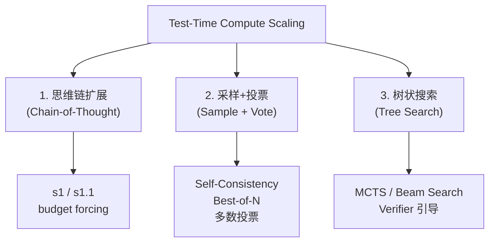
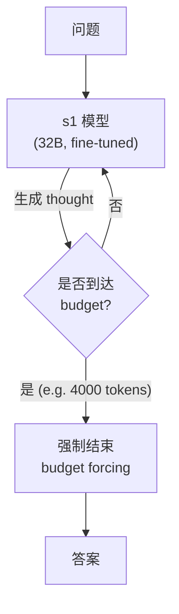
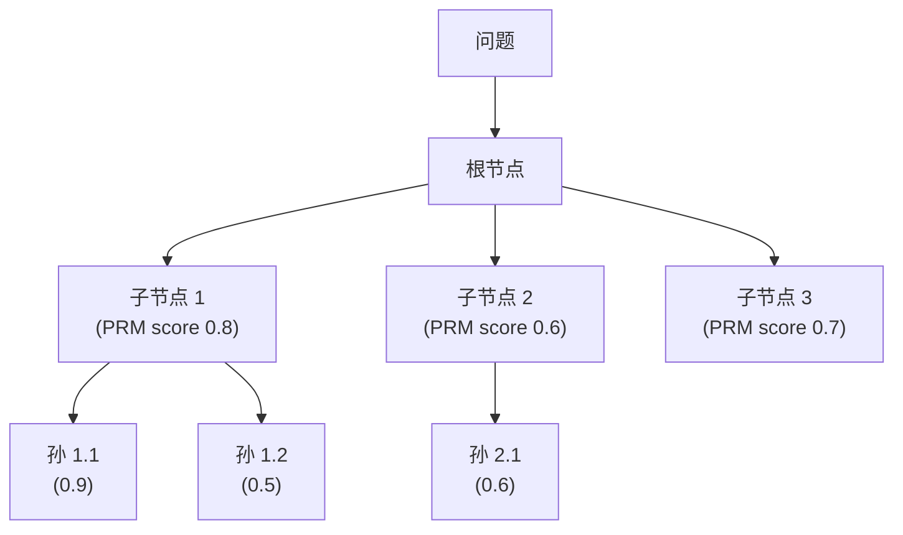
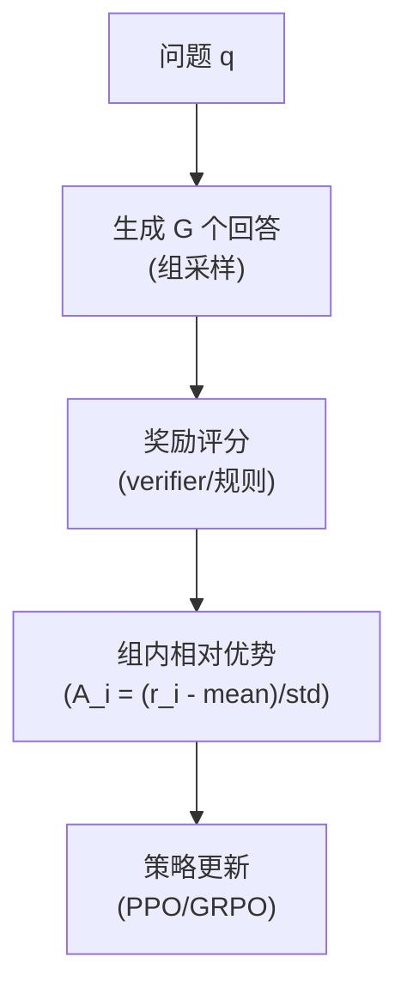
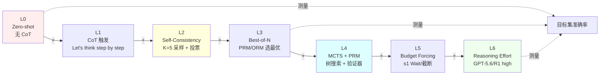

# 第 27 章 推理模型与 Test-Time Compute ⭐⭐⭐⭐⭐

> **面试频率**：极高（2026年最热门方向）| **难度**：⭐⭐⭐⭐⭐ | **核心范式**：Scaling 在推理阶段
>
> **时效基线（2026-07-31）**：当前托管 API 示例采用 OpenAI GPT-5.6 Sol + Responses API，以及
> Anthropic Claude Fable 5 + always-on adaptive thinking。o3/o4、Claude 4.5 的手动 Extended
> Thinking 保留为历史演进，不再作为当前默认接口。

推理模型 (Reasoning Model) 的核心思想，是在推理阶段按任务分配额外计算，与训练阶段扩展参数、
数据和算力形成互补。2024-2025 年的 o 系列、DeepSeek-R1 与早期 Extended Thinking 推动了范式形成；
2026 年的托管接口进一步转向统一 Responses API、自适应推理和 effort 级别控制。

---

## 27.1 推理模型范式


**核心洞察**：推理时可以通过更长推理、采样/验证或搜索增加计算预算，但收益取决于任务难度、
基础模型、采样策略和 verifier；不能把某个基准上的提升外推为通用倍数。

### 27.1.1 Reasoning vs Standard LLM

| 维度 | Standard LLM | Reasoning Model |
|------|-------------|----------------|
| 输出 | 直接答案 | 内部推理 + 最终答案；是否返回摘要由 API 决定 |
| 延迟 | 通常较低，按模型与负载实测 | 通常更高，按预算、模型与负载实测 |
| 适用 | 简单 QA / 对话 | 数学/代码/逻辑 |
| 成本 | 通常较低 | 通常更高，按实际 token/请求计费 |
| 训练 | SFT | SFT + RL with verifier |

### 27.1.2 当前接口与历史节点

| 定位 | 模型 / 系列 | 2026-07-31 接口要点 |
|------|-------------|----------------------|
| **当前推荐** | OpenAI GPT-5.6 Sol | Responses API；`reasoning={"effort": ...}` |
| **当前推荐** | Anthropic Claude Fable 5 | Claude API 已 GA；adaptive thinking 始终开启；`output_config.effort` 控制深度 |
| **当前可用** | DeepSeek-R1 系列 | 开放权重/托管版本需分别核验模型卡、许可证和 API |
| **历史节点** | OpenAI o3 / o4-mini | 早期 reasoning effort 接口；不作为本章当前默认 |
| **历史节点** | Claude 4.5 手动 Extended Thinking | `budget_tokens` 属旧式接口；Fable 5 不支持 |

---

## 27.2 Reasoning Effort API

```python
from openai import OpenAI
from anthropic import Anthropic

# OpenAI 当前推荐：GPT-5.6 Sol + Responses API
openai_client = OpenAI()
openai_response = openai_client.responses.create(
    model="gpt-5.6-sol",
    input="证明 √2 是无理数",
    reasoning={"effort": "high"},
    max_output_tokens=10_000,
)

# Anthropic 当前接口：Fable 5 的 adaptive thinking 始终开启
anthropic_client = Anthropic()
claude_response = anthropic_client.messages.create(
    model="claude-fable-5",
    max_tokens=10_000,
    thinking={"type": "adaptive", "display": "summarized"},
    output_config={"effort": "high"},
    messages=[{"role": "user", "content": "..."}]
)
```

| 提供方 | 当前 effort 档位 | 默认 / 语义 |
|--------|-----------------|-------------|
| OpenAI GPT-5.6 | `none/low/medium/high/xhigh/max` | 默认 `medium`；是行为控制，不是固定 token 数 |
| Claude Fable 5 | `low/medium/high/xhigh/max` | 默认 `high`；影响整次响应及 adaptive thinking 深度 |

`max_output_tokens` / `max_tokens` 是输出上限，不是对“思考 token”的硬预算。增加 effort 可能提升质量，
也可能在特定任务上饱和或退化；生产选档必须同时评测任务成功率、总 token、P95/P99 延迟和成本。

Claude Fable 5 不接受旧式 `thinking={"type": "enabled", "budget_tokens": ...}`；它始终启用 adaptive
thinking。`thinking.display="summarized"` 返回的是可读**摘要**，`"omitted"`（默认）返回空 thinking
文本但保留签名供多轮连续性使用；两种模式都不返回原始思维链。多轮对话应原样回传 thinking block。

官方依据：
[OpenAI GPT-5.6 模型指导](https://developers.openai.com/api/docs/guides/latest-model)、
[GPT-5.6 Sol 模型页](https://developers.openai.com/api/docs/models/gpt-5.6-sol)、
[Claude Fable 5 接口变化](https://platform.claude.com/docs/en/about-claude/models/introducing-claude-fable-5-and-claude-mythos-5)、
[Claude effort](https://platform.claude.com/docs/en/build-with-claude/effort)。

---

## 27.3 推理时计算扩展 (Test-Time Compute Scaling)

### 27.3.1 三大扩展方法



### 27.3.2 扩展定律

```
Performance = f(模型参数, 训练数据, 推理计算)
            = f(P, D, C_test)
```

**Snell et al. 2024** 研究了基于过程 verifier 的搜索和自适应调整模型分布两类方法。论文的关键
发现是：方法效果随题目难度显著变化，按题目自适应分配预算的 compute-optimal 策略，在其设置下
比 Best-of-N 基线的计算效率高 4 倍以上；在基础模型已有非零成功率的一部分题目上，固定 FLOPs
比较中，小模型的推理时计算也可能超过更大模型。这是特定模型、MATH 子集、verifier 与预算口径下
的结果，不能简化为固定采样数对应固定准确率提升的通用定律。来源：
[Snell et al., 2024](https://arxiv.org/abs/2408.03314)。

### 27.3.3 s1: Simple Test-Time Scaling (Stanford 2025)



**核心技巧**:
- 监督微调 1000 个高质量长 CoT 样本
- 推理时用 `<|im_start|>think\n...<|im_end|>\n<|im_start|>answer\n` 强制结束
- **Wait token**: 让模型"再多想想"再给答案

---

## 27.4 过程奖励模型 (PRM)

推理时扩展需要**验证**每一步是否正确。

### 27.4.1 PRM vs ORM

| 类型 | 评分对象 | 训练方式 |
|------|---------|---------|
| **ORM** (Outcome Reward) | 最终答案 | 答案对错 |
| **PRM** (Process Reward) | 推理每一步 | 逐步标注对错 |

### 27.4.2 PRM 训练数据

- **PRM800K**: 800K 数学推理步骤标注
- **Math-Shepherd**: 自动逐步验证
- **rStar-Math**: MCTS 构造
- **OmegaPRM**: 2025 自动化

---

## 27.5 搜索式推理

### 27.5.1 MCTS + PRM (AlphaProof 风格)



**UCB 选择**: 平衡探索与利用

### 27.5.2 Best-of-N Sampling

```python
# Best-of-N 推理
answers = [model.generate(question) for _ in range(N)]  # N=64, 256...
scores = [reward_model(question, ans) for ans in answers]
best = answers[argmax(scores)]
```

**2026 关键**: N 越大，效果越好（直到 verifier 饱和）。

---

## 27.6 推理模型的训练

### 27.6.1 SFT 阶段


**DeepSeek-R1 蒸馏**: 用 R1 生成 800K 样本，蒸馏到 Qwen/Llama。

### 27.6.2 RL 阶段 (GRPO / RLOO / RLVR)



**RLVR (RL with Verifiable Rewards)**: 2026 主流方向，奖励由**可验证的规则**给出（数学答案正确性、代码通过测试等），无需 RM。

### 27.6.3 R1-Zero 与 R1

- **R1-Zero**: 纯 RL，无 SFT，"涌现"推理
- **R1**: SFT (冷启动) + RL，更稳定

---

## 27.6.5 本章小结

> **章节小结**：Test-Time Compute (TTC) 通过 effort、采样/验证或搜索在推理阶段分配更多计算。
> o3、DeepSeek-R1 与早期 Extended Thinking 是重要历史节点；截至 2026-07-31，本章托管接口以
> GPT-5.6 Sol Responses API 和 Claude Fable 5 adaptive thinking 为当前基线。核心训练与推理技术
> 还包括 GRPO、RLVR、budget forcing 和 PRM 引导搜索。面试回答应区分历史接口、当前接口、
> 可见摘要与不可见原始推理，并用任务级评测选择 effort。

---

## 27.7 推理模型的部署挑战

| 挑战 | 原因 | 解决方案 |
|------|------|---------|
| **高 token 输出** | 输出随模型与预算增长 | 流式输出、上限、压缩 |
| **延迟高** | 延迟随模型、预算和负载变化 | 异步处理、缓存、超时与取消 |
| **成本高** | 更多推理/输出 token，幅度依模型和任务而变 | 按难度分级、模型路由、预算与超时 |
| **可观测性有限** | 托管 API 通常不返回原始思维链 | 记录结果、工具轨迹、usage 与 verifier；谨慎处理摘要 |

---

## 27.8 面试真题精讲 🎯

### 🎯 高频题1: 什么是 Test-Time Compute Scaling？和预训练 Scaling Law 区别？

**答案**: 预训练 Scaling Law 关注训练时通过**更多参数/数据/算力**提升能力。Test-Time Compute
Scaling 关注**推理时**通过额外内部推理、采样/验证或搜索提升能力。两者可组合，但不能笼统声称
“小模型 + 大推理计算必然等于大模型”；这种比较只在特定任务、模型、verifier 和固定计算口径下成立。

### 🎯 高频题2: DeepSeek-R1 的训练流程是什么？

**答案**:
1. **R1-Zero**: Base 模型 + 纯 GRPO RL，推理能力"涌现"（无 SFT）
2. **R1**: R1-Zero 蒸馏 + 冷启动 SFT 数据 + 第二阶段 RL
3. **蒸馏**: 用 R1 生成 800K CoT 样本，蒸馏到 Qwen/Llama 系列

### 🎯 高频题3: GRPO 和 PPO 的核心区别？

**答案**:
- PPO 需要 Critic 网络估计 Value
- GRPO **去 Critic 化**，对同一问题采样 G 个回答，优势 = (r_i - mean) / std
- 减少约 50% 参数量，更适合 reasoning 类任务

### 🎯 高频题4: 推理时扩展有哪些方法？效果如何？

**答案**:
1. **CoT 扩展**：在明确上限内增加推理预算
2. **采样投票**：Self-Consistency，多次采样后聚合
3. **树搜索**: MCTS + PRM (AlphaProof 风格)
4. **Verifier 引导**: Best-of-N

Snell et al. 2024 的结论是方法效果依赖题目难度；应比较固定 FLOPs 下的 Best-of-N、搜索与
自适应分配，报告模型、数据子集、verifier、采样和预算，而不是背一个固定提升数字。

### 🎯 高频题5: Reasoning Effort 等级如何设置？

**答案**：先核验所选模型的支持集合，再以任务分层建立质量、成本和 P95/P99 延迟曲线，按 SLO
选择。GPT-5.6 支持 `none/low/medium/high/xhigh/max`，Fable 5 支持
`low/medium/high/xhigh/max`；两者的 effort 都不是固定 token 数或固定延迟，增加预算也不保证质量
单调提升。

### 🎯 高频题6: 什么是 Process Reward Model (PRM)？如何训练？

**答案**: PRM 对推理的**每一步**打分，而非只看最终结果。训练:
1. MCTS 收集大量 step-level 标注
2. 训练分类器: step → correct/incorrect
3. 推理时: 引导 beam search 选择高分步骤

代表数据: PRM800K, Math-Shepherd。

### 🎯 高频题7: Claude Fable 5 与 OpenAI GPT-5.6 的当前推理接口有何区别？

**答案**:
- **OpenAI GPT-5.6**：推荐 Responses API，以 `reasoning={"effort": ...}` 控制推理强度；
  应消费最终文本、usage 和需要的 reasoning summary，而不是假设能读取原始思维链。
- **Claude Fable 5**：adaptive thinking 始终开启，以 `output_config={"effort": ...}` 控制深度；
  `thinking.display` 只能选择 summarized 或 omitted，原始思维链从不返回。
- **历史边界**：o3/o3-mini 与 Claude 4.5 的 `budget_tokens` 可作为演进背景，但不得写成 2026 当前默认。
- **工具调用**：Fable 5 的 adaptive thinking 自动支持 interleaved thinking；多轮和工具循环中必须
  原样回传 thinking block，不能自行改写摘要或签名。

### 🎯 高频题8: 推理模型的未来发展方向？

**答案**:
1. **自适应推理**: 根据问题难度自动分配算力
2. **Verifier 增强**: 更强的 PRM
3. **多模态推理**: 视觉推理（GPT-5.6 支持图像输入）
4. **长链推理**：在上下文、成本和超时边界内延长或压缩推理
5. **推理蒸馏**: 小模型学会大模型推理

---

## 27.9 本章速查表

| 概念 | 关键点 |
|------|--------|
| **Test-Time Compute** | 增加预算可能提升、饱和或退化，必须按难度分桶评测 |
| **Reasoning Effort** | 档位因模型而异；GPT-5.6 与 Fable 5 均不是固定 token 预算 |
| **GRPO** | 去 Critic，组内相对优势 |
| **RLVR** | Verifiable Rewards (数学/代码) |
| **PRM** | 逐步奖励，训练 step-level 打分 |
| **MCTS + PRM** | 树搜索 + 验证器 |
| **s1 / s1.1** | 简单 TTC scaling，budget forcing |
| **R1-Zero → R1** | 纯 RL → SFT+RL |
| **R1 蒸馏** | 800K CoT 数据到小模型 |
| **CoT 思维链** | 长度由模型、任务、预算与服务上限共同决定 |
| **配套代码** | 14 个 `.py`；`01/02` GPT-5.6 Responses，`03` Fable 5，`04/07/08` DeepSeek，其他为本地算法。API 脚本默认 mock；真实调用必须显式 `LLM_MOCK=0` + 对应 key。 |

---

## 27.10 配套代码与安全运行边界 ⭐⭐⭐⭐⭐

> 本章共 **14 个 `.py` 文件**。`01/02/03/04/07/08` 提供托管 API 路径，其余是本地算法演示。
> 为避免误产生网络请求和费用，`01/02/03` 默认 `LLM_MOCK=1`；只有显式设置 `LLM_MOCK=0`
> 并提供对应 key 才调用真实 API。文件名中的 `o3` 为兼容旧链接保留，代码默认已迁移到 GPT-5.6 Sol。

### 27.10.1 Test-Time Compute Scaling 阶梯（核心概念图）



> 横轴是推理时计算量，纵轴是目标集准确率。层级增加不保证准确率单调提高，应同时画成本、
> 延迟和方差，并按题目难度分桶。`ch27/14_ttc_scaling_law.py` 仅演示如何画一条假设的饱和曲线，
> 不是 Snell 2024 给出的通用拟合公式，也不能替代真实 benchmark。

### 27.10.2 文件 × 验收边界速查表

| # | 文件 | 默认路径 | 主题 | 真实路径条件 |
|---|------|------|------|---------------|
| 01 | `o3_api_basic.py` | 离线 mock | GPT-5.6 Sol Responses `reasoning.effort` | `LLM_MOCK=0` + `OPENAI_API_KEY` |
| 02 | `o3_streaming.py` | 离线 mock | GPT-5.6 Sol `response.output_text.delta` | `LLM_MOCK=0` + `OPENAI_API_KEY` |
| 03 | `claude_extended_thinking.py` | 离线 mock | Fable 5 adaptive + summarized thinking | `LLM_MOCK=0` + `ANTHROPIC_API_KEY` |
| 04 | `reasoning_effort_ladder.py` | 离线结构演示 | DeepSeek V4 high/max + `reasoning_content` | `LLM_MOCK=0` + `DEEPSEEK_API_KEY` |
| 05 | `grpo_loss.py` | 本地 PyTorch | GRPO loss 公式 + 反向传播 | 安装 torch |
| 06 | `grpo_advantage.py` | 本地 PyTorch | 组内相对优势与组大小边界 | 安装 torch |
| 07 | `s1_budget_forcing.py` | 离线结构演示 | 托管 API 多轮复核；非严格 s1 复现 | `LLM_MOCK=0` + `DEEPSEEK_API_KEY` |
| 08 | `s1_wait_token.py` | 离线结构演示 | follow-up 与 token 级 Wait 的差异 | `LLM_MOCK=0` + `DEEPSEEK_API_KEY` |
| 09 | `prm_step_scoring.py` | 本地 PyTorch | PRM 分步评分 | 安装 torch |
| 10 | `rlvr_rewards.py` | 本地算法 | RLVR 可验证 reward | 无外部 API |
| 11 | `mcts_prm.py` | 本地算法 | MCTS + PRM 树搜索 | 安装 numpy |
| 12 | `best_of_n.py` | 本地算法 | BoN 采样 + PRM 选择 | 安装 numpy |
| 13 | `self_consistency.py` | 本地算法 | Self-Consistency 投票 | 安装 numpy |
| 14 | `ttc_scaling_law.py` | 合成曲线 | 如何绘制假设的饱和曲线 | 安装 numpy；不代表论文拟合 |

### 27.10.3 离线验收与显式真跑

```bash
cd code/

# === 默认安全离线模式：不需要 key，不发网络请求 ===
python ch27_reasoning_ttc/llm/01_o3_api_basic.py
python ch27_reasoning_ttc/llm/02_o3_streaming.py
python ch27_reasoning_ttc/llm/03_claude_extended_thinking.py

# === OpenAI GPT-5.6 Sol 真实调用 ===
LLM_MOCK=0 OPENAI_API_KEY=sk-xxx \
  python ch27_reasoning_ttc/llm/01_o3_api_basic.py
LLM_MOCK=0 OPENAI_API_KEY=sk-xxx \
  python ch27_reasoning_ttc/llm/02_o3_streaming.py

# === Anthropic Claude Fable 5 真实调用 ===
LLM_MOCK=0 ANTHROPIC_API_KEY=sk-ant-xxx \
  python ch27_reasoning_ttc/llm/03_claude_extended_thinking.py

# === DeepSeek V4 条件性真实调用 ===
export LLM_MOCK=0
export DEEPSEEK_API_KEY=sk-xxx
python ch27_reasoning_ttc/llm/04_reasoning_effort_ladder.py   # R1 reasoning_content
python ch27_reasoning_ttc/llm/07_s1_budget_forcing.py          # S1 Wait/截断
python ch27_reasoning_ttc/llm/08_s1_wait_token.py              # Wait 分布偏移

# === 纯算法 / 纯 PyTorch（任何机器） ===
python ch27_reasoning_ttc/llm/05_grpo_loss.py
python ch27_reasoning_ttc/llm/09_prm_step_scoring.py
python ch27_reasoning_ttc/llm/10_rlvr_rewards.py
python ch27_reasoning_ttc/llm/14_ttc_scaling_law.py
```

PowerShell 可先设置 `$env:LLM_MOCK="0"` 与对应 key，再运行相同 Python 命令。真实 API 会产生费用，
也可能因账号权限、区域、限流或模型访问状态失败；离线通过不等于真实 API 已验收。

### 27.10.4 2026-07-31 接口迁移边界

| 旧写法 / 历史节点 | 当前写法 |
|-------------------|----------|
| o3-mini + Chat Completions `reasoning_effort=` | GPT-5.6 Sol + Responses `reasoning={"effort": ...}` |
| Claude 4.5 `type="enabled"` + `budget_tokens` | Fable 5 `type="adaptive"` + `output_config.effort` |
| 把 thinking block 称为原始思维链 | 明确 summarized 是摘要、omitted 是空文本；原始思维链不返回 |
| 直接运行即发真实请求 | 默认 mock；仅 `LLM_MOCK=0` + key 进入真实调用 |

生产迁移时应先在代表性任务上做回归评测，再按模型可用性、质量、总 token、延迟和成本决定是否升级；
不要仅替换 model slug 后就宣称完成。

> **本地模型替代**：可在核对 Ollama 模型标签、许可证、磁盘与内存后运行兼容的蒸馏模型。
> 不要直接修改共享客户端来“伪装”提供商；应新增可配置 provider/base URL 并做协议兼容测试。
> 工作区中的 Qwen2.5-0.5B-Instruct 不是推理模型，也不能替代上述真实 API 验收。

---

## 📚 相关章节

- [[12_Transformer与大模型原理]] — 模型架构基础：推理模型仍基于 Transformer 架构，Self-Attention 与 KV Cache 是长思维链推理的底层支撑。
- [[15_Agent智能体开发]] — Agent 与推理融合：ReAct/Reflexion 等 Agent 范式将推理模型作为决策大脑，实现多步工具调用推理。
- [[16_模型微调与推理优化]] — 训练技术详解：GRPO、RLVR、SFT 蒸馏等推理模型训练方法属于微调与对齐工程范畴。
- [[17_大模型评估体系]] — 推理能力评估：AIME/MATH/HumanEval 等基准用于衡量推理模型在不同 effort 配置下的准确率。
- [[25_推理引擎与高性能服务]] — 部署关键：vLLM/SGLang/TensorRT-LLM 对长 CoT 输出做 KV Cache 复用、连续批处理与 speculative decoding 优化。
