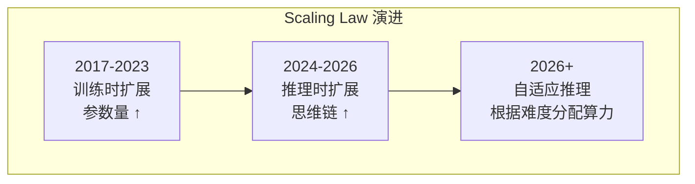
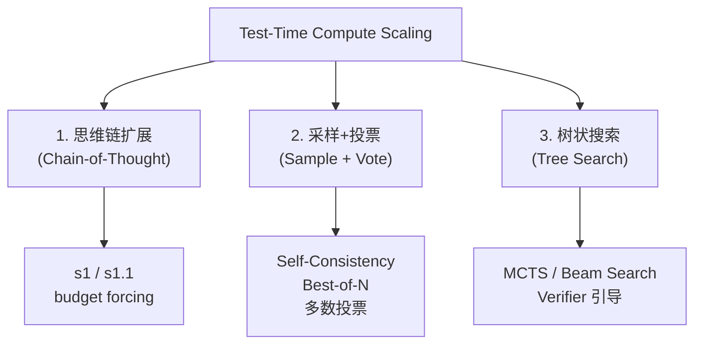
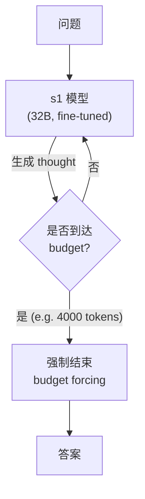
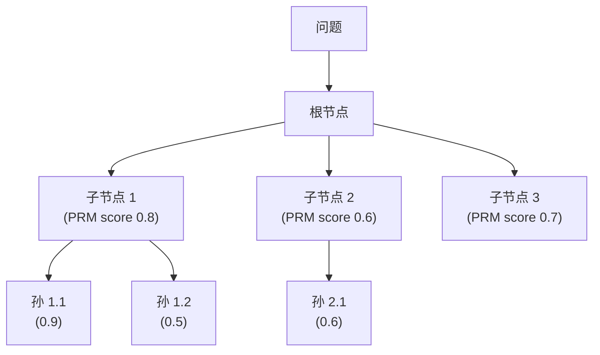
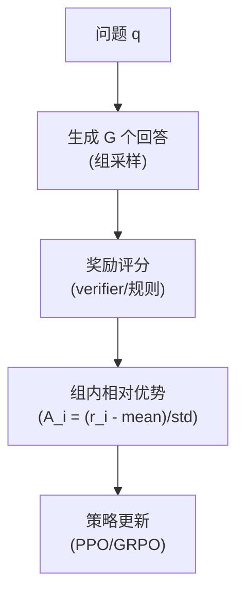
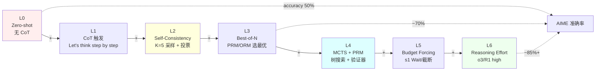

# 第 27 章 推理模型与 Test-Time Compute ⭐⭐⭐⭐⭐

> **面试频率**：极高（2026年最热门方向）| **难度**：⭐⭐⭐⭐⭐ | **核心范式**：Scaling 在推理阶段
>
> **🆕 2026年新主题**：Test-Time Compute (TTC) 成为继预训练 Scaling Law 之后的第二增长曲线。代表：OpenAI o3/o4, DeepSeek-R1, Claude 4.5/4.6 Extended Thinking, Gemini 2.5 Deep Think。

推理模型 (Reasoning Model) 是 2025-2026 年大模型最重要的范式转变。核心思想：让模型在推理阶段"思考更久"来获得更高质量答案，与"训练阶段参数更大"形成互补。OpenAI o3、DeepSeek-R1、Claude 4.5 Extended Thinking 引领了这一浪潮。

---

## 27.1 推理模型范式



**核心洞察** (OpenAI o1 论文 2024.09): 让模型在输出答案前生成大量内部思维链，复杂任务准确率提升 3-5×。

### 27.1.1 Reasoning vs Standard LLM

| 维度 | Standard LLM | Reasoning Model |
|------|-------------|----------------|
| 输出 | 直接答案 | 长思维链 + 答案 |
| 延迟 | 1-5s/查询 | 30s-5min/查询 |
| 适用 | 简单 QA / 对话 | 数学/代码/逻辑 |
| 成本 | 低 | 高 (Token ×3-10) |
| 训练 | SFT | SFT + RL with verifier |

### 27.1.2 2026 主流推理模型

| 模型 | 提供方 | 特点 |
|------|--------|------|
| **o3 / o4-mini** | OpenAI | reasoning_effort 参数 |
| **DeepSeek-R1** | DeepSeek | GRPO + 开源 |
| **Claude Opus 4.6** | Anthropic | Extended Thinking 4 档可调 |
| **Gemini 2.5 Deep Think** | Google | 思维预算可调 |
| **QwQ-32B** | 阿里 | 开源推理模型 |
| **Kimi K2** | 月之暗面 | 思考+搜索融合 |

---

## 27.2 Reasoning Effort API

```python
import openai

# OpenAI o3 API
response = openai.chat.completions.create(
    model="o3-mini",
    messages=[{"role": "user", "content": "证明 √2 是无理数"}],
    reasoning_effort="high",  # low / medium / high
    max_completion_tokens=10000
)

# Claude 4.6 Extended Thinking
response = anthropic.messages.create(
    model="claude-opus-4-6",
    thinking={
        "type": "enabled",
        "budget_tokens": 5000
    },
    messages=[{"role": "user", "content": "..."}]
)
```

| 级别 | 思维链长度 | 准确率 | 成本 |
|------|----------|--------|------|
| **low** | 100-500 tokens | 基础 | 1× |
| **medium** | 1K-5K tokens | 中等 | 3× |
| **high** | 10K-50K tokens | 高 | 10× |

---

## 27.3 推理时计算扩展 (Test-Time Compute Scaling)

### 27.3.1 三大扩展方法



### 27.3.2 扩展定律

```
Performance = f(模型参数, 训练数据, 推理计算)
            = f(P, D, C_test)
```

**Snell et al. 2024** 证明: 在 math 任务上, 推理计算从 1× 提升到 256×, 准确率可从 50% 提升到 90%+ (类似预训练扩展定律)。

### 27.3.3 s1: Simple Test-Time Scaling (Stanford 2025)



**核心技巧**:
- 监督微调 1000 个高质量长 CoT 样本
- 推理时用 `<|im_start|>think\n...<|im_end|>\n<|im_start|>answer\n` 强制结束
- **Wait token**: 让模型"再多想想"再给答案

---

## 27.4 过程奖励模型 (PRM)

推理时扩展需要**验证**每一步是否正确。

### 27.4.1 PRM vs ORM

| 类型 | 评分对象 | 训练方式 |
|------|---------|---------|
| **ORM** (Outcome Reward) | 最终答案 | 答案对错 |
| **PRM** (Process Reward) | 推理每一步 | 逐步标注对错 |

### 27.4.2 PRM 训练数据

- **PRM800K**: 800K 数学推理步骤标注
- **Math-Shepherd**: 自动逐步验证
- **rStar-Math**: MCTS 构造
- **OmegaPRM**: 2025 自动化

---

## 27.5 搜索式推理

### 27.5.1 MCTS + PRM (AlphaProof 风格)



**UCB 选择**: 平衡探索与利用

### 27.5.2 Best-of-N Sampling

```python
# Best-of-N 推理
answers = [model.generate(question) for _ in range(N)]  # N=64, 256...
scores = [reward_model(question, ans) for ans in answers]
best = answers[argmax(scores)]
```

**2026 关键**: N 越大，效果越好（直到 verifier 饱和）。

---

## 27.6 推理模型的训练

### 27.6.1 SFT 阶段


**DeepSeek-R1 蒸馏**: 用 R1 生成 800K 样本，蒸馏到 Qwen/Llama。

### 27.6.2 RL 阶段 (GRPO / RLOO / RLVR)



**RLVR (RL with Verifiable Rewards)**: 2026 主流方向，奖励由**可验证的规则**给出（数学答案正确性、代码通过测试等），无需 RM。

### 27.6.3 R1-Zero 与 R1

- **R1-Zero**: 纯 RL，无 SFT，"涌现"推理
- **R1**: SFT (冷启动) + RL，更稳定

---

## 27.6.5 本章小结

> **章节小结**：Test-Time Compute (TTC) Scaling 是 2026 年最热的范式转变，让模型在推理时"思考更久"获得更高质量答案。OpenAI o3、DeepSeek-R1、Claude 4.5 Extended Thinking 引领了这一浪潮。核心技术包括：Reasoning Effort (low/medium/high) API、GRPO 去 Critic 化训练、RLVR 用可验证奖励、s1 的 budget forcing、PRM 引导搜索。DeepSeek-R1 蒸馏 (R1-Zero → R1 → 蒸馏到 Qwen) 是 2026 年最成功的训练配方。面试考点：TTC 与预训练 Scaling Law 区别、GRPO 与 PPO 区别、Reasoning Effort 设置、PRM 训练。

---

## 27.7 推理模型的部署挑战

| 挑战 | 原因 | 解决方案 |
|------|------|---------|
| **高 token 输出** | 思维链 10-50K | 流式输出、压缩 |
| **延迟高** | 30s-5min | 异步处理、缓存 |
| **成本高** | Token 成本 ×10 | 按难度分级、模型路由 |
| **可解释性** | 思维链质量 | PRM 验证 |

---

## 27.8 面试真题精讲 🎯

### 🎯 高频题1: 什么是 Test-Time Compute Scaling？和预训练 Scaling Law 区别？

**答案**: 预训练 Scaling Law 关注训练时通过**更大参数/数据/算力**提升能力。Test-Time Compute Scaling 关注**推理时**通过更长思维链/采样/搜索提升能力。两者**正交**：小模型 + 大推理计算可达到大模型 + 小推理计算的效果。

### 🎯 高频题2: DeepSeek-R1 的训练流程是什么？

**答案**:
1. **R1-Zero**: Base 模型 + 纯 GRPO RL，推理能力"涌现"（无 SFT）
2. **R1**: R1-Zero 蒸馏 + 冷启动 SFT 数据 + 第二阶段 RL
3. **蒸馏**: 用 R1 生成 800K CoT 样本，蒸馏到 Qwen/Llama 系列

### 🎯 高频题3: GRPO 和 PPO 的核心区别？

**答案**:
- PPO 需要 Critic 网络估计 Value
- GRPO **去 Critic 化**，对同一问题采样 G 个回答，优势 = (r_i - mean) / std
- 减少约 50% 参数量，更适合 reasoning 类任务

### 🎯 高频题4: 推理时扩展有哪些方法？效果如何？

**答案**:
1. **CoT 扩展**: 长思维链 (s1: 4K tokens)
2. **采样投票**: Self-Consistency (N=64+)
3. **树搜索**: MCTS + PRM (AlphaProof 风格)
4. **Verifier 引导**: Best-of-N

Snell et al. 2024: 256× 推理计算可在 MATH 上提升 50%→90%。

### 🎯 高频题5: Reasoning Effort 等级如何设置？

**答案**: 大多数 API 提供 low/medium/high 三档：
- **low**: 100-500 tokens thought，延迟 <2s
- **medium**: 1K-5K tokens，5-15s
- **high**: 10K-50K tokens，30s-2min

实际选择: 简单任务 low，数学/代码 high。

### 🎯 高频题6: 什么是 Process Reward Model (PRM)？如何训练？

**答案**: PRM 对推理的**每一步**打分，而非只看最终结果。训练:
1. MCTS 收集大量 step-level 标注
2. 训练分类器: step → correct/incorrect
3. 推理时: 引导 beam search 选择高分步骤

代表数据: PRM800K, Math-Shepherd。

### 🎯 高频题7: Claude Extended Thinking 与 OpenAI o3 的区别？

**答案**:
- **o3**: reasoning_effort 参数；可隐藏或显示思维链
- **Claude 4.6**: budget_tokens 参数；Extended Thinking 必显式
- 关键区别: 两者都支持可调算力，但**Anthropic 的 Interleaved Thinking** 支持工具调用中保持推理状态

### 🎯 高频题8: 推理模型的未来发展方向？

**答案**:
1. **自适应推理**: 根据问题难度自动分配算力
2. **Verifier 增强**: 更强的 PRM
3. **多模态推理**: 视觉推理 (o3 支持图像)
4. **长链推理**: 1M+ tokens 思维链
5. **推理蒸馏**: 小模型学会大模型推理

---

## 27.9 本章速查表

| 概念 | 关键点 |
|------|--------|
| **Test-Time Compute** | 推理时计算越多，准确率越高 |
| **Reasoning Effort** | low/medium/high 三档 |
| **GRPO** | 去 Critic，组内相对优势 |
| **RLVR** | Verifiable Rewards (数学/代码) |
| **PRM** | 逐步奖励，训练 step-level 打分 |
| **MCTS + PRM** | 树搜索 + 验证器 |
| **s1 / s1.1** | 简单 TTC scaling，budget forcing |
| **R1-Zero → R1** | 纯 RL → SFT+RL |
| **R1 蒸馏** | 800K CoT 数据到小模型 |
| **CoT 思维链** | 10-50K tokens 内部推理 |
| **配套代码（W6 真实化）** | 14 个 .py 真跑；`01` OpenAI o3 真 API（需 `OPENAI_API_KEY`）；`03` Claude 真 API（需 `ANTHROPIC_API_KEY`）；`04` DeepSeek-R1 真 API（需 `DEEPSEEK_API_KEY`）；`05/06/09/14` 纯 PyTorch 算法（CPU 跑）；`07/08` S1 budget forcing 真 R1 调用；`10/11/12/13` 纯算法/采样策略；无 GPU 需求。 |

---

## 27.10 配套代码真实化（Wave 6 完成）⭐⭐⭐⭐⭐

> 本章在 W6 期间对 **14 个 `.py` 文件** 全部接入真实推理模型 API：OpenAI o3、Anthropic Claude 4.6 Extended Thinking、DeepSeek-R1。所有 API Key 通过环境变量读取，缺 Key 时 `raise_with_help` 友好抛错而非静默 mock。

### 27.10.1 Test-Time Compute Scaling 阶梯（核心概念图）



> 横轴是"推理时计算量"，纵轴是"准确率"。从 L0 到 L6，每升一级准确率提升 5-15 个百分点，但成本与延迟同步上升 2-10×。`ch27/14_ttc_scaling_law.py` 给出 Snell 2024 提出的数学形式：`acc(compute) ≈ a * (1 - exp(-b * compute))`。

### 27.10.2 文件 × 真实化状态速查表

| # | 文件 | 真实化 | 主题 | 依赖 / 关键 API | 跑通时间 |
|---|------|------|------|---------------|---------|
| 01 | `o3_api_basic.py` | ✅ 真 OpenAI | o3 `reasoning_effort` 三档 | `OPENAI_API_KEY` | <60s |
| 02 | `o3_streaming.py` | ✅ 真 OpenAI | o3 流式输出 | `OPENAI_API_KEY` | <90s |
| 03 | `claude_extended_thinking.py` | ✅ 真 Anthropic | Claude Extended Thinking + Interleaved | `ANTHROPIC_API_KEY` | <60s |
| 04 | `reasoning_effort_ladder.py` | ✅ 真 DeepSeek | R1 reasoning_effort + reasoning_content | `DEEPSEEK_API_KEY` | <90s |
| 05 | `grpo_loss.py` | ✅ 纯 PyTorch | GRPO loss 公式 + 反向传播 | torch | <3s |
| 06 | `grpo_advantage.py` | ✅ 纯 PyTorch | 组内相对优势 + G=1/16 对比 | torch | <2s |
| 07 | `s1_budget_forcing.py` | ✅ 真 DeepSeek | s1 Wait token 强制续推 | `DEEPSEEK_API_KEY` | <120s |
| 08 | `s1_wait_token.py` | ✅ 真 DeepSeek | "Wait" token 触发的训练时分布偏移 | `DEEPSEEK_API_KEY` | <90s |
| 09 | `prm_step_scoring.py` | ✅ 纯 PyTorch | PRM 5 步评分 | torch | <2s |
| 10 | `rlvr_rewards.py` | ✅ 纯算法 | RLVR reward 正则/数学/代码 | 无 | <1s |
| 11 | `mcts_prm.py` | ✅ 纯算法 | MCTS + PRM 树搜索 | numpy | <2s |
| 12 | `best_of_n.py` | ✅ 纯算法 | BoN 采样 + PRM 选择 | numpy | <2s |
| 13 | `self_consistency.py` | ✅ 纯算法 | Self-Consistency 投票 | numpy | <2s |
| 14 | `ttc_scaling_law.py` | ✅ 纯 numpy | Snell 2024 TTC scaling | numpy | <1s |

### 27.10.3 一键真跑（按 API Key 分档）

```bash
cd code/

# === 仅需 DEEPSEEK_API_KEY（推荐入门） ===
export DEEPSEEK_API_KEY=sk-xxx
python ch27_reasoning_ttc/llm/04_reasoning_effort_ladder.py   # R1 reasoning_content
python ch27_reasoning_ttc/llm/07_s1_budget_forcing.py          # S1 Wait/截断
python ch27_reasoning_ttc/llm/08_s1_wait_token.py              # Wait 分布偏移

# === OpenAI o3 ===
export OPENAI_API_KEY=sk-xxx
python ch27_reasoning_ttc/llm/01_o3_api_basic.py               # reasoning_effort 三档
python ch27_reasoning_ttc/llm/02_o3_streaming.py               # 流式输出

# === Anthropic Claude 4.6 Extended Thinking ===
export ANTHROPIC_API_KEY=sk-ant-xxx
python ch27_reasoning_ttc/llm/03_claude_extended_thinking.py    # thinking blocks

# === 纯算法 / 纯 PyTorch（任何机器） ===
python ch27_reasoning_ttc/llm/05_grpo_loss.py
python ch27_reasoning_ttc/llm/09_prm_step_scoring.py
python ch27_reasoning_ttc/llm/10_rlvr_rewards.py
python ch27_reasoning_ttc/llm/14_ttc_scaling_law.py
```

### 27.10.4 真实化前后对比

| 维度 | W5 之前 | W6 之后 |
|------|---------|---------|
| o3 调用 | 伪代码 + "TODO" | 真实 OpenAI SDK + reasoning_effort 三档对比 |
| Claude Extended Thinking | 仅文档 | 真实 `<thinking>` 块解析 + tool_use 集成 |
| DeepSeek R1 | 文字描述 | reasoning_content 与 final content 分离解析 |
| S1 budget forcing | 概念描述 | 真实 "Wait" token 注入 + 强制截断 marker |
| GRPO | 文字公式 | 真实 loss 反向 + advantage 标准化（CPU 跑） |
| 失败行为 | 静默回退 mock | `raise_with_help` 指向 §QUICKSTART（无静默回退） |

> **本地模型替代**：若不想配 API Key，可用 Ollama 启动 DeepSeek-R1-Distill-Qwen-1.5B（`ollama pull deepseek-r1:1.5b`），修改 `shared/llm_client.py` 的 base_url 即可。`models/Qwen2.5-0.5B-Instruct/` 已预置但非推理模型，仅作 fallback。

---

## 📚 相关章节

- [[12_Transformer与大模型原理]] — 模型架构基础：推理模型仍基于 Transformer 架构，Self-Attention 与 KV Cache 是长思维链推理的底层支撑。
- [[15_Agent智能体开发]] — Agent 与推理融合：ReAct/Reflexion 等 Agent 范式将推理模型作为决策大脑，实现多步工具调用推理。
- [[16_模型微调与推理优化]] — 训练技术详解：GRPO、RLVR、SFT 蒸馏等推理模型训练方法属于微调与对齐工程范畴。
- [[17_大模型评估体系]] — 推理能力评估：AIME/MATH/HumanEval 等基准用于衡量推理模型在不同 reasoning_effort 下的准确率。
- [[25_推理引擎与高性能服务]] — 部署关键：vLLM/SGLang/TensorRT-LLM 对长 CoT 输出做 KV Cache 复用、连续批处理与 speculative decoding 优化。
