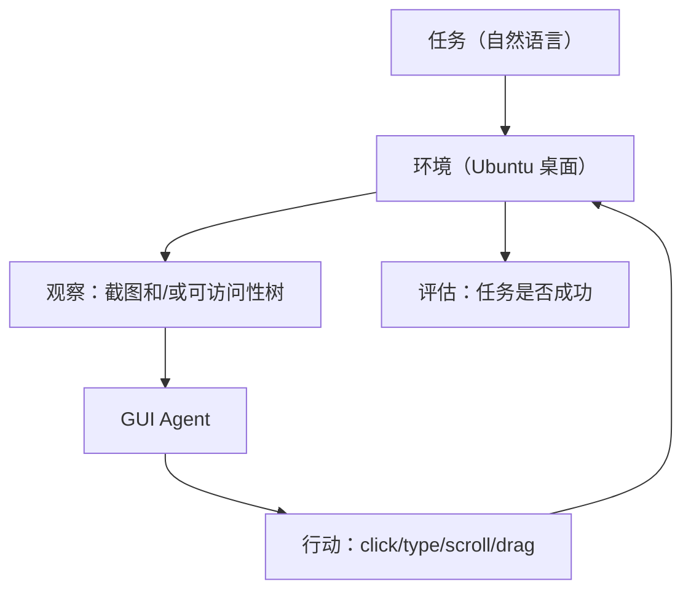
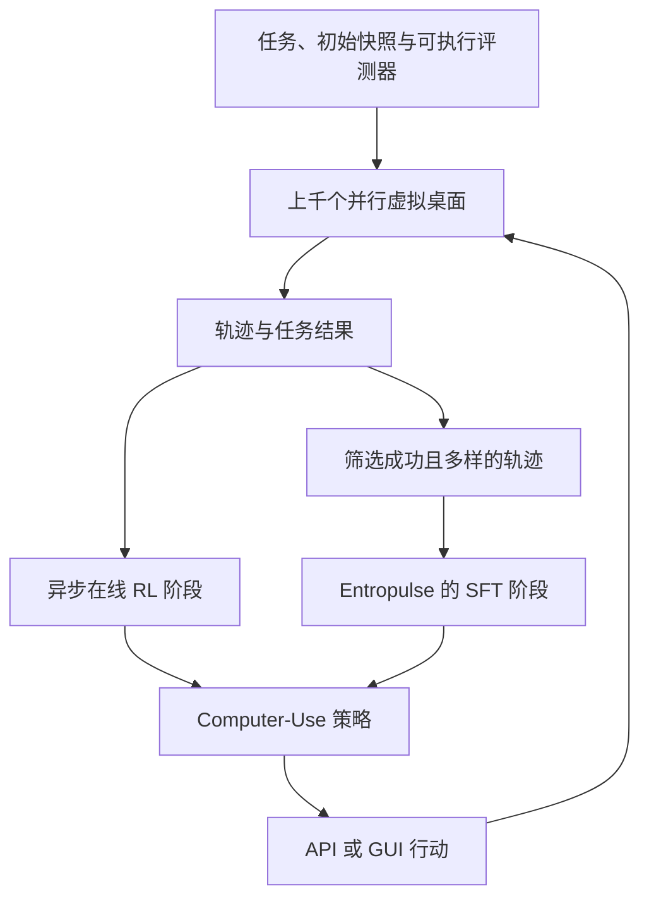

# 第 28 章 Computer Use 与 GUI Agent ⭐⭐⭐⭐
> [!abstract] 本章导航
> **定位**：第四部分 Agent 与工程框架中的第 28 章；围绕“Computer Use 与 GUI Agent”建立单一、可追踪的知识主线。
>
> **先修**：[[27_LLM框架与平台选型|第 27 章 LLM 框架与平台选型]]。
>
> **学习目标**：
> - 解释 Computer Use 提示设计 的核心问题、机制与适用边界。
> - 实现或评估 Computer-Use 任务定义与基准 ⭐⭐⭐⭐ 的最小闭环。
> - 使用可复现证据诊断 OSWorld 基准详解 ⭐⭐⭐⭐ 的工程取舍与失败模式。
>
> **建议路径**：Computer Use 提示设计 → Computer-Use 任务定义与基准 ⭐⭐⭐⭐ → OSWorld 基准详解 ⭐⭐⭐⭐ → 从 SFT 到 RL：GUI Agent 训练范式 ⭐⭐⭐⭐ → AutoGLM-OS / GLM-ComputerRL-9B：先分清发布版本 ⭐⭐⭐⭐ → 工程栈：环境模拟、沙箱隔离、安全 ⭐⭐⭐ → 生产边界与面试表达。
>
> **配套代码**：`code/ch17_prompt_engineering/`。

本章先回答“Computer Use 提示设计”为什么成立，再沿着机制、实现、评估和边界逐步展开。阅读时先建立因果链，再运行或推演示例，最后用章末自测检查能否脱离原文复述。
## 28.1 Computer Use 提示设计
### 28.1.1 Computer Use Prompts

Computer Use 让模型**提出**点击、输入、滚动等 GUI 动作；真正读取截图、执行动作并返回结果的是宿主程序。协议不是“模型获得了桌面权限”，权限、隔离、审计和审批仍由应用控制。

#### 28.1.1.1 Claude Computer Use 核心 Prompt 模式

```python
import anthropic

client = anthropic.Anthropic()

# 版本化 Computer Use 工具；坐标是 display 尺寸内的实际像素
tools = [{
    "type": "computer_20251124",
    "name": "computer",
    "display_width_px": 1024,
    "display_height_px": 768,
    "display_number": 1,
}]

response = client.beta.messages.create(
    model="claude-opus-4-8",
    max_tokens=2048,
    tools=tools,
    betas=["computer-use-2025-11-24"],
    messages=[{
        "role": "user",
        "content": "在隔离浏览器中搜索 Python 官方 tutorial；不要登录、下载或提交表单。",
    }],
)

# tool_use 只是动作请求。宿主程序验证 action/坐标/目标后执行，
# 再把最新截图作为 tool_result 返回；此处故意不执行。
for block in response.content:
    if block.type == "tool_use" and block.name == "computer":
        print("待验证动作：", block.input)
```

#### 28.1.1.2 OpenAI CUA（Computer-Using Agent）

```python
# GPT-5.6 GA Computer tool（旧 computer-use-preview 已弃用）
from openai import OpenAI

client = OpenAI()

response = client.responses.create(
    model="gpt-5.6",
    tools=[{"type": "computer"}],
    input="在隔离浏览器中打开公司公开主页；不要登录、下载或提交表单。",
)

# 动作是批量 actions；宿主必须逐项校验，不能直接执行模型输出
for item in response.output:
    if item.type == "computer_call":
        for action in item.actions:
            print("待验证动作：", action)

        # 宿主执行获批动作并截图后，按同一 call_id 续传：
        # response = client.responses.create(
        #     model="gpt-5.6",
        #     tools=[{"type": "computer"}],
        #     previous_response_id=response.id,
        #     input=[{
        #         "type": "computer_call_output",
        #         "call_id": item.call_id,
        #         "output": {
        #             "type": "computer_screenshot",
        #             "image_url": screenshot_data_url,
        #             "detail": "original",
        #         },
        #     }],
        # )
```

旧的 `computer-use-preview` / `computer_use_preview` 协议已弃用，不能和 GA `computer` 工具混用。

#### 28.1.1.3 Computer Use Prompt 关键模式

| 模式 | 说明 | 关键提示词 |
|------|------|----------|
| **观察-动作-回传** | 模型请求动作，宿主执行并回传新截图 | 保留 `call_id` / `tool_use_id`，不要伪造结果 |
| **失败恢复** | 每轮基于最新截图重新判断 | 设置总步数、超时、重复动作检测 |
| **风险拦截** | 由宿主代码判定和暂停 | 支付、删除、发送、登录、下载、验证码等必须按策略审批 |
| **任务终止** | 由响应状态与业务验收共同判断 | 不依赖并不存在的自定义 `done()` 动作 |

安全底线：在隔离浏览器/VM 中运行；只注入当前任务所需的短期凭据；限制网络出口和可访问域名；把网页内容视为不可信输入；对外部写入和不可逆操作要求用户确认；保存动作、截图摘要和审批审计。权威参考（核验日期：2026-07-31）：[Anthropic Computer Use](https://platform.claude.com/docs/en/agents-and-tools/tool-use/computer-use-tool)、[OpenAI Computer Use](https://developers.openai.com/api/docs/guides/tools-computer-use)。

---

## 28.2 Computer-Use 任务定义与基准 ⭐⭐⭐⭐

### 28.2.1 Computer-Use 是什么？

Computer-Use = 让 Agent 像人一样操作计算机：
- 观察：屏幕截图、可访问性树/控件元数据，或二者组合
- 行动：点击、键入、滚动、拖拽
- 目标：完成自然语言任务（如「订一张去北京的机票」）

### 28.2.2 主流基准

| 基准 | 类型 | 环境与边界 | 报告结果时必须带上 |
|-----|-----|------------|--------------------|
| **OSWorld 原始版** | 桌面 GUI | 主 benchmark 为 369 个 Ubuntu 任务，另有 43 个 Windows 补充任务用于分析 | benchmark revision、OS/任务子集、模型与 scaffold |
| **OSWorld-Verified** | 修订后的桌面 GUI 基准 | 2025 年修复问题并重新评测；不能与原始版分数混用 | Verified revision、环境/任务与评测器版本 |
| **OSWorld 2.0** | 长时程桌面任务 | 新任务/资产/模拟网站；与 v1 不是同一协议 | `v2026.06.24` 等 release 全套组件 |
| **WebArena** | 网页操作 | 可独立部署、可复现的网站环境，不是任意线上真实网站 | 环境版本、任务版本、文本/视觉观察 |
| **WindowsAgentArena** | Windows 桌面 | Windows 11 VM，150+ 任务 | VM 快照、任务集、agent 与评测器版本 |
| **Mind2Web** | 网页轨迹/泛化评测 | 以离线网页交互数据为主，不等同于完整在线 OS 环境 | task split、元素候选与评测指标 |

## 28.3 OSWorld 基准详解 ⭐⭐⭐⭐

### 28.3.1 OSWorld 架构



OSWorld 原始环境支持 Ubuntu、Windows 和 macOS；论文主 benchmark 是 369 个 Ubuntu 任务，
另有 43 个 Windows 补充任务用于分析。OSWorld-Verified 是后续修订，成绩必须显式标注 revision。
OSWorld 2.0 则是新的长时程基准；其代码、任务类、资产、模拟网站和 provider 镜像必须来自同一
release，不能把原始版/Verified 的分数抄到 v2 表格中。

### 28.3.2 任务示例

任务：在 LibreOffice Calc 中创建一个表格，计算 A1 到 A10 的和，保存为 `sum.ods`

观察：屏幕截图、当前活动窗口、鼠标位置

行动空间：
```python
ActionSpace = {
    "click": {"x": int, "y": int},
    "type": {"text": str},
    "scroll": {"direction": "up/down", "amount": int},
    "drag": {"x1": int, "y1": int, "x2": int, "y2": int},
    "key": {"key": "ctrl+a/enter/esc"}
}
```

## 28.4 从 SFT 到 RL：GUI Agent 训练范式 ⭐⭐⭐⭐

### 28.4.1 SFT 范式（基线）

SFT = 用人工标注轨迹微调：
1. 收集演示轨迹（人类操作记录）
2. 将轨迹转为 `(obs, act)` 对
3. 标准下一个 token 预测微调

缺点：
- 人工标注贵、慢
- 演示未必最优
- 行为克隆可能产生分布偏移和错误累积；泛化能力取决于数据覆盖与模型

### 28.4.2 ComputerRL 范式（强化学习）

ComputerRL（ICLR 2026）是一个可扩展的端到端在线 RL 框架，但论文没有证明它是历史上“第一个”GUI RL
框架。它的可核验组件包括：

核心组件：
1. **API-GUI 范式**：同时允许程序化 API 与直接 GUI 操作；
2. **分布式环境**：用 Docker/QEMU、gRPC 等组织上千个并行虚拟桌面；
3. **异步在线 RL**：与 AgentRL 训练基础设施集成，而非论文所称的固定“PPO + Actor-Critic”；
4. **Entropulse**：从成功 rollout 构造 SFT 数据，在长时间 RL 中交替插入 SFT 阶段以恢复探索熵；
5. **可执行评测器**：RL 仍需要任务、初始化、可验证成功条件和稳定环境，并非“无需标注/监督”。



## 28.5 AutoGLM-OS / GLM-ComputerRL-9B：先分清发布版本 ⭐⭐⭐⭐

### 28.5.1 论文结果与版本边界

ComputerRL 作者来自清华大学、Z.AI（智谱）与中国科学院大学；部分工作在 Z.AI 实习期间完成。
截至本章复核日期，两个官方表面的口径如下：

- arXiv 论文把 ComputerRL 应用于 GLM-4-9B-0414 与 Qwen2.5-14B，模型名为
  **AutoGLM-OS-9B/14B**；表格给出 AutoGLM-OS-9B 的 OSWorld 结果 `48.1 ± 1.0`；
- ICLR 2026 官方页面写的是 GLM-4-9B-0414 与 GLM-4.1V-9B-Thinking，并把结果模型命名为
  **GLM-ComputerRL-9B**，摘要报告 `48.9%`；
- 两者不能在不说明来源的情况下互换名称、骨干或分数。这些也都不是 OSWorld 2.0 成绩，
  不应长期标作“当前 SOTA”。

论文的主要贡献是 API-GUI、并行虚拟桌面基础设施和 Entropulse；旧稿所写的“双视觉头/坐标头”没有
官方依据，已删除。模型内部实现应以论文和官方仓库为准。

### 28.5.2 工程行动契约示意

```python
"""框架无关的行动边界；不是 AutoGLM-OS 的官方模型实现。"""
from dataclasses import dataclass
from enum import Enum

class ActionKind(str, Enum):
    CLICK = "click"
    TYPE = "type"
    SCROLL = "scroll"
    KEY = "key"

@dataclass(frozen=True)
class GUIAction:
    kind: ActionKind
    x: int | None = None
    y: int | None = None
    text: str | None = None
    amount: int | None = None

def validate_action(action: GUIAction, *, width: int, height: int) -> None:
    if action.kind is ActionKind.CLICK:
        if action.x is None or action.y is None:
            raise ValueError("click requires x and y")
        if not (0 <= action.x < width and 0 <= action.y < height):
            raise ValueError("click is outside the current screenshot")
    elif action.kind in {ActionKind.TYPE, ActionKind.KEY} and not action.text:
        raise ValueError("type/key requires text")
    elif action.kind is ActionKind.SCROLL and action.amount is None:
        raise ValueError("scroll requires amount")
```

模型输出必须先做 schema、坐标系、当前窗口和策略校验，再交给执行器；转账、发送、删除、安装软件、
上传文件等外部副作用还要单独审批，不能把“能解析”视为“已授权”。

## 28.6 工程栈：环境模拟、沙箱隔离、安全 ⭐⭐⭐

### 28.6.1 无头桌面环境模拟

| 工具 | 平台 | 特点 |
|-----|-----|-----|
| **QEMU/云 VM/桌面虚拟机** | 跨平台/云 | 完整 OS、快照恢复，是桌面 benchmark 常见隔离单元 |
| **Xvfb** | Linux/X11 | 无物理显示器的 framebuffer；不等于完整安全沙箱 |
| **Playwright/Selenium** | 浏览器 | 通过浏览器自动化接口操作 Web，不等同于任意桌面像素操作 |
| **PyAutoGUI / OS 可访问性 API** | 多平台/系统相关 | 分别提供坐标输入与结构化控件访问；需处理缩放、焦点和权限 |

### 28.6.2 沙箱隔离

GUI Agent 同时接触不可信屏幕内容和高权限执行通道。容器能帮助打包环境，但不能单独作为运行任意桌面、
浏览器内核或不可信文档的充分安全边界。

沙箱方案：
- **一次性 VM + 快照**：每个任务从已校验快照启动，完成后销毁；禁止宿主目录、剪贴板和设备直通；
- **隔离身份与秘密**：使用测试账号和最小权限短期凭证，不把个人邮箱、支付卡或生产 token 放入环境；
- **网络与数据边界**：默认拒绝出站，按域名/协议 allowlist；上传、下载和跨租户 KV/日志分别审计；
- **策略层审批**：发送、购买、转账、删除、公开发布、安装和提权必须在人类确认后执行；
- **审计与回滚**：记录 observation/action、模型/提示版本、审批人和外部结果，敏感字段脱敏；
- **抗提示注入**：网页、邮件、文档中的指令一律视为不可信数据，不能覆盖系统策略或泄露秘密。

## 28.7 与现有 Agent 框架的集成 ⭐⭐⭐

### 28.7.1 稳定的工具边界

不要把未定义的 GUI tool 或某个版本的 LangChain import 当成可运行示例。无论使用哪种编排框架，
Computer-Use 工具都应暴露一个小而稳定的契约：

1. 输入是版本化的 `GUIAction` schema，携带目标窗口/会话和幂等 request ID；
2. 工具层重新校验坐标、焦点、allowlist、租户、权限和审批状态；
3. 返回结构化 observation、实际副作用、截图哈希和错误类别，而不是只有自然语言；
4. 对 timeout/未知结果先查询外部状态，不盲目重复 click/type；
5. 模型无法直接读取宿主秘密或绕过策略层调用底层自动化驱动。
## 🧭 本章小结

- Computer Use 提示设计：能够说清问题、机制、证据与边界。
- Computer-Use 任务定义与基准 ⭐⭐⭐⭐：能够说清问题、机制、证据与边界。
- OSWorld 基准详解 ⭐⭐⭐⭐：能够说清问题、机制、证据与边界。

## ✅ 自测与练习

1. 不看正文，解释“Computer Use 提示设计”解决什么问题，并给出一个不适用场景。
2. 为“Computer-Use 任务定义与基准 ⭐⭐⭐⭐”设计一个最小可复现实验，明确输入、指标和通过条件。
3. 比较“OSWorld 基准详解 ⭐⭐⭐⭐”的至少两种方案，说明质量、成本、延迟或风险取舍。

## 🧪 配套代码与验收

- `code/ch17_prompt_engineering/`

```powershell
python code/scripts/run_all_examples.py --chapter ch17 --tier core
```

默认验收不下载模型、不调用付费 API；真实 API 或 GPU 示例必须按 metadata 显式启用。成功标准是相关脚本输出 `OK`，条件不足时输出可解释的 `[SKIP]`。

## 🎯 面试题精讲

回答本章问题时使用四步结构：先给结论，再解释机制，然后给项目证据，最后主动说明适用边界。涉及性能或效果时，补充模型、硬件、数据、并发、版本和统计口径；条件不完整时明确说“需要实测”。

## 📋 本章速查表

| 主题 | 回答主线 |
|---|---|
| Computer Use 提示设计 | 问题 → 机制 → 示例 → 指标 → 边界 |
| Computer-Use 任务定义与基准 ⭐⭐⭐⭐ | 问题 → 机制 → 示例 → 指标 → 边界 |
| OSWorld 基准详解 ⭐⭐⭐⭐ | 问题 → 机制 → 示例 → 指标 → 边界 |
| 从 SFT 到 RL：GUI Agent 训练范式 ⭐⭐⭐⭐ | 问题 → 机制 → 示例 → 指标 → 边界 |
| AutoGLM-OS / GLM-ComputerRL-9B：先分清发布版本 ⭐⭐⭐⭐ | 问题 → 机制 → 示例 → 指标 → 边界 |

## 🔗 相关章节

- [[27_LLM框架与平台选型|第 27 章 LLM 框架与平台选型]]
- [[29_大模型数据工程|第 29 章 大模型数据工程]]

## 📖 一手参考资料

> 核验基线：2026-07-31；结构复核：2026-08-05。产品、API、法规、价格与 benchmark 会变化，使用前应再次核验。

- [[docs/AUTHORITATIVE_SOURCES|章节权威来源索引]]：按主题维护官方文档、标准、原论文和官方仓库。
